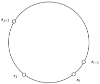
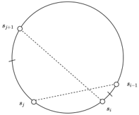
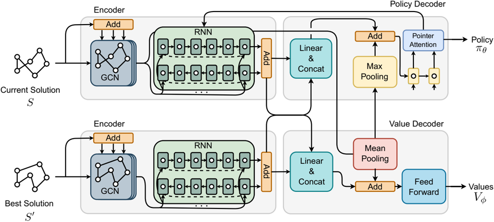
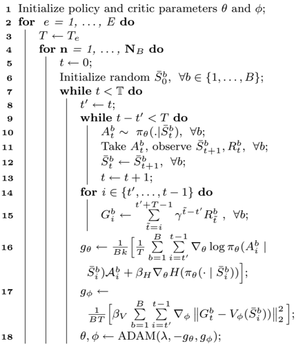
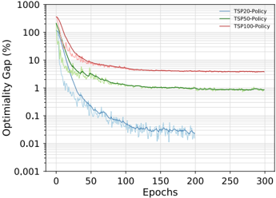
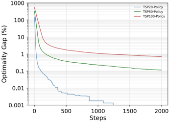
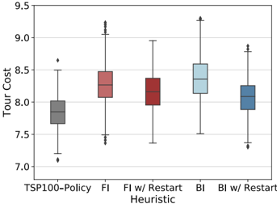

## ORIGINAL RESEARCH

## Learning 2-Opt Heuristics for Routing Problems via Deep Reinforcement Learning

Paulo da Costa 1 · Jason Rhuggenaath 1 · Yingqian Zhang  · Alp Akcay  · Uzay Kaymak 1 1 1

Received: 23 February 2021 / Accepted: 13 July 2021 / Published online: 23 July 2021

© The Author(s) 2021

## Abstract

Recent works using deep learning to solve routing problems such as the traveling salesman problem (TSP) have focused on learning construction heuristics. Such approaches find good quality solutions but require additional procedures such as beam search and sampling to improve solutions and achieve state-of-the-art performance. However, few studies have focused on improvement heuristics, where a given solution is improved until reaching a near-optimal one. In this work, we propose to learn a local search heuristic based on 2-opt operators via deep reinforcement learning. We propose a policy gradient algorithm to learn a stochastic policy that selects 2-opt operations given a current solution. Moreover, we introduce a policy neural network that leverages a pointing attention mechanism, which can be easily extended to more general  -opt moves. Our results show that k the learned policies can improve even over random initial solutions and approach near-optimal solutions faster than previous state-of-the-art deep learning methods for the TSP. We also show we can adapt the proposed method to two extensions of the TSP: the multiple TSP and the Vehicle Routing Problem, achieving results on par with classical heuristics and learned methods.

Keywords Deep reinforcement learning · Combinatorial optimization · Travelling salesman problem · Vehicle routing problem

## Introduction

The traveling salesman problem (TSP) is a well-known combinatorial optimization problem. In the TSP, given a set of locations (nodes) in a graph, we need to find the shortest tour that visits each location exactly once and returns to the departing location. The TSP is NP-hard [33] even in its Euclidean formulation, i.e., nodes are points in the 2D space. Classic approaches to solve the TSP can be classified in exact and heuristic methods. The former have been extensively studied using integer linear programming [2] which are guaranteed to find an optimal solution but are often too computationally expensive to be used in practice. The latter are based on (meta)heuristics and approximate algorithms [3] that find solutions requiring less computational time, e.g., edge swaps such as k -opt [11]. However, designed heuristics require specialized knowledge and their performances are often limited by algorithmic design.

This article is part of the topical collection 'ACML 2020' guest edited by Masashi Sugiyama, Sinno Jialin Pan, Thanaruk Theeramunkong and Wray Buntine.

This article is an extended version of [32], accepted at the 12th Asian Conference on Machine Learning, 2020.

* Paulo da Costa p.r.d.oliveira.da.costa@tue.nl

- 1 School of Industrial Engineering, Eindhoven University of Technology, 5612 AZ Eindhoven, The Netherlands

Recent works in machine learning and deep learning have focused on learning heuristics for combinatorial optimization problems [6, 27]. For the TSP, both supervised learning [18, 38] and reinforcement learning [5, 7, 20, 24, 40] methods have been proposed. The idea behind the proposed methods is that a machine learning method could learn better heuristics by extracting useful information directly from data, rather than having an explicitly programmed behavior. Most approaches to the TSP have focused on learning construction heuristics, i.e., methods that can generate a solution sequentially by extending a partial tour. These methods employed sequence representations [5, 38], graph neural networks [18, 20] and attention mechanisms [7, 24, 40] resulting in high-quality solutions. Construction methods still require additional procedures such as beam search, classical improvement heuristics, and sampling to achieve such results. This limitation hinders their applicability as it is required to revert to handcrafted improvement

Vol.:(0123456789)

SN Computer Science

heuristics and search algorithms for state-of-the-art performance. Thus, learning improvement heuristics, i.e., when a solution is improved by local moves that search for better solutions remains relevant. Here, if we can learn a policy to improve a solution, we can use it to get better solutions from a construction heuristic or even random solutions. Recently, a deep reinforcement learning method [40] has been proposed for such a task, achieving near-optional results using node swap and 2-opt moves. However, the architecture has its output fixed by the number of possible moves, making it less favorable to expand to general  -opt, leading to lower optimality gaps [12]. k

Two natural extensions of the TSP are the multiple TSP (mTSP) and the capacitated vehicle routing problem (CVRP). In the first, we consider the original problem augmented with more salesmen, constrained on the size of tours or number of visits. The CVRP also considers multiple salesmen (vehicles) with a maximum capacity. Customers have certain demand values that need to be fulfilled by vehicles without exceeding their total capacity. These problems are harder to solve than the TSP due to the added constraints and usually require tailored heuristics. Both problems have also been subject of the recent interest in combining machine learning and combinatorial optimization [8, 16, 19, 34]. However, few previously proposed models can be seamlessly used in multiple routing problems [24, 40].

In this work, we propose a deep reinforcement learning algorithm trained via Policy Gradient to learn improvement heuristics based on 2-opt moves. Our architecture is based on a pointer attention mechanism [38] that outputs nodes sequentially for action selection. We introduce a reinforcement learning formulation to learn a stochastic policy of the next promising solutions, incorporating the search's history information by keeping track of the current best-visited solution. Our results show that we can learn policies for the Euclidean TSP that achieve near-optimal solutions even when starting with poor quality solutions. Moreover, our approach can achieve better results than previous deep learning methods based on construction [5, 7, 18, 20, 24, 29, 38] and improvement [40] heuristics. Compared to [40], our method can be easily adapted to general k -opt and it is more sample efficient. Our method outperforms other effective heuristics such as Google's OR-Tools [35] for simulated instances and are close to optimal solutions. Lastly, it can be easily expanded to the mTSP and CVRP.

## Related Work

In machine learning, early works for the TSP have focused on Hopfield networks [14] and deformable template models [1]. However, the performance of these approaches has not been on par with classical heuristics [25]. Recent deep learning methods have achieved high-performance learning construction heuristics for the TSP. Pointer Networks (PtrNet) [38] learned a sequence model coupled with an attention

SN Computer Science mechanism trained to output TSP tours using solutions generated by Concorde [2]. In [5], the PtrNet was further extended to learn without supervision using Policy Gradient, trained to output a distribution over node permutations. Other approaches encoded instances via graph neural networks. A structure2vec (S2V) [20] model was trained to output the ordering of partial tours using deep Q-learning (DQN). Later, graph attention was employed to a hybrid approach using 2-opt local search on top of tours trained via Policy Gradient [7]. Graph attention was extended in [24] using REINFORCE [39] with a greedy rollout baseline, resulting in lower optimality gaps. Recently, the supervised approach was revisited using graph convolution networks (GCN) [18] learning probabilities of edges occurring in a TSP tour. It achieved stateof-the-art results up to 100 nodes whilst also combining with search heuristics.

Recent  machine  learning  approaches  specialized  for the mTSP include [19], which proposed a neural network architecture trained via supervised learning. Combined with constraint enforcing layers they can achieve competitive results in comparison to OR-Tools. In [16], multi-agent reinforcement learning is used to learn an allocation of agents to nodes, and regular optimization is used to solve TSP associated with each agent. The VRP has gained much interest since [31]. In this work, a policy gradient algorithm is proposed to generate solutions as a sequence of consecutive actions. Later, [24] extended the attention method to the VRP outperforming [31], followed by [40] who also expanded their model to the VRP case obtaining lower gaps. A specialized VRP model combined reinforcement and supervised learning to learn to construct solutions, outperforming [24], but trained on different distributions of node locations [8]. Another VRP method, named neural large neighborhood search (NLNS) [15] proposed integrating learning methods and classical search. In the method, the policy is trained to reconstruct randomly destroyed solutions. Another approach, named learn to improve (L2I) [28] considered learning improvements policies by choosing from a pool of operators. Recently, deep policy dynamic programming (DPDP) [23] was proposed with the aims to combine neural heuristics with dynamic programming. The method is trained to predict edges from example solutions and outperforms previous neural approaches solving TSPs and VRPs with 100 nodes.

It is important to previous end-to-end methods to have additional  procedures  such  as  beam  search,  classical improvement heuristics, and sampling to achieve good solutions. Thus, in this work, we encode edge information using graph convolutions and use classical sequence encoding to learn node orderings. We decode these representations via a pointing attention mechanism to learn a stochastic policy of the action selection task. In the TSP, our approach resembles classical 2-opt heuristics [10] and can outperform

Fig. 1 TSP solution before a 2-opt move (left), and after a 2-opt move (right).  Added  edges  are  represented  in  dashed  lines.  Note  that  the sequence s i , … , s j is inverted

previous deep learning methods in solution quality and sample efficiency.

## Background

## Travelling Salesman Problem

We focus on the 2D Euclidean TSP. Given an input graph, represented as a sequence of n locations in a two dimensional space X = { x i } n i = 1 , where x i ∈ [ 0, 1 ] 2 , we are concerned with finding a permutation of the nodes, i.e. a tour S = ( s 1 , … , s n ) , that visits each node once (except the starting node) and has the minimum total length (cost). We define the cost of a tour as the sum of the distances (edges) between consecutive nodes in S as L S ( ) = ‖ ‖ ‖ x s n -x s 1 ‖ ‖ ‖ 2 + ∑ n -1 i = 1 ‖ ‖ ‖ x s i -x s i + 1 ‖ ‖ ‖ 2 ,  where ‖ ‖ ⋅ 2 denotes the /u1D4C1 2 norm.

## k -Opt Heuristic for the TSP

Improvement heuristics enhance feasible solutions through a search procedure. A procedure starts at an initial solution S 0 and replaces a previous solution S t by a better solution S t + 1 .  Local search methods such as the effective Lin-Kernighan-Helsgaun (LKH) [11] heuristic perform well for the TSP. The procedure searches for k edge swaps ( k -opt moves) that will be replaced by new edges resulting in a shorter tour. A simpler version [26] considers 2-opt (Fig. 1) and 3-opt moves alternatives as these balance solution quality and the O n k ( ) complexity of the moves. Moreover, sequential pairwise operators such as k -opt moves can be decomposed in simpler  -opt ones, where l l &lt; k .  For  instance, sequential 3-opt operations can be decomposed into one, two or three 2-opt operations [11]. However, in local search algorithms, the quality of the initial solution usually affects the quality of the final solution, i.e. local search methods can easily get stuck in local optima [10]. To avoid local optima, different metaheuristics have been proposed including Simulated Annealing and Tabu Search. These work by accepting worse solutions to allow more exploration of the search space. In general, this strategy leads to better solution quality. However, metaheuristics still require expert knowledge and may have sub-optimal rules in their design. To tackle this limitation, we propose to combine machine learning and 2-opt operators to learn a stochastic policy to improve TSP solutions sequentially. A stochastic policy resembles a metaheuristic, sampling solutions in the neighborhood of a given solution, potentially avoiding local minima. Our policy iterates over feasible solutions and the minimum cost solution is returned at the end. The main idea of our method is that taking future improvements into account can potentially result in better policies than greedy heuristics.

## Reinforcement Learning Formulation

Our formulation considers solving the TSP via 2-opt as a Markov decision process (MDP), detailed below. In our MDP, a given state ̄ S is composed of a tuple of the current solution (tour) S and the lowest-cost solution S ′ seen in the search. The proposed neural architecture (Sect. 5) approximates the stochastic policy /u1D70B /u1D703 ( A S | ̄ ) , where /u1D703 represents trainable parameters. Each A = ( a 1 , a 2 ) corresponds to a 2-opt move where a 1 , a 2 are node indices. Our architecture also contains a value network that outputs value estimates V /u1D719 ( ̄ S ) , with /u1D719 as learnable parameters. We assume TSP samples drawn from the same distribution and use Policy Gradient to optimize the parameters of the policy and value networks (Sect. 6).

States A state ̄ S is composed of a tuple ̄ S = ( S S , ′ ) , where S and S ′ are the current and lowest-cost solution seen in the search, respectively. That is, given a search trajectory at time t and solution S , S t = S and S ′ t = S ′ = arg min S t ̃ ∈{ S 0 , … , S t } L S t ( ̃ ) .

Actions We model actions as tuples A = ( a 1 , a 2 ) where a 1 , a 2 ∈ { 1, … , n } , a 2 &gt; a 1 correspond to index positions of solution S = ( s 1 , … , s n ) .

Transitions Given A = ( i , j ) transitioning  to  the next  state  defines  a  deterministic  change  to  solution ̂ S = (… , s i , … , s j , …) , resulting  in  a  new  solution S = (… , s i -1 , s j , … , s i , s j + 1 …) and  state ̄ S = ( S S , ′ ) . That is, selecting   and   in i j ̂ S implies breaking edges at positions ( i -1, i ) and ( j , j + 1 ) , inserting edges ( i -1, j ) and ( i , j + 1 ) and inverting the order of nodes between   and   (Fig. 1). i j

Rewards Similar to [40], we attribute rewards to actions that can improve upon the current best-found solution, i.e., Rt = L S ( ′ t ) -L S ( ′ t + 1 ) .

Environment Our environment runs for /u1D54B steps. For each run, we define episodes of length T ≤ /u1D54B , after which a new episode starts from the last state in the previous episode. This ensures access to poor quality solutions at t = 0 , and highquality solutions as   grows. t

Returns Our objective is to maximize the expected return Gt , which is the cumulative reward starting at time step   and t

SN Computer Science

Fig. 2 In the architecture, a state ̄ S = ( S S , ′ ) is passed to a dual encoder where graph and sequence information are extracted. A policy decoder takes encoded inputs to query node indices and output actions. A value decoder takes encoded inputs and outputs state values. Figure as in [32]

finishing at T at which point no future rewards are available, i.e., Gt = ∑ T -1 t ′ = t /u1D6FE t ′ -t Rt ′ where /u1D6FE ∈ ( 0, 1 ] is a discount factor.

## Embedding Layer

## Policy Gradient Neural Architecture

Our neural network, based on an encoder-decoder architecture is depicted in Fig. 2. Two encoder units map each component of ̄ S = ( S S , ′ ) independently. Each unit reads inputs X = ( x 1 , … , x n ) ,  where x i are node coordinates of node s i in S and S ′ . The encoder then learns representations that embed both graph topology and node ordering. Given these representations, the policy decoder samples action indices a 1 , … , a k sequentially, where k = 2 for  2-opt.  The value decoder operates on the same encoder outputs but outputs real-valued estimates of state values. We detail the components of the network in the following sections.

## Encoder

The purpose of our encoder is to obtain a representation for each node in the input graph given its topological structure and its position in a given solution. We incorporate elements from GCN [22] and sequence embedding via recurrent neural networks (RNN) to accomplish this objective [13]. Furthermore, we use edge information to build a more informative encoding of the TSP graph.

We  input  two-dimensional  coordinates x i ∈ [ 0, 1 ] 2 , ∀ ∈ i 1, … , n , which are embedded to d -dimensional features as

<!-- formula-not-decoded -->

where Wx ∈ ℝ d × 2 , b x ∈ ℝ d . We use as input the Euclidean distances e i j , between coordinates x i and x j to add edge information and weigh the node feature matrix. To avoid scaling the inputs to different magnitudes we adopt symmetric normalization [22] as

<!-- formula-not-decoded -->

Then the normalized edges are used in combination with GCN layers to create richer node representations using its neighboring topology.

## Graph Convolutional Layers

In the GCN layers, we denote as x /u1D4C1 i the node feature vector at GCN layer /u1D4C1 associated with node  . We define the node feai ture at the subsequent layer combining features from nodes in the neighborhood N ( ) i of node   as i

<!-- formula-not-decoded -->

where W g /u1D4C1 ∈ ℝ d × d , b /u1D4C1 g ∈ ℝ d , /u1D70E r is the Rectified Linear Unit and N ( ) i corresponds to the remaining n -1 nodes of a complete TSP network. At the input to these layers, we have /u1D4C1 = 0 and after /u1D543 layers we arrive at representations z i = x /u1D543 i leveraging node features with the additional edge feature representation.

## Sequence Embedding Layers

Next, we use node embeddings z i to learn a sequence representation of the input and encode the ordering of nodes. Due to symmetry, a tour from nodes ( 1, … , n ) has the same cost as the tour ( n , … , 1 ) . Therefore, we read the sequence in both orders to explicitly encode the symmetry of a solution and the order of the nodes. To accomplish this objective, we employ two Long short-term memory (LSTM) as our RNN functions, computed using hidden vectors from the previous node in the tour and the current node embedding resulting in

<!-- formula-not-decoded -->

<!-- formula-not-decoded -->

where in (4) a forward RNN goes over the embedded nodes from left to right, in (5) a backward RNN goes over the nodes from right to left and h i , c i ∈ ℝ d are hidden vectors. We point out the RNN modules are included to impose order in the tour for the policy decoder. That is, the bi-LSTM imposes ordering for the 2-opt operation and aids node (edge swap) selection. With the bidirectional orderings, even if the same tour is observed in one of its circular permutations, the predecessor and successor information of each node is maintained, which helps edge selection, i.e., remove ( i -1, i ) , ( j , j + 1 ) and add ( i -1, j ) , ( i , j + 1 ) . Note that a 2-opt move only requires the difference between the costs of the removed and inserted edges.

Our representation reconnects back to the first node in the  tour  ensuring  we  construct  a  sequential  representation of the complete tour, i.e. ( h → 0 , c → 0 ) = RNN ( z n , 0 ) and ( h ← n + 1 , c ← n + 1 ) = RNN ( z 1 , 0 ) . Afterwards, we combine forward and backward representations to form unique node representations in a tour as o i = tanh (( Wf h → i + b f ) + ( Wbh i ← + b b )) , and a tour representation h n = h → n + h ← n , where h i , o i ∈ ℝ d , Wf , Wb ∈ ℝ d × d and b f , b b ∈ ℝ d .

## Dual Encoding

In our formulation, a state ̄ S = ( S S , ′ ) is represented as a tuple of the current solution S and the best solution seen so far S ′ . For that reason, we encode both S and S ′ using independent encoding layers (Fig. 2). We abuse notation and define a sequential representation of S ′ after going through encoding layers as h ′ n ∈ ℝ d . Note that in the proposed MDP, it is necessary to know the cost of the best solution seen in the search to be able to compute the rewards. Thus, we consider that the agent has full information about the state space necessary to compute the cost improvement over the best seen solution.

## Policy Decoder

We aim to learn the parameters of a stochastic policy /u1D70B /u1D703 ( A S | ̄ ) that given a state ̄ S , assigns high probabilities to moves that reduce the cost of a tour. Following [5], our architecture uses the chain rule to factorize the probability of a k -opt move as

<!-- formula-not-decoded -->

and then uses individual softmax functions to represent each term on the RHS of (6), where a i corresponds to node positions in a tour, a &lt; i represents previously sampled nodes and k = 2 .  At each output step i , we map the tour embedding vectors to the following query vector

<!-- formula-not-decoded -->

where Wq , Wo ∈ ℝ d × d , b q , b o ∈ ℝ d × d are learnable parameters and o 0 ∈ ℝ d is a fixed parameter initialized from a uniform distribution U ( -1 √ d , 1 √ d ) . Our initial query vector q 0 receives t h e t o u r r e p r e s e n t a t i o n f r o m S and S ′ as h s ̄ = Ws h n + b s ‖ Ws h ′ ′ n + b s ′ and a max pooling graph representation z g = max ( z 1 , … , z n ) from S to form q 0 = h s ̄ + z g , where learnable parameters Ws , Ws ′ ∈ ℝ d 2 × d , b s , b s ′ ∈ ℝ d 2 and ⋅ ‖ ⋅ represents the concatenation operation. Our query vectors q i interact with a set of n vectors to define a pointing distribution over the action space. As soon as the first node is sampled, the query vector updates its inputs with the previously sampled node using its sequential representation to select the subsequent nodes.

## Pointing Mechanism

We use a pointing mechanism to predict a distribution over node outputs given encoded actions (nodes) and a state representation (query vector). Our pointing mechanism is parameterized by two learned attention matrices K ∈ ℝ d × d and Q ∈ ℝ d × d and vector v ∈ ℝ d as

<!-- formula-not-decoded -->

where p /u1D703 ( a i ∣ a &lt; i , ̄ S ) = softmax ( C tanh ( u i )) predicts a distribution over n actions, given a query vector q i with u i ∈ ℝ n . We mask probabilities of nodes prior to the current a i as we only consider choices of nodes in which a i &gt; a i -1 due to

SN Computer Science

symmetry. This ensures a smaller action space for our model, i.e. n n ( -1 )∕ 2 possible feasible permutations of the input. We clip logits in [-C , + C ] [5], where C ∈ ℝ is a parameter to control the entropy of u i .

## Value Decoder

Similar to the policy decoder, our value decoder works by reading tour representations from S and S ′ and a graph representation from S . That is, given embeddings Z the value decoder works by reading the outputs z i for each node in the tour and the sequence hidden vectors h n , h ′ n to estimate the value of a state as

<!-- formula-not-decoded -->

with h v = Wv h n + b v ‖ Wv h ′ ′ n + b v ′ . Where Wz ∈ ℝ d × d , Wr ∈ ℝ 1 × d , b z ∈ ℝ d , b r ∈ ℝ are  learned  parameters  that map the state representation to a real valued output and Wv , Wv ′ ∈ ℝ d 2 × d , b v , b v ′ ∈ ℝ d 2 map the tours to a combined value representation. We use a mean pooling operation in (9) to combine node representations z i in a single graph representation. This vector is then combined with the tour representation h v to estimate current state values.

## Policy Gradient Optimization

In our formulation, we maximize the expected rewards given a state ̄ S defined as J ( /u1D703 | ̄ S ) = /u1D53C /u1D70B /u1D703 [ Gt | ̄ S ] . Thus, during training, we define the total objective over a distribution S of uniformly distributed TSP graphs (solutions) in [ 0, 1 ] 2 as J ( /u1D703 ) = /u1D53C ̄ S ∼ S [ J ( /u1D703 | ̄ S )] . To optimize our policy we resort to the Policy Gradient learning rule, which provides an unbiased gradient estimate w.r.t. the model's parameters /u1D703 .  During training, we draw B i.i.d. transitions and approximate the gradient of J ( /u1D703 ) , indexed at t = 0 as

<!-- formula-not-decoded -->

where the advantage function is defined as A b t = G b t -V /u1D719 ( ̄ S b t ) and the superscript b represents a transition sample from the the mini-batch of size B, i.e., b ∈ { 1, … , B } . To avoid premature convergence to a sub-optimal policy [30], we add an entropy bonus

<!-- formula-not-decoded -->

SN Computer Science with H ( /u1D70B /u1D703 ( ⋅ ∣ ̄ S b t )) = -/u1D53C /u1D70B /u1D703 [ log /u1D70B /u1D703 ( ⋅ ∣ ̄ S b t )] , and  similarly to (10) we normalize values in (11) dividing by k , i.e., the number of indices to select ( k = 2 for 2-opt). Moreover, we increase the length of an episode after a number of epochs, i.e. at epoch e , T is replaced by T e .  The value network is trained on a mean squared error objective between its predictions and Monte Carlo estimates of the returns, formulated as an additional objective

<!-- formula-not-decoded -->

Afterward, we combine the previous objectives and perform gradient updates via Adaptive Moment Estimation (ADAM) [21], with /u1D6FD H , /u1D6FD V representing weights of (11) and (12), respectively. Our model is close to REINFORCE [39] and periodic episode length updates. In our case, this is beneficial as at the start the agent learns how to behave over small episodes for easier credit assignment, later tweaking its policy over larger horizons. The complete algorithm is depicted in Algorithm 1.

## Algorithm 1: Policy Gradient Training

Input: Policy network π θ , critic network V φ , number of epochs E , number of batches N B , batch size B , step limit T , length of episodes T e , learning rate λ

## Experiments and Results

We conduct extensive experiments to investigate the performance of our proposed method. We consider three benchmark tasks, Euclidean TSP with 20, 50, and 100 nodes,

TSP20, TSP50, and TSP100 respectively. For all tasks, node coordinates are drawn uniformly at random in the unit square [ 0, 1 ] 2 during training. For validation, a fixed set of TSP instances with their respective optimal solutions is used for hyperparameter optimization. For a fair comparison, we use the same test dataset as reported in [18, 24] containing 10,000 instances for each TSP size. Thus, previous results reported in [24] are comparable to ours in terms of solution quality (optimality gap). Results from [40] are not measured in the same data but use the same data generation process. Thus, we report the optimality gaps reported in the original paper. Moreover, we report running times reported in [18, 24, 40]. Since time can vary due to implementations and hardware, we rerun the method of [24] in our hardware. Due to provided supervised samples, the method of [18] is not ideal for combinatorial problems. Thus, we compare our results in more detail to [24] (running time and solution quality) and [40] (solution quality and sample efficiency).

## Experimental Settings

All our experiments use a similar set of hyperparameters defined manually using the validation performance. We use a batch size B = 512 for TSP20 and TSP50 and B = 256 for TSP100 due to GPU memory. For this reason, we generate 10 random mini-batches for TSP20 and TSP50 and 20 minibatches for TSP100 in each epoch. TSP20 trains for 200 epochs as convergence is faster for smaller problems, whereas TSP50 and TSP100 train for 300 epochs. We use the same /u1D6FE = 0.99 , /u1D4C1 2 penalty of 1 × 10 -5 and learning rate /u1D706 = 0.001 , /u1D706 decaying by 0.98 at each epoch. Loss weights are /u1D6FD V = 0.5 , /u1D6FD H = 0.0045 for TSP20 and TSP50, /u1D6FD H = 0.0018 for TSP100. /u1D6FD H decays by 0.9 after every epoch for stable convergence. In all tasks, d = 128 , /u1D543 = 3 and we employ one bi-LSTM block. The update in episode lengths are T 1 = 8, T 100 = 10, T 150 = 20 for  TSP  20; T 1 = 8, T 100 = 10, T 200 = 20 for  TSP50;  and T 1 = 4, T 100 = 8, T 200 = 10 for TSP100. C = 10 is used during training and testing. v is initialized as U ( -1 √ d , 1 √ d ) and remaining parameters are initialized according to PyTorch's default parameters.

We train on an RTX 2080Ti GPU, generating random feasible initial solutions on the fly at each epoch. Each epoch takes an average time of 2 m 01 s, 3 m 05 s, and 7 m 16 s for TSP20, TSP50, and TSP100, respectively. We clip rewards to 1 to favor non-greedy actions and stabilize learning. Due to GPU memory, we employ mixed precision training [17] for TSP50 and TSP100. For comparison with [40], we train for a maximum step limit of 200. Note that our method is more sample efficient than the proposed in [40], using 50% and 75% of the total samples for TSP20 and TSP50/100 during training. During testing, we run our policy for 500, 1000, and 2000 steps to compare to previous works. Our implementation is available online . 1

## Experimental Results and Analysis

We learn TSP20, TSP50, and TSP100 policies and depict the optimality gap and its exponential moving average in the log scale in Fig. 3. The optimality gap is averaged over 256 validation instances and 200 steps (same as training) in the figure. The results show that we can learn effective policies that decrease the optimality gap over the training epochs. We also point out that increasing the episode length improved validation performance as we consider longer planning horizons in (10). Moreover, it is interesting to note that the optimality gap grows with the instance size as solving larger TSP instances is harder. Additionally, we report the gaps of the best performing policies in Fig. 4. In the figure, we show the optimality gap of the best solution for 512 test instances over 2000 steps. Here, results show that we can quickly reduce the optimality gap initially and later steps attempt to fine-tune the best tour. In the experiments, we find the optimal solution for TSP20 instances and stay within optimality gaps of 0.1% for TSP50 and 0.7% for TSP100. Overall, our policies can be seen as a solver requiring only random initial solutions and sampling to achieve near-optimal solutions.

To showcase that, we compare the learned policies with classical 2-opt first improvement (FI) and best improvement (BI) heuristics, which select the first and best cost-reducing 2-opt operation, respectively. Since local search methods can get stuck in local optima, we include a version of the heuristics using restarts . We restart the search at a random solution as soon as we reach a local optimum. We run all heuristics and learned policies on 512 TSP100 instances for a maximum of 1000 steps starting from the same solutions. The boxplots in Fig. 5 depict the results. We observe that our policy (TSP100-Policy) outperforms classical 2-opt heuristics finding tours with lower median and less dispersion. These results support our initial hypothesis that considering future rewards in the choice of 2-opt moves leads to better solutions. Moreover, our method avoids the worst case O n ( 2 ) complexity of selecting the next solution of FI and BI.

## Comparison to Classical Heuristics, Exact and Learning Methods

We report results on the same 10,000 instances for each TSP size as in [24] and rerun the optimal results obtained by Concorde to derive optimality gaps. We compare against nearest, random and farthest insertion constructions heuristics. and

1 https://  github.  com/  paulo  rocos  ta/  learn  ing-  2opt-  drl.

SN Computer Science

Fig. 3 Optimality gaps on 256 validation instances for 200 steps over training epochs. From [32]

Fig. 4 Optimality  gaps  of  best  found  tours  on  512  testing  instances over 2000 sampling steps. From [32]

include the vehicle routing solver of OR-Tools [35] containing 2-opt and LKH as improvement heuristics.

We add to the comparison recent deep learning methods based on construction and improvement heuristics, including supervised [18, 38] and reinforcement [5, 7, 20, 24, 40] learning methods. We note, however, that supervised learning is not ideal for combinatorial problems due to the lack of optimal labels for large problems. Previous works to [24] are presented with their reported running times and optimality gaps as in the original paper. For recent works, we present the optimality gaps and running times as reported in [18, 24, 40]. We report previous results using greedy, sampling and search decoding and refer to the methods by their neural network architecture. We note that the test dataset used in [40] is not the same but the data generation process and size are identical. This fact allied with the high number of samples decreases the variance of the results. We focus our attention on GAT [24] and GAT-T [40] (GAT-Transformer) representing the best construction and improvement heuristic, respectively. Note that we do not include LKH for the TSP as it achieves optimal results. Note that for the TSP, new works such as the ones in [23] appeared after the first version of this article and are not included in the results table.

SN Computer Science

Fig. 5 Tour  costs  of  learned,  FI  and  BI  heuristics  with  restarts  on TSP100 instances after 1000 steps. From [32]

Our results, in Table 1, show that with only 500 steps our method outperforms traditional construction heuristics,  learning  methods with greedy decoding and ORTools achieving 0.01 % , 0.36 % and 1.84 % optimality gap for TSP20, TSP50, and TSP100, respectively. Moreover, we outperform GAT-T requiring half the number of steps (500 vs 1000). We note that with 500 steps, our method also outperforms all previous reinforcement learning methods using sampling or search, including GAT [7] applying 2-opt local search on top of generated tours. Our method only falls short of the supervised learning method GCN [18], using beam search and shortest tour heuristic. However, GCN [18], similar to samples in GAT [24], uses a beam width of 1280, i.e. it samples more solutions. Increasing the number of samples (steps) increases the performance of our method. When sampling 1000 steps (280 samples short of GCN [18] and GAT [24]) we outperform all previous methods that do no employ further local search improvement and perform on par with GAT-T on TSP50, using 5000 samples (5 times as many samples). For TSP100, sampling 1000 steps results in a lower optimality gap ( 1.26 % ) than all compared methods. Lastly, increasing the sample size to 2000 results in even lower gaps, 0.00 % (TSP20), 0.12 % (TSP50) and 0.87 % (TSP100).

## Testing Learned Policies on Larger Instances

Since we are interested in learning general policies that can solve the TSP regardless of its size, we test the performance of our policies when learning on TSP50 instances (TSP50Policy) and applying on larger TSP100 instances. Results, in Table 2, show that we can extract general enough information to still perform well on 100 nodes. Similar to a TSP100Policy, our TSP50-Policy can outperform previous reinforcement learning construction approaches and requires fewer samples. With 1000 samples TSP50-Policy performs similar to GAT-T [40] using 3000 samples, at 1.86 % optimality gap. These results are closer to optimal than previous learning

Table 1 Performance of TSP methods w.r.t. Concorde

|                  | Method             | Type     | TSP20                    | TSP20                      | TSP20   | TSP50                    | TSP50                      | TSP50   | TSP100                   | TSP100                     | TSP100   |
|------------------|--------------------|----------|--------------------------|----------------------------|---------|--------------------------|----------------------------|---------|--------------------------|----------------------------|----------|
|                  |                    |          | Cost                     | Gap                        | Time    | Cost                     | Gap                        | Time    | Cost                     | Gap                        | Time     |
|                  | Concorde [2]       | Solver   | 3.84                     | 0.00 %                     | (1 m)   | 5.70                     | 0.00 %                     | (2 m)   | 7.76                     | 0.00 %                     | (3 m)    |
| Heuristics       | OR-Tools [35]      | S        | 3.85                     | 0.37 %                     |         | 5.80                     | 1.83 %                     |         | 7.99                     | 2.90 %                     |          |
|                  | Nearest insertion  | G        | 4.33                     | 12.91 %                    | (1 s)   | 6.78                     | 19.03 %                    | (2 s)   | 9.46                     | 21.82 %                    | (6 s)    |
|                  | Random insertion   | G        | 4.00                     | 4.36 %                     | (0 s)   | 6.13                     | 7.65 %                     | (1 s)   | 8.52                     | 9.69 %                     | (3 s)    |
|                  | Farthest insertion | G        | 3.93                     | 2.36 %                     | (1 s)   | 6.01                     | 5.53 %                     | (2 s)   | 8.35                     | 7.59 %                     | (7 s)    |
| Const. + greedy  | PtrNet [38]        | SL       | 3.88                     | 1.15 %                     |         | 7.66                     | 34.48 %                    |         | -                        |                            |          |
|                  | GCN [18]           | SL       | 3.86                     | 0.60 %                     | (6 s)   | 5.87                     | 3.10 %                     | (55 s)  | 8.41                     | 8.38 %                     | (6 m)    |
|                  | PtrNet [5]         | RL       | 3.89                     | 1.42 %                     |         | 5.95                     | 4.46 %                     |         | 8.30                     | 6.90 %                     |          |
|                  | S2V [20]           | RL       | 3.89                     | 1.42 %                     |         | 5.99                     | 5.16 %                     |         | 8.31                     | 7.03 %                     |          |
|                  | GAT [7]            | RL, T    | 3.85                     | 0.42 %                     | (4 m)   | 5.85                     | 2.77 %                     | (26 m)  | 8.17                     | 5.21 %                     | (3 h)    |
|                  | GAT [24]           | RL       | 3.85                     | 0.34 %                     | (0 s)   | 5.80                     | 1.76 %                     | (2 s)   | 8.12                     | 4.53 %                     | (6 s)    |
| Const. + search  | GCN [18]           | SL, B    | 3.84                     | 0.10 %                     | (20 s)  | 5.71                     | 0.26 %                     | (2 m)   | 7.92                     | 2.11 %                     | (10 m)   |
|                  | GCN [18]           | SL, BS   | 3.84                     | 0.01 %                     | (12 m)  | /u1D7D3 . /u1D7D5/u1D7CE | /u1D7CE . /u1D7CE/u1D7CF % | (18 m)  | 7.87                     | 1.39 %                     | (40 m)   |
|                  | PtrNet [5]         | RL, S    | -                        |                            |         | 5.75                     | 0.95 %                     |         | 8.00                     | 3.03 %                     |          |
|                  | GAT [7]            | RL, S    | 3.84                     | 0.11 %                     | (5 m)   | 5.77                     | 1.28 %                     | (17 m)  | 8.75                     | 12.70 %                    | (56 m)   |
|                  | GAT [7]            | RL, S, T | 3.84                     | 0.09 %                     | (6 m)   | 5.75                     | 1.00 %                     | (32 m)  | 8.12                     | 4.64 %                     | (5 h)    |
|                  | GAT {1280} [24]    | RL, S    | 3.84                     | 0.08 %                     | (5 m)   | 5.73                     | 0.52 %                     | (24 m)  | 7.94                     | 2.26 %                     | (1 h)    |
| Impr. + sampling | GAT-T {1000} [40]  | RL       | 3.84                     | 0.03 %                     | (12 m)  | 5.75                     | 0.83 %                     | (16 m)  | 8.01                     | 3.24 %                     | (25 m)   |
|                  | GAT-T {3000} [40]  | RL       | 3.84                     | 0.00 %                     | (39 m)  | 5.72                     | 0.34 %                     | (45 m)  | 7.91                     | 1.85 %                     | (1 h)    |
|                  | GAT-T {5000} [40]  | RL       | 3.84                     | 0.00 %                     | (1 h)   | 5.71                     | 0.20 %                     | (1 h)   | 7.87                     | 1.42 %                     | (2 h)    |
|                  | Ours {500}         | RL       | 3.84                     | 0.01 %                     | (5 m)   | 5.72                     | 0.36 %                     | (7 m)   | 7.91                     | 1.84 %                     | (10 m)   |
|                  | Ours {1000}        | RL       | /u1D7D1 . /u1D7D6/u1D7D2 | /u1D7CE . /u1D7CE/u1D7CE % | (10 m)  | 5.71                     | 0.21 %                     | (13 m)  | 7.86                     | 1.26 %                     | (21 m)   |
|                  | Ours {2000}        | RL       | /u1D7D1 . /u1D7D6/u1D7D2 | /u1D7CE . /u1D7CE/u1D7CE % | (15 m)  | 5.70                     | 0.12 %                     | (29 m)  | /u1D7D5 . /u1D7D6/u1D7D1 | /u1D7CE . /u1D7D6/u1D7D5 % | (41 m)   |

Type: SL supervised learning, RL reinforcement learning, S sampling, G greedy, B beam search, BS B and shortest tour, T 2-opt local search. Time: time to solve 10,000 instances reported in [18, 24, 40] and ours. From [32]

Best performances are marked in bold methods without further local search improvement as in GCN [18]. When increasing to 2000 steps, we outperform all compared methods at 1.37 % optimality gap.

## Running Times and Sample Efficiency

Comparing running times is difficult due to varying hardware and implementations among different approaches. In Table 1, we report the running times to solve 10,000 instances as reported in [18, 24, 40] and ours. We focus on learning methods, as classical heuristics and solvers are efficiently implemented using multi-threaded CPUs. We note that our method cannot compete in speed with greedy methods as we start from poor solutions and require sampling to find improved solutions. This is neither surprising nor discouraging, as one can see these methods as a way to generate initial solutions for an improvement heuristic like ours. We note, however, that while sampling 1000 steps, our method is faster than GAT-T [40] even though we use a less powerful GPU (RTX 2080Ti vs Tesla V100). Moreover, our method requires fewer samples to achieve superior performance. The comparison to GAT [24]

is not so straightforward as they use a GTX 1080Ti and a different number of samples. For this reason, we run GAT [24] using our hardware and report running times sampling the same number of solutions in Table 4. Our method is slower for TSP20 and TSP50 sampling 2000 solutions. However, as we reach TSP100, our method can be computed faster and, overall, requires less time to produce shorter tours.

Table 2 Performance  of  policies  trained  on  50  and  100  nodes  on TSP100 instances

| Steps   | TSP100-Policy   | TSP100-Policy   | TSP50-Policy   | TSP50-Policy   |
|---------|-----------------|-----------------|----------------|----------------|
|         | Cost            | Gap             | Cost           | Gap            |
| 500     | 7.91            | 1.84 %          | 7.98           | 2.78 %         |
| 1000    | 7.86            | 1.26 %          | 7.91           | 1.86 %         |
| 2000    | 7.83            | 0.87 %          | 7.87           | 1.37 %         |

From [32]

SN Computer Science

Table 3 Ablation studies on 512 TSP50 instances running policies for 1000 steps

|                       | Epoch: 10     | Epoch: 10   | Epoch: 200    | Epoch: 200   |
|-----------------------|---------------|-------------|---------------|--------------|
|                       | Opt. gap (%)  | Cost        | Opt. gap (%)  | Cost         |
| Proposed              | 3.00 ±0.08    | 5.87        | 0.22 ±0.01    | 5.72         |
| (a) w/o bi-LSTM       | 203.87 ± 0.61 | 17.33       | 134.42 ± 0.56 | 13.37        |
| (b) w/o GCN           | 9.74 ± 0.08   | 6.26        | 0.30 ± 0.01   | 5.72         |
| (c) w/o bidirectional | 17.94 ± 0.15  | 6.73        | 2.20 ± 0.05   | 5.82         |
| (d) w/o best solution | 4.55 ± 0.04   | 5.96        | 0.22 ±0.02    | 5.72         |
| (e) shared encoder    | 5.15 ± 0.06   | 6.00        | 0.23 ± 0.01   | 5.72         |

From [32]

Lowest gaps are marked in bold

## Ablation Study

In Table 3, we present an ablation study of the proposed method. We measure the performance at the beginning and towards the end of training, i.e. at epochs 10 and 200, rolling out policies for 1000 steps for 512 TSP50 instances and 10 trials. We point out that our main objective is to find good policies as early as possible. In other words, good policies found earlier are considered better than waiting more time to obtain the same results. We observe that removing the LSTM (a) affects performance the most leading to a large 134.42% gap at epoch 200. Removing the GCN component (b) has a lower influence but also reduces the overall quality of policies, reaching 0.30% optimality gap. We then test the effect of the bidirectional LSTM (c) replacing it by a single LSTM. In this case, gaps are even higher, at 2.20%, suggesting that encoding the symmetry of the tours is important. We also compare to two variants of the proposed model, one that does not take as input the best solution (d) and one that shares the parameters of the encoding units (e). For these cases, we note that the final performance is similar to the proposed method, i.e. 0.22% optimality gap. However, in our experiments, the proposed method can achieve better policies faster, reaching a 3.0% gap at epoch 10, whereas (d) and (e) yield policies at the 4.55% and 5.15% level, respectively.

## Generalization to Real-World TSP Instances

In Table 5, we study the performance of our method on TSPlib [36] instances. In general, these instances come from different node distributions than those seen during training and it is unclear whether our learned policies can be reused for these cases. We compare the results of the policy trained on TSP100 sampling actions for 2000 steps to results obtained from OR-Tools. We note that of 35 instances tested, our method outperforms OR-Tools in 12 instances. These results are encouraging as OR-Tools is a very specialized heuristic solver. When we compare optimality gaps 8.61% (ours) and 3.70%, we see that our learned policies are not too far from OR-Tools even though our method never trains on instances with more than 100 nodes. The difference in performance increases for large instances, indicating that fine-tuning or training policies for more nodes and different distributions can potentially reduce this difference. However, similar to the results in Table 2, our method still can achieve good results on instances with more than 100 nodes, such as ts225 (0.86% gap).

## Expanding to Other Routing Problems

## The Multiple Traveling Salesmen Problem

The multiple TSP (mTSP) [4] is an extension to the original TSP that includes a number of salesmen m starting and ending their tours at a depot location. The goal is to construct tours for the m salesmen such that the total cost of the tours is minimized. In our formulation, we include an extra depot node with index 0 and coordinates x 0 ∈ ℝ 2 and the remaining customer nodes { 1, … , n } . Since adding more salesmen without any imposed constraint would lead to the same solution

Table 4 Performance of GAT [24] vs our method

| Method      | TSP20   | TSP20   | TSP50   | TSP50   | TSP100   | TSP100     |
|-------------|---------|---------|---------|---------|----------|------------|
|             | Cost    | Time    | Cost    | Time    | Cost     | Time       |
| GAT {500}   | 3.839   | (3 m)   | 5.727   | (10 m)  | 7.955    | (27 m)     |
| Ours {500}  | 3.836   | (5 m)   | 5.716   | (7 m)   | 7.907    | (10 m)     |
| GAT {1000}  | 3.838   | (4 m)   | 5.725   | (14 m)  | 7.947    | (42 m)     |
| Ours {1000} | 3.836   | (10 m)  | 5.708   | (13 m)  | 7.861    | (21 m)     |
| GAT {2000}  | 3.838   | (5 m)   | 5.722   | (22 m)  | 7.939    | (1 h 13 m) |
| Ours {2000} | 3.836   | (15 m)  | 5.703   | (29 m)  | 7.832    | (41 m)     |

Results are compared on the same hardware sampling the same number of solutions. From [32] Lowest times are marked in bold

SN Computer Science

Table 5 Performance of OR-Tools vs our method on TSPlib instances

| Instance      | Opt.    | Ours {2000}   | OR-Tools   |
|---------------|---------|---------------|------------|
| eil51         | 426     | 427           | 439        |
| berlin52      | 7542    | 7974          | 7944       |
| st70          | 675     | 680           | 683        |
| eil76         | 538     | 552           | 548        |
| pr76          | 108,159 | 111,085       | 110,948    |
| rat99         | 1211    | 1388          | 1284       |
| rd100         | 7910    | 7944          | 8221       |
| kroA100       | 21,282  | 23,751        | 21,960     |
| kroB100       | 22,141  | 23,790        | 22,945     |
| kroC100       | 20,749  | 22,672        | 21,699     |
| kroD100       | 21,294  | 23,334        | 22,439     |
| kroE100       | 22,068  | 23,253        | 22,551     |
| eil101        | 629     | 635           | 650        |
| lin105        | 14,379  | 16,156        | 15,363     |
| pr107         | 44,303  | 54,378        | 44,573     |
| pr124         | 59,030  | 59,516        | 60,413     |
| bier127       | 118,282 | 121,122       | 121,729    |
| ch130         | 6110    | 6175          | 6329       |
| pr136         | 96,772  | 98,453        | 102,813    |
| pr144         | 58,537  | 61,207        | 59,286     |
| ch150         | 6528    | 6597          | 6733       |
| kroA150       | 26,524  | 30,078        | 27,503     |
| kroB150       | 26,130  | 28,169        | 26,671     |
| pr152         | 73,682  | 75,301        | 75,832     |
| u159          | 42,080  | 42,716        | 43,403     |
| rat195        | 2323    | 2955          | 2375       |
| kroA200       | 29,368  | 32,522        | 29,874     |
| ts225         | 126,643 | 127,731       | 127,763    |
| tsp225        | 3919    | 4354          | 4117       |
| pr226         | 80,369  | 91,560        | 83,113     |
| gil262        | 2378    | 2490          | 2517       |
| pr264         | 49,135  | 59,109        | 51,495     |
| a280          | 2579    | 2898          | 2742       |
| pr299         | 48,191  | 59,422        | 50,617     |
| pr439         | 107,217 | 143,590       | 117,171    |
| Avg. opt. gap | 0.00%   | 8.61%         | 3.70%      |

From [32]

Lowest costs among OR-Tools and ours are marked in bold as the TSP, we include two additional constraints in the problem formulation, (1) each salesman needs to be utilized in a feasible solution and (2) in a given salesman tour at least /u1D708 = 2 nodes have to be visited, excluding the depot. The latter ensures that a tour cannot be formed by visiting just one node and returning to the depot, reducing the remaining problem to a TSP with n -1 nodes. The remaining constraints are usual TSP constraints.

## Instance Generation

We follow the same instance generation procedure as for the TSP, i.e., we draw n + 1 nodes (including the depot) at random from a uniform distribution in the 0-1 square.

## Initial Solution Generation

We represent a solution S to the mTSP, as an ordered list of nodes, S = ( s 1 , … , s p ) , where s i ∈ { 0, … , n } . In our solution, each tour is represented by adding the depot index at the beginning and ending of each tour without repetition. For example, a solution with two tours and n = 5 is represented as S = ( 0, 1, 2, 0, 4, 3, 5, 0 ) , where the first tour visits nodes 0, 1, 2 and 0 and the second tour visits nodes 0, 4, 3, 5 and 0. The size of a solution p depends on n (number of customers) and m (number of salesmen) and it is expressed as p = n + m + 1 .

We generate initial solutions by first sampling instances and then breaking the canonical ordering of nodes into m tours. We start from a solution containing all the nodes, i.e. S = ( 0, 1 … , n ) and find the depot positions of the tours by first computing the number of required splits /u1D702 = ⌊ n m ⌋ , then for m -1 depot positions (the last depot position is always at the end of the solution), we find the indices of the depot by:

<!-- formula-not-decoded -->

and we insert each depot at its corresponding index. Lastly, we add a depot to the end of the solution S , ensuring we have short and long tours in a given initial solution.

## mTSP Neural Architecture

Encoder We use the same encoding architecture for the mTSP as for the TSP, however, the embedding layer and the /u1D543 GCN layers operate only on the n + 1 node coordinates of the underlying instance graph assuring we only encode the information about the instance. That is,

<!-- formula-not-decoded -->

here we abuse notation and define x i as the coordinates of node i ∈ { 0, … , n } . The RNN layers then take as input the graph embedded node features and proceed to perform the solution encoding, i.e.,

<!-- formula-not-decoded -->

<!-- formula-not-decoded -->

where z i corresponds to the node features of node s i ,  i.e, z i ∈ { x /u1D543 0 , .., x /u1D543 n } , and z i = x /u1D543 s i .

SN Computer Science

## Tour Length Constraints and Masking

Without loss of generality, the first action selection masks all the depot positions and the last customer node at the end of the last tour. Then the second action considers only customer nodes indices that are greater than the index a 1 that when selected result in the tour with the minimum length to be greater or equal than    . Let /u1D708 c S a ( , 1 , j ) = min ( c 1 ( S a , 1 , j ) , … , c m ( S a , 1 , j )) , denote the number of customer nodes in the shortest tour in the resulting solution when applying the 2-opt operation defined by ( a 1 , j ) to a solution S , then the masking becomes

<!-- formula-not-decoded -->

where ̃ u i j = v T tanh ( Koj + Qqi ) .  To encode the previous masking, we keep track of an auxiliary indicator b i ∈ {-1, 0, 1 } , where i ∈ { 1, … , p } , representing if a node is right before (-1), after (1) or further away (0) from a depot when traversing  the  solution  from  left  to  right.  Thus,  checking  if c S a ( , 1 , j ) ≥ 2 can be achieved by

<!-- formula-not-decoded -->

## Training and Experimental Parameters

We make a few modifications to the training parameters. Compared to the TSP, we reduce the size of the mini-batches to 64, 128 and 256 for mTSP20, 50, and 100, respectively. This modification allows for faster training when using a more complex masking operation and longer solutions. We train models on instance problems with two values of m ∈ { 2, 4 } . Similar to the TSP, we sample 10 mini-batches at each epoch and train mTSP20 for 200 epochs and mTSP50 for 300 epochs. To avoid high training times of mTSP100, we use the best learned policy on mTSP50 as a warm-start for mTSP100 and train for 100 epochs. Our random initial solutions are far from optimality with costs 11.51, 26.98, 52.78 for m = 2 and 12.46, 27.94, 53.80 for m = 4 over the increasing instance sizes. Each epoch takes on average 2m, 6m, and 10m for mTSP20, 50, and 100, respectively. We run two sets of experiments, one containing 1000 instances to mitigate the high running times of our baselines and one with 10,000 instances to be comparable with the TSP experiments. The remaining parameters of the model remain the same as for the TSP.

## Experimental Results and Analysis

We apply the learned policies sampling 2000 solutions on each of the 1000 and 10,000 set of instances to assess the performance of our method. We compare the performance to an Integer Linear Programming (ILP) formulation of the problem running the Gurobi solver [9] for a max of 30 s for each instance. We also include the highly effective LKH3 [12] heuristic as a baseline as it balances solution quality and speed and is the state-of-the-art algorithm for several routing problems. We implement both baselines in a serialized manner. This is comparable to our results as even though we sample actions in batches taking advantage of batch parallelization of GPUs, we perform the 2-opt actions in series.

Comparison to Exact and Heuristics Baselines The results for the set of 1000 instances are presented in Table 6. We observe that the learned policies are close to the performances of both Gurobi and LKH3 when solving instances with 20 nodes with 0.02%, 0.08% optimality gaps, respectively. Similar to the TSP the gap increases as we increase the size of the instances. Moreover, as we increase the size of the instances the performance of Gurobi running for just 30 s decreases considerably taking significantly longer (8h) and yielding results far from LKH3. On the other hand, our learned policies remain much closer (1.69% for 2TSP100, 1.91%for 4TSP100) to the best results found by LKH3 whilst requiring less time.

We also present the results on 10,000 instances as these should provide better estimates of the performance of our policies. We present the results in Table 7. Since Gurobi does not scale we only provide the results from Gurobi for mTSP20. The results are similar to those obtained in 1000 instances with our model finding close costs to those found by LKH3, whilst requiring less running time than the heuristic.

## The Capacitated Vehicle Routing Problem

In the Capacitated Vehicle Routing Problem (CVRP) [37], each customer node has an associated demand and multiple routes should be constructed starting and ending at a depot. The CVRP is a generalization of the mTSP. It considers that each vehicle (salesman) has a given capacity and that tours have to be formed such that the combined demand of all customers does not exceed the capacity of the vehicles.

Similar to mTSP, we add an extra depot node with index 0 and coordinates x 0 ∈ ℝ 2 and consider the remaining nodes as customer nodes. We adopt the same formulation as in [24, 31], and define a capacity D for a single vehicle traversing all the routes. We associate each customer node i ∈ { 1, … , n } with a demand 0 ≤ /u1D6FF i ≤ D . Each route should start and end at the depot and should not exceed the total capacity of the vehicle. Similar to [24], we assume a normalized capacity ̂ D = 1

Table 6 mTSP results on 1000 instances compared to the best results obtained using Gurobi (30 s) and LKH3

Table 7 mTSP results on 10000 instances compared to the best results obtained using Gurobi (30 s) and LKH3

|          |               | mTSP20   | mTSP20   | mTSP20   | mTSP50   | mTSP50   | mTSP50   | mTSP100   | mTSP100   | mTSP100   |
|----------|---------------|----------|----------|----------|----------|----------|----------|-----------|-----------|-----------|
| Salesmen | Method        | Cost     | Gap      | Time     | Cost     | Gap      | Time     | Cost      | Gap       | Time      |
| m = 2    | Gurobi (30 s) | 4.21     | 0.00%    | (5 m)    | 5.95     | 0.31%    | (5h)     | 9.62      | 21.55%    | (8 h)     |
|          | LKH3          | 4.21     | 0.00%    | (12 m)   | 5.93     | 0.00%    | (25 m)   | 7.91      | 0.00%     | (27 m)    |
|          | Ours {2000}   | 4.21     | 0.02%    | (3 m)    | 5.95     | 0.33%    | (5 m)    | 8.05      | 1.69%     | (9 m)     |
| m = 4    | Gurobi (30 s) | 5.33     | 0.00%    | (3 m)    | 6.58     | 0.10%    | (5h)     | 9.68      | 15.84%    | (8 h)     |
|          | LKH3          | 5.33     | 0.00%    | (25 m)   | 6.58     | 0.00%    | (28 m)   | 8.35      | 0.00%     | (32 m)    |
|          | Ours {2000}   | 5.33     | 0.08%    | (3 m)    | 6.60     | 0.42%    | (5 m)    | 8.51      | 1.91%     | (9 m)     |

|          |               | mTSP20   | mTSP20   | mTSP20   | mTSP50   | mTSP50   | mTSP50   | mTSP100   | mTSP100   | mTSP100   |
|----------|---------------|----------|----------|----------|----------|----------|----------|-----------|-----------|-----------|
| Salesmen | Method        | Cost     | Gap      | Time     | Cost     | Gap      | Time     | Cost      | Gap       | Time      |
| m = 2    | Gurobi (30 s) | 4.20     | 0.00%    | (38 m)   | -        | -        | -        | -         | -         | -         |
|          | LKH3          | 4.20     | 0.00%    | (2 h)    | 5.92     | 0.00%    | (3 h)    | 7.92      | 0.00%     | (4 h)     |
|          | Ours {2000}   | 4.20     | 0.02%    | (25 m)   | 5.94     | 0.35%    | (39 m)   | 8.05      | 1.65%     | (1 h)     |
| m = 4    | Gurobi (30 s) | 5.31     | 0.00%    | (30 m)   | -        | -        | -        | -         | -         | -         |
|          | LKH3          | 5.31     | 0.00%    | (5 h)    | 6.56     | 0.00%    | (5 h)    | 8.35      | 0.00%     | (6 h)     |
|          | Ours {2000}   | 5.31     | 0.06%    | (25 m)   | 6.59     | 0.42%    | (40 m)   | 8.51      | 1.91%     | (1 h)     |

Gurobi is only run to mTSP20 due to high running times when solving mTSP50 and mTSP100 instances and use normalized demands ̂ /u1D6FF i = /u1D6FF i D , this allows us to learn general policies that can be used with different capacities.

With our parameters, p corresponds to 28, 64 and 121 for n = 20, 50, 100 .

## Instance Generation

For comparison, we follow [24, 31] and generate node coordinates sampled uniformly at random in the unit square. The unnormalized demands /u1D6FF i , where i ∈ { 1, … , n } , are sampled following a discrete uniform distribution from { 1, … , 9 } and the demand of the depot is /u1D6FF 0 = 0 . Each problem size n defines different capacities D ,  with D = 30, 40, 50 ,  for n = 20, 50, 100 , and remain fixed for all instances.

## Initial Solution Generation

Similar to the mTSP, we represent a solution S to the CVRP, as an ordered list of nodes, S = ( s 1 , … , s p ) ,  where s i ∈ { 0, … , n } . A tour is represented by adding the depot at the start and beginning of each tour. However, unlike the mTSP, where the number of salesmen is fixed, in the CVRP a solution can have different lengths depending on the number of tours traversed. To allow for batching solutions, we compute the maximum length of  a  solution p . We  define  the  maximum  demand /u1D6FF max = max ( /u1D6FF 1 , … , /u1D6FF n ) and maximum the number of customers served at maximum demand as /u1D701 = ⌊ D /u1D6FF max ⌋ .  Then we define the maximum number of possible tours m max = ⌈ n /u1D701 ⌉ ,  and finally, the length of the tour is given by p = n + m max + 1 .

We generate initial solutions by first sampling the node coordinates and demands. We define an initial solution traversing nodes in the sampled order, i.e., we start with a solution S = ( 0, 1, … , n ) . We accumulate the sum of demands whilst traversing the nodes and construct a tour when ∑ i i ′ = 0 ̂ /u1D6FF i ′ &gt; 1 . At this point we add a depot to the solution and start a new tour with the last visited node  . We repeat this procedure until we i visit all customer nodes. Since not all solutions have the same length we pad the solutions with depot nodes at the end. This allows us to batch solutions respecting their maximum sizes p and lets the algorithm add new depot locations to a solution if deemed necessary. For instance, a CVRP solution of the form S = ( 0, 1, 2, 0, 3, 6, 5, 4, 0, … , 0 ) represents two tours, one traversing nodes 0, 1, 2, 0 and the other traversing nodes 0, 3, 6, 5, 4, 0. The remaining depots are padded to complete the solution.

## CVRP Neural Architecture

Embedding layer To allow our model to use both node coordinates and demands of the nodes, we provide the normalized demands ̂ /u1D6FF i of each node to the embedding layer, where each x i is the coordinate of node i ∈ { 0, … , n } and adjust the dimension of the parameter Wx accordingly. The embedding layers then produces node features following:

<!-- formula-not-decoded -->

SN Computer Science

GCN layers We compute the Euclidean distances using the node coordinates x i as in the TSP case and use the normalized edges ̃ e i j , to compute the graph node features similar to the mTSP case by applying /u1D543 GCN layers following Eq. (14).

RNN Layers We adjust the dimensions and follow the same architecture of the mTSP, i.e. Eqs. (15) and (16), in which the node features x /u1D543 i , i ∈ { 0, … , n } are used to compose nodes in a solution, where S = ( s 1 , … , s p ) , s i ∈ { 0, … , n } and z i = x /u1D543 s i .

Capacity Constraints and Masking To allow for only feasible solutions we need to ensure that a 2-opt action will not create tours that do not respect the capacity constraints. Thus, before the action selection starts we create a feasibility matrix P ∈ { 0, 1 } p × p and go through all possible p p ( -1 )∕ 2 node exchanges and check if is forms a feasible solution where the maximum demand across all tours do not exceed the capacity D . Then for the first element of the action a 1 :

<!-- formula-not-decoded -->

and for a 2 :

<!-- formula-not-decoded -->

## Training and Experimental Parameters

We train on CVRP20 and CVRP50 instances with a minibatch size of 64 and 128. We do not train our policies on CVRP100 due to high training times in our hardware, but we report the performance of the policy trained on CVRP50 instances tested on CVRP100. For the same reason, we warm-start CVRP50 with a policy trained on CVRP20 and train for additional 200 epochs. Our initial solutions have average costs of 12.53, 29.79, 58.19 for n = 20, 50, 100 . Each epoch takes 1 m 83 s and 7 m 30 s for instances with 20 and 50 nodes. The remaining training parameters remain identical to the TSP.

## Experimental Results and Analysis

We compare our results to other end-to-end deep learning methods and CVRP heuristics. We run our policies for 500, 1000 and 2000 steps on the same 10,000 instances as in [24]. This allows us to compare both optimality gaps and costs. We include the LKH3 baseline from the previous paper and rerun both the deep learning model and the baselines to compare running times. We also compare to the improvement method GAT-T [40] and report the objective gaps and times reported in their original paper since no pretrained model is available. We note that whilst learning the CVRP, GAT-T starts from a nearest neighbor heuristic, with much lower costs than our initial

SN Computer Science solutions. This allows for the model to experience a higher number of solutions that are closer to optimality, where the action selection is harder. We do not employ such a strategy and always start learning from randomized solutions. We also include in the comparison the improvement method L2I; however, the reported results are only averaged over 2000 instances and cannot be compared to the remaining methods. We also include in the comparison, the results obtained with NLNS. Lastly, we compare to the recent DPDP, reporting results for the VRP with 100 nodes and DPDP with beam sizes of 10K (10 thousand), 100K (100 thousand) and 1M (one million), for the VRP with 100 nodes.

Comparison to Heuristics and Learned Baselines We present the comparison to previously proposed methods in Table 8. Our method outperforms other reported deep reinforcement learning baselines for CVRP20 . The best results are found after sampling 2000 solutions resulting in 0.37% gap to LKH3. Note that our policy performs better than GATT, even when sampling 5000 solutions. For CVRP50, our learned policy matches GAT (greedy) after sampling 500 solutions. However, GAT-T can achieve lower optimality gaps when sampling more solutions than both our proposed method and GAT. We report CVRP100 results for completeness although we do not train on instances with 100 customer nodes. As expected, our evaluated policies are farther from the LKH3 baseline when compared to the other learned methods that train on CVRP100 instances, including DPDP 1M. However, the results show that the learned policies can generalize to instances of different sizes. An important aspect of our results in comparison to a constructive method is that we are required to check feasibility each time a solution is generated. This leads to high running times due to the polynomial growth in the feasibility checks as we increase the size of the instances. This issue can be alleviated by running multiple instance mini-batches in parallel but it is not implemented in our evaluations.

## Limitations and Future Work

A limitation of the proposed approach is the large sample complexity common to policy gradient methods. This causes training to be slow and requires many iterations to achieve performance levels comparable to classical heuristics. Another important limitation of our model and of other improvement heuristics is the increasing size of the state space when solving real-world problems and the increased running times when performing feasibility checks necessary to maintain feasible solutions. The latter can slow down training times and increase evaluation times considerably when the size of instances increases.

Expanding the proposed neural architecture to sample k -opt operations is an interesting topic for future work.

Table 8 CVRP results on 10,000 instances reported in [24]

|                   | CVRP20   | CVRP20   | CVRP20   | CVRP50                            | CVRP50   | CVRP50   | CVRP100                         | CVRP100   | CVRP100   |
|-------------------|----------|----------|----------|-----------------------------------|----------|----------|---------------------------------|-----------|-----------|
| Method            | Cost     | Gap      | Time     | Cost                              | Gap      | Time     | Cost                            | Gap       | Time      |
| LKH3              | 6.14     | 0.00%    | (2 h)    | 10.38                             | 0.00%    | (8 h)    | 15.65                           | 0.00%     | (12 h)    |
| GAT (greedy) [24] | 6.40     | 4.30%    | (1 s)    | 10.98                             | 5.86%    | (1 s)    | 16.80                           | 7.34%     | (3 s)     |
| GAT {1280} [24]   | 6.25     | 1.86%    | (7 m)    | 10.62                             | 2.40%    | (20 m)   | 16.23                           | 3.72%     | (2 h)     |
| GAT-T {1000} [40] | 6.19 ∗   | 0.90%    | (23 m)   | 10.71 ∗                           | 3.16%    | (48 m)   | 16.30 ∗                         | 4.16%     | (1 h)     |
| GAT-T {3000} [40] | 6.17 ∗   | 0.61%    | (1 h)    | 10.55 ∗                           | 1.65%    | (2 h)    | 16.11 ∗                         | 2.99%     | (3 h)     |
| GAT-T {5000} [40] | 6.16 ∗   | 0.39%    | (2 h)    | /u1D7CF/u1D7CE . /u1D7D2/u1D7D3 ∗ | 0.70%    | (4 h)    | 16.03 ∗                         | 2.47%     | (5 h)     |
| NLNS [15]         | 6.19 ∗   | 0.90%    | (7 m)    | 10.54 ∗                           | 1.54%    | (24 m)   | 15.99 ∗                         | 2.17%     | (1 h)     |
| L2I [28]          | 6.12 ∗∗  | -        | -        | 10.35 ∗∗                          | -        | -        | 15.57 ∗∗                        | -         | -         |
| DPDP 10K [23]     | -        | -        | -        | -                                 | -        | -        | 15.83                           | 1.18%     | (2 h)     |
| DPDP 100K [23]    | -        | -        | -        | -                                 | -        | -        | 15.69                           | 0.30%     | (6 h)     |
| DPDP 1M [23]      | -        | -        | -        | -                                 | -        | -        | /u1D7CF/u1D7D3 . /u1D7D4/u1D7D1 | - 0.13%   | (48 h)    |
| Ours {500}        | 6.22     | 1.32%    | (10 m)   | 10.92                             | 5.29%    | (1 h)    | 17.58 †                         | 12.31%    | (5 h)     |
| Ours {1000}       | 6.18     | 0.69%    | (19 m)   | 10.76                             | 3.70%    | (2 h)    | 17.06 †                         | 8.80%     | (10 h)    |
| Ours {2000}       | 6.16     | 0.37%    | (39 m)   | 10.65                             | 2.66%    | (4 h)    | 16.72 †                         | 6.83%     | (20h)     |

∗ Costs are estimated from the reported gaps and times are presented as reported in [15, 40]. ∗∗ Reported costs are averaged only on 2000 instances and not directly comparable.  Trained on CVRP50 †

Best performances are marked in bold

Moreover, we aim at exploring methods that can achieve better sampling complexity and can accommodate more complex problems with different types of constraints without incurring the increased running times of feasibility checking. Lastly, we point out that future work on learning methods can be particularly interesting when solving problems where standard Operations Research solvers are less suitable, for example, when problems involve many stochastic elements.

## Conclusion

In this work, we introduced a deep reinforcement learning approach for approximating a 2-opt improvement heuristic for three routing problems based on the TSP, namely the TSP, the multiple TSP, and the CVRP. We proposed a neural architecture with graph and sequence embedding capable of outperforming learned construction and improvement heuristics requiring fewer samples for the TSP. Our learned heuristics also outperformed classical 2-opt and achieved similar performance to state-of-the-art classical heuristics as well as exact solvers in all problems studied.

Conflict of interest On behalf of all authors, the corresponding author states that there is no conflict of interest.

Open Access This article is licensed under a Creative Commons Attribution 4.0 International License, which permits use, sharing, adaptation, distribution and reproduction in any medium or format, as long as you give appropriate credit to the original author(s) and the source, provide a link to the Creative Commons licence, and indicate if changes were made. The images or other third party material in this article are included in the article's Creative Commons licence, unless indicated otherwise in a credit line to the material. If material is not included in the article's Creative Commons licence and your intended use is not permitted by statutory regulation or exceeds the permitted use, you will need to obtain permission directly from the copyright holder. To view a copy of this licence, visit http://  creat  iveco  mmons.  org/  licen  ses/  by/4.  0/.

## References

- 1. Angeniol B, Vaubois GDLC, Le Texier JY. Self-organizing feature maps and the travelling salesman problem. Neural Netw. 1988;1(4):289-93.
- 2. Applegate DL, Bixby RE, Chvatal V, Cook WJ. The traveling salesman problem: a computational study. Princeton: Princeton University Press; 2006.
- 3. Arora S. Polynomial time approximation schemes for Euclidean traveling salesman and other geometric problems. J ACM. 1998;45(5):753-82.
- 4. Bektas T. The multiple traveling salesman problem: an overview of formulations and solution procedures. Omega. 2006;34(3):209-19.
- 5. Bello I, Pham H. Neural combinatorial optimization with reinforcement learning. In: Proceedings of the 5th international conference on learning representations (ICLR), 2017.
- 6. Bengio Y, Lodi A, Prouvost A. Machine learning for combinatorial optimization: a methodological tour d'horizon. 2018. Available from: arXiv:  1811.  06128
- 7. Deudon M, Cournut P, Lacoste A, Adulyasak Y, Rousseau LM. Learning heuristics for the tsp by policy gradient. In: Proceedings of the 15th international conference on the integration of constraint programming, artificial intelligence, and operations research (CPAIOR); 2018. pp. 170-181.
- 8. Duan L, Zhan Y, Hu H, Gong Y, Wei J, Zhang X, Xu Y. Efficiently solving the practical vehicle routing problem: a novel joint learning approach. In: Proceedings of the 26th ACM SIGKDD

SN Computer Science

- international conference on knowledge discovery &amp; data mining; 2020. pp. 3054-3063.
- 9. Gurobi Optimization L. Gurobi optimizer reference manual. 2021. http://  www.  gurobi.  com. Accessed Jan 2021.

10.

Hansen P, Mladenović N. First vs. best improvement: an empirical study. Discrete Appl Math. 2006;154(5):802-817.

- 11. Helsgaun K. General k-opt submoves for the Lin-Kernighan tsp heuristic. Math Program Comput. 2009;1(2-3):119-63.
- 12. Helsgaun K. An extension of the Lin-Kernighan-Helsgaun TSP solver for constrained traveling salesman and vehicle routing problems. Roskilde: Roskilde University; 2017.
- 13. Hochreiter S, Schmidhuber J. Long short-term memory. Neural Comput. 1997;9(8):1735-80.
- 14. Hopfield JJ, Tank DW. Neural computation of decisions in optimization problems. Biol Cybern. 1985;52(3):141-52.
- 15. Hottung A, Tierney K. Neural large neighborhood search for the capacitated vehicle routing problem. 2019. Available from: arXiv: 1911.  09539.
- 16. Hu Y, Yao Y, Lee WS. A reinforcement learning approach for optimizing multiple traveling salesman problems over graphs. Knowl Based Syst. 2020;204:106244.
- 17. Jia X, Song S, He W, Wang Y, Rong H, Zhou F, Xie L, Guo Z, Yang Y, Yu L, et al. Highly scalable deep learning training system with mixed-precision: training imagenet in four minutes. 2018. Available from: arXiv:  1807.  11205.
- 18. Joshi CK, Laurent T, Bresson X. An efficient graph convolutional network technique for the travelling salesman problem. 2019. Available from: arXiv:  1906.  01227.
- 19. Kaempfer Y, Wolf L. Learning the multiple traveling salesmen problem with permutation invariant pooling networks. 2018. Available from: arXiv:  1803.  09621.
- 20. Khalil E, Dai H, Zhang Y, Dilkina B, Song L. Learning combinatorial optimization algorithms over graphs. In: Proceedings of the 31st conference on neural information processing systems (NIPS); 2017. pp. 6348-6358.
- 21. Kingma DP, Ba J. Adam: a method for stochastic optimization. In: International conference on machine learning; 2015.
- 22. Kipf TN, Welling M. Semi-supervised classification with graph convolutional networks. In: Proceedings of the 5th international conference on learning representations (ICLR); 2017.
- 23. Kool W, van Hoof H, Gromicho J, Welling M. Deep policy dynamic programming for vehicle routing problems. 2021. Available from: arXiv:  2102.  11756.
- 24. Kool W, van Hoof H, Welling M. Attention, learn to solve routing problems! In: Proceedings of the 7th international conference on learning representations (ICLR); 2019.
- 25. La Maire BF, Mladenov VM. Comparison of neural networks for solving the travelling salesman problem. In: 11th symposium on neural network applications in electrical engineering. IEEE; 2012. pp. 21-24.
- 26. Lin S, Kernighan BW. An effective heuristic algorithm for the traveling-salesman problem. Oper Res. 1973;21(2):498-516.
- 27. Lombardi M, Milano M. Boosting combinatorial problem modeling with machine learning. In: Proceedings of the 27th international joint conference on artificial intelligence (IJCAI); 2018. pp. 5472-5478.
- 28. Lu H, Zhang X, Yang S. A learning-based iterative method for solving vehicle routing problems. In: International conference on learning representations; 2019.
- 29. Ma Q, Ge S, He D, Thaker D, Drori I. Combinatorial optimization by graph pointer networks and hierarchical reinforcement learning. 2019. Available from: arXiv:  1911.  04936.
- 30. Mnih V, Badia AP, Mirza M, Graves A, Lillicrap T, Harley T, Silver D, Kavukcuoglu K. Asynchronous methods for deep reinforcement learning. In: Proceedings of the 33rd international conference on machine learning (ICML); 2016. pp. 1928-1937.
- 31. Nazari M, Oroojlooy A, Snyder LV, Takác M. Reinforcement learning for solving the vehicle routing problem. In: NeurIPS; 2018.
- 32. d O Costa PR, Rhuggenaath J, Zhang Y, Akcay A. Learning 2-opt heuristics for the traveling salesman problem via deep reinforcement learning. In: Asian conference on machine learning. PMLR; 2020. pp. 465-480.
- 33. Papadimitriou CH. The Euclidean travelling salesman problem is np-complete. Theor Comput Sci. 1977;4(3):237-44.
- 34. Peng B, Wang J, Zhang Z. A deep reinforcement learning algorithm using dynamic attention model for vehicle routing problems. In: International symposium on intelligence computation and applications. Springer; 2019. pp. 636-650.
- 35. Perron L, Furnon V. OR-Tools. https://  devel  opers.  google.  com/ optim  izati  on/. Accessed  Oct 2020.
- 36. Reinelt G. Tsplib-a traveling salesman problem library. ORSA J Comput. 1991;3(4):376-84.
- 37. Toth P, Vigo D. Vehicle routing: problems, methods, and applications. SIAM; 2014.
- 38. Vinyals O, Fortunato M, Jaitly N. Pointer networks. In: Proceedings of the 29th conference on neural information processing systems (NIPS); 2015. pp. 2692-2700.
- 39. Williams  RJ.  Simple  statistical  gradient-following  algorithms for connectionist reinforcement learning. Mach Learn. 1992;8(3-4):229-56.
- 40. Wu Y, Song W, Cao Z, Zhang J, Lim A. Learning improvement heuristics for solving the travelling salesman problem. 2019. Available from: arXiv:  1912.  05784.

Publisher's  Note Springer Nature  remains  neutral  with  regard  to jurisdictional claims in published maps and institutional affiliations.

## Terms and Conditions

Springer Nature journal content, brought to you courtesy of Springer Nature Customer Service Center GmbH ('Springer Nature').

Springer Nature supports a reasonable amount of sharing of  research papers by authors, subscribers and authorised users ('Users'), for smallscale personal, non-commercial use provided that all copyright, trade and service marks and other proprietary notices are maintained. By accessing, sharing, receiving or otherwise using the Springer Nature journal content you agree to these terms of use ('Terms'). For these purposes, Springer Nature considers academic use (by researchers and students) to be non-commercial.

These Terms are supplementary and will apply in addition to any applicable website terms and conditions, a relevant site licence or a personal subscription. These Terms will prevail over any conflict or ambiguity with regards to the relevant terms, a site licence or a personal subscription (to the extent of the conflict or ambiguity only). For Creative Commons-licensed articles, the terms of the Creative Commons license used will apply.

We collect and use personal data to provide access to the Springer Nature journal content. We may also use these personal data internally within ResearchGate and Springer Nature and as agreed share it, in an anonymised way, for purposes of tracking, analysis and reporting. We will not otherwise disclose your personal data outside the ResearchGate or the Springer Nature group of companies unless we have your permission as detailed in the Privacy Policy.

While Users may use the Springer Nature journal content for small scale, personal non-commercial use, it is important to note that Users may not:

- 1. use such content for the purpose of providing other users with access on a regular or large scale basis or as a means to circumvent access control;
- 2. use such content where to do so would be considered a criminal or statutory offence in any jurisdiction, or gives rise to civil liability, or is otherwise unlawful;
- 3. falsely or misleadingly imply or suggest endorsement, approval , sponsorship, or association unless explicitly agreed to by Springer Nature in writing;
- 4. use bots or other automated methods to access the content or redirect messages
- 5. override any security feature or exclusionary protocol; or
- 6. share the content in order to create substitute for Springer Nature products or services or a systematic database of Springer Nature journal content.

In line with the restriction against commercial use, Springer Nature does not permit the creation of a product or service that creates revenue, royalties, rent or income from our content or its inclusion as part of a paid for service or for other commercial gain. Springer Nature journal content cannot be used for inter-library loans and librarians may not upload Springer Nature journal content on a large scale into their, or any other, institutional repository.

These terms of use are reviewed regularly and may be amended at any time. Springer Nature is not obligated to publish any information or content on this website and may remove it or features or functionality at our sole discretion, at any time with or without notice. Springer Nature may revoke this licence to you at any time and remove access to any copies of the Springer Nature journal content which have been saved. To the fullest extent permitted by law, Springer Nature makes no warranties, representations or guarantees to Users, either express or implied with respect to the Springer nature journal content and all parties disclaim and waive any implied warranties or warranties imposed by law, including merchantability or fitness for any particular purpose.

Please note that these rights do not automatically extend to content, data or other material published by Springer Nature that may be licensed from third parties.

If you would like to use or distribute our Springer Nature journal content to a wider audience or on a regular basis or in any other manner not expressly permitted by these Terms, please contact Springer Nature at onlineservice@springernature.com