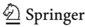
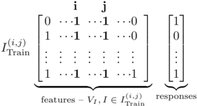
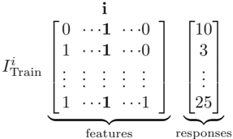
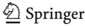
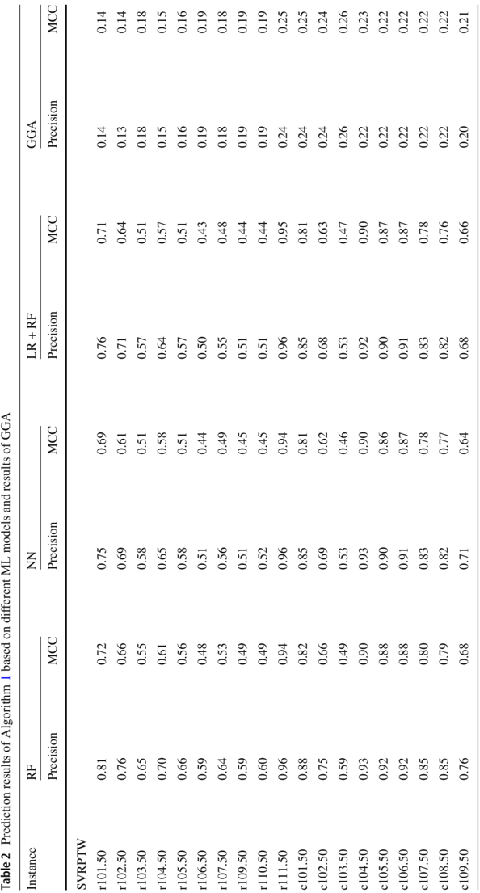
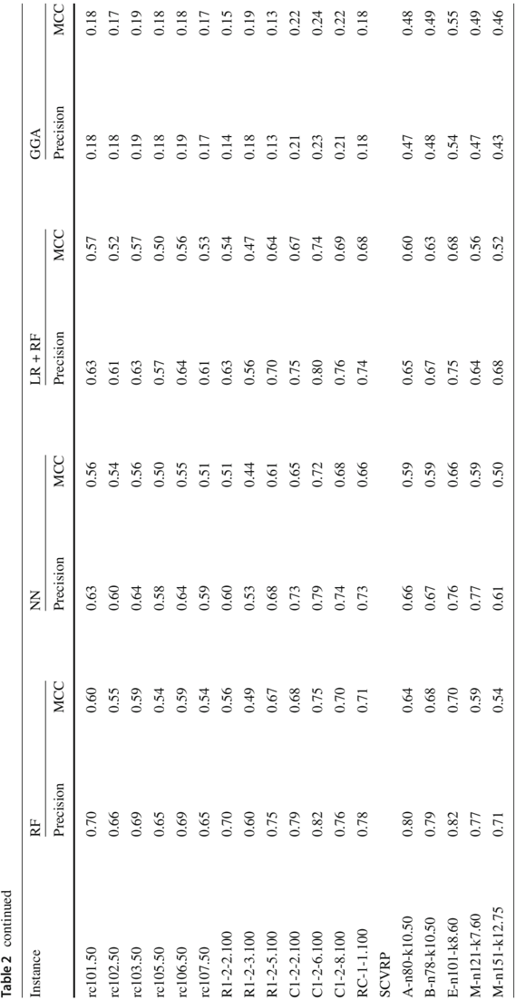
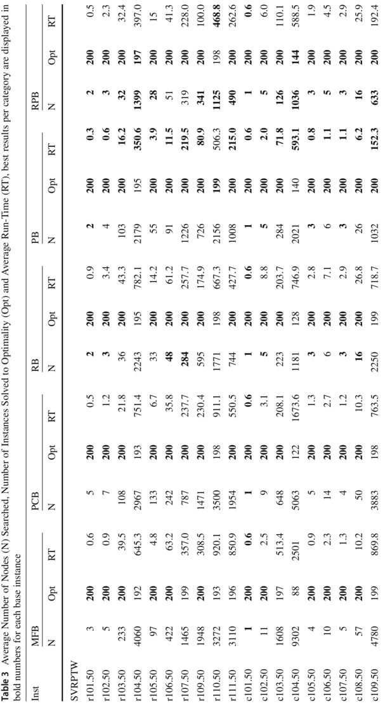
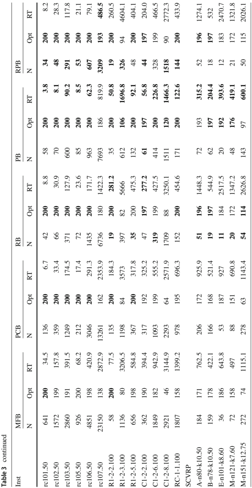
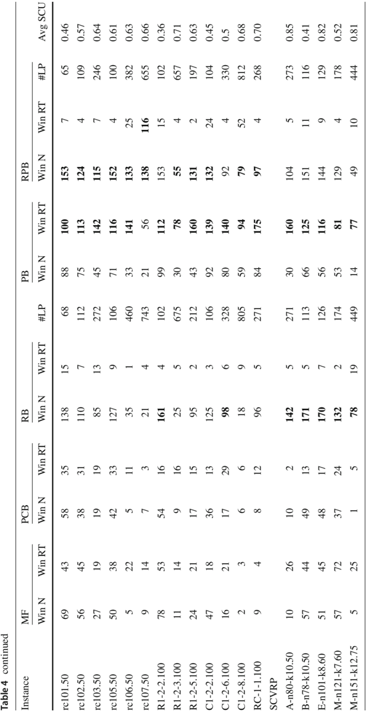
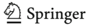

## REGULAR ARTICLE

## A machine learning-based branch and price algorithm for a sampled vehicle routing problem


Nikolaus Furian 1 · Michael O'Sullivan 2 · Cameron Walker 2 · Eranda Çela 3

Received: 31 March 2020 / Accepted: 14 December 2020 / Published online: 30 January 2021

©The Author(s) 2021

## Abstract

Planning of operations, such as routing of vehicles, is often performed repetitively in rea-world settings, either by humans or algorithms solving mathematical problems. While humans build experience over multiple executions of such planning tasks and are able to recognize common patterns in different problem instances, classical optimization algorithms solve every instance independently. Machine learning (ML) can be seen as a computational counterpart to the human ability to recognize patterns based on experience. We consider variants of the classical Vehicle Routing Problem with Time Windows and Capacitated Vehicle Routing Problem, which are based on the assumption that problem instances follow specific common patterns. For this problem, we propose a ML-based branch and price framework which explicitly utilizes those patterns. In this context, the ML models are used in two ways: (a) to predict the value of binary decision variables in the optimal solution and (b) to predict branching scores for fractional variables based on full strong branching. The prediction of decision variables is then integrated in a node selection policy, while a predicted branching score is used within a variable selection policy. These ML-based approaches for node and variable selection are integrated in a reliability-based branching algorithm that assesses their quality and allows for replacing ML approaches by other (classical) better performing approaches at the level of specific variables in each specific instance. Computational results show that our algorithms outperform benchmark branching strategies. Further, we demonstrate that our approach is robust with respect to small changes in instance sizes.

B Nikolaus Furian

nikolaus.furian@tugraz.at

1 Department of Engineering and Business Informatics, Graz University of Technology, Graz, Austria

- 2 Department of Engineering Science, University of Auckland, 70 Symonds Street, Auckland, New Zealand
- 3 Department of Discrete Mathematics, Graz University of Technology, Steyrergasse 30, 8010 Graz, Austria


Content courtesy of Springer Nature, terms of use apply. Rights reserved.

Keywords Vehicle routing · Machine learning · Branch and price · strategies

## Branching

## 1 Introduction

Vehicle routing and its variants have been extensively discussed over the last decades. In its simplest form, it consists of a set V of vehicles, a set N of customers and a depot D (or possibly a set of depots). The goal is to assign customers to routes of vehicles, starting and terminating at depot D , such that each customer is visited exactly once and a chosen objective function is minimized. Different versions of vehicle routing problems vary in terms of (among others): the definition of vehicles (e.g., a homogeneous or heterogeneous fleet); multiple depots or a single depot; the definition of the objective function (e.g., minimizing the total travel distance, minimizing the number of vehicles used, or minimizing lateness); additional constraints on routes, vehicles and customers (e.g., capacity constraints, time windows, pick-up and delivery constraints and many more); or stochastic and dynamic features of instances. For a recent and exhaustive classification and taxonomy of the vehicle routing problem and its variants, the reader is referred to Braekers et al. (2016).

The main problem discussed in this paper is based on the Vehicle Routing Problem with Time Windows (VRPTW). However, the validity of proposed methods is also evaluated for the more general Capacitated Vehicle Routing Problem (CVRP). Hence, throughout the paper models and algorithms are explained with respect to the VRPTW, but adaptions necessary to account for the CVRP are noted. The VRPTW consists of a homogeneous fleet of identical vehicles with a given capacity and a single depot. Further, each customer i ∈ N is assigned a specific demand value di , a service time si and a time window [ ai , bi ]. In addition to constraints imposing that each customer is visited exactly once, routes have to satisfy resource constraints: the aggregated demand of all customers on a route must not exceed the vehicle's capacity; and the service of each customer i must start within the corresponding time window [ ai , bi ]. Traveling times between customers are usually modeled in terms of the distance between customers. For the CVRP, constraints regarding traveling and service times are omitted.

Generally, for the VRPTW, and also other variants of vehicle routing, it is assumed that the set of customers is independent over instances to be solved. In other words, optimization algorithms are designed, and evaluated, on completely randomly generated instances. While this assumption is reasonable for the design and discussion of algorithms, either heuristic or exact, there are real-world applications where instances to be solved follow distinct patterns. Such patterns, or structures of instances, may enhance the use of learning techniques, i.e., Machine Learning (ML), for optimization. The idea is to define ML models which make use of specific structural properties of the instances and then integrate those models into optimization algorithms so as to improve the efficiency and the performance of the latter. In this paper, we introduce the Sampled Vehicle Routing Problem with Time Windows (SVRPTW) (and the Sampled Capacitated Vehicle Routing Problem (SCVRP)) and a ML-based branch and price algorithm for this particular problem. Informally speaking, the SVRPTW

## 123

Content courtesy of Springer Nature, terms of use apply. Rights reserved.

and the SCVRP assume that customers of a specific instance are a random subset of a 'base-set' of customers. In particular, that 'base set', or 'base instance', summarizes all possible customers that could occur in an instance and is assumed to remain constant for all instances to be solved. For the remainder of the paper, we refer to the Sampled Vehicle Routing Problem (SVRP) as the problem class consisting of both, the SVRPTW and the SCVRP, whenever no distinction is necessary.

Possible applications for SVRPs arise mainly in the service industry, where requests of services are triggered randomly and the set of possible customers is limited. For example, in Furian et al. (2018), the authors introduce a vehicle routing formulation for the dispatching of in-house patient transits within Auckland City hospital. Patients are transported between wards and treatment appointments by service staff (orderlies and/or transit nurses) who can be seen as vehicles. Such transit requests occur randomly overtime,butthelocationsarefixedduetothephysicallayoutofthehospital.Similarly, in maintenance planning, service staffs are often assigned a set of tasks to repair faulty equipment where the 'base set' of equipment (with fixed locations, e.g., machines) can be assumed to be constant, see for example Gutschi et al. (2019).

For such applications, it might be beneficial to gather information during calls of optimization algorithms and make use of this information in later calls of the same or in an adapted optimization procedure. In other words, this paper aims to equip standard algorithms for vehicle routing with a 'computational experience' (by the use of a series of ML models). That experience is gathered during an 'off-line' training phase where a large number of instances (derived from the same 'base instance') of the SVRP is solved to optimality. Thereby, we build a data-base consisting of optimal solutions for sampled instances and of features gathered during the optimization regarding its state. This data-base is then used to train ML models for predicting: (i) features of optimal solutions of unseen instances that are used to define a node selection heuristic; and (ii) strong branching scores for variable selection in a branch and price framework. The ML models which predict strong branching scores aim to mimic the behavior of an expert, as they acquire expertize by the full evaluation of strong branching scores in the training phase.

Wealso propose the use of ML models in a reliability-based framework. In particular, during early stages of the tree search, we not only predict strong branching scores, but also compute their exact values and evaluate the quality of the predictions. If the latter are not satisfactory, we switch to standard branching scores for that particular set of variables and that particular sampled instance.

The paper is structured as follows. The next section summarizes related work and outlines the contribution of the paper. Section 3 provides a formal definition of the SVRPTW and the SCVRP. The branch and price framework used for solving SVRP is presented in Sect. 4. In Sects. 5 and 6, the proposed ML models are introduced. The integrated branch and price framework based on the prediction models is described in Sect. 7. Results are presented and discussed in Sect. 8. The paper concludes with final remarks and suggestions for further research.


## 2 Related work

This section is structured as follows. First, we discuss the SVRP in the context of existing classifications of vehicle routing problems. Second, we revisit related work on the integration of ML methods and combinatorial optimization. Finally, we outline the contribution of the paper.

## 2.1 Vehicle routing

A vast number of variants of vehicle routing have been proposed and solved either heuristically or exactly over the last decades. For a detailed classification and review of most variants, the reader is referred to Braekers et al. (2016). For a definition and review on 'rich' vehicle routing, i.e., routing problems that impose a significant set of practical constraints see Campbell and Wilson (2014).

The structure of SVRPs proposed in this paper may best be classified as a vehicle routing problem with stochastic customers (VRPSC). These problems consist of a set of customers, each assigned a probability of appearance. Thereby, it can be distinguished between two models: (a) the existence of customers is known a priori (as assumed in this paper) or (b) customers are revealed during the planning horizon (see for example Albareda-Sambola et al. (2014)). Note that in model (b) additional stochastic inputs, such as demand (VRPSDC) may be considered. For reviews on stochastic vehicle routing, including the VRPSC, the reader is referred to Pillac et al. (2013), Ritzinger et al. (2016), or Oyola et al. (2018). Already in the early work of Waters (1989), the two most common solution approaches for such problems are outlined: adapting a master solution and reoptimization. The first makes use of an a priori computed solution for the base customer set (first state), that is then adapted (usually heuristically) in a second stage when the actual customer set is known. However, Waters (1989) has already shown that re-optimization yields significantly better results for the VRPSC when the set of appearing customers is small compared to the base set. Generally, the VRPSC has been studied less than other stochastic routing problems, e.g., vehicle routing problems with stochastic demands. Most published studies propose methodologies that are based on adapting a master solution. For a vehicle routing problem including stochastic demand, Gendreau et al. (1995) introduce an exact algorithm which minimizes the original costs in the master problem and the expected costs in the second state for the VRPSDC. Gendreau et al. (1996) follow the same approach but use a tabu search instead of an exact solving procedure. Erera et al. (2009) heuristically compute primary routes, i.e., a solution to a master problem including additional real world constraints, which are then heuristically adapted to operational routes (second stage). Zhong et al. (2007) follow a slightly different approach, by summarizing customers to 'cells' and 'areas', for which a strategic routing plan is computed a priori and heuristically altered in the second stage. Sörensen and Sevaux (2009) compute 'flexible' routes used for the master problem that may be effectively adapted in the second stage. The work of Sungur et al. (2010) includes stochastic customers, demand service times for a real-world courier elivery problem. Similar to previously outlined approaches, a master plan is adapted on a daily basis to generate daily schedules. The optimization goal is to maximize the number of customers that

## 123

Content courtesy of Springer Nature, terms of use apply. Rights reserved.

are served and the route similarity (with respect to the master plan), while minimizing earliness and lateness penalties and the total travel distance.

The ML-based algorithm proposed in this paper substantially differs from existing work, as it does not rely on the adaption of a master plan. It is based on an a priori training phase and on trained ML models that are used to accelerate an exact branch and price algorithm for unseen customer combinations.

Exactly solving variants of vehicle routing problems have gained much attention overthelast decades. The most commonlyusedsolutiontechniquestocomputeoptimal solutions are branch price and cut algorithms. Among the first to propose such a method for the CVRP were Fukasawa et al. (2006). Advancements of the main branch price and cut principle can be classified in: (i) sub-problem relaxation and corresponding solving procedures and (ii) definition of cutting planes.

- (i) Sub-problems within branch and price algorithms for routing problems (with or without time windows) can be formulated as an Elementary Shortest Path Problem with Resource Constraints (ESPPRC). Hence, the goal is to find the shortest path from the depot back to the depot, while visiting any node at most once, except for the depot (the generated route is cycle-free) and satisfying resource constraints along the route (possibly including time windows). Since the ESPPRC is NP-hard even medium-sized instances of this problem are hard to solve in general. Hence, the sub-problem is often relaxed such that routes are allowed to contain cycles. As allowing cycles results in weaker lower bounds, a commonly used approach is to prohibit cycles of certain structures. Early work includes the introduction of k-cycle elimination, i.e., only allowing routes to contain cycles with at least k customers, see for example Irnich and Villeneuve (2006). A main advancement was the introduction of ng-route relaxation, see Baldacci et al. (2011), that will be briefly explained in Sect. 4.2. Decremental state-space relaxation (DSSR) Righini and Salani (2008) is a concept that initially relaxes elementary restrictions on customers, but dynamically increases the set of customers for which those restrictions are imposed. The integration of DSSR and ng-route relaxation was first proposed by Martinelli et al. (2014) and extended by Contardo and Martinelli (2014) (including 2-cycle elimination) and Bulhões et al. (2018) (dynamic neighborhood sizes). On the other hand, bidirectional labeling Righini and Salani (2006) does not change the structure of, but consists of generating labels from both directions (start and end depot) while solving the sub-problem. Pecin et al. (2017a,b) combine bidirectional labeling with completion bounds, i.e., bounds that allow to discard unpromising labels during the execution of labeling algorithms for the sub-problem. Finally, almost any branch price and cut procedure includes heuristics to compute negative reduced cost columns, see for example Fukasawa et al. (2006), Martinelli et al. (2014), or Pecin et al. (2017a, b).
- (ii) Cuts for vehicle routing can be classified in (a) robust and (b) non-robust cuts, where the latter change the structure of the pricing problem. A large set of robust cuts for the CVRP is provided by the CVRPSep library Lysgaard et al. (2004), for example rounded capacity inequalities, homogeneous multistar inequalities, generalized multistar inequalities, framed capacity inequalities, strengthened comb inequalities, and hypotour inequalities. A family of non-robust cuts, used by a

123


Content courtesy of Springer Nature, terms of use apply. Rights reserved.

variety of authors, are subset row cuts (SRC) Jepsen et al. (2008). To reduce their impact on labeling algorithms, these were refined to limited-memory SRCs by Pecin et al. (2017a) for the VRPTW and Pecin et al. (2017b) for the CVRP. For other examples of non-robust cuts, the reader is referred to Costa et al. (2019).

The work of Pecin et al. (2017a) for VRPTW (and, respectively, Pecin et al. (2017b) for CVRP) denote the latest advancement of exact solving procedures, and include route enumeration, variable fixing and strong branching elements besides abovementioned techniques. Further, it has to be noted that the above reported literature on exact algorithms does not include other variants than VRPTW and CVRP. Pessoa et al. (2020) generalize recent development on latter problem types to a generic exact solving procedure for multiple variants of routing problems. For a recent review, the reader is referred to Costa et al. (2019)..

## 2.2 ML and optimization

The idea to combine methods from classical optimization and ML has gained significant attention over the last few years, especially for real-world settings where optimization algorithms are used in a repetitive manner. Thereby, the idea of gathering knowledge during these optimization runs, that can be utilized in future calls of the algorithm, seems to be very intriguing.

In its pure essence, an algorithm is a sequence of decisions to be made. In a vast number of algorithms that are used in practice, even in exact ones, a lot of these decisions are made heuristically, for example the selection of neighborhood operators in local search procedures, or the selection of variables to branch on in tree searches. ML modelscouldenhancethose heuristic policies within the considered optimization algorithms. Recent research on the heuristic use of ML models has already demonstrated their potential to do so.

In general, Bengio et al. (2018) identified three abstract ways to incorporate ML into optimization (or combine ML and optimization). First, (i) 'End-to-End' learning includes ML approaches that are able to directly construct solutions for optimization problems. Hence, it extends classical heuristics by ML-based ones. Second, (ii) ML is used to gather information on the problem at hand in a pre-processing step and pass that information on to a classical optimization algorithm. Third, (iii) ML models are utilized to make online heuristic decisions within classical optimization algorithms.

Afourth possible way, (iv) that is not within those categories, is to use ML models to predict an objective value of a problem, but not the solution yielding that value. In the following, examples for each category are given. For comprehensive reviews, the reader is referred to Bengio et al. (2018); Lombardi and Milano (2018); Dilkina et al. (2017).

- (i) The (heuristic) construction of solutions for optimization problems utilizing ML methods has probably gained the most interest in recent years. ML methods used include, but are not limited to, Pointer Networks, e.g., Bello et al. (2016), Reinforcement Learning, e.g., Khalil et al. (2017a), Graph Convolutional Networks, e.g., Joshi et al. (2019), and/or Attention mechanisms, e.g., Kool et al. (2018). One of the most commonly tackled problem types considered is the Traveling

## 123

Content courtesy of Springer Nature, terms of use apply. Rights reserved.

Salesman Problem Bello et al. (2016); Nazari et al. (2018a); Khalil et al. (2017a); Kool et al. (2018); Miki et al. (2018); Joshi et al. (2019); Kaempfer and Wolf (2018). However, variants of vehicle routing problems were also the subject of recent studies. Nazari et al. (2018b) considered the capacitated vehicle routing problem, Vera and Abad (2019) the capacitated vehicle routing with a heterogeneous fleet, and Yu et al. (2019) an online version of vehicle routing, to name a few examples.

- (ii) The use of ML as a prepossessing step for a classical optimization algorithm has been studied less. Ding et al. (2019) use Graph Convolutional Neural Networks to predict the value of binary variables in optimal solutions. This information is then used to direct the branching decision in the root node of a search tree. Hence, the approach is similar to parts of the method proposed in this paper, where features of the optimal solution are predicted and then used in a branch and bound setting. In a similar fashion, Li et al. (2018) also utilize Graph Convolutional Neural Networks to decide whether a vertex in a graph-based problem is in the optimal solution. If not, the vertex is removed from the graph, and a standard heuristic is applied to solve the remaining instance. Support Vector Machines and k-Nearest-Neighbor methods are used by Xavier et al. (2019) to compute, what they refer to as, 'hints' for a mixed integer program (MIP) solver. Those hints include warm start information, additional constraints to the problem and identified admissible regions that may contain the optimal solution. A similar principle based on Support Vector Machines is also applied by Sun et al. (2019). A very interesting approach has been proposed by the authors of Lodi et al. (2019). They assume that instances to be solved result from a perturbation of a reference instance of the facility location problem. Based on that assumption, they use a selection of ML methods to predict the number of facilities that were in the optimal reference solution and still are in the optimal solution of the perturbed instance. This information is then added to the problem formulation of the new instance in the form of an additional constraint. Results show that the solving time for a new problem can be significantly reduced, and the risk to 'cut-off' the optimal solution by the additional constraint is low.

A different line of research has been followed by Kruber et al. (2017), who use MLmodels to decide if a decomposition reformulation should be applied and, if so, which one to apply if several are available.

- (iii) The third category of research aims to utilize ML models online and alongside traditional optimization algorithms. Examples of inclusions of ML models in heuristics algorithms can be found in Shylo and Shams (2018) and Hottung and Tierney (2019). In Shylo and Shams (2018), a Logistic Regression model is used to predict components of good solutions and this information is used to guide a Tabu Search. Hottung and Tierney (2019) use Neural Networks with an attention mechanism as a repair operator in a Large Neighborhood Search framework. Hottung et al. (2020) use a Deep Neural Network structure to make branching decisions in a heuristic tree search for the container pre-marshalling problem. Exact solving procedures for NP-hard optimization problems, especially problems that can be formulated as MIPs, are often based on tree search strategies, such as pure branch and bound, branch and price, or branch and price and cut.


Heuristic decisions within those exact methods usually include variable and node selection policies, i.e., which variables to branch on and the order in which unprocessed nodes are processed. Recently, some methods to design such policies based on ML models have been published. For a comprehensive review, the reader is referred to Lodi and Zarpellon (2017).

The majority of approaches to include ML models in branching decisions has been proposed for variable selection, either in an 'online' or 'off-line' fashion. In particular, online methods learn the ML models during the execution of the algorithm, whereas offline algorithms use a set of training instances to train ML models that are then used (unchanged) during the solving procedure of new (unseen) instances. Solving those training instances is usually performed with a costly branching strategy that is expected to lead to small trees, but is not practical due to high running times. The aim of MLs is to imitate this costly strategy, e.g., strong branching (see Sect. 4.4.2) at a lower computational cost.

Examples for online learning can be found in Khalil et al. (2016) and Marcos Alvarez et al. (2016). Khalil et al. (2016) use a Support Vector Machine based ranking model and test it on MIPLIB 2010 instances Koch et al. (2011). Marcos Alvarez et al. (2016) propose a Linear Regression model that is tested on MIPLIB 3.0+2003 instances.

For offline learning, Alvarez et al. (2017) used Extra Trees as a regression model to predict strong branching scores for random and MIPLIB 3.0 instances Achterberg et al. (2006). Gasse et al. (2019) imitate a strong branching expert with Graph Convolutional Neural Networks and test their approach on instances of set covering, combinatorial auction and facility location problems. Important to note is that their work is the first that uses a solver including cuts, primal heuristics and pre-solving. Hansknecht et al. (2018) propose a ranking-based learning method for the time-dependent traveling salesman problem, while Liberto et al. (2016) use a clustering mechanism to select the most promising branching heuristic from a set of standard heuristics at each node. The approach is tested on MIPLIB 2010 instances Koch et al. (2011). In a similar fashion, Balcan et al. (2018) propose a learning method that assigns weights to existing variable selection heuristics.

Significantly less work has been published on node selection policies. He et al. (2014) propose a learning method that aims to imitate an oracle procedure which expands nodes containing the optimal solution, while Sabharwal et al. (2012) use Reinforcement Learning to balance exploration and exploitation in search trees. Applications of ML models in branch and bound trees, other than node and variable selection, have been proposed by Tang et al. (2019) who aim to detect cuts, or Khalil et al. (2017b) who are using a Logistic Regression model to decide whether primal heuristics should be run at a given node in the search tree.

(iv) Predicting the optimal objective value, not considering the actual solution representing it, has been proposed by Matsuoka et al. (2019) for a machine scheduling problem, and by Fischetti and Fraccaro (2019) for the optimal production of offshore wind parks. Further, a metric to evaluate ML models has been proposed by François et al. (2019) and tested on the Traveling Salesman Problem.

## 123

Content courtesy of Springer Nature, terms of use apply. Rights reserved.

However, it is interesting to observe that little research has been done on problem definitions that incorporate pre-defined patterns for instance generation. Only a few exceptions have to be mentioned. Lodi et al. (2019) assume that instances being solved for the facility location problem are random perturbations of a single reference instance, which is similar to the idea of a base instance introduced in this paper. Xavier et al. (2019) assume a fixed topology of the problem structure and generate instances by altering parameters with respect to historic data. Thereby, parameters are either sampled from past observations, or a distribution is fitted on historic data which is used to generate parameters. Fischetti and Fraccaro (2019) mention that part of their data that defines instances is based on historic data.

It is the opinion of the authors that patterns in instance generation could be an interesting direction for research on the combination of ML and traditional optimization. First, from a practical point of view, when optimization is used in a setting where certain elements remain fixed over time, e.g., a fixed number of machines, a fixed set of possible customers, structures in item definitions for bin packing, and many more. Second, assuming structures in the instances being solved could lead to an enhanced use of ML models for optimization, as it enables to engineer features and models that are explicitly making use of the those structures.

Summarizing, to the best knowledge of the authors, the contribution of this paper is threefold:

- - We introduce an exact solving procedure for two variants of vehicle routing problems with stochastic customers, that does not rely on adapting a master solution, but utilizes ML models for re-optimization of unseen instances.
- - The method proposed in this paper is the first attempt to apply a ML-based strategy to exactly solve a variant of the vehicle routing problem. It includes policies for both variable and node selection and also includes a detailed discussion on the potential to predict elements in the optimal solution for instances of the SVRPTW.
- - The proposed approach is the first to include an online-evaluation of prediction modelswithinareliability framework. This enables to dynamically switch between standard variable selection and ML-based variable selection.

## 3 Problem formulation

The mathematical formulation of the SVRPTW is based on the definition of the VRPTW, see for example Desaulniers et al. (2006). Let NB be the set of customers in the 'base instance', V be the set of identical vehicles, each with a capacity of Q D , be the depot, and let di , hi , [ ai , bi ] for i in NB be the demand, service time and time window for each customer. Further, let ci , j for i , j ∈ NB ∪ { D } be the distance and t i , j = ci , j + hi the travel time including the service time. Note that we assume a time window [ aD , bD ] for the depot node that represents the planning horizon and that the demand of the depot is equal to zero, i.e., dD = 0.

/negationslash

For a given instance I , associated with a customer set NI ⊆ NB let ˆ NI = NI ∪{ D } be the set of all nodes (customers and depot) in the network. The model contains two sets of decision variables. For each edge ( , i j ) , where i = j and each vehicle k ∈ V , let



Content courtesy of Springer Nature, terms of use apply. Rights reserved.

<!-- formula-not-decoded -->

Note that for each vehicle k ∈ V we allow for an extra variable XD D k , , that is 1 if the vehicle is assigned an empty route and 0 otherwise.

Time windows [ ai , bi ] force vehicles to arrive at customer i ∈ NI before bi . When a vehicle arrives before ai it is assumed that the vehicle waits before starting the service. The problem can then be formally stated by (1)-(9):

Variables si , k denote the time service is started by vehicle k ∈ V at node i ∈ ˆ NI . If vehicle k does not visit i the value of the variable is irrelevant. Furthermore, we assume aD = 0 and hence sD k , = 0, for all k ∈ V .

<!-- formula-not-decoded -->

<!-- formula-not-decoded -->

<!-- formula-not-decoded -->

<!-- formula-not-decoded -->

<!-- formula-not-decoded -->

<!-- formula-not-decoded -->

<!-- formula-not-decoded -->

<!-- formula-not-decoded -->

ai si

,

k

bi

<!-- formula-not-decoded -->

≤

≤

<!-- formula-not-decoded -->

<!-- formula-not-decoded -->

The objective function minimizes the total travel distance. Note that we do not consider the lexicographic objective function that aims to minimize the number of used vehicles and subsequently the travel distance. Constraints (2) ensure that every customer is visited exactly once and (3) force that each vehicle is loaded not more than its capacity. Constraints (4) and (5) ensure that vehicle start and end their routes at the depot D . Constraints (6) denote the flow balancing constraints. Constraints (7) describe the relationship between a vehicle's departure from a customer and the earliest possible start for the next possible customer with respect to travel and service times. Note that the constraints (7) are not linear. However, their nonlinearity has no effect on our solution procedure. Indeed these constraints are part of the subproblems of the column generation approach introduced in the following section, and those sub-problems are solved by a labeling algorithm. Constraints (8) impose the time windows for the start of the service at a customer and constraints (9) define x variables

## 123

Content courtesy of Springer Nature, terms of use apply. Rights reserved.

as binaries. Note that start time (7) and time window constraints (8) can be dropped for the SCVRP. However, the remaining formulation would not prevent vehicles from cycling. To prevent cycles, one could either introduce sub-tour elimination constraints or maintain constraints (7) and replace t i , j by ci , j .

## 4 Branch and price for the VRPTW

In this section, the branch and price framework for solving instances of the SVRP and, respectively, the VRPTW and the CVRP is presented. The framework is comprised of standard algorithms and is later extended by novel aspects, see Sect. 7. In general, the integrality constraints in the mixed integer formulation given by (1)-(9) are relaxed and the resulting linear program is solved using a standard column generation approach, as outlined for example by Desaulniers et al. (2006). As the resulting solution may contain fractional variables, the column generation procedure is embedded in a branch and price algorithm to obtain the optimal non-fractional solution of the original problem. This procedure and its components form the basis for the adapted algorithm presented in Sect. 7. Therefore, they are briefly outlined in the remainder of the section, although they are just classical approaches and do not exhibit any novelty.

## 4.1 A set covering formulation for the master problem

Column generation procedures have been extensively applied to solve NP-hard optimization problems, including many variants of the vehicle routing problem. The general idea is to split problems of the form similar to (1)-(9) into a master problem (constraints (2)) and (often identical) sub-problems (constraints (3)-(9) define one sub-problem per vehicle). This approach is based on the block structure of the problem and on the observation that routes of the vehicles can be independently constructed in the sub-problems and linked together in the master problem. Assuming that the set of all possible routes is known, and denoted by P , the master problem can be formulated as a set-covering problem of the following form:

<!-- formula-not-decoded -->

<!-- formula-not-decoded -->

<!-- formula-not-decoded -->

Note that cp denotes the total distance of a route and ni , p denotes the number of times a customer i is visited on a route p and yp counts the number of times a route is used. However, set P is extremely large and cannot be enumerated even for medium sized instances. Therefore, set P is replaced by a smaller set of known paths ˜ P ⊂ P in formulation (10)-(12) Let us denote by π i the dual multiplier related to constraint (11) for some node i ∈ NI for a given set ˜ P . The values π i are used to compute the reduced costs ˆ ci , j of the edge { i , j } in the original network, in particular ˆ ci , j = ci , j -π i .

<!-- formula-not-decoded -->

Content courtesy of Springer Nature, terms of use apply. Rights reserved.

Based on this reduced cost structure, a sub-problem solver is used to compute routes with total negative reduced costs. If it fails, i.e., no routes with negative reduced cost can be identified, an optimal solution to the problem (10)-(12) is found and the corresponding node in the branch and price algorithm is considered as processed. Otherwise, set ˜ P is updated by routes with negative reduced costs.

## 4.2 Solving the relaxed sub-problem

The sub-problem imposed by constraints (3)-(9) and a modified objective function (replacing costs ci , j by ˆ ci , j and summing just over i and j but not over k , since there is a subproblem for every k ) is essentially an ESPPRC. Note that ˆ c may not satisfy the triangular inequality and also may take negative values. Therefore, negative cycles may exist in the network. Since the ESPPRC is NP-hard, the sub-problem is relaxed such that specific cycles are allowed. The objective function (10) ensures however that in an optimal solution the routes will be cycle-free. Further time window and resource constraints prevent infinite cycling if negative cycles are present in the network.

In this paper, we have used a 2-cycle elimination Irnich and Villeneuve (2006) procedure for the SVRPTW, the routes are not allowed to contain cycles of the form ( , i j , i ) , and ng-route relaxation for the SCVRP.

Informally speaking, ng-route relaxation works as follows. Each customer i is assigned a set of customers, i.e., Ni . Further, for each route p a 'memory' Π( ) p is kept. Route p is only allowed to be extended to customer i if i / Π( ∈ p ) . On the other hand, if the extension is feasible, the memory of the resulting path p ′ is computed by Π( p ′ ) = Π( ) p ∩ Ni ∪{ } i . Sets Ni are usually composed of the δ nearest customers, where δ is a chosen parameter. For a more formal definition, the reader is referred to Baldacci et al. (2011) or Martinelli et al. (2014).

## 4.3 Embedding column generation in branch and price

In case that solving (10)-(12) using column generation does not yield an integer solution, we define branching decisions on the accumulated flow over edges (see for example (see Desaulniers et al. (2006)), i.e., ∑ k ∈ V xi , j , k for a given edge ( , i j ) . In particular, all edges with a fractional flow are eligible for branching. The child nodes arise by introducing additional restrictions: either, edge ( , i j ) is simply removed from the network, or all edges entering j (except ( , i j ) ) and all edges leaving i (except ( , i j ) ) are removed from the network. A node is discarded if the resulting instance is infeasible, the solution is integer, or the resulting lower bound is higher than the objective function value corresponding to the best integer solution known so far.

As the CVRP is a symmetric problem, branching decisions are made on the flow ˜ xi , j , k = xi , j , k + x j , i , k . For ∑ k ∈ V ˜ xi , j , k = 0, both edges are removed from the network, otherwise constraints of the from k ∈ V ˜ xi , j , k = 1 are added to the master problem.

∑ To further improve the quality of obtained bounds for the SCVRP, we extend the branch and price framework to a branch price and cut framework. Cutting planes are computed at the root node of the tree, using the CVRPSEP library, see Lysgaard et al. (2004), and maintained for all nodes in the tree.

## 123

Content courtesy of Springer Nature, terms of use apply. Rights reserved.

## 4.4 Variable selection strategies

In case of more than one edge with an accumulated fractional flow, the branch and price algorithm must choose an edge to branch on. The general principle behind variable selection algorithms is to assign a score to each candidate variable, in our case to each edge, and choose the variable with the highest score. Multiple strategies have been proposed to compute such scores. For an overview, the reader is referred to Achterberg et al. (2005). The most commonly used score computing approaches and the ones used as benchmarks in this paper are outlined in the remainder of this section.

## 4.4.1 Most fractional score

The simplest approach is the Most Fractional Branching (MFB) strategy, which computes scores with respect to the fractional part of the value that is assigned to an edge in the given solution, see (13). However, it has been experimentally shown that this method does not perform better than a random selection among fractional variables, see Achterberg et al. (2005).

<!-- formula-not-decoded -->

## 4.4.2 Full strong branching

The method that is considered to yield the smallest trees is Strong Branching, or in its naive version Full Strong Branching (FSB). For every candidate edge, Full Strong Branching computes the resulting bound increase in both child nodes, denoted by ∆ 1 and ∆ 2, respectively. The score of an edge is then computed with respect to ∆ 1 and ∆ 2. While other variants exist in the literature, the score function used in this paper is given by

<!-- formula-not-decoded -->

where α is a parameter usually chosen in the range [ 0 7 . , 1 . ]

Obviously, in its naive version FSB results in a very large number of LPs that need to be solved. Hence, to make it practicable, the number of candidate variables and the number of simplex iterations performed to compute ∆ 1 and ∆ 2 is limited in the general case. We will refer to this procedures as Strong Branching.

However, as we use strong branching in this paper to generate input features for the MLmodelpresented in Sect. 6, we refrain from using any heuristic adoption whenever FSB is used.

## 4.4.3 Pseudo cost branching

Pseudo Cost Branching (PCB) is a history-based approximation of the score formula given by (14), and hence maybe seen as a (very simple) learning method. Whenever

<!-- formula-not-decoded -->

Content courtesy of Springer Nature, terms of use apply. Rights reserved.

an edge (or variable in the general case) has been chosen to branch on and one of the resulting child nodes has been processed and resulted in a feasible solution, the observed bound increase per unit change is stored in a list associated with that edge, as well as whether the edge is included or excluded. Instead of computing ∆ 1 and ∆ 2 by solving the corresponding LPs, their values are estimated by the average value of elements in the associated lists. In case that no historic values have been collected yet for a given edge, the average of all variables included (or respectively excluded) are used to approximate the score. If none such exist, they are assumed to be 1. For tie-breaking, we use the most fractional score SMF given by (13).

## 4.4.4 Hybrid branching

Hybrid Branching is a mix of FSB or Strong Branching, and PCB Hybrid branching aims to exploit the intuition that branching decisions at nodes with lower depth in the search tree may have a larger affect on the resulting size of the tree. Therefore, hybridizes FSB and PCB by using FSB to select the branching variable at nodes with a depth up to a chosen limit, whereas PCB is applied at nodes with larger depths.

Reliability Branching (RB) generalizes the idea of Hybrid Branching by keeping a reliability parameter η rel . If the minimum number of the elements in the PCB lists of an edge (including or excluding that edge) is less than or equal to η rel , the associated score is computed using Strong Branching (either FSB or an heuristic adaption), otherwise the average values of those lists are used to approximate (14). Hence, PCB is only applied when the corresponding edge is classified as reliable, i.e., sufficient full evaluations have already been performed.

The value of the parameter η rel determines the degree to which RB performs PCB or Strong Branching, respectively. In the extreme settings η rel = 0 and η rel = ∞ , RB would coincide with PCB and Strong Branching, respectively.

## 4.5 Node selection

Besides choosing an edge to branch on, the node to process next has to be chosen from a set of unprocessed nodes in each branch and price iteration. Most common strategies to select nodes include: 'depth first', i.e., selecting nodes that are situated at lower levels of the tree or equivalently nodes with large depth in the tree, 'breadth first', i.e., nodes with lower depth in the tree, 'best first', i.e., selecting nodes with the best lower bound, or combinations of the latter. In this paper, the 'best first' approach is used as a standard node selection strategy.

## 5 Predicting solution structures of the SVRPTW

In this section, a family of 'edge-based' models is introduced, followed by a family of 'node-based' models and then an algorithm that combines both and performs postprocessing on results in order to learn and predict the value of variable in the optimal solution for a given instance of SVRPTW.

## 123

Content courtesy of Springer Nature, terms of use apply. Rights reserved.

Fig. 1 Structure of features and responses for an edge ( , i j ) with i , j ∈ NB . Each row in the matrix represents the characteristic vector of the vertex set of the instance



∈

## 5.1 An edge-based model

Given an instance I of SVRPTW with corresponding customer set NI for a chosen 'base customer' set NB , the most simple classification task one may think of is whether an edge ( , i j ) with i , j ∈ NI will be part of a route in the optimal solution. Let VI = (v ) i i ∈ NB be a binary vector of size | NB | , whose i -th element indicates whether customer i is in NI or not. Although, the 'base-instance' contains information on the location of customers and corresponding time windows, this information is abstracted for a specific instance I via VI .

Let I Train be a set of instances with known optimal solutions, i.e., computed 'offline' by some exact algorithm as described in Sect. 4, and I Test be a set of instances with unknown optimal solutions derived from the same 'base instance'. Further, for a given edge ( , i j ) with i , j ∈ NB let I ( , i j ) Train = { I ∈ I Train | i ∈ NI ∧ j ∈ NI } be the set of instances that contain both nodes. The resulting feature and response set is illustrated by Fig. 1, where responses are 1 if the optimal solution contains edge ( , i j ) and 0 otherwise.

Based on the structure of features and responses described by Fig. 1, we train a family of edge-models M i j ( , ) E for every edge ( , i j ) with i , j ∈ NB . In the following, weuse models M i j ( , ) E as functions M i j ( , ) E ( V ) that map binary vectors V of size | NB | to { 0 , 1 , i.e., predicted to be in the optimal solution or not. In this paper, we use random } forest classifiers for models M i j ( , ) E ( V ) Murphy (2012), but compare results to other MLmodels. Note that the resulting feature and response data are strongly unbalanced in many cases, which is addressed by performing bootstrapping on the training data.

Note that for the SCVRP we treat ( , i j ) and ( j , i ) as one edge. Hence, models are only constructed once and features are set to 1 if either edge is in the optimal solution.

Experiments have shown that models ME have a relatively high precision, but a medium to low hit-rate. In other words, when predicting an edge to be in the optimal solution, the probability that the edge is actually in the optimal solution is relatively high, but models seem to quite often predict optimal edges not to be in the optimal solution. Therefore, a second family of models is proposed in the following section.

## 5.2 A node-based model

The second fundamental prediction task one may think of when predicting solution structures of vehicle routing problems is to predict the successor of a given node in the optimal solution.


Content courtesy of Springer Nature, terms of use apply. Rights reserved.

Fig. 2 Structure of features and responses for an node i ∈ NB , where responses denote node identifiers. Each row in the matrix represents the characteristic vector of the vertex set of the instance



Therefore, we use a similar feature set as illustrated by Fig. 1, but I i Train is the set of instances that contain i and we replace the binary responses by customer indices of the successor of i , as shown by Fig. 2.

Using features and responses described above, we train ranking models M n N for all nodes n ∈ NB . Analogously to Sect. 5.1, models M n N maybeseenasafunction M n N ( V ) mapping any binary vector V of size | NB | to the set of nodes NB . In principle, any ranking model may be used, in this paper we use a probability-based model resulting from random forest classifications Murphy (2012). Note that this may also result in predictions that violate constraints (6). Note that models are not used for the SCVRP.

Computational experiments have shown that the precision of models MN is significantly lower than the precision of models ME . However, a closer investigation of the results identified that ME models often failed to classify 'obvious' optimal edges, which were correctly classified by MN . Hence, we propose a combined use of models ME and MN , as described in the following section.

## 5.3 Combined models and post-processing

To combine strengths of models ME and MN and reduce their weaknesses, we propose the following combined approach. Given an instance I ∈ ITest , we first apply models M i j ( , ) E ( VI ) for every edge ( , i j ) with i , j ∈ NI . Let PE be the resulting set of edges that were predicted to be in the optimal solution and P s E the set of start nodes of edges in PE and respectively P e E the set of end nodes . Second, we apply a first post-processing procedure to correct for violations of constraints (6). This first post-processing procedure prioritizes the removal of edges that contribute most to indegrees (or out-degrees) of nodes bigger than one and breaks ties by edge lengths, a detailed description is provided in the appendix (Algorithm 3). This is motivated by the observation that the edge-based ML models show a higher precision in predicting the presence of an edge in the optimal solution. Moreover, computational experiments have shown that removing a smaller number of edges is beneficial.

Third, we apply models M n N ( VI ) for nodes n ∈ NI to obtain newly predicted edges ˜ PE . However, we only keep those predictions if they are not conflicting with the predictions of models ME . Hence, if the start (or end) node of a predicted edge ( , i j ) ∈ ˜ PE is in the set of start nodes P s E (or end nodes P e E ), then e is discarded. This is motivated by the fact that in the case of conflicting predictions, only one is potentially a true positive. Experimentation has shown that models ME yield a higher precision than models MN , i.e., the probability of a true positive prediction is higher

## 123

Content courtesy of Springer Nature, terms of use apply. Rights reserved.

for ME models, but MN models are capable of 'adding' optimal edges that have been missed by edge-based models.

Finally, we apply a second post-processing procedure that corrects for violations of time window constraints (8) and capacity constraints (3). See Algorithm 4 in the appendix. The resulting predicting solution procedure is illustrated by Algorithm 1.

For the SCVRP, the correction procedure does not distinguish between in- and outdegrees and removes edges as long as there are customer nodes with degree strictly larger than 2.

Note that as prediction results are used for node selection policies, rather than constructing feasible solutions, the application of post-processing methods to resolve feasibility violations would not be necessary. However, the existence of violations implies false positives, i.e., 'wrongly' predicted edges in the solution. Experimentation has shown that: the proposed post-processing methods on average remove more false positive than true positive predicted edges; and that the negative affect of false positives on the performance of the proposed node selection method (that will be introduced in Sect. 7) is larger than the negative affect of false negatives.

## Algorithm 1 Predicting Solution Structures

- 1: Input: Instance I 2: Output: Set of Predicted Edges PE 3: Set PE = ∅ and out Degree n ( ) = 0 , i n Degree n ( ) = 0 for all n ∈ NI 4: for all ( , i j ) with i , j ∈ NI do 5: if M i j ( , ) E ( VI ) == 1 then 6: PE = PE ∪ { ( , i j ) } 7: out Degree i ( ) += 1 , i n Degree ( j ) += 1 8: end if 9: end for 10: call Correct ByDegree P E ( ) 11: Apply M N models to all nodes in I 12: ˜ PE = ⋃ i ∈ NI { ( , i M i N ( VI )) } 13: Check if newly predicted edges conflict with edges in P E 14: for all ( , i j ) ∈ ˜ PE \ PE do 15: if i / ∈ P s E ∧ j / ∈ P e E then 16: PE = PE ∪ { ( , i j ) } 17: out Degree i ( ) += 1 , i n Degree ( j ) += 1 18: end if 19: end for 20: call CheckFeasibility ( PE ) 21: return PE

The quality of prediction results obtained by Algorithm 1 is significantly lower for edges incident to the depot than for edges connecting two customers. Further, for single depot variants of routing problems, optimal solutions are uniquely defined by edges ( , i j ) with i , j ∈ NI . Therefore, Algorithm 1 is only applied for edges between customers.


Content courtesy of Springer Nature, terms of use apply. Rights reserved.

## 6 Prediction of strong branching scores

As the task of variable selection problems is to choose one edge out of a set of candidate edges, prediction models may contribute in different ways. The outcome of such models may be either (i) an ordering (or ranking) of candidate edges, or a (ii) score that is then used to select the most promising edge.

The methodology proposed in this paper is based on the second strategy (ii) and aims to predict FSB scores as given by (14). However, due to the special structure of the SVRPTW, we train individual models for each edge in a given base instance. During training FSB is used as a variable selection policy and data representing the state of the search tree for each candidate edge and the resulting FSB score is collected and stored.

In the following, we formally describe the feature set for a candidate edge at a given node bn in a branch and price tree. Let Pbn be the columns used at node bn to compute the optimal relaxed solution of the problem (10)-(12). Let ˆ yp be the value of the corresponding variable in the optimal relaxed solution, for p ∈ Pbn . Let BE be the set of edges that have been used for branching on the path from the root node of the tree to bn . Let i n Degree i ( ) ( out Degree i ( ) ) be the in-degree (out-degree) of a node i ∈ NI in the instance to solve at node bn . This instance is basically the sampled instance to solve, but due to branching decisions made further up the tree, and, respectively, the removal of edges from the instance, degrees of nodes may get reduced during the search. For the SCVRP, we only keep a single degree per node for symmetry reasons. Further, let P u ( , i j ) = { p ∈ Pbn | ˆ yp &gt; 0 ∧ ( , i j ) ∈ p } be the set of used paths in the optimal relaxed solution that contain edge ( , i j ) , P f = { p ∈ Pbn | ˆ yp &gt; 0 ∧ ˆ yp &lt; 1 } be the set of fractional used paths, POS p (( , i j )) be the position of edge ( , i j ) in path p and N p ( ) the set of nodes in path p . The used feature set is summarized by Table 1.

The last feature listed in Table 1 corresponds to integer valued features for each node i ∈ NB . The feature for node i is equal to zero if i is not in the sampled instance to solve, and a strictly positive value otherwise. This value is the sum of 1 and the number of fractional paths in the current relaxed optimal solution containing node i . Thereby, it contains information on which nodes are in the sampled instance, and which nodes occur (possibly multiple times) in fractional used paths. Hence, it makes use of the special structure of SVRP and the combinatorial information provided by the instance vector v i .

Based on the feature set described by Table 1, we train a regression forest to predict the score of candidate edges, i.e., fractional edges.

Note that due to branching decisions, and the corresponding removal of edges in the resulting instance, the relaxed problems of the form (10)-(12) may become infeasible. In practice, the paths containing removed edges are not removed from the initial path set, but are assigned an artificially high cost (i.e., length) in order to improve the column generation procedure. Hence, in case of infeasibility the relaxed objective value and consequently also the resulting FSB score becomes artificially high. This means that the responses for the ML models contain 'infinite' and 'finite' scores. However, as regression trees split samples with respect to the observed variance, it is unlikely that a leaf node in a regression tree contains samples with both 'infinite' and 'finite' scores.

## 123

Content courtesy of Springer Nature, terms of use apply. Rights reserved.

Table 1 Feature set for FSB score prediction of edge ( , i j )

| Feature                                                         | Description                                                                                                                                                                    |
|-----------------------------------------------------------------|--------------------------------------------------------------------------------------------------------------------------------------------------------------------------------|
| p ∈ P bn ˆ y p c p                                              | The optimal relaxed objective value at node b n                                                                                                                                |
| ∑ ∑ p ∈ P u ( i , j ) ˆ y p                                     | The total usage of edge ( i , j )                                                                                                                                              |
| l i , j                                                         | The length of edge ( i , j )                                                                                                                                                   |
| i nDegree ( i )                                                 | The in-degree of the start node                                                                                                                                                |
| out Degree ( i )                                                | The out-degree of the start node                                                                                                                                               |
| i nDegree ( j )                                                 | The in-degree of the end node                                                                                                                                                  |
| out Degree ( j )                                                | The out-degree of the end node                                                                                                                                                 |
| | { ( x , y ) ∈ B E | x = i ∨ y = i } |                         | The number of branches on the start node of edge ( i , j )                                                                                                                     |
| | { ( x , y ) ∈ B E | x = j ∨ y = j } |                         | The number of branches on the end node of edge ( i , j )                                                                                                                       |
| | P f |                                                         | The number of fractional paths in the optimal relaxed solution                                                                                                                 |
| | P u ( i , j ) |                                               | The number of fractional used paths containing edge ( i , j )                                                                                                                  |
| ∑ p ∈ P u ( i , j ) c p                                         | The sum of length of paths used and containing edge ( i , j )                                                                                                                  |
| ∑ p ∈ P u ( i , j ) c p ˆ y p                                   | The sum of objective values of paths used and containing edge ( i , j )                                                                                                        |
| min p ∈ P u ( i , j ) c p                                       | The minimum of length of paths used and containing edge ( i , j )                                                                                                              |
| min p ∈ P u ( i , j ) c p ˆ y p                                 | The minimum objective function contribution of paths used and containing edge ( i , j )                                                                                        |
| max p ∈ P u ( i , j ) c p                                       | The maximum of length of paths used and containing edge ( i , j )                                                                                                              |
| max p ∈ P u ( i , j ) c p ˆ y p                                 | The maximum objective function contribution of paths used and containing edge ( i , j )                                                                                        |
| ∑ p ∈ P u ( i , j ) POS p (( i , j ))/ | P u ( i , j ) |        | The average position of edge ( i , j ) in used paths                                                                                                                           |
| min p ∈ P u ( i , j ) POS p (( i , j ))                         | The minimum position of edge ( i , j ) in used paths                                                                                                                           |
| max p ∈ P u ( i , j ) POS p (( i , j ))                         | The maximum position of edge ( i , j ) in used paths                                                                                                                           |
| ∑ p ∈ P u ( i , j ) POS p (( i , j )) ˆ y p / | P u ( i , j ) | | The average weighted position of edge ( i , j ) in used paths                                                                                                                  |
| min p ∈ P u ( i , j ) POS p (( i , j )) ˆ y p                   | The minimum weighted position of edge ( i , j ) in used paths                                                                                                                  |
| max p ∈ P u ( i , j ) POS p (( i , j )) ˆ y p                   | The maximum weighted position of edge ( i , j ) in used paths                                                                                                                  |
| ( v i + ∑ p ∈ P f I N ( p ) ( i ) ) i ∈ N B                     | The sum of the instance vector v I and another vector of dimension N B the i -th element of which specifies the number of fractional paths the corresponding node i is part of |



Consequently, prediction results either contain a ''finite' FSB score, or an artificially large value indicating infeasibility.

As shown in Sect. 5, for the SCVRP we only maintain one model for edges ( , i j ) and ( j , i ) . In case both edges are in a relaxed fractional solution, features with respect to the position of the edge (minimum, maximum, average) are computed such that positions of both, ( , i j ) and ( j , i ) , are used.

## 7 A machine learning-based branching scheme

In this section, we present learning-based strategies for variable and node selection. In particular, for variable selection, we present an approach based on score prediction, andanapproachcombiningthestrengthsofreliability branching with prediction-based branching.

## 7.1 Node selection

Given a branch and bound tree and the associated set O of unprocessed nodes in the tree, the task of any node selection procedure H O ( ) is to select a node for processing. However, for each node o ∈ O there is a unique edge ( , i j ) that was chosen for branching in the predecessor node of o that led to the creation of o . In other words, node o is a result of adding either constraint ∑ k ∈ V xi , j , k = 0 or ∑ k ∈ V xi , j , k = 1 (or removing corresponding edges from the network) to the problem formulation, i.e., in the optimal solution edge ( , i j ) is either used, or not.

Hence, knowing the optimal solution, one could partition set O into O opt and O nopt with O = O opt ∪ O nopt , O opt ∩ O nopt = ∅ , where O opt denotes the set of nodes resulting from decisions that lead to an optimal solution and O nopt the set of nodes resulting from decisions which do not lead to an optimal solution. Although, usually the optimal solution is not known during the search, we use the predictions of Algorithm 1 to classify a node o ∈ O as belonging to either O opt or O nopt .

The procedure works as follows. In a pre-processing step, we compute a set of predicted edges PE using Algorithm 1. Whenever node o 1 and o 2 are created in the branch and bound tree using an edge ( , i j ) , by inclusion and exclusion of edge ( , i j ) , the indicator function 1 PE (( , i j )) is evaluated. If 1 PE (( , i j )) = 1, then o 1 is added to O opt and o 2 is added to O nopt . Analogously, if 1 PE (( , i j )) = 0, then o 2 is added to O opt and o 1 is added to O nopt .

Givenastandardnodeselectionprocedure H , we define the corresponding predicted node selection H p as follows:

/negationslash

<!-- formula-not-decoded -->

To select nodes within subsets O opt and O nopt , i.e., the standard procedure H we use best-first heuristic in this paper (selecting the node with the best lower bound).

## 123

Content courtesy of Springer Nature, terms of use apply. Rights reserved.

Assuming a perfect prediction PE , H p would lead to a shorter search trajectory to the optimal solution, and hence a smaller tree. During experimentation, we observed that imperfect predictions PE also lead to a reduction in the resulting tree size by narrowing down the search to regions that contain decisions with a higher likelihood to be optimal.

## 7.2 Variable selection

In the following, we define two variable selection methods that make use of the prediction models introduced in Sect. 6. Denote by Θ( , i j ) ( bn ) the predicted FSB score for edge ( , i j ) for a given instance I and a node bn in the branch and price tree (and associated features).

The first presented method, referred to as Prediction Branching (PB), simply ranks candidate edges according to their predicted scores Θ( , i j ) ( bn ) . In case no model exists for edge ( , i j ) , the score is set to -1. This may happen if edge ( , i j ) has never been considered for branching, i.e., never had a fractional value in the solution of some relaxed problem in any training instances. For such an edge, no branching information has been collected during training and consequently, no model has been generated.

For the second method, referred to as Reliability Prediction Branching (RPB), we keep lists Υ ( , + i j ) and Υ ( , -i j ) for each edge in I to store observed bound increases that result from including ( Υ ( , + i j ) ) or excluding ( Υ ( , -i j ) ) edge ( , i j ) ) and processing the associated node. Further, let Φ( , i j ) be a quality indicator for each edge ( , i j ) that is initially set to zero for all edges. Algorithm 2 outlines the proposed procedure.

Note that except for the lines 13 to 25 Algorithm 2 behave similarly as RB. In line 6, it is checked whether 'enough' node evaluations on the corresponding edge have been performed previously. This is analogous to the decision whether to use PCB or FSB in RB. The required number of node evaluations is controlled by the reliability parameter η rel . However, even in the early phase of the search where FSB is used to compute edge scores, the corresponding edge models Θ( , i j ) are applied to assess the quality of the predictions. To this end the resulting predicted score is compared to the actual computed score. If the deviation is within a chosen limit δ (or ˜ δ if the actual computed score is zero) the quality indicator Φ( , i j ) is increased by one, otherwise it is decreased by one, see lines 12-15. Models with a negative quality indicator are discarded after the reliability phase and the PCB score is used for the corresponding edges instead.

## 8 Results

In this section, computational results are presented and the proposed methods are evaluated. First, in Sect. 8.1 we outline how the evaluation instances of the SVRPTW were generated. In Sect. 8.2, we present results for the prediction of solution structures followed by an overview of the ML training. In Sect. 8.3, approaches which incorporate machine learning techniques in the branching scheme are tested on benchmark instances and the results are compared to benchmark algorithms.


Content courtesy of Springer Nature, terms of use apply. Rights reserved.

## Algorithm 2 Reliability-Based Score Prediction (RPB)

```
1: Input: Instance I , Node bn , Lists Υ ( , + i j ) and Υ ( , -i j ) , Quality Indicators Φ( , i j ) , Models Θ( , i j ) , Candidate Edges CE 2: Output: Edge ( , i j ) ∈ CE to branch 3: Set score i ( , j ) = 0 for ( , i j ) ∈ CE 4: for all ( , i j ) ∈ CE do 5: Check if enough branching information has been collected for edge ( , i j ) 6: if min ( Len (Υ ( , + i j ) ), Len (Υ ( , -i j ) ) ) < η rel then 7: Compute ∆ 1 and ∆ 2 by processing child nodes of bn based on edge ( , i j ) 8: Υ ( , + i j ) . Add (∆ ) Υ ( , 1 , -i j ) . Add (∆ ) 2 9: score i ( , j ) = α min (∆ , ∆ 1 2 ) + ( 1 -α) max (∆ , ∆ 1 2 ) 10: Check if model exists for edge ( , i j ) 11: if Θ( , i j ) ( bn ) ≥ 0 then 12: Check the quality of the prediction 13: if ( score i ( , j ) > 0 ∧| Θ( , i j ) ( bn )/ score i ( , j ) - | 1 < δ ) ∨ ( score i ( , j ) = 0 ∧ Θ( , i j ) ( bn ) < δ ˜ ) then 14: Φ( , i j ) += 1 15: else 16: Φ( , i j ) -= 1 17: end if 18: else 19: Φ( , i j ) -= 1 20: end if 21: else 22: Post reliability phase, check quality indicator of edge ( , i j ) 23: if Φ( , i j ) ≥ 0 then 24: Quality of model Θ( , i j ) is satisfying, compute score by model 25: score i ( , j ) = Θ( , i j )( bn ) 26: else 27: Quality of model Θ( , i j ) is not satisfying, compute score by PCB 28: score i ( , j ) = α min ( A g v (Υ ( , + i j ) ), A g v (Υ ( , -i j ) ) ) + ( 1 -α) max ( A g v (Υ ( , + i j ) ), A g v (Υ ( , -i j ) ) ) 29: end if 30: end if 31: end for 32: return arg max ( , i j ) ∈ CE score i , j
```

All results were obtained by using a desktop computer with an Intel i7 8th Gen processor with 16GB RAM and 6 cores. Algorithms were coded in C#, in particular using the .Net framework 4.5.2. Machine learning models were created in Python, using the scikit-learn library version 22.1. The ML models were then exported from Python to C# and serialized as binaries for multiple usage. This enables the loading of models into the RAM prior to the actual algorithm execution and the computational time for de-serializing is saved. LPs were solved using Gurobi Solver 9.0.

## 8.1 Benchmark instance generation and training phase

The definition of a benchmark instance for the SVRPTW (and respectively SCVRP) involves a base instance and a sampled instance for this base instance. Base instances for the SVRPTW were obtained either from the Solomon 100 customer instances

## 123

Content courtesy of Springer Nature, terms of use apply. Rights reserved.

Solomon (1987), or from the Gehring &amp; Homberger instances with 200 customers Gehring and Homberger (2005). Those instances are divided into three categories, r class instances (randomly distributed customers), c class instances (clustered customers) and rc class instances (a mix of randomly distributed and clustered customers).

For each base instance, we created 1000 randomly sampled instances consisting of exactly n customers. Those instances were used for training ML models. Further, for each base instance, we randomly sampled 200 evaluation instances of exactly n customers as an evaluation set. In the following, we use the Solomon and Gehring &amp; Homberger instance nomenclature to refer to results corresponding to one base instance, e.g., when referring to instance r101.n, we consider all evaluation instances of size n for the base instance r101.

In addition to evaluation instances of fixed size, we created evaluation instances with a randomly chosen number of customers from the interval [40 , 60] for a selected set of base instances. Those instances are referred to by their Solomon identifier, followed by 'RS', e.g., c109.RS.

For the SCVRP, the same principle is applied to derive benchmark instances based on the classical instance datasets A B , , E , and M .

During the training phase, all sampled training instances of one base instance are solved to optimality using FSB. Thereby, the following data sets are generated. First, a collection of binary instance vectors and corresponding optimal solutions is created. Second, we record all feature sets, as described by Table 1, and the resulting FSB scores of all nodes in the corresponding branch and price trees. A time limit of 4 hours was applied for each solving procedure. Further, we terminate the search if the number of unprocessed nodes exceeds 25000. We will refer to these settings as time limit and node limit through the rest of the paper, respectively.

The regression forest estimator of the scikit-learn library was used to fit the models presented in Sect. 6 (FSB score prediction) and the regression classifier estimator for the models presented in Sect. 5 (solution structure prediction). In both cases, we used 100 trees to build a single forest.

Further, in cases when FSB failed to compute a sufficiently large number of optimal solutions on the training set to fit models ME and MN within the time limit, RB was applied to compute optimal solutions for sampled instances where FSB failed.

## 8.2 Evaluation of predicted solution structures

In this section, the performance of Algorithm 1 for the prediction of solution structure is evaluated. To this end Algorithm, 1 is applied to all 200 sampled evaluation instances for each base instance. This yields a set of predicted edges for each instance.

To evaluate the performance of random forest classifiers used within Algorithm 1, prediction results are also computed using neural networks classifiers for both ME and MN models (referred to as NN) and logistic regression classifiers for ME models (referred to as LR).

However, all above outlined versions of Algorithm 1 require an expensive training phase. To compare the performance of Algorithm 1 to an approach that is not based on a training set of optimal solutions, we adopt a method to compute so-called generator

<!-- formula-not-decoded -->

Content courtesy of Springer Nature, terms of use apply. Rights reserved.

arcs in granular heuristics for vehicle routing problems. Informally speaking, granular heuristics (e.g., granular tabu search) function similarly to standard neighborhood heuristics, but drastically reduce the size of considered neighborhoods to achieve a beneficial trade-off between solution quality and computational effort. Thereby, a common practice for vehicle routing problems is to compute a set of generator arcs, i.e., arcs with a high probability of being in an optimal or at least good solution, and allow only neighborhood moves that result in a generator arc being in the solution. The generator arcs are usually selected by sorting the arcs with respect to some cost measure, i.e., original costs or reduced costs from the relaxed problem formulation. Thenthearcsthecostsofwhichliebelowacertainthresholdareselected.Alternatively, a predefined number of arcs with smallest costs are chosen. For a detailed definition and description, the reader is referred to Schneider et al. (2017). We follow a similar approach and sort arcs with respect to network relaxation with time-adjusted cost for the SVRPTW and network relaxation with original cost for the SCVRP (for a precise definition see Schneider et al. (2017)). Further, we iterate through sorted arcs and add arcs to a set of predicted edges if the insertion does not yield a degree violation among predicted edges. The proposed method is referred to as granular generator arcs (GGA).

Further, during the execution of the algorithms Most Fractional Branching (MFB), PseudoCostBranching(PCB),ReliabilityBranching(RB),PredictionBranching(PB) andReliability Prediction Branching (RPB), optimal solutions for those instances were computed and collected. Note that sampled instances for which none of the aforementioned algorithms was able to compute an optimal solution within the proposed time and node limits were excluded from the analysis. Hence, it is possible that the results reported for a given base instance are based on less than 200 test cases.

In order to assess the quality of the prediction of optimal edges in comparison with the computed optimal edges, the following terms need to be defined. True Positives (TP) refer to edges that have been predicted to be in the optimal solution and actually are. False Positives (FP) denote edges that were predicted to be optimal, but are not part of any route in the optimal solution. True Negatives (TN) and False Negatives (FN) can be defined accordingly for edges that were predicted not to be in the optimal solution. Note that we compute TP, FP, TN and FN for each sampled instance of a specific base instance and, in the following, report the average of those values (per base instance). Further, we define the precision as Precision = TP TP + FP . Analogously to the above, we compute the precision per sampled instance and report the average of all sampled instances as the precision of a specific base instance. In general, the classification over edges is strongly unbalanced, i.e., the majority of edges are not in the optimal solution. To assess the prediction quality of such unbalanced classifiers, the Matthews Correlation Coeffecient (MCC) is often used. It is computed by

<!-- formula-not-decoded -->

and returns values between -1 and 1, where 1 denotes a perfect prediction, 0 a random prediction and -1 a prediction doing exactly the opposite to real world observations. Values above 0.4 are considered to indicate a strong positive correlation between predictions and real world observations, and values above 0.7 a very strong correlation.

## 123

Content courtesy of Springer Nature, terms of use apply. Rights reserved.

Results regarding the MCC are also reported as the average over MCC values per sampled instances. The results are summarized in Table 2.

It can be observed that instances with a clustered set of customers of size n = 50, i.e., the c1 class, leads to better results in terms of both precision and MCC, with a few exceptions. The precision exceeds 85% for most of those instances. Hence, a large percentage of edges of an optimal solution can be predicted by Algorithm 1. For some of these instances the branch and price trees are very small and the optimal solutions are relatively easy to predict (see next section). For other instances, as for example c109, the branch and price trees are significantly larger, but the optimal solutions are still predicted well by Algorithm 1. In general, it can be observed that the precision is above 70% for a majority of instances. Further, the MCC is above 0 5 for almost . all instances, indicating a strong correlation between prediction and observations. For most c1 class instances, the MCC is above 0.7, indicating a very strong correlation.

The observed precision and MCC for n = 100 customers and SCVRP instances clearly demonstrate that the prediction quality yield by Algorithm 1 is independent of instance sizes and the consideration of time windows.

Comparing results of different ML models, one may observe that random forest classifiers outperform neural networks and logistic regression models for all instances regardless of the size and the inclusion of time windows. Further, the prediction quality of the GGA approach is inferior compared to models based on a training phase. Interestingly, GGA achieves significantly better precision values for SCVRP instances than for instances including time windows. This may lead to the conclusion that the importance of edge costs, i.e., lengths, is significantly higher for instances without time windows and that the time adjusted reduced arc costs only have limited potential to abstract the complexity that is inherit to the decision if an edge is part of the optimal solutions.

## 8.3 Evaluation of learning-based branching

In this section, we evaluate branching strategies PB and RPB compared to the commonly known variable selection strategies outlined in Sect. 4.4. For all evaluation instances, the reliability parameter used by RB and RPB was set to η rel = 2. The quality limits for RPB were set to δ = 0 4 and . ˜ δ = 0 05. Further, the same time limit . and node limit as in the training phase, i.e., 4 hours or 25000 unprocessed nodes, were applied for every instance and algorithm. In the following section, we evaluate the performance of PB and RPB on instances of fixed size. Then we demonstrate that PB and RPB are robust with respect to small changes in instance sizes by evaluating the two approaches on instances r110.RS, r111.RS, c109.RS and rc106.RS in Sect. 8.3.2.

## 8.3.1 Fixed size instances

In order to compare the performance of PB and RPB with standard methods, we compute average values of several measures over all 200 evaluation instances (per base instance). Note that the only evaluation instances considered are those for which

<!-- formula-not-decoded -->

Content courtesy of Springer Nature, terms of use apply. Rights reserved.



## 123

Content courtesy of Springer Nature, terms of use apply. Rights reserved.



123

Content courtesy of Springer Nature, terms of use apply. Rights reserved.

all approaches were able to compute the optimal solution within the specified time limit and node limit (if not stated otherwise).

Besides average measures on the number of nodes, run-time, and additional LPs that were solved during the branching (for RB and RPB), we report the number of evaluation instances that have been solved to optimality and the number of 'wins.' 'Wins' are computed separately for the number of processed nodes and run-time. An algorithm 'wins' a sampled instance in terms of processed nodes if it processes the smallest number of nodes among all algorithms which solve that particular instance to optimality. 'Wins' in terms of run-time are computed accordingly. In case of ties, all algorithms with the best results are counted as 'winners' for a specific sampled instance. Hence, the sum of all algorithm 'wins' for one base instance may not sum up to 200.

Table 3 reports the average number of nodes processed in the branch and price tree (N), the number of instances that have been solved to optimality (OPT), and the average run-times (RT). Best results per category are displayed in bold numbers for each base instance.

One may observe that RPB yields the lowest average number of processed nodes for a majority of instances of size n = 50 for the SVRPTW. RB beats RPB only for instance r106 (which is a fairly 'easy' instance) and r107, although not by a significant margin. Further, it has to be noted that for many non-trivial instances the reduction in the resulting tree sizes of RPB compared to RB is significant, e.g., in the range between 35% and 43% for instances r104, r109, r110, r111. For instance c104 the reduction in terms of the average number of nodes is smaller, but RPB outperforms RB and PCB significantly in terms of the number of instances solved to optimality. In general, PB leads to superior results compared to methods that do not require the solution of additional LPs for branching decisions (i.e., MFB and PCB), but performs worse than RB and RPB in terms of the average number of processed nodes.

Results regarding instances of size n = 100 for the SVRPTW demonstrate that the proposed methods are able to reduce the size of search trees also for larger instances. Interestingly, the reduction in searched nodes by RPB compared to RB is less than for smaller instances. This may be explained by the selection of base instances that lead to trees with less nodes explored. However, the number of instances solved to optimality by PB within chosen time and node limits is significantly higher than for other methods. This clearly demonstrates the benefit of using predicted branching scores, but the integration with state-of-the-art branch-price-and-cut methods for the VRPTW is left for further research.

In terms of average run-times, results clearly indicate that PB is the fastest approach. While the improvement in PB compared to RB is significant, savings compared to RPB are relatively small for n = 50. Comparing the number of nodes processed by PB to the number of additional LPs solved (column LP in Table 4) plus the number of nodes processed by RPB explains this behavior. Hence, increasing η rel may reduce the number of nodes to be processed, but probably has little affect on resulting run-times. A similar behavior is observed for instances of size n = 100: PB clearly outperforms RPB in terms of run-times and the number of instances solved to optimality. This may be explained by the observation that the exact evaluation of branching score in the

## 123

Content courtesy of Springer Nature, terms of use apply. Rights reserved.

reliability phase of RPB (and also RB) becomes more costly for larger instances, as the average processing time of nodes increases significantly.

In general, results for the SCVRP indicate a similar behavior of the proposed algorithms as for the SVRPTW instance of size n = 100. Resulting search trees computed by PB are significantly smaller than by MFB and PCB, but larger compared to RB and RPB. Interestingly, the latter two algorithms process almost the same number of nodes for the SCVRP. One may recall that for the SCVRP cuts were added to the master-problem in the root node, which drastically reduces the size of the search tree. Combined with the reduction gained by the exactly evaluated scores in the reliability phase of RB and RPB, the influence of using predicted scores over pseudo-costs diminishes for most instances. However, analogously to SVRPTW, PB clearly outperforms all other methods in terms of run-times for the problem variant without time-windows.

Table 4 shows the number of 'wins' with respect to searched nodes and run-times . Notethat we did not include 'win' statistics for instances where MFB yields an average run-time less than 5 s. For those trivial instances 'wins' in terms of run-time often seem to be arbitrary. Besides instances with a very low number of processed nodes, RPB has the most 'wins' in terms of processed nodes for all evaluation instances for the SVRPTW, while for the SCVRP RB leads to the most 'wins' in terms of searched nodes. In terms of run-time 'wins,' PB dominates all other methods regardless of the problem size and the considered variant (with or without time-windows).

Table 4 also provides the average proportion of usage of prediction models Θ (APP), compared to PCB after the reliability phase of Algorithm 2. Observed values are in the range between 0 46 and 0 85. A detailed analysis of the data reveals that . . the correlation coefficient of the number of searched nodes and APP is significantly positive, i.e., 0 47 for SVRPTW instances. This may be explained by the size of the . data base generated during the training phase: in the case of instances with larger search trees this data base is much larger than in the case of instances with smaller search trees.

The correlation coefficient between the APP and the relative reduction of searched nodes of RPB with respect to RB is 0 3. In a similar fashion, the correlation coefficient . between observed precision values of Table (2) and the relative reduction in searched nodes of RPB with respect to RB is 0 28. Hence it can be concluded that both, models . Θ and Algorithm 1, positively influence the performance of RPB

## 8.3.2 Random size instances

Results presented in Sect. 8.3.1 demonstrate the strengths of algorithms PB and RPB for cases in which the training and evaluation instances consist of the same number of customers. However, in real world applications of SVRPTW the size of instances may not be constant. In this section, we evaluate the performance of PB and RPB compared to standard algorithms for instances with a random number of customers in the range between 40 and 60, i.e. instances RSr110, RSr111, RSc109 and RSrc106.

Aggregating results of instances with different numbers of customers to average values (in terms of the average number nodes and average run-times) may be misleading (due to an increasing variance of those measures compared to instances of fixed

123


Content courtesy of Springer Nature, terms of use apply. Rights reserved.



## 123

Content courtesy of Springer Nature, terms of use apply. Rights reserved.

123



## Table 4 Average Wins in Terms of Nodes (Win N) and Run-Time (Win-RT), Average Number of Additional LPs solved (LP) in the case of RPB and RB, Proportion of Use of Prediction Models Θ Compared to PCB After the Reliability Phase of RPB (APP), best results per category are displayed in bold numbers for each base instance

## Instance MF PCB RB PB RPB Win N Win RT Win N Win RT Win N Win RT #LP Win N Win RT Win N Win RT #LP Avg SCU

SVRPTW r101.50 174 163 196 5 187 197 4 0.49 r102.50 149 145 186 10 160 181 10 0.58 r103.50 82 21 66 27 150 1 78 76 144 141 7 79 0.63 r104.50 29 61 17 13 64 2 462 32 100 91 22 446 0.65 r105.50 44 118 28 37 121 5 121 59 40 129 0 111 0.59 r106.50 29 27 25 9 114 0 148 42 158 126 6 145 0.55 r107.50 27 57 13 19 98 3 312 20 111 113 10 297 0.72 r109.50 26 46 12 36 56 0 391 15 99 117 19 352 0.68 r110.50 41 64 7 29 49 10 588 14 67 97 29 552 0.68 r111.50 20 39 5 17 66 5 462 22 119 113 20 430 0.72 c101.50 198 199 200 0 199 200 0 c102.50 146 136 177 13 150 180 13 0.52 c103.50 41 23 36 15 105 2 162 43 151 119 9 153 0.56 c104.50 7 16 5 6 44 19 600 27 79 77 33 608 0.65 c105.50 166 25 156 7 193 7 1 167 83 192 84 7 0.61 c106.50 137 7 123 9 174 0 17 142 148 176 36 17 0.61 c107.50 157 31 154 54 185 34 7 172 45 187 39 7 0.51 c108.50 86 65 75 37 147 24 55 95 72 154 2 54 0.60 c109.50 8 17 2 5 17 0 532 44 157 133 21 404 0.64

## 123

Content courtesy of Springer Nature, terms of use apply. Rights reserved.



## 123

Content courtesy of Springer Nature, terms of use apply. Rights reserved.

Table 5 Average Number of Nodes, Average Run-Times and Win Matrices for Random Sized Instances

| RS_r110   | Nodes RT   | Nodes RT   | Nodes RT   | Nodes RT   | Nodes RT   | Nodes RT   | Nodes RT    | Nodes RT       | Nodes RT   | Nodes RT   |
|-----------|------------|------------|------------|------------|------------|------------|-------------|----------------|------------|------------|
| Avg.      | 5350 MFB   | 4436 PCB   | 2590       | 2365       | 1308 RPB   | 1058,9 MFB | 985,4       | 817,6 564,3 RB | 566,4 RPB  |            |
| Avg.      |            |            | RB         | PB         |            |            | PCB         | PB             |            | Opt        |
| MFB       | 22         | 119        | 66         | 83         | 34         | 72         | 120 142     | 99             | 131        | 192        |
| PCB       | 79         | 7          | 48         | 56         | 17         | 77         | 28 119      | 74             | 104        | 197        |
| RB        | 133        | 152        | 43         | 114        | 57         | 56         | 80 15       | 48             | 64         | 197        |
| PB        | 117        | 144        | 85         | 16         | 27         | 100        | 125 150     | 56             | 138        | 198        |
| RPB       | 167        | 184        | 146        | 174        | 117        | 69         | 96 136      | 62             | 29         | 199        |
| RS_r111   |            |            |            |            |            |            |             |                |            |            |
| Avg.      | 3173       | 1917       | 729        | 859        | 454        | 679,1      | 488,3 391,5 | 183,1          | 243,2      |            |
| Avg.      | MFB        | PCB        | RB         | PB         | RPB        | MFB        | PCB RB      | PB             | RPB        | Opt        |
| MFB       | 20         | 109        | 43         | 64         | 29         | 44         | 121 144     | 53             | 130        | 196        |
| PCB       | 90         | 4          | 25         | 41         | 12         | 76         | 18 136      | 34             | 112        | 195        |
| RB        | 158        | 178        | 64         | 134        | 75         | 56         | 64 2        | 10             | 14         | 200        |
| PB        | 138        | 161        | 70         | 16         | 27         | 147        | 166 190     | 117            | 171        | 200        |
| RPB       | 172        | 189        | 145        | 175        | 114        | 70         | 88 186      | 29             | 19         | 200        |
| RS_c109   |            |            |            |            |            |            |             |                |            |            |
| Avg.      | 5235       | 3475       | 1861       | 1099       | 603        | 1075,5     | 838,9       | 574,2 223,0    | 225,5      |            |
| Avg.      | MFB        | PCB        | RB         | PB         | RPB        | MFB        | PCB RB      | PB             | RPB        | Opt        |
| MFB       | 17         | 119        | 43         | 56         | 23         | 39         | 126 132     | 46             | 101        | 193        |
| PCB       | 81         | 7          | 20         | 30         | 9          | 71         | 10 108      | 21             | 63         | 197        |
| RB        | 160        | 183        | 34         | 105        | 46         | 68         | 92 0        | 8              | 6          | 200        |
| PB        | 148        | 172        | 100        | 28         | 35         | 154        | 179 192     | 123            | 166        | 200        |
| RPB       | 180        | 194        | 171        | 171        | 138        | 99         | 137 194     | 34             | 28         | 200        |
| RS_rc106  |            |            |            |            |            |            |             |                |            |            |
| Avg.      | 4708       | 2317       | 984        | 842        | 535        | 411,4      | 247,5 168,2 | 69,6           | 89,9       |            |
| Avg.      | MFB        | PCB        | RB         | PB         | RPB        | MFB        | PCB RB      | PB             | RPB        | Opt        |
| MFB       | 13         | 101        | 37         | 53         | 16         | 28         | 104 127     | 35             | 91         | 189        |
| PCB       | 101        | 9          | 30         | 39         | 13         | 93         | 12 117      | 21             | 77         | 197        |
| RB        | 165        | 173        | 49         | 111        | 59         | 71         | 81 6        | 13             | 16         | 198        |
| PB        | 151        | 166        | 93         | 20         | 25         | 164        | 178 186     | 128            | 169        | 199        |
| RPB       | 187        | 191        | 154        | 178        | 133        | 108        | 122 183     | 30             | 25         | 199        |

size). For example, a win for a larger instance could weigh more than several losses for smaller instances in terms of the number of processed nodes or run-time.

In order to account for this kind of inconsistency, we report in Table 5 the pairwise 'win' matrices for the average number of nodes and the average run-times, for each instance. Those matrices report the number of 'wins' of one algorithm (row) over another algorithm (column). Along the diagonal we report the number of overall 'wins' for each algorithm (displayed in bold), as in Table 4. Further, the number of instances solved to optimality are reported as well.

## 123

Content courtesy of Springer Nature, terms of use apply. Rights reserved.

Table 6 Comparison of Prediction Metrics for Fixed and Random Sized Instances

|           | r110   | RSr110   | r111   | RSr111   | c109   | RSc109   | rc106   | RSrc106   |
|-----------|--------|----------|--------|----------|--------|----------|---------|-----------|
| Precision | 0,58   | 0,58     | 0,60   | 0,61     | 0,85   | 0,84     | 0,65    | 0,64      |
| MCC       | 0,49   | 0,48     | 0,49   | 0,49     | 0,79   | 0,78     | 0,54    | 0,53      |
| APP       | 0,68   | 0,70     | 0,72   | 0,72     | 0,64   | 0,64     | 0,63    | 0,68      |

Results demonstrate that PB and RPB are robust with respect to (relatively small) changes in instance sizes. This can be observed by both average number of nodes and run-times, as well as pairwise and overall 'win' statistics. PB clearly dominates all other algorithms in terms of average run times, and dominates its counterparts that do not require additional LPs to be solved in terms of average and wins of processed nodes. For instance RSr110, MFB results in the most overall wins, but wins of PB over MFB (and vice-versa) are evenly distributed. Reconsidering the results of fixed size instances of base instance r110 (Table 4), i.e., 67 overall wins of PB and 64 overall wins of MFB with a significant lower average run-time of PB, we can conclude that, for that particular base instance, MFB seems to win 'easier' instances more regularly than PB. This behavior can also be observed for random sized instances RSr110. In terms of average processed nodes, and wins with respect to processed nodes, RPB is dominant over all other algorithms.

Table 6 compares prediction performance indicators of Algorithms 1 and 2 for fixed and random sized instances. Results show, that all indicators (precision, MCC and APP) remain almost unchanged when considering random sized evaluation instances instead of their fixed sized counterparts.

These results may raise the question whether models trained with data collected over smaller instances can be used to solve significantly larger instances. For example, training instances could be generated by sampling customers from specific regions in the customer space. The question whether optimal solutions and features generated during the search of such locally generated instances can be utilized for solving larger instances is open and the subject of further research.

## 9 Conclusion and further research

We proposed a learning-based branch and price framework for a new variant of the vehicle routing problem with time windows. The Sampled Vehicle Routing Problem with Time Windows (SVRPTW) is based on the assumption that instances to solve follow a specific pattern. In particular, instances are random samples from a larger base instance. Thus the properties of already solved instances could be 'learned' and used to solved other not yet seen instances more efficiently. We introduced ML models for the prediction of values of binary decision variables in the optimal solutions. These predictions are incorporated in a node selection policy of the branch and price algorithm. For variable selection, we trained ML models over training instances which were solved by full strong branching. Those models are used to predict branching

<!-- formula-not-decoded -->

Content courtesy of Springer Nature, terms of use apply. Rights reserved.

scores while solving new unseen instances. Both, node and variable selection models, makeexplicit use of the structure imposed by the SVRPTW. Additionally, we integrate those learning-based policies in a reliability-based branching algorithm, that assesses the quality of score predictions in an online manner. If the quality of models is not satisfactory for a particular variable of a given unseen instance, the proposed method switches to standard policies for that variable. Experiments show that our approaches outperform standard algorithms in terms of the number of nodes processed during the search and also in terms of run-time. Additionally, the numerical results demonstrate that the proposed method is robust with respect to small changes in instance sizes (i.e. in terms of the number of customers).

In future work, we intend to investigate whether models trained on small training instances can be used to solve significantly larger unseen instances. In this context the generation of specific training instances may play an important role and this should be subject of further research. Another topic for future research concerns the fixed time windows and demand values per customer which were assumed in the model considered in this paper. It would be of interest to relax these assumptions and analyze the benefit of the integration of ML models in branch and price approaches for the resulting problems. In a first step, one could keep fixed the customers, but allow 'orders' at different time windows and with different demand values. Ultimately, both versions could be merged to a problem variant where both customers, time windows and demand values may alter over instances.

Finally, the process of generating instances by sampling from a base instance and learning the structure of optimal solutions via ML can be applied to other combinatorial optimization problems, e.g., bin packing.

Funding Open Access funding provided by Graz University of Technology.

Availability of data and material Data of instances can be published along with manuscript.

## Compliance with ethical standards

Conflict of interest All authors have declared that they have no conflict of interest.

Code availability Custom code for branch and price, Gurobi 9.0 for solving LPs.

OpenAccess Thisarticle is licensed under a Creative Commons Attribution 4.0 International License, which permits use, sharing, adaptation, distribution and reproduction in any medium or format, as long as you give appropriate credit to the original author(s) and the source, provide a link to the Creative Commons licence, and indicate if changes were made. The images or other third party material in this article are included in the article's Creative Commons licence, unless indicated otherwise in a credit line to the material. If material is not included in the article's Creative Commons licence and your intended use is not permitted by statutory regulation or exceeds the permitted use, you will need to obtain permission directly from the copyright holder. To view a copy of this licence, visit http://creativecommons.org/licenses/by/4.0/.

## 123

Content courtesy of Springer Nature, terms of use apply. Rights reserved.

## Appendix

## Algorithm 3 CorrectByDegree

- 1: Input: Instance I, Predicted Edges PE
- 2: Output: Corrected Predicted Edges PE
- 3: Keep removing edges until there is no excess in-degree
- 4: while ∣{ ∣ i | i ∈ P e E , i n Degree i ( ) &gt; 1 }∣ ∣ &gt; 0 do 5: Search all edges where the end node has in-degree &gt; 1 6: S H = ( x , y ) ∈ { ( , i j ) | j ∈ P e E , i n Degree ( j ) &gt; 1
- } 7: Gather all edges in the search set with maximum out-degree of the start node
- 9: Select the edge with maximum distance
- 8: E H = arg max ( x , y ) ∈ S H out Degree x ( )
- 10: ( x , y ) = arg max ( , i j ) ∈ E H t i , j
- 11: Remove it from the solution

12:

- 13: end while
- PE = PE \ { ( x , y ) } , i n Degree ( y ) -= 1 , out Degree x ( ) -= 1
- 14: Keep removing edges until there is no excess out-degree
- 15: while ∣{ i | i ∈ P s E , out Degree i ( ) &gt; 1 }∣ &gt; 0 do
- ∣ ∣ 16: Search all edges where the start node has out-degree &gt; 1
- 19: ( x , y ) = arg max ( , i j ) ∈ E H t i , j
- 17: S H = { ( , i j ) | i ∈ P s E , out Degree i ( ) &gt; 1 } 18: EH = arg max ( x , y ) ∈ S H i n Degree ( x )
- 20: PE = PE \ { ( x , y ) } , i n Degree ( y ) -= 1 , out Degree x ( ) -= 1
- 21: end while
- 22: return PE

## Algorithm 4 CheckFeasibility

- 1: Input: Instance I, Predicted Edges PE 2: Output: Corrected Predicted Edges PE 3: Let RPE be the set of routes given by PE 4: Consider all routes 5: while ∣ ∣ RPE ∣ ∣ &gt; 0 do 6: Choose any route r = ( e 1 , . . . , e k ) from RPE , Set t = 0 , q = 0 7: Consider all edges on route r 8: for e h = ( , i j ) in ( e 1 , . . . , e k ) do 9: t = max ( , t a i ) + c i , j , q = q + d j 10: If the edge violates time windows or resources constraints then 11: if t &gt; b j ∨ q &gt; Q then 12: Remove it from the route 13: PE = PE \ { ( , i j ) } , RPE = RPE ∪ { ( e 1 , . . . , e h -1 ), ( e h + 1 , . . . , e k ) } , h = k + 1 14: end if 15: end for 16: RPE = RPE \ { r } 17: end while 18: return PE


## References

Achterberg T, Koch T, Martin A (2005) Branching rules revisited. Oper Res Lett 33(1):42-54

Achterberg T, Koch T, Martin A (2006) Miplib 2003. Oper Res Lett 34(4):361-372

Albareda-Sambola M, Fernández E, Laporte G (2014) The dynamic multiperiod vehicle routing problem with probabilistic information. Comput Oper Res 48:31-39

Alvarez AM, Louveaux Q, Wehenkel L (2017) A machine learning-based approximation of strong branching. Inf J Comput 29(1):185-195

Balcan M-F, Dick T, Sandholm T, Vitercik E (2018) Learning to branch. In: Proceedings of the 35th international conference on machine learning, pp 344-353. PMLR

Baldacci R, Mingozzi A, Roberti R (2011) New route relaxation and pricing strategies for the vehicle routing problem. Oper Res 59(5):1269-1283

Bello I, Pham H, Le QV, Norouzi M, Bengio S (2016) Neural combinatorial optimization with reinforcement learning. arXiv preprint arXiv:1611.09940

Bengio Y, Lodi A, Prouvost A (2018) Machine learning for combinatorial optimization: a methodological tour d'horizon. arXiv preprint arXiv:1811.06128. to appear in Eur J Oper Res, 2020

Braekers K, Ramaekers K, Nieuwenhuyse IV (2016) The vehicle routing problem: state of the art classification and review. Comput Ind Eng 99:300-313

Bulhões T, Sadykov R, Uchoa E (2018) A branch-and-price algorithm for the minimum latency problem. Comput Oper Res 93:66-78

Campbell AM, Wilson JH (2014) Forty years of periodic vehicle routing. Networks 63(1):2-15

Contardo C, Martinelli R (2014) A new exact algorithm for the multi-depot vehicle routing problem under capacity and route length constraints. Discrete Optim 12:129-146

Costa L, Contardo C, Desaulniers G (2019) Exact branch-price-and-cut algorithms for vehicle routing. Transport Sci 53(4):946-985

Desaulniers G, Desrosiers J, Solomon MM (2006) Column generation, vol 5. Springer, Berlin

Dilkina B, Khalil EB, Nemhauser GL (2017) On learning and branching: a survey. Top 25(2):242-246 Ding J-Y, Zhang C, Shen L, Li S, Wang B, Xu Y, Song L (2019) Optimal solution predictions for mixed integer programs. arXiv preprint arXiv:1906.09575

Erera AL, Savelsbergh M, Uyar E (2009) Fixed routes with backup vehicles for stochastic vehicle routing problems with time constraints. Networks 54(4):270-283

Fischetti M, Fraccaro M (2019) Machine learning meets mathematical optimization to predict the optimal production of offshore wind parks. Comput Oper Res 106:289-297

François A, Cappart Q, Rousseau L-M (2019) How to evaluate machine learning approaches for combinatorial optimization: Application to the travelling salesman problem. arXiv preprint arXiv:1909.13121 Fukasawa R, Longo H, Lysgaard J, De Aragão MP, Reis M, Uchoa E, Werneck RF (2006) Robust branchand-cut-and-price for the capacitated vehicle routing problem. Math Program 106(3):491-511

Furian N, O'Sullivan M, Walker C, Vössner S (2018) Evaluating the impact of optimization algorithms for patient transits dispatching using discrete event simulation. Oper Res Health Care 19:134-155

Gasse M, Chételat D, Ferroni N, Charlin L, Lodi A (2019) Exact combinatorial optimization with graph convolutional neural networks. Adv Neural Inf Process Syst 68:15554-15566

Gehring H, Homberger J (2005) A parallel hybrid evolutionary metaheuristic for the vehicle routing problem with time windows. Eur J Oper Res 162(1):220-238

Gendreau M, Laporte G, Séguin R (1995) An exact algorithm for the vehicle routing problem with stochastic demands and customers. Transp Sci 29(2):143-155

Gendreau M, Laporte G, Séguin R (1996) A tabu search heuristic for the vehicle routing problem with stochastic demands and customers. Oper Res 44(3):469-477

Gutschi C, Furian N, Voessner S, Graefe M, Kolios A (2019) Evaluating the performance of maintenance strategies: a simulation-based approach for wind turbines. In: 2019 winter simulation conference (WSC), pp. 842-853

Hansknecht C, Joormann I, Stiller S (2018) Cuts, primal heuristics, and learning to branch for the timedependent traveling salesman problem. arXiv preprint arXiv:1805.01415

He H, Daumé III H, Eisner J (2014) Learning to search in branch-and-bound algorithms. In: Proceedings of the 27th international conference on neural information processing systems, Vol 2, pp 3293-3301 Hottung A, Tanaka S, Tierney K (2020) Deep learning assisted heuristic tree search for the container pre-marshalling problem. Comput Oper Res 113:104781

## 123

Content courtesy of Springer Nature, terms of use apply. Rights reserved.

Hottung A, Tierney K (2019) Neural large neighborhood search for the capacitated vehicle routing problem. arXiv preprint arXiv:1911.09539

- Irnich S, Villeneuve D (2006) The shortest-path problem with resource constraints and k-cycle elimination for k ≥ 3. Inf J Comput 18(3):391-406

Jepsen M, Petersen B, Spoorendonk S, Pisinger D (2008) Subset-row inequalities applied to the vehiclerouting problem with time windows. Oper Res 56(2):497-511

Joshi CK, Laurent T, Bresson X (2019) An efficient graph convolutional network technique for the travelling salesman problem. arXiv preprint arXiv:1906.01227

Kaempfer Y, Wolf L (2018) Learning the multiple traveling salesmen problem with permutation invariant pooling networks. arXiv preprint arXiv:1803.09621

Khalil E, Dai H, Zhang Y, Dilkina B, Song L (2017a) Learning combinatorial optimization algorithms over graphs. Adv Neural Inf Process Syst 10:6348-6358

Khalil EB, Dilkina B, Nemhauser GL, Ahmed S, Shao Y (2017b) Learning to run heuristics in tree search.

In: Proceedings of the 26th international joint conference on artificial intelligence, pp 659-666

Khalil EB, Le Bodic P, Song L, Nemhauser G, Dilkina B (2016) Learning to branch in mixed integer programming. In Thirtieth AAAI Conference on Artificial Intelligence , pages 724-731. Association for the Advancement of Artificial Intelligence (AAAI)

Koch T, Achterberg T, Andersen E, Bastert O, Berthold T, Bixby RE, Danna E, Gamrath G, Gleixner AM, Heinz S et al (2011) Miplib 2010. Math Program Comput 3(2):103

Kool W, Hoof H, Welling M (2018) Attention solves your tsp, approximately. Statistics 1050:22

Kruber M, Lübbecke ME, Parmentier A (2017) Learning when to use a decomposition. In: International conference on AI and OR techniques in constraint programming for combinatorial optimization problems, pp 202-210. Springer

Li Z, Chen Q, Koltun V (2018) Combinatorial optimization with graph convolutional networks and guided tree search. In: Proceedings of the 32nd international conference on neural information processing systems, pp 537-546. Curran Associates Inc

Liberto GD, Kadioglu S, Leo K, Malitsky Y (2016) Dash: dynamic approach for switching heuristics. Eur J Oper Res 248(3):943-953

Lodi A, Mossina L, Rachelson E (2019) Learning to handle parameter perturbations in combinatorial optimization: an application to facility location. arXiv preprint arXiv:1907.05765

Lodi A, Zarpellon G (2017) On learning and branching: a survey. Top 25(2):207-236

Lombardi M Milano M (2018) Boosting combinatorial problem modeling with machine learning. In: Proceedings of the 27th international joint conference on artificial intelligence, pp 5472-5478

Lysgaard J, Letchford AN, Eglese RW (2004) A new branch-and-cut algorithm for the capacitated vehicle routing problem. Math Program 100(2):423-445

Marcos Alvarez A, Wehenkel L, Louveaux Q (2016) Online learning for strong branching approximation in branch-and-bound.

www.optimization-online.org

Martinelli R, Pecin D, Poggi M (2014) Efficient elementary and restricted non-elementary route pricing. Eur J Oper Res 239(1):102-111

Matsuoka Y, Nishi T, Tiemey K (2019) Machine learning approach for identification of objective function in production scheduling problems. In: 2019 IEEE 15th international conference on automation science and engineering (CASE), pp 679-684

Miki S, Yamamoto D, Ebara H (2018) Applying deep learning and reinforcement learning to traveling salesman problem. In: 2018 international conference on computing, electronics communications engineering (iCCECE), pp 65-70

Murphy KP (2012) Machine learning: a probabilistic perspective. MIT press, London

Nazari M, Oroojlooy A, Snyder LV, Takác M (2018a) Deep reinforcement learning for solving the vehicle routing problem. arXiv preprint arXiv:1802.04240

Nazari M, Oroojlooy A, Takᡠc M, Snyder LV (2018b) Reinforcement learning for solving the vehicle routing problem. In: Proceedings of the 32nd international conference on neural information processing systems, pp 9861-9871. Curran Associates Inc

Oyola J, Arntzen H, Woodruff DL (2018) The stochastic vehicle routing problem, a literature review, part I: models. EURO J Transp Logist 7(3):193-221

Pecin D, Contardo C, Desaulniers G, Uchoa E (2017a) New enhancements for the exact solution of the vehicle routing problem with time windows. INFORMS J Comput 29(3):489-502

- Pecin D, Pessoa A, Poggi M, Uchoa E (2017b) Improved branch-cut-and-price for capacitated vehicle routing. Math Program Comput 9(1):61-100



Content courtesy of Springer Nature, terms of use apply. Rights reserved.

Pessoa A, Sadykov R, Uchoa E, Vanderbeck F (2020) A generic exact solver for vehicle routing and related problems. Math Program 183(1):483-523

- Pillac V, Gendreau M, Guéret C, Medaglia AL (2013) A review of dynamic vehicle routing problems. Eur J Oper Res 225(1):1-11
- Righini G, Salani M (2006) Symmetry helps: Bounded bi-directional dynamic programming for the elementary shortest path problem with resource constraints. Discrete Optim 3(3):255-273
- Righini G, Salani M (2008) New dynamic programming algorithms for the resource constrained elementary shortest path problem. Networks 51(3):155-170
- Ritzinger U, Puchinger J, Hartl RF (2016) A survey on dynamic and stochastic vehicle routing problems. Int J of Prod Res 54(1):215-231
- Sabharwal A, Samulowitz H, Reddy C (2012) Guiding combinatorial optimization with uct. In: International conference on integration of artificial intelligence (AI) and operations research (OR) techniques in constraint programming, pp 356-361. Springer
- Schneider M, Schwahn F, Vigo D (2017) Designing granular solution methods for routing problems with time windows. Eur J Oper Res 263(2):493-509
- Shylo OV, Shams H (2018) Boosting binary optimization via binary classification: a case study of job shop scheduling. arXiv preprint arXiv:1808.10813
- Solomon MM (1987) Algorithms for the vehicle routing and scheduling problems with time window constraints. Oper Res 35(2):254-265
- Sörensen K, Sevaux M (2009) A practical approach for robust and flexible vehicle routing using metaheuristics and monte carlo sampling. J Math Model Alg 8(4):387
- Sun Y, Li X, Ernst A (2019) Using statistical measures and machine learning for graph reduction to solve maximum weight clique problems. IEEE Trans Pattern Anal Mach Intell. https://doi.org/10.1109/ TPAMI.2019.2954827
- Sungur I, Ren Y, Ordóñez F, Dessouky M, Zhong H (2010) A model and algorithm for the courier delivery problem with uncertainty. Transp Sci 44(2):193-205
- Tang Y, Agrawal S, Faenza Y (2019) Reinforcement learning for integer programming: Learning to cut. arXiv preprint arXiv:1906.04859
- Vera JM, Abad AG (2019) Deep reinforcement learning for routing a heterogeneous fleet of vehicles. arXiv preprint arXiv:1912.03341
- Waters CDJ (1989) Vehicle-scheduling problems with uncertainty and omitted customers. J Oper Res Soc 40(12):1099-1108
- Xavier AS, Qiu F, Ahmed S (2019) Learning to solve large-scale security-constrained unit commitment problems. arXiv preprint arXiv:1902.01697
- Yu JJQ, Yu W, Gu J (2019) Online vehicle routing with neural combinatorial optimization and deep reinforcement learning. IEEE Trans Intell Transp Syst 20(10):3806-3817
- Zhong H, Hall RW, Dessouky M (2007) Territory planning and vehicle dispatching with driver learning. Transp Sci 41(1):74-89

Publisher's Note Springer Nature remains neutral with regard to jurisdictional claims in published maps and institutional affiliations.

## 123

Content courtesy of Springer Nature, terms of use apply. Rights reserved.

## Terms and Conditions

Springer Nature journal content, brought to you courtesy of Springer Nature Customer Service Center GmbH ('Springer Nature').

Springer Nature supports a reasonable amount of sharing of  research papers by authors, subscribers and authorised users ('Users'), for small-scale personal, non-commercial use provided that all copyright, trade and service marks and other proprietary notices are maintained. By accessing, sharing, receiving or otherwise using the Springer Nature journal content you agree to these terms of use ('Terms'). For these purposes, Springer Nature considers academic use (by researchers and students) to be non-commercial.

These Terms are supplementary and will apply in addition to any applicable website terms and conditions, a relevant site licence or a personal subscription. These Terms will prevail over any conflict or ambiguity with regards to the relevant terms, a site licence or a personal subscription (to the extent of the conflict or ambiguity only). For Creative Commons-licensed articles, the terms of the Creative Commons license used will apply.

We collect and use personal data to provide access to the Springer Nature journal content. We may also use these personal data internally within ResearchGate and Springer Nature and as agreed share it, in an anonymised way, for purposes of tracking, analysis and reporting. We will not otherwise disclose your personal data outside the ResearchGate or the Springer Nature group of companies unless we have your permission as detailed in the Privacy Policy.

While Users may use the Springer Nature journal content for small scale, personal non-commercial use, it is important to note that Users may not:

- 1. use such content for the purpose of providing other users with access on a regular or large scale basis or as a means to circumvent access control;
- 2. use such content where to do so would be considered a criminal or statutory offence in any jurisdiction, or gives rise to civil liability, or is otherwise unlawful;
- 3. falsely or misleadingly imply or suggest endorsement, approval , sponsorship, or association unless explicitly agreed to by Springer Nature in writing;
- 4. use bots or other automated methods to access the content or redirect messages
- 5. override any security feature or exclusionary protocol; or
- 6. share the content in order to create substitute for Springer Nature products or services or a systematic database of Springer Nature journal content.

In line with the restriction against commercial use, Springer Nature does not permit the creation of a product or service that creates revenue, royalties, rent or income from our content or its inclusion as part of a paid for service or for other commercial gain. Springer Nature journal content cannot be used for inter-library loans and librarians may not upload Springer Nature journal content on a large scale into their, or any other, institutional repository.

These terms of use are reviewed regularly and may be amended at any time. Springer Nature is not obligated to publish any information or content on this website and may remove it or features or functionality at our sole discretion, at any time with or without notice. Springer Nature may revoke this licence to you at any time and remove access to any copies of the Springer Nature journal content which have been saved.

To the fullest extent permitted by law, Springer Nature makes no warranties, representations or guarantees to Users, either express or implied with respect to the Springer nature journal content and all parties disclaim and waive any implied warranties or warranties imposed by law, including merchantability or fitness for any particular purpose.

Please note that these rights do not automatically extend to content, data or other material published by Springer Nature that may be licensed from third parties.

If you would like to use or distribute our Springer Nature journal content to a wider audience or on a regular basis or in any other manner not expressly permitted by these Terms, please contact Springer Nature at onlineservice@springernature.com