Contents lists available at ScienceDirect

## Applied Mathematics and Computation

journal homepage: www.elsevier.com/locate/amc

## Ant colony optimization with clustering for solving the dynamic location routing problem

Shangce Gao a,b, ∗ , Yirui Wang a , Jiujun Cheng c, ∗ , Yasuhiro Inazumi b , Zheng Tang b

- a College of Information Science and Technology, Donghua University, Shanghai 201620, China
- b Faculty of Engineering, University of Toyama, Toyama-shi 930-8555, Japan
- c The Key Laboratory of Embedded System and Service Computing, Ministry of Education, Tongji University, Shanghai 200092, China

## a r t i c l e i n f o

## a b s t r a c t

## Keywords:

Ant colony algorithm

Clustering algorithm

Dynamic environment

Dynamic optimization

Immigrant scheme

Location routing

Ant colony algorithm can resolve dynamic optimization problems due to its robustness and adaptation. The aim of such algorithms in dynamic environments is no longer to find an optimal solution but to trail it over time. In this paper, a clustering ant colony algorithm (KACO) with three immigrant schemes is proposed to address the dynamic location routing problem (DLRP). The DLRP is divided into two parts constituted by a location allocation problem (LAP) and a vehicles routing problem (VRP) in dynamic environments. To deal with the LAP, a K-means clustering algorithm is used to tackle the location of depots and surrounding cities in each class. Then the ant colony algorithm is utilized to handle the VRP in dynamic environments consisting of random and cyclic traffic factors. Experimental results based on different scales of DLRP instances demonstrate that the clustering algorithm can significantly improve the performance of KACO in terms of the qualities and robustness of solutions. The ultimate analyses of time complexity of all the heuristic algorithms illustrate the efficiency of KACO with immigrants, suggesting that the proposed algorithm may lead to a new technique for tracking the environmental changes by utilizing its clustering and evolutionary characteristics.

© 2016 Elsevier Inc. All rights reserved.

## 1. Introduction

Ant colony optimization (ACO) algorithm is an intelligent bionic algorithm inspired by the foraging behavior of ant colony. It utilizes a special chemical substance called pheromone to communicate and exchange knowledge during individuals, and between individuals and the environment. Thus, it can resolve various problems orderly via mutual cooperation. Ants judge and choose the path to move via sensing pheromone on the path, and this behavior has inspired people to create artificial ant systems to resolve combinatorial optimization problems and obtain approximately optimal solutions [1,2].

The initial algorithm developed by Dorigo and Colorni, called ant system, was first applied to traveling salesman problems (TSP) in 1991 [3,4]. However, it suffered from non-convergence and local optima problems. A majority of variants of ant system were proposed to tackle the static TSP effectively, such as elitist ant system, max-min ant system, ant colony system, and so on [2]. Moreover, subsequent versions aimed to improve the performance of algorithms by introducing several novel mechanisms, such as the revision of the transition rules to expand the space of random search, the utilization of

∗ Corresponding authors. Tel.: +81 764456766. E-mail addresses: gaosc@eng.u-toyama.ac.jp (S. Gao), chengjj@tongji.edu.cn (J. Cheng).

a candidate list to store previous best solution, N -opt local random searches, etc. [5]. On the other hand, the static TSP remaining under fixed environment does not accord with numerous real-world problems. Most of these problems occur under dynamic environments, where the objective function, the problem instances or constraints change over time [6]. Therefore, when uncertain events take place, the optimum of the problem may change during the execution of the algorithm as well [7]. Specially, for the dynamic TSP (DTSP), the purpose of algorithm is not to obtain the optimal solution anymore, but to attempt to track the optimal solution over time via knowledge of the previous search space. When useful knowledge can be transferred from the past, the algorithm needs to be sufficiently flexible to respond to the changes for accelerating the search. Under this consideration, the adaptability of algorithm is also a critical factor to enhance the efficiency of optimization [8].

ACO algorithm is a continuous adaptive algorithm since they can transfer useful information from past environment and adapt to dynamic changes. However, conventional ACO algorithm is prone to achieve the stagnation, because ants will follow the same path where the pheromone concentration is the highest once they find the best routes [7]. This behavior cannot meet the dynamic environment. A great deal of strategies for ACO algorithms are proposed to accomplish prospective results for resolving the DTSP. For instance, the local and global restart strategies were first introduced in [9]. Other effective strategies can be summarized as: (1) diversity maintenance by immigrant schemes [7,10]; (2) memory-based methods [11,12]; (3) multiple population approaches [13,14]; (4) clustering based algorithms [15,16]; and (5) multi-strategy ensemble frameworks [17,18].

The location routing problem (LRP) is a real-world problem relating to TSP. Unlike TSP which is a simple routing problem, the location of facilities in LRP not only affects locational costs, but also has a major impact on routing costs. In fact, in these situations the overall problem is a multilevel locational and routing problem that should be addressed jointly, so a combined location-routing model is appropriate. The typical LRP was described by Laporte in 1986 [19]. To solve LRP, it is generally to find solutions for its two sub-problems, i.e., a location allocation problem (LAP) and a vehicles routing problem (VRP). VRP is known to be a NP-hard combinatorial optimization problem [20], which aims to find a set of routes at a minimal cost (finding the shortest path, minimizing the number of vehicles, etc.) beginning and ending the route at the depot, so that the known demand of all nodes are fulfilled. Nowadays, a large number of advanced meta-heuristic approaches such as tabu search [21] and simulated annealing [22] have been applied to the VRP. Meanwhile, ACO algorithm has also been used to address the VRP with some strategies. In [23,24], candidate lists and ranking techniques were introduced to reinforce the ability of ant colony for resolving the VRP. Multiple ant colonies with different candidate lists were proposed to improve the attainment of solutions [25]. The variants of VRP such as capacitated VRP, VRP with time windows and dynamic VRP were studied with ACO by Rizzoli et al. [26]. The dynamism in VRP is almost originated from the demand of commodities, services, travel time, or the requests of customers [27,28]. LRP is more complicated than VRP, thus requiring sophisticated algorithms to handle it especially in dynamic environments [29].

In this paper, a K-means clustering algorithm is introduced to combine with ACO algorithm for addressing the dynamic LRP (DLRP). The resultant algorithm is thus called a clustering ant colony algorithm (KACO). To simulate the actual situation of DLRP, dynamic environments consisting of random and cyclic traffic factors are applied. Random traffic factors are often referred to traffic delays caused by accidents, while cyclic factors represent those delays caused by the rush hours which are regular and cyclic in work days. KACO is a two-phase approach which offers a computationally efficient strategy that integrates facility location (i.e. LAP) and routing decisions (i.e. VRP), where the K-means mainly deals with the LAP, and ACO manipulates the VRP. Like other diversity maintenance strategies [7,10], KACO utilizes three kinds of immigrants schemes, i.e. random immigrants, elitism-based immigrants and memory-based immigrants to calculate the minimum cost of routing. These immigrants are generated randomly, constructed by the best ant from the previous environments and the memory respectively [7]. Besides, the K-means algorithm classifies facilities (or cities) into certain classes in order to enable KACO to optimize the routes quickly and effectively. The objective of the ant search in KACO is to quickly track the minimum distance of optimal routes, depending on the number and loading capacities of vehicles, the number of clusters, or the requests of customers. Experiments are carried out based on instances adapted from those benchmark problems in TSPLIB. The proposed KACO with clustering is compared with an ACO without clustering (named WKACO) and other heuristic algorithms for resolving the DLRP. Simulation results indicate that clustering scheme can significantly improve the performance of the algorithm for finding better solutions and enhance the effect of immigrant strategies which can enable the algorithm to be more flexible so that adapt to the environmental changes well. The experimental results and the analyses of time complexity comparing KACO with other heuristic algorithms illustrate the KACO is preferable to effectively and efficiently track the optimal solution with dynamic changes. Furthermore, the promising computational results for the DLRP suggest that the same approach can be taken for other problems with changing environments.

The contribution of the work can be summarized as follows: (1) the K-means clustering algorithm is for the first time incorporated into ACO to deal with the DLRP, where the K-means is used for tackling the subproblem LAP and the proposed KACO with three immigrants schemes resolves the other subproblem VRP in dynamic environments; (2) it can be observed that the K-means algorithm significantly enhances the performances of immigrants by comparing with the ACO without K-means for DLRP under random and cyclic environments; (3) the statistical analyses of experimental results are achieved to show the characteristics of three immigrants schemes on solving the DLRP in different frequencies and magnitudes of environmental changes constructed by random and cyclic traffic factors; (4) the performances between the proposed KACO with immigrants and other heuristic algorithms containing simulated annealing (SA), genetic algorithm (GA) and several ACO variant algorithms under different environments demonstrate the superiority of KACO with immigrants on tracing the

Fig. 1. The illustrative graphs of LAP, VRP and LRP.

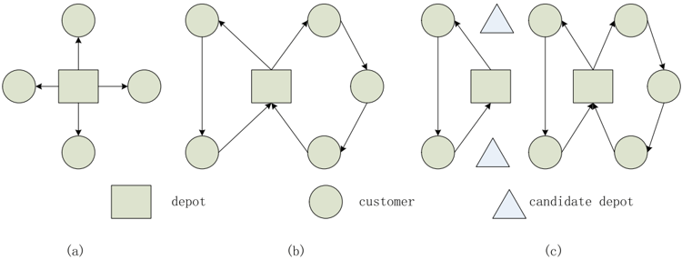

optimal solution with environmental changes; (5) the time complexity of all the algorithms are calculated and analyzed to show the efficiency of KACO with immigrants. Therefore, the conclusions obtained by all the experimental results suggest that the proposed KACO with three immigrants schemes is a promising method to primely handle the DLRP and for tracing the environmental changes due to their special structures and characteristics.

This rest of the paper is organized as follows. Section 2 introduces the concept of DLRP and the constitution of dynamic environments. Section 3 presents a K-means clustering algorithm to locate the depots. Section 4 describes the conventional ACO algorithms and the proposed algorithm with three immigrants schemes. Section 5 shows and analyzes three experimental results where the first one is the performance of algorithms with or without applying the clustering algorithm in different dynamic environments, the second one is the contrast results among different heuristic algorithms and the last one is the analyses of time complexity of all the algorithms. Finally, Section 6 comes to a conclusion and gives some perspectives for future investigations.

## 2. Dynamic location routing problem

Under the condition of certain constraints for the location routing problem, the locations and number of depots as well as the best transportation route are determined by the objective function which is the minimum total distribution costs. The total costs include the cost of depot construction, the cost of transportation, the cost of vehicles and so on. Under normal circumstances, the LRP belonging to the planning problem of logistics system is seen as an integrated problem between LAP and VRP. Both LAP and VRP are shown to be NP-hard [30]. Hence, LRP also belongs to the class of NP-hard problems [31], and the solution space increases exponentially with the expansion of the problem. Accordingly, heuristic methods are utilized to resolve the LRP instead of the limited exact methods [32].

## 2.1. LAP

For LAP, several depots are selected as the logistics distribution centers to accomplish the minimum total logistics costs when products are transported to a number of customers. In Fig. 1(a), the transportation routes between the depot and customers are divergent. The circular route is not considered in this method from point to point. In other words, each vehicle returns back directly after transporting commodities from the distribution center to customers. This approach is only applicable to the large volumes of commodities and the request of each customer exceeding the loading capacity of each vehicle. In actual distribution, the transportation cost will increase due to the limited loading capacities of vehicles.

## 2.2. VRP

/negationslash

Vehicle routing problem was first applied in the domain of logistics distribution in the early 1960s [33]. It is to find the minimum distance or cost of the routes for several vehicles which return to the depot with certain capacity from a depot to a number of customers. Mathematically, G = ( V A D , , ), where V = { V 0 , V 1 , . . . , Vn } , A = { ( Vi , Vj ) : i = } j and D = { dij : i = } j indicate the vertices, the edges and the distance respectively. q i represents the request of customer i , and Q is the capacity constraint of each vehicle. Moreover, the requests of customers cannot exceed the capacity Q of each vehicle, i.e. max q i ≤ Q . The VRP is a combinatorial optimization problem where the number of solutions increases exponentially with the number of customers serviced. In Fig. 1(b), the transportation tour is considered to optimize routes and the number of vehicles, but the distribution center is fixed. The total logistics costs are limited and usually cannot reach the minimum since the location of distribution center is fixed.

/negationslash

Although the exact algorithm can address VRP, plenty of computational times will be taken [34]. Thus, it cannot meet the requirement of practical applications. In the meantime, heuristic algorithms have been proposed to search for the space

of suboptimal solutions. It significantly reduces the search time and finds the suboptimal solution close to the practical requirement. Some well-known heuristic algorithms include simulated annealing, tabu search, artificial neural networks, genetic algorithm and ant colony algorithm. Some related works can be listed as follows. In [34,35], genetic algorithms were used for solving the VRP. Reimann et al. proposed a D-Ants algorithm for VRP [36]. The capacitated arc routing problem where the aim was to find the minimum cost routes of a vehicle was solved by ant based algorithm [37]. The first dynamic vehicle routing problem (DVRP) was proposed by Wilson and Colvin [38]. Montemanni et al. introduced an ant colony system for DVRP [39]. A particle swarm optimization with variable neighborhood search was used for DVRP in [40].

## 2.3. Dynamic LRP (DLRP)

The objective of LRP is to find the total minimum cost with specific number and locations of depots according to the requests of customers. In Fig. 1(c), both the capacities and the number of depots together with the optimal routes of vehicles are taken into account. LRP integrates VRP and LAP, thus possessing more complex constraints and being closer to reality. The LRP also can be divided into three subproblems including location, demand allocation and vehicle routing. Laporte et al. introduced a random LRP where the request of each customer was known only when the vehicle reached [41]. Chien proposed a method using two different estimated values to predict the length of routes for LRP [42]. Salhi and Fraser described an iterative method where an appropriate termination rule was found by exchanging information between location and arrangement of routes [43]. Russell et al. adopted a tabu search to resolve LRP with time windows [44]. Several LRPs with the boundary constraints such as capacity, the minimum cost and the maximum transportation length were studied in [41,45]. A two-phase tabu search approach considering both facility location and vehicle routing was proposed to explore the solution space of the LRP efficiently [46]. A cluster analysis based sequential heuristic algorithm with hierarchical and non-hierarchical techniques and several proximity measures was presented to address the capacitated location-routing problem [47].

The above mentioned methods are utilized to address the LRP well only in static environments. However, the LRP in dynamic environments is more challenging. The characteristic of dynamic environments is the changes of the problem occur frequently over time. When the environment changes, it is likely that the search space alters and the new optimal solution is different from the current one. Thus, for the DLRP, the purpose is to track the optimal solution over time with the environmental changes. Generally, the dynamic environments consist of random and cyclic traffic factors.

## 2.3.1. DLRP with random traffic factor

Random traffic congestion indicates the distance between cities i and j changes randomly with the limited traffic factor over time. The expression is Dij = Dij × T i j , where Dij is the traveled distance between cities i and j , and T ij is the traffic factor between cities i and j . The traffic factor represents the condition of current traffic congestion between cities. T ij ∈ [ TL , TH ], where TL and TH denote the lower and upper bounds of traffic factor respectively. In each iteration of algorithm, T ij is generated randomly according to probability rules. Large, medium or small values of T ij indicate high, normal, or slight traffic congestion respectively, and T i j = 1 means no traffic jams.

## 2.3.2. DLRP with cyclic traffic factor

In the real world, the traffic usually represents cyclic pattern. In rush hours, the traffic congestion is severe. However, in the rest of time, the traffic keeps steady. Therefore, the cyclic traffic pattern corresponds better to the realistic traffic situation because the previous environment will appear again in the future. It is the hybrid of several traffic factors since it uses traffic factors to generate different dynamic environments. In each dynamic environment, the traffic factors are generated with different probabilities as the base states. The environment of each iteration is in these base states and changes cyclically. The generating method of cyclic traffic factors is the same as the random traffic factors, and TL and TH indicate the environments are in evening hours and rush hours, respectively.

In this paper, we assume that the capacity of each depot is sufficiently large and the request of each customer which is met by a single vehicle whose capacity is certain. The number and requests of customers determine the number of vehicles. The depots and surrounding cities are constructed by the K-means algorithm described in Section 3. In this way, we can obtain the total minimum cost based on the distance of the routes constructed by all vehicles.

## 3. K-means algorithm

K-means algorithm is a typical clustering method where the objective function is the sum of distance between data and clustering center, and the method of function extremum is used to adjust judgment rule during the iterations. The core idea is to divide a set of n data into different k classes in order to minimize the objective function and to separate each compact classes as far as possible.

In the K-means algorithm, the metric of similarity is the Euclidean distance. The initial clustering centers are classified optimally according to the minimum value of evaluating indicator J c which indicates the sum of error squares. It is defined as:

<!-- formula-not-decoded -->

where Xi denotes the set of clustering centers, mi is the average value of the clustering center i and p is the data included in the clustering center i . The search of objective function is along the sum of error squares decreasing direction.

The traditional K-means algorithm can resolve the clustering problems effectively, but it depends on the k value. Improper k gives significant influences on the actual effect of the algorithm. In this paper, the distance cost function F [48] is used to determine the k value. It is described as follow:

<!-- formula-not-decoded -->

where m is the average value of all the data and other parameters defined are the same as J c . When the F reaches minimum, the clustering result is the best, and the resultant k is obtained according to the minimum F . In addition, the upper bound of k is defined as k /lessorequalslant √ n [49], where n is the scale of the problem. This method can reduce the search range for the optimal k . The K-means algorithm based on the distance cost function can quickly converge to the optimal k due to the simple structure and low computational complexity. The procedure of the used K-means algorithm is shown in Algorithm 1. Through the classification capacity of this algorithm, several depots and nearby cities are established. Thereafter, it is expected that the ant colony optimization introduced in Section 4 can obtain better performance when resolving the DLRP.

## Algorithm 1 K-means.

01: input the clustering number k = 1 and n data 02: while k /lessorequalslant √ n 03: for i = 1 2 , , . . . , k do 04: initialize clustering centers randomly 05: end for 06: while termination criteria not satisfied do 07: calculate distances and classify 08: calculate the average distance value of each class 09: make new clustering centers 10: end while 11: calculate the distance cost function F and record 12: k = k + 1 13: end while 14: find the optimal k according to the minimum F

## 4. Proposed ant colony optimization with clustering

## 4.1. Conventional ACO

The original ACO is ant system (AS) first proposed by Dorigo and used for resolving the TSP [50]. It adopts the pheromone stored on the path to find the best route. In AS, all the ants construct respective route and deposit corresponding pheromone on their traveled trails. The possibility p k i j of an ant k moving from the city i to the city j is described as follow:

<!-- formula-not-decoded -->

where N k i indicates the set of cities which can be visited by ant k at the city i . τ ij denotes the pheromone concentration between cities i and j . η i j = 1 / dij is the heuristic information, where d ij is the distance between cities i and j . The parameters α and β determine the relative importance of pheromone τ and heuristic information η respectively. After constructing the routes, the pheromone update rule is accomplished as follow:

<!-- formula-not-decoded -->

where ρ ∈ (0, 1] is the evaporation rate which controls the pheromone concentration on the path. /Delta1τ k i j = Q L k / is the pheromone deposited by the ant k , where L k is the length of the tour of the ant k found in the current iteration and Q is a constant.

The subsequent variant is the elitist strategy for ant system (EAS) which reinforces the best-so-far route by adding extra pheromone [3]. The updating pheromone different from AS is shown as follow:

<!-- formula-not-decoded -->

where /Delta1τ bs i j = σ Q L bs / is the pheromone deposited by the best-so-far ant and σ denotes the number of the best-so-far ants. A superior variant of ACO, namely MAX-MIN ant system (MMAS) proposed by Stützle and Hoos [51] improves the performance of ACO. MMAS has nice features for resolving the TSP. In MMAS, the pheromone update is implemented as follow:

<!-- formula-not-decoded -->

where /Delta1τ bs i j = 1 / L bs is the pheromone deposited by the best-so-far or iteration-best ant. To avoid stagnation of algorithm, the pheromone concentration is limited to an interval [ τ min , τ max ]. And the initial pheromone is set to τ max with a low evaporation rate in order to initially expand search space of solutions.

Ant colony system (ACS) also displays promising result for TSP since it utilizes global and local pheromone update and two search mechanisms [50]. In ACS, a pseudo-random proportion rule is described as follow: the possibility of an ant k moving from the cities i to j depends on a random variable q and a parameter q 0 . Both q and q 0 distribute uniformly between 0 and 1, i.e. q ∈ [0, 1], q 0 ∈ [0, 1]. q 0 is a key factor to improve the efficiency of ACS. When q &gt; q 0 , the expression of visiting the next city j from city i is the same as AS. When q ≤ q 0 , the formula is described as follow:

<!-- formula-not-decoded -->

The global pheromone update is given as follow:

<!-- formula-not-decoded -->

<!-- formula-not-decoded -->

The ACS only permits the best-so-far ant updates pheromone and the pheromone of other paths keeps invariant.

The local pheromone update is displayed as follow:

<!-- formula-not-decoded -->

<!-- formula-not-decoded -->

where ϕ ∈ (0, 1] is the pheromone decay coefficient and τ 0 is the initial value of pheromone.

## 4.2. ACO with three immigrants schemes

## 4.2.1. Random immigrants

The ACO with random immigrants for DTSP has been demonstrated that they can keep a certain level of diversity [52]. The randomly generated immigrant ants introduced to the population replace the worst ants in k short according to r × Ks , where k short , r and Ks indicate the short-term memory, the replacement rate and the size of k short , respectively. The ACO with random immigrants is proposed to tackle the DTSP with quickly and significantly changing environments because this kind of environments are importantly different from the previous environment and there is not sufficient time to transfer the knowledge from the previous environment. The diversity is increased by generating random ants. Nevertheless, there is a high risk that the ants may track the optimum mistakenly if the diversity is too high.

## 4.2.2. Elitism-based immigrants

The ACO with elitism-based immigrants was proposed for DTSP with slowly and slightly changing environments [52]. The elitism-based immigrants generating from the previous environment replace the worst ants in k short according to r × Ks , where k short , r and Ks have been mentioned above. An inver-over operator is used to change the best solution wherein two cities are selected and the segment between them is reversed from the previous environment. This method cannot only partly maintain the best solution from the previous environment but also increase the diversity. When the environment changes slightly or slowly, the ACO with elitism-based immigrants has sufficient time to transfer the knowledge from the previous environment and track the optimum. It also has a risk of converging into a local optimum if too much knowledge needs to be transferred.

## 4.2.3. Memory-based immigrants

The ACO with memory-based immigrants is an improved version of the elitism-based immigrants. It not only uses k short but also introduces a long-term memory called k long where the best solutions are obtained from a number of previous environments. And the k long is first filled with randomly generated ants and then use the best-so-far ant to replace all random ants or the closest ant whose route is the most similar. The similarity between ants i and j is based on the metric described as follow:

<!-- formula-not-decoded -->

where CE ij denotes the number of common edges between ants i and j , and n is the number of cities. When the environment changes, the ACO with memory-based immigrants updates the ants in k long . And the best ant is selected from k long to generate the memory-based immigrants with inver-over operator in k short according to r × Ks . Meanwhile, noise may influence the detection of changing environment. In order to avoid unnecessary loss caused by the noise, besides a fixed time interval such as iteration f , another mechanism t = f + R is adopted, where f is the current iteration, R ∈ [5, 10] is a random number and t is the next update time for k long [7]. It means that the algorithm updates the k long with two patterns where one is to update via detecting the changes of dynamic environments and the other is to update on the basis of iteration t with no change. The ACO with memory-based immigrants is confoundedly efficient when certain previous environments reappear, such as cyclic DTSP, and the k long plays an important role in different environments.

## 4.3. Proposed KACO with three immigrants schemes for DLRP

Despite ACO has been successfully used to resolve the DTSP, several issues must be addressed when using ACO to solve the DLRP due to the requests of customers and loading capacity of each vehicle in its subproblem VRP. Generally, VRP is more complex than TSP. When using ACO to tackle VRP, each individual ant represents a vehicle. The route constructed by several vehicles meets the requests of all the customers. The implementation of the proposed ACO used in KACO can be described as in the following.

In constructing solutions, the proposed ACO places all the ants on the identical city which actually represents the depot for VRP and each ant not only considers the distance in terms of Eq. (3) but also depends on the constraints of customers and vehicles to determine the next city. During the updating pheromone procedure, the proposed ACO adopts modified schemes to carry out pheromone updating. In the proposed ACO, the short-term memory is utilized to update pheromone after each iteration. After all the ants construct tours, the Ks best ants of current iteration t are selected into short-term memory and each ant k of k short ( ) t deposits pheromone, as follows:

<!-- formula-not-decoded -->

Meanwhile, the Ks best ants of previous iteration t -1 are removed and their corresponding pheromone trails are eliminated, as follows:

<!-- formula-not-decoded -->

<!-- formula-not-decoded -->

We use Eq. (13) shown in the following to calculate the increment of pheromone caused by the ants from the k short ,

<!-- formula-not-decoded -->

where τ max and τ 0 are the maximum and initial values of pheromone respectively and Ks is the size of the k short introduced in Section 4.2. We set τ min = τ 0 and τ max = τ 0 + ∑ Ks k = 1 /Delta1τ k i j to maintain pheromone concentration to a certain range. Furthermore, k immigrant ants are generated to replace k worst ants from k short in each iteration according to the replacement rate. In the end of each search iteration, the total distances of routes are computed as the objective function value, and the minimum distance in each iteration is recorded. Finally, after all ants return to the depot, the proposed ACO can construct a feasible route for the DLRP in a single search iteration.

In this paper, the depots are obtained by the above K-means algorithm and each ant representing a vehicle departs from one depot to search optimal routes in each class obtained by the K-means algorithm. The request R of each customer and the loading capacity C of each vehicle are given beforehand. Within each class which is classified based on the minimum distance by the K-means algorithm, the proposed ACO with three immigrants schemes can optimize the DLRP. The resultant ACO with K-means algorithm (i.e. KACO) is presented in Algorithm 2, where M and N are the number of ants and cities respectively. t indicates the iteration time. In Algorithm 2, the user-defined parameters are first set up. The K-means algorithm used in step 2 is to resolve the subproblem LAP, and to determine the depots and their surrounding cities in each class. The following steps in Algorithm 2 describe the procedures of the KACO to track the optimal solution of DLRP by using three kinds of immigrants schemes (step 17). The concrete implementation of these schemes, i.e., random, elitism-based and memory-based immigrants have been introduced in the former sections. In the following, the KACOs using random, elitism-based, and memory-based immigrants are thus called KACO-RI, KACO-EI, and KACO-MI, respectively.

## 5. Experiments and discussions

## 5.1. Experimental setup

To assess the performance of KACO with three immigrants, several experiments are conducted using benchmark TSP instances adopted from TSPLIB. In this research, three TSP instances, i.e. eil51, lin105 and kroB200 are taken to represent the small, medium and large cities, respectively. Through the different scales of cities, the performance of KACO with three immigrants can be obviously observed. Furthermore, to verify the effect of the K-means algorithm, KACO is compared with the ACO without the utilization of the K-means algorithm as described in [7]. A comparative experiment is implemented between the proposed algorithm and several other heuristic algorithms for solving the DLRP. Finally, the time complexity of all the algorithms are analyzed.

## Algorithm 2 KACO with three immigrants for DLRP. 01: initialize the parameters α,β,τ , 0 Ks , K l , N M C R r t , , , , , 02: determine the k depots and classes according to Algorithm 1 03: for i = 1 2 , , . . . , k do 04: while termination criteria not satisfied do 05: construct dynamic environments 06: clear routes, k short , k long 07: allocate M ants to the depot i 08: if city is not visited then 09: if R /lessorequalslant C then 10: construct routes according to Eq. (3) 11: update C 12: else 13: return to 07 14: end if 15: end if 16: find Ks iteration-best solutions to add to the k short 17: generate r × Ks random, elitism-based or memory-based immigrants to update the k short 18: pheromone update with k short according to Eqs. (11) and (12) 19: compare iteration-best solution with best-so-far solution to record the optimal solution 20: t = t + 1 21: end while 22: end for

The dynamic environments are constructed by random and cyclic traffic factors whose values are set in the interval of [1, 5], i.e. T L = 1 and T H = 5 , respectively. The cyclic environment contains four cyclic states which are generated by random traffic factors. The two characteristics of dynamic environments are the frequency and magnitude of environmental changes. To be specific, m denotes the magnitude of environmental changes, and each link between cities i and j has the probability m to add traffic, by generating a different T ij . The value of m is set to be 0.1, 0.5 and 0.9, aiming to represent small, medium and large environmental changes respectively. f indicates the frequency of environmental changes. That is to say, the environment will be changed by a random traffic every f hours (i.e., one observation in the experiment). The value of f is set to be 10 and 100 to illustrate the quick and slow environmental changes respectively. On the other hand, the cyclic environment is constructed by generating different dynamic cases with random traffic factor as the base states, and the environment cycles among these base states in a fixed logical ring [7]. In the experiment, three groups of different base states are generated by setting m to be 0.1, 0.5, and 0.9 respectively, and each group includes four base states by sampling the dynamic environment using a same probability m for four times.

The user-defined parameters in KACO are set as in the following. α = 1 , β = 5 , Ks = 6 , Kl = 4 , r = 0 4 . , pm = 0 02 . listed in [7], which have shown to be capable of possessing robust and acceptable performance on solving dynamic tour-based problems, were adopted in this research. The initial pheromone is set as τ 0 = 1 / Ls , where Ls denotes the distance of the shortest tour. The number of ants is M = 30. The loading capacity of each vehicle is C = 1000 and the request of each customer is R = 100. After the execution of K-means algorithm, the ant search procedure in KACO is run 30 times to make a statistical analysis, and 1000 iterations in each run are implemented to act as the temporal termination condition of the algorithm. To compare the different performances in a dynamic environment, a reasonable method is to calculate the average tour length of all the best solutions which is found in each iteration [15]. The total evaluation defined in this work is shown as follow:

<!-- formula-not-decoded -->

where K is the clustering number, T is the number of iterations, N is the number of runs and f bs kti is the objective value (i.e., tour length) of the best solution found in the class k of the iteration t during the i th run. The results in Tables 2 and 3 are calculated based on Eq. (14). All the experiments are implemented on a PC with 2.67GHz Intel(R) Core(TM) i5 processor and 4GB of RAM using Microsoft Visual Studio 2010.

## 5.2. Experimental results and analysis

## 5.2.1. Results for KACO and WKACO

To demonstrate the performance of KACO with three immigrants in dynamic environments, we also construct an ACO (named WKACO) with three immigrants described in [7] to make a comparison. In the experiment thirty six DLRP instances

Table 1 Parameter settings for comparative algorithms in the experiment.

| Algorithm   | α    | β       | ρ   | ϕ    | q 0   | K s   | K l   | M   |
|-------------|------|---------|-----|------|-------|-------|-------|-----|
| KACO-RI     | 1    | 5       | -   | -    | -     | 6     | -     | 30  |
| KACO-EI     | 1    | 5       | -   | -    | -     | 6     | -     | 30  |
| KACO-MI     | 1    | 5       | -   | -    | -     | 6     | 4     | 30  |
| AS          | 1    | 5       | 0.5 | -    | -     | -     | -     | 30  |
| EAS         | 1    | 5       | 0.5 | -    | -     | -     | -     | 30  |
| MMAS        | 1    | 5       | 0.6 | -    | -     | -     | -     | 30  |
| ACS         | 1    | 5       | 0.1 | 0.1  | 0.9   | -     | -     | 30  |
| P-ACO       | 1    | 5       | -   | -    | 0.9   | -     | 4     | 30  |
| Algorithm   | T 0  | T f     | K   | γ    | N     | I     |       |     |
| SA          | 3000 | 1 e - 8 | 1/9 | 0.95 | 100   | 5000  |       |     |
| Algorithm   | P c  | P m     | P l | T    |       |       |       |     |
| GA          | 0.8  | 0.05    | 30  | 1000 |       |       |       |     |

Table 2

| eil51 m   | 7 depots and 7 vehicles (KACO)   | 7 depots and 7 vehicles (KACO)   | 7 depots and 7 vehicles (KACO)   | 7 depots and 7 vehicles (KACO)   | 7 depots and 7 vehicles (KACO)   | 7 depots and 7 vehicles (KACO)   | 1 depot and 6 vehicles (WKACO)   | 1 depot and 6 vehicles (WKACO)   | 1 depot and 6 vehicles (WKACO)   | 1 depot and 6 vehicles (WKACO)   | 1 depot and 6 vehicles (WKACO)   | 1 depot and 6 vehicles (WKACO)   |
|-----------|----------------------------------|----------------------------------|----------------------------------|----------------------------------|----------------------------------|----------------------------------|----------------------------------|----------------------------------|----------------------------------|----------------------------------|----------------------------------|----------------------------------|
| eil51 m   | f = 10                           | f = 10                           | f = 10                           | f = 100                          | f = 100                          | f = 100                          | f = 10                           | f = 10                           | f = 10                           | f = 100                          | f = 100                          | f = 100                          |
| eil51 m   | 0.1                              | 0.5                              | 0.9                              | 0.1                              | 0.5                              | 0.9                              | 0.1                              | 0.5                              | 0.9                              | 0.1                              | 0.5                              | 0.9                              |
| RI        | 517.2                            | 755.1                            | 1380.9                           | 516.5                            | 734.2                            | 1361.2                           | 658.0                            | 924.3                            | 1663.3                           | 616.3                            | 842.9                            | 1566.2                           |
| EI        | 521.6                            | 770.1                            | 1414.5                           | 518.3                            | 743.6                            | 1382.6                           | 658.3                            | 922.0                            | 1655.1                           | 618.0                            | 853.2                            | 1587.6                           |
| MI        | 519.0                            | 765.4                            | 1400.1                           | 517.4                            | 742.3                            | 1378.5                           | 654.9                            | 923.4                            | 1658.5                           | 617.5                            | 856.8                            | 1585.0                           |
| T (s)     | 17.9                             | 14.9                             | 16.9                             | 19.3                             | 17.5                             | 17.2                             | 3.06                             | 3.30                             | 3.48                             | 3.23                             | 4.59                             | 3.38                             |
| lin105    | 6 depots and 13 vehicles (KACO)  | 6 depots and 13 vehicles (KACO)  | 6 depots and 13 vehicles (KACO)  | 6 depots and 13 vehicles (KACO)  | 6 depots and 13 vehicles (KACO)  | 6 depots and 13 vehicles (KACO)  | depot and 11 vehicles (WKACO)    | depot and 11 vehicles (WKACO)    | depot and 11 vehicles (WKACO)    | depot and 11 vehicles (WKACO)    | depot and 11 vehicles (WKACO)    | depot and 11 vehicles (WKACO)    |
| lin105    | f = 10                           | f = 10                           | f = 10                           | f = 100                          | f = 100                          | f = 100                          | f = 10                           | f = 10                           | f = 10                           | f = 100                          | f = 100                          | f = 100                          |
| m         | 0.1                              | 0.5                              | 0.9                              | 0.1                              | 0.5                              | 0.9                              | 0.1                              | 0.5                              | 0.9                              | 0.1                              | 0.5                              | 0.9                              |
| RI        | 20713.3                          | 29102.4                          | 51594.2                          | 19803.8                          | 27055.4                          | 49242.8                          | 34177.7                          | 49952.9                          | 88443.5                          | 32171.4                          | 44855.4 45776.7                  | 80428.1                          |
| EI        | 21535.5                          | 30127.4                          | 53101.2                          | 20418.0                          | 28186.4                          | 51217.2                          | 34229.2                          | 49193.3                          | 87102.2                          | 32621.6                          |                                  | 80864.7                          |
| MI        | 20918.1                          | 29696.5                          | 52382.3                          | 20149.9                          | 27957.0                          | 50946.3                          | 33615.5                          | 49160.1                          | 87095.5                          | 32486.4                          | 45531.7                          | 80725.2                          |
| T (s)     | 13.1                             | 13.6                             | 9.33                             | 13.7                             | 13.2                             | 13.7                             | 5.26                             | 4.71                             | 5.27                             | 4.14                             | 4.13                             | 4.11                             |
| kroB200   | 11 depots and 25 vehicles (KACO) | 11 depots and 25 vehicles (KACO) | 11 depots and 25 vehicles (KACO) | 11 depots and 25 vehicles (KACO) | 11 depots and 25 vehicles (KACO) | 11 depots and 25 vehicles (KACO) | 1 depot and 20 vehicles (WKACO)  | 1 depot and 20 vehicles (WKACO)  | 1 depot and 20 vehicles (WKACO)  | 1 depot and 20 vehicles (WKACO)  | 1 depot and 20 vehicles (WKACO)  | 1 depot and 20 vehicles (WKACO)  |
| kroB200   | f = 10                           | f = 10                           | f = 10                           | f = 100                          | f = 100                          | f = 100                          | f = 10                           | f = 10                           | f = 10                           | f = 100                          | f = 100                          | f = 100                          |
| m         | 0.1                              | 0.5                              | 0.9                              | 0.1                              | 0.5                              | 0.9                              | 0.1                              | 0.5                              | 0.9                              | 0.1                              | 0.5                              | 0.9                              |
| RI        | 43527.9                          | 61975.4                          | 111063.3                         | 41412.0                          | 55758.7                          | 104510.2                         | 85574.1                          | 125959.6                         | 217836.5                         | 80823.5                          | 112251.2                         | 198169.6                         |
| EI        | 45701.1                          | 63522.2                          | 113602.3                         | 42808.7                          | 57635.6                          | 108124.0                         | 84291.5                          | 123394.3                         | 214484.3                         | 81009.3                          | 112241.8                         | 196741.3                         |
| MI        | 44213.0                          | 62869.7                          | 112678.8                         | 42319.0                          | 57371.8                          | 107662.6                         | 83569.8                          | 123443.2                         | 214323.3                         | 80516.8                          | 112835.8                         | 197165.1                         |
| T (s)     | 36.0                             | 37.1                             | 37.7                             | 37.2                             | 36.9                             | 38.0                             | 14.9                             | 15.4                             | 14.9                             | 11.0                             | 11.4                             | 11.3                             |

are tested, generating from two different frequencies and three kinds of magnitudes for two types (random or cyclic) of DLRP based on the three kinds of benchmark TSP instances. Experimental results are summarized in Tables 2 and 3 which present the performances of KACO and WKACO with three immigrants in random and cyclic environments respectively. In addition, the effects of the three immigrants (i.e., random immigrants, elitism-based immigrants, and memory-based immigrants) on the ACO with K-means (i.e., KACO) or without K-means (i.e., WKACO) are verified. The results obtained by using the Wilcoxon signed ranks test [53] at a level of significance α = 0 05 are listed in Tables 4 and 5 to show significant . differences between KACO and WKACO with three immigrants.

In Tables 2 and 3, the results of depots and vehicles obtained in the experiments are firstly summarized. Different from the number of depots which is determined by the K-means algorithm, the number of vehicles are calculated by fulfilling the condition of both the requirements of customers and the capacity of a single vehicle. In details, the number of depots needed in the three benchmark problems (eil51, lin105 and kroB200) are 7, 6 and 11 respectively for KACO, and always 1 for WKACO. Meanwhile, the number of vehicles needed for customers are 7, 13, 25 for KACO, and 6, 11, 20 for WKACO in the three problems, respectively. From these results, it is clear that, by resolving the LAP such that the cities in DLRP can be classifies into groups, the K-means algorithm increases the number of total depots and vehicles in DLRP, and the number of vehicles generally increases along with the scale of problem becoming larger. Besides, it is worth emphasizing that the number of vehicles required is almost the same in both KACO and WKACO with the difference of less than 5 vehicles,

Table 3 environments, where RI, EI and MI denote random immigrants, elitism-based

Simulation results of KACO and WKACO with three immigrants in cyclic immigrants and memory-based immigrants respectively, and T indicates the average running time of the algorithms executed one time in seconds.

| eil51   | 7 depots and 7 vehicles (KACO)   | 7 depots and 7 vehicles (KACO)   | 7 depots and 7 vehicles (KACO)   | 7 depots and 7 vehicles (KACO)   | 7 depots and 7 vehicles (KACO)   | 7 depots and 7 vehicles (KACO)   | 1 depot and 6 vehicles (WKACO)   | 1 depot and 6 vehicles (WKACO)   | 1 depot and 6 vehicles (WKACO)   | 1 depot and 6 vehicles (WKACO)   | 1 depot and 6 vehicles (WKACO)   | 1 depot and 6 vehicles (WKACO)   |
|---------|----------------------------------|----------------------------------|----------------------------------|----------------------------------|----------------------------------|----------------------------------|----------------------------------|----------------------------------|----------------------------------|----------------------------------|----------------------------------|----------------------------------|
| eil51   | f = 10                           | f = 10                           | f = 10                           | f = 100                          | f = 100                          | f = 100                          | f = 10                           | f = 10                           | f = 10                           | f = 100                          | f = 100                          | f = 100                          |
| m       | 0.1                              | 0.5                              | 0.9                              | 0.1                              | 0.5                              | 0.9                              | 0.1                              | 0.5                              | 0.9                              | 0.1                              | 0.5                              | 0.9                              |
| RI      | 530.1                            | 730.1                            | 1360.4                           | 524.5                            | 698.6                            | 1332.3                           | 665.4                            | 894.6                            | 1669.6                           | 627.2                            | 824.7                            | 1570.2                           |
| EI      | 535.7                            | 742.8                            | 1395.7                           | 525.9                            | 705.4                            | 1355.1                           | 665.0                            | 893.6                            | 1662.0                           | 630.1                            | 835.5                            | 1582.7                           |
| MI      | 529.4                            | 725.7                            | 1365.4                           | 524.9                            | 702.2                            | 1347.9                           | 648.5                            | 848.2                            | 1611.7                           | 627.5                            | 827.6                            | 1575.7                           |
| T (s)   | 20.9                             | 23.9                             | 24.5                             | 21.6                             | 21.9                             | 22.3                             | 4.75                             | 4.42                             | 4.80                             | 4.59                             | 4.21                             | 4.58                             |
| lin105  | 6 depots and 13 vehicles (KACO)  | 6 depots and 13 vehicles (KACO)  | 6 depots and 13 vehicles (KACO)  | 6 depots and 13 vehicles (KACO)  | 6 depots and 13 vehicles (KACO)  | 6 depots and 13 vehicles (KACO)  | 1 depot and 11 vehicles (WKACO)  | 1 depot and 11 vehicles (WKACO)  | 1 depot and 11 vehicles (WKACO)  | 1 depot and 11 vehicles (WKACO)  | 1 depot and 11 vehicles (WKACO)  | 1 depot and 11 vehicles (WKACO)  |
| lin105  | f = 10                           | f = 10                           | f = 10                           | = 100                            | = 100                            | = 100                            | = 10                             | = 10                             | = 10                             | = 100                            | = 100                            | = 100                            |
| m       | 0.1                              | 0.5                              | 0.9                              | 0.1                              | 0.5                              | 0.9                              | 0.1                              | 0.5                              | 0.9                              | 0.1                              | 0.5                              | 0.9                              |
| RI      | 20406.1                          | 29197.1                          | 51357.6                          | 19746.7                          | 27179.6                          | 47505.4                          | 34505.9                          | 49603.5                          | 85318.7                          | 32261.4                          | 44587.5                          | 78289.7                          |
| EI      | 20905.4                          | 30306.3                          | 52918.9                          | 20112.7                          | 28089.4                          | 49549.5                          | 34449.4                          | 48652.2                          | 83642.5                          | 32790.7                          | 45001.2                          | 78562.7                          |
| MI      | 20019.2                          | 28455.3                          | 49876.6                          | 19918.0                          | 27697.8                          | 48781.5                          | 33162.3                          | 46660.8                          | 79927.3                          | 32264.2                          | 44670.0                          | 77626.3                          |
| T (s)   | 13.5                             | 10.4                             | 12.3                             | 13.2                             | 13.2                             | 13.1                             | 4.47                             | 5.35                             | 5.00                             | 4.16                             | 4.45                             | 4.11                             |
| kroB200 | 11 depots and 25 vehicles (KACO) | 11 depots and 25 vehicles (KACO) | 11 depots and 25 vehicles (KACO) | 11 depots and 25 vehicles (KACO) | 11 depots and 25 vehicles (KACO) | 11 depots and 25 vehicles (KACO) | 1 depot and 20 vehicles (WKACO)  | 1 depot and 20 vehicles (WKACO)  | 1 depot and 20 vehicles (WKACO)  | 1 depot and 20 vehicles (WKACO)  | 1 depot and 20 vehicles (WKACO)  | 1 depot and 20 vehicles (WKACO)  |
| kroB200 | f = 10                           | f = 10                           | f = 10                           | f = 100                          | f = 100                          | f = 100                          | f = 10                           | f = 10                           | f = 10                           | f = 100                          | f = 100                          | f = 100                          |
| m       | 0.1                              | 0.5                              | 0.9                              | 0.1                              | 0.5                              | 0.9                              | 0.1                              | 0.5                              | 0.9                              | 0.1                              | 0.5                              | 0.9                              |
| RI      | 43246.8                          | 59311.1                          | 113632.4                         | 41416.5                          | 54647.3                          | 104991.6                         | 85586.0                          | 126594.6                         | 219573.9                         | 81042.8                          | 111642.7                         | 200979.5                         |
| EI      | 45072.2                          | 61111.8                          | 116241.1                         | 42628.8                          | 56835.5                          | 108866.5                         | 85066.5                          | 123822.0                         | 215919.8                         | 81102.7                          | 111363.8                         | 201458.9                         |
| MI      | 42763.5                          | 57298.3                          | 110371.3                         | 42005.2                          | 55848.3                          | 107571.1                         | 82000.2                          | 117606.5                         | 207429.4                         | 80042.2                          | 109612.5                         | 199717.1                         |
| T (s)   | 35.0                             | 36.3                             | 37.6                             | 33.5                             | 35.3                             | 35.5                             | 13.0                             | 12.9                             | 13.6                             | 11.5                             | 11.3                             | 11.4                             |

## Table 4

Statistical results of the Wilcoxon signed ranks test at a level of significance α = 0 05 for . KACO and WKACO with three immigrants in random environments, where ' + ' or ' -' denotes the former or the latter performs better respectively, and ' ∼ ' denotes no significance.

| eil51   | 7 depots and 7 vehicles (KACO)   | 7 depots and 7 vehicles (KACO)   | 7 depots and 7 vehicles (KACO)   | 7 depots and 7 vehicles (KACO)   | 7 depots and 7 vehicles (KACO)   | 7 depots and 7 vehicles (KACO)   | 1 depot and 6 vehicles (WKACO)   | 1 depot and 6 vehicles (WKACO)   | 1 depot and 6 vehicles (WKACO)   | 1 depot and 6 vehicles (WKACO)   | 1 depot and 6 vehicles (WKACO)   | 1 depot and 6 vehicles (WKACO)   |
|---------|----------------------------------|----------------------------------|----------------------------------|----------------------------------|----------------------------------|----------------------------------|----------------------------------|----------------------------------|----------------------------------|----------------------------------|----------------------------------|----------------------------------|
| eil51   | f = 10                           | f = 10                           | f = 10                           | f = 100                          | f = 100                          | f = 100                          | f = 10                           | f = 10                           | f = 10                           | f = 100                          | f = 100                          | f = 100                          |
| m       | 0.1                              | 0.5                              | 0.9                              | 0.1                              | 0.5                              | 0.9                              | 0.1                              | 0.5                              | 0.9                              | 0.1                              | 0.5                              | 0.9                              |
| RI:EI   | +                                | +                                | +                                | +                                | +                                | +                                | ∼                                | -                                | -                                | ∼                                | +                                | +                                |
| EI:MI   | -                                | -                                | -                                | -                                | ∼                                | -                                | -                                | ∼                                | +                                | ∼                                | ∼                                | ∼                                |
| MI:RI   | -                                | -                                | -                                | -                                | -                                | -                                | +                                | ∼                                | +                                | ∼                                | -                                | -                                |
| lin105  | 6 depots and 13 vehicles (KACO)  | 6 depots and 13 vehicles (KACO)  | 6 depots and 13 vehicles (KACO)  | 6 depots and 13 vehicles (KACO)  | 6 depots and 13 vehicles (KACO)  | 6 depots and 13 vehicles (KACO)  | 1 depot and 11 vehicles (WKACO)  | 1 depot and 11 vehicles (WKACO)  | 1 depot and 11 vehicles (WKACO)  | 1 depot and 11 vehicles (WKACO)  | 1 depot and 11 vehicles (WKACO)  | 1 depot and 11 vehicles (WKACO)  |
| lin105  | f = 10                           | f = 10                           | f = 10                           | f = 100                          | f = 100                          | f = 100                          | f = 10                           | f = 10                           | f = 10                           | f = 100                          | f = 100                          | f = 100                          |
| m       | 0.1                              | 0.5                              | 0.9                              | 0.1                              | 0.5                              | 0.9                              | 0.1                              | 0.5                              | 0.9                              | 0.1                              | 0.5                              | 0.9                              |
| RI:EI   | +                                | +                                | +                                | +                                | +                                | +                                | ∼                                | -                                | -                                | +                                | +                                | ∼                                |
| EI:MI   | -                                | -                                | -                                | -                                | -                                | -                                | -                                | ∼                                | ∼                                | ∼                                | ∼                                | ∼                                |
| MI:RI   | -                                | -                                | -                                | -                                | -                                | -                                | +                                | +                                | +                                | -                                | -                                | ∼                                |
| kroB200 | 11 depots and 25 vehicles (KACO) | 11 depots and 25 vehicles (KACO) | 11 depots and 25 vehicles (KACO) | 11 depots and 25 vehicles (KACO) | 11 depots and 25 vehicles (KACO) | 11 depots and 25 vehicles (KACO) | 1 depot and 20 vehicles (WKACO)  | 1 depot and 20 vehicles (WKACO)  | 1 depot and 20 vehicles (WKACO)  | 1 depot and 20 vehicles (WKACO)  | 1 depot and 20 vehicles (WKACO)  | 1 depot and 20 vehicles (WKACO)  |
| kroB200 | f = 10                           | f = 10                           | f = 10                           | f = 100                          | f = 100                          | f = 100                          | f = 10                           | f = 10                           | f = 10                           | f = 100                          | f = 100                          | f = 100                          |
| m       | 0.1                              | 0.5                              | 0.9                              | 0.1                              | 0.5                              | 0.9                              | 0.1                              | 0.5                              | 0.9                              | 0.1                              | 0.5                              | 0.9                              |
| RI:EI   | +                                | +                                | +                                | +                                | +                                | +                                | -                                | -                                | -                                | ∼                                | ∼                                | -                                |
| EI:MI   | -                                | -                                | -                                | -                                | -                                | -                                | -                                | ∼                                | ∼                                | -                                | ∼                                | ∼                                |
| MI:RI   | -                                | -                                | -                                | -                                | -                                | -                                | +                                | +                                | +                                | ∼                                | ∼                                | +                                |

while the number of depots in KACO is greatly increased. Since the cost of constructing depots is one-off investment from the practical perspective and the cost of vehicles is almost the same, the average tour length calculated by Eq. (14) thus has strongly influence on the total performance of the algorithms and makes important assistance for decision makers. Furthermore, the values of F bs obtained by KACO are much smaller than those obtained by WKACO for all test problems, suggesting that the K-means algorithm undoubtedly enables the algorithm to possess much better performance in terms of the average tour length.

Table 5 Statistical results of the Wilcoxon signed ranks test at a level of significance α = 0 05 for . KACO and WKACO with three immigrants in cyclic environments, where ' + ' or ' -' denotes the former or the latter performs better respectively, and ' ∼ ' denotes no significance.

| eil51   | 7 depots and 7 vehicles (KACO)   | 7 depots and 7 vehicles (KACO)   | 7 depots and 7 vehicles (KACO)   | 7 depots and 7 vehicles (KACO)   | 7 depots and 7 vehicles (KACO)   | 7 depots and 7 vehicles (KACO)   | 1 depot and 6 vehicles (WKACO)   | 1 depot and 6 vehicles (WKACO)   | 1 depot and 6 vehicles (WKACO)   | 1 depot and 6 vehicles (WKACO)   | 1 depot and 6 vehicles (WKACO)   | 1 depot and 6 vehicles (WKACO)   |
|---------|----------------------------------|----------------------------------|----------------------------------|----------------------------------|----------------------------------|----------------------------------|----------------------------------|----------------------------------|----------------------------------|----------------------------------|----------------------------------|----------------------------------|
| eil51   | f = 10                           | f = 10                           | f = 10                           | f = 100                          | f = 100                          | f = 100                          | f = 10                           | f = 10                           | f = 10                           | f = 100                          | f = 100                          | f = 100                          |
| m       | 0.1                              | 0.5                              | 0.9                              | 0.1                              | 0.5                              | 0.9                              | 0.1                              | 0.5                              | 0.9                              | 0.1                              | 0.5                              | 0.9                              |
| RI:EI   | +                                | +                                | +                                | +                                | +                                | +                                | ∼                                | ∼                                | -                                | +                                | +                                | +                                |
| EI:MI   | -                                | -                                | -                                | -                                | -                                | -                                | -                                | -                                | -                                | ∼                                | +                                | ∼                                |
| MI:RI   | +                                | +                                | -                                | -                                | -                                | -                                | +                                | +                                | +                                | ∼                                | ∼                                | ∼                                |
| lin105  | 6 depots and 13 vehicles (KACO)  | 6 depots and 13 vehicles (KACO)  | 6 depots and 13 vehicles (KACO)  | 6 depots and 13 vehicles (KACO)  | 6 depots and 13 vehicles (KACO)  | 6 depots and 13 vehicles (KACO)  | 1 depot and 11 vehicles (WKACO)  | 1 depot and 11 vehicles (WKACO)  | 1 depot and 11 vehicles (WKACO)  | 1 depot and 11 vehicles (WKACO)  | 1 depot and 11 vehicles (WKACO)  | 1 depot and 11 vehicles (WKACO)  |
| lin105  | f = 10                           | f = 10                           | f = 10                           | f = 100                          | f = 100                          | f = 100                          | = 10                             | = 10                             | = 10                             | f = 100                          | f = 100                          | f = 100                          |
| m       | 0.1                              | 0.5                              | 0.9                              | 0.1                              | 0.5                              | 0.9                              | 0.1                              | 0.5                              | 0.9                              | 0.1                              | 0.5                              | 0.9                              |
| RI:EI   | +                                | +                                | +                                | +                                | +                                | +                                | ∼                                | -                                | -                                | +                                | +                                | ∼                                |
| EI:MI   | -                                | -                                | -                                | -                                | -                                | -                                | -                                | -                                | -                                | -                                | -                                | -                                |
| MI:RI   | +                                | +                                | +                                | -                                | -                                | -                                | +                                | +                                | +                                | ∼                                | ∼                                | +                                |
| kroB200 | 11 depots and 25 vehicles (KACO) | 11 depots and 25 vehicles (KACO) | 11 depots and 25 vehicles (KACO) | 11 depots and 25 vehicles (KACO) | 11 depots and 25 vehicles (KACO) | 11 depots and 25 vehicles (KACO) | 1 depot and 20 vehicles (WKACO)  | 1 depot and 20 vehicles (WKACO)  | 1 depot and 20 vehicles (WKACO)  | 1 depot and 20 vehicles (WKACO)  | 1 depot and 20 vehicles (WKACO)  | 1 depot and 20 vehicles (WKACO)  |
| kroB200 | f = 10                           | f = 10                           | f = 10                           | f = 100                          | f = 100                          | f = 100                          | f = 10                           | f = 10                           | f = 10                           | f = 100                          | f = 100                          | f = 100                          |
| m       | 0.1                              | 0.5                              | 0.9                              | 0.1                              | 0.5                              | 0.9                              | 0.1                              | 0.5                              | 0.9                              | 0.1                              | 0.5                              | 0.9                              |
| RI:EI   | +                                | +                                | +                                | +                                | +                                | +                                | -                                | -                                | -                                | ∼                                | ∼                                | ∼                                |
| EI:MI   | -                                | -                                | -                                | -                                | -                                | -                                | -                                | -                                | -                                | -                                | -                                | -                                |
| MI:RI   | +                                | +                                | +                                | -                                | -                                | -                                | +                                | +                                | +                                | +                                | +                                | +                                |

In order to investigate the performances of algorithms illustratively, a box-and-whisker diagram of solutions is used to depict the properties of algorithms in Fig. 2, where the horizontal axis denotes the KACO and WKACO with three kinds of immigrants schemes respectively, while the vertical axis presents the final solution F bs for all tested DLRP instances. The algorithms' behaviors in lin105 under random environment (as in Fig. 2(c)) are quite illuminating to further elaborate the total performance of the algorithm. The average tour length constructed by KACO are significantly smaller than those by WKACO, while much more computational times are required by KACO. By comparing the results during the three kinds of problems, we can find that KACO outperforms WKACO much better along with the size of the problem increases, indicating that the K-means algorithm is notably important when dealing with large scale DLRP.

Further analysis concerning the difference during the three immigrants schemes is carried out. To elaborate the detail of search performance of each algorithm, all objective values ∑ K k = 1 f bs kti (i.e., the total tour length) in Eq. (14) are recorded. For instance, there are totally 30,000 values (1000 iterations × 30 runs) recorded when f = 10 , m = 0 9 . for KACO with random immigrants (KACO-RI). The Wilcoxon signed ranks test [53] is used to detect significant differences between the behavior of two algorithms. In Table 4, ' + ' denotes the base (former) algorithm outperformed the competitive one (latter), ' -' for the opposite, and ' ∼ ' indicates no significance. It can be observed that the Wilcoxon test results of ' + ' and ' -' are always obtained for 'KACO-RI:KACO-EI' and 'KACO-MI:KACO-RI' respectively in all random environments, suggesting that KACO-RI is a good choice for searching when the environment changes randomly. However, the performance of WKACO-RI significantly declines in random environments, especially in quickly changing environments( f = 10). Additionally, WKACO-RI performs poorly in the large scale of city. The underline reasons seem to be that: (1) K-means algorithm simplifies solution structure to enhance the effect of random immigrants, and thus successfully increases the diversity of the population which is benefit for searching in random environments. Contrarily the solution structure of WKACO-RI is too complex to quickly trace an optimal solution. That is to say, KACO-RI expands search space to find a better solution according to its diversity and simple solution structure, but WKACO-RI fails to improve the diversity of the population and thus has insufficient time to find an optimal solution because of its complicated solution structure. In addition, WKACO-RI also destroys the current optimal pheromone trail to postpone the efficiency of tracing an optimal solution. (2) The diversity introduced by random immigrants is more crucial than the knowledge transformation from the previous environment in random changing environments. Therefore, KACO-RI outperforms KACO-EI and KACO-MI.

On the other hand, Table 5 summarizes the Wilcoxon test results for the DLRP under cyclic environments. Generally, the ACO with memory-based immigrants performs better than those with random immigrants and elitism-based immigrants since similar information of the environment can be effectively utilized by memory-based immigrants in quickly cycling environments, which elucidates the special effects of the long-term memory ( k long ) on the performance of the algorithm. To be specific, the k long memory stores the best solution in each cyclic state, and when the previous environment quickly reappears, the ACO with memory-based immigrants can quickly generate solutions obtained previously to match the

Fig. 2. The results contrast of KACO and WKACO with three immigrants for resolving the LRP in random and cyclic environments, where RI, EI and MI denote random immigrants, elitism-based immigrants and memory-based immigrants, respectively.

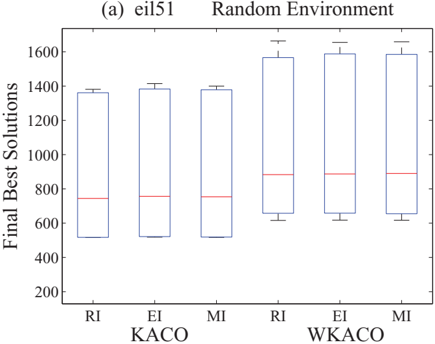

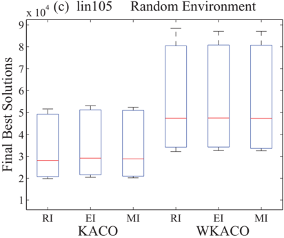

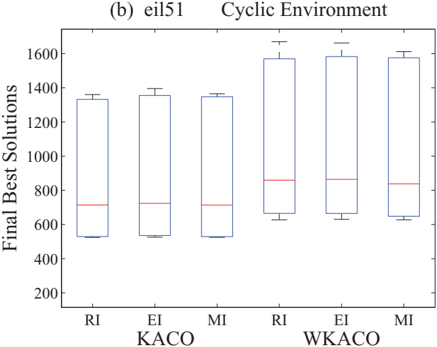

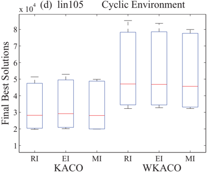

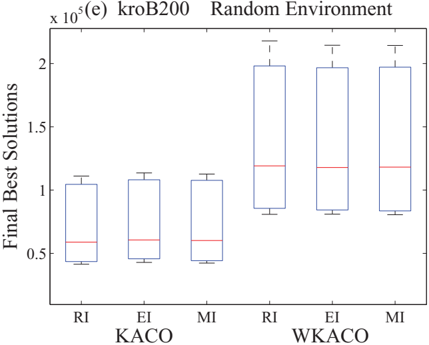

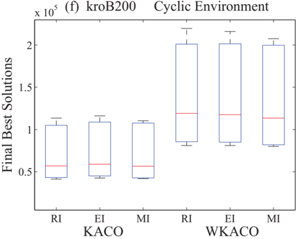

current environment. Accordingly, this long-term memory method can enhance the efficiency of algorithm to achieve the best performance in constantly and quickly reappearing environments. The exception is eil51 with f = 10 , m = 0 9 where . KACO-RI performs better because the scale of city is too small such that the diversity of random immigrants is more suitable for quickly and significantly changing environments. Moreover, KACO-RI outperforms KACO-EI and KACO-MI in slowly cyclic environments ( f = 100) since KACO-RI has sufficient time to explore search space to trace a better solution in terms of diversity. It means that the solutions found by KACO-RI are potentially better than those stored in memory when environment changes slowly. The performances of WKACO-RI are similar between slowly random and cyclic environments due to its complicated structure.

Based on the results in Tables 4 and 5, some general remarks can be summarized in the following: (1) random immigrants with K-means algorithm are suitable for handling the dynamic environments with random or slowly cyclic changing; (2) long-term memory-based immigrants can manipulate quickly cyclic environments effectively; (3) elitism-based immigrants which enable the algorithm to transfer knowledge from previous environments perform the worst among three types of immigrants with K-means algorithm; and (4) K-means algorithm optimizes solution structure of immigrants to obtain better property for solving the DLRP.

Other observations are implemented regarding as the convergence characteristics of the KACO. Figs. 3 and 4 depict the convergence graphs of the best solution found by KACO with the three immigrants under the random environments with m = 0 9 . , f = 10 or 100 and the cyclic environments with m = 0 5 . , f = 10 or 100, respectively. In both figures, the horizontal axis denotes the iteration number, while the vertical axis represents the total tour length ∑ K k = 1 f bs kti found by the best ant in the population. Intuitively, the convergence behavior of KACO exhibits wavelike shapes. That is, the value of the total tour length becomes smaller (i.e., converges) gradually along with the search of the ant within a single iteration, and once the environment changes, the value will suddenly become large and decrease toward its own local optimal solution until the next environmental change takes place. The total numbers of such local convergence are 10 and 100 respectively in Figs. 3 and 4. From Fig. 3, the observation that KACO-RI always performs the best in random environments is verified once again. Fig. 4(a), (c) and (e) also elucidate the superiority of KACO-MI on solving the DLRP under quickly cyclic environments. Fig. 4(b), (d) and (f) give the evidence for the statement that KACO-RI outperforms KACO-EI and KACO-MI under slowly cyclic environments. Both Figs. 3 and 4 show that KACO-EI is inferior to KACO-RI and KACO-MI on solving the DLRP under changing environments.

Finally, discussions concerning the properties of the solutions for the DLRP by KACO and WKACO are addressed. Compared with WKACO, the superiority of KACO mainly realizes on the utilization of the K-means algorithm which is used to resolve the location allocation in the DLRP. By firstly allocating all cities into groups according to the geographical position of each city, the ant search is carried out in each single group independently. As stated in Tables 2 and 3, the K-means algorithm consistently makes the algorithm find acceptable solutions so as to reinforce performance of the algorithm with immigrants schemes for the DLRP. To elaborate the components of the solution found by K-means, the number of vehicles and the corresponding distance of routes in each depot are illustrated in Figs. 5 and 6, where 'V' denotes the number of vehicles on each depot and the vertical axis indicates the corresponding distance (i.e., f bs kti ). On the other hand, Figs. 7 and 8 display one of the solutions found by KACO and WKACO with three immigrants in random and cyclic environments, respectively. Fig. 5(c) together with Fig. 7(a), (c) and (e) are quite illuminating to clearly illustrate the solution in details. For instance, the number of V = 4 on the depot 3 in Fig. 5(c) indicates that 4 vehicles are assigned, and therefore 4 kinds of sub-routes which are depicted by different colors are obtained on 'd3' as shown in Fig. 7(a), (c) and (e). Figs. 7 and 8(b), (d) and (f) show the solutions found by WKACO where only one depot is generated. Through comparing the solutions obtained by KACO and WKACO, it is clear that the K-means algorithm not only significantly reduces the total distance of routes without largely increasing the number of used vehicles, but also optimizes solution structure to improve immigrant schemes to obtain promising solutions.

## 5.2.2. Results for KACO and other heuristic algorithms

In the above experiment, the proposed algorithm is demonstrated to outperform the ACO without K-means algorithm described in [7]. To further depict the superiority of KACO, we compare the proposed algorithm with some other heuristic algorithms. AS, EAS, MMAS, ACS described in [50,54], P-ACO [55], SA [56] and GA [57] are adopted as the comparative methods to handle the DLRP. AS, EAS, MMAS and ACS have been mentioned in Section 4.1. P-ACO which has a population-list to store the best ant in each iteration was proposed for solving dynamic optimization problems. Its framework is different from the conventional ACO since the pheromone is updated by the population-list similar with the k long to enhance the diversity of population according to first-in-first-out policy and no pheromone evaporation is executed [55]. SA first introduced by Metropolis et al. [58] is inspired by the phenomenon of physical annealing in solids. The SA we use in this experiment is divided into two components for addressing the DLRP, where a greedy method is utilized to generate initial solution and the updating solution operator is accomplished by three neighborhood search approaches: swap move, insertion move and 2-opt move [56]. The GA was presented for solving the capacitated VRP in [57], where initial population is randomly constructed and the crossover operator is implemented by two-point crossover to generate new offsprings. In GA the mutation operator manipulates new individuals which have been executed by selection and crossover operations to exchange two genes of the same solution three times via a mutation rate. All the algorithmic parameters used in this experiment are shown in Table 1, where T 0 and T f are initial and terminate temperature respectively, and γ is temperature decay coefficient. N is the maximum allowable number for solution with no change. K is the Boltzmann constant and I is the number of iterations in

Fig. 3. The convergence graph of the best solution found by KACO with three immigrants in each iteration with random changes, where m = 0 9 . , f = 10 or 100.

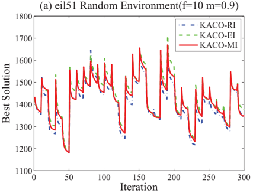

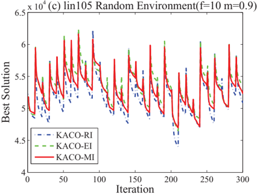

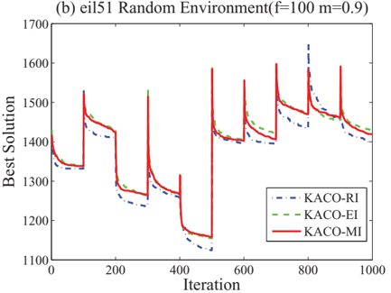

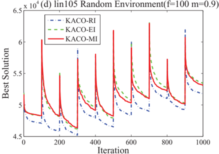

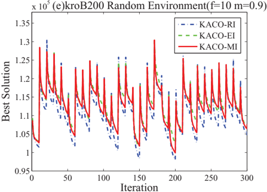

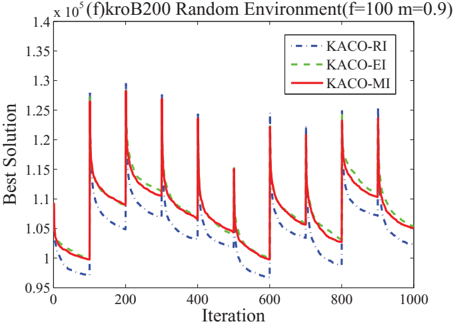

each temperature. In GA, Pc and Pm indicate crossover and mutation rate respectively, and P l denotes the number of populations. T is the total number of iterations. All the experiments are executed 30 times and 1000 iterations in each time for every algorithm to compare their performances. The SA and GA use global restart strategy to trace an optimal solution when environment changes since they cannot be fit for dynamic changes.

The experimental results are shown in Table 6 which indicates the performances of KACO with three immigrants and other heuristic algorithms under random and cyclic environments in lin105. Meanwhile, the results of the Wilcoxon signed ranks test are listed in Tables 7 and 8 to reveal significant differences between the proposed algorithm and other heuristic algorithms. Since the performances of KACO with three immigrants have been analyzed above, there is no repeated

Fig. 4. The convergence graph of the best solution found by KACO with three immigrants in each iteration with cyclic changes, where m = 0 5 . , f = 10 or 100.

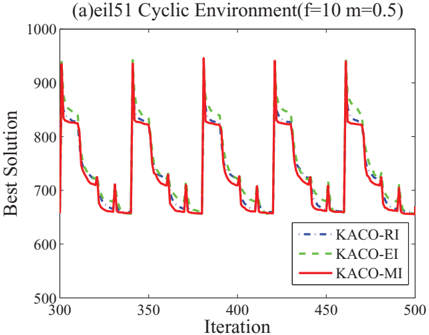

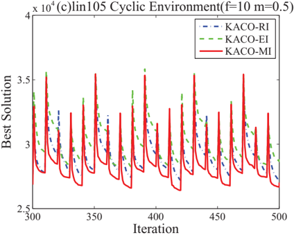

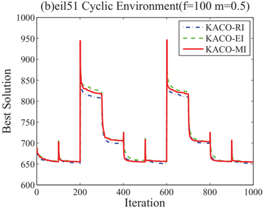

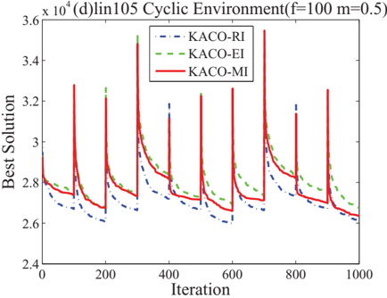

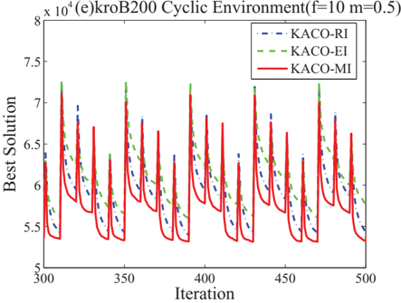

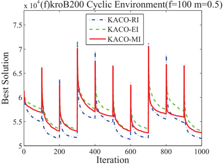

indication. From Table 7, it can be obviously observed that KACO with three immigrants can outperform other heuristic algorithms. In order to investigate the convergence characteristics of each algorithm, Figs. 9 and 10 are displayed to illustrate the performance of each algorithm under the random environments with m = 0 5 . , f = 10 or 100 and the cyclic environments with m = 0 9 . , f = 10 or 100, respectively. In addition, Table 8 shows that ACS can enhance the exploration ability to obtain better solutions than other heuristic algorithms in both random and cyclic environments. The performance of PACO is better than others except the ACS in slowly changing environments or quickly and slightly changing environments

Fig. 5. The best solutions found by KACO with three immigrants and the number of vehicles in each depot with random changes, where m = 0 9 . , f = 10 or 100 and V indicates the number of vehicles in each depot.

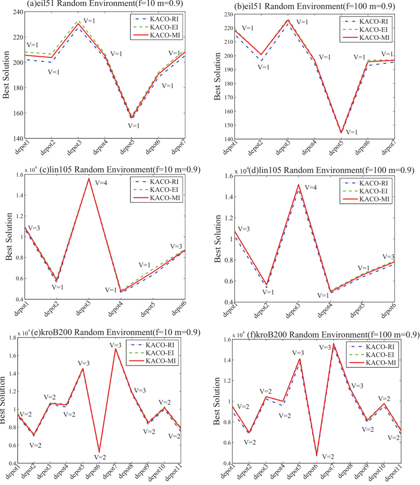

( f = 10 , m = 0 1) since the population-list is used for enhancing the diversity and quickly matching the current environment. . EAS outperforms others except the ACS in quickly and significantly changing environments ( f = 10 , m = 0 9) since changes . frequently disturb the pheromone trail. By utilizing the procedure of updating the best route in quickly and significantly changing environments, EAS reinforces to prevent the search from converging into local optimum. The observation that MMAS just outperforms AS among comparative ACO algorithms in slowly changing environments indicates the pheromone interval in MMAS is unadaptable for quickly changing environments since the pheromone needs sufficient time to be

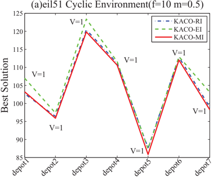

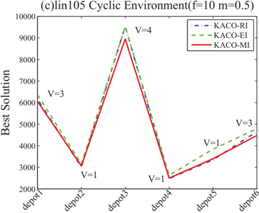

(e)kroB200 Cyclic Environment(f=10 m=0.5)

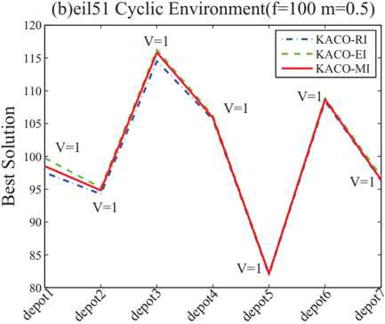

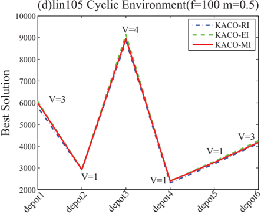

(f)kroB200 Cyclic Environment(f=100 m=0.5)

Fig. 6. The best solutions found by KACO with three immigrants and the number of vehicles in each depot with cyclic changes, where m = 0 5 . , f = 10 or 100 and V indicates the number of vehicles in each depot.

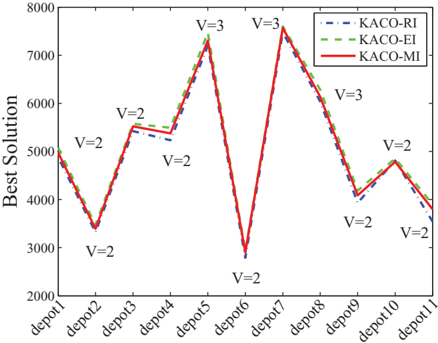

Fig. 7. Results using KACO and WKACO with three immigrants for lin105 in random environments, where f = 10 , m = 0 9 and . d indicates the depot.

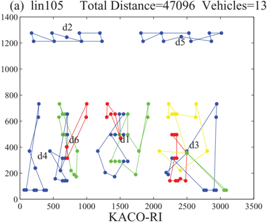

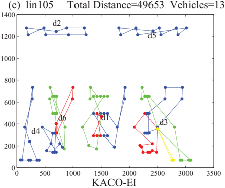

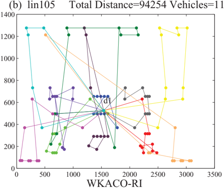

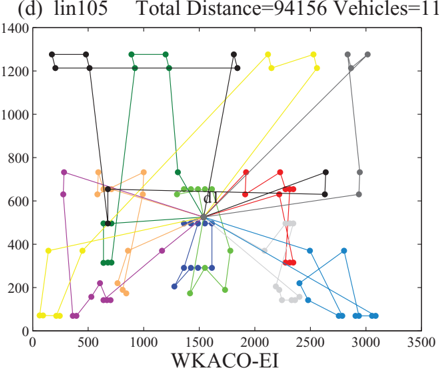

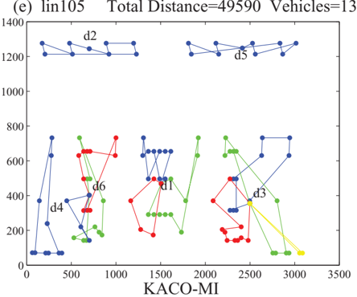

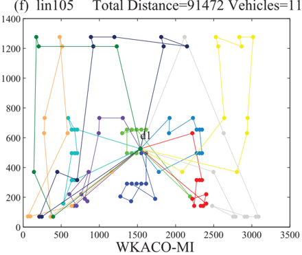

Fig. 8. Results using KACO and WKACO with three immigrants for kroB200 in cyclic environments, where f = 10 , m = 0 5 and . d indicates the depot.

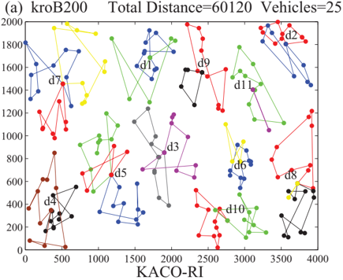

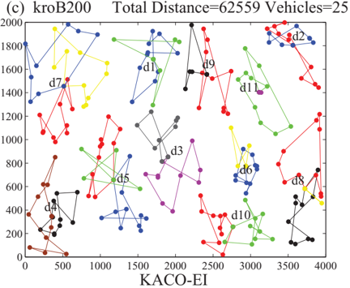

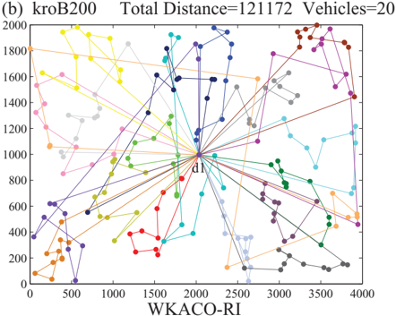

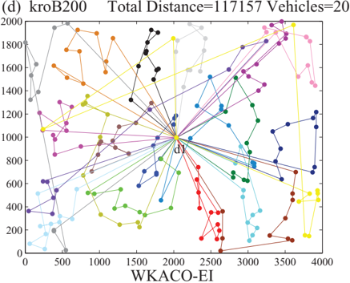

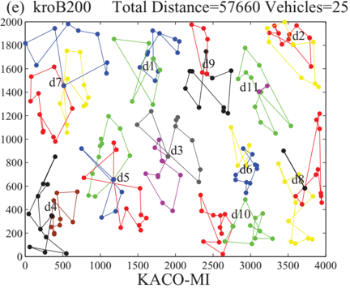

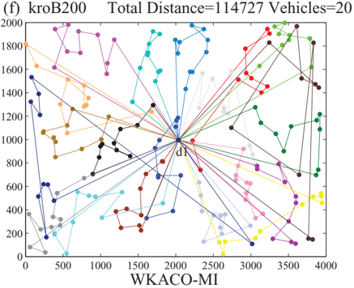

Table 6

Simulation results of KACO with three immigrants and other heuristic algorithms under random and cyclic environments in lin105.

| lin105   | Random environments   | Random environments   | Random environments   | Random environments   | Random environments   | Random environments   | Cyclic environments   | Cyclic environments   | Cyclic environments   | Cyclic environments   | Cyclic environments   | Cyclic environments   |
|----------|-----------------------|-----------------------|-----------------------|-----------------------|-----------------------|-----------------------|-----------------------|-----------------------|-----------------------|-----------------------|-----------------------|-----------------------|
| lin105   | f = 10                | f = 10                | f = 10                | f = 100               | f = 100               | f = 100               | f = 10                | f = 10                | f = 10                | f = 100               | f = 100               | f = 100               |
| m        | 0.1                   | 0.5                   | 0.9                   | 0.1                   | 0.5                   | 0.9                   | 0.1                   | 0.5                   | 0.9                   | 0.1                   | 0.5                   | 0.9                   |
| KACO-RI  | 20713.3               | 29102.4               | 51594.2               | 19803.8               | 27055.4               | 49242.8               | 20406.1               | 29197.1               | 51357.6               | 19746.7               | 27179.6               | 47505.4               |
| KACO-EI  | 21535.5               | 30127.4               | 53101.2               | 20418.0               | 28186.4               | 51217.2               | 20905.4               | 30306.3               | 52918.9               | 20112.7               | 28089.4               | 49549.5               |
| KACO-MI  | 20918.1               | 29696.5               | 52382.3               | 20149.9               | 27957.0               | 50946.3               | 20019.2               | 28455.3               | 49876.6               | 19918.0               | 27697.8               | 48781.5               |
| AS       | 23446.5               | 33068.7               | 57637.8               | 23116.3               | 32508.6               | 57723.5               | 22539.6               | 33267.9               | 57390.8               | 22908.4               | 31967.2               | 57197.3               |
| EAS      | 23170.3               | 32968.8               | 57076.5               | 22792.2               | 31724.5               | 56880.9               | 22181.9               | 33226.7               | 57280.2               | 21766.7               | 31491.5               | 55864.9               |
| MMAS     | 23581.6               | 35493.0               | 59118.9               | 23047.7               | 32012.5               | 57406.2               | 23579.7               | 35057.0               | 59884.7               | 21851.7               | 31586.4               | 55967.0               |
| ACS      | 21059.3               | 30571.5               | 54799.0               | 20564.8               | 29124.6               | 53159.7               | 21105.0               | 30773.7               | 54169.8               | 20617.8               | 28942.7               | 51729.0               |
| P-ACO    | 23016.1               | 33743.9               | 58795.3               | 22245.9               | 31468.8               | 56587.9               | 21842.7               | 33151.7               | 59189.2               | 21503.2               | 30901.8               | 55267.3               |
| SA       | 23839.4               | 38868.2               | 60855.7               | 23198.1               | 38377.1               | 59350.4               | 23545.5               | 37748.2               | 61649.1               | 23323.9               | 38778.2               | 59644.4               |
| GA       | 38942.6               | 68985.0               | 113645.2              | 36853.1               | 64540.1               | 105967.7              | 38746.5               | 68567.5               | 114889.3              | 36779.7               | 63258.6               | 106895.1              |

## Table 7

Statistical results of the Wilcoxon signed ranks test at a level of significance α = 0 05 between KACO . with three immigrants and other heuristic algorithms under random and cyclic environments in lin105, where ' + ' or ' -' denotes the former or the latter performs better respectively, and ' ∼ ' denotes no significance.

| lin105        | Random environments   | Random environments   | Random environments   | Random environments   | Random environments   | Random environments   | Cyclic environments   | Cyclic environments   | Cyclic environments   | Cyclic environments   | Cyclic environments   | Cyclic environments   |
|---------------|-----------------------|-----------------------|-----------------------|-----------------------|-----------------------|-----------------------|-----------------------|-----------------------|-----------------------|-----------------------|-----------------------|-----------------------|
|               | f = 10                | f = 10                | f = 10                | f = 100               | f = 100               | f = 100               | f = 10                | f = 10                | f = 10                | f = 100               | f = 100               | f = 100               |
| m             | 0.1                   | 0.5                   | 0.9                   | 0.1                   | 0.5                   | 0.9                   | 0.1                   | 0.5                   | 0.9                   | 0.1                   | 0.5                   | 0.9                   |
| KACO-RI:AS    | +                     | +                     | +                     | +                     | +                     | +                     | +                     | +                     | +                     | +                     | +                     | +                     |
| KACO-RI:EAS   | +                     | +                     | +                     | +                     | +                     | +                     | +                     | +                     | +                     | +                     | +                     | +                     |
| KACO-RI:MMAS  | +                     | +                     | +                     | +                     | +                     | +                     | +                     | +                     | +                     | +                     | +                     | +                     |
| KACO-RI:ACS   | +                     | +                     | +                     | +                     | +                     | +                     | +                     | +                     | +                     | +                     | +                     | +                     |
| KACO-RI:P-ACO | +                     | +                     | +                     | +                     | +                     | +                     | +                     | +                     | +                     | +                     | +                     | +                     |
| KACO-RI:SA    | +                     | +                     | +                     | +                     | +                     | +                     | +                     | +                     | +                     | +                     | +                     | +                     |
| KACO-RI:GA    | +                     | +                     | +                     | +                     | +                     | +                     | +                     | +                     | +                     | +                     | +                     | +                     |
| KACO-EI:AS    | +                     | +                     | +                     | +                     | +                     | +                     | +                     | +                     | +                     | +                     | +                     | +                     |
| KACO-EI:EAS   | +                     | +                     | +                     | +                     | +                     | +                     | +                     | +                     | +                     | +                     | +                     | +                     |
| KACO-EI:MMAS  | +                     | +                     | +                     | +                     | +                     | +                     | +                     | +                     | +                     | +                     | +                     | +                     |
| KACO-EI:ACS   | -                     | +                     | +                     | +                     | +                     | +                     | +                     | +                     | +                     | +                     | +                     | +                     |
| KACO-EI:P-ACO | +                     | +                     | +                     | +                     | +                     | +                     | +                     | +                     | +                     | +                     | +                     | +                     |
| KACO-EI:SA    | +                     | +                     | +                     | +                     | +                     | +                     | +                     | +                     | +                     | +                     | +                     | +                     |
| KACO-EI:GA    | +                     | +                     | +                     | +                     | +                     | +                     | +                     | +                     | +                     | +                     | +                     | +                     |
| KACO-MI:AS    | +                     | +                     | +                     | +                     | +                     | +                     | +                     | +                     | +                     | +                     | +                     | +                     |
| KACO-MI:EAS   | +                     | +                     | +                     | +                     | +                     | +                     | +                     | +                     | +                     | +                     | +                     | +                     |
| KACO-MI:MMAS  | +                     | +                     | +                     | +                     | +                     | +                     | +                     | +                     | +                     | +                     | +                     | +                     |
| KACO-MI:ACS   | +                     | +                     | +                     | +                     | +                     | +                     | +                     | +                     | +                     | +                     | +                     | +                     |
| KACO-MI:P-ACO | +                     | +                     | +                     | +                     | +                     | +                     | +                     | +                     | +                     | +                     | +                     | +                     |
| KACO-MI:SA    | +                     | +                     | +                     | +                     | +                     | +                     | +                     | +                     | +                     | +                     | +                     | +                     |
| KACO-MI:GA    | +                     | +                     | +                     | +                     | +                     | +                     | +                     | +                     | +                     | +                     | +                     | +                     |

evaporated, and even if the evaporation is implemented, the previous pheromone trail may be useless for the new environment. The characteristics of each ACO algorithm can be observed in Fig. 9 and the observation that comparative ACO algorithms are inferior to the proposed algorithm confirms that KACO with immigrants can quickly converge to the optimal solution according to changing environments due to their special schemes. Fig. 10 intuitively illustrates the significant differences between the three variants of KACO and other heuristic algorithms including SA and GA. To be specific, SA outperforms GA since it adopts a greedy method to generate initial solution. Compared with the random method used in GA, the greedy method can quickly find an approximately optimal solution for SA. However, both SA and GA cannot obtain better optimal solutions than the proposed KACO method due to the differences of their search schemes and inadaptabilities for dynamic environments. Consequently, the experiment verifies that KACO with immigrants schemes performs the best to trace an optimal solution under changing environments and is an effective method to resolve the DLRP.

## 5.2.3. Computational time complexity

The effectiveness of our proposed algorithm has been demonstrated by the above experiments. In this section, we calculate and analyze the time complexity of ten algorithms to verify the efficiency of KACO with immigrants. The scale of problem n is only considered in the time complexity. Due to the two-phase structure of KACO, the time complexity of K-means and ACO can be calculated respectively. In K-means, there are mainly four procedures as follows:

Statistical results of the Wilcoxon signed ranks test at a level of significance α = 0 05 among other . heuristic algorithms under random and cyclic environments in lin105, where ' + ' or ' -' denotes the former or the latter performs better respectively, and ' ' denotes no significance.

Table 8 ∼

| lin105     | Random environments   | Random environments   | Random environments   | Random environments   | Random environments   | Random environments   | Cyclic environments   | Cyclic environments   | Cyclic environments   | Cyclic environments   | Cyclic environments   | Cyclic environments   |
|------------|-----------------------|-----------------------|-----------------------|-----------------------|-----------------------|-----------------------|-----------------------|-----------------------|-----------------------|-----------------------|-----------------------|-----------------------|
|            | f = 10                | f = 10                | f = 10                | f = 100               | f = 100               | f = 100               | f = 10                | f = 10                | f = 10                | f = 100               | f = 100               | f = 100               |
| m          | 0.1                   | 0.5                   | 0.9                   | 0.1                   | 0.5                   | 0.9                   | 0.1                   | 0.5                   | 0.9                   | 0.1                   | 0.5                   | 0.9                   |
| AS:EAS     | -                     | ∼                     | -                     | -                     | -                     | -                     | -                     | ∼                     | ∼                     | -                     | -                     | -                     |
| AS:MMAS    | +                     | +                     | +                     | ∼                     | -                     | ∼                     | +                     | +                     | +                     | -                     | -                     | -                     |
| AS:ACS     | -                     | -                     | -                     | -                     | -                     | -                     | -                     | -                     | -                     | -                     | -                     | -                     |
| AS:P-ACO   | -                     | +                     | +                     | -                     | -                     | -                     | -                     | ∼                     | +                     | -                     | -                     | -                     |
| AS:SA      | ∼                     | +                     | +                     | ∼                     | +                     | +                     | +                     | +                     | +                     | +                     | +                     | +                     |
| AS:GA      | +                     | +                     | +                     | +                     | +                     | +                     | +                     | +                     | +                     | +                     | +                     | +                     |
| EAS:MMAS   | +                     | +                     | +                     | +                     | +                     | +                     | +                     | +                     | +                     | ∼                     | ∼                     | ∼                     |
| EAS:ACS    | -                     | -                     | -                     | -                     | -                     | -                     | -                     | -                     | -                     | -                     | -                     | -                     |
| EAS:P-ACO  | -                     | +                     | +                     | -                     | ∼                     | ∼                     | -                     | ∼                     | +                     | -                     | -                     | -                     |
| EAS:SA     | +                     | +                     | +                     | ∼                     | +                     | +                     | +                     | +                     | +                     | +                     | +                     | +                     |
| EAS:GA     | +                     | +                     | +                     | +                     | +                     | +                     | +                     | +                     | +                     | +                     | +                     | +                     |
| MMAS:ACS   | -                     | -                     | -                     | -                     | -                     | -                     | -                     | -                     | -                     | -                     | -                     | -                     |
| MMAS:P-ACO | -                     | -                     | -                     | -                     | -                     | -                     | -                     | -                     | -                     | -                     | -                     | -                     |
| MMAS:SA    | ∼                     | +                     | +                     | ∼                     | +                     | +                     | ∼                     | +                     | +                     | +                     | +                     | +                     |
| MMAS:GA    | +                     | +                     | +                     | +                     | +                     | +                     | +                     | +                     | +                     | +                     | +                     | +                     |
| ACS:P-ACO  | +                     | +                     | +                     | +                     | +                     | +                     | +                     | +                     | +                     | +                     | +                     | +                     |
| ACS:SA     | +                     | +                     | +                     | +                     | +                     | +                     | +                     | +                     | +                     | +                     | +                     | +                     |
| ACS:GA     | +                     | +                     | +                     | +                     | +                     | +                     | +                     | +                     | +                     | +                     | +                     | +                     |
| P-ACO:SA   | +                     | +                     | +                     | +                     | +                     | +                     | +                     | +                     | +                     | +                     | +                     | +                     |
| P-ACO:GA   | +                     | +                     | +                     | +                     | +                     | +                     | +                     | +                     | +                     | +                     | +                     | +                     |
| SA:GA      | +                     | +                     | +                     | +                     | +                     | +                     | +                     | +                     | +                     | +                     | +                     | +                     |

- (1) Input data. The time complexity of first procedure is O n ( ).
- (2) Initialize clustering centers. This procedure needs O (1).
- (3) Determine final clustering centers. This procedure contains calculating distance, constructing new cluster and new clustering centers, which require O n ( ), O n ( ), O n ( ), respectively. The time complexity of this procedure is 3 T k O n ( ), where T k indicates iteration times.
- (4) Calculate distance cost function and record. This operation needs 2 O n ( ).

The overall time complexity of each k is

O n ( ) + O ( 1 ) + 3 Tk O n ( ) + 2 O n ( ) = ( 3 Tk + 3 ) O n ( ) + O ( 1 )

(15)

K-means is executed totally √ n times and the total time complexity is ( 3 T k + 3 ) √ nO n ( ) + √ nO ( 1 . Therefore, the computa-) tional time complexity of K-means is O n ( 3 2 ) .

After executing K-means, the ACO with three immigrants has the primarily following steps:

- (1) Construct algorithmic structure. The time complexity of constructing pheromone and heuristic matrix is O n ( 2 ).
- (2) Establish dynamic environments. The time complexity of generating random environment or cyclic environment is O n ( 2 ).
- (3) Initialize parameters. Initializing pheromone and other parameters needs O n ( 2 ). In the worst case, calculating distance matrix and sorting requires O n ( 3 ). Therefore, this step finally needs O n ( 3 ).
- (4) Construct routes. The time complexity of route searched by one ant is O n ( 2 ). Afterwards, in the worst case, recording the best-so-far solution requires O n ( ). The total time complexity of this step is MO n ( 2 ) + O n ( ), where M indicates the number of ants.
- (5) Update pheromone. In this step, three immigrants are generated. Although their generating methods are different, the ultimate time complexity is the same, which is equal to O n ( 2 ).
- (6) Environmental changes. When the environment changes, the algorithm has to re-initialize some parameters such as distance and heuristic. The time complexity is O n ( 2 ) + O n ( 3 ) .
- (7) Output. This step requires O (1).

The overall time complexity of each cluster is

<!-- formula-not-decoded -->

<!-- formula-not-decoded -->

<!-- formula-not-decoded -->

where T is the number of iterations, N is the number of runs and f indicates the frequency of environmental changes. According to the size of each cluster n 1 , n 2 , . . . , n k determined by K-means, the ACO with

Fig. 9. Experimental results using KACO with three immigrants and other ACO algorithms under random environments with m = 0 5 . , f = 10 or f = 100 and cyclic environments with m = 0 9 . , f = 10 or f = 100 in lin105.

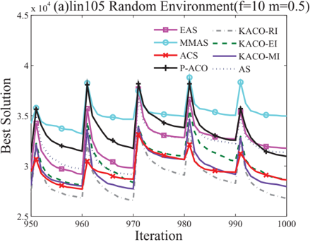

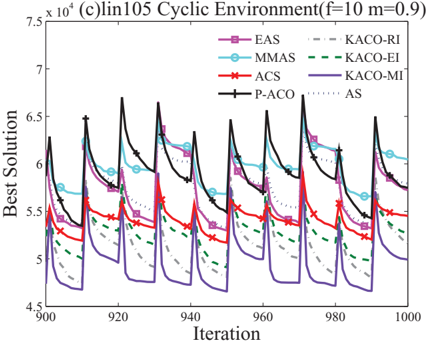

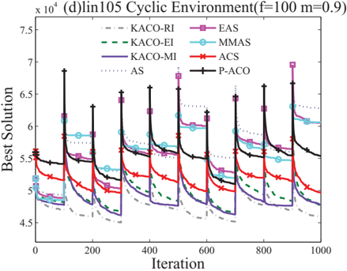

Table 9

Running time of KACO with three immigrants and other heuristic algorithms executed one time in seconds under random and cyclic environments in lin105.

| lin105   | Random environments   | Random environments   | Random environments   | Random environments   | Random environments   | Random environments   | Cyclic environments   | Cyclic environments   | Cyclic environments   | Cyclic environments   | Cyclic environments   | Cyclic environments   |
|----------|-----------------------|-----------------------|-----------------------|-----------------------|-----------------------|-----------------------|-----------------------|-----------------------|-----------------------|-----------------------|-----------------------|-----------------------|
|          | f = 10                | f = 10                | f = 10                | f = 100               | f = 100               | f = 100               | f = 10                | f = 10                | f = 10                | f = 100               | f = 100               | f = 100               |
| m        | 0.1                   | 0.5                   | 0.9                   | 0.1                   | 0.5                   | 0.9                   | 0.1                   | 0.5                   | 0.9                   | 0.1                   | 0.5                   | 0.9                   |
| KACO-RI  | 14.9                  | 13.9                  | 8.68                  | 13.0                  | 13.6                  | 13.6                  | 13.5                  | 8.90                  | 10.1                  | 13.0                  | 13.5                  | 12.6                  |
| KACO-EI  | 12.0                  | 13.3                  | 9.69                  | 14.0                  | 13.2                  | 13.6                  | 13.7                  | 12.1                  | 14.7                  | 13.7                  | 12.6                  | 13.4                  |
| KACO-MI  | 12.4                  | 13.5                  | 9.63                  | 14.0                  | 12.9                  | 13.8                  | 13.4                  | 10.3                  | 12.1                  | 13.0                  | 13.5                  | 13.2                  |
| AS       | 15.1                  | 13.8                  | 14.6                  | 14.3                  | 13.9                  | 14.0                  | 14.4                  | 14.1                  | 14.7                  | 12.5                  | 14.4                  | 15.1                  |
| EAS      | 14.3                  | 15.7                  | 14.3                  | 14.2                  | 15.5                  | 15.0                  | 14.1                  | 14.0                  | 13.7                  | 14.5                  | 14.9                  | 13.7                  |
| MMAS     | 12.7                  | 11.8                  | 14.0                  | 15.0                  | 11.9                  | 10.0                  | 9.34                  | 15.2                  | 8.04                  | 12.9                  | 12.0                  | 13.2                  |
| ACS      | 18.2                  | 16.9                  | 16.7                  | 19.8                  | 12.3                  | 16.3                  | 13.9                  | 18.2                  | 19.5                  | 18.2                  | 18.0                  | 13.6                  |
| P-ACO    | 16.5                  | 14.2                  | 12.7                  | 11.9                  | 15.1                  | 14.0                  | 12.9                  | 12.6                  | 10.3                  | 12.4                  | 12.2                  | 12.7                  |
| SA       | 16.7                  | 18.4                  | 17.8                  | 17.0                  | 18.3                  | 17.3                  | 18.0                  | 18.5                  | 18.6                  | 19.4                  | 18.4                  | 19.3                  |
| GA       | 1.08                  | 1.09                  | 1.51                  | 1.19                  | 1.03                  | 1.20                  | 1.23                  | 1.14                  | 1.08                  | 1.50                  | 1.34                  | 1.40                  |

immigrants finally requires ( N + NT f ) [ O n ( 3 1 ) + O n ( 3 2 ) +··· + O n K ( 3 ) ] + ( NTM + NT + N + NT f + 1 [ ) O n ( 2 1 ) + O n ( 2 2 ) +··· + O n K ( 2 ) ] + NT O n [ ( 1 ) + O n ( 2 ) +··· + O nK ( ) ] + NTKO ( 1 ), where n 1 + n 2 +··· + nK = n + K . This can be simplified as O ( ∑ K i = 1 n 3 i ) .

Table 9 indicates the running time of ten algorithms under random and cyclic environments in lin105. By calculating the time complexity of ten algorithms, we can observe that all the ant colony algorithms have the same time complexity

Fig. 10. Experimental results using KACO with three immigrants, SA and GA under random environments with m = 0 5 . , f = 10 or f = 100 and cyclic environments with m = 0 9 . , f = 10 or f = 100 in lin105.

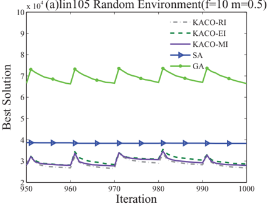

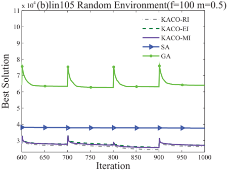

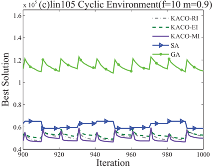

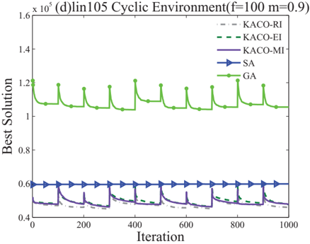

which is equal to O ( ∑ K i = 1 n 3 i ) . This explains the phenomenon that the running times of ant colony algorithms are similar in Table 9. Although the time complexity of SA and GA are O ( ∑ K i = 1 n 2 i ), Table 9 reveals the running time of SA is more than that of GA. This is because SA has an inner loop to imitate the process of anneal. This loop requires O n ( 2 ) + I f O ( n ), whereas GA has O n ( 2 ) + P l f O ( n ) to implement selection, crossover and variation, where I is iteration times and P l is the number of populations. It is obvious that SA spends more time due to I which is far larger than P l . Accordingly, the experimental results suggest that KACO with immigrants has the identical time complexity by comparing with the conventional ant colony algorithms. In other words, KACO with immigrants maintains the time complexity of ACO and is an efficient algorithm.

## 6. Conclusions

In this paper, we proposed a clustering ant colony optimization (KACO) with three immigrants schemes to address the DLRP. The K-means algorithm was used to optimize the location of problem so as to determine the depots and nearby cities divided into the same class. Then ant search algorithm with three immigrants, i.e., random immigrants, elitism-based immigrants and memory-based immigrants aimed at resolving the vehicle routing problem in the dynamic environments including random and cyclic environments. Experimental results suggest that KACO with three immigrant schemes can find promising solutions for the DLRP within reasonable computational time. To verify the effect of the K-means on KACO, the performance of KACO is also compared with the ACO without K-means algorithm which is called WKACO. Compared with the solution found by WKACO where all vehicles start from one depot and return back, the solution obtained by KACO can generate shorter routes by starting from multiple depots. The comparative results demonstrate that the K-mean algorithm improves the solution found by the ant search and reinforces the effect of immigrants schemes for three different scales of LRP instances under random or cyclic environments.

Despite the K-means algorithm can assign vehicles on depots effectively, the routs generated by vehicles are determined by the ant search. The immigrants schemes play important roles on searching under dynamic environments. Three kinds of schemes are for the first time incorporated into KACO for the DLRP, and the results suggest that: (1) the random immigrants with K-means algorithm are suitable for handling the dynamic environments with random or slowly cyclic changing; (2) long-term memory-based immigrants can manipulate the quickly cyclic environments effectively; (3) elitism-based immigrants which enable the algorithm to transfer knowledge from previous environments perform the worst among three types of immigrants with K-means algorithm; and (4) K-means algorithm optimizes solution structure of immigrants in order to obtain better property for solving the DLRP. These general remarks concerning the immigrant schemes give potential guidelines for decision makers when constructing optimizers. To show more superiority of KACO, another experiment is implemented to compare it with other heuristic algorithms including AS, EAS, MMAS, ACS, P-ACO, SA and GA. The experimental results indicate that ACO algorithms outperform SA and GA since they can utilize the pheromone trails to adapt to the dynamic changes, and the proposed KACO with three immigrant schemes displays the best performance. Finally, the time complexity of all the algorithms are analyzed to demonstrate KACO with immigrants and conventional ACOs have the same time complexity. In summary, all the experiments suggest that our proposed algorithm is an efficient and effective approach for resolving the DLRP.

This work opens the door to the following future research. More sophisticated immigrant schemes can be designed to enable the ant search to track the optimal solutions effectively and efficiently for dynamic optimization problems. Various DLRPs such as the LRP with time windows, different capacitated LRPs in dynamic environments should be addressed by ant colony algorithm with immigrant schemes.

## Acknowledgment

This research was partially supported by the National Natural Science Foundation of China (Grant nos. 61203325, 11572084, 11472061, and 61472284), the Shanghai Rising-Star Program (no. 14QA1400100), the program of Further Accelerating the Development of Chinese Medicine Three Year Action of Shanghai (2014-2016) no. ZY3-CCCX-3-6002, and the Natural Science Foundation Programs of Shanghai (no. 13ZR1443100), and JSPS KAKENHI Grant no. 15K00332 (Japan).

## References

- [1] E. Bonabeau, M. Dorigo, G. Theraulaz, Inspiration for optimization from social insect behaviour, Nature 406 (6791) (2000) 39-42.
- [2] M. Dorigo, T. St ˝ tzle, Ant Colony Optimization, MIT Press, 2004. u
- [3] M. Dorigo, V. Maniezzo, A. Colorni, Ant system: optimization by a colony of cooperating agents, IEEE Trans. Syst. Man Cybern. Part B Cybern. 26 (1) (1996) 29-41.
- [4] M. Dorigo, L.M. Gambardella, Ant colony system: a cooperative learning approach to the traveling salesman problem, IEEE Trans. Evol. Comput. 1 (1) (1997) 53-66.
- [5] K.V. Narasimha, E. Kivelevitch, B. Sharma, M. Kumar, An ant colony optimization technique for solving min-max multi-depot vehicle routing problem, Swarm Evol. Comput. 13 (2013) 63-73.
- [6] C. Cruz, J.R. González, D.A. Pelta, Optimization in dynamic environments: a survey on problems, methods and measures, Soft Comput. 15 (7) (2011) 1427-1448.
- [7] M. Mavrovouniotis, S. Yang, Ant colony optimization with immigrants schemes for the dynamic travelling salesman problem with traffic factors, Appl. Soft Comput. 13 (10) (2013) 4023-4037.
- [8] Y. Jin, J. Branke, Evolutionary optimization in uncertain environments-a survey, IEEE Trans. Evol. Comput. 9 (3) (2005) 303-317.
- [9] M. Guntsch, M. Middendorf, Pheromone modification strategies for ant algorithms applied to dynamic tsp, in: Proceedings of the EvoWorkshops 2001 on Applications of Evolutionary Computing, Springer, 2001, pp. 213-222.
- [10] S. Yang, R. Tinós, A hybrid immigrants scheme for genetic algorithms in dynamic environments, Int. J. Autom. Comput. 4 (3) (2007) 243-254.
- [11] X. Yu, K. Tang, X. Yao, An immigrants scheme based on environmental information for genetic algorithms in changing environments, in: Proceedings of the 2008 IEEE Congress on Evolutionary Computation, IEEE, 2008, pp. 1141-1147.
- [12] S. Yang, H. Cheng, F. Wang, Genetic algorithms with immigrants and memory schemes for dynamic shortest path routing problems in mobile ad hoc networks, IEEE Trans. Syst. Man Cybern. Part C Appl. Rev. 40 (1) (2010) 52-63.
- [13] T. Blackwell, J. Branke, Multiswarms, exclusion, and anti-convergence in dynamic environments, IEEE Trans. Evol. Comput. 10 (4) (2006) 459-472.
- [14] C. Li, S. Yang, A general framework of multipopulation methods with clustering in undetectable dynamic environments, IEEE Trans. Evol. Comput. 16 (4) (2012) 556-577.
- [15] S. Yang, C. Li, A clustering particle swarm optimizer for locating and tracking multiple optima in dynamic environments, IEEE Trans. Evol. Comput. 14 (6) (2010) 959-974.
- [16] T.T. Nguyen, S. Yang, J. Branke, Evolutionary dynamic optimization: A survey of the state of the art, Swarm Evol. Comput. 6 (2012) 1-24.
- [17] W. Du, B. Li, Multi-strategy ensemble particle swarm optimization for dynamic optimization, Inf. Sci. 178 (15) (2008) 3096-3109.
- [18] E. Alba, G. Luque, S. Nesmachnow, Parallel metaheuristics: recent advances and new trends, Int. Trans. Oper. Res. 20 (1) (2013) 1-48.
- [19] G. Laporte, Y. Nobert, D. Arpin, An exact algorithm for solving a capacitated location-routing problem, Ann. Oper. Res. 6 (9) (1986) 291-310.
- [20] P. Toth, D. Vigo, The Vehicle Routing Problem, Society for Industrial and Applied Mathematics, 2001.
- [21] M. Gendreau, A. Hertz, G. Laporte, A tabu search heuristic for the vehicle routing problem, Manag. Sci. 40 (10) (1994) 1276-1290.
- [22] I.H. Osman, Metastrategy simulated annealing and tabu search algorithms for the vehicle routing problem, Ann. Oper. Res. 41 (4) (1993) 421-451.
- [23] B. Bullnheimer, R.F. Hartl, C. Strauss, Applying the Ant System to the Vehicle Routing Problem, Springer, 1999, pp. 285-296.
- [24] B. Bullnheimer, R.F. Hartl, C. Strauss, An improved ant system algorithm for the vehicle routing problem, Ann. Oper. Res. 89 (1999b) 319-328.
- [25] J.E. Bell, P.R. McMullen, Ant colony optimization techniques for the vehicle routing problem, Adv. Eng. Inf. 18 (1) (2004) 41-48.
- [26] A. Rizzoli, F. Oliverio, R. Montemanni, L.M. Gambardella, Ant Colony Optimisation for Vehicle Routing Problems: From Theory to Applications, Technical Report IDSIA-15-04, Istituto Dalle Molle di Studi sull, 2004.
- [27] L.M. Hvattum, A. Løkketangen, G. Laporte, A branch-and-regret heuristic for stochastic and dynamic vehicle routing problems, Networks 49 (4) (2007) 330-340.
- [28] M. Gendreau, F. Guertin, J.-Y. Potvin, E. Taillard, Parallel tabu search for real-time vehicle routing and dispatching, Transp. Sci. 33 (4) (1999) 381-390.
- [29] Y. Chan, W.B. Carter, M.D. Burnes, A multiple-depot, multiple-vehicle, location-routing problem with stochastically processed demands, Comput. Oper. Res. 28 (8) (2001) 803-826.

- [30] R.M. Karp, Reducibility Among Combinatorial Problems, Springer, 1972.
- [31] C. Lin, R. Kwok, Multi-objective metaheuristics for a location-routing problem with multiple use of vehicles on real data and simulated data, Eur. J. Oper. Res. 175 (3) (2006) 1833-1849.
- [32] T.-H. Wu, C. Low, J.-W. Bai, Heuristic solutions to multi-depot location-routing problems, Comput. Oper. Res. 29 (10) (2002) 1393-1415.
- [33] G.u. Clarke, J.W. Wright, Scheduling of vehicles from a central depot to a number of delivery points, Oper. Res. 12 (4) (1964) 568-581.
- [34] B.M. Baker, M. Ayechew, A genetic algorithm for the vehicle routing problem, Comput. Oper. Res. 30 (5) (2003) 787-800.
- [35] Z. Ursani, D. Essam, D. Cornforth, R. Stocker, Localized genetic algorithm for vehicle routing problem with time windows, Appl. Soft Comput. 11 (8) (2011) 5375-5390.
- [36] M. Reimann, K. Doerner, R.F. Hartl, D-ants: Savings based ants divide and conquer the vehicle routing problem, Comput. Oper. Res. 31 (4) (2004) 563-591.
- [37] L. Santos, J. Coutinho-Rodrigues, J.R. Current, An improved ant colony optimization based algorithm for the capacitated arc routing problem, Transp. Res. Part B Methodol. 44 (2) (2010) 246-266.
- [38] N.H. Wilson, N.J. Colvin, Computer Control of the Rochester Dial-a-Ride System, Technical Report R77-31, Department of Civil Engineering, Massachusetts Institute of Technology, Center for Transportation Studies, 1977.
- [39] R. Montemanni, L.M. Gambardella, A.E. Rizzoli, A.V. Donati, Ant colony system for a dynamic vehicle routing problem, J. Comb. Optim. 10 (4) (2005) 327-343.
- [40] M.R. Khouadjia, B. Sarasola, E. Alba, L. Jourdan, E.-G. Talbi, A comparative study between dynamic adapted pso and vns for the vehicle routing problem with dynamic requests, Appl. Soft Comput. 12 (4) (2012) 1426-1439.
- [41] G. Laporte, F. Louveaux, H. Mercure, Models and exact solutions for a class of stochastic location-routing problems, Eur. J. Oper. Res. 39 (1) (1989) 71-78.
- [42] T.W. Chien, Heuristic procedures for practical-sized uncapacitated location-capacitated routing problems, Decis. Sci. 24 (5) (1993) 995-1021.
- [43] S. S, F. M, An integrated heuristic approach for the combined location vehicle fleet mix problem, Stud. Locat. Anal. 8 (1996) 3-21.
- [44] R. Russell, W.-C. Chiang, D. Zepeda, Integrating multi-product production and distribution in newspaper logistics, Comput. Oper. Res. 35 (5) (2008) 1576-1588.
- [45] I. Or, W.P. Pierskalla, A transportation location-allocation model for regional blood banking, AIIE Trans. 11 (2) (1979) 86-95.
- [46] D. Tuzun, L.I. Burke, A two-phase tabu search approach to the location routing problem, Eur. J. Oper. Res. 116 (1) (1999) 87-99.
- [47] S. Barreto, C. Ferreira, J. Paixao, B.S. Santos, Using clustering analysis in a capacitated location-routing problem, Eur. J. Oper. Res. 179 (3) (2007) 968-977.
- [48] M.-C. Su, C.-H. Chou, A modified version of the k-means algorithm with a distance based on cluster symmetry, IEEE Trans. Pattern Anal. Mach. Intell. 23 (6) (2001) 674-680.
- [49]
- S. Yang, Y. Li, X. Hu, R.-y. PAN, Optimization study on k value of k-means algorithm, Syst. Eng. Theory Pract. 2 (2006) 012.
- [50] M. Dorigo, M. Birattari, T. Stützle, Ant colony optimization, Comput. Intell. Mag. IEEE 1 (4) (2006) 28-39.
- [51] T. Stützle, H. Hoos, Max-min ant system and local search for the traveling salesman problem, in: Proceedings of the IEEE International Conference on Evolutionary Computation, IEEE, 1997, pp. 309-314.
- [52] M. Mavrovouniotis, S. Yang, Ant colony optimization with immigrants schemes in dynamic environments, in: Proceedings of the Eleventh International Conference on Parallel Problem Solving from Nature, PPSN XI, Springer, 2010, pp. 371-380.
- [53] J. Alcala-Fdez, L. Sanchez, S. Garcia, M.J. del Jesus, S. Ventura, J. Garrell, J. Otero, C. Romero, J. Bacardit, V.M. Rivas, et al., Keel: a software tool to assess evolutionary algorithms for data mining problems, Soft Comput. 13 (3) (2009) 307-318.
- [54] C.J. Eyckelhof, M. Snoek, Ant systems for a dynamic tsp, in: Proceedings of the Third International Workshop on Ant Algorithms, Springer, 2002, pp. 88-99.
- [55] M. Guntsch, M. Middendorf, A population based approach for ACO, in: Applications of Evolutionary Computing, Springer, 2002, pp. 72-81.
- [56] V.F. Yu, S.Y. Lin, A simulated annealing heuristic for the open location-routing problem, Comput. Oper. Res. 62 (2) (2014) 288-299.
- [57] M.A. Mohammed, M.S. Ahmad, S. Mostafa, et al., Using genetic algorithm in implementing capacitated vehicle routing problem, in: Proceedings of the 2012 International Conference on Computer and Information Science (ICCIS), vol. 1, IEEE, 2012, pp. 257-262.
- [58] N. Metropolis, A.W. Rosenbluth, M.N. Rosenbluth, A.H. Teller, E. Teller, Equation of state calculations by fast computing machines, J. Chem. Phys. 21 (6) (1953) 1087-1092.