## The Vehicle Routing Problem

Latest Advances and New Challenges

Bruce Golden S. Raghavan Edward Wasil Editors


## THE VEHICLE ROUTING PROBLEM: LATEST ADVANCES AND NEW CHALLENGES

## OPERATIONS RESEARCH/COMPUTER SCIENCE INTERFACES

Professor Ramesh Sharda Oklahoma State University

Prof. Dr. Stefan Voß Universität Hamburg

Bierwirth / Adaptive Search and the Management of Logistics Systems

Laguna &amp; González-Velarde / Computing Tools for Modeling, Optimization and Simulation

Stilman / Linguistic Geometry: From Search to Construction

Sakawa /

Genetic Algorithms and Fuzzy Multiobjective Optimization

Ribeiro &amp; Hansen / Essays and Surveys in Metaheuristics

Holsapple, Jacob &amp; Rao / Business Modelling: Multidisciplinary Approaches - Economics,

Operational and Information Systems Perspectives

Sleezer, Wentling &amp; Cude/ Human Resource Development and Information Technology: Making Global Connections

Voß &amp; Woodruff / ȱ Optimization Software Class Libraries

Upadhyaya et al / Mobile Computing: Implementing Pervasive Information and Communications

Technologies

Reeves &amp; Rowe /

Genetic Algorithms-Principles and Perspectives: A Guide to GA Theory / Computational Modeling and Problem Solving In the Networked World: Interfaces in Computer Science &amp; Operations Research

Bhargava &amp; Ye

Woodruff / Network Interdiction and Stochastic Integer Programming

Anandalingam &amp; Raghavan / Telecommunications Network Design and Management

Laguna &amp; Martí / Scatter Search: Methodology and Implementations in C

Gosavi / Simulation-Based Optimization: Parametric Optimization Techniques and Reinforcement Learning

Koutsoukis &amp; Mitra / Decision Modelling and Information Systems: The Information Value Chain Milano / Constraint and Integer Programming: Toward a Unified Methodology

Wilson &amp; Nuzzolo / Schedule-Based Dynamic Transit Modeling: Theory and Applications

Golden, Raghavan &amp; Wasil / The Next Wave in Computing, Optimization, And Decision Technologies Metaheuristics Optimization via Memory and Evolution: Tabu Search and Scatter

Rego &amp; Alidaee/ Search

Kitamura &amp; Kuwahara / Simulation Approaches in Transportation Analysis: Recent Advances and Challenges

Ibaraki, Nonobe &amp; Yagiura / Metaheuristics: Progress as Real Problem Solvers

Golumbic &amp; Hartman / Graph Theory, Combinatorics, and Algorithms: Interdisciplinary Applications Raghavan &amp; Anandalingam / Telecommunications Planning:  Innovations in Pricing, Network Design and Management

Mattfeld / The Management of Transshipment Terminals: Decision Support for Terminal Operations in Finished Vehicle Supply Chains

Alba &amp; Martí/ Metaheuristic Procedures for Training Neural Networks

Alt, Fu &amp; Golden/ Perspectives in Operations Research: Papers in honor of Saul Gass' 80 th Birthday Baker et al/ Extending the Horizons: Adv. In Computing, Optimization, and Dec. Technologies Zeimpekis et al/ Dynamic Fleet Management: Concepts, Systems, Algorithms &amp; Case Studies

Doerner et al/ Metaheuristics: Progress in Complex Systems Optimization

Goel/ Fleet Telematics: Real-time management &amp; planning of commercial vehicle operations

Gondran &amp; Minoux/ Graphs, Dioïds and Semirings: New models and algorithms Alba &amp; Dorronsoro/ Cellular Genetic Algorithms

Golden, Raghavan &amp; Wasil/ The Vehicle Routing Problem: Latest advances and new challenges Raghavan, Golden &amp; Wasil/ Telecommunications Modeling, Policy and Technology

## THE VEHICLE ROUTING PROBLEM: LATEST ADVANCES AND NEW CHALLENGES

Edited by

BRUCE GOLDEN University of Maryland

S. RAGHAVAN University of Maryland

EDWARD WASIL American University


Editors

Bruce Golden University of Maryland College Park, MD, USA

S. Raghavan University of Maryland College Park, MD, USA

Edward Wasil American University Washington, DC, USA

Series Editors Ramesh Sharda Oklahoma State University Stillwater, Oklahoma, USA

Stefan Voß Universität Hamburg Germany

ISBN: 978-0-387-77777-1

e-ISBN: 978-0-387-77778-8

DOI: 10  .1007/  978-0-387-77778-8

Library of Congress Control Number:  2008921562

## © 2008 Springer Science+Business Media, LLC

All rights reserved. This work may not be translated or copied in whole or in part without the  written  permission  of  the  publisher  (Springer  Science+Business  Media,  LLC,  233 Spring Street, New York, NY 10013, USA), except for brief excerpts in connection with reviews or scholarly analysis. Use in connection with any form of information storage and  retrieval,  electronic  adaptation,  computer  software,  or  by  similar  or  dissimilar methodology now know or hereafter developed is forbidden.

The use in this publication of trade names, trademarks, service marks and similar terms, even if the are not identified as such, is not to be taken as an expression of opinion as to whether or not they are subject to proprietary rights.

Printed on acid-free paper

9  8  7  6  5  4  3  2  1

springer.com

## Preface

Theoretical research and practical applications in the field of vehicle routing started in 1959 with the truck dispatching problem posed by Dantzig and Ramser [1]: find the '. . . optimum routing of a fleet of gasoline delivery trucks between a bulk terminal and a large number of service stations supplied by the terminal.' Using a method based on a linear programming formulation, their hand calculations produced a near-optimal solution with four routes to a problem with twelve service stations . The authors proclaimed: 'No practical applications of the method have been made as yet.'

In the nearly 50 years since the Dantzig and Ramser paper appeared, work in the field has exploded dramatically. Today, a Google Scholar search of the words vehicle routing problem (VRP) yields more than 21,700 entries. The June 2006 issue of OR/MS Today provided a survey of 17 vendors of commercial routing software whose packages are currently capable of solving average-size problems with 1,000 stops, 50 routes, and two-hour hard-time windows in two to ten minutes [2]. In practice, vehicle routing may be the single biggest success story in operations research. For example, each day 103,500 drivers at UPS follow computer-generated routes. The drivers visit 7.9 million customers and handle an average of 15.6 million packages [3].

While much has been documented about the VRP in major studies that have appeared from 1971 (starting with Distribution Management by Eilon, Watson-Gandy, and Christofides) to 2002 (ending with The Vehicle Routing Problem by Toth and Vigo), there are important advances and new challenges that have been raised in the last five years or so due to technological innovations such as global positioning systems, radio frequency identification, and parallel computing. The portfolio of techniques for modeling and solving the standard, capacitated VRP and its many variants has advanced significantly. Researchers and practitioners have developed faster, more accurate solution algorithms and better models that give them the ability to solve large-scale problems.

The papers in this edited volume seek to build on the legacy of published VRP studies in three ways. They summarize the most significant results for

the VRP and its variants since 2000. They present significant methodological advances or new approaches for solving existing vehicle routing problems. They present novel problems that have arisen in the vehicle routing domain and highlight new challenges for the field.

This volume is organized into three sections: overviews and surveys (nine papers), new directions in modeling and algorithms (eleven papers), and practical applications (five papers). We hope that the academic community (especially new and young researchers entering the field) and practitioners in industry will find all twenty-five papers in this volume interesting, informative, and useful.

We thank all of the authors for their participation in producing a first-rate volume. We also thank Gary Folven, senior editor at Springer, and Ramesh Sharda and Stefan Voß, series editors, for their encouragement and support.

## References

- 1. G. Dantzig and J. Ramser. The truck dispatching problem. Management Science , 6:80-91, 1959.
- 2. R. Hall. On the road to integration. OR/MS Today , 33(3):50-57, 2006.
- 3. UPS. Driving success: Why the UPS model for managing 103,500 drivers is a competitive advantage. Available at http://pressroom.ups.com/mediakits/popups/factsheet/0,1889,1201,00.html.

## Contents

| Part I Overviews and Surveys                                                                                                                                                                                                                                                   |          |
|--------------------------------------------------------------------------------------------------------------------------------------------------------------------------------------------------------------------------------------------------------------------------------|----------|
| Routing a Heterogeneous Fleet of Vehicles Roberto Baldacci, Maria Battarra, Daniele Vigo . . . . . . . . . . . . . . . . . A Decade of Capacitated Arc Routing Sanne Wøhlk . . . . . . . . . . . . . . . . . . . . . . . . . . . . . . . . . . . . . . . . . . . . . . . .     | . 3 . 29 |
| Inventory Routing Luca Bertazzi, Martin Savelsbergh, Maria Grazia Speranza . . . . . . . .                                                                                                                                                                                     | . 49     |
| The Period Vehicle Routing Problem and its Extensions Peter M. Francis, Karen R. Smilowitz, Michal Tzur . . . . . . . . . . . . . .                                                                                                                                            | . 73     |
| The Split Delivery Vehicle Routing Problem: A Survey Claudia Archetti, Maria Grazia Speranza . . . . . . . . . . . . . . . . . . . . . . . .                                                                                                                                   | . 103    |
| Challenges and Advances in A Priori Routing Ann Melissa Campbell, Barrett W. Thomas . . . . . . . . . . . . . . . . . . . . .                                                                                                                                                  | . 123    |
| Metaheuristics for the Vehicle Routing Problem and Its Extensions: A Categorized Bibliography Michel Gendreau, Jean-Yves Potvin, Olli Br¨ysy, a Geir Hasle, Arne Løkketangen . . . . . . . . . . . . . . . . . . . . . . . . . . . . . . . . . . . . . . . . . . . . . . . . . | . 143    |
| Parallel Solution Methods for Vehicle Routing Problems Teodor Gabriel Crainic . . . . . . . . . . . . . . . . . . . . . . . . . . . . . . . . . . . . . . .                                                                                                                    | . 171    |
| Recent Developments in Dynamic Vehicle Routing Systems Allan Larsen, Oli B.G. Madsen, Marius M. Solomon . . . . . . . . . . . . .                                                                                                                                              | . 199    |

| Part II New Directions in Modeling and Algorithms                                                                                                                                                                                        |       |
|------------------------------------------------------------------------------------------------------------------------------------------------------------------------------------------------------------------------------------------|-------|
| Online Vehicle Routing Problems: A Survey Patrick Jaillet, Michael R. Wagner . . . . . . . . . . . . . . . . . . . . . . . . . . . . . . .                                                                                               | . 221 |
| Modeling and Solving the Capacitated Vehicle Routing Problem on Trees Bala Chandran, S. Raghavan . . . . . . . . . . . . . . . . . . . . . . . . . . . . . . . . . . . .                                                                 | . 239 |
| Using a Genetic Algorithm to Solve the Generalized Orienteering Problem Xia Wang, Bruce L. Golden, Edward A. Wasil . . . . . . . . . . . . . . . . . . . .                                                                               | . 263 |
| An Integer Linear Programming Local Search for Capacitated Vehicle Routing Problems Paolo Toth, Andrea Tramontani . . . . . . . . . . . . . . . . . . . . . . . . . . . . . . . . .                                                      | . 275 |
| Robust Branch-Cut-and-Price Algorithms for Vehicle Routing Problems Artur Pessoa, Marcus Poggi de Arag˜o, a Eduardo Uchoa . . . . . . . . . . . . .                                                                                      | . 297 |
| Recent Models and Algorithms for One-to-One Pickup and Delivery Problems Jean-Fran¸ois c Cordeau, Gilbert Laporte, Stefan Ropke . . . . . . . . . . . . . .                                                                              | . 327 |
| One-to-Many-to-One Single Vehicle Pickup and Delivery Problems Irina Gribkovskaia, Gilbert Laporte . . . . . . . . . . . . . . . . . . . . . . . . . . . . . . .                                                                         | . 359 |
| Challenges and Opportunities in Attended Home Delivery Niels Agatz, Ann Melissa Campbell, Moritz Fleischmann, Martin Savelsbergh . . . . . . . . . . . . . . . . . . . . . . . . . . . . . . . . . . . . . . . . . . . . . . . . . . . . | . 379 |
| Chv´tal-Gomory a Rank-1 Cuts Used in a Dantzig-Wolfe Decomposition of the Vehicle Routing Problem with Time Windows Bjørn Petersen, David Pisinger, Simon Spoorendonk . . . . . . . . . . . . . . .                                      | . 397 |
| Vehicle Routing Problems with Inter-Tour Resource Constraints Christoph Hempsch, Stefan Irnich . . . . . . . . . . . . . . . . . . . . . . . . . . . . . . . .                                                                           | . 421 |
| From Single-Objective to Multi-Objective Vehicle Routing Problems: Motivations, Case Studies, and Methods Nicolas Jozefowiez, Fr´d´ric e e Semet, El-Ghazali Talbi . . . . . . . . . . . . . . .                                         | . 445 |

| Part III                                                                                                                                                                                                                                         | Practical Applications   |
|--------------------------------------------------------------------------------------------------------------------------------------------------------------------------------------------------------------------------------------------------|--------------------------|
| Vehicle Routing for Small Package Delivery and Pickup Services Richard T. Wong . . . . . . . . . . . . . . . . . . . . . . . . . . . . . . . . . . . . . . . . . . .                                                                             | . . . . . 475            |
| Advances in Meter Reading: Heuristic Solution of the Close Enough Traveling Salesman Problem over a Street Network Robert Shuttleworth, Bruce L. Golden, Susan Smith, Edward Wasil . .                                                           | . . . 487                |
| Multiperiod Planning and Routing on a Rolling Horizon for Field Force Optimization Logistics Nathalie Bostel, Pierre Dejax, Pierre Guez, Fabien Tricoire . . . . . . . .                                                                         | . . . 503                |
| Health Care Logistics, Emergency Preparedness, and Disaster Relief: New Challenges for Routing Problems with a Focus on the Austrian Situation Karl F. Doerner, Richard F. Hartl . . . . . . . . . . . . . . . . . . . . . . . . . . . . . . . . | . 527                    |
| Vehicle Routing Problems and Container Terminal Operations - An Update of Research Robert Stahlbock, Stefan Voß . . . . . . . . . . . . . . . . . . . . . . . . . . . .                                                                          | . . . . . . . . . . 551  |

Part I

Overviews and Surveys

## Routing a Heterogeneous Fleet of Vehicles

Roberto Baldacci, Maria Battarra, and Daniele Vigo

DEIS, University of Bologna via Venezia 52, 47023 Cesena, Italy rbaldacci, mbattarra,

{ dvigo @deis.unibo.it }

Summary. In the well-known Vehicle Routing Problem (VRP) a set of identical vehicles, based at a central depot, is to be optimally routed to supply customers with known demands subject to vehicle capacity constraints.

An important variant of the VRP arises when a fleet of vehicles characterized by different capacities and costs is available for distribution activities. The problem is known as the Mixed Fleet VRP or as the Heterogeneous Fleet VRP.

This chapter gives an overview of approaches from the literature to solve heterogeneous VRPs. In particular, we classify the different variants described in the literature and, as no exact algorithm has been presented for any variants of heterogeneous VRP, we review the lower bounds and the heuristic algorithms proposed. Computational results, comparing the performance of the different heuristic algorithms on benchmark instances, are also discussed.

Key words: Heterogeneous vehicle routing problem.

## 1 Introduction

The Vehicle Routing Problem (VRP) is one of the most studied combinatorial optimization problems and is concerned with the optimal design of routes to be used by a fleet of vehicles to serve a set of customers. Since it was first proposed by Dantzig and Ramser [15], hundreds of papers have been devoted to the exact and approximate solution of the many variants of this problem, such as the Capacitated VRP (CVRP), in which a homogeneous fleet of vehicles is available and the only constraint is the vehicle capacity, or the VRP with Time Windows (VRPTW), where customers may be served within a specified time interval and the schedule of the vehicle trips needs to be determined.

More recently, greater attention has been devoted to more complex variants of the VRP, sometimes named 'rich' VRPs, that are closer to the practical distribution problems that the VRP models. In particular, these variants are characterized by multiple depots, multiple trips to be performed by the

B. Golden et al. (eds.), The Vehicle Routing Problem , doi: 10.1007/978-0-387-77778-8 1, c © Springer Science+Business Media, LLC 2008

vehicles, multiple vehicle types or other operational issues such as loading constraints. Trying to systematize such a huge literature is a challenging and useful activity that has attracted considerable efforts in the scientific community. Among the various surveys on the VRP are the book by Toth and Vigo [55] and the more recent update by Cordeau et al. [14]. Specific surveys of rich VRPs may be found in Br¨ysy et al. [6]. a

This chapter considers an important variant of the VRP, in which a fleet of vehicles characterized by different capacities and costs, is available for the distribution activities. The problem is known as the Mixed Fleet VRP or as the Heterogeneous Fleet VRP and was first considered in a structured way in Golden et al. [30].

We examine the basic problem including capacity constraints only, which has received greater attention in the literature, as well as the more recently studied variants including time window constraints. Moreover, we briefly review a related variant known as the Site-Dependent VRP (SDVRP), where there are compatibility relations between customers and vehicle types. Additional case studies and applications related to the solution of Heterogeneous VRPs can be found in Semet and Taillard [48], Rochat and Semet [45], Brand˜ ao and Mercer [5], Prins [43], Wu et al. [57] and Tavakkoli-Moghaddam et al. [53]. In addition, Engevall et al. [19] use a game-theoretic approach to model the problem of allocating the cost of the heterogeneous fleet to the customers.

This chapter is organized as follows. The next section introduces the notation used throughout the chapter and describes the variants of heterogeneous VRPs with capacity constraints studied in the literature. Section 3 presents the main integer programming formulations and discusses lower bounding approaches. Section 4 reviews heuristics and metaheuristics and reports on their performances. Finally, the last section offers conclusions and suggestions for future research.

## 2 Notation and Problem Variants

A directed graph G = ( V, A ) is given, where V = { 0 1 , , . . . , n } is the set of n +1 nodes and A is the set of arcs. Node 0 represents the depot, while the remaining node set V ′ = V \{ 0 } corresponds to the n customers.

Each customer i ∈ V ′ requires a supply of q i units from the depot (we assume q 0 = 0). A heterogeneous fleet of vehicles is stationed at the depot and is used to supply the customers. The vehicle fleet is composed by m different vehicle types, with M = { 1 , . . . , m } . For each type k ∈ M m , k vehicles are available at the depot, each having a capacity equal to Q k . Each vehicle type is also associated with a fixed cost , equal to F k that models rental or capital amortization costs. In addition, for each arc ( i, j ) ∈ A and for each vehicle type k ∈ M , a non-negative routing cost , c k ij , is given.

A route is defined as the pair ( R,k ), where R = ( i 1 , i 2 , . . . , i | R | ), with i 1 = i | R | = 0 and { i 2 , . . . , i | R |-1 } ⊆ V ′ , is a simple circuit in G containing the depot, and k is the type of vehicle associated with the route. R is used to refer both to the visiting sequence and to the set of customers (including the depot) of the route. A route ( R,k ) is feasible if the total demand of the customers visited by the route does not exceed the vehicle capacity Q k (i.e., | R |-1

- ∑ h =2 q i h ≤ Q k ). The cost of a route corresponds to the sum of the costs of

the arcs forming the route, plus the fixed cost of the vehicle associated with | R |-1

<!-- formula-not-decoded -->

The most general version of the Heterogeneous VRP consists of designing a set of feasible routes with minimum total cost, such that:

- i) each customer is visited by exactly one route;
- ii) the number of routes performed by vehicles of type k ∈ M is not greater than m k .

Two versions of the problem naturally arise: the symmetric one, when c k ij = c k ji , for every pair i, j of nodes and for each vehicle type k ∈ M , and the asymmetric version, otherwise. In addition, several variants of these general problems have been presented in the literature, depending on the available fleet and the type of costs. In particular, the following problem characteristics were modified:

- i) the vehicle fleet is composed by an unlimited number of vehicles for each type, i.e., m k = + ∞ ∀ , k ∈ M ;
- iii) the routing costs are vehicle-independent , i.e., c k 1 ij = c k 2 ij = c ij , ∀ k , k 1 2 ∈ M k , 1 = k 2 , and ∀ ( i, j ) ∈ A .
- ii) the fixed costs of the vehicles are not considered , i.e., F k = 0, ∀ k ∈ M ;

/negationslash

A related problem that has received some attention in the literature is the Site-Dependent VRP (SDVRP), in which there is a limited heterogeneous fleet available for the service, no vehicle fixed costs are considered, routing costs are vehicle-independent, and each customer may include restrictions on the vehicle types that may visit it. Observe that the SDVRP is a special case of the general Heterogeneous VRP described above, where the routing cost c k ij of all arcs entering node j is set to infinity for all vehicles types k that are incompatible with node j .

Table 1 summarizes the different problem variants that have been considered in the literature, together with the corresponding references. The different problem variants have been referred to in the literature using different names. However, there is a certain homogeneity towards calling Heterogenous VRPs the variants with limited number of vehicles, and Fleet Size and Mix those with unlimited ones. Therefore, we adopt a unified naming convention, that uses two acronyms (HVRP and FSM) and adds two letters that indicate

whether fixed or routing costs are considered. We used 'F' for fixed costs and 'D' for vehicle dependent routing costs.

Thus, in this chapter, we refer to the problem variants as follows (see Table 1):

- (a) Heterogeneous VRP with Fixed Costs and Vehicle Dependent Routing Costs (HVRPFD);
- (b) Heterogeneous VRP with Vehicle Dependent Routing Costs (HVRPD);
- (c) Fleet Size and Mix VRP with Fixed Costs and Vehicle Dependent Routing Costs (FSMFD);
- (d) Fleet Size and Mix VRP with Vehicle Dependent Routing Costs (FSMD);
- (e) Fleet Size and Mix VRP with Fixed Costs (FSMF).

For the SDVRP we kept the original acronym that is used consistently in the literature. Moreover, for each problem, the variants with time windows are denoted by adding TW to the acronym of the specific problem. All the problems described above are NP -hard as they are natural generalizations of the Traveling Salesman Problem (TSP).

For the FSMF, a usual assumption on the vehicle types in M imposes that they are undominated , i.e., ordered so that Q 1 &lt; Q 2 &lt; . . . &lt; Q m and F 1 &lt; F 2 &lt; . . . &lt; F m .

## 3 Mathematical Formulations and Lower Bounds

In this section, we describe some of the mathematical formulations and lower bounds presented in the literature for heterogeneous VRPs. As far as we are aware, no exact algorithm has ever been developed for any of the different versions of the heterogeneous VRPs described in the previous section and for the SDVRP.

Most integer programming formulations of the basic VRP use binary variables as vehicle flow variables to indicate if a vehicle travels between two customers in the optimal solution. In this way, decision variables combine assignment constraints, modeling vehicle routes, with commodity flow constraints, modeling movements of goods. Formulations of this type were first proposed by Garvin et al. [22] to model an oil delivery problem and later extended by Gavish and Graves [24].

Gheysens et al. [27] formulate the FSMF using three-index binary variables x k ij as vehicle flow variables that take value 1 if a vehicle of type k travels directly from customer i to customer j , and 0 otherwise. In addition, flow variables y ij specify the quantity of goods that a vehicle carries when it leaves customer i to service customer j . The formulation, for the HVRPFD which is the most general variant, is as follows:

| References    | Li et al. [32]   | Taillard [50], Gendreau et al. [25], Prins [43], Taran- tilis et al. [51], Tarantilis et al. [52], Li et al. [32]   | Nag et al. [37], Chao et al. [8],Cordeau and Laporte [12], Pisinger and Ropke [42]   | and Tcha [9] Taillard [50], Gendreau et al. [25], Wassan and Osman   | [56], Choi and Tcha [9] Gheysens et al. [27], Golden et al. [30], Gheysens et al. [28], Desrochers and Verhoog [17], Salhi and Rand [47], Osman and Salhi [41], Taillard [50], Ochi et al. [38], Ochi et al. [39], Gendreau et al. [25], Liu and Shen [34], Wassan and Osman [56], Dullaert et al. [18], Renaud and Boctor [44], Choi and Tcha [9], Yaman   |
|---------------|------------------|---------------------------------------------------------------------------------------------------------------------|--------------------------------------------------------------------------------------|----------------------------------------------------------------------|-------------------------------------------------------------------------------------------------------------------------------------------------------------------------------------------------------------------------------------------------------------------------------------------------------------------------------------------------------------|
| Routing Costs | Dependent        | Dependent                                                                                                           | Site-Dependent                                                                       | Dependent                                                            | Independent                                                                                                                                                                                                                                                                                                                                                 |
| Fixed Costs   | Considered       | Not considered                                                                                                      | Not considered                                                                       | Not considered                                                       | Considered                                                                                                                                                                                                                                                                                                                                                  |
| Fleet         | Size Limited     | Limited                                                                                                             | Limited                                                                              | Unlimited                                                            | Unlimited                                                                                                                                                                                                                                                                                                                                                   |
| Problem       | Variant HVRPFD   | HVRPD                                                                                                               | SDVRP                                                                                | FSMD                                                                 | FSMF                                                                                                                                                                                                                                                                                                                                                        |

<!-- formula-not-decoded -->

/negationslash

<!-- formula-not-decoded -->

<!-- formula-not-decoded -->

<!-- formula-not-decoded -->

<!-- formula-not-decoded -->

/negationslash

<!-- formula-not-decoded -->

<!-- formula-not-decoded -->

/negationslash

/negationslash

<!-- formula-not-decoded -->

In the above formulation, constraints (2) and (3) ensure that a customer is visited exactly once and that if a vehicle visits a customer, it must also depart from it. The maximum number of vehicles available for each vehicle type is imposed by constraints (4). Constraints (5) are the commodity flow constraints: they specify that the difference between the quantity of goods a vehicle carries before and after visiting a customer is equal to the demand of that customer. Finally, constraints (6) ensure that the vehicle capacity is never exceeded.

Golden et al. [30] proposed a formulation for the FSMF similar to formulation F 1 where the capacity and subtour elimination constraints are modeled with an extension of the Miller-Tucker-Zemlin (MTZ) inequalities for the TSP (see Miller et al. [35]). Other mathematical formulations for FSMF were presented by Yaman [58], who described six different formulations: the first four based on the use of MTZ inequalities to model subtour elimination and the last two based on flow variables.

Another important type of formulation for Heterogeneous VRPs can be obtained by extending the Set Partitioning (SP) model of the VRP, originally proposed by Balinski and Quandt [2], which associates a binary variable with each feasible route. The formulation, again written for HVRPFD, can be described as follows.

Let R k be the index set of all feasible routes for a vehicle of type k ∈ M . Each route /lscript ∈ R k has an associated cost d /lscriptk . Let B ik ⊂ R k be the index subset of the routes for a vehicle of type k covering customer i ∈ V ′ . In the following we will use R /lscript to indicate the subset of vertices (i.e., R /lscript = { 0 , i 1 , i 2 , . . . , i h } , { i 1 , i 2 , . . . , i h } ⊆ V ′ ) visited by route /lscript .

Let ξ /lscriptk be a binary variable that is equal to 1 if and only if route /lscript ∈ R k belongs to the optimal solution. The set partitioning model is as follows:

<!-- formula-not-decoded -->

<!-- formula-not-decoded -->

<!-- formula-not-decoded -->

<!-- formula-not-decoded -->

Constraints (10) specify that each customer i ∈ V ′ must be covered exactly by one route and constraints (11) require that at most m k routes are selected for a vehicle of type k ∈ M .

Mathematical formulations for the time windows variants of the problem were described in Ferland and Michelon [20], Dell'Amico et al. [16] and Br¨ysy a et al. [7]. Moreover, we are not aware of specific models, lower bounding procedures, or exact algorithms for the SDVRP, although, as previously mentioned, the SDVRP may be modeled as a special case of the HVRPD.

Note that in the case of FSMF, each route /lscript 1 ∈ R k 1 is dominated by another route /lscript 2 ∈ R k 2 , if k 1 &gt; k 2 and R /lscript 1 = R /lscript 2 . This happens since for FSMF we have an unlimited number of vehicles of type k 2 and d /lscript 2 k 2 &lt; d /lscript 1 k 1 . Thus, sets { R k } can be redefined as the sets of undominated feasible routes.

## 3.1 Lower Bounds

Lower bounds for the FSMF were proposed by Golden et al. [30], Yaman [58] and Choi and Tcha [9]. These latter authors also described lower bounds for the FSMFD and the FSMD. In this section, we present the lower bound of Golden et al. [30], and we briefly examine those proposed by Choi and Tcha [9] and by Yaman [58].

Let us consider the FSMF problem and suppose (without loss of generality) that the customers are numbered according to decreasing distance from the depot (i.e., c 01 ≥ c 02 ≥ . . . ≥ c 0 n ). Given a route ( R,k ), the pivot of a route is defined as the vertex i ∗ ∈ R such that c 0 i ∗ = max j ∈ R \{ } 0 { c 0 j } (i.e., i ∗ is the customer of the route located farthest from the depot). In those cases where more than one vertex produces the maximum of the expression, we call the pivot of route ( R,k ) the vertex having the smallest index.

Using the definition of a pivot, the set of routes R k can be partitioned as R 1 k ∪ R 2 k ∪ . . . ∪ R nk , where R ik is the index set of all routes having as a pivot the customer i ∈ V ′ and using a vehicle of type k ∈ M . Let us denote the cost of a route /lscript ∈ R ik as d i /lscriptk . Moreover, let B jik ⊂ R ik be the index subset of the routes for a vehicle of type k , for the pivot i and covering customer j ∈ V ′ . Finally, let ξ i /lscriptk be a binary variable that is equal to 1 if and only if route /lscript ∈ R ik belongs to the optimal solution. Starting from F 2, the FSMF can be formulated as follows:

<!-- formula-not-decoded -->

<!-- formula-not-decoded -->

<!-- formula-not-decoded -->

Note that in the case of the FSMF, constraints (11) of formulation F 2 are redundant as m k = + ∞ ∀ , k ∈ M .

If the cost matrix { c ij } is symmetric and satisfies the triangle inequality, a lower bound to the FSMF can be obtained from formulation F 3 by computing the cost d i /lscriptk as d i /lscriptk = 2 c 0 i + F k , i.e., by approximating the route cost with the radial component associated with the pivot of the route, plus the fixed cost of the vehicle assigned to it.

The above observation leads to the following relaxation of formulation F 3. Let ξ ik be a binary variable which is equal to 1 if and only if a route for the pivot i , using a vehicle of type k , is in the solution, and 0 otherwise. In addition, let x ijk , with j ≥ i , be a binary variable which is equal to 1 if and only if customer j is served by a route having pivot i and vehicle type k . Then, the optimal solution of the following mixed integer programming problem gives a valid lower bound to the FSMF:

<!-- formula-not-decoded -->

<!-- formula-not-decoded -->

<!-- formula-not-decoded -->

<!-- formula-not-decoded -->

<!-- formula-not-decoded -->

Constraints (17) state that each customer must be assigned to a pivot, while constraints (18) impose the vehicle capacities. Note that the definition of variables { x ijk } implies ξ 1 k = 1, for some k ∈ M .

A relaxation of lower bound LB 1 can be obtained if the integrality constraints (19) are relaxed and variables { ξ ik } are assumed to be general integer (i.e., a customer can be a pivot of more than one route). In addition, let s k be the sum of demands of customers for which vehicle type k is the smallest one that can service the demand, and define s m +1 = 0. Then, the optimal solution of the following mixed integer programming problem gives a valid lower bound to the FSMF:

<!-- formula-not-decoded -->

<!-- formula-not-decoded -->

<!-- formula-not-decoded -->

<!-- formula-not-decoded -->

<!-- formula-not-decoded -->

Constraints (22) impose that the sum of the customer demands served by all the vehicles of type k ∈ M must be greater than or equal to s k , minus the demand which can be served by all vehicles having capacities greater than Q k . Note that the demand of a customer can be split among the pivots which are selected in the solution of lower bound LB 2.

Lower bound z LB ( 2) can be efficiently computed by using the procedure proposed by Golden et al. [30] which can be described as follows.

Let D tot = ∑ i ∈ V ′ q i be the total customer demand, and let ˆ = ( ˆ G V , A ˆ ) be a directed graph where ˆ V = { 0 1 , , . . . , D tot } . Associate with each vertex q ∈ ˆ V \ { D tot } the cost C q ( ) = 2 c 0 h , where the index h is such that the following inequalities are satisfied:

<!-- formula-not-decoded -->

The set ˆ of arcs of graph A ˆ is composed by the following arcs: for each vehicle G of type k ∈ M , there is an arc from node q ∈ ˆ to min V { D tot , q + Q k } with cost equal to C q ( ) + F k if and only if q ≥ ∑ m +1 h = +1 k s h . Note that in graph ˆ , G the first s m vertices represent the demands that require the largest vehicle type. On the other hand, the first q 1 vertices represent the demand of the farthest customer.

The cost of the shortest path in graph ˆ from vertex 0 to vertex G D tot gives lower bound z LB ( 2). Note that, each arc used in the shortest path corresponds to a pivot i and to a vehicle type k , i.e., to a variable ξ ik of formulation LB 2.

Yaman [58] proposed several lower bounds based on cutting-plane techniques used to strengthen the LP relaxation of six mathematical formulations of the FSMF. Also in Yaman [58], a comparison among the LP relaxation of the different mathematical formulations is reported. The following families of valid inequalities were considered to improve the lower bounds given by the different LP relaxations: covering type inequalities, subtour elimination inequalities, generalized large multistar inequalities and valid inequalities based on the lifting of the MTZ constraints.

Choi and Tcha [9] proposed lower bounds for the FSMFD, the FSMD and the FSMF, based on the set partitioning formulation F 2, which were computed using a column generation technique. More precisely, the lower bounds were derived from the relaxation of the partitioning formulation F 2 into a covering formulation, where the set partitioning columns correspond to the set of q -routes (see Christofides et al. [10]), where a q -route is a (not necessarily simple)

Table 2. Lower bounds for the FSMF using the G12 instances.

| Problem   | n UB        | Golden et LB   |   al. [30] % LB | Yaman LB   |   [58] % LB | Choi and LB   |   Tcha [9] % LB |
|-----------|-------------|----------------|-----------------|------------|-------------|---------------|-----------------|
| 3E        | 20 961.03   | 791.91         |           82.4  | 931.05     |       96.88 | 951.61        |           99.02 |
| 4E        | 20 6437.33  | 6265.26        |           97.33 | 6387.76    |       99.23 | 6369.15       |           98.94 |
| 5E        | 20 1007.05  | 876.23         |           87.01 | 957.70     |       95.1  | 988.01        |           98.11 |
| 6E        | 20 6516.47  | 6385.47        |           97.99 | 6466.94    |       99.24 | 6451.62       |           99    |
| 13E       | 50 2406.36  | 2118.49        |           88.04 | 2365.78    |       98.31 | 2392.77       |           99.44 |
| 14E       | 50 9119.03  | 8873.58        |           97.31 | 8943.94    |       98.08 | 8748.57       |           95.94 |
| 15E       | 50 2586.37  | 2327.46        |           89.99 | 2503.61    |       96.8  | 2544.84       |           98.39 |
| 16E       | 50 2720.43  | 2440.41        |           89.71 | 2650.76    |       97.44 | 2685.92       |           98.73 |
| 17E       | 75 1744.83  | 1380.03        |           79.09 | 1689.93    |       96.85 | 1709.85       |           98    |
| 18E       | 75 2371.49  | 2001.71        |           84.41 | 2276.31    |       95.99 | 2342.84       |           98.79 |
| 19E       | 100 8661.81 | 8290.01        |           95.71 | 8574.33    |       98.99 | 8431.87       |           97.35 |
| 20E       | 100 4039.49 | 3607.86        |           89.31 | 3931.79    |       97.33 | 3995.16       |           98.9  |
| Avg.      | Avg.        | Avg.           |           89.86 |            |       97.52 |               |           98.38 |

circuit covering the depot and a subset of customers, whose total demand is equal to q .

The computational testing for the FSMF, is generally performed by using a set of 20 symmetric instances proposed by Golden et al. [30] (in the following, referred to as the G20 instances), that are extensions to the FSMF of classical VRP test instances. In addition, some authors considered only the 12 instances that are defined by using Euclidean distances (referred to as the G12 instances).

Table 2 reports a comparison on the quality of the lower bounds obtained for the FSMF by Golden et al. [30], Yaman [58] and Choi and Tcha [9]. The table reports the lower bounds on the G12 set, which were used in both Yaman [58], and Choi and Tcha [9]. In particular, in order to make a fair comparison among the different lower bounds, we computed the lower bound of Golden et al. [30] using real-valued distance data, and the lower bound values produced by the best formulation proposed by Yaman [58]. In the table, columns labeled LB report the lower bound values, while columns labeled % LB report the percentage ratio of lower bounds computed with respect to the best upper bound known in the literature, reported in column UB (i.e., % LB = 100 LB/UB ).

Table 2 shows that on average the Choi and Tcha [9] lower bound is best. On the G12 instances, the lower bound of Yaman [58] dominates the lower bound of Golden et al. [30] and it is not dominated by the lower bound of Choi and Tcha [9] (see instances 4E, 6E, 14E and 19E). Furthermore, the lower bound of Golden et al. [30] is not dominated by the lower bound of Choi and Tcha [9] (see instance 14E).

## 4 Heuristic Algorithms

Due to the intrinsic difficulty of this family of routing problems, all solution approaches presented so far in the literature are heuristic algorithms. In addition, they generally are adaptations or extensions of the methods proposed in the last decades for the basic VRP variants, such as the CVRP and the VRP with Time Windows.

In this section, we briefly review the main contributions to the approximate solution of Heterogeneous VRPs. We separately examine traditional construction heuristics and metaheuristics and we provide, where available, information about their computational performance. To this end, for each approach we report the average percentage gaps of the published heuristic solution values with respect to the current best-known values, as well as the average computing time required, expressed in seconds of various CPUs. The published results are summarized in Tables 3 to 7.

The detailed results for the instances proposed by Golden et al. [30] are reported in two tables: Table 3 collects all the results obtained by considering integer-valued distances, whereas Table 4 gives results for real-valued distances.

As to the variants with vehicle-dependent routing costs, namely the HVRPD and the FSMD, the computational testing is generally performed by using an adaptation of eight instances of the G12 set, as proposed by Taillard [50], referred to as the T8 instance set. The detailed results for instance set T8 can be found in Tables 5 and 6. The data of all instances and more details on the published results for the HVRP variants can be found at http://or.ingce.unibo.it/research/hvrp .

Finally, SDVRP testing is performed by considering three set of test instances. The first one includes the 6 instances proposed by Nag [36]. The second set is described in Chao et al. [8] and is made up by 12 new regularly shaped instances and 5 instances derived from standard CVRP instances, whereas the last set, proposed by Cordeau and Laporte [12], includes 12 instances with time windows constraints. The detailed results for this problem are reported in Table 7.

Tables 3 to 7 report for each instance, the problem name, the number of customers n , the number of vehicle types m and the value of the best solution found in the literature. The last two lines of each table report the average percentage gap and the number of the best-known solutions found by the corresponding heuristic, respectively. Given the value z of a heuristic solution and the best upper bound known z best for the corresponding instance, the percentage gap is computed as 100( z -z best ) /z best .

## 4.1 Construction Heuristics

The first comprehensive study of Heterogeneous VRPs (especially the FSMF) is due to Golden et al. [30]. They presented both the formulation and the lower

| Salhi and Rand (1993)                 | 614 722 1003 6447 1015 6516 7402 2367 2209 2377 4819 4092 2493 9153 2623 2765 1767 2439 8751 4187 0.59 8           |
|---------------------------------------|--------------------------------------------------------------------------------------------------------------------|
| Desrochers and Verhoog (1991) ρ       | ROM- γ 602 722 980 6891 1032 6517 7444 2389 2231 2387 4911 4248 2508 9196 2642 2868 1877 2489 8700 4280 2.01 3     |
| ROM- 606                              | 730 990 6547 1040 6517 7421 2387 2231 2393 4862 4254 2525 9155 2622 2809 1877 2489 8700 4248 1.70 1                |
| (1984) Penalty                        | 634 722 966 6473 1023 6953 7372 2370 2226 2371 4805 4248 2437 9132 2640 - - - - - 1.35 4                           |
| Gheysens et al. LB(5)+VRP 618 722 968 | 6451 1030 6518 7354 2362 2261 2388 4788 4133 - 9156 2621 - - - - - 0.68 4                                          |
| et al. (1984)                         | MGT+Or-opt 622 722 966 6930 1013 6974 7389 2367 2220 2370 4763 4136 2438 9132 2640 2822 1783 2432 8721 4195 1.21 7 |
| Golden ROS- γ                         | 618 768 1009 6937 1048 6522 7452 2468 2266 2424 4953 4221 2566 9178 2763 2894 1958 2520 8741 4293 3.79 0           |
| Best 602                              | 722 966 6447 1013 6516 7354 2362 2209 2370 4763 4092 2437 9132 2621 2765 1767 2432 8700 4187                       |
| n m 12 3 3 5                          | 12 20 20 3 20 5 20 3 30 5 30 4 30 5 30 4 30 4 30 6 50 6 50 3 50 3 50 3 75 4 75 6 100 3 100 3                       |
| Problem 1S 2S 3E                      | 4E 5E 6E 7S 8S 9S 10S 11S 12S 13E 14E 15E 16E 17E 18E 19E 20E Average % of best sol.                               |

## Table 4. Comparison of the best-known results for the FSMF with real distances.

| Choi and Tcha (2006)     | 6516.47 - - - - 2720.43 1744.83                                                                                                                                       | - - 961.03 6437.33 1007.05 - - 2406.36 9119.03 2586.37 2371.49 8664.29 4039.49 0.004 11   |
|--------------------------|-----------------------------------------------------------------------------------------------------------------------------------------------------------------------|-------------------------------------------------------------------------------------------|
| Wassan and Osman (2002)  | 602.00 722.00 961.03 6437.33 1007.05 6516.47 7273.00 2346.00 2209.00 2355.00                                                                                          | 4755.00 4087.00 2422.10 9119.86 2586.37 2730.08 1755.10 2385.52 8665.74 4061.64 0.14 13   |
| Renaud and Boctor (2002) | 602.00 722.00 963.61 6437.33 1007.96 6537.74 7346.00 2347.00 2211.00 2362.00 1757.21 2413.39 8687.31 4094.54                                                          | 4761.00 4092.00 2406.43 9122.01 2618.03 2761.96 0.47 3                                    |
| Liu and Shen (1999)      | 602.00 722.00 972.04 6444.72 1014.05 6516.47 7313.33 2347.00 2214.96 2368.00 2808.96 1806.05 2415.94 8684.00                                                          | 4777.77 4101.00 2465.03 9132.00 2608.00 4148.04 0.96 3                                    |
| Gendreau at al. (1999)   | - - 961.03 6437.33 1007.05 6516.47 - - - - 1749.50 2381.43 8675.16                                                                                                    | - - 2408.41 9119.03 2586.37 2741.50 4086.76 0.24 6                                        |
| Taillard (1999)          | - - 961.03 6437.33 1008.59 - - - - 1747.24 2373.63 8661.81                                                                                                            | - - 2413.78 2741.50 4047.55 0.14 6                                                        |
| Salhi (1996) TSVFM       | 602.00 722.00 971.24 6445.10 1009.15 6516.56 6516.47 7310.00 2348.00 2209.00 2363.00 4755.00 4092.00 2471.07 9125.65 9119.03 2606.72 2586.37 2745.01 1762.05          | 2412.56 8685.71 4188.73 0.68 4                                                            |
| Osman and                | Best MRPERT 602.00 606.00 722.00 722.00 961.03 971.95 6437.33 6447.80 1007.05 1015.13 6516.56 7377.00 2352.00 2209.00 2377.00 4787.00 4092.00 2462.01 9141.69 2600.31 | 2745.04 1766.81 2439.40 8704.20 4166.03 0.90 2                                            |
|                          | 3 3 5 3 5 3 6516.47 5 7273.00 4 2346.00 5 2209.00 4 2355.00 4 4755.00 6 4087.00 6 2406.36 3 9119.03 3 2586.37 3 2720.43 4 1744.83                                     | 2371.49 8661.81 4039.49                                                                   |
| Problem n m              | 1S 12 2S 12 3E 20 4E 20 5E 20 6E 20 7S 30 8S 30 9S 30 10S 30 18E 75 6 19E 100 3 20E 100 3                                                                             | 11S 30 12S 30 13E 50 14E 50 15E 50 16E 50 17E 75 Average % # of best sol.                 |

bounding procedure described in Section 3. Moreover, Golden et al. [30] proposed constructive heuristics that adapted to the FSMF the savings and gianttour based approaches for VRP (see Clarke and Wright [11] and Beasley [4], respectively).

As to savings approaches, four different expressions were proposed to incorporate the heterogeneous fleet concept in the savings computation and enhance the algorithm performance. As reported by Golden et al. [30], the direct adaptation of the Clarke and Wright [11] algorithm (CW) produces solutions with an average percentage gap equal to 14.31% with respect to the current best-known integer solutions for the G20 set. Combined Savings (CS) includes in the savings formula the variation of the fixed costs associated with the route merging: the resulting average improvement on CW is 4.25%. Optimistic and Realistic Opportunity Savings (denoted as OOS and ROS, respectively) add to CS two different terms that favor the opportunity of having residual capacity on the vehicle used to service the merged routes. In this case, the improvement to CW is 1.15% and 5.75%, respectively. Finally, ROSγ adds to ROS the route shape parameter proposed by Gaskell [23], and Yellow [59]. This latter approach is used in a multi-start fashion, by considering 31 different values of γ parameter between 0 and 3. The resulting percentage gap with respect to the best-known solution values is equal to 3.79%, corresponding to an improvement in CW as high as 8.18% (see Table 3).

Desrochers and Verhoog [17] further extended savings-based approaches to the FSMF by adopting the matching-based savings heuristic proposed by Altinkemer and Gavish [1] for the VRP. The basic savings expression considers the cost difference of the TSPs associated with the routes involved in the current merging, rather than the simpler classical one. Various extensions of the savings formula, similar to those proposed by Golden et al. [30], are considered. At each iteration, the pair of routes to be merged is chosen as that corresponding to the largest savings in the solution of a matching problem over the current savings matrix. As reported in Table 3, the two proposed savings expressions, called ROMρ and ROM- , produced solutions with an γ average percentage gap equal to 1.70% and 2.01% on the G20 instances, respectively, corresponding to improvements to the CW results by 10.05% and 9.80%, respectively.

The giant-tour based approaches proposed by Golden et al. [30] are twophase algorithms. First a TSP over all the nodes is, heuristically solved to obtain an uncapacitated tour. In the second phase, this tour is partitioned into the final capacitated set of routes. Two different ways of defining the initial giant tour were adopted, namely with and without the depot in the tour. In the latter case, which on average produced slightly better results, the partitioning is obtained by solving a suitably defined shortest path problem. Also in this case, a multi-start framework is obtained by applying the partitioning step to different initial tours. The best obtained solutions were refined by using 2-opt and OR-opt procedures (see Lin [33] and Or [40]). As shown in

Table 3, this approach, called MGT+Or-opt, produced solutions within 1.21% from the best integer known ones on the G20 test instances.

A different giant-tour based approach for the FSMF was introduced by Gheysens et al. [26], in which a penalty function that allows for a limited capacity violation in the tour partitioning step is used, so as to favor the presence in the routes of some empty space that may be possibly exploited in the refining step. This method has been tested on the 16 smallest instances of the G20 set allowing for an average percentage gap of 1.35% (see column 'Penalty' of Table 3). More recently, Teodorovic et al. [54] used a giant-tour approach to solve the stochastic version of the HFVRP, where customer's demand may vary stochastically and the initial tour is obtained through the Bartholdi and Platzman [3] spacefilling curves heuristic for the TSP.

Gheysens et al. [27] and Gheysens et al. [28] developed an extension to the FSMF of the well-known Fisher and Jaikumar [21] algorithm for VRP, where the initial fleet is determined through the lower bounding procedure of Golden et al. [30]. Gheysens et al. [27] report an average percentage gap of 0.68% on the 15 smallest instances of the G20 set (see column 'LB(5)+VRP' of Table 3).

Ferland and Michelon [20] introduced three different heuristic methods to solve the FSMFD with Time Windows. The first one directly uses the threeindex mathematical formulation of the problem and simplifies it by discretizing the time windows, so as to obtain a possibly solvable integer problem. The two remaining heuristics are construction approaches in which the solution is obtained by iteratively assigning customers to the routes through the solution of either a matching or a transportation problem. No computational testing of the proposed methods was reported by the authors.

Salhi and Rand [47] described a heuristic for the FSMF that starts from a solution obtained by heuristically solving a VRP with a single vehicle capacity, selected among the available ones. This starting solution is then iteratively improved by several procedures that attempt, in turn, to change the vehicle type assigned to each route, merging or removing routes and moving customers from one route to another. The average percentage gap of this method is equal to 0.59%, whereas the average computing time of a VAX 8700 computer is equal to 2 seconds. Osman and Salhi [41] extended the heuristic proposed by Salhi and Rand [47] by (i) enlarging the neighborhood size by allowing moves which can lead to a utilization of a larger-sized vehicle and (ii) using a multi-start technique to restart the heuristic with the best solution found at the end of the previous iteration. Osman and Salhi [41] used real-valued distances, hence their results cannot be compared directly with those obtained by Salhi and Rand [47]. The average percentage gap is equal to 0 90% (see . column 'MRPERT' of Table 4) and the average computing time is equal to 5.65 seconds on a VAX 4500 computer.

Taillard [50] proposed a heuristic column generation method for the FSMF, the FSMD and the HVRPD. In this approach, a large set of routes is initially obtained by solving homogeneous fleet VRPs for each vehicle type. Then the

final set of routes is selected by solving a set partitioning problem to ensure that each customer is served by exactly one route. This method, tested for the FSMF on the 8 largest instances in G20, produces very good results: in fact the average percentage gap is equal to 0.14% and the average computing time over five runs is 2648 seconds on a Sun Sparc work station (50 MHz). The results obtained with the T8 set for the HVRPD, show an average percentage gap of 0.93%, and an average computing time around 2000 seconds on the same machine. For the FSMD, the percentage gap is equal to 0.77%, requiring about the same amount of time. A similar approach is used by Renaud and Boctor [44] to solve the FSMF, where the set of routes is obtained by using problem-specific extensions of the sweep algorithm for the VRP (see Gillett and Miller [29]). The average percentage gap of the best solutions found out of several runs on set G20 is equal to 0.47%.

More recently, Choi and Tcha [9] proposed a heuristic approach based on a column generation technique, to derive high quality heuristic solutions for the FSMD and the FSMF. More precisely, they (i) computed a lower bound to the FSMD and to the FSMF as the optimal solution value of the LP relaxation of the covering relaxation of formulation F 2 and (ii) solved, using a branch-andbound algorithm, a restricted Set Partitioning problem obtained by limiting the set of all feasible routes to the set of routes generated by the column generation algorithm in computing the lower bound. The FSMD method has been tested on the T8 instances obtaining the best-known solutions, requiring on average 81 seconds on a Pentium IV 2.6GHz processor. With respect to the FSMF, this method produces on the G12 instances an average percentage gap equal to 0.004%, with an average computing time of 150 seconds on the same machine.

We now briefly examine the heuristics proposed for the time window variant of the FSMF, denoted by FSMFTW. We consider the two construction heuristics that were developed by Liu and Shen [34]. They proposed a twophase algorithm in which an initial solution is obtained through a savings algorithm that evaluates the insertion of complete routes in all possible insertion places of the other routes, and also takes into account the vehicle scheduling component associated with the time windows. In the second phase, an improvement procedure is then applied to several best fleet solutions found during the first stage: intra-route customer shifting and inter-route customer exchanges are performed. Computational results were performed on a set of 168 test instances, hereafter called LS168, derived from the Solomon [49] VRPTW test set. The proposed algorithm was also used to solve the G20 FSMF instances and obtained an average percentage gap equal to 0.96%.

Dullaert et al. [18] extended to the FSMFTW the sequential insertion algorithm proposed by Solomon [49] for the VRPTW. In particular, the adopted insertion criterion combines standard insertion cost evaluations used in the VRPTW with a new term that incorporates the Golden et al. [30] modified saving expressions. Dullaert et al. [18] reported in their tables only the component of the objective function relative to the schedule times. Thus, their

Table 5. Comparison of the best-known results for HVRPD with real distances.

|                |                |     |         | Taillard (1999)   | Tarantilis et al.(2003)   | Tarantilis et al.(2004)   | Li et al. (2006)   |
|----------------|----------------|-----|---------|-------------------|---------------------------|---------------------------|--------------------|
| Problem        | n m            | n m | Best    |                   | LBTA                      |                           |                    |
| 13E            | 50             | 6   | 1517.84 | 1518.05           | 1519.96                   | 1519.96                   | 1517.84            |
| 14E            | 50             | 3   | 607.53  | 615.64            | 612.51                    | 611.39                    | 607.53             |
| 15E            | 50             | 3   | 1015.29 | 1016.86           | 1017.94                   | 1015.29                   | 1015.29            |
| 16E            | 50             | 3   | 1144.94 | 1154.05           | 1148.19                   | 1145.52                   | 1144.94            |
| 17E            | 75             | 4   | 1061.96 | 1071.79           | 1071.67                   | 1071.01                   | 1061.96            |
| 18E            | 75             | 6   | 1823.58 | 1870.16           | 1852.13                   | 1846.35                   | 1823.58            |
| 19E            | 100            | 3   | 1117.51 | 1117.51           | 1125.64                   | 1123.83                   | 1120.34            |
| 20E            | 100            | 3   | 1534.17 | 1559.77           | 1558.56                   | 1556.35                   | 1534.17            |
| Average %      | Average %      |     |         | 0.93              | 0.79                      | 0.62                      | 0.03               |
| # of best sol. | # of best sol. |     |         | 1                 | 0                         | 1                         | 7                  |

results cannot be compared with the results of the heuristics reporting the fixed cost component.

The first attempt to solve the SDVRP is due to Nag et al. [37] who developed four different heuristics. The first one, considers one vehicle type at a time and constructs the routes by means of a sweep algorithm. In this step, route capacity is slightly enlarged. Later, the route feasibility is obtained by moving customers to other compatible routes by using a savings criterion. The remaining three heuristics are adaptations of the Fisher and Jaikumar [21] approach differing in the seed selection criteria adopted in each of them. The average percentage gap of the best of these heuristics on the six Nag instances is equal to 14.64%.

Chao et al. [8] proposed a heuristic for the SDVRP in which an initial assignment of customers to vehicle types is performed by solving a relaxed ILP with the objective of minimizing the total load fraction for each vehicle type, and vehicle routes are determined through a savings algorithm. Then, seed customers are extracted from the routes by considering geographical and load considerations. The relaxed ILP is then run again, with the additional objective of minimizing the routing cost in the assignment of each customer to the seeds and again routes are determined by using a savings algorithm. This process is iterated by perturbing the choice of seed points and by using three local search improvement procedures. The average percentage gap of this algorithm over the Nag and Chao instances is equal to 5.76 % with an average computing time of 449 seconds on a 166MHz Pentium PC.

## 4.2 Metaheuristics

Since the 1990s metaheuristic approaches started to be applied to the solution of heterogeneous VRPs as well.

Table 6. Comparison of the best-known results for the FSMD with real distances.

|                |                |    |         | Taillard (1999)   | Gendreau et al.(1999)   | Wassan and Osman (2002)   | Choi and Tcha (2006)   |
|----------------|----------------|----|---------|-------------------|-------------------------|---------------------------|------------------------|
| Problem        | n              | m  | Best    |                   |                         |                           |                        |
| 13E            | 50             | 6  | 1491.86 | 1494.58           | 1491.86                 | 1499.69                   | 1491.86                |
| 14E            | 50             | 3  | 603.21  | 603.21            | 603.21                  | 608.57                    | 603.21                 |
| 15E            | 50             | 3  | 999.82  | 1007.35           | 999.82                  | 999.82                    | 999.82                 |
| 16E            | 50             | 3  | 1131.00 | 1144.39           | 1131.00                 | 1131.00                   | 1131.00                |
| 17E            | 75             | 4  | 1038.60 | 1044.93           | 1038.60                 | 1047.74                   | 1038.60                |
| 18E            | 75             | 6  | 1801.40 | 1831.24           | 1801.40                 | 1814.11                   | 1801.40                |
| 19E            | 100            | 3  | 1105.44 | 1110.96           | 1105.44                 | 1108.98                   | 1105.44                |
| 20E            | 100            | 3  | 1530.43 | 1550.36           | 1541.19                 | 1530.43                   | 1530.43                |
| Average %      | Average %      |    |         | 0.77              | 0.09                    | 0.41                      | 0.00                   |
| # of best sol. | # of best sol. |    |         | 1                 | 7                       | 3                         | 8                      |

One of the first such algorithms is the genetic approach proposed by Ochi et al. [38] for the FSMF that creates an initial population by means of a sweep-based heuristic. The same algorithm is tested in a parallel framework in Ochi et al. [39], but both papers do not report details of the computational testing.

Tabu search approaches for this problem family were developed by Osman and Salhi [41], Gendreau et al. [25], and Wassan and Osman [56]. All these algorithms were extensions to the FSMF and to the HVRPD of approaches already proposed for the VRP, using the problem-specific feasibility check and objective function evaluation.

In particular, Osman and Salhi [41] used a 1-interchange neighborhood together with a simple tabu list mechanism, whereas Wassan and Osman [56] mix several effective strategies to improve the overall quality of the algorithm. Reactive and variable-neighborhood search mechanisms based on λ -interchange neighborhoods are combined with efficient data management techniques for handling tabu lists and hashing functions. Finally, the tabu search of Gendreau et al. [25] embeds a classical algorithm based on the GENIUS neighborhoods with the adaptive memory mechanism of Rochat and Taillard [46]. The Osman and Salhi [41] algorithm performance on the G20 instances shows an average percentage gap of about 0.68% (see column 'TSVFM' of Table 4) with respect to the best-known solutions. The Gendreau et al. [25] algorithm was tested on the G12 test instances, obtaining an average percentage gap of 0.24%, with an average computing time of 765 seconds on a Sun Sparcstation 10. The algorithm was also tested on the T8 instances, obtaining an average percentage gap of 0.09% within an average computing time of 1151 seconds. The Wassan and Osman [56] tabu search produces good results: on the G20 test bed, the average percentage gap is 0.41% and on T8 this gap is 0.47%, but the average computing time increases to 1215 seconds and to 2098 seconds, respectively, using a Sun Sparc server 1000.

Table 7. Comparison of the best-known results for the SDVRP and the SDVRPTW.

| Problem        | n    | m   | Best     | Nag et al. (1988)   | Chao et al. (1999)   |   Cordeau & Laporte (2001) |   Pisinger & Ropke (2007) |
|----------------|------|-----|----------|---------------------|----------------------|----------------------------|---------------------------|
| 1Nag           | 50   | 3   | 640.32   | 746.4               | 668.58               |                     642.66 |                    640.32 |
| 2Nag           | 50   | 2   | 598.1    | 624.3               | 610.04               |                     598.1  |                    598.1  |
| 3Nag           | 75   | 3   | 957.04   | 1169.6              | 1002.45              |                     959.36 |                    957.04 |
| 4Nag           | 75   | 2   | 854.43   | 944.4               | 900.93               |                     854.43 |                    854.43 |
| 5Nag           | 100  | 3   | 1003.57  | 1203.4              | 1071.54              |                    1020.22 |                   1003.57 |
| 6Nag           | 100  | 2   | 1028.52  | 1175.2              | 1080.89              |                    1036.02 |                   1028.52 |
| 7Chao          | 27   | 3   | 391.3    | -                   | 391.3                |                     391.3  |                    391.3  |
| 8Chao          | 54   | 3   | 664.46   | -                   | 664.46               |                     664.46 |                    664.46 |
| 9Chao          | 81   | 3   | 948.23   | -                   | 948.23               |                     948.23 |                    948.23 |
| 10Chao         | 108  | 3   | 1218.75  | -                   | 1252.57              |                    1223.88 |                   1218.75 |
| 11Chao         | 135  | 3   | 1463.33  | -                   | 1526.6               |                    1464.98 |                   1463.33 |
| 12Chao         | 162  | 3   | 1678.4   | -                   | 1854.82              |                    1695.67 |                   1678.4  |
| 13Chao         | 54   | 3   | 1194.18  | -                   | 1205.53              |                    1196.73 |                   1194.18 |
| 14Chao         | 108  | 3   | 1960.62  | -                   | 2092.68              |                    1962.66 |                   1960.62 |
| 15Chao         | 162  | 3   | 2685.09  | -                   | 2966.77              |                    2751.45 |                   2685.09 |
| 16Chao         | 216  | 3   | 3396.36  | -                   | 3710.96              |                    3491.18 |                   3396.36 |
| 17Chao         | 270  | 3   | 4085.61  | -                   | 4441.53              |                    4230.96 |                   4085.61 |
| 18Chao         | 324  | 3   | 4755.5   | -                   | 5085.28              |                    4929.71 |                   4755.5  |
| 19Chao         | 100  | 3   | 846.07   | -                   | 878.58               |                     850.39 |                    846.07 |
| 20Chao         | 150  | 3   | 1030.78  | -                   | 1126.8               |                    1046.14 |                   1030.78 |
| 21Chao         | 199  | 3   | 1271.75  | -                   | 1420.85              |                    1337.83 |                   1271.75 |
| 22Chao         | 120  | 3   | 1008.71  | -                   | 1150.13              |                    1012.87 |                   1008.71 |
| 23Chao         | 100  | 3   | 803.29   | -                   | 837.98               |                     818.75 |                    803.29 |
| 1Cordeau       | 48   | 4   | 1380.77  | -                   | -                    |                    1384.15 |                   1380.77 |
| 2Cordeau       | 96   | 4   | 2311.54  | -                   | -                    |                    2320.97 |                   2311.54 |
| 3Cordeau       | 144  | 4   | 2602.13  | -                   | -                    |                    2623.31 |                   2602.13 |
| 4Cordeau       | 192  | 4   | 3474.01  | -                   | -                    |                    3500.79 |                   3474.01 |
| 5Cordeau       | 240  | 4   | 4416.38  | -                   | -                    |                    4479.34 |                   4416.38 |
| 6Cordeau       | 288  | 4   | 4444.52  | -                   | -                    |                    4546.79 |                   4444.52 |
| 7Cordeau       | 72   | 6   | 1889.82  | -                   | -                    |                    1955.11 |                   1889.82 |
| 8Cordeau       | 144  | 6   | 2977.50  | -                   | -                    |                    3082.32 |                   2977.5  |
| 9Cordeau       | 216  | 6   | 3536.20  | -                   | -                    |                    3664.22 |                   3536.2  |
| 10Cordeau      | 288  | 6   | 4648.76  | -                   | -                    |                    4739.43 |                   4648.76 |
| 11Cordeau      | 1008 | 4   | 12719.65 | -                   | -                    |                   13228    |                  12719.6  |
| 12Cordeau      | 720  | 6   | 9388.07  | -                   | -                    |                    9621.99 |                   9388.07 |
| Average %      |      |     |          | 14.64               | 5.76                 |                       1.48 |                      0    |
| # of best sol. |      |     |          | 0                   | 3                    |                       5    |                     35    |

Tarantilis et al. [51, 52] developed two list-based threshold accepting metaheuristics for the HVRPD: both methods start with an initial solution generated by a construction heuristic, followed by an iterative threshold accepting phase. In this phase, a solution is iteratively randomly generated in the neighborhood of the current one and its threshold value , defined as the relative improvement with respect to the current solution value, is computed. The new solution is accepted as new current one by comparing its threshold value with those stored in a list which includes the M best threshold values found during the search. Different ways of updating the threshold list are considered in the two papers. The method in Tarantilis et al. [51] was tested on the T8 test instances and produces results on average 0.79% (see column 'LBTA' of Table 5) from the best-known solutions within an average of 223 seconds on a Pentium III, 550 MHz PC. The results using the method in Tarantilis et al. [52] are slightly better on the T8 instances with an average gap of 0.62% within an average computing time of 607 seconds on a Pentium II/400 PC.

Li et al. [32] considered a similar approach based on a record-to-record algorithm: a deterministic variant of the simulated annealing metaheuristic. Their method was tested on T8 instances and on five large-scale instances with 200 to 360 customers from Golden et al. [31]. On the T8 problems, they obtained an average percentage gap of 0.03% and an average computing time of 286 seconds on an Athlon 1 GHz Pc.

Dell'Amico et al. [16] proposed a ruin-and-recreate approach for the FSMFTW. In particular, a parallel insertion procedure is used both to obtain the initial solution and to possibly complete partial ones that are produced during the ruin step. This step is performed by selecting a target route to be ruined according to a criterion which is inspired by one used in metaheuristics that solve bin packing problems. The proposed approach outperformed both the Liu and Shen [34] and Dullaert et al. [18] algorithms on the LS168 test instances.

Br¨ aysy et al. [7] proposed a new deterministic annealing metaheuristic for the FSMFTW. The metaheuristic is based on three phases: (i) initial solutions are generated by means of a savings-based heuristic combining diversification strategies with learning mechanisms, (ii) an attempt is made to reduce the number of routes in the initial solution with a new local search procedure and (iii) the solution from the second phase is further improved by a set of four local search operators that are embedded in a deterministic annealing framework to guide the improvement process. The computational experiments on the LS168 benchmark instances show that the suggested method outperforms the previously published results and improves almost all the best-known solutions.

Finally, we can mention two metaheuristics for the SDVRP both based upon its transformation into more general routing problems. The first one is the tabu search procedure proposed by Cordeau and Laporte [12] for the variant including time windows constraints. The problem is reduced to a Period Vehicle Routing Problem (PVRP) by associating each vehicle type to a

different day and imposing that each customer requires a single visit in one of the days corresponding to compatible vehicles. The problem is then solved by using the tabu search procedure proposed in Cordeau et al. [13]. The average percentage gap is equal to 1.48 %, with an average computing time of 12 seconds on a Sun Ultra 2 (300 MHz).

The second metaheuristic algorithm for the SDVRP is due to Pisinger and Ropke [42]. They transformed the SDVRP into a Rich Pickup and Delivery Problem with Time Windows (RPDPTW) which is then solved using an Adaptive Large Neighborhood Search algorithm. Their method outperforms all the previously proposed ones, producing the best-known solutions for all the test instances in the literature, with an average computing time of 162 seconds on a 3 GHz Pentium 4 PC.

## 5 Conclusions and Future Research

In this chapter, we reviewed the main solution approaches proposed for the VRP with Heterogeneous Fleet. First, we classified the five main problem variants studied in the literature and introduced a unified naming scheme for them. We then reported some general problem formulations and lower bounding procedures and discussed their overall quality. The heuristic and metaheuristic approaches proposed in the literature are briefly described and their performances are summarized.

Two general considerations arise as a conclusion of this work. First, we may note that even if most of the proposed algorithms are adaptations of known approaches developed for other VRP variants, their performances are often very good on the existing sets of test instances. It would be interesting to introduce more difficult set of test instances that may motivate further improvement in the development of heuristics.

The second consideration refers to the fact that the quality of the lower bounds for this problem family suggest that exact solution approaches could be successful in solving medium-size instances. We conclude that there is the possibility of significant research activities in this specific field. The results of this research may provide insight into the heuristic solution of this important problem family.

## References

- 1. K. Altinkemer and B. Gavish. A parallel savings heuristic for the delilvery problem with a log q error guarantees. Operations Research Letters , 6: 149-158, 1987.
- 2. M. Balinski and R. Quandt. On an integer program for a delivery problem. Operations Research , 12:300-304, 1964.

- 3. J.J. Bartholdi and L.K. Platzman. An O n ( log n ) travelling salesman heuristic based on spacefilling curves. Operation Research Letters , 1(4): 121-125, 1982.
- 4. J.E. Beasley. Route-first cluster-second methods for vehicle routing. Omega , 11:403-408, 1983.
- 5. J. Brand˜ ao and A. Mercer. A tabu search algorithm for the multi-trip vehicle routing and scheduling problem. European Journal of Operational Research , 100:180-191, 1997.
- 6. O. Br¨ aysy, M. Gendreau, G. Hasle, and A. Løkketangen. A survey of rich vehicle routing models and heuristic solution techniques. Technical report, SINTEF, 2002.
- 7. O. Br¨ aysy, W. Dullaert, G. Hasle, D. Mester, and M. Gendreau. An effective multi-restart deterministic annealing methauristic for the fleet size and mix vehicle routing problem with time windows. Transportation Science , to appear, 2006.
- 8. I.M. Chao, B.L. Golden, and E. Wasil. A computational study of a new heuristic for the site-dependent vehicle routing problem. INFOR , 37:3: 319-336, 1999.
- 9. E. Choi and D. W. Tcha. A column generation approach to the heterogeneous fleet vehicle routing problem. Computers &amp; Operations Research , 34:2080-2095, 2007.
- 10. N. Christofides, A. Mingozzi, and P. Toth. Exact algorithms for the vehicle routing problem based on spanning tree and shortest path relaxation. Mathematical Programming , 10:255-280, 1981.
- 11. G. Clarke and J. Wright. Scheduling of vehicles from a central depot to a number of delivery points. Operations Research , 12(4):568-581, 1964.
- 12. J.-F. Cordeau and G. Laporte. A tabu search algorithm for the site dependent vehicle routing problem with time windows. INFOR , 39:292298, 2001.
- 13. J.-F. Cordeau, M. Gendreau, and G. Laporte. A tabu search heuristic for periodic and multi-depot vehicle routing problems. Networks , 30:105-119, 1997.
- 14. J. F. Cordeau, G. Laporte, M. W. P. Savelsbergh, and D. Vigo. Vehicle routing. In C. Barnhart and G. Laporte, editors, Transportation, Handbooks in Operations Research and Management Science , volume 14, pages 367-428. Elsevier, Amsterdam, 2007.
- 15. G.B. Dantzig and J.H. Ramser. The truck dispatching problem. Management Science , 6(1):80-91, 1959.
- 16. M. Dell'Amico, M. Monaci, C. Pagani, and D. Vigo. Heuristic approaches for the fleet size and mix vehicle routing problem with time windows. Transportation Science , 2007. To appear.
- 17. M. Desrochers and T.W. Verhoog. A new heuristic for the fleet size and mix vehicle-routing problem. Computers &amp; Operations Research , 18(3): 263-274, 1991.

- 18. W. Dullaert, G.K. Janssens, K. S¨rensen, and B. Vernimmen. New heuriso tics for the fleet size and mix vehicle routing problem with time windows. Journal of the Operational Research Society , 53(11):1232-1238, 2002.
- 19. S. Engevall, M. Gothe-Lundgren, and P. Varbrand. The heterogeneous vehicle-routing game. Transportation Science , 38(1):71-85, 2004.
- 20. J.A. Ferland and P. Michelon. The vehicle scheduling problem with multiple vehicle types. Journal of the Operational Research Society , 39(6): 577-583, 1988.
- 21. M. Fisher and R. Jaikumar. A generalized assignment heuristic for vehicle routing. Networks , 11:109-124, 1981.
- 22. W.W. Garvin, H.W. Crandall, J.B. John, and R.A. Spellman. Applications of vehicle routing in the oil industry. Management Science , 3: 407-430, 1957.
- 23. T.J. Gaskell. Bases for vehicle fleet scheduling. Operational Research Quarterly , 18:281-295, 1967.
- 24. B. Gavish and S.C. Graves. Scheduling and routing in transportation and distribution systems: formulations and new relaxations. Technical report, Graduate School of Management, University of Rochester, 1982.
- 25. M. Gendreau, G. Laporte, C. Musaraganyi, and E.D. Taillard. A tabu search heuristic for the heterogeneous fleet vehicle routing problem. Computers &amp; Operations Research , 26(12):1153-1173, 1999.
- 26. F.G. Gheysens, B.L. Golden, and A.A. Assad. A relaxation heuristic for the fleet size and mix vehicle routing problem. In Proceedings of SE AIDS Meeting, Williamsburg, Virginia , 1983.
- 27. F.G. Gheysens, B.L. Golden, and A.A. Assad. A comparison of techniques for solving the fleet size and mix vehicle routing problem. OR Spectrum , 6(4):207-216, 1984.
- 28. F.G. Gheysens, B.L. Golden, and Assad A.A. A new heuristic for determining fleet size and composition. Mathematical Programming Studies , 26:233-236, 1986.
- 29. B. Gillett and L. Miller. A heuristic for the vehicle dispatching problem. Operations Research , 22:340-349, 1974.
- 30. B.L. Golden, A.A. Assad, L. Levy, and F.G. Gheysens. The fleet size and mix vehicle routing problem. Computers &amp; OR , 11(1):49-66, 1984.
- 31. B.L. Golden, E. Wasil, J. Kelly, and I.M. Chao. The impact of metaheuristic on solving the vehicle routing problem: algorithms, problem sets, and computational results. In T. Crainic and G. Laporte, editors, Fleet Management and Logistics , pages 33-56. Kluwer, Boston, MA, 1998.
- 32. F. Li, B.L. Golden, and E.A. Wasil. A record-to-record travel algorithm for solving the heterogeneous fleet vehicle routing problem. Computers &amp; Operations Research , 34:2734-2742, 2007.
- 33. S. Lin. Computer solutions of the traveling salesman problem. Bell System Technical Journal , 44:2245-2269, 1965.

- 34. F.H. Liu and S.Y. Shen. The fleet size and mix vehicle routing problem with time windows. Journal of the Operational Research Society , 50(7): 721-732, 1999.
- 35. C.E. Miller, A.W. Tucker, and R.A. Zemlin. Integer programming formulation of traveling salesman problems. J. ACM , 7(4):326-329, 1960.
- 36. B. Nag. Vehicle Routing in the Presence of Site/Vehicle Dependency Constraints . PhD thesis, College of Business and Management, University of Maryland, 1986.
- 37. B. Nag, B.L. Golden, and A. Assad. Vehicle routing with site dependencies. In B.L. Golden and A. Assad, editors, Vehicle Routing: Methods and Studies , pages 149-159. Elsevier, Amsterdam, Holland, 1988.
- 38. L.S. Ochi, D.S. Vianna, L.M.A. Drummond, and A.O. Victor. An evolutionary hybrid metaheuristic for solving the vehicle routing problem with heterogeneous fleet. Lecture notes in computer science , 1391:187-195, 1998.
- 39. L.S. Ochi, D.S. Vianna, L.M.A. Drummond, and A.O. Victor. A parallel evolutionary algorithm for the vehicle routing problem with heterogeneous fleet. Parallel and Distributed Processing , 1388:216-224, 1998.
- 40. I. Or. Traveling Salesman-type Combinatorial Optimization Problems and their Relation to the Logistics of Regional Blood Banking . PhD thesis, Department of Industrial Engineering and Management Sciences. Northwestern University, Evanston, IL, 1976.
- 41. I.H. Osman and S. Salhi. Local search strategies for the vehicle fleet mix problem. In V.J. Rayward-Smith, I.H. Osman, C.R. Reeves, and G.D. Smith, editors, Modern Heuristic Search Methods , pages 131-153. Wiley: Chichester, 1996.
- 42. D. Pisinger and S. Ropke. A general heuristic for vehicle routing problems. Comput. Oper. Res. , 34(8):2403-2435, 2007.
- 43. C. Prins. Efficient heuristics for the heterogeneous fleet multitrip VRP with application to a large-scale real case. Journal of Mathematical Modelling and Algorithms , 1(2):135-150, 2002.
- 44. J. Renaud and F.F. Boctor. A sweep-based algorithm for the fleet size and mix vehicle routing problem. European Journal of Operational Research , 140(3):618-628, 2002.
- 45. Y. Rochat and F. Semet. A tabu search approach for delivering pet food and flour in Switzerland. Journal of the Operational Research Society , 45: 1233-1246, 1994.
- 46. Y. Rochat and E.D. Taillard. Probabilistic diversification and intensification in local search for vehicle routing. Journal of Heuristics , 40:147-167, 1995.
- 47. S. Salhi and G.K. Rand. Incorporating vehicle routing into the vehicle fleet composition problem. European Journal of Operational Research , 66 (3):313-330, 1993.

- 48. F. Semet and E. Taillard. Solving real-life vehicle routing problems efficiently using tabu search. Annals Of Operationals Research , 41:469-488, 1993.
- 49. M. Solomon. Algorithms for the vehicle routing and scheduling problems with the time window constraints. Operations Research , 35:254-265, 1987.
- 50. E.D. Taillard. A heuristic column generation method for the heterogeneous fleet vrp. RAIRO Recherche Op´ erationnelle , 33(1):1-14, 1999.
- 51. C.D. Tarantilis, C.T. Kiranoudis, and V.S. Vassiliadis. A list based threshold accepting metaheuristic for the heterogeneous fixed fleet vehicle routing problem. Journal of the Operational Research Society , 54(1):65-71, 2003.
- 52. C.D. Tarantilis, C.T. Kiranoudis, and V.S. Vassiliadis. A threshold accepting metaheuristic for the heterogeneous fixed fleet vehicle routing problem. European Journal of Operational Research , 152(1):148-158, 2004.
- 53. R. Tavakkoli-Moghaddam, N. Safaei, and Y. Gholipour. A hybrid simulated annealing for capacitated vehicle routing problems with the independent route length. Applied Mathematics and Computation , 176(2): 445-454, May 2006.
- 54. D. Teodorovic, E. Krcmarnozic, and G. Pavkovic. The mixed fleet stochastic vehicle-routing problem. Transportation Planning and Technology , 19 (1):31-43, 1995.
- 55. P. Toth and D. Vigo, editors. The Vehicle Routing Problem . Monographs on Discrete Mathematics and Applications. SIAM, Philadelphia, PA, 2002.
- 56. N.A. Wassan and I.H. Osman. Tabu search variants for the mix fleet vehicle routing problem. Journal of the Operational Research Society , 53 (7):768-782, 2002.
- 57. P.L. Wu, J.C. Hartman, and G.R. Wilson. An integrated model and solution approach for fleet sizing with heterogeneous assets. Transportation Science , 39(1):87-103, 2005.
- 58. H.D. Yaman. Formulations and valid inequalities for the heterogeneous vehicle routing problem. Mathematical Programming , 106(2):365-390, 2006.
- 59. P. Yellow. A computational modification to the savings method of vehicle scheduling. Operational Research Quarterly , 21:281-283, 1970.

## A Decade of Capacitated Arc Routing

Sanne Wøhlk

Department of Business Studies Aarhus School of Business, Aarhus University Denmark sanw@asb.dk

Summary. Arc Routing is the arc counterpart to node routing in the sense that focus regarding service and resource constraints are on the arcs and not on the nodes. The key problem within this area is the Capacitated Arc Routing Problem (CARP), which is the arc routing counterpart to the vehicle routing problem. During the last decade, arc routing has been a relatively active research area with respect to lower bounding procedures, solution approaches and modeling. Furthermore, several interesting variations of the problem have been studied. We survey the latest research within the area of arc routing focusing mainly on the CARP and its variants.

Key words: Arc routing; CARP; recent research.

## 1 Introduction

The Capacitated Arc Routing Problem is the problem of servicing a set of streets in a street network using a fleet of capacity constrained vehicles initially located at a central depot. The objective of the problem is to minimize the total routing cost. Theoretically, the CARP is an arc routing counterpart to the Vehicle Routing Problem and has been proved to be NP -hard.

In practice, the CARP and its variants occur in many aspects of both public and private businesses, where street segments rather than specific points need service. Often several extra constraints must be taken into account, examples of which are a heterogeneous fleet of vehicles, service time restrictions, prohibited U-turns, and one-way streets. For details, we refer the reader to Assad and Golden, [10], and Dror, [37].

Two of the earliest real life problems studied in an arc routing setting are the Street Sweeping problem and the Electric Meter Reading problem. The problem of Refuse Collection can be modeled as a CARP where the goal is to spread the load evenly among the tours. Various aspects of Refuse Collection have been considered recently in [3, 4, 8, 14, 55, 60, 81].

The problem of spreading salt or sand on streets for the purpose of ice control is called the Winter Gritting problem. This problem can be modeled

B. Golden et al. (eds.), The Vehicle Routing Problem , doi: 10.1007/978-0-387-77778-8 2, c © Springer Science+Business Media, LLC 2008

as a CARP with multiple depots, [29], and in some cases may include time windows or other complicating constraints. For a recent review of Winter Gritting and Snow Removal problems, the reader is referred to [27, 28]. The arc routing problem of monitoring a road network is considered in [78]. The problem of planning the monitoring is modeled as a directed CARP, where the authors consider the problem of re-planning when tours are not completed due to unexpected events.

During the last decade, the CARP and its variants have been extensively studied. In this chapter we offer a survey of this research. Even though the main emphasis will be on the recent research, earlier work will be included whenever this is appropriate for completeness. We hope that this will help researchers to quickly obtain an overview of the problem and to guide them to explore new and untested aspects of the field of research.

The remainder of this chapter is organized as follows: In Section 2, we give a historical overview of arc routing and formally define the most important arc routing problems. We also state some complexity results and point out the relation among various problems. In Section 3, we consider the classical CARP with respect to heuristics, lower bounds, and exact optimization. Section 4 covers different variants and extensions of the CARP, all of which can be justified in real life applications of the problem. These include a multi-depot version of the problem, alternative objective functions, and the inclusion of time windows. Finally, in Section 5, we offer our directions for future research within the area of capacitated arc routing.

## 2 A Historical Perspective and Problem Definitions

The study of arc routing problems began on August 26, 1735 when Leonhard Euler presented his solution to the K¨nigsberg bridge problem, [86]. Theoo retically, the problem, now known as the Euler Tour Problem, is as follows. Given a connected graph G = ( N,E ) find a closed tour that visits every edge in E exactly once, or determine that no such tour exists. Euler proved that an Euler Tour exists if and only if every node in G has even degree and many years later Fleury presented an algorithm for constructing an Euler Tour [51].

The next arc routing problem to be studied was the Chinese Postman Problem (CPP) first suggested by the Chinese mathematician Kwan Mei-Ko in 1962, [82]. The problem is formally stated as follows: Given a connected graph G = ( N,E,C ) , where C is a distance matrix, find a tour which passes through every edge at least once and does this in the shortest possible way. When G is completely directed or completely undirected, the CPP can be solved in polynomial time, [39, 31], but when G is a mixed graph, the problem becomes NP -hard, [85]. Many variants of the problem have been studied, including the Windy Postman Problem, [83], and the Hierarchical Postman Problem, [38]. For a survey on the Chinese Postman Problem and some of its variants we recommend [44].

In 1974, Orloff suggested the Rural Postman Problem (RPP), [84], which is formally stated as follows: Given an undirected graph G = ( N,E,C ) , where C is the cost matrix for the edges, find a minimum cost tour, which passes through every edge in a subset R ⊆ E at least once. The RPP is NP -hard, [68], where the hardness comes from determining how the tour should connect the various components of edges in R . It can be shown that the class of RPP and the class of Traveling Salesman Problems are equivalent. A 3 2-approximation algorithm for the RPP is given in [67] where it is also / noted that the problem can be solved to optimality in polynomial time if the graph spanned by the set R consists of only a fixed number of components. Several heuristics and methods for solving the problem to optimality have been presented in the literature, see [61] for a recent update. Many variants of the problem have been considered, e.g. the Rural Postman Problem with Deadline Classes, [41], in which the set R of required edges are partitioned into several sets, which in turn are ordered so that all the edges in an earlier set must be traversed before any of the edges in a later set are traversed. For a survey on the RPP we recommend [45].

The Min-Max k -Chinese Postman Problem (MM k -CPP), was suggested by Frederickson et al. in 1978, [53], and is formally stated as follows: Given a connected undirected graph G = ( N,E,C ) , where C is a distance matrix, with a special depot node, find k tours, starting and ending in the depot node, such that every edge is covered by at least one tour and the length of the longest tour is minimized. It should be noted that for this problem the objective is to minimize the makespan, whereas most other problems with multiple postmen seek to minimize the total distance traveled. A 2 -1 /k - approximation algorithm is given for the MM k -CPP in [53].

The Capacitated Arc Routing Problem, which was first suggested by Golden and Wong in 1981, [58], is formally stated as follows: Given a connected undirected graph G = ( N,E,C,Q ) , where C is a cost matrix and Q is a demand matrix, and given a number of identical vehicles each with capacity W , find a number of tours such that 1) Each arc with positive demand is serviced by exactly one vehicle, 2) The sum of demand of those arcs serviced by each vehicle does not exceed W , and 3) The total cost of the tours is minimized. The Capacitated Chinese Postman Problem (CCPP), which is a variation of the CARP where every edge in the graph has a strictly positive demand was first suggested by Christofides in 1973, [31]. Both the CARP and the CCPP are NP -hard, [58], and it can be proved that even obtaining a 3/2-approximation of either of the two problems is NP -hard, [58].

It can be shown that the Vehicle Routing Problem (VRP) can be transformed into the CARP, [58], and that the CARP can be transformed into the VRP, [11, 13, 35], making the two classes of problems equivalent. For all three transformations of the CARP into the VRP, the resulting VRP instance requires either fixing of variables or the use of edges with infinite cost. Moreover, the resulting VRP graph is a complete graph of larger size. Therefore

the problem size increases and the planar structure of a usual CARP graph is lost.

Somewhere between node routing and arc routing we find the so-called Stringed VRP, in which customers are to be serviced as in the VRP, but some of these customers are located along the streets as in the refuse collecting problem. From an arc routing point of view these customers would be considered as demand of an arc and must be serviced together, but in the Stringed VRP they need not be serviced by the same vehicle. The Stringed VRP has been considered by [80], where the authors use aggregation of these special customers and solve the problem to near optimality using a Tabu Search algorithm.

## 3 The Classical CARP

In this section, we consider the Capacitated Arc Routing Problem in the classical setup as defined in the previous section. In Section 3.1, we consider heuristics suggested for solving the CARP during the last decade. This includes a few problem specific heuristics and numerous metaheuristic approaches. A survey of the various lower bounding procedures presented for the CARP is given in Section 3.2. Finally, an overview of exact solution approaches used to solve the CARP is given in Section 3.3. This order of presentation is motivated by the historical development, which started with simple problem specific heuristics, whereas methods for solving the problem exactly were suggested much later.

Four sets of benchmark test instances are used for computational experiments for the CARP. These are usually referred to as the Gdb, [12], Val, [22], Kshs, [69], and Eglese, [43] instances, and can be downloaded from [16].

## 3.1 Heuristics for the CARP

During the 1980s, problem specific heuristics were the common method for solving the CARP. These classical algorithms include the Construct-Strike algorithm, the Path-Scanning method, and the Augment-Merge algorithm. For a survey on these classical algorithms we refer the reader to [37, 92]. The performance of the classical problem specific heuristics are generally 10 to 40 percent above the optimal solution.

More recently other problem specific heuristics have been proposed. These include the Double Outer Scan heuristic, [92], which combines the AugmentMerge algorithm and the Path Scanning method, and the Node Duplication heuristic, [92], which uses ideas similar to those in the Node Duplication Lower Bound, [65]. The former is illustrated in Figure 1, where the idea in the construction of one tour is shown. In the latter, a Node Duplicated network is constructed and the edges of a minimum cost perfect matching are added to the demand edges. These edges together now form an Euler tour. Methods for partitioning this tour into feasible vehicle tours include simple forward and

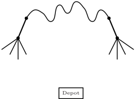

Fig. 1. Illustration of the Double Outer Scan heuristic.

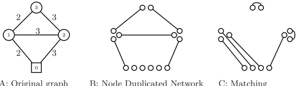

A: Original graph

B: Node Duplicated Network

C: Matching

Fig. 2. Illustration of the Node Duplication heuristic.

optimal partitioning. This algorithm is illustrated in Figure 2, where A shows the original graph with numbers on the edges indicating the cost. Node 0 is the depot node, the five edges have unit demand, and the vehicle capacity is 2. B shows the node duplicated network. The total cost of the demand edges is 13. Finally, C gives a minimum cost perfect matching of cost 9. Combining B anc C results in an Euler Tour { 0 1-2-3-1-0 2-0 1 0 } of cost 22, where '-' indicates service. This tour is partitioned into three vehicle tours, { 0 1-2-3 1 0 } , { 0 1 3-1-0 } , and { 0 2-0 } , with total cost 12 + 8 + 6 = 26.

The A-ALG algorithm by Wøhlk, [92], is an 7 2 -3 W -approximation algorithm for the CARP, where W is the vehicle capacity. The idea is to use the 3 2 -approximation algorithm for the RPP by Frederickson, [52], to construct a giant tour, which is partitioned into vehicle tours using optimal partitioning. Both the Node Duplicated Heuristic and the A-ALG are highly competitive to the classical problem specific heuristics.

During the last decade, most advances in the development of heuristics for the CARP have dealt with metaheuristics. For a general description of the various metaheuristics we refer the reader to [57].

Eglese, [40], considers a winter gritting problem, which is modeled as a CARP with extra complicating constraints specific to the case studied. He solves this problem using a Simulated Annealing algorithm. Wøhlk, [92], suggests a Simulated Annealing algorithm for the classical CARP, where the order

of the edges on a giant tour is changed during the algorithm, and at each step the optimal partitioning of the tour is calculated.

Several Tabu Search algorithms have been constructed for the CARP. The first Tabu Search algorithm called CARPET, [62], was suggested by Hertz et al. in 2000. Here infeasible solutions are allowed but penalized in the objective function. This algorithm outperformed the existing algorithms at that time and is still one of the best performing algorithms for the CARP. For the Multi Depot version of the CARP, a Tabu Search algorithm, has been suggested by Amberg et al., [6], in 2000. In 2003 Greistorfer, [59], combined Tabu Search with Scatter Search to construct a Tabu Scatter Search for the CARP. Finally a completely deterministic Tabu Search algorithm has recently been suggested by Brandˆo and Eglese, [26], which, with varying extent, penalizes a infeasible solutions in the objective function and alternates between different neighborhood structures.

Lacomme et al. presented a Genetic Algorithm in 2001, [71], and a Memetic Algorithm in 2004, [74]. In both algorithms crossover is performed on a giant tour, and fitness of a chromosome is based on the partitioning of the tour into vehicle tours. Currently these algorithms are among the very best performing for the CARP. Chu et al., [34], presented a Scatter Search algorithm for a periodic version of the CARP. When tested on instances of the classical CARP their algorithm is competitive to CARPET, but with longer computation times.

One of the younger generations of metaheuristics is that of an Ant Colony System. Lacomme et al., [77], propose such an algorithm where two types of ants are used, elitist ants which make the solution converge towards a minimum cost solution and non-elitist ants which ensure diversification to avoid getting trapped in a local minimum. This algorithm works on a graph where edges are replaced by two directed arcs. The authors report results competitive to the best algorithms with respect to solution quality but with longer computation times. Doerner et al., [36], applied an Ant Colony System to the CARP where they worked directly on the undirected graph. The authors report limited success.

A Guided Local Search algorithm has been presented for the CARP by Beullens et al., [23], in 2003, where the distance of each edge is penalized according to some function which is adjusted throughout the algorithm. Computational experiments show that this approach is promising.

A Variable Neighborhood Descent algorithm has been presented by Hertz and Mittaz, [64]. They suggest the first neighborhood to be based on the procedures ADD and DROP, whereas the remaining neighborhoods are based on merging a number of tours succeeded by a sequence of SWITCH steps and completed by CUT and SHORTEN, all of which are well-known procedures originally suggested by Hertz et al., [63]. The reported results are among the best to date.

Fig. 3. Relationships among lower bounds for the CARP.

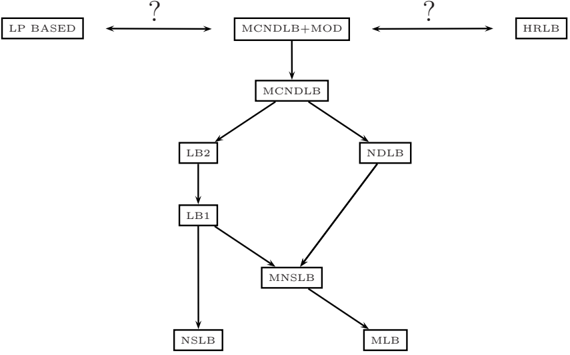

## 3.2 Lower Bounds for the CARP

There is a tradition for using combinatorial lower bounds based on minimum cost perfect matchings for the CARP. In Figure 3, the relationship is shown among the various lower bounds for the CARP. Here an arrow from bound x to y indicates that bound x outperforms bound y , i.e., it has been proved that x σ ( ) ≥ y σ ( ) for any instance σ of the problem. It should be noted that the Hierarchical Relaxations Lower Bound (HRLB) has only been experimentally compared with the other bounds, so even though it performs well on the instances tested, to our knowledge, it has not been proved to outperform any of the other bounds for all instances, which explains its position in the figure.

The first lower bound to be proposed for the CARP is the Matching Lower Bound (MLB) in 1981, [58]. Next, the Node Scanning Lower Bound (NSLB) was suggested in 1987. It is based on logic arguments that bound the length of the path the vehicles must traverse in the beginning and end of its tour. Combining the bounds gives us the Matching - Node Scanning Lower Bound (MNSLB). In 1992 an improvement of the MLB, called the LB1, was suggested. The Node Duplication Lower Bound (NDLB) from 1992 is based on a matching in a network where the nodes are duplicated and connected by the shortest paths if the combination of the corresponding demand edges is possible in a legal vehicle tour.

The five lower bounds, MLB, NSLB, MNSLB, NDLB, and LB1 all estimate the number of vehicles needed to service the graph based on the cut ( { 1 } , G \ { 1 } ), where node 1 is the depot. In [90] it is suggested to consider not only one cut as in the previous bounds, but a whole family of disjoint cuts. This method increases the complexity of the algorithms but gives stronger results.

The next couple of lower bounds for the CARP are based on that idea. Let U be a set of nodes that includes the depot and let G U ( ) be the graph induced by U . For each set of cuts, ( U, U ) a lower bound on the cost of the edges in G U ( ) and an estimate of the cost of the edges in G \ G U ( ) is calculated. In [90], estimates of the cost of the edges in G U ( ) is made by a construction similar to the one used in MLB. The LB2 algorithm improves this aspect by estimating the cost using the LB1 algorithm.

For instances of the CARP where the number of vehicles used is fixed, the two lower bounds, LB3 and LB4 have been suggested. For description of the above mentioned lower bounds we refer the reader to [1, 92], where references are also given to the original papers.

The Hierarchical Relaxation Lower Bound (HRLB), presented by Amberg and Voß in 2002, [7], is an iterative bound like LB2 but here the cuts that are iterated over are not disjoint. HRLB starts out by solving the CPP relaxation of the CARP. In each iteration more constraints are added to the problem, the cut set is extended and the relaxation is solved again. No relationships have been proved between HRLB and the other bounds, but in practice HRLB has shown to perform very well.

The Multiple Cuts Node Duplication Lower Bound (MCNDLB), suggested by Wøhlk in 2006, [93], uses the same disjoint cuts strategy as LB2, but at each iteration a stronger matching network, which is similar to the one used in the NDLB, is used to estimate the cost of servicing the edges in G \ G U ( ). MCNDLB was proved to be stronger than both LB2 and NDLB. In [1], Ahr improved the MCNDLB by considering more cuts than the successive disjoint ones considered in LB2 and MCNDLB. This is done by adding the nodes to be added to U in each iteration one by one, while calculating the cost of a matching in the new G \ G U ( ) for each of these nodes. The algorithm with this modification is called MCNDLB+MOD. Computational experiments show that for some instances these extra calculations result in better bounds.

## 3.3 Exact Methods for the CARP

Since the mathematical formulation of the CARP by Golden and Wong in 1981, [58], several different formulations have been proposed for the problem, ranging from dense, to sparse to supersparse. We refer the interested reader to [42] for details on these formulations and to [21] for an overview of valid inequalities and separation routines.

The first attempt to solve the CARP exactly was by Hirabayashi et al., [66], in 1992 by the use of Branch-and-Bound, where the Node Duplication Lower Bound was used to calculate lower bounds for the subproblems and branching was performed on a single edge of the node duplicated network. Using this algorithm, the authors are able to solve a set of CARP instances with from 15 to 50 demand edges to optimality.

In [19], Belenguer and Benavent present a Cutting Plane algorithm for the CARP, which is partly based on several classes of valid inequalities presented

earlier by the same authors, [18]. Using their algorithm, the authors are able to reach the best existing lower bound for all test instances, and can improve the existing lower bounds for several instances. They reduce the average gap between upper and lower bounds to less than one percent for the Gdb, Kshs, and Val instances and less than 2.4 percent for the Eglese instances.

Both Baldacci and Maniezzo, [13], and Arag˜o et al., [35], propose an exact a solution strategy for the CARP which is based on transforming the problem to a corresponding node routing problem (VRP), which is in turn solved by state-of-the-art algorithms. The transformation used in these papers is very similar to the one used in the network construction for the node duplicated lower bound, except for duplication of the depot. In both papers, the resulting VRP requires fixing a set of edges to belong to the solution set. Both papers report computational results that are highly competitive to the existing ones.

A Branch-Price-and-Cut algorithm is suggested for the CARP by Belenguer et al. in [20]. Only the average performance of the algorithm is given and compared with the Cutting Plane algorithm given in [19]. With the Branch-Price-and-Cut algorithm the average lower bound is 0.07, 0.39, and 2.36 percent below the best known solution for the Gdb, the Val, and the Eglese instances, respectively. These results are better than the average lower bounds obtained in [19], but not as good as the ones obtained with the method presented in [35]. No comparison of the running time is reported.

Exact solution using a Branch-Price-and-Cut algorithm is also considered by Letchford and Oukil, [79]. Their goal is to use the fact that CARP networks are very sparse since they represent street networks. A column generation approach is used, and the pricing problem is considered in two versions. The first one allows non-elementary tours and is solved by a dynamic programming type of algorithm. The second one only allows elementary tours, which is an NP -hard problem, and is solved with a Cut-and-Branch algorithm. The algorithms are currently being tested and compared to existing work.

When using column generation to solve the CARP, the subproblem becomes the problem of finding a tour which starts and ends at the depot, does not exceed the vehicle capacity and minimizes the total cost in a graph where some demand edges have negative cost since the cost in this graph corresponds to the reduced cost of the edge. Ignoring the capacity constraint and inverting the cost structure, this problem is the Privatized Rural Postman Problem (PRPP), [9], which could also be called the Prize Collecting Arc Routing Problem, and is formally stated as follows: Given an undirected graph G = ( N,E ) , with a special depot node, d . Let c e be the cost of traversing the edge e and let b e be the profit obtained the first time the edge e is traversed. Let t e be an integer indicating the number of traversals of the edge e . The goal is to find a single tour, T , starting and ending in d , which maximizes ∑ e ∈ T ( b e -t e c e ) , i.e., which maximizes the total profit.

This problem can intuitively be considered as an arc version of the Prize Collecting Traveling Salesman Problem, which is a node routing problem. To illustrate the problem, imagine a computer game where the goal is to traverse

a street network with the purpose of collecting treasures, maybe even in a stochastic setup. In [9], Ar´oz et al. give several mathematical models for the a PRPP, prove dominance relations among these, and deal with preprocessing aspects of their final model. Furthermore, they give polynomial time algorithms for the PRPP on a tree and a cactus, i.e., a graph where each edge is contained in at most one cycle.

## 4 Variations of the CARP

In this section, we consider variations of the classical CARP. Each of the variations considered reflects situations occurring in real life applications. In Section 4.1, we consider CARP defined on directed or mixed graphs, whereas in Section 4.2, we deal with alternative objective functions including Min-Max k -CPP, which is a CARP like problem with several vehicles but excluding capacity constraints. We consider the problem of including time window constraints in Section 4.3. Sections 4.4 and 4.5 deal with CARP with multiple depots and with mobile depots, respectively. A version of the problem, where not all vehicles are able to service all edges is considered in Section 4.6. The periodic CARP is considered in Section 4.7, and finally Section 4.8 considers a stochastic version of the problem.

## 4.1 CARP on Directed or Mixed Graphs

The classical CARP is defined on an undirected graph but several real life applications of the problem must take into account the existence of one-waystreets and streets where the two sides must be serviced in parallel. This requires the definition of the CARP on a directed and mixed graph respectively. These variations of the problem are referred to as DCARP and MCARP. Benchmark instances for the MCARP are available in [17].

The mixed CARP is considered extensively by Belenguer et al. in [15], where three problem specific heuristics, Augment-Merge, Path-Scanning, and Ulusoy's heuristic, are improved and changed to fit the problem and to include extra complications such as windy edges, prohibited turns, and several dumping sites. Furthermore, the Memetic Algorithm by Lacomme et al., [74], is adapted to the MCARP. Finally, the authors give a supersparse LP formulation of the MCARP, which is used in a Cutting Plane algorithm to obtain strong lower bounds for the problem. Computational experiments show that the gap between the lower bound and their Memetic algorithm is less than one percent for the test instances in [17].

A directed version of the CARP has been considered by Welz, [89], in order to derive optimal solutions. The author presents valid inequalities and separation algorithms for an ILP formulation of this problem. Lacomme et al., [72], consider an extension of the CARP, where mixed graphs, prohibited turns, and non-trivial cost structures are included. A mathematical model that includes these considerations is suggested for this problem.

## 4.2 CARP with Alternative Objective Functions

The usual objective in routing problems is to minimize the total distance traversed. But in several real life applications other objectives are just as important. This could be minimizing the total number of vehicles used, equalizing the load of the tours, or minimizing the length of the longest tour.

In [88], Ulusoy considers a version of the CARP where a vehicle includes a fixed cost if it is used and where the vehicles differ in capacity. Therefore, the objective function is to minimize the total travel cost plus the total fixed cost incurred by the use of vehicles. Both the case with an unlimited number of each vehicle type and the case where the number of each vehicle type is bounded are considered. A heuristic is presented which first constructs a giant tour and then splits the tour by solving a Shortest Path Problem which takes vehicle capacities and costs into account.

Lacomme et al., [75, 76], consider the Multi Objective CARP defined as the classical CARP where the objective is not only to minimize the total routing cost, but also to minimize the makespan, i.e., the length of the longest tour. With this objective the problem can be viewed as a mix between the CARP and the Min-Max K -Chinese Postman Problem, [53]. The authors present a generic algorithm for solving the Multi Objective CARP.

The Min-Max k -Chinese Postman Problem, [53], can be considered as a CARP where the vehicle capacity is infinite and the goal is to minimize the length of the longest tour. The problem is extensively studied by Ahr in [1]. The first heuristic for the MM k -CPP, which is presented by Frederickson et al. in [53], is based on constructing a giant tour which is subsequently partitioned into k tours of roughly equal length. In [1], Ahr presents a heuristic based on the Augment-Merge algorithm for the CARP along with a new algorithm based on the cluster first route second idea. A Tabu Search algorithm is presented for the MM k -CPP by Ahr and Reinelt in [2]. This algorithm is tested on a huge set of test instances with up to 392 edges. Computational testing shows that the results obtained by this algorithm is up to 30 percent better than the ones obtained with the construction heuristics and reduces the gap to the best lower bound to less than 10 percent (20 percent for a few instances). Two simple lower bounds are given directly for the MM k -CPP by Frederickson et al. in [53]. In [1], many of the combinatorial lower bounds originally presented for the CARP are adapted to work for the MM k -CPP using a modified notion of forbidden edges and the required number of postmen needed for a node set. The same text presents a Branch-and-Cut algorithm for the MM k -CPP using a new set of valid inequalities, which improved the lower bound obtained by about 5 percent on average.

A version of the directed CARP where the cost incurred by each arc depends on the time of service is considered by Gendreau et al. in [54] and is referred to as the CARP with Time-Dependent Service Costs. For real world problems such as winter gritting it can be argued that the CARP with this type of cost structure is more realistic than imposing hard time windows. In

[54] the problem is solved to optimality by converting it to an equivalent node routing problem with Time-Dependent Service Costs. Since the problem is directed, this transformation can be performed without a large increase in the problem size. The resulting node routing problem is solved by column generation, where a labeling algorithm is used to generate columns.

## 4.3 CARP with Time Windows

The CARP with Time Windows (CARPTW) is defined as the classical CARP with the extra requirement that the service of each demand edge must begin within some pre-specified time window. Benchmark instances for the CARPTW can be downloaded from [91].

CARPTW occurs in some of the applications of arc routing. Flight legs in Airline Scheduling have a fixed departure time and can therefore be considered as having a time window of zero length or a very short time window if some flexibility is allowed. Street Sweeping, [25], has restrictions with respect to the time during which the sweeping may be performed, and routing of winter gritters, [40], where some streets must be serviced within two hours, others within four etc. can be considered as CARPTW where the time windows are rather wide.

Various aspects of the CARPTW are considered by Wøhlk in [92]. Two mathematical models are given for the problem, one based on constructing a node duplicated network on which the ILP model is built and one based on a transformation to the equivalent node routing problem, the VRPTW. Wøhlk shows how to improve the lower bound, MCNDLB for the classical CARP, [93], when used for the CARPTW.

In [92], a version of the Path-Scanning algorithm which chooses edges based on their time windows is presented and a new heuristic, the Preferable Neighbor heuristic is suggested. This algorithm is based on constructing a set of feasible vehicle tours that looks promising due to some pre-specified criteria, and the set covering problem defined by these tours is then solved to optimality. Computational testing indicates that the results obtained with this algorithm are on average 1.2 percent above the lower bound for the instances given in [91]. A Greedy Randomized Adaptive Search Procedure (GRASP) with Path Relinking is suggested for the CARPTW by Labadi et al. in [70]. The algorithm is based on a Randomized Path-Scanning heuristic and a new heuristic based on a route first - cluster second idea. Local search is used to improve each solution found using OR-OPT, SWAP, and 2-OPT, and Path Relinking is used to lead a solution towards structures that seem favorable. Computational results show that this algorithm obtains results that are on average 0.8 percent above the lower bound.

## 4.4 Multi Depot CARP

The Multi Depot CARP (MD-CARP) is defined as the classical CARP, where each vehicle is located in one of several depots from which it must start and

end its tour. The most common variation of MD-CARP is where each vehicle must return to the depot from which it originated, but one could also consider the case where each vehicle just has to return to some depot independently of its starting location. Often a heterogeneous fleet of vehicles is considered in the MD-CARP. The MD-CARP frequently occurs in practice in mail delivery, winter gritting, and refuse collection. Some theoretical aspects of the MDCARP are considered by Wøhlk in [92], whereas Cattrysse et al., [29, 30], consider the long term planning problem of dividing the area into districts with one depot.

The problem of assigning streets to depots and constructing vehicle tours simultaneously is considered by Amberg et al. in [6]. Their solution strategy is quite unique for arc routing as the authors, after constructing a giant tour, transform the problem into an Arc-Constrained Capacitated Minimum Spanning Tree Problem (CMST). This problem is then solved heuristically, and the solution is improved by Local Search. Finally, a MD-CARP solution is derived from the CMST solution, and the resulting tours are improved by a simple route optimization procedure.

Ghiani et al., [56], consider a variation of the MD-CARP, referred to as the Capacitated Arc Routing Problem with Intermediate Facilities (CARP-IF). The problem is defined as the CARP with one depot, but has a set of nodes known as intermediate facilities, IF. The vehicles start and end at the depot but they can recharge their capacity in any of the intermediate facilities. For practical purposes the IFs can be dump sites for refuse or storage halls for salt for winter gritting and the like. The authors present two lower bounds and two heuristics for the CARP-IF. The first lower bound is based on the fact that the RPP is a special case of the CARP-IF, and therefore uses a relatively tight RPP lower bound based on Branch-and-Cut to bound the CARP-IF. The second lower bound is a relaxation lower bound of an ILP formulation based on dead-heading variables. The first heuristic they present for the problem is based on constructing an RPP-tour and splitting the tour into appropriate portions while connecting to the intermediate facilities. The second heuristic is based on solving the classical CARP in a modified network, transforming the solution to a CARP-IF solution in the original network and making some adjustments to restore feasibility.

## 4.5 CARP with Mobile Depots

Filippi and Del Pia, [46], consider a version of the CARP with two different types of servicing vehicles, where only one of them unloads at the depot. The other type of vehicle unloads onto the first type. With this setup, besides the routing of each type of vehicles, it must be decided at what time two vehicles must meet at some node in order to perform this unload action. This problem is encountered in a real life refuse collection problem, where satellite vehicles with small capacity unload into one of several large vehicles, which in turn are the only ones to unload at the depot. The authors solve the problem

with a modified version of the Variable Neighborhood Descent algorithm first presented by Hertz and Mittaz, [64].

The CARP with Refill Points (CARP-RP) could be considered to be a Multi Depot CARP where the depots are traveling to the vehicles to refill, [5]. In this problem, two types of vehicles are given. The usual service vehicles that service the edges by traversing them, and the refilling vehicles that can meet the service vehicle at any point in the graph for refilling purposes. A mathematical model is given for the CARP-RP and a Cutting Plane algorithm for solving the problem is suggested by Amaya in [5].

## 4.6 CARP with Vehicle/Site Dependencies

The CARP with Vehicle/Site Dependencies, studied by Sniezek in [87], is a variation of the CARP with several types of vehicles. The problem is defined such that not all edges can be serviced or traversed by all types of vehicles. Ball et al., [14], suggest a vehicle decomposition algorithm for solving an instance of this problem which they encountered in a refuse collection application. In [24], Bodin and Sniezek propose a solution procedure for the problem, which is based on a composite approach consisting of an Initial Fleet Mix Generator, a Mathematical Programming Procedure, and a Measure of Goodness function.

## 4.7 Periodic CARP

The Periodic CARP (PCARP) is defined as the CARP where a long time horizon is considered such that each demand edge requires service more than once. This situation sometimes occurs in refuse collection where each household is serviced two or three times a week on a rolling schedule. Here, it must be taken into account that the problem may require a minimum and maximum number of days between each service of the same street. A mathematical formulation of the problem is given by Chu et al. in [33], where three heuristics are also suggested for obtaining feasible solutions. Lacomme et al., [73], suggests a Generic Algorithm for solving the problem. This algorithm is an extension of the algorithm presented by the same authors in [71]. A Scatter Search algorithm for PCARP is suggested by Chu et al., [34], and two lower bounds are given by the same authors in [32]. Both of these are based on lower bounds for the classical CARP defined on a transformed graph.

## 4.8 Stochastic CARP

The Stochastic CARP (SCARP), first suggested by Fleury et al., [48, 50], is identical to the classical CARP except that the demand on the edges is a random variable. This problem occurs in practice in Refuse Collection, Mail Delivery, and Snow Removal where the exact demand is not known. In [49], Fleury et al. study the quality of solutions for the SCARP when the solutions are obtained with algorithms for the classical deterministic CARP.

They explore how the robustness of the solutions change when the deterministic problem is solved with a slightly smaller vehicle capacity. In [47], Fleury et al. present a Memetic Algorithm for the SCARP, which is an extension of the algorithm suggested by Lacomme et al. in [74]. The results obtained are compared to the results generated by algorithms for the classical CARP based on the average demand.

## 5 The Next Decade of Capacitated Arc Routing

In the preceding two sections, we have given an overview of the latest research on the Capacitated Arc Routing Problem and its extensions. In this section, we will offer our directions for future research within the area.

In general, there are two directions for future research. The first one goes toward size , speed , and quality , and the second one goes toward flexibility . Even though the ultimate goal is to attain the two goals simultaneously, we will elaborate on them separately.

In other words, the goal in the first direction is the development of faster algorithms to obtain better results for larger problem instances. As we have pointed out, the past decade has seen many contributions within the area of metaheuristics. Several of these can be used to obtain solutions that are within a few percent of the optimum for the existing benchmark instances. The new challenge is to use huge instances so that it will be possible to identify the new, better contributions with respect to quality and speed. Few attempts have been made to solve the CARP exactly, where some are based on converting the problem into node routing. This has lead to the development of several classes of cuts and separation routines. To reach the goal of obtaining exact solutions of larger instances in shorter time, new cuts need to be explored and the construction of exact methods that exploit the network structure of the problem might be beneficial.

In the previous section we have seen that most of the real life applications of the CARP contain different kinds of additional constraints such as vehicles of various sizes, time windows, or several resource types. The direction of flexibility is closely linked to a goal of usefulness for such real life problems. Some of the research in the area has already dealt with this aspect - in particular from a heuristic point of view, but the area is still open for further exploration, in particular with respect to exact methods. Moreover, with a few exceptions, all published material on the CARP deals with a deterministic and static setup. It is well known that many real life arc routing problems are either stochastic or dynamically changing, and therefore we recommend that these issues be further explored.

## Acknowledgement

The author would like to thank anonymous referees for their suggestions for improving this chapter.

## References

- 1. D. Ahr. Contributions to multiple postmen problems. PhD thesis, University of Heidelberg , 2004.
- 2. D. Ahr and G. Reinelt. A tabu search algorithm for the min-max k -chinese postman problem. Computers and Operations Research , 33(12):3403-3422, 2006.
- 3. M.T. Almeida and M.C. Mour˜ ao. Lower-bounding and heuristic methods for a refuse collection vehicle routing problem. European Journal of Operational Research , 121:420-434, 2000.
- 4. L. Amado and M.C. Mour˜ ao. Heuristic method for a mixed capacitated arc routing problem: A refuse collection application. European Journal of Operational Research , 160(1):139-153, 2005.
- 5. A. Amaya, A. Langevin, and M. Tr´panier. The capacitated arc routing problem e with refill points. Operations Research Letters , 35(1):45-53, 2007.
- 6. A. Amberg, W. Domschke, and S. Voß. Multiple center capacitated arc routing problems: A tabu search algorithm using capacitated trees. European Journal of Operational Research , 124:360-376, 2000.
- 7. A. Amberg and S. Voß. A hierarchical relaxations lower bound for the capacitated arc routing roblem. Proceedings of the 35th Annual Hawaii International Conference on System Sciences , 3, 2002.
- 8. S.K. Amponsah and S. Salhi. The investigation of a class of capacitated arc routing problems: The collection of garbage in developing countries. Waste Management , 24:711-721, 2004.
- 9. J. Ar´oz, E. Fern´ndez, and C. Zoltan. Privatized rural postman problem. a a Computers and Operations Research , 33(12):3432-3449, 2006.
- 10. A.A. Assad and B.L. Golden. Arc routing methods and applications, in Handbooks in operations research and management science, Volume 8 - Network routing , pages 375-483. Michael O. Ball and T.L. Magnanti and C.L. Monma and George L. Nemhauser, 1995.
- 11. A.A. Assad, B.L. Golden, and W.L. Pearn. Transforming arc routing into node routing problems. Computers and Operations Research , 14(4):285-288, 1987.
- 12. E.K. Baker, J.S. DeArmon, and B.L. Golden. Computational experiments with algorithms for a class of routing problems. Computers and Operations Research , 10(1):47-59, 1983.
- 13. R. Baldacci and V. Maniezzo. Exact methods based on node routing formulations for undirected arc routing problems. Networks , 47(1):52-60, 2006.
- 14. M. Ball, L. Bodin, L. Levy, and J. Sniezek. Capacitated arc routing problem with vehicle-site dependencies: The Philadelphia experience, in The vehicle routing problem . Paolo Toth and Daniele Vigo, 2001.
- 15. J.M. Belenguer, E. Benavent, P. Lacomme, and C. Prins. Lower and upper bounds for the mixed capacitated arc routing problem. Computers and Operations Research , 33(12):3363-3383, 2006.

- 16. J.M. Belenguer. http://www.uv.es/˜belengue/carp.html.
- 17. J.M. Belenguer. http://www.uv.es/˜belengue/mcarp/index.html.
- 18. J.M. Belenguer and E. Benavent. The capacitated arc routing problem: Valid inequalities and facets. Computational Optimization and Applications , 10:165187, 1998.
- 19. J.M. Belenguer and E. Benavent. A cutting plane algorithm for the capacitated arc routing problem. Computers and Operations Research , 30(5):705-728, 2003.
- 20. J.M. Belenguer, E. Benavent, and D. G´mez-Cabrero. Cutting plane and column o generation for the capacitated arc routing problem. ORP3 Meeting, Valencia , 2005.
- 21. E. Benavent, A. Corber´n, and J.M. Sanchis. Linear programming based metha ods for solving arc routing problems, in Arc routing -Theory, solutions and applications. M. Dror, editor. Kluwer Academic Publishers, 2000.
- 22. E. Benavent, V. Campos, A. Corber´n, and E. Mota. The capacitated arc routa ing problem: Lower bounds. Networks , 22:669-690, 1992.
- 23. P. Beullens, D. Cattrysse, L. Muyldermans, and D. Van Oudheusden. A guided local search heuristic for the capacitated arc routing problem. European Journal of Operational Research , 147:629-643, 2003.
- 24. L. Bodin and J. Sniezek. Using mixed integer programming for solving the capacitated arc routing problem with vehicle/site dependencies with an application to the routing of residential sanitation collection vehicles. Annals of Operations Research , 144(1):33-58, 2006.
- 25. L.D. Bodin and S.J. Kursh. A computer-assisted system for the routing and scheduling of street sweepers. Operations Research , 26(4):525-537, 1987.
- 26. J. Brandˆ ao and R.W. Eglese. A deterministic tabu search algorithm for the capacitated arc routing problem (CARP). Computers and Operations Research , to appear.
- 27. J.F. Campbell, A. Langevin, and N. Perrier. A survey of models and algorithms for winter road maintenance. Part III: Vehicle routing and depot location for spreading. Computers and Operations Research , 34(1):211-257, 2007.
- 28. J.F. Campbell, A. Langevin, and N. Perrier. A survey of models and algorithms for winter road maintenance. Part IV: Vehicle routing and fleet sizing for plowing and snow disposal. Computers and Operations Research , 34(1):258-294, 2007.
- 29. D. Cattrysse, T. Lotan, L. Muyldermans, and D. Van Oudheusden. Districting for salt spreading operations. European Journal of Operational Research , 139:521-532, 2002.
- 30. D. Cattrysse, L. Muyldermans, and D. Van Oudheusden. District design for arcrouting applications. Journal of the Operational Research Society , 54:1209-1221, 2003.
- 31. N. Christofides. The optimum traversal of a graph. OMEGA, The International Journal of Management Science , 1(6):719-732, 1973.
- 32. F. Chu, N. Labadi, and C. Prins. Lower bounds for the periodic capacitated arc routing problem The Odysseus 2003 conference , 2003.
- 33. F. Chu, N. Labadi, and C. Prins. Heuristics for the periodic capacitated arc routing problem. Journal of Intelligent Manufacturing , 16:243-251, 2005.
- 34. F. Chu, N. Labadi, and C. Prins. A scatter search for the periodic capacitated arc routing problem. European Journal of Operational Research , 169(2):586-605, 2006.

- 35. M. P de Arag˜o, H. Longo, and E. Uchoa. Solving capacitated arc routing proba lem using a transformation to the CVRP. Computers and Operations Research , 33(6):1823-1837, 2006.
- 36. K.F. Doerner, R.F. Hartl, V. Maniezzo, and M. Reimann. An ant system metaheuristic for the capacitated arc routing problem. Preprints of 5th Metaheuristics International Conference, Kyoto , 2003.
- 37. M. Dror, editor. Arc routing - Theory, solutions and applications. Kluwer Academic Publishers , 2000.
- 38. M. Dror, H.I. Stern, and P. Trudeau. Postman tour on a graph with precedence relation on arcs. Networks , 17:283-294, 1987.
- 39. J. Edmonds and E.L. Johnson. Matching, euler tours and the chinese postman. Mathematical Programming , 5(1):88-124, 1973.
- 40. R.W. Eglese. Routing winter gritting vehicle. Discrete Applied Mathematics , 48:231-244, 1994.
- 41. R.W. Eglese and A.N. Letchford. The rural postman problem with deadline classes. European Journal of Operational Research , 105:390-400, 1998.
- 42. R.W. Eglese and A.N. Letchford. Polyhedral theory for arc routing problems, in Arc routing - Theory, solutions and applications. M. Dror, editor. Kluwer Academic Publishers, 2000.
- 43. R.W. Eglese and L.Y.O. Li. An interactive algorithm for vehicle routeing for winter-gritting. Journal of the Operational Research Society , 47:pp. 217-228, 1996.
- 44. H.A. Eiselt, M. Gendreau, and G. Laporte. Arc routing problems, Part 1: The chinese postman problem. Operations Research , 43(2):231-242, 1995.
- 45. H.A. Eiselt, M. Gendreau, and G. Laporte. Arc routing problems, Part 2: The rural postman problem. Operations Research , 43(3):399-414, 1995.
- 46. C. Filippi and A. Del Pia. A variable neighborhood descent algorithm for a real waste collection problem with mobile depots. International Transactions in Operational Research , 13:125-141, 2006.
- 47. G. Fleury, P. Lacomme, and C. Prins. Evolutionary algorithms for stochastic arc routing problems. Lecture Notes in Computer Science , 3005:501-512, 2004.
- 48.
- G. Fleury, P. Lacomme, and C. Prins. Stochastic capacitated arc routing problems. Research Report LIMOS/RR-05-12 , 2005.
- 49. G. Fleury, P. Lacomme, C. Prins, and W. Ramdana-Ch´ erif. Robustness evaluation of solutions for the capacitated arc routing problem. Conference, AI Simulation and Planning in High Autonomy Systems. ISBN 1-56555-242-3 , pages 290-295, 2002.
- 50. G. Fleury, P. Lacomme, C. Prins, and W. Ramdane-Cherif. Improving robustness of solutions to arc routing problems. Journal of the Operational Research Society , 56:526-538, 2005.
- 51. M. Fleury. Deux problemes de geometrie de situation. Journal de Mathematiques Elementaires , pages 257-261, 1883.
- 52. G.N. Frederickson. Approximation algorithms for some postman problems. Journal of Association fot Computing Machinery , 26(3):538-554, 1979.
- 53. G.N. Frederickson, M.S. Hecht, and C.E. Kim. Approximation algorithms for some routing problems. SIAM Journal of Computing , 7(2):178-193, 1978.
- 54. M. Gendreau, J.Y. Potvin, and M. Tagmouti. Arc routing problems with timedependent service costs. European Journal of Operational Research , 181(1):3039, 2007.

- 55. G. Ghiani, F. Guerriero, G. Improta, and R. Musmanno. Waste collection in southern Italy: Solution of a real-life arc routing problem. International Transactions in Operational Research , 12:135-144, 2005.
- 56. G. Ghiani, G. Improta, and G. Laporte. The capacitated arc routing problem with intermediate facilities. Networks , 37(3):134-143, 2001.
- 57. F.W. Glover and G.A. Kochenberger, editors. Handbook of metaheuristics. Kluwer Academic Publishers , 2003.
- 58. B.L. Golden and R.T. Wong. Capacitated arc routing problems. Networks , 11:305-315, 1981.
- 59. P. Greistorfer. A tabu scatter search metaheuristic for the arc routing problem. Computers and Industrial Engineering , 44(2):249-266, 2003.
- 60. P. Haastrup, V. Maniezzo, M. Mattarelli, F. Mazzeo Rinaldi, I. Mendes, and M. Paruccini. A decision support system for urban waste management. European Journal of Operational Research , 109:330-341, 1998.
- 61. A. Hertz. Recent Trends in Arc Routing. in Graph theory, Combinatorics and algorithms: Operations research/computer science interfaces series , M.C. Golumbic and I.B.A Hartman. 2005.
- 62. A. Hertz, G. Laporte, and M. Mittaz. A tabu search heuristic for the capacitated arc routing problem. Operations Research , 48(1):129-135, 2000.
- 63. A. Hertz, G. Laporte, and P. Nanchen-Hugo. Improvement procedures for the undirected rural postman problem. INFORMS Journal of Computing , 11(1):5362, 1999.
- 64. A. Hertz and M. Mittaz. A variable neighborhood descent algorithm for the undirected capacitated arc routing problem. Transportation Science , 35(4):425434, 2001.
- 65. R. Hirabayashi, N. Nishida, and Y. Saruwatari. Node duplication lower bounds for the capacitated arc routing problems. Journal of the Operations Research Society of Japan , 35(2):119-133, 1992.
- 66. R. Hirabayashi, N. Nishida, and Y. Saruwatari. Tour construction algorithm for the capacitated arc routing problem. Asia-Pacific Journal of Operational Research , 9:155-175, 1992.
- 67. K. Jansen. An approximation algorithm for the general routing problem. Information Processing Letters , 41:333-339, 1992.
- 68. A.H.G. Rinnooy Kan and J.K. Lenstra. On general routing problems. Networks , 6:273-280, 1976.
- 69. M. Kiuchi, R. Hirabayashi, Y. Saruwatari, and Y. Shinano. An exact algorithm for the capacitated arc routing problem using parallel branch and bound method. Abstracts of the 1995 Spring National Conference of the Oper. Res. Soc. of Japan , pages pp. 28-29, 1995.
- 70. N. Labadi, C. Prins, and M. Reghioui. GRASP with path relinking for the capacitated arc routing problem with time windows. Lecture Notes in Computer Science , 4448:722-731, 2007.
- 71. P. Lacomme, C. Prins, and W. Ramdana-Ch´ erif. Competitive genetic algorithms for the capacitated arc routing problem and its extensions. Lecture Notes in Computer Science , 2037:473-483, 2001.
- 72. Philippe Lacomme, Christian Prins, and Wahiba Ramdana-Ch´ erif. An integer linear model for general routing problems. Technical Report. , 2003.
- 73. Philippe Lacomme, Christian Prins, and Wahiba Ramdana-Ch´ erif. Evolutionary algorithms for periodic arc routing problems. European Journal of Operational Research , 165:535-553, 2005.

- 74. Philippe Lacomme, Christian Prins, and Wahiba Ramdane-Cherif. Competitive memetic algorithms for arc routing problems. Annals of Operations Research , 131:159-185, 2004.
- 75. Philippe Lacomme, Christian Prins, and Marc Sevaux. Multiobjective capacitated arc routing problem. Lecture Notes in computer Science , 2632:550-564, 2003.
- 76. Philippe Lacomme, Christian Prins, and Marc Sevaux. A genetic algorithm for a bi-objective capacitated arc routing problem. Computers and Operations Research , 33(12):3473-3493, 2006.
- 77. Philippe Lacomme, Christian Prins, and Alain Tanguy. First competitive ant colony scheme for the CARP. Lecture Notes in Computer Science , 3172:426-427, 2004.
- 78. Andr´ e Langevin, Fabien Marzolf, and Marting Tr´panier. Road network mone itoring: Algorithms and a case study. Computers and Operations Research , 33(12):3494-3507, 2006.
- 79. Adam N. Letchford and Amar Oukil. Exploiting sparsity in pricing routines for the capacitated arc routing problem. Working paper, Department of Management Science, Lancaster University , 2006.
- 80. Arne Løkketangen and Johan Oppen. Arc routing in a node routing environment. Computers and Operations Research , 33(4):1033-1055, 2006.
- 81. Renata Mansini and M. Grazia Speranza. A linear programming model for the separate refuse collection service. Computers and Operations Research , 25(7/8):659-673, 1998.
- 82. Kwan Mei-Ko. Graphic programming using odd or even points. Chinese Mathematics , 1:237-277, 1962.
- 83. E. Minieka. The chinese postman problem for mixed networks. Management Science , 25:643-648, 1979.
- 84. C.S. Orloff. A fundamental problem in vehicle routing. Networks , 4:35-64, 1974.
- 85. Christos H. Papadimitriou. On the complexity of edge traversing. Journal of the Association for Computing Machinery , 23(3), 1976.
- 86. Horst Sachs, Michael Stiebitz, and Robin J. Wilson. An historical note: Euler's K¨ onigberg letters. Journal of Graph Theory , 12(1):133-139, 1988.
- 87. John Sniezek. The capacitated arc routing problem with vehicle/site dependencies: An application of arc routing and partitioning. PhD thesis, University of Maryland , 2001.
- 88. Gunduz Ulusoy. The fleet size and mix problem for capaciteted arc routing. European Journal of Operational Research , 22:329-337, 1985.
- 89. Scott Allen Welz. Optimal solutions for the capacitated arc routing problem using integer programming. PhD thesis, University of Cincinnati , 1994.
- 90. Zaw Win. Contributions to routing problems. PhD thesis, University of Augsburg , 1988.
- 91. Sanne Wøhlk. http://www.wohlk-son.dk/sanne/research carptw.html.
- 92. Sanne Wøhlk. Contributins to arc routing. PhD thesis, University of Southern Denmark , 2005.
- 93. Sanne Wøhlk. New lower bound for the capacitated arc routing problem. Computers and Operations Research , 33(12):3458-3472, 2006.

## Inventory Routing

Luca Bertazzi , Martin Savelsbergh , and Maria Grazia Speranza 1 2 1

1 Department of Quantitative Methods University of Brescia

Italy bertazzi@eco.unibs.it, speranza@eco.unibs.it

2 H. Milton Stewart School of Industrial and Systems Engineering Georgia Institute of Technology Atlanta, GA 30332-0205 mwps@isye.gatech.edu

Summary. In this chapter, we introduce inventory routing problems. Inventory routing problems are among the more important and more challenging extensions of vehicle routing problems, in which inventory control and routing decisions have to be made simultaneously. The objective is to determine distribution policies that minimize the total cost, i.e., the sum of inventory holding and transportation costs, while avoiding stock-outs and respecting storage capacity limitations. All inventory routing problems have some common characteristics, but they may also have a number of significantly different characteristics. As a result, a variety of solution approaches has been developed. We discuss the various characteristics of inventory routing problems in order to create an understanding of and instill an appreciation for the complexities of inventory routing problems.

Key words: Logistics; supply chain management; inventory routing survey.

## 1 Introduction

The class of inventory routing problems (IRPs) is large and the number of solution approaches that have been proposed for their solution is even larger. Inventory routing problems all share some basic characteristics. They all consider environments in which products are shipped from a supplier to one or more customers by means of, usually capacitated, vehicles. Costs are incurred for the distance traveled by the vehicles and those costs are included in the objective function. This characteristic explains the word routing in the name of the problem class. What makes this class of problems significantly different from most other classes of routing problems is the presence of an inventory component, which explains the word inventory in the name of the problem class. The inventory component arises because customers consume product

B. Golden et al. (eds.), The Vehicle Routing Problem , doi: 10.1007/978-0-387-77778-8 3, c © Springer Science+Business Media, LLC 2008

over time and have only limited storage capacity. The supplier has to manage product inventory at customers to ensure that customers do not experience a stock-out. The inventory component thus adds a time dimension to the traditional spatial dimension of routing problems. The presence of inventory complicates the routing decisions in two fundamental ways. First, the limited inventory holding (storage) capacity at the supplier and/or at the customers has to be taken into account when deciding on delivery quantities. Second, inventory holding costs, at the supplier or at the customers, may be incurred which has to be accounted for in the objective function.

Beyond these basic characteristics, there is a variety of other characteristics that may significantly change the structure of a particular inventory routing problem, such as

- · the planning horizon can be finite or infinite;
- · inventory holding costs may be charged at the supplier only, at the supplier and the customers, or at the customers only;
- · inventory holding costs may or may not be considered;
- · the production and consumption rates can be deterministic or stochastic;
- · production and consumption take place at discrete time instants or take place continuously;
- · production and consumption rates are constant over time or vary over time;
- · the optimal delivery policy can be chosen from among all possible policies or has to be chosen from among a specific class of policies.

In this chapter, we consider only inventory routing problems involving the distribution of a single product over a finite planning horizon with deterministic and stationary production and consumption rates. This simple, yet surprisingly complex, setting allows us to introduce the reader to some of the issues arising in inventory routing. Section 2 focuses on the impact of inventory holding costs and storage capacities on delivery policies in a discrete time setting. Section 3 focuses on the impact of consumption rates and storage capacities on delivery policies in a continuous setting. In Section 4 we provide a brief overview of the literature on inventory routing problems.

We start by introducing notation for the elements that are common to the inventory routing problems we discuss in Sections 2 and 3. Inventory routing problems are defined on a graph G = ( V, E ), where V = { S, 1 , . . . , n } is the set of vertices and E is the set of edges. Vertex S represents the supplier and vertices 1 , . . . , n represent the customers. A travel time t ij and a cost c ij are associated with edge ( i, j ) ∈ E . The capacity of each vehicle is Q . If time is discrete, we denote by q i the quantity of product consumed per unit of time by customer i . If time is continuous, we denote by u i the usage or consumption rate. The initial inventory level at the supplier is denoted by I 0 S . The initial inventory at customer i is denoted as I 0 i . Initial inventories can either be given or be decision variables. Considering initial inventories as decision variables may significantly improve the quality of the solution.

We denote by I t i and I t S the inventory level at customer i and at the supplier at time t , respectively. The inventory holding capacity at customer i is C i and at the supplier is C S . The inventory holding cost at the supplier is h S and at customer i is h i . Whenever a cost is not considered in a particular variant, its value is assumed to be 0. The length of the planning horizon is denoted by H .

The decisions to be made are (1) when to deliver to each customer, (2) how much to deliver to each customer each time it is served, and (3) how to route the vehicles so as to minimize the total cost. The total cost always includes the transportation costs incurred by the vehicles and may or may not include the holding costs incurred at the supplier and the customers. A delivery policy has to ensure that the supplier and the customers do not experience any stock-outs, that storage capacities at the supplier and the customers are not exceeded, and that the vehicle capacity limit is respected.

The routing component of inventory routing problems by itself already makes the problems hard. In fact, the problems reduce to the traveling salesman problem when the planning horizon is one, the inventory costs are zero, the vehicle capacity is infinite, and all customers need to be served. Furthermore, even when only one customer is considered, some variants remain computationally hard (see Speranza and Ukovich [55]).

We will not provide a detailed survey of the vast number of papers on inventory routing problems that have been published in the literature. A number of surveys already exist (e.g., [21, 30, 34]) and we refer the reader to these surveys for an in-depth overview of this fertile area of research. Instead, we focus on a few variants and hope to generate an appreciation for the variety and richness of inventory routing problems and for the challenges and pitfalls encountered when trying to construct optimal or high quality solutions, and to stimulate a desire to delve deeper into these fascinating problems. To facilitate such investigations, we briefly summarize the literature on IRPs in Section 4.

## 2 Inventory Holding Capacity and Costs

In this section, we consider a discrete time setting. We take the example introduced by Bell et al. [9] and investigate several simple modifications, involving inventory holding capacity and inventory holding costs, to demonstrate the impact of the presence of inventory on the routing decisions. We first investigate the case in which only the transportation costs are included in the objective function, then the case in which inventory holding costs are added to the transportation costs. In both these cases the initial inventory levels are fixed. Then, we study the case in which inventory holding costs are charged, together with the transportation costs, and the initial inventory levels are decision variables.

Fig. 1. Bell et al. example.

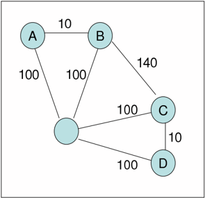

In the example of Bell et al. [9] there are four customers to be served by a single supplier. Time is discrete. Let I = { A,B,C,D } be the index set of the customers. Figure 1 shows the available connections with their associated travel costs. The capacity C i and quantity q i of each customer i ∈ I are given in Table 1.

The initial inventory level of each customer i is equal to its holding capacity, that is I 0 i = C i for all i ∈ I . There is an unlimited number of vehicles with capacity Q = 5000. In the original description of the example, nothing is specified about the supplier. It is understood that there are no limitations on product availability, i.e., C S = ∞ . The objective is to find a periodic distribution policy that minimizes the total cost, that does not cause a stock out at any of the customers, and that does not exceed the storage capacity at the customers and the vehicle capacity. The periodicity of the policy implies that the inventory levels at the end of the period must be equal to the initial levels. The horizon is implicitly assumed to be infinity; the periodic policy is repeated over and over. From Figure 1 it is easy to see that a natural distribution policy is to combine the two pairs of close customers A and B and C and D, and serve each pair with a separate vehicle. The daily cost is 420. A better distribution policy repeats every two days. On the first day, A and B

Table 1. Capacity and consumption in the Bell et al. example.

| Customer   |   Capacity C |   Consumption q i |
|------------|--------------|-------------------|
| A          |         5000 |              1000 |
| B          |         3000 |              3000 |
| C          |         2000 |              2000 |
| D          |         4000 |              1500 |

are served together with one vehicle and C and D are served together with another vehicle. A quantity 2000 (twice the daily consumption) is delivered to A, 3000 (the daily consumption) to B, 2000 (the daily consumption) to C and 3000 (twice the daily consumption) to D. Both vehicles fully utilize their available capacity. Since customers B and C have to be served daily, due to their storage capacity and daily consumption, on the second day customers B and C are served together in a tour, delivering a quantity of 3000 to B and of 2000 to C, while A and D are not visited. The average daily cost is 380. This solution has been proven to be optimal by Adelman [1] and Song and Savelsbergh [53].

Observe that the actual timing of deliveries during the day is not considered. Customer B consumes 3000 units of products per day and receives 3000 units of product per day. Implicitly, it is assumed that on any day delivery takes place after the inventory of 3000 units has been consumed. The inventory level is calculated at the end of the day, after consumption and delivery have taken place. A similar situation occurs at customer C.

Alternatively, we can assume that the initial inventories are zero, and that delivery takes place before consumption. The optimal delivery policy remains the same. For the remainder, this is the setting we consider, i.e., at each time instant delivery takes place before consumption and the inventory level is observed after that.

Next, we introduce various simple modifications to the example of Bell et al. and study the impact on the optimal solution. The length of the planning horizon H is four days. The initial inventory I 0 i at each customer i is either zero or a decision variable. The inventory holding cost may or may not be accounted for in the objective function. In case it is, it can be either the inventory holding cost at the supplier, the inventory holding cost at the customers, or the sum of the inventory holding costs at the supplier and at the customers. The first papers that consider holding costs in the objective function are Blumenfeld et al. [19] for the case with continuous time and Speranza and Ukovich [54] for the case with discrete time. The following unit inventory costs are considered for both the supplier and the customers: 0, 0.01, and 0.1. If the inventory cost at the supplier is accounted for in the objective function, then the production rate at the supplier is assumed to be equal to the sum of the consumption rates at the customers, i.e., 7500, and the initial level of the inventory at the supplier I 0 S is either zero or a decision variable of the problem. Deliveries can

be performed at the discrete time instants t ∈ { 1 , . . . , H } by an unlimited fleet of vehicles. The sets of customers that can be served on a single route are: R 1 = { A } , R 2 = { B } , R 3 = { C } , R 4 = { D } , R 5 = { A,B } , R 6 = { B,C } , R 7 = { C, D } . The routes considered are the direct routes to a customer and the routes that serve adjacent customers. Let k ∈ K = { 1 2 , , . . . , 7 } be an index of the routes and let r ik be an indicator equal to 1 if customer i is served on route k and 0 otherwise. We assume, for the sake of simplicity, that each route can be performed at most once per day. The cost c k of route k is the cost of the corresponding optimal traveling salesman problem.

We analyze different environments and show, for each of them, the optimal solution over the planning horizon of 4 days. The solutions are obtained by solving mixed integer linear programming models. These models are not representative of the models proposed to solve large, real-life instances of inventory routing problems. They are introduced here only to obtain optimal solutions for the examples used in the chapter. The optimal solutions are shown in figures. Each figure is organized in one or more rows. Each row shows four boxes, one for each day. Each box shows the routes traveled by the vehicles, the quantity delivered to each customer, and the level of the inventory at each customer at the end of the day (in the lower left corner; each small rectangle represents 500 units of product). If more than one row is shown, each corresponds to a different environment, labeled with a letter, starting from the top row.

Transportation cost only. We first analyze the case in which only transportation cost is considered in the objective function. This case corresponds to an environment in which the transportation cost represents the major cost component, for example due to the fact that the supplier and the consumers represent entities of one and the same company (e.g., a distribution center and retail outlets) and the differences in inventory holding costs at the supplier and the consumers are negligible. Inventory levels at the customers still have to be controlled to avoid a stock-out and to respect the holding capacity limits. Let I 0 i = 0, ∀ i , let x t ik be the quantity shipped to customer i at time t using route k , and let y t k be equal to 1 if route k is used at time t and 0 otherwise. The optimal solution is obtained by solving the following mixed integer linear programming model:

<!-- formula-not-decoded -->

<!-- formula-not-decoded -->

<!-- formula-not-decoded -->

<!-- formula-not-decoded -->

Table 2. Optimal costs with different transportation capacity.

|     Q |   C i given |   C i = + ∞ |
|-------|-------------|-------------|
|  5000 |       380   |       340   |
| 10000 |       377.5 |       190   |
| 15000 |       377.5 |       152.5 |
| 20000 |       377.5 |       105   |

<!-- formula-not-decoded -->

<!-- formula-not-decoded -->

<!-- formula-not-decoded -->

<!-- formula-not-decoded -->

The objective function (1) expresses the minimization of the average daily transportation cost. The constraints (2) guarantee that the total quantity delivered by each vehicle is not greater than its capacity. The constraints (3) guarantee that a delivery to customer i on route k only takes place if customer i is visited on route k . The constraints (4) define the level of the inventory of each customer i for each time instant t . The constraints can be also written as I t i = I t -1 i + ∑ k ∈ K x t ik -q i . The constraints (5) guarantee that the storage capacity of each customer is never exceeded. The constraints (6) guarantee that no stock-out occurs at any customer i during the planning horizon. Finally, the constraints (7)-(8) define the decision variables of the problem.

Figure 2 shows the optimal solutions obtained in two different environments. The first row corresponds to the environment in which the storage capacity C i at each customer i has to be respected and cannot be exceeded, while the second row corresponds to the environment in which there are no storage capacities at customers, i.e., C i = + ∞ for all i ∈ I . In other words, we show the effect of relaxing constraints (5). In the first case, the costs are 380, while in the second case the costs are 340. In both situations, the vehicle capacity is fully utilized in all tours.

Next, we examine what happens when the vehicle capacity is increased. The values of the optimal solutions are shown in Table 2 for Q = 5000 10000 , , 15000, and 20000. In the case with holding capacities at customers, shown in Column 2, the cost decreases from 380 to 377.5. This happens for Q ≥ 7000. In the case without holding capacities at the customers, shown in Column 3, the cost decreases from 340 to 105. This value is obtained for Q ≥ 16000. As expected, the impact of the vehicle capacity on the optimal cost is substantially higher in the case without holding capacities at customers.

Transportation and inventory holding costs. When inventory holding costs at the customers are taken into account in the objective function, the total cost

Fig. 2. Minimizing transportation costs only. a) With maximum inventory holding capacity at the customers: 380. b) Without maximum inventory holding capacity at the customers: 340.

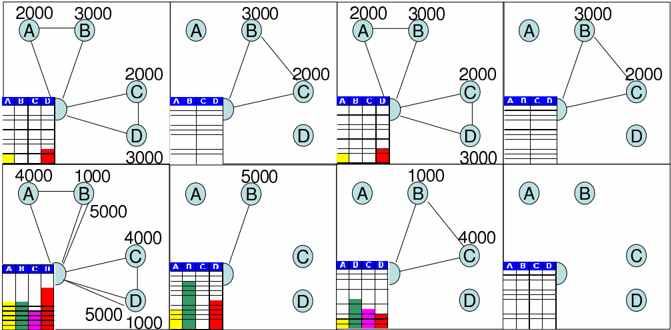

of an optimal solution will obviously increase. An optimal solution can be obtained by solving the following mixed integer programming problem:

<!-- formula-not-decoded -->

subject to (2)-(8).

Figure 3 shows the solutions for two environments that differ only in terms of the inventory holding costs charged at the customers (storage capacity is limited at the customers). The first row shows the solution for the environment in which the inventory holding cost is small, h i = 0 01 for all . i ∈ I , while the second row shows the solution for the environment in which the inventory holding cost is large, h i = 0 1 for all . i ∈ I . It is interesting to observe that with higher inventory holding costs the optimal solution visits customers more frequently. Moreover, in this setting available vehicle capacity is no longer used fully.

To take inventory holding costs at the supplier into account, a term ∑ t ∈ T h S I t S needs to be incorporated in the objective function that becomes

Fig. 3. Minimizing transportation cost and inventory cost at the customers. a) With h i = 0 01: 380 + 12.5 = 392.5. b) With . h i = 0 1: 420 + 0 = 420. .

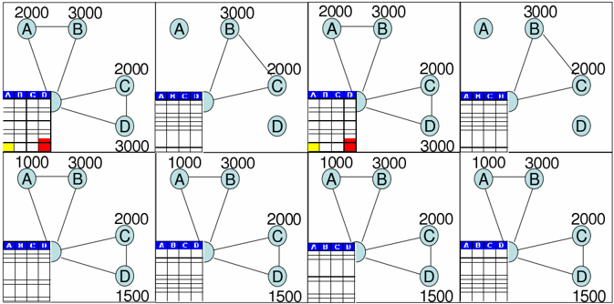

<!-- formula-not-decoded -->

The following constraints need to be added to the constraint set

<!-- formula-not-decoded -->

<!-- formula-not-decoded -->

Constraints (9) state that the inventory level at the supplier at time t is obtained by the initial level increased by the production up to t and decreased by the quantity delivered to the customers up to t .

Figure 4 shows the solutions for environments in which, in addition to the transportation costs, inventory holding costs at customers only, at the supplier only, and at both customers and the supplier are taken into account, respectively (storage capacity is limited at the customers). In the figure, the inventory level of the supplier is also shown. While in the first environment the vehicles travel with full loads, in the second and the third environments this is no longer the case and, furthermore, each customer is served daily. Note that

Fig. 4. a) Minimizing transportation cost and inventory holding cost at the customers, h i = 0 01: . 380 + 12.5 = 392.5, b) Minimizing transportation cost and inventory holding cost at the supplier, h S = 0 01: 420 + 0 = 420, c) Minimizing . transportation cost and inventory holding costs at the supplier and the customers, h i = 0 01 and . h S = 0 01: 420 + 0 + 0 = 420. .

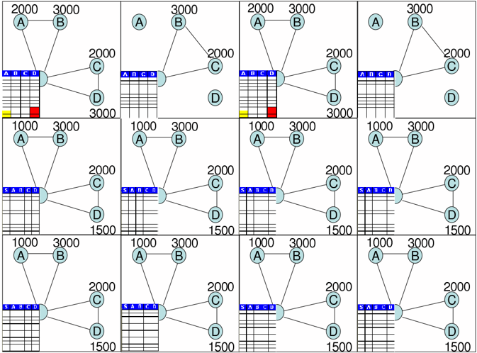

in the second and third environments the total inventory is always equal to zero. This is due to the fact that the total inventory is constant over time and that the initial inventory level is equal to zero both at the supplier and the customers. As a consequence, in an optimal policy we have ∑ k ∈ K x t ik = q i , t ∈ T . In general, given that the total inventory is constant over time and equal to ∑ i ∈ I I 0 i + I 0 S , if the initial inventory levels are given and h i = h S , ∀ i , then the inventory holding costs can be ignored and only transportation costs need to be minimized. Therefore, the problem with inventory holding costs is interesting only when the inventory holding costs are different.

Transportation and inventory holding costs, variable initial inventory levels. Next, we consider the case in which inventory holding costs are charged both at the supplier and at the customers and the initial inventory levels are not fixed, but are to be determined by the optimization. In this case it is necessary to include so-called demand constraints in the model, that is constraints that guarantee that the total quantity shipped to each customer is equal to the

corresponding total consumption over the planning horizon:

<!-- formula-not-decoded -->

subject to (2)-(8), (9)-(10) and the following constraints:

<!-- formula-not-decoded -->

<!-- formula-not-decoded -->

<!-- formula-not-decoded -->

Figure 5 shows, in the first row, the optimal solution for the situation in which holding capacity is limited at the customers, and, in the second row, the optimal solution when there are no limits on the holding capacity at the customers (storage capacity is limited at the customers). We have seen that in the situation where the initial inventory is given and assumed to be 0, the optimal solution value is 420 (see the third row of Figure 4). The solution in the first row of Figure 5 has a value of 405. The savings are a result of the additional flexibility, i.e., the choice of initial inventory levels. The optimal initial inventory level is 0 for customers B and C and 1000 and 1500 for customers A and D , respectively. As a consequence, the total inventory is always equal to 2500 during the planning horizon. When we compare this solution to the solution shown in the second row of Figure 5, when there are no limits on the storage capacities at customers, we observe that the optimal initial inventory level is 0 for customers A B , and D and 2000 for customer C , the optimal initial level at the supplier is 2500. The total inventory is always 4500 during the planning horizon and the costs decrease even further to 390. The darker customers shown in Figure 5 indicate the customers that have an initial inventory in the optimal solution. The others have no initial inventory.

The models used in the above examples are built on the basis of a preselected set of routes. The models studied in the literature include the routes creation in the set of decisions to be taken. The only exact approach available for the solution of an inventory routing problem can be found in Archetti et al. [7]. In Bertazzi et al. [13] heuristics are used to study the impact of different objective functions on the solution of an inventory routing problem.

Figure 6 compares the optimal solution obtained in the case with equal inventory holding cost at the supplier and the retailers with respect to the case of unequal inventory holding costs. The first row shows the case with h S = h i = 0, ∀ i , in which the sum of the transportation and inventory costs both at the supplier and the retailers is minimized, the initial inventory level at the supplier and the retailers is variable and with inventory holding capacity at the retailers. The second row shows the same case with the only exception of the inventory holding costs, which are h S = 0 1 and . h i = 0, ∀ i , respectively.

Fig. 5. Minimizing transportation cost and inventory holding costs at the supplier and customers; holding costs h i = 0 01 and . h S = 0 01; variable initial . inventory level. a) With inventory holding capacity at the customers: 380 + 12.5 + 12.5 = 405 ( I 0 A = 1000, I 0 D = 1500). b) Without inventory holding capacity at the customers: 345 + 32.5 + 12.5 = 390 ( I 0 S = 2500, I 0 C = 2000).

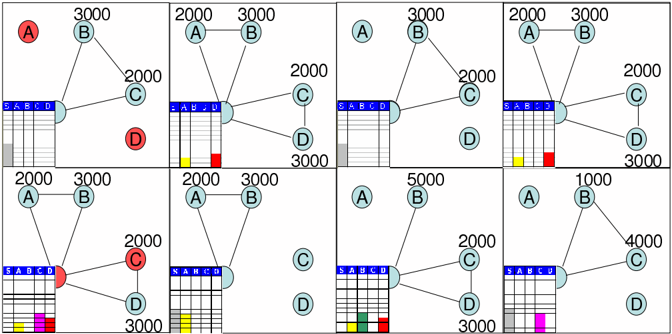

We note that in each time instant the quantity produced at the supplier is shipped to the retailers, even if not needed, in order to always have zero inventory levels at the supplier. Finally, the third row shows the case with h S = 0 and h i = 0 1, . ∀ i . We note that, in order to always have zero inventory levels at the retailers, the quantity delivered to each retailer in each day is equal to the quantity consumed by the retailer per time unit.

## 3 Continuous Production and Consumption

In the previous section, we focused on the impact that inventory holding costs had on delivery policies. We chose to work with a model in which deliveries take place at discrete time instants t ∈ T = { 1 2 3 4 , , , } , i.e., at the beginning of time periods [ t, t +1), and consumption takes place afterwards. The model assumes that (1) each vehicle performs exactly one delivery route during a time period, and that (2) the exact timing of the delivery during a time period is

Fig. 6. Equal vs unequal inventory holding costs: a) h S = h i = 0: 380 + 12.5 + 12.5 = 405 ( I 0 A = 1000, I 0 D = 1500). b) h S = 0 1, . h i = 0: 415 + 0 + 0 = 415 ( I 0 A = 1000, I 0 D = 1500). c) h S = 0, h i = 0 1: 420 + 0 + 0 = 420. .

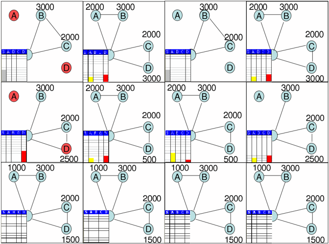

not important. Although this type of discrete time model is frequently used for inventory routing problems, it is too restrictive for many environments, for example environments in which customers use product continuously. In these environments the timing of deliveries is important as the available storage capacity, and thus the maximum delivery quantity, depends on the time of delivery. If product usage rates and storage capacities vary significantly among customers, then a mix of short and long routes may be inevitable, and the 'single delivery route per vehicle per period' assumption may no longer be appropriate. In situations where there are customers with small storage capacities and high usage rates that require one or more deliveries per time period, the timing of such deliveries becomes important as the time of delivery determines the available storage capacity.

In this section, we will concentrate on environments with continuous product usage and, for convenience, we will ignore inventory holding costs.

We start by observing that when the number of vehicles is greater than the number of customers and the storage capacity at each customer is larger than the vehicle capacity, the problem is easy. Why? Because in that case, the optimal distribution strategy is to dispatch a vehicle to a customer in such a

Fig. 7. IRP environment with a single supplier and two customers.

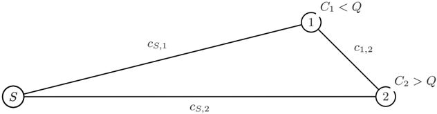

way that the vehicle arrives at the customer right at the time the customer is about to run out of product and to deliver an entire vehicle load. This minimizes the number of deliveries to a customer over the planning horizon and, at the same time, minimizes the distance traveled to do so.

As soon as the number of vehicles is smaller than the number of customers, the distribution strategy described above may no longer be optimal, because it may no longer be feasible; there may be a point in time when we need more vehicles than are available. As soon as the storage capacities at customers are smaller than the vehicle capacity a distribution strategy with only outand-back trips to customers may be feasible, but is almost guaranteed to be non-optimal. We are not fully using the available vehicle capacity and are therefore likely missing opportunities to reduce transportation costs. The simplest example of such a situation involves two customers. Suppose two customers are located next to each other, each with a storage capacity that is half the size of the vehicle capacity. It is clear that it is advantageous to deliver to both customers each time one of them is visited, as no extra costs are incurred by doing so and the total number of visits is reduced.

The above discussion highlights the fact that storage capacities less than the vehicle capacity cause the inventory routing problem to become significantly more difficult. This complexity manifests itself in various ways. First, it may be advantageous to visit more than one customer on a single route. Deciding which customers to put together on route is non-trivial, among other reasons because evaluating the distance traveled on a route involves solving a traveling salesman problem. Second, because the available storage capacity at customers changes over time, because of product usage, deliveries need to be coordinated in time to be able to fully exploit available vehicle capacity.

Consider the distribution environment depicted in Figure 7, i.e., a single supplier and two customers. Since C 1 &lt; Q , whenever a truck goes to customer 1 with a full load, at least Q -C 1 of product is left after the delivery at

customer 1. That leftover product can be used to satisfy the need for product at customer 2. Is that needed? Is that cost effective? Suppose that the total product usage over the planning horizon is U 1 for customer 1 and U 2 for customer 2. To deliver U 1 to customer 1, at least U 1 C 1 deliveries have to be made. Therefore, at least U 1 C 1 ( Q -C 1 ) leftover product is available for delivery at customer 2. If the leftover product is used to satisfy product need of customer 2, then Q Q C -1 trips with leftover product are necessary to deliver a quantity of Q to customer 2. Whenever leftover product is delivered to customer 2, an additional cost of c 12 + c S 2 -c S 1 is incurred. Therefore, the cost incurred to deliver Q to customer 2 with leftover product from customer 1 is Q Q C -1 ( c 12 + c S 2 -c S 1 ). The cost incurred to deliver Q to customer 2 directly from the supplier is 2 c S 2 . Consequently, if Q Q C -1 ( c 12 + c S 2 -c S 1 ) &lt; 2 c S 2 , it is better to use leftover product at customer 1 to satisfy the product need of customer 2. For the remainder, assume that this is the case, i.e., Q Q C -1 ( c 12 + c S 2 -c S 1 ) &lt; 2 c S 2 . Two cases have to be considered: (1) the leftover product is sufficient to satisfy customer 2's needs, and (2) the leftover product is insufficient to satisfy customer 2's needs.

Case 1 : If U 1 C 1 ( Q -C 1 ) ≥ U 2 , then a cost of at least U 2 Q C -1 ( c S 1 + c 12 + c S 2 ) + U 1 -U 2 Q C 1 C 1

-C 1 2 c S 1 is incurred. Case 2 : If U 1 C 1 ( Q -C 1 ) &lt; U 2 , then a cost of at least U 1 C 1 ( c S 1 + c 12 + c S 2 ) + U 2 -U 1 C 1 ( Q C -1 ) Q 2 c S 2 is incurred.

Note that the analysis above, although insightful, only considers the storage capacities at the customers; it ignores the timing of deliveries. It is not at all guaranteed that the suggested delivery scheme can be executed in practice as the quantity that can be delivered to a customer depends on the time of delivery. This reflects the intricate and complex relationship between customer usage rates and delivery route travel times. Thus, the analysis only provides a lower bound on the delivery costs incurred. A detailed discussion on computing lower bounds for inventory routing problems can be found in Song and Savelsbergh [53].

Two factors other than limited storage capacity at customers impact the complexity of the inventory routing problem: the ratio of the usage rate and storage capacity at a customer, i.e., u i C i , which defines the maximum time between two consecutive visits to a customer, and, in situations with a finite planning horizon, the ratio of initial inventory and product use over the planning period, i.e., I 0 i Hu i , which represents the percentage of total product consumed during the planning horizon that can be served from initial inventory. Typically, the need to make frequent deliveries to customers increases the complexity, especially when these customers have limited storage capacities.

We have mentioned a few times already in this section that the maximum quantity that can be delivered to a customer depends on the time of delivery. Consequently, the selection of actual delivery times, between the earliest and latest delivery times, will affect the total volume deliverable on a trip. Because

Fig. 8. Maximum delivery quantities at two customers as a function of delivery times.

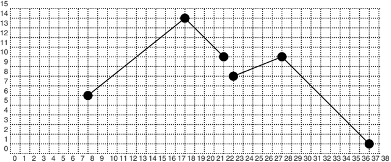

the customer consumes product over time, the later a vehicle arrives, the more inventory holding capacity is available and the more product can be delivered. On the other hand, delivery is typically not instantaneous, but depends on the size of the delivery. Furthermore, when a vehicle arrives later at a customer, less time may be available for making a delivery due to delivery time restrictions of customers to be visited later on the trip. These two dueling effects make determining an optimal delivery schedule for a given sequence of customer visits on a trip not as easy as it may seem at first glance.

As an example consider the situation depicted in Figure 8. It shows the maximum delivery quantity as a function of delivery time for two consecutive customers on a route; the first part of the graph, between times 8 and 22, relates to the first customer and the second part of the graph, between times 23 and 37, relates to the second customer. The earliest delivery time for the first customer is 8 and the latest delivery time is 22. The earliest delivery time for the second customer is 23 and the latest delivery time is 37. The slope of the line between times 8 and 18 is 0.8, the usage rate of the first customer, and the slope of the line between times 23 and 28 is 0.4, the usage rate of the second customer. The slope of the lines between times 18 and 22 and 28 and 37 is -1, corresponding to the rate at which product is discharged at the customers. The travel time between the first and second customer is 5. Initially, the amount of product that can be delivered to a customer increases, because product is consumed and the available storage capacity increases. The

Fig. 9. Deliver as late as possible.

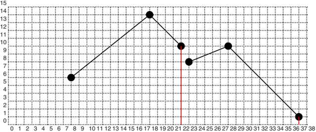

amount of product that can be delivered reaches a peak when the discharge time plus the travel time will be just enough to reach the next customer in time to make a delivery there. After the peak, the amount of product that can be delivered to a customer decreases with the discharge rate. The peak for the first customer is at time 18, since 18 plus 14 (the discharge time) plus 5 (the travel time to the second customer) is 37 (the latest delivery time at the second customer). We want to select the delivery times that result in the maximum total delivery quantity at both customers. Below we consider a few options. First, we consider delivering to both customers as late as possible. This situation is shown in Figure 9. The total quantity delivered is 11 (10 at the first customer and 1 at the second customer). Second, we consider delivering the maximum possible to the customer with the highest usage rate. This situation is shown in Figure 10. The total quantity delivered is 15. Finally, in Figure 11 we show the optimal delivery times, i.e., deliver 10 units at the first customer at time 13 and deliver 10 units at the second customer at time 28 (13 + 10 + 5) for a total quantity of 20.

A detailed discussion of how to maximize the delivery volume on a route in the context of inventory routing problems can be found in Campbell and Savelsbergh [24]. This simple example illustrates that few decisions are easy in inventory routing problems.

Fig. 10. Deliver maximum at the customer with highest usage rate.

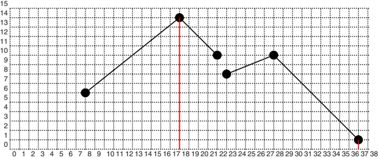

## 4 The Literature

In this section, we briefly summarize the literature on IRPs. There are several surveys of inventory routing problems, and we point the user to these for more detailed information [21, 30, 34]. There is such a variety of problems and solution approaches that even structuring a literature review is challenging. We have adopted the following scheme. We start with the pioneering papers in the eighties that generated the initial interest in inventory routing problems. Next, we group papers according to two basic characteristics: whether or not inventory costs are considered in the objective, and whether or not product usage is deterministic or stochastic. Finally, we mention a few papers that are related, but do not clearly belong to one of the four categories that we created.

As mentioned, the first papers on inventory routing problems appeared in the nineteen eighties. These papers, in most cases, discuss and are inspired by applications in which both inventory and distribution have to be considered. For example, Bell et al. [9], Blumenfeld et al. [19], Burns et al. [20], Chien et al. [29], Dror and Ball [32], Dror et al. [33], Federgruen and Zipkin [35], Fisher et al. [36], Golden et al. [40], and Hall [41].

The four categories described next contain a more varied class of papers, as the papers discuss applications, solution approaches, and worst-case and asymptotic analysis.

Fig. 11. Optimal delivery times.

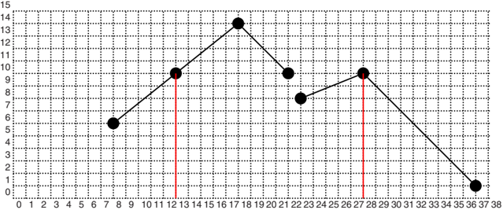

We first consider papers covering inventory routing problems with deterministic product usage in which inventory holding costs are considered in the objective function. This category contains papers concerned with supplying just a single retailer as well as papers concerned with supplying multiple retailers. Starting with the paper by Speranza and Ukovich [54], in which the single retailer case with given discrete shipping frequencies was introduced and modeled, several papers have appeared studying computational complexity, analysis of shipping policies, and heuristic and exact solution approaches, e.g., Bertazzi et al. [11, 18], Bertazzi and Speranza [15, 16] and Speranza and Ukovich [55]. The case of multiple retailers has been studied by Archetti et al. [7], Bertazzi [10], Bertazzi et al. [13, 14, 17], Cousineau-Ouimet [31] and Rabah and Mahmassani [49]. Bertazzi [10], Gallego and Simchi-Levi [37, 38], and Hall [42] study the performance of direct shipping policies. Anily [6], Anily and Federgruen [3, 4, 5], Chan et al. [26, 27] and Chan and Simchi-Levi [28] analyze the asymptotic performance of certain policies. Other papers in this category include Herer and Roundy [43] and Viswanathan and Mathur [57].

Next, we consider papers covering inventory routing problems with stochastic product usage in which inventory holding costs are considered in the objective function. This category contains the work by of Kleywegt et al. [45, 46] and the work of Minkoff [48] on Markov Decision Process models and solution approaches.

Next, we consider papers covering inventory routing problems with deterministic product usage in which no inventory holding costs are considered

in the objective function. This category contains a variety of papers. Savelsbergh and Song [51] compute lower bounds on the optimal distribution costs. Campbell and Savelsbergh [23, 24, 25] as well as Gaur and Fisher [39] study time-indexed formulations. Jaillet et al. [44] and Trudeau and Dror [56] analyze d -day policies and use this analysis to develop rolling-horizon approaches.

Next, we consider papers covering inventory routing problems with stochastic product usage in which no inventory holding costs are considered in the objective function. This category contains the work by Adelman [1, 2] on pricedirected approaches and the work of Berman and Larson [12] on stochastic dynamic programming.

Finally, we list papers that cannot clearly be associated with one of the above categories. Campbell and Hardin [22] study periodic delivery policies. Savelsbergh and Song [52] and Song and Savelsbergh [53] consider inventory routing problems with continuous moves, i.e., where vehicles do not return to a designated depot, but following multi-day tours visiting many supply and demand points along the way. Bard et al. [8] consider satellite facilities for temporary storage of product. Webb and Larson [58] study the strategic inventory routing problem where the goal is to determine the fleet size necessary to deliver a set of customers from a single depot. Reiman et al. [50] use queueing control problems to model and analyze stochastic inventory routing problems. Lau, Liu, Ono [47] combine ideas from local search and network flows to solve inventory routing problems.

## 5 Conclusions

We have illustrated the trade-off between transportation and inventory holding costs, and the impact of inventory holding capacity and time-dependent delivery quantities on distribution strategies. Our goal was to familiarize our readers with the type of issues and challenges encountered when studying or solving inventory routing problems. We hope these examples demonstrate the richness of the class of inventory routing problems and the many opportunities they offer for exciting high impact research. The summary of the literature is a showcase of most of the work that has already been done in this area and the interested reader should take the time to study these in more detail. It will be a rewarding experience.

## Acknowledgement

The authors wish to acknowledge the valuable contributions of the anonymous referees which helped to improve the presentation of the material in this chapter.

## References

- 1. Adelman, D. (2003), Price-directed Replenishment of Subsets: Methodology and its Application to Inventory Routing, Manufacturing &amp; Service Operations Management 5, 348-371.
- 2. Adelman, D. (2004), A Price-directed Approach to Stochastic Inventory/Routing, Operations Research 52, 499-514.
- 3. Anily, S., Federgruen, A. (1990), One Warehouse Multiple Retailer Systems with Vehicle Routing Costs, Management Science 36, 92-114.
- 4. Anily, S., Federgruen, A. (1991), Rejoinder to 'One Warehouse Multiple Retailer Systems with Vehicle Routing Costs', Management Science 37, 1497-1499.
- 5. Anily, S., Federgruen, A. (1993), Two-Echelon Distribution Systems with Vehicle Routing Costs and Central Inventories, Operations Research 41, 37-47.
- 6. Anily, S. (1994), The General Multi-Retailer EOQ Problem with Vehicle Routing Costs, European Journal of Operational Research 79, 451-473.
- 7. Archetti, C., Bertazzi, L., Laporte, G., Speranza, M.G. (2007), A Branch-andCut Algorithm for a Vendor Managed Inventory Routing Problem, Transportation Science , to appear.
- 8. Bard, J., Huang, L., Jaillet, P., Dror, M. (1998), A Decomposition Approach to the Inventory Routing Problem with Satellite Facilities, Transportation Science 32, 189-203.
- 9. Bell, W., Dalberto, L., Fisher, M., Greenfield, A., Jaikumar, R., Kedia, P., Mack, R., Prutzman, P. (1983), Improving the Distribution of Industrial Gases with an On-line Computerized Routing and Scheduling Optimizer, Interfaces 13, 4-23.
- 10. Bertazzi, L. (2006), Analysis of Direct Shipping Policies in an Inventory Routing Problem with Discrete Shipping Times, Tecnical Report n. 265, Department of Quantitative Methods, University of Brescia (under second revision in Management Science ).
- 11. Bertazzi, L., Chan, L.M.A., Speranza, M.G. (2007), Analysis of Practical Policies for the Single Link Distribution System, Naval Research Logistics , to appear.
- 12. Berman, O., Larson, R.C. (2001), Deliveries in an Inventory/Routing Problem Using Stochastic Dynamic Programming, Transportation Science 35, 192-213.
- 13. Bertazzi, L., Paletta, G., Speranza, M.G. (2002), Deterministic Order-up-to Level Policies in an Inventory Routing Problem, Transportation Science 36, 119-132.
- 14. Bertazzi, L., Paletta, G., Speranza, M.G. (2005), Minimizing the Total Cost in an Integrated Vendor-Managed Inventory System, Journal of Heuristics 11, 393-419.
- 15. Bertazzi, L., Speranza, M.G. (2002), Continuous and Discrete Shipping Strategies for the Single Link Problem, Transportation Science 36, 314-325.
- 16. Bertazzi, L., Speranza, M.G. (2005), Worst-case Analysis of the Full Load Policy in the Single Link Shipping Problem, International Journal of Production Economics 93-94C, 217-224.
- 17. Bertazzi, L., Speranza, M.G., Ukovich, W. (1997), Minimization of Logistic Costs with Given Frequencies, Transportation Research B 31, 327-340.
- 18. Bertazzi, L., Speranza, M.G., Ukovich, W. (2000), Exact and Heuristic Solutions for a Shipment Problem with Given Frequencies, Management Science 46, 973988.

- 19. Blumenfeld, D.E., Burns, L.D. Diltz, J.D., Daganzo, C.F. (1985), Analyzing Trade-offs between Transportation, Inventory and Production Costs on Freight Networks, Transportation Research B 19, 361-380.
- 20. Burns, L.D., Hall, R.W., Blumenfeld, D.E., Daganzo, C.F. (1985), Distribution Strategies that Minimize Transportation and Inventory Cost, Operations Research 33, 469-490.
- 21. Campbell, A.M., Clarke, L., Kleywegt, A., Savelsbergh, M.W.P. (1998), The Inventory Routing Problem, in: Fleet Management and Logistics , T.G. Crainic and G. Laporte (eds), 95-113, Kluwer, Boston.
- 22. Campbell, A.M., Hardin, J. (2005), Vehicle Minimization for Periodic Deliveries, European Journal of Operational Research 165, 668-684.
- 23. Campbell, A.M., Savelsbergh, M.W.P. (2004), A Decomposition Approach for the Inventory-Routing Problem, Transportation Science 38, 488-502.
- 24. Campbell, A.M., Savelsbergh, M.W.P. (2004), Delivery Volume Optimization, Transportation Science 38, 210-223.
- 25. Campbell, A.M., Savelsbergh, M.W.P. (2004), Efficiently Handling Practical Complexities in Insertion Heuristics, Transportation Science 38, 369-378.
- 26. Chan, L.M.A., Federgruen, A., Simchi-Levi, D. (1998), Probabilistic Analyses and Practical Algorithms for Inventory-Routing Models, Operations Research 46, 96-106.
- 27. Chan, L.M.A., Muriel, A., Shen, Z.J.M., Simchi-Levi, D., Teo, C.P. (2002), Effective Zero-Inventory-Ordering Policies for the Single-Warehouse Multiretailer Problem with Piecewise Linear Cost Structures, Management Science 48, 14461460.
- 28. Chan, L.M.A., Simchi-Levi, D. (1998), Probabilistic Analyses and Algorithms for Three-Level Distribution Systems, Management Science 44, 1562-1576.
- 29. Chien, T., Balakrishnan, A., Wong, R. (1989), An Integrated Inventory Allocation and Vehicle Routing Problem, Transportation Science 23, 67-76.
- 30. Cordeau, J.-F., Laporte, G., Savelsbergh, M.W.P., Vigo, D. (2007), Short-Haul Routing, in Handbooks in Operations Research and Management Science: Transportation G. Laporte and C. Barnhart (eds.). Forthcoming.
- 31. Cousineau-Ouimet, K. (2002), A Tabu Search Heuristic for the Inventory Routing Problem, in Proceedings of 37th Annual ORSNZ Conference .
- 32. Dror, M., Ball, M. (1987), Inventory/Routing: Reduction from an Annual to a Short-Period Problem, Naval Research Logistics Quarterly 34, 891-905.
- 33. Dror, M., Ball, M., Golden, B. (1985), A Computational Comparison of Algorithms for the Inventory Routing Problem, Annals of Operations Research 4, 3-23.
- 34. Federgruen, A., Simchi-Levi, D. (1995), Analysis of Vehicle Routing and Inventory-Routing Problems, in: Handbooks in Operations Research and Management Science (Ball, M.O., Magnanti, T.L., Monma, C.L. and Nemhauser, G.L., eds.), Vol. 8, 297-373, North-Holland.
- 35. Federgruen, A., Zipkin, P. (1984), A Combined Vehicle Routing and Inventory Allocation Problem, Operations Research 32, 1019-1032.
- 36. Fisher, M., Greenfield, A., Jaikumar, R., Kedia, P. (1982), Real-time Scheduling of a Bulk Delivery Fleet: Practical Application of Lagrangean Relaxation. Technical report, The Wharton School, University of Pennsylvania, Department of Decision Sciences.

- 37. Gallego, G., Simchi-Levi, D. (1990), On the Effectiveness of Direct Shipping Strategy for the One-Warehouse Multi-Retailer R -Systems, Management Science 36, 240-243.
- 38. Gallego, G., Simchi-Levi, D. (1994), Rejoinder to 'A Note on Bounds for Direct Shipping Costs', Management Science 40, 1393.
- 39. Gaur, V., Fisher, M. (2004), A Periodic Inventory Routing Problem at a Supermarket Chain, Operations Research 52, 813-822.
- 40. Golden, B., Assad, A., Dahl, R. (1984), Analysis of a Large Scale Vehicle Routing Problem with an Inventory Component, Large Scale Systems 7, 181-190.
- 41. Hall, R.W. (1985), Determining Vehicle Dispatch Frequency when Shipping Frequency Differs among Suppliers, Transportation Research B 19, 421-431.
- 42. Hall, R.W. (1992), A Note on Bounds for Direct Shipping Costs, Management Science 38, 1212-1214.
- 43. Herer, Y., Roundy, R. (1997), Heuristic for One-Warehouse Multiretailer Distribution Problem with Performance Bounds, Operations Research 45, 102-115.
- 44. Jaillet, P., Bard, J., Huang, L., Dror, M. (2002), Delivery Costs Approximations for Inventory Routing Problems in Rolling Horizon Framework, Transportation Science 36, 292-300.
- 45. Kleywegt, A.J., Nori, V.S., Savelsbergh, M.W.P (2002), The Stochastic Inventory Routing Problem with Direct Deliveries, Transportation Science 36, 94-118.
- 46. Kleywegt, A.J., Nori, V.S., Savelsbergh, M.W.P (2004), Dynamic Programming Approximations for a Stochastic Inventory Routing Problem, Transportation Science 38, 42-70.
- 47. Lau, H.C., Liu, Q., Ono, H. (2002), Integrating Local Search and Network Flow to Solve the Inventory Routing Problem, American Association for Artificial Intelligence 2, 9-14.
- 48. Minkoff, A. (1993), A Markov Decision Model and Decomposition Heuristic for Dynamic Vehicle Dispatching, Operations Research 41, 77-90.
- 49. Rabah, M.Y., Mahmassani, H.S. (2002), Impact of Electronic Commerce on Logistics Operations: A Focus on Vendor Managed Inventory (VMI) Strategies, Technical Report N. SWUTC/02/167227-1, Center for Transportation Research, University of Texas at Austin.
- 50. Reiman, M.I., Rubio, R., Wein, L.M. (1999), Heavy Traffic Analysis of the Dynamic Stochastic Inventory-Routing Problem, Transportation Science 33, 361380.
- 51. Savelsbergh, M.W.P., Song, J.-H. (2006), Inventory Routing with Continuous Moves, Computers and Operations Research 34, 1744-1763.
- 52. Savelsbergh, M.W.P., Song, J.-H. (2007), An Optimization Algorithm for Inventory Routing with Continuous Moves, Computers and Operations Research , to appear.
- 53. Song, J.-H., Savelsbergh, M.W.P. (2006), Performance Measurements for Inventory Routing, Transportation Science , to appear.
- 54. Speranza, M.G., Ukovich, W. (1994), Minimizing Transportation and Inventory Costs for Several Products on a Single Link, Operations Research 42, 879-894.
- 55. Speranza, M.G., Ukovich, W. (1996), An Algorithm for Optimal Shipments with Given Frequencies, Naval Research Logistics 43, 655-671.
- 56. Trudeau, P., Dror, M. (1992), Stochastic Inventory Routing: Route Design with Stockouts and Route Failures, Transportation Science 26, 171-184.

- 72 Bertazzi, Savelsbergh, and Speranza
- 57. Viswanathan, S., Mathur, K. (1997), Integrating Routing and Inventory Decisions in One Warehouse Multiretailer Multiproduct Distribution System, Management Science 43, 294-312.
- 58. Webb, I.R., Larson, R.C. (1995), Period and Phase of Customer Replenishment: A New Approach to the Strategic Inventory/Routing Problem, European Journal of Operational Research 85, 132-148.

## The Period Vehicle Routing Problem and its Extensions

Peter M. Francis , Karen R. Smilowitz , and Michal Tzur 1 2 3

1 The University of Chicago GSB The University of Chicago Chicago, IL 60615

peter.francis@chicagogsb.edu

2 Department of Industrial Engineering and Management Sciences Northwestern University Evanston, IL 60208

ksmilowitz@northwestern.edu

3 Department of Industrial Engineering

Tel Aviv University

Tel Aviv, Israel 69978

tzur@eng.tau.ac.il

Summary. This chapter presents an overview of the Period Vehicle Routing Problem, a generalization of the classic vehicle routing problem in which driver routes are constructed over a period of time. We survey the evolution of the PVRP and present a synopsis of modeling and solution methods, including classical heuristics, metaheuristics, and mathematical programming based methods. We review three important variants of the problem: the PVRP with Time Windows, the Multi-Depot PVRP, and the PVRP with Service Choice. We present case studies and highlight related implementation issues, including metrics that quantify the operational complexity of implementing periodic delivery routes. Finally, we discuss potential directions for future work in the area.

Key words: Vehicle routing; periodic distribution problems.

## 1 Introduction

With rising fuel costs and increased competitiveness among supply chains, vehicle delivery operations have come under greater scrutiny. Particularly, in periodic delivery operations, where deliveries are made to a set of customers over multiple days, optimizing these repetitive operations can add up to significant cost savings. Periodic deliveries occur in a wide range of applications, including courier services, elevator maintenance and repair, vending machine replenishment, the collection of waste and the delivery of interlibrary loan material. These problems can be modeled as Period Vehicle Routing Problems

(PVRP). The PVRP was introduced in the seminal paper by Beltrami and Bodin in 1974 and has evolved into a significant body of work with several exciting variants and applications arising in recent years.

The PVRP is a generalization of the classic vehicle routing problem in which vehicle routes must be constructed over multiple days (we use 'day' as a general unit of time throughout this chapter). During each day within the planning period, a fleet of capacitated vehicles travels along routes that begin and end at a single depot. The underlying graph G=(N,A) is assumed to be a complete network with known travel costs along the set of arcs, A . The set of nodes, N , includes the depot and customers that are visited with predetermined frequency over the planning period. The objective of the PVRP is to find a set of tours for each vehicle that minimizes total travel cost while satisfying operational constraints (vehicle capacity and visit requirements).

Let D be the set of days, indexed d ∈ D , that constitute the planning period. We define the following:

A schedule is a collection of days within the planning period in which nodes receive service. Allocating a node to a schedule implies that the node will receive service in every day of that schedule.

Denote the set of all schedules by S and index this set by s ∈ S . Each schedule in S is fully described by a vector a sd such that:

<!-- formula-not-decoded -->

The PVRP is defined as follows:

Given: A complete network graph G=(N,A) with known arc costs c ij , ∀ ( i, j ) ∈ A ; a planning period of | D | days indexed by d ; a depot node indexed i = 0; a set of customer nodes N c = N \{ 0 } with each node i ∈ N c having a total demand of W i over the planning period, and requiring a fixed number of visits f i ; a set of vehicles K each with capacity C ; a set of schedules S .

Find: An allocation of customer nodes to schedules such that each node is visited the required number of times; a routing of vehicles for each day to visit the selected nodes during that day; with Objective: Minimum cost of visiting the nodes.

From the above definition, it can be seen that PVRP involves three simultaneous decisions:

- · Select a schedule from a candidate set of schedules for each node
- · Route the vehicles for each day of the planning period
- · Assign a set of nodes to be visited by each vehicle on each day

Note that in the classic VRP, only the last two decisions need to be made, and over a single day only. In the PVRP, each node requires a number of visits

f i during the planning period. Hence, for each node i ∈ N c , the PVRP must choose a schedule from a non-empty subset of candidate schedules S i ⊆ S such that:

<!-- formula-not-decoded -->

Note that if | S i | = 0 for any i ∈ N c , there is no feasible solution to the problem, as no schedule can satisfy the visit requirements of node i . Further, if | S i | = 1 , ∀ i ∈ N c , each node has only one possible schedule that can satisfy its visit requirement. In this case, the exact allocation of nodes to schedules is known and the problem decomposes into | D | separate VRP problems.

Sometimes additional constraints may be imposed. Some formulations constrain the maximum length (distance or time) to a maximum length, L . In the PVRP literature, it is assumed that a fraction 1 /f i of the total demand has to be delivered to customer i in each visit. Hence at each visit, a demand of w i = W /f i i is delivered.

The following decision variables are used in various formulations of the PVRP:

<!-- formula-not-decoded -->

<!-- formula-not-decoded -->

Some formulations use aggregated versions of the above variables as follows:

<!-- formula-not-decoded -->

(3c)

<!-- formula-not-decoded -->

Section 2 traces the evolution of the PVRP in the literature and the various solution methods proposed for this problem. The above notation is used to present some PVRP formulations in Section 2.2. Section 3 presents important variants of the PVRP. Section 4 discusses some issues that arise in the implementation of the PVRP. We review papers that describe the implementation of the PVRP in Section 4.1 and describe metrics that quantify operational complexity in Section 4.2. Finally, Section 5 examines possible future research directions for the PVRP.

## 2 Evolution of PVRP Models and Solution Methods

Figure 1 presents an overview of this section, in which we survey the development of the PVRP from identification to definition to select literature

Fig. 1. Evolution of models and solution methods for the PVRP.

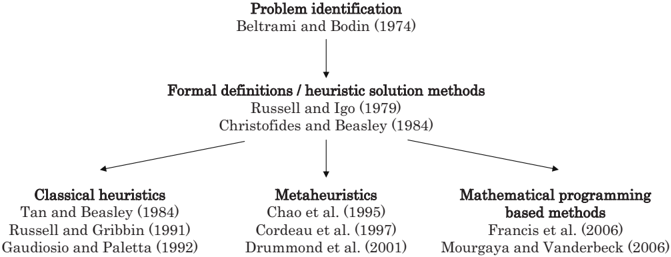

regarding solution methods. In particular, we focus on two papers that define the PVRP from different viewpoints - the Assignment Routing Problem that emphasizes the difficulty of the assignment decision (as in Russell and Igo [52]), and the Period Routing Problem that emphasizes the difficulty of the related routing problem (as in Christofides and Beasley [16]). Two different formulations of the PVRP are presented. Finally, we survey the literature that led to the development of current solution methods for the PVRP.

## 2.1 Motivating Problems

The first problem motivating the PVRP is introduced by Beltrami and Bodin [8] for assigning hoist compactor trucks in municipal waste collection. The authors describe a situation in which garbage sites need to be visited with different frequencies. They propose heuristics to solve the problem, but do not formulate or define the problem formally; however, they do include a good exposition of the difficulty of the PVRP, as compared to the standard VRP.

The example in Beltrami and Bodin [8] has nodes of two types: those demanding service three days a week and those demanding service six days a week. They allow two schedules MWF (Monday-Wednesday-Friday visits) and TRS (Tuesday-Thursday-Saturday) that visit nodes at the same frequency of three visits per week. Nodes with desired frequency of f i = 6 are duplicated; each node and its copy are assigned to different three-day schedules. Thus three different service options are created while operating only two schedules.

In the paper, Beltrami and Bodin adopt a cluster-first, route-second approach since the agency operating the vehicles 'decided a priori the day assignment for each site'. After such an a priori assignment, the nodes to be visited on each day of the week are known and independent VRPs are solved for each day of the week. In fact, given this assignment for the problem in

Beltrami and Bodin [8], only two VRPs need to be solved - one for the MWF days and another for the TRS days.

In Foster and Ryan [27], the authors discuss a periodic variant of the Vehicle Scheduling Problem (VSP) that does not address the issues of schedules and visit frequency directly. This periodic VSP is found as the first stage of many cluster-first, route-second approaches to the PVRP. Foster and Ryan envision the VSP as a vehicle routing problem with some additional constraints such as: visiting customers on specified days; evenly spaced deliveries during the planning period; balancing the load between multiple visits to the same customer; routes capacitated by a maximum route duration; and preventing extreme variations in the fleet size. The authors handle these constraints by designing suitably restricted 'feasible routes', designed using a modified shortest path algorithm.

## 2.2 Defining the PVRP

Russell and Igo [52] provide a formal definition of the PVRP as the 'Assignment Routing Problem'. Here the authors specifically examine the difficulties of choosing a schedule for each node together with solving the routing problem, which is not directly addressed in the first two papers. The authors consider the Assignment Routing Problem as a mixed integer problem, imposing constraints on the vehicle capacity as well as the maximum duration of any route. Additionally, each node has a set of permissible 'day assignments' which is similar in spirit to the set S i defined in eq. (2). The authors do not formulate the problem or attempt to solve it optimally, but propose three heuristics instead. The viewpoint presented in Russell and Igo [52] is that the problem is one of picking a valid day combination for a specified service frequency.

Christofides and Beasley [16] present the first formulation of the PVRP. They define the PVRP as the problem of designing a set of routes for each day of a given | D |-day planning period to meet the required customer visit frequency. They present an integer programming formulation of the PVRP using two sets of decision variables - one for the assignment of customers to schedules, and another for the routing of a given vehicle on a given day. The formulation follows the VRP formulation of Golden et al. [35]. Their formulation is presented below with modified notation. They use three decision variables: x d ijk defined in eq. (3a), z s i defined in eq. (3d), and a binary aggregate decision variable v d i which takes value 1 if node i ∈ N c is visited on day d ∈ D , and value 0 otherwise.

The formulation for the PVRP by Christofides and Beasley [16] is:

<!-- formula-not-decoded -->

subject to

<!-- formula-not-decoded -->

<!-- formula-not-decoded -->

/negationslash

<!-- formula-not-decoded -->

<!-- formula-not-decoded -->

<!-- formula-not-decoded -->

<!-- formula-not-decoded -->

<!-- formula-not-decoded -->

<!-- formula-not-decoded -->

<!-- formula-not-decoded -->

<!-- formula-not-decoded -->

<!-- formula-not-decoded -->

The objective function (4a) minimizes the arc travel costs. Constraints (4b) ensure that a feasible schedule is chosen for each node, while constraints (4c) define v d i on the days within the assigned schedule. Constraints (4d) allow arcs only between customers assigned for delivery on day d ∈ D . Constraints (4e) are the flow conservation constraints. Constraints (4f) ensure that nodes are included on routes for days within their assigned schedule. Constraints (4g) are the subtour elimination constraints. Constraints (4h) ensure that a vehicle is used no more than once a day. Constraints (4i) and (4j) are the physical capacity constraints and route length constraints, respectively. Finally, constraints (4k) and (4l) define the sets of variables.

Christofides and Beasley [16] do not attempt to solve the PVRP to optimality given the complexity of the problem. They propose the use of a median relaxation to approximate the PVRP cost as the sum of the radial distances between nodes and the depot; however, Christofides and Eilon [17] show that such a metric is a good estimator of the total distance for problem instances which have | N | /greatermuch κ 2 , where κ is the average value of the maximum number of customers on a route.

Tan and Beasley [56] summarize the results of Beltrami and Bodin [8], Russell and Igo [52], and Christofides and Beasley [16] and propose a problem

that can be solved more simply than the PVRP itself. Their formulation is of interest because it attempts to circumvent the computationally difficult routing constraints. The authors use a simplified representation of the Fisher and Jaikumar [26] VRP formulation that does not explicitly specify the routing constraints.

Tan and Beasley define a cost measure θ ikd that indicates the distance or cost of visiting node i ∈ N c with vehicle k ∈ K on day d ∈ D . In their formulation, they use the decision variables ˜ x d ik defined in Equation (3c) and z s i defined in Equation (3d). They formulate the PVRP as:

<!-- formula-not-decoded -->

subject to

<!-- formula-not-decoded -->

<!-- formula-not-decoded -->

<!-- formula-not-decoded -->

<!-- formula-not-decoded -->

<!-- formula-not-decoded -->

The objective function (5a) minimizes the cost of service as specified by θ ikd . Constraints (5b) assign each node to one schedule. Constraints (5c) ensure that vehicles are routed on the appropriate day to visit the corresponding schedule. Constraints (5d) ensure that assignments to vehicles do not violate capacity restrictions. Constraints (5e) and (5f) define the binary assignment variables. The above model describes a problem that is clearly more complex than a multi-day VRP assignment, as constraints (5b) and (5c) do not allow the problem to be decomposed by days.

Given the difficulty of solving this problem, Tan and Beasley suggest that the assignment of nodes to vehicles be neglected to reduce the size of the problem. They make the decision of allocating nodes to days in the first phase and the routing decision for each day in the second phase. They propose an aggregated cost measure, Θ d i , which represents the distance cost of visiting node i ∈ N c by any vehicle route on day d ∈ D . They solve an assignment problem, assigning nodes to days and ensuring that the total demand in each day does not exceed the total vehicle capacity ( C · | K | ). The objective of the assignment problem is to minimize the distance cost of traveling between the nodes. Their modified formulation is as follows:

<!-- formula-not-decoded -->

subject to

<!-- formula-not-decoded -->

<!-- formula-not-decoded -->

<!-- formula-not-decoded -->

The objective function (6a) minimizes the cost of routing as measured by Θ d i . Constraints (6b) assign each node to one schedule. Constraints (6c) ensure that the assignment does not exceed the total capacity available on any given day. Constraints (6d) define the binary assignment variables. After this stage of the problem, they solve | D | independent VRPs for each day d ∈ D . This method depends heavily on evaluating the contribution matrix Θ d i correctly. Unfortunately, evaluating Θ d i accurately requires solving VRPs for all possible route and day combinations for each node i ∈ N c .

In summary, two viewpoints have emerged in defining the PVRP: Russell and Igo [52] and Tan and Beasley [56] approach the problem as an extension of the assignment problem with a routing component; Christofides and Beasley [16] formulate the PVRP as a routing problem with a selection decision involved. In the following sections, we review solution methods based on these two viewpoints.

## 2.3 Solution Methods

Two-phase solution methods similar to that of Beltrami and Bodin [8] are commonly found in early heuristics for the PVRP. Recent PVRP literature has focused on metaheuristic methods of solving the problem that can escape the trap of local optimality that plagues conventional heuristics. In this section, we review the classical heuristics, the metaheuristics, as well as recent mathematical programming based approaches to solving the PVRP.

## Classical Heuristics

Russell and Igo [52] present three heuristics to solve the PVRP: an improvement heuristic, and two construction heuristics. The first heuristic involves creating route clusters for all days using nodes whose day assignments are fixed, i.e. all nodes i ∈ N c such that | S i | = 1. In the refuse-collection application described in their paper, these are nodes that require daily service and nodes that require service on fixed days. Then, the remaining unallocated nodes are assigned in descending order of required visit frequency. This allocation of nodes to days is made according to metrics that relate average distance of the node to route clusters. After initial construction, an improvement phase attempts to reassign nodes to other schedules. The authors note

that the heuristic does not perform well as it is dependent on problem-specific metrics to construct routes and suggest its use only to obtain feasible starting solutions for other heuristics.

Their second heuristic is an improvement heuristic that reoptimizes the allocation and routing of nodes. It is a modified version of the MTOUR heuristic for the VRP (Russell [50]) which is itself based on a similar heuristic for the TSP (Lin and Kernighan [43]).

The third heuristic is an implementation of the Clarke-Wright savings method, similar to that of Beltrami and Bodin [8], with additional conditions to ensure that any proposed savings move results in a feasible allocation of nodes to days. For large problem instances ( | N &gt; | 700 nodes), savings moves are only considered within restricted neighborhoods of nodes, thus reducing computational effort.

Christofides and Beasley note that even their proposed relaxations of the PVRP (into a median problem and a periodic TSP) are hard. They do not attempt to solve either the relaxations or the PVRP optimally. They propose a two-stage heuristic method: first, they allocate nodes to days; second, they attempt node exchanges with the aim of minimizing the vehicle routing costs. An interesting point in their approach is that they have a merit order of nodes according to which they make initial allocations. For instance, nodes with fixed delivery combinations are allocated first and the remaining nodes are allocated in descending order of demand per visit. The idea is to reduce the possibility of infeasible solutions. This general heuristic is modified to provide solutions to the PVRP, the median problem and the periodic TSP. Routes developed from the relaxations tend to be inferior to the PVRP solutions given directly by their heuristic. Between the two relaxations, the routes developed from the periodic TSP relaxation tend to be superior to the routes developed from the median relaxation.

As discussed in Section 2.2, Tan and Beasley [56] also solve the PVRP in two stages: First, they determine the allocation of nodes to schedules using an assignment problem; Second, they solve independent VRPs for each of the days. It is clear that the performance of the method depends crucially on the cost measure Θ d i . While it is not desirable to find the cost measure by evaluating routes, the measure must still be a reasonable representation of the actual cost of serving routes on days associated with the schedule. The authors propose to do this by finding | K |·| D | seed points and associating each seed point with a day. They create a measure to determine the desirability of associating each seed point with a given day and solve an assignment problem to find the best possible allocation so that there are | K | seed points in each day.

Russell and Gribbin [51] propose a solution method that consists of an initial route design using a network approximation, followed by three improvement phases. Their network flow model is similar to the formulation of Tan and Beasley, except that it has only one seed point for each day rather than | K | seed points. As before, the cost metric is difficult to calculate;

however, Russell and Gribbin make a simple approximation of this cost metric as a sum of insertion costs into the round-trip tour between the depot and the appropriate seed points. This approximation considerably speeds up the construction phase. The first improvement heuristic uses the interchange method of Christofides and Beasley [16] to make improvements in individual tours. The second heuristic applies this interchange idea at the vehicle routing level. Finally, the authors propose a binary integer program to further refine the proposed solution. This phase assesses the possible reassignment of nodes between delivery combinations; however, the authors state that only slight improvements are observed in this phase.

Gaudioso and Paletta [31] suggest an alternative heuristic for the tactical problem of minimizing fleet size, rather than the operational problem of reducing distance. They impose constraints on the maximum route duration as well as the vehicle capacity. Gaudioso and Paletta do not impose a schedule set from which to choose day combinations, but instead place restrictions on the minimum and maximum number of days between visits for each node. This tactical version of the PVRP is shown to be NPhard by reduction to the bin packing problem. Their heuristic adopts a construction phase that allocates nodes to delivery combinations one at a time. The authors propose a number of improvement schemes to post-process the routes constructed by their method. They note that the distance cost of their solution is usually greater than other PVRP solution methods for two possible reasons: one, their objective is to minimize fleet size and not distance; and, two, they use a simple algorithm to solve the embedded TSP to optimize the routes after nodes have been allocated to delivery combinations.

According to the classification scheme of Cordeau et al. [20], all of these heuristics are construction-improvement, single-thread (no parallel processing).

## Metaheuristics

Chao et al. [14] develop a special-purpose, metaheuristic method to solve the PVRP. This method generates an initial feasible solution to the PVRP and then iteratively uses improvement steps to progress towards the optimal solution to the problem. The initial feasible solution is obtained using the formulation of Christofides and Beasley [16]. They solve a linear relaxation of the assignment problem of allocating nodes to delivery days, while minimizing the maximum load carried in any given day. While the resulting solution may not be capacity feasible, it is still useful as an initial starting point.

In the next stage of the metaheuristic, the authors use the concept of feasible schedules (defining node-specific feasible sets S i ) like most of the PVRP literature. Attempts are made to improve the solution by moving a node from one schedule to another. If the proposed movement is valid for that node (i.e. moving node i to a schedule s such that s ∈ S i ) and if the move reduces the total distance, then the movement is immediately accepted. If there is an

increase in the total distance, then the move is accepted if it is less than a certain threshold value. Otherwise, the node is not moved from its initial allocation. This process is continued and the threshold gradually reduced. The iterations terminate when it is no longer possible to make movements with positive cost savings. Chao et al. [14] also describe methods to improve this heuristic through capacity relaxation and post processing.

In terms of the metaheuristic classification scheme of Cordeau et al. [20], this metaheuristic is construction-improvement, single thread (no parallel processing). With respect to the Blum-Roli classification (see Blum and Roli [10]), it is single-point search (i.e. from a single trial solution and not a population of solutions), static objective function, single neighborhood, memoryless method.

Cordeau et al. [21] present a Tabu search method for solving several different routing problems, including the PVRP. Their Tabu search method has been modified to use specific insertion and route improvement techniques developed by the authors; however, there is no significant change to the core of the Tabu search technique that is specific to the PVRP.

The objective function is a weighted combination of travel cost and overcapacity penalties (thus intermediate solutions may violate capacity and time constraints). The method begins at a feasible solution and iterates by experimenting with moves (insertion of a node into a different schedule). The insertion process used is the GENI procedure (least-cost insertion) of Gendreau et al. [33]. The GENI procedure can also be applied to choose a node for removal from its current route. No additional reoptimization of the tour is required as 4 -opt route modifications are incorporated into the GENI procedure. The neighborhood of possible moves is the set of all solutions obtained by moving any customer i to another route and to any other schedule in its feasible set S i . Initially, the method permits some infeasible movements that may cause violations of the capacity and route duration constraints.

In order to diversify the exploration of the solution space, the authors utilize a diversification stage in the Tabu search. This stage adds an additional penalty to the objective value of solutions that contain frequently added movements. The authors do not employ the final intensification stage that performs detailed exploration of the neighborhood of the best-known solutions. The overall method is seen to produce good solutions for the PVRP, improving on or producing comparable results to those of Chao et al. [14].

This metaheuristic can be classified as a single-construction, multiple improvement thread heuristic (Cordeau et al. [20]). The Blum-Roli classification is single-point search, dynamic objective function, single neighborhood, memory-usage method.

Drummond et al. [23] propose a metaheuristic based on a combination of genetic algorithm concepts and local search heuristics. This metaheuristic is a parallel-thread population mechanism heuristic (Cordeau et al. [20]). The Blum-Roli classification is population-based search, static objective function, single neighborhood, memory-usage method. Their method is an implementation of genetic algorithms (see Baker and Ayechew [5] and Reeves and Rowe

[48] for an overview) on a parallel computing framework together with modified local search methods.

The chromosome used specifies the days on which each customer is visited and the corresponding demand accumulation at each customer location on each day. The fitness level of each chromosome corresponds to the PVRP travel cost, and is calculated by solving a set of VRPs for each day using a Clarke and Wright [19] savings method. Subsequently standard crossover and mutation operations are used to create a diverse, evolving population of solutions.

Although their method is computationally intensive, the proposed parallel computing version converges rapidly. Further, the authors claim that their method is fairly robust for a broad range of heuristic parameters and may not require exhaustive tuning. They present a numerical study, comparing their solutions to those of Cordeau et al. [21], providing improved solutions to some problem instances. The authors discuss the implications of simultaneously evolving different groups of populations due to the parallel computational framework and the possibility of 'migrating' solutions between different populations.

All three papers show numerical studies on a set of 20 test cases that are commonly used in the PVRP literature, shown in Table 1. Instances 1-10, from Christofides and Beasley [16], are based on VRP instances in Eilon et al. [24], with visit frequencies determined by demand at the nodes. Instance 11, from Russell and Igo [52], represents aggregated data from a industrial refuse application. Instances 12 and 13 are generated by Russell and Gribbin [51], with instance 12 drawn from a refuse collection application and instance 13 from a fast food application. Instances 14 - 20 are created by Chao et al. [14] according to two location distribution models: windmill and Star of David. Tables 1 and 2 summarize the relative performance of these metaheuristics in terms of solution time and relative solution quality.

In Table 1, the first column is the PVRP instance number. Columns 2-5 are characteristics of the test instance: the number of nodes; the number of vehicles; the number of days; and the vehicle capacity, respectively. Column 6, labeled CGW, shows the solution time for the Chao et al. [14] heuristic. Column 7 and 8, labeled CGL(T*) and CGL(T), shows the solution time for the Cordeau et al. [21] heuristic to find the best solution, and the overall solution time, respectively. Column 9, labeled DOV, shows the solution time for the parallel computing version of the Drummond et al. [23] heuristic. It is difficult to make direct comparisons of computing time as the authors use different computing software and hardware. Blank cells indicate that no solution is reported for that instance and metaheuristic.

Table 2 compares the objective value of the best solution obtained from the three metaheuristics with the values obtained from the classical heuristics. Column 1 refers to the same instance numbers as Table 1. Columns 2-4, labeled CB, TB, and RG, list the objective values obtained using Christofides and Beasley [16], Tan and Beasley [56], and Russell and Gribbin [51] respec-

Table 1. Comparison of solution times (in minutes) for PVRP metaheuristics.

|   Instance |   | N | |   | K | |   | D | |    C |   CGW |   CGL(T*) |   CGL(T) | DOV   |
|------------|---------|---------|---------|------|-------|-----------|----------|-------|
|          1 |      50 |       3 |       2 |  160 |   1.1 |      0.91 |     3.39 |       |
|          2 |      50 |       3 |       5 |  160 |   6.8 |      0.6  |     4.06 | 0.61  |
|          3 |      50 |       1 |       5 |  160 |   0.6 |      3.18 |     3.73 | 0.09  |
|          4 |      75 |       6 |       5 |  140 |   7.7 |      4.74 |     5.19 | 1.76  |
|          5 |      75 |       1 |      10 |  140 |   5.4 |      7.46 |     7.48 | 2.77  |
|          6 |      75 |       1 |      10 |  140 |   3   |      6.87 |     7.84 | 0.27  |
|          7 |     100 |       4 |       2 |  200 |   5.5 |      6.6  |     7.63 | 6.04  |
|          8 |     100 |       5 |       5 |  200 |  13.5 |      8.97 |    10.7  | 10.11 |
|          9 |     100 |       1 |       8 |  200 |   4.6 |      6.7  |    10.03 | 3.39  |
|         10 |     100 |       4 |       5 |  200 |  14.7 |      5.57 |     9.68 | 15.84 |
|         11 |     126 |       4 |       5 |  235 | 205.4 |      9.72 |    14.17 | 23.59 |
|         12 |     163 |       3 |       5 |  140 |  11.9 |     11.51 |    18.37 | 97.41 |
|         13 |     417 |       9 |       7 | 2000 |  33.7 |     57.74 |    59.98 | 2.82  |
|         14 |      20 |       2 |       4 |   20 |   0.2 |      0.01 |     1.15 | 0.07  |
|         15 |      38 |       2 |       4 |   30 |   0.5 |      0.04 |     2.58 | 0.34  |
|         16 |      56 |       2 |       4 |   40 |   0.3 |      0.34 |     4.28 | 1.45  |
|         17 |      40 |       4 |       4 |   20 |   5.3 |      0.07 |     3.01 | 0.57  |
|         18 |      76 |       4 |       4 |   30 |  11.1 |      4.84 |     6.46 | 3.59  |
|         19 |     112 |       4 |       4 |   40 |  60.6 |      9.08 |    11.9  | 20.09 |
|         20 |     184 |       4 |       4 |   60 | 150.5 |      6.34 |    23.44 | 90.73 |

tively. Columns 5-7, labeled CGW, CGL, and DOV, list the objective values obtained using Chao et al. [14], Cordeau et al. [21], and Drummond et al. [23] respectively. As before, a blank cell indicates that no data is available for that instance-heuristic pair. Solution methods based on the metaheuristic approach produce the best known results for the PVRP. This is expected, as metaheuristics have been proven to be particularly effective for VRP-like problems (see Gendreau et al. [34] for an overview of metaheuristics for the VRP).

## Mathematical Programming Based Approaches

Francis et al. [29] develop an exact solution method based on Lagrangian relaxation of an integer programming formulation of the PVRP. We present this formulation in Section 3.3. Although this is a formulation for an extended problem, it contains the PVRP as a special case. Their formulation is a multidimensional extension of Fisher and Jaikumar [26] and contains two sets of decisions variables: x d ijk defined in eq. (3a) and y s ik defined in eq. (3b).

The authors show that the dimensions of the problem can be reduced when the set of schedules S is such that one schedule contains all days in the planning period (a 'daily' schedule) and all other schedules are disjoint from each other such that no day occurs in more than one schedule (besides the daily schedule). Under these conditions, there are at most | S | -1 different

Table 2. Relative performance of heuristic techniques on the PVRP test set.

|   Instance | CB      | TB      | RG      | CGW     | CGL     | DOV     |
|------------|---------|---------|---------|---------|---------|---------|
|          1 | 547.4   |         | 537.3   | 524.6   | 524.6   |         |
|          2 | 1,443.1 | 1,481.3 | 1,355.4 | 1,337.2 | 1,330.1 | 1,291.1 |
|          3 | 546.7   |         |         | 524.6   | 524.6   | 533.9   |
|          4 | 843.9   |         | 867.8   | 860.9   | 837.9   | 871.7   |
|          5 | 2,187.3 | 2,192.5 | 2,141.3 | 2,089.0 | 2,061.4 | 2,089.3 |
|          6 | 938.2   |         |         | 881.1   | 840.3   | 770.8   |
|          7 | 839.2   |         | 833.6   | 832.0   | 829.4   | 844.7   |
|          8 | 2,151.3 | 2,281.8 | 2,108.3 | 2,075.1 | 2,054.9 | 2,113.0 |
|          9 | 875.0   |         |         | 829.9   | 829.5   | 836.7   |
|         10 | 1,674.0 | 1,833.7 | 1,638.5 | 1,633.2 | 1,630.0 | 1,660.9 |
|         11 | 847.3   | 878.5   | 820.3   |         | 817.6   | 775.9   |
|         12 |         |         | 1,312.0 | 1,237.4 | 1,239.6 | 1,215.4 |
|         13 |         |         | 3,638.1 | 3,629.8 | 3,602.8 | 4,604.7 |
|         14 |         |         |         | 954.8   | 954.8   | 864.1   |
|         15 |         |         |         | 1,862.6 | 1,862.6 | 1,792.1 |
|         16 |         |         |         | 2,875.2 | 2,875.2 | 2,749.7 |
|         17 |         |         |         | 1,614.4 | 1,597.8 | 1,613.7 |
|         18 |         |         |         | 3,217.7 | 3,159.2 | 3,143.2 |
|         19 |         |         |         | 4,846.5 | 4,902.6 | 4,792.2 |
|         20 |         |         |         | 8,367.4 | 8,367.4 | 8,299.7 |

routes for each vehicle. Further, the dimension on the routing variables can be reduced from the full set of days d ∈ D to a reduced set of representative days, one for each schedule in the set S . Their Lagrangian relaxation phase removes the constraints that link the two sets of decision variables, and the problem decomposes into a capacitated assignment subproblem and a number of prize-collecting traveling salesman subproblems. Any remaining gaps are closed using a branch-and-bound phase. A heuristic variation of this approach truncates the branch-and-bound phase within δ % of the optimal. Using this variation, problem instances with up to 50 nodes are solved to within δ = 2% of optimality. This provides the first known exact solution method, a heuristic method with a bounded gap, and a lower bound for the PVRP class of problems.

Mourgaya and Vanderbeck [45] solve a tactical version of the PVRP in which visit schedules and customer assignments to vehicles are solved simultaneously. The sequencing of customers within vehicle routes is determined in an operational problem. The authors consider two objectives: a 'workload balancing' objective that ensures an equal distribution of customers among vehicles and a 'regionalization' objective that clusters customers geographically as a proxy for tour length (similar in spirit to the tour length estimation approach taken by Tan and Beasley [56]). Focusing solely on the tactical problem facilitates the solution of larger problem instances.

The authors use the term 'scenarios' to denote sets of schedule options. Customers are assigned to a scenario that is feasible given their visit requirements. Their formulation of the tactical PVRP uses a binary decision variable, ˆ X d ij which equals 1 if nodes i ∈ N c and j ∈ N c are visited by the same vehicle on day d ∈ D . The problem can then be written as follows:

<!-- formula-not-decoded -->

subject to

<!-- formula-not-decoded -->

<!-- formula-not-decoded -->

<!-- formula-not-decoded -->

<!-- formula-not-decoded -->

<!-- formula-not-decoded -->

<!-- formula-not-decoded -->

<!-- formula-not-decoded -->

<!-- formula-not-decoded -->

The objective function (7a) is an estimate of the travel cost (the authors do not specify how they compute the measure c ij ). Constraints (7b) ensure that each node is assigned to a feasible scenario. Constraints (7c) link the scenario assignment and vehicle visit variables. Constraints (7d) check if two nodes are visited by the same vehicle. Constraints (7e) are vehicle capacity constraints. Finally, constraints (7f)-(7h) are variable definition constraints.

The authors note that this formulation suffers from a weak linear programming relaxation. Also, as has been noted by Tan and Beasley [56], the value of such a formulation depends greatly on being able to estimate the cost measure accurately. To circumvent both these problems, the authors present a Dantzig-Wolfe reformulation of the problem where the decisions are assigning scenarios to customers and customers to 'clusters' (sets of customers to be visited together on a given day), thus ignoring assignments of customers to specific vehicles.

This reformulated problem can be solved using a column generation method. The objective is to minimize the cost of serving chosen clusters, where the cost of serving a particular cluster is determined by a pricing subproblem. The pricing subproblem, used to identify suitable clusters, includes constraints (7d) and (7e) and is hence hard to solve precisely. Simple heuristics are used to generate columns at each iteration, and the subproblems are

Fig. 2. Variants of the PVRP.

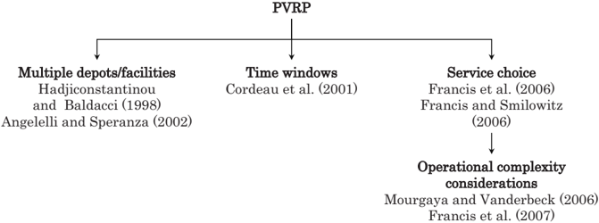

solved either exactly or through heuristics. The heuristics used for creating these subproblems can thus be tailored to achieve balanced workloads for all clusters. On the other hand, the minimum cost objective function tends to favor denser clusters, hence satisfying the balancing and regionalization objectives at the same time.

The authors report gaps of 14%-30% on average, depending on the heuristics used. More importantly, they present a first look at the difficulty of modeling and optimizing measures other than travel cost in the PVRP setting. The authors also comment on the poor performance of Lagrangian bounds for the tactical PVRP, echoing similar statements by Francis et al. [29] on the poor performance of the Lagrangian lower bound for the PVRP in general.

To summarize, the PVRP literature relating to solution methods recognizes that the problem is computationally hard. Research in this area has focused on heuristics for the PVRP. Of the heuristics reviewed, the classical heuristics tend to solve the assignment and routing decisions sequentially. More recent work has focused on metaheuristics and mathematical programming based approaches, recognizing the need to take an integrated approach to the PVRP problems.

## 3 PVRP Variants

Figure 2 outlines the literature relating to three important PVRP variants. We review these variants in this section. First, Section 3.1 reviews the multidepot version of the PVRP (MDPVRP), in which periodic deliveries are made using a fleet of vehicles that are based across a number of depots. Also notable is the existence of a similar problem, the PVRP with Intermediate Facilities (PVRPIF), where the vehicles are based in a single depot, but capacity replenishment is possible at points along the routes. Second, Section 3.2 examines the PVRP with Time Window constraints (PVRPTW), in which customers

may be visited only at certain times during the planning period. Finally, Section 3.3 shows the PVRP with Service Choice (PVRP-SC) which extends the PVRP to make visit frequency an endogenous decision of the problem.

All these variants have analogs in single-visit VRP models. The MDPVRP has an analog in the Multi-Depot VRP (MDVRP). Incidentally, Cordeau et al. [21] show that the MDVRP is a special case of the PVRP. The PVRPTW has an analog in the well-studied VRPTW (Solomon [55]). Finally, the PVRP-SC is similar to the class of problems called Vehicle Routing Problem with Profits (which includes the Team Orienteering Problem of Chao et al. [15]) in which the service frequency of a node can be 0 (not visited) or 1 (visited).

Note that there is currently no known dynamic variant of the PVRP in the literature. The closest work is the Dynamic Multi-Period Routing Problem (DMPRP) of Angelelli et al. [1]. The authors consider a distribution system in which customer orders arise dynamically, and orders arising in a certain day can be served either in the same day or the next. This model differs from the PVRP as there is no periodicity in customer demand in the DMPRP model - customers need to be visited only once during the planning period and a single order triggers only a single visit.

## 3.1 MDPVRP

Cordeau et al. [21] present a formulation of the PVRP and show that the Multi-Depot Vehicle Routing Problem (MDVRP) is a special case by associating depots with days. In their paper, Hadjiconstantinou and Baldacci [37] combine the ideas of periodicity and multiple-depots, extending the PVRP to include multiple depots. This greatly increases the difficulty of the resulting problem as it involves the additional decisions of assigning vehicles to depots as well as customer nodes to depots. Their Multi-Depot Period Vehicle Routing Problem (MDPVRP) is the problem of designing a set of routes for each day of a given | D |-day planning period. Each route of day d ∈ D must be executed by one of a homogenous fleet of | K | vehicles (service teams visiting customers) based at a certain depot (i.e., it must start and finish at its assigned depot). Their heuristic is as follows:

- 1. Assign each node to its nearest depot.
- 2. At each depot:
- a) Arrange the nodes according to some chosen order (say, decreasing visit frequency).
- b) Using this ordered list, use least-cost insertion to add nodes to routes such that their visit frequency f i is satisfied.
- c) When all nodes have been assigned to feasible route combinations, solve VRPs for each day of the planning period using Tabu search.
- 3. Attempt to improve the overall solution by interchanging customer routes and/or assignments.

The heuristic is repeated several times by changing the ordering rule in Step 2(a). This idea is similar to the ordering rule of Christofides and Beasley [16]. Infeasible vehicle assignments (that violate the capacity constraints or fleet size) are not permitted. Note that in solving the MDPVRP, the heuristic assigns customers to be visited by particular depots, effectively defining geographical 'boundaries' or 'service territories' for each depot.

The authors introduce the notion of changing the customer service levels as defined by average frequency of visits (as in the PVRP), but do not incorporate this decision into their model. Instead, they use this idea to develop a strategic decision-making tool, solving the MDPVRP with different service frequency combinations, and constructing cost-benefit tradeoff curves. While this limits the number of service combinations that can be considered, this approach yields good results for their problem instance. The authors present illustrative tradeoff curves between increasing service level and rising travel costs and fleet size.

The PVRP with Intermediate Facilities (PVRPIF) is similar to the MDPVRP. While Angelelli and Speranza [2] do not allow multiple vehicle depots, they do use the idea of 'drop-off points', or intermediate facilities, at which vehicle can stop along their vehicle routes, allowing them to replenish their capacities. Vehicles start and end their routes at their own depots, but visit these intermediate facilities along the way. Such problems arise in applications like waste collection with recycling facilities or goods collection with warehouse facilities. The authors solve the resulting extended PVRP problem using a Tabu search method.

## 3.2 PVRPTW

Cordeau et al. [22] extend the earlier work by Cordeau et al. [21] including time-windows. Their method provides a Tabu search method for the PVRPTW, which can be used to solve the VRPTW and MDVRPTW as special cases (recall that Cordeau et al. [21] show that the VRP and the MDVRP are special cases of the PVRP). The PVRPTW is the problem of designing | K | different vehicle routes such that all customers are visited with their desired service frequency over the planning period, and each visit lies within a specified time interval. In order to solve this complex problem, the authors modify the Tabu search heuristic presented in Cordeau et al. [21]. The change to the heuristic is minor, principally requiring an additional penalty term to be added to the objective function for violations of time window constraints. The authors also create a set of new instances for the PVRPTW and MDVRPTW, and present numerical solutions, although the quality of the solutions cannot be specifically gauged in the absence of optimal solutions or lower bounds. The authors do provide a comparison of the performance of their heuristic on the Solomon VRPTW test instances (Solomon [55]), where it performs favorably when compared to the best known solution.

## 3.3 PVRP-SC

Francis et al. [29] extend the PVRP to make visit frequency a decision of the problem. The extended problem is called the PVRP with Service Choice (PVRP-SC). This increases the difficulty of solving the problem in two ways: first, there is the added complexity of determining the service frequency; second, the vehicle capacity requirement when visiting a node also becomes a decision of the model. We review the formulation of the PVRP-SC from Francis et al. [29]. Each schedule has an monetary benefit α s . A weight β ≥ 0 converts vehicle travel and stopping time into comparable costs in the objective function. Note that the demand accumulated between visits, w s i , depends on the demand of the node i ∈ N c and the frequency of schedule s ∈ S , but is approximated by the maximum accumulation between visits. The stopping time has a variable component τ s i . The decision variables used in this formulation are x d ijk and y s ik (eqns. 3a and 3b).

The formulation for PVRP-SC by Francis et al. [29] is:

<!-- formula-not-decoded -->

subject to

<!-- formula-not-decoded -->

<!-- formula-not-decoded -->

<!-- formula-not-decoded -->

<!-- formula-not-decoded -->

<!-- formula-not-decoded -->

<!-- formula-not-decoded -->

<!-- formula-not-decoded -->

<!-- formula-not-decoded -->

The objective function (8a) is a weighted combination of travel and stopping costs net of service benefit. (see Francis and Smilowitz [28] for an analysis of the impact of the value of α on the resulting solution). Constraints (8b) ensure that the visit requirements for each node are satisfied, while constraints (8c) ensure that each node is assigned to a single schedule and vehicle. Constraints (8d) are capacity constraints, and constraints (8e) link the two

sets of variables. Constraints (8f) and (8g) are flow conservation and subtour elimination constraints. Note that the PVRP-SC includes the PVRP as a special case by fixing constraints (8b) to equality and hence this is an IP formulation for the PVRP as well. The constraints (8b) may be alternatively expressed as ∑ k ∈ K ∑ s ∈ S i y s ik = 1 , ∀ i ∈ N c with the redefinition of S i as S i = { s ∈ S : ∑ d D a sd ≥ f i } .

∈ Francis et al. [29] solve this problem using the Lagrangian relaxation method, combined with branch and bound procedure, described in Section 2.3. The authors present solutions for their motivating problems and for a standard test case from Christofides and Beasley [16]. Instances of up to 50 nodes can be solved within 2% of optimality. Results from Francis et al. [29] indicate that the magnitude of the savings obtained by introducing service choice in the PVRP for a given instance depends on geographic distribution of nodes (in particular, nodes of highest visit requirements).

## 4 Implementation Issues

As with the VRP, implementations of the PVRP pose particular challenges. Given the difficulty of the problems, it is practically impossible to incorporate every real-world constraint into the model. As a result, the solution obtained from such models does not always capture the needs of the system designers. Significant post-processing may be required to convert the solution into a practical routing implementation. In Section 4.1, we present case studies in which real-world constraints are combined with PVRP models to produce routing solutions appropriate to the problem instance. In Section 4.2, we present an approach that seeks to quantify the operational complexity of PVRP solutions by defining metrics suitable for periodic delivery operations.

## 4.1 Case Studies

Banerjea-Brodeur et al. [6] describe a situation in which the PVRP is used to plan the deliveries of linen to 58 different clinics within a hospital. Deliveries are required at preset service frequencies to each clinic, using a fixed fleet of carts. Although the number of carts is small, the carts can make multiple trips during the course of the day, thus effectively increasing the fleet size. The problem is solved using the Tabu search method of Cordeau et al. [21].

This implementation highlights several practical features relating to PVRP modeling. First, the authors report that they do not explore the entire solution space due to the layout of the hospital - the underlying graph is not a complete network. Second, allowances are made for elevator transfers in computing the distance matrix to account for waiting time and elevator travel time, in addition to the physical walking distance. Third, the hospital places a high premium on the stability of the solution to allow hospital agencies to plan

operations around the deliveries. Finally, producing a balanced work schedule is considered to be important.

Blakely et al. [9] describe an application of the PVRP to control the routing and scheduling of service teams for preventive maintenance of elevators at customer locations. Each customer has a pre-specified service frequency depending on the type of elevator present at their location. The authors use a weighted multi-objective function which includes total travel costs, overtime costs, penalties for violating time windows, as well as a penalty for imbalanced loads.

The authors formulate the problem as a mathematical model, but do not solve it optimally. Rather, they solve the problem using a multi-stage heuristic. First, an initial solution is built by clustering together nodes that are geographically close, and assigning each cluster to one service team (recall the Tan and Beasley [56] method of using seed points). Second, the solution is improved by considering service times at each node, and real travel times between the nodes. Attempts are made to improve the solution by iteratively changing the cluster assignments between nodes. These improving moves are guided by a Tabu search metaheuristic. Third, when no further improvements are possible through such assignment changes, the routes are formed for each service team (vehicle) for each day of the week. At this stage, the heuristic takes into account customer visit frequency, time windows, service duration, and individual characteristics of the service team.

The authors highlight several important modeling considerations. First, they impose a fixed stopping time at nodes to account for service 'set-ups' such as parking, regardless of service duration and in addition to travel time. Second, the street network data used did not use inter-modal links such as ferry crossings; in effect the underlying network had to be augmented by adding phantom road links that represented ferry service. Third, the fleet of service teams is not homogenous as service technicians had different equipment repair skill sets. Fourth, in some cases, it is required to pre-assign a service team to a particular customer. Finally, as with the linen delivery case, it is important to balance the work schedule between teams.

Hemmelmayr et al. [38] investigate the periodic delivery of blood products to hospitals by the Austrian Red Cross. In this case, the regularity of deliveries is of paramount importance. The authors model the problem as a detailed integer program with specific constraints and a fixed set of routes, and also as a PVRP with tour length constraints. They solve the integer program using a commercial IP solver, and the PVRP with a Variable Neighborhood Search heuristic. The authors show an average improvement in operating cost of about 30% with either method. They note that the vehicles are not capacityconstrained due to the small size of the deliveries, but only time-constrained by the perishability of the product.

An interesting note in their implementation is that using their periodic delivery solution requires negotiation with the hospitals involved to get them to accept the delivery schedule. Such considerations often arise in the

implementation of periodic deliveries where the service provider is transitioning to a scheme in which they, rather than the customer, decide the service frequency (periodic delivery to Vendor-Managed Inventory, for instance). This underscores the importance of recognizing and appropriately modeling customer requirements that might make them averse to such changes.

Many other case studies have appeared in the literature, reflecting the growing popularity of the PVRP model for solving real-world problems. In the rest of this section, we briefly review some recent applications and implementations.

le Blanc et al. [42] use the PVRP as the basis for modeling periodic deliveries. The authors examine a special supply chain network called Factory Gate Pricing in which a number of suppliers are periodically visited by transport vehicles. They use a classical construction-improvement PVRP heuristic to solve their problem, similar to the third heuristic of Russell and Igo [52]. The PVRP may also be contained as a subproblem in more complex problems. Parthanadee and Logendran [46] consider a multi-product, multi-depot periodic distribution problem that contains the PVRP as a subproblem. They solve their problem using Tabu search heuristics.

Periodic delivery problems are also found in the general logistics literature. Golden and Wasil [36] survey vehicle routing problems arising in the soft drink industry, particularly the problem of driver-sell in which the driver visits retail locations periodically to replenish customer demand. The authors describe desirable features of routing systems for such an application such as the ability to accept predefined driver territories or generate new territorial boundaries, the ability to determine service frequency (as in the PVRP-SC), and to balance driver workloads. An existing routing software for a soft drink distributor is also described. Carter et al. [12] consider a complex periodic distribution problem arising in grocery delivery. The problem is solved using a Lagrangian heuristic. Gaur and Fisher [32] describe the development of a system to solve a vehicle routing and delivery scheduling problem for a European supermarket chain that includes the PVRP as a subproblem. They solve their problem using a combination of clustering heuristics to solve the scheduling problem and Lagrangian relaxation for truck routing. Claassen and Hendriks [18] model a milk collection problem arising in the dairy industry with emphasis on generating a stable collection schedule. The authors ignore the routing decision (following the idea of Tan and Beasley [56] and Mourgaya and Vanderbeck [45]) and focus on assigning schedules to customers and clusters of customers to vehicles. This problem is then further reduced by using some special properties of their application, and can be solved exactly.

Recycling and waste collection applications have been modeled using the PVRP since the seminal paper by Beltrami and Bodin [8]. Recently, a number of case studies have appeared in this area that solve problems of larger size, and incorporate more complex constraints. Shih and Lin [54], Shih and Chang [53], and Pontin et al. [47] consider the problem of collecting infectious waste from multiple medical facilities to a single disposal location. Shih and Lin [54]

and Shih and Chang [53] both use a two-phase heuristic in which sets of possible routes are generated in the first phase and visit periods are determined in the second phase based on the identified routes. Pontin et al. [47] propose a genetic algorithm approach similar to Drummond et al. [23]. Bommisetty et al. [11] considers a similar problem of collecting recyclable material in a college campus. Baptista et al. [7] examines the problem of recycling paper containers in a Portuguese city. Their solution method is a simple extension of Christofides and Beasley [16]. Teixeira et al. [57] also address a problem arising in waste collection. This paper is notable among PVRP case studies as it deals with multiple products (three different types of waste). The authors use a cluster-first route-second heuristic to solve their problem, such that the delivery regions and product mix are already decided when the route sequencing decisions have to be made for each day.

Finally, in the service operations literature, Jang et al. [39] examine the problem of routing lottery sales representatives to visit lottery retail locations for the Missouri Lottery system. They also solve their problem using a clusterfirst route-second heuristic. Workload balance is an important criterion in their models, besides the conventional objective of routing efficiency. Hence, they use the idea of seeding their construction phase in a manner similar to Fisher and Jaikumar [26], with the seed points being chosen from historical routes.

In the next section, we examine metrics that can quantify operational complexity, from the perspective of the service provider as well as the customer.

## 4.2 Operational Complexity

Francis et al. [30] explicitly consider the trade-offs between operational flexibility and operational complexity in a PVRP setting. Operational flexibility is defined as the ability to make changes to operating conditions. For example, the ability to determine the frequency of service provided to customers (as in the PVRP-SC), or to have different drivers visit customers rather than committing to a single driver (as is the case in Blakely et al. [9]). The authors show that having such flexibility leads to gains in terms of vehicle routing costs and improved customer service, but at the expense of increases in operational complexity.

The authors define operational complexity as the difficulty of a implementing a solution, either from the perspective of the service provider, or its customers. Complex solutions are characteristically those that are hard to convey to drivers without complex mapping, involve a high degree of driver learning, and tend to cause dissatisfaction among drivers and customers.

Francis et al. [30] introduce a set of metrics to quantify the operational complexity in a periodic distribution solution resulting from a PVRP/PVRPSC. They define three measures:

- 1. Driver coverage expresses the service region visited by a driver over the planning period as a percentage of the total area.

- 2. Arrival span is the variability in the time of day when customers are visited over the planning period.
- 3. Crewsize is the number of different drivers seen by a customer over the planning period.

The driver coverage metric is defined for each driver, and is averaged over all drivers. The authors motivate this metric with the learning/forgetting model of Zhong et al. [58] that shows improved driver performance due to increased geographic familiarity resulting from consistent dispatches. A small driver coverage area is also consistent with geographical clustering approaches currently in practice (see Blakely et al. [9], for example). The arrival span and crewsize are defined for each customer, and averaged across all customers in the region. These measures are motivated by the need to provide better customer service by establishing consistent arrival times (small arrival span) and building relationships between customers and drivers (small crewsize). Further, the authors describe situations in which improvements in these measures help customers reduce staffing requirements, address security/access concerns, or obtain time-sensitive material (such as the blood products in Hemmelmayr et al. [38]).

The authors develop a set of randomized test cases in four different configurations representing different demand patterns, such as Traditional City (TC) configuration where the high demand nodes are located in the city center, to the Vanishing City (VC) configuration where the high demand is located in the outlying areas. They solve the PVRP and PVRP-SC for these test cases with a range of flexibility options, including different schedule choice, constraints on service choice and crewsize. They use a Tabu search heuristic based on that of Cordeau et al. [21] with changes to incorporate the operational flexibility options. After the solution is obtained, they calculate the value of the three complexity metrics. To correctly calculate the metrics, the authors develop an integer program to assign drivers to vehicle routes each day. The objective of this IP is to minimize the total driver coverage, and is similar in spirit to industry practice in which dispatchers assign drivers to familiar areas.

The authors show that introducing flexibility tends to increase the operational complexity of the resulting solutions, although the increase in complexity depends on the type of operational flexibility being introduced (for instance, restricting crewsize has little impact on the objective function, but reduces operational complexity significantly). The authors also note the importance of geographic distribution on the value of introducing operational flexibility, with greater returns obtained when the high frequency nodes are located closer to the depot.

Although the authors do not incorporate these operational metrics into their objective function, this can be accomplished by the use of penalties. Such an approach is clearly desirable in real applications of periodic distributions, although the weights to be applied on various terms of the objective

function are not easily determined. Blakely et al. [9] present one way to work around such a situation. Their routing software optimizes a weighted multiobjective function. Rather than impose a fixed set of weights in the objective function, the software allows local supervisors to vary the weights on travel cost, workload balance, and other factors. The supervisors can thus obtain routing solutions that have appropriate operational complexity for their local business needs.

## 5 Future Research Directions

Future research into newer variants and solution methods for the PVRP is a rich and fertile area. With increase in computational capabilities, models for periodic delivery operations have become more complex, and capable of modeling problem instances in greater detail. The improvement in computational complexity could be exploited to create a dynamic variant of the PVRP, building on the work done by Angelelli et al. [1]. Older modeling techniques are being refreshed with the use of modern heuristics and solution methods. For instance, the vehicle scheduling problem of Foster and Ryan [27] has been revisited by Kang et al. [40], who provide an exact algorithm for the periodic version of the problem. Work on mathematical programming based approaches to these problems, such as the ongoing work of Mingozzi and Valletta [44] for solving the PVRP and MDVRP, provides faster and better quality solutions for the use of researchers and industry planners.

One possible area of interest is the pricing of periodic delivery services. Francis et al. [29] show that if customers are flexible in the frequency of service that they receive, then the cost savings can be achieved by giving customers a level of service appropriate to their geographic location as well as their willingness to pay. Francis and Smilowitz [28] model a tactical version of the PVRP-SC to allow managers of such services to analyze the effect of price and service schedule changes.

Another area of future research is the incorporation of multiple objectives in the optimization of periodic deliveries as discussed in Section 4. Mourgaya and Vanderbeck [45] present multiple objectives besides simple travel cost minimization. Other potential objectives that might be considered could be: monetary, such as the minimization of long term fleet acquisition and depreciation costs; partly-monetary, such as union-mandated balancing of driver workloads; or non-monetary, such as maximization of customer service aspects.

Francis et al. [30] introduce operational complexity measures that can be considered either endogenously through variable and parameter definitions or exogenously in post-processing. Future work could focus on adding complexity measures into the objective function of the PVRP and its variants, thereby allowing the solution method to choose the appropriate balance between complexity and flexibility. Cordeau et al. [22] extend the notion of time windows

into periodic deliveries through the PVRPTW. In the routing literature, time windows for node visits have been incorporated with soft penalties for violations, which could form the basis for adding soft penalties for variations in visit times for nodes across days in the PVRP. Here too, we encounter the issue of pricing time window violations relative to the travel costs. Multi-stage solution methods could be conceived in which tactical versions of the PVRP could be used for high-level planning and pricing purposes (such as the approximation model of Francis and Smilowitz [28]), and the results of which could be used in detailed routing models. Research in this area would involve parametric analysis of the relative weighting of complexity costs to operational benefits and determining a frontier of efficient solutions for different levels of complexity.

The PVRP-SC is also closely related to another class of periodic delivery problems, the Inventory Routing Problem (IRP), which also determines visit frequency, route configuration, and delivery quantity. We refer the reader to Anily and Federgruen [4], Chan et al. [13], Federgruen and Simchi-Levi [25], Anily and Bramel [3], and Kleywegt et al. [41]. Some modeling differences exist such as service-related costs (PVRP-SC) versus unit holding costs (IRP) and delivery amount determined by schedule choice and delivery policies (PVRPSC) versus being modeled as direct decision variable (IRP). Rusdiansyah and Tsao [49] model the IRP as an integrated IRP/PVRP with Time Windows. Francis et al. [30] explore connections between the PVRP-SC and the IRP, and suggests modeling the PVRP-SC as an IRP with deterministic demand. Exploration of the relationship between these two distribution problems is an important area of new research.

As discussed in this chapter, the PVRP is being used successfully to plan and operate periodic delivery operations in a wide range of applications. Future research in this area could focus on the incorporation of real-world constraints and operational complexity measures into PVRP models, as well as the development of models and solution methods for the dynamic version of the PVRP. With increasing price-competitiveness between supply chains, the ability to run 'last-mile' delivery operations efficiently is likely to be a significant operational advantage.

## Acknowledgement

This research has been supported by the RATS grant from The University of Chicago GSB, grant DMI-0348622 from the National Science Foundation, and the Alfred P. Sloan Foundation.

## References

- 1. Angelelli, E., M. W. P. Savelsbergh, and M. G. Speranza (2006). Competitive analysis of a dispatch policy for

- a dynamic multi-period routing problem. Working paper; http://www2.isye.gatech.edu/ ∼ mwps/publications/.
- 2. Angelelli, E. and M. G. Speranza (2002). The periodic vehicle routing problem with intermediate facilities. European Journal of Operational Research 137 (2), 233-247.
- 3. Anily, S. and J. Bramel (1998). Vehicle routing and the supply chain. In S. Tayur, R. Ganeshan, and M. Magazine (Eds.), Quantitative Models for Supply Chain Management . Kluwer Academic Publishers.
- 4. Anily, S. and A. Federgruen (1990). One warehouse multiple retailer systems with vehicle routing costs. Management Science 36 (1), 92-114.
- 5. Baker, B. M. and M. A. Ayechew (2003). A genetic algorithm for the vehicle routing problem. Computers and Operations Research 30 (5), 787800.
- 6. Banerjea-Brodeur, M., J.-F. Cordeau, G. Laporte, and A. Lasry (1998). Scheduling linen deliveries in a large hospital. Journal of the Operational Research Society 49 (8), 777-780.
- 7. Baptista, S., R. C. Oliveira, and E. Z´quete (2002). u A period vehicle routing case study. European Journal of Operational Research 139 (2), 220-229.
- 8. Beltrami, E. J. and L. D. Bodin (1974). Networks and vehicle routing for municipal waste collection. Networks 4 (1), 65-94.
- 9. Blakely, F., B. Bozkaya, B. Cao, W. Hall, and J. Knolmajer (2003). Optimizing periodic maintenance operations for Schindler Elevator Corporation. Interfaces 33 (1), 67-79.
- 10. Blum, C. and A. Roli (2003). Metaheuristics in combinatorial optimization: Overview and conceptual comparison. ACM Computing Surveys 35 (3), 268-308.
- 11. Bommisetty, D., M. Dessouky, and L. Jacobs (1998). Scheduling collection of recyclable material at Northern Illinois University campus using a twophase algorithm. Computers and Industrial Engineering 35 (3-4), 435438.
- 12. Carter, M. W., J. M.Farvolden, G. Laporte, and J. Xu (1996). Solving an integrated logistics problem arising in grocery distribution. INFOR 34 (4), 290-306.
- 13. Chan, L., A. Federgruen, and D. Simchi-Levi (1998). Probabilistic analysis and practical algorithms for inventory-routing models. Operations Research 46 (1), 96-106.
- 14. Chao, I.-M., B. L. Golden, and E. A. Wasil (1995). An improved heuristic for the period vehicle routing problem. Networks 26 (1), 25-44.
- 15. Chao, I.-M., B. L. Golden, and E. A. Wasil (1996). The team orienteering problem. European Journal of Operational Research 88 (3), 464-474.
- 16. Christofides, N. and J. E. Beasley (1984). The period routing problem. Networks 14 (2), 237-256.
- 17. Christofides, N. and S. Eilon (1969). Expected distances in distribution problems. Operational Research Quarterly 20 (4), 437-443.

- 18. Claassen, G. D. H. and T. H. B. Hendriks (2007). An application of Special Ordered Sets to a periodic milk collection problem. European Journal of Operational Research 180 (2), 754-769.
- 19. Clarke, G. and J. Wright (1964). Scheduling of vehicles from a central depot to a number of delivery points. Operations Research 12 (4), 568-581.
- 20. Cordeau, J.-F., M. Gendreau, A. Hertz, G. Laporte, and J.-S. Sormany (2005). New heuristics for the vehicle routing problem. In A. Langevin and D. Riopel (Eds.), Logistics Systems: Design and Optimization , pp. 279-297. Springer US.
- 21. Cordeau, J.-F., M. Gendreau, and G. Laporte (1997). A tabu search heuristic for periodic and multi-depot vehicle routing problems. Networks 30 (2), 105-119.
- 22. Cordeau, J.-F., G. Laporte, and A. Mercier (2001). A unified tabu search heuristic for vehicle routing problems with time windows. Journal of the Operational Research Society 52 (8), 928-936.
- 23. Drummond, L. M. A., L. S. Ochi, and D. S. Vianna (2001). An asynchronous parallel metaheuristic for the period vehicle routing problem. Future Generation Computer Systems 17 (4), 379-386.
- 24. Eilon, S., C. T. Watson-Gandy, and N. Christofides (1971). Distribution Management: Mathematical modeling and practical analysis . London: Griffin.
- 25. Federgruen, A. and D. Simchi-Levi (1995). Analysis of vehicle routing and inventory-routing problems. In M. O. Ball, T. L. Magnanti, C. L. Monma, and G. L. Nemhauser (Eds.), Handbooks in Operations Research and Management Science , Volume 8, pp. 297-373. Elsevier Science B.V.
- 26. Fisher, M. L. and R. Jaikumar (1981). A generalized assignment heuristic for vehicle routing problems. Networks 11 (2), 109-124.
- 27. Foster, B. A. and D. M. Ryan (1976). An integer programming approach to the vehicle scheduling problem. Operational Research Quarterly 27 (2), 367-384.
- 28. Francis, P. M. and K. R. Smilowitz (2006). Modeling techniques for periodic vehicle routing problems. Transportation Research: Part B 40 (10), 872-884.
- 29. Francis, P. M., K. R. Smilowitz, and M. Tzur (2006). The period vehicle routing problem with service choice. Transportation Science 40 (4), 439454.
- 30. Francis, P. M., K. R. Smilowitz, and M. Tzur (2007). Flexibility and complexity in periodic distribution problems. Naval Research Logistics (Forthcoming) .
- 31. Gaudioso, M. and G. Paletta (1992). A heuristic for the period vehicle routing problem. Transportation Science 26 (2), 86-92.
- 32. Gaur, V. and M. L. Fisher (2004). A periodic inventory routing problem at a supermarket chain. Operations Research 52 (6), 813-822.
- 33. Gendreau, M., A. Hertz, and G. Laporte (1994). A tabu search heuristic for the vehicle routing problem. Management Science 40 (10), 1276-1290.

- 34. Gendreau, M., G. Laporte, and J.-Y. Potvin (2002). Metaheuristics for the capacitated VRP. In P. Toth and D. Vigo (Eds.), The vehicle routing problem , pp. 129-154. Philadelphia: SIAM.
- 35. Golden, B. L., T. L. Magnanti, and H. Q. Nguyen (1977). Implementing vehicle routing algorithms. Networks 7 (2), 113-148.
- 36. Golden, B. L. and E. A. Wasil (1987). Computerized vehicle routing in the soft drink industry. Operations Research 35 (1), 6-17.
- 37. Hadjiconstantinou, E. and R. Baldacci (1998). A multi-depot period vehicle routing problem arising in the utilities sector. The Journal of the Operational Research Society 49 (12), 1239-1248.
- 38. Hemmelmayr, V., K. F. Doerner, R. F. Hartl, and M. W. P. Savelsbergh (2006). Delivery strategies for blood products supplies. Working paper; http://www2.isye.gatech.edu/ ∼ mwps/publications/.
- 39. Jang, W., H. H. Lim, T. J. Crowe, G. Raskin, and T. E. Perkins (2006). The Missouri Lottery optimizes its scheduling and routing to improve efficiency and balance. Interfaces 36 (4), 302-313.
- 40. Kang, K. H., Y. H. Lee, and B. K. Lee (2005). An exact algorithm for multi depot and multi period vehicle scheduling problem. In O. Gervasi, M. L. Gavrilova, V. Kumar, A. Lagan`, H. P. Lee, Y. Mun, D. Taniar, and a C. J. K. Tan (Eds.), Computational Science and Its Applications ICCSA 2005 , pp. 350-359. Springer Berlin.
- 41. Kleywegt, A. J., V. S. Nori, and M. W. P. Savelsbergh (2002). The stochastic inventory routing problem with direct deliveries. Transportation Science 36 (1), 94-118.
- 42. le Blanc, H. M., F. Cruijssen, H. A. Fleuren, and M. B. M. de Koster (2004). Factory gate pricing: An analysis of the Dutch retail distribution. Working paper; http://econpapers.repec.org/paper/dgreureri/30001575.htm.
- 43. Lin, S. and B. W. Kernighan (1973). An effective heuristic for the traveling salesman problem. Operations Research 21 (2), 498-516.
- 44. Mingozzi, A. and A. Valletta (2005). The multi-depot and periodic vehicle routing problem. Presented at the 2005 Symposium on Abstraction, Reformulation, and Approximation, Edinburgh.
- 45. Mourgaya, M. and F. Vanderbeck (2006). Column generation based heuristic for tactical planning in multi-period vehicle routing. European Journal of Operational Research (In press) .
- 46. Parthanadee, P. and R. Logendran (2006). Periodic product distribution from multi-depots under limited supplies. IIE Transactions 38 (11), 10091026.
- 47. Pontin, M. I., M. N. Ziletti, and A. Mendez (2004). Optimal routing for infectious waste collection in the City of Rio Cuarto. Presented at the V Pan American Workshop on Applied and Computational Mathematics, Honduras.
- 48. Reeves, C. R. and J. E. Rowe (2003). Genetic Algorithms - Principles and Perspectives . Boston: Kluwer Academic Publishers.

- 49. Rusdiansyah, A. and D.-B. Tsao (2005). An integrated model of the periodic delivery problems for vending-machine supply chains. Journal of Food Engineering 70 (3), 421-434.
- 50. Russell, R. A. (1977). An effective heuristic for the M-tour traveling salesman problem with some side conditions. Operations Research 25 (3), 517-524.
- 51. Russell, R. A. and D. Gribbin (1991). A multiphase approach to the period routing problem. Networks 21 (7), 747-765.
- 52. Russell, R. A. and W. Igo (1979). An assignment routing problem. Networks 9 (1), 1-17.
- 53. Shih, L.-H. and H.-C. Chang (2001). A routing and scheduling system for infectious waste collection. Environmental Modeling and Assessment 6 (4), 261-269.
- 54. Shih, L.-H. and Y.-T. Lin (1999). Optimal routing for infectious waste collection. Journal of Environmental Engineering 125 (5), 479-484.
- 55. Solomon, M. M. (1987). Algorithms for the vehicle routing and scheduling problems with time window constraints. Operations Research 35 (2), 254265.
- 56. Tan, C. C. R. and J. E. Beasley (1984). A heuristic algorithm for the period vehicle routing problem. Omega 12 (5), 497-504.
- 57. Teixeira, J., A. P. Antunes, and J. P. de Sousa (2004). Recyclable waste collection planning - a case study. European Journal of Operational Research 158 (3), 543-554.
- 58. Zhong, H., R. W. Hall, and M. Dessouky (2007). Territory planning and vehicle dispatching with driver learning. Transportation Science 41 (1), 74-89.

## The Split Delivery Vehicle Routing Problem: A Survey

Claudia Archetti and Maria Grazia Speranza

Department of Quantitative Methods University of Brescia Contrada Santa Chiara 50 I-25122 Brescia, Italy

archetti@eco.unibs.it, speranza@eco.unibs.it

Summary. In the classical Vehicle Routing Problem (VRP) a fleet of capacitated vehicles is available to serve a set of customers with known demand. Each customer is required to be visited by exactly one vehicle and the objective is to minimize the total distance traveled. In the Split Delivery Vehicle Routing Problem (SDVRP) the restriction that each customer has to be visited exactly once is removed, i.e., split deliveries are allowed. In this chapter we present a survey of the state-of-the-art on the SDVRP.

Key words: Split delivery vehicle routing problem; survey; computational complexity; algorithms.

## 1 Introduction

In the Split Delivery Vehicle Routing Problem (SDVRP) a fleet of capacitated homogeneous vehicles is available to serve a set of customers. Each customer can be visited more than once, contrary to what is usually assumed in the classical Vehicle Routing Problem (VRP), and the demand of each customer may be greater than the vehicle capacity. Each vehicle has to start and end its tour at the same depot. The problem consists in finding a set of vehicle routes that serve all the customers such that the sum of the quantities delivered in each tour does not exceed the capacity of a vehicle and the total distance traveled is minimized.

The SDVRP was introduced in the literature nearly twenty years ago by Dror and Trudeau ([13] and [14]) who motivated the study of the SDVRP by showing that there can be savings generated by allowing split deliveries. Archetti, Savelsbergh and Speranza [3] analyze the maximum possible savings obtained by allowing split deliveries, while in [4] the same authors present a computational study to show how the savings depend on the characteristics

of the instance. Valid inequalities for the SDVRP are described by Dror, Laporte and Trudeau [12], while Belenguer, Martinez and Mota [8] propose a lower bound for the case where the demand of each customer does not exceed the vehicle capacity. Archetti, Mansini and Speranza [2] analyze the computational complexity of the SDVRP and the case of small capacity of the vehicles.

Exact approaches for the SDVRP are proposed by Lee et al. [21] and Jin, Liu and Bowden [20] (this last work is an extension of the work by Liu [23]). Both approaches are able to solve only very small instances. Better results are obtained for the SDVRP with Time Windows (SDVRPTW) by Gueguen [19] and by Gendreau et al. [17]. In this last work the exact approach proposed is able to solve instances with up to a hundred customers.

The first heuristic algorithm for the SDVRP is a local search and is introduced by Dror and Trudeau [13], [14]. A tabu search and an optimizationbased heuristic have been more recently proposed by Archetti, Hertz and Speranza [1] and Archetti, Savelsbergh and Speranza [5]. A new heuristic algorithm is proposed by Chen, Golden and Wasil [9] which shows to be very effective especially on instances where customers have large demands. Frizzel and Giffin [16] present a mathematical formulation and a heuristic algorithm for the SDVRP with grid network distances and time windows constraints.

Real applications of split deliveries can be found in the work by Mullaseril, Dror and Leung [25] where the authors consider the problem of managing a fleet of trucks for distributing feed in a large livestock ranch and formulate it as a split delivery capacitated rural postman problem with time windows. Sierksma and Tijssen [27] consider the problem of determining the flight schedule for helicopters to off-shore platforms for exchanging crew people employed on these platforms. In [6] Archetti and Speranza consider a waste collection problem where vehicles have a small capacity and customers can have demands greater than the vehicle capacity. A number of constraints are considered such as time windows, different types of wastes, customer priorities and different types of vehicles. A similar problem, called Rollon-Rolloff Vehicle Routing Problem (RRVRP), is analyzed by Ball et al. [7] and by De Meulemeester et al. [10]. The SDVRP with pickup and delivery is studied by Nowak [26].

The chapter is organized as follows. In Section 2 we provide a mathematical programming formulation of the SDVRP. Computational complexity results and properties of the problem are summarized in Section 3. In Section 4 we review the contributions that can be useful for the design of an exact algorithm and we provide a description of the exact approaches proposed in the literature. The issue of estimating the maximum savings that can be obtained by allowing split deliveries is discussed in Section 5. Finally, in Section 6 we review the heuristic algorithms proposed for the SDVRP and compare them on the basis of a set of test instances.

## 2 Problem Formulation

The SDVRP can be defined over a graph G = ( V, E ) with vertex set V = { 0 1 , , ..., n } , where 0 denotes the depot and the other vertices represent the customers, and E is the edge set. The traversal cost (also called length) c ij of an edge ( i, j ) ∈ E is assumed to be non-negative and to satisfy the triangle inequality. An integer demand d i is associated with each customer i ∈ V -{ } 0 . An unlimited number of vehicles is available, each with capacity Q ∈ Z + . We assume that an upper bound m on the number of vehicles needed to serve the customers is available. For example, one can use m = n ∑ i =1 /ceilingleft d i Q /ceilingright . Each vehicle must start and end its route at the depot. The demands of the customers must be satisfied, and the quantity delivered in each tour cannot exceed Q. The objective is to minimize the total distance traveled by the vehicles. We provide below a mixed integer programming formulation ( P ) for the SDVRP (see Archetti, Hertz and Speranza [1]). We use the following notation:

x v ij is a binary variable which takes value 1 if vehicle v travels directly from i to j , and 0 otherwise, y iv is the quantity of the demand of i delivered by the vehicle v .

The SDVRP can be formulated as follows:

<!-- formula-not-decoded -->

subject to:

<!-- formula-not-decoded -->

<!-- formula-not-decoded -->

<!-- formula-not-decoded -->

<!-- formula-not-decoded -->

<!-- formula-not-decoded -->

<!-- formula-not-decoded -->

<!-- formula-not-decoded -->

<!-- formula-not-decoded -->

Constraints (2)-(4) are the classical routing constraints. Constraints (2) impose that each vertex is visited at least once, (3) are the flow conservation constraints and (4) are the subtours elimination constraints. Constraints (5)(7) concern the allocation of the demands of the customers among the vehicles. Constraints (5) impose that customer i is served by vehicle v only if v passes through i , constraints (6) ensure that the entire demand of each vertex is satisfied, while constraints (7) guarantee that the quantity delivered by each vehicle does not exceed the vehicle capacity.

It has been shown by Archetti, Hertz and Speranza [1] that there always exists an optimal integer solution to ( P ).

Theorem 1. [1] If ( P ) has feasible solutions, then there always exists an optimal solution where variables y iv ∈ Z + .

## 3 Complexity and Properties

In this section we summarize the contributions to the computational complexity of the SDVRP. We also show some properties of the SDVRP that are useful to reduce the dimension of the solution space and thus can be used to speed-up a solution algorithm.

Theorem 2. [2] The SDVRP with Q = 2 can be solved in polynomial time.

Theorem 3. [2] The SDVRP where each customer has unitary demand is NP-hard for Q ≥ 3 .

In the SDVRP the customers demand may be greater than the vehicle capacity. There exists a class of instances where we know how to optimally serve the part of demand exceeding the vehicle capacity.

Definition 1. A SDVRP instance is reducible if an optimal solution exists such that each vertex is served by as many direct trips as possible from the depot to the vertex, with full load in each trip, until the demand of each vertex is lower than the vehicle capacity Q .

When an instance of the problem is reducible, we call reduced the instance that is obtained by changing the demand d i of customer i with ( d i mod Q ) and deleting the vertices, and related arcs, when ( d i mod Q ) = 0. The reduction of the original instance requires a linear time in the number of vertices n .

Theorem 4. [2] The SDVRP with Q = 2 is reducible.

Fig. 1. A 3-split cycle

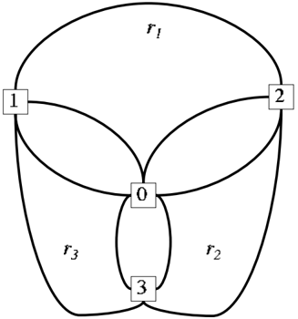

Unfortunately, it is not possible to extend this interesting result to other classes of instances. In the work by Archetti, Mansini and Speranza [2] it is shown that, even in the case of Euclidean distances, the SDVRP is not reducible for Q ≥ 3.

Dror and Trudeau [13] have shown an interesting property of optimal solutions. To understand their result we first need the following definition.

Definition 2. Consider a set C = { i 1 , i 2 , ..., i k } of customers and suppose that there exist k routes r 1 , ..., r k , k ≥ 2 , such that r w contains customers i w and i w +1 , w = 1 , ..., k -1 , and r k contains customers i 1 and i k . Such a configuration is called a k -split cycle.

An example of a 3-split cycle can be found in Figure 1. Dror and Trudeau have shown that, if the distances satisfy the triangle inequality, then there always exists an optimal solution to the SDVRP which does not contain k -split cycles, k ≥ 2.

Theorem 5. [14] If the costs c ij satisfy the triangle inequality, then there exists an optimal solution to the SDVRP that does not contain any k -split cycle (for any k ).

This result is of great importance since it allows a remarkable reduction of the number of solutions to be explored to find the optimum, as shown in the following corollary.

Corollary 1. [14] If the costs c ij satisfy the triangle inequality, then there exists an optimal solution to the SDVRP where no two routes have more than one customer with a split delivery in common.

Another structural property of optimal solutions to the SDVRP is derived by Archetti, Savelsbergh and Speranza [3] which relates the number of splits to the number of routes. Let n i be the number of deliveries received by customer i , i.e., the number of routes that visit customer i . We say that customer i is a customer with a split delivery if n i &gt; 1 and that the number of splits at customer i is n i -1. Therefore, the total number of splits is equal to ∑ n i =1 ( n i -1).

Theorem 6. [3] If the costs c ij satisfy the triangle inequality, then there exists an optimal solution to the SDVRP where the number of splits is less than the number of routes.

## 4 Valid Inequalities, Lower Bounds and Exact Approaches

In this section we review a set of valid inequalities proposed by Dror, Laporte and Trudeau [12] and a lower bound for the SDVRP proposed by Belenguer, Martinez and Mota [8]. At the end of the section, we also provide a description of the exact algorithms proposed in the literature to solve the SDVRP and the SDVRPTW.

In [12] Dror, Laporte and Trudeau analyze the valid inequalities for the VRP to check whether they are valid also for the SDVRP. First of all, they analyze the subtour elimination constraints for the VRP. Denoting by N S ( ) the minimum number of vehicles needed to serve all the vertices in S , they observe that, while the subtour elimination constraints written in the following form

<!-- formula-not-decoded -->

are not valid for the SDVRP, in the equivalent form

<!-- formula-not-decoded -->

they represent valid inequalities for the SDVRP. The following class of valid inequalities are derived from (10)

<!-- formula-not-decoded -->

where

<!-- formula-not-decoded -->

Aclass of constraints, called fractional cycle elimination constraints , is also presented by Dror, Laporte and Trudeau [12] and represent valid inequalities for the SDVRP

<!-- formula-not-decoded -->

<!-- formula-not-decoded -->

/negationslash

The effectiveness of inequalities (10)-(13) is shown in Dror, Laporte and Trudeau [12] by comparing the value of the LP relaxation of the problem before and after the introduction of the inequalities with an upper bound. The upper bound used is the value of the solution of the algorithm proposed by Dror and Trudeau [13]. The computational results show that the gap between the value of the LP relaxation and the upper bound is always below 9% when the valid inequalities are added to the model, while it can be above 50% if the inequalities are not introduced.

Belenguer, Martinez and Mota [8] studied the polyhedron of the SDVRP and found valid inequalities that define facets. The facets were used in a cutting plane algorithm to find a lower bound for the SDVRP. Computational experiments to test the effectiveness of the lower bound were run on instances from the TSPLIB and on randomly generated instances. To measure the performance of the lower bound, the authors computed the gap between the lower bound and an upper bound obtained by solving the instances through a heuristic algorithm for the VRP. The computational results show that the average gap with respect to the upper bound is 3.05% for the TSPLIB instances and 7.81% for the randomly generated instances.

To the best of our knowledge, three exact approaches were proposed for the SDVRP. One is proposed by Lee et al. [21] who formulate the SDVRP as a dynamic programming problem. The computational tests show that the algorithm is able to solve instances with up to 7 customers in a reasonable amount of time. Liu [23] and Jin, Liu and Bowden [20] propose instead a two-stage exact approach to solve the SDVRP. In the first stage an assignment problem is solved to determine clusters of customers served by the same vehicle. The first stage provides a lower bound. The second stage consists in solving a TSP for each cluster thus determining an upper bound. This upper bound is used

to generate valid inequalities which are inserted in the assignment problem of the first stage at the next iteration. The procedure is iterated until upper and lower bounds coincide. Computational tests show that this approach is able to solve instances with up to 22 customers using a quite large computational time (more than 13 hours for instances with more than 20 customers). The algorithm proposed by Jin, Liu and Bowden [20] assumes a fixed number of vehicles. For the case where the number of vehicles is variable, Liu [23] proposes a branch and price algorithm and compares this approach with the cutting plane algorithm proposed by Belenguer, Martinez and Mota [8]. The comparison is made on the basis of the gap between the upper and lower bound at the end of the running time. The branch and price algorithm produces a better gap than the cutting plane algorithm in 5 instances over a total of 17 tested instances.

Finally, Gendreau et al. [17] propose an exact algorithm for the SDVRP with time windows that is based upon a set covering formulation of the problem and a column generation approach. The column generation scheme is included in a branch and bound tree to obtain a branch and price exact algorithm. The algorithm is introduced by Gueguen [19] where instances with up to 25 customers are solved. In the work by Gendreau et al. [17] the algorithm solves almost all instances with up to 50 customers and a subset of instances with 100 customers. The set covering formulation proposed by Gendreau et al. [17] can be applied also to solve the SDVRP without time windows; it is, in fact, the formulation used in the optimization-based heuristic for the SDVRP described in Section 6.3. Moreover, the column generation scheme proposed by Gendreau et al. [17] can be easily adapted to solve the SDVRP, as shown by the same authors in [15].

## 5 SDVRP vs VRP

The interest in the SDVRP comes from the fact that costs can be reduced with respect to the costs of the VRP by allowing split deliveries. In this section, we discuss the amount of the saving. This is an important information in practice, because of the additional organizational difficulties deriving from the multiple visits to the same customer. We consider both the case where the demand of each customer is lower than or equal to the capacity Q and the case where the demand of at least a customer is greater than Q . For this latter case there is the need to define a variant of the classical VRP as, when the demand of a customer is greater than the vehicle capacity, the customer has to be visited more than once. In order to distinguish the cases, in this section we define as extended VRP the problem where each customer is visited the minimum number of times and extended SDVRP the problem where this restriction is relaxed. We indicate as

- · V RP the problem of finding the optimal routes when the demand of each customer is lower than or equal to Q and each customer is visited exactly once. z V RP ( ) is the value of the optimal solution;
- · SDVRP the problem of finding the optimal routes when the demand of each customer is lower than or equal to Q and each customer can be visited any number of times. z SDV RP ( ) is the value of the optimal solution;
- · V RP + (extended VRP) the problem of finding the optimal routes when the demand of at least a customer is greater than Q and each customer is visited exactly the minimum possible number of times, i.e., t i = /ceilingleft d i Q /ceilingright , where t i is the number of visits to customer i . z V RP ( + ) is the value of the optimal solution;
- · SDVRP + (extended SDVRP) the problem of finding the optimal routes when the demand of at least a customer is greater than Q and each customer is visited any number of times. z SDV RP ( + ) is the value of the optimal solution.

Note that in the extended VRP any customer with demand not greater than the vehicle capacity is visited exactly once.

For both extended problems we present the performance of the following heuristic algorithm: Make full truckload deliveries using out-and-back tours to customers with demand greater than the vehicle capacity until their remaining demand is less than or equal to the vehicle capacity. Then, solve a VRP (obtaining a heuristic for the V RP + ) or an SDVRP (obtaining a heuristic for the SDVRP + ) to find a minimum cost set of routes serving the remaining demands of all customers. We indicate as:

- · H V RP + the heuristic for the V RP + and z H ( V RP + ) the value of the corresponding solution;
- · H SDVRP + the heuristic for the SDVRP + and z H ( SDVRP + ) the value of the corresponding solution.

## 5.1 Worst-case Analysis

The cost of an optimal VRP solution is compared with the cost of an optimal SDVRP solution by computing an upper bound on the ratio between the value of the VRP solution and the value of the SDVRP solution. In the work by Archetti, Savelsbergh and Speranza [3] it is shown that

<!-- formula-not-decoded -->

and that this bound is tight, i.e., there exists an instance where the optimal VRP solution has a value that is twice as large as the value of the optimal SDVRP solution. This result says that, with respect to a VRP solution, split deliveries can save up to 50% of the cost.

For the case where the demand of at least a customer is greater than Q , the upper bound on the ratio remains the same (see Archetti, Savelsbergh and Speranza [3]), i.e.,

<!-- formula-not-decoded -->

and also this bound is tight.

Nowak [26] obtained a similar result for the pickup and delivery case, i.e., also in this case the value of the solution without split loads can be twice as large as the value of the solution with split loads.

Archetti, Savelsbergh and Speranza [3] also studied the performance ratio of heuristics H V RP + and H SDVRP + . They found that

<!-- formula-not-decoded -->

<!-- formula-not-decoded -->

and that both bounds are tight. Both in the case of the extended VRP and of the extended SDVRP, making out-and-back tours to the customers to reduce the demand of the customers to a value lower than the vehicle capacity and then solving the reduced problem optimally may cost up to twice the cost of an optimal solution.

The instances used to demonstrate the tightness of the above bounds all have a large vehicle capacity. Thus, it is interesting to analyze a case with small vehicle capacity. In Archetti, Savelsbergh and Speranza [3] it is shown that, when the capacity is Q = 3, then z V RP ( ) z SDV RP ( ) ≤ 3 2 and z V RP ( + ) z SDV RP ( + ) ≤ 3 2 and that these bounds are tight.

One benefit, maybe the most evident benefit, of allowing split deliveries is a reduction in the number of delivery routes required to satisfy all demand. To quantify this benefit, in Archetti, Savelsbergh and Speranza [4] the authors studied the ratio r V RP ( ) r SDV RP ( ) , where r V RP ( ) and r SDV RP ( ) denote the minimum number of delivery routes required to satisfy customers demand in a solution to the VRP and the SDVRP, respectively. They have shown that

<!-- formula-not-decoded -->

and that the bound is tight. This means that allowing split deliveries may also save up to 50% of the delivery routes.

For the case where a limited fleet of vehicles is available, Gueguen [19] shows that the savings obtained by allowing split deliveries can be much larger. In fact, the ratio between the optimal solution of the VRP and the optimal solution of the SDVRP can go to infinity.

Fig. 2. Ratio r V RP ( ) r SDVRP ( ) as a function of d for an instance with 149 customers and vehicles with capacity 149.

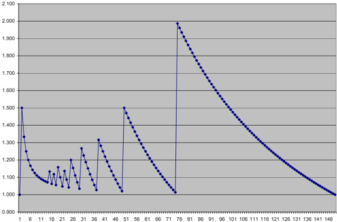

## 5.2 Computational Analysis

Whereas the worst-case results discussed above are of theoretical relevance and certainly justify the interest into split deliveries, important additional information can be obtained from an empirical study of the ratios r V RP ( ) r SDV RP ( ) and z V RP ( ) z SDV RP ( ) .

In Figure 2 (taken from Archetti, Savelsbergh and Speranza [4]) the ratio r V RP ( ) r SDV RP ( ) is reported as a function of the demand of the customers for an instance where n = Q = 149 and where all customers share the same location and the same demand. The ratio reaches its maximum value of 1.987 for demand size 75, i.e., when d = /ceilingleft Q 2 /ceilingright . In this case, an optimal VRP solution serves each customer with an out-and-back tour and thus needs 149 routes, whereas in the SDVRP solution the demands of two customers can be combined in a single route leaving only one unit of demand to be picked up by another route. In this case, a total of 75 routes are used, resulting in a ratio of 1.987. The other peaks of the ratio are reached for values of d equal to /ceilingleft Q k /ceilingright , k ∈ N , k &gt; 2.

Archetti, Savelsbergh and Speranza [4] study the ratio between costs, i.e., z V RP ( ) z SDV RP ( ) , also to see whether it is strictly related to the ratio r V RP ( ) r SDV RP ( ) . They analyze the main characteristics of the instances that influence both ratios, focusing on three aspects:

- · location of the customers;
- · variance of the demands of the customers.
- · mean demand of the customers;

Studying the ratio z V RP ( ) z SDV RP ( ) for reasonable size instances can only be done using heuristics, as both the VRP and the SDVRP are NP-hard. For their computational study, Archetti, Savelsbergh and Speranza [4] used state-ofthe-art meta-heuristics. The VRP solution is obtained using the granular tabu search heuristic of Toth and Vigo [28]. The SDVRP solution is obtained using the tabu search heuristic developed by Archetti, Hertz and Speranza [1].

The computational study, carried out on a set of randomly generated instances, confirmed that allowing split deliveries can result in substantial benefits, but also shows that these substantial benefits occur for instances with specific characteristics. The benefits mainly depend on the relation between mean demand and vehicle capacity and on demand variance; there does not appear to be a dependence on customer locations. The largest benefits are obtained when the mean demand is greater than half the vehicle capacity but less than three quarters of the vehicle capacity and the demand variance is relatively small.

## 6 Heuristics for the SDVRP

In this section we describe and compare the heuristic algorithms proposed in the literature to solve the SDVRP in the case of an unlimited fleet of vehicles: A local search heuristic by Dror and Trudeau [13], a tabu search heuristic by Archetti, Hertz and Speranza [1] and an optimization-based heuristic by Archetti, Savelsbergh and Speranza [5]. Recently, Mota, Campos and Corberan [24] presented a scatter search algorithm for the SDVRP with the additional constraint of a number of vehicles available equal to the minimum n needed, i.e., /ceilingleft ∑ i =1 d i Q /ceilingright . This constraint may significantly affect the performance of the heuristic when compared with any of those designed for an unlimited fleet of vehicles. Another recent heuristic algorithm is proposed by Chen, Golden and Wasil [9]. Their approach works as follows. First, an initial feasible solution is created by means of the classical Clarke and Wright algorithm for the VRP (they consider instances where d i ≤ Q for any i ). Then, a MIP problem is optimally solved which re-assigns endpoints of each route to different routes if this causes savings. Finally, a record-to-record travel algorithm is applied which improves the routes constructed. Computational results on different types of tests are provided that suggest the effectiveness of the approach.

## 6.1 Dror and Trudeau's Heuristic

We provide a short description of the algorithm proposed by Dror and Trudeau for the SDVRP [13]. The algorithm is designed only for the case where the demand of each customer is lower than the vehicle capacity. The heuristic is a local search algorithm and is composed of the following two main procedures.

## K-split interchange

Consider a vertex i and its total demand d i :

- 1. remove vertex i from all the routes where it is visited;
- 2. consider all subsets R of routes such that the total residual capacity is greater than or equal to d . i For each such subset R compute the total insertion cost of i into all routes of R . Choose the subset R that leads to the least insertion cost and insert i into all routes of R .

## Route addition

Consider a customer i which appears in at least two routes r 1 and r 2 . Eliminate the split of i on these two routes and create a new route in the following way:

- 1. preserve the four principle route segments on r 1 and r 2 (from the depot to the vertex preceding i and from the vertex succeeding i to the depot);
- 2. create three routes considering all the possible combinations between the principle route segments and i (which must not be split) and choose the best one.

There are 9 possible combinations (for details see Dror and Trudeau [13]). The same procedure is considered when customer i is split among 3 different routes. In this case there are 19 possible combinations to be considered. If a vertex is visited by more than 3 routes, the algorithm considers all the possible combinations of 2 and 3 routes.

Moreover, Dror and Trudeau use the following classical improvement procedures which have been developed for the capacitated VRP.

Node interchanges This procedure is based on one-node moves and two-node swaps between routes and is described in detail in Dror and Levy [11]. 2-opt This is the classical 2-opt procedure for the TSP (Lin [22]).

Defining boolean variables split impr and add impr, the main algorithm works as follows.

## Dror and Trudeau's algorithm

- 1. Construct a feasible VRP solution.
- 2. Node interchanges : execute all node interchange improvements.
- 3. 2-opt : execute all 2-opt route improvements.
- 4. Set split impr = 'false' and add impr = 'false'.
- 5. K-split interchange : execute all k -split interchange improvements. If there is at least one improvement then set split impr = 'true'.
- 6. Route addition : execute all route addition improvements. If there is at least one improvement then set add impr = 'true'.
- 7. If add impr = 'true' then go to step 5. Otherwise, if split impr = 'true' go to step 2 else STOP.

## 6.2 Tabu Search Heuristic

In Archetti, Hertz and Speranza [1] a tabu search algorithm for the SDVRP, called SPLITABU, is presented and tested. Only two parameters are to be set: the length of the tabu list and the maximum number of iterations the algorithm can run without improvement of the best solution found. The algorithm is composed of the three following phases:

- · Phase 1: Construction of an initial feasible solution . Initially, the instance is reduced by making as many full load out-and-back tours as possible from the depot to each customer. Then, a traveling salesman problem is solved on the reduced instance by means of the GENIUS algorithm proposed by Gendreau, Hertz and Laporte [18]. Finally, the giant tour is cut into pieces so that the capacity constraint is satisfied.
- · Phase 2: Tabu search phase . In this phase, a move from a solution s to a neighbour solution s ′ is performed by inserting a customer i into a route r and by removing i from a subset U of routes visiting i . The subset U is determined on the basis of the savings caused by removing i . The insertion of a customer i into a route r is made with the classical cheapest insertion method. Customer i can be totally or partially removed from each route in U . The route r , where customer i is inserted, can be a route which already visits i or not, and can be also a new route. When a customer i is added to a route r it can not be removed for a number of iterations. Similarly, when a customer i is removed from a route u it can not be added for a number of iterations.
- · Phase 3: Final improvement of the solution found by the tabu search phase . The final solution of Phase 2 is improved by deleting all k -split cycles and by applying the GENIUS algorithm to each individual route.

## 6.3 Optimization-based Heuristic

The heuristic proposed in Archetti, Savelsbergh and Speranza [5] makes use of information provided by the tabu search described in the previous section in

order to construct a set of good routes. These routes are then passed to a MIP program which determines the best ones. The idea underlying this solution approach is to first identify 'good' parts of the solution space, i.e., parts that are likely to contain high quality solutions, by means of the information provided by the tabu search algorithm. Then, these parts are deeply explored by a MIP optimizer.

Thus, the first phase consists in extracting information from the tabu search process. This phase consists in two parts.

The first part is the identification of a set C ′ of customers which are likely to be served by a single vehicle in high-quality SDVRP solutions. The identification of the set C ′ is based on the number of times each customer is split in the solutions encountered by the tabu search. If the total (over all the solutions) number of splits to a customer is less than 10% of the maximum total number of splits over all customers and the customer is not split in the final solution of the tabu search, then the customer is inserted in C ′ .

The second part is the construction of high quality routes. This construction is based on the identification of 'good' edges which, as before, is made through an analysis of the solutions encountered by the tabu search. If an edge is never or rarely traversed by the solutions encountered during the entire tabu search running, then it is excluded from the construction of routes. In this way, the set of edges used to construct promising routes is reduced and includes only promising edges. On the basis of this restricted set of edges, a large set of high quality routes is constructed.

Once the first phase is concluded and the set of promising routes is identified, the MIP program will optimize over this set to find the best routes. We now describe the route-based model for the SDVRP presented in Archetti, Savelsbergh and Speranza [5]. A similar model has been independently developed and presented in Gendreau et al. [17] for the SDVRP with time windows. Let R represent a set of routes and let c r denote the cost of route r . The formulation has two sets of variables. The variable x r represents the number of times a route is executed in an optimal solution. For routes that visit more than one customer the variable x r can be assumed to be binary, as it is never optimal to execute such a route more than once (Theorem 5). When instead a route visits a single customer, the variable x r has to be a non-negative integer to accommodate situations in which there are customers with demand greater than the vehicle capacity. The continuous variable y i r represents the quantity delivered to customer i on route r . The integer programming model is presented below.

<!-- formula-not-decoded -->

<!-- formula-not-decoded -->

<!-- formula-not-decoded -->

<!-- formula-not-decoded -->

<!-- formula-not-decoded -->

The objective function (14) minimizes the total cost of the selected routes. Constraints (15) impose that a delivery to a customer i on route r can only take place if route r is selected and that the total quantity delivered on a selected route cannot exceed the vehicle capacity. Constraints (16) ensure that the demand d i of customer i is completely satisfied. This formulation is strengthened in Archetti, Savelsbergh and Speranza [5] with additional constraints.

## 6.4 Computational Results

In Archetti, Hertz and Speranza [1] Dror and Trudeau's algorithm and the tabu search heuristic are compared and in Archetti, Savelsbergh and Speranza [5] the improvements obtained by the optimization-based heuristic upon the tabu search heuristic are reported. However, the comparisons are made on different sets of instances. We compare here the three algorithms on the same set of instances. This set is formed by 49 instances (available at the web site www-c.eco.unibs.it/ ∼ archetti/sdvrp.zip) which are derived from seven basic instances. Such basic instances vary in terms of the number of customers (ranging from 50 to 199) and in terms of vehicle capacity (ranging from 140 to 200). Six additional sets of instances were created by changing the demand of the customers in the basic instances and maintaining all the other characteristics. Each of the new sets of instances is characterized by a lower bound α and by an upper bound γ on the demand of the customers, expressed as a fraction of the vehicle capacity Q , i.e., α, γ ∈ [0 , 1] with α ≤ γ . The demand d i of customer i is set to

<!-- formula-not-decoded -->

for some random δ in [0,1], i.e., the demand d i of customer i is randomly chosen in the interval [ αQ,γQ ]. The six additional sets of instances were created with the following lower and upper bound combinations ( α, γ ): (0.01,0.1), (0.1,0.3), (0.1,0.5), (0.1,0.9), (0.3,0.7) and (0.7,0.9) (following Dror and Trudeau [13]). Note that customers demands are always lower than the vehicle capacity. The reason is that Dror and Trudeau's algorithm is designed for this case only. Therefore, we can compare the three algorithms on this case only.

The results are shown in Table 1. When α = γ = 0 the demands of the original instance are taken. From Table 1, we see that the tabu search heuristic (SPLITABU) outperforms Dror and Trudeau's heuristic (DT) in 41 cases over 49 and that the optimization-based heuristic improves the tabu search solution in 41 cases over 49. As observed in Archetti, Hertz and Speranza

Table 1. Computational Results

| Instance        | n       | α γ         | impr.       | SPLITABU Optimization-based heuristic % on DT % impr. on SPLITABU % impr.   | on          |
|-----------------|---------|-------------|-------------|-----------------------------------------------------------------------------|-------------|
| p01.cri         | 50      | 0 0         | 10.53       | 0.59                                                                        | 11.18       |
| p02.cri         | 75      | 0 0         | 4.75        | 0.08                                                                        | 4.83        |
| p03.cri         | 100     | 0 0         | 7.24        | 0.01                                                                        | 7.24        |
| p04.cri         | 150     | 0 0         | 5.59        | 0.68                                                                        | 6.31        |
| p05.cri         | 199     | 0 0         | 2.64        | 0.15                                                                        | 2.79        |
| p10.cri         | 199     | 0 0         | 2.64        | 0.15                                                                        | 2.79        |
| p11.cri         | 120     | 0 0         | 2.58        | 0.00                                                                        | 2.58        |
| p01.cri         | 50      | 0.01 0.1    | 5.83        | 0.00                                                                        | 5.83        |
| p02.cri         | 75      | 0.01 0.1    | 4.00        | 0.00                                                                        | 4.00        |
| p03.cri         | 100     | 0.01 0.1    | 7.46        | 0.00                                                                        | 7.46        |
| p04.cri         | 150     | 0.01 0.1    | 9.95        | 0.00                                                                        | 9.95        |
| p05.cri         | 199     | 0.01 0.1    | 3.33        | 0.07                                                                        | 3.40        |
| p10.cri         | 199     | 0.01 0.1    | 3.33        | 0.07                                                                        | 3.40        |
| p11.cri         | 120     | 0.01 0.1    | 1.94        | 0.00                                                                        | 1.94        |
| p01.cri         | 50      | 0.1 0.3     | 6.23        | 0.00                                                                        | 6.23        |
| p02.cri         | 75      | 0.1 0.3     | 2.32        | 0.99                                                                        | 3.34        |
| p03.cri         | 100     | 0.1 0.3     | 1.32        | 0.54                                                                        | 1.86        |
| p04.cri         | 150     | 0.1 0.3     | 2.75        | 0.24                                                                        | 3.00        |
| p05.cri         | 199     | 0.1 0.3     | 1.78        | 0.10                                                                        | 1.88        |
| p10.cri         | 199     | 0.1 0.3     | 1.78        | 0.10                                                                        | 1.88        |
| p11.cri         | 120     | 0.1 0.3     | 1.38        | 0.83                                                                        | 2.22        |
| p01.cri         | 50      | 0.1 0.5     | 2.19        | 0.17                                                                        | 2.37        |
| p02.cri         | 75      | 0.1 0.5     | 3.12        | 0.48                                                                        | 3.62        |
| p03.cri         | 100     | 0.1 0.5     | 3.38        | 1.41                                                                        | 4.84        |
| p04.cri         | 150     | 0.1 0.5     | 1.76        | 0.33                                                                        | 2.10        |
| p05.cri         | 199     | 0.1 0.5     | 1.53        | 0.49                                                                        | 2.03        |
| p10.cri         | 199     | 0.1 0.5     | 1.53        | 0.49                                                                        | 2.03        |
| p11.cri         | 120     | 0.1 0.5     | 2.69        | 0.12                                                                        | 2.81        |
| p01.cri         | 50      | 0.1 0.9     | 1.68        | 0.00                                                                        | 1.69        |
| p02.cri         | 75      | 0.1 0.9     | 2.57        | 0.03                                                                        | 2.60        |
| p03.cri         | 100     | 0.1 0.9     | 1.75        | 0.44                                                                        | 2.19        |
| p04.cri         | 150     | 0.1 0.9     | 1.65        | 0.25                                                                        | 1.90        |
| p05.cri         | 199     | 0.1 0.9     | 2.26        | 0.05                                                                        | 2.32        |
| p10.cri         | 199     | 0.1 0.9     | 2.26        | 0.05                                                                        | 2.32        |
| p11.cri         | 120     | 0.1 0.9     | -1.50       | 1.48                                                                        | -0.03       |
| p01.cri         | 50      | 0.3 0.7     | 4.12        | 0.13                                                                        | 4.25        |
| p02.cri         | 75      | 0.3 0.7     | 4.90        | 1.06                                                                        | 6.01        |
| p03.cri         | 100     | 0.3 0.7     | 2.40        | 0.50                                                                        | 2.92        |
| p04.cri         | 150     | 0.3         | 2.73        | 0.68                                                                        | 3.43        |
| p05.cri         | 199     | 0.7 0.3 0.7 | 3.70        | 0.31                                                                        | 4.02        |
| p10.cri         | 199     | 0.3 0.7     | 3.70        | 0.31                                                                        | 4.02        |
| p11.cri         | 120     | 0.3 0.7     | -0.52       | 0.58                                                                        | 0.06        |
| p01.cri         | 50      | 0.7 0.9     | 0.92        | 0.06                                                                        | 0.97        |
| p02.cri         | 75      | 0.7 0.9     | -0.81       | 0.34                                                                        | -0.47       |
| p03.cri         | 100     | 0.7 0.9     | -0.94       | 0.29                                                                        | -0.65       |
| p04.cri         | 150     | 0.7 0.9     | -0.33       | 0.30                                                                        | -0.03       |
| p05.cri         | 199     | 0.7 0.9     | -1.62       | 0.44                                                                        | -1.18       |
| p10.cri p11.cri | 199 120 | 0.7 0.9 0.9 | -1.62 -3.53 | 0.44 1.17                                                                   | -1.18 -2.40 |
|                 |         | 0.7         |             |                                                                             |             |

[1], the tabu search heuristic produces better results when the demands are small with respect to the vehicle capacity. In Table 2 the computational times required by the three heuristics are shown. Times are expressed in seconds. The computational times required by the two most effective heuristics are much higher than the time required by the local search heuristic. Moreover, the tabu search heuristic needs much more time to solve instances with large

demands. The reason is that in this case the number of moves to be evaluated at each iteration is very large. Some comments are in order on these results. First, in Archetti, Hertz and Speranza [1] the authors presented computational tests letting the tabu search heuristic run for one minute only and showing that also in this case it is much more effective than Dror and Trudeau's heuristic. In the experiments reported in Table 1 the tabu search is run until the natural end. Second, whereas the results presented here concern a single version of the optimization-based heuristic, in Archetti, Savelsbergh and Speranza [5] different variants of the algorithm were tested and, by taking the best result over the variants for each instance, it was possible to improve further the quality of the solutions. Finally, the performance of the tabu search heuristic is slightly different from what is reported in Archetti, Hertz and Speranza [1] mainly because in Archetti, Hertz and Speranza [1] five different runs were made on each instance for the tabu search. Here we tested a single run of the tabu search heuristic.

## Conclusions

In this survey we have summarized the contributions on the Split Delivery Vehicle Routing Problem. The cost savings that can be obtained by allowing split deliveries can be relevant and justify the interest that this problem has raised. The complexity of the problem and structural properties of the optimal solution are known. However, whereas some effective heuristics have been designed and tested, the exact algorithms proposed until now can solve only very small instances.

## References

- 1. C. Archetti, A. Hertz, M.G. Speranza. A tabu search algorithm for the split delivery vehicle routing problem. Transportation Science , 40: 64-73, 2006.
- 2. C. Archetti, R. Mansini, M.G. Speranza. Complexity and reducibility of the skip delivery problem. Transportation Science , 39: 182-187, 2005.
- 3. C. Archetti, M.W.P. Savelsbergh, M.G. Speranza. Worst-case analysis for split delivery vehicle routing problems. Transportation Science , 40: 226-234, 2006.
- 4. C. Archetti, M.W.P. Savelsbergh, M.G. Speranza. To split or not to split: That is the question. To appear in Transportation Research E .
- 5. C. Archetti, M.W.P. Savelsbergh, M.G. Speranza. An optimization-based heuristic for the split delivery vehicle routing problem. To appear in Transportation Science .
- 6. C. Archetti, M.G. Speranza. Vehicle routing in the 1-skip collection problem. Journal of the Operational Research Society , 55: 717-727, 2004.
- 7. M. Ball, L. Bodin, R. Baldacci, A. Mingozzi. The rollon-rolloff vehicle routing problem. Transportation Science , 34: 271-288, 2000.
- 8. J.M. Belenguer, M.C. Martinez, E. Mota. A lower bound for the split delivery vehicle routing problem. Operations Research , 48: 801-810, 2000.

Table 2. Computational Times

| Instance        | n       | α       | γ       | DT SPLITABU Optimization-based heuristic   | DT SPLITABU Optimization-based heuristic   | DT SPLITABU Optimization-based heuristic   |
|-----------------|---------|---------|---------|--------------------------------------------|--------------------------------------------|--------------------------------------------|
| p01.cri         | 50      | 0       | 0       | 0                                          | 8                                          | 97                                         |
| p02.cri         | 75      | 0       | 0       | 0                                          | 26                                         | 52                                         |
| p03.cri         | 100     | 0       | 0       | 0                                          | 41                                         | 51                                         |
| p04.cri         | 150     | 0       | 0       | 0                                          | 148                                        | 298                                        |
| p05.cri         | 199     | 0       | 0       | 0                                          | 316                                        | 297                                        |
| p10.cri         | 199     | 0       | 0       | 0                                          | 315                                        | 298                                        |
| p11.cri         | 120     | 0       | 0       | 1                                          | 47                                         | 262                                        |
| p01.cri         | 50      | 0.01    | 0.1     | 0                                          | 5                                          | 59                                         |
| p02.cri         | 75      | 0.01    | 0.1     | 0                                          | 36                                         | 118                                        |
| p03.cri         | 100     | 0.01    | 0.1     | 0                                          | 65                                         | 120                                        |
| p04.cri         | 150     | 0.01    | 0.1     | 0                                          | 257                                        | 181                                        |
| p05.cri         | 199     | 0.01    | 0.1     | 1                                          | 319                                        | 234                                        |
| p10.cri         | 199     | 0.01    | 0.1     | 1                                          | 318                                        | 245                                        |
| p11.cri         | 120     | 0.01    | 0.1     | 1                                          | 53                                         | 151                                        |
| p01.cri         | 50      | 0.1     | 0.3     | 0                                          | 20                                         | 256                                        |
| p02.cri         | 75      | 0.1     | 0.3     | 0                                          | 106                                        | 161                                        |
| p03.cri         | 100     | 0.1     | 0.3     | 0                                          | 192                                        | 159                                        |
| p04.cri         | 150     | 0.1     | 0.3     | 0                                          | 819                                        | 1152                                       |
| p05.cri         | 199     | 0.1     | 0.3     | 1                                          | 1223                                       | 567                                        |
| p10.cri         | 199     | 0.1     | 0.3     | 1                                          | 1224                                       | 545                                        |
| p11.cri         | 120     | 0.1     | 0.3     | 1                                          | 240                                        | 585                                        |
| p01.cri         | 50      | 0.1     | 0.5     | 0                                          | 21                                         | 866                                        |
| p02.cri         | 75      | 0.1     | 0.5     | 0                                          | 62                                         | 646                                        |
| p03.cri         | 100     | 0.1     | 0.5     | 0                                          | 275                                        | 201                                        |
| p04.cri         | 150     | 0.1     | 0.5     | 0                                          | 1072                                       | 517                                        |
| p05.cri         |         |         | 0.5     | 1                                          | 4800                                       | 1138                                       |
|                 | 199     | 0.1     |         |                                            | 291                                        | 365                                        |
| p10.cri p11.cri | 199 120 | 0.1 0.1 | 0.5 0.5 | 1 1                                        | 4797                                       | 1114                                       |
| p01.cri         | 50      | 0.1     | 0.9     | 0                                          | 92                                         | 2939                                       |
| p02.cri         | 75      | 0.1     | 0.9     | 0                                          | 532                                        | 361                                        |
| p03.cri         | 100     | 0.1     | 0.9     | 0                                          | 902                                        | 620                                        |
| p04.cri         | 150     | 0.1     | 0.9     | 1                                          | 3367                                       | 592                                        |
| p05.cri         | 199     | 0.1     | 0.9     | 2                                          | 12332                                      | 806                                        |
| p10.cri         | 199     | 0.1     | 0.9     | 2                                          | 12323                                      | 813                                        |
| p11.cri         | 120     | 0.1     | 0.9     | 1                                          | 812                                        | 4882                                       |
| p01.cri         | 50      | 0.3     | 0.7     | 0                                          | 35                                         | 1684                                       |
| p02.cri         | 75      | 0.3     | 0.7     | 0                                          | 257                                        | 2551                                       |
| p03.cri         | 100     | 0.3     | 0.7     | 0                                          | 428                                        | 1605                                       |
| p04.cri         | 150     | 0.3     | 0.7     | 1                                          | 3771                                       | 251                                        |
| p05.cri         | 199     | 0.3     | 0.7     | 2                                          | 23135                                      | 1702                                       |
| p10.cri         | 199     | 0.3     | 0.7     | 2                                          | 23128                                      | 1704                                       |
| p11.cri         | 120     | 0.3     | 0.7     | 1                                          | 746                                        | 7147                                       |
| p01.cri         | 50      | 0.7     | 0.9     | 0                                          | 184                                        | 834                                        |
| p02.cri         | 75      | 0.7     | 0.9     | 0                                          | 292                                        | 1872                                       |
| p03.cri         | 100     | 0.7     | 0.9     | 0                                          | 951                                        | 2433                                       |
| p04.cri p05.cri | 150 199 | 0.7 0.7 | 0.9 0.9 | 1 5                                        | 28928 20677                                | 2460 656                                   |
| p10.cri         | 199     | 0.7     | 0.9     | 5                                          | 20672                                      | 656                                        |
| p11.cri         | 120     | 0.7     | 0.9     | 1                                          | 1855                                       | 3948                                       |

- 9. S. Chen, B. Golden, E. Wasil. The split delivery vehicle routing problem: Applications, test problems, and computational results. Networks , 49: 318-329, 2007.
- 10. L. De Meulemeester, G. Laporte, F.V. Louveaux, F. Semet. Optimal sequencing of skip collections and deliveries. Journal of the Operational Research Society , 48: 57-64, 1997.
- 11. M. Dror, L. Levy. A vehicle routing improvement algorithm: comparison of a 'greedy' and a matching implementation for inventory routing. Computers &amp; Operations Research , 13: 33-45, 1986.

- 12. M. Dror, G. Laporte, P. Trudeau. Vehicle routing with split deliveries. Discrete Applied Mathematics , 50: 239-254, 1994.
- 13. M. Dror, P. Trudeau. Savings by split delivery routing. Transportation Science , 23: 141-145, 1989.
- 14. M. Dror, P. Trudeau. Split delivery routing. Naval Research Logistics , 37: 383402, 1990.
- 15. D. Feillet, P. Dejax, M. Gendreau, C. Gueguen. An exact algorithm for the elementary shortest path problem with resource constraints: application to some vehicle routing problems. Networks , 44: 216-229, 2004.
- 16. P.W. Frizzell, J.W. Giffin. The split delivery vehicle scheduling problem with time windows and grid network distances. Computers &amp; Operations Research , 22: 655-667, 1995.
- 17. M. Gendreau, P. Dejax, D. Feillet, C. Gueguen. Vehicle routing with time windows and split deliveries. Working paper.
- 18. M. Gendreau, A. Hertz, G. Laporte. New insertion and postoptimization procedures for the traveling salesman problem. Operations Research , 40: 1086-1094, 1992.
- 19. C. Gueguen. M´ ethodes de r´solution exacte pour les probl`mes de tourn´es de e e e v´hicules e . PhD thesis, Ecole Centrale Paris, 1999. ´
- 20. M. Jin, K. Liu, R.O. Bowden. A two-stage algorithm with valid inequalities for the split delivery vehicle routing problem. International Journal of Production Economics , 105: 228-242, 2007.
- 21. C.G. Lee, M.A. Epelman, C.C. White III, Y.A. Bozer. A shortest path approach to the multiple-vehicle routing problem with split pick-ups. Transportation Research B , 40: 265-284, 2006.
- 22. S. Lin. Computer solutions of the traveling salesman problem. Bell System Technical Journal , 44: 2245-2269, 1965.
- 23. K. Liu A study on the split delivery vehicle routing problem . PhD thesis, Mississippi State University, 2005.
- 24. E. Mota, V. Campos, A. Corb´ eran. A new metaheuristic for the vehicle routing problem with split demands. Working paper.
- 25. P.A. Mullaseril, M. Dror, J. Leung. Split-delivery routing in livestock feed distribution. Journal of the Operational Research Society , 48: 107-116, 1997.
- 26. M.A. Nowak. The pickup and delivery problem with split loads . PhD thesis, Georgia Institute of Technology, 2005.
- 27. G. Sierksma, G.A. Tijssen. Routing helicopters for crew exchanges on off-shore locations. Annals of Operations Research , 76: 261-286, 1998.
- 28. P. Toth, D. Vigo. The granular tabu search and its application to the vehiclerouting problem. INFORMS Journal on Computing , 15: 333-346, 2003.

## Challenges and Advances in A Priori Routing

Ann Melissa Campbell and Barrett W. Thomas

Tippie College of Business Department of Management Sciences University of Iowa Iowa City, Iowa 52242-1994 ann-campbell@uiowa.edu, barrett-thomas@uiowa.edu

Summary. An a priori route is a route which specifies an ordering of all possible customers that a particular driver may need to visit. The driver may then skip those customers on the route who do not receive a delivery. Despite the prevalence of a priori routing, construction of these routes still presents considerable challenges. Exact methods are limited to small problem sizes, and even heuristic methods are intractable in the face of real-world-sized instances. In this chapter, we will review some of the ideas that have emerged in recent years to help solve these larger instances. We focus on the probabilistic traveling salesman problem and the recently introduced probabilistic traveling salesman problem with deadlines and discuss how objective-function approximations can reduce computation time without significantly impacting solution quality. We will also present several open research questions in a priori routing.

Key words: Stochastic routing; a priori routing.

## 1 Introduction

For many delivery companies, only a subset of their customers require a pickup or delivery each day. Information may be not available far enough in advance to create optimal schedules each day for those customers that do require a visit or the cost to acquire sufficient computational power to find such solutions may be prohibitive. Companies have long used a priori routes to help overcome these difficulties. An a priori, or pre-planned, route is a route which specifies an ordering of all possible customers that a particular driver may need to visit. The driver may then skip those customers on the route who do not receive a delivery. A priori routes are used routinely in the package express industry to sequence the many potential stops in each driver's assigned territory. These routes create a regularity of service that can be beneficial for both the customers and the drivers. Customers will be served at roughly the same time each day they require service, and the drivers can become very familiar

with their routes. If there is time available on the day of service, starting from an a priori tour can be useful, too, as a starting point for reoptimization.

The best known a priori routing problem is the probabilistic traveling salesman problem (PTSP). Formally, the PTSP is the problem of finding a minimum expected cost tour through a set of customers N = { i | 1 , . . . , n } with probabilities P = { p i | 1 , . . . , n } of requiring service on any given day. The travel time between any two customers i and j is given by d i,j , where d i,j = d j,i .

Despite the prevalence of a priori routing, construction of these routes still presents considerable challenges. Exact methods are limited to small problem sizes, and even heuristic methods are intractable in the face of real-world-sized instances. In this chapter, we will review some of the ideas that have emerged in recent years to help solve these larger instances. These ideas are focused on approximating the computationally expensive PTSP objective function using various techniques.

Even though the PTSP is a challenging problem by itself, many delivery companies are faced with a more complicated routing problem due to increasing just-in-time business practices. These just-in-time considerations usually come in the form of delivery deadlines. The most common example of these services is next-day package delivery featured by United Parcel Service (UPS) and FedEx. Next-day delivery providers usually offer a choice of deadlines such as 10 am, noon, or 3 pm. Such time-definite services have grown from just 4% of the parcel delivery market in 1977 to over 60% in 2002 [59]. The market for all time-definite cargo was expected to grow by 7.6% in 2006 alone [25], and the growth is expected to continue.

In the case of a priori routing with deadlines, the problem is known as the probabilistic traveling salesman problem with deadlines (PTSPD). The problem definition for the PTSPD is the same as the PTSP except that associated with each customer i ∈ N is a known deadline l i . The PTSPD can alternately be considered a version of the PTSP with time windows, but the opening time of all windows is set to zero. Unfortunately, due to how the deadlines impact the problem, the same techniques used to help solve large instances of the PTSP are often not applicable for the PTSPD. In this chapter, we will also review new approximation techniques that have proven successful for the PTSPD and discuss instance characteristics that influence the performance of these approaches.

This chapter is structured as follows. Section 2 provides a basic literature review of a priori routing, where Section 3 and Section 4 delve into solution approaches for the PTSP and PTSPD, respectively. Section 5 presents several open research questions in a priori routing.

## 2 Literature Review

One of the first appearances of a priori routing in the literature is in [1], where the authors develop a priori tours for use in meals-on-wheels routing. Jaillet [41] formally introduces the PTSP and demonstrates some interesting properties of optimal tours including the fact that such a tour may intersect itself. Jaillet [42] provides a formulation for the expected value of a tour and bounds the relationship between optimal PTSP and TSP solutions. Berman and Simchi-Levi [7] focus on instances of the PTSP with heterogeneous probabilities, where most of Jaillet's results involve homogeneous probabilities. They establish a lower bound for such instances and explain how to combine this bound with a branch-and-bound algorithm to find an optimal a priori tour. Bowler et al. [17] offers additional characterizations of the problem.

Related to the PTSP is the Noisy Euclidean Traveling Salesman Problem (NTSP). This problem was introduced in [20] and further studied in [45]. The NTSP is based on the idea that some neighborhoods within the service area will have a higher probability of requiring service than others, and these densities can be exploited to create an a priori route or 'trajectory'. In this way, each node in the resulting TSP can be thought of as being sampled from a probability distribution, where in the PTSP the customer locations are known with certainty.

While the literature contains research into many constrained versions of the TSP, there is limited research into constrained versions of the PTSP. The best known of the constrained versions is the stochastic vehicle routing problem (SVRP). The SVRP requires the consideration of vehicle capacity in the formation of the tours, and rather than customer presence, customer demand is usually the stochastic element of the problem. The first mention of this problem can be found in [58]. Bertsimas [8] introduces an analytical framework and bounds for the SVRP. Other work can be divided into chance-constrained and recourse model formulations (see [26; 27] and [16] for an overview of the two types of formulations). Stewart and Golden [55], Laporte et al. [43], and Bastian and Rinnooy Kan [3] provide chance-constrained formulations and show how the problems can be transformed into deterministic problems. Dror et al. [33], Dror [31], and Gendreau et al. [35] present stochastic programming solutions to various recourse models for the SVRP. Dror and Trudeau [32], Bramel et al. [18], Bertsimas et al. [11], Savelsbergh and Goetschalckx [54], Gendreau et al. [37], and Yang et al. [62] offer various heuristics for the SVRP. Gendreau et al. [37] provides comparisons of CPU times between their exact solution approaches in [35] and their heuristics in [37]. For different scenarios involving 11 stochastic customers, they demonstrate that exact solution approaches may require solution times a thousandfold greater than the solution times of the proposed TABUSTOCH heuristic. Larger instances where all customers are stochastic are not evaluated.

Campbell and Thomas [22] introduce the PTSPD, providing two recourse models and a chance-constrained model for the problem. In addition, compu-

tational experiments demonstrate situations in which it is important to model the problem stochastically versus situations in which deterministic models are sufficient.

The authors know of only a few other papers that address routing under uncertainty with time constraints. These papers consider time constraints in the context of stochastic travel times rather than in the context of random customers as is discussed in this chapter. Teng et al. [57] apply the L-shaped algorithm to the time-constrained traveling salesman problem (TCTSP) with stochastic travel and service times. In the TCTSP, the time constraint is on the length of the tour, which contrasts with the PTSPD where the time constraints control when individual customers can be visited. Wong et al. [61] introduce a 2-stage stochastic integer program with recourse for a problem in which travel times are stochastic, all customers must be visited, and each customer has an associated time window.

The value of a priori versus daily optimized or variable routes has been explored in the context of the SVRP. Haughton [39, 40] introduce metrics for determining the value of reoptimization versus a priori routes. Waters [60], Benton and Rosetti [5], and Savelsbergh and Goetschalckx [54] discuss circumstances in which a priori routes can be cost-competitive alternatives to reoptimization. For example, Benton and Rosetti [5] experiment with different customer realization probabilities and route rescheduling costs. Their experiments reveal that reoptimization is preferred when route scheduling costs are low and few customers are realized. Interestingly, they also comment that there are 'a great deal of hidden costs associated with variable routes' and suggest this is why a priori routes are often preferred. These hidden costs can include consistency considerations and management overhead as well as customer relationships associated with a driver visiting a customer at relatively the same time everyday. A detailed discussion of consistency in route design can be found in [64] and [63] which introduce a driver learning model to capture the importance of a driver consistently working in a particular geographic area.

## 3 Solution Approaches for the PTSP

In this section, we formulate the PTSP, provide background on solution methods for the PTSP, and highlight two techniques for approximating the objective function.

## 3.1 Problem Formulation

In a solution to the PTSP, all of the customers are sequenced on one tour. On the day of service, when all demands are known, the customers that have been realized can be visited in the sequence defined by this a priori tour. Solution methods for the PTSP focus on minimizing the expected cost of these final

tours. The expected cost associated with a particular sequence of customers 1 . . . n can be evaluated by Equation 1 [8]:

<!-- formula-not-decoded -->

The first part of the equation represents the expected cost associated with using each arc ( i, j ) in a forward direction while the second part is the expected cost associated with using each arc in the reverse direction to complete the tour. The expected cost of an arc is based on the probability that the customers at both end points of the arc are realized, the probability that the none of the customers in between these on the tour are realized, and the length of the arc.

## 3.2 Background

An exact approach for the PTSP was introduced by Laporte et al. [44], but computational tests indicate success only with instances of 50 customers or less. Consequently, much of the PTSP literature focuses on heuristic approaches. The authors found that among the instances studied, it was much harder to solve instances with low individual probability values.

Rossi and Gavioli [53] discuss how to modify construction heuristics for the TSP specifically to solve the PTSP. Their heuristics are based on Clarke and Wright and nearest neighbor techniques and do not include any local improvement. The expected costs of the resulting solutions are compared with those found using basic TSP heuristics. Based on their computational experiments, the authors conclude that it is important to use solution techniques specifically developed for the PTSP if the number of customers is greater than 50 and the probability of each customer requiring a visit is less than 60%.

Bertsimas et al. [10] discuss space-filling curve and iterative heuristics. Bertsimas and Howell [9] and Chervi [28] explore the use of TSP heuristics for solving the PTSP and propose algorithms for the PTSP based on constructing an initial solution using the space-filling curve heuristic [2] followed by local search. Variations of the 2-OPT and 1-Shift techniques developed for the TSP in [46] are introduced that compute the change in objective in an expected value sense. The equations presented by Bertsimas and Howell [9] and Chervi [28] have been shown to have small errors, corrected in [15]and [12], but even with these small errors, the authors are able to show improvement based on expected value becomes more important as n becomes large. These key instances, though, prove to be very difficult for them to solve. For example, [11] reports runtimes of half an hour to a full hour of CPU time for their simplest improvement heuristics to converge with 50-customer PTSPs. Bertsimas and Howell [9] also report that expected value based local improvement is particularly important when probability values are significantly less than 1. This confirms the results established by Rossi and Gavioli [53]. Beraldi

et al. [6] extend the efficient evaluation methods of Bertsimas and Howell [9] and Chervi [28] to the probabilistic pickup and delivery traveling salesman problem.

Various metaheuristic approaches have also been applied to the PTSP. Bianchi et al. [14, 13] introduce an ant-colony optimization approach. They demonstrate that the ant-colony approach outperforms a radial-sort heuristic and a random best heuristic for the PTSP. Building upon work presented in [51], Rosenow [52] develops a genetic-algorithm approach which uses crossover operators first proposed by Grefenstette et al. [38] for the traveling salesman problem. The tests are limited and show only that the genetic algorithm outperforms a branch-and-bound scheme for the PTSP. Bowler et al. [17] uses the PTSP as a testbed to demonstrate the effectiveness of stochastic annealing. As a result of their tests on the PTSP, the authors hypothesize that a priori tours perform at most 14% worse than reoptimization strategies for the PTSP.

## 3.3 Approximation Approaches

The above research on solution techniques for the PTSP concludes that it is particularly important to solve instances of the PTSP using an expected value approach when the size of the instances are large and when probability values are not close to 1. This represents most instances of the PTSP that would be solved in practice, such as those at package delivery companies. Even with sophisticated metaheuristic approaches and significant increases in computing power, such large instances are still considered intractable because they involve repeated evaluations of Equation 1. This objective function is much more time consuming to evaluate than with the TSP. The PTSP objective function includes the cost of every arc that could potentially be used in the solution, leading to its O n ( 3 ) complexity rather than the TSP's O n ( ) complexity. Thus, evaluating the cost of a small change in a PTSP route, such as in a heuristic search approach, is also potentially computationally expensive. In the TSP, the change in cost can be computed based on the neighbors directly impacted by the change. Due to the probabilistic nature of the objective function, computing a small change in an a priori route can easily be as expensive as evaluating the cost of the full objective function. Some of the more promising ideas that have emerged in recent years for solving the PTSP involve approximating the objective function and using this approximation in various search methods. These ideas differ from the existing solution approaches that rely on exact computation of expected solution values, even when they are obtained using heuristics. We will consider two types of approximation here: one where the number of terms in the original objective function is truncated and one where customers are aggregated.

## Truncation and Approximation Function

The first of these approximation ideas for the PTSP was presented in detail in [56]. The objective function considered is slightly different than Equation 1 because the authors assume the tour begins at the depot (customer 0) which is present with a probability value of 1. The authors also do not consider the cost of a return trip to the depot which removes the second part of Equation 1.

The approximation is based on truncating the calculations used in computing the cost of adding a customer to the tour. For example, suppose the cost to add a customer j to the end of an arbitrary partial tour is initially computed by:

<!-- formula-not-decoded -->

Equation 2 could be replaced by:

<!-- formula-not-decoded -->

where K ∈ (0 , i ) is a truncation parameter. Thus, K terms at most are used in the equation that evaluates the cost of adding j . The idea is that the cost of adding j is most impacted by the customers closest to j on the tour. Customers more than K stops ahead of j , for example, will be unlikely to directly precede j on the resulting tour, so the cost of using that direct arc is highly discounted in the cost computation and can reasonably be truncated.

The idea of truncating expected cost expressions was introduced prior to [56] in [36]. In [36], the authors develop approximations for the vehicle routing problem with stochastic customers and stochastic demand. The part of their approximation related to the existence of stochastic customers is quite similar to the simple truncation proposed above.

Due to the truncation, Equation 3 will always underestimate the true costs. Tang and Miller-Hooks [56] refine this approximation approach by proposing the use of a function f ( K ) to estimate this underestimation, changing and generalizing Equation 3 to:

<!-- formula-not-decoded -->

Such an expression, after defining f ( K ), can clearly be used to speed up a construction heuristic for the PTSP. Equation 4 can also be used in approximating the full function evaluation, enabling truncation to be used with various improvement approaches.

The amount of speedup and the quality of such an approach is dependent on the choice of K and the approximation function f ( K ). Equation 4 will be more accurate the higher K is, but it will also be more expensive to evaluate. Tang and Miller-Hooks [56] propose choosing K based on a set

of trial experiments. They propose a series of computationally efficient functions to use for f ( K ) involving coefficients that are tuned to the particular problem instances. For many choices of K and f ( K ), the evaluation of the objective becomes O n ( ), which is the same complexity as the objective of the deterministic TSP.

To overcome the sensitivity to the choice of K , Tang and Miller-Hooks [56] propose a progressive enhancement idea where K can be increased over the course of the improvement procedure. As the solution improves and less improvements are possible with the current choice of K K , is increased and f ( K ) is improved to make the approximation more accurate. This gives the power of the speedup without a loss in quality of the final solution. It also makes the solution method less sensitive to a poor initial choice of K .

Tang and Miller-Hooks [56] experiment with datasets involving 50, 75, and 100 customers. The computational experiments reveal that is possible to tackle large sized PTSP instances with significantly reduced computational effort but not reduced solution quality. Using a 2-OPT improvement scheme, for example, instances with 100 customers that originally took over 2100 seconds on average to converge, take on average 17.5 seconds with approximation. For these instances, the solutions found with approximation were on average 0 5% . better than those found using exact objective evaluations.

We note that both Branke and Guntsch [19] and Liu [47] experiment with truncation-based approximate function evaluations within their ant-colony and scatter-search metaheuristics, respectively. Branke and Guntsch [19] consider instances as large as 1379 customers and demonstrate that an approximate function evaluation embedded in ant-colony optimization reduces computation time by almost 30% relative to a full evaluation. Interestingly, they found better speedup when using the approximation with heuristic search methods other than ant colony optimization. On instances with up to 100 customers, results in [47] indicate that approximate function evaluation embedded in scatter search is capable of finding good solutions while reducing computation time by as much as 86%. Unfortunately, direct comparisons between [56], [19], and [47] do not exist.

## Approximation by Aggregation

The second idea we examine in approximating the PTSP is to aggregate customers into regions. By using regions in place of individual customers in Equation 1, there is an obvious opportunity for speedup in evaluating the objective function. This idea is examined in detail in [21]. Aggregation in this context refers to grouping customers together and then representing them by one point spatially and with a single probability value. In aggregating customers, there are many choices in terms of how to divide customers into regions and how many regions to create.

Customer aggregation is common in the literature, but primarily in the context of location problems (see [29; 34], for examples) and not in a routing

context. There has been little analysis, theoretical or computational, on how aggregation can be used in solving routing problems or how aggregation can impact solution quality, especially in a probabilistic context. In [4], for example, the authors aggregate deliveries by postal codes before designing routes, but there is no discussion of how this aggregation impacts solution quality and speed.

If aggregation is used in the context of the PTSP, the a priori tour becomes a tour through regions rather than customers. This requires a modification of Equation 1. If the n customers are each assigned to one of r regions, a new probability value is required for each region as well as new distance costs. The probability associated with each region S will need to reflect all of the customers assigned to this region. Since a tour will travel to each region only once, Campbell [21] proposes defining p S as the probability that region S will require a visit. Computation of p S is then:

<!-- formula-not-decoded -->

Equation 5 is the probability that region S will have at least one realized demand given that customer orders are independent events. Next, to compute Euclidean distances between regions, a spatial location is needed to represent each region. Campbell [21] proposes computing the centroid of the customers in a region, where the weights on the customers are based on their individual probabilities. These centroid coordinates can be used to compute the Euclidean distance between each pair of regions. Equation 1 can then be replaced by the aggregated a priori expected value equation found in Equation 6:

<!-- formula-not-decoded -->

where d S,T represents the distance between regions S and T . Equation 6 resembles Equation 1, but the number of terms here can be several orders of magnitude smaller than Equation 1 because of aggregation.

Note, unlike with truncation, this approximation does not necessarily underestimate the full objective function. Because in most cases it will, Campbell [21] proposes a series of functions that can be added to Equation 6 similar to the f ( K ) functions in [56].

As stated earlier, the primary literature on aggregation comes from location theory, and there are a variety of ways suggested to group customers together based on distance. Yet with the PTSP, probability offers an important additional consideration. Grouping customers strictly based on location may lead to regions, for example, with very different probabilities of requiring a visit. Likewise grouping customers so that each region is equally likely to require a visit may create regions of very different size and shape. The study in [21] uses simple distance and probability-based aggregation approaches to build insight into what creates a successful aggregation scheme for PTSP problems.

The distance-based aggregation scheme is a grid-based approach, such as those discussed in many location papers [50]. For a given parameter g , the customer service area will be divided evenly into g segments along the x axis and g segments along the y axis to create a total of g 2 regions of equal area. If customers are uniformly distributed, each region should have roughly the same number of customers. The potential downfall of such an approach lies in the fact that not all customers are evenly distributed over the service area in real world applications.

The second form of aggregation is to divide the customer service area into regions of roughly equal probability. This may help remedy some of the possible negative issues with grids since customers should be fairly evenly distributed among the regions, but now the regions will clearly not be of the same size. To divide potential customers into regions based on probability, Campbell [21] defines a parameter maxp that represents the maximum likelihood of requiring a visit in a region. Starting from an initial region that includes all of the customers, regions are repeatedly divided into smaller regions until all regions have probability less than or equal to maxp . The approach is similar to Voronoi Diagram/Delaunay Triangulation ideas [30]. The shape of the current region is used to guide the division process in order to preserve some of the advantages of the grid approach and keep the regions from being extremely tall or wide which would distort distance calculations.

Computational experiments involve datasets ranging from 100-1000 customers and various customer probabilities. Following the structure of [9], initial solutions were constructed using a space-filling curve heuristic and several improvement schemes were tested, including TSP techniques such as 2-OPT and 1-Shift and expected value versions of 2-OPT and 1-Shift. Using aggregation, search procedures for even the 1000 customer datasets were able to converge within the 120 second time limit, and the final solutions were usually better than those found without aggregation. Both uniformly and clustered datasets were used to see how the geographical distribution of customers impacts the performance of the aggregation approaches. The results indicate that, as expected, using grid versus probability based aggregation makes little impact on uniform datasets, but can have significant impact when datasets are clustered. Campbell [21] found that quite coarse levels of aggregation can lead to good objective value estimates, but aggregation needs to become finer as the customer probabilities increase. The proposed general rule is to divide customers into regions such that the total expected demand in a region is no more than 0.5 deliveries in order to achieve an estimate within 90% of the full objective value. The experiments also indicate that there are many research opportunities concerning the solution of the PTSP when data is not uniformly distributed. Most of the previous publications, and thus the conclusions about solving the PTSP, were based on uniformly distributed datasets, but Campbell [21] found the relative performance of various heuristics to be very different for clustered datasets.

## 4 Solution Approaches for the PTSPD

In this section, we formulate the PTSPD, discuss why different approximation techniques are needed than those for the PTSP, and introduce two approximation techniques appropriate for the PTSPD.

## 4.1 Problem Formulation

In a solution to the PTSPD, all of the customers are sequenced on one tour, just like the PTSP. Because of the deadlines, the PTSPD is modeled with a depot (customer 0), and the tour departs the depot at time 0. As in [56], the depot exists with a probability value of 1, but, unlike [56], the model includes a return to the depot in the cost evaluation. There are several choices on how the deadlines will impact the costs in the model. We will follow the same structure as [23], introduced in [22], where the vehicle is allowed to visit each customer i after the delivery deadline has passed, but incurs a per-unit-time penalty, λ i , for doing so. If T i is the latest time that customer i can be reached and g i, t ( ) is the probability that customer i is reached at time t , then the expected cost of a tour is:

<!-- formula-not-decoded -->

The probability g i, t ( ) can be computed recursively using the following equations. When t &lt; d 0 ,i , g i, t ( ) values will always be zero, since arrival cannot occur any earlier than with a direct trip from the depot. When t = d 0 ,i , arrival at t can occur if no prior customers are realized:

<!-- formula-not-decoded -->

When t &gt; d 0 ,i , arrival at i is based on all of the possible preceding customers and their possible departure times:

<!-- formula-not-decoded -->

The complexity of the function evaluation is dominated by the computation of the g values and is O n ( 2 max i { T i } ).

## 4.2 Approximation Approaches

As indicated in Section 2, the PTSPD was only recently introduced in [22]. While Campbell and Thomas [22] demonstrate the expected savings possible

from modeling a time-constrained a priori routing problem probabilistically, they also show that, like with the PTSP, the probabilistic model requires significant additional computation time to solve. Given the recent developments for the PTSP, the obvious solution is to use one of the approximation approaches from Section 3. Unfortunately, simply implementing the truncation and aggregation ideas proposed for the PTSP with the PTSPD is unlikely to be successful for two reasons. First, the computational experiments in [22] reveal, in line with the worst case complexity analysis, that the run time for solving the PTSPD is dominated by the g values. Thus, truncating only the distance portion of the objective function will make little difference in the runtimes. We will discuss in Section 4.2 how Campbell and Thomas [23] propose truncating the calculation of the g terms. Second, the aggregation schemes discussed for the PTSP no longer make sense when the customers have different deadlines. Since the expense of the g terms is due to the potentially high T i values, Campbell and Thomas [23] propose discretizing time into larger units to reduce the computational burden in a way that behaves similar to customer aggregation. This discretization idea is referred to as temporal aggregation in Section 4.2. It is important to note that these approximations methods are not specific to the PTSPD, but, rather, they have application in any discrete-time problem in which the timing of events is stochastic.

## Truncation Approximation

In the PTSPD, even a small change in the tour involving position i will impact the expected arrival times, and thus expected penalties, at all customers succeeding i on the route. Like with the PTSP, the change in penalty will be 'felt' the strongest by the customers that are served just after i on the tour. Thus, Campbell and Thomas [23] propose evaluating the change in the penalty portion of the objective associated with a local search move by considering only the q nearest neighbors to each customer.

The truncation approximation in [23] involves new equations for computing the g values. We will refer to the new g values by g ∗ . A value for g ∗ ( i, t ) will be computed when t = d 0 ,i only if i ≤ q . In other words, for t = d 0 ,i and i &gt; q , we will set g ∗ ( i, t ) = 0. If i ≤ q , Equation 7 is used. Next we modify Equation 8 to only consider the closest q customers to i :

<!-- formula-not-decoded -->

With this approximation, no g ∗ ( i, t ) calculation requires more than O q ( ) complexity, assuming that the products are stored and computed ahead of time. Now the full penalty cost can be computed in O nq ( max i { T i } ) time rather than O n ( 2 max i { T i } ). Depending on the relative size of q and n , Equation 9 can lead to a significant speedup in the calculations.

The choice of q is important. Since this approximation scheme is based on the idea that the truncated terms will have a value close to zero due to all of the multiplied (1 -p k ) probabilities involved, the initial choice of q should be based on the probabilities involved in a particular instance or dataset. For example, when the average probability values are near 0.1, the initial q can be set higher than when probabilities values average near 0.9. As with the progressive enhancement idea from Section 3.3, the choice of q can be incremented based on the progress of the local search procedure, overcoming the potential difficulty of parameter setting.

Computational experiments include instances with 40, 60, and 100 customers, varied probabilities, varied penalties, and varied deadlines. The approximation is embedded within a steepest descent local search algorithm with a 1-Shift neighborhood. The results indicate that, in most cases, truncation returns quality solutions more quickly than a similar search heuristic in which the cost of neighboring solutions is computed without approximation. For example, on 60-customer instances in which all customers have a low probability of being realized, truncation reduces runtime by as much as 72% compared to the direct computation. Tests show that truncation has the most value when customer probabilities are low and deadlines are tight. The truncation approach performs poorly in terms of runtime in the case where all customers have a high probability of requiring service.

## Temporal Aggregation

If penalties are assessed based on the number of minutes that a delivery is late, it is necessary for accuracy to compute the g i, t ( ) values with t indices representing minutes. If there are a large number of customers or if the travel times between some customers are quite long, the T i values can easily become exponential in n .

In a local search scheme, it is typical to choose the change to the current solution that makes the largest improvement in the objective value. In this context, we can think of changes that reduce the lateness at customers by hours rather than minutes as the type of improvements we would want to look for first. This is the idea behind the temporal aggregation scheme proposed in [23]. Instead of making the t values represent minutes, or whatever the final time discretization that is required for the penalty calculation, larger time discretizations are used and are gradually refined until the final time discretization is reached.

Temporal aggregation has been applied in economic models [48] and in integer programming [49]. Most applications of temporal aggregation in integer programming are based on increasing the size of time periods for which decisions are made in an attempt to reduce the number of decision variables.

One key decision here is size of the time units that will be used in evaluating the penalty function. The selected time discretization should be large enough to gain computational advantage in the penalty calculation, but small

enough such that penalty improvements can be found. If the original time discretization is in minutes, the larger discretization does not need to be hours but could be, for example, 3 minutes, 40 minutes, or 180 minutes. The choice of time discretization will vary and will clearly have a relationship to the customer dataset being considered.

For the temporal aggregation scheme proposed in [23], the units for the T i , l i , and d values will all need to be changed to reflect the new level of discretization. These new values will be referred to by T ∗ i , l ∗ i , and d ∗ , respectively. Since the l ∗ i values are used as indices in the g functions, they must obtain integer values. Thus, a simple transformation using a particular time discretization v is to round each l i v to its nearest integer to obtain l ∗ i . Similarly, the same process is repeated to create the new distance values d ∗ , and these new distances are used to compute the T ∗ i values. Note that Equation 7 does not change, just the value of d 0 ,i to d ∗ 0 ,i . Equation 8 becomes:

<!-- formula-not-decoded -->

Campbell and Thomas [23] offer a general suggestion for the choice of the largest time discretization. Since the complexity of evaluating the objective function is potentially non-polynomial in n due to the T values, the recommendation is to use time units of size v where v = max i { T i } n . The largest T ∗ i value can be is max i { T i } v which is now n , making a function evaluation possible in O n ( 3 ) time.

The final step in designing a temporal aggregation scheme is to decide if and when the level of discretization should be changed. This choice can be based on the progress of the local search, as in a progressive enhancement procedure. For example, the user can begin with a choice of v that makes the function polynomial to evaluate and reduce v when the local search converges.

Using the same experiments as with the truncation approximation, computational results for the temporal approximation reveal that temporal approximation provides the same quality solutions as truncation. Like the truncation approach, temporal aggregation performs poorly in terms of runtime on instances in which the probability of all customers requiring service is high. Temporal aggregation offers better runtimes relative to truncation on 40-customer datasets. However, temporal aggregation requires much longer runtimes on the 100-customer datasets.

## 5 Open Questions

There are many remaining questions. It is not clear what are the best search methods in which these approximation ideas should be embedded and how the approximation parameters should be tuned in the solution process for these

problems. It would also be interesting to determine if there would be benefits from using some of these approximation ideas in conjunction with each other. It is also not clear if the answers to these questions will be different depending on the geographical distribution of the customers and/or the distribution of the customer deadlines. Further, it would be interesting to see if the approximation techniques can be used in conjunction with vehicle capacity, as in the stochastic vehicle routing problem [36] and the stochastic vehicle routing problem with deadlines [24].

Although this chapter focuses on approximation techniques for a priori routing problems, it is also important to note that there are many variations of the PTSP that are not well-studied, but are applicable in real-world applications. These variants offer important areas of future study, especially if the approximation approaches presented here aid empirical study. One variant of interest is the case of travel distances which are not Euclidean distances but are road network distances. This variant is motivated by the fact that most real-world applications of the PTSP involve traveling on road networks. A second area of future research involves problems in which the probabilities that customers require service are not necessarily independent. These problems have been ignored due to the technical difficulties, but in many applications, these probabilities are often correlated. Third, the obvious extension to the PTSPD is to consider the situation where customers have delivery time windows and not just delivery deadlines. Known as the PTSP with time windows, this variant requires consideration of the possibility that vehicles must wait before the opening of window. This possibility greatly complicates the problem formulation and also raises questions about whether it should be possible to make deliveries early, but incur a penalty for doing so. Fourth, related to the PTSPD is the problem where only a subset of customers have a deadline, and this deadline is the same for those customers. This variant reflects the difficulties that some delivery providers have in offering an 'express' service and might be more amenable to more specialized solution techniques.

## Acknowledgement

The authors want to thank the referees for their helpful suggestions. This work was partially supported by the National Science Foundation through grant number 0237726(Campbell).

## References

- 1. J. J. Bartholdi, L. K. Platzman, R. L. Collins, and W. H. Warden. A minimal technology routing system for meals on wheels. Interfaces , 13: 1-8, 1983.

- 2. J.J. Bartholdi and L.K. Platzman. An o nlogn ( ) planar traveling salesman heuristic based on spacefilling curves. Operations Research Letters , 1:121125, 1982.
- 3. C. Bastian and A. H. G. Rinnooy Kan. The stochastic vehicle routing problem revisited. European Journal of Operational Research , 56:407412, 1992.
- 4. J.E. Beasley and N. Christofides. Vehicle routing with a sparse feasibility graph. European Journal of Operational Research , 98:499-511, 1997.
- 5. W. C. Benton and M. D. Rosetti. The vehicle scheduling problem with intermittent customer demands. Computers and Operations Research , 19: 521-531, 1992.
- 6. P. Beraldi, G. Ghiani, G. Laporte, and R. Musmanno. Efficient neighborhood search for the probabilistic pickup and delivery travelling salesman problem. Networks , 45(4):195-198, 2005.
- 7. O. Berman and D. Simchi-Levi. Finding optimal a priori tour and location of traveling salesman with nonhomogenous customers. Transportation Science , 22:148-154, 1988.
- 8. D. J. Bertsimas. Probabilistic Combinatorial Optimizations Problems . PhD thesis, Massachusetts Institute of Technology, 1988.
- 9. D. J. Bertsimas and L. H. Howell. Further results on the probabilistic traveling salesman problem. European Journal of Operational Research , 65:68-95, 1993.
- 10. D. J. Bertsimas, P. Jaillet, and A. R. Odoni. A priori optimization. Operations Research , 38:1019-1033, 1990.
- 11. D. J. Bertsimas, P. Chervi, and M. Peterson. Computational approaches to stochastic vehicle routing problems. Transportation Science , 29:342352, 1995.
- 12. L. Bianchi and A. M. Campbell. Extension of the 2p -opt and 1-shift algorithms to the heterogeneous probabilistic traveling salesman problem. European Journal of Operational Research , 176:131-144, 2007.
- 13. L. Bianchi, L. M. Gambardella, and M. Dorigo. Solving the homogeneous probabilistic traveling salesman problem by the aco metaheuristic. In M. Dorigo, G. Di Caro, and M. Sampels, editors, Proceedings of ANTS 2002: Third International Workshop , volume 2463/2002 of Lecture Notes in Computer Science , pages 176-187, Berlin, 2002. Springer.
- 14. L. Bianchi, L. M. Gambardella, and M. Dorigo. An ant colony optimization approach to the probabilistic traveling salesman problem. In G. Goos, J. Hartmanis, and J. van Leeuwen, editors, Proceedings of the 7th International Conference on Parallel Problem Solving from Nature , volume 2439/2002 of Lecture Notes in Computer Science , pages 883-892, Berlin, 2002. Springer.
- 15. Leonora Bianchi, Joshua Knowles, and Neil Bowler. Local search for the probabilistic traveling salesman problem: Correction to the 2-p-opt and 1shift algorithms. European Journal of Operational Research , 162:206-219, 2005.

- 16. J. R. Birge and F. Louveaux. Introduction to Stochastic Programming . Springer-Verlag, New York, 1997.
- 17. N. E. Bowler, T. M. A. Fink, and R. C. Ball. Characterization of the probabilistic traveling salesman problem. Physical Review E , 68:036703, 2003.
- 18. J. Bramel, E. G. Coffman, P. W. Shor, and D. Simchi-Levi. Probabilistic analysis of the capacitated vehicle routing problem with unsplit demands. Operations Research , 340:1095-1106, 1992.
- 19. J. Branke and M. Guntsch. Solving the probabilistic tsp with ant colony optimization. Journal of Mathematical Modelling and Algorithms , 3(4): 403-425, 2004.
- 20. M.L. Braun and J.M. Buhmann. The noisy euclidean traveling salesman problem and learning. In T. Dietterich, S. Becker, and Z. Ghahramani, editors, Advances in Neural Information Processing Systems , volume 14, pages 251-258. MIT Press, 2002.
- 21. A. M. Campbell. Aggregation for the probabilistic traveling salesman problem. Computers &amp; Operations Research , 33:2703-2724, 2006.
- 22. A. M. Campbell and B. W. Thomas. The probabilistic traveling salesman problem with deadlines. forthcoming in Transportation Science , 2007.
- 23. A. M. Campbell and B. W. Thomas. Runtime reduction techniques for the probabilistic traveling salesman problem with deadlines. Submitted to Computers and Operations Research, 2007.
- 24. A. M. Campbell and B. W. Thomas. The stochastic vehicle routing problem with deadlines. Working Paper, 2007.
- 25. B. Carey. Expedited grows on the surface. Traffic World , page 1, January 2, 2006.
- 26. A. Charnes and W. W. Cooper. Chance-constrained programming. Management Science , 6:73-79, 1959.
- 27. A. Charnes and W. W. Cooper. Deterministic equivalents for optimizing and satisficing under chance constraints. Operations Research , 11:18-39, 1963.
- 28. P. Chervi. A computational approach to probabilistic vehicle routing problems. Master's thesis, Massachusetts Institute of Technology, 1988.
- 29. M.S. Daskin, A. Haghani, M. Khanal, and C. Malandraki. Aggregation effects in maximum covering models. Annals of Operations Research , 18: 115-139, 1989.
- 30. M. de Berg, O. Schwarzkopf, M. van Kreveld, and M. Overmars. Computational Geometry: Algorithms and Applications . Springer-Verlag, 2000.
- 31. M. Dror. Modeling vehicle routing with uncertain demands as stochastic programs: Properties of the corresponding solution. European Journal of Operational Research , 64:432-441, 1993.
- 32. M. Dror and P. Trudeau. Stochastic vehicle routing with modified savings algorithm. European Journal of Operational Research , 23:228-235, 1986.

- 33. M. Dror, G. Laporte, and P. Trudeau. Vehicle routing with stochastic demands: Properties and solution frameworks. Transportation Science , 23:166-176, 1989.
- 34. R. L. Francis and T. J. Lowe. On worst-case aggregation analysis for network location problems. Annals of Operations Research , 40:229-246, 1992.
- 35. M. Gendreau, G. Laporte, and R. S´ eguin. An exact algorithm for the vehicle routing problem with stochastic demands and customers. Transportation Science , 29:143-155, 1995.
- 36. M. Gendreau, G. Laporte, and R. S´ eguin. Stochastic vehicle routing. European Journal of Operational Research , 88:3-12, 1996.
- 37. M. Gendreau, G. Laporte, and R. S´ eguin. A tabu search heuristic for the vehicle routing problem with stochastic demands and customers. Operations Research , 44:469-477, 1996.
- 38. J. Grefenstette, R. Gopal, B. Rosmaita, , and D. Van Gucht. Genetic algorithms for the traveling salesman problem. In J. Grefenstette, editor, Proceedings of the First International Conference on Genetic Algorithms , Hillsdale, New York, 1985. Lawrence Erlbaum Associates.
- 39. M. A. Haughton. Quantifying the benefits of route reoptimisation under stochastic customer demand. Journal of the Operational Research Society , 51:320-332, 2000.
- 40. M. A. Haughton. Route reoptimization's impact on delivery efficiency. Transportation Research - Part E , 38:53-63, 2002.
- 41. P. Jaillet. Probabilistic Traveling Salesman Problems . PhD thesis, Massachusetts Institute of Technology, 1985.
- 42. P. Jaillet. A priori solution of the traveling salesman problem in which a random subset of customers are visited. Operations Research , 36:929-936, 1988.
- 43. G. Laporte, F. V. Louveaux, and H. Mercure. Models and exact solutions for a class of stochastic location-routing problems. European Journal of Operational Research , 39:71-78, 1989.
- 44. G. Laporte, F. V. Louveaux, and H. Mercure. A priori optimization of the probabilistic traveling salesman problem. Operations Research , 42: 543-549, 1994.
- 45. F. Li, B. Golden, and E. Wasil. The noisy euclidean traveling salesman problem: A computational analysis. In F. Alt, M. Fu, and B. Golden, editors, Perspectives in Operations Research: Papers in Honor of Saul Gass' 80 th Birthday , pages 247-270. Springer, 2006.
- 46. S. Lin. Computer solution of the traveling salesman problem. Bell System Technical Journal , 44:2245-2269, 1965.
- 47. Y.-H. Liu. A scatter search based approach with approximate evaluation for the heterogeneous probabilistic traveling salesman problem. In Proceedings of the 2006 IEEE Congress on Evolutionary Computation , pages 1603-1609, 2006.

- 48. J. Mercenier and P. Michel. Discrete-time finite horizon approximation of infinite horizon optimization problems with steady-state variance. Econometrica , 62(3):635-656, 1994.
- 49. A. M. Newman and M. Kuchta. Using aggregation to optimize longterm production planning at an underground mine. European Journal of Operational Research , 176:1205-1218, 2007.
- 50. M.B. Rayco, R.L. Francis, and A. Tamir. A p-center grid-positioning aggregation procedure. Computers and Operations Research , 26:11131124, 1999.
- 51. S. Rosenow. A heuristic for the probabilistic TSP. In H. Schwarze, editor, Operations Research Proceedings 1996 . Springer Verlag, 1997.
- 52. S. Rosenow. Comparison of an exact branch-and-bound and an approximative evolutionary algorithm for the probabilistic traveling salesman problem. working paper, available at http://www2.hsu-hh.de/uebe/paper-engl-SOR98.pdf , 1998.
- 53. F. Rossi and I. Gavioli. Aspects of heuristic methods in the probabilistic traveling salesman problem. In Advanced School on Stochastics in Combinatorial Optimization , pages 214-227. World Scientific, 1987.
- 54. Martin W. P. Savelsbergh and M. Goetschalckx. A comparison of the efficiency of fixed versus variable vehicle routes. Journal of Business Logistics , 46:474-490, 1995.
- 55. W. R. Stewart and Bruce L. Golden. Stochastic vehicle routing: A comprehensive approach. European Journal of Operational Research , 14:371-385, 1983.
- 56. Hao Tang and Elise Miller-Hooks. Approximate procedures for the probabilistic traveling salesman problem. Transportation Research Record , 1882: 27-36, 2004.
- 57. S. Y. Teng, H. L. Ong, and H. C. Huang. An integer L-shaped algorithm for the time-constrained traveling salesman problem with stochastic travel times and service times. Asia-Pacific Journal of Operational Research , 21: 241-257, 2004.
- 58. F. Tillman. The multiple terminal delivery problem with probabilistic demands. Transportation Science , 3:192-204, 1969.
- 59. United Parcel Service. About UPS. http://www.corporate-ir.net/ ireye/ir\_site.zhtml?ticker=UPS&amp;script=2100&amp;layout=7 , 2002. Accessed on November 30, 2006.
- 60. C. D. J. Waters. Vehicle scheduling problems with uncertainty and omitted customers. Journal of the Operational Research Society , 40:1099-1108, 1989.
- 61. Jacky C. F. Wong, Janny M. Y. Leung, and C. H. Cheng. On a vehicle routing problem with time windows and stochastic travel times: Models, algorithms, and heuristics. Technical Report SEEM2003-03, Department of Systems Engineering and Engineering Management, The Chinese University of Hong Kong, 2003.

- 62. Wen-Huei Yang, Kamlesh Mather, and Ronald H. Ballou. Stochastic vehicle routing problem with restocking. Transportation Science , 34:99-112, 2000.
- 63. H. Zhong, R. W. Hall, and M. Dessouky. Territory planning and driver learning in vehicle dispatching. Transportation Science , to appear.
- 64. Hongsheng Zhong. Territory Planning and Vehicle Dispatching with Stochastic Customers and Demand . PhD thesis, University of Southern California, 2001.

## Metaheuristics for the Vehicle Routing Problem and Its Extensions: A Categorized Bibliography

Michel Gendreau , Jean-Yves Potvin , Olli Br¨ysy , Geir Hasle , and Arne 1 1 a 2 3 Løkketangen 4

- 1 Centre interuniversitaire de recherche sur les r´seaux d'entreprise, la logistique e et le transport (CIRRELT)

Universit´ de Montr´al

e

e

C.P. 6128, succursale Centre-ville

Montr´ eal (Qu´bec), Canada H3C 3J7

e

michel.gendreau@cirrelt.ca, potvin@iro.umontreal.ca

Agora Innoroad Laboratory Agora Center P.O. Box 35 FI-40014 University of Jyv¨skyl¨, Finland a a olli.braysy@jyu.fi

SINTEF Applied Mathematics Department of Optimization P.O. Box 124 Blindern N-0314 Oslo, Norway Geir.Hasle@sintef.no

- 4

Molde College Department of Informatics P.O. Box 2110 N-6402 Molde, Norway Arne.Lokketangen@hiMolde.no

Summary. We provide a categorized bibliography of metaheuristics for solving the vehicle routing problem and its extensions. The categories are based on various types of metaheuristics and vehicle routing problems.

Key words: Metaheuristics; vehicle routing; categorized bibliography.

## 1 Introduction

This chapter is a categorized bibliography of applications of metaheuristics for the Vehicle Routing Problem (VRP) and its extensions. It is basically a

B. Golden et al. (eds.), The Vehicle Routing Problem , doi: 10.1007/978-0-387-77778-8 7, c © Springer Science+Business Media, LLC 2008

- 2
- 3

structured list of references based on the various metaheuristics and problem types.

In the early years, specialized heuristics were typically developed for solving complex combinatorial optimization problems, like the VRP. Then, more generic solution schemes, called metaheuristics by Fred Glover in 1986, were designed [5, 11, 13]. The challenge is then one of adapting those generic solution schemes to the problems at hand. This exercise typically requires much less work than developing a specialized heuristic from scratch. Furthermore, a good metaheuristic implementation can provide near-optimal solutions in reasonable computation times. Vehicle routing problems, in particular, exhibit an impressive record of successful metaheuristic implementations.

In this chapter, we focus on the most popular types of metaheuristics. They are introduced in the sections that follow.

## 1.1 Ant Colony Optimization

This metaheuristic is inspired from a natural metaphor, namely the communication and cooperation mechanisms among real ants that allow them to find short paths from their nest to food sources. The communication medium is a chemical compound, known as pheromone, which is laid down on the ground. While an isolated ant would more or less wander randomly, an ant detecting a pheromone path will follow it, with some probability, and will strengthen it with its own pheromone. Thus, the probability that other ants will follow a given path in the future increases with the number of ants that previously followed it. This leads to the emergence of shortest paths, since pheromone tends to accumulate faster on those paths. In the artificial metaphor known as Ant Colony Optimization (ACO) [4], a number of artificial ants construct solutions in a randomized and greedy way at each cycle. Each ant chooses the next element to be incorporated into its current partial solution based on some heuristic evaluation of that element and the amount of pheromone, represented by a weight, associated with it. The pheromone represents the memory of the system and is related to the presence of that element in good solutions previously constructed by the ants. ACO has quite naturally been applied to the Traveling Salesman Problem (TSP), where a shortest Hamiltonian cycle must be found over a complete graph. However, the ACO metaheuristic has also been adapted to the VRP and some of its extensions.

## 1.2 Genetic Algorithms

Evolutionary algorithms are a wide class of metaheuristics, also inspired from a natural metaphor, with Genetic Algorithms (GAs) [14] being one of the best known. Basically, they mimic the way species evolve and adapt to their environment, according to the Darwinian principle of natural selection. Under this paradigm, a population of solutions (often encoded as bit or integer strings, known as chromosomes) evolves from one generation to the next through the

application of operators that are similar to those found in nature, like selection of the fittest, genetic crossover and mutation. Through the selection process, only the best solutions are allowed to become parents and to generate offspring. The mating process, known as crossover, then takes two selected parent solutions and combines their most desirable features to create one or two offspring solutions. This is repeated until a new population of offspring is obtained. Finally each offspring is randomly perturbed by a mutation operator. Starting from a randomly or heuristically generated initial population, this cycle is repeated for a number of generations, and the best solution found is returned at the end. When applied to vehicle routing problems, the classical GA solution scheme is often modified. In particular, the encoding of solutions into chromosomes is either completely ignored (by applying the various operators directly on the solutions) or designed in a very particular way to take advantage of specialized crossover and mutation operators.

## 1.3 Greedy Randomized Adaptive Search Procedure

The basic idea of the Greedy Randomized Adaptive Search Procedure (GRASP) [18] is to use a randomized greedy construction heuristic within a multistart procedure to generate a variety of solutions. At each step of the greedy construction heuristic, the elements not yet incorporated into the current partial solution are evaluated with a heuristic function, and the best elements are kept in a restricted candidate list. One element is then randomly chosen from that list and incorporated into the partial solution. When the construction process is completed, the solution is further improved with a local search. The best solution obtained after a certain number of restarts is then returned at the end.

## 1.4 Simulated Annealing

This metaheuristic is a randomized local search method, where a modification to the current solution that leads to an increase in solution cost can be accepted with some probability. This mechanism allows the method to escape from bad local optima. Simulated Annealing (SA) [16] comes from an analogy with the physical annealing process aimed at generating solids with low-energy states. In condensed matter physics, annealing is a process in which a solid is first melted by increasing its temperature. This is followed by a gradual temperature reduction to recover a solid state of low energy. A careful annealing through a series of temperature levels, where the temperature is held long enough at each level to allow the system to reach equilibrium, leads to the more regular structures associated with solids with low-energy states. In a vehicle routing context, a solution or set of routes corresponds to a state and the solution cost to its energy. At each iteration, the current solution is modified by randomly selecting a modification based on a particular class of modifications that defines the neighborhood structure. If the new solution is

better than the current one, it becomes the current solution. Otherwise, the new solution is accepted according to a probabilistic criterion, where a modification is more likely to be accepted if a parameter called the temperature (by analogy with the physical process) is high and the cost increase is low. During the procedure, the temperature parameter is progressively lowered according to some predefined cooling schedule, and a number of iterations is performed at each temperature level. When the temperature is sufficiently low, only improving modifications can be accepted and the method stops in a local optimum. As opposed to most metaheuristics, it has been shown that SA asymptotically converges to a global optimum. The success of SA has sparked the development of deterministic analogs whose performance has been quite similar to that of SA: Threshold Accepting [7], Record-to-record Travel [6], and the Great Deluge Algorithm [6]. In these methods, as in SA, the acceptance of deteriorating solutions becomes progressively less frequent as the algorithm unfolds.

## 1.5 Tabu Search

Like SA, Tabu Search (TS) [12] is a local search-based metaheuristic where, at each iteration, the best solution in the neighborhood of the current solution is selected as the new current solution, even if it leads to an increase in solution cost. Through this mechanism, the method can thus escape from bad local optima. A short-term memory, known as the tabu list, stores recently visited solutions (or attributes of recently visited solutions) to avoid short-term cycling. The search stops after a fixed number of iterations or after a number of consecutive iterations have been performed without any improvement to the best known solution.

## 1.6 Variable Neighborhood Search

Variable Neighborhood Search (VNS) [15] is another local search-based metaheuristic which exploits many different transformation classes, or neighborhoods, to escape from bad local optima. When a local optimum is reached with regard to a given neighborhood, another neighborhood is selected and used in the following iterations. More precisely, given a set of (often nested) neighborhoods, a solution is randomly generated in the first neighborhood of the current solution, from which a local descent is performed (possibly based on a completely different neighborhood structure). If the local optimum obtained is not better than the current solution, then the procedure is repeated with the next neighborhood in the nested structure. The search restarts from the first neighborhood when either a solution which is better than the current solution is found or all neighborhoods have been tried. A well-known variant is the Variable Neighborhood Descent (VND) where the best neighbor of the current solution is considered instead of a random one. Also, no local descent is performed on this neighbor. Rather, the latter becomes the new current

solution if it provides an improvement. The search is then restarted from the first neighborhood. Otherwise, the next neighborhood is considered.

## 1.7 Other Methods

The category Others groups together the remaining metaheuristics, including hybrids.

## 1.8 Problems

The problems considered are the VRP, the VRP with time windows (VRPTW), the VRP with backhauls (VRPB), the VRP with pick-ups and deliveries (VRPPD), the VRP with multiple use of vehicles, the VRP with multiple depots (MDVRP), the vehicle fleet size and mix VRP (FSMVRP) (including the VRP with trailers - VRPT) and the dynamic VRP. Note that within each subsection, entries are given in chronological order.

## 1.9 Selection of Papers

We have chosen to restrict this to papers published in journals and conference proceedings. We exclude working papers, dissertations, and theses, because these are often difficult to obtain. Considering the large number of papers that have been devoted to the application of metaheuristics to vehicle routing problems, we could not include in this bibliography all published papers. We emphasize more recent papers, and have tried to include all papers that have had a major impact on the development of the field. We apologize to the authors whose papers have been left out.

## 2 Vehicle Routing Problem

The VRP [19] can be formally defined as follows. Let G = ( V, A ) be a graph with A the arc set and V = { 1 , ..., n } the vertex set, where vertex 1 is the depot and the other vertices are cities or customers to be served. With every arc ( i, j ), i /negationslash = , is associated a non-negative distance matrix j D = ( d ij ), where d ij can be interpreted either as a true distance, a travel time or a travel cost. Note that the undirected version of the VRP is obtained when D is symmetric. A fleet of vehicles, based at the depot, is available for serving the vertices. Usually, the number of vehicles is variable, and a fixed cost f is incurred each time a new vehicle is used. It can also happen that the number of vehicles is fixed or upper bounded. A non-negative weight or demand q i is associated with each vertex i &gt; 1 and the sum of demands on any vehicle route should not exceed the vehicle capacity. The capacity and fixed cost can be the same for all vehicles (homogeneous fleet) or not (heterogeneous fleet).

In some variants, the total travel distance or total travel time of each vehicle is also constrained. The problem is to find a set of least-cost vehicle routes such that:

- · each vertex in V -{ } 1 is served exactly once by exactly one vehicle;
- · all side constraints are satisfied (capacity, maximum travel distance or maximum travel time).
- · each vehicle route starts and ends at the depot;

Note that this section also covers methods developed to solve Open VRP (OVRP), in which each route is a Hamiltonian path instead of Hamiltonian cycle; this difference comes from the fact that vehicles do not return to the starting depot or, if they do so, they must follow the same path backwards. Problems with multiple objectives are also considered.

The reader is referred to [9] for a general survey about metaheuristics for the classical VRP with capacity constraints. References on specific metaheuristics are found in the following subsections.

## 2.1 Ant Colony Optimization

- J.E. Bell and P.R. McMullen. Ant colony optimization techniques for the vehicle routing problem. Advanced Engineering Informatics , 18:41-48, 2004.
- S. Mazzeo and I. Loiseau. An ant colony algorithm for the capacitated vehicle routing. Electronic Notes in Discrete Mathematics , 18:181-186, 2004.
- M. Reimann, K. Doerner and R.F. Hartl. D-ants: Savings based ants divide and conquer the vehicle routing problem. Computers &amp; Operations Research , 31:563-591, 2004.
- K.F. Doerner, R.F. Hartl and M. Lucka. A parallel version of the D-ant algorithm for the vehicle routing problem. In Parallel Numerics , M. Vajtersic, R. Trobec, P. Zinterhof and A. Uhl, eds., Springer, New York, 109-118, 2005.
- X. Li and P. Tian. An ant colony system for the open vehicle routing problem. In ANTS 2006, Lecture Notes in Computer Sciences 4150 , M. Dorigo et al., eds., Springer, 356-363, 2006.

## 2.2 Genetic Algorithms

- B.M. Baker and M.A. Ayechew. A genetic algorithm for the vehicle routing problem. Computers &amp; Operations Research , 30:787-800, 2003.
- J. Berger and M. Barkaoui. A new hybrid genetic algorithm for the capacitated vehicle routing problem. Journal of the Operational Research Society ,

54:1254-1262, 2003.

- A. Jaszkiewicz and P. Kominek. Genetic local search with distance preserving recombination operator for a vehicle routing problem. European Journal of Operational Research , 151:352-364, 2003.
- C. Prins. A simple and effective evolutionary algorithm for the vehicle routing problem. Computers &amp; Operations Research , 31:1985-2002, 2004.
- M. Kubiak. Systematic construction of recombination operators for the vehicle routing problem. Foundations of Computing and Decision Sciences , 29(3), 2004.
- E. Alba and B. Dorronsoro. Computing nice new best-so-far solutions for capacitated VRP with a cellular genetic algorithm. Information Processing Letters , 98:225-230, 2006.
- D. Mester, O. Br¨ysy and W. Dullaert. A multi-parametric evolution stratea gies algorithm for vehicle routing problems. Expert Systems with Applications , 32:508-517, 2007.
- D. Mester and O. Br¨ysy. Active guided evolution strategies for large-scale a capacitated vehicle routing problems. Computers &amp; Operations Research , 34:2964-2975, 2007.

## 2.3 Greedy Randomized Adaptive Search Procedure

- B.M. Baker and C.A.C. Carreto. A visual interactive approach to vehicle routing. Computers &amp; Operations Research , 30:321-337, 2003.

## 2.4 Simulated Annealing

- I.H. Osman. Metastrategy simulated annealing and tabu search algorithms for the vehicle routing problem. Annals of Operations Research , 41:421-451, 1993.
- I. Zeng, H.L. Ong and K.M. Ong. An assignment-based local search method for solving vehicle routing problems. Asia-Pacific Journal of Operational Research , 22:85-104, 2005.

## 2.5 Tabu Search

- I.H. Osman. Metastrategy simulated annealing and tabu search algorithms for the vehicle routing problem. Annals of Operations Research , 41:421-451, 1993.

- ´ .D. Taillard. Parallel iterative search methods for vehicle routing problems. E Networks , 23:661-673, 1993.
- M. Gendreau, A. Hertz and G. Laporte. A tabu search heuristic for the vehicle routing problem. Management Science , 40:1276-1290, 1994.
- Y. Rochat and E. Taillard. Probabilistic diversification and intensification in ´ local search for vehicle routing. Journal of Heuristics , 1:147-167, 1995.
- C. Rego. A subpath ejection method for the vehicle routing problem. Management Science , 44:1447-1459, 1998.
- G. Barbarosoglu and D. Ozgur. A tabu search algorithm for the vehicle routing problem. Computers &amp; Operations Research , 26:255-270, 1999.
- J.-F. Cordeau, G. Laporte and A. Mercier. A unified tabu search heuristic for vehicle routing problems with time windows. Journal of the Operational Research Society , 52:928-936, 2001.
- C.D. Tarantilis and C.T. Kiranoudis. Boneroute: an adaptive memory-based method for effective fleet management. Annals of Operations Research , 115:227241, 2002.
- P. Toth and D. Vigo. The granular tabu search and its application to the vehicle routing problem. INFORMS Journal on Computing , 15:333-348, 2003.
- J. Brand˜ ao. A tabu search algorithm for the open vehicle routing problem. European Journal of Operational Research , 157:552-564, 2004.
- Z. Fu, R.W. Eglese and L. Li. A new tabu search heuristic for the open vehicle routing problem. Journal of the Operational Research Society , 56:267-274, 2005.
- C.D. Tarantilis. Solving the vehicle routing problem with adaptive memory programming methodology. Computers &amp; Operations Research , 32:2309-2327, 2005.
- C. Archetti, A. Hertz and M.G. Speranza. A tabu search algorithm for the split delivery vehicle routing problem. Transportation Science , 40:64 73, 2006.
- M. Gendreau, M. Iori, G. Laporte and S. Martello. A tabu search algorithm for a routing and container loading problem. Transportation Science , 40:342350, 2006.

- N.A. Wassan. A reactive tabu search for the vehicle routing problem. Journal of the Operational Research Society , 57:111-116, 2006.
- U. Derigs and R. Kaiser. Applying the attribute based hill climber heuristic to the vehicle routing problem. European Journal of Operational Research , 177:719-732, 2007.
- D. Pisinger and S. Røpke. A general heuristic for vehicle routing problems. Computers &amp; Operations Research , 34:2403-2435, 2007.

## 2.6 Variable Neighborhood Search

- J. Kyt¨ ojoki, T. Nuortio, O. Br¨ysy and M. Gendreau. An efficient variable a neighborhood search heuristic for very large scale vehicle routing problems. Computers &amp; Operations Research , 34:2743-2757, 2007.

## 2.7 Others

- B. Golden, E. Wasil, J. Kelly and I.-M. Chao. The impact of metaheuristics on solving the vehicle routing problem: algorithms, problem sets, and computational results. In Fleet Management and logistics , T. Crainic and G. Laporte, eds., Kluwer, Boston, 33-56, 1998.
- N. Jozefowiez, F. Semet and E.-G. Talbi. Parallel and hybrid models for multiobjective optimization : application to the vehicle routing problem. Lecture Notes in Computer Science , 2439:271-280, 2002.
- C.D. Tarantilis and C.T. Kiranoudis. Using a spatial decision support system for solving the vehicle routing problem. Information Management , 39:359375, 2002.
- F. Li, B. Golden and E. Wasil. Very large-scale vehicle routing: new test problems, algorithms, and results. Computers &amp; Operations Research , 32:11651179, 2005.
- C.D. Tarantilis, G. Ioannou, C.T. Kiranoudis and G.P. Prastacos. Solving the open vehicle routeing problem via a single parameter metaheuristic algorithm. Journal of the Operational Research Society , 56:588 596, 2005.
- S.C. Ho and M. Gendreau. Path relinking for the vehicle routing problem. Journal of Heuristics , 12:55-72, 2006.
- F. Li, B. Golden and E. Wasil. The open vehicle routing problem: algorithms, large-scale test problems, and computational results. Computers &amp; Operations Research , 34:2918-2930, 2007.

- S. Chen, B. Golden and E. Wasil. The split delivery vehicle routing problem: Applications, algorithms, test problems, and computational results. Networks , 49:318-329, 2007.

## 3 VRP with Time Windows

In the VRP with Time Windows (VRPTW) [2], a time interval [ a , b i i ] is associated with vertex i ∈ V . In the hard time window variant, the vertex must be served within that interval (although the vehicle can wait, if it arrives before the lower bound a i ). In the soft time window variant, the vertex can be served outside of its time interval, but a penalty is incurred in the objective. A general survey about metaheuristics for the VRPTW is found in [1].

## 3.1 Ant Colony Optimization

- L.M. Gambardella, E. Taillard and G. Agazzi. MACS-VRPTW: a multiple ´ ant colony system for vehicle routing problems with time windows. In New ideas in optimization , D. Corne, M. Dorigo and F. Glover, eds., McGraw-Hill, London, 63-76, 1999.

## 3.2 Genetic Algorithms

- S.R. Thangiah, K.E. Nygard and P.L. Juell. GIDEON: a genetic algorithm system for vehicle routing with time windows. In Proceedings of Seventh IEEE Conference on Artificial Intelligence Applications , IEEE Computer Society Press, Los Alamitos, 322-328, 1991.
- J.L. Blanton and R.L. Wainwright. Multiple vehicle routing with time and capacity constraints using genetic algorithms. In Proceedings of the Fifth International Conference on Genetic Algorithms , S. Forrest, ed., Morgan Kaufmann Publishing, San Francisco, 452-459, 1993.
- I. Benyahia and J.-Y. Potvin. Generalization and refinement of route construction heuristics using genetic algorithms. In Proceedings of 1995 IEEE International Conference on Evolutionary Computation IEEE Service Center, Piscataway, 39-43, 1995.
- S.R. Thangiah. Vehicle routing with time windows using genetic algorithms. In Application Handbook of Genetic Algorithms: New Frontiers , L. Chambers, ed., CRC Press, Boca Raton, vol. II: 253-277, 1995.
- S.R. Thangiah. An adaptive clustering method using a geometric shape for vehicle routing problems with time windows. In Proceedings of the 6th International Conference on Genetic Algorithms , L.J. Eshelman, ed., Morgan

Kaufmann, San Francisco, 536-543, 1995.

- S.R. Thangiah, I.H. Osman, R. Vinayagamoorthy and T. Sun. Algorithms for the vehicle routing problems with time deadlines. American Journal of Mathematical and Management Sciences , 13: 323-355, 1995.
- J.-Y. Potvin and S. Bengio. The vehicle routing problem with time windows - Part II: Genetic search. INFORMS Journal on Computing , 8: 165-172, 1996.
- J. Berger, M. Salois and R. Begin. A hybrid genetic algorithm for the vehicle routing problem with time windows. Lecture notes in Artificial Intelligence , 1418:114-127, 1998.
- H. Gehring and J. Homberger. A parallel hybrid evolutionary metaheuristic for the vehicle routing problem with time windows. In Proceedings of EUROGEN99 , K. Miettinen, M. M¨ akel¨ a and J. Toivanen, eds., University of Jyv¨ askyl¨, Finland, 57-64, 1999. a
- J. Homberger and H. Gehring. Two evolutionary meta-heuristics for the vehicle routing problem with time windows. INFOR , 37:297-318, 1999.
- H. Gehring and J. Homberger. Parallelization of a two-phase metaheuristic for routing problems with time windows. Asia-Pacific Journal of Operational Research , 18:35-47, 2001.
- K.C. Tan, L.H. Lee and K. Ou. Hybrid genetic algorithms in solving vehicle routing problems with time window constraints. Asia-Pacific Journal of Operational Research , 18:121-130, 2001.
- K.C. Tan, L.H. Lee, Q.L. Zhu and K. Ou. Heuristic methods for vehicle routing problem with time windows. Artificial Intelligence in Engineering , 15:281-295, 2001.
- K.C. Tan, T.H. Lee, K. Ou and L.H. Lee. A messy genetic algorithm for the vehicle routing problem with time window constraints. In Proceedings of the 2001 Congress on Evolutionary Computation , IEEE Service Center, Pistacaway, U.S.A., 679-686, 2001.
- H. Wee Kit, J. Chin and A. Lim. A hybrid search algorithm for the vehicle routing problem with time windows. International Journal on Artificial Intelligence Tools , 10:431-449, 2001.
- S. Jung and B.-R. Moon. A hybrid genetic algorithm for the vehicle routing problem with time windows. In Proceedings of Genetic and Evolutionary Computation Conference , Morgan Kaufmann, San Francisco, U.S.A., 1309-

1316, 2002.

- J. Berger, M. Barkaoui and O. Br¨ysy. A route-directed hybrid genetic apa proach for the vehicle routing problem with time windows. INFOR , 41:179194, 2003.
- J. Berger and M. Barkaoui. A parallel hybrid genetic algorithm for the vehicle routing problem with time windows. Computers &amp; Operations Research , 31:2037-2053, 2004.
- J. Homberger and H. Gehring. A two-phase hybrid metaheuristic for the vehicle routing problem with time windows. European Journal of Operational Research , 162:220-238, 2005.
- B. Ombuki, B.J. Ross and F. Hanshar. Multi-objective genetic algorithms for vehicle routing problem with time windows. Applied Intelligence , 24:17-30, 2006.
- K.C. Tan, Y.H. Chew and L.H. Lee. A hybrid multiobjective evolutionary algorithm for solving vehicle routing problem with time windows. Computational Optimization and Applications , 34:115-151, 2006.
- D. Mester, O. Br¨ysy and W. Dullaert. A multi-parametric evolution stratea gies algorithm for vehicle routing problems. Expert Systems with Applications , 32:508-517, 2007.

## 3.3 Greedy Randomized Adaptive Search Procedure

- G.A. Kontoravdis and J.F. Bard. A GRASP for the vehicle routing problem with time windows. INFORMS Journal on Computing , 7:10-23, 1995.
- W. Chaovalitwongse, D. Kim and P.M. Pardalos. GRASP with a new local search scheme for vehicle routing problems with time windows. Journal of Combinatorial Optimization , 7:179-207, 2003.

## 3.4 Simulated Annealing

- W.-C. Chiang and R.A. Russell. Simulated annealing metaheuristics for the vehicle routing problem with time windows. Annals of Operations Research , 63:3-27, 1996.
- K.C. Tan, L.H. Lee, Q.L. Zhu and K. Ou. Heuristic methods for vehicle routing problem with time windows. Artificial Intelligence in Engineering , 15:281-295, 2001.

- Z. Czech and P. Czarnas. Parallel simulated annealing for the vehicle routing problem with time windows. In Proceedings of 10th Euromicro Workshop on Parallel Distributed and Network-Based Processing , Canary Islands, Spain, 376-383, 2002.

## 3.5 Tabu Search

- B.-L. Garcia, J.-Y. Potvin and J.-M. Rousseau. A parallel implementation of the tabu search heuristic for vehicle routing problems with time window constraints. Computers &amp; Operations Research , 21:1025-1033, 1994.
- Y. Rochat and E. Taillard. Probabilistic diversification and intensification in ´ local search for vehicle routing. Journal of Heuristics , 1:147-167, 1995.
- J.-Y. Potvin, T. Kervahut, B.L. Garcia and J.-M. Rousseau. The vehicle routing problem with time windows - Part I: Tabu search. INFORMS Journal on Computing , 8:157-164, 1996.
- P. Badeau, M. Gendreau, F. Guertin, J.-Y. Potvin and E. Taillard. A paral-´ lel tabu search heuristic for the vehicle routing problem with time windows. Transportation Research - Part C , 5, 109-122, 1997.
- W.-C. Chiang and R.A. Russell. A reactive tabu search metaheuristic for the vehicle routing problem with time windows. INFORMS Journal on Computing , 9:417-430, 1997.
- B. De Backer and V. Furnon. Meta-heuristics in constraint programming experiments with tabu search on the vehicle routing problem. In Proceedings of the Second International Conference on Metaheuristics (MIC'97) , S. Antipolis, France, 1-14, 1997.
- ´ . E Taillard, P. Badeau, M. Gendreau, F. Guertin and J.-Y. Potvin. A tabu search heuristic for the vehicle routing problem with soft time windows. Transportation Science , 31:170-186, 1997.
- J. Brand˜o. Metaheuristic for the vehicle routing problem with time windows. a In Meta-heuristics - Advances and Trends in Local Search Paradigms for Optimization , S. Voss, S. Martello, I.H. Osman and C. Roucairol, eds., Kluwer Academic Publishers, Boston, 19-36, 1999.
- J. Schulze and T. Fahle. A parallel algorithm for the vehicle routing problem with time window constraints. Annals of Operations Research , 86:585-607, 1999.

- J.-F. Cordeau, G. Laporte and A. Mercier. A unified tabu search heuristic for vehicle routing problems with time windows. Journal of the Operational Research Society , 52:928-936, 2001.
- K.C. Tan, L.H. Lee, Q.L. Zhu and K. Ou. Heuristic methods for vehicle routing problem with time windows. Artificial Intelligence in Engineering , 15:281-295, 2001.
- H.C. Lau, M. Sim and K.M. Teo. Vehicle routing problem with time windows and a limited number of vehicles. European Journal of Operational Research , 148:559-569, 2003.
- J.-F. Cordeau, G. Laporte and A. Mercier. Improved tabu search algorithm for the handling of route duration constraints in vehicle routing problems with time windows. Journal of Operational Research Society , 55:542-546, 2004.
- S.C. Ho and D. Haugland. A tabu search heuristic for the vehicle routing problem with time windows and split deliveries. Computers &amp; Operations Research , 31:1947-1964, 2004.
- D. Pisinger and S. Røpke. A general heuristic for vehicle routing problems. Computers &amp; Operations Research , 34:2403-2435, 2007.

## 3.6 Variable Neighborhood Search

- L.-M. Rousseau, M. Gendreau and G. Pesant. Using constraint-based operators to solve the vehicle routing problem with time windows. Journal of Heuristics , 8:43-58, 2002.
- O. Br¨ aysy. A reactive variable neighborhood search for the vehicle routing problem with time windows. INFORMS Journal on Computing , 15: 347-368, 2003.
- O. Br¨ysy, G. Hasle and W. Dullaert. A multi-start local search algorithm for a the vehicle routing problem with time windows. European Journal of Operational Research , 159:586-605, 2004.

## 3.7 Others

- J.-Y. Potvin and C. Robillard. Clustering for vehicle routing with a competitive neural network. Neurocomputing , 8:125-139, 1995.
- A. Bachem, W. Hochst¨ attler and M. Malich. The simulated trading heuristic for solving vehicle routing problems. Discrete Applied Mathematics , 65:47-72,

1996.

- J.-Y. Potvin, D. Dub´ and C. Robillard. A hybrid approach to vehicle routing e using neural networks and genetic algorithms. Applied Intelligence , 6:241-252, 1996.
- P. Shaw. Using constraint programming and local search methods to solve vehicle routing problems. In Principles and Practice of Constraint Programming , M. Maher and J.-F. Puget, eds., Springer-Verlag, New York, 417-431, 1998.
- Y. Caseau, F. Laburthe and G. Silverstein. A meta-heuristic factory for vehicle routing problems. In Principles and Practice of Constraint Programming -CP'99 . Lecture notes in Computer Science , J. Jaffar, ed., Springer-Verlag, New York, 144-158, 1999.
- P. Kilby, P. Prosser and P. Shaw. Guided local search for the vehicle routing problem with time windows. In META-HEURISTICS Advances and Trends in Local Search Paradigms for Optimization , S. Voss, S. Martello, I.H. Osman and C. Roucairol, eds., Kluwer Academic Publishers, Boston, 473-486, 1999.
- F.-H. Liu and S.-Y. Shen. A route-neighborhood-based metaheuristic for vehicle routing problem with time windows. European Journal of Operational Research , 118:485-504, 1999.
- B. De Backer, V. Furnon, P. Kilby, P. Prosser and P. Shaw. Solving vehicle routing problems using constraint programming and metaheuristics. Journal of Heuristics , 6:501-523, 2000.
- K.C. Tan, L.H. Lee and K. Ou. Artificial intelligence heuristics in solving vehicle routing problems with time window constraints. Engineering Applications in Artificial Intelligence . 14:825-837, 2001.
- H. Li and A. Lim. Local search with annealing-like restarts to solve the VRPTW. European Journal of Operational Research . 150:115-127, 2003.
- O. Arbelaitz and C. Rodriguez. Comparison of systems based on evolutionary search and simulated annealing to solve the VRPTW problem. International Journal of Computational Intelligence and Applications , 4:27-39, 2004.
- R. Bent and P. Van Hentenryck. A two-stage hybrid local search for the vehicle routing problem with time windows. Transportation Science , 38:515-530, 2004.

- T. Ibaraki, S. Imahori, M. Kubo, T. Masuda, T. Uno and M. Yagiura. Effective local search algorithms for routing and scheduling problems with general time window constraints. Transportation Science , 39:206-232, 2005.
- A. Le Bouthillier and T.G. Crainic. Cooperative parallel method for vehicle routing problems with time windows. Computers &amp; Operations Research , 32:1685-1708, 2005.
- A. Le Bouthillier, T.G. Crainic and P. Kropf. A guided cooperative search for the vehicle routing problem with time windows. IEEE Intelligent Systems , 20:36-42, 2005.
- D. Mester and O. Br¨ysy. Active guided evolution strategies for large-scale a vehicle routing problems with time windows. Computers &amp; Operations Research , 32:1593-1614, 2005.
- S. Irnich, B. Funke and T. Grunert. Sequential search and its application to vehicle-routing problems. Computers &amp; Operations Research , 33:2405-2429, 2006.
- R.A. Russell and W.-C. Chiang. Scatter search for the vehicle routing problem with time windows. European Journal of Operational Research , 169:606-622, 2006.
- H. Hashimoto, T. Ibaraki, S. Imahori and M. Yagiura. The vehicle routing problem with flexible time windows and traveling times. Discrete Applied Mathematics , 154:2271-2290, 2006.
- G.B. Alvarenga, G.R. Mateus and G. de Tomi. A genetic and set partitioning two-phase approach for the vehicle routing problem with time windows. Computers &amp; Operations Research , 34:1561-1584, 2007.

## 4 VRP with Backhauls

In the VRP with Backhauls (VRPB) [20], the demand at each vertex i corresponds either to a delivery or a pick-up (backhaul) which is then brought back to the depot. While goods are picked up or delivered, the quantity on board should never exceed the capacity of the vehicle. This problem is a special case of the VRPPD (see Section 5).

## 4.2 Genetic Algorithms

- J.-Y. Potvin, C. Duhamel and F. Guertin. A genetic algorithm for vehicle routing with backhauling. Applied Intelligence , 6:345-355, 1996.

## 4.5 Tabu Search

- C. Duhamel, J.-Y. Potvin and J.-M, Rousseau. A tabu search heuristic for the vehicle routing problem with backhauls and time windows. Transportation Science , 31:49-59, 1997.
- I.H. Osman and N. Wassan. A reactive tabu search metaheuristic for the vehicle routing problem with backhauls. Journal of Scheduling , 5:263-285, 2002.
- J. Brand˜o. A new tabu search algorithm for the vehicle routing problem with a backhauls. European Journal of Operational Research , 173:540-555, 2006.

## 4.7 Others

- Y. Zhong and M.H. Cole. A vehicle routing problem with backhauls and time windows: a guided local search solution. Transportation Research - Part E , 41:131-144, 2005.
- H. Ghaziri and I.H. Osman. Self-organizing feature maps for the vehicle routing problem with backhauls. Journal of Scheduling , 9:97-114, 2006.
- R. Tavakkoli-Moghaddam, A.R. Saremi and M.S. Ziaee. A memetic algorithm for a vehicle routing problem with backhauls. Applied Mathematics and Computation , 181:1049-1060, 2006.
- S. Røpke and D. Pisinger. A unified heuristic for a large class of vehicle routing problems with backhauls. European Journal of Operational Research , 171:750775, 2006.

## 5 VRP with Pick-ups and Deliveries

In the VRP with Pick-ups and Deliveries (VRPPD) [3], a transportation request i is associated with two vertices o i and d i , and the demand q i should be picked up at o i and delivered at d i . For a solution to be feasible, both o i and d i should be in the same route. Furthermore, o i should appear before d i in the route. In this problem, capacity constraints can be present or not, depending on the application, and a time window is typically associated with each vertex. For example, in transportation-on-demand applications where people with special needs are transported (a problem referred to as the Dial-A-Ride Problem), there are both capacity and time window constraints. Furthermore, there is a constraint on the maximum ride time of each passenger.

## 5.1 Ant Colony Optimization

- K. Doerner, R.F. Hartl and M. Reimann. Ants solve time constrained pickup and delivery problems with full truckloads, in Operations Research Proceedings 2000 , B. Fleischmann, R. Lasch, U. Derigs, W. Domschke and U. Rieder, eds., Springer, Berlin, 395-400, 2001.
- K. Doerner, R.F. Hartl and M. Reimann. CompetAnts for problem solving the case of full truckload transportation. Central European Journal of Operations Research , 11:115-141, 2003.

## 5.2 Genetic Algorithms

- E. Taniguchi, T. Yamada and D. Tamagawa. Probabilistic routing and scheduling of urban pickup/delivery trucks with variable travel times. In Reliability of Transport Networks , G.H. Bell and C. Cassir, eds., Research Studies Press, Hertfordshire, 73-90, 2001.
- G. Pankratz. Dynamic vehicle routing by means of a genetic algorithm. International Journal of Physical Distribution &amp; Logistics Management , 35:362383, 2005.
- G.A. Pankratz. Grouping genetic algorithm for the pickup and delivery problem with time windows. OR Spectrum , 27:21-41, 2005.
- K. Ganesh and T.T. Narendran. CLOVES: A cluster-and-search heuristic to solve the vehicle routing problem with delivery and pick-up. European Journal of Operational Research , 178:699-717, 2007.

## 5.4 Simulated Annealing

- S.M. Hart. The modeling and solution of a class of dial-a-ride problems using simulated annealing. Control and Cybernetics , 25:131-157, 1996.
- H. Li and A. Lim. A metaheuristic for the pickup and delivery problem with time windows. International Journal on Artificial Intelligence Tools , 12:173186, 2003.

## 5.5 Tabu Search

- W.P. Nanry and J.W. Barnes. Solving the pickup and delivery problem with time windows using reactive tabu search. Transportation Research - Part B , 34:107-121, 2000.

- P. Caricato, G. Ghiani, A. Grieco and E. Guerriero. Parallel tabu search for a pickup and delivery problem with track contention. Parallel Computing , 29:631-639, 2003.
- J.-F. Cordeau and G. Laporte. A tabu search heuristic for the static multivehicle dial-a-ride problem. Transportation Research -Part B , 37:579-594, 2003.
- A. Attanasio, J.-F. Cordeau, G. Ghiani and G. Laporte. Parallel tabu search heuristics for the dynamic multi-vehicle dial-a-ride problem. Parallel Computing , 30:377-387, 2004.
- M. Gendreau, F. Guertin, J.-Y. Potvin and R. S´guin. Neighborhood search e heuristics for a dynamic vehicle dispatching problem with pick-ups and deliveries. Transportation Research C 14:157-174, 2006.
- F.A. Montan´ e, R.D. Galv˜o. A tabu search algorithm for the vehicle routing a problem with simultaneous pickup and delivery service. Computers &amp; Operations Research , 33:595-619, 2006.
- E. Melachrinoudis, A.B. Ilhan and H. Min. A dial-a-ride problem for client transportation in a health-care organization. Computers &amp; Operations Research , 34:742-759, 2007.

## 5.7 Others

- J. Crispim and J. Brand˜o. Metaheuristics applied to mixed and simultaneous a extensions of vehicle routing problems with backhauls. Journal of the Operational Research Society , 56:1296-1302, 2005.
- R. Bent and P. Van Hentenryck. A two-stage hybrid algorithm for pickup and delivery vehicle routing problems with time windows. Computers &amp; Operations Research , 33:875-893, 2006.
- J.-F. Chen and T.-H. Wu. Vehicle routing problem with simultaneous deliveries and pickups. Journal of the Operational Research Society , 57: 579-587, 2006.
- S. Røpke and D. Pisinger. A unified heuristic for a large class of vehicle routing problems with backhauls. European Journal of Operational Research , 171:750775, 2006.
- S. Røpke and D. Pisinger. An adaptive large neighborhood search heuristic for the pickup and delivery problem with time windows. Transportation Science ,

40:455-472, 2006.

- N. Bianchessi and G. Righini. Heuristic algorithms for the vehicle routing problem with simultaneous pick-up and delivery. Computers &amp; Operations Research , 34:578-594, 2007.

## 6 VRP with Multiple Use of Vehicles

In standard vehicle routing problems, it is implicitly assumed that each vehicle serves a single route. In some cases, however, it might be possible or even necessary to assign the vehicle to several routes. This situation happens, for example, when the capacity of the vehicle is relatively small. In this case, frequent returns to the depot are required to load or unload the vehicle.

## 6.2 Genetic Algorithms

- E. Taniguchi, T. Yamada and Y. Kakimoto. Probabilistic vehicle routing and scheduling with variable travel times. In Proceedings of Control in Transportation Systems , 1:33-38, 2001.

## 6.5 Tabu Search

- ´ . E Taillard, G. Laporte and M. Gendreau. Vehicle routeing with multiple use of vehicles. Journal of the Operational Research Society , 47:1065-1070, 1996.
- J. Brand˜o and A. Mercer. A tabu search algorithm for the multi-trip vehicle a routing and scheduling problem. European Journal of Operational Research , 100:180-191, 1997.
- J. Brand˜o and A. Mercer. The multi-trip vehicle routing problem. a Journal of the Operational Research Society , 49:799-805, 1998.
- A. Olivera and O. Viera. Adaptive memory programming for the vehicle routing problem with multiple trips. Computers &amp; Operations Research , 34:28-47, 2007.

## 7 Fleet Size and Mix VRP

When the number of vehicles is free and the fleet is heterogeneous, one is faced with the Fleet Size and Mix VRP (FSMVRP) [8], which exhibits special features that need to be addressed through specific algorithmic procedures.

In particular, the benefits of replacing one type of vehicle by another for serving a particular route must be taken into account. We also include in this section methods devised for solving the VRP with trailers (VRPT), where one has to determine the optimal deployment of a vehicle fleet of truck-trailer combinations.

## 7.2 Genetic Algorithms

- K.C. Tan, Y.H. Chew and L.H. Lee. A hybrid multi-objective evolutionary algorithm for solving truck and trailer vehicle routing problems. European Journal of Operational Research , 172:855-885, 2006.

## 7.4 Simulated Annealing

- R. Tavakkoli-Moghaddam, N. Safaei and Y. Gholipour. A hybrid simulated annealing for capacitated vehicle routing problems with the independent route length. Applied Mathematics and Computation , 176:445-454, 2006.
- F. Li, B. Golden and E. Wasil. A record-to-record travel algorithm for solving the heterogeneous fleet vehicle routing problem. Computers &amp; Operations Research , 34:2734-2742, 2007.

## 7.5 Tabu Search

- I.H. Osman and S. Salhi. Local search strategies for the vehicle fleet mix problem. In Modern Heuristic Search Methods , V.J. Rayward-Smith, I.H. Osman, C.R. Reeves and G.D. Smith, eds., John Wiley &amp; Sons, Chichester, 131-153, 1996.
- M. Gendreau, G. Laporte, C. Musaraganyi and E. Taillard. A tabu search ´ heuristic for the heterogeneous fleet vehicle routing problem. Computers &amp; Operations Research , 26:1153-1173, 1999.
- R. Mechti, S. Poujade, C. Roucairol and B. Lemari´. Global and local moves in e tabu search: a real-life mail collecting application. In Meta-heuristics Advances and Trends in Local Search Paradigms for Optimization , S. Voss, S. Martello, I.H. Osman and C. Roucairol, eds., Kluwer, Boston, 155-174, 1999.
- I.-M. Chao. A tabu search method for the truck and trailer routing problem. Computers &amp; Operations Research , 29:33-51, 2002.
- N.A. Wassan and I.H. Osman. Tabu search variants for the mix fleet vehicle routing problem. Journal of the Operational Research Society , 53:768-782, 2002.

- S. Scheurer. A tabu search heuristic for the truck and trailer routing problem. Computers &amp; Operations Research , 33:894-909, 2006.

## 7.7 Others

- L.S. Ochi, D.S. Vianna, L.M. Drummond and A.O. Victor. A parallel evolutionary algorithm for the vehicle routing problem with heterogenous fleet. Future Generation Computer Systems , 14:285 292, 1998.
- A. Han and Y.-Y. Cho. A GIDS metaheuristic approach to the fleet size and mix vehicle routing problem. In Essays and Surveys in Metaheuristics , C. Ribeiro and P. Hansen, eds., Kluwer, Boston, 399-414, 2001.
- C.D. Tarantilis, C.T. Kiranoudis and V.S. Vassiliadis. A list based threshold accepting metaheuristic for the heterogeneous fixed fleet vehicle routing problem. Journal of the Operational Research Society , 54:65-71, 2003.
- C.M.R.R. Lima, M.C. Goldbarg and E.F.G. Goldbarg. A memetic algorithm for the heterogeneous fleet vehicle routing problem. Electronic Notes in Discrete Mathematics , 18:171-176, 2004.
- C.D. Tarantilis, C.T. Kiranoudis and V.S. Vassiliadis. A threshold accepting metaheuristic for the heterogeneous fixed fleet vehicle routing problem. European Journal of Operational Research , 152:148-158, 2004.
- V. Yepes and J. Medina. Economic heuristic optimization for heterogeneous fleet VRPHESTW. Journal of Transportation Engineering , 132:303-311, 2006.

## 8 VRP with Multiple Depots and Periodic VRP

In the VRP with Multiple Depots (MDVRP), there is not a single depot, but rather a number of depots with different locations and an associated fleet of vehicles. Depending on the variant considered, each vehicle may be required to terminate its route at its starting depot.

The Periodic VRP (PVRP) is an extension of the VRP in which customers must be visited one or more times during a planning horizon of several periods with routes performed by vehicles in each period. By substituting days for depots, one can show the equivalence of some variants of the MDVRP and the PVRP.

## 8.1 Ant Colony Optimization

- A.C. Matos and R.C. Oliveira. An experimental study of the ant colony system for the period vehicle routing problem. Lecture Notes in Computer Science , 3172:286-293, 2004.

## 8.2 Genetic Algorithms

- M. Filipec, D. Skrlec and S. Krajcar. Genetic algorithm approach for multiple depot capacitated vehicle routing problem solving with heuristic improvements. International Journal of Modeling and Simulation , 20:320-328, 2000.
- S.R. Thangiah and S. Salhi. Genetic clustering: An adaptive heuristic for the multidepot vehicle routing problem. Applied Artificial Intelligence , 15:361383, 2001.

## 8.4 Simulated Annealing

- A. Lim and W. Zhu. A fast and effective insertion algorithm for multi-depot vehicle routing problem with fixed distribution of vehicles and a new simulated annealing approach. In IEA/AIE 2006, Lecture Notes in Artificial Intelligence 4031 , M. Ali and R. Dapoigny, eds., Springer, 282-291, 2006. Springer-Verlag.

## 8.5 Tabu Search

- J. Renaud, G. Laporte and F.F. Boctor. A tabu search heuristic for the multidepot vehicle routing problem. Computers &amp; Operations Research , 23:229235, 1996.
- J.-F. Cordeau, M. Gendreau and G. Laporte. A tabu search heuristic for periodic and multi-depot vehicle routing problems. Networks , 30:105-119, 1997.
- E. Hadjiconstantinou and R. Baldacci. A multi-depot period vehicle routing problem arising in the utilities sector. Journal of the Operational Research Society , 49:1239-1248, 1998.
- J.-F. Cordeau, G. Laporte and A. Mercier. A unified tabu search heuristic for vehicle routing problems with time windows. Journal of the Operational Research Society , 52:928-936, 2001.
- E. Angelelli and M.G. Speranza. The periodic vehicle routing problem with intermediate facilities. European Journal of Operational Research , 139:233247, 2002.
- D. Pisinger and S. Røpke. A general heuristic for vehicle routing problems. Computers &amp; Operations Research , 34:2403-2435, 2007.

## 8.7 Others

- I-M. Chao, B. Golden and E. Wasil. A new heuristic for the multi-depot vehicle routing problem that improves upon best-known solutions. American

Journal of Mathematical and Management Sciences , 13:371-406, 1993.

- I-M. Chao, B. Golden and E. Wasil. An improved heuristic for the period vehicle routing problem. Networks , 26:25-44, 1995.
- D.S. Vianna, L.S. Ochi and L.M. Drummond. A parallel hybrid evolutionary metaheuristic for the period vehicle routing problem, in Proceedings of the 10th Symposium on parallel and distributed processing , Springer-Verlag, Berlin, 183-191, 1999.
- K. Chen, Y. Takama and K. Hirota. A hierarchical multiplex structure model for practical transportation problems with multiple depots. International Journal of Fuzzy Systems , 2:305-314, 2000.
- L.S. Ochi and L.M. Rocha. A new hybrid evolutionary algorithm for the vehicle routing and scheduling problems, in Proceedings of ISCA 9th Int. Conf. Intel Syst. Cary: ISCA , D. Page and J. Graham, eds., 135-138, 2000.
- L.M. Drummond, L.S. Ochi and D.S. Vianna, An asynchronous parallel metaheuristic for the period vehicle routing problem. Future Generation Computer Systems , 17:379-386, 2001.

## 9 Dynamic VRP

In dynamic vehicle routing problems [10, 17], some data about the problem are not known beforehand. That is, new information are revealed on-line, as the routes are executed by the vehicles. In most cases, a quick or real-time response time is also required. The new information often correspond to the occurrence of a new vertex (customer) that must be included into the current routes. It can also be some new information about the travel time of a vehicle, the current customer status (e.g., cancelation of a transportation request), etc. This section includes (repeats) papers on the dynamic variant of the VRPPD.

## 9.1 Ant Colony Optimization

- R. Montemanni, L.M. Gambardella, A.E. Rizzoli and A.V. Donati. Ant colony system for a dynamic vehicle routing problem. Journal of Combinatorial Optimization , 10:327-343, 2005.

## 9.2 Genetic Algorithms

- J.I. van Hemert and J.A. La Poutr´. Dynamic routing problems with fruitful e regions: Models and evolutionary computation. In Parallel Problem Solving

from Nature VIII , 690-699, 2004.

- E. Taniguchi and H. Shimamoto. Intelligent transportation system based dynamic vehicle routing and scheduling with variable travel times. Transportation Research - Part C , 12:235-250, 2004.
- A. Haghani and S. Jung. A dynamic vehicle routing problem with timedependent travel times. Computers &amp; Operations Research , 32:2959-2986, 2005.
- G.A. Pankratz. Grouping genetic algorithm for the pickup and delivery problem with time windows. OR Spectrum , 27:21-41, 2005.

## 9.5 Tabu Search

- C. Rego and C. Roucairol. Using tabu search for solving a dynamic multiterminal truck dispatching problem. European Journal of Operational Research , 83:411-429, 1995.
- M. Gendreau, F. Guertin,, J.-Y. Potvin and E. Taillard. Parallel tabu search for real-time vehicle routing and dispatching. Transportation Science , 33:381390, 1999.
- S. Ichoua, M. Gendreau and J.-Y. Potvin. Diversion issues in real-time vehicle dispatching. Transportation Science , 34:426-438, 2000.
- S. Ichoua, M. Gendreau and J.-Y. Potvin. Vehicle dispatching with timedependent travel times. European Journal of Operational Research , 144:379396, 2003.
- A. Attanasio, J.-F. Cordeau, G. Ghiani and G. Laporte. Parallel tabu search heuristics for the dynamic multi-vehicle dial-a-ride problem. Parallel Computing , 30:377-387, 2004.
- M. Gendreau, F. Guertin,, J.-Y. Potvin and R. S´guin. Neighborhood search e heuristics for a dynamic vehicle dispatching problem with pick-ups and deliveries. Transportation Research - Part C , 14:1157-174, 2006.
- S. Ichoua, M. Gendreau and J.-Y. Potvin. Exploiting knowledge about future demands for real-time vehicle dispatching. Transportation Science , 40:211-215, 2006.

## 9.7 Others

- Y. Shen and J.-Y. Potvin. A computer assistant for vehicle dispatching with learning capabilities. Annals of Operations Research , 61:189-211, 1995.

## Acknowledgement

This work was partially supported by the Canadian Natural Sciences and Engineering Research Council (NSERC), the KAKS Foundation, and the TOP and EDGE projects funded by the Research Council of Norway. This support is gratefully acknowledged.

## References

- 1. O. Br¨ysy and M. Gendreau. Vehicle routing problem with time windows, Part a II: Metaheuristics. Transportation Science , 39:119-139, 2005.
- 2. J.-F. Cordeau, G. Desaulniers, J. Desrosiers, M.M. Solomon and F. Soumis. VRP with Time Windows, Chapter 7 in The Vehicle Routing Problem , P. Toth and D. Vigo, eds., SIAM Monographs on Discrete Mathematics and Applications, Philadelphia, PA, 157-194, 2002.
- 3. G. Desaulniers, J. Desrosiers, A. Erdmann, M.M. Solomon and F. Soumis. VRP with Pickup and Delivery, Chapter 9 in The Vehicle Routing Problem , P. Toth and D. Vigo, eds., SIAM Monographs on Discrete Mathematics and Applications, Philadelphia, PA, 225-242, 2002.
- 4. M. Dorigo and T. St¨tzle. u Ant Colony Optimization . The MIT Press, Cambridge, MA, 2004.
- 5. J. Dr´ eo, A. P´ etrowski, P. Siarry, and ´ . E Taillard. M´ etaheuristiques pour l'Optimisation Difficile . Eyrolles, France, 2003.
- 6. G. Dueck. New optimization heuristics: the great deluge algorithm and the record-to-record travel. Journal of Computational Physics , 104:86-92, 1993.
- 7. G. Dueck and T. Scheuer. Threshold Accepting: a general purpose optimization algorithm. Journal of Computational Physics , 90:161-175, 1990.
- 8. T. Etezadi and J.E. Beasley. Vehicle fleet composition. Journal of the Operational Research Society , 34:87-91, 1983.
- 9. M. Gendreau, G. Laporte, and J.-Y. Potvin. Metaheuristics for the Capacitated VRP, Chapter 6 in The Vehicle Routing Problem , P. Toth and D. Vigo, eds., SIAM Monographs on Discrete Mathematics and Applications, Philadelphia, PA, 129-154, 2002.
- 10. M. Gendreau and J.-Y. Potvin. Dynamic Vehicle Routing and Dispatching, Chapter 5 in Fleet Management and Logistics , T.G. Crainic and G. Laporte, eds., Kluwer, Boston,115-126, 1998.
- 11. F. Glover. Future paths for integer programming and links to artificial intelligence. Computers &amp; Operations Research , 13:533-549, 1986.
- 12. F. Glover and M. Laguna. Tabu Search . Kluwer, Boston, MA, 1997.
- 13. F. Glover and G.A. Kochenberger. Handbook of Metaheuristics . Kluwer, Boston, MA, 2003.
- 14. D.E. Goldberg. Genetic Algorithms in Search, Optimization &amp; Learning . Addison-Wesley, Reading, MA, 1989.
- 15. P. Hansen and N. Mladenovi´ c. Variable Neighborhood Search. Chapter 6 in Handbook of Metaheuristics , F. Glover and G.A. Kochenberger, eds., Kluwer, 145-184, 2003.
- 16. P.J.M. van Laarhoven and E.H.L. Aarts. Simulated Annealing: Theory and Applications . Springer, Dordrecht, 1987.

- 17. H.N. Psaraftis. Dynamic Vehicle Routing Problems. Chapter 11 in Vehicle Routing: Methods and Studies , B.L. Golden and A.A. Assad, eds., North-Holland, Amsterdam, 223-248, 1988.
- 18. M.G.C. Resende and C.C. Ribeiro. Greedy Randomized Adaptive Search Procedures. Chapter 8 in Handbook of Metaheuristics , F. Glover and G.A. Kochenberger, eds., Kluwer, 219-249, 2003.
- 19. P. Toth and D. Vigo. The Vehicle Routing Problem . SIAM Monographs on Discrete Mathematics and Applications, Philadelphia, PA, 2002.
- 20. P. Toth and D. Vigo. VRP with Backhauls, Chapter 8 in The Vehicle Routing Problem , P. Toth and D. Vigo, eds., SIAM Monographs on Discrete Mathematics and Applications, Philadelphia, PA, 195-224, 2002.

## Parallel Solution Methods for Vehicle Routing Problems

Teodor Gabriel Crainic

Department of Management and Technology

ESG, Universit´ e du Qu´bec ` Montr´al e a e

C.P. 8888, Succursale Centre-Ville, Montr´al, QC, H3C 3P8

e

and

CIRRELT

Universit´ de Montr´al e e

C.P.6128, Succursale Centre-Ville, Montr´al, QC, CANADA H3C 3J7 e

theo@crt.umontreal.ca

Summary. Parallel solution methods contribute to efficiently address large and complex combinatorial optimization problems, vehicle routing problems in particular. Parallel exact and heuristic methods for VRP variants are increasingly being proposed, and the pace seems to increase in recent years. 'New' strategies have been proposed and many of the best known solutions to classical formulations have thus been obtained. This chapter describes and discusses the main strategies used to parallelize exact and metaheuristic solution methods for vehicle routing problems. It also provides an up-to-date survey of contributions to this rapidly evolving field and points to a number of promising research directions.

Key words: Parallel computation; parallelization strategies; branch-and-bound; metaheuristics; vehicle routing problems.

## 1 Introduction

The Vehicle Routing Problem ( VRP) is one of the core operations research and combinatorial optimization problem classes with numerous applications in transportation, telecommunications, production planning, and so on. The basic VRP may be briefly described as follows. Given one or more depots, a fleet of vehicles, homogeneous or not, and a set of customers with known or forecast demands, find a set of closed routes, originating and, generally, ending at one of the depots, to service all customers at minimum cost, while satisfying vehicle and depot capacity constraints. Other characteristics and requirements may be considered, such as service and travel time restrictions, multiple commodities with different transportation requirements, time-dependent and uncertain demands or travel times, etc., yielding a rich set of VRP variants.

Vehicle routing problems have been the object of numerous studies and a very large number of papers propose solution methods. Because most VRP variants are NP-Hard, exact solution methods are confined to limited-size problem instances. Heuristics, metaheuristics principally, are thus proposed in most cases. Contributions are continuously being made to VRP methodology and practice alike. Yet, despite the progress the field has seen in recent years, many challenges still stand and new ones are emerging.

Problem instances of interest are becoming larger. More importantly, problems are becoming more complex in terms of 'new' constraints and objectives that are added to the generic formulations the community usually focuses on. The term rich vrp has been coined to identify these new and challenging problem variants. Two additional trends may be observed that contribute to making VRP a challenging and interesting field. On the one hand, the time available to reach a decision is limited for several problem settings, such as the real-time routing and re-routing problems. These settings require therefore solution methods displaying high computational efficiency without a decrease in solution quality. On the other hand, there is the need for 'simpler' but efficient and robust methods, that is, solution approaches that do not require complex and extensive calibration procedures, while still offering high performance over a broad range of problem instances. Beyond their intrinsic elegance, such methods provide for added flexibility in practical use.

Parallel optimization contributes toward meeting these challenges. As illustrated by the survey papers indicated further in this Introduction, parallel exact, e.g., branch-and-bound, and metaheuristic methods have been successfully applied to many diverse combinatorial optimization problems. One is surprised to realize, however, that relatively few developments have targeted vehicle routing problems, most of those that do having been proposed from the turn of the millennium on. This is certainly the case for parallel branch-andbound methods. The author is not aware of any contribution related to VRP published before the year 2000 and of very few published after that (Section 3). The case is not as extreme regarding parallel metaheuristics. Even though the contributions related to VRP published before the year 2000 are not as numerous as for other combinatorial optimization problems [21], a few particular ones have had a significant impact on the field (e.g., the adaptive memory concept - see Section 4). Yet, a much larger number of contributions have been proposed starting around the turn of the millennium. 'New' strategies have been proposed and many of the best known solutions to classical formulations have been obtained by applying them.

The objective of this chapter is twofold. First, to describe and discuss the main strategies used to parallelize exact and metaheuristic solution methods for vehicle routing problems. Second, to provide an up-to-date survey of contributions to this rapidly evolving field and point to a number of promising research directions.

This chapter is organized as follows. Section 2 recalls basic concepts in parallel computing and indicates a number of general references. Section 3

introduces parallel tree-search based algorithms and surveys the few VRP applications proposed so far. Section 4 presents parallel metaheuristic strategies, while Section 5 surveys recent parallel metaheuristic contributions to VRP variants. Section 6 concludes the chapter.

## 2 A Very Brief Tour of Parallel Computing

To limit the length of this chapter, we restrict to a minimum the discussion of general parallel computing issues (see, e.g., [10] for a more in-depth presentation), as well as the presentation of general parallel branch-and-bound and metaheuristic strategies (Sections 3 and 4, respectively).

Parallel/distributed computing applied to problem solving means that several processes work simultaneously on several processors with the common goal of solving a given problem instance. Parallelism thus follows from a decomposition of the total workload and the distribution of the resulting tasks to the available processors. The decomposition may concern the algorithm or the problem-instance data. In the former case, denoted functional parallelism , different tasks, possibly working on the 'same'' data, are allocated to different processors and run in parallel, possibly exchanging information. The latter is denoted data parallelism or domain decomposition and refers to the case where the feasible domain of the problem considered is partitioned and a particular solution methodology is used to address the problem on each of the components of the partition. According to how 'large' the tasks are, a few instructions or a sizable part of the algorithm, the parallelization is called fineor coarse-grained , respectively. When the tasks are independent or weakly correlated (e.g., partitioning two matrices to speed up their multiplication), the same work is performed in parallel and in sequential, but the former is faster, the wall-clock time being reduced proportionally to the average number of tasks that are run concurrently during the computation.

There are very few cases of such 'pure' parallelism in optimization, however. Consequently, the volumes of work performed by the sequential and parallel versions of a solution method, are different in all but the simplest cases, e.g., low-level parallelism where only the work of computing-intensive tasks, such as the computation of a bound or the evaluation of a neighborhood, is decomposed. This is particularly true when the parallel method implements a multi-search strategy rather than a direct parallelization of a given algorithm. In case, several search methods, including but not restricted to branch-andbound and metaheuristics, explore simultaneously the solution space of the same problem instance. The methods proceed independently but may engage in various types of communication and information sharing, the intensity, scope, and form of communication defining the particular multi-search strategy.

Information must be exchanged among tasks to provide the necessary data for computations or the estimation of the global status of the search.

Communications may be performed synchronously and asynchronously . In the former case, all concerned tasks have to stop and engage in some form of communication and information exchange at moments (number of iterations, time intervals, specified algorithmic stages, etc.) exogenously determined, either hard-coded or determined by a control (master) task. In the latter case, each task is in charge of establishing communications with other tasks, according to its internal logic. The frequency of communication and the volume of exchanged information vary with the particular solution method and parallelization strategy, and are often central to the success of the parallel method. Communications must be carefully controlled, however, to avoid that the associated search overhead obliterates the gains of decomposition.

Recall that the traditional goal when designing parallel solution methods is to reduce the time required to 'solve', exactly or heuristically, given problem instances or to address larger instances without increasing the computational effort. For exact solution methods run until the optimal solution is obtained, this translates into the well-known speedup performance measure, computed as the ratio between the wall-clock time required to solve the problem instance in parallel with p processors and the corresponding solution time of the bestknown sequential algorithm; A somewhat less restrictive measure replaces the latter with the time of the parallel algorithm run on a single processor). See [6] for a detailed discussion of this issue, including additional performance measures. Speedup measures are more difficult to define when the optimal solution is not guaranteed or the exact method is stopped before optimality is reached. Indeed, for most parallelization strategies, the sequential and parallel versions of a heuristic yield solutions that are different in value, composition, or both. Thus, an equally important objective when parallel heuristics are contemplated is to design methods that outperform their sequential counterparts in terms of solution quality and, ideally, computational efficiency (i.e., the parallel method should not require a higher overall computation effort than the sequential method or should justify the effort by higher quality solutions). Search robustness is another characteristic increasingly expected of parallel heuristics. Robustness with respect to a problem variant is meant here in the sense of providing 'equally' good solutions to a large and varied set of problem instances, without excessive calibration, neither during initial development, nor when addressing new problem instances. See [22, 23] for a discussion of these issues.

The reader may consult a number of surveys, taxonomies, and syntheses of parallel metaheuristics, some addressing methods based on particular methodologies, while others address the field in more comprehensive terms. Two recent books [1, 77] collect chapters on many issues in parallel computing for combinatorial optimization. Syntheses of strategies for parallel branch-andbound and branch-and-cut may be found in [19] and [63], respectively, while [4], [46, 45], and [67] address parallel simulated annealing; [13], [52], [54], and [73] parallel evolutionary and genetic algorithms; [25], [18], [43], and [80] parallel tabu search; [33] and [12] ant-based methods; and [53] parallel Variable

Neighborhood Search (VNS). Surveys and syntheses that address more than one methodology may be found is [17], [22, 23], [21], [26], [47], [59], and [79].

## 3 Exact Search Methods

Research into exact methods for vehicle routing problems is advancing at a steady pace focusing on branch-and-bound methods with column generation (branch-and-price) plus, eventually, the addition of valid inequalities to strengthen the formulations and the bounds (branch-and-cut and branchand-cut-and-price). Yet, very few efforts have been dedicated to developing parallel algorithms for VRP and variants. This is in contrast to many other combinatorial optimization areas for which a rather rich literature on parallel branch-and-bound exists. (For the sake of simplicity of presentation, unless otherwise specified, we discuss issues from the point of view of branch-andbound search.) Still, we chose to address this topic because we believe it offers interesting perspectives in terms of efficient vehicle routing problem solving, either by itself or combined to the cooperative metaheuristics described in Section 4. We initiate the section by briefly discussing sources of parallelism in branch-and-bound methods, and conclude with the presentation of recent results.

Two basic, by now classic, approaches are known to accelerate the branchand-bound search: node and tree -based strategies. Domain decomposition is not mentioned in the parallel branch-and-bound literature because, in fact, it may be seen as a particular tree-based strategy in which branching at the root node of the tree partitions the problem domain. As for multi-search strategies, even though the topic is often mentioned as an interesting research direction, significant research efforts have yet to be dedicated to their development.

Node-based strategies aim to accelerate the branch-and-bound search by executing concurrently operations associated to a subproblem (a node) of the tree: evaluation, bounding, and branching. The operations contemplated range from 'simple' numerical tasks (e.g., matrix inversion), to the decomposition of computing-intensive tasks (e.g., the generation of cuts), to parallel mathematical programming (e.g., simplex, Lagrangian relaxation, capacitated multicommodity network flow) and metaheuristic (e.g., tabu search) methods used to compute lower bounds and to derive feasible solutions. This class of strategies has also been identified as low-level (or type 1 ) parallelization, because it does not aim to modify the search trajectory, the dimension of the branch-and-bound tree, or its exploration.

Most parallel branch-and-bound algorithms implement some form or another of tree exploration in parallel. The fundamental idea is that, since in most applications of interest the size of the branch-and-bound tree grows rapidly to unmanageable proportions, distributing the tree-exploration work among several concurrent processes would reduce the total computation time.

Recall that sequential branch-and-bound is fundamentally a procedure that first selects and extracts a subproblem, a node, from a data structure, the pool . It then performs a series of operations, evaluation, computation of upper bound, branching, and so on, to finally complete the loop by inserting into the pool one or several nodes, the new subproblems yielded by the branching operation. Subproblems in the pool are usually kept and accessed according to their priority based on node attributes (e.g., lower-bound value) and the search tree exploration strategy (e.g., best or depth first). An evident property of sequential branch-and-bound is that each node-selection decision is taken with a complete knowledge (information) regarding the status of the search, that is, with the global view of all the nodes generated so far. In a parallel environment, both the search decisions and information may be distributed. Relative to the former, different processors may decide more or less simultaneously what node to select and process next. The main source of information, the pool, may also be distributed. Consequently, not all the relevant information may be available at the time and place (i.e., the processor) a decision is taken. Moreover, work may come in short supply for some processors, while others experience excessive loads, which requires a load balancing procedure to be undertaken. Parallel tree exploration methods may therefore be described in terms of search control (or scheduling ) strategies made up of decision and pool management rules, respectively.

The pool of nodes is the main source of knowledge and may be kept in a unique data structure, a centralized pool, and thus be made available to all associated processors. Alternatively, the pool may be distributed , in which case a processor or a group of processors has direct access to its local pool only. We may then define the search knowledge of a given processor as the available information relative to the pool of nodes with their priorities (plus the incumbent value and the other global status variables of the search). We define also the workload knowledge as the information available to a given processor regarding the load factors of all relevant processors involved in the search. When branch-and-cut methods are contemplated, similar concepts are introduced for the sets (pool) of local and global cuts.

The control of a branch-and-bound search is made up of a number of decisions: node selection, allocation of node work (i.e., the operations related to subproblem evaluation and bound computation), incumbent update, termination determination and, for distributed-pool-based strategies, load balancing. Search control is then primarily defined by the number of processors that collaborate to guide the search and the quantity of available information. Generally speaking, decision-making may be centralized or distributed and may be based on complete or partial knowledge.

A centralized search control refers to the case when a single processor, the so-called 'master', makes all the search decisions, based on the complete search and workload knowledge given by a centralized pool, but distributes node work to a number of processors. It is the classical master-slave strategy. We refer to distributed-search control when the node selection decision is

distributed among several processors. Providing complete information in this case is very difficult and usually involves significant search overheads in terms of synchronization and information exchange. Thus, most distributed-search control strategies are associated to distributed node pools, partial information, and asynchronous communication schemes. The term 'collegial' is often used to denote such strategies. Of course, load balancing mechanisms, based on the currently available workload knowledge, have to be included into the parallel algorithm design to avoid processor idle time due to lack of work or processors performing unnecessary work due to the poor quality of the nodes in their local pools.

Few parallel branch-and-bound algorithms targeted vehicle routing problems. This has started to change recently, with the VRP being used as one of the testbeds in the development of strategies and libraries (Ralphs, Lad´ny, a and Saltzman [66]) for parallel branch-and-cut (and price) algorithms (Ralphs [64], Ralphs, Lad´ny, and Saltzman [65]). The current implementation uses a a centralized pool of nodes, as well as a centralized pool of cuts. This provides for complete knowledge during the search. A master processor than guides the branch-and-bound search, dispatching node-related work to a number of other processors. An alternate strategy making use of multiple cut pools has also been tested. The advantage of this approach is to limit the number of 'slave' processors a cut pool must service when nodes are examined, which makes for a more scalable algorithm. Furthermore, multiple pools also make for a more efficient procedure to scan the cuts and verify whether they apply to a given node and facilitate the utilization of local nodes (local to a node and its descendants). Extensive experimental work showed that, as expected, the centralized-knowledge strategy preserves the logic of the sequential tree exploration and avoids most redundant work. On the other hand, the procedure was efficient on a limited number of processors, only. The authors are thus developing tools to implement hierarchical parallel strategies where, at the first level a number of processors collegially explore the tree (a 'master' is in charge of load balancing) while, at the second level, each of these processors distributes node-related work to several other 'slave' processors. Asynchronous communications, distributed node pools (first level) and multiple cut pools are part of the in-development design.

## 4 Parallel Metaheuristics

Given the difficulty of routing problems, most solution methods that are proposed are based on heuristics and metaheuristics. It is therefore not surprising that most parallel solution methods proposed are based on metaheuristics as well. This section recalls and briefly discusses the principal parallel metaheuristic strategies proposed in the literature. Applications to VRP and variants published before 2000 are also indicated.

To describe parallel metaheuristic strategies, we adopt the classification of Crainic and Nourredine [21], which generalizes that of Crainic, Toulouse, and Gendreau [25] (see also [17], [22], and [23]; Verhoeven and Aarts [79] and Cung et al. [26] present classifications that proceed of the same spirit). This classification is sufficiently general to encompass all metaheuristic classes, while avoiding a level of detail incompatible with the scope and dimension limits of the chapter. The classification and parallel metaheuristic strategies will be used in Section 5 to analyze recent contribution to VRP and variants.

The three dimensions of the classification indicate how the global problemsolving process is controlled, how information is exchanged among processes, and the variety of solution methods involved in the search for solutions, respectively. The first dimension, Search Control Cardinality , thus examines how the global search is controlled: either by a single process or collegially by several processes that may collaborate or not. The two alternatives are identified as 1-control (1C) and p-control (pC) , respectively. The second dimension, relative to the type of Search Control and Communications , addresses the issue of information exchange according to four classes to reflect the quantity and quality of the information exchanged and shared, as well as the additional knowledge derived from these exchanges (if any): Rigid (RS) and Knowledge Synchronization (KS) and, symmetrically, Collegial (C) and Knowledge Collegial (KC) .

Because more than one solution method or variant (e.g., different parameter settings) may be involved in a parallel metaheuristic, the third dimension indicates the Search Differentiation : do search threads start from the same or different solutions and do they make use of the same or different search strategies? The four cases considered are: SPSS, Same initial Point/Population, Same search Strategy ; SPDS, Same initial Point/Population, Different search Strategies ; MPSS, Multiple initial Points / Populations, Same search Strategies ; MPDS, Multiple initial Points / Populations, Different search Strategies . Obviously, one uses 'point' for neighborhood-based methods such as Simulated Annealing, Tabu Search, Variable Neighborhood Search, GRASP, Guided Local Search, etc., while 'population' is used for Evolutionary methods (e.g., Genetic Algorithms), Scatter Search, and Ant Colony methods.

Typically, 1-control strategies implement a classical master-slave approach that aims solely to accelerate the search. Here, a 'master' processor executes a sequential metaheuristic but dispatches computing-intensive tasks to be executed in parallel by 'slave' processes. The master receives and processes the information resulting from the slave operations, selects and implements moves or, for population-based methods, selects parents and generates children, updates the memories (if any) or the population, and decides whether to activate different search strategies or stop the search.

In the context of neighborhood-based search, the operation most widely targeted in such approaches is the neighborhood evaluation. At each iteration, the possible moves in the neighborhood of the current solution are partitioned into as many sets as the number of available processors and the evaluation is

carried out in parallel by slave processes (e.g., the master-slave parallelization scheme of Garcia, Potvin, and Rousseau [37] for the VRP with time-window constraints). For population-based methods, it is the fitness evaluation that is most often targeted in 1C/RS/SPSS strategies.

Probing or look-ahead strategies belong to the 1C/KS class with any of the search differentiation models identified previously. For neighborhood-based methods, such an approach may allow slaves to perform a number of iterations before synchronization and the selection of the best neighbor solution from which to proceed (one may move directly to the last solution identified by the slave process or not). For population-based methods, the method may allow each slave process to generate child solutions, 'educate' them through a hill climbing or local search procedure, and play out a tournament to decide who of the parents and children survive and are passed back to the master.

The impact of such 'low level', 1-control strategies has proved limited, however. The search trajectory of the parallel procedure is quite similar to that of its sequential counterpart (it is the same, for 1C/RS/SPSS strategies). Of course, when neighborhoods are large or neighbor-evaluation procedures are costly, the corresponding gain in computing time may prove interesting. Then, when a sufficiently large number of processors is available, it might prove worthy to combine such an approach to more sophisticated strategies into hierarchical solution schemes (e.g., Rego and Roucairol [68] who used lowlevel parallelism to accelerate the move evaluations of the individual searches engaged into an independent multi-thread procedure for the VRP).

Multi-search or multi-thread parallel strategies for metaheuristics have generally offered better performances, in terms of solution quality and computing times, than the methods introduced above. Historically, independent and synchronous cooperative multi-search methods were proposed first. The emphasis currently is on asynchronous communications and cooperation. Most applications of such strategies fall into the pC category.

Independent multi-search methods belong to the pC/RS class of the taxonomy. Most implementations start several independent search processes, all using the same search strategy, from different, randomly generated, initial configurations. No attempt is made to take advantage of the multiple threads running in parallel other than to identify the best overall solution once all processes stop. This earns independent search strategies their rigid synchronization classification. This parallelization of the classic sequential multi-start heuristic is easy to implement and may offer satisfactory results, as has been demonstrated by Rego and Roucairol [68] for the VRP. Each thread implemented their ejection-chain-based tabu search with a different set of parameter settings but the same initial solution. The pC/RS/SPDS method was implemented such that each thread executed a complete sequential tabu search. The overall-best solution was then selected, the threads using it as initial solution for a new search. Low-level parallelism was used to accelerate the move evaluations of the individual searches, as well as in a post-optimization phase.

Experiments showed the method to be competitive on a set of standard VRP problems [14].

Cooperative strategies often offer superior performances compared to independent search. pC/KS cooperative strategies adopt the same general approach as in the independent search case but attempt to take advantage of the parallel exploration by synchronizing processors at pre-determined intervals. An information exchange mechanism then determines the best current overall solution and the search is restarted form that point. The mechanism may use a designated process to gather information, extract the best solution, and broadcast it to all search processes. Alternatively, each search process may be empowered to initiate synchronization (e.g., using a broadcast) of all or a pre-specified subset of processes (e.g., processes that run on neighboring processors). Here, as in the more advanced cooperation mechanisms indicated bellow, migration is the term used to identify information exchanges in population-based parallel algorithms.

Asynchronous cooperative multi-thread search methods belong to the pC/C or pC/KC classes of the taxonomy according to the quantity and quality of the information exchanged and, eventually, the 'new' knowledge inferred based on these exchanges. Cooperative multi-thread strategies exchanging 'good' solutions only and implementing simple strategies to extract solutions from the pool belong to the PC/C class of methods. When procedures are added to extract information or create new information and solutions based on the solutions exchanged, the corresponding methods are said to belong to the pC/KC class.

The design of the information communication and exchange mechanism is a key element to the good performance of multi-thread parallel metaheuristics. Questions relative to what information to exchange, when to exchange it and among what processors, as well as what to do with the received information are of the highest importance when designing parallel metaheuristics. Parallelism in general, and multi-thread strategies in particular, imply that both the individual searches and the resulting global search proceed most of the time with incomplete knowledge regarding the status of the search. Synchronization has been seen as a means to re-create a state of complete knowledge to share among all participating search threads. It was hopped that performances, in terms of computing efficiency and solution quality, would be improved. This did not materialize, however. In fact, compared to independent and most asynchronous search strategies, synchronous methods display larger computational overheads, appear less reactive to the evolution of the search, and conduct to the premature convergence of the dynamic process representing the parallel search. The issue is also relevant for cooperative search. It has been shown, for example, that frequent broadcasting of new solutions that stop individual threads from continuing to explore improving sequences leads to either a random search or premature convergence. Controlled, parsimonious, and timely exchanges of meaningful information are thus characteristic of successful cooperative multi-thread metaheuristics.

Fig. 1. Many-to-many Direct Communication Scheme

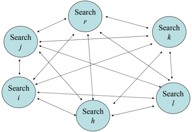

Communications may be undertaken either directly or indirectly. Strategies based on the evolutionary paradigm generally use direct communications. The population is divided into subsets, each assigned to a processor (alternatively, relatively small populations are generated for each processor), and a genetic algorithm runs on each. An individual population and genetic algorithm forms a so-called island . Each island may potentially communicate with any of the other islands, as illustrated in Figure 1. Then, according to an exchange protocol (e.g., on demand from an island with low population diversity), it sends a 'good' individual to another island. This exchange mechanism is called migration and the parallel strategy is known as coarse grained . Islands (processors) may also be allowed to communicate with a limited number of other islands (processors), as illustrated in Figure 2. Such limitations are generally the result of particular topologies of the processor network (e.g., hypercube, torus, and so on). Communications then take place only among adjacent processors according to a so-called diffusion mechanism. Notice that, in this case, islands tend to have very small populations and the strategy to be denoted fine grained . When populations are down to single individuals, the genetic operators are applied to individuals on adjacent islands.

Most cooperative multi-thread developments outside the evolutionary community are based on indirect communications and, currently, the largest number use some form of memory for inter-thread communications (the terms pool and solution warehouse are also used; due to the role assigned to the elements it contains, the terms 'reference' and 'elite set' are also sometimes used, while the artificial intelligence community uses a similar concept under the name 'blackboard'). The individual searches are generally assigned each to a processor, as illustrated in Figure 3. A search tread either heuristically constructs new solutions, or executes a neighborhood-based improving metaheuristic, or implements a population-based metaheuristic, or performs post-optimization procedures on solutions in the pool. Improving metaheuristics aggressively explore the search space, while population-based methods

Fig. 2. Diffusion Communication Scheme

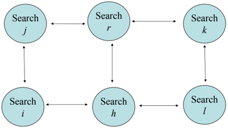

Fig. 3. Diffusion Communication Scheme

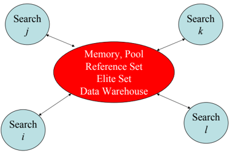

contribute toward increasing the diversity of solutions exchanged among the cooperating methods. When the same metaheuristic is used by several search threads, the initial solution and particular setting of a number of important search parameters differentiate each search thread from the others.

The cooperation aspect of the parallelization scheme is achieved through asynchronous exchanges of information through the pool (which could be assigned to a different processor or could share one with an individual search thread). Whenever a thread desires to send out information (e.g., when a new local optimum is identified), it sends it to the pool. Similarly, when a thread accesses outside information (to diversify the search, for example), it reaches out and takes it from the pool. Communications are initiated exclusively by the individual threads, irrespective of their role as senders or receivers of information. No broadcasting is taking place and there is no need for complex mechanisms to select the threads that will receive or send information and to control the cooperation. The solution warehouse is thus an efficient implementation device that allows for a strict asynchronous mode of exchange, with no predetermined connection pattern, where no process is interrupted by another for communication purposes, but where any thread may access at all times the data previously sent out by any other search thread.

The information exchanged among cooperating procedures has to be meaningful, in the sense that it has to be useful for the decision process of the receiving threads or the evolution of the shared data (and thus the evolution of the global search). Information indicative of the current status of the global search or, at least, of some individual search thread is, in this sense, meaningful. The information exchanged may be simply a 'good' solution, a solution and its context (e.g., memories recording recent behavior of solution attributes), or a comprehensive history search. Memories recording the performance of individual solutions, solution components, or even search threads may be added to the pool and statistics and guidance mechanisms may be gradually built.

Historically, two main classes of cooperation mechanisms are found in the literature, based on partial and complete solutions, respectively. Adaptive memory methods (Rochat and Taillard [71]) store partial elements of good solutions and combine them to create new complete solutions that are then improved by the cooperating threads. Central memory approaches exchange complete elite solutions among neighborhood and population-based metaheuristics (Crainic, Toulouse, and Gendreau [24], Crainic and Toulouse [23], Crainic [17]). The differences between the two approaches tend to become somewhat blurred, however.

A different approach to cooperation has been proposed recently by Toulouse, Thulasiraman, and Glover [78]. The mechanism is called multi-level cooperative search , belongs to the pC/KC with potentially any search differentiation strategy (the authors used MPSS), and is based on the principle of controlled diffusion of information. Each search thread works at a different level of aggregation of the original problem (one processor works on the original problem) and communicates exclusively with the processes working on the immediate higher and lower aggregation levels. Improved solutions are exchanged asynchronously at various moments dynamically determined by each process according to its own logic, status, and search history. Received solutions are used to modify the search at the receiving level. An incoming solution will not be transmitted further until a number of iterations have been performed, thus avoiding the uncontrolled diffusion of information. No application to vehicle routing problems has been proposed yet, but excellent results have been obtained for graph and hypergraph partitioning problems [57, 58], network design [20], feature selection in biomedical data [56], and covering design [28]. It all these cases, the proposed method is either the current best or is on the par with the best metaheuristics for the problem.

We complete this section with two notes. The first concerns the decomposition of the problem domain. Despite its interest when problem instance are very large, relatively few contributions can be found. For routing problems, Taillard [75] proposed a pC/KS/MPSS parallel tabu search where the domain was partitioned and vehicles were allocated to the resulting regions. Once the initial partition was performed, each subproblem was solved by an independent tabu search. All processors stopped after a number of iterations

that varied according to the total number of iterations already performed. The partition was then modified by an information exchange phase, during which tours, undelivered cities, and empty vehicles were exchanged between adjacent processors (corresponding to neighboring regions). At the time, this approach did allow to address successfully a number of problem instances, but the synchronization inherent in the design of the strategy hindered its performance, however. Clearly, more work is required on how to best combine domain decomposition and the other parallelization strategies, cooperation in particular. We report in the next section on some contributions that address this issue.

The second note is related to the so-called hybrid methods. The term is much used but its meaning varies widely. In a strict sense, all metaheuristics are hybrids since they involve at least two methods. Closer to most applications, a hybrid involves at least two methods that belong to different methodological approaches. Thus, for example, using genetic operators to control the temperature evolution in a parallel simulating annealing method yields a hybrid. Notice, however, that by this definition, all population-based methods that include an 'educational' component, that is, an enhancement of new solutions through a hill climbing, a local search, or even a full-blown metaheuristic, are hybrids. Most cooperative parallel strategies could be qualified as hybrids as well. Yet, since, other than 'more than one method is used', the term does not offer any fundamental insight into the design of parallel strategies for metaheuristics, we do not use it to qualify the contributions reviewed in this chapter.

## 5 Parallel Metaheuristics for the VRP

This section is dedicated to a review of recent parallel metaheuristic contributions to vehicle routing problems. 'Recent' means that we focus on the period since the change of millennium, except when the contribution is still of significant interest. The contributions are presented according to the VRP variant concerned.

## 5.1 The Vehicle Routing Problem

Drummond, Ochi, and Vianna [34, 35] (see also Ochi et al. [55]) proposed a pC/KS/MPSS coarse-grained parallel genetic algorithm based on the island model for the VRP with heterogeneous fleet. A petal decomposition procedure was used to build the initial population, which was then divided into several disjoint subpopulations. Each genetic thread evolved a subpopulation and triggered migration when subpopulation renewal was necessary. An island in this case would broadcast its need and receive the best individual of every other island. The incoming individuals would replace the worst individuals of

the receiving population. Computational tests showed encouraging results in terms of solution quality and computing effort.

Alba and Dorronsoro [2] addressed the VRP in which routes have to be limited by a predefined travel time and proposed a fine-grained, cellular parallel genetic algorithm. The population was arranged in a 2-dimensional toroidal grid, each individual having 4 neighbors. Binary tournament selection was applied when selecting the mate for the first parent. Crossover was applied for these parents, then mutation and local search for the offspring. Two local search procedures were tested, 2-opt and 2-opt+ λ -Interchange, with λ ∈ { 1 2 , } . Elitist replacement was used. The authors compared their algorithm to several heuristics, parallel or not: the tabu search of Rochat and Taillard [71], the genetic algorithms of Prins [62] and Berger and Barkaoui [8], the ant algorithms of Bullnheimer, Hartl, and Strauß[11] and Reimann, Doerner, and Hartl [69]. Computational results on benchmark problem instances showed high performance quality for both local search versions. Best performance (solution quality and rapidity) was observed for 2-opt+1-Interchange.

Jozefowiez, Semet, and Talbi [49, 36] addressed a vehicle routing problem in which the total length of routes is to be minimized, as well as the balance of route lengths, that is the difference between the maximal and minimal route lengths. The authors proposed an island method where each island had its own population and run the multi-objective pareto genetic algorithm NSGA II [29] enhanced with an elitist feature for greater diversity. The islands were organized into a ring network. Communications took place at regular intervals, determined by the number of iterations. Each island synchronously exchanged information with its two neighbors by sending its best solutions (the number of solutions was pre-defined) and receiving the best solutions of its neighbors. The imported solutions replaced the worst ones in the receiving population. Experiments on the Christofides, Mingozzi, and Toth problem instances [14] showed the parallel versions to outperform the sequential one, even though increasing the number of processors over the 4 to 8 range did not seem beneficial.

From a parallel computing point of view, ant-based methods may be viewed as a particular form of population-based methods, the ant colony being made up of a population of ants and the update of the pheromone matrix taking the place of the usual evolutionary operators. Parallel ant-based methods start to be proposed based on these ideas, some of which are dedicated to vehicle routing problems. Doerner et al. [31] (see also Doerner et al. [30] and Benkner et al. [7]) studied fine and coarse-grained 1C/KS/MPDS parallelizations with synchronous communications for their savings-based heuristic (Reimann, Stummer, and Doerner [70]). In the fine-grained approach, the ant colony was partitioned into small sub-colonies (the sparsely populated islands of parallel genetic algorithms) and the savings-based heuristic was executed on each. The same pheromone matrix was used for all sub-colonies, but was replicated to decrease communications. Once all ants found their solutions, the local best for each sub-colony was found. Best solutions were sent to a

'root' node, which determined the global best and an elite set of ants that were broadcasted back to the sub-colonies.

Two coarse-grained strategies were also studied. The first is a classical pC/RS/MPDS independent multi-colony approach. The second follows a pC/KS/MPDS cooperation scheme where several independent colonies communicate at regular intervals (pre-defined number of iterations). To speed up computations, a hierarchical strategy was used, in which a number of processors were allocated to each colony to implement the fine-grained parallelization described above. The authors compared several strategies with respect to shared information: the global-best solution, the global best solution plus the elite solutions, each of the first two data sets plus the re-initialization of the pheromone matrix, and the global-best solution plus the corresponding pheromone matrix. Experimentations were performed on the four largest problem instances of [14] (single depot, 150 or 199 customers, limits on vehicle capacity and tour length (2 problems), zero service time at all customers) and on four of the largest problem instances of [44] (single depot, between 320 or 480 customers, various customer distributions). Two colonies were used for the experiments.

Computational results showed, yet again, the cooperative strategy outperforming the independent search method. The comparison of the informationsharing strategies also showed that the knowledge relative to parallel metaheuristics accumulated in the last ten years is equally valid when the parallelization of ant-colony methods is concerned. Thus, sharing the elitist solutions outperformed the strategy where only the global best was shared. Further improvements were obtained by also re-initializing the pheromone matrix. On the other hand, broadcasting the pheromone matrix of the best performing sub-colony (the one that identified the current global best solution) was detrimental to performance due to the premature 'convergence' of the dynamic process. As for the fine-grained strategy, as expected, intensive communications were required to keep the pheromone matrix up to date. This makes the approach not really suitable when the number of processors (and ants) increases, but may contribute to hierarchical approaches.

In the same paper [31] (see also Doerner, Hartl, and Lucka [32]), the authors examined a parallelization of their D-Ants algorithm (Reimann, Doerner, and Hartl [69]), which applies the domain-decomposition ideas of Taillard [75] to the savings-based heuristic (Reimann, Stummer, and Doerner [70]) significantly improving its performance. A hierarchical coarse-grained approach similar to that described previously was proposed. Two or four subproblems were defined, and the parallel savings algorithm was used on each, thus implementing the fine-grained parallel strategy described previously. In all their developments, the authors aimed for parallel strategies that sped up computations but did not change the behavior of the corresponding method. Strict synchronization communication schemes were imposed to this effect. Consequently, in all experiments, solution quality was sensibly the same and moderate speed ups were observed. To conclude, the authors point out to the

need to develop more sophisticated parallel strategies based on asynchronous cooperation mechanisms.

## 5.2 Vehicle Routing with Time Constraints

Also known as the Vehicle Routing Problem with Time Windows ( VRPTW ), this problem specifies that service at customer sites must take place within given time intervals. Most time constraints specify that service cannot begin before a certain moment (but vehicles may wait 'outside', in most cases) and must be over by a given deadline. In soft-constrained versions, the time limits may be violated at a penalty.

Czech and Czarnas [27] proposed a pC/KS/MPSS cooperative multithread parallel simulated annealing implemented on a master-slave platform. The master sent the initial solution to the salves. It was also in charge of controlling the annealing temperature schedule, collecting the best local solution from each slave after n 2 iterations for each temperature level ( n was the number of customers) and updating the global best solution. Each slave run a simulated annealing algorithm with the same parameters. Each slave j cooperated with slaves j -1 and j + 1 (slave 1 cooperated with slave 2 only) by exchanging best solutions. Cooperation was triggered every n iterations. Computational tests with few (five) processors showed good performance, in terms of solution quality, compared to the best-known solutions of the Solomon benchmarks.

Berger and Berkaoui [9] presented a low-level parallel hybrid genetic method that used two population. The first aimed to minimize the total traveled distance, while the second aimed to minimize the violation of the time window constraints. A different fitness function was associated with each population. A master-slave platform was applied, where the master controlled the execution of the algorithm and coordinated the genetic operations. The slave concurrently executed the reproduction and mutation operators. Computational tests were conducted on a cluster of heterogeneous machines (19 computers). The authors compared their algorithm to the best-known methods in the literature for Solomon's benchmark. Their results showed that the proposed technique was very competitive.

Polacek et al. [60] focused on parallel algorithms for the multi-depot VRPTW, starting from a Variable Neighborhood Search (VNS) metaheuristic proposed earlier on [61]. The authors studied two approaches, both based on cooperation and asynchronous exchanges through a central memory. The first approach implemented full VNS threads, each searching through a limited number of neighborhoods. The VNS threads collaborated through exchanges of best solutions via the central memory. Each VNS sent its best solutions. When the overall best was improved, it was broadcasted to all. In the second approach, the VNS threads sent their best solutions to the central memory (functioning as a 'master') at regular intervals (number of iterations). The objective was to reproduce the behavior of the sequential method only faster.

Performance was good, best known solutions being reached or improved. The first, full cooperation methods performed best due, in particular, to its higher adaptability to the problem instance.

Gehring and Homberger [38, 39] proposed a pC/KS/MPDS cooperative parallel strategy where concurrent searches were performed with differently configured two-phase metaheuristics. The first phase tried to minimize the number of vehicles by using an evolutionary metaheuristic, while the second phase aimed to minimize the total traveled distance by means of a tabu search. The parallel metaheuristic was initiated on different threads with different starting points and values for the search time available for the first and second search phases. Threads cooperated by exchanging solutions asynchronously through a 'master' process according to the central-memory concept. Notice that this is different from most evolutionary-based parallel metaheuristics proposed in the literature. For now, this approach has produced, on average, the best solutions for the Solomon problems with respect to, first, the number of vehicles and, second, the total distance. Results were also presented on larger instances, generated similarly to the original Solomon problems, but varying in size from 200 to 1000 customers. It is worth mentioning, however, that this method is rather time consuming compared to other metaheuristics, tabu search in particular.

Rochat and Taillard [71] proposed what may be considered as the first fully developed adaptive memory-based approach for the VRPTW. The adaptive memory contained tours of good solutions identified by the tabu search threads. The tours were ranked according to attribute values, including the objective values of their respective solutions. Each tabu search process then probabilistically selected tours in the memory, constructed an initial solution, improved it, and returned the corresponding tours to the adaptive memory. Despite the fact that it used a rather simple tabu search, this method produced many new best results at publication time. Taillard et al. [76] and Badeau et al. [5] refined this method by enriching the neighborhood and the intensification phase and by adding a post-optimization procedure. A similar approach was used with good results by Schulze and Fahle [72]. The routes generated by the tabu search threads were collected in a pool, and were recombined by solving a set covering heuristic whenever a new solution was needed. Badeau et al. [5] also reported that their method run significantly faster when using more search processes than the number of available processors, because this allowed to overcome the bottlenecks created when several threads attempted to access the memory simultaneously. Furthermore, computational evidence showed that running a search thread concurrently with the adaptive memory management procedure on the same processor was not a good idea, because it contributed to block the access to the memory.

Le Bouthiller and Crainic [50] and Le Bouthiller, Crainic, and Kropf [51] aimed to study central memory cooperative mechanisms enhanced with strategies to guide the global search. Le Bouthiller and Crainic proposed a central memory pC/KS/MPDS cooperative parallel method for the VRPTW based

Fig. 4. Central Memory with Guidance for the VRPTW

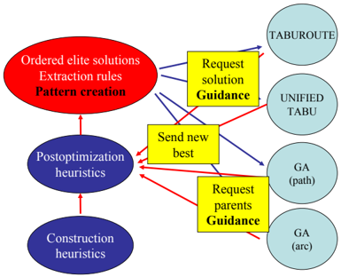

on the mechanism presented at Section 4 and illustrated in Figure 4. The cooperation involved two tabu search methods that perform well sequentially, the Unified Tabu of Cordeau, Laporte, and Mercier [15] and Taburoute of Gendreau, Hertz, and Laporte [41], two simple evolutionary algorithms with order and edge recombination crossovers, respectively, as well as a number of post-optimization methods (2-opt, 3-opt, or-opt, and ejection chains) that were used to reduce the number of vehicles and the total traveled distance. Four simple construction algorithms were used to provide initial solutions to the population. The threads shared information about their respective good solutions identified so far. When a thread improved the solution, it sent it to the post-optimization algorithms present in the central memory. These solutions were considered in-training until they were post-optimized and identified as adult solutions. The pool of solutions formed an elite population from which the independent procedures required solutions when needed. The Unified Tabu requested a new solution at regular intervals, while Taburoute did so at diversification time. The adult solutions in memory formed the population for the genetic operators. This algorithm, without any calibration or tailoring, proved to be competitive with the best metaheuristics of its day.

The goal of Le Bouthiller, Crainic, and Kropf [51] was to improve upon this simple cooperating scheme by extracting new knowledge from the information exchanged, in order to guide the individual threads and, hopefully, yield a more efficient global search. Moreover, the authors aimed for a guidance mechanism independent of particular features of the problem class at hand, such as the routes in vehicle routing problems. They selected therefore to work with one of the atomic elements of the problem: the arc.

The basic idea was that an arc that appears often in good solutions and less frequently in bad solutions may be worthy of inclusion in a tentative solution, and vice versa. To implement this idea, the authors considered the

frequency of inclusion of arcs in three subsets of solutions in the pool, the elite (e.g., the 10% best), average (between the 10% and 90% best), and worst (the last 10%) groups of solutions. An arc with a high frequency in a given group signals that the metaheuristics participating to the cooperation have often produced solutions that include that arc. Patterns of arcs were then defined, representing subsets of arcs with similar frequency of inclusion or not in particular population groups. Guidance was obtained by transmitting arc patterns to the individual threads indicating whether the arcs in the pattern should be 'fixed' to intensify the search or, on the contrary, they should be prohibited to diversify the search ('fix' and 'prohibit' were performed by using the patters to bias the selection of arcs during moves or reproduction). The computing time allocated to the cooperative method was divided into four phases: Two phases of diversification at the beginning to broaden the search, followed by two intensification phases to focus the search around promising regions. Figure 4 illustrates the flow of information and guidance indications.

Experiments were carried out on the standard set of 100-customer test problems proposed by Solomon [74], as well as on the extended set produced by Homberger and Gehring [48] with 300 problem instances that vary from 200 to 1000 customers. Runs of 12 min wall-clock time were performed by the cooperative metaheuristic for each of the 100 city problems. Longer running times, equal to those reported by Homberger and Gehring were allowed for the larger problem instances. These times go up to 50 min wall-clock time for the 1000-city problem. Comparisons were carried on with the best performing methods and the results were very good. In linear speed up and without any calibration, the guided cooperative search was globally performing on a par with the best. This is very encouraging, because patterns of attributes may be constructed for many problem classes, independently of particular solution structures.

## 5.3 Dynamic Problems

Gendreau, Laporte, and Semet [42] addressed the deployment problem for a fleet of emergency vehicles and proposed a 1C/KS/MPSS parallel tabu search method based on domain decomposition. In this problem, when a call is received, an ambulance is assigned to it according to relatively simple dispatching rules. Then, the remaining available ambulances can be relocated to other waiting sites to provide a better coverage of the expected demand. The parallel algorithm was based on a pure master-slave scheme. The master managed global data structures with pre-calculated information on each ambulance and sent the relocation problems to the slaves. The time allotted to slaves was controlled by fixing the number of iterations in the tabu search. Computational tests showed high solution quality as indicated by territory coverage measures.

Attanasio et al. [3] addressed the multi-vehicle dial-a-ride-problem and proposed multi-thread tabu search parallel strategies following pC/KS/SPDS and pC/KS/MPSS frameworks. In the former, each processor run a different

tabu search strategy from the same initial solution. Once a processor found a new best solution, it broadcast it. Re-initialized searches were then launched. Every κ iterations, a diversification procedure was applied to the first half of the processors, while an intensification was run on the remaining half. The pC/KS/MPSS strategy consisted in running a tabu search algorithm from different starting points. Each processor run the same tabu search algorithm with the best known parameter settings. Every η iterations, processors exchanged information in order to perform a diversification procedure. According to the computational results, both strategies outperformed the sequential tabu search of Cordeau and Laporte [16].

Gendreau et al. [40] proposed a cooperative multi-thread parallel tabu search method for real-time routing and vehicle dispatching problems. The problem was motivated by courier services where customer requests for the transportation of small items must be accommodated in real-time and incorporated into the current planned routes of a fleet of vehicles. Due to the presence of soft time constraints for servicing a customer, the problem was modeled as an Uncapacitated Vehicle Routing Problem with Soft Time Windows. The objective function to be minimized related to the total distance traveled (or total travel time) for servicing the customers plus penalties for lateness at customer locations. The authors followed the cooperative adaptive memory approach championed by Taillard et al. [76] and Badeau et al. [5]. The dynamic problem was addressed as a series of static problems, a new one being defined each time a new request was received. A two-level parallelization scheme was proposed to implement this problem-solving framework. At the first level, a pC/KC/MPSS cooperating adaptive memory scheme was implemented. At the second level, each individual tabu search thread benefited of the work of several slave processors and the route decomposition of Taillard [75] was implemented. The results showed that the proposed procedure provides substantial benefits over simpler dispatching approaches.

## 6 Perspectives

We have presented a survey of exact and parallel metaheuristic methods applied to vehicle routing problems. Also not necessarily comprehensive, it includes the major contributions and trends in the field, most of which have been proposed from 2000 onwards.

We found few contributions to parallel exact methods for VRP and variants. The proposed branch-and-price parallelization schemes are not very sophisticated yet, but we expect them to represent initial steps on what promises to be a very fruitful research road.

The parallel metaheuristic field is much richer, of course, as illustrated by he number of contributions and by the increasing variety of the methodologies used. This richness notwithstanding, the survey points out that not all VRP variants have been addressed with comparable fervor. Indeed, many

important topics have seen only a few of contributions, if at all. Moreover, even for topics for which the number of contributions is larger, these are not evenly distributed among metaheuristic classes. Interesting research avenues and promising developments may thus go unexplored, and appropriate tools may be missing in some areas. It should be a challenge of the profession to explore as comprehensively as possible as many problem variants, search methodologies, and parallelization strategies as possible. While taking up this challenge, one should make sure that methods are compared across methodological approaches and that such comparisons are performed fairly, that is, all algorithmic developments are at the same level of sophistication.

To sum up the observations relative to parallel metaheuristics it appears that methods based on asynchronous cooperation mechanisms display the most interesting performance, independently of the methodology used in the initial sequential method. This conclusion is strongly supported by the results obtained by multi-thread cooperative strategies. It also appears that one can build simple but meaningful statistics and indicators to learn from the solutions already explored and to globally guide the search. This research direction is at the very beginning but should yield interesting results.

To conclude, parallel exact and metaheuristic solution methods offer versatile, robust, and powerful tools to address large and complex vehicle routing problems. Many fascinating research avenues are still open for investigation, however. Other than those indicated above, we may mention applying more sophisticated branch-and-bound parallelization strategies to VRP variants, studying cooperation mechanisms based on multi-level concepts, combining branch-and-bound and metaheuristic threads within a cooperative search framework, developing enhanced guidance mechanisms, and applying these solution methods to new problem classes. We hope that this chapter has contributed to illustrate these opportunities and challenges.

## Acknowledgement

Funding for this project has been provided by the Natural Sciences and Engineering Council of Canada. The author wishes to thank three anonymous referees. Their comments have contributed to make a better chapter.

## References

- 1. Alba, E., editor. Parallel Metaheuristics. A New Class of Algorithms . John Wiley &amp; Sons, Hoboken, NJ, 2005.
- 2. Alba, E. and Dorronsoro, B. Solving the Vehicle Routing Problem by Using Cellular Genetic Algorithms. In Gottlieb, J. and G¨nther, R.R., editors, u Evolutionary Computation in Combinatorial Optimization, 4th European Conference, EvoCOP 2004, Coimbra, Portugal, April 5-7, 2004 , volume 3004 of Lecture Notes in Computer Science , pages 11-20. Springer-Verlag, Heidelberg, 2004.

- 3. Attanasio, A., Cordeau, J.F., Ghiani, G., and Laporte, G. Parallel Tabu Search Heuristics for the Dynamic Multi-Vehicle Dial-a-ride Problem. Parallel Computing , 30:377-387, 2004.
- 4. Azencott, R. Simulated Annealing Parallelization Techniques . John Wiley &amp; Sons, New York, NY, 1992.
- 5. Badeau, P., Gendreau, M., Guertin, F., Potvin, J.-Y., and Taillard, ´ .D. E A Parallel Tabu Search Heuristic for the Vehicle Routing Problem with Time Windows. Transportation Research C: Emerging Technologies , 5(2):109-122, 1997.
- 6. Barr, R.S. and Hickman, B.L. Reporting Computational Experiments with Parallel Algorithms: Issues, Measures, and Experts Opinions. ORSA Journal on Computing , 5(1):2-18, 1993.
- 7. Benkner, S., Doerner, K., Hartl, R.F., Kiechle, G., and Lucka, M. Communication Strategies for Parallel Cooperative Ant Colony Optimization on Clusters and Grids. In Complimentary Proceedings of PARA04 , pages 3-12, 2004.
- 8. Berger, J. and Barkaoui, M. Hybrid Genetic Algorithm for the Capacitated Vehicle Routing Problem. In Cant´-Paz, E., Foster, J.A., Deb, K., Davis, L., Roy, R., u O'Reilly, U.-M., Beyer, H.-G., Standish, R.K., Kendal, G., Wilson, S.W., Harman, M., Wegener, J., Dasgupta, D., Potter, M.A., Schultz, A.C., Dowsland, K.A., Jonoska. N., and Miller, J.F., editors, Genetic and Evolutionary Computation -GECCO 2003, Genetic and Evolutionay Computation Conference, Chicago, IL, USA, July 12-16, 2003, Proceedings, Part I , volume 2723 of Lecture Notes in Computer Science , pages 646-656. Springer-Verlag, Heidelberg, 2003.
- 9. Berger, J. and Barkaoui, M. A Parallel Hybrid Genetic Algorithm for the Vehicle Routing Problem with Time Windows. Computers &amp; Operations Research , 31(12):2037-2053, 2004.
- 10. Bertsekas, D.P. and Tsitsiklis, J.N. Parallel and Distributed Computation, Numerical Methods . Prentice-Hall, Englewood Cliffs, NJ, 1989.
- 11. Bullnheimer, B., Hartl, R., and Strauß, C. An Improved Ant System Algorithm for the Vehicle Routing Problem. Annals of Operations Research , 89:319-328, 1999.
- 12. Bullnheimer, B., Kotsis, G., and Strauß, C. Parallelization Strategies for the Ant System. Applied Optimization , 24:87-100, 1998.
- 13. Cant´-Paz, E. A Survey of Parallel Genetic Algorithms. u Calculateurs Parall`les, e R´ eseaux et Syst`mes r´partis e e , 10(2):141-170, 1998.
- 14. Christofides, N., Mingozzi A., and Toth, P. The Vehicle Routing Problem. In N. Christofides, Mingozzi A., P. Toth, and C. Sandi, editors, Combinatorial Optimization , pages 315-338. John Wiley, New York, 1979.
- 15. Cordeau, J.-F., Laporte, G., and Mercier, A. A Unified Tabu Search Heuristic for Vehicle Routing Problems with Time Windows. Journal of the Operational Research Society , 52:928-936, 2001.
- 16. Cordeau, J.F. and G. Laporte, G. A Tabu Search Heuristics for the Static Multivehicle Dial-a-ride Problem. Transportation Research Part B , pages 579-594, 2003.
- 17. Crainic, T.G. Parallel Computation, Co-operation, Tabu Search. In C. Rego and B. Alidaee, editors, Metaheuristic Optimization Via Memory and Evolution: Tabu Search and Scatter Search , pages 283-302. Kluwer Academic Publishers, Norwell, MA, 2005.

- 18. Crainic, T.G., Gendreau, M., and Potvin, J.-Y. Parallel Tabu Search. In Alba, E., editor, Parallel Metaheuristics , pages 298-313. John Wiley &amp; Sons, Hoboken, NJ, 2005.
- 19. Crainic, T.G., Le Cun, B., and Roucairol, C. Parallel Branch and Bound Algorithms. In EL-Ghazali Talbi, editor, Parallel Combinatorial Optimization , pages 1-28. John Wiley &amp; Sons, New York, 2006.
- 20. Crainic, T.G., Li, Y., and Toulouse, M. A First Multilevel Cooperative Algorithm for the Capacitated Multicommodity Network Design. Computers &amp; Operations Research , 33(9):2602-2622, 2006.
- 21. Crainic, T.G. and Nourredine, H. Parallel Meta-Heuristics Applications. In Alba, E., editor, Parallel Metaheuristics , pages 447-494. John Wiley &amp; Sons, Hoboken, NJ, 2005.
- 22. Crainic, T.G. and Toulouse, M. Parallel Metaheuristics. In T.G. Crainic and G. Laporte, editors, Fleet Management and Logistics , pages 205-251. Kluwer Academic Publishers, Norwell, MA, 1998.
- 23. Crainic, T.G. and Toulouse, M. Parallel Strategies for Meta-heuristics. In F. Glover and G. Kochenberger, editors, Handbook in Metaheuristics , pages 475513. Kluwer Academic Publishers, Norwell, MA, 2003.
- 24. Crainic, T.G., Toulouse, M., and Gendreau, M. Parallel Asynchronous Tabu Search for Multicommodity Location-Allocation with Balancing Requirements. Annals of Operations Research , 63:277-299, 1995.
- 25. Crainic, T.G., Toulouse, M., and Gendreau, M. Towards a Taxonomy of Parallel Tabu Search Algorithms. INFORMS Journal on Computing , 9(1):61-72, 1997.
- 26. Cung, V.-D., Martins, S.L., Ribeiro, C.C., and Roucairol, C. Strategies for the Parallel Implementations of Metaheuristics. In C.C. Ribeiro and P. Hansen, editors, Essays and Surveys in Metaheuristics , pages 263-308. Kluwer Academic Publishers, Norwell, MA, 2002.
- 27. Czech, Z.J. and Czarnas, P. Parallel Simulated Annealing for the Vehicle Routing Problem with Time Windows. In 10th Euromicro Workshop on Parallel, Distributed and Network-based Processing , pages 376-383, 2002.
- 28. Dai, C., Li, B., and Toulouse, M. A Multilevel Cooperative Tabu Search Algorithm for the Covering Design Problem. Journal of Combinatorial Mathematics and Combinatorial Computing , 2007.
- 29. Deb, K., Pratab, A., Agrawal, S., and Meyarivan, T. A Fast and Elitist Multiobjective Genetic Algorithm: NSGA-II. IEEE Transactions on Evolutionary Computation , 6(2):182-197, 2002.
- 30. Doerner, K., Hartl, R.F., Kiechle, G., Lucka, M., and Reimann, M. Parallel Ant Systems for the Capacitated Vehicle Routing Problem. In Gottlieb, J. and Raidl, G.R., editors, Evolutionary Computation in Combinatorial Optimization: 4th European Conference, EvoCOP 2004, Proceedings , volume 3004 of Lecture Notes in Computer Science , pages 72-83. Springer-Verlag, Berlin, 2004.
- 31. Doerner, K.F., Hartl, R.F., Benkner, S., and Lucka, M. Cooperative Savings based Ant Colony Optimization - Multiple Search and Decomposition Approaches. Parallel Processing Letters , 16(3):351-369, 2006.
- 32. Doerner, K.F., Hartl, R.F., and Lucka, M. A Parallel Version of the D-Ant Algorithm for the Vehicle Routing Problem. In Vajtersic, M., Trobec, R., Zinterhof, P., and Uhl, A., editors, Parallel Numerics '05 , pages 109-118. Springer-Verlag, New York, NY, 2005.
- 33. Dorigo, M. and Stuetzle, T. The Ant Colony Metaheuristic. Algorithms, Applications, and Advances. In F. Glover and G. Kochenberger, editors, Handbook

- in Metaheuristics , pages 251-285. Kluwer Academic Publishers, Norwell, MA, 2003.
- 34. Drummond, L.M.A., Ochi, L.S., and Vianna, D.S. A Parallel Hybrid Evolutionary Metaheuristic for the Period Vehicle Routing Problem. In Rolin, J., editor, International Workshop on Formal Methods for Parallel Programming: Theory and Applications (FMPPTA'99) , volume 1586 of Lecture Notes in Computer Science , pages 183-191. Springer-Verlag, Heidelberg, 1999.
- 35. Drummond, L.M.A., Ochi, L.S., and Vianna, D.S. An Asynchronous Parallel Metaheuristic for the Period Vehicle Routing Problem. Future Generation Computer Systems , 17(4):379-386, 2001.
- 36. E.-G. Talbi et al., editor. Parallel and Hybrid Models for Multi-objective Optimization: Application to the Vehicle Routing Problem , volume 2871 of Lecture Notes in Computer Science . Springer-Verlag, Berlin, 2006.
- 37. Garcia, B.L., Potvin, J.-Y., and Rousseau, J.M. A Parallel Implementation of the Tabu Search Heuristic for Vehicle Routing Problems with Time Window Constraints. Computers &amp; Operations Research , 21(9):1025-1033, 1994.
- 38. Gehring, H. and Homberger, J. A Parallel Two-Phase Metaheuristic for Routing Problems with Time Windows. Asia-Pacific Journal of Operational Research , 18(1):35-47, 2001.
- 39. Gehring, H. and Homberger, J. Parallelization of a Two-Phase Metaheuristic for Routing Problems with Time Windows. Journal of Heuristics , 8:251-276, 2002.
- 40. Gendreau, M., Guertin, F., Potvin, J.-Y., and Taillard, E.D. ´ Tabu Search for Real-Time Vehicle Routing and Dispatching. Transportation Science , 33(4):381390, 1999.
- 41. Gendreau, M., Hertz, A., and Laporte, G. A Tabu Search Heuristic for the Vehicle Routing Problem. Management Science , 40:1276-1290, 1994.
- 42. Gendreau, M., Laporte , G., and Semet, F. A Dynamic Model and Parallel Tabu Search Heuristic for Real-time Ambulance Relocation. Parallel Computing , 27(12):1641-1653, 2001.
- 43. Glover, F. and Laguna, M. Tabu Search . Kluwer Academic Publishers, Norwell, MA, 1997.
- 44. Golden, B.L., Wasil, E.A., Kelly, J.P., and Chao, I.M. Metaheuristics in Vehicle Routing. In T.G. Crainic and G. Laporte, editors, Fleet Management and Logistics , pages 33-56. Kluwer Academic Publishers, Norwell, MA, 1998.
- 45. Greening, D.R. Asynchronous Parallel Simulated Annealing. Lectures in Complex Systems , 3:497-505, 1990.
- 46. Greening, D.R. Parallel Simulated Annealing Techniques. Physica D , 42:293306, 1990.
- 47. Holmqvist, K., Migdalas, A., and Pardalos, P.M. Parallelized Heuristics for Combinatorial Search. In A. Migdalas, P.M. Pardalos, and S. Storoy, editors, Parallel Computing in Optimization , pages 269-294. Kluwer Academic Publishers, Norwell, MA, 1997.
- 48. Homberger, J. and Gehring, H. Two Evolutionary Metaheuristics for the Vehicle Routing Problem with Time Windows. INFOR , 37:297-318, 1999.
- 49. J.M. Guervos et al., editor. Parallel and Hybrid Models for Multi-objective Optimization: Application to the Vehicle Routing Problem , volume 2439 of Lecture Notes in Computer Science . Springer-Verlag, Berlin, 2002.

- 50. Le Bouthillier, A. and Crainic, T.G. A Cooperative Parallel Meta-Heuristic for the Vehicle Routing Problem with Time Windows. Computers &amp; Operations Research , 32(7):1685-1708, 2005.
- 51. Le Bouthillier, A., Crainic, T.G., and Kropf, P. Towards a Guided Cooperative Search. Publication CRT-05-09, Centre de recherche sur les transports, Universit´ de Montr´al, Montr´al, QC, Canada, 2005. e e e
- 52. Lin, S.-C., Punch, W., and Goodman, E. Coarse-Grain Parallel Genetic Algorithms: Categorization and New Approach. In Sixth IEEE Symposium on Parallel and Distributed Processing , pages 28-37. IEEE Computer Society Press, 1994.
- 53. Moreno-P´ erez, J.A., Hansen, P., and Mladenovi´, N. c Parallel Variable Neighborhood Search. In Alba, E., editor, Parallel Metaheuristics , pages 247-266. John Wiley &amp; Sons, Hoboken, NJ, 2005.
- 54. M¨ uhlenbein, H. Parallel Genetic Algorithms in Combinatorial Optimization. In O. Balci, R. Sharda, and S. Zenios, editors, Computer Science and Operations Research: New Developments in their Interface , pages 441-456. Pergamon Press, New York, NY, 1992.
- 55. Ochi, L.S., Vianna, D.S., Drummond, L.M.A., and Victor, A.O. A Parallel Evolutionary Algorithm for the Vehicle Routing Problem with Heterogeneous Fleet. Future Generation Computer Systems , 14(3):285-292, 1998.
- 56. Oduntan, I.O., Toulouse, M., Baumgartner, R., Somorjai, R., and Crainic, T.G. A Multilevel Tabu Search Algorithm for the Feature Selection Problem in Biomedical Data Sets. Computers &amp; Mathematics with Applications , 2006.
- 57. Ouyang, M., Toulouse, M., Thulasiraman, K., Glover, F., and Deogun, J.S. Multi-Level Cooperative Search: Application to the Netlist/Hypergraph Partitioning Problem. In Proceedings of International Symposium on Physical Design , pages 192-198. ACM Press, 2000.
- 58. Ouyang, M., Toulouse, M., Thulasiraman, K., Glover, F., and Deogun, J.S. Multilevel Cooperative Search for the Circuit/Hypergraph Partitioning Problem. IEEE Transactions on Computer-Aided Design , 21(6):685-693, 2002.
- 59. Pardalos, P.M., L. Pitsoulis, T. Mavridou, and Resende, M.G.C. Parallel Search for Combinatorial Optimization: Genetic Algorithms, Simulated Annealing, Tabu Search and GRASP. In A. Ferreira and J. Rolim, editors, Proceedings of Workshop on Parallel Algorithms for Irregularly Structured Problems, Lecture Notes in Computer Science , volume 980, pages 317-331. Springer-Verlag, Berlin, 1995.
- 60. Polacek, M., Benkner, S., Doerner, K.F., and Hartl, R.F. A Cooperative and Adaptive Variable Neighborhood Search for the Multi Depot Vehicle Routing Problem with Time Windows. Working paper, Institute of Management Science, University of Vienna, Vienna, Austria, 2006.
- 61. Polacek, M., Hartl, R.F., , Doerner, K.F., and Reimann, M. A Variable Neighborhood Search for the Multi Depot Vehicle Routing Problem with Time Windows. Journal of Heuristics , 10(6):613-627, 2004.
- 62. Prins, C. A Simple and Effective Evolutionary Algorithm for the Vehicle Routing Problem. Computers &amp; Operations Research , 31(12):1985-2002, 2004.
- 63. T.K. Ralphs. Parallel Branch and Cut Algorithms. In E.-G. Talbi, editor, Parallel Combinatorial Optimization , pages 53-101. Wiley-Interscience, Wiley &amp; Sons, Hoboken, NJ, 2006.
- 64. Ralphs, T.K. Parallel Branch and Cut for Capacitated Vehicle Routing. Parallel Computing , 29:607-629, 2003.

- 65. Ralphs, T.K., L. Lad´ny, and Saltzman, M.J. Parallel Branch, Cut, and Price for a Large-Scale Discrete Optimization. Mathematical Programming , 98(1-3):253280, 2003.
- 66. Ralphs, T.K., L. Lad´ny, and Saltzman, M.J. a A Library Hierarchy for Implementing Scalable Parallel Search Algorithms. Journal of Parallel and Distributed Computing , 37:207-212, 2004.
- 67. Ram, D.J., Sreenivas, T.H., and Subramaniam, K.G. Parallel Simulated Annealing Algorithms. Journal of Parallel and Distributed Computing , 37:207-212, 1996.
- 68. Rego, C. and Roucairol, C. A Parallel Tabu Search Algorithm Using Ejection Chains for the VRP. In I.H. Osman and J.P. Kelly, editors, Meta-Heuristics: Theory &amp; Applications , pages 253-295. Kluwer Academic Publishers, Norwell, MA, 1996.
- 69. Reimann, M., Doerner, K., and Hartl, R. D-Ants: Savings Based Ants Divide and Conquer the Vehicle Routing Problem. Computers &amp; Operations Research , 31(4):563-591, 2004.
- 70. Reimann, M., Stummer, M., and Doerner, K. A Savings Based Ants System for the Vehicle Routing Problem. In Langton, C., Cant´-Paz, u E., Mathias, K.E., Roy, R., Davis, L., Poli, R., Balakrishnan, K., Honavar, V., Rudolph, G., Wegener, J., Bull, L., Potter, M.A., Schultz, A.C., Miller, J.F., Burke, E.K., and Jonoska. N., editors, GECCO 2002: Proceedings of the Genetic and Evolutionary Computation Conference, New York, USA, July 9-13, 2002 , pages 1317-1326. Morgan Kaufmann Publishers, Inc., San Francisco, CA, 2002.
- 71. Rochat, Y. and Taillard, E.D. ´ Probabilistic Diversification and Intensification in Local Search for Vehicle Routing. Journal of Heuristics , 1(1):147-167, 1995.
- 72. Schulze, J. and Fahle, T. A Parallel Algorithm for the Vehicle Routing Problem with Time Window Constraints. Annals of Operations Research , 86:585-607, 1999.
- 73. Shonkwiler, R. Parallel Genetic Algorithms. In S. Forrest, editor, Proceedings of the Fifth International Conference on Genetic Algorithms , pages 199-205. Morgan Kaufmann, San Mateo, CA, 1993.
- 74. Solomon, M.M. Time Window Constrained Routing and Scheduling Problems. Operations Research , 35(2):254-265, 1987.
- 75. Taillard, E.D. Parallel Iterative Search Methods for Vehicle Routing Problems. ´ Networks , 23:661-673, 1993.
- 76. Taillard, E.D., Badeau, P., Gendreau, M., Guertin, F., and Potvin, J.-Y. A Tabu ´ Search Heuristic for the Vehicle Routing Problem with Soft Time Windows. Transportation Science , 31(2):170-186, 1997.
- 77. Talbi, E.-G., editor. Parallel Combinatorial Optimization . Wiley-Interscience, Wiley &amp; Sons, Hoboken, NJ, 2006.
- 78. Toulouse, M., Thulasiraman, K., and Glover, F. Multi-Level Cooperative Search: A New Paradigm for Combinatorial Optimization and an Application to Graph Partitioning. In P. Amestoy, P. Berger, M. Dayd´, I. Duff, V. Frayss´, L. Giraud, e e and D. Ruiz, editors, 5th International Euro-Par Parallel Processing Conference , volume 1685 of Lecture Notes in Computer Science , pages 533-542. SpringerVerlag, Heidelberg, 1999.
- 79. Verhoeven, M.G.A. and Aarts, E.H.L. Parallel Local Search. Journal of Heuristics , 1(1):43-65, 1995.

- 80. Voß, S. Tabu Search: Applications and Prospects. In D.-Z. Du and P.M. Pardalos, editors, Network Optimization Problems , pages 333-353. World Scientific Publishing Co., Singapore, 1993.

## Recent Developments in Dynamic Vehicle Routing Systems

Allan Larsen , Oli B.G. Madsen , and Marius M. Solomon 1 1 2

1 Centre for Traffic and Transport The Technical University of Denmark DK-2800 Kongens Lyngby, Denmark ala@ctt.dtu.dk, ogm@ctt.dtu.dk

2 College of Business Administration Department of Information, Operations and Analysis Northeastern University Boston, Massachusetts 02115

m.solomon@neu.edu

Summary. This chapter examines the evolution of research on dynamic vehicle routing problems (DVRP). We define the DVRP and show how it is different from the traditional static vehicle routing problem. We then illustrate the technological environment required. Next, we discuss important characteristics of the problem, including the degree of dynamism, elements relevant for the system objective, and evaluation methods for the performance of algorithms.The chapter then summarizes research prior to 2000 and focuses on developments from 2000 to present. Finally, we offer our conclusions and suggest directions for future research.

Key words: Networks; transportation; dynamic vehicle routing problems.

## 1 Introduction

Supply chains have become a competitive weapon in the global economy. The remarkable advances in telecommunications and information technology have enabled companies to focus on velocity and timeliness throughout the supply chain. To achieve these competitive advantages, they must be able to make effective use of the vast amount of real-time information now available to them. The Dynamic Vehicle Routing Problem (DVRP) is a prime example of a distribution context where intelligent use of real-time information can differentiate one company from another by means of superior on-time service.

The DVRP is the dynamic counterpart of the generic vehicle routing problem (VRP). In the latter problem the objective is generally to minimize the travel cost for several vehicles that must visit and service a number of

customers. Constraints specifying capacity restrictions, time windows within which to start service at customers, and additional requirements on the drivers and vehicles restrict the optimization space. In the VRP all routing and demand information is known with certainty prior to the day of operations, so routes can be planned ahead. In contrast, in the DVRP part or all of the necessary information becomes available only during the day of operation. In other words, not all information relevant to the planning of the routes is known by the planner when the routing process begins and information can change after the initial routes have been constructed.

The practical significance of the DVRP is highlighted by the variety of environments it can model. An important application is the pickup and delivery of overnight mail. Other scenarios include the distribution of heating oil or liquid gas to private households, residential utility repair services, such as cable and telephone, and appliance repair. Additional settings are the transportation of the elderly and physically disabled, taxi cab services, and emergency services, such as police, fire, and ambulance dispatching.

This chapter is organized as follows. In section 2 we illustrate the technological environment required for the DVRP. Next, section 3 discusses different characteristics of the DVRP, including the degree of dynamism, elements relevant for the system objective, and evaluation methods for the performance of algorithms. Then, in section 4 we review the most important research conducted until the year 2000. In the following section, section 5, we focus on developments from 2000 to present. Finally, in section 6 we offer our conclusions and suggest directions for future research.

## 2 Technological Environment

In this section we present some of the essential technologies needed for dynamic vehicle routing environments.

## 2.1 Communication and Positioning Equipment

The communication between the vehicle drivers and the dispatching center is essential in order to feed the most up-to-date information into the routing system. We briefly describe below the equipment for determining the current position of the vehicles and the communication equipment for transferring information between the dispatching center and the vehicle drivers.

A simple vehicle positioning strategy is to have the driver report back to the dispatching center every time a customer has been serviced. To give the planner much more information, more sophisticated alternatives make use of positioning equipment like the GPS (Global Positioning System). The GPS is a constellation of more than two dozen GPS satellites orbiting the Earth that constantly send out signals giving their positions and time. Signals from a number (usually three) of different satellites at any given time can provide

receivers on the ground with enough information to calculate their precise location within a few meters depending on which version of the GPS system is used. For further reading on the GPS system the reader should refer to Collins [18]. Over the last decade GPS receiver prices has dropped considerably and today literally all high-end passenger cars as well as all service vehicles such as trucks, delivery vans and pick-ups have GPS equipment installed from the manufacturer.

The communication equipment between the vehicle and the dispatching center is another essential element for the routing system. Mobile telephone communication systems are one example of a technology capable of providing this information. Another technology is a dedicated radio based communications system. The main difference between these technologies is in terms of initial and operating costs. Although the competition is fierce within the mobile telephone communication market, operating costs are still considerable. Usually these systems are based on text messaging or newer technologies such as GPRS (General Packet Radio Service) and 3G (third generation) cell phones. For a text messaging based system, a message should be sent every time a position update is required. In case the day of operation is eight hours and the position should be updated every 10th second this means that almost 3000 text messages per vehicle should be sent every day. On the other hand, the initial costs of implementing a radio based communications system are very high because transmission masts will have to be put up and relatively expensive radio equipment must be installed in every vehicle. In all, a radio based communication system has very high initial costs, while the operating costs are almost negligible. However, the radio based system does not offer the same flexibility as does its mobile telephone communications system counterpart. This factor may be important in cases where service providers are considering servicing a new area where transmission masts have not been installed.

In Figure 1 the basic information flows between the vehicle and the dispatching center are shown. Ideally, the dispatching center will know in which state the vehicle and the driver are at any given point in time. However, as the above discussion indicated, this may prove to be unreasonable for some applications due to the operating costs of this method. Generally, within a real-world setting the positioning information is transmitted at fixed intervals and an interpolation scheme is employed in order to estimate the positions of the vehicles. Alternatively, the driver sends a message about his current status and position to the dispatch center each time he/she finishes the service at a customer. Obviously, this approach does not offer the same level of information for the dispatcher to support his/her decision as to which vehicle to dispatch to the next customer to be served. If the new information provided by the now idle driver/vehicle makes the dispatcher alter the current planned routes, he/she will have to call the other drivers directly to inform them about the changes in the current routes. Overall a thorough analysis must be performed to determine which approach to choose when designing a system. As we have witnessed, the cost of communication has decreased rapidly over the years.

/0

/1

/0

/1

/0

/1

/0

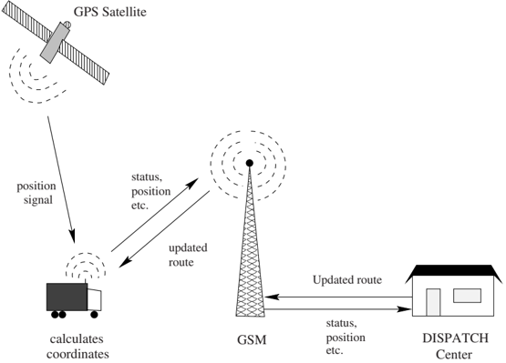

/1

Fig. 1. Sketch of the information flow in a GPS based vehicle routing system.

It is not surprising that this has been the motivation for most companies to deploy more and more sophisticated telecommunications systems.

## 2.2 Geographical Information Systems

The advances in digital road maps and geographical information systems (GIS) have also been considerable over the last decade. Most industrialized countries now have almost fully detailed road network databases. In Denmark, DAV (Dansk Adresse og Vejdatabase - Danish Road and Address Database) offers a digital road database which is connected to detailed information on every address in the country. The DAV database includes information on the zip codes, official street names, route numbers, road classification, highest and lowest street number on both sides of the streets. However, for the time being DAV still needs to include restrictions on turning and information on one-way streets.

Naturally, in a real-world application it is vital that the chosen solution algorithm is capable of processing large amounts of geographical information fast enough to solve the problem online. Issues related to the computation of the shortest paths in a road network become extremely important when implementing end user online routing applications.

The advanced GPS/GIS systems discussed above enable companies to keep track of the position and status of their fleet of vehicles at any given time. Such advanced distribution planning systems based on the DVRP are beginning to be embedded in Enterprise Resource Planning (ERP) systems allowing to link their routing data with inventory and other important information.

## 3 The Dynamic Vehicle Routing Problem

As discussed above the DVRP is the dynamic counterpart of the classic VRP. Psaraftis [48], [49] discusses a number of dimensions that makes the DVRP different from the VRP. Psaraftis [49] also differentiates the two problem classes in terms of attributes of the information used as input for the respective problem types. In addition, Powell et al. [46] distinguish between dynamism within a problem, a model and the application of a model.

In the DVRP, vehicles must service two types of requests: advance requests and immediate requests . The former are requests of static customers that have placed them before the routing process was begun. The latter requests are received from dynamic customers and arise in real-time during the day of operations. The insertion of immediate request customers into already planned routes is usually a complicated task that leads to either partial or full re-planning of the non-visited parts of the routes. The complexity of a routing problem directly affects the difficulty of inserting dynamic customers. For example the presence of time windows will usually increase the insertion difficulty. This can lead to immediate request customers being denied service.

## 3.1 The Degree of Dynamism

The complexity of a dynamic vehicle routing system is a function of the number of customers and their spatial distribution, just like the VRP, but more importantly it also depends on the number of dynamic events and their temporal distribution.

## Dynamism without Time Windows

In a system without time windows three important parameters are: the number of static customers, the number of dynamic customers and the arrival times of the dynamic customers. The first two dimensions are captured by the degree of dynamism concept introduced by Lund et al. [39]. It is the ratio, denoted dod , of the number of immediate requests, n imm , relative to the total number of requests, n tot . Formally:

<!-- formula-not-decoded -->

For example in a system with ten customers, if two customers arrive while the system is on-line, the degree of dynamism is 20 % . The degree of dynamism mirrors many practical environments. Generally, some information is available before the day of operations begins while the rest is received in real-time during the day. The extent of the information received in real-time relative to the total system information provides insights into how dynamic the routing system really is.

## SCENARIO A:

Fig. 2. Arrival time of immediate requests.

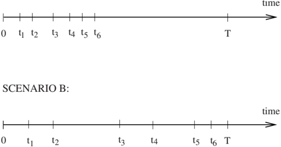

However, this basic measure does not take the arrival times of the immediate requests into account. This means that two systems, one in which the immediate requests are received at the beginning of the planning horizon and the other in which they occur late during the day, are perceived as equivalent. Naturally, in real-life routing settings these two scenarios are however very different. Figure 2 illustrates two DVRP scenarios in which the times for receiving immediate requests differ considerably.

In Scenario A all six immediate requests are received relatively early during the planning horizon. In Scenario B the requests are distributed almost evenly throughout the planning horizon. We suggest that the planner would prefer the former scenario to the latter, since having the highest number of requests in the pool of waiting requests improves the solution quality with respect to the objective of minimizing the total distance driven. Hence, the expected length of the route should be shorter in Scenario A than in Scenario B since time t 6 occurs much earlier in the former scenario than in the latter. Formally, this is captured by the effective degree of dynamism introduced by Larsen et al. [36]. Let the time the i 'th immediate request is received be denoted by t i and the entire planning horizon be denoted by [0 , T ]. Then the effective degree of dynamism , denoted by edod , is defined as:

<!-- formula-not-decoded -->

This measure takes the arrival times of the immediate requests into account and is a natural extension of the dod . It is apparent that Scenario A has a smaller edod than Scenario B .

Fig. 3. The reaction times of two dynamic customers in a DVRP with time windows.

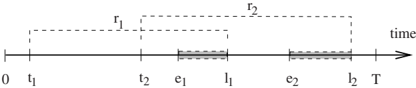

## Dynamism and Time Windows

The measures defined above can be refined to allow for time windows to be taken into consideration. We do this by means of the reaction time . The reaction time is defined as the temporal distance between the time the request is received and the latest possible time at which the service of the requests could begin. Formally, the earliest time that service can begin (i.e., the start of the time window) is denoted by e i while the latest possible time that service could begin is denoted by l i . The reaction time of the i 'th immediate request is denoted by r i and r i = l i -t i . Figure 3 shows this graphically.

The effective degree of dynamism when customers impose time windows (Larsen et al. [36]), denoted by edod tw , can be defined as follows:

<!-- formula-not-decoded -->

In a static system edod tw = 0 and in general 0 ≤ edod tw ≤ 1. When there are no time windows the edod tw simplifies to the edod . According to this measure, the smaller the reaction times, the more dynamic the system is.

## 3.2 Determining the Objectives

The traditional objective for the static VRP has been to minimize the overall distribution costs. For the DVRP additional measures come into play. In particular, the level of service offered to the customers is important for the overall performance of the system. Often the multiple objectives encountered in the DVRP may be conflicting. Naturally, objectives may differ from one application to the other. Nevertheless, a few measures are almost always relevant to consider. These are: travel costs, service level, and throughput maximization. As for the static VRP, the distribution costs should be considered since they represent a true cost for the distribution company. The service level measure of system performance is generally in conflict with the objective of minimizing the distribution costs since a fast response to a new immediate request for service may imply that the vehicles will have to travel longer distances. Throughput optimization considers the ability to serve as many customers as possible. For some dynamic problems this is the most important objective. As an example, the maximization of the expected number of serviced requests is the main objective in the taxi cab business.

## 3.3 Measuring Algorithmic Performance

The most accepted framework for measuring the performance of on-line algorithms is competitive analysis introduced by Sleator and Tarjan [50]. For a minimization problem the competitive ratio , cr A , can be defined as:

<!-- formula-not-decoded -->

where z I ( ) is the cost of the solution found by algorithm A for instance I and z ∗ is the optimal cost found by an (ideal) offline algorithm which had access to the entire instance I , including dynamic requests, beforehand. The competitive analysis framework offers a measure for evaluating the performance of a certain on-line routing policy based on the worst-case ratio between this policy and the optimal offline policy. In other words, for each policy examined this ratio quantifies the loss of cost-efficiency stemming from the lack of full information.

The competitive analysis framework provides a strong basis for studies of the performance of on-line algorithms which have produced interesting analytical results and insights. However, only very simple versions of the DVRP can be treated using this framework. Important real-world constraints such as time windows have so far proved to be too complex to be considered in this framework. Furthermore, in most real-world situations it is indeed possible to achieve an average performance which is considerably better than the one suggested by the competitive ratio.

For more complex versions of the problem algorithmic performance has been evaluated through empirical studies. This has usually been done by discrete-time simulation. This type of analysis can be extended so that the performance of a certain algorithm is evaluated by running the algorithm on both the original dynamic instances and on the instances in which the immediate requests are changed into static data. This provides an estimate of the competitive ratio of the algorithm to go along with its average performance.

## 4 Research Prior to 2000

Early research has considered a number of dynamic and/or stochastic elements in vehicle routing. The problems addressed include the Probabilistic Traveling Salesman Problem (PTSP) and the Probabilistic Vehicle Routing Problem (PVRP), the Stochastic Vehicle Routing Problem (SVRP), the Dynamic Traveling Salesman Problem (DTSP), the Dynamic Traveling Repairman Problem (DTRP), the Dynamic Vehicle Routing Problem (DTSP), the Dynamic Dial-A-Ride Problem (DARP), the Dynamic Pick-Up and Delivery Problem (DPDP), and the dynamic version of the Vehicle Routing Problem with Time

Windows (DVRPTW). Other variants include the Time-Dependent Traveling Salesman Problem (TD-TSP) and the Time-Dependent Vehicle Routing Problem (TD-VRP). In contrast to the DVRP defined above, the PVRP is a VRP where each customer has a given probability of requiring a visit. In the SVRP customers are present at locations with some probabilities and their demands are random. In the TD-VRP the travel time between two customers is a function of the departure time from the first one.

Figure 4 gives a chronological overview of some of the most important work on dynamic and stochastic vehicle routing problems prior to the year 2000. A virtual line through the middle of the illustration divides the literature in two sides: the left-hand one embracing a-priori optimization based models and the right-hand one embracing real-time optimization based models. Within the vehicle routing context a-priori based solutions mean that the planner determines one or more routes based on probabilistic information on future requests for service, customers demands, travel times or other parameters. Within this setting routes will be planned before the vehicles leave the depot. Real-time optimization models construct routes during the day of operation while the vehicle is in-route. Horizontally, the illustration is organized so that the basic models, as for instance the DTRP and PTSP, are located in the middle of the illustration corresponding to the axis of complexity shown at the bottom of the figure. Similarly the DVRPTW is placed at the very right to represent the high complexity of this problem.

The a-priori optimization based methods have been used for the PVRP and SVRP which are static by nature. They are generally not applicable in a real-world on-line DVRP context since the dynamic environment leads to very high computation times. Furthermore, it may not be worth the computational effort to try to find an optimal or near-optimal solution in a real-time setting, because new requests may render the solution sub-optimal. Using reoptimization each time a new request appears only seems computationally tractable in cases where the degree of dynamism is quite low. Finally, these algorithms require extensive a-priori information such as the probability of a certain customer requiring service upon a certain day and time. In most dynamic cases such detailed information will not be available.

Real-time optimization based methods have been used for problems that are dynamic by nature, such as the DTSP and the DTRP. Extensive theoretical work on the DTRP has been conducted by Bertsimas and Van Ryzin ([12], [13] and [14]). More complex DVRP problems have been tackled empirically. The parallel implementation of the tabu search proposed by Gendreau et al. [23] exemplifies this type of approaches.

## 5 Developments from 2000 to Present

Recently we have witness an ever growing body of research on the DVRP and many of its variants. To maintain focus we will only consider advances for the

Fig. 4. Chronological overview of important literature prior to 2000.

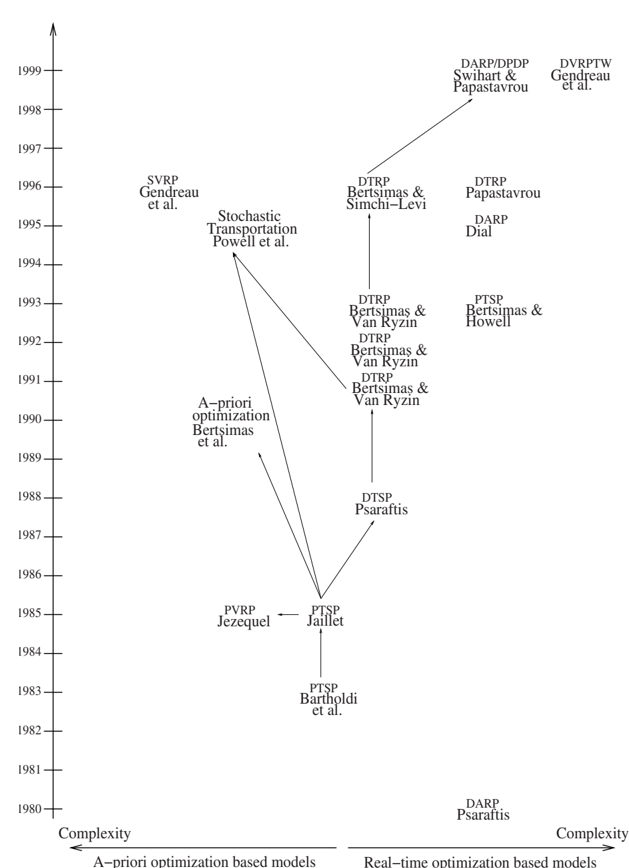

DVRP. Ghiani et al. [27] provide and excellent earlier review of the field and address the role of parallel computing strategies in this context.

## 5.1 A Priori Knowledge, Waiting and Relocation in Partially Dynamic Problems

One stream of research has addressed the DVRP with various degrees of dynamism. Larsen et al. [36] proposed a framework for dynamic routing systems based on their degree of dynamism . Systems are partitioned in weakly, moderately, and strongly dynamic depending on whether their degree of dynamism is below 20-30 %, between 30 and 80 % or over 80 %, respectively. Recently, Larsen et al. [38] have refined their three-echelon classification of dynamic vehicle routing systems based on the degree of dynamism and the system objective. They also discuss methods for evaluation of the performance of algorithms that solve on-line routing problems and list some of the most important issues to include in the system objective. Larsen et al. [36] then describe and test several dynamic policies to minimize routing costs for the Partially Dynamic Traveling Repairman Problem (PDTRP) with various degrees of dynamism. Later, Bent and Van Hentenryck [7] considered moderately dynamic DVRPTW with stochastic customers. They proposed a multiple scenario approach that continuously generates routing plans for scenarios including advanced and immediate requests to maximize the number of serviced customers. Computational results on problems adapted from the Solomon benchmarks highlight the effectiveness of their approach which increases with the degree of dynamism.

Larsen et al. [37] proposed real-time solution methods for the Partially Dynamic Traveling Salesman Problem with Time Windows (PDTSPTW) that minimize lateness. One method requires the vehicle, when idle, to wait at the current customer location until it can service another customer without being early. Other algorithms, called relocation policies, may reposition the vehicle at a location different from that of the current customer based on a priori information on future requests. The results obtained on both randomly generated data and on a real-world case study indicated that all policies significantly reduced lateness at the expense of only small distance increases. The basic policy outperformed the other methods primarily when lateness and distance were equally minimized and proved very robust in all environments studied. When only lateness was considered, the policy to reposition the vehicle at a location near the current customer generally provided the largest reductions in average lateness and the number of late customers. It also produced the least extra distance to be traveled among the relocation policies. where waiting and relocation points are defined a priori using knowledge of the distribution, clustering of the customers, and heuristics.

While Larsen et al. [37] defined waiting and relocation points a priori using heuristics that exploit knowledge of the distribution and clustering of the customers, Bent and Van Hentenryck [8] allowed the vehicle to wait or relocate

anywhere and at any time during the algorithm execution. Computational results indicate that these two strategies were very effective in maximizing the number of customer served, particularly for high dod problems that contain many late requests. Vehicle relocation is also addressed by van Hemert and La Poutre [55] in a DVRP context where loads generated throughout the day must be picked up and returned to a depot within a specified time interval. The authors analyze the benefit of anticipatory vehicle moves within regions that have a high potential of generating loads. They propose a self-adaptive evolutionary algorithm and examine under what conditions such moves improve its effectiveness in terms of the ratio of the loads successfully delivered to the total number of loads made available for transport.

Ichoua et al. [32] also propose a strategy that exploits probabilistic knowledge about future request arrivals. Forecasted requests are incorporated as dummy customers in vehicle routes. The routes are constructed by a modified version of the tabu heuristic of Gendreau et al. [23]. Earlier, Ichoua et al. [31] extended the method proposed by Gendreau et al. [23] to incorporate diversion. That involves allowing a vehicle to be diverted from its predetermined destination. Rather than using local or myopic strategies where a new request for service impacts only one vehicle, the authors took a global view where several vehicles may be affected. The above papers have been motivated in part by the DVRP faced by courier service companies. The same environment is examined in Angelelli et al. [1] where customer requests with service time windows have to be serviced in real time by a fleet of vehicles. The authors consider both pick-up and delivery requests and assume that customer requests cannot be refused but can be postponed to future shifts. A heuristic algorithm based on local search is proposed.

Branke et al. [15] have further analyzed waiting policies that maximize the probability of being able to service an additional immediate request customer. For the single vehicle case, a 'no wait' or drive without waiting policy was shown to be optimal. However, for the multiple vehicle case, it proved to be the worst among eight waiting policies for a vehicle starting or restarting from the depot. A 'variable' policy proved the best. Specifically, each vehicle drives without waiting until the time to drive the remaining distance to the depot is equal to the slack time. Then the available waiting time is distributed to the remaining customers in proportion to the remaining driving distances. Independently, Mitrovic-Minic and Laporte [41] have examined similar policies for the pickup and delivery problem with time windows. Whether to wait and for how long is also addressed by Potvin et al. [45]. The authors consider the impact of dynamic events in the form of travel time and customers on the partially dynamic DVRPTW. They show that policies based on a certain amount of waiting, that is, a certain tolerance for changes in the current planned routes leads to better overall results.

Other novel research includes that of Montemanni et al. [42] solved a DVRP problem using the Ant Colony System paradigm. The algorithm was tested on simulated environments and also applied to a real-world case study

in the city of Lugano, Switzerland. Hvattum et al. [30] addressed a DVRP problem that also had stochastic elements. Based on an actual application, the authors used historical data to generate probability distributions for the attributes of the dynamic customers. They formulate the problem as a multistage stochastic programming problem with recourse and propose a heuristic that gradually builds the routes by exploiting the information gathered on future customer demand. The computational results illustrate the superiority of the this method over a more standard pure dynamic heuristic that resolves the problem at the beginning of a number of consecutive time intervals. Chen and Xu [17] used an optimization-based dynamic approach to minimize the total distance traveled for a dynamic vehicle routing problem with hard time windows. At each decision epoch, the authors solve by column-generation a static Vehicle Routing Problem with Time Windows (VRPTW) consisting of all the known orders that have not been satisfied up to that point. Columns are generated dynamically over time by alternately solving a linear program and applying a fast local-search-based heuristic. The authors report that their approach outperformed an insertion-based heuristic on most test problems generalized from Solomon's problems.

## 5.2 The Dynamic Pick-up and Delivery Problem

Another stream of research has focused on the dynamic pick-up and delivery problem. Attanasio et al. [4] consider the dynamic DARP where as many as possible of the requests received throughout the planning horizon must be satisfied. They present parallel implementations of a tabu search method developed earlier by Cordeau and Laporte for the DARP. The authors report that the proposed algorithms are capable of a high service level as measured by the percentage of satisfied requests. Thomas and White [54] considered the single vehicle pickup and delivery problem where the origin and destination are known. Immediate request customers may demand service while the vehicle is in transit with a known probability. The authors seek a strategy to construct routes that minimize the expected travel time and lateness penalty incurred at the destination if the cutoff time is exceeded. Using a finite-horizon Markov decision process model they propose a policy that optimally build routes that consider anticipated immediate request customers. This policy is computationally compared to an industry standard reactive strategy where there is no information about an immediate request until this actually occurs for a very small number of anticipated requests. It seems that anticipatory routing outperformed the reactive strategy, especially when the immediate requests are likely to occur late during the day of operations.

Coslovich et al. [19] considered a dynamic DARPTW where customers can ask the vehicle driver for a trip at a vehicle stop. They proposed a two-phase insertion heuristic based on route perturbations consisting of 2-opt arc swaps. One phase is off-line and produces a feasible neighborhood of the current route and the other phase is on-line where an attempt is made to insert the

unexpected customer in the planned route. The objective considered was to minimize the overall inconvenience of the advance customers. The authors report computational results that indicate that their solution was quite close to the static one and the number of unexpected requests that were not accepted was negligible. Gendreau et al. [22] examined a different dynamic DARPTW faced by courier services for the same-day local pick-up and delivery of small sized packages. The authors developed a tabu search heuristic where the neighborhood structure was based on ejection chains. Their experiments conducted in a parallel computing environment indicated that their method was superior to insertion based methods, even in highly dynamic scenarios.

Recently, Mitrovic-Minic and Laporte [41] have examined the benefits of waiting strategies in the context of a pickup and delivery problem with time windows. While Branke et al. [15] focused on maximizing the probability of being able to service an additional customer, Mitrovic-Minic and Laporte [41] sought waiting policies that can decrease the total detour and the number of required vehicles. When a new request arrives, if the vehicle assigned to it waits as long as possible before moving the total insertion cost can be reduced at the expense of more vehicles. If, on the other hand, the vehicle travels as soon as possible, the total number of vehicles is decreased but longer detours are experienced. The authors propose an intermediate strategy, called advanced dynamic waiting, that involves partitioning the overall tour into service zones and allocating the total time available for waiting proportionally to the time necessary to service each service zone. This method was able to simultaneously decrease the total detour and the required number of vehicles. Mitrovic et al. [40] further this line of research by proposing a double-horizon heuristic for the dynamic PDPTW. The short term horizon, the next two hours, accounts for immediate increase in routing cost created by the insertion of an immediate request. The long-term horizon, the rest of the day of operations, deals with the decrease in vehicle slack time. The authors propose a constructive heuristic, which is used for every immediate request, in conjunction with a tabu search heuristic which is called periodically.

Fleischmann et al. [21] propose a planning framework for the dynamic PDPTW. The authors then suggest three event-based dispatching policies which differ in the length of the planning horizon per event. Using dynamic travel time information, the procedures are compared on real-world data from an urban traffic management center and a logistics service provider. Finally, Yang et al. [56] address a real-time multivehicle truckload pickup and delivery problem. They present a mixed-integer programming formulation for the offline version of the problem and propose a new rolling horizon reoptimization strategy for the real-time version. This policy is compared with another previously introduced reoptimization policy and three other known heuristic rules. The results of a simulation study that considered varying traffic intensities, degrees of advance information, and degrees of flexibility for job-rejection decisions indicate that the new reoptimization policy systematically outperformed the others.

## 5.3 Emergency Service Systems

Yet another stream of research has dealt with emergency service systems. Due to its importance, this application has received substantial attention from the scientific community since the early 1970s. These systems are truly strongly dynamic since no requests are known in advance of the day of operation. The quality of an emergency system is generally measured by its response time. The emergency service providers and the public administration agree on a certain level of service which for instance defines that 90% of the calls should be served within 5 minutes whereas the remaining 10% of the calls should be served within 8 minutes.

Often, the quality of a-priori information such as the potential location of the next request is often quite poor. If, on the other hand, a-priori information on future requests is available it could potentially improve the solution quality. For example, this could involve moving an idle vehicle currently situated in a low demand area to a central location. This idea was explored by Gendreau et al. [25] who proposed a model for real-time relocation of ambulances. For a survey of emergency vehicle location and relocation problems, see Brotcorne et al. [16]. Recently, Gendreau et al. [26] proposed a dynamic relocation strategy for emergency vehicle waiting sites that maximizes the expected covered demand and controls the number of waiting site relocations. They formulate the problem as an integer linear program and solve it within reasonable computing time when the number of vehicles is relatively small. Simulations conducted with real-world emergency medical services data from the Montreal area confirm the feasibility of the proposed approach.

## 5.4 Competitive Analysis

A different stream of research has examined the DVRP using competitive analysis. Following Bertsimas and Van Ryzin [12], [13] and [14] who were the first to use it in this context, Ausiello et al. [5] have studied the on-line version of the classical Traveling Salesman Problem (TSP) using this type of analysis. The authors examine two versions of the problem and provide lower bounds for the competitive ratio. Recently, Jaillet and Wagner [34] have examined online versions of the TSP and TRP where each request has a disclosure date. This is the time when the location and release date of a request become known. This measure is similar to the reaction time introduced by Larsen et al. [37] except it utilizes release times instead of due dates. The authors propose online algorithms for a variety of scenarios and show that this advanced information leads to better competitive ratios. They also provide a general result on polynomial-time online algorithms for the online TSP.

Complexity results and competitive analysis for vehicle routing problems are the subject of the PhD-thesis by Paepe [43]. Paepe gives a thorough analysis of the on-line version of the Dial-a-ride problem in which a single capacitated vehicle serves a set of customers that requests to be picked-up at some

geographical location and to be transported to another location. The requests appear in real-time and Paepe derives the competitive ratios of a number of routing policies. Angelelli et al. [2], [3] studied a dynamic multi-period routing problem. Here, the orders arriving during a period have to be completed either in that period or the next. This means that the system will hold customers that are to be served right away as well as customers that will have to wait to be served. The authors introduce simple routing policies and analyze these by examining their competitive ratios.

Other streams of research have been directed at problems related to the DVRP. These include the Dynamic Assignment Problem (see Spivey and Powell [51]), the Dynamic Vehicle Scheduling Problem (see Huisman et al. [29]) and the VRP and its variants with time dependent travel times (see Taniguchi and Shimamoto [53], and Haghania and Jung [28]). Their discussion is beyond the scope of this chapter.

## 6 Conclusions and Directions for Future Research

This chapter has highlighted the evolution of research on dynamic vehicle routing problems. We introduced the DVRP and illustrated how it is different from the generic VRP. We then examined the technological environment required. Next, we delineated the salient problem dimensions, including the degree of dynamism, the potential components to be considered in the system objective, and theoretical and empirical evaluation methods for the performance of algorithms. We then looked back at the research conducted prior to 2000 and discussed the many developments from 2000 to present. Several themes for future research have emerged from this discussion.

The level of dynamism of a system has a strong impact on the type of algorithm to be used. Therefore, one direction for future work should consider the design of more encompassing measures to determine the level of dynamism of a given system. We discussed natural extensions of the basic dod measure, edod and edod tw , which capture information on when the immediate requests are received by the dispatcher. Other than the initial research done by Jaillet and Wagner [34] the edod , edod tw or similar measures have yet to be considered in system classification or algorithmic design. While the edod and edod tw are improvements over the definition of the dod there are still many subtle interactions in the way requests arrive that will elude analysis for the time being, thus making it hard to characterize the difficulty of dynamic routing problems.

The above ideas are part of a broader theme which seeks to exploit knowledge about future request arrivals and/or consider vehicle relocation and waiting. The research of Larsen et al. [37], Ichoua et al. [32], Jaillet and Wagner [34], Bent and Van Hentenryck [8], and van Hemert and La Poutre [55], among others, has paved the way for future approaches. In particular, consider the issue of choosing where vehicles should idle in anticipation of future requests.

When determining the attractiveness of each idle point, an algorithm may take the arrival intensities of not only a given subregion but also neighboring ones into consideration. More sophisticated methods, such as location analysis, should be investigated.

Other interesting research directions should consider robustness considerations with regards to unforeseen events (e.g., vehicle failures, traffic congestion and others) and the integration of industry practices (e.g., the use of bicycles in highly congested areas, load consolidation, and others) in the models used.

We believe a new generation of DVRP algorithms will blend the effectiveness of advanced methods, tailored to take advantage of special problem structures and advanced knowledge, with the efficiency of parallel implementations, and the ever growing computing power of workstations to solve increasingly larger and more realistic problems. The overnight courier mail service provider environment represents a good model for the use of such new hybrid approaches. The morning subproblem is often weakly dynamic while the afternoon one is moderately dynamic. Therefore, a reoptimization algorithm could first plan a set of morning delivery routes. In case of urgent call-in requests, the algorithm could insert the new requests into the predetermined delivery routes. In turn, the afternoon pickup problem, would use fast algorithms for online routing that would take advantage of a priori information on future requests.

As companies are continuing the computer integration of their operations through ERP systems, much more information is being transferred between logistics and other functional areas. Implementations of advanced distribution planning systems based on DVRPs is starting to be seen in medium sized companies; small enterprises are next in line. This will likely be accelerated during the coming years by the ever growing number of just-in-time global supply chains. An example of this could be the transportation of the elderly and handicapped. Hence, the interface between DVRP models and algorithms and other parts of the supply chain such as warehousing and manufacturing is an important research direction that has yet to be tapped.

We hope that this chapter has offered an insightful perspective on this rapidly moving field. While the DVRP has reached a certain level of maturity, many important problems remain open. We can only hope that this chapter has steered sufficient interest that many of its readers will embark on or continue their research in this field.

## References

- 1. E. Angelelli, R. Mansini, and M.G. Speranza. A real-time vehicle routing model for a courier service problem. In B. Fleischmann and A. Klose, editors, Distribution Logistics-Advanced solutions to practical problems , pages 87-104. SpringerVerlag, 2005.
- 2. E. Angelelli, M.W.P. Savelsbergh, and M.G Speranza. Competitive analysis for dynamic multi-period uncapacitated routing problems. Technical report, School

- of Industrial and Systems Engineering, Georgia Institute of Technology, 2005. Networks. (Forthcoming).
- 3. E. Angelelli, M.W.P. Savelsbergh, and M.G Speranza. Competitive analysis of a dispatch policy for a dynamic multi-period routing problem. Technical report, Department of Quantitative Methods, University of Brescia, 2006.
- 4. A. Attanasio, J.-F. Cordeau, G. Ghiani, and G. Laporte. Parallel tabu search heuristics for the dynamic multi-vehicle dial-a-ride problem. Parallel Computing , 30(3):377-387, 2004.
- 5. G. Ausiello, E. Feurstein, S. Leonardi, L. Stougie, and M. Talamo. Algorithms for the on-line travelling salesman. Algorithmica , 29:560-581, 2001.
- 6. J. Bartholdi III, L. Platzman, Collins L., and W. Warden III. A minimal technology routing system for meals on wheels. Interfaces , 13:1-8, 1983.
- 7. R. Bent and P. Van Hentenryck. Scenario-based planning for partially dynamic vehicle routing with stochastic customers. Operations Research , 52(6):977-987, 2004.
- 8. R. Bent and P. Van Hentenryck. Waiting and relocation strategies in online stochastic vehicle routing. In Proceedings of the 20th International Joint Conference on Artificial Intelligence , pages 1816-1821, Hyderabad, India, 2007.
- 9. D. Bertsimas and L. Howell. Further results on the probabilistic traveling sales-
- man problem. European Journal of Operational Research , 65:68-95, 1993.
- 10. D. Bertsimas, P. Jaillet, and A. Odoni. A priori optimization. Operations Research , 38(6):1019-1033, 1990.
- 11. D. Bertsimas and D. Simchi-Levi. A new generation of vehicle routing research: Robust algorithms, addressing uncertainty. Operations Research , 44:286-304, 1996.
- 12. D. Bertsimas and G. Van Ryzin. A stochastic and dynamic vehicle routing problem in the euclidean plane. Operations Research , 39:601-615, 1991.
- 13. D. Bertsimas and G. Van Ryzin. Stochastic and dynamic vehicle routing problem in the euclidean plane with multiple capacitated vehicles. Operations Research , 41:60-70, 1993.
- 14. D. Bertsimas and G. Van Ryzin. Stochastic and dynamic vehicle routing with general demand and inter travel time distributions. Appl. Probl. , 25:947-978, 1993.
- 15. J. Branke, M. Middendorf, G. Noeth, and M. Dessouky. Waiting strategies for dynamic vehicle routing. Transportation Science , 39(3):298-312, 2005.
- 16. L. Brotcorne, G. Laporte, and F. Semet. Ambulance location and relocation models. European Journal of Operational Research , 147:451-463, 2003.
- 17. Z.-L. Chen and H. Xu. Dynamic column generation for dynamic vehicle routing with time windows. Transportation Science , 40(1):74-88, 2006.
- 18. J. Collins. Global Positioning System . Springer Verlag, Wien, New York, 1992.
- 19. L. Coslovich, R. Pesenti, and W. Ukovich. A two-phase insertion technique of unexpected customers for a dynamic dial-a-ride problem. European Journal of Operational Research , 175:1605-1615, 2006.
- 20. R. Dial. Autonomous dial a ride transit - introductory overview. Transportation Research C , 3:261-275, 1995.
- 21. B. Fleischmann, S. Gnutzmann, and E. Sandvoss. Dynamic vehicle routing based on online traffic information. Transportation Science , 38(4):420-433, 2004.
- 22. M. Gendreau, F. Guertin, J.-Y. Potvin, and R. Seguin. Neighborhood search heuristics for a dynamic vehicle dispatching problem with pick-ups and deliveries. TRC , 14:157-174, 2006.

- 23. M. Gendreau, F. Guertin, J.-Y. Potvin, and E. Taillard. Parallel tabu search for real-time vehicle routing and dispatching. TS , 33:381-390, 1999.
- 24. M. Gendreau, G. Laporte, and R. Seguin. Stochastic vehicle routing. European Journal of Operational Research , 88:3-12, 1996.
- 25. M. Gendreau, G. Laporte, and F. Semet. A dynamic model and parallel tabu search heuristic for real-time ambulance relocation. Parallel Computing , 27:1641-1653, 2001.
- 26. M. Gendreau, G. Laporte, and F. Semet. The maximal expected coverage relocation problem for emergency vehicles. Journal of Operational Research Society , 57(1):22-28, 2006.
- 27. G. Ghiani, F. Guerriero, G. Laporte, and R. Musmanno. Real-time vehicle routing: Solution concepts, algorithms and parallel computing strategies. European Journal of Operational Research , 151(1):1-11, 2004.
- 28. A. Haghania and S. Jung. A dynamic vehicle routing problem with timedependent travel times. Computers &amp; Operations Research , 32:2959-2986, 2005.
- 29. D. Huisman, R. Freling, and A. P. M. Wagelmans. A robust solution approach to the dynamic vehicle scheduling problem. Transportation Science , 38(4):447-458, 2004.
- 30. L. Hvattum, A. Lokketangen, and G. Laporte. Solving a dynamic and stochastic vehicle routing problem with a sample scenario hedging heuristic. Transportation Science , 40(4):421-438, 2006.
- 31. S. Ichoua, M. Gendreau, and J.-Y. Potvin. Diversion issues in real-time vehicle dispatching. Transportation Science , 34(4):426-438, 2000.
- 32. S. Ichoua, M. Gendreau, and J.-Y. Potvin. Exploiting knowledge about future demands for real-time vehicle dispatching. Transportation Science , 40(2):211225, 2006.
- 33. P. Jaillet. Probabilistic Traveling Salesman Problems . Ph.D. Thesis, Massachusetts Institute of Technology, Cambridge, Mass., 1985.
- 34. P. Jaillet and M. R. Wagner. Online routing problems: Value of advanced information as improved competitive ratios. Transportation Science , 40(2):2-21, 2006.
- 35. A. Jezequel. Probabilistic Vehicle Routing Problems . Masters Thesis, Massachusetts Institute of Technology, Cambridge, Mass., 1985.
- 36. A. Larsen, O. Madsen, and M. Solomon. Partially dynamic vehicle routing models and algorithms. Journal of Operational Research Society , 53:637-646, 2002.
- 37. A. Larsen, O. Madsen, and M. Solomon. The a-priori dynamic traveling salesman problem with time windows. Transportation Science , 38(4):459-472, 2004.
- 38. A. Larsen, O.B.G. Madsen, and M.M. Solomon. Classification of dynamic vehicle routing systems. In V. Zeimpekis, G. M. Giaglis, C.D. Tarantilis, and I. Minis, editors, Dynamic Fleet Management: Concepts, Systems, Algorithms &amp; Case Studies . Springer-Verlag, 2007.
- 39. K. Lund, O. B.G. Madsen, and J. M. Rygaard. Vehicle routing problems with varying degrees of dynamism. Technical report, IMM, The Department of Mathematical Modelling, Technical University of Denmark, Lyngby, Denmark, 1996.
- 40. S. Mitrovic-Minic, R. Krishnamurti, and G. Laporte. Double-horizon based heuristics for the dynamic pickup and delivery problem with time windows. Transportation Research B , 38:669-685, 2004.

- 41. S. Mitrovic-Minic and G. Laporte. Waiting strategies for the dynamic pickup and delivery problem with time windows. Transportation Research B , 38:635655, 2004.
- 42. R. Montemanni, L.M. Gambardella, A.E. Rizzoli, and A.V. Donati. Ant colony system for a dynamic vehicle routing problem. Journal of Combinatorial Optimization , 10(4):327-343, 2005.
- 43. W. de Paepe. Complexity Results and Competitive Aanlysis for Vehicle Ruoting Problems . PhD thesis, Technical University of Eindhoven, The Netherlands, 2002.
- 44. J.D. Papastavrou. A stochastic and dynamic routing policy using branching processes with state dependent immigration. European Journal of Operational Research , 95:167-177, 1996.
- 45. J.Y. Potvin, Y. Xu, and I. Benyahia. Vehicle routing and scheduling with dynamic travel times. Computers &amp; Operations Research , 33:1129-1137, 2006.
- 46. W.B. Powell, P. Jaillet, and Odoni A. Stochastic and dynamic networks and routing. In M.O. Ball et al., editor, Network Routing, Handbooks in OR &amp; MS , pages 141-295. Elsevier Science, Amsterdam, 1995.
- 47. H. Psaraftis. A dynamic programming solution to the single many-to-many immediate request dial-a-ride problem. Transportation Science , 14:130-154, 1980.
- 48. H.N. Psaraftis. Dynamic vehicle routing problems. In B.L. Golden and A.A. Assad, editors, Vehicle routing: Methods and studies , pages 223-248. NorthHolland, Amsterdam, 1988.
- 49. H.N. Psaraftis. Dynamic vehicle routing: Status and prospects. Annals of Operations Research , 61:143-164, 1995.
- 50. D. Sleator and R.E. Tarjan. Amortized effiency of list update and paging rules. Communications of the ACM , 28(2):202-208, 1985.
- 51. M. Z. Spivey and W. B. Powell. The dynamic assignment problem. Transportation Science , 38(4):399-419, 2004.
- 52. M. Swihart and J.D. Papastavrou. A stochastic and dynamic model for the single-vehicle pick-up and delivery problem. European Journal of Operational Research , 114:447-464, 1999.
- 53. E. Taniguchi and H. Shimamoto. Intelligent transportation system based dynamic vehicle routing and scheduling with variable travel times. Transportation Research C , 12:235-250, 2004.
- 54. B. W. Thomas and C. C. White III. Anticipatory route selection. Transportation Science , 38(4):473-487, 2004.
- 55. J.I. van Hemert and J.A. La Poutre. Dynamic routing problems with fruitful regions: Models and evolutionary computation. In X. Yao, E. Burke, J.A. Lozano, J. Smith, J.J. Merelo-Guervs, J.A. Bullinaria, J. Rowe, P. Tino, A. Kabn, and H.-P. Schwefel, editors, Parallel Problem Solving from Nature VIII, Lecture Notes in Computer Science 3242 , pages 690-699. Springer, Berlin, 2004.
- 56. J. Yang, P. Jaillet, and H. Mahmassani. Real-time multivehicle truckload pickup and delivery problems. Transportation Science , 38(2):135-148, 2004.

Part II

New Directions in Modeling and Algorithms

## Online Vehicle Routing Problems: A Survey

Patrick Jaillet 1 and Michael R. Wagner 2

1 Department of Civil and Environmental Engineering Massachusetts Institute of Technology Cambridge, MA 02139 jaillet@mit.edu

2 Department of Management California State University East Bay Hayward, CA 94542 michael.wagner@csueastbay.edu

Summary. We consider online Vehicle Routing Problems (VRPs). The problems are online because the problem instance is revealed incrementally. After providing motivations for the consideration of such online problems, we first give a detailed summary of the most relevant research in the area of online VRPs. We then consider the online Traveling Salesman Problem (TSP) with precedence and capacity constraints and give an online algorithm with a competitive ratio of at most 2. We also consider an online version of the TSP with m salesmen and we give an online algorithm that has a competitive ratio of 2, a result that is best possible. We also study polynomial-time algorithms for these problems. Finally, we introduce the notion of disclosure dates , a form of advanced notice which allows for more realistic competitive ratios.

Key words: Online optimization; competitive analysis; routing; transportation.

## 1 Introduction

The Traveling Salesman Problem (TSP) is a very important problem in Operations Research; TSP solutions are valuable in their own right as well as in the solution of more complicated problems. In a common version of the TSP, we are given a metric space and a set of points in the space, representing cities. Given an origin city, the task is to find a tour of minimum total length, beginning and ending at the origin, that visits each city at least once. Assuming a constant speed, we can interpret this objective as minimizing the time required to complete a tour. We may also incorporate release dates, where a city must be visited on or after its release date; in this case the problem is known as the 'TSP with release dates.'

B. Golden et al. (eds.), The Vehicle Routing Problem , doi: 10.1007/978-0-387-77778-8 10, c © Springer Science+Business Media, LLC 2008

Additional constraints can be added to the above salesman problems. We will consider several in this chapter. The salesman can be considered a vehicle/server that transports packages and/or people. We can introduce precedence constraints where some cities must be visited before others. Precedence constraints are appropriate, for example, if packages/people have to be picked up at one location and delivered to another location. It is also natural to introduce a capacity for the server; in other words, a server can visit only a subset of all cities in a given tour and must traverse multiple tours. Finally, we consider the case where we have multiple servers to manage.

The Traveling Repairman Problem (TRP) is defined similarly, only that we are interested in minimizing the weighted sum of city completion times, where a city's completion time is the first time that a city is visited; this objective is also referred to as the latency. These two objectives embody important but very different managerial measures. The TSP objective is closely related to the notion of makespan, the maximum completion date of all cities; this measure is traditionally used if one were to optimize with the servers interest in mind. Alternatively, the latency is closely related to the (weighted) average completion date of all cities, which clearly has the customers interest in mind.

It is well established that the assumption that problem instances are completely known a priori is unrealistic in many applications. There exist numerous approaches for solving optimization problems under uncertainty. Assuming a probabilistic distribution or process for the problem data leads to stochastic and dynamic programming formulations. However, this approach generally requires accurate probabilistic distributions. In practice, there might not be sufficient data to estimate these distributions accurately. This is particularly the case when one considers a new market or industry, or even when a known industry is in a period of upheaval. Therefore, more conservative approaches are needed. A popular approach to optimization under uncertainty is robust optimization (e.g., see Ben-Tal and Nemirovski [12]). The basic framework of robust optimization is to introduce sets for uncertain problem parameters, rather than distributions. Attempts to make robust optimization less conservative have also been successful (e.g., see Bertsimas and Sim [13]). Online optimization is a different approach to optimization under uncertainty, which is more appropriate for sequential decision making problems where probabilistic distributions are not available and/or not reliable. For example, taxi services, buses and courier services require an online model in which locations to be visited are revealed over time, while the server is en route serving previously released requests. Since online optimization is also a conservative approach, we do make attempts to relax this aspect by considering the availability of advanced information.

In this chapter we are concerned with online versions of the above mentioned routing optimization problems. In our framework, the problem data is revealed dynamically over time, independent of the server's location, at release dates. More specifically, in the context of the online TSP, a city's existence and location are only revealed at the city's release date. The salesman must

incorporate new cities in real-time into his tour, hence the need for dynamic flexible algorithms (in contrast with classic static algorithm design).

The focus of our chapter is on studying algorithms for a variety of online routing problems. They are evaluated using the competitive ratio criteria, which is defined as the worst case ratio of the online algorithm's cost to the cost of an optimal offline algorithm, where all data are known a priori. In most cases, the cost of an algorithm will be the time required to visit all cities and return to the origin. We also say that an algorithm is c -competitive if the competitive ratio of the algorithm is at most c . We call an online algorithm (or competitive ratio) best-possible if there does not exist another online algorithm with strictly smaller competitive ratio.

The competitive ratio is a conservative worst case measure, but it does provide a guarantee of a minimal level of performance. From a practitioner's point of view, a competitive ratio can provide a benchmark from which to compare other solution approaches. We do not claim that our approach is appropriate for solving all routing problems under uncertainty, but we do believe it is appropriate for problems where there is little information to characterize the uncertainty. The research in this chapter also serves as a starting point for routing optimization problems under partial uncertainty. For example, there might exist an underlying distribution for the problem data, but we only know the mean of the distribution. Similar approaches have been taken in the revenue management and supply chain literature; see Ball and Queyranne [10], Ball, Gao, Lan, Karaesmen [34] and Perakis and Roels [37, 38].

We provide online algorithms for new online routing problems and we derive new competitive ratio bounds. A number of our competitive ratio results are best-possible. We also study the effect of providing advanced information to the server(s) in the form of disclosure dates . The disclosure dates are introduced to offset the otherwise pessimistic nature of competitive ratios: we may be able to preclude the (usually) pathological worst-case examples that induce competitive ratios. With advanced information in place, we derive improved competitive ratios. We also derive lower bounds for competitive ratios with or without the advanced information; in many cases our lower bounds are tight, implying best-possible competitive ratios.

In Section 2 we detail a number of situations where online optimization is an appropriate solution approach and in Section 3 we provide a comprehensive literature review along with in-depth presentations of the most relevant articles. In Sections 4 and 5, we present detailed models and results for single and multiple server online routing problems, respectively. In Section 6 we discuss a relaxation of the online optimization approach by utilizing the notion of disclosure dates. In Section 7 we discuss possible directions for future research and in Section 8 we conclude the chapter.

## 2 Applications of Online Optimization

In this section, we discuss a number of applications of online optimization and the related discipline of real-time optimization. Real-time optimization studies the same type of problems that are studied in online optimization, but from a less theoretical point of view. Essentially, real-time optimization solves problems where the problem instance is also revealed incrementally, but the focus is on (fast) practical algorithms and heuristics that solve quickly and give good solutions, but without theoretical performance guarantees.

FedEx and other courier companies offer many real-time services. For example, FedEx provides same day pickup and delivery. In many cases, there exist data for customers that request these services and forecasts can be created to help in designing routes. However, in the case where FedEx is beginning service in a new area, online and real-time optimization is a more appropriate approach until data can be gathered about the customer base. Another application is in the real-time fleet management where real-time information is used to manage a fleet of vehicles; see Yang, Jaillet and Mahmassani [43]. A third example comes from a rather new industry: Jet Taxis. A jet taxi is a small jet that serves regional airports; customers can request transportation from one airport to another in real-time. Since this is a new industry, data is not yet available to create forecasts of customer demand, so online and real-time optimization is again appropriate for analyzing these problems. Management of a fleet of taxis can also benefit from online analysis.

There are also a number of applications of online optimization in computer science. For example, paging in a memory system is one of the first applications of online optimization. Searching an unknown domain for a prize is also popular (e.g., see Jaillet and Stafford [23]); this latter problem has applications in robotics. Routing and call admission in communications networks are also popular areas of research in online optimization.

## 3 Literature Review

The literature for the TSP is vast. The interested reader is referred to the books by Lawler, Lenstra, Rinnooy Kan, Shmoys [35] and Korte and Vygen [30] for comprehensive coverage of results concerning the TSP. Probabilistic versions of the TSP, where a different approach is used to represent limited knowledge of the problem instance, have also attracted interest (e.g., see Jaillet [22] and Bertsimas [14]). Offline routing problems with release dates can be found in Psaraftis, Solomon, Magnanti, Kim [39] and Tsitsiklis [42].

A systematic study of online algorithms was given by Sleator and Tarjan [41], who suggested comparing an online algorithm with an optimal offline algorithm. Karlin, Manasse, Rudolph, Sleator [29] introduced the notion of a competitive ratio . Online algorithms have been used to analyze paging in

computer memory systems, distributed data management, navigation problems in robotics, multiprocessor scheduling, etc.; see the books of Borodin and El-Yaniv [17] and Fiat and Woeginger [19] for more details and references.

Research concerning online versions of the TSP and TRP have been introduced relatively recently. Kalyanasundaram and Pruhs [28] have examined a unique version of an online traveling salesman problem where new cities are revealed locally during the traversal of a tour (i.e., an arrival at a city reveals any adjacent cities that must also be visited). Angelelli, Savelsbergh, Speranza [3, 4] study related online routing problems in a multi-period setting. More related to our chapter is the stream of works which started with the paper by Ausiello, Feuerstein, Leonardi, Stougie, Talamo [9]. In this paper, the authors studied the online TSP, which is a special case of the problems we consider here; they analyzed the problem on the real line and on general metric spaces, developing online algorithms for both cases and achieving a best-possible online algorithm for general metric spaces, with a competitive ratio of 2. These authors also provide a polynomial-time online algorithm, for general metric spaces, which is 3-competitive. Subsequently, the paper by Ascheuer, Krumke, Rambau [5] implies the existence of a polynomial-time algorithm, for general metric spaces, which is 2.65-competitive as well as a (2 + /epsilon1 )-competitive ( /epsilon1 &gt; 0) algorithm for Euclidean spaces. Lipmann [36] developed a best-possible online algorithm for the real line, with a competitive ratio of approximately 1 64. Blom, Krumke, de Paepe, Stougie [15] gave a . best-possible online algorithm for the non-negative real line, with a competitive ratio of 3 2 . This last paper also considers different adversarial algorithms in the definition of the competitive ratio.

Considering the online TRP, Feuerstein and Stougie [18] gave a lower bound of (1 + √ 2) for the competitive ratio and a 9-competitive algorithm, both for the online TRP on the real line. Krumke, de Paepe, Poensgen, Stougie [33] improved upon this result to give a (1+ √ 2) 2 -competitive deterministic algorithm for the online TRP in general metric spaces as well as a Θ -competitive randomized algorithm, where Θ ≈ 3 64; in [24], the authors correct this result . to Θ ≈ 3 86 (see also [32]). .

There has also been work on generalizing the basic online TSP framework. The paper by Feuerstein and Stougie [18] considers the online Dial-a-Ride problem, where each city is replaced by an origin-destination pair. The authors consider both the uncapacitated case, giving a best-possible 2-competitive algorithm, and the capacitated case, giving a 2.5-competitive algorithm. The paper by Ascheuer et al. [5] also gives a 2-competitive online algorithm and a (1 + √ 1 + 8 ρ / ) 2-competitive polynomial-time online algorithm for the uncapacitated online Dial-a-Ride problem ( ρ being the approximation ratio of a simpler but related offline problem). Their algorithm is generalizable to the case where there are multiple servers with capacities; this generalization is also 2-competitive. Other groups of researchers have generalized the online TSP in other ways: Ausiello, Bonifaci and Laura [7] have studied the online Asymmetric TSP, Ausiello, Demange, Laura, Paschos [8] have studied the

online Quota TSP and Blom, Krumke, de Paepe, Stougie [15] have considered the online TSP under different adversarial models.

Considering multiple vehicle online routing problems, there has been limited work. As mentioned previously, Ascheuer et al. [5] give a 2-competitive online algorithm for the online Dial-a-Ride problem with multiple servers and capacity constraints. Bonifaci and Stougie [16] study the online TSP with m salesmen. For the case where all cities are on the real line, these authors give an asymptotically (as m →∞ ) optimal online algorithm. These authors also focus on resource augmentation with respect to the number of vehicles: the online algorithm has m salesmen and the offline algorithm has m ∗ ≤ m salesmen. These authors give an online algorithm that is (1+ √ 1 + 1 / 2 /floorleft m/m ∗ /floorright1 )-competitive. Ausiello, Allulli, Bonifaci, Laura [6] also consider the behavior of online routing algorithms as a function of the number of servers.

In general, resource augmentation for online problems was introduced by Sleator and Tarjan [41]. These authors show that it is possible for an online paging algorithm to have a constant competitive ratio if it is given a constant fraction more cache locations than the offline algorithm. Server resource augmentation was considered by Young [44] for the k -server problem and Kalyanasundaram and Pruhs [26] for the online weighted matching problem. Kalyanasundaram and Pruhs [27] consider speed and processor augmentation in online machine scheduling. In Jaillet and Wagner [24], information augmentation is present in the form of disclosure dates for single server problems; a similar approach was taken by Allulli, Ausiello, Laura [1] in the form of a lookahead . In Jaillet and Wagner [25], disclosure dates are considered for multiple server problems; additionally, server and speed augmentation as well as asymptotic analysis of online routing problems are studied. Other frameworks for addressing the limitations of the competitive ratio have also been introduced; see Ben-David and Borodin [11], Koutsoupias and Papadimitriou [31] and Raghavan [40].

We now present in more depth some of the research that is most relevant to our chapter.

## 3.1 Ausiello et al. [9]

This paper is one of the most important in online routing. The authors were the first to consider the online TSP in a general metric space. They designed a best-possible algorithm for the general metric case. They also gave online algorithms for the case where the cities all lie on the real line as well as a polynomial-time online algorithm for general metric spaces. We present their best-possible online algorithm Plan-At-Home (PAH). We let o designate the origin of the metric space and d ( · , · ) a distance metric.

## Algorithm 1 : PAH

- (1) Whenever the salesman is at the origin, it starts to follow an optimal route that serves all the requests yet to be served and goes back to the origin.

(2) If at some time a new request is presented at point l , then the salesman takes one of two actions depending on its current position p :

(2a)If d l, o ( ) &gt; d p, o ( ) , then the salesman immediately goes back to the origin where it appears in a Case 1 situation.

(2b)If d l, o ( ) ≤ d p, o ( ) , then the salesman ignores it until it arrives at the origin, where again it re-enters Case 1.

Theorem 1 ([9]). The competitive ratio of PAH is 2. Furthermore, there does not exist another online algorithm with a strictly smaller competitive ratio.

In order to give an idea of how results of this type are proved, we provide a partial proof of Theorem 1.

Proof (The competitive ratio of PAH is at most 2).

For simplicity, let r denote the time of the final request and l the position of this request. Let p t ( ) denote the location of the salesman at time t . Finally, let Z ∗ denote the optimal cost of the offline problem, the TSP with release dates (where all data are known a priori) and L TSP the optimal offline cost when all release dates are zero. We show that in each of the Cases (1), (2a) and (2b), PAH is 2-competitive.

Case (1): PAH is at the origin at time r . Then it starts an exact tour that serves all the unserved requests. The time needed by PAH is at most r + L TSP ≤ 2 Z ∗ .

Case (2b): We have that d o, l ( ) ≤ d o, p r ( ( )). Suppose PAH is following a route R that had been computed the last time it was at the origin. Note that R ≤ L TSP ≤ Z ∗ . Let Q be the set of requests temporarily ignored since the last time PAH was at the origin; Q is not empty since it contains l . Let l q be the location of the first request in Q served by the offline algorithm and let r q be the time at which l q was released. Let P Q be the shortest path that starts at l q , visits all the cities in Q and ends at the origin. Clearly, Z ∗ ≥ r q + P Q and Z ∗ ≥ d o, l ( q ) + P Q .

Case (2a): We have that d o, l ( ) &gt; d o, p r ( ( )). PAH returns to the origin, where it will arrive before time r + d o, l ( ). After this, PAH computes and follows an exact tour through all the unserved requests. Therefore, the online cost is at most r + d o, p r ( ( )) + L TSP &lt; r + d o, l ( ) + L TSP . Noticing that r + ( d o, l ) ≤ Z ∗ , we have that the online cost is at most 2 Z ∗ .

At time r q , the distance that PAH still has to travel on the route R before arriving at the origin is at most Rd o, l ( q ), since d o, p r ( ( q )) ≥ d o, l ( q ) implies that PAH has traveled on the route R a distance not less than d o, l ( q ). Therefore, it will arrive at the origin before time r q + Rd o, l ( q ). After that it will follow an exact tour T Q that covers the set Q . Hence, the completion time will be at most r q + Rd o, l ( q ) + T Q . Since T Q ≤ d (0 , l q ) + P Q , we have that the online cost is at most

<!-- formula-not-decoded -->

Note that PAH is not a polynomial-time algorithm as a subroutine requires the solution to the classic TSP problem.

We briefly mention some of the other results that the authors obtained: An upper bound on the competitive ratio of the polynomial-time online algorithm for general metric spaces is 3 and the competitive ratio of their algorithm where all cities lie on the real line is 1.75. The authors also consider the case where the salesman is not required to return to the origin after serving all cities.

## 3.2 Lipmann [36]

Lipmann [36] considers the online TSP where all cities are on the real line. Lipmann designs a rather complicated online algorithm that is best-possible with a competitive ratio of (9 + √ 17) / 8 ≈ 1 64. .

## 3.3 Blom et al. [15]

Blom et al. consider the online TSP when all cities are on the non-negative real line. They also consider different types of adversaries. In other words, instead of comparing the cost of an online algorithm to that of an optimal offline algorithm, the online cost is compared to the cost of another weaker algorithm. In this way, the competitive ratio results are not as pessimistic and more realistic since many times the competitive ratio is induced by rather contrived problem instances. We conclude our summary of these authors' work with a presentation of their best-possible online algorithm Move-Right-If-Necessary (MRIN) for the online TSP on the real line, where the competitive ratio is 3/2.

## Algorithm 2 : MRIN

- (1) If there is an unserved city to the right of the salesman, he moves towards it at unit speed.
- (2) If there are no unserved cities to the right of the salesman, he moves back towards the origin at unit speed.
- (3) Upon reaching the origin, the salesman becomes idle.

## 3.4 Jaillet and Wagner [24, 25]

In [24], the authors introduce the notion of a disclosure date, which is a form of advanced notice for the online salesman. The authors quantify the improvement in competitive ratios as a function of the advanced notice for the online TSP and online TRP. More details on disclosure dates will be given in a later section.

In [25], the authors consider generalized online routing problems, that allow for precedence constraints, capacity constraints and multiple vehicles.

Proofs of results in the sequel can be found in [25]. Furthermore, the authors consider disclosure dates for multiple server problems as well as other forms of resource augmentation, such as increasing the number of vehicles available and increasing the speed of vehicles. Additionally, the authors study these routing problems from an asymptotic point of view.

## 3.5 Allulli et al. [1]

In Allulli et al. [1], the authors define the notion of a lookahead, similar to the disclosure date notion mentioned above. A lookahead ∆ allows an online algorithm to foresee all requests that will arrive during the next ∆ time units. The authors investigate the effect of the lookahead on many different online vehicle routing problems.

## 4 Single Server Routing Problems

/negationslash

From the online perspective, the total number of requests, represented by the parameter n , is not known, and request i only becomes known at time r i . Z A n ( Q ) denotes the cost of online algorithm A on an instance of n cities

We first consider routing problems where a single server must service a sequence of requests. The following model is sufficiently general to allow for the modeling of realistic routing problems that incorporate precedence constraints (e.g., taxi passengers must be picked up before they are delivered to their location) and capacity constraints (e.g., the physical capacity of a FedEx truck). The data for our problems is a set of points ( l i , r i , d i ) , i = 1 , . . . , n , where n is the number of requests and k i ( ) is the number of cities in request i : l i = ( l 1 i , l 2 i , . . . , l k i ( ) i ) and d i = ( d , d 1 i 2 i , . . . , d k i ( ) i ). The quantity l j i ∈ M M , an arbitrary metric space, is the location of the j th city in the i th request. The quantity r i ∈ R + is the i th request's release date; i.e., r i is the first time after which that cities in request i will accept service. We assume, without loss of generality, that r 1 ≤ r 2 ≤ · · · ≤ r n . The quantity d j i ∈ R + is the demand of city l j i . The server has a capacity 3 Q ; the sum of city demands visited on any given tour can be at most Q and we assume d j i ≤ Q for all i, j . Precedence constraints exist within a request; i.e., for a fixed i , arbitrary precedence constraints of the form l j i /precedesequal l k i ( l j i must be visited before l k i ) for any j = k . The service requirement at a city is zero. Unless stated otherwise, the server travels at unit speed or is idle. The problem begins at time 0, and the server is initially at a designated origin o of the metric space. The objective is to minimize the time required to visit all cities and have the server return to the origin. We also let N = { 1 , . . . , n } .

3 It is possible to generalize our capacity model to allow positive and negative demands as well as different types of products being transferred. However, we study the current problem to limit the complexity of the analysis.

with server capacity Q and Z ∗ n ( Q ) is the corresponding optimal offline cost where all data is known a priori. Z r =0 n ( Q ) is the optimal cost when all release dates are equal to zero; clearly, Z r =0 n ( Q ) ≤ Z ∗ n ( Q ). The problem instance underlying Z r =0 n ( Q ), Z A n ( Q ) and Z ∗ n ( Q ) will be clear from context. At times, the n term will be suppressed. Finally, define L TSP as the optimal TSP tour length through all cities in an instance; i.e., L TSP = Z r =0 ( ∞ ).

We measure the performance of online algorithms using the competitive ratio and the asymptotic competitive ratio. The competitive ratio is defined as the worst-case ratio, over all problem instances, of online to offline costs: max instances Z A ( Q /Z ) ∗ ( Q ). An online algorithm is also said to be c -competitive if its competitive ratio is at most c . An online algorithm is asymptotically c -competitive if there exists n 0 such that for all n ≥ n 0 , Z A n ( Q /Z ) ∗ n ( Q ) ≤ c . An online algorithm is said to be best-possible if there does not exist another online algorithm with a strictly smaller competitive ratio.

We give an online algorithm that generalizes PAH, which was given by Ausiello et al. [9]; we denote our algorithm Plan-At-Home-Generalized (PAHG). Note that the competitive ratio of the original PAH is 2.

## Algorithm 3 : PAH-G

- (1) Whenever the server is at the origin, it calculates and implements a ρ -approximate solution to Z r =0 ( Q ) over all requests whose release dates have passed but have not yet been served completely.
- (2) If at time r i , for some i , a new request is presented, the server takes one of two actions depending on the server's current position p and the farthest location in the current request l ∗ i :

<!-- formula-not-decoded -->

(2a)If d l ( ∗ i , o ) &gt; d p, o ( ) , the server goes back to the origin where it appears in a Case (1) situation.

(2b)If d l ( ∗ i , o ) ≤ d p, o ( ) , the server ignores request i until it completes the route it is currently traversing, where again Case (1) is encountered.

## Theorem 2. Algorithm PAH-G is 2 ρ -competitive.

Proof. See [25].

Theorem 2 generalizes Theorem 1 on a number of levels. First, online algorithm PAH-G is a polynomial-time algorithm whereas PAH requires a subroutine that provides the exact solution to the classic offline TSP. Furthermore, PAH-G can be applied to solve a class of online routing problems, in contrast with PAH, which is only appropriate for the online TSP.

As an example, if we consider the online capacitated TSP without precedence constraints, we can apply the Iterated Tour Partition (ITP) heuristics

given by Altinkemer and Gavish [2] and Haimovich and Rinnooy Kan [21]. If d j i = 1 for all i, j , there exists a ITP heuristic with approximation ratio ρ ≤ (5 / 2 + 3 / 2 Q ). If demands are arbitrary, there exists a ITP heuristic with approximation ratio ρ ≤ (7 / 2 -3 /Q ).

This result shows interesting properties. First, it is possible to relate the competitive ratio of PAH-G to the approximation ratio of a simpler but related optimization problem Z r =0 ( Q ). Also, if we have access to exact algorithms for Z r =0 ( Q ), adding capacity and precedence constraints results in no increase in the competitive ratio, with respect to the online TSP.

## 5 Multiple Server Routing Problems

We now consider routing problems with m identical servers. We do not consider capacity or precedence constraints. The data for our multiple server problems is closely related to that of the single server problems: the data is a set of points ( l i , r i ) , i = 1 , . . . , n where l i ∈ M ( r i ∈ R + ) is the location (release date) of the i -th request. We again assume, without loss of generality, that r 1 ≤ r 2 ≤ · · · ≤ r n . The service requirement at a city is again zero. Unless stated otherwise, the servers travel at unit speed or are idle. The problem begins at time 0, and all servers are initially at a designated origin o of the metric space. The objective is to minimize the time required to visit all cities and have all servers return to the origin.

Z A n ( m ) denotes the cost of online algorithm A on an instance of n cities with m identical servers and Z ∗ n ( m ) is the corresponding optimal offline cost where all data are known a priori; we assume n ≥ m Z . r =0 n ( m ) is the optimal cost when all release dates are equal to zero; clearly, Z r =0 n ( m ) ≤ Z ∗ n ( m ). Note that Z r =0 n ( m ) is equivalent to the problem of finding a set of m tours, that collectively visit all locations, such that the maximum tour length is minimized; e.g., see [20]. The problem instance underlying Z r =0 n ( m ), Z A n ( m ) and Z ∗ n ( m ) will be clear from context. Finally, note that L TSP = Z r =0 (1). The competitive ratio and (asymptotic) competitiveness are defined similarly to the single server case.

We again give an online algorithm that generalizes PAH, which was given by Ausiello et al. [9]; we denote our algorithm Plan-At-Home-m-Servers (PAHm).

## Algorithm 4 : PAH-m

- (1) Whenever all servers are at the origin, they calculate and implement a ρ -approximate solution to Z r =0 ( m ) over all requests whose release dates have passed but have not yet been served.
- (2) If at time r i , for some i , a new request is presented, the servers take one of two actions depending on the request's location l i and the farthest server's current position p ∗ (ties broken arbitrarily):

<!-- formula-not-decoded -->

(2a)If d l , o ( i ) &gt; d p , o ( ∗ ) , all servers go back to the origin where they appear in a Case (1) situation.

(2b)If d l , o ( i ) ≤ d p , o ( ∗ ) , all servers except p ∗ return to the origin; server p ∗ ignores request i until it completes the route it is currently traversing, where again Case (1) is encountered.

Theorem 3. Algorithm PAH-m is 2 ρ -competitive.

Proof. See [25].

Corollary 1. If we use an exact algorithm in step(1) for calculating an optimal offline Z r =0 ( m ) , the competitive ratio of PAH-m is 2 and this result is best-possible.

Again, it is possible to relate the competitive ratio to the approximation ratio of a simpler but related optimization problem Z r =0 ( m ). As an example, we can apply the approximation algorithm for Z r =0 ( m ) given by Frederickson, Hecht and Kim [20] that has an approximation ratio ρ ≤ 5 / 2 -1 /m . Finally, if we have access to exact offline algorithms for Z r =0 ( m ), adding extra vehicles results in no change (increase or decrease) in the competitive ratio, with respect to the online TSP.

## 6 Value of Advanced Information

In this section, we investigate the value of advanced information, as introduced by Jaillet and Wagner [24], for the multiple server case. In [24], disclosure dates were introduced: q i is the disclosure date of request i . We let q i be the time when request i 's data is revealed to the online algorithm; we require that q i ≤ r i . In other words, the online algorithm receives a 'heads-up' that a request is coming in the near future. For example, a customer can call for a taxi at 3pm and request a pickup at 3:30pm. The half hour difference between the customer's calling a taxi and pickup is the advanced notice.

We consider a special case where there exists a constant a &gt; 0 such that q i = ( r i -a ) + , where ( x ) + = max 0 { , x } . We define an appropriate algorithm to take advantage of the disclosure dates, which we denote Plan-At-Homem-servers-disclosure-dates (PAH-m-dd), and we quantify the improvement in competitive ratio as a function of requests' advanced notice.

## Algorithm 5 : PAH-m-dd

- (1) Whenever all servers are at the origin, they calculate and implement an exact solution to Z ∗ ( m ) over all requests whose disclosure dates have passed but have not yet been served completely.

(2) If at time q i , for some i , a new request is presented, the servers take one of two actions depending on the request's location l i and the farthest server's current position p ∗ (ties broken arbitrarily):

<!-- formula-not-decoded -->

(2a)If d l , o ( i ) &gt; d p , o ( ∗ ) , all servers go back to the origin where they appear in a Case (1) situation.

(2b)If d l , o ( i ) ≤ d p , o ( ∗ ) , all servers except p ∗ return to the origin; server p ∗ ignores request i until it completes the route it is currently traversing, where again Case (1) is encountered.

Theorem 4. Algorithm PAH-m-dd is (2 -α 1 + α ) -competitive, where α = a/Z r =0 ( m ) .

Proof. See [25].

We now give a general lower bound.

Theorem 5. When both online and offline algorithms have access to m servers, any ρ -competitive algorithm serving requests on a metric space M , with q i = ( r i -a ) + , i ∈ N , has

<!-- formula-not-decoded -->

where α = a/Z r =0 ( m ) .

We conclude this section by commenting on the results presented. The concepts of advanced notice and disclosure dates are useful in modeling realistic situations, as seen from our taxi example at the beginning of the section. We have seen that, with advanced notice, we are able to prove a performance guarantee that is strictly better than the case where we do not have advanced notice. However, we have also shown a limit on how much advanced noticed can improve the performance guarantee. Therefore, we are able to provide a quantifiable range of the benefit of having advanced notice. This information is useful in realistically deciding to require or purchase advanced information.

## 7 Future Research

There are a number of directions that the research in this chapter can be extended. We mention a few here.

- · Consider the online TSP. The first interesting question to ask is what happens if we are not required to visit all cities in an instance. In other words, we allow for accept and reject decisions. This creates new difficulties

however - it is easy to create (small) instances that induce an infinite competitive ratio. Therefore, we are at a loss for how to evaluate algorithms that allow for accept and reject decisions. New measures are needed and this is an interesting research question in its own right. If successful in creating a meaningful measure, it would also make sense to introduce prices for the cities. In other words, we can ask at what price are we willing to visit a city. This opens the door to online revenue management. Also, clearly, this approach is not only limited to the online TSP.

- · Another interesting idea is to combine an online problem explicitly 4 with game theory. Consider the situation where we have multiple salesmen that compete for cities. Whichever salesman arrives first to a dynamically revealed city receives a reward for that city. Interesting questions can be asked: What is an optimal strategy? Does a Nash Equilibrium exist? This research problem was first discussed with Nicolas Stier.
- · We can also study questions about the value of varying degrees of information about the problem instance. Consider the online TSP where each city i requires service that takes a certain amount of time s i . Many different online problems can be defined: (1) s i is revealed at a city's release date, (2) Arrival at a city reveals s i , (3) Arrival at a city reveals a probabilistic distribution for s i and (4) The value of s i is not known until the salesman has finished service. Additionally, preemption can also be introduced in a number of ways (e.g., preempt and resume where the salesman left off or preempt and start over). Another variant of the online TSP is to give a distribution for the city location at the city's disclosure date (the city's actual location is revealed at the release date).
- · Finally, online optimization has traditionally been a tool of computer science and its use in operations research is rather new. It would be interesting to apply online optimization to other classic operations research problems.

## 8 Conclusions

The focus of this chapter has been on online VRPs, particularly generalizations of the online TSP that allow for precedence constraints, capacity constraints, and multiple vehicles. We presented competitive ratio results for these online problems, several being best-possible. We then considered disclosure dates, where we give the online servers advanced information in order to offset the powerful offline adversary and we presented improved competitive ratios.

## Acknowledgement

We thank the anonymous referees, whose comments and input improved the clarity of the chapter.

4 The adversarial model in online optimization is implicitly game theoretic.

## References

- 1. L. Allulli, G. Ausiello, and L. Laura. On the power of lookahead in on-line vehicle routing problems. In Proceedings of the Eleventh International Computing and Combinatorics Conference, Lecture Notes in Computer Science , volume 3595, pages 728-736, 2005.
- 2. K. Altinkemer and B. Gavish. Heuristics for delivery problems with constant error estimates. Transportation Science , 24:295-297, 1990.
- 3. E. Angelelli, M. Savelsbergh, and M. Speranza. Competitive analysis for dynamic multi-period uncapacitated routing problems. Networks , 2007. To appear.
- 4. E. Angelelli, M. Savelsbergh, and M. Speranza. Competitive analysis of a dispatch policy for a dynamic multi-period routing problem. Operations Research Letters , 2007. To appear.
- 5. N. Ascheuer, S. Krumke, and J. Rambau. Online dial-a-ride problems: Minimizing the completion time. In Proceedings of the 17th International Symposium on Theoretical Aspects of Computer Science, Lecture Notes in Computer Science , volume 1770, pages 639-650, 2000.
- 6. G. Ausiello, L. Allulli, V. Bonifaci, and L. Laura. On-line algorithms, real time, the virtue of laziness, and the power of clairvoyance. Working paper, University of Rome 'La Sapienza', January 2006.
- 7. G. Ausiello, V. Bonifaci, and L. Laura. On-line algorithms for the asymmetric traveling salesman problem. In Proceedings of the 9th Workshop on Algorithms and Data Structures, Lecture Notes in Computer Science , volume 3608, pages 306-317, 2005.
- 8. G. Ausiello, M. Demange, L. Laura, and V. Paschos. Algorithms for the on-line quota traveling salesman problem. Information Processing Letters , 92(2):89-94, 2004.
- 9. G. Ausiello, E. Feuerstein, S. Leonardi, L. Stougie, and M. Talamo. Algorithms for the on-line travelling salesman. Algorithmica , 29(4):560-581, 2001.
- 10. M. Ball and M. Queyranne. Robust revenue management: a competitive analysis of online booking. Robert h. smith school research paper no. rhs 06-021, University of Maryland, 2006. Available at SSRN: http://ssrn.com/abstract=896547 .
- 11. S. Ben-David and A. Borodin. A new measure for the study of on-line algorithms. Algorithmica , 11(1):73-91, 1994.
- 12. A. Ben-Tal and A. Nemirovski. Robust solutions of linear programming problems contaminated with uncertain data. Mathematical Programming , 88:411424, 2000.
- 13. D. Bertsimas and M. Sim. Price of robustness. Operations Research , 52(1):3553, 2003.
- 14. D.J. Bertsimas. Probabilistic Combinatorial Optimization Problems . PhD thesis, Massachusetts Institute of Technology, 1988.
- 15. M. Blom, S.O. Krumke, W.E. de Paepe, and L. Stougie. The online tsp against fair adversaries. INFORMS Journal on Computing , 13(2):138-148, 2001.
- 16. V. Bonifaci and L. Stougie. Online k-server routing problems. In Proceedings of the 4th Workshop on Approximation and Online Algorithms, Lecture Notes in Computer Science , 2006.
- 17. A. Borodin and R. El-Yaniv. Online Computation and Competitive Analysis . Cambridge University Press, first edition, 1998.

- 18. E. Feuerstein and L. Stougie. On-line single-server dial-a-ride problems. Theoretical Computer Science , 268(1):91-105, 2001.
- 19. A. Fiat and G. Woeginger. Online Algorithms: The State of the Art . Springer Verlag LNCS State of the Art Survey, 1998.
- 20. G. Frederickson, M. Hecht, and C. Kim. Approximation algorithms for some routing problems. SIAM Journal on Computing , 7(2):178-193, 1978.
- 21. M. Haimovich and A.H.G. Rinnooy Kan. Bounds and heuristics for capacitated routing problems. Mathematics of Operations Research , 10:527-542, 1985.
- 22. P. Jaillet. Probabilistic Traveling Salesman Problems . PhD thesis, Massachusetts Institute of Technology, 1985.
- 23. P. Jaillet and M. Stafford. Online searching. Operations Research , 49:501-516, 2001.
- 24. P. Jaillet and M. Wagner. Online routing problems: value of advanced information as improved competitive ratios. Transportation Science , 40(2):200-210, 2006.
- 25. P. Jaillet and M. Wagner. Generalized online routing: New competitive ratios, resource augmentation and asymptotic analyses. Operations Research , 2007. To appear.
- 26. B. Kalyanasundaram and K. Pruhs. The online transportation problem. SIAM Journal on Discrete Mathematics , 13(3):370-383, 2000.
- 27. B. Kalyanasundaram and K. Pruhs. Speed is as powerful as clairvoyance. Journal of the ACM , 47(4):617-643, 2000.
- 28. B. Kalyanasundaram and K.R. Pruhs. Constructing competitive tours from local information. Theoretical Computer Science , 130(1):125-138, 1994.
- 29. A. Karlin, M. Manasse, L. Rudolph, and D. Sleator. Competitive snoopy caching. Algorithmica , 3:79-119, 1988.
- 30. B. Korte and J. Vygen. Combinatorial Optimization, Theory and Algorithms . Springer, second edition, 2002.
- 31. E. Koutsoupias and C. Papadimitriou. Beyond competitive analysis. SIAM Journal on Computing , 30(1):300-317, 2000.
- 32. S. Krumke, W. de Paepe, D. Poensgen, and L. Stougie. Erratum to 'news from the online traveling repairman'. Theoretical Computer Science , 352:347-348, 2006.
- 33. S.O. Krumke, W.E. de Paepe, D. Poensgen, and L. Stougie. News from the online traveling repairman. Theoretical Computer Science , 295:279-294, 2003.
- 34. Y. Lan, H. Gao, M. Ball, and I. Karaesmen. Revenue management with limited demand information, 2007. Submitted for publication.
- 35. E.L. Lawler, J.K. Lenstra, A.H.G. Rinnooy Kan, and D.B. Shmoys. The Traveling Salesman Problem, A Guided Tour of Combinatorial Optimization . John Wiley &amp; Sons Ltd., 1985.
- 36. M. Lipmann. The online traveling salesman problem on the line. Master's thesis, University of Amsterdam, 1999.
- 37. G. Perakis and G. Roels. The price of information: Inventory management with limited information about demand. Manufacturing and Service Operations Management , 8(1):102-104, 2006.
- 38. G. Perakis and G. Roels. Robust controls for network revenue management. Working paper, UCLA Anderson School of Management, November 2006.
- 39. H. Psaraftis, M. Solomon, T. Magnanti, and T. Kim. Routing and scheduling on a shoreline with release times. Management Science , 36(2):212-223, 1990.

- 40. P. Raghavan. A statistical adversary for on-line algorithms. Online Algorithms, DIMACS Series in Discrete Mathematics and Computer Science , 7:79-83, 1992.
- 41. D. Sleator and R. Tarjan. Amortized efficiency of list update and paging rules. Communications of the ACM , 28(2):202-208, 1985.
- 42. J.N. Tsitsiklis. Special cases of traveling salesman and repairman problems with time windows. Networks , 22(3):263-282, 1992.
- 43. J. Yang, P. Jaillet, and H. Mahmassani. Real-time multivehicle truckload pickup and delivery problems. Transportation Science , 38:135-148, 2004.
- 44. N. Young. The k-server dual and loose competitiveness for paging. Algorithmica , 11(6):525-541, 1994.

Part II

New Directions in Modeling and Algorithms

## Modeling and Solving the Capacitated Vehicle Routing Problem on Trees

Bala Chandran 1 and S. Raghavan 2

1 Department of Industrial Engineering and Operations Research University of California Berkeley, CA 94720 chandran@ieor.berkeley.edu

2 The Robert H. Smith School of Business and Institute for Systems Research University of Maryland College Park, MD 20742

raghavan@umd.edu

Summary. Capacitated vehicle routing problems (CVRPs) form the core of logistics planning and are hence of great practical and theoretical interest. This chapter considers the CVRP on trees (TCVRP), a problem that often naturally arises in railway, river, and rural road networks. Our objective is to build high-quality models that exploit the tree structure of the problem that can also be easily implemented within the framework of a modeling language (a feature desired by practitioners) like AMPL, GAMS, or OPL. We present two new integer programming models for the TCVRP that explicitly take advantage of the tree structure of the graph. The two models are implemented using the AMPL model building language, and compared along several metrics-computation time, quality of the linear programming relaxation, and scalability-to examine their relative strengths.

Key words: Capacitated vehicle routing on trees; integer linear programming formulations; high-level modeling languages.

## 1 Introduction

The capacitated vehicle routing problem (CVRP) is a fundamental problem in combinatorial optimization with wide-ranging applications in practice. It forms the core of logistics planning and has been extensively studied by the operations research community. The last two decades have seen enormous improvements in the research community's ability to solve these problems, due to better algorithms as well as better computational capabilities. Toth and Vigo [11] provide an upto date survey of problem variants, exact solution techniques, and heuristics for the vehicle routing problem.

B. Golden et al. (eds.), The Vehicle Routing Problem , doi: 10.1007/978-0-387-77778-8 11, c © Springer Science+Business Media, LLC 2008

In this chapter, we consider a special case of the CVRP introduced by Labb´ e et al. [8], in which the network is a tree and routes are constrained only by vehicle capacity. The problem, referred to as the capacitated vehicle routing problem on trees (TCVRP), may be stated as follows. Given a tree T = ( N ,E 0 ) with vertex set N 0 and edge set E , non-negative distances for the edges in E , a depot node in N 0 with a fleet of homogeneous vehicles of capacity C (the size of the fleet is a decision variable), and non-negative integer node demands (representing customer demands); find a collection of routes starting and ending at the depot that (i) ensures that the demand serviced by a vehicle does not exceed its capacity C , (ii) ensures that a customer's demand is serviced by exactly one vehicle, and (iii) minimizes a cost function that is a linear combination of the total distance traveled by these vehicles and the number of vehicles. Note that in the TCVRP, each vehicle route is a tree, and a vehicle may pass through nodes that are served by another vehicle.

The TCVRP arises naturally in situations where access construction costs far exceed routing costs, for example in river networks and pit mine rail networks [8]. An application arising in the flexible manufacturing environment can also be modeled as a TCVRP [2]. Also, some general CVRPs may be approximated as a TCVRP by clustering groups of customers to reduce the network to a tree, as shown in Figure 1. In particular, Basnet et al. [1] describe an application to routing milk tankers in rural New Zealand where building roads are costly due to the mountainous terrain, resulting in small hamlets of a few farms connected to each other by a sparse network.

In addition to its applications in practice, the TCVRP is compelling from a theoretical perspective. Several hard graph problems such as facility location are easy to solve on trees; therefore, an interesting question is whether the TCVRP can be solved more efficiently than the general CVRP. The TCVRP was shown to be NP -hard by a reduction from the bin-packing problem [8]. Hence, we must look to means such as integer programming or branch-andbound algorithms that have proven effective for solving the general CVRP, while adapting these techniques to take advantage of the tree structure of the network. Previous work on exact solutions to the capacitated vehicle routing problem on trees is sparse. Labb´ et al. [8] describe a branch-ande bound approach to the problem based on bin-packing lower bounds, and a 2-approximation algorithm for the problem that takes advantage of the tree structure of the network-. Mbaraga et al. [9] extend the branch-and-bound approach to the distance-constrained vehicle routing problem on trees and the distance-constrained capacitated vehicle routing problem on trees. They introduce a mathematical programming solution approach based on a set covering formulation, which is solved using a column generation technique. They also introduce the heterogeneous capacitated vehicle routing problem on trees (all vehicles do not have the same capacity) and use the set covering approach to solve this problem.

The previous mathematical programming techniques do not explicitly take advantage of the tree structure of the underlying graph. Further, these solution

Fig. 1. General VRPs can sometimes be represented as a TCVRP by clustering certain nodes (clusters shown enclosed by dotted circles).


techniques require specialized implementation, which may be an impediment to adoption in practice. We elaborate on this point further, as it is related to one of our main motivations and contributions of this work. There have been many developments in exact optimization techniques for the CVRP (see Toth and Vigo [11]). Consequently, it is not uncommon to see CVRP problems solved to optimality using branch-and-cut or branch-and-price (i.e., column generation) techniques. In branch-and-cut techniques, the underlying formulations have an exponential number of constraints which are implemented by dynamically adding these constraints when needed (using so-called separation routines). Column generation techniques have an exponential number of variables, and are implemented by dynamically adding variables to the formulation as needed (by solving the underlying pricing problem). Both of these techniques require significant mathematical sophistication to implement. Consequently, these techniques are sometimes beyond the domain of practitioners.

On the other hand, over the past 10 years, there has been an increased use of high-level modeling languages in practice (see, for example, Kallrath [7]). Modeling languages make optimization packages like CPLEX, OSL, and XPRESS (that solve linear, integer, and mixed-integer programs) quite easily accessible to practitioners. They do not require the mathematical and programming sophistication that is required to implement specialized techniques in the optimization language. Of course, the downside is that solution techniques developed in high-level modeling languages are likely to be significantly

slower than those developed in the native code of the optimization software. However, the fact remains that models and methodologies that can be easily implemented in a high-level modeling language are more likely to be implemented in practice, than specialized algorithms, that require sophisticated implementation.

Consequently, our study should not be viewed as an attempt to solve the problem in the shortest amount of time; rather, it is an attempt to solve the problem as efficiently as possible while working within the degrees of freedom offered by general purpose commercial solvers and modeling languages . To this end we propose two integer programming formulations for the TCVRP that exploit the tree structure of the underlying network and are easy to build in a high-level modeling language. Our main contribution is that we develop models that take advantage of the tree structure of the problem with a performance that is competitive with solution methods that use special purpose code.

The rest of the chapter is organized as follows. In Section 2 we introduce notation and state our assumptions. In Section 3, we present our first formulation that is based on a depth first indexing of nodes in the tree. In Section 4, we present our second integer program that is based on the observation that all vehicle routes for the TCVRP may be modeled as trees. In Section 5, we describe an approximation algorithm for the problem that combines the approaches of Labb´ e et al. [8] and Basnet et al. [1]. In Section 6, we discuss our computational experience with these formulations. In Section 7, we present our conclusions.

## 2 Preliminaries

Given a rooted tree T = ( N ,E 0 ), the root of T (representing the depot) is a unique node in N 0 . The set of nodes other than the depot is denoted by N . If [ i, j ] ∈ E and i is closer to the root than j , then i is the parent of j and j is a child of i . Node i is an ancestor of node j (and j is a descendant of node i ) if i lies on the unique simple path from the root to j . We will use the convention that the tree is represented topologically 'downward'. Therefore, a node is 'below' its ancestors and 'above' its descendants. A leaf node of the graph is a node that does not have children. A sub-tree S is a connected sub-graph of T . The root of a sub-tree S , denoted by r S , is the node in S that is closest to the depot. Given a node i , the tree 'below' node i denoted by T i ( ) is the sub-tree induced by node i and its descendants. The weight of a sub-tree is the sum of weights of the edges in the sub-tree.

Given a subset of nodes L ⊆ N 0 , the minimal covering sub-tree (henceforth referred to as the covering sub-tree) is the union of all (unique) paths from each node in L to the depot. Observe that the covering sub-tree is rooted at the depot. The covering sub-tree is the minimum set of edges that need to be traversed in order to visit each node in L .

Fig. 2. A tree in which the degree of the depot is greater than 1 can be split into multiple sub-trees.

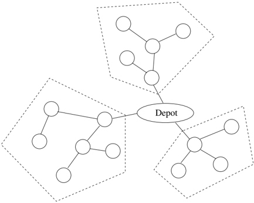

Without loss of generality, we assume that the degree of the depot is 1. First, consider the situation where there is no fixed cost associated with the use of a vehicle. Observe that a route that includes the depot as a nonterminal node can be broken up into multiple routes-each route originating and terminating at the depot-with no change in the objective value. Thus, in this situation, the problem may simply be decomposed into multiple smaller problems-one for each subtree incident to the depot node. Figure 2 illustrates this situation. On the other hand, when there is a fixed cost associated with a route (such as a loading/unloading cost), we add a new node and connect it to the depot by an edge whose cost equals the fixed cost. We make this new node the depot (observe that this node has degree 1). Finally, we set the demand of the old depot node to zero and solve the TCVRP on this network (where the depot has degree 1).

## 3 Depth First Ordered Formulation

Our first formulation exploits Lemma 1, which is illustrated in Figure 3.

Lemma 1. Suppose the nodes in a tree are indexed in depth-first order. Then, given a set of nodes in a vehicle's route, a minimum cost route is obtained by visiting the nodes in increasing order of index.

Proof. Given a set of nodes and the corresponding covering sub-tree, the vehicle must traverse each edge in the sub-tree at least twice - once going away

Fig. 3. Idea behind the DFS formulation. Given a set of nodes serviced by a vehicle (3, 4, and 8), the distance-minimizing tour for the vehicle is obtained by visiting nodes in order of increasing index when nodes are indexed by a depth-first ordering.

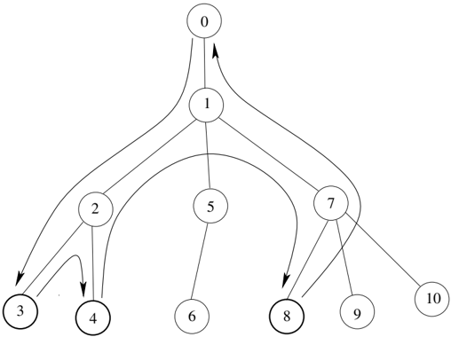

from the depot and once towards. Therefore, a lower bound on the tour length is twice the weight of the covering sub-tree.

Suppose we construct a tour by visiting nodes in order of depth first order. Given a covering sub-tree S , let T i ( ) be a sub-tree of S rooted at node i . For any i in S , the lowest indexed node in T i ( ) is i (due to depth-first ordering of nodes).

For every i in S , the vehicle enters the sub-tree T i ( ), and services all nodes in T i ( ). The key observation is that once the vehicle leaves T i ( ) it never returns since nodes are being serviced in increasing order of index. Therefore, for all i in S , the edge from i to its parent is traversed at most twice - once into the sub-tree and once out of it. This yields a feasible tour of length twice the weight of the covering sub-tree.

Since the feasible tour length is equal to the lower bound, it must be optimal. /intersectionsq /unionsq

A tour for each vehicle consists of a path from the depot to the first (lowest indexed) node in the vehicle tour, a set of arcs connecting nodes in the vehicle tour in increasing order of node index, and a path from the last (highest indexed) node in the tour back to the depot.

We introduce the following four sets of binary variables in our formulation.

## Decision Variables

x ij = { 1 if node i immediately precedes node j in the vehicle tour; 0 otherwise.

y ij = { 1 if nodes i and j are visited by the same vehicle; 0 otherwise.

w i = { 1 if node i is the first node visited in the vehicle tour; 0 otherwise.

z i = { 1 if node i is the last node visited in the vehicle tour; 0 otherwise.

Our model uses the following data that is available as input.

## Input Parameters

- D i Demand at node i

L ij Shortest path distance between nodes i and j

- S i Shortest path distance between the node i and the depot

N Set of all nodes other than the depot; N = { 1 , .., n }

- C Capacity of each vehicle

V min k A lower bound on the number of vehicles required to service nodes { k, . . . , n }

We may now state our formulation as follows, assuming that nodes are indexed in depth first order.

<!-- formula-not-decoded -->

<!-- formula-not-decoded -->

<!-- formula-not-decoded -->

<!-- formula-not-decoded -->

<!-- formula-not-decoded -->

<!-- formula-not-decoded -->

<!-- formula-not-decoded -->

The objective function is to minimize the distance of all traversed arcs (leaving and entering the depot and those in-between). Constraint (2) is the vehicle capacity constraint. Although there is no explicit concept of a vehicle in this formulation, capacity constraints are captured by summing demand over nodes that are in the same vehicle. Constraint (3) creates a clique among nodes in the same vehicle-if nodes i and j are in the same vehicle, and nodes

j and k are in the same vehicle, then nodes i and k must be in the same vehicle. Constraint (4) enforces that node i cannot precede node j unless they are both in the same vehicle. Constraints (5) and (6) force the demand at a node to be served by exactly one vehicle. Constraint (7) enforces that all variables are binary. An interesting observation is that the integrality of x , w , and z variables can be relaxed (i.e., 0 ≤ x, w, z ≤ 1) without affecting the integrality of the solution. However, we observed that in practice, the problem was solved faster if all variables were specified to be binary. Note that the number of integer variables in the DFS formulation is O( | N | 2 ) and the number of constraints is O N ( | | 3 ).

## 3.1 Valid Inequalities

We now describe some valid inequalities to improve the strength of our formulation.

The number of vehicles that service the set of nodes { k, . . . , n } is the number of vehicles that enter this set directly from the depot plus the number of vehicles that enter the set from a lower indexed node in { 1 , . . . , k -1 } . Our first valid inequality states that the number of vehicles servicing nodes { k, . . . , n } is at least some lower bound V min k .

<!-- formula-not-decoded -->

The lower bound may be obtained, for example, by solving a bin-packing problem with the node demands. Since the bin-packing problem is itself not trivially solved and our objective is ease and speed of implementation, we use an O N ( | | 2 ) procedure, developed by Labb´ et al. [8], to compute a lower e bound on the bin-packing solution. 3

The next set of valid inequalities are the following: two vehicles whose cumulative demand exceeds the vehicle capacity cannot be in the same vehicle. This can be stated as follows.

<!-- formula-not-decoded -->

3 The bound relies on the fact that at most one node with demand greater than C/ 2 and at most two nodes with demand in ( C/ , C/ 3 2] can belong to the same vehicle. First, nodes with demand &gt; C/ 2 are assigned to separate vehicles. An attempt is then made to assign the nodes with demand in ( C/ ,C/ 3 2] to these vehicles according to a first-fit procedure [4], i.e., by assigning the remaining node with smallest demand to the vehicle with the least remaining capacity (ties are broken arbitrarily) At most one node with demand in ( C/ , C/ 3 2] can fit in each of these bins. Let K be the number of nodes with demand in ( C/ , C/ 3 2] that cannot be assigned to a vehicle through this process. Then, at least /ceilingleft K/ 2 /ceilingright vehicles are needed. A lower bound on the packing problem is then generated using the vehicles assigned so far, /ceilingleft K/ 2 , and remaining nodes with demand /ceilingright ≤ C/ 3.

Fig. 4. Idea behind the treeroute formulation. Given a set of nodes serviced by a vehicle (3, 4, and 8), the distance-minimizing tour for the vehicle is a tree.

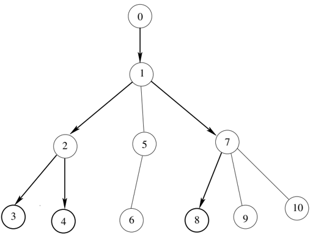

Note that this inequality is a restricted case of cover inequalities (see, for example, Nemhauser and Wolsey [10]). We do not explicitly add any more cover inequalities since there are an exponentially large number of them, and integer programming software systems have built-in algorithms for adding these cuts efficiently.

## 4 Treeroute Formulation

In this formulation, we exploit the fact that the route of a vehicle is a tree. We replace the edges in the tree with arcs pointing 'downwards' to eliminate ambiguity in the parent-child relationship of the nodes in an edge-given an arc ( i, j ), i is the parent and j is the child. The route is constructed for each vehicle by 'building upwards' from every node serviced by the vehicle towards the depot. This generates the covering sub-tree of the nodes, and will henceforth be referred to as the route-tree of that vehicle. This is shown in Figure 4.

We introduce the following binary variables in our model.

## Decision Variables

```
x ijv = { 1 if arc ( i, j ) is in the route of vehicle v ; 0 otherwise. y iv = { 1 if vehicle v services node i ; 0 otherwise.
```

Our model uses the following data that is available as input.

## Input Parameters

- L ij Distance from node i to node j
- D i The demand at node i
- P i The parent node of i
- V The set of vehicles
- N The set of nodes other than the depot
- C Capacity of each vehicle
- c i ( ) Set of children of i
- T i ( ) Sub-tree rooted at node i
- A The set of all arcs (directed downwards) in the tree

min

V i A lower bound on the number of vehicles required to service all nodes in T i ( ).

We may now formulate our model as follows.

<!-- formula-not-decoded -->

<!-- formula-not-decoded -->

<!-- formula-not-decoded -->

<!-- formula-not-decoded -->

/negationslash

<!-- formula-not-decoded -->

<!-- formula-not-decoded -->

<!-- formula-not-decoded -->

The objective is to minimize the weighted sum over all arcs of the number of vehicles that use each arc. Constraint (11) ensures that if an arc ( i, j ) is in the vehicle route tree, then the unique preceding arc ( P , i i ) must also exist in the route tree. Constraint (12) ensures that, in order to service a particular node, a vehicle must travel along the unique arc leading to that node. Constraint (13) is the vehicle capacity constraint. Constraint (14) enforces that the demand at every node is completely satisfied by exactly one vehicle.

We note that the x variables may be relaxed without affecting integrality of the solution; however, our initial computations indicated that the problem was solved faster if all variables were defined to be binary. Also, observe that the number of integer variables in the treeroute formulation is O( | N V || | ), and the number of constraints is O( | N V || | ).

## 4.1 Valid Inequalities

We now discuss valid inequalities for the treeroute formulation.

As the model stands it suffers from symmetry, i.e., exchanging the set of customers between any two vehicles produces an alternative optimal solution.

Table 1. Two solutions that are feasible to the first set of symmetry cuts. Only solution 2 is feasible to the second set.

| Solution 1 Vehicle Customers   | Solution 2 Vehicle Customers   |
|--------------------------------|--------------------------------|
| 2 5, 7, 9                      | 2 4, 6, 8                      |
| 3 4, 6, 8                      | 3 5, 7, 9                      |

This phenomenon increases run-time by expanding the search space of solutions. To get rid of the symmetry in the problem we introduce the following two sets of valid inequalities.

The first set of symmetry cuts forces each node to be serviced by a vehicle whose index is not greater than the index of the node. Node 1 is in vehicle 1, node 2 is in vehicles 1 or 2, node 3 is in vehicles 1, 2, or 3, and so on. This can be stated as follows.

<!-- formula-not-decoded -->

The second set of symmetry cuts force the lowest indexed node in each vehicle to increase with vehicle index. This is stated as follows.

<!-- formula-not-decoded -->

Consider the solutions in Table 1 that are feasible to constraint (16). In the first solution, the lowest indexed node of vehicle 2 is greater than the lowest indexed node of vehicle 3. Thus, the first solution violates constraint (17) while the second solution is feasible.

The next set of inequalities stipulates that two nodes whose cumulative demand is greater than the capacity cannot be in the same vehicle.

<!-- formula-not-decoded -->

In our computational experiments we found that the above valid inequalities improve the LP relaxation when the node demands are large (the mean node demand is comparable to half the vehicle capacity). To address the situation when the node demands are low we develop additional valid inequalities.

Our next set of valid inequalities places a lower bound on the number of vehicles that use an arc. For each arc, such a bound could be obtained by solving a bin-packing problem on the nodes of the sub-tree below that arc. The constraint, illustrated in Figure 5, is stated as follows.

<!-- formula-not-decoded -->

Fig. 5. The solution to the bin-packing problem on demands in T i ( ) is a lower bound on the number of vehicles that travel along arc ( P , i i ).

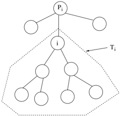

The lower bound we use is the bin-packing lower bound developed by Labb´ e et al. [8].

The final valid inequality stipulates that if a vehicle travels down an arc but does not service the node at the end of that arc, it must service some node below that arc in the tree. This constraint is illustrated in Figure 6.

/negationslash

<!-- formula-not-decoded -->

## 5 Approximation Algorithm

In this section we describe an approximation algorithm that is a combination of the algorithms of Labb´ et al. [8] and Basnet et al. [1]. We will later use e the upper bound distance from this algorithm to obtain an upper bound on the fleet size.

Fig. 6. If a vehicle travels along arc ( P , i i ) but does not service node i , then it must service some node below i .

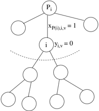

The heuristic of Labb´ et al. [8] proceeds as follows. At each iteration, an e arbitrary leaf node is chosen, and an attempt is made to merge the node with its parent. If the cumulative demand of the leaf node and its parent is less than or equal to the vehicle capacity, the demand of the leaf node is added to that of its parent, and the leaf node is removed from the tree. When the merger is not possible due to the cumulative demand exceeding vehicle capacity, there are two cases. If the leaf node has greater demand than that of its parent, a new vehicle route is created to the leaf node, and the leaf node is eliminated from the tree. Otherwise, a new route is created to the parent, the demand at the parent is replaced by that of its child, and the leaf node is eliminated. The process terminates since a leaf node is eliminated from the tree at each iteration.

The heuristic of Basnet et al. [1] could be viewed as a savings heuristic (Clarke and Wright [3]) specifically adapted to trees. Their heuristic proceeds as follows (the description provided here is different from the one in their paper). Define a non-grandparent node to be one that has only leaf nodes as children. At each iteration, the heuristic picks a non-grandparent node i that is farthest from the root. It then picks an arbitrary child j of this node i , and attempts to merge it with another child of node i . If i has multiple children, then j is merged with another child of i , say k , with the greatest demand such that D j + D k ≤ C . While Basnet et al.[1] did not provide any worst case analysis, they showed that, in practice, their algorithm was better than that of Labb´ e et al. [8] over a wide range of problem instances.

Our algorithm proceeds as follows. At each stage, we pick a non-grandparent node i . We then pack the sub-tree T i ( ) = c i ( ) ∪ { } i into a minimal set of bins using a bin-packing heuristic. This creates possibly several bins, each with some total demand not exceeding the vehicle capacity. The nodes in the subtree T i ( ) are then removed from the graph and are replaced by nodes representing the packed bins (one node for each packed bin), which are added to the tree as the children of P i (parent of node i ). This procedure continues until the depot is reached.

Our heuristic could be viewed as a combination of the heuristics of Labb´ e et al. [8] and Basnet et al. [1] in the following sense. While the former heuristic attempts to pack the demand of an arbitrary leaf node and its parent, and the latter attempts to pack the demand of all children of the farthest non-grandparent node from the depot, our algorithm picks an arbitrary nongrandparent node and attempts to pack its demand and those of its children. What sets our heuristic apart is that it simultaneously considers several nodes for merging, instead of merging nodes in a pair-wise fashion.

Figure 7 illustrates the algorithm. The sample problem is shown in Figure 7(a). In the first iteration, the nodes with demands 40, 50 and 70 are packed. This results in two nodes-one with demand 90 and one with demand 70. In the next iteration (see Figure 7(b)), nodes with demand 5, 10, 20, 70 and 90 are packed to give two nodes-one with demand 100 and one with demand 95. Since the depot has been reached (in Figure 7(c)), the algorithm stops. The

Fig. 7. (a) Initial tree, (b) and (c) Tree after packing operations, (d) Feasible solution obtained from the approximation algorithm.

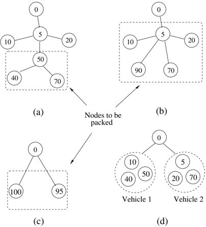

solution is shown in Figure 7(d). The pseudocode for the algorithm is given in Figure 8.

Lemma 2. Approx-TCVRP , described in Figure 8, is a 2-approximation algorithm.

Proof. Our proof is similar to that of Labb´ et al. [8]. At each iteration, a node i is chosen and the set of nodes c i ( ) ∪ { } i is packed. The result of this packing generates a set of bins such that at most one bin carries demand not exceeding half the vehicle capacity (if two bins each carried demand less than or equal to half the vehicle capacity, they would be merged into one vehicle). Thus, the number of vehicles that travel down the arc ( P , i i ) is at most /ceilingleft ( ∑ j ∈ T i ( ) D / C/ i ) ( 2) . The number of vehicles required to service /ceilingright T i ( ) is at least /ceilingleft ( ∑ j ∈ T i ( ) D /C i ) /ceilingright . Thus, the number of vehicles that travel on arc ( P , i i ) from the algorithm is at most twice the lower bound. Summing over all arcs in the tree, the total distance traveled by all vehicles in the algorithm is at most twice that of the lower bound, and thus at most twice the optimal distance. /intersectionsq /unionsq

The algorithm has as many iterations as there are non-leaf nodes. Hence, the complexity of the algorithm is essentially the complexity of the packing function times the number of non-leaf nodes. If we choose a 'simple' pack-

/* This function computes an upper bound on the optimal TCVRP distance.*/

## Notation:

N Set of nodes in the tree.

- A Set of arcs in the tree.
- P i Parent of node i .
- c i ( ) Set of children of node i .
- C Vehicle capacity.
- z The total distance of the feasible solution.

BinPack A function that takes as input a set of demand nodes, packs them into bins of capacity C , and returns the set of packed bins.

function approx-TCVRP:

begin

z

2

while

∑

i

∃

N

S

i

;

∈

/negationslash

i

R

Q

←

∈

N

:

(

i

c i

( )

i

;

←

∪

BinPack

(

R

= Depot)

);

z

z

S

i

(

R

;

←

-

|

| - |

|

A

←

∪{

∀

∈

} \ {

∀

∈

c j

(

) =

φ

∀

j

∈

(

c i

P , i

)

( ))

;

}

} \ {

end

Fig. 8. The approx-TCVRP algorithm.

ing heuristic such as the first fit decreasing heuristic which has complexity O N ( | | 2 ), the overall complexity of the approximation algorithm is O N ( | | 3 ).

## 6 Computational Experiments

## 6.1 Enhancements to the Treeroute Formulation

We now discuss some details of the implementation of the treeroute formulation that significantly affect its performance.

## Upper bound on the fleet size

The treeroute formulation requires the maximum number of vehicles to be specified. An upper bound on the number of vehicles (see Section 5) is given by

<!-- formula-not-decoded -->

i

A

(

P , i

i

)

j

Q

(

i, k

)

k

c i

( )

Q

);

P j ← P i ∀ i ∈ Q N ← N ∪ Q \ R ;

←

∧

(

c i

( ) =

/negationslash

φ

)

∧

(

do

However, we would like to have a tighter upper bound on the number of vehicles to reduce the number of variables in the formulation. Let ˆ be a heuristic z upper bound on the optimal distance. Consider the optimization problem obtained by taking the constraints in the treeroute formulation, placing a bound on the objective function, and maximizing the number of vehicles leaving the depot

<!-- formula-not-decoded -->

<!-- formula-not-decoded -->

The objective function maximizes the number of vehicles leaving the depot. Clearly, an optimal solution to this optimization problem will be an upper bound on the number of vehicles in the optimal solution to the TCVRP. However, since this integer program is as hard to solve as the original TCVRP, we solve the linear programming relaxation of this optimization problem and round down the optimal objective function value to obtain an upper bound on the fleet size. The time taken to solve this LP is negligible, and in our experiments gave very tight upper bounds (within 5-10% of optimal) on the fleet size.

## Node ordering

In its basic form, the LP relaxation is quite poor. This is because the LP relaxation tends to split demands between vehicles. In initial experiments, we found that the ordering of nodes (order in which nodes are indexed) affects performance. The node indexing scheme that we found to improve performance the greatest was to order nodes in order of decreasing demand. This makes use of the symmetry cuts early on to 'fill up' lower indexed vehicles (which leads to less unused capacity). There is less opportunity to split the demand of a high-indexed node among the low indexed vehicles.

## Variable branching order

Finally, we consider the order of branching of variables in the branch-andcut procedure. Most software packages for solving integer linear programs allow the user flexibility in specifying the branching order of variables. Since the lower indexed nodes have fewer vehicles available to them, we branch on these variables first (to prevent splitting early on in the branch-and-cut tree). Thus, y iv is branched on before y jv for all i &lt; j . Given a node, the order of branching among the different vehicles is left to the default strategy of the solver.

## 6.2 Experimental Setup

We tested the formulations on networks with 20, 40, 60, 80, and 100 nodes. We forced the degree of the depot to 1 in all our test instances. In reality, since the degree of the depot need not be 1, it is conceivable that substantially larger problems than the ones listed in this section can be solved (recall problems with depot degree k can be decomposed into k separate problems).

We generated test problems as in Labb´ e et al. [8] and Mbaraga et al. [9]. The arc distances were integers uniformly distributed in [1,100]. The vehicle capacity for all vehicles was set to be 100 units. Each node in the tree (apart from the depot) had between 1 and 5 children (distributed uniformly). Node demands were integers uniformly distributed between a lower and upper bound, which were varied to create 10 instance classes with the following demand bounds: [1,100], [10,90], [20,80], [30,70], [1,50], [1,30], [1,10], [30,30], [20,20], and [10,10].

The times reported in this section are CPU times. The formulations were coded in AMPL [5] and solved using CPLEX 9.0 [6] on a PC with 3.06 GHz processor and 512 MB of RAM. The data for all the problems requires some pre-processing (node ordering, finding lower and upper bounds on the number of vehicles, generating arc minimum-traversal constraints) but the time required to perform this computation is insignificant (of the order of seconds) compared to the time to solve the IP, and is not included under the solving time listed.

## 6.3 Experimental Results

Computational results are presented in Tables 2 through 6, which contain the following information/notation.

- 1. Solved - Number of instances (out of 10) that were solved to optimality within 3600 CPU seconds.
- 2. Time - The CPU time averaged only over solved instances.
- 3. LP/IP - Ratio of the linear programming relaxation to the optimal distance, averaged only over solved instances.
- 4. LP /IP - Ratio of linear programming relaxation ∗ without valid inequalities (constraints (2)-(6) for the DFS formulation and constraints(11)-(14) for the treeroute formulation) to the optimal distance, reported only for the 20-node instances.
- 5. Gap - This is defined as ( U -L /L ) , where U is the best solution found at termination, and L is the bound at termination (3600 seconds). This is averaged only over unsolved instances.

We observe that for the 20 node instances, the treeroute formulation performs extremely well, while the DFS formulation performs well on all but three instance classes, i.e., when the demands are in [1 , 50], [1 , 30], and [30 , 30]. This

Table 2. Results for 20 Node Problems.

| DFS FORMULATION   | DFS FORMULATION   | DFS FORMULATION   | DFS FORMULATION   | DFS FORMULATION   | DFS FORMULATION   | DFS FORMULATION   | DFS FORMULATION   | DFS FORMULATION   |
|-------------------|-------------------|-------------------|-------------------|-------------------|-------------------|-------------------|-------------------|-------------------|
| Demand            | Cons.             | Vars.             | Solved            | Time (sec.)       | Nodes             | LP/IP             | LP ∗ /IP          | Gap               |
| [1,100]           | 1310              | 380               | 10                | 0.26              | 185               | 0.980             | 0.690             | -                 |
| [10,90]           | 1310              | 380               | 10                | 0.37              | 274               | 0.977             | 0.662             | -                 |
| [20,80]           | 1304              | 380               | 10                | 0.17              | 10                | 0.973             | 0.652             | -                 |
| [30,70]           | 1297              | 380               | 10                | 0.07              | 3                 | 0.980             | 0.602             | -                 |
| [1,50]            | 1216              | 380               | 9                 | 267.45            | 66492             | 0.983             | 0.738             | 0.012             |
| [1,30]            | 1216              | 380               | 10                | 50.97             | 2568              | 0.990             | 0.839             | -                 |
| [1,10]            | 1216              | 380               | 10                | 0.06              | 0                 | 1.000             | 0.932             | -                 |
| [30,30]           | 1216              | 380               | 5                 | 1678.45           | 524860            | 0.965             | 0.667             | 0.029             |
| [20,20]           | 1216              | 380               | 10                | 1.33              | 30                | 1.000             | 0.738             | -                 |
| [10,10]           | 1216              | 380               | 10                | 2.92              | 16                | 1.000             | 0.953             | -                 |

## TREEROUTE FORMULATION

Demand Cons. Vars. Solved Time (sec.)

Nodes LP/IP LP /IP

[1,100]

655

456

10

0.03

[10,90]

[20,80]

[30,70]

[1,50]

[1,30]

[1,10]

[30,30]

[20,20]

644

668

631

319

214

129

368

220

456

475

448

224

144

76

266

152

10

10

10

10

10

10

10

10

0.06

0.07

0.08

1.36

0.06

0.00

18.26

0.02

∗

10

0.979

0.447

44

21

54

1251

49

0

19791

1

0.977

0.972

0.980

0.982

0.990

1.000

0.960

1.000

0.481

0.491

0.439

0.700

0.818

0.930

0.633

0.710

Gap

-

-

-

-

-

-

-

-

-

[10,10]

129

76

10

0.01

0

1.000

0.943

-

difference in performance occurs in spite of the LP relaxations being comparably strong. Note that the valid inequalities significantly improve the quality of the LP-relaxation for both formulations.

As the problem sizes increase, the DFS formulation starts to perform very poorly except on the [20 , 80] and [30 , 70] instances. Interestingly, although the time taken by the treeroute formulation on these instances is less than the DFS formulation, the number of branch-and-bound nodes explored by the DFS formulation is much smaller. This suggests that the DFS formulation performs a lot of work solving the successive linear programs, which is not surprising given the huge number of constraints.

In all of the instances, the termination gap for the treeroute formulation is very small (almost always less than 2%, and often less than 1%), which is a sufficiently high accuracy in most practical situations.

Table 3. Results for 40 Node Problems.

| DFS FORMULATION   | DFS FORMULATION   | DFS FORMULATION   | DFS FORMULATION   | DFS FORMULATION   | DFS FORMULATION   | DFS FORMULATION   | DFS FORMULATION   |
|-------------------|-------------------|-------------------|-------------------|-------------------|-------------------|-------------------|-------------------|
| Demand            | Cons.             | Vars.             | Solved            | Time (sec.)       | Nodes             | LP/IP             | Gap               |
| [1,100]           | 10433             | 1560              | 5                 | 90.02             | 4859              | 0.993             | 0.016             |
| [10,90]           | 10375             | 1560              | 6                 | 944.99            | 29622             | 0.972             | 0.013             |
| [20,80]           | 10390             | 1560              | 8                 | 38.26             | 648               | 0.960             | 0.015             |
| [30,70]           | 10369             | 1560              | 10                | 5.63              | 82                | 0.968             | -                 |
| [1,50]            | 10036             | 1560              | 0                 | -                 | -                 | -                 | 0.023             |
| [1,30]            | 10036             | 1560              | 2                 | 61.04             | 16                | 1.000             | 0.011             |
| [1,10]            | 10036             | 1560              | 10                | 283.61            | 86                | 0.998             | -                 |
| [30,30]           | 10036             | 1560              | 0                 | -                 | -                 | -                 | 0.024             |
| [20,20]           | 10036             | 1560              | 4                 | 932.21            | 1920              | 1.000             | 0.000             |
| [10,10]           | 10036             | 1560              | 4                 | 1251.99           | 408               | 1.000             | 0.001             |

## TREEROUTE FORMULATION

Demand Cons. Vars. Solved Time (sec.) Nodes LP/IP

[1,100]

2544

1864

10

1.65

319

0.979

[10,90]

[20,80]

[30,70]

[1,50]

[1,30]

[1,10]

[30,30]

[20,20]

2447

2594

2516

1205

743

346

1389

836

1794

1888

1833

913

554

226

1061

624

10

10

9

5

10

10

4

10

14.31

135.30

70.75

356.74

113.93

0.04

321.46

18.35

2481

30969

13905

38562

43781

6

13011

1187

0.968

Gap

-

-

0.959

-

0.969 0.003

0.998 0.023

0.996

-

0.998

-

0.982 0.012

1.000

-

[10,10]

459

320

10

0.96

176

0.999

-

The DFS formulation appears to perform best on instances where the demand is in [30 , 70]. This is because the size of the cliques created are relatively small. The DFS formulation does extremely poorly when the demand is small (packing problem is more complex). The treeroute formulation, on the other hand, does poorly on the [30 , 70] and [20 , 80] instances and does well when the demands are relatively small. Although the LP relaxation is very strong, the treeroute formulation struggles on some instances due to problem symmetry.

## 7 Conclusions

In this chapter we presented two integer linear programming formulations and valid inequalities for the capacitated vehicle routing problem on trees.

Table 4. Results for 60 Node Problems.

| DFS FORMULATION   | DFS FORMULATION   | DFS FORMULATION   | DFS FORMULATION   | DFS FORMULATION   | DFS FORMULATION   | DFS FORMULATION   | DFS FORMULATION   |
|-------------------|-------------------|-------------------|-------------------|-------------------|-------------------|-------------------|-------------------|
| Demand            | Cons.             | Vars.             | Solved            | Time (sec.)       | Nodes             | LP/IP             | Gap               |
| [1,100]           | 35327             | 3540              | 3                 | 811.53            | 9978              | 0.977             | 0.022             |
| [10,90]           | 35373             | 3540              | 3                 | 710.26            | 10341             | 0.981             | 0.023             |
| [20,80]           | 35306             | 3540              | 7                 | 605.51            | 2928              | 0.973             | 0.006             |
| [30,70]           | 35260             | 3540              | 9                 | 316.52            | 2                 | 0.971             | 0.002             |
| [1,50]            | 34456             | 3540              | 0                 | -                 | -                 | -                 | 0.030             |
| [1,30]            | 34456             | 3540              | 0                 | -                 | -                 | -                 | 0.018             |
| [1,10]            | 34456             | 3540              | 7                 | 399.91            | 0                 | 1.000             | 0.024             |
| [30,30]           | 34456             | 3540              | 0                 | -                 | -                 | -                 | 0.039             |
| [20,20]           | 34456             | 3540              | 0                 | -                 | -                 | -                 | 0.000             |
| [10,10]           | 34456             | 3540              | 0                 | -                 | -                 | -                 | 0.012             |

## TREEROUTE FORMULATION

Demand Cons. Vars. Solved Time (sec.) Nodes LP/IP

Gap

[1,100]

5744

4283

9

100.97

7757

0.971 0.010

[10,90]

[20,80]

[30,70]

[1,50]

[1,30]

[1,10]

[30,30]

[20,20]

5965

5843

5787

2829

1630

707

3127

1831

4437

4342

4295

2171

1251

496

2407

1416

7

7

9

0

4

10

0

5

34.52

736.61

230.44

-

382.15

0.34

-

474.45

2939

58913

20653

-

11975

18

-

5578

0.977 0.005

0.975 0.003

0.974 0.004

- 0.026

0.998 0.004

0.999

-

- 0.015

1.000 0.000

[10,10]

1063

791

6

444.46

28984

1.000 0.004

The formulations proposed exploit the tree structure of the graph to achieve high quality solutions for the TCVRP.

While it is difficult to compare the results of Mbaraga et al. [9] to ours due to differences in testing methodology (restricting the degree of the depot, different cutoff time limits, different computing resources), we were able to solve problems of comparable size to those in their study (they tested and were able to solve problems of up to 140 nodes). Our key contribution is that the performance of these formulations is competitive with other special purpose code developed for the problem, and can be implemented easily using off-the-shelf software for modeling and solving integer programs. This is a significant benefit to practitioners, who may not have the mathematical and programming sophistication to implement branch-and-cut, branch-and-price,

Table 5. Results for 80 Node Problems.

| DFS FORMULATION   | DFS FORMULATION   | DFS FORMULATION   | DFS FORMULATION   | DFS FORMULATION   | DFS FORMULATION   | DFS FORMULATION   | DFS FORMULATION   |
|-------------------|-------------------|-------------------|-------------------|-------------------|-------------------|-------------------|-------------------|
| Demand            | Cons.             | Vars.             | Solved            | Time (sec.)       | Nodes             | LP/IP             | Gap               |
| [1,100]           | 83897             | 6320              | 0                 | -                 | -                 | -                 | 0.042             |
| [10,90]           | 83956             | 6320              | 0                 | -                 | -                 | -                 | 0.037             |
| [20,80]           | 83993             | 6320              | 3                 | 1622.71           | 326               | 0.974             | 0.024             |
| [30,70]           | 84062             | 6320              | 6                 | 2016.72           | 1                 | 0.976             | 0.028             |
| [1,50]            | 82476             | 6320              | 0                 | -                 | -                 | -                 | 0.023             |
| [1,30]            | 82476             | 6320              | 0                 | -                 | -                 | -                 | 0.018             |
| [1,10]            | 82476             | 6320              | 0                 | -                 | -                 | -                 | 0.003             |
| [30,30]           | 82476             | 6320              | 0                 | -                 | -                 | -                 | 0.047             |
| [20,20]           | 82476             | 6320              | 0                 | -                 | -                 | -                 | 0.002             |
| [10,10]           | 82476             | 6320              | 0                 | -                 | -                 | -                 | 0.008             |

## TREEROUTE FORMULATION

Demand Cons. Vars. Solved Time (sec.) Nodes LP/IP

Gap

[1,100]

9670

7173

4

896.29

30387

0.975 0.009

[10,90]

[20,80]

[30,70]

[1,50]

[1,30]

[1,10]

[30,30]

[20,20]

10167

10671

10941

4472

2880

1110

5715

3280

7616

7853

8105

3460

2244

806

4440

2544

4

4

7

0

1

10

0

1

1526.81

719.30

167.33

-

3489.74

4.03

-

245.37

59840

17443

7033

-

14669

183

-

876

0.969 0.009

0.968 0.011

0.977 0.004

- 0.023

1.000 0.014

1.000

-

- 0.024

1.000 0.002

[10,10]

1767

1359

3

899.29

12397

1.000 0.005

or even native optimization code (i.e., code directly using the callable library of the optimization package).

The formulations were tested on a large set of instances with varying number of nodes and demand patterns. As shown by the results in Table 2, the proposed valid inequalities significantly improve the strength of both formulations. It is found that the DFS formulation performs well on small problems where the demands exhibit low variance and average demand is large. The DFS formulation performs poorly when the packing problem is complex (if there exist demands that are much smaller than the vehicle capacity). The treeroute formulation performs well on instances where the average demand is large and the demands show considerable variance, due to a lack of symmetry in these problems. In general, both formulations have tight LP relaxations,

Table 6. Results for 100 Node Problems.

| DFS FORMULATION   | DFS FORMULATION   | DFS FORMULATION   | DFS FORMULATION   | DFS FORMULATION   | DFS FORMULATION   | DFS FORMULATION   | DFS FORMULATION   |
|-------------------|-------------------|-------------------|-------------------|-------------------|-------------------|-------------------|-------------------|
| Demand            | Cons.             | Vars.             | Solved            | Time (sec.)       | Nodes             | LP/IP             | Gap               |
| [1,100]           | 164495            | 9900              | 0                 | -                 | -                 | -                 | 0.043             |
| [10,90]           | 164450            | 9900              | 0                 | -                 | -                 | -                 | 0.044             |
| [20,80]           | 164540            | 9900              | 0                 | -                 | -                 | -                 | 0.039             |
| [30,70]           | 164491            | 9900              | 1                 | 3480.01           | 0                 | 0.972             | 0.035             |
| [1,50]            | 162096            | 9900              | 0                 | -                 | -                 | -                 | 0.041             |
| [1,30]            | 162096            | 9900              | 0                 | -                 | -                 | -                 | 0.020             |
| [1,10]            | 162096            | 9900              | 0                 | -                 | -                 | -                 | 0.005             |
| [30,30]           | 162096            | 9900              | 0                 | -                 | -                 | -                 | 0.048             |
| [20,20]           | 162096            | 9900              | 0                 | -                 | -                 | -                 | 0.003             |
| [10,10]           | 162096            | 9900              | 0                 | -                 | -                 | -                 | 0.005             |

## TREEROUTE FORMULATION

Demand

[1,100]

[10,90]

[20,80]

[30,70]

[1,50]

[1,30]

[1,10]

[30,30]

[20,20]

Cons.

Vars. Solved Time (sec.) Nodes LP/IP

15357 11484

Gap

1

128.74

5743

0.982 0.007

16022 12019

16530 12296

16739 12474

7882

6158

4457

1717

9088

5080

3524

1287

7088

4019

1

2

2

0

0

8

0

0

16.74

475.99

30.87

-

-

53.56

-

-

54

30570

672

-

-

867

-

-

0.971 0.008

0.981 0.009

0.975 0.010

- 0.041

- 0.015

0.999 0.001

- 0.026

- 0.003

[10,10]

2728

2119

1

57.79

285

1.000 0.003

but the treeroute formulation often out-performs the DFS formulation and should be the model of choice.

Recall, the number of integer variables in the DFS formulation is O( | N | 2 ) and for the treeroute formulation is O( | N V || | ). Further, the number of constraints in the DFS model is O N ( | | 3 ), while that in the treeroute formulation is O( | N V || | ). Hence, the treeroute formulation is more scalable than the DFS formulation, which is one reason for its better performance. We should also note that the 2-approximation algorithm described in Section 5 gives very tight upper bounds (usually within 2% of optimal).

The treeroute formulation can be extended to the heterogeneous vehicle routing problem introduced by Mbaraga et al. [9]. This is done by eliminating the symmetry cuts and modifying the capacity constraint (13) to

<!-- formula-not-decoded -->

where C v is the capacity of vehicle v .

In summary, we have developed strong models that exploit the structure of the underlying graph, and a heuristic procedure, for the TCVRP problem. Our motivation, was to develop models within the framework afforded by highlevel optimization modeling languages like AMPL, GAMS, and OPL, with a view to easy implementation for the practitioner. To that end, we believe we have successfully demonstrated that by cleverly exploiting the structure of the underlying graph, it is possible to solve large-scale versions of the TCVRP even while using a high-level modeling language. We hope this research will spur further discussion of specialized models for VRP (and other network problems), with a greater focus on the use of the models within a high-level modeling language (as is often the case in practice).

## References

- 1. C. Basnet, L.R. Foulds, and J.M. Wilson. Heuristics for vehicle routing on treelike networks. Journal of the Operational Research Society , 50:627-635, 1999.
- 2. I. Berger, J.-M. Bourjolly, and G. Laporte. Branch-and-bound algorithms for the multi-product assembly line balancing problem. European Journal of Operational Research , 58:215-222, 1992.
- 3. G. Clarke and J. Wright. Scheduling of vehicles from a central depot to a number of delivery points. Operations Research , 12:568-581, 1964.
- 4. E. G. Coffman, M. R. Garey, and D. S. Johnson. Approximation algorithms for bin packing - an updated survey. In G. Ausiello, M. Lucertini, and P. Serafini, editors, Algorithms design for computer system design , pages 49-106. SpringerVerlag, New York, 1984.
- 5. R. Fourer, D. M. Gay, and B. W. Kernighan. AMPL: A Modeling Language for Mathematical Programming . The Scientific Press, 1993.
- 6. ILOG. Cplex 9.0 reference manual, 2003.
- 7. J. Kallrath, editor. Modeling Languages in Mathematical Optimization , volume 88 of Applied Optimization . Springer Publishing Company, 2004.
- 8. M. Labb´ e, G. Laporte, and H. Mercure. Capacitated vehicle routing on trees. Operations Research , 39:616-622, 1991.
- 9. P. Mbaraga, A. Langevin, and G. Laporte. Two exact algorithms for the vehicle routing problem on trees. Naval Research Logistics , 46:75-89, 1999.
- 10. G. L. Nemhauser and L. A. Wolsey. Integer and Combinatorial Optimization . John Wiley and Sons, New York, 1988.
- 11. P. Toth and D. Vigo, editors. The Vehicle Routing Problem , volume 9 of SIAM Monographs on Discrete Mathematics and Applications . SIAM, Philadelphia, PA, 2002.

## Using a Genetic Algorithm to Solve the Generalized Orienteering Problem

Xia Wang , Bruce L. Golden , and Edward A. Wasil 1 2 3

1 Department of Mathematics University of Maryland College Park, MD 20742 lilywang@math.umd.edu

2 Robert H. Smith School of Business Department of Decision and Information Technologies University of Maryland College Park, MD 20742

bgolden@rhsmith.umd.edu

- 3

Kogod School of Business American University Washington, DC 20016 ewasil@american.edu

Summary. In this chapter, we use genetic algorithms (GAs) to solve the generalized orienteering problem (GOP). In the orienteering problem (OP), we are given a transportation network in which a start point and an end point are specified, and other points have associated scores. Given a fixed amount of time, the goal is to determine a path from start to end through a subset of the other locations in order to maximize the total path score. In the GOP, each point has a score with respect to a number of attributes (e.g., natural beauty, historical significance, cultural and educational attractions, and business opportunities) and the overall objective function is nonlinear. The GOP is more difficult than the OP, which is itself NP-hard. An effective heuristic using artificial neural networks (ANNs), however, has been designed to solve the GOP. In this chapter, we show that a straightforward GA can yield comparable results.

Key words: Generalized orienteering problem; genetic algorithm.

## 1 Introduction

The orienteering problem has been studied extensively in the literature since the early 1980s. In the orienteering problem (OP), we are given a transportation network in which a start point and an end point are specified, and other

B. Golden et al. (eds.), The Vehicle Routing Problem , doi: 10.1007/978-0-387-77778-8 12, c © Springer Science+Business Media, LLC 2008

points have associated scores. Given a fixed amount of time, the goal is to determine a path from start to end through a subset of the other locations in order to maximize the score of the total path. In the GOP, each point has a score with respect to a number of attributes and the overall objective function is nonlinear. The GOP is more difficult than the OP, which is itself NP-hard [6]. Therefore, researchers have proposed a variety of heuristics for these two problems. Wang et al. [6, 7] applied artificial neural networks to obtain high-quality solutions to the OP and GOP in a reasonable amount of time. Chao et al. [1] applied deterministic annealing to the OP and also obtained high-quality results. Gendreau et al. [3] applied tabu search to the OP and obtained near-optimal solutions to instances with up to 300 nodes. Laporte and Rodr´ ıquez-Mart´ ın [4] present a recent overview.

Now consider the following hypothetical problem. A traveler comes to China and has time to visit several cities. The traveler has multiple goals in mind (e.g., enjoy the natural beauty of the country, visit sites of historical interest, attend some major cultural events, and identify promising business opportunities). Since travel between Chinese cities is expensive and our traveler must adhere to a budget restriction, we impose a limit on the overall distance that the journey can take. Given this distance constraint, the traveler seeks to do well (in terms of score) with respect to each goal. This problem is the generalized orienteering problem.

Other potential applications of the GOP involve military scenarios. For example, suppose that a submarine or an unmanned aircraft is involved in surveillance activities in which it must visit and photograph a subset of points (each with multi-dimensional benefits) and return to its base subject to a fuel/time constraint.

The main difference between the GOP and the OP lies in the objective function. In the OP, the total score is obtained by summing the scores associated with each point along the path from start to end, while in the GOP, the total score is a more complicated (nonlinear) function of the points visited.

The motivation for the objective function is based on the following observation. The Tai Mountain is quite beautiful and its score with respect to natural beauty might be 8. The Huang Mountain, however, is the most beautiful in all of China; its score might be 10. If one visits the Tai Mountain alone, a score of 8 is achieved. Visiting both mountains, however, might lead to a score of less than 18. The GOP is, therefore, a combinatorial optimization problem with multiple goals and a nonlinear objective function to be maximized. The outline of this chapter is as follows. We formulate the GOP and describe a GA approach in Section 2. In Section 3, we solve a problem with 27 Chinese cities and compare the results produced by our GA to the results produced by the ANN of Wang et al. [7]. Conclusions are presented in Section 4.

## 2 Problem Description

Let G V,E ( ) be a complete graph with n points (or cities), where V is the set of points and E is the set of edges in the graph. The cost d i, j ( ) is the distance or travel time between points i and j . We assume that distances satisfy the triangle inequality. Both the start and end points are the same (point 1) in this chapter, although this need not be the case. Each point in V has a score vector S i ( ) = ( S 1 ( ) i , S 2 ( ) i , ..., S m ( )), where i m is the number of independent goals, and S g ( ) is the score of point i i with respect to goal g .

Now we discuss the objective function that we want to maximize. We define the total score of a path P starting and ending at point 1 as

<!-- formula-not-decoded -->

where W g is the weight that the traveler attaches to goal g . It can be shown that as k grows very large, ¯ approaches Z Z , where

<!-- formula-not-decoded -->

If k = 1 and m = 1, (1) is the objective function of the OP. Therefore, the OP is a special case of the GOP. Since the OP is an NP-hard problem, the GOP is at least as hard. The key constraint is

<!-- formula-not-decoded -->

where D lim is the pre-defined distance limit. So the goal is to maximize (1) subject to (3). In other words, the total distance of the path cannot exceed the maximum distance D lim .

## 2.1 Structure of the GA

Genetic algorithms make use of a vocabulary borrowed from the theory of evolution and natural selection. There is a population of individuals. These individuals are often referred to as chromosomes. Chromosomes typically contain a linear sequence of genes. Each gene represents a piece or part of a solution. An evolutionary process run on a population of chromosomes corresponds to a search over the space of potential solutions. GAs have been applied to a variety of combinatorial optimization problems including the vehicle routing problem and the traveling salesman problem [5, 8]. We now describe a GA for solving the GOP. The full details of our implementation are given later in the chapter.

Input: Distance matrix, Point locations, Score vector ( S ) , Weight vector ( W ), Distance limit ( D lim ), Max step, Population size ( POP ), Probability of

crossover ( PC ), Probability of mutation ( PM ). Output: Best ¯ -score, Best Z path, Total distance of the best path.

Step 0: Initialize a population of paths, where each path starts and ends at point 1. Set the initial generation i = 1.

Step 1: For generation i , perform queen-bee crossover and two-opt mutation on all paths, regardless of feasibility.

Step 2: Given the distance limit, transform each path into a feasible path and select the next generation based on proportional fitness. Increase i by one.

Step 3: Go to step 1 for another pass. Terminate the algorithm if the number of generations reaches Max step, or the current best solution stays the same for up to five passes, and output the best solution.

## 2.2 Algorithm Details

Now we explain the steps in detail.

## Step 0. Initialization

Each chromosome is a path (tour) starting from and ending at city 1. The initial population is of size POP ( POP = 51). Each path contains all 27 cities and each city (except the first) is visited exactly once. Start with city 1. Choose the closest city with probability 0.4, the second closest with probability 0.3, and the third closest with probability 0.3. When there are two cities left, we select the closest city with probability 0.6 and the second closest with probability 0.4. We select the last city with probability 1 and return to city 1. Do this 50 times. Each time, save the (forward) tour and the reverse tour, which yields 100 tours. From each tour, we extract a feasible path by removing the fewest consecutive cities at the end of the tour (other than city 1) such that the remaining path is still feasible. (As a result, the forward and reverse tours will typically have different objective function values.) We then select the best 51 feasible paths to serve as the initial generation.

## Step 1. Evolution

Continue until the number of generations reaches Max step (Max step = 50), or the current best solution stays the same for up to five passes.

## Crossover

Here we use queen-bee selection and edge recombination crossover (ERC) [8]. The current best path is called the Queen and we select 25 other paths by proportional fitness to mate with the Queen. Suppose path I is the Queen and path J is one of these other 25 paths. We now define the adjacency matrix A . The dimension of A is 27 by 4. In row i , the first two components are successor and predecessor of city i on path I , and the next two components are successor and predecessor of city i on path J . With PC = 0 95, we generate new paths . I ′ and J ′ from A in the following way.

For simplicity, we consider an example with eight cities. Suppose the parent paths are I = [1 3 4 6 7 2 5 8 1] and , , , , , , , , J = [1 4 7 6 2 3 5 8 1]. In matrix , , , , , , , , A , we have a i 1 = successor of city i on path I , a i 2 = predecessor of city i on path

I , a i 3 = successor of city i on path J , and a i 4 = predecessor of city i on path J . Because one city has at most four different neighbors on the two paths, the resulting adjacency matrix A is of dimension 8 by 4 and is given by

<!-- formula-not-decoded -->

The first row of A is (3 , 8 4 0), since 3 follows 1 and 8 precedes 1 on path , , I and 4 follows 1 and 8 precedes 1 on path J . Since 8 appears twice, we set a i 4 = 0 instead of a i 4 = 8. Hence, the 'close' neighbors of city 1 on path I and J are (3 , 8 4 0), the 'close' neighbors of city 2 are (5 , , , 7 3 6), and so on. , , The matrix A does not include city 1, since city 1 is the starting point. We begin by selecting a city to follow city 1.

To generate path I ′ , we start from city 1. We choose a successor from the list of, at most, four close neighbors. Since the edge distances are known, we select the closest neighbor with probability one half. If this city is not selected, we select one of the remaining close neighbors with equal probability. (If there is only one neighbor, we select it with certainty.) Suppose city 4 is selected in row one of A .

We now repeat the process from city 4. Suppose city 3 is selected as the next city to visit, and then city 5. From city 5, city 8 is chosen. Since city 8 has only city 5 as a close neighbor and it is already on our path, we randomly choose a remaining unselected city. Suppose this is city 6. From city 6, we select city 7 and then city 2. This yields I ′ = [1 4 3 5 8 6 7 2 1]. Path , , , , , , , , J ′ is generated in a similar way.

To avoid selecting the same city more than once, we delete a city from matrix A as soon as it is selected. An advantage of ERC is that some of the path segments of parents are inherited by their offspring.

Each crossover operation begins with two parents and leads to two offspring. The total number of offspring computed from crossover per generation is 25 × 2 × 2 = 100, since each offspring is stored in forward and reverse order.

## Two-Opt Mutation

On every path in the population, with probability PM , we search between two cities other than city 1, and apply two-opt to obtain an improved sequence of these cities. Namely, we select two cities α and β and reverse the sequence of cities on the path from α to β in the tour. We accept the new path if the score is improved (increased). We continue this procedure in a systematic way until we can no longer improve the score of the path [5]. We set PM to 0.5 to maintain the necessary variability. Of course, the paths generated by crossover and mutation may not be feasible GOP paths. In particular, the total distance

may exceed the pre-specified limit. In Step 2, we determine whether the path is feasible. If it is not, we repair it so that it becomes feasible.

## Step 2. Selection

Again, we point out that the crossover and mutation operations are performed on the non-truncated tours, without regard to feasibility. GA selection in the GOP consists of two parts. Given the upper bound on total distance, we first test the feasibility of each path and delete some cities if including them results in the violation of this constraint. In the second part, we select the next generation of paths based on proportional fitness.

## Part I. Feasibility Check

If a path is infeasible, then we modify it to restore feasibility. Specifically, given a path of cities, we accumulate the distances between consecutive cities until the total distance exceeds the distance limit. Next, we remove the last city (other than city 1) at the end of the path such that the remaining path is still feasible. Finally, we calculate the objective function ¯ of each path. Z

## Part II. Proportional Fitness Selection

We select the next generation by proportional fitness. Each path has a fitness equal to its ¯ -score (since we seek to maximize Z ¯ -score). Therefore, the Z larger the ¯ -score, the more likely the corresponding path is to survive to the Z next generation. Specifically, we have Prob { select path i } = ¯ Z / i ( ∑ POP i =1 ¯ ). Z i In addition, we always retain the best path found from one generation to the next. This makes the process an elitist genetic algorithm (EGA) [2], which ensures that the quality of the population will not degenerate from one generation to the next. In each generation, we check forward and reverse paths. Each path is available for selection according to its fitness. Since there are 100 intermediate paths from crossover, 100 intermediate paths from mutation, and 102 parent paths, we actually select 51 paths from 302 candidate paths. In particular, we retain the best path and select 50 others based on proportional fitness. We note that feasibility with respect to distance is ignored during crossover and mutation in order to promote diversity. Only during the selection step do we focus on feasibility.

In terms of parameter values, we started with POP = 51. In preliminary experiments in which we tried larger values, we observed that running times increased significantly, but the performance of EGA did not. PC and PM were set to common values (0.95 and 0.5) reflecting the relative importance of crossover and mutation within EGA.

## 3 Computational Results

We use the 27 cities in China for our experiments. Table 1 includes the longitudes, latitudes, and scores for each of these cities. Each city has four scores ( S 1 , S 2 , S 3 , and S 4 ) which represent natural beauty, historical significance, cultural and educational attractions, and business opportunities, respectively.

These scores are scaled from 1 to 10. The higher the score, the more attractive the city. The distance between cities i and j is calculated over a spherical surface and the average radius of the earth (6371 kilometers) is used in these calculations (see the Appendix for details). In addition, the distance matrix is available at http://www.rhsmith.umd.edu/faculty/bgolden/vrp data.htm.

In this section, we compare our GA with a sophisticated artificial neural network model (ANN) [7]. The ANN is a modified, continuous Hopfield neural network which uses discrete-time dynamics and gradient descent to update intermediate solutions.

The ANN was coded in C. Our GA was coded in MATLAB. Both codes were run on a Windows XP, Pentium-III PC with 1.0 GHz speed and 384MB of memory.

We use five different values of k in our experiments. In particular, if k = 1 , Z ¯ = ∑ m g =1 W g [ ∑ i ∈ P [ S g ( )]]; i

if k = 4 , Z ¯ = ∑ m g =1 W g [ { ∑ i ∈ P [ S g ( )] i 4 } 1 / 4 ];

if k = 3 , Z ¯ = ∑ m g =1 W g [ { ∑ i ∈ P [ S g ( )] i 3 } 1 / 3 ];

if k = 5 , Z ¯ = ∑ m g =1 W g [ { ∑ i ∈ P [ S g ( )] i 5 } 1 / 5 ];

Each comparison involves a combination of weight vectors and a distance limit. In each case, Beijing is both the origin and destination. The weight vectors used in our experiments are W 0 = (0 25 0 25 0 25 0 25), . , . , . , . W 1 = (1 0 0 0), , , , W 2 = (0 1 0 0), , , , W 3 = (0 0 1 0), and , , , W 4 = (0 0 0 1). , , , W 0 gives equal weight to each of the four goals. Weight vectors W 1 , W 2 , W 3 , and W 4 emphasize a single goal, respectively. The two distance limits are 5000 km and 11,000 km. The computational results are presented in Tables 2 through 6.

if k = 10 , Z ¯ = ∑ m g =1 W g [ { ∑ i ∈ P [ S g ( )] i 10 } 1 / 10 ].

In each of the five tables of computational comparisons, there are six cases. Out of the 30 cases in total, EGA outperforms ANN (with respect to score) in eight cases, ANN beats EGA in four cases, and ANN and EGA are tied in 18 cases. Despite the fact that ANNs are specifically designed to handle highly nonlinear data (which is what we have here) and GAs are not, the GA slightly outperforms the ANN in an overall sense. In addition, it is faster.

## 4 Conclusions

The impact of k on the results is clear. If k = 1, then the objective function is the sum of the relevant individual scores. The larger the value of k , the larger the effect of high individual scores on the overall objective function. The value of the objective function decreases to the highest score of the city on the path as k goes to infinity. Setting k = 5 is a reasonable compromise, in that the total score is still heavily influenced by the city with the highest score on a path, but not exclusively so.

In comparing EGA against ANN, we observe the following key points. First, the running times of EGA are generally smaller than those of ANN.

This is despite the fact that ANN is coded in C and EGA is coded in (the much slower) MATLAB. Secondly, ANN is a code specifically designed to handle nonlinear problems (such as the GOP), whereas EGA is not. EGA is comparable to ANN with respect to solution quality and it is faster. Our results demonstrate that genetic algorithms can perform well on the GOP and should perform well on other nonlinear combinatorial optimization problems.

Table 1. Locations and Scores of 27 Cities in China

|    | City         |   Lon. |   Lat. |   S 1 |   S 2 |   S 3 |   S 4 |    | City      | Lon.   | Lat.   | S 1   | S 2   | S 3   | S 4   |
|----|--------------|--------|--------|-------|-------|-------|-------|----|-----------|--------|--------|-------|-------|-------|-------|
|  1 | Beijing      | 116.4  |  39.91 |     8 |    10 |    10 |     7 | 15 | Wuhan     | 114.30 | 30.55  | 6     | 6     | 8     | 6     |
|  2 | Tianjin      | 117.18 |  39.16 |     6 |     5 |     8 |     8 | 16 | Changsha  | 113.00 | 28.20  | 6     | 6     | 6     | 5     |
|  3 | Jinan        | 117    |  36.67 |     7 |     7 |     5 |     6 | 17 | Guangzhou | 113.15 | 23.15  | 6     | 6     | 5     | 10    |
|  4 | Qingdao      | 120.33 |  36.06 |     7 |     4 |     5 |     7 | 18 | Haikou    | 110.35 | 20.02  | 7     | 3     | 4     | 8     |
|  5 | Shijiazhuang | 114.5  |  38.05 |     5 |     4 |     5 |     5 | 19 | Guilin    | 110.29 | 25.28  | 10    | 4     | 4     | 4     |
|  6 | Taiyuan      | 112.58 |  37.87 |     5 |     6 |     5 |     5 | 20 | Xi'an     | 108.92 | 34.28  | 5     | 9     | 8     | 6     |
|  7 | Huhehaote    | 111.7  |  40.87 |     6 |     6 |     5 |     5 | 21 | Yinchuan  | 106.27 | 38.48  | 5     | 7     | 5     | 5     |
|  8 | Zhengzhou    | 113.6  |  34.75 |     5 |     6 |     5 |     5 | 22 | Lanzhou   | 103.80 | 36.03  | 7     | 6     | 5     | 6     |
|  9 | Huangshan    | 118.29 |  29.73 |     9 |     3 |     2 |     2 | 23 | Chengdu   | 104.07 | 30.66  | 6     | 7     | 6     | 5     |
| 10 | Nanjing      | 118.75 |  32.04 |     7 |     8 |     8 |     6 | 24 | Guiyang   | 106.70 | 26.59  | 8     | 5     | 4     | 5     |
| 11 | Shanghai     | 121.45 |  31.22 |     5 |     4 |     9 |     9 | 25 | Kunming   | 102.80 | 25.05  | 9     | 7     | 7     | 6     |
| 12 | Hangzhou     | 120.15 |  30.25 |     9 |     8 |     7 |     6 | 26 | Shenyang  | 123.40 | 41.80  | 5     | 8     | 5     | 6     |
| 13 | Nanchang     | 115.88 |  28.35 |     7 |     6 |     5 |     5 | 27 | Dalian    | 121.60 | 38.92  | 7     | 5     | 6     | 7     |
| 14 | Fuzhou       | 119.3  |  26.1  |     6 |     5 |     5 |     7 |    |           |        |        |       |       |       |       |

Table 2. EGA vs. ANN ( k = 1)

| W   |   D lim | Alg.   |   Total Distance |   Score | Path                                                                        |   Time (sec) |
|-----|---------|--------|------------------|---------|-----------------------------------------------------------------------------|--------------|
| W0  |    5000 | EGA    |           4987.5 |   99.5  | 1-2-5-6-8-15-13-9-11-12-10-3-4-27-26-1                                      |         32.5 |
| W0  |    5000 | ANN    |           4987.5 |   99.5  | 1-27-4-10-11-12-9-13-16-15-8-20-6-5-3-2-1                                   |         61.2 |
| W1  |    5000 | EGA    |           4962.7 |  105    | 1-2-27-4-10-11-12-9-14-13-16-15-8-6-5-3-1                                   |         37.7 |
| W1  |    5000 | ANN    |           4811.7 |  105    | 1-7-6-5-3-8-15-16-13-9-12-11-10-4-27-2-1                                    |         36   |
| W2  |    5000 | EGA    |           4987.5 |   97    | 1-2-3-5-6-20-8-15-16-13-9-12-11-10-4-27-1                                   |         24.8 |
| W2  |    5000 | ANN    |           4987.5 |   97    | 1-27-4-10-11-12-9-13-16-15-8-20-6-5-3-2-1                                   |         34.8 |
| W3  |    5000 | EGA    |           4987.5 |  102    | 1-2-3-5-6-20-8-15-16-13-9-12-11-10-4-27-1                                   |         34.2 |
| W3  |    5000 | ANN    |           4987.5 |  102    | 1-27-4-10-11-12-9-13-16-15-8-20-6-5-3-2-1                                   |         40.8 |
| W4  |    5000 | EGA    |           4953.4 |   96    | 1-2-3-5-6-8-15-16-13-14-9-12-11-10-4-27-1                                   |         36.9 |
| W4  |    5000 | ANN    |           4953.4 |   96    | 1-27-4-10-11-12-9-14-13-16-15-8-6-5-3-2-1                                   |        100.2 |
| W0  |   11000 | EGA    |          10960.5 |  164.75 | 1-2-27-26-4-3-5-6-7-21-22-20-23-25-24- -19-18-17-16-13-14-9-12-11-10-15-8-1 |         38.1 |
| W0  |   11000 | ANN    |          10516.5 |  164.75 | 1-26-27-4-10-11-12-9-14-13-15-16-17- -18-19-24-25-23-20-22-21-7-6-5-8-3-2-1 |         70.8 |

Table 3. EGA vs. ANN ( k = 3)

| W   |   D lim | Alg.   |   Total Distance |   Score | Path                                                                        |   Time (sec) |
|-----|---------|--------|------------------|---------|-----------------------------------------------------------------------------|--------------|
| W0  |    5000 | EGA    |           4976.7 |   16.58 | 1-2-3-5-8-20-15-16-13-9-10-12-11-4-27-1                                     |         21.2 |
| W0  |    5000 | ANN    |           4987.5 |   16.76 | 1-27-4-10-11-12-9-13-16-15-8-20-6-5-3-2-1                                   |        100.8 |
| W1  |    5000 | EGA    |           4987.7 |   17.95 | 1-2-3-4-10-11-12-9-13-16-19-24-20-6-5-1                                     |         38.2 |
| W1  |    5000 | ANN    |           4987.7 |   17.95 | 1-2-3-4-10-11-12-9-13-16-19-24-20-6-5-1                                     |         51   |
| W2  |    5000 | EGA    |           4987.9 |   17.04 | 1-2-3-10-12-9-13-15-8-20-22-21-7-6-5-1                                      |         24.1 |
| W2  |    5000 | ANN    |           4862.7 |   16.87 | 1-2-3-10-11-12-9-13-15-8-20-22-21-6-5-1                                     |         51   |
| W3  |    5000 | EGA    |           4987.5 |   17.45 | 1-2-3-5-6-20-8-15-16-13-9-12-11-10-4-27-1                                   |         32.8 |
| W3  |    5000 | ANN    |           4987.5 |   17.45 | 1-27-4-10-11-12-9-13-16-15-8-20-6-5-3-2-1                                   |         30   |
| W4  |    5000 | EGA    |           4999   |   16.67 | 1-2-27-4-10-11-12-14-17-15-8-6-5-1                                          |         21.2 |
| W4  |    5000 | ANN    |           4941.3 |   16.67 | 1-27-4-11-12-14-17-16-15-8-3-5-1                                            |         81   |
| W0  |   11000 | EGA    |          10505.7 |   19.55 | 1-5-6-7-21-22-20-23-25-24-19-18-17-16- -15-13-14-9-12-11-10-8-3-4-27-26-2-1 |         23.8 |
| W0  |   11000 | ANN    |          10428.3 |   19.55 | 1-2-26-27-4-10-11-12-9-14-13-15-16-17- -18-19-24-25-23-22-21-20-8-3-5-6-7-1 |         60   |

Table 4. EGA vs. ANN ( k = 4)

| W   | D lim   | Alg.   |   Total Distance |   Score | Path                                                                        |   Time (sec) |
|-----|---------|--------|------------------|---------|-----------------------------------------------------------------------------|--------------|
| W0  | 5000    | EGA    |           4972.8 |   13.66 | 1-2-3-5-6-20-15-13-9-12-11-10-4-27-26-1                                     |         23.4 |
| W0  |         | ANN    |           4901.4 |   13.71 | 1-2-3-4-10-11-12-9-13-17-19-16-15-8-5-1                                     |         70.2 |
| W1  | 5000    | EGA    |           4999.6 |   14.6  | 1-2-3-4-10-12-9-13-16-19-24-23-6-1                                          |         24.1 |
| W1  |         | ANN    |           4946   |   14.69 | 1-2-7-4-10-12-9-13-16-19-24-8-3-1                                           |         51   |
| W2  | 5000    | EGA    |           4974.6 |   13.96 | 1-2-26-27-4-10-12-9-13-16-15-20-8-3-1                                       |         24.5 |
| W2  |         | ANN    |           4983.5 |   13.87 | 1-2-3-8-20-15-13-9-12-11-10-4-27-26-1                                       |         34.8 |
| W3  | 5000    | EGA    |           4996.8 |   14.29 | 1-2-27-4-10-11-12-9-13-16-15-8-20-6-5-3-1                                   |         20.7 |
| W3  |         | ANN    |           4987.5 |   14.29 | 1-27-4-10-11-12-9-13-16-15-8-20-6-5-3-2-1                                   |         34.8 |
| W4  | 5000    | EGA    |           4845.2 |   13.78 | 1-2-27-4-10-11-12-14-17-16-15-3-1                                           |         24.4 |
| W4  |         | ANN    |           4970.8 |   13.78 | 1-27-4-10-11-12-9-14-17-16-15-3-2-1                                         |         70.8 |
| W0  | 11000   | EGA    |          10985.8 |   15.31 | 1-2-26-27-4-9-11-12-10-15-16-13-14-17- -18-19-24-25-23-22-21-20-8-3-5-6-7-1 |         29.1 |
| W0  |         | ANN    |          10428.3 |   15.31 | 1-2-26-27-4-3-8-10-11-12-9-14-13-15-16- -17-18-19-24-25-23-20-22-21-7-6-5-1 |         60   |

Table 5. EGA vs. ANN ( k = 5)

| W   | D lim   | Alg.   |   Total Distance |   Score | Path                                                                        |   Time (sec) |
|-----|---------|--------|------------------|---------|-----------------------------------------------------------------------------|--------------|
| W0  | 5000    | EGA    |           4833.5 |   12.28 | 1-2-3-10-15-16-19-17-13-9-12-11-4-1                                         |         32.4 |
| W0  |         | ANN    |           4993.4 |   12.38 | 1-2-3-10-11-12-9-13-17-19-16-20-6-5-1                                       |         61.2 |
| W1  | 5000    | EGA    |           4943.9 |   13.08 | 1-2-27-4-10-12-9-13-16-19-24-3-1                                            |         21.9 |
| W1  |         | ANN    |           4987.7 |   13.05 | 1-2-3-4-10-11-12-9-13-16-19-24-20-6-5-1                                     |         46.2 |
| W2  | 5000    | EGA    |           4875.6 |   12.51 | 1-2-3-5-6-8-20-15-9-12-10-4-27-1                                            |         22.1 |
| W2  |         | ANN    |           4875.1 |   12.51 | 1-2-26-27-3-10-11-12-9-13-15-20-6-5-1                                       |         40.2 |
| W3  | 5000    | EGA    |           4996.8 |   12.78 | 1-2-27-4-10-11-12-9-13-16-15-8-20-6-5-3-1                                   |         29.8 |
| W3  |         | ANN    |           4987.5 |   12.78 | 1-2-3-5-6-20-8-15-16-13-9-12-11-10-4-27-1                                   |         46.2 |
| W4  | 5000    | EGA    |           4954   |   12.4  | 1-2-27-4-10-11-12-14-17-15-8-3-1                                            |         21.1 |
| W4  |         | ANN    |           4989.8 |   12.36 | 1-2-3-10-9-13-16-17-14-12-11-4-27-1                                         |         90   |
| W0  | 11000   | EGA    |          10825.2 |   13.35 | 1-2-26-27-4-10-11-12-9-14-13-16-17-18- -19-24-25-23-22-21-20-15-8-3-5-6-7-1 |         20.9 |
| W0  |         | ANN    |          10428.3 |   13.35 | 1-7-6-5-3-8-20-21-22-23-25-24-19-18-17- -16-15-13-14-9-12-11-10-4-27-26-2-1 |        100.2 |

Table 6. EGA vs. ANN ( k = 10)

| W   |   D lim | Alg.   |   Total Distance |   Score | Path                                                                        |   Time (sec) |
|-----|---------|--------|------------------|---------|-----------------------------------------------------------------------------|--------------|
| W0  |    5000 | EGA    |           4999.2 |   10.54 | 1-2-3-4-10-11-12-9-13-17-19-20-1                                            |         24.2 |
| W0  |    5000 | ANN    |           4993.4 |   10.53 | 1-2-3-10-11-12-9-13-17-19-16-20-6-5-1                                       |        100.2 |
| W1  |    5000 | EGA    |           4891   |   10.75 | 1-3-24-19-13-9-12-10-4-27-2-1                                               |         24   |
| W1  |    5000 | ANN    |           4893.3 |   10.73 | 1-2-3-10-11-12-9-13-16-19-24-15-8-5-1                                       |         49.8 |
| W2  |    5000 | EGA    |           4945.3 |   10.57 | 1-5-6-21-20-15-9-12-10-3-26-1                                               |         23.8 |
| W2  |    5000 | ANN    |           4951.1 |   10.56 | 1-2-26-27-3-10-11-12-9-15-8-20-6-5-1                                        |         49.8 |
| W3  |    5000 | EGA    |           4728   |   10.62 | 1-2-5-6-8-20-15-16-13-9-12-11-10-4-27-1                                     |         23.8 |
| W3  |    5000 | ANN    |           4762.3 |   10.62 | 1-2-27-4-10-11-12-13-16-15-20-8-3-5-1                                       |         36   |
| W4  |    5000 | EGA    |           4980.1 |   10.48 | 1-2-27-4-10-11-12-9-14-17-16-15-3-1                                         |         25.2 |
| W4  |    5000 | ANN    |           4785.1 |   10.47 | 1-27-4-11-12-14-17-13-9-10-3-2-1                                            |         79.8 |
| W0  |   11000 | EGA    |          10847.6 |   10.7  | 1-3-8-21-22-20-23-24-25-18-17-19-13- -16-15-14-11-12-9-10-4-26-27-2-1       |         26.4 |
| W0  |   11000 | ANN    |          10751.8 |   10.7  | 1-2-26-27-4-3-8-20-15-10-11-12-9-14-13- -16-19-17-18-24-25-23-22-21-7-6-5-1 |        100.2 |

## References

- 1. I-M. Chao, B.L. Golden, and E.A. Wasil. A Fast and Effective Heuristic for the Orienteering Problem. European Journal of Operational Research , 88:475-489, 1996.
- 2. K.A. De Jong. An Analysis of the Behavior of a Class of Genetic Adaptive Systems. Doctoral dissertation, University of Michigan, Ann Arbor, 1975.
- 3. M. Gendreau, G. Laporte, and F. Semet. A Tabu Search Heuristic for the Undirected Selective Traveling Salesman Problem. European Journal of Operational Research , 106:539-545, 1998.
- 4. G. Laporte and I. Rodr´ ıguez-Mart´ ın. Locating a Cycle in a Transportation or a Telecommunications Network. Networks , 50:92-108, 2007.
- 5. Z. Michalewicz. Genetic Algorithms + Data Structures = Evolution Programs . Springer, Berlin, 1996.
- 6. Q. Wang, X. Sun, B.L. Golden, and J. Jia. Using Artificial Neural Networks to Solve the Orienteering Problem. Annals of Operations Research , 61:111-120, 1995.
- 7. Q. Wang, X. Sun, and B.L. Golden. Using Artificial Neural Networks to Solve Generalized Orienteering Problems. in Intelligent Engineering Systems Through Artificial Neural Networks: Volume 6 (C. Dagli, M. Akay, C. Chen, B. Fern´ndez, a and J. Ghosh, eds.). ASME Press, New York, 1063-1068, 1996.
- 8. D. Whitley, T. Starkweather, and D. Fuquay. Scheduling Problems and Traveling Salesman: The Genetic Edge Recombination Operator. in Proceedings of the Third International Conference on Genetic Algorithms and their Applications . (J.D. Shaeffer, ed.). Morgan Kaufmann Publishers, Palo Alto, CA, 133-140, 1989.

## Appendix

## MATLAB Code for Computing Distances

## Input

- a 1 = Longitude of node 1,
- b 1 = Latitude of node 1,
- a 2 = Longitude of node 2,
- b 2 = Latitude of node 2,

The function returns the distance (in km) between node 1 and node 2.

function d=dist(a1,b1,a2,b2)

R = 6371;

a 1 = a 1 ∗ 3 1416 . / 180;

a 2 = a 2 ∗ 3 1416 . / 180;

b 1 = (90 -b 1) ∗ 3 1416 . / 180;

b 2 = (90 -b 2) ∗ 3 1416 . / 180;

d = 1 b -b 2;

c = a 1 -a 2;

e = 1+ 2; b b x 1 = cos d ( ∗ 0 5) . /cos e ( ∗ 0 5) . /tan (0 5 . ∗ c );

f = atan x ( 1) + atan x ( 2);

x 2 = sin d ( ∗ 0 5) . /sin e ( ∗ 0 5) . /tan (0 5 . ∗ c );

g = asin sin c ( ( ) ∗ sin b ( 1) /sin f ( ));

% Output the distance d = R ∗ g ;

## An Integer Linear Programming Local Search for Capacitated Vehicle Routing Problems

Paolo Toth and Andrea Tramontani

DEIS, University of Bologna

Viale Risorgimento 2, 40136 Bologna, Italy

ptoth@deis.unibo.it, atramontani@deis.unibo.it

Summary. In this chapter we address the classical Vehicle Routing Problem (VRP), where (at most) k minimum-cost routes through a central depot are constructed to cover all customers while satisfying, for each route, both a capacity and a total-distance-traveled limit. We present a Local Search algorithm for VRP, based on the exploration of an exponential neighborhood by solving an Integer Linear Programming (ILP) problem. Our starting point is the following refinement heuristic procedure proposed by De Franceschi et al.: given an initial solution to be possibly improved, (a) select several customers from the current solution, and build the restricted solution obtained from the current one by extracting (i.e., short-cutting) the selected customers; (b) reallocate the extracted customers to the restricted solution by solving an ILP problem, in the attempt of finding a new improved solution. We present a generalization of the neighborhood proposed in this method, and investigate the Column Generation Problem associated with the Linear Programming (LP) relaxation of the ILP formulation corresponding to the neighborhood. In particular, we propose a two-phase approach for the neighborhood exploration, which first reduces the neighborhood size through a simple heuristic criterion, and then explores the reduced neighborhood by solving the corresponding ILP formulation through the (heuristic) solution of the Column Generation Problem associated with its LP relaxation. We report computational results on capacitated VRP instances from the literature (with/without distance constraints), which are usually used as benchmark instances for the considered problem. In several cases, the proposed algorithm is able to find the new best-known solution in the literature.

Key words: Distance constrained capacitated vehicle routing problem; local search; exponential neighborhood; integer linear programming; column generation.

## 1 Introduction

In this chapter we address the classical Vehicle Routing Problem (VRP). We are given a central depot and a set of n customers, which are associated with the nodes of a complete undirected graph G = ( V, E ) (where V = { 0 1 , , . . . , n } , node 0 represents the depot and V \ { 0 } is the set of customers). Each edge

B. Golden et al. (eds.), The Vehicle Routing Problem , doi: 10.1007/978-0-387-77778-8 13, c © Springer Science+Business Media, LLC 2008

e ∈ E has an associated finite cost c e ≥ 0. Each node v ∈ V has a demand d v ≥ 0 and a service time t v ≥ 0 (with d 0 = 0 and t 0 = 0). The customers must be served by at most k cycles ( routes ) passing through the depot, where k is fixed in advance. Each route must have a total duration (computed as the sum of the edge costs in the route plus the sum of the customer service times in the route) not exceeding a given limit D , and can visit a subset S of customers whose total demand ∑ v ∈ S d v does not exceed a given capacity C . The problem consists of finding a feasible solution covering exactly once all the customers and having a minimum overall cost; see, e.g., [32]. Note that the service times can be added to the edge costs, i.e., by setting, for each edge e = ( v, w ) ∈ E c , e := c e + t v / 2 + t w / 2, thus leading to an equivalent VRP with service time t v = 0 for any v ∈ V . In the following we assume t v = 0 for any v ∈ V .

VRP is NP -hard in the strong sense, and a huge number of works have been proposed in the literature for this problem. Exact methods usually deal with the capacitated problem with no distance constraints and no empty routes allowed (i.e., customers must be served by exactly k routes and D = ∞ ). Heuristic and metaheuristic algorithms usually take into account both capacity and distance constraints, and often consider the number of routes as a decision variable. For a comprehensive survey on solution techniques for the Vehicle Routing Problem we refer the reader to [4, 5, 34]. Recent exact algorithms have been proposed by Augerat et al. [1], Hadjiconstantinou et al. [13], Ralphs et al. [24], Baldacci et al. [2], Lysgaard et al. [18], Fukasawa et al. [8]. Effective metaheuristic algorithms have been recently proposed by Osman [21], Taillard [30], Gendreau et al. [10], Rochat and Taillard [27], Rego and Roucairol [25], Xu and Kelly [37], Berger and Barkaoui [3], Toth and Vigo [33], Prins [23], Reimann et al. [26], Li et al. [17], Tarantilis [31], Wassan [36], Kyt¨ ojoki et al. [16], Mester and Br¨ysy [20], Pisinger and Ropke [22]. a

In this chapter we present a Local Search algorithm for VRP, which is based on the exploration of an exponential neighborhood by solving an Integer Linear Programming (ILP) problem. Our starting point is the refinement heuristic procedure proposed by De Franceschi et al. [7]. Given an initial solution to be possibly improved, this procedure performs the following steps: (a) select several customers from the current solution, and build the restricted solution obtained from the current one by extracting (i.e., short-cutting) the selected customers; (b) reallocate the extracted customers to the restricted solution by solving an ILP problem (denoted as Reallocation Model), in the attempt of finding a new improved solution. To explore different neighborhoods of the same solution, customers are selected by means of different selection criteria. This method often provides an improvement of the initial solution, but is rather expensive in terms of computing time. To get a more effective and deeper exploration of the solution space, we present a generalization of the neighborhood proposed in [7] and investigate the corresponding ILP formulation. Since the Reallocation Model has a number of variables exponential in the number of the extracted customers, the solution of its LP relaxation

has to be handled by using pricing and column generation techniques. In [7], such a relaxation was heuristically solved through an intensive pricing loop, in which a huge number of variables were iteratively generated and added to the model only if their reduced costs were under a fixed threshold. Variable generation was driven by heuristic criteria (see [7] for details). In this chapter we investigate the Column Generation Problem associated with the LP relaxation of the Reallocation Model, which is shown to be NP -hard, and propose a two-phase approach for the neighborhood exploration, which first reduces the neighborhood size through a simple heuristic criterion, and then explores the reduced neighborhood by solving the corresponding Reallocation Model formulation through the (heuristic) solution of the Column Generation Problem associated with its LP relaxation.

The chapter is organized as follows. In Section 2 the exponential neighborhood we propose for VRP is described, and the ILP formulation corresponding to the neighborhood exploration is presented. The implementation of the Local Search algorithm is given in Section 3, while Sections 4, 5 and 6 describe in detail the basic steps of the method. In particular, Section 4 describes the heuristic criteria for selecting the customers to be extracted (i.e., the neighborhood to be explored), Section 5 presents the heuristic procedure we propose for reducing the neighborhood size, while Section 6 presents the Column Generation Problem associated with the LP relaxation of the Reallocation Model. Computational experiments on benchmark capacitated VRP instances from the literature (with/without distance constraints) are reported in Section 7, comparing the proposed method with the approach presented in [7], and with the most effective metaheuristic techniques proposed for VRP. Some conclusions are finally drawn in Section 8.

## 2 Exponential Neighborhood

Let Z be the set of all the feasible solutions of the VRP defined on G . For any given solution z 0 ∈ Z and node subset F ⊆ V \ { 0 } , we define z 0 ( F ) as the restricted solution obtained from z 0 by extracting (i.e., by short-cutting) all the nodes v ∈ F . Let I = I ( z , 0 F ) denote the set of all the edges in z 0 ( F ), and S = S F ( ) the set of all the sequences which can be obtained through the recombination of nodes in F (i.e., the set of all the paths in F ). Each edge i ∈ I is viewed as a potential insertion point which can allocate one or more nodes in F through at most one sequence s ∈ S .

With the above notation, for each z 0 ∈ Z and F ⊆ V \ { 0 } , we define the neighborhood N z , ( 0 F ) as the set of all the feasible solutions z ∈ Z which can be obtained through the reallocation of all the extracted nodes v ∈ F to the restricted solution z 0 ( F ). This is obtained by allocating some sequences s ∈ S to some insertion points i ∈ I , so that each node v ∈ F is covered exactly once by the allocated sequences and each insertion point i ∈ I allocates at most one sequence s ∈ S . We say that the insertion point

i = ( a, b ) ∈ I allocates the nodes { v j ∈ F : j = 1 , . . . , h } through the sequence s = ( v , v 1 2 , . . . , v h ) ∈ S , if the edge ( a, b ) in the restricted solution is replaced by the edges ( a, v 1 ) , ( v , v 1 2 ) , . . . , ( v h , b ) in the new feasible solution.

N z , ( 0 F ) is an exponential neighborhood of the given solution z 0 which can be viewed as an extension of the neighborhood proposed by Sarvanov and Doroshko [28], and, independently, by Gutin [12], for the pure Traveling Salesman Problem (see [7] for details). Of course, N z , ( 0 F ) depends on the choice of F , and in particular N z , ( 0 ∅ ) = { z 0 } , while N z , V ( 0 \{ 0 } ) = Z for any z 0 ∈ Z , since any empty route in z 0 ( F ) is viewed as an insertion point (0 , 0). In the general case, N z , ( 0 F ) can be explored by solving a set-partitioning model (denoted as the Reallocation Model) which is theoretically NP -hard, but effectively solvable in practice. The reallocation model corresponding to z 0 and F can be described as follows.

Let R denote the set of routes in the restricted solution. For any sequence s ∈ S , let V ( s ) be the node set of s , c s ( ) the sum of the costs of the edges in the sequence, and d s ( ) the sum of the demands d v associated with the nodes v ∈ V ( s ). For any node v ∈ F , let S ( v ) := { s ∈ S : v ∈ V ( s ) } denote the set of sequences s ∈ S containing node v . For each insertion point i = ( a, b ) ∈ I and for each sequence s = ( v , v 1 2 , . . . , v h ) ∈ S we define γ si as the extra-distance (i.e., the extra-cost) for assigning sequence s to insertion point i in its best possible orientation (i.e., γ si := c s ( ) -c ab + min { c av 1 + c v h b , c av h + c v b 1 } ). For each route r ∈ R , let I ( r ) denote the set of insertion points (i.e., edges) associated with r , while let ˜ ( d r ) and ˜( ) denote, respectively, the total dec r mand and distance computed for route r , still in the restricted solution. With the above notation, the Reallocation Model is an Integer Linear Programming (ILP) problem based on the decision variables

<!-- formula-not-decoded -->

and reads as follows:

<!-- formula-not-decoded -->

<!-- formula-not-decoded -->

<!-- formula-not-decoded -->

<!-- formula-not-decoded -->

subject to:

279

<!-- formula-not-decoded -->

<!-- formula-not-decoded -->

The objective function (2), to be minimized, gives the cost of the final VRP solution. Constraints (3) impose that each extracted node belongs to exactly one of the selected sequences, i.e., that it is covered exactly once in the final solution. Note that, if the costs satisfy the triangle inequality, one could replace = by ≥ in (3), thus obtaining an ILP having the structure of a set-covering (instead of a set-partitioning) problem with side constraints. Constraints (4) avoid to allocate two or more sequences to an insertion point. Finally, constraints (5) and (6) impose that each route in the final solution fulfills the capacity and distance restrictions, respectively.

Solving the reallocation model to optimality corresponds to the complete exploration of the neighborhood N z , ( 0 F ). However, for some choices of F , the neighborhood can be too large and cannot be completely explored with an acceptable computational effort (note that the number of variables x si is exponential in the number of nodes in F ). Moreover, the quality of the feasible solutions in N z , ( 0 F ) depends on the choice of F . Indeed, in order to explore the solution space close to z 0 in an effective way, three different aspects have to be considered:

- (a) different neighborhoods N z , ( 0 F ) have to be explored, using different sets F , selected by using different selection criteria;
- (b) it is of crucial importance to reduce the neighborhood to explore without loosing possible improvements of the current solution z 0 ;
- (c) even the reduced neighborhood can be too large and has to be explored only in a partial way.

## 3 Local Search Algorithm

The choice of the extracted node set F is a key factor of the proposed approach. In particular, wrong choices of F lead to bad neighborhoods which contain no improved solutions with respect to z 0 , even if z 0 is not a 'good' quality solution. To get promising neighborhoods, we apply an iterative local search algorithm: at each iteration, a different neighborhood N z , ( 0 F ) is explored, using a different set F of extracted nodes, determined according to different selection criteria (see Section 4).

Moreover, as previously mentioned, the neighborhood N z , ( 0 F ) could be too large and its complete exploration could not be performed in a reasonable computing time. Therefore, at each iteration of the local search algorithm, we first determine a reduced neighborhood N z , ( 0 F , λ ) ⊆ N z , ( 0 F ) and its corresponding Reduced Reallocation Model (see Section 5), and then we perform only a partial exploration of the current reduced neighborhood, which

corresponds to the selection of a small subset of all the potential variables x si , with ( s, i ) ∈ S × I , for the Reduced Reallocation Model (see Section 6).

Given an initial feasible solution z 0 for VRP (taken from the literature or found by any heuristic method), the proposed Local Search Algorithm (LSA) works as follows:

- 1. ( Initialization ). Initialize a list Θ of all the available selection criteria.
- 2. ( Selection ). Apply the next selection criterion in Θ to determine the set F of nodes to be extracted.
- 3. ( Extraction ). Extract the nodes selected in the previous step and construct the corresponding restricted VRP solution obtained by shortcutting the extracted nodes.
- 4. ( Reduction ). Determine a reduced neighborhood N z , ( 0 F , λ ) ⊆ N z , ( 0 F ) and build the continuous relaxation of the corresponding Reduced Reallocation Model with an initial empty set of variables.
- 5. ( Construction ). Populate the Reduced Reallocation Model with a promising subset of variables, determined by using pricing and column generation techniques.
- 6. ( Reallocation ). 'Freeze' the current set of variables, add the integrality requirements to the variables and solve the corresponding Reduced Reallocation Model by using a general-purpose MIP solver. Once an (almost) optimal ILP solution has been found, construct the corresponding new VRP solution and possibly update the incumbent solution. If the incumbent solution has been updated, then process each route in the new solution through a 3-OPT exchange heuristic (in the attempt of further improving it) and repeat from step 1.
- 7. ( Termination ). If the list Θ is empty, then STOP; otherwise repeat from step 2.

## 4 Node Selection Criteria

Selection criteria determine the set F of extracted nodes, and therefore the neighborhood N z , ( 0 F ) to explore. Several deterministic criteria have been considered and experimentally evaluated, but none of them seems to work better than randomized criteria. Therefore we use the same randomized selection criteria proposed by De Franceschi et al. in [7]. They can be briefly described as follows.

- -Random-Alternate scheme: this criterion is akin to the Sarvanov and Doroshko [28] scheme for the pure Traveling Salesman Problem: for each route all the nodes in even position or all the nodes in odd position are selected, the position parity being randomly-determined (with equal probability) for any route.

- -Scattered scheme: each node has a probability p of being extracted, where p is a fixed parameter; this scheme allows for the removal of consecutive nodes, i.e., of route subsequences.
- -Neighborhood scheme: given a seed node v ∗ , then v ∗ is selected and each other node v is selected with a probability inversely proportional to the distance c vv ∗ of v from v ∗ (such that a given percentage p of the nodes are selected on average). At the beginning of the computation a list N containing all the customer nodes is created, associating with each node v ∗ a score equal to the average distance from v ∗ of the 10 nodes nearest to v ∗ and sorting the list N by increasing scores. At each application of the scheme, the next node v ∗ in the list (in a circular way) plays the role of the seed node.

Random-Alternate and Scattered schemes appear particularly suited to improve the first solutions, and they seem to be useful even to improve new solutions obtained by the application of the Neighborhood scheme. On the contrary, the Neighborhood scheme seems more appropriate to improve good quality solutions, whereas the other schemes fail. Therefore, in step 1 we initialize the list Θ as Θ := { R (3) , S (3) , N ( n ) } with the following meaning: we first apply 3 times the Random-Alternate scheme, then we apply 3 times the Scattered scheme, and afterwards the Neighborhood scheme is applied for each customer node. In this way, in the first iterations we look for 'global' improvements by using completely randomized selection criteria, and afterwards we concentrate on the neighborhoods of different customers looking for 'local' improvements.

## 5 Neighborhood Reduction

Concerning the Reallocation Model (2)-(7), for each sequence s ∈ S and for each insertion point i ∈ I , we say that s is feasible for i if s can be allocated to i without violating capacity and distance constraints for the route r i containing i . With the same notation, we say that each node v ∈ F is feasible for i ∈ I if the sequence ( v ) is feasible for i . Then we define F ∗ i := { v ∈ F : v is feasible for i } and I ∗ v := { i ∈ I : v ∈ F ∗ i } .

During the neighborhood construction, whenever we have to find a new variable x si for a given insertion point i ∈ I , we are required to generate a new sequence s by considering all the sequences in S . However, many sequences in S may be infeasible for i , and many feasible sequences can have a too high insertion cost γ si with respect to other feasible sequences. Removing a priori all the infeasible sequences and all the 'bad' sequences (i.e., the sequences with a too high insertion cost) would lead to a strong reduction of the computational effort needed for the generation of new variables. To this end, for each i ∈ I we determine a reduced node subset F ⊆ F i . All the sequences generated for i are sequences s ∈ S i , where S i := { s ∈ S : V ( s ) ⊆ F } i . Associating each insertion

point i ∈ I only with a reduced node subset F ⊆ F i corresponds to reduce the neighborhood N z , ( 0 F ) of all the feasible solutions that can be reached from z 0 . With the above reduction, we get a reduced neighborhood which can be explored by solving a Reduced Reallocation Model (RRM), which is similar to the original Reallocation Model (2)-(7) and reads as follows:

<!-- formula-not-decoded -->

subject to:

<!-- formula-not-decoded -->

<!-- formula-not-decoded -->

<!-- formula-not-decoded -->

<!-- formula-not-decoded -->

<!-- formula-not-decoded -->

where, for each s ∈ S and each r ∈ R , I s := { i ∈ I : s ∈ S } i and I s ( r ) := I ∩I s ( r ). Of course, the approach is effective only if we are able to find a smart reduction without loosing any potential improvement of z 0 in N z , ( 0 F ).

Assuming that the triangle inequality holds, a first exact reduction can be performed by setting F i := F ∗ i for any i ∈ I . Since any feasible sequence s for i has to be a path in F ∗ i , the above setting is not a true reduction of the neighborhood N z , ( 0 F ), but it corresponds to a strong reduction of the solution space of the continuous relaxation of the Reallocation Model. In addition, we perform a true neighborhood reduction based on the following heuristic assertion: if an extracted node v ∈ F has to be allocated to a certain route r ∈ R , then it will probably be allocated to one of the insertion points i ∈ I ( r ) nearest to v . Therefore, an effective problem reduction has to satisfy the following requirements:

- (a) any node v has to be associated with its pivot i v (i.e., the insertion point v was extracted from). In this way we can always get z 0 as the new solution;
- (b) any node v has to be associated with at least one insertion point i ∈ I ( r ) for each route r ∈ R ;
- (c) if the insertion cost of the sequence ( v ) in the insertion point i is 'too high', then v can be removed from F i (i.e., any sequence s containing v is removed from S i ).

For each v ∈ F and for each i ∈ I ∗ v , let γ vi denote the insertion cost of the sequence ( v ) in i . For each r ∈ R and for each v ∈ F , we define δ vr as the average insertion cost of the sequence ( v ) in the route r , computed as

<!-- formula-not-decoded -->

With the above notation, assuming that the triangle inequality holds, for each i ∈ I we set

<!-- formula-not-decoded -->

where λ is a fixed parameter. We denote the reduced neighborhood corresponding to the Reduced Reallocation Model (8)-(13) with N z , ( 0 F , λ ). Note that ∀ λ ≥ 0 , N ( z , 0 F , λ ) ⊆ N z , ( 0 F ), and lim λ →∞ N z , ( 0 F , λ ) = N z , ( 0 F ).

## 6 Neighborhood Construction

Once the reduced neighborhood N z , ( 0 F , λ ) has been built, it could be entirely explored by solving the Reduced Reallocation Model (RRM) (8)-(13) to optimality. As mentioned before, for computing time reasons we decide to explore this neighborhood only in a partial way. Therefore we initialize RRM with a small subset of variables which ensure the model to be feasible, and then we solve its continuous relaxation adding other variables by using column generation techniques. When no other variable with small (say) reduced cost can be added to the model, we 'freeze' the current set of variables and we add the integrality requirements. The Partial Reduced Reallocation Model we get in this way corresponds to a partial reduced neighborhood which can be explored by solving the model through a general purpose MIP solver.

Let C(RRM) denote the Linear Programming relaxation of RRM. Then let S B denote the set of all the basic sequences in S extracted from the incumbent solution z 0 (we say that s ∈ S is a basic sequence if it belongs to z 0 and no other sequence in S belonging to z 0 contains s ). For each s ∈ S B let i s ∈ I denote the pivot insertion point the basic sequence s has been extracted from. Finally, let V P and S P denote the variable pool and the sequence pool , which contain, respectively, all the variables and all the sequences generated so far. With the above notation, the Neighborhood construction can be described in detail through the following steps:

- 1. ( Initialization ). Set S P := S B and V P := { x si : s ∈ S B , i = i s } . For each insertion point i ∈ I , construct a small number of new sequences s ∈ S i that 'fit well' with i (i.e., that have a small insertion cost with respect to i ), add these sequences to S P and the corresponding variables to V P . After this step, a feasible solution for RRM exists (e.g., the current

solution z 0 ) and we can use reduced costs for evaluating the 'goodness' of the other variables.

- 2. ( Pricing ). Apply a fast Pricing step with the sequences generated so far to reduce the computational effort required for the Column Generation step:
- a) add to S P all the sequences s ∈ S with cardinality 1 and 2;
- b) solve C(RRM);
- c) ∀ i ∈ I and ∀ s ∈ S P ∩ S i , if the reduced cost rc si of the variable x si does not exceed a given threshold RC max (i.e., rc si ≤ RC max ), then add x si to V P ;
- d) if at least one variable has been added, repeat from step 2b.
- 3. ( Column Generation ). Look for 'good' variables by (heuristically) solving the Column Generation Problem associated with each insertion point in C(RRM):
- a) for each i ∈ I , try to solve the Column Generation Problem associated with i finding as many variables with small reduced cost as possible;
- b) if at least one variable has been found, add all the variables to V P , solve C(RRM) and repeat from step 3a.

The Column Generation step represents the crucial step of the Neighborhood construction phase, and is described in Section 6.1. This is the most time consuming step, but it often allows to improve even good quality initial solutions. However, preliminary computational experiments showed that the Initialization and the Pricing steps are important as well, since they provide an initial nice structure for the Reduced Reallocation Model. If we initialize the variable pool as V P := { x si : s ∈ S B , i = i s } and then apply only the Column Generation step, we generally find the same final solution but in a much higher computing time, since in the first iterations of the Column Generation step a huge number of useless variables are generated and added to the variable pool. Moreover, during all the steps of the Neighborhood construction phase, hashing techniques are used to handle the variable and sequence pools to avoid the generation of duplicated variables.

## 6.1 The Column Generation Problem

Consider the Linear Programming relaxation C(RRM) of the Reduced Reallocation Model, and let π 1 v , π 2 i , π 3 r and π 4 r be the dual variables associated, respectively, with constraints (9), (10), (11) and (12) in C(RRM), where v ∈ F , i ∈ I and r ∈ R . Then, for any ( s, i ) ∈ { ( s, i ) ∈ S × I : i ∈ I } s , with s = ( v , . . . , v 1 h ) and i = ( a , b i i ), the reduced cost rc si of variable x si is defined by

<!-- formula-not-decoded -->

where ˜ = (˜ π π , π 1 v ˜ 2 i , π ˜ 3 r , π ˜ ) denotes the optimal dual solution of C(RRM). Let 4 r P s, i ( ) = ( V P , E P ) denote the path ( a , v i 1 , . . . , v h , b i ) in G corresponding to variable x si , where V P := { v , . . . , v 1 h } ⊆ V and E P := { ( a , v i 1 ) , . . . , ( v h , b i ) } ⊆ E . We can rewrite the reduced cost of variable x si as

<!-- formula-not-decoded -->

where c i denotes the cost of edge i = ( a , b i i ). Now consider the graph G i, π ( ˜) = ( V , E i i ), with V i := { a , b i i }∪F i and E i := E V ( i ) \ ( a , b i i ), where E V ( i ) denotes the set of edges in E having both endpoints in V i . Associate with each edge e ∈ E i a cost c ′ e = c e (1 -˜ π 4 r i ) and a weight c e , and associate with each node v ∈ F i a cost d ′ v = -(˜ π 1 v + d π v ˜ 3 r i ) and a weight d v . We say that a path P = ( V P , E P ) from a i to b i in G i, π ( ˜) is a feasible path if

<!-- formula-not-decoded -->

<!-- formula-not-decoded -->

and its cost is

<!-- formula-not-decoded -->

With the above definitions the following proposition holds:

Proposition 1. For any i ∈ I , the Column Generation Problem associated with i in C(RRM) is the problem of finding a feasible path P from a i to b i in G i, π ( ˜) , with cost c ′ ( P ) &lt; π ˜ 2 i + c i (1 -˜ π 4 r i ) .

Proof. For any i ∈ I , the Column Generation Problem associated with i in C(RRM) is the problem of finding a variable x si with negative reduced cost, such that d s ( ) ≤ C -˜ ( d r i ), γ si ≤ D -˜( c r i ), and s ∈ S i . For any s = ( v , . . . , v 1 h ) ∈ S i , let P = ( a , v i 1 , . . . , v h , b i ) be the corresponding path in G i, π ( ˜). x si fulfills both capacity and distance constraints if and only if P is feasible. Moreover, the reduced cost of x si is given by r si = c ′ ( P ) -˜ π 2 i -c i (1 -˜ π 4 r i ).

As described above, the Column Generation Problem for C(RRM) associated with any insertion point i ∈ I is a Shortest Path Problem with side constraints (i.e., feasibility constraints) defined on a graph G i, π ( ˜), whose size strictly depends on |F | i . Note that the Neighborhood Reduction described in Section 5 corresponds to reducing the size of G i, π ( ˜) for any insertion point i ∈ I . In the general case, G i, π ( ˜) contains negative cycles (i.e., cycles in which the sum of the costs c ′ e associated with the edges and the costs d ′ v associated

with the nodes is negative): indeed, while dual variables π , π 2 i 3 r , π 4 r are non positive, dual variables π 1 v are free and usually assume positive values (note that they are always non negative if the triangle inequality holds). Positive values of variables π 1 v usually lead to negative node costs d ′ v and to negative cycles in graph G i, π ( ˜). Therefore, the Column Generation Problem in C(RRM) is strongly NP -hard.

Since the aim of the Neighborhood Construction phase is to find promising variables for the Reduced Reallocation Model in a short computing time, we solve the Column Generation Problem through a simple heuristic, whose aim is to find as many variables with small reduced cost as possible. For any given graph G i, π ( ˜), the algorithm works as follows:

- 1. Find an initial feasible path P = ( a , v, b i i ), with v ∈ F i (such a path always exists if F /negationslash i = ∅ ).
- 2. Evaluate all the 1-1 feasible exchanges between each node w ∈ F \ i V P and each node v ∈ V P , and select the best one (with respect to the cost of the corresponding path); if this exchange leads to an improvement, perform it and repeat from step 2.
- 3. Evaluate all the feasible insertions of each node w ∈ F i \ V P in each edge ( v , v 1 2 ) ∈ E P and select the best one; if no feasible insertion exists, terminate; otherwise, force such an insertion even if it leads to a worse path and repeat from step 2.

Whenever a new path is generated, the corresponding variable is added to the variable pool V P if its reduced cost is smaller than a given threshold RC max (say).

## 7 Computational Results

The performance of the Local Search Algorithm (LSA) proposed in the previous sections was evaluated by considering two classes of experiments, corresponding to two different possibilities for finding the initial solutions to be possibly improved. In Class 1, the initial solution is obtained by means of the C code corresponding to the Granular Tabu Search algorithm proposed by Toth and Vigo [33]. In this way we get a self-contained algorithm which requires no initial solution to be given. In several cases, the Granular Tabu Search algorithm provides very good initial solutions, while in other cases it provides solutions which are quite far from the best-known ones reported in the literature. In Class 2, we start from an extremely-good feasible solution (in several cases, the best-known solution reported in the literature), with the aim of improving it (this is of course possible only if the initial solution is not optimal, as it is the case for some of them).

Our computational analysis considers two well known sets of Euclidean instances from the literature, that are generally used as standard benchmarks for the considered problem. The first set consists of the 14 instances (with | V |

varying from 51 to 200) proposed by Christofides, Mingozzi and Toth [6] (CMT instances). Both real costs and rounded-integer costs have been considered for these instances. The second set consists of the 20 large-scale instances (with | V | varying from 201 to 484) proposed by Golden, Wasil, Kelly and Chao [11] (GWKC instances). Only real costs have been considered for the GWKC instances in the literature. For the second class of experiments we consider, in addition, instance E101-14u (also called E-n101-k14), with rounded-integer costs , from Vigo's web page [35], and the large-scale instance tai385, with real costs , from Taillard's web page [29]. All the instances but tai385 (with 386 nodes and 47 routes) are denoted as Tn-kx, according to the notation adopted by Toth and Vigo [32], where 'T' is equal to 'E' for VRP instances with capacity constraints only and 'D' for VRP instances with both capacity and distance constraints, 'n' and 'k' indicate, respectively, the number of nodes and the maximum number of routes, and 'x' refers to the paper where the instance was proposed.

Cordeau et al. [5] provide a computational comparison of recent VRP heuristics on the CMT and the GWKC instances with real costs . On the CMT instances, the best solutions are obtained by Taillard [30] in 12 cases out of 14, Rochat and Taillard [27] for all the instances but E200-17c, Mester and Br¨ysy a [20] for all the instances but D200-18c. On the GWKC instances, the best solutions are obtained by Mester and Br¨ysy [20] for all the 20 instances but a D281-08k, D361-09k and E400-18k, Prins [23] for instance D281-08k, Pisinger and Ropke [22] for instance D361-09k and De Franceschi et al. [7] for instance E400-18k. If the two instance sets are considered together, the best performers in terms of accuracy and computing time are Mester and Br¨ysy [20] and Prins a [23]. It should be noted that these two methods combine population search and local search approaches, thus allowing for a broad and deep exploration of the solution space. Results on VRP instances with rounded-integer costs are less reported in the papers considering heuristic methods. The best solutions on the CMT instances are obtained by Gendreau et al. [9], Xu and Kelly [37] and Wassan [36]. We refer the reader to [5, 20, 34] for a deeper analysis of the most effective heuristic and metaheuristic techniques proposed in the literature for VRP.

LSA has been tested on a Pentium M 1.86 GHz notebook with 1 GByte RAM, running under Microsoft Windows XP Operative System, and has been coded in C ++ with Microsoft Visual C ++ 6.0 compiler. The ILP solver used in the experiments is ILOG Cplex 10.0 [15] with a limit of 30,000 branching nodes. In the Reallocation step we provide to the ILP solver the feasible solution corresponding to the current incumbent VRP solution, where each basic sequence is just reallocated to its corresponding pivot insertion point. In this way the ILP solver can immediately initialize its own incumbent solution, so every subsequent update (if any) corresponds to an improved VRP solution (the run being interrupted as soon as the internal ILP lower bound gives no hope to find an improvement).

LSA setting depends on the parameters RC MAX , p and λ , which are related to the neighborhood size. Although RC MAX could be tuned considering the edge costs of the tested instances, we prefer to run all the experiments with a fixed value of RC MAX , and we fix RC MAX = 1. For the CMT instances we fix p = 0 5 and consider two different settings for . λ , namely λ = 1 ( strong reduction ) and λ = ∞ ( feasibility reduction ). For the GWKC instances we fix p = 0 3 and . λ = 1, in order to reduce the number of variables generated for the Reallocation Model (in some GWKC instances, if λ = ∞ we cannot handle the Reallocation Model, because of the excessive memory requirement).

Tables 1 and 2 report the results obtained by algorithm LSA for the CMT instances, with rounded-integer cost and real costs , respectively. The initial solutions are found by applying the Granular Tabu Search algorithm [33], and two different settings of λ are compared (i.e., λ = ∞ and λ = 1). The columns in the tables have the following meaning:

- -Prev. best is the previously best known solution value from the literature; provable optimal values are marked by ∗ ;
- -Start is the value of the initial solution;
- -Final is the value of the solution found by LSA (the number of used routes is given if it is smaller than the maximum one);
- -Time is the total computing time (in seconds) required by LSA to terminate the search process.

For each instance, the best solution value reported in the table is represented in bold face. All the provably optimal solution values are obtained by Fukasawa et al. [8] for instances with rounded-integer costs , while instance E051-05e with real costs has been solved to optimality by Hadjiconstantinou et al. [13].

The two tested configurations always provide the same final solution value, but strong reduction ( λ = 1) outperforms feasibility reduction ( λ = ∞ ) in terms of computing time. The results show that LSA is able to improve substantially the initial solution, even for the instances for which the Granular Tabu Search algorithm provides very good-quality solutions. Table 1 shows that, with rounded-integer costs , LSA improves the initial solution in 12 cases out of 14 (failing, of course, for instances E-051-05e and E101-10c, where the initial solution is proved to be optimal). In particular, in 7 cases out of 12, LSA is able to reach the best-known solution (which in 2 cases is optimal), and in 3 cases out of 12 it improves the previous best-known solution. Table 2 shows that, with real costs , LSA improves the initial solution in 10 cases out of 14 (i.e., whenever the initial solution is not the best-known one) and in 3 cases it is able to reach the best-known solution. Note that, for instance E200-17c, with both rounded-integer costs and real costs , LSA is able to find a solution with an empty route (i.e., it is able to reduce the number of used routes from 17 to 16). In order to find feasible solutions for this instance using the maximum number of available routes, we ran LSA by associating an infinite cost with the empty routes (i.e., with the insertion points (0,0)). With rounded-integer costs , we found a solution of value 1288 in 3992 seconds,

Table 1. Computational results for the 14 CMT instances with rounded-integer costs . Initial solutions obtained by means of the C code of Toth and Vigo [33]. ( ∗ ) provable optimal solution value.

|          |            |       | LSA ( λ = ∞ )   | LSA ( λ = ∞ )   | LSA ( λ = 1)   | LSA ( λ = 1)   |
|----------|------------|-------|-----------------|-----------------|----------------|----------------|
| Instance | Prev. best | Start | Final           | Time            | Final          | Time           |
| D051-06c | 548        | 551   | 548             | 15              | 548            | 10             |
| D076-11c | 905        | 915   | 905             | 146             | 905            | 133            |
| D101-09c | 856        | 858   | 856             | 66              | 856            | 52             |
| D101-11c | 865        | 866   | 865             | 506             | 865            | 67             |
| D121-11c | 1526       | 1536  | 1524            | 795             | 1524           | 670            |
| D151-14c | 1147       | 1162  | 1146            | 441             | 1146           | 281            |
| D200-18c | 1392       | 1422  | 1392            | 1826            | 1392           | 1001           |
| E051-05e | ∗ 521      | 521   | -               | 7               | -              | 5              |
| E076-10e | ∗ 830      | 836   | 832             | 66              | 832            | 57             |
| E101-08e | ∗ 815      | 817   | 815             | 85              | 815            | 66             |
| E101-10c | ∗ 820      | 820   | -               | 56              | -              | 20             |
| E121-07c | ∗ 1034     | 1036  | 1034            | 95              | 1034           | 62             |
| E151-12c | 1015       | 1026  | 1024            | 1298            | 1024           | 367            |
| E200-17c | 1289       | 1304  | (16) 1285       | 3431            | (16) 1285      | 1959           |

Table 2. Computational results for the 14 CMT instances with real costs . Initial solutions obtained by means of the C code of Toth and Vigo [33]. ( ∗ ) provable optimal solution value.

|          |            |         | LSA ( λ = ∞ )   | LSA ( λ = ∞ )   | LSA ( λ = 1)   | LSA ( λ = 1)   |
|----------|------------|---------|-----------------|-----------------|----------------|----------------|
| Instance | Prev. best | Start   | Final           | Time            | Final          | Time           |
| D051-06c | 555.43     | 555.43  | -               | 8               | -              | 6              |
| D076-11c | 909.68     | 920.72  | 912.49          | 123             | 912.49         | 113            |
| D101-09c | 865.94     | 869.48  | 865.94          | 128             | 865.94         | 91             |
| D101-11c | 866.37     | 866.37  | -               | 975             | -              | 83             |
| D121-11c | 1541.14    | 1545.51 | 1543.73         | 646             | 1543.73        | 601            |
| D151-14c | 1162.55    | 1173.12 | 1164.12         | 453             | 1164.12        | 441            |
| D200-18c | 1395.85    | 1435.74 | 1403.71         | 6458            | 1403.71        | 3370           |
| E051-05e | ∗ 524.61   | 524.61  | -               | 8               | -              | 6              |
| E076-10e | 835.26     | 838.60  | 835.32          | 53              | 835.32         | 37             |
| E101-08e | 826.14     | 828.56  | 826.14          | 81              | 826.14         | 77             |
| E101-10c | 819.56     | 819.56  | -               | 66              | -              | 41             |
| E121-07c | 1042.11    | 1042.87 | 1042.11         | 136             | 1042.11        | 92             |
| E151-12c | 1028.42    | 1033.21 | 1031.71         | 1157            | 1031.71        | 458            |
| E200-17c | 1291.29    | 1318.25 | (16)1301.52     | 6202            | (16)1301.52    | 2718           |

Table 3. Computational results for the 20 large-scale GWKC instances. Initial solutions obtained by means of the C code of Toth and Vigo [33].

|          |            |          | LSA ( λ = 1)   | LSA ( λ = 1)   |
|----------|------------|----------|----------------|----------------|
| Instance | Prev. best | Start    | Final          | Time           |
| D201-05k | 6460.98    | 6697.53  | 6654.00        | 421            |
| D241-10k | 5627.54    | 5736.15  | 5728.91        | 373            |
| D281-08k | 8412.80    | 8963.32  | (7)8535.35     | 1080           |
| D321-10k | 8447.92    | 8553.03  | 8459.73        | 1444           |
| D361-09k | 10181.75   | 10547.44 | 10276.81       | 4043           |
| D401-10k | 11036.22   | 11402.75 | 11115.95       | 2819           |
| D441-11k | 11663.55   | 12036.24 | 11847.68       | 3357           |
| D481-12k | 13624.52   | 14910.62 | (10)13886.64   | 4921           |
| E241-22k | 707.79     | 711.07   | 709.23         | 5636           |
| E253-27k | 859.11     | 868.80   | (26)862.84     | 25439          |
| E256-14k | 583.39     | 593.35   | 586.85         | 27257          |
| E301-28k | 997.52     | 1016.83  | (27)1000.39    | 11495          |
| E321-30k | 1081.31    | 1096.18  | 1087.48        | 18330          |
| E324-16k | 741.56     | 751.66   | 743.35         | 50386          |
| E361-33k | 1366.86    | 1400.96  | 1372.38        | 68445          |
| E397-34k | 1345.23    | 1369.44  | (33)1347.03    | 26492          |
| E400-18k | 918.42     | 936.04   | 927.96         | 86323          |
| E421-41k | 1820.09    | 1915.83  | (38)1836.54    | 46219          |
| E481-38k | 1622.69    | 1652.32  | (37)1623.52    | 80819          |
| E484-19k | 1107.19    | 1147.14  | 1132.75        | 58321          |

while, with real costs , we found a solution of value 1301.79 in 5420 seconds. Finally, we ran LSA with an unlimited number of iterations (i.e., when the list Θ of the available selection criteria is empty we restart from the Initialization step) and a time limit of 10 hours, looking for possible better solutions. With rounded-integer costs , LSA found a solution of value 1145 after 1141 seconds for instance D151-14c, and a solution of value 1378 after 11006 seconds for instance D200-18c. (Note that these solutions correspond to a further improvement on the corresponding previous best-known solutions.) With real costs , LSA found a solution of value 1162.99 after 1791 seconds for instance D151-14c, and a solution of value 1399.92 after 15676 seconds for instance D200-18c.

Table 3 reports the results obtained by algorithm LSA for the 20 largescale GWKC instances. The columns have the same meaning as in the previous tables.

For these instances, the initial solutions found by the C code of Toth and Vigo [33] are quite far from the best-known solutions from the literature. The table shows that LSA always improves substantially the initial solutions, but it never reaches the best-known ones (although in some cases it reduces the number of used routes). This is probably due to the regular structure

of these instances, which allows LSA to find only small improvements of the incumbent solution, and to the value of parameter p which is fixed to 0.3 (i.e., at each iteration only 30% of the customers are extracted on average from the incumbent solution) to avoid an excessive memory requirement.

For the second class of experiments, in which we start from a good feasible solution taken from the literature, we selected the same initial solutions as in De Franceschi et al. [7]. In this way, we can compare LSA with the method proposed in [7]. Computational results for this class of experiments, concerning the 14 CMT instances with both rounded-integer costs and real costs , the 13 large-scale instances with only capacity constraints, and instance E101-14u, are reported in Table 4. The columns have the same meaning as in the previous tables. We also report the computational results taken from [7] (algorithm SERR), which were obtained on an AMD Athlon XP 2400+ PC with 1 GByte RAM, using ILOG Cplex 8.1 [14] as ILP solver. The computing times refer to machines with similar performance, and can be used for comparing the two approaches. In addition, we report the font of the initial solution we start from ( Source ), and, in the last column, all the new best-known solution values found by LSA ( New best ). Note that for instance E151-12c, with rounded-integer costs , the initial solution (taken from [29]) corresponds to instance M-n151-k12, which is the same as E151-12c with a different order of the nodes.

The table shows that LSA clearly outperforms the method proposed in [7] in terms of the quality of the solution found. Moreover, in many cases, the computational effort for finding the final solution is strongly reduced. Finally, concerning the large-scale VRP instances, when starting from very good solutions, LSA is able to improve the best-known solution from the literature in 7 cases out of 13.

## 8 Conclusions and Future Research Directions

We presented a Local Search algorithm for the classical Vehicle Routing Problem (VRP), based on an exponential neighborhood which is explored by solving an NP -hard ILP problem. We investigated the neighborhood structure and the Column Generation Problem associated with the LP relaxation of the ILP formulation used for the neighborhood exploration. We showed that the Column Generation Problem is NP -hard, and we proposed a two-phase approach for an effective neighborhood exploration, which first reduces the neighborhood size through a simple heuristic procedure, and then explores the reduced neighborhood by solving the corresponding ILP problem through the (heuristic) solution of the Column Generation Problem associated with its LP relaxation.

Computational results on 50 capacitated VRP instances from the literature (with/without distance constraints) showed that the proposed method can be used as a profitable tool for improving existing VRP solutions, and

Table 4. Comparison on benchmark instances with 'good' CVRP/DCVRP initial solutions from the literature. ( ∗ ) provable optimal solution value. ( 1 ) solution with an empty route; for the same instance LSA finds a solution of value 1288 with no empty routes. ( ) solution obtained starting from a different solution of value 2 24431.44 as reported in [7].

|          |            |             |        |            |        | LSA ( λ = 1)   | LSA ( λ = 1)   | LSA ( λ = 1)   |
|----------|------------|-------------|--------|------------|--------|----------------|----------------|----------------|
| Instance | Prev. best | Start       | Source | Final      | Time   | Final          | Time           | New best       |
| D051-06c | 548        | 548         | [9]    | -          | -      | -              | 5              | -              |
| D076-11c | 905        | 907         | [9]    | 905        | 178    | 905            | 30             | -              |
| D101-09c | 856        | 856         | [9]    | -          | -      | -              | 48             | -              |
| D101-11c | 865        | 866         | [9]    | 865        | 1274   | 865            | 69             | -              |
| D121-11c | 1526       | 1529        | [9]    | 1526       | 26622  | 1524           | 337            | 1524           |
| D151-14c | 1147       | 1180        | [9]    | 1161       | 44578  | 1146           | 734            | 1145           |
| D200-18c | 1392       | 1404        | [9]    | 1398       | 4075   | 1385           | 1384           | 1378           |
| E051-05e | ∗ 521      | 521         | [9]    | -          | -      | -              | 5              | -              |
| E076-10e | ∗ 830      | 832         | [9]    | 831        | 279    | 831            | 25             | -              |
| E101-08e | ∗ 815      | 815         | [9]    | -          | -      | -              | 51             | -              |
| E101-10c | ∗ 820      | 824         | [9]    | 820        | 18     | 820            | 38             | -              |
| E121-07c | ∗ 1034     | 1035        | [9]    | 1034       | 89     | 1034           | 63             | -              |
| E151-12c | 1015       | 1016        | [29]   | 1015       | 377    | 1015           | 283            | -              |
| E200-17c | 1289       | 1316        | [9]    | 1307       | 48488  | 1292           | 5940           | 1285 1         |
| D051-06c | 555.43     | 555.43      | [9]    | -          | -      | -              | 6              | -              |
| D076-11c | 909.68     | 913.23      | [9]    | -          | -      | 911.76         | 40             | -              |
| D101-09c | 865.94     | 865.94      | [9]    | -          | -      | -              | 60             | -              |
| D101-11c | 866.37     | 866.37      | [9]    | -          | -      | -              | 83             | -              |
| D121-11c | 1541.14    | 1551.63     | [9]    | 1546.10    | 232466 | 1545.56        | 871            | -              |
| D151-14c | 1162.55    | 1189.79     | [9]    | 1178.02    | 7431   | 1164.55        | 915            | -              |
| D200-18c | 1395.85    | 1421.88     | [9]    | 1416.47    | 42262  | 1406.47        | 2759           | -              |
| E051-05e | ∗ 524.61   | 524.61      | [9]    | -          | -      | -              | 6              | -              |
| E076-10e | 835.26     | 836.37      | [9]    | 835.26     | 381    | 835.26         | 34             | -              |
| E101-08e | 826.14     | 826.14      | [9]    | -          | -      | -              | 60             | -              |
| E101-10c | 819.56     | 822.85      | [9]    | 819.56     | 20     | 819.56         | 45             | -              |
| E121-07c | 1042.11    | 1043.94     | [9]    | 1043.42    | 115    | 1042.11        | 94             | -              |
| E151-12c | 1028.42    | 1034.90     | [9]    | 1034.50    | 397    | 1031.07        | 1023           | -              |
| E200-17c | 1291.29    | 1311.35     | [10]   | 1305.35    | 18386  | 1301.79        | 1686           | -              |
| E241-22k | 707.79     | 707.79      | [19]   | -          | -      | -              | 5225           | -              |
| E253-27k | 859.11     | (26) 859.11 | [19]   | -          | -      | -              | 4259           | -              |
| E256-14k | 583.39     | 583.39      | [19]   | -          | -      | 582.64         | 19903          | 582.64         |
| E301-28k | 997.52     | (27)998.73  | [19]   | -          | -      | (27)998.69     | 9440           | -              |
| E321-30k | 1081.31    | 1081.31     | [19]   | -          | -      | -              | 7194           | -              |
| E324-16k | 741.56     | 742.04      | [19]   | 741.70     | 61662  | 739.53         | 45516          | 739.53         |
| E361-33k | 1366.86    | 1366.86     | [19]   | -          | -      | 1366.54        | 12717          | 1366.54        |
| E397-34k | 1345.23    | (33)1345.23 | [19]   | -          | -      | (33) 1343.47   | 31629          | 1343.47        |
| E400-18k | 918.42     | 918.45      | [19]   | 918.42     | 5585   | 916.62         | 63207          | 916.62         |
| E421-41k | 1820.09    | (38)1821.15 | [19]   | -          | -      | (38)1820.94    | 15721          | -              |
| E481-38k | 1622.69    | (37)1622.69 | [19]   | -          | -      | (37) 1622.39   | 36867          | 1622.39        |
| E484-19k | 1107.19    | 1107.19     | [19]   | -          | -      | -              | 23792          | -              |
| E101-14u | ∗ 1067     | 1076        | [35]   | 1067       | 2866   | 1067           | 139            | -              |
| tai385   | 24422.50   | 24435.50    | [29]   | 24422.50 2 | 152287 | 24421.11       | 8271           | 24421.11       |

that even extremely-good quality solutions found by the most effective metaheuristic techniques proposed for VRP can be further improved. In 11 cases, the proposed method was able to improve the best-known solution reported in the literature. All the new best-known solutions found are available on request from the authors.

Future directions of work could involve more sophisticated algorithms for the Column Generation Problem, which turns out to be the crucial step of

the entire method, and the extension of the approach to other variants of Vehicle Routing Problems, as, for example, Vehicle Routing Problems with heterogenous vehicles and multi-depot Vehicle Routing Problems.

## Acknowledgement

Work partially supported by PRIN Project 2005099974 (MUR), Italy. Thanks are also due to two anonymous referees for their helpful comments and suggestions.

## References

- 1. P. Augerat, J.M. Belenguer, E. Benavent, A. Corber´ an, D. Naddef, and G. Rinaldi. Computational results with a branch and cut code for the capacitated vehicle routing problem. Techinal Report RR 949-M, Universit´ Joseph e Fourier, Grenoble, 1995.
- 2. R. Baldacci, E.A. Hadjiconstantinou, and A. Mingozzi. An exact algorithm for the capacitated vehicle routing problem based on a two-commodity network flow formulation. Operations Research , 52:723-738, 2004.
- 3. J. Berger and M. Barkaoui. A new hybrid genetic algorithm for the capacitated vehicle routing problem. Journal of the Operational Research Society , 54: 1254-1262, 2003.
- 4. J-F. Cordeau, G. Laporte, M. W. P. Savelsbergh, and D. Vigo. Vehicle routing, in Handbooks in Operations Research and Management Science , Vol. 14 (C. Barnhart and G. Laporte eds.). North-Holland, Amsterdam, 367-428, 2007.
- 5. J-F. Cordeau, M. Gendreau, A. Hertz, G. Laporte, and J-S. Sormany. New heuristics for the vehicle routing problem, in Logistics Systems: Design and Optimization (A. Langevin and D. Riopel eds.). Springer-Verlag, New York, 279-297, 2005.
- 6. N. Christofides, A. Mingozzi, and P. Toth. The vehicle routing problem, in Combinatorial Optimization (N. Christofides, A. Mingozzi, P. Toth and C. Sansi eds.). Wiley, Chichester, 315-338, 1979.
- 7. R. De Franceschi, M. Fischetti and P. Toth. A new ILP-based refinement heuristic for vehicle routing problems. Mathematical Programming , 105:471-499, 2006.
- 8. R. Fukasawa, H. Longo, J. Lysgaard, M.P. de Arag˜ ao, M. Reis, E. Uchoa, and R.F. Werneck. Robust branch-and-cut-and-price for the capacitated vehicle routing problem. Mathematical Programming , 106:491-511, 2006.
- 9. M. Gendreau, A. Hertz, and G. Laporte. A tabu search heuristic for the VRP. Technical Report CRT-777, 1991.
- 10. M. Gendreau, A. Hertz, and G. Laporte, A tabu search heuristic for the vehicle routing problem. Management Science , 40:1276-1290, 1994.
- 11. B.L. Golden, E.A. Wasil, J.P. Kelly, and I-M. Chao. Metaheuristics in vehicle routing, in Fleet Management and Logistics (T.G. Crainic and G. Laporte eds.). Kluwer Academic, Boston, 33-56, 1998.
- 12. G.M. Gutin. On an approach to solving the traveling salesman problem (in Russian). Proceedings of the USSR Conference on System Research (Moscow, USSR), 184-185, 1984.

- 13. E. Hadjiconstantinou, N. Christofides, and A. Mingozzi. A new exact algorithm for the vehicle routing problem based on q -paths and k -shortest paths relaxations. Annals of Operations Research , 61:21-43, 1995.
- 14. ILOG Cplex 8.1: User's Manual and Reference Manual, ILOG, S.A., http://www.ilog.com , 2003.
- 15. ILOG Cplex 10.0: User's Manual and Reference Manual, ILOG, S.A., http://www.ilog.com , 2006.
- 16. J. Kyt¨ ojoki, T. Nuortio, O. Br¨ aysy, and M. Gendreau. An efficient variable neighborhood search heuristic for very large scale vehicle routing problems. Computers and Operations Research , 34:2743-2757, 2007.
- 17. F. Li, B.L. Golden, and E.A. Wasil. Very large-scale vehicle routing: new test problems, algorithms, and results. Computers and Operations Research , 32: 1165-1179, 2005.
- 18. J. Lysgaard, A.N. Letchford, and R.W. Eglese. A new branch-and-cut algorithm for the capacitated vehicle routing problem. Mathematical Programming , 100:423-445, 2004.
- 19. D. Mester and O. Br¨ aysy. Active guided evolution strategies for large scale vehicle routing problems. Working paper, University of Haifa, Israel, 2004.
- 20. D. Mester and O. Br¨ aysy. Active-guided evolution strategies for large-scale capacitated vehicle routing problems. Computers and Operations Research , 34:2964-2975, 2007.
- 21. I.H. Osman. Metastrategy simulated annealing and tabu search algorithms for the vehicle routing problem. Annals of Operations Reasearch , 41:421-451, 1993.
- 22. D. Pisinger and S. Ropke. A general heuristic for vehicle routing problems. Computers and Operations Research , 34:2403-2435, 2007.
- 23. C. Prins. A simple and effective evolutionary algorithm for the vehicle routing problem. Computers and Operations Research , 31:1985-2002, 2004.
- 24. T.K. Ralphs, L. Kopman, W.R. Pulleyblank, and L.E. Trotter. On the capacitated vehicle routing problem. Mathematical Programming , 94:343-359, 2003.
- 25. C. Rego and C. Roucairol. A parallel tabu search algorithm using ejection chains for the vehicle routing problem, in Meta-Heuristics: Theory and Applications (I.H. Osman and J.P. Kelly eds.). Kluwer, Boston, MA, 661-675, 1996.
- 26. M. Reimann, K. Doerner, and R.F. Hartl. D-ants: Savings based ants divide and conquer for the vehicle routing problem. Computers and Operations Research , 31:563-591, 2004.
- 27. Y. Rochat and E.D. Taillard. Probabilistic diversification and intensification in local search for vehicle routing. Journal of Heuristics , 1:147-167, 1995.
- 28. V.I. Sarvanov and N.N. Doroshko. The approximate solution of the travelling salesman problem by a local algorithm with scanning neighborhoods of factorial cardinality in cubic time (in Russian), in Software: Algorithms and Programs , 31. Mathematical Institute of the Byelorussian Academy of Sciences, Minsk, 11-13, 1981.
- 29. E.D. Taillard. Eric Taillard's Page, Vehicle Routing Instances,
- http://mistic.heig-vd.ch/taillard/problemes.dir/vrp.dir/vrp.html .
- 30. E.D. Taillard. Parallel iterative search methods for vehicle routing problems. Networks , 23:661-673, 1993.
- 31. C.D. Tarantilis. Solving the vehicle routing problem with adaptative memory programming methodology. Computers and Operations Research , 32:2309-2327, 2005.

- 32. P. Toth and D. Vigo. An overview of vehicle routing problems, in The Vehicle Routing Problem (P. Toth and D. Vigo eds.). SIAM Monographs on Discrete Mathematics and Applications, 2002.
- 33. P. Toth and D. Vigo. The granular tabu search and its application to the vehicle routing problem. INFORMS Journal on Computing , 15:333-346, 2003.
- 34. P. Toth and D. Vigo. The Vehicle Routing Problem (P. Toth and D. Vigo eds.). SIAM Monographs on Discrete Mathematics and Applications, 2002.
- 35. D. Vigo. VRPLIB: A Vehicle Routing Problem LIBrary, http://www.or.deis.unibo.it/research.html .
- 36. N.A. Wassan. A reactive tabu search for the vehicle routing problem. Journal of the Operational Research Society , 57:111-116, 2006.
- 37. J. Xu and J.P. Kelly. A network flow-based tabu search heuristic for the vehicle routing problem. Transportation Science , 30:379-393, 1996.

## Robust Branch-Cut-and-Price Algorithms for Vehicle Routing Problems

Artur Pessoa , Marcus Poggi de Arag˜o , and Eduardo Uchoa 1 a 2 1

1 Departamento de Engenharia de Produ¸ c˜o a Universidade Federal Fluminense R. Passo da P´tria, 156 24210-240, Niter´i, Brazil a o artur@producao.uff.br, uchoa@producao.uff.br

2 Departamento de Inform´tica a Pontif´ ıcia Universidade Cat´lica do Rio de Janeiro o R. Marquˆ es de S˜o Vicente, 225 22453-900, Rio de Janeiro, Brazil a poggi@inf.puc-rio.br

Summary. This chapter presents techniques for constructing robust Branch-Cutand-Price algorithms on a number of Vehicle Routing Problem variants. The word 'robust' stresses the effort of controlling the worst-case complexity of the pricing subproblem, keeping it pseudo-polynomial. Besides summarizing older research on the topic, some promising new lines of investigation are also presented, specially the development of new families of cuts over large extended formulations. Computational experiments over benchmark instances from ACVRP, COVRP, CVRP and HFVRP variants are provided.

Key words: Column generation; cutting plane algorithms; extended formulations; branch-and-bound.

## 1 Introduction

Branch-and-cut and branch-and-price were established in the 1980's as two of the most important techniques in integer programming and combinatorial optimization. Of course, some people considered the possibility of combining the strengths of both techniques into a more powerful Branch-Cut-and-Price (BCP) algorithm. However, for some time this was not considered to be practical [8], since the new dual variables corresponding to separated cuts would have the undesirable effect of changing the structure of the pricing subproblem, making it potentially intractable. However, in the late 1990's, some researchers [7, 15, 26, 27, 37, 38] independently noted that cuts expressed in terms of variables from a suitable original formulation could be dynamically separated, translated and added to the master problem. Those cuts would

B. Golden et al. (eds.), The Vehicle Routing Problem , doi: 10.1007/978-0-387-77778-8 14, c © Springer Science+Business Media, LLC 2008

not change the structure of the pricing subproblem. This last property defines what Poggi de Arag˜o and Uchoa called a Robust Branch-Cut-and-Price (RBCP) algorithms [35].

Robustness is a desirable property of a BCP. There is an asymmetry between the cutting and pricing operations in that kind of algorithm. If the separation subproblem for some family of cuts happens to be intractable, heuristics may be used. When the heuristics fail, some violated cuts may have been missed, but one certainly has a valid dual bound. There is no need to ever call an exact separation. On the other hand, even with good pricing heuristics, at least one call to the exact pricing is necessary to establish a valid dual bound. If the addition of cuts changes the structure of the pricing, making it unpredictably harder, there is a risk of having to solve to optimality an intractable subproblem. In such a case the whole algorithm would fail.

A RBCP for the Capacitated Vehicle Routing Problem (CVRP) was presented in Fukasawa et al. [17, 18]. It combined column generation over q -routes with cuts over the edge CVRP formulation. A q -route is a walk that starts at the depot vertex, traverses a sequence of client vertices with total demand at most equal to the capacity, and returns to the depot. While pricing actual CVRP routes - capacitated elementary cycles - would lead to a strongly NPhard problem, q -routes can be priced in pseudo-polynomial time by dynamic programming. Since the values of new dual variables corresponding to cuts over the edge variables can be translated into dynamic programming costs, the pricing is guaranteed to remain tractable in that RBCP. The algorithm actually showed a steady behavior and could solve all benchmark instances from the literature with up to 135 vertices, improving significantly upon previous algorithms. It should be remarked that a RBCP algorithm by Kohl et al. [27] had already been successful on the Vehicle Routing Problem with Time Windows (VRPTW), consistently solving tightly constrained instances (those with narrow time windows) with up to 100 clients.

While it is clear that VRP algorithms have a lot to gain from the combination of cutting and pricing, it is interesting (and somehow surprisingly to us) to know that successful non-robust BCPs were also proposed recently. The VRPTW algorithm by Jepsen et al. [24] uses clique and odd-hole cuts defined over the variables of the master problem. The complicated strongly NP-hard pricing is tackled by a dynamic programming that tries to avoid the combinatorial explosion using clever state dominance rules. Some formerly open instances could be solved with almost no branching, but the algorithm failed completely on a few other instances already solved by other authors. The CVRP algorithm by Baldacci et al. [6] also uses cuts over the master variables, including cliques. Besides having a good dynamic programming to handle the complicated pricing, there is another crucial idea. A sequence of cheaper lower bounding procedures produces good estimates of the optimal dual variable values. The non-robust BCP is called with the dual variables bounded to be above and close to the estimates, similarly to what is done in stabilized column generation [14]. Convergence (to a bound slightly below the

theoretical optimal) is obtained with very few calls to the unpredictably expensive pricing. The overall algorithm could solve almost all instances solved by Fukasawa et al., usually taking much less time.

Anyway, this chapter is about Robust BCP algorithms for some VRP variants with only capacity constraints. The main ideas will be presented in the Asymmetric Capacitated Vehicle Routing Problem (ACVRP). As shown in the sequence, a BCP for the ACVRP can be easily adapted to its symmetric counterpart (CVRP) and also to Open (COVRP), and Heterogeneous Fleet (HFVRP) VRP variants. Besides presenting techniques similar to those utilized in [17], we also introduce a discussion about promising new families of cuts defined over a pseudo-polynomially large extended formulation. We may view those extended cuts as lying at the frontier of robustness, i.e., they are the most general kind of cuts that can be added without disturbing the dynamic programming pricing of q -routes.

## 2 Formulations and Valid Inequalities for the ACVRP

Let G = ( V, A ) be a directed graph with vertices V = { 0 1 , , . . . , n } and m = | A | arcs. Vertex 0 is the depot , other vertices are clients . Each client vertex i is associated with a positive integer demand d i ( ). Depot demand d (0) is defined as zero. Each arc a ∈ A has a nonnegative cost c a . Given a positive integer C greater than or equal to the maximum demand, the Asymmetric Capacitated Vehicle Routing Problem (ACVRP) problem consists of finding a set of routes satisfying the following constraints: (i) each route starts and ends at the depot, (ii) each client is visited by a single route, and (iii) the total demand of all clients in any route is at most C . The goal is to minimize total route cost. In many cases there are lower and/or upper bounds on the number of routes. We omit those possible additional constraints for sake of simplicity.

## 2.1 Arc Formulation

The arc formulation (a.k.a. two-index formulation) for the ACVRP uses binary variables x a to indicate whether arc a belongs to the optimal solution. Define V + = { 1 , . . . , n } as the set of all clients. For any set S ⊆ V , we let d S ( ) = ∑ i ∈ S d i ( ), k S ( ) = /ceilingleft d S /C ( ) /ceilingright , A S ( ) = { ( i, j ) ∈ A : i, j ∈ S } , δ -( S ) = { ( i, j ) ∈ A : i ∈ V \ S, j ∈ S } , and δ + ( S ) = { ( i, j ) ∈ A : i ∈ S, j ∈ V \ S } . Let x A ( ′ ) = ∑ a ∈ A ′ x a for any A ′ ⊆ A . The formulation follows:

<!-- formula-not-decoded -->

S.t.

<!-- formula-not-decoded -->

<!-- formula-not-decoded -->

<!-- formula-not-decoded -->

<!-- formula-not-decoded -->

The in-degree constraints (1b) state that exactly one arc must enter each non-depot vertex. Similarly, the out-degree constraints (1c) state that exactly one arc must leave each client vertex. The rounded capacity cuts (1d) state that at least k S ( ) arcs must enter each set S . Even for other VRP variants, inequalities of the form

<!-- formula-not-decoded -->

where K S ( ) is a lower bound on the minimum number of vehicles necessary to cover the clients in set S will be called capacity cuts . For example, the path inequalities for the VRPTW [25, 27] can be viewed as capacity cuts.

The arc formulation can be improved by adding an exponential number of variables corresponding to the q -routes. Number all possible q -routes from 1 to p . Define q j a as the number of times arc a appears in j -th q -route and λ j as the positive variable associated to that q -route.

<!-- formula-not-decoded -->

S.t.

<!-- formula-not-decoded -->

<!-- formula-not-decoded -->

<!-- formula-not-decoded -->

<!-- formula-not-decoded -->

<!-- formula-not-decoded -->

<!-- formula-not-decoded -->

This formulation includes all variables and constraints from the arc formulation, but new constraints (3b) impose that x must also be a weighted sum of arc-incidence vectors of q -routes. This restriction leads to a significantly stronger formulation. Note that out-degree constraints (1c) are implied by (3b) and (3c).

/negationslash

Pricing the λ variables requires the solution of minimum cost q -route problems, which can be solved in O n C ( 2 ) time. Houck et al. [22] and Christofides et al. [11] noticed that one can find minimum cost q -routes without 2-cycles (subpaths i → j → i , i = 0) without changing this complexity. This immediately leads to a stronger formulation. Minimum cost q -routes without s-cycles

can be found in O s s n C ( ! 2 2 ) time [23, 17], which is still pseudo-polynomial for fixed s . Of course, larger values of s give stronger formulations. Pricing q -routes without any sub-cycle (i.e., elementary routes) is a strongly NP-hard problem.

When solving the linear relaxation of (3) by column and row generation, a more compact Master LP is obtained if every occurrence x a in (3c)-(3d) is replaced by its equivalent given by (3b). The resulting LP will be referred to as the Dantzig-Wolfe Master (DWM):

<!-- formula-not-decoded -->

<!-- formula-not-decoded -->

S.t.

<!-- formula-not-decoded -->

<!-- formula-not-decoded -->

<!-- formula-not-decoded -->

The reduced cost of a λ variable is the sum of the reduced costs of the arcs in the corresponding q -route. Let ω and π be the dual variables associated with constraints (4b) and (4c), respectively. The reduced cost ¯ c a of an arc a is given by:

<!-- formula-not-decoded -->

Capacity Cuts are not the only ones that can appear in the DWM. A generic cut ∑ a ∈ A α x a a ≥ b can be included as ∑ p j =1 ( ∑ a ∈ A α q a j a ) λ j ≥ b . This cut contributes to the computation of ¯ c a with the value -α β a , where β is the new dual variable. The addition of cuts to the DWM affects the reduced costs but not the structure of the subproblem.

The possibility of adding such extra cuts naturally leads to the question of which cuts to add. Many cuts valid for the symmetric cost case (CVRP) are known [1, 2, 3, 4, 12, 28, 33, 32]. They are defined over undirected edge variables, but can also be used on the ACVRP by replacing each such variable by the corresponding pair of opposite arcs. There are directed cuts devised for the VRPTW [25, 31], but, as far as we know, no cuts were specifically suggested for the ACVRP. However, cuts for the directed arc formulation of the capacitated minimum spanning tree problem (CMST) [2, 21] can be applied on the ACVRP. For example, the following cuts, known as root cutsets , are valid for the ACVRP. Define S α = { i ∈ V \ S : k S ( ∪ { } i ) = k S ( ) } and S β = ( V \ S ) \ S α . Note that the depot always belongs to S α .

<!-- formula-not-decoded -->

Those constraints are actually a strengthening of the rounded capacity cuts, based on the observation that if one of the routes covering S comes from a higher demand client in S β , at least k S ( ) + 1 routes must enter S .

Unhappily, computational experiments have shown that adding other known arc or edge inequalities other than the capacity cuts only improve bounds modestly. For example, consider the CVRP algorithm in [17]. In that case, several complex families of cuts known to be effective in a pure branchand-cut algorithm [32] were separated: framed capacities, generalized capacities, strengthened combs, multistars, and extended hypotours. Surprisingly, however, the resulting bounds were not significantly better than those obtained by only separating rounded capacity cuts. A possible explanation is that most such cuts are already implicitly given by the q -route structure used in the column generation part. This explanation received some theoretical support. Letchford and Salazar [30] proved that generalized large multistar inequalities are indeed implied by the q -route definition.

In order to improve significantly over the bounds given by (4) in a robust way, we can look for other families of cuts, radically different from those currently used on the arc or edge formulations.

## 2.2 Introducing Capacity-Indexed Variables

There is an extended formulation for the ACVRP similar to a formulation by Picard and Queyranne [34] for the time-dependant TSP. Godinho et al. [19] used it for the case of unitary demands. Let binary variables x d a indicate that arc a = ( i, j ) belongs to a route and that the total demand of j and of the vertices following j in the route is exactly d . The arcs returning to the depot must have d = 0.

Minimize

S.t.

<!-- formula-not-decoded -->

<!-- formula-not-decoded -->

<!-- formula-not-decoded -->

<!-- formula-not-decoded -->

Equations (7b) and (7c) are in-degree and out-degree constraints. Equations (7d) state that if an arc with index d enters vertex i then an arc with index d -d i ( ) must leave i . This both prevents cycles and routes with total demand

greater than C . Variables with index distinct from 0 to the depot can be removed. Note that variables x d ij with d &gt; C -d i ( ) can also be removed. To provide a more simple and precise notation of this formulation, we define a directed multigraph G C = ( V, A C ), where A C contains arcs ( i, j ) d , for each ( i, j ) ∈ A d , = 1 , . . . , C -d i ( ), and ( i, 0) , 0 i ∈ V + . When working with variables x d a it is assumed that δ -( S ) and δ + ( S ) are the subsets of arcs in A C , with any index, entering and leaving S , respectively. Denote by δ -d ( S ) and δ + d ( S ) the sets of arcs with index d entering and leaving S . For example, equations (7b) will be written as:

<!-- formula-not-decoded -->

The linear relaxation of this formulation yields a weak bound, the same of a column generation over the q -routes without any cycle elimination (i.e., it is equivalent to a formulation with constraints (3b), (3c), (3e), and (3f)). Therefore, using the capacity-indexed formulation directly in a branch-andbound algorithm is not interesting. However, this formulation may be useful in a branch-and-cut approach. Of course, since x a can be defined as the sum of the x d a variables, for all existing d , any inequality valid for the arc formulation could be used in that algorithm. But the potential advantage of the capacityindexed formulation is to allow the derivation and separation of new families of cuts defined over this pseudo-polynomially large extended variable space. Anyway, working directly with this formulation is only practical for small values of capacity, as there are O mC ( ) variables and O nC ( ) constraints.

The capacity-indexed formulation can be naturally rewritten in terms of q -routes. Define q dj a as the number of arcs a carrying exactly d units of capacity in the j -th q -route. Also including the rounded capacity cuts, we get:

<!-- formula-not-decoded -->

<!-- formula-not-decoded -->

<!-- formula-not-decoded -->

<!-- formula-not-decoded -->

It can be noted that equalities (7d) are already implied by the definition of q -routes together with (9b). Eliminating the x variables, we can write the Dantzig-Wolfe Master (DWM) as:

<!-- formula-not-decoded -->

S.t.

<!-- formula-not-decoded -->

<!-- formula-not-decoded -->

<!-- formula-not-decoded -->

This LP and (4) are exactly the same. But now it is clear that a generic cut i over the extended variables

<!-- formula-not-decoded -->

can be also included in the DWM as

<!-- formula-not-decoded -->

Suppose that, at a given instant, we have a total of m constraints (possibly including in-degree and capacity cuts) in the DWM, the i -th constraint having dual variable β i . The reduced cost of arc a with index d is given by:

<!-- formula-not-decoded -->

The above reformulation presents some remarkable features in a branchcut-and-price context. It allows the introduction of new cuts over the capacityindexed variables, even for large values of C , without having to explicitly introduce any new variables. This means that the size of the LPs that are actually solved is basically unchanged. Moreover, those new cuts are robust with respect to the pricing of q -routes. This means that computing a minimum q -route using reduced costs ¯ c d a can still be done in pseudo-polynomial time, basically by the same dynamic programming algorithm.

## 2.3 Extended Capacity Cuts

We introduce a family of cuts over the capacity-indexed variables. For each vertex i ∈ V + the following balance equation is valid:

<!-- formula-not-decoded -->

Let S ⊆ V + be a set of vertices. Summing the equalities (14) corresponding to each i ∈ S , we get the capacity-balance equation over S :

<!-- formula-not-decoded -->

It can be noted that those equations are always satisfied by the solutions of (10) (translated to the x d space by (9b)). Nevertheless, they can be viewed as the source of a rich family of cuts.

Definition 1. An Extended Capacity Cut (ECC) over S is any inequality valid for P S ( ) , the polyhedron given by the convex hull of the 0-1 solutions of (15) .

The traditional rounded capacity cuts (1d) could be derived only from the above definition: for a given S relax (15) to ≥ , divide both sides by C and round coefficients up. Remember that δ + ( S ) contains no arc with capacity C , so all such coefficients are rounded to zero. All coefficients corresponding to δ -( S ) are rounded to one. Therefore they are ECCs. A slightly more complex reasoning shows that:

Proposition 1. The root cutset inequalities (6) are ECCs.

Proof. For any S ⊆ V + , the following inequality is clearly valid for P S ( ):

<!-- formula-not-decoded -->

Define d ∗ = d S ( ) -C k S ( ( ) -1) -1. If at least one variable x d a with d ≤ d ∗ is set to one, we still need k S ( ) additional variables set to one to satisfy (16). Otherwise, if all variables set to one have d &gt; d ∗ , we need at least k S ( ) such variables to satisfy (16). Hence

<!-- formula-not-decoded -->

is also valid for P S ( ) and dominates (6). /intersectionsq /unionsq

An even stronger inequality can be obtained by considering that some arcs leaving S with a sufficiently large demand index may receive a negative coefficient:

<!-- formula-not-decoded -->

where d ′ is the smallest integer such that

<!-- formula-not-decoded -->

and

<!-- formula-not-decoded -->

Observe that, in any feasible ACVRP solution, each arc a d 1 1 ∈ δ -( S ) is associated to the next arc a d 2 2 ∈ δ + ( S ) in the same route. Then, if at least one pair of associated arcs has d 1 -d 2 ≤ d ∗ , we still need k S ( ) additional entering arcs to satisfy (15). If a variable x d a with a ∈ δ + ( S ) and d ≥ d ′ is set to one, then (19) ensures that the corresponding arc enters S with demand greater than d ∗ and (20) ensures that the difference between the entering and the leaving arc demands is not greater than d ∗ . In this case, the coefficient -1 /k S ( ) reduces the total contribution of such pair of arcs to the left-hand side of (18) from ( k S ( ) + 1) /k S ( ) to 1. This particular ECC (18) will be referred as a strengthened rounded capacity cut . However, many other kinds of ECCs can be derived.

The Homogeneous Extended Capacity Cuts (HECCs) are a subset of the ECCs where all entering variables with the same capacity have the same coefficients, the same happening with the leaving variables. For a given set S , define aggregated variables y d and z d as follows:

<!-- formula-not-decoded -->

<!-- formula-not-decoded -->

The Capacity-Balance equation over those variables is:

<!-- formula-not-decoded -->

For each possible pair of values of C and D = d S ( ), we may define the polyhedron P C,D ( ) induced by the integral solutions of (23). The inequalities that are valid for those polyhedra are HECCs. In Subsection 3.2 we illustrate how valid cuts can be derived and separated from that equality.

## 2.4 Triangle Clique Cuts

Let S ⊆ V + be a set of exactly three vertices. The triangle clique cuts are a family of cuts defined over the variables x d a , with a d = ( i, j ) d ∈ A C and i, j ∈ S . Let G = ( V E , ) be the compatibility graph where each vertex of V is a capacity-indexed arc a d = ( i, j ) d ∈ A C with i, j ∈ S . In this case, an edge e = ( a d 1 1 , a d 2 2 ) belongs to E if and only if a d 1 1 and a d 2 2 are compatible . There are four cases:

Case 1: if e = (( i, j ) d 1 , ( i, k ) d 2 ), then e ∈ E ;

/negationslash

Case 3: if e = (( i, j ) d 1 , ( j, k ) d 2 ) and d 1 = d 2 + ( ), then d j e ∈ E ;

/negationslash

/negationslash

Case 2: if e = (( i, j ) d 1 , ( k, j ) d 2 ), then e ∈ E ;

/negationslash

Fig. 1. Part of a fractional solution over the extended variables.

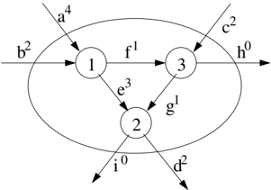

Case 4: if e = (( i, j ) d 1 , ( j, k ) d 2 ) and d 1 = d 2 + ( ), then d j e ∈ E ;

For any independent set I ⊂ V , it is clear that the following inequality is valid

<!-- formula-not-decoded -->

This is a well-known clique cut. However G has a nice structure that can be explored to build a very efficient separation procedure, as will be shown in Subsection 3.2.

## 2.5 Cuts over the Arc Variables versus Cuts over the Extended Variables

We now present an example to illustrate why it can be much easier to find a violated cut over the capacity-indexed extended variables than over the traditional arc variables. Figure 1 displays part of a fractional x d a solution of a unitary demand instance with C = 4, over a set S = { 1 2 3 , , } . The set S is being covered by 3 different q -routes with no cycles, each one with associated λ variable equal to 1 / 2. The first q -route enters S at vertex 1 with index 4 (arc a ) and leaves the set at vertex 2 (arc d) with index 2. The second q -route enters at vertex 1 (arc b) with index 2 and leaves the set directly to the depot (arc h). The third q -route enters at vertex 3 (arc c) with index 2 and also leaves the set to the depot (arc i). The capacity-balance equality over the non-zero variables entering and leaving S is:

<!-- formula-not-decoded -->

As this equation has no 0-1 solution, there must be some violated ECC over S . For example, relaxing equation (23) to ≥ , multiplying by 1 / 2 and performing integer rounding, a violated HECC is found:

<!-- formula-not-decoded -->

The same solution can also be cut by a triangle clique inequality:

<!-- formula-not-decoded -->

In fact, taking a maximal independent set in G we can get a stronger lifted triangle clique:

<!-- formula-not-decoded -->

On the other hand, it is impossible to cut this fractional solution in the x a space by only looking at the variables entering and leaving S , and even by also looking at those inside S . This is true because the incidence vector formed by x a = x b = x c = x d = x e = x f = x g = x h = x i = 1 2 and all the remaining / variables in ( δ -( S ) ∪ δ + ( S ) ∪ A S ( )) equal to 0 is a convex combination of two valid ACVRP solutions: the first with one route covering S using arcs { b, f, g, i } ; the second solution covering S with two routes, using arcs { a, e, d } and { c, h } . Of course, there must be some violated cut over the x a space. But such a cut must involve other variables and is likely to be much more complex to identify and separate.

## 3 A Robust Branch-Cut-and-Price Algorithm

## 3.1 Column Generation

Recall that the reduced cost of a λ variable in DWM (10) is the sum of the reduced costs ¯ c d a of the arcs in the corresponding q -route. Those reduced costs are calculated using equations (13). The pricing subproblem of finding the q -routes yielding a variable with minimum reduced cost is NP-hard (it contains the capacitated shortest path problem), but can be solved in pseudopolynomial time. The basic data structure is a C × n matrix R . Each entry R d, v ( ) represents the least costly walk that starts at vertex v with total demand exactly d and ends at the depot. The entry contains a label consisting of the vertex ( v ), the cost of the walk (denoted by ¯( c R d, v ( ))), and a pointer to a label representing the walk up to the next vertex. Initially, the only known label represents an empty path and has cost zero (it can be seen as entry R (0 , 0)); all other entries are initialized with labels representing empty walks with infinite cost. The dynamic programming recursion given by

<!-- formula-not-decoded -->

is used to fill the entries of matrix R . Eventually, we will have the most negative walk with accumulated demand at most C that arrives at each vertex v . Extending the walk to the depot (whose demand is zero), we obtain the corresponding q -route. All negative q -routes thus found (there will be at most n , one coming from each vertex) are added to the linear program. There are nC entries in the matrix, and each is processed in O n ( ) time, so the total running time is O n C ( 2 ).

## Cycle Elimination

To strengthen the formulation, we could look for q -routes without cycles. Since this problem is strongly NP-hard, we settle for s -cycle-free q -routes, for small values of s . The algorithm operates as above, using dynamic programming to fill a C × n matrix with partial walks. Labels retain the exact same meaning as before, but now each entry in the matrix contains no longer a single label, but a bucket of labels. Therefore, bucket R d, v ( ) represents not only the cheapest s -cycle-free walk with total demand d that ends in v , but also alternative walks that ensure that all possible extensions from v with exactly s vertices are considered. Only non-dominated labels are kept. A label /lscript is s-dominated by a set of labels L if no label in L costs more than /lscript and if every path p of length s that can legally extend /lscript ( i.e., without creating an s -cycle) can also extend some label of L .

Houck et al. [22] and Christofides et al. [11] already noted only two labels must be kept for the case s = 2. Given any three labels in the same bucket, the one with highest cost will be dominated by one of the others. So in this case the overall complexity is still O n C ( 2 ). For larger values of s , deciding which labels to keep becomes significantly more complicated, see [23, 17] for details. It is worth mentioning that buckets must have size at least s !, yielding a complexity of O s s n C ( ! 2 2 ). The value s = 3 usually gives a good balance between formulation strength and pricing time.

## 3.2 Separation Routines

Let ¯ be a fractional solution of the DWM LP. This solution can be converted λ into a ¯ solution over the capacity-indexed arc space using equations (9b). x Violated cuts of form (11) can be separated and added to the DWM as (12). In this subsection, we describe separation procedures for the families of cuts discussed previously.

## CVRP Cuts

As mentioned before, all cuts known to be valid for the CVRP can be separated in this ACVRP algorithm. However, there is no point in introducing CVRP rounded capacity cuts, since they are dominated by inequalities (18). Among the many other families of CVRP cuts used in [32] and [17], we only separated strengthened combs. They improve bounds modestly. The other families did not produced any significant improvement.

## Extended Capacity Cuts

Our procedure starts by choosing candidate sets S . Those candidates include:

- · All sets S up to cardinality 6 which are connected in the support graph of the fractional solution ¯, i.e., the subgraph of x G containing only the arcs a

Fig. 2. The compatibility graph G for the example of Figure 1.

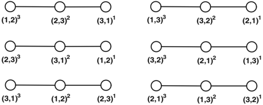

| (1,2) 3   | (2,3) 2   | (3,1) 1   | (1,3) 3   | (3,2) 2   | (2,1) 1   |
|-----------|-----------|-----------|-----------|-----------|-----------|
| (2,3) 3   | (3,1) 2   | (1,2) 1   | (3,2) 3   | (2,1) 2   | (1,3) 1   |
| (3,1) 3   | (1,2) 2   | (2,3) 1   | (2,1) 3   | (1,3) 2   | (3,2) 1   |

where some value ¯ x d a is positive. This connectivity restriction prevents an explosion on the number of enumerated sets. As proved in Uchoa et al. [36], if an ECC is violated over a set S composed of two or more disconnected components, there exists another violated ECC over one of those smaller components.

- · The sets with cardinality larger than 6 that are inspected in the heuristic separation routines of rounded capacity cuts presented in [32]. The rationale is that if the rounded capacity cut is almost violated for a given set S , it is plausible that an extended capacity can be violated over that set. In particular, if the rounded capacity cut is violated, the ECC (18) will be certainly violated.

So, for each candidate set S , we first check if the strengthened rounded capacity cut (18) is violated. Then we try to separate HECCs from the equation (23) over S . In particular, we look for inequalities of the following form:

<!-- formula-not-decoded -->

where 0 &lt; r ≤ 1. As discussed in [36], at most 0 3 . C 2 rational multipliers r need to be tried in this integer rounding procedure.

## Triangle Clique Cuts

The separation procedure for the triangle clique cuts finds the independent set I ⊂ V in G that maximizes ∑ a d ∈ I ¯ . x d a Although the problem of finding a maximum-weight independent set is strongly NP-hard for general graphs, such an independent set can be found for G in a linear time by exploiting its specific structure of chains.

Figure 2 shows that the compatibility graph G for the example of Figure 1 is a set of 6 chains. For example, the arc (1 , 2) 3 is only compatible with (2 , 3) 2 in the triangle { 1 2 3 , , } . The arc (2 3) , 2 is compatible with both (1 2) , 3 and (3 , 1) , 1 and (3 1) , 1 is only compatible with (2 3) . Observe that (1 2) , 2 , 3 and (3 , 1) 1 are not compatible. Our separation procedure uses the following two facts.

Fact 1 The graph G is a set of chains for any ACVRP instance.

Fact 2 A set I is a maximum-weight independent set for a set of chains if and only if it is the union of maximum-weight independent sets for each single chain.

The maximum weight independent set for a single chain H can be obtained in a linear time through a simple dynamic programming procedure. Let a d i i be the i th vertex in H , for i = 1 , . . . , | H | . Also, let us define I ∗ ( i, 1) (resp. I ∗ ( i, 0)) as the maximum independent set for the subchain containing the first i vertices of H that does (resp. does not) use the i th vertex. Finally, let c I ( ) = ∑ a d ∈ I ¯ . We have the following recurrency: x d a

<!-- formula-not-decoded -->

It is interesting to add suitable positive perturbations to the values of ¯ x d a that are zero, in order to generate inequalities with as many non-zero coefficients as possible.

## 3.3 Branching with Route Enumeration

We branch over the edges of the undirected graph associated to G . We choose the pair { i, j } such that the value ¯ x { i,j } = ∑ C d =0 (¯ x d ( i,j ) + ¯ x d ( j,i ) ) is closer to 0.65. On the left branch node we require that ¯ x { i,j } must be 0, on the right branch node this must be greater or equal to 1. It can be shown that this is a valid branching strategy.

However, in order to improve the performance of our algorithm, we combine this traditional branching with a route enumeration technique inspired by the one described in Baldacci et al. [5]. When the integrality gap, the difference between the best known feasible solution and the current LP relaxation is sufficiently small, those authors found that it may be practical to enumerate all possible relevant elementary q -routes, i.e., all routes that have a chance of being part of the optimal solution. A route is non-relevant if (i) its reduced cost (with respect to the current values of (13)) is greater than the gap, or (ii) there exists another route visiting the same set of clients with smaller cost (with respect to the original arc costs c a ). If the number of relevant routes is not too large (say, in the range of tenths of thousands), the overall problem may be solved by feeding a general MIP solver with a set-partition formulation containing only those routes. If this set-partition can be solved, the optimal solution will be found and no branch will be necessary. Sometimes this leads to very significant speedups when compared to traditional branch strategies. However, it should be remarked that such route enumeration is an inherently exponential procedure. Its practical performance depends crucially on the gap value and it is also sensitive to the characteristics of the instance that is being

solved. There is no guarantee that a combinatorial explosion will not happen, even for small sized instances.

Our hybrid strategy, devised to provide a robust approach, is to perform limited route enumerations after each branch-and-bound node is solved. This means that the enumeration is aborted if more than 80,000 relevant routes or if more than 800,000 states (partial non-dominated routes) are being kept by our dynamic programming algorithm. If those limits are not reached, a set-partition containing all relevant routes is given to a MIP solver. Then, the original node is declared as solved and no branch will occur. Otherwise, if the route enumeration fails, then the edge branching is performed and two more nodes must be solved. Of course, since deeper nodes will have smaller gaps, at some point the enumeration will work. The overall effect may be a substantially smaller branch-and-bound tree. For example, where the traditional branching would need to reach depth 10, the hybrid strategy may not go beyond depth 5.

Our BCP also uses the route enumeration as an heuristic at the root node. If the actual gap g of this node is still too large and the limits are reached, we try the enumeration with a dummy gap of g/ 2. If this is still not enough, we try with g/ 4 and so on. If the enumeration now succeeds, we try an increased dummy gap of ( g/ 2 + g/ 4) / 2. In short, we perform a sort of binary search to determine a dummy gap that will yield a set-partition of reasonable size. The solution of such MIPs may provide very good upper bounds.

Finally, we should remark that the route enumeration is a quite sophisticated dynamic programming procedure, several tricks are necessary to prevent an early explosion on the number of states.

## 4 Adapting this RBCP for Related Routing Problems

This section shows how some related problems can be solved by slightly modifying the solution approach proposed above to the ACVRP.

## 4.1 Capacitated Open Vehicle Routing Problem

The Capacitated Open Vehicle Routing Problem (COVRP) [29] is a variant of the classical CVRP where the vehicle needs not to return to the depot once no more clients need to be visited (or, symmetrically, the vehicle needs not to start at the depot). This routing problem covers the case where vehicles are hired for each route job, having a cost model that charges only while the vehicle is loaded.

The ACVRP approach above described can be easily converted to solve the COVRP. For this we only need not to charge for the return of the vehicle. This can be done by setting to zero the cost of all arcs that have as endpoint the depot.

## 4.2 Capacitated Vehicle Routing Problem

Solving the classical CVRP by a ACVRP approach should require no change other than the input having a symmetric cost matrix. However, this would lead to allowing two representations for a same route, i.e., the two possible orientations of its edges. The solution cost is indifferent regarding the orientation of a route (or q -route) and, as a consequence, a convergence difficulty may appear. Cuts that are asymmetric regarding the arcs that enter (or exit) a subset of vertices may become not violated by simply changing the orientation of one or a few routes. In particular, this is the case for all cuts derived from the extended formulation above.

We can deal with this difficulty by forbidding the generation of equivalent routes, i.e., the same route in its two senses. This can be achieved by requiring that every route with more than a single client has its last visited client with a larger index than its first client. The modification to the column generation dynamic programming algorithm amounts to adding n cells to each of nC cells of matrix R , which will now require O n C ( 2 ) positions. These extra cells will be used to store the last client visited (our algorithm constructs the q -route backwards). Remark that at most n routes will have to be stored. With this information at hand, one can easily check this anti-symmetry condition.

Although the resulting algorithm has a worst case complexity of O n C ( 3 ), several specific data structures can be used to improve the average case performance. This is also the case for the standard dynamic programming algorithm. They run much faster than their worst case and this symmetry breaking strategy seems to introduce a small factor on the computing time.

## 4.3 Heterogeneous Fleet Vehicle Routing Problem

We consider the Heterogeneous Fleet Vehicle Routing Problem (HFVRP) as the generalization of the classical CVRP where there is a set of vehicles types, with different capacities and fixed costs. This version of the HFVRP is considered in Yaman [39] and in Choi and Tcha [9].

Three minor modifications are needed to apply the ACVRP approach to the HFVRP. In all cuts that depend on C , one must use always the maximum capacity available among the vehicles. The second modification occurs in the pricing. Now the column generation algorithm executes for the largest capacity. The reduced cost of q -routes by other vehicles is then obtained by adding the fixed costs to the appropriate intermediate value in the matrix R . As in the CVRP, the symmetry breaking strategy should be used. The third modification is in the route enumeration, that must be performed for each vehicle type.

## 5 Experiments

We tested the resulting algorithm for the ACVRP, COVRP, CVRP and HFVRP on selected sets of instances from the literature. Our experiments were executed on a Pentium IV running at 3.0 GHz with 1 GB of RAM. Linear programs and set-partition IPs were solved by CPLEX 10.0.

## 5.1 ACVRP

We used the 8 ACVRP instances proposed by Fischetti et al. [16]. As all those instances have very large capacities ( C = 1000) and use very few vehicles (2 or 3), in order to have a more representative benchmark set, we also solved the same instances by considering capacities 500, 250 and 150. Of course, this implies using more vehicles.

We first remark that the CVRP algorithm presented in Fukasawa et al. [17] can be used as an ACVRP algorithm. One only needs to use the asymmetric arc costs in the dynamic programming pricing. Of course, only CVRP cuts will be employed. Table 1 allows the evaluation of the impact of introducing the cuts from the extended formulation in the new BCP algorithm. The first column contains the name of the instance while the second ( k ) and third ( C ) specify the number and the capacity of the vehicles used, respectively. The fourth and fifth columns ( Fuk. ), give the lower bound obtained in the root node of the BCP algorithm in [17] and the CPU time (in seconds) spent. The following two columns give this same information for the new BCP showed in the previous sections, that also uses asymmetric cuts from the extended formulation ( New ). Next column ( Prev UB ) gives the optimal solution values for the original 8 instances with capacity 1000, obtained by [16]. For the remaining 24 instances introduced here, this column gives the best upper bound found by running the first BCP algorithm with a time limit of 10,000 seconds. Proven optima values appear in boldface. The last column is the best upper bound found by the new BCP algorithm with a time limit of 10,000 seconds, proven optima are also in boldface. Blank entries indicate that no feasible solution was found at within that time limit. We remark that both algorithms price q -routes with 3-cycle elimination.

It can be seen that the new cuts can indeed reduce gaps substantially, but this also has a substantial price in terms of computational time. The new BCP is efficient on the instances with smaller capacities and more vehicles, but performs poorly on the instances with large capacities and very few vehicles, due to cut and column convergence problems. It could not even finish the root node of instance a071-03f within the time limit. This behavior is consistent with previous experiences [17]. The instances with only 3 vehicles are much better solved by the branch-and-bound by Fischetti et al., the solution times reported in [16] would correspond to less than one second in a modern machine. We expect that a branch-and-cut over the arc formulation, similar to the one by Lysgaard et al [32], would also be efficient in those cases.

Table 1. Bounds on the ACVRP instances.

| Instance   | k      | C Fuk. LB   | Fuk. New Time LB   | New Time   | Prev UB   | New UB   |
|------------|--------|-------------|--------------------|------------|-----------|----------|
| a034-14f   | 14     | 150 4046.00 | 0.8 4046.00        | 0.2        | 4046      | 4046     |
| a036-18f   | 18     | 150 5296.00 | 0.2 5296.00        | 0.4        | 5296      | 5296     |
| a039-20f   | 20     | 150 5903.00 | 0.2 5903.00        | 0.3        | 5903      | 5903     |
| a045-18f   | 18     | 150 6365.00 | 1.2 6374.50        | 4.7        | 6399      | 6399     |
| a048-16f   | 16     | 150 4905.61 | 1.9 4910.82        | 7.6        | 4955      | 4955     |
| a056-17f   | 17     | 150 4974.21 | 2.9 4976.69        | 25.2       | 4998      | 4998     |
| a065-19f   | 19     | 150 5972.55 | 3.9 5986.58        | 37.0       | 6014      | 6014     |
| a071-17f   | 17     | 150 4937.41 | 6.5 4949.08        | 89.8       | 5006      | 5006     |
| a034-08f   | 8      | 250 2643.47 | 1.8 2654.33        | 23.9       | 2672      | 2672     |
| a036-10f   | 10     | 250 3306.09 | 1.9 3313.51        | 29.2       | 3338      | 3338     |
| a039-12f   | 12     | 250 3705.00 | 0.8 3705.00        | 5.2        | 3705      | 3705     |
| a045-11f   | 11     | 250 3542.17 | 1.9 3544.00        | 12.1       | 3544      | 3544     |
| a048-10f   | 10     | 250 3298.27 | 2.9 3306.28        | 59.3       | 3325      | 3325     |
| a056-10f   | 10     | 250 3258.57 | 5.8 3262.08        | 89.3       | 3263      | 3263     |
| a065-12f   | 12     | 250 3848.72 | 8.4 3856.14        | 150.7      | 3902      | 3902     |
| a071-10f   | 10     | 250 3415.03 | 25.1 3423.69       | 231.5      | 3486      | 3486     |
| a034-04f   | 4      | 500 1759.41 | 4.4 1766.52        | 97.3       | 1773      | 1773     |
| a036-05f   | 5      | 500 2084.27 | 4.9 2088.17        | 67.6       | 2110      | 2110     |
| a039-06f   | 6      | 500 2270.60 | 5.5 2277.15        | 141.8      | 2289      | 2289     |
| a045-06f   | 6      | 500 2289.81 | 8.5 2294.55        | 195.8      | 2303      | 2303     |
| a048-05f   | 5      | 500 2260.29 | 11.7 2265.36       | 213.0      | 2283      | 2283     |
| a056-05f   | 5      | 500 2144.09 | 30.9 2152.87       | 695.9      | 2165      | 2165     |
| a065-06f   | 6      | 500 2516.90 | 29.8 2521.69       | 694.9      | 2567      | 2567     |
| a071-05f   | 5 500  | 2403.12     | 94.0 2411.79       | 1443.3     | 2475      | -        |
| a034-02f   | 2 1000 | 1381.12     | 25.5 1392.41       | 1388.2     | 1406      | 1406     |
| a036-03f   | 3 1000 | 1635.27     | 22.9 1638.46       | 1009.4     | 1644      | 1644     |
| a039-03f   | 3 1000 | 1654.00     | 15.7 1654.00       | 61.9       | 1654      | 1654     |
| a045-03f   | 3 1000 | 1740.00     | 39.2 1740.00       | 325.5      | 1740      | 1740     |
| a048-03f   | 3 1000 | 1891.00     | 106.3 1891.00      | 825.6      | 1891      | 1891     |
| a056-03f   | 3 1000 | 1725.28     | 256.5 1727.60      | 5441.1     | 1739      | -        |
| a065-03f   | 3 1000 | 1956.75     | 320.3 1969.72      | 11688.4    | 1974      | -        |
| a071-03f   | 3 1000 | 2037.67     | 1465.7 -           | -          | 2054      | -        |
| avg gap    |        | 0.79%       | 0.59%              |            |           |          |

Table 2. Statistics on the ACVRP instances.

|          | # Root Cuts   | # Root Cuts   | # Root Cuts   | Root Times   | Root Times   | Root Times   | Root Times   |             |            |            |
|----------|---------------|---------------|---------------|--------------|--------------|--------------|--------------|-------------|------------|------------|
| Instance | SRCC          | Rd ECC        | Clique        | Col Gen      | LP           | Cut Sep      | Enum +SP     | # BCP Nodes | # SP Nodes | Total Time |
| a034-14f | 0             | 0             | 0             | 0.1          | 0.1          | 0.0          | 0.1          | 1           | 1          | 0.4        |
| a036-18f | 2             | 0             | 0             | 0.2          | 0.1          | 0.0          | 0.1          | 1           | 1          | 0.5        |
| a039-20f | 0             | 0             | 0             | 0.2          | 0.0          | 0.0          | 0.1          | 1           | 1          | 0.4        |
| a045-18f | 13            | 14            | 1             | 2.0          | 0.2          | 1.7          | 0.3          | 1           | 1          | 5.0        |
| a048-16f | 40            | 20            | 10            | 2.6          | 0.3          | 3.5          | 1.4          | 1           | 175        | 9.0        |
| a056-17f | 50            | 40            | 4             | 8.0          | 0.4          | 10.1         | 1.1          | 1           | 1          | 26.3       |
| a065-19f | 39            | 75            | 10            | 12.1         | 0.5          | 18.3         | 1.3          | 1           | 1          | 38.4       |
| a071-17f | 113           | 99            | 32            | 36.8         | 1.1          | 22.0         | 43.4         | 1           | 596        | 133.2      |
| a034-08f | 56            | 50            | 13            | 12.5         | 0.7          | 5.4          | 0.8          | 1           | 1          | 24.7       |
| a036-10f | 77            | 54            | 9             | 11.4         | 0.6          | 7.9          | 0.9          | 1           | 14         | 30.0       |
| a039-12f | 58            | 0             | 0             | 2.3          | 0.3          | 1.8          | 0.6          | 1           | 1          | 5.8        |
| a045-11f | 18            | 21            | 4             | 8.0          | 0.4          | 1.5          | 1.1          | 1           | 1          | 13.2       |
| a048-10f | 78            | 59            | 14            | 34.7         | 1.1          | 11.0         | 2.9          | 1           | 1          | 62.1       |
| a056-10f | 53            | 85            | 18            | 51.2         | 1.5          | 19.3         | 2.4          | 1           | 1          | 91.7       |
| a065-12f | 70            | 73            | 23            | 76.8         | 1.7          | 35.9         | 263.2        | 3           | 118        | 663.8      |
| a071-10f | 147           | 119           | 39            | 141.2        | 3.7          | 41.8         | 641.5        | (26.6%) 67  | 31         | 10000.0    |

Detailed statistics on the new algorithm are presented in Tables 2 and 3. The 2nd, 3rd and 4th columns contain the number of cuts of each type inserted in the root node. The headers SRCC Rd ECC , and Clique mean strengthened rounded capacity cuts, HECCs obtained by integer rounding and triangle clique cuts, respectively. The following four columns contain the time spent in the root node with column generation, LP solving, cut separation, and route enumeration + set-partition solving, respectively. The remaining columns give information about the complete algorithm: # BCP Nodes is the total number of BCP nodes solved, # SP Nodes is the total number of nodes used by CPLEX to solve all set-partition problems, and Total Time is the overall time.

Some instances were not solved to optimality, in those cases we give an estimative of how far the algorithm was from finishing. The BCP performs depth-first search. Every time a leaf node at level l is solved (root level is 0), we consider that 100 / 2 l % of the search tree was solved. Those values are accumulated. Since our branch rule was devised to yield an statistically balanced tree, this provides a reasonably good estimate of algorithm progress, at least after several leaf nodes are solved. For example, instance a071-10f was halted with 10,000 seconds. We report that the 67 nodes already solved at that time correspond to 26.6% of the estimated tree size.

## 5.2 COVRP

We chose a set of 15 instances from the literature. They include most of the classical E instances from Christofides and Eilon [10] and also some representative instances from sets A, B and P available at www.branchandcut.org . We compare our bounds with those obtained by the branch-and-cut by Letchford

Table 3. Statistics on the ACVRP instances.

|          | # Root Cuts   | # Root Cuts   | # Root Cuts   |         | Root Times   | Root Times   |          |             |            |            |
|----------|---------------|---------------|---------------|---------|--------------|--------------|----------|-------------|------------|------------|
| Instance | SRCC          | Rd ECC        | Clique        | Col Gen | LP           | Cut Sep      | Enum +SP | # BCP Nodes | # SP Nodes | Total Time |
| a034-04f | 48            | 55            | 21            | 57.8    | 1.6          | 19.2         | 4.0      | 1           | 1          | 101.3      |
| a036-05f | 46            | 26            | 15            | 39.2    | 1.0          | 15.2         | 5.0      | 1           | 1          | 72.6       |
| a039-06f | 46            | 104           | 10            | 71.0    | 1.4          | 40.0         | 4.5      | 1           | 1          | 146.4      |
| a045-06f | 117           | 65            | 21            | 109.6   | 2.0          | 47.1         | 6.8      | 1           | 1          | 202.6      |
| a048-05f | 100           | 63            | 28            | 150.3   | 3.0          | 34.9         | 25.8     | 1           | 1          | 238.8      |
| a056-05f | 166           | 74            | 30            | 493.2   | 7.6          | 101.9        | 65.6     | 1           | 1          | 761.5      |
| a065-06f | 129           | 99            | 28            | 427.8   | 8.6          | 130.0        | 985.9    | (2.3%) 24   | 9          | 10000.0    |
| a071-05f | 120           | 135           | 39            | 1119.1  | 31.2         | 147.0        | 1311.0   | (0.1%) 12   | 1          | 10000.0    |
| a034-02f | 41            | 338           | 18            | 864.8   | 8.5          | 292.3        | 45.6     | 1           | 1          | 1433.8     |
| a036-03f | 91            | 201           | 10            | 555.3   | 5.9          | 245.1        | 22.7     | 1           | 1          | 1032.0     |
| a039-03f | 0             | 0             | 0             | 59.8    | 1.2          | 0.8          | 21.0     | 1           | 1          | 82.9       |
| a045-03f | 84            | 0             | 0             | 292.5   | 12.4         | 14.4         | 29.4     | 1           | 1          | 354.9      |
| a048-03f | 90            | 0             | 0             | 778.8   | 20.7         | 17.8         | 35.1     | 1           | 1          | 860.7      |
| a056-03f | 138           | 411           | 14            | 4403.0  | 118.2        | 517.9        | 699.8    | (0.0%) 3    | 0          | 10000.0    |
| a065-03f | 109           | 312           | 51            | 7140.4  | 80.0         | 2367.4       | 1120.6   | (0.0%) 1    | 0          | 10000.0    |
| a071-03f | -             | -             | -             | -       | -            | -            | -        | (0.0%) 0    | 0          | 10000.0    |

et al. [29], Let. columns. Their times were obtained with a Pentium M 1.6 GHz processor. All such instances are Euclidean, the costs are obtained from the depot and client coordinates, without rounding. The results are presented in Tables 4 and 5, analogous to Tables 1 and 2, respectively. The upper bounds in column Prev UB in Table 4 are from [29] too. As instances E-n101-k8 and E-n101-k14 had never been solved before, we allowed a little more than 10,000 seconds for their runs.

## 5.3 CVRP

We used the same 15 instances of the previous experiment. However, as usual in the CVRP literature, the costs are rounded Euclidean distances, following the TSPLIB convention. We compare the bounds and root times from the new BCP with those from the BCP presented in Fukasawa et al. [17]. We remark that while that algorithm was executed using 3-cycle elimination, our new algorithm, in this case, used 2-cycle elimination together with route symmetry breaking. Table 6 is analogous to Table 1, with Fuk. indicating the columns with results from [17] obtained in a Pentium IV 2.4 GHz machine. Table 7 shows that 5 instances could not be finished by the complete BCP in the allotted time of 10,000 seconds.

## 5.4 HFVRP

We used a set of instances proposed in Golden et al. [20], the same set was used in the experiments in Yaman [39] and Choi and Tcha [9] which are compared with our approach. Bound comparisons are presented in table 8 where the

Table 4. Bounds on the COVRP instances.

| Instance   | k   | C   | Let. LB   | Let. Time(s)   | New LB   | New Time(s)   | Prev UB   | New UB   |
|------------|-----|-----|-----------|----------------|----------|---------------|-----------|----------|
| A-n63-k10  | 10  | 100 | 745.94    | 5              | 775.26   | 63.2          | -         | 778.46   |
| A-n64-k9   | 9   | 100 | 811.98    | 4              | 839.25   | 208.6         | -         | 848.15   |
| A-n69-k9   | 9   | 100 | 732.27    | 5              | 754.53   | 71.4          | 757.76    | 757.76   |
| A-n80-k10  | 10  | 100 | 1019.84   | 9              | 1061.90  | 126.1         | -         | 1067.09  |
| B-n50-k8   | 8   | 100 | 703.57    | 4              | 717.05   | 49.5          | -         | 720.79   |
| B-n68-k9   | 9   | 100 | 694.16    | 6              | 701.71   | 187.4         | 701.71    | 701.71   |
| E-n51-k5   | 5   | 160 | 411.48    | 1              | 414.32   | 88.7          | 416.06    | 416.06   |
| E-n76-k7   | 7   | 220 | 522.27    | 10             | 525.21   | 245.7         | 530.02    | 530.02   |
| E-n76-k8   | 8   | 180 | 529.37    | 12             | 534.16   | 127.2         | 537.24    | 537.24   |
| E-n76-k10  | 10  | 140 | 547.83    | 21             | 559.62   | 97.0          | -         | 567.14   |
| E-n76-k14  | 14  | 100 | 602.01    | 24             | 621.27   | 70.0          | -         | 623.55   |
| E-n101-k8  | 8   | 200 | 633.85    | 6              | 636.09   | 423.4         | 639.74    | 639.74   |
| E-n101-k14 | 14  | 112 | 692.15    | 33             | 704.69   | 227.8         | -         | 711.58   |
| P-n50-k8   | 8   | 120 | 405.85    | 2              | 422.99   | 26.9          | -         | 436.51   |
| P-n70-k10  | 10  | 135 | 536.04    | 9              | 547.51   | 80.4          | -         | 552.65   |
| avg gap    |     |     | 2.95%     |                | 0.80%    |               |           |          |

Table 5. Statistics on the COVRP instances.

|            | # Root Cuts   | # Root Cuts   | # Root Cuts   | Root Times   | Root Times   | Root Times   | Root Times   |             |            |            |
|------------|---------------|---------------|---------------|--------------|--------------|--------------|--------------|-------------|------------|------------|
| Instance   | SRCC          | Rd ECC        | Clique        | Col Gen      | LP           | Cut Sep      | Enum +SP     | # BCP Nodes | # SP Nodes | Total Time |
| A-n63-k10  | 98            | 81            | 23            | 34.6         | 3.9          | 9.4          | 187.4        | 1           | 1          | 250.6      |
| A-n64-k9   | 168           | 144           | 28            | 119.5        | 8.7          | 27.0         | 659.6        | 9           | 59         | 1884.1     |
| A-n69-k9   | 78            | 148           | 14            | 39.4         | 6.7          | 10.1         | 3.8          | 1           | 1          | 75.2       |
| A-n80-k10  | 77            | 113           | 41            | 76.7         | 8.9          | 18.3         | 458.8        | 1           | 5          | 585.0      |
| B-n50-k8   | 171           | 33            | 14            | 31.5         | 4.6          | 7.3          | 176.5        | 1           | 101        | 226.0      |
| B-n68-k9   | 143           | 138           | 8             | 120.2        | 42.7         | 12.5         | 1.3          | 1           | 1          | 188.7      |
| E-n51-k5   | 45            | 137           | 20            | 45.7         | 6.5          | 15.0         | 5.0          | 1           | 1          | 93.7       |
| E-n76-k7   | 23            | 202           | 33            | 133.3        | 12.8         | 38.6         | 319.9        | 17          | 9          | 4373.7     |
| E-n76-k8   | 21            | 131           | 26            | 71.8         | 5.8          | 22.1         | 36.1         | 1           | 1          | 163.3      |
| E-n76-k10  | 40            | 171           | 44            | 40.4         | 3.7          | 24.6         | 425.9        | 5           | 3          | 996.7      |
| E-n76-k14  | 56            | 133           | 39            | 29.2         | 1.9          | 15.8         | 167.4        | 1           | 1          | 237.4      |
| E-n101-k8  | 108           | 184           | 35            | 206.4        | 48.8         | 73.9         | 303.2        | 49          | 25         | 15941.9    |
| E-n101-k14 | 117           | 259           | 82            | 90.3         | 10.0         | 53.5         | 1290.7       | 57          | 47         | 10335.3    |
| P-n50-k8   | 63            | 81            | 32            | 9.8          | 1.2          | 7.5          | 933.6        | 1           | 1077       | 960.5      |
| P-n70-k10  | 90            | 109           | 40            | 33.3         | 3.0          | 19.3         | 269.8        | 1           | 1          | 350.2      |

Table 6. Bounds on the CVRP instances.

| Instance   | k   | C   | Fuk. LB   | Fuk. Time(s)   | New LB   | New Time(s)   | Prev UB   | New UB   |
|------------|-----|-----|-----------|----------------|----------|---------------|-----------|----------|
| A-n63-k10  | 10  | 100 | 1299.1    | 136            | 1299.82  | 114.9         | 1314      | 1314     |
| A-n64-k9   | 9   | 100 | 1385.3    | 265            | 1385.21  | 141.4         | 1401      | 1401     |
| A-n69-k9   | 9   | 100 | 1141.4    | 289            | 1147.38  | 151.0         | 1159      | 1159     |
| A-n80-k10  | 10  | 100 | 1754.0    | 1120           | 1755.14  | 242.7         | 1763      | 1763     |
| B-n50-k8   | 8   | 100 | 1295.0    | 97             | 1299.62  | 46.6          | 1312      | 1312     |
| B-n68-k9   | 9   | 100 | 1263.0    | 260            | 1264.14  | 258.8         | 1272      | 1272     |
| E-n51-k5   | 5   | 160 | 518.2     | 51             | 520.09   | 141.0         | 521       | 521      |
| E-n76-k7   | 7   | 220 | 670.0     | 264            | 671.81   | 216.0         | 682       | 682      |
| E-n76-k8   | 8   | 180 | 726.5     | 277            | 727.93   | 177.5         | 735       | 735      |
| E-n76-k10  | 10  | 140 | 817.4     | 354            | 819.56   | 131.6         | 830       | 830      |
| E-n76-k14  | 14  | 100 | 1006.5    | 224            | 1008.67  | 47.4          | 1021      | 1021     |
| E-n101-k8  | 8   | 200 | 805.2     | 1068           | 806.01   | 705.5         | 815       | -        |
| E-n101-k14 | 14  | 112 | 1053.8    | 658            | 1056.27  | 214.7         | 1067      | 1067     |
| P-n50-k8   | 8   | 120 | 616.3     | 102            | 618.96   | 28.6          | 631       | 631      |
| P-n70-k10  | 10  | 135 | 814.5     | 292            | 816.88   | 131.3         | 827       | 827      |
| avg gap    |     |     | 1.26%     |                | 1.04%    |               |           |          |

columns with header t and C contain the number of different types of vehicles and the largest capacity, respectively. It worth noting that the bounds from Yaman [39], given in the columns Yam. , come from a cutting plane algorithm on a flow formulation. Her times were obtained in a Sun Ultra 400 MHz machine. The lower bounds from Choi and Tcha [9], columns Choi , come from a column generation algorithm on q -routes with 2-cycle elimination. Their times were obtained in a Pentium IV 2.6 GHz machine. The previous best upper bounds were also collected from [9]. Our algorithm for the HFVRP executes as for the CVRP, with 2-cycle elimination and route symmetry breaking. Table 9 give detailed statistics on the new algorithm. We allowed more than 10,000 seconds for solving instance c75-18. Those results represent a major improvement over previous exact algorithms for that problem. We could not find any work claiming proven optimal solutions even for the instances with just 20 vertices.

## 6 Comments

This text presented a RBCP for the ACVRP that was also shown to be effective on a number of related problems. In particular, the use of cuts defined over the extended formulation seems very promising and deservers further

Table 7. Statistics on the CVRP instances.

|            | # Root Cuts   | # Root Cuts   | # Root Cuts   | Root    | Root   | Root    | Root     | Times       | Times      | Times      |
|------------|---------------|---------------|---------------|---------|--------|---------|----------|-------------|------------|------------|
| Instance   | SRCC          | Rd ECC        | Clique        | Col Gen | LP     | Cut Sep | Enum +SP | # BCP Nodes | # SP Nodes | Total Time |
| A-n63-k10  | 198           | 96            | 48            | 56.2    | 3.4    | 19.5    | 316.7    | 3           | 16         | 728.9      |
| A-n64-k9   | 260           | 147           | 55            | 75.3    | 5.4    | 24.7    | 654.8    | 55          | 28         | 9161.0     |
| A-n69-k9   | 230           | 137           | 65            | 78.7    | 5.3    | 29.7    | 433.8    | 5           | 3          | 1248.3     |
| A-n80-k10  | 314           | 113           | 69            | 115.0   | 10.3   | 45.3    | 660.0    | 3           | 2          | 1530.9     |
| B-n50-k8   | 214           | 46            | 19            | 26.8    | 2.2    | 8.0     | 309.5    | (69%) 128   | 58         | 10000.0    |
| B-n68-k9   | 285           | 149           | 29            | 140.4   | 11.0   | 31.5    | 526.5    | (25.5%) 52  | 25         | 10000.0    |
| E-n51-k5   | 147           | 110           | 46            | 51.3    | 4.4    | 28.8    | 4.8      | 1           | 1          | 145.8      |
| E-n76-k7   | 110           | 93            | 59            | 120.7   | 5.0    | 43.3    | 1040.3   | (11%) 32    | 14         | 10000.0    |
| E-n76-k8   | 175           | 95            | 64            | 93.1    | 5.2    | 41.2    | 534.0    | 5           | 3          | 1840.1     |
| E-n76-k10  | 193           | 78            | 68            | 60.8    | 2.8    | 35.8    | 471.5    | 39          | 20         | 5794.4     |
| E-n76-k14  | 60            | 90            | 45            | 22.0    | 0.9    | 12.2    | 246.3    | 3           | 151        | 479.4      |
| E-n101-k8  | 659           | 159           | 114           | 270.2   | 36.5   | 224.9   | 1462.3   | (0.1%) 20   | 5          | 10000.0    |
| E-n101-k14 | 237           | 122           | 95            | 95.6    | 3.7    | 63.1    | 3469.4   | (4.7%) 31   | 13         | 10000.0    |
| P-n50-k8   | 54            | 90            | 48            | 10.5    | 0.8    | 8.3     | 42.0     | 1           | 16         | 70.6       |
| P-n70-k10  | 126           | 102           | 50            | 54.6    | 2.1    | 37.0    | 399.9    | 5           | 23         | 1112.1     |

development. The ECCs here utilized, strengthened rounded capacity cuts and HECCs obtained by simple integer rounding can still be improved and better separated. Fukasawa, Dash and Gunluk [13] have just characterized the facets of the polyhedron P C,D ( ) induced by the integral solutions of (23). This may immediately lead to the separation of the strongest possible HECCs for a given set S . Moreover, the current choice of candidate sets for separation is still naive and could be improved. Another line of research is the development of cuts from the arc-indexed compatibility graph over sets with cardinality larger than 3. Odd-hole cuts and even more complex families of cuts are already known to exist even for sets of cardinality 4 or 5.

The new extended cuts have shown to be particularly powerful on the HFVRP. While traditional arcs cuts are weakened by the existence of several capacities, the ECCs and triangle cliques are insensitive to that. In this case, any arc a d is viewed as bringing d units of capacity, the total capacity of the vehicles associated to the q -routes that contributed to the value of x d a is irrelevant.

We believe that the development of robust BCP algorithms for the VRP, guaranteeing a pseudo-polynomial pricing complexity, is an important issue. Some non-robust BCPs are being developed based on the use of clever techniques to solve strongly NP-hard pricing subproblems. They proved to be quite successful on current typical instances, with up to 100 clients. However those approaches are much less likely to work on instances with several hundreds of clients (specially those more than a dozen clients per route) that will certainly arise in the near future.

## Table 8. Bounds on the HFVRP instances.

| New UB             | 961.03 6437.34 1007.05 6516.47                               | 2406.36 9119.03 2586.37 2720.43 1734.52 2369.64 8661.81 -                                              |
|--------------------|--------------------------------------------------------------|--------------------------------------------------------------------------------------------------------|
| Prev UB            | 961.03 6437.33 1007.05 6516.47 2406.36                       | 9119.03 2586.37 2720.43 1744.83 2371.49 8661.81 4039.49                                                |
| New New LB Time(s) | 961.03 2.5 6437.33 5.2 1001.12 7.2 6515.82 4.7 2400.93 107.0 | 9111.81 277.2 2572.99 72.3 2705.35 48.8 1717.37 456.9 2351.07 347.5 8648.68 1017.3 4005.29 407.1 0.44% |
| Choi Time(s)       | 0.4 0.7 0.8 0.4 10.1                                         | 50.8 2544.84 10.0 2685.92 11.3 1709.85 206.9 2342.84 70.1 8431.87 1178.9 3995.16 264.0                 |
| Choi LB            | - 951.61 - 6369.15 - 988.01 - 6451.62 397.1 2392.77          | 175.6 8748.57 142.8 142.1 1344.8 1922.8 1721.2 2904.0 1.60%                                            |
| Yam. Time(s)       | 912.40 959.29                                                | 400 300 8574.33 200 3931.79 2.63%                                                                      |
| Yam. LB            | 6369.51 6468.44 2365.78                                      | 8943.94 2503.61 2650.76 1689.93 2276.31                                                                |
| t C                | 5 120 3 150 5 120 3 150 6 200                                | 3 300 3 160 3 140 4 350 6 3 3 gap                                                                      |
| Instance           | c20-3 c20-4 c20-5 c20-6 c50-13                               | c50-14 c50-15 c50-16 c75-17 c75-18 c100-19 c100-20 avg                                                 |

Table 9. Statistics on the HFVRP instances.

| Total Time      | 2.7 5.5 8.2 5.0                       | 121.3 305.8 355.2 260.2 10000.0 41607.1 10000.0 10000.0   |
|-----------------|---------------------------------------|-----------------------------------------------------------|
| # SP Nodes 1 1  | 1 1 1                                 | 5 238 91 0 475 5 0                                        |
| # BCP Nodes 1 1 | 1 1 1 1 1 1 11                        | (0.0%) 79 (0.2%) 19 (0.0%) 15                             |
| Enum +SP        | 0.2 0.3 1.0 0.3 14.3                  | 28.6 282.9 211.4 6271.9 3326.4 1063.8 6265.9              |
| Times Cut Sep   | 0.3 1.1 1.2 0.9                       | 20.8 82.9 17.2 10.6 109.8 80.2 202.5 84.3                 |
| Root LP         | 0.4 0.6 0.8 0.4                       | 3.5 27.5 6.9 2.4 20.5 3.8 45.2 6.4                        |
| Col Gen         | 1.4 2.6 3.5 2.8 49.1                  | 96.5 30.8 23.3 236.5 179.4 598.0 236.3                    |
| Cuts Clique     | 15 14 19 3                            | 38 51 40 51 87 55 109 87                                  |
| Root Rd ECC     | 50 169 81 103                         | 250 1148 475 254 497 296 830 265                          |
| # SRCC          | 13 6 34 1                             | 37 13 16 21 15 27 41 21                                   |
| Instance        | c20-3 c20-4 c20-5 c20-6 c50-13 c50-14 | c50-15 c50-16 c75-17 c75-18 c100-19 c100-20               |

## Acknowledgement

The authors thank two anonymous referees for helpful comments. AP, MPA and EU were partially financed by CNPq grants 301175/2006-3, 311997/06-6 and 304533/02-5. AP and EU received support from Mestrado em Engenharia de Produ¸ c˜o-UFF. The authors also thank the technical support by GAPSO a Inc., Brazil.

## References

- 1. N. Achuthan, L. Caccetta, and S. Hill. Capacited vehicle routing problem: Some new cutting planes. Asia-Pacific J. of Operational Research , 15:109-123, 1998.
- 2. J. Araque, L. Hall, and T. Magnanti. Capacitated trees, capacitated routing, and associated polyhedra. Technical Report OR232-90, MIT, Operations Research Center, 1990.
- 3. P. Augerat. Approche poly`drale e du probl`me de tourn´es e e de v´hicles e . PhD thesis, Institut National Polytechnique de Grenoble, 1995.
- 4. P. Augerat, J. Belenguer, E. Benavent, A. Corber´n, D. Naddef, and G. Rinaldi. a Computational results with a branch and cut code for the capacitated vehicle routing problem. Technical Report 949-M, Universit´ Joseph Fourier, Grenoble, e France, 1995.
- 5. R. Baldacci, L. Bodin, and A. Mingozzi. The multiple disposal facilities and multiple inventory locations rollon-rolloff vehicle routing problem. Computers and Operation Research , 33:2667-2702, 2006.
- 6. R. Baldacci, N. Christofides, and A. Mingozzi. An exact algorithm for the vehicle routing problem based on the set partitioning formulation with additional cuts. Submitted, 2007.
- 7. C. Barnhart, C. Hane, and P. Vance. Using branch-and-price-and-cut to solve origin-destination integer multicommodity flow problems. Operations Research , 40:318-326, 2000.
- 8. C. Barnhart, E. Johnson, G. Nemhauser, M. Savelsbergh, and P. Vance. Branchand-price: Column generation for solving huge integer programs. Operations Research , 46:316-329, 1998.
- 9. E. Choi and D-W Tcha. A column generation approach to the heterogeneous fleet vehicle routing problem. Computers and Operations Research , 34: 2080-2095, 2007.
- 10. N. Christofides and S. Eilon. An algorithm for the vehicle-dispatching problem. Operational Research Quarterly , 20:309-318, 1969.
- 11. N. Christofides, A. Mingozzi, and P. Toth. Exact algorithms for the vehicle routing problem, based on spanning tree and shortest path relaxations. Mathematical Programming , 20:255-282, 1981.
- 12. G. Cornu´ ejols and F. Harche. Polyhedral study of the capacitated vehicle routing problem. Mathematical Programming , 60:21-52, 1993.
- 13. S. Dash, R. Fukasawa, and O. Gunluk. On the generalized master knapsack polyhedron. In Proceedings of the IPCO 2007 , 2007.
- 14. du Merle, O. Villeneuve, J. Desrosiers, and P. Hansen. Stabilized column generation. Discrete Mathematics , 194:229-237, 1999.

- 15. G. Felici, C. Gentile, and G. Rinaldi. Solving large MIP models in supply chain management by branch &amp; cut. Technical report, Istituto di Analisi dei Sistemi ed Informatica del CNR, Italy, 2000.
- 16. M. Fischetti, P. Toth, and D. Vigo. A branch and bound algorithm for the capacitated vehicle routing problem on directed graphs. Operations Research , 42:846-859, 1994.
- 17. R. Fukasawa, H. Longo, J. Lysgaard, M. Poggi de Arag˜o, M. Reis, E. Uchoa, a and R. F. Werneck. Robust branch-and-cut-and-price for the capacitated vehicle routing problem. Mathematical Programming , 106:491-511, 2006.
- 18. R. Fukasawa, M. Reis, M. Poggi de Arag˜o, and E. Uchoa. Robust branch-anda cut-and-price for the capacitated vehicle routing problem. Technical Report RPEP Vol.3 no.8, Universidade Federal Fluminense, Engenharia de Produ¸ c˜o, a Niter´i, Brazil, 2003. o
- 19. M. T. Godinho, L. Gouveia, and T. Magnanti. Combined route capacity and path length models for unit demand vehicle routing problems. In Proceedings of the INOC , volume 1, pages 8-15, Lisbon, 2005.
- 20. B. Golden, A. Assad, L. Levy, and F. Gheysens. The fleet size and mix vehicle routing problem. Computers and Operations Research , 11:49-66, 1984.
- 21. L. Hall and T. Magnanti. A polyhedral intersection theorem for capacitated spanning trees. Mathematics of Operations Research , 17, 1992.
- 22. D. Houck, J. Picard, M. Queyranne, and R. Vegamundi. The travelling salesman problem as a constrained shortest path problem. Opsearch , 17:93-109, 1980.
- 23. S. Irnich and D. Villeneuve. The shortest path problem with resource constraints and k -cycle elimination for k ≥ 3. INFORMS Journal on Computing , 18: 391-406, 2006.
- 24. M. Jepsen, S. Spoorendonk, B. Petersen, and D. Pisinger. A non-robust branchand-cut-and-price for the vehicle routing problem with time windows. Technical Report 06/03, University of Copenhagen, 2006.
- 25. B. Kallehauge, N. Boland, and O. Madsen. Path inequalities for the vehicle routing problem with time windows. Technical report, Technical University of Denmark, 2005.
- 26. D. Kim, C. Barnhart, K. Ware, and G. Reinhardt. Multimodal express package delivery: A service network design application. Transportation Science , 33: 391-407, 1999.
- 27. N. Kohl, J. Desrosiers, O. Madsen, M. Solomon, and F. Soumis. 2-Path cuts for the vehicle routing problem with time windows. Transportation Science , 33:101-116, 1999.
- 28. A. Letchford, R. Eglese, and J. Lysgaard. Multistars, partial multistars and the capacitated vehicle routing problem. Mathematical Programming , 94:21-40, 2002.
- 29. A. Letchford, J. Lysgaard, and R. Eglese. A branch-and-cut algorithm for the capacitated open vehicle routing problem. Journal of the Operational Research Society , 2007.
- 30. A. Letchford and J-J. Salazar. Projection results for vehicle routing. Mathematical Programming , 105:251-274, 2006.
- 31. J. Lysgaard. Reachability cuts for the vehicle routing problem with time windows. European Journal of Operational Research , 175:210-233, 2006.
- 32. J. Lysgaard, A. Letchford, and R. Eglese. A new branch-and-cut algorithm for the capacitated vehicle routing problem. Mathematical Programming , 100: 423-445, 2004.

- 33. D. Naddef and G. Rinaldi. Branch-and-cut algorithms for the capacitated VRP. In P. Toth and D. Vigo, editors, The Vehicle Routing Problem , chapter 3, pages 53-84. SIAM, 2002.
- 34. J. Picard and M. Queyranne. The time-dependant traveling salesman problem and its application to the tardiness problem in one-machine scheduling. Operations Research , 26:86-110, 1978.
- 35. M. Poggi de Arag˜o and E. Uchoa. a Integer program reformulation for robust branch-and-cut-and-price. In L. Wolsey, editor, Annals of Mathematical Programming in Rio , pages 56-61, B´zios, Brazil, 2003. u
- 36. E. Uchoa, R. Fukasawa, J. Lysgaard, A. Pessoa, M. Poggi de Arag˜o, and D. Ana drade. Robust branch-and-cut-and-price for the capacitated vehicle routing problem. Mathematical Programming , on-line first, 2007.
- 37. J. Van den Akker, C. Hurkens, and M. Savelsbergh. Time-indexed formulation for machine scheduling problems: column generation. INFORMS J. on Computing , 12:111-124, 2000.
- 38. F. Vanderbeck. Lot-sizing with start-up times. Management Science , 44: 1409-1425, 1998.
- 39. H. Yaman. Formulations and valid inequalities for the heterogeneous vehicle routing problem. Mathematical Programming , 106:365-390, 2006.

## Recent Models and Algorithms for One-to-One Pickup and Delivery Problems

Jean-Fran¸ cois Cordeau 1 , Gilbert Laporte , and Stefan Ropke 2 2

- 1 Canada Research Chair in Logistics and Transportation, HEC Montr´ eal, 3000, chemin de la Cˆte-Sainte-Catherine, Montr´al, Canada H3T 2A7 o e cordeau@crt.umontreal.ca
- 2 Canada Research Chair in Distribution Management, HEC Montr´ eal, 3000, chemin de la Cˆte-Sainte-Catherine, Montr´al, Canada H3T 2A7 o e { gilbert,sropke @crt.umontreal.ca }

Summary. In one-to-one Pickup and Delivery Problems (PDPs), the aim is to design a set of least cost vehicle routes starting and ending at a common depot in order to satisfy a set of pickup and delivery requests between location pairs, subject to side constraints. Each request originates at one location and is destined for one other location. These requests apply to the transportation of goods or people, in which case the problem is often called the dial-a-ride problem. In recent years, there have been several significant developments in the area of exact and heuristic algorithms for PDPs. The purpose of this chapter is to report on these developments. It contains two main sections devoted to single vehicle and multi-vehicle problems, respectively. Each section is subdivided into two parts, one on exact algorithms and one on heuristics.

Key words: Pickup and delivery; one-to-one; dial-a-ride; branch-and-cut; column generation; tabu search.

## 1 Introduction

In one-to-one Pickup and Delivery Problems (PDPs), the aim is to design a set of least cost vehicle routes starting and ending at a common depot in order to satisfy a set of pickup and delivery requests between location pairs, subject to side constraints. These problems are called 'one-to-one' because each request originates at one location and is destined for one other location (see Hern´ andez-P´rez and Salazar-Gonz´lez [35]). In some contexts, like in courier e a services, these requests apply to the transportation of goods, whereas in other contexts, like in dial-a-ride problems (DARPs), they apply to the transportation of people. One-to-one PDPs differ from one-to-many-to-one problems in which each customer receives a delivery originating at a common depot and sends a pickup quantity to the depot (see, e.g., Gribkovskaia and Laporte

[33]). They also differ from many-to-many problems in which a commodity may be picked up at one of many locations, and also delivered to one of many locations (see, e.g., Hern´ndez-P´rez and Salazar-Gonz´lez [36]). These three a e a problem structures are depicted in Figures 1, 2, and 3, respectively.

Formally, PDPs are defined on a directed graph G = ( V, A ), where V is the vertex set and A is the arc set. The vertex set is partitioned into { P, D, { 0 2 , n + 1 }} , where P = { 1 , . . . , n } is a set of pickup vertices, D = { n + 1 , . . . , 2 n } is a set of corresponding delivery vertices, and { 0 2 , n + 1 } contains two copies of the depot, serving as the starting and ending points of m vehicle routes. The set of vehicles is denoted by K = { 1 , . . . , m } , and Q k is the capacity of vehicle k . The arc set is defined as A = { ( i, j ) : i = 0 , j ∈ P, or i, j ∈ P ∪ D,i = j and i = n + , or j i ∈ D,j = 2 n +1 . }

/negationslash

/negationslash

With each arc ( i, j ) are associated a travel time t ij and a travel cost c ij , or c k ij if one wishes to stress that the cost is vehicle-dependent. The maximum allowed duration of the route traveled by vehicle k is denoted by T k . With each vertex i ∈ V are associated a load q i and a service duration d i satisfying q 0 = q 2 n +1 = 0, q i &gt; 0 for i ∈ P , q i = -q i -n for i ∈ D d , i ≥ 0 for i ∈ P ∪ D , and d 0 = d 2 n +1 = 0. A time window [ e , /lscript i i ] is associated with each vertex i ∈ V , where e i and /lscript i are the earliest and latest time service may start at vertex i . In passenger transportation, it is common to impose a ride time limit L equal to the maximum time a passenger may spend in the vehicle. Pickup and delivery problems consist of designing m vehicle routes of least total cost, starting and ending at the depot, in order to perform all delivery requests subject to the following constraints: vertex i is visited before vertex n + i (precedence), and both of these vertices are visited by the same vehicle (pairing), each vertex is visited within its time window, vehicle capacities are never exceeded, and in some contexts, ride time constraints are satisfied.

Applications of PDPs to goods transportation have been described by Shen et al. [70] in the context of courier services, and by Fisher and Rosenwein [31], Christiansen and Nygreen [12, 13] and Brønmo et al. [7] in the context of bulk product transportation by ship, a sector in rapid expansion. Solanki and Southworth [72] and Rappoport et al. [57, 58] have studied PDP applications to military airlift planning. Dial-a-ride planning systems have been described by a number of authors. Madsen et al. [48] have constructed a system capable of handling in a dynamic fashion 50,000 requests per year in the city of Copenhagen. Toth and Vigo [74, 75] have developed a parallel insertion heuristic which has been applied to a complex DARP involving taxis and minibuses in Bologna. Bornd¨rfer et al. [6] have proposed a set partitioning o based heuristic which can solve a problem containing between 1,000 and 1,500 transportation requests per day in Berlin. More recently, Rekiek, Delchambre and Saleh [60] have developed a genetic algorithm for the DARP and have tested their system on real data provided by the City of Brussels. This instance contains 164 requests and 18 vehicles. An important DARP variant is the dial-a-flight problem, faced by about 3,000 businesses offering charter flight services in the United States (Cordeau et al. [20]). Recent survey articles

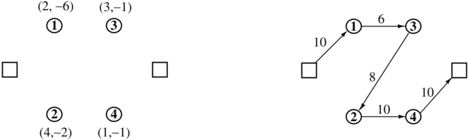

Fig. 1. One-to-many-to-one problem. Vertex label ( x, -y ) means that the vertex supplies x units and demands y units. Arc labels indicate vehicle load.

Fig. 2. Many-to-many problem. A positive vertex label x means that the vertex supplies x units; a negative vertex label -y means that the vertex demands y units. Arc labels indicate vehicle load.

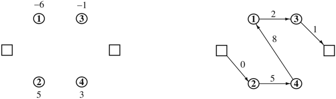

Fig. 3. One-to-one problem. Vertex label z means that the vertex supplies commodity z ; vertex label -z means that the vertex demands commodity z . Arc labels show the commodities carried by the vehicle.

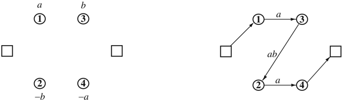

on the PDP and its applications are those of Desaulniers et al. [23], Cordeau et al. [20], and Berbeglia et al. [3].

The early research efforts on PDPs can be traced back to the work of Wilson et al. [78, 79] who developed scheduling algorithms for the DARP. Since then several exact and heuristic algorithms have been proposed for PDPs associated with the transportation of goods or people. Significant progress has occurred in the past five years, with the development of new exact and approximate algorithms for several types of PDPs. These exact algorithms employ decomposition techniques such as branch-and-cut and branch-and-cut-andprice, while the new heuristics are based on tabu search, simulated annealing and variable neighbourhood search. While all these algorithmic techniques have now been known for some time, their massive application to PDPs is significant and has enabled researchers to break new grounds in the difficulty and size of problems that can be tackled. Our aim is to report on these new and exciting developments.

Because our focus is on recent contributions, we do not claim to provide a comprehensive and systematic coverage of the field, but rather a selective coverage of some of the most significant new algorithmic ideas. This chapter contains two main sections devoted to single vehicle and multi-vehicle problems, respectively. Each section is subdivided into two parts, one on exact algorithms and one on heuristics. Conclusions follow.

## 2 Single Vehicle Pickup and Delivery Problems (SVPDPs)

While most routing problems arising in practice involve several vehicles, the single vehicle case is instrumental in developing insights into the problem structure and in putting forward new algorithmic concepts. As a case in point, several exact and approximate algorithms for the Classical Vehicle Routing Problem (VRP) (see, e.g., Toth and Vigo [76]), are rooted in concepts that were first developed for the Traveling Salesman Problem (TSP), (see, e.g., Lawler et al. [42]). All known algorithmic approaches for single-vehicle PDPs stem from TSP algorithms, and may be instrumental in the development of algorithms for multi-vehicle PDPs.

In all versions of the SVPDP discussed in this section, the vehicle capacity is not binding, there are no time windows and no ride time limits. There exist meaningful applications where such constraints may be present. These can sometimes be treated as special cases of multi-vehicle PDPs.

## 2.1 Exact Algorithms for the SVPDP

The first algorithms developed for the SVPDP and its variants, including the Traveling Salesman Problem with Precedence Constraints (TSPPC), were

based on branch-and-bound (Kalantari, Hill and Arora [38]), dynamic programming (Desrosiers, Dumas and Soumis [25], Bianco, Mingozzi and Ricciardelli [4]), and branch-and-cut (Balas, Fischetti and Pulleyblank [1]). In addition, Fischetti and Toth [30] have developed an additive lower bounding procedure which can be embedded within a branch-and-bound framework, and have applied this methodology to the solution of the TSPPC.

## A Branch-and-cut Algorithm for the SVPDP

The most popular methodology for the solution of the SVPDP is now branchand-cut. The two key components of this method are the generation of valid inequalities and the design of separation procedures. Our emphasis is on the modeling aspects. Recent branch-and-cut algorithms for single vehicle PDPs are rooted in the work of Ruland [65] and Ruland and Rodin [66]. These authors have considered the undirected case, i.e., when the problem is defined on a graph G = ( V, E ) where E = { ( i, j ) = ( j, i ) : i, j ∈ V, i &lt; j } is an edge set, and the solution is a Hamiltonian cycle.

In addition to the notation already introduced, define ¯ = S V \ S for S ⊆ V , π S ( ) = { i ∈ P : n + i ∈ S } as the set of predecessors of S ⊆ V \{ 0 } , and σ S ( ) = { i ∈ D : i -n ∈ S } as the set of successors of S ⊆ V \{ 2 n +1 . Let } δ S ( ) = { ( i, j ) : i ∈ S, j / S ∈ } be the set of edges with exactly one end-vertex in S ⊆ V . For simplicity, we write δ i ( ) instead of δ ( { } i ). For S, T ∈ V , let ( S : T ) = { ( i, j ) : i ∈ S, j ∈ T } be the set of edges with one end-point in S , and one in T . The single-vehicle PDP can be formulated with binary variables x ij equal to 1 if and only if edge ( i, j ) belongs to the cycle. For E ′ ⊆ E , let x E ( ′ ) = ∑ ( i,j ) ∈ E ′ x ij ; for S ⊆ V , let x S ( ) = ∑ i,j ∈ S x ij . We write x S ( : T ) instead of x (( S : T )). The model proposed by Ruland is then as follows.

(SVPDP)

<!-- formula-not-decoded -->

<!-- formula-not-decoded -->

subject to

<!-- formula-not-decoded -->

<!-- formula-not-decoded -->

<!-- formula-not-decoded -->

<!-- formula-not-decoded -->

<!-- formula-not-decoded -->

where U is the collection of all sets U ⊂ P ∪ D satisfying 3 ≤ | U | ≤ | V | -2, 0 ∈ U , 2 n +1 / U ∈ and there exists i ∈ P \ U with n + i ∈ U . In this model,

(3) are the degree constraints, (4) are the connectivity constraints, and (5) are the precedence constraints. Indeed, any feasible solution must contain a chain between each of the following four vertex pairs: 0 and i , i and n + , i n + i and 2 n + 1, 2 n + 1 and 0, and each of these chains contains an edge connecting U and ¯ . This model can be reinforced through the introduction of U valid inequalities. Each family of valid inequalities gives rise to another family by interchanging the roles of pickup and delivery vertices, and the roles of the two depots.

Generalized order constraints (Ruland and Rodin [66])

/negationslash

Let S , . . . , S 1 h ⊂ P ∪ D be disjoint sets such that S i ∩ σ S ( i +1 ) = ∅ ( i = 1 , . . . , h ), where S h +1 = S 1 . Then the inequality

<!-- formula-not-decoded -->

is valid for the SVPDP.

Similar constraints called precedence cycle breaking inequalities, were proposed by Balas, Fischetti and Pulleyblank [1].

Order-matching constraints (Ruland and Rodin [66], Dumitrescu et al. [29])

For i 1 , . . . , i h ∈ P and H ⊆ ( P ∪ D ) \{ n + i 1 , . . . , n + i h } such that { i 1 , . . . , i h } ⊆ H , then the inequality

<!-- formula-not-decoded -->

is valid for the SVPDP.

Ruland and Rodin [66] proved this result for h even. Dumitrescu et al. [29] have shown that it also holds for h odd.

Generalized order matching constraints (Cordeau [14])

/negationslash

For i 1 , . . . , i h ∈ P, H ⊆ V \{ 0 2 , n + 1 } , T j ⊂ P ∪ D j ( = 1 , . . . , h ) such that { i j , n + i j } ⊆ T , T j i ∩ T j = ∅ ( i = j ) and H ∩ T j = { i j } ( j = 1 , . . . , h ), the inequality

<!-- formula-not-decoded -->

is valid for the SVPDP.

Constraints (9), which generalize (8), were proved by Cordeau in the context of the DARP but they also apply to the SVPDP.

σ -inequalities (Balas, Fischetti and Pulleyblank [1])

For S ⊆ V \{ 0 } , the inequality

<!-- formula-not-decoded -->

is valid for the SVPDP.

These inequalities were introduced by Balas, Fischetti and Pulleyblank [1] in the context of the TSPPC.

Lifted subtour elimination constraints (Dumitrescu et al. [29])

Let S ⊆ P ∪ D be such that there exists i ∈ P such that i ∈ S, n + i ∈ S . Then the inequality

<!-- formula-not-decoded -->

is valid for the SVPDP.

Dumitrescu et al. [29] also prove the following generalization of (11).

Generalized lifted subtour elimination constraints (Dumitrescu et al. [29])

Let S ⊂ P ∪ D be such that there exists i ∈ P ∩ S with n + i ∈ S . Let T k ⊂ P ∪ D k , = 1 , . . . , p , be p sets such that there exists i k ∈ P ∩ S and n + i k ∈ T k , T k ∩ S = { } i for k = 1 , . . . , p , and T j ∩ T k = { } i for all j, k = 1 , . . . , p , j = k . Then the inequality

/negationslash

<!-- formula-not-decoded -->

is valid for the SVPDP.

Terminal inequalities (Dumitrescu et al. [29])

Let S ⊂ V and T ⊂ D be such that 0 ∈ S , 2 n + 1 ∈ ¯ , S S ∩ T = ∅ and π T ( ) ∩ S = . Then the inequality ∅

<!-- formula-not-decoded -->

is valid for the SVPDP.

Dumitrescu et al. [29] also provide a number of other more complicated valid inequalities for the SVPDP. It is worth noting that constraints (7) are not in general facet defining for the SVPDP polytope, constraints (8) are facet defining for H = { i 1 , . . . , i h } , and precedence constraints (5) are sometimes facet defining.

The branch-and-cut algorithm of Dumitrescu et al. [29] embeds exact separation procedures for constraints (4) and (5) used by Ruland and Rodin [66], as well as exact separation procedures for constraints (7) with h = 2, for constraints (8) with h = 2 or 3, and for constraints (11). It also contains heuristic separation procedures for constraints (7) with h ≥ 3, and for constraints (9), (10), (12) and (13). The algorithm branches on the x ij variables. The algorithm uses strong branching and a best-bound node selection strategy.

The algorithm was run on an AMD Opteron 250 computer (2.4 GHz) running Linux, using CPLEX 10.0 and the Concert library. It was tested on random Euclidean instances with vertices generated in [0 , 1000] , and contain2 ing between 5 and 30 requests (between 12 and 62 vertices), as well as on the Renaud, Boctor and Laporte [61] instances which were adapted from some TSPLIB instances (Reinelt [59]), and contain up to 50 requests. Results show that the lower bound at the root of the search tree after the generation of connectivity constraints (4) and precedence constraints (5) is on average over 85% of the optimal solution value. Generating valid inequalities (7) to (13) closes between 47% and 74% the residual gap, depending on the type of instances. The largest instance solved to optimality within two hours of computing time contain 30 requests (62 vertices).

## A Branch-and-cut Algorithm for the SVPDP with LIFO Constraints

An interesting variant of the SVPDP arises when a last-in-first-out (LIFO) rule is imposed on the pickup and delivery operations. This means that when a load is picked up, it is placed on top of a stack and can only by unloaded when it is in that position. This problem, abbreviated as SVPDPL, was recently modeled and solved by Cordeau et al. [16]. It arises naturally in the transportation of heavy or fragile goods which are loaded linearly into a vehicle equipped with a single back door. Levitin and Abezgaouz [43] describe another application encountered in the operations of multi-load automated guided vehicles operating in a LIFO fashion. The first exact algorithms proposed for this problem used branch-and-bound (Pacheco [54]). An additive branch-and-bound algorithm combining lower bounds based on the assignment and shortest spanning r -arborescence relaxations was also recently developed by Carrabs, Cerulli and Cordeau [9].

The structure of a feasible SVPDPL solution ( i 1 = 0 , i 2 , . . . , i 2 n +2 = 2 n + 1) is such that if the solution is arranged on a line, and the origin of each request is linked to its destination by an arc, then no arcs will cross. Put differently, if vertex n + i is relabeled i , then the solution consists of nested palindromes.

Cordeau et al. [16] have proposed three formulations for the SVPDPL. We only report the third one which is the most compact in terms of the decision variables, and also yields the best performance. Because the SVPDPL is naturally directed, it is defined on a graph G = ( V, A ), where A = { ( i, j ) :

/negationslash i, j ∈ V, i = j } is the arc set. Binary variables x ij take the value 1 if and only if arc ( i, j ) belongs to the optimal circuit. The sets δ + ( ) = i { ( i, j ) : j ∈ V \{ }} i and δ -( ) i = { ( j, i ) : j ∈ V \{ }} i contain the arcs leaving and entering i , respectively. The model is the following.

(SVPDPL)

Minimize

<!-- formula-not-decoded -->

subject to

<!-- formula-not-decoded -->

x δ

(

-

( )) = 1

i

(

i

V

0

)

(16)

<!-- formula-not-decoded -->

∈

\{

}

<!-- formula-not-decoded -->

x i

(

:

S

) +

x S

(

)

<!-- formula-not-decoded -->

<!-- formula-not-decoded -->

<!-- formula-not-decoded -->

<!-- formula-not-decoded -->

where W is the collection of all subsets S ⊂ P ∪ D for which at least one request ( j, n + ) is such that j j ∈ S and n + j / S ∈ , or j / S ∈ and n + j ∈ S , and U has been defined in Section 2.1. In this model, constraints (15) and (16) are degree constraints, while connectivity, precedence and LIFO restrictions are enforced through constraints (17), (18), and (19), respectively.

Since the SVPDPL is a restriction of the SVPDP, any inequality valid for the SVPDP is also valid for the SVPDPL. In addition, Cordeau et al. [16] show that the following inequalities are valid for the SVPDPL.

Incompatible successor inequalities (Cordeau et al. [16])

Let S n + j ( i, j ) = { n + i } ∪ ( P \{ } i ) be the set of possible successors of vertex n + j if arc ( i, j ) is used. Then the inequality

/negationslash

<!-- formula-not-decoded -->

is valid for the SVPDPL.

Incompatible predecessor inequalities (Cordeau et al. [16])

Similarly, let P i ( n + i, n + j ) = { } ∪ j ( D \{ n + j } ) be the set of possible predecessors of vertex i if arc ( n + i, n + ) is used. Then the inequality j

/negationslash

<!-- formula-not-decoded -->

is valid for the SVPDPL.

Hamburger inequalities (Cordeau et al. [16])

The inequality

<!-- formula-not-decoded -->

/negationslash is valid for the SVPDPL. Also, let k ≥ 3 and consider an ordered subset of requests defined by the indices { i 1 , . . . , i k } , where i k +1 = i 1 and i 0 = k . Then the inequality

<!-- formula-not-decoded -->

is valid for the SVPDPL.

Incompatible path inequalities (Cordeau et al. [16])

Let P ij be the arc set of a path from i to j not containing vertex n + . i Similarly, let P n + i,n + j be the arc set of a path from n + i to n + . Then the j inequality

<!-- formula-not-decoded -->

is valid for the SVPDPL.

Cordeau et al. [16] have devised a branch-and-cut algorithm for the SVPDPL, incorporating these inequalities. Exact procedures are used for the separation of constraints (17), (18), and (19), while heuristics are used for the remaining valid inequalities. The algorithm uses standard CPLEX parameters. The algorithm was tested on 36 benchmark instances containing at most 25 requests (52 vertices). Twenty-nine of these instances could be solved to optimality within an hour on a Pentium IV 3 GHz, using CPLEX 9.0 as ILP solver. The percentage gap at the root was only 1.82%.

## 2.2 Heuristics for the SVPDP

A number of heuristics have also been proposed for several versions of the SVPDP. The most common version, involving time windows, has been solved by local search (Van der Bruggen, Lenstra and Schuur [77]), tabu search (Landrieu, Mati and Binder [40]), and genetic search (Pankratz [55]). A perturbation heuristic was also proposed by Renaud, Boctor and Laporte [61] for the SVPDP without time windows. A recent article by Cordeau and Laporte [18] surveys the single vehicle DARP literature.

## A Heuristic for the SVPDPL

Carrabs, Cordeau and Laporte [10] have developed a variable neighbourhood search (VNS) heuristic for the SVPDPL. This technique, put forward by Mladenovi´ c and Hansen [51], is a local search framework in which the neighbourhood structure is allowed to vary during the search.

The search procedure applies eight operators. The first four were introduced by Cassani and Righini [11], the next three are due to Carrabs, Cordeau and Laporte [10], and the last one calls four of the seven first operators. When implementing these operators one must ensure that the LIFO property of the solution remains satisfied. In several cases, preserving LIFO feasibility requires carrying out complicated checks and handling appropriate data structures in order to maintain a low complexity. Here is a short description of these operators.

- 1) Couple-exchange: Select two requests ( i, n + ) and ( i j, n + ). Swap the j positions of i and j and of n + i and n + . j
- 2) Block-exchange: A block B i is the path ( i, . . . , n + ). This procedure i works like the previous one, except that it swaps blocks B i and B j , instead of just their extremities.
- 3) Relocate-block: This procedure relocates a block B i in the best possible position.
- 4) Relocate-couple: This operator relocates a request ( i, n + ) in the best i position.
- 5) Multi-relocate: This operator works like relocate-couple, except that it first computes the cost of relocating each request and implements the best move. However, it saves in a queue every request whose relocation produces a better tour to relocate the best request identified, and then attempts to relocate as many requests as possible to further improve the tour.
- 6) 2-opt-L: Denote a solution by ( i 1 = 0 , . . . , i 2 n +2 = 2 n +1). This procedure is an adaptation of the classical 2-opt operator for the TSP (Croes [21]). It substitutes two arcs ( i j , i j +1 ) and ( i k , i k +1 ) with two other arcs ( i j , i k ) and ( i j +1 , i k +1 ) and reverses the path ( i j +1 , . . . , i k ).
- 7) Double-bridge: This operator is used to perturb the solution during the VNS algorithm. It works as the classical double-bridge operator (Lin and Kerninghan [45]). It replaces the arcs ( i j , i j +1 ), ( i k , i k +1 ), ( i /lscript , i /lscript +1 ) and ( i h , i h +1 ) with ( i j , i /lscript +1 ), ( i k , i h +1 ), ( i /lscript , i j +1 ) and ( i h , i k +1 ).
- 8) Shake: This is another perturbation operator which randomly calls couple-exchange, block-exchange, relocate-couple, or relocate-block.

Procedures 1, 2, 3, 6, 7 were implemented to run in O n ( 2 ) time while procedures 4 and 5 require O n ( 3 ) time. In the VNS heuristic, local search is applied to a starting solution s until a local minimum s 1 has been reached, and is perturbed into another solution s 2 . Local search is again applied to s 2 until a local minimum s 3 is reached. Finally, a decision criterion is applied to

determine whether the search should restart from s 3 or from the incumbent s ∗ . The larger the cost of s 3 and the number of different arcs between s 3 and s ∗ , the lower is the probability of restarting from s 3 .

The starting solution is obtained through one of the eight constructive procedures described by Cassani and Righini [11]. The neighbourhoods coupleexchange, block-exchange, relocate-block, 2-opt-L and multi-relocate are then applied in one of two possible orders. To perturb the solution, the doublebridge and shake operators are applied, with a tabu mechanism in the latter case.

Tests were performed on 42 instances derived from TSP instances of TSPLIB (Reinelt [59]), and containing between 12 and 350 requests. All instances were solved using the VNS heuristic and the variable neighbourhood descent (VND) heuristic of Cassani and Righini [11]. In all cases, VNS produced better solutions than VND, at the expense of an increase in computing time. In half the cases the difference in solution costs between the two algorithms was in excess of 5%. Tests were also performed to study the individual impact of each operator by successively removing each of them. The multirelocate operator proved to be the most useful, while couple-exchange and 2-opt-L were the least useful. Comparisons with the optimal values of the Cordeau et al. [16] algorithm show that on instances with 7 ≤ n ≤ 25, the VNS heuristic yields solutions whose values lie on average within 0.19% of the optimum (Carrabs [8]).

## 3 Multi-vehicle Pickup and Delivery Problems (MVPDPs)

Most of the research effort on PDPs is related to the multi-vehicle case. In what follows we present some of the most recent exact and approximate algorithms for MVPDPs.

## 3.1 Exact Algorithms for the MVPDP

The most popular exact algorithms for static MVPDPs are based on column generation (Dumas, Desrosiers and Soumis [27], Savelsbergh and Sol [68]). Within a very short time span, three new exact algorithms have been put forward for two basic variants of the MVPDP, and each improves upon its predecessors. The first two use classical branch-and-cut, while the third also embeds a pricing mechanism.

## A Branch-and-cut Algorithm for the DARP

Cordeau [14] formulates the DARP on a directed graph G = ( V, A ), using binary three-index variables x k ij equal to 1 if and only if arc ( i, j ) is traversed

by vehicle k . For S ⊆ P ∪ D , let q S ( ) = ∑ i ∈ S q i . In addition, let u k i be the time at which vehicle k starts servicing vertex i , w k i the load of vehicle k upon leaving vertex i , and r k i the ride time of user i (corresponding to request ( i, n + ) on vehicle i k ). The model is then as follows.

(DARP)

<!-- formula-not-decoded -->

subject to

<!-- formula-not-decoded -->

<!-- formula-not-decoded -->

<!-- formula-not-decoded -->

<!-- formula-not-decoded -->

<!-- formula-not-decoded -->

<!-- formula-not-decoded -->

<!-- formula-not-decoded -->

<!-- formula-not-decoded -->

u

k

k

n

2

+1

u

0

T

k

(

k

K

)

(34)

<!-- formula-not-decoded -->

-

≤

∈

t

i,n

+

i

r

k

i

L

(

i

P, k

K

)

(36)

<!-- formula-not-decoded -->

≤

≤

∈

∈

<!-- formula-not-decoded -->

In this formulation, constraints (27) and (29) ensure that each request is served once by the same vehicle, while constraints (28) and (30) guarantee that each vehicle starts and ends its route at the depot. Constraints (31) to (33) define starts of service times, vehicle loads and user ride times, respectively, while constraints (34) to (37) ensure that these will be feasible.

The u k i variables can be aggregated into vehicle-independent u i variables for i ∈ P ∪ D . Constraints (31) and (32) can be linearized using standard techniques. These linearized constraints, as well as constraints (35) and (37) can be lifted as in Desrochers and Laporte [24].

Cordeau proposes a number of valid inequalities for this model. Define x ij = ∑ k ∈ K x k ij , x A ( ′ ) = ∑ ( i,j ) ∈ A ′ x ij for A ′ ⊆ A , and x S ( ) = ∑ i,j ∈ S x ij for S ⊆ V .

σ -inequalities and π -inequalities (Balas, Fischetti and Pulleyblank [1])

The standard subtour elimination constraints x S ( ) ≤ | S | -1 ( S ⊆ P ∪ D ) are of course valid for the DARP. In the directed case, precedence relationships yield the following liftings:

<!-- formula-not-decoded -->

and

<!-- formula-not-decoded -->

Lifted D + k and D -k inequalities (Cordeau [14])

The following subtour elimination constraints are obtained by lifting the socalled D + k and D -k inequalities proposed by Gr¨tschel and Padberg [34] for o the asymmetric TSP. Let S = { i 1 , . . . , i h } ⊆ P ∪ D , where h ≥ 3. Then the inequalities

<!-- formula-not-decoded -->

and

<!-- formula-not-decoded -->

are valid for the DARP.

Capacity constraints (Laporte, Nobert and Desrochers [41], Cordeau [14])

The standard VRP capacity constraints

<!-- formula-not-decoded -->

where Q = max k ∈ K { Q k } , are valid for the DARP.

Lifted generalized order constraints (Cordeau [14])

Let S , . . . , S 1 h ⊂ P ∪ D be disjoint sets and let i 1 , . . . , i h ∈ P be such that 0 2 , n +1 / S ∈ /lscript and i /lscript , n + i /lscript +1 ∈ S /lscript for /lscript = 1 , . . . , h , where i h +1 = i 1 . Then the generalized order constraints (7), can be lifted as follows in the case of a directed formulation:

<!-- formula-not-decoded -->

and

<!-- formula-not-decoded -->

Infeasible path constraints (Cordeau [14])

The following inequalities make use of the maximum ride time constraints and are specific to the DARP. Assume the t ij satisfy the triangle inequality. Then for any path ( i, k 1 , . . . , k p , n + ) such that i t ik 1 + d k 1 + t k k 1 2 + d k 2 + . . . + t k n p + i &gt; L , the inequality

<!-- formula-not-decoded -->

is valid for the DARP.

Using the DARP model and the associated valid inequalities, Cordeau [14] has devised a branch-and-cut algorithm incorporating a preprocessing phase (time window tightening, arc elimination and variable fixing), as well as separation heuristics for subtour elimination constraints, capacity constraints, generalized order constraints and infeasible path inequalities.

The algorithm was implemented in C++ with ILOG Concert 1.3 and CPLEX 8.1. It was run on a 2.5 GHz Pentium 4 computer. In the branch-andcut algorithm additional aggregate variables y k i = ∑ j ∈ V x k ij , i ∈ P, k ∈ K are added to the model. Valid inequalities are only added at the root node and whenever all y k i variables are integer. The algorithm first branches on y k i variables and only selects x k ij variables for branching when all y k i are integer. The algorithm was tested on 48 randomly generated instances with 16 ≤ n ≤ 48 (34 ≤ | V | ≤ 98). It is shown that the preprocessing phase played an important role in reducing the instance size and in increasing the lower bound at the root of the search tree. Valid inequalities at the root of the tree helped increase the lower bound by about 5%. Instances containing up to 30 requests could be solved optimally within four hours.

## A Branch-and-cut Algorithm for the PDPTW and the DARP

More recently, Ropke, Cordeau and Laporte [62] have proposed two models and a branch-and-cut algorithm for the PDP with time windows (PDPTW) and for the DARP, where all vehicles are identical. The PDPTW is a DARP without the maximum ride time constraints. Here we describe the better of the two models. It works with a homogeneous fleet of vehicles of capacity Q and two-index variables x ij . In this model, R denotes a path, R is the set of infeasible paths with respect to time windows and maximum ride time constraints, and A R ( ) is the arc set of R . The model is as follows.

## (PDPTW-DARP)

<!-- formula-not-decoded -->

subject to

<!-- formula-not-decoded -->

<!-- formula-not-decoded -->

<!-- formula-not-decoded -->

<!-- formula-not-decoded -->

<!-- formula-not-decoded -->

<!-- formula-not-decoded -->

In this model, precedence constraints (50) are the same as (18), constraints (51) are capacity constraints, and constraints (52) eliminate infeasible paths. An immediate strengthening of this constraint is provided by the so-called tournament constraints. Let R = ( k , . . . , k 1 r ) be an infeasible path, then

<!-- formula-not-decoded -->

is a valid inequality for the PDPTW. In addition, if R ′ = ( k , . . . , k r 1 ) is also infeasible, then

<!-- formula-not-decoded -->

is also valid. Finally, if the t ij satisfy the triangle inequality and R = ( i, k 1 , . . . , k r , n + ) violates the time window or ride time constraints, then (46) i is also valid. All valid inequalities developed by Cordeau [14] for the DARP, except the infeasible path constraints (46), apply directly to the PDPTW. Some additional valid inequalities have also been proposed for the PDPTW.

Strengthened capacity constraints (Ropke, Cordeau and Laporte [62])

Let S, T ⊂ P ∪ D be two disjoint sets such that q S ( ) &gt; 0. Also define U = π T ( ) \ ( S ∪ T ). Then the constraint

<!-- formula-not-decoded -->

is valid for the PDPTW.

Strengthened infeasible path constraints (Ropke, Cordeau and Laporte [62])

If travel times satisfy the triangle inequality and the two paths ( j, i, n + j, k, n + i, n + ) and ( k j, i, n + j, k, n + k, n + ) are infeasible, then the solution cannot i contain the path R = ( i, n + j, k ) and therefore

<!-- formula-not-decoded -->

is valid for the PDPTW. This inequality generalizes to longer paths.

Fork inequalities (Ropke, Cordeau and Laporte [62])

If the path R = ( k , . . . , k 1 r ) is feasible but the path ( i, R, j ) is infeasible for every i ∈ S and j ∈ T , with S, T ⊂ V , then the inequality

<!-- formula-not-decoded -->

is valid for the PDPTW.

This inequality can be strengthened into the following outfork inequality. Let R = ( k , . . . , k 1 r ) be a feasible path and S, T 1 , . . . , T r ⊂ P ∪ D be subsets such that k j / T ∈ j -1 for j = 2 , . . . , r . If for any integer h ≤ r and any vertex pair { i ∈ S, j ∈ T h } the path ( i, k 1 , . . . , k h , j ) is infeasible, then the inequality

<!-- formula-not-decoded -->

is valid for the PDPTW.

Similarly, let k j / S ∈ j +1 for j = 1 , . . . , r -1. If for any integer h ≤ r and any vertex pair { i ∈ S , j h ∈ T } the path ( i, k h , . . . , k r , j ) is infeasible, then the infork inequality

<!-- formula-not-decoded -->

is valid for the PDPTW.

Reachability constraints (Lysgaard [47])

Let i ∈ V , and let A -i ⊂ A be the minimum arc set such that any feasible path from 0 to i uses only arcs from A -i ; similarly, let A + i ⊂ A be the minimum arc set such that any feasible path from i to 2 n +1 uses only arcs from A + i . Let T ⊂ V be such that each i ∈ T must be visited by a different vehicle. Such a set is said to be conflicting. Define A -T = ∪ i ∈ T A -i and A + T = ∪ i ∈ T A + i . For any S ⊆ P ∪ D and any conflicting vertex set T ⊆ S , the inequalities

<!-- formula-not-decoded -->

and

<!-- formula-not-decoded -->

are valid for the PDPTW.

Ropke, Cordeau and Laporte [62] have developed a branch-and-cut algorithm for the PDPTW, using the preprocessing steps of Dumas, Desrosiers and Soumis [27] and of Cordeau [14], as well as several heuristics for the identification of violated valid inequalities. The algorithm was coded in C++ using ILOG Concert 1.3 and CPLEX 9.0, and run on an AMD Opteron 250 computer (2.4 GHz). Branching was performed on the x ij variables and a best bound node selection strategy was used. The algorithm was tested on 40 PDPTW instances similar to those of Savelsbergh and Sol [68], which contain from 30 to 75 requests, and on two sets of DARP instances created by Cordeau [14], including maximum ride time constraints, which contain between 16 and 96 requests. About 75% of the 40 first instances were solved within two hours and all the Cordeau instances could also be solved within that time limit. These results clearly outperform those of Cordeau [14] who could handle instances involving at most 36 requests.

## A Branch-and-cut-and-price Algorithm for the PDPTW

Ropke and Cordeau [63] have developed a branch-and-cut-and-price algorithm for the PDPTW in which all vehicles are identical and have capacity Q . Let Ω denote the set of all feasible routes r , let c r be the cost of route r , and a ir the number of times vertex i ∈ P is visited by route r . Binary variables y r are equal to 1 if and only if route r belongs to the optimal solution. The set partitioning formulation of the problem is then

(PDPTW)

<!-- formula-not-decoded -->

<!-- formula-not-decoded -->

<!-- formula-not-decoded -->

In this formulation, constraints (63) ensure that every pickup node is served once. Since the routes of Ω satisfy pairing, precedence, capacity and time window constraints, the set partitioning constraints (63) are sufficient to ensure feasibility.

Formulation (62)-(64) is solved by a branch-and-bound mechanism in which lower bounds are computed by solving the LP relaxation by column generation. To improve the lower bounds, violated valid inequalities are introduced in the column generation master problem at each node of the enumeration tree. Branching is performed either on the outflow from the depot (i.e., on the number of vehicles used in the solution) or on the outflow from a set of vertices S when x δ ( + (0)) is integer. The branch-and-bound tree is explored using a depth-first strategy.

Two pricing problems were considered to generate columns of negative reduced cost: the Elementary Shortest Path Problem with Time Windows, Capacity, and Pickup and Delivery (ESPPTWCPD), and the non-elementary relaxation of this problem. In the context of the PDPTW, the elementary shortest path was first used by Sol [71] while the non-elementary case was considered by Dumas, Desrosiers and Soumis [27]. Ropke and Cordeau explain how effective dominance criteria can be employed within these pricing problems, even when valid inequalities are introduced in the column generation master problem. Several existing families of valid inequalities are considered: precedence inequalities (50), infeasible path inequalities (54), (56), fork inequalities (58), (59), and reachability inequalities (60), (61). In addition, two new families of inequalities are introduced.

First, the classical rounded capacity inequalities can be strengthened by considering predecessor and successor sets π S ( ) and σ S ( ). This leads to the following inequalities which strengthen (43) and (51).

<!-- formula-not-decoded -->

Second, when travel times satisfy the triangle inequality, 2-path inequalities introduced by Kohl et al. (1999) in the context of the Vehicle Routing Problem with Time Windows can also be adapted and strengthened by considering precedence relationships between vertices. If it is impossible to identify a tour serving all vertices in a vertex set S while satisfying precedence, capacity and time window constraints, then any feasible solution must use at least two arcs from the set δ + ( S ). The idea can be taken further by observing that if a path serves all vertices of S by entering and leaving the set once, then the vertices π S ( ) \ S must be served by this path before entering S , and vertices of σ S ( ) \ S must be served after leaving S . If such a path cannot be found, then S defines a valid inequality of the form x δ ( + ( S )) ≥ 2 even though there exists a tour through S satisfying precedence, capacity and time window constraints.

Ropke and Cordeau show that fork inequalities (58) and (59) and reachability constraints (60) and (61) are in fact implied by the set partitioning formulation when using the ESPPTWCPD as a pricing subproblem. In addition, precedence inequalities (5) are also implied by this formulation with either the ESPPTWCPD or its non-elementary relaxation.

To accelerate the solution of the pricing problems, several heuristics are used: label heuristics that limit the number of labels created by working on a reduced graph from which some arcs have been removed, a randomized construction heuristic based on a cheapest insertion criterion, and improvement heuristics based on the large neighbourhood search (LNS) paradigm (Shaw [69]). These heuristics are used sequentially until a negative reduced cost path has been identified. When the pricing heuristics fail to find new columns the separation procedures are called in order to find violated inequalities. If any are found then the pricing heuristics and the separation procedures are reapplied. The exact pricing algorithm is only called if both the pricing heuristics and the separation procedures are unsuccessful.

The branch-and-cut-and-price algorithm was tested on the instances introduced by Ropke, Cordeau and Laporte [62] and on those of Li and Lim [44]. For the first group of instances, all instances with n ≤ 75 could be solved to optimality in just a few minutes on an Opteron 250 computer (2.4 GHz). Some larger instances with up to 175 requests were also solved to optimality within a two hour time limit. For the second group of instances, several instances with 100 requests were solved to optimality within that time limit. Computational results have shown that the two pricing problems considered perform similarly on test instances. Experiments concerning valid inequalities showed that the 2-path cuts were the most successful of the inequalities tested, and capacity inequalities were useful for instances with tight capacity constraints. Overall, this branch-and-cut-and-price algorithm outperforms the branch-and-cut algorithm of Ropke, Cordeau and Laporte [62].

## 3.2 Heuristics for MVPDPs

Heuristics for MVPDPs make use of insertion procedures (Jaw et al. [37], Lu and Dessouky [46]), cluster-first, route-second methods (Cullen et al. [22], Bodin and Sexton [5], Dumas, Desrosiers and Soumis [28], Desrosiers et al. [26], Toth and Vigo [74], Bornd¨rfer et al. [6]), and tabu search (Toth and o Vigo [75], Nanry and Barnes [52]). The reader is referred to Cordeau and Laporte [18] for a survey of heuristics specifically designed for the DARP. This section describes four recent heuristics for the MVPDP. The first three apply to static problems in which all data are known with certainty when solving the problem. The fourth applies to dynamic problems in which requests are gradually revealed over time, and the solution can be updated accordingly.

## A Tabu Search Heuristic for the DARP

Cordeau and Laporte [17] have developed a tabu search (TS) for the DARP. It is based on the unified tabu search algorithm (UTSA) (Cordeau, Laporte and Mercier [19]) which adapts easily to a host of routing problems.

## Neighbourhood search

The algorithm starts from a possibly infeasible solution s 0 and moves at each iteration t from the current solution s t to the best solution in a subset of its neighbourhood N s ( t ). The algorithm uses attribute based tabu statuses (Cordeau, Gendreau and Laporte [15]). To avoid cycling, solutions possessing some attributes of recently visited solution are forbidden, or tabu, for a number of iterations, unless they improve upon the best known solution possessing one of these attributes. The algorithm also embeds a mechanism allowing the exploration of infeasible solutions, a concept introduced by Gendreau, Hertz and Laporte [32]. Denote by c s ( ) the routing cost of solution s , and by q s ( ), d s ( ), w s ( ) and t ( s ) the violations of vehicle capacity, route duration, time window and ride time constraints, respectively. The algorithm minimizes the function f ( s ) = c s ( ) + αq s ( ) + βd s ( ) + γw s ( ) + τt s ( ), when α, β, γ and τ are positive weights that self-adjust during the search. If a solution is feasible with respect to a given constraint, then the corresponding weight is divided by a factor 1 + δ , with δ &gt; 0; if the solution is infeasible, then it is multiplied by 1 + δ . This process produces a mix of feasible and infeasible solutions, which turns out to be particularly useful for tightly constrained instances.

## Neighbourhood structure

/negationslash

With each solution s is associated an attribute set B s ( ) = { ( i, k ) : request i is served by vehicle k } . The neighbourhood B s ( ) of s contains all solutions obtained by removing an attribute ( i, k ) from N s ( ) and replacing it with another attribute ( i, k ′ ), where k ′ = k . This means that vertices i and n + i are removed from route k , which is then reconnected by linking the predecessor and successor of each deleted vertex, and the two vertices are then inserted in route k . The best position for i is first sought, and then n + i is inserted in its best position. A tabu status is imposed on ( i, k ) for θ iterations.

## Diversification mechanism

As suggested by Taillard [73], a frequency-based mechanism is used to diversify the search. Any solution ¯ s ∈ N s ( ) such that f (¯) s ≥ f ( s ) is penalized by a term p s (¯) = λc s (¯) √ nmρ ik , where λ is a user-controlled parameter and ρ ik is the number of times attribute ( i, k ) has been added to the solution during the search.

## Forward time slacks

In order to reduce route durations, the algorithm delays as much possible vehicle departures from the depot. This can be done by computing the forward time slack F i of each vertex i (Savelsbergh [67]) as follows. Consider a route ( i 0 = 0 , . . . , i q = 2 n +1), and let v i be the waiting time at i and u i the start of service at i . Then F i can be computed as

<!-- formula-not-decoded -->

The departure time of the vehicle from the depot can then be delayed by F 0 , which can be computed in O q ( ) time. In the Cordeau and Laporte [17] algorithm, the computation of F i is modified in order not to increase time window or ride time violations, i.e., F i is redefined as

<!-- formula-not-decoded -->

where ( x ) + = max 0 { , x } , and r j is the ride time of the user whose destination is vertex j if j ∈ D , and r j = 0 if j ∈ P .

## Other features

The algorithm starts with a solution constructed by randomly assigning each request ( i, n + ) to a vehicle route, and by inserting i i and n + at the end of the i partially constructed route. Route reoptimizations are periodically performed by means of intra-route exchanges. The algorithm is run for a prefixed number of iterations.

Three versions of the algorithm were developed. Version 1 minimizes routing costs but does not minimize route durations; version 2 also minimizes route durations by computing forward time slacks; version 3 also minimizes the total ride time.

The algorithm was coded in C++ and tested on 20 randomly generated instances (24 ≤ n ≤ 144), and on six real-life instances provided by a Danish consultant ( n = 200 and 295). The algorithm was run on a Pentium 4, 2 GHz for 10 4 iterations. It solved the randomly generated instances within an average of 5.16, 8.71 and 33.88 minutes, for versions 1, 2 and 3, respectively, and the Danish instances within 20.99, 34.78 and 166.12 minutes. Considering computing time and solution quality, version 2 appears to be the best option.

## A Hybrid Heuristic for the PDPTW

Bent and Van Hentenryck [2] have developed a two-stage heuristic for the PDPTW. The first stage applies simulated annealing (SA) to minimize the

number of routes, while the second stage minimizes the total route length through LNS (Shaw [69]).

The SA heuristic minimizes a hierarchical objective &lt; f , 1 -f , f 2 3 &gt; . The function f 1 represents the number of vehicle routes in the solution; f 2 = ∑ k ∈ K a 2 k , where a k is the number of requests in route k ; f 3 is the total routing cost of the solution. The SA algorithm is implemented with an aspiration criterion as is commonly done in TS, and also contains a random selection mechanism that biases the search toward good moves.

The LNS mechanism uses nested neighbourhoods N ,. . . , N 1 p , where N j relocates j requests from the current solution, and p is a user-controlled parameter. Because several requests are considered at once, a branch-and-bound mechanism is used to identify the best overall relocation scheme. For larger instances, the search is truncated and is only applied to a subset of the most promising relocations. The LNS mechanism only accepts improving moves.

The algorithm was run on a 1.2 GHz AMD Athlon Thunderbird IX7 processor running Linux. It was tested on benchmark PDPTW instances: 56 with 100 requests, 60 with 200 requests, and 60 with 600 requests. These instances, which are described in Li and Lim [44], are downloadable from http://www.sintef.no/static/am/opti/projects/top/vrp/benchmarks.html .

Five runs were executed for each of the 100- and 200-request instances, and ten for the 600-request instances. The SA and LNS heuristics were each allowed to run for a preset time. On the 100-request instances, the algorithm produced two new best solutions and 54 matches; on the 200-request instances, it produced 28 new best solutions and 24 matches; on the 600-request instances, it produced 46 new best solutions and five matches.

## An Adaptive Large Neighbourhood Search Heuristic for the PDPTW

The PDPTW version considered by Ropke and Pisinger [64] arises from the problem faced by a Danish food manufacturer. Each request ( i, n + ) can only i be served by a subset K i of the vehicles, and not all request are necessarily served. The objective is to minimize a weighted function f = αf 1 + βf 2 + γf 3 , where f 1 is the routing cost, f 2 is the total time traveled by all vehicles, and f 3 is the number of unserved requests. It is normal to assign γ a very large value.

The heuristic proposed by the authors also uses LNS, but it differs from the Bent and Van Hentenryck [2] heuristic in several respects. Most importantly, the method uses several simple request removal and insertion procedures to explore the neighbourhood of the current solution, as opposed to the rather involved branch-and-bound process proposed by Bent and Van Hentenryck. In addition, the search mechanism of Ropke and Pisinger is embedded within an SA framework, whereas Bent and Van Hentenryck used a simple descent process.

The LNS heuristic of Ropke and Pisinger applies three removal heuristics (Shaw's [69] removal procedure, random removal, worst removal), as well as two insertion heuristics (greedy, and several types of regret-based insertions). The insertion heuristics use the true value of f to evaluate the quality of a solution, or a perturbed value f + , where ε ε is a randomly generated noise. During the search, the algorithm maintains a score ϕ j which measures how well heuristic j has performed in the past iterations. At a given iteration, it applies a roulette wheel selection principle, i.e., it selects heuristic j with probability ϕ / j ∑ i ϕ i . Because of this feature, the authors call their

PDPTW heuristic an adaptive large neighbourhood search (ALNS) heuristic. The heuristic uses an SA-based acceptance rule for neighbour selection and runs for a preset number of iterations. The algorithm can easily be adapted to minimize the number of routes. It does so by iteratively deleting a route and reinserting its requests in other routes.

The algorithm was extensively tested on the 594 Li and Lim [44] instances which contain 100, 200, 400, 600, 800, and 1000 requests. Comparisons were made with results reported by Bent and Van Hentenryck (http://www.cs.brown.edu/people/rbent/pickup-appendix.ps) .

These tests showed the advantage of using several removal and insertion heuristics, they confirmed the superiority of ALNS over LNS, and they also proved the superiority of ALNS over the Bent and Van Hentenryck heuristic. The heuristic was later used to solve the Capacitated Vehicle Routing Problem , the Vehicle Routing Problem with Time Windows , and the Multi-Depot Vehicle Routing Problem (Pisinger and Ropke [56]).

## A Double-horizon Heuristic for the Dynamic PDPTW

Mitrovi´ c-Mini´, Krishnamurti and Laporte [49] have implemented a doublec horizon heuristic for the dynamic PDPTW in which requests occur in realtime. The term double-horizon means that the insertion of a new request takes into account the short term effect, i.e., an immediate increase in routing cost, and the long term effect, i.e., a decrease in vehicle slack time. The algorithm combines a constructive heuristic which is applied whenever a new request occurs, and a tabu search heuristic which is applied periodically. In the constructive heuristic, the insertion cost of a new request is

<!-- formula-not-decoded -->

where α p and α d are user-controlled parameters, f p and f d are the route length increases due to the insertion of a pickup and a delivery, and g p and g d are the corresponding decreases in vehicle slack times. Three insertion costs were tested: c 1 (with α p = α d = 0), c 2 (with 0 &lt; α p &lt; 1 and 0 &lt; α d &lt; 1), and c 3 (with α p = α d = 0 if the pickup and delivery both occur within a short term horizon of length s , and 0 &lt; α p &lt; 1, 0 &lt; α d &lt; 1 otherwise).

The objective function minimized in the tabu search procedure is defined as

<!-- formula-not-decoded -->

where β is a user-controlled parameter, q S is the total length of the route portions falling within the short-term horizon, q L is the remaining length of the routes, h L is the average slack time over all route portions belonging to the long-term horizon, /lscript is the length of the long-term horizon, and s is the length of the short-term horizon. Again, three variants were defined: z 1 (with α = β = 0, and q L is interpreted as the total route length), z 2 (with 0 &lt; α &lt; 1, β = 0, q L is the total route length and h L is the average slack time of all routes), z 3 (with 0 &lt; α &lt; 1 and 0 &lt; β &lt; 1).

The authors have also tested several waiting strategies (Mitrovi´-Mini´ c c and Laporte [50]). When a new request arrives, the vehicle assigned to it can drive as soon as possible, yielding a drive-first (DF) strategy, or it can wait as long as possible before moving, yielding a wait-first (WF) strategy. An intermediate strategy, called advanced dynamic waiting (ADW), works as follows. Vehicle routes are partitioned into segments, each containing locations that are reasonably close to each other, and these segments vary dynamically during the course of the algorithm. The ADW strategy applies DF as long as the vehicle remains in the same segment, and the WF strategy when it reaches the last location of the segment. The ADW strategy proved to be the best, but its superiority becomes smaller for large instances.

The double-horizon heuristic was tested with the combinations ( c 1 , z 1 ), ( c 2 , z 2 ) and ( c 3 , z 3 ) for the DF and ADW waiting strategies. Note that only ( c 3 , z 3 ) yields a true double-horizon heuristic. Computer runs were performed over three set of 30 instances containing 100, 500 and 1000 requests each. Statistical tests confirmed the superiority of ADW over DF for all ( c, z ) combinations, and the superiority of ( c 3 , z 3 ) over ( c 1 , z 1 ) and ( c 2 , z 2 ).

## Split loads

An interesting variant of the MVPDP is the Pickup and Delivery Problem with Split Loads (PDPSL) recently investigated by Nowak, Ergun and White [53]. Contrary to what happens in the MVPDP, in the PDPSL customer requests can be split among several vehicles. The authors show that allowing splits can yield savings whose value is highly dependent on the load size range [ a, b ], meaning that demands are distributed between a % and b % of the vehicle size Q . When [ a, b ] = [0 41 0 50] or [0 81 . , . . , 0 90] the savings are insignificant. . However, when [ a, b ] = [0 51 . , 0 60], they can reach 30%. .

## 4 Conclusions

One-to-one Pickup and Delivery Problems arise in several contexts related to the transportation of goods and people. In the past few years several new and

powerful algorithms have been developed to solve these problems. The best exact solution methodologies are based on branch-and-cut and on branchand-cut-and-price. Their success is linked to the identification of strong valid inequalities and to the development of efficient separation procedures. New heuristics employ a variety of techniques including tabu search, simulated annealing, variable neighbourhood search, and large neighbourhood search. The success of these heuristics is dependent on the design of clever search mechanisms, some of which are of wide applicability.

## Acknowledgement

This work was supported by the Canadian Natural Sciences and Engineering Research Council under grants 227837-04 and 39682-05. This support is gratefully acknowledged. Thanks are due to Bruce L. Golden and to two referees for their valuable comments.

## References

- 1. Balas E, Fischetti M, and Pulleyblank WR (1995) The precedenceconstrained asymmetric traveling salesman polytope. Mathematical Programming 68:241-265
- 2. Bent R and Van Hentenryck P (2006) A two-stage hybrid algorithm for pickup and delivery vehicle routing problems with time windows. Computers &amp; Operations Research 33:875-893
- 3. Berbeglia G, Cordeau J-F, Gribkovskaia I, and Laporte G (2007) Static pickup and delivery problems: A classification scheme and survey. TOP 15:1-31
- 4. Bianco L, Mingozzi A, and Ricciardelli S (1994) Exact and heuristic procedures for the traveling salesman problem with precedence constraints, based on dynamic programming. INFOR 32:19-31
- 5. Bodin LD and Sexton T (1986). The multi-vehicle subscriber dial-a-ride problem. TIMS Studies in Management Science 26:73-86
- 6. Bornd¨ orfer R, Gr¨tschel M, Klostermeier F, and K¨ttner C (1997) o u Telebus Berlin: Vehicle scheduling in a dial-a-ride system . Technical Report SC 97-23, Konrad-Zuse-Zentrum f¨r Informationstechnik Berlin u
- 7. Brønmo G, Christiansen M, Fagerholt K, and Nygreen B (2007) A multistart local search heuristic for ship scheduling - a computational study. Computers &amp; Operations Research 34:900-917
- 8. Carrabs F (2006) Heuristics and exact approaches for transportation problems with pickup and delivery . Ph.D. Thesis, Universit` di Salermo, Italy a
- 9. Carrabs F, Cerulli R, and Cordeau J-F (2006) An additive branch-andbound algorithm for the pickup and delivery traveling salesman problem with LIFO loading. Submitted for publication

- 10. Carrabs F, Cordeau J-F, and Laporte G (2006) Variable neighborhood search for the pickup and delivery traveling salesman problem with LIFO loading. INFORMS Journal on Computing forthcoming
- 11. Cassani L and Righini G (2004) Heuristic Algorithms for the TSP with rear-loading. Presented at the 35th Annual Conference of the Italian Operations Research Society (AIRO XXXV), Lecce, Italy
- 12. Christiansen M and Nygreen B (1998a) A method for solving ship routing problems with inventory constraints. Annals of Operations Research 81:357-378
- 13. Christiansen M and Nygreen B (1998b) Modelling path flows for a combined routing and inventory management problem. Annals of Operations Research 82:391-412
- 14. Cordeau J-F (2006) A branch-and-cut algorithm for the dial-a-ride problem. Operations Research 54:573-586
- 15. Cordeau J-F, Gendreau M, and Laporte G (1997) A tabu search heuristic for periodic and multi-depot vehicle routing problems. Networks 30:105119
- 16. Cordeau J-F, Iori M, Laporte G, and Salazar-Gonz´lez a JJ (2006) A branch-and-cut algorithm for the pickup and delivery traveling salesman problem with LIFO loading. Submitted for publication
- 17. Cordeau J-F and Laporte G (2003) A tabu search heuristic for the static multi-vehicle dial-a-ride problem. Transportation Research B 37:579-594
- 18. Cordeau J-F and Laporte G (2007) The dial-a-ride problem: Models and algorithms. Annals of Operations Research 153:29-46
- 19. Cordeau J-F, Laporte G, and Mercier A (2001) A unified tabu search heuristic for vehicle routing problems with time windows. Journal of the Operational Research Society 52:928-936
- 20. Cordeau J-F, Laporte G, Potvin J-Y, and Savelsbergh MWP (2007. Transportation on demand. In: Barnhart C and Laporte G (eds.) Transportation , Handbooks in Operations Research and Management Science, Volume 14, pages 429-466, North-Holland, Amsterdam
- 21. Croes G (1958) A method for solving traveling salesman problems. Operations Research 6:791-812
- 22. Cullen FH, Jarvis JJ, and Ratliff HD (1981) Set partitioning based heuristics for interactive routing. Networks 11:125-143
- 23. Desaulniers G, Desrosiers J, Erdmann A, Solomon MM, and Soumis F (2002) VRP with pickup and delivery. In: Toth P and Vigo D (eds.) The Vehicle Routing Problem , pages 225-242, SIAM Monographs on Discrete Mathematics and Applications, Philadelphia
- 24. Desrochers M and Laporte G (1991) Improvements and extensions to the Miller-Tucker-Zemlin subtour elimination constraints. Operations Research Letters 10:27-36
- 25. Desrosiers J, Dumas Y, and Soumis F (1986) A dynamic programming solution of the large-scale single-vehicle dial-a-ride problem with time

- windows. American Journal of Mathematical and Management Sciences 6:301-325
- 26. Desrosiers J, Dumas Y, Soumis F, Taillefer S, and Villeneuve D (1991) An algorithm for mini-clustering in handicapped transport. Les Cahiers du GERAD , G-91-02, HEC Montr´ eal
- 27. Dumas Y, Desrosiers J, and Soumis F (1991) The pickup and delivery problem with time windows. European Journal of Operational Research 54:7-22
- 28. Dumas Y, Desrosiers J, and Soumis F (1989) Large scale multi-vehicle dial-a-ride problems. Les Cahiers du GERAD , G-89-30, HEC Montr´ eal
- 29. Dumitrescu I, Ropke S, Cordeau J-F, and Laporte G (2006) The traveling salesman problem with pickup and deliveries: Polyhedral results and branch-and-cut algorithm. Submitted for publication
- 30. Fischetti M and Toth P (1989) An additive bounding procedure for combinatorial optimization problems. Operations Research 37:319-328
- 31. Fisher ML and Rosenwein MB (1989) An interactive optimization system for bulk-cargo ship scheduling. Naval Research Logistic Quarterly 35:2742
- 32. Gendreau M, Hertz A, and Laporte G (1994) A tabu search heuristic for the vehicle routing problem. Management Science 40:1276-1290
- 33. Gribkovskaia I and Laporte G (2007) One-to-many-to-one single vehicle pickup and delivery problems. This volume
- 34. Gr¨ otschel M and Padberg MW (1985) Polyhedral theory. In: Lawler EL, Lenstra JK, Rinnooy Kan AHG and Shmoys DB (eds.) The Traveling Salesman Problem , pages 251-305, Wiley, Chichester
- 35. Hern´ andez-P´rez e H and Salazar-Gonz´ alez JJ (2004) Heuristics for the one-commodity pickup-and-delivery traveling salesman problem. Transportation Science 38:245-255
- 36. Hern´ andez-P´rez H and Salazar-Gonz´lez JJ (2007) The one-commodity e a pickup-and-delivery traveling salesman problem: Inequalities and algorithms. Networks forthcoming
- 37. Jaw J, Odoni AR, Psaraftis HM, and Wilson NHM (1986) A heuristic algorithm for the multi-vehicle advance-request dial-a-ride problem with time-windows. Transportation Research B 20:243-257
- 38. Kalantari B, Hill AV, and Arora SR (1985) An algorithm for the traveling salesman problem with pickup and delivery customers. European Journal of Operational Research 22:377-386
- 39. Kohl N, Desrosiers J, Madsen OBG, Solomon MM, and Soumis F (1999) 2-path cuts for the vehicle routing problem with time windows. Transportation Science 33:101-116
- 40. Landrieu A, Mati Y, and Binder Z (2001) A tabu search heuristic for the single vehicle pickup and delivery problem with time windows. Journal of Intelligent Manufacturing 12:497-508
- 41. Laporte G, Nobert Y, and Desrochers M (1985) Optimal routing under capacity and distance restrictions. Operations Research 33:1050-1073

- 42. Lawler EL, Lenstra JK, Rinnooy Kan AHG and Shmoys DB (1985) The Traveling Salesman Problem: A Guided Tour of Combinatorial Optimization , Wiley, Chichester
- 43. Levitin G and Abezgaouz R (2003) Optimal routing and multiple-load AGV subject to LIFO loading constraints. Computers &amp; Operations Research 30:397-410
- 44. Li H and Lim A (2001) A Metaheuristic for the pickup and delivery problem with time windows. The 13th IEEE Conference on Tools with Artificial Intelligence , ICTAI-2001, Dallas, pages 160-170
- 45. Lin S and Kerninghan BW (1973) An effective heuristic algorithm for the traveling-salesman problem. Operations Research 21:498-516
- 46. Lu Q and Dessouky MM (2006) A new insertion-based construction heuristic for solving the pickup and delivery problem with time-windows. European Journal of Operational Research 175:672-687
- 47. Lysgaard J (2006) Reachability cuts for the vehicle routing problem with time windows. European Journal of Operational Research 175:210-233
- 48. Madsen OBG, Ravn HF, and Rygaard JM (1995) A heuristic algorithm for the dial-a-ride problem with time windows, multiple capacities, and multiple objectives. Annals of Operations Research 60:193-208
- 49. Mitrovi´ c-Mini´ S, Krishnamurti R, and Laporte G (2004) Double-horizon c based heuristics for the dynamic pickup and delivery problem with time windows. Transportation Research Part B 38:669-685
- 50. Mitrovi´ c-Mini´ S and Laporte G (2004) Waiting strategies for the dynamic c pickup and delivery problem with time windows. Transportation Research Part B 38:635-655
- 51. Mladenovi´ c N and Hansen P (1997) Variable neighborhood search. Computers &amp; Operations Research 24:1097-1100
- 52. Nanry WP and Barnes JW (2000) Solving the pickup and delivery problem with time windows using reactive tabu search. Transportation Research B 34:107-121
- 53. Nowak M, Ergun O, and White CC (2006) Pickup and delivery with split loads. Submitted for publication
- 54. Pacheco JA (1995) Problemas de rutas con carga y descarga en sistemas LIFO: Soluciones exactas. Estudios de Econom´ ıa Aplicada 3:69-86
- 55. Pankratz G (2005) A grouping genetic algorithm for the pickup and delivery problem with time windows. Operations Research Spectrum 27:21-41
- 56. Pisinger D and Ropke S (2007) A general heuristic for vehicle routing problems. Computers &amp; Operations Research 34:2403-2435
- 57. Rappoport HK, Levy LS, Golden BL, and Toussaint K (1992) A planning heuristic for military airlift. Interfaces 22(3):73-87
- 58. Rappoport HK, Levy LS, Toussaint K, and Golden BL (1994) A transportation problem formulation for the MAC airlift planning problem. Annals of Operations Research 50:505-523
- 59. Reinelt G (1991) TSPLIB - A traveling salesman problem library. ORSA Journal on Computing 3:376-384

- 60. Rekiek B, Delchambre A, and Saleh HA (2006) Handicapped person transportation problem: An application of the grouping genetic algorithm. Engineering Applications of Artificial Intelligence 19:511-520
- 61. Renaud J, Boctor FF, and Laporte G (2002) Perturbation heuristics for the pickup and delivery traveling salesman problem. Computers &amp; Operations Research 29:1129-1141
- 62. Ropke S, Cordeau J-F, and Laporte G (2007) Models and branch-and-cut algorithms for pickup and delivery problems with time windows. Networks 49:258-272
- 63. Ropke S and Cordeau J-F (2006) Branch-and-cut-and-price for the pickup and delivery problem with time windows. Submitted to Transportation Science
- 64. Ropke S and Pisinger D (2006) An adaptive large neighborhood search heuristic for the pickup and delivery problem with time windows. Transportation Science 40:455-472
- 65. Ruland KS (1994) Polyhedral solution to the pickup and delivery problem . Ph.D. Thesis, Sever Institute, Washington University in St.Louis, MO
- 66. Ruland KS and Rodin EY (1997) The pickup and delivery problem: Faces and branch-and-cut algorithm. Computers and Mathematics with Applications 33:1-13
- 67. Savelsbergh MWP (1992) The vehicle routing problem with time windows: Minimizing route duration. ORSA Journal on Computing 4:146-154
- 68. Savelsbergh MWP and Sol M (1998) Drive: Dynamic routing of independent vehicles. Operations Research 46:474-490
- 69. Shaw P (1998) Using constraint programming and local search methods to solve vehicle routing problems. In: CP-98 (Fourth International Conference on Principles and Practice of Constraint Programming) , vol. 1520 of Lecture Notes in Computer Science , pages 417-431
- 70. Shen Y, Potvin J-Y, Rousseau J-M, and Roy S (1995) A computer assistant for vehicle dispatching with learning capabilities. Annals of Operations Research 61:189-211
- 71. Sol M (1994) Column generation for pickup and delivery problems . Ph.D. Thesis, Technische Universiteit Eindhoven
- 72. Solanki RS and Southworth F (1991) An execution planning algorithm for military airlift. Interfaces 21(4):121-131
- 73. Taillard ED (1993) Parallel iterative search methods for vehicle routing ´ problems. Networks 23:661-673
- 74. Toth P and Vigo D (1996) Fast local search algorithms for the handicapped persons transportation problem. In: Osman IH, Kelly JP (eds) Meta-Heuristics: Theory and Applications , pages 677-690, Kluwer, Boston
- 75. Toth P and Vigo D (1997) Heuristic algorithms for the handicapped persons transportation problem. Transportation Science 31:60-71
- 76. Toth P and Vigo D (2002) The Vehicle Routing Problem , SIAM Monographs on Discrete Mathematics and Applications, Philadelphia

- 77. Van der Bruggen LJJ, Lenstra JK, and Schuur PC (1993) Variable-depth search for the single-vehicle pickup and delivery problem with time windows. Transportation Science 27:298-311
- 78. Wilson NHM, Sussman J, Wong H, and Higonnet B (1971) Scheduling algorithms for dial-a-ride systems . Technical Report USL TR-70-13, Urban Systems Laboratory, Massachusetts Institute of Technology, Cambridge, MA
- 79. Wilson NHM and Weissberg H (1976) Advanced dial-a-ride algorithms research project: Final report . Technical Report R76-20, Department of Civil Engineering, Massachusetts Institute of Technology, Cambridge, MA

## One-to-Many-to-One Single Vehicle Pickup and Delivery Problems

Irina Gribkovskaia 1 and Gilbert Laporte 2

- 1 Molde University College, Postbox 2110, N-6402 Molde, Norway irina.gribkovskaia@himolde.no
- 2 Canada Research Chair in Distribution Management and GERAD, HEC Montr´ eal, 3000, chemin de la Cˆte-Sainte-Catherine, Montr´al, Canada H3T o e 2A7 gilbert@crt.umontreal.ca

Summary. In One-to-Many-to-One Single Vehicle Pickup and Delivery Problems a vehicle based at the depot must make deliveries and pickups at customers locations before returning to the depot. Several variants can be defined according to the demand structures and sequencing rules imposed on pickups and deliveries. In recent years there has been an increased interest in this family of problems. New formulations and efficient heuristics capable of yielding general solutions (unrestricted in shape) have been proposed. In addition, some new and interesting extensions have been analyzed, including problems with selective pickups and problems with capacitated customers. The purpose of this chapter is to review these developments.

Key Words: Pickups and deliveries; clustered traveling salesman problem; backhauls; lasso; double-path; general solutions; reverse logistics; selective pickups; transshipment; capacitated customers.

## 1 Introduction

/negationslash demand d i satisfying p i ≥ 0, d i ≥ 0, n ∑ i =1 p i ≤ Q and n ∑ i =1 d i ≤ Q . A nonnegative cost c ij is associated with each arc ( i, j ). The aim is to construct a least cost route starting and ending at the depot, and making all pickups and deliveries without ever exceeding the vehicle capacity. We assume that pickup and delivery demands are unsplittable and that no transshipments are allowed.

One-to-Many-to-One Single Vehicle Pickup and Delivery Problems (1-M-1 SVPDPs) are defined on a graph G = ( V, A ), where V = { 0 1 , , . . . , n } is a vertex set and A = { ( i, j ) : i, j ∈ V, i = j } is an arc set. Vertex 0 is a depot while the remaining vertices are customers. A vehicle of capacity Q is based at the depot. Each customer i has a pickup demand p i and a delivery

In the 1-M-1 SVPDP, the expression 'one-to-many-to-one' means that all delivery demands are initially located at the depot, and all pickup demands are destined to the depot. Taken collectively, all delivery demands can be viewed as a single commodity, and all pickup demands can be viewed as a second commodity. These problems are different from many-to-many (M-M) problems, like the Swapping Problem (Anily and Hassin [2]) and the OneCommodity Pickup-and-Delivery Traveling Salesman Problem (Hern´ andezPerez and Salazar-Gonz´lez [20, 21]) in which commodities of several types a have to be shifted among vertices, and from one-to-one (1-1) problems, like the Stacker Crane Problem (Frederickson, Hecht and Kim [12]) in which commodities must be moved between specific origin-destination pairs.

Applications of 1-M-1 SVPDPs arise in several reverse logistics operations involving, for example, the delivery of full bottles and the collection of empty ones (Dethloff [11], Tang and Galv˜o [28, 29], Priv´ et al. [26]), in mail sera e vices (Wasner and Z¨ aphel [30]), and in the servicing of offshore platforms (Gribkovskaia, Laporte and Shlopak [18]).

It is convenient to distinguish between two variants of 1-M-1 SVPDPs. In the first variant, denoted by P/D, and referred to as the SVPDP with single demands , each customer i has a positive pickup or a positive delivery demand, but not both, i.e., p i = 0 or d i = 0. In the second variant, denoted by P&amp;D, customers may have positive pickup and delivery demands. We will refer to this variant as the SVPDP with combined demands .

In recent years, several new algorithms and applications have been proposed for 1-M-1 SVPDPs. A number of interesting properties have also been identified. While the problems can readily be formulated as mixed integer linear programs, only relatively small instances can be solved optimally with such formulations. Most research has therefore been devoted to the development of heuristics. These include construction and improvement schemes based on classical mechanisms, and more powerful methods based on metaheuristics, almost exclusively tabu search. The range of heuristic techniques employed for the multi-vehicle case is more varied. In a number of cases, approximation heuristics with a bounded worst-case performance ratio have been put forward. There also exists an extensive literature on multi-vehicle pickup and delivery problems. For a recent overview the reader is referred to Berbeglia et al. [5]

Our purpose is to review these developments with an emphasis on theoretical properties and tabu search. The remainder of this chapter is organized as follows. Sections 2 and 3 are devoted to the SVPDP with single demands and to the SVPDP with combined demands, respectively. Some extensions of the models of Section 3 are presented in Section 4, followed by conclusions in Section 5.

## 2 The SVPDP with Single Demands (P/D)

In the SVPDP with single demands, two cases are possible. In the SVPDP with backhauls , all delivery customers must be visited before pickup customers. In the mixed SVPDP , no a priori sequence is imposed.

## 2.1 The SVPDP with Backhauls

The SVPDP with backhauls is more commonly known as the Traveling Salesman Problem with Backhauls (TSPB). In this problem, customers with delivery demands are called linehaul customers, while customers with pickup demands are called backhaul customers. The TSPB is essentially a Clustered TSP (CTSP) (Chisman [6]) with the three clusters: { 0 } , D = { i ∈ V : d i &gt; 0 and p i = 0 , and } P = { i ∈ V : p i &gt; 0 and d i = 0 . As suggested by Chisman } [6], the CTSP can be transformed into a Traveling Salesman Problem (TSP) by adding an arbitrarily large constant M to the cost of all arcs linking any two of the sets { 0 } , D and P .

We are interested in the case where the costs c ij are symmetric, so that each pair of arcs { ( i, j ) , ( j, i ) } can be replaced with a single edge ( i, j ), where i &lt; j . In the case of symmetric costs satisfying the triangle inequality, Chisman's transformation preserves this property and allows the application of the Christofides [7] heuristic to the transformed instance. While this heuristic has a worst-case performance ratio of 1.5 for the transformed instance, it yields a useless bound for the original instance because the numerator and the denominator each contain a term equal to 3 M . However, as shown by Gendreau, Hertz and Laporte [14], an approximation heuristic with a worst-case performance ratio of 1.5 for the TSPB can still be constructed as follows:

- Step 1. Construct a spanning tree S of G whose edge set consists of (1) the edges of S D , a minimum cost spanning subtree of the graph induced by D ,
- (2) edge (0 , d ) with c 0 d = min j ∈ D { c 0 j } , (3) edge (0 , p ) with c 0 p = min j ∈ P { c 0 j } ,
- (4) the edges of S P , a minimum cost spanning tree of the graph induced by P .
- Step 2. Let R be the set of odd-degree vertices in S . (Note that 0 / R ∈ , | R | is even, | R ∩ D | is odd, and | R ∩ P | is odd). Determine a minimum cost matching H on the edges of the graph induced by R with respect to the transformed costs.

Step 3. Construct a Eulerian subgraph using the edges of S ∪ H . This graph contains edges (0 , d ), (0 , p ) and a single edge ( ¯ d, p ¯) between D and P . Using a shortcut technique (Christofides [7]), extract from this Eulerian graph a Hamiltonian chain ( d, . . . , d ¯ ) on the graph induced by D , linking a Hamiltonian chain (¯ p, . . . , p ) on the graph induced by P . The tour T = (0 , d, . . . , d, p, . . . , p, ¯ ¯ 0) is a feasible TSPB solution.

Gendreau, Hertz and Laporte [14] show that if z is the cost of T and z ∗ is the optimal TSPB cost, then z/z ∗ ≤ 1 5 and this bound is tight. In a dif-. ferent paper (Gendreau, Hertz and Laporte [13]), the authors have developed a heuristic based on GENI insertions. They have applied it to randomly generated instances (100 ≤ n ≤ 1000) and have shown that on instances with 100 ≤ n ≤ 300, it yields average deviations of 3% to 5%. No deviation could be computed on larger instances because of excessive running times. Mladenovi´ c and Hansen [23] have later improved this value by about 40% by applying a variable neighbourhood search heuristic to the same instances, at the expense of a 30% increase in running time.

## 2.2 The Mixed SVPDP

The mixed SVPDP has been called the TSP with Pickups and Deliveries by Mosheiov [24], the TSP with Delivery and Backhauls by Anily and Mosheiov [3], and the Mixed TSP by Nagy and Salhi [25].

An interesting result due to Mosheiov [24] is that a feasible solution of the mixed SVPDP always exists provided n ∑ i =1 p i ≤ Q and n ∑ i =1 d i ≤ Q . Such a solution can be generated as follows:

Step 1. Construct a Hamiltonian circuit ( i 1 , . . . , i n , i 1 ) on the graph induced by V \{ 0 } , disregarding pickup and delivery demands.

<!-- formula-not-decoded -->

Step 3. Then, the Hamiltonian circuit (0 , i r +1 , . . . , i n , i 1 , . . . , i r , 0) is feasible.

Moreover, if a TSP algorithm with a worst-case performance ratio of α is used in Step 1, then the worst-case performance ratio of the algorithm just described is 1 + α . The algorithm is called PD α T. If the Christofides [7] algorithm is used in Step 1 (assuming costs are symmetric and satisfy the triangle inequality), then the overall approximation algorithm has a worst-case performance ratio of 2.5.

Mosheiov [24] presented another heuristic, based on that of Golden et al. [16] with an unbounded worst-case performance ratio but a better empirical performance. It first constructs a TSP solution on D and then gradually inserts the vertices of P using a cheapest insertion criterion, while maintaining feasibility. It was tested on instances with 8 ≤ n ≤ 201.

Anily and Mosheiov [3] have later proposed another approximation heuristic called 2MST, also making use of the Christofides [7] heuristic. In what follows, the net demand of a subtree is the total demand of its pickup vertices, minus the total demand of its delivery vertices.

Step 1. Compute a minimum spanning tree on G .

Step 2. Starting at vertex 0, traverse the tree in a depth-first fashion, visiting first the subtrees with a positive net demand. Vertices with a delivery

a) All edges but one are traversed b) twice ( Q = 2) All edges are traversed once or three times ( Q = 2)

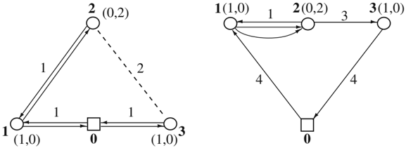

Fig. 1. Two possible solutions (full lines) to the mixed SVPDP on a circular graph. The pickup and delivery amounts are indicated by ( p , d i i ).

demand are served the first time they are visited, while vertices with a pickup demand are served after all vertices in the subtree rooted at them have been served.

Step 3. Construct a Hamiltonian tour by following the tree in a depth-first fashion and applying shortcuts.

The authors have proved that the solution produced by this heuristic is always feasible. Moreover, if the cost matrix is symmetric and satisfies the triangle inequality, then the worst-case performance ratio of heuristic 2MST is equal to 2.

Another heuristic for the same problem was proposed by Gendreau, Laporte and Vigo [15]. The authors first consider the SVPDP defined on a cycle, i.e., the arc set of the graph defines a cycle spanning the vertices of V . They show that there always exists an optimal solution in which one edge is not visited and all other edges are visited twice, or all edges are visited once or three times. In the first case the edge having the highest cost is unvisited. In the second case, assuming the order of the vertices on the cycle is (0 , 1 , . . . , n ), then edge ( i, i +1) is visited three times if and only if ∑ j ≤ i ( p j -d j ) &gt; Q -n ∑ j =1 d j .

The authors provide a linear time exact algorithm called C, for visiting each edge the correct number of times. Figure 1 depicts two solutions for the mixed SVPDP.

Given this, the following O n ( 2 ) heuristic, called H , can be applied to a general graph.

Step 1. Determine a TSP solution on G by means of the Christofides [7] heuristic.

Step 2. Apply heuristic C to the Hamiltonian cycle corresponding to the TSP solution.

Step 3. Derive a Hamiltonian solution by applying shortcuts.

Since the cost of this solution is at most twice that of the TSP solution and the Christofides heuristic has a worst-case performance ratio of 1.5, heuristic H has a worst-case performance ratio of 3. While heuristic H has a worst-case ratio larger than that of the Mosheiov [24] heuristic, it has been shown to have a better empirical performance as confirmed by tests performed by Gendreau, Laporte and Vigo [15] on instances containing between 26 and 261 vertices. These authors have also developed a tabu search heuristic that performs 2-opt exchanges, which outperformed all previous heuristics at the expense of larger computing times.

Finally, we mention that Baldacci, Hadjiconstantinou and Mingozzi [4] have developed an exact branch-and-cut algorithm for this problem, based on a two-commodity flow formulation. It can solve instances involving up to 200 vertices within one hour of computing time.

## 3 The SVPDP with Combined Demands (P&amp;D)

We distinguish between two cases of the SVPDP with combined demands. In the first case, denoted by PD and known as the Traveling Salesman Problem with Pickup and Deliveries (TSPPD), each customer is visited exactly once for a combined pickup and delivery operation. It will be shown that this case reduces to the mixed SVPDP. In the second case, denoted by P-D, and called the general SVPDP , the pickup and delivery operations may be performed within the same visit or in two separate visits.

## 3.1 The Traveling Salesman Problem with Pickup and Deliveries (PD)

The TSPPD reduces to the mixed SVPDP (Mosheiov [24]). Indeed, if p i &gt; d i , redefine the pickup demand of customer i as p ′ i = p i -d i , and its delivery demand as d ′ i = 0; if p i ≤ d i , the delivery demand of i becomes d ′ i = d i -p i and its pickup demand is p ′ i = 0. Then redefine the vehicle capacity as Q ′ = Q -n ∑ i =1 d i . Note that this transformation is only valid under the assumption that each customer is visited only once, which makes it possible to work with net demands. All methods of Section 2.2 are applicable to this problem.

## 3.2 The General SVPDP (P-D)

Gribkovskaia et al. [17] distinguish between four solution shapes for the general SVPDP: general (G), lasso (L), Hamiltonian (H), and double-path (D). A general solution is unrestricted in that any customer can be visited once for a combined pickup and delivery service, or twice if these two operations are performed separately. In other words, general solutions include all possible feasible shapes. In a lasso solution, the vehicle first performs deliveries along

Fig. 2. Four solution shapes for the general SVPDP with combined demands on a Euclidean graph.

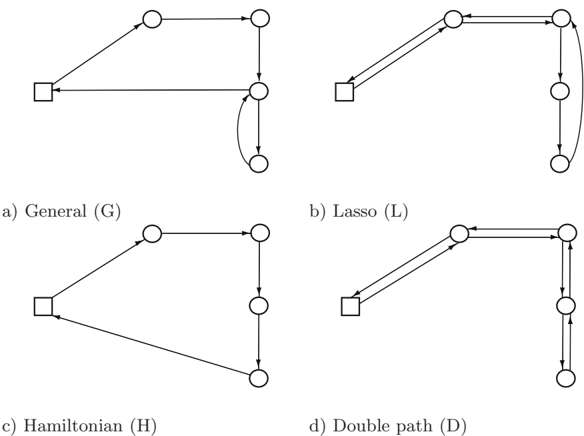

a path rooted at the depot to a subset S of customers, until it reaches a certain vertex k . All vertices of ( V \{ 0 } \ ) S are then visited once for a combined service along a loop until the vehicle reaches k again and performs deliveries to the customers of S by following a path leading to the depot. If S = ∅ , the lasso reduces to a Hamiltonian solution, which yields a TSPDP. If S = V \{ 0 } , the lasso reduces to a double-path solution. A double-path solution can also be obtained by solving a TSPB. This is achieved by duplicating the customer set into the union of a set of linehaul customers with delivery demands d i and zero pickup demands, and a set of backhaul customers with zero delivery demands and pickup demands p i . The four solution shapes are illustrated in Figure 2.

Denote by z G , z L , z H and z D the costs of the optimal general, lasso, Hamiltonian and double-path solutions, respectively, associated with the same instance. Gribkovskaia et al. [17] prove that if the ( c ij ) matrix satisfies the triangle inequality, then the following relation holds: z G ≤ z L ≤ z H ≤ z D ≤ 2 z G . Figure 3 depicts an instance for which the non-lasso solution (0 , 1 2 3 5 4 6 3 0) of cost 9 is optimal. , , , , , , ,

The general SVPDP with combined demands can be formulated as follows. Let i and i + n be two copies of vertex i , where p i + n = p i and d i + n = 0. The model allows two service possibilities for each customer i . The pickup and delivery operations may be performed simultaneously, in which case vertex i is visited and vertex i + n is not visited. Otherwise, customer i is visited twice: delivery is made at vertex i and pickup at vertex i + . We define an extended n

Fig. 3. Euclidean instance for which the non-lasso solution (0 , 1 2 3 5 4 6 3 0) is , , , , , , , optimal. The pickup and delivery demands are indicated by ( p , d i i ).

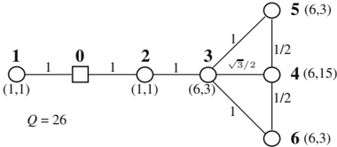

<!-- formula-not-decoded -->

<!-- formula-not-decoded -->

We also define the following variables:

/negationslash

<!-- formula-not-decoded -->

/negationslash

/negationslash

<!-- formula-not-decoded -->

w i = an upper bound on the total pickup amount in the vehicle upon leaving vertex i ( i = 0 , . . . , 2 n )

z i = an upper bound on the total delivery amount in the vehicle upon leaving vertex i ( i = 0 , . . . , 2 n . )

The general SVRPPD model is to

<!-- formula-not-decoded -->

subject to

<!-- formula-not-decoded -->

<!-- formula-not-decoded -->

<!-- formula-not-decoded -->

<!-- formula-not-decoded -->

<!-- formula-not-decoded -->

<!-- formula-not-decoded -->

<!-- formula-not-decoded -->

w

<!-- formula-not-decoded -->

j

w

i

+

p

j

(1

y

j

-

n

)

(1

x

ij

)

Q

<!-- formula-not-decoded -->

≥

-

-

-

<!-- formula-not-decoded -->

ij

x

0 1

,

(

i, j

= 0

, . . . ,

2

n, i

= ;

j

j

=

i

+

n

<!-- formula-not-decoded -->

/negationslash

∈ {

}

/negationslash

/negationslash

<!-- formula-not-decoded -->

In this formulation, constraints (2) and (3) mean that the first vertex associated with each customer is visited once, either for a single delivery or for a simultaneous pickup and delivery. Constraints (4) and (5) express the fact that the second vertex associated with a customer is visited only if a combined pickup and delivery does not occur at the first vertex. Constraints (6) and (7) define the vehicle load upon leaving the depot, while constraints (8) guarantee that the vehicle load will never exceed the vehicle capacity. Constraints (9) and (10) state that the pickup amount in the vehicle is increased by p j if vertex j is visited immediately after vertex i and a pickup takes place at that vertex. Constraints (11) mean that the delivery amount in the vehicle decreases by d j if vertex j is visited immediately after vertex i . Constraints (12) and (13) impose the binary conditions on the variables. As in Desrochers and Laporte [10], constraints (9), (10) and (11) prevent the formation of subtours.

The size of instances that can be solved optimally using this model is relatively small and heuristics must therefore be used in practice. One such heuristic is an adaptation of the Unified Tabu Search Heuristic (UTSA) of Cordeau, Laporte and Mercier [9]. This heuristic has proved to be highly efficient on a host of vehicle routing problems and it easily adapts to several situations.

The main features of the tabu search algorithm for the general SVPDP have been described in Cordeau, Laporte and Mercier [9] and in Gribkovskaia et al. [17]. Several of these apply directly to most SVPDP variants, namely the construction of an initial solution, the use of attributes to define tabu statuses, the aspiration criterion, the diversification mechanism, the use of periodic reoptimization and the termination criterion. We now describe the

penalized objective function and the neighbourhood mechanism which will be referred to in Section 4.

## Penalized objective function

In order to allow a mix of feasible and infeasible solutions, the algorithm works with a penalized function f ( s ) = c s ( ) + αq s ( ), where c s ( ) is the cost of solution s , q s ( ) is the total vehicle capacity violation of s , and α is a self-adjusting parameter. At each iteration, α is divided by 1 + δ &gt; 1 if the current solution is feasible, and multiplied by 1 + δ otherwise, where δ is a user-controlled parameter. This mechanism is identical to that of Cordeau, Gendreau and Laporte [8].

## Neighbourhood structure and attribute set

At each iteration, the neighbourhood N s ( ) of a solution s is defined as the set of all solutions reachable from s by changing the number v of visits of a customer. With s is associated an attribute set B s ( ) = { ( i, v ) : i ∈ V \{ 0 } and v = 1 or 2 } . A transition from s to a neighbour s ′ is called a move , which can be defined as the removal of an attribute ( i, v ) from B s ( ) and the inclusion of ( i, v ′ ) in B s ( ′ ), where v ′ = v . There are two possible moves.

/negationslash

- 1. If v = 1, a second visit of i is inserted in the current solution so as to yield the smallest increase of f ( s ). Visiting i twice will typically increase c s ( ) and decrease q s ( ).
- 2. If v = 2, the second occurrence of vertex i in the solution is deleted and its predecessor and successor are linked together. As a result pickup and delivery are now performed simultaneously at vertex i . Visiting i once will typically decrease c s ( ) and increase q s ( ).

This algorithm was extensively tested by Gribkovskaia et al. [17] on benchmark instances derived from VRPLIB (http://www.er.deis.unibo.it/ research\_pages/ORinstances/VRPLIB/VRPLIB.html) containing between 16 and 101 vertices. It was observed that 38% of all solutions were non-Hamiltonian and 18% were non-lasso. This shows that it would have been suboptimal to impose a predefined shape on the solution. The frequency of multiple visits is higher in instances containing customers located close to the depot and having a large pickup demand compared with their delivery demand, so that it is preferable to perform the delivery and pickup operations separately.

## 4 Extensions of the General SVPDP

There exist several natural and meaningful extensions of the 1-M-1 general SDVRP, all of which have only received limited attention. We will consider four such extensions. In these extensions, visiting customers twice may be dictated by feasibility considerations.

## 4.1 Periodic SVPDPs

In periodic problems customer pickup and delivery requirements are spread over a period of several days and the problem is then to simultaneously determine a subset of customers and the order of visits for each day. This problem is encountered in the planning of reverse logistics operations, for example when new household appliances and furniture such as washing machines, fridges or mattresses must be delivered and used items must be collected. Alshamrani, Mathur and Ballou [1] have studied the case where the pickup and delivery operations may be spread over several days but a maximum time limit is imposed between the pickup and the delivery operations in order to avoid product deterioration. The problem studied by these authors is motivated by the blood distribution system of the American Red Cross.

## 4.2 SVPDPs with Selective Pickups

An interesting case, also arising in reverse logistics, is where pickups are optional, but generate a profit when performed. An example described by Priv´ e et al. [26] is the delivery of beverages to supermarkets and convenience stores, and the collection of empty recyclable containers. This case was recently studied by Gribkovskaia, Laporte and Shyshou [19]. To handle this variant, the authors introduce an additional binary variable u i ( i = 1 , . . . , n ) to the model of Section 3.2, equal to 1 if and only if pickup is performed during the second visit to customer i . If the pickup associated with customer i generates a revenue r i , then the objective becomes

<!-- formula-not-decoded -->

The right-hand sides of constraints (4) and (5) become u i -n and u j -n , respectively. It is also necessary to impose the constraints

<!-- formula-not-decoded -->

and to modify constraints (10) as follows:

<!-- formula-not-decoded -->

In the tabu search algorithm for this problem, the neighbourhood structure is similar to that of the general SVPDP, but a status is assigned to each customer: PD for a simultaneous pickup and delivery, D for a single delivery, and P-D for a separate pickup and delivery operations. Then,

- 1) if v = 1, a second visit of i is inserted in the current solution so as to yield the smallest increase of f ( s ). In other words, for each vertex with status PD or D change to status P-D is evaluated;

Fig. 4. Euclidean instance for which an intermediate drop at the depot is beneficial. The pickup and delivery demands are indicated by ( p , d i i ).

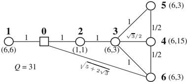

- 2) if v = 2, the second occurrence of vertex i in the solution is deleted and its predecessor and successor are connected. Or, in terms of vertex statuses, for each vertex with status P-D two possible modifications to the status PD or D are evaluated and only the modification yielding the smaller increase of f ( s ) is considered for each vertex. As a result either pickup and delivery are performed simultaneously at vertex i or only delivery demand is satisfied.

In addition local reoptimization is applied whenever a new best feasible solution is identified. This is done by means of two improvement heuristics, called SP and RC, which are used every ψ th and ϕ th iteration, respectively, where ψ and ϕ are user-controlled parameters. Heuristic SP (shifting pickups) attempts to improve the solution by delaying the pickup operation of PD customers, and thus freeing some space on the vehicle; heuristic RC (resequencing of customers) attempts to improve the solution by iteratively removing from the route vertices visited once and reinserting them in the most profitable position.

Several variants of this algorithm were extensively tested on instance containing between 16 and 101 vertices. One of the best two yielded solutions within 3.98% of the minimal reachable routing cost, and 0.24% of the optimal revenue; for the other one, these figures were 3.35% and 0.55%.

Finally, we mention that S¨ral and Bookbinder [27] have also formulated u and solved a version of the mixed SVPDP with selective pickups. The formulation was solved by CPLEX 5.0. Fifty-three out 72 instances with n ≤ 30 could be solved optimally within times ranging from 0.04 to 5.76 seconds on an IBM Risc/6000 computer.

## 4.3 SVPDPs with Intermediate Drops

Another variant of the general SVPDP with combined demands is to allow drops at intermediate vertices. For example, when the vehicle makes several passages through the depot, it may make sense to empty part of its content in order to create extra space and thus allow more flexibility in the remaining part of the route. In the example of Figure 4, an optimal solution of cost 9 is

Fig. 5. Euclidean instance for which transshipment at a customer location is beneficial. The pickup and delivery demands are indicated by ( p , d i i ).

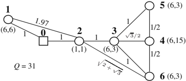

(0,1,2,3,5,4,6,3,0) if no intermediate drop at the depot is allowed. However, a better solution (0,1,0,2,3,5,4,6,0) of cost 8.91 is obtained if the pickup demand of customer 1 ( p 1 = 6) is dropped at the depot while the vehicle is traveling from 1 to 2. Another possibility is to allow transshipment at customer locations along the vehicle route. Consider the example of Figure 5 in which edge (0,1) is rotated clockwise so that the cost of edge (1,2) becomes 1.97. Then an optimal solution without intermediate drop is still (0,1,2,3,5,4,6,3,0) and has a cost of 8.97. Transshipping six demand units at vertex 2 yields a better solution (0,1,2,3,5,4,6,2,0) of cost 8.90. As far as the authors are aware, intermediate drops have never been studied in the context of the SVPDP, but Mitrovi´ c-Mini´ and Laporte [22] have shown the benefits of transshipment in c the context of 1-1 pickup and delivery problems.

## 4.4 SVPDPs with Capacitated Customers

Finally, another interesting extension of the general SVPDP is the case of capacitated customers. In some contexts like the servicing of offshore platforms (Gribkovskaia, Laporte and Shlopak [18]), there is no spare capacity at the customer locations. When a vehicle (a vessel) arrives at a platform, it may have to first unload a container from the platform before performing a delivery, but this is only possible if there is sufficient capacity in the vessel. This situation is handled by adding the following constraints to the model of Section 3.2. Let C i be the available free capacity of customer i at the start of operations (it is assumed that C i ≥ d i -p i to ensure feasibility). Then

<!-- formula-not-decoded -->

and

<!-- formula-not-decoded -->

Constraints (17) ensure that there is sufficient capacity at each customer location to perform the pickup and delivery services, while constraints (18) prevent infeasible situations in which the vehicle would arrive fully laden at

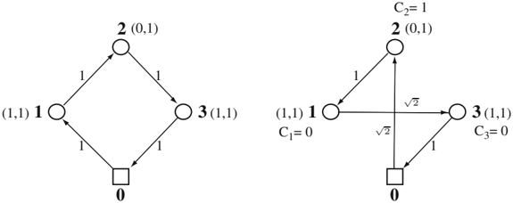

a) Optimal solution without customer b) Optimal Hamiltonian solution with capacities customer capacities

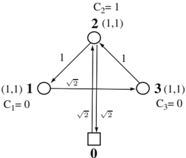

0

- c) Optimal non-Hamiltonian solution with customer capacities

Fig. 6. Instance with capacitated customers. The vehicle capacity is Q = 3. The pickup and delivery demands are indicated by ( p , d i i ).

a location with no free storage space, and the amounts to be picked up and delivered would be the same. More specifically, these constraints state that the amount of free space on the vehicle and at the customer location cannot both be zero.

Figure 6 depicts a case where Q = 3. In Figure 6a there are no customer capacities and the solution (0 , 1 2 3 0) of , , , cost 4 is optimal. In Figure 6b customer capacities are imposed and the Hamiltonian solution (0 2 , , 1 3 0) of , , cost 2 + 2 √ 2 is optimal. In Figure 6c no Hamiltonian solution is feasible and the non-Hamiltonian solution (0 2 1 3 2 0) of cost 2 + 3 , , , , , √ 2 is optimal.

In order to handle customer capacities, some modifications must be made to the tabu search algorithm of Section 3.2. Vertices are first classified into three categories:

category 0: vertices for which C = 0 and d = p ;

```
i i i i i ; i ≥ i .
```

category 1: vertices for which C &lt; d

category 2: vertices for which C d

Vertices of category 0 and 1 can only be visited once for a simultaneous pickup and delivery, and those of category 0 can only be visited when the vehicle is not fully laden. This is obvious because these vertices do not have sufficient available capacity to accept their delivery demand without their pickup demand being collected. Vertices of category 2 can be visited once or twice on a route.

Moreover, a solution is said to be load-feasible if the vehicle capacity is never exceeded. It is storage-feasible if none of the vertices of categories 0 or 1 is visited twice. It is operational-feasible if a fully laden vehicle never serves a customer with no available capacity (category 0 vertex). Then the following changes are implemented in the search procedure.

## Neighborhood N(s) and definition of a move

The neighborhood N s ( ) of solution s is defined by all solutions that can be reached from s by changing the number of visits at one category 2 vertex.

## Load feasibility violations

Load feasibility is checked whenever a vertex is visited. The total load infeasibility of a route is equal to the sum of load infeasibilities of all its vertices.

## Operational feasibility violations

Operational feasibility means that vertices with zero capacity must not be visited by a fully laden vehicle. The operational feasibility violation of a route is the number of such vertices.

## Storage feasibility violations

Vertex capacity violations are not allowed. Before solving an instance, vertices that can be visited only once (the number of visits is not dependent on routing) are identified.

## Penalized objective function

For a solution s ∈ S , let c s ( ) denote the total routing cost, let q s ( ) denote the total load violation of the route, and let g s ( ) denote the operational feasibility violation of the route. Solutions s ∈ S are evaluated with the help of the penalized cost function f ( s ) = c s ( ) + αq s ( ) + πg s ( ), where α and π are positive self-adjusting parameters.

Tests have shown that this modified tabu search algorithm can effectively solve realistic instances containing 16 and 101 vertices and the best found solutions are not always Hamiltonian (see Gribkovskaia, Laporte and Shlopak [18]).

## Table 1. Summary of the algorithms developed for the SVPDP

| Results          | Worst-case performance ratio of 1.5.   | Deviation from the optimum between 3% and 5% (100 ≤ n ≤ 300). Improvements of 40% over Gendreau, Hertz and   | Laporte [14]. Worst-case performance ratio of 2.5. Better empirical performance than previous   | heuristic. Worst-case performance ratio of 2.   | Worst-case performance ratio of 3. Better em- pirical performance than Mosheiov's heuristic on graphs with 26 ≤ n ≤ 261.   | Improves upon previous results. Can solve instances with n = 200 within one hour.   | Applies to instances with selective pickups. Fifty- three out 72 instances with n ≤ 30 could be solved optimally within 5.76 seconds.   | Reduction to the mixed SVPDP. Capable of yielding general solutions. Tested on instances with 16 ≤ n ≤ 101. Can solve instances with selective pickups. Tests on instances with 16 ≤ n ≤ 101. Cost deviation of 3.98% and profit deviation of 0.24% with respect optimum, or cost deviation of 3.35% and profit   | to deviation of 0.55%. Applies to problems with capacitated Tested on instances with 16 ≤ n ≤ 101.   | customers.                             |
|------------------|----------------------------------------|--------------------------------------------------------------------------------------------------------------|-------------------------------------------------------------------------------------------------|-------------------------------------------------|----------------------------------------------------------------------------------------------------------------------------|-------------------------------------------------------------------------------------|-----------------------------------------------------------------------------------------------------------------------------------------|-------------------------------------------------------------------------------------------------------------------------------------------------------------------------------------------------------------------------------------------------------------------------------------------------------------------|------------------------------------------------------------------------------------------------------|----------------------------------------|
| Algorithm        | Approximation heuristic                | Heuristic based on GENI insertions Variable neighbourhood                                                    | search heuristic Approximation heuristic                                                        | Insertion heuristic                             | Approximation heuristic Approximation heuristic                                                                            | Tabu search algorithm Exact branch-and-bound algorithm                              | Integer linear programming formulation. Solved by CPLEX 5.0                                                                             | Reduction UTSA adaptation                                                                                                                                                                                                                                                                                         | UTSA adaptation                                                                                      | UTSA adaptation                        |
| Reference        | Gendreau, Hertz and Laporte [14]       | Gendreau, Hertz and Laporte [13] Mladenovi´ c and Hansen [23]                                                |                                                                                                 | Mosheiov [24]                                   | Anily and Mosheiov [3] Gendreau, Laporte and Vigo [15]                                                                     | Baldacci, Hadjiconstantinou and Mingozzi [4]                                        | S¨ral u and Bookbinder [27]                                                                                                             | Mosheiov [24] Gribkovskaia et al. [17]                                                                                                                                                                                                                                                                            | Gribkovskaia, Laporte and Shyshou [19]                                                               | Gribkovskaia, Laporte and Shlopak [18] |
| Route structure  | SVPDP with backhauls                   |                                                                                                              | Mixed SVPDP                                                                                     |                                                 |                                                                                                                            |                                                                                     |                                                                                                                                         | TSPPD (PD) General SVPDP (P-D)                                                                                                                                                                                                                                                                                    |                                                                                                      |                                        |
| Demand structure | Single demands(P/D)                    |                                                                                                              |                                                                                                 |                                                 |                                                                                                                            |                                                                                     |                                                                                                                                         | Combined demands (P & D)                                                                                                                                                                                                                                                                                          |                                                                                                      |                                        |

## 5 Conclusions

The one-to-many-to-one SVPDP arises in several practical contexts and has been extensively studied by operations researchers. Several variants of the problem exist according to whether pickup and delivery operations can or must be performed separately, and to whether an order is imposed on the sequencing of these two types of operation. The algorithms described in this chapter are summarized in Table 1. Allowing general solutions in which no a priori shape is imposed and customers may be visited once or twice is often beneficial. Because these problems are rather hard to solve, very few exact algorithms are available. More often than not, heuristics are the only practical solution methodology. For some variants of the problem, heuristics with a bounded worst case performance ratio have been proposed. Several variants can be solved efficiently by modifying the Unified Tabu Search Algorithm of Cordeau, Laporte and Mercier [9]. Various extensions of the 1-M-1 SVPDP have been described. Some of these are relevant to the planning of reverse logistics operations and to the servicing of offshore oil and gas platforms.

## Acknowledgement

This work was partly funded by the Research Council of Norway and by the Natural Sciences and Engineering Research Council of Canada under grant 39682-05. This support is gratefully acknowledged. Thanks are due to two referees for their valuable comments.

## References

- 1. Alshamrani A, Mathur K, and Ballou RH (2007) Reverse logistics: Simultaneous design of delivery routes and return strategies. Computers &amp; Operations Research 34:595-619
- 2. Anily S and Hassin R (1992) The swapping problem. Networks 22:419-433
- 3. Anily S and Mosheiov G (1994) The traveling salesman problem with delivery and backhauls. Operations Research Letters 16:11-18
- 4. Baldacci R, Hadjiconstantinou EA, and Mingozzi A (2003) An exact algorithm for the traveling salesman problem with deliveries and collections. Networks 42:26-41
- 5. Berbeglia G, Cordeau J-F, Gribkovskaia I, and Laporte G (2007) Static pickup and delivery problems: A classification scheme and survey. TOP 15:1-31
- 6. Chisman JA (1975) The clustered traveling salesman problem. Computers &amp; Operations Research 2:115-118
- 7. Christofides N (1976) Worst-case analysis of a new heuristic for the travelling salesman problem. Research report 388, G.S.I.A., Carnegie Mellon University, Pittsburgh, PA
- 8. Cordeau J-F, Gendreau M, and Laporte G (1997) A tabu search algorithm for periodic and multi-depot vehicle routing problems. Networks 30:105-119

- 9. Cordeau J-F, Laporte G, and Mercier A (2001) A unified tabu search heuristic for vehicle routing problems with time windows. Journal of the Operational Research Society 52:928-936
- 10. Desrochers M and Laporte G (1991) Improvements and extensions to the MillerTucker-Zemlin subtour elimination constraints. Operations Research Letters 10:27-36
- 11. Dethloff J (2001) Vehicle routing and reverse logistics: The vehicle routing problem with simultaneous delivery and pick-up. Operations Research Spectrum 23:79-96
- 12. Frederickson G, Hecht M, and Kim C (1978) Approximation algorithms for some routing problems. SIAM Journal on Computing 7:178-193
- 13. Gendreau M, Hertz A, and Laporte G (1996) The traveling salesman problem with backhauls. Computers &amp; Operations Research 23:501-508
- 14. Gendreau M, Hertz A, and Laporte G (1997) An approximation algorithm for the traveling salesman problem with backhauls. Operations Research 45:639-641
- 15. Gendreau M, Laporte G, and Vigo D (1999) Heuristics for the traveling salesman problem with pickup and delivery. Computers &amp; Operations Research 26:699714
- 16. Golden BL, Bodin LD, Doyle T, and Stewart WR Jr (1980) Approximate travelling salesman algorithms. Operations Research 28:694-711
- 17. Gribkovskaia I, Halskau sr Ø, Laporte G, and Vlˇek M (2007) General solutions c to the single vehicle routing problem with pickups and deliveries. European Journal of Operational Research 180:568-584
- 18. Gribkovskaia I, Laporte G, and Shlopak A (2006) A tabu search heuristic for a routing problem arising in the servicing of oil and gas offshore platforms. Journal of the Operational Research Society forthcoming
- 19. Gribkovskaia I, Laporte G, and Shyshou A (2007) The single vehicle routing problem with deliveries and selective pickups. Computers &amp; Operations Research forthcoming
- 20. Hern´ andez-Perez H and Salazar-Gonz´ alez JJ (2004a) Heuristics for the onecommodity pickup and delivery traveling salesman problem. Transportation Science 38:245-255
- 21. Hern´ andez-Perez H and Salazar-Gonz´lez JJ (2004b) A branch-and-cut algoa rithm for a traveling salesman problem with pickup and delivery. Discrete Applied Mathematics 145:126-139
- 22. Mitrovi´-Mini´ S and Laporte G (2006) The pickup and delivery problem with c c time windows and transshipment. INFOR 44:217-227
- 23. Mladenovi´ c N and Hansen P (1997) Variable neighborhood search. Computers &amp; Operations Research 24:1097-1100
- 24. Mosheiov G (1994) The travelling salesman problem with pick-up and delivery. European Journal of Operational Research 79:299-310
- 25. Nagy G, and Salhi S (2005) Heuristic algorithms for single and multiple depot vehicle routing problems with pickups and deliveries. European Journal of Operational Research 162:126-141
- 26. Priv´ J, Renaud J, Boctor FF, and Laporte G (2006) Solving a vehicle routing e problem arising in soft drink distribution. Journal of the Operational Research Society 57:1045-1052
- 27. S¨ ural H and Bookbinder JH (2003) The single-vehicle routing problem with unrestricted backhauls. Networks 41:127-136

- 28. Tang FA and Galv˜ ao RD (2002) Vehicle routing problems with simultaneous pick-up and delivery service. Opsearch 39:19-33
- 29. Tang FA and Galv˜ ao RD (2006) A tabu search algorithm for the vehicle routing probem with simultaneous pick-up and delivery service. Computers &amp; Operations Research 33:595-619
- 30. Wasner M and Z¨ aphel G (2004) An integrated multi-depot hub-location vehicle routing model for network planning of parcel service. International Journal of Production Economics 90:403-419

## Challenges and Opportunities in Attended Home Delivery

Niels Agatz , Ann Melissa Campbell , Moritz Fleischmann , and Martin 1 2 1 Savelsbergh 3

1 RSM Erasmus University Rotterdam, The Netherlands nagatz@rsm.nl, mfleischmann@rsm.nl

2 Tippie College of Business Department of Management Sciences University of Iowa Iowa City, Iowa 52242-1994 ann-campbell@uiowa.edu

3 H. Milton Stewart School of Industrial and Systems Engineering Georgia Institute of Technology Atlanta, Georgia martin.savelsbergh@isye.gatech.edu

Summary. In this chapter, we focus on home delivery, and, more specifically, on attended home delivery, where the consumer must be present for the delivery. To provide a high service level and to avoid delivery failures as much as possible, it is customary in attended home delivery services for the company to offer the customer a choice of narrow delivery time slots. The objective of this chapter is to highlight and illustrate issues arising in attended home delivery related to these time slots and to present and discuss promising approaches for addressing some of them. We will use Peapod, one of the more successful e-grocers, as an illustrative example.

Key words: Consumer direct; home delivery; e-grocery; time slots.

## 1 Introduction

Internet retailing allows customers to purchase goods online and have them delivered directly to their front door. Although a 'last-mile' delivery service is convenient for the customer, it creates significant logistical challenges for companies. For example, we have seen the rise and subsequent fall of many e-grocers, including Webvan [11] and Shoplink, who failed to attract the customer volumes needed to make their distribution models viable. Other

e-grocers have been more resilient and have shown that it is possible to design and operate a profitable business, such as Peapod (www.peapod.com) and Albert.nl (www.albert.nl), and many continue to enter the arena, including Fresh Direct [13], with their own ideas on how to succeed.

Home delivery, of course, is not exclusively encountered in the e-grocer space. Many traditional retailers offer an Internet sales channel and home delivery service alongside their conventional sales and distribution structures. The Internet sales channel is part of a multi-channel structure, profiting from synergies such as brand recognition, cross-promotion, purchasing leverage, and an already existing distribution infrastructure. (For a review of the relevant literature on the online channel in a multi-channel environment see [3].) Pure Internet players have entered the market place as well and continue to do so, including Amazon.com, Overstock.com, and Furniture.com. With total annual online sales predicted to be $213 billion by 2009 [18], home delivery is quickly becoming one of the most important business models.

As mentioned above, the Internet sales channel is often part of a 'bricksand-clicks' multi-channel strategy. In such environments, the delivery component of the Internet sales channel can make use of the existing conventional distribution structure, e.g. using store pick-up points as an alternative method to bridge the last mile. In this chapter, however, we explicitly focus on home delivery, and, equally important, on attended home delivery, where the consumer must be present for the delivery. Attended delivery may be necessary for security reasons (e.g. electronics), because goods are perishable (e.g. groceries), because goods are physically large (e.g. furniture), or because a service is performed (e.g. repair or product installation). To provide a high service level and to avoid delivery failures as much as possible, it is customary in attended home delivery services for the company to offer the customer a choice of narrow delivery time slots. Furthermore, we do not consider 'same-day delivery,' but focus on environments in which all orders are known at the time delivery operations commence.

In addition to traditional routing issues, several novel challenges and opportunities arise in developing a successful home delivery strategy. Notably, the delivery provider can choose the time slots that are offered to the different customers and the fees associated with deliveries during these time slots, and these choices can facilitate cost-effective routing. Initial time slotting decisions need to be made prior to actual customer order arrival. On a day-to-day basis, as delivery routes begin to fill up, the delivery provider may find that it is impossible to serve a customer in one or more of the offered time slots and that the costs of serving the customer in one of the remaining time slots differ widely. E-commerce allows delivery providers, in real time, the unique opportunity to reduce the number of slots offered to customers and/or change the fees associated with deliveries during each slot. Both aspects, i.e., determining a base time slot schedule and dynamically adjusting the base time slot schedule, intimately tie demand management decisions in attended home delivery to vehicle routing problems with time windows.

The objective of this chapter is to highlight and illustrate issues arising in attended home delivery and to present and discuss promising approaches for addressing some of them. In doing so, we will focus on e-grocers as their environment is one of the most challenging when it comes to attended home delivery due to fierce competition, low profit margins, and perishable bulky products.

The remainder of the chapter is organized as follows. In Section 2, we present the typical issues in attended home delivery by discussing the operations of one of the more successful e-grocers. In Section 3, we discuss service offerings and the construction of time slot schedules. In Section 4, we examine the dynamic, day-to-day aspects of managing time slots. In Section 5, we investigate the use of incentives and penalties to smooth customer demands. Finally, in Section 6, we discuss important areas for future research.

## 2 Home Delivery at Peapod: An Illustrative Case

Peapod is part of Royal Ahold and one of the largest Internet grocers in the U.S.. The company was founded in 1989 by Andrew and Thomas Parkinson. Currently, Peapod serves over 11 million households in cities in the United States, including Chicago, Washington, D.C., and Boston. The company offers attended home delivery service 5 days a week from 6am to 1pm and from 4pm to 10pm and on weekends from 6am to 1pm. Peapod offers more than 10,000 products, including fresh groceries such as farm-fresh produce, deli meats, cheeses and milk. Peapod picks the orders from two state-of-the-art warehouses (Chicago &amp; Washington, D.C.) and from twelve smaller warerooms, adjacent to supermarket partners Stop &amp; Shop and Giant Food. Peapod uses vans to deliver the orders to the customers.

In setting up their delivery operations, Peapod had to decide on the service offering. This involves determining the number of weekly time slots to offer, the length of the time slots, and the actual times at which time slots are offered in the different zipcodes served. At the moment, Peapod offers overlapping 2- and 3.5-hour time slots. Peapod charges a delivery fee dependent on the order size: $6.95 for orders over $100, $7.95 for orders between $75 and $100, and $9.95 for orders less than $75.00. Customer service considerations, as well as delivery cost considerations, play a role in deciding on the service offering. Offering more time slots may increase customer service, but it will likely reduce the drop-density, i.e., the number of visits a delivery truck makes in a specific zip code, which in turn may result in higher delivery costs. Similarly, shorter time slots may provide greater customer convenience, but they decrease routing flexibility and may therefore increase delivery costs. Peapod uses zipcode specific characteristics, such as population density, Internet penetration, and historical demand data to define service requirements for each zipcode. Peapod reevaluates their service offering every six months.

Issues related to service offerings and time slot schedule design are addressed in Section 3.

On Peapod's website, a customer creates an order and then selects a time slot for delivery. In order to have sufficient time for order picking, time slots are closed about 10 hours before actual delivery. Peapod uses morning and evening cut-off times. The cut-off time is 8pm on the day before delivery for morning slots and midnight on the day before delivery for evening slots. While a time slot is open, the number of orders that has to be delivered in a zipcode during that time slot is closely monitored. Based on capacity considerations, certain time slots in certain zipcodes may be closed at some point. Closing a time slot at Peapod means labeling it as 'sold out' on their website (see Figure 1). Even before capacity limits are reached, Peapod may open and close time slots for certain customer groups to try to balance the number of orders over the different time slots. For example, it might be beneficial to temporarily close a popular time slot (in a certain zipcode) to force the selection of other time slots. Actively influencing time slots selection enables Peapod to improve the cost-effectiveness of their delivery operations. Determining when to close or open any of the available time slots is a huge challenge. Price incentives, i.e., discounts, can also be used to balance demand over time. Peapod offers discounts to encourage the selection of the longer 3.5-hour time slots when appropriate. Issues related to dynamically opening and closing time slots are discussed in Section 4 and issues related to using incentives to balance demand are addressed in Section 5.

After the order cut-off, delivery routes are determined using a commercial routing package (i.e., a vehicle routing problem with time windows is solved). The routes link orders from different time slots during the same morning or evening shift. Once the delivery routes have been determined, expected delivery times are known and can, in principle, be communicated to the customers. For those customers who select a 3.5 hour time slot, Peapod provides a more precise delivery window to them on the day of delivery. These customers can look on the Peapod website on the day of delivery and find a narrower 2-hour time slot commitment within the original 3.5 hours. During the execution of the delivery routes, the delivery vehicles are tracked using cell phone GPS information. Customer specific stop time information is recorded and uploaded into the routing software for continuous improvements of the planning parameters. Also, estimated arrival times at subsequent stops are computed and customers are notified by phone in case a late arrival is expected. If Peapod cannot deliver the order, or must make an additional delivery because no one is at the delivery address to receive and pay for the order at the specified time, the customer will be assessed an additional fee.

Now that we have presented some of the issues encountered by Peapod, we proceed with a more general discussion of the various components of an effective attended home delivery operation.

Fig. 1. Peapod time slots.

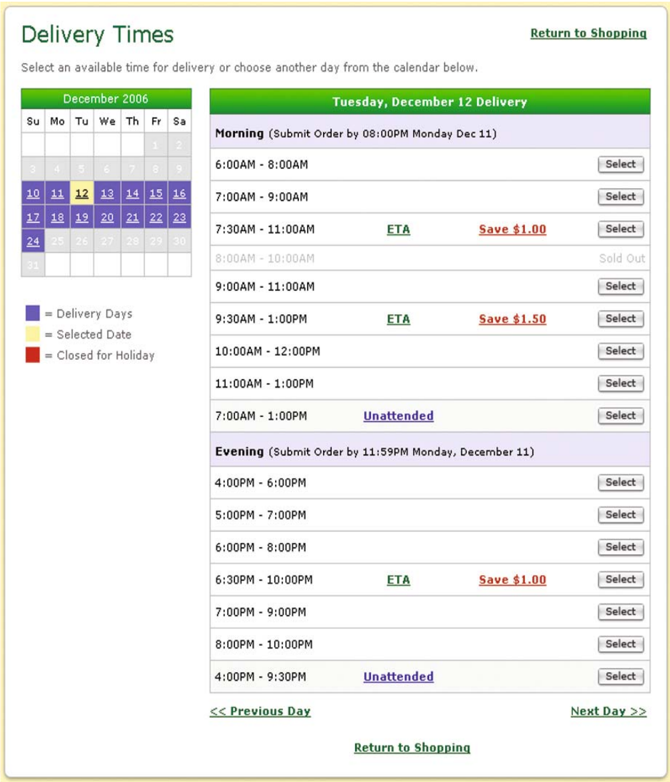

## 3 Time Slot Schedule Design

In this section, we present the tactical planning issues related to the design of a time slot schedule.

## 3.1 Issues

Before we delve more specifically into time slot schedule design, we observe that the use of an Internet sales channel facilitates differentiation of service

offerings. It is possible to develop a customized time slot schedule for each region, for each zip code, for each customer type, or even for each individual customer. In our discussion, however, we differentiate customers based only on their zipcodes which is common practice in many applications.

Time Slot Schedule Design involves two related, but separate sets of decisions, which are usually dealt with in a hierarchical fashion:

- · Determine the service requirements and delivery charges for each zipcode;
- · Assign specific time slots to each of the zipcodes (respecting the service requirements).

Together, these decisions set the conditions for the delivery routing, which is based on actual customer orders and specific and detailed customer address data.

Each set of time slot schedule decisions has its own specific challenges. Determining the service requirements and delivery charges is primarily driven by marketing considerations, whereas assigning time slots to specific zipcodes is primarily guided by delivery routing considerations. Observe that if the service requirements are such that all time slots are offered in all zip codes, then there obviously is no longer a need to assign time slots to zipcodes. However, in order to increase the demand per time slot per zipcode, it may be beneficial to offer only a limited number of slots in certain zipcodes. Because delivery trucks may visit several zipcodes during a single time slot and a delivery tour spans multiple time slots, assigning specific time slots to a zipcode cannot be done in isolation. Assigning specific time slots to zipcodes has to be done carefully, so as to ensure that cost effective delivery routes can be constructed.

Determining service requirements involves a careful trade-off between marketing and operational considerations. Let us briefly discuss the different design decisions:

- · Time slot length. The length of a time slot impacts the level of customer service as well as the delivery costs. A shorter time slot implies higher customer service, but reduces the delivery flexibility and therefore may lead to higher delivery costs. It is possible and may be beneficial to design time slot schedules involving time slots with different lengths, e.g., the 2 and 3.5-hour time slots currently used by Peapod.
- · Time slot overlap. The time slot schedule may or may not include time slots that overlap in time. For example, to cover the period from 8am to 12am, it may be possible to offer two 2-hour time slots from 8am to 10am and from 10am to noon, or, alternatively, three overlapping 2-hour time slots from 8am to 10am, from 9am to 11am, and from 10am to noon. Overlapping might provide marketing advantages as it offers customers more choices.
- · Number of time slots offered. The number of time slots offered impacts the level of customer service as well as the delivery costs. A larger number of time slots offered increases customer service, but may also increase delivery

costs as we may have to make far away deliveries more often. Note that the number of time slots offered does not have to be the same for every customer. Customers far away from the distribution center or living in zipcodes with low population densities may be offered fewer time slots so as to artificially increase their 'density.'

- · Delivery charges. Customers, most likely, are willing to pay for the convenience of having their order delivered to their house, but they do not want to pay too much for that convenience. Different delivery charges may be considered depending on the location of the customer, the size of an order, and the time slot of the delivery.

Given a set of service requirements, specific time slots have to be assigned to each of the zipcodes in the coverage area. Several aspects need to be considered. From a customer perspective, a well-balanced offering of time slots over a day (i.e., morning, afternoon, and early evening) and over the week (i.e., weekdays and weekends) is required. From a company perspective, smooth demand over a day and the week is also valuable as it tends to facilitate costeffective picking and delivery. However, smooth demand patterns are only part of the story, for cost-effective delivery routes it is equally important to have demand be 'geographically' smooth. Therefore, routing considerations have to play a significant role in assigning specific time slots to zipcodes.

A time slot design is likely to impact the expected demand in a zipcode. On the other hand, the expected demand in zipcodes drives the time slot design. Therefore, it is clear that understanding demand is crucial. Demand has many dimensions. First and foremost, the size of the demand is important, both in terms of the number of orders and the (physical) volume of orders. Internet sales volume in a zipcode is related to the population density, the average income, the Internet penetration, etc. Order size is often dependent on the customer type (e.g., business or consumer). However, it is not only the size of the demand in a zipcode that is important, it is also necessary to understand the prevalent desired delivery times, e.g., the desired delivery days and the desired times of delivery. Finally, and probably the most difficult characteristic of demand to assess, is what happens with demand when the desired delivery time is not available (not offered). Will demand disappear, i.e., the customer decides not to place an order, or will demand spill over, i.e., the customer decides to place an order in another time slot?

## 3.2 Modeling

Many of the early studies of consumer direct service models primarily examined the impact of different slot lengths. For example, [20] compare transportation costs for attended and unattended delivery and assess the impact of the time slot length. The results illustrate the efficiency gains of relaxed time constraints. Fully flexible, unattended delivery reduces costs by up to a third, relative to attended delivery within 2-hour time slots. [16] summarize the

delivery policies for many online grocers in the U.S. and use vehicle routing software to evaluate the impact of some of these policies on a few realistic instances of the problem. Both unattended and attended policies are compared, along with different time slot lengths. [21] simulate the delivery costs for two specific models, Streamline.com's unattended delivery policy and Webvan's attended 30-minute time slot policy, and find the more restrictive Webvan model to cost five times more. We are aware of only one paper which specifically addresses the delivery pricing problem, i.e., which considers the impact of pricing on delivery efficiency and assesses the revenue versus costs trade-off. [12] model the delivery pricing problem when both the size of demand and the demand frequency is price sensitive. They focus on the question of which customer regions to serve, at which price, in order to maximize profitability.

[2] address the problem of assigning specific time slots to zipcodes given a set of service requirements, the Time Slot Schedule Design Problem (TSSDP). The assignment needs to facilitate cost-effective routing of delivery vehicles. Two fundamental assumptions are made: (1) the total demand is known for each zipcode, and (2) the total demand is divided evenly over the set of offered time slots, irrespective of the number of time slots offered. Historical data supports the validity of these assumptions. Two different modeling approaches are presented: continuous approximation and mathematical programming. Continuous approximation relies on simple formulas to approximate routing distances based on problem characteristics, such as vehicle capacity and demand density (see [9] for more details). We use similar concepts to estimate the expected total distance traveled in a day for a given time slot schedule. The approach does not rely on detailed data of individual customer orders, but on concise summaries of 'local' data. For example, the expected distance traveled per zipcode for an offered time slot is estimated based on the density of adjacent zipcodes that also offer that time slot. The expected total distance traveled is then approximated by aggregating over all zipcodes and offered time slots. The key assumption of the continuous approximation approach is that the demand density is slowly varying over time and space. The original continuous approximation approach divides the delivery route into two components: (1) the stem distance to the delivery region and (2) the distribution distance between consecutive stops in the delivery region. In our setting, we distinguish between four components of a delivery route:

- · distance between stops within the same zipcode within the same time slot;
- · distance between stops in two consecutive time slots
- · distance between stops in different zipcodes within the same time slot;
- · distance between the delivery region and the depot.

Given the evaluation of a time slot schedule, local search is used to improve the schedules.

The quadratic programming approach is based on a combination of two cost approximations. Consider a delivery vehicle. The cost incurred by that delivery vehicle is viewed as consisting of two parts. The first part consists of

the costs incurred during a particular time slot, which is determined by the 'cluster' of zipcodes visited during the time slot. The second part consists of the costs incurred by moving from one time slot to the next. The former costs are approximated by identifying a 'seed' zipcode for the cluster and considering the distance of each zipcode in the cluster to the seed zipcode. The latter costs are approximated by considering the distance between the seed zipcodes of the clusters visited in subsequent time slots. Because the distance functions are related to the seed zipcodes, the objective function includes quadratic terms.

## 4 Dynamic Time Slotting

In the previous section, we addressed issues related to the time slot design. In this section, we address the real-time management of such a schedule.

## 4.1 Issues

We indicated that Peapod actively monitors demand and adjusts the time slot availability accordingly. When an order is placed, and thus a delivery needs to be scheduled, the home delivery service provider can evaluate the feasibility and costs associated with a delivery in different time slots and can, if deemed beneficial, display a reduced set of options to the customer. The customer can then choose one or can decide to withdraw the order.

The design of a dynamic time slot management scheme depends on the assumptions regarding

- · the desired delivery time slot of a customer, and
- · the reaction of a customer when presented with a set of time slots that does not contain the desired time slot.

Customer behavior modeling is one of the most challenging aspects of dynamic time slot management.

The fact that customers order online, however, gives the modeler an advantage, because it facilitates monitoring and analyzing individualized customer behavior. This advantage is usually seen only as an opportunity for targeted and personalized marketing, but it is equally important from a delivery planning perspective. By monitoring the time slot selection of a customer, a time slot selection profile may be developed that captures the desired time slot(s) of a customer.

Different strategies can be developed for deciding which time slots to offer to customer. The most basic strategy focuses on feasibility and simply closes a time slot as soon as a certain number of orders for that time slot has been accepted. The limit may be set, for example, based on routing statistics for the zipcode. A more advanced strategy incorporates real-time order information together with information on the already accepted orders and expected future

orders. Of course, only a short amount of time is available to make dynamic time slotting decisions, seconds rather than minutes. Moreover, the order size may not be known at the time the customer selects a slot. For example, Albert.nl lets customers select a time slot before putting the order together.

## 4.2 Modeling

In this section, we review approaches for dealing with (some of) the dynamic slotting issues discussed above. We are aware of only a few papers that consider the home delivery setting explicitly. Both [6] and [7] examine which deliveries to accept or reject. Their proposed approaches exploit stochastic information about future requests to decide on requests under consideration. The objective of [6] is to maximize the number of accepted requests, but the authors do not consider the option of rejecting an 'expensive' delivery to preserve resources for more, future deliveries as done in [7]. [5] look at routing of home deliveries, but, motivated by perishable products focus primarily on restricting the time that products can be in the delivery truck. Similar challenges occur in the scheduling of service engineers and repairmen. [17] consider an environment in which requests for service that arrive during one week are scheduled to be served during the following week. The request must be scheduled when it arrives, so the challenge is to commit to a particular delivery time slot that will lead to efficient routing solutions when all remaining requests for the week have arrived. The proposed solution approach involves the selection of seeds for different areas and choosing where to insert requests based on insertion costs into routes containing the nearest seeds. For a similar type of problem, [14] proposes various heuristics based on the average distance between new service requests and already accepted requests.

At this point, we will focus on the model from [7] and two of the proposed heuristics, DIFF and PATH. Providing more detail for this model will serve as a good example of the role customer behavior modeling plays in this context. We will briefly review how [7] addresses the question of dynamic time slotting to account for feasibility, and we will also review how dynamic time slotting is used to maximize profitability. Both models make the following set of assumptions concerning the problem instances and customer behavior. Both models assume a homogeneous set of m vehicles with capacity Q to serve the accepted orders, and that requests for a delivery are considered up to a certain cut-off time which precedes the actual execution of the planned delivery routes. Furthermore, for ease of explanation, it is assumed that the time slot schedule offered to all customers has one-hour, non-overlapping time slots covering an entire day, e.g., 8.00 - 9.00, 9.00 - 10.00, ..., 19.00 - 20.00. Note that the time slot schedule can easily be changed and the same ideas will apply. If customer i 's delivery is accepted, it consumes d i of vehicle capacity and results in a revenue of r i . For each customer, a time slot selection profile identifies which time slots are acceptable for delivery. Finally, at each point in time t , customer i will place an order between t and the cut-off time with probability p i ( ). t

Observe that the latter assumption characterizes anticipated future demand. An estimate of future demand, i.e., of demand between the current time and the cut-off time, has a significant impact when maximizing profits, because it may indicate that denying delivery to an expensive customer (in terms of delivery costs) in a particular time slot, may be wise as less expensive customers are anticipated to order in that time slot in the future.

Next, we will summarize the technology, detailed in [7], used to determine dynamically whether a delivery request, characterized by a size and a delivery address, can be feasibly accommodated in any of the time slots based on the set of already accepted customers. Doing this well can increase the number of delivery requests that can be accepted and feasibly delivered. To dynamically determine whether a delivery request can be accommodated in a particular time slot requires evaluating whether there exists a set of routes visiting all previously accepted deliveries as well as the delivery request under consideration, and this must be done quickly. If such a set of delivery routes exists, then the new request can be accepted in the given time slot; if no feasible set of delivery routes exists, then the new request cannot be offered the given time slot.

In [7], the DIFF insertion heuristic is proposed that consists of two phases. In the first phase, all accepted delivery requests are inserted into routes for the m vehicles, such that the resulting routes are feasible with regard to their committed time slots. In the second phase, the delivery request under consideration is evaluated to see if it can be inserted in one of these partially constructed routes during each of the time slots in its time slot selection profile. This order of insertions is important to ensure that the delivery request under consideration does not prevent any of the previously accepted deliveries from being visited during its committed time slot.

To further improve the chances that the delivery request under consideration can be inserted, randomization is used during construction in the first phase in the form of a Greedy Randomized Adaptive Search Procedure (GRASP) [15]. This enables the creation of several different sets of delivery routes for the already accepted deliveries and the use of each of these to see if there is a feasible insertion for the delivery request under consideration.

If a delivery is feasible within some of the time slots, it is still at the vendor's discretion to decide which time slots, if any, are offered to the customer. This decision can be made based on an evaluation of the expected total profit associated with making the delivery in each feasible time slot versus an expected total profit associated with offering the customer no time slots. Next, we summarize the insertion heuristic proposed by [7] used to address this issue.

The PATH insertion heuristic solves a single instance of a modified vehicle routing problem with time windows (VRPTW) each time a request materializes for each feasible time slot. The created instance of the VRPTW includes all already accepted requests, the request currently under consideration, and all requests that may or may not materialize in the future along with their

probabilities. The objective is to maximize profit given that it may not be possible to satisfy all requests due to limited capacity or time. If the request under consideration is part of the constructed set of delivery routes, it is more valuable to include this request rather than wait for future requests so it is accepted; if the request under consideration is not part of the constructed set of delivery routes, it is rejected. To account for the differences in customer status, i.e., some requests have already been accepted and others have not yet materialized, the revenue and the capacity requirements of the requests that have not materialized yet must be adjusted based on the probability that a delivery request will be received before the cut-off time.

The insertion heuristic consists of two phases. In the first phase, all accepted delivery requests are inserted as described earlier. In the second phase, the remaining customers are inserted until there are no more feasible insertions due to limited capacity. As mentioned above, the size of each delivery request in the second phase is adjusted downward by its probability of being realized, i.e., the size is set to p i ( ) t d i for request i at time t . Note that the request currently under consideration is inserted in the second phase, but it exists with p = 1. [7] propose several options for evaluating the insertion cost of these proposed deliveries but one method that proved successful was to compute cost of an insertion relative to two already accepted requests, say u and v . The expected length of the path between u and v , assuming route (1 , ..., u, ..., v, ..., n +1), can be computed as follows

<!-- formula-not-decoded -->

The expected length with and without request j can be computed as part of the path between u and v , with the difference between these two values serving as the cost for inserting j . The expected revenue p j ( ) t r j minus this cost yields the value of the insertion.

Extensive computational experiments revealed that

- · Dynamically evaluating the feasibility of a delivery in a given time slot (as opposed to limiting the number of deliveries in a time slot to a fixed number) can significantly enhance profitability and reduce the risk of missed delivery windows.
- · The value of using profitability rather than feasibility to determine the offered time slots increases as the expected demand to capacity ratio increases.
- · The value of using profitability rather than feasibility to determine the offered time slots increases as customer density decreases.

## 5 Dynamic Pricing

In the previous section, we considered dynamically adjusting the time slot offering, i.e. restricting time slot availability. In this section, we consider dynamically changing the corresponding delivery fee.

## 5.1 Issues

Instead of coercively influencing the customer's time slot selection, persuading or dissuading the customer to order in a particular time slot by means of price incentives may form a more customer friendly alternative. The experience of Peapod indicates that even small price incentives (a few dollars) can create significant changes in customers' selection of delivery slots [19].

The decisions that have to be made when determining time slot incentives are:

- · What type of incentives to use? Instead of reducing delivery charges, it is also possible to offer free products or coupons. Indicating environmental benefits may suffice to influence customers' choices.
- · Use only incentives or also use penalties to dissuade a customer from ordering in a specific time slot?
- · In case incentives take the form of delivery charge reductions, will there be a single level, e.g., a $1 discount, or will there be multiple levels of discounts, e.g., a $1, $2, or $3 discount?
- · How much money to make available for incentives for a given day (of execution) or time slot? As customers place orders over a period of time, we have to decide upfront how much money we are willing to spend on providing incentives for a given day of execution, i.e., over the entire period leading up to execution.
- · How much money to give to a particular customer? Here we need to consider the trade-off between customer preferences and the cost we expect to incur from delivering to the customer in a certain time slot versus another time slot. This decision is complicated by the fact that we do not yet know all the customers that require a delivery on that day.

## 5.2 Modeling

In recent years, academic research on dynamic pricing has grown significantly (for an overview, see [10]). A related field of research is revenue management, which concentrates on the management of prices and inventory of scarce goods in order to maximize profits. The most successful application area of revenue management is the airline industry. Obvious similarities, but also significant differences, exist between the application of revenue management concepts in the airline industry and home delivery environments (see [1]). The key difference concerns the cost of using inventory, i.e., seats in the context of

airlines and a delivery in a certain time slot in the context of home delivery. The cost of a seat is independent of who gets the seat; however, the cost of a delivery in a certain time slots depends on the location of the customer as well as on the location of other customers requiring a delivery in that time slot.

Not surprisingly, the design of a dynamic pricing scheme depends on the assumptions regarding

- · the desired delivery time slots of a customer, and
- · the reaction of a customer when presented with a particular set of delivery charges for the time slots.

Only a few papers directly address the subject of pricing in a home delivery context. [4] propose a dynamic pricing model for the delivery windows of a grocery home delivery operation. As in standard revenue management models, demand is stochastic and includes several customer classes. The model uses dynamic prices per customer class to balance capacity utilization. The authors analyze the structure of the optimal pricing policy of a Markov decision process and empirically investigate the profit increase relative to a constant pricing policy. We will briefly summarize the approach of [8] to provide an example of how a customer's reaction can be modeled and how such a model can be used to compute incentives. Their model uses the following assumptions. When a request for delivery arrives, the vendor may offer incentives of up to B dollars per time slot. The probability p t i of a customer i choosing a particular time slot t increases by an amount equal to the incentive offered multiplied by rate x . An increase in the probability of one or more time slots is compensated for by a decrease in the probability of the other time slots. The time slot selection by the customer is based on these modified probabilities. If a delivery in a time slot is infeasible given all the orders that have already been accepted (and assigned a time slot), two options are considered. First, the probability p t i will be redistributed equally among the feasible time slots, and second, the customer can walk away with probability p t i .

A variety of industries, such as package delivery service providers and online grocers, are starting to use historical information about customers to estimate the likelihood of customers requiring a particular service and use this information for planning purposes. As technology and computing resources improve, the number of companies tracking and using such information about their customers and their ordering patterns will only increase. Thus, the ability to estimate and use p t i values seems a realistic assumption.

In the Section 4, we described how to determine quickly whether it is feasible to insert an order in a time slot. Let C t denote the insertion cost associated with a time slot t . If the C t values vary widely for different time slots, then an incentive may be offered to choose a time slot with lower costs. Offering incentives raises many challenging questions, such as

- · How do we decide which time slot(s) receive an incentive?

- · How do we decide on the size of the incentive(s)?

To model this problem, [8] divide the set of time slots with positive probability of being selected into two groups. Let

- · O = set of time slots with p t i &gt; 0
- · V = subset of O not receiving an incentive
- · U = subset of O that may receive an incentive

The goal is to find

- · I t = the incentive for time slot t
- · z = the reduction in probability for all time slots in V

so as to maximize expected profitability.

Given the above and our basic assumption that insertion costs are a good reflection of future costs, the incentive decision for customer i can be represented by the following incentive optimization problem:

<!-- formula-not-decoded -->

subject to:

<!-- formula-not-decoded -->

<!-- formula-not-decoded -->

<!-- formula-not-decoded -->

In the objective, the first portion represents the product of the adjusted profit and adjusted probability associated with awarding an incentive I t to time slot t in U . This product is the expected profitability from time slots where incentives are offered. Likewise, the second portion represents the expected profits from the slots with no incentives with profits and probabilities adjusted accordingly. The first constraint in Equation 2 limits z such that the adjusted probability of each slot not receiving an incentive cannot fall below zero. The second constraint, Equation 3, sets z equal to the increase in probability created by incentives divided by the number of time slots in V , so the sum of all probabilities will remain equal to 1. Finally, Equation 4 restricts each incentive to be less than the specified limit B . The quadratic terms can be approximated with a piecewise linear function which transforms the incentive optimization problem into a linear program. As a result, incentives can be computed within a few seconds.

In addition to incentives for choosing among particular 1-hour time slots, it is worthwhile to consider offering incentives to customers to choose a wider time slot. In some situations, customers may be flexible and willing to accept a wider time slot. This may also explain why offering small incentives seems to work for Peapod.

In the model above, an increase in the probability of a time slot due to an incentive is compensated for by a decrease in probability of the time slots in V (by equal amounts). Now, an increase in the probability of a wider time slot is compensated for by a decrease in the probability of other time slots (again by equal amounts), but now the set V of other time slots consists of all 1-hour time slots with positive probability. In this way, the two incentive models are fairly similar in terms of how money is traded for probability. As before, the quadratic terms can be approximated with a piecewise linear function and transform the incentive optimization problem into a linear program. As a result, incentives for wider time slots can also be computed within a few seconds.

Extensive computational experiments reported in [8] with both models reveal the following insights:

- · The use of incentive schemes can substantially reduce delivery costs and thus enhance profits.
- · Incentive schemes may substantially reduce the number of walkaways.
- · It is easier to develop incentive schemes encouraging customers to accept wider delivery slots rather than encouraging customers to select specific time slots.
- · It is sufficient to provide incentives to only a few delivery slots ( ≤ 3).
- · The use of incentives can be critical even in the early stages of building a delivery schedule.

## 6 Conclusions

We have presented challenges and opportunities in attended home delivery using e-grocers as a guiding example. It is important to observe and emphasize that even though most of our discussion is relevant in other industries and applications, there may also be substantial differences. When scheduling service engineers or repairmen, for example, the price is typically based on the type of repair. Thus, dynamic pricing is likely not a consideration. Furthermore, the length of the service time may vary quite a bit and may not be known in advance. Thus, short time slots may not be a viable option.

Successfully operating an attended home delivery service requires a careful optimization of both sales and operations processes. The marketing-operations interface, which has been receiving growing attention in the scientific community, takes shape in this application in the interaction between actively managing demand and the resulting transportation efficiency. Understanding this interaction is critical for home delivery providers to be able to maximize their profits.

We have discussed the complexities and potential benefits of such a profitoriented approach to attended home delivery. While the potential benefits are vast, exploiting them requires sophisticated decision support. The various

interrelated trade-offs between customer preferences, incentives, and routing efficiency are much too complex for simple intuition to suffice. Information technology, in particular in online businesses, provides rich customer data that can serve as a basis for advanced decision making. We have reviewed scientific models that build on this data to optimize decisions in attended home delivery. They make important contributions towards tackling the aforementioned issues.

There remains a vast field of open research questions. One of the interesting issues concerns the appropriate level of detail of routing information in demand management models. Potential approaches may range from coupling demand models with detailed routing models, at the expense of increasing model complexity, to projecting transportation costs in a more aggregate fashion, at the risk of losing accuracy. However, even in the case of more aggregate models, intimate understanding of vehicle routing is a prerequisite for appropriately assessing the profitability of a customer order. In conclusion, we see a huge potential for the vehicle routing community to make significant contributions in the field of attended home delivery.

## Acknowledgement

The authors want to thank the referees for their helpful suggestions. This work was partially supported by the National Science Foundation through grant number 0237726(Campbell) and by Stichting TRANSUMO through the project 'Ketensynchronisatie' (Agatz and Fleischmann).

## References

- 1. N. Agatz, A.M. Campbell, M. Fleischmann, and M. Savelsbergh. Demand management in e-fulfillment. Working Paper, RSM Erasmus University, The Netherlands (in preparation), 2007.
- 2. N. Agatz, A.M. Campbell, M. Fleischmann, and M. Savelsbergh. Time slot schedule design for e-fulfillment. Working Paper, RSM Erasmus University, The Netherlands (in preparation), 2007.
- 3. N. Agatz, M. Fleischmann, and J. van Nunen. E-fulfillment and multichannel distribution - a review. to appear in the European Journal of Operational Research, 2007.
- 4. K. Asdemir, V.S. Jacob, and R. Krishnan. Dynamic pricing of home delivery. Working Paper, University of Alberta, Canada (http://www.bus.ualberta.ca/kasdemir/research.htm), 2002.
- 5. N. Azi, M. Gendreau, and J.-Y. Potvin. Vehicle routing for the home delivery of perishable products. Technical Report C7PQMR PO2004-21X, CRT, 2004.

- 6. R. Bent and P. Van Hentenryck. Scenario-based planning for partailly dynamic vehicle routing with stochastic customers. Operations Research , 52(6):977-987, 2004.
- 7. A. Campbell and M. Savelsbergh. Decision support for consumer direct grocery initiatives. Transportation Science , 39(3):313-327, 2005.
- 8. A. Campbell and M. Savelsbergh. Incentive schemes for attended home delivery services. Transportation Science , 40(3):327-341, 2006.
- 9. C.F. Daganzo. The distance traveled to visit n points with a maximum of c stops per vehicle: an analytic model and an application. Transportation Science , 18:331-350, 1984.
- 10. W. Elmaghraby and P. Keskinocak. Dynamic pricing in the presence of inventory considerations: Research overview, current practices and future directions. Management Science , 49(10):1287-1309, 2003.
- 11. M. Farmer and G. Sandoval. Webvan delivers its last word: Bankruptcy. News.com , 2001. Published July 9 on http://news.com.com.
- 12. J. Geunes, Z-J. Max Shen, and A. Emir. Planning and approximation for delivery route based services with price-sensitive demands. to appear in the European Journal of Operational Research, 2006.
- 13. H. Green. Fresh direct. Business Week , page 104, 2003. Published November 24.
- 14. S. Johns. Heuristics to schedule service engineers with time windows. The Journal of the Operational Research Society , 46(3):339-346, 1995.
- 15. G. Kontoravdis and J. Bard. A grasp for the vehicle routing problem with time windows. ORSA Journal on Computing , 7:10-23, 1995.
- 16. I.I. Lin and H.S. Mahmassani. Can online grocers deliver?: Some logistics considerations. Transportation Research Record , 1817:17-24, 2002.
- 17. O.B.G. Madsen, K. Tosti, and J. Vælds. A heuristic method for dispatching repair men. Annals of Operations Research , 61:213-226, 1995.
- 18. S. Mulpuru, C. A. Johnson, and B.Tesch. 2005 us ecommerce: The year in review. Forrester Research , 2006. www.forrester.com.
- 19. T. Parkinson, 2004. executive officer and cofounder Peapod, private communication.
- 20. M. Punakivi and J. Saranen. Identifying the success factors in e-grocery home delivery. International Journal of Retail &amp; Distribution Management , 29(4), 2001.
- 21. J. Saranen and J. Sm˙ aros. An analytical model for home delivery in the new economy. Working Paper, The ECOMLOG research program in the Department of Industrial Engineering and Management, Helsinki University of Technology, January 2001.

## Chv´ atal-Gomory Rank-1 Cuts Used in a Dantzig-Wolfe Decomposition of the Vehicle Routing Problem with Time Windows

Bjørn Petersen, David Pisinger, and Simon Spoorendonk

DIKU Department of Computer Science

University of Copenhagen

Universitetsparken 1, DK-2100 Copenhagen Ø, Denmark

bjorn@diku.dk, pisinger@diku.dk, spooren@diku.dk

Summary. This chapter shows how Chv´tal-Gomory (CG) rank-1 cuts can be used a in a Branch-and-Cut-and-Price algorithm for the Vehicle Routing Problem with Time Windows (VRPTW). Using Dantzig-Wolfe decomposition we split the problem into a Set Partitioning Problem as master problem and an Elementary Shortest Path Problem with Resource Constraints as pricing problem. To strengthen the formulation we derive general CG rank-1 cuts based on the master problem formulation. Adding these cuts to the master problem means that an additional resource is added to the pricing problem for each cut. This increases the complexity of the label algorithm used to solve the pricing problem since normal dominance tests become weak when many resources are present and hence most labels are incomparable. To overcome this problem we present a number of improved dominance tests exploiting the step-like structure of the objective function of the pricing problem. Computational experiments are reported on the Solomon test instances showing that the addition of CG rank-1 cuts improves the lower bounds significantly and makes it possible to solve a majority of the instances in the root node of the branch-and-bound tree. This indicates that CG rank-1 cuts may be essential for solving future large-scale VRPTW problems where we cannot expect that the branching process will close the gap between lower and upper bounds in reasonable time.

Key words: Vehicle Routing Problem with Time Windows, Dantzig-Wolfe Decomposition, Chv´tal-Gomory Rank-1 Cuts. a

## 1 Introduction

In the Vehicle Routing Problem with Time Windows (VRPTW) we are given a set of customers with an associated demand and a number of identical vehicles. The task is to find a set of minimum-length routes starting and ending at a central depot such that each customer is visited exactly once within a given time window, and the capacity of each vehicle is respected.

B. Golden et al. (eds.), The Vehicle Routing Problem , doi: 10.1007/978-0-387-77778-8 18, c © Springer Science+Business Media, LLC 2008

The standard Dantzig-Wolfe decomposition of the arc flow formulation of the VRPTW is to split the problem into a master problem (a Set Partitioning Problem with a convexity constraint, stating that all customers should be visited with a limited number of vehicles) and a pricing problem (an Elementary Shortest Path Problem with Resource Constraints (ESPPRC), where capacity and time are the constrained resources). Delayed column generation may be used to solve the LP-relaxed master problem, which can be used as lower bound in a branch-and-bound algorithm to reach integrality. Applying cutting planes either in the master or the pricing problem leads to a Branchand-Cut-and-Price algorithm (BCP).

BCP algorithms have been frequently used to solve the VRPTW, e.g., Kohl et al. [25], Cook and Rich [6], Larsen [26], Kallehauge et al. [24], Irnich and Villeneuve [22], Chabrier [4], Danna and Pape [7], Salani [31]. In all cases the valid inequalities have been based on the original arc flow formulation of the VRPTW, i.e., the inequalities added are valid for both the original arc formulation and the master problem. Fukasawa et al. [16] refer to this as a robust approach. Recently Jepsen et al. [23] showed how the Subset Row (SR) inequalities, which are valid inequalities for the Set Partitioning Problem, successfully can be applied to VRPTW in a column generation context. In their computational results they report solving 8 out of 18 previously unsolved instances from the set of benchmarks by Solomon [33]. In a following paper Desaulniers et al. [10] added fast pricing heuristics and improved cutting policies for the SR inequalities to obtain even better results by closing an additional 5 instances. The latter approaches are denoted non-robust according to the classification by Fukasawa et al. [16], since the complexity of the pricing problem is increased when SR inequalities are added to the master problem.

Jepsen et al. [23] showed that the separation of SR inequalities is NP -hard and that the inequalities can be recognized as a subset of the Chv´tal-Gomory a (CG) rank-1 cuts. A simple enumeration algorithm was used to separate the SR inequalities for sets of rows of size three, and even for such small sets the computational results were very good as mentioned above. Not surprisingly the separation of CG rank-1 cuts is also known to be NP -hard, see Eisenbrand [13]. Fischetti and Lodi [15] used the CG rank-1 cuts as cutting planes in an integer problem and showed how the separation can be formulated as a mixed integer problem. They obtained lower bounds when optimizing over the first Chv´ atal closure, i.e., adding violated CG rank-1 cuts, and were the first to report an optimal solution to one instance from MIPLIB 3.0 by Bixby et al. [1]. These results motivate the incorporation of the CG rank-1 cuts in a BCP algorithm.

The pricing problem of the Dantzig-Wolfe decomposition of VRPTW, i.e., the ESPPRC, was shown to be NP -hard by Dror [11]. Commonly the ESPPRC has been solved with labeling algorithms, see Dumitrescu [12], Feillet et al. [14], Righini and Salani [29, 30], Boland et al. [2]. Due to the difficulty of

the ESPPRC most earlier approaches solved relaxations of the ESPPRC, see Desrochers et al. [8], Irnich and Villeneuve [22]. For a general introduction to resource constrained shortest path problems, see Desaulniers et al. [9], Irnich and Desaulniers [21], Irnich [20]. Jepsen et al. [23] provides an introduction of the SR inequalities and how their application in the master problem leads to an additional resource per inequality in the pricing problem. Furthermore, it is shown how the dominance criteria of the label algorithm can be improved.

In this chapter we extend the work by Jepsen et al. [23] to include general CG rank-1 cuts for the Set Partitioning master problem. Each cut results in a new resource constraint in the ESPPRC pricing problem. As the resource extension functions are non-decreasing any dynamic programming algorithm for the ESPPRC can be used to solve the resulting problem. However, the addition of new resources means that more labels become incomparable when using a traditional dominance test, and hence the number of labels in the dynamic programming explodes. To overcome this problem we exploit the fact that in the pricing problem it is sufficient to find a cost-minimal solution, and not all Pareto-optimal solutions. Due to this fact we may temporarily replace each label with a number of equivalent labels such that resources become comparable in the dominance test. This approach considerably decreases the number of labels generated in the dynamic programming algorithm. As demonstrated in the computational results we can in this way solve the ESPPRC pricing problem even when several hundreds of CG rank-1 cuts have been added, and hence several hundreds of resources are to be dealt with in the label algorithm.

The chapter is organized as follows: In Section 2 we give an overview of the Dantzig-Wolfe decomposition of the VRPTW and describe how to calculate the reduced cost of columns when delayed column generation is used. For completeness we review the CG rank-1 cuts and their separation, as described by Fischetti and Lodi [15], in Section 3. Furthermore, we clarify how to use these techniques in a VRPTW context. In Section 4 the improved dominance criteria of the label algorithm are described. An algorithmic outline, implementation details, and computational results using the Solomon benchmark instances are presented in Section 5. Section 6 provides some concluding remarks.

## 2 Decomposition

Let C be the set of customers, and let the set of nodes be V = C ∪ { o, o ′ } where o denotes the depot at the start of the routes and o ′ denotes the depot at the end. Each customer i ∈ C has a demand d i while we set d o = d o ′ = 0. Each node i ∈ V has an associated service s i and a time windows [ a , b i i ] in which it should be visited.

/negationslash

Let E = ( { i, j ) : i, j ∈ V, i = j } be the set of arcs between the nodes. The set of vehicles K is sufficiently large, e.g., | K | = V , such that the convexity

constraint is not binding, and each vehicle has capacity D . If vehicle k ∈ K service node i ∈ V then the variable t ik denotes the arrival time of the vehicle. Let c ij be the travel cost on arc ( i, j ) ∈ E and let x ijk be the variable indicating whether vehicle k ∈ K traverses arc ( i, j ) ∈ E . The overall travel time τ ij on arc ( i, j ) ∈ E depends on the travel time of the arc and the service time s i at customer i . The 3-index flow model (Toth and Vigo [34]) for the VRPTW becomes:

<!-- formula-not-decoded -->

Constraints (2) ensure that every customer i ∈ C is visited, and (3) ensures that each route starts and ends in the depot. Constraint set (4) ensure flow conservation for each vehicle k . Note that a zero-cost arc x oo k ′ between the start and end depot must be present for all vehicles to allow an empty tour in case not all vehicles are needed. The constraint set (5) ensures that the capacity of each vehicle is not exceeded and constraint sets (6) and (7) ensure that the time window constraints are satisfied. Note that (7) together with the assumption that τ ij &gt; 0 for all ( i, j ) ∈ E eliminates all sub-tours. The last constraint define the domain of the arc flow variables.

The standard Dantzig-Wolfe decomposition of the VRPTW, see e.g. Desrochers et al. [8], leads to the following master problem:

<!-- formula-not-decoded -->

where P is the set of all feasible routes, the binary constant α ijp is one if and only if arc ( i, j ) is used by route p ∈ P , and the binary variable λ p indicates

whether route p is used. The master problem is a Set Partitioning Problem and the LP relaxation can be solved using delayed column generation, i.e., consider a restricted master problem containing a subset of the columns P and generate additional columns as needed. For the remainder of this chapter the master problem will refer to the restricted problem. Let π i ∈ R for all i ∈ C be the dual values of (10) and let π 0 = 0. Then the reduced cost of a route p is:

<!-- formula-not-decoded -->

The pricing problem is an ESPPRC where the cost of each arc is c ij = c ij -π j for all arcs ( i, j ) ∈ E .

Valid inequalities based on the VRPTW constraints (2)-(8), i.e.,

<!-- formula-not-decoded -->

are handled as follows (Note that β ij can be dependent on a vehicle k but then different pricing problems must be considered). Let µ be the dual values of (13), then an additional µβ ij for all arcs ( i, j ) ∈ E has to be subtracted from the reduced cost of a route, i.e., by subtracting the dual value from the arc cost in the pricing problem, i.e., c ij = c ij -π j -µβ ij .

Consider adding a valid inequality for the Set Partitioning master problem (10)-(11) that cannot be written as a linear combination of the arc flow variables, i.e.,

<!-- formula-not-decoded -->

Let σ ≤ 0 be the dual values of (14), then an additional σβ p has to be subtracted when calculating the reduced cost of the column, i.e, the new reduced cost is ˆ c p = c p -σβ p . To handle the cost -σβ p it is necessary to modify the pricing problem by adding constraints or variables, thereby increasing its complexity.

## 3 Chv´ atal-Gomory Rank-1 Cuts

Chv´ atal-Gomory (CG) cuts are well known valid inequalities for integer programming problems, see Gomory [17], Chv´tal [5]. However, in a BCP context a these cuts have been given little attention. Except for the recent papers by Jepsen et al. [23], Desaulniers et al. [10] only an early attempt by Nemhauser and Park [28] has been found where general mixed-integer cuts for the master problem is applied. Nemhauser and Park [28] solved the pricing problem as

a MIP by adding additional variables and constraints to take the dual values of the applies cuts into account. As noted in Jepsen et al. [23], the SR inequalities are a subset of the CG cuts, and since the SR inequalities were successfully used for VRPTW an obvious extension is to include a larger set of the CG cuts into the BCP framework. Hence, in the following the focus will be on the CG rank-1 cuts and their separation starting with the general case as described by Fischetti and Lodi [15]. Next we specify the form of CG rank1 cuts for the master problem of the VRPTW and formulate the separation problem based the presented theory. Last we briefly discuss the interpretation of the SR inequalities with regards to the CG cuts.

Consider an IP problem:

<!-- formula-not-decoded -->

where A is a m × n matrix, N = 1 , . . . , n is the set of indices of variables, and M = 1 , . . . , m is the set of indices of constraints. The two polyhedra

<!-- formula-not-decoded -->

<!-- formula-not-decoded -->

describe the solution space of the linear relaxation P LP and the convex hull of the integer solutions in P LP . It is assumed that all coefficients of A and b are integer. A CG cut is a valid inequality for P IP given as:

<!-- formula-not-decoded -->

where u ≥ 0 is called the CG multiplier vector. The inequality is said to have rank-1 with respect to Aλ ≤ b and λ ≥ 0. Higher rank cuts are obtained by considering systems that also contain lower rank CG cuts, e.g., a rank-2 cut is based on Aλ ≤ b and λ ≥ 0 and some rank-1 cuts. Note that given the above assumptions on the integrality of A and b , undominated CG cuts only arise for rational CG multipliers u i ∈ [0 , 1), for all i ∈ M , see Schrijver [32].

The first Chv´ atal closure of P LP is defined as the polyhedron:

<!-- formula-not-decoded -->

/negationslash

Clearly P IP ⊆ P 1 ⊆ P LP but even more interesting is it, that P 1 ⊂ P LP iff P IP = P LP . The better approximation of P IP is obtained, since it is possible to use a CG cut to cut off a fractional vertex λ ∗ ∈ P LP corresponding to the basis B by choosing multipliers u equal to the i th row of B -1 where i is the row associated with any fractional part of λ ∗ , see Gomory [17, 18].

The separation problem is stated by Fischetti and Lodi [15] as:

Definition 1 Given a point λ ∗ ∈ P LP . The CG separation problem consists of finding a CG cut that is violated by λ ∗ , i.e., find u ≥ 0 for u ∈ R n such that /floorleft uA λ &gt; /floorright /floorleft ub /floorright , or prove that no such u exist.

Eisenbrand [13] showed that the separation problem is NP -hard and computational results performed by Fischetti and Lodi [15] indicate that separation times can be cumbersome.

Given a fractional solution λ ∗ ∈ P LP the maximally violated CG cut γλ ≤ γ 0 , where γ = /floorleft uA /floorright and γ 0 = /floorleft ub /floorright for some CG multipliers u ≥ 0 for u ∈ R n can be found by solving the following MIP:

<!-- formula-not-decoded -->

<!-- formula-not-decoded -->

<!-- formula-not-decoded -->

Note that only basis variables with non-zero values can contribute to the violation of the CG rank-1 cut. Hence, all zero valued variables can be left out of the formulation and their coefficients can be calculated after the CG multipliers are identified. This reduces the size of the MIP problem in both the number of variables and constraints.

Furthermore Fischetti and Lodi [15] suggest to reformulate the problem in order to obtain a stronger formulation and numerical stability. Based on the fact that the CG multipliers of undominated cuts are less than 1, bounding them from above provides a stronger formulation. However, later observations showed that the MIP heuristics performed much better without these bounds. To obtain numerical stability a slack variable f j ∈ [0 , 1 -δ ] (e.g., δ = 0 01) is . introduced for each coefficient α j .

Equivalent solutions to the separation problem can result in CG rank-1 cuts of different strength with respect to P IP . A strong cut tends to be sparse, i.e., the number of non-zero entries is small. In order to obtain stronger and sparser cuts the objective function is modified by adding a small penalty w i (e.g., w i = 0 0001) for the selection of a multiplier . u i .

Let N λ ( ∗ ) is the set of non-zero basis variables. This leads to the following formulation of the separation problem:

| max j            | ∑ ∈ N ( λ ∗ ) ( γ j λ ∗ j - γ 0 ) - ∑ i ∈ M w i u i   | (20)   |
|------------------|-------------------------------------------------------|--------|
| f j = uA j - γ j | ∀ j ∈ N ( λ ∗ )                                       | (21)   |
| f 0 = ub - γ 0   |                                                       | (22)   |
| 0 ≤ f j ≤ 1 - δ  | ∀ j ∈ N ( λ ∗ ) ∪ { 0 }                               | (23)   |
| u i ≥ 0          | ∀ i ∈ M                                               | (24)   |
| γ j Z            | j N ( λ ∗ ) 0                                         | (25)   |

The model (20)-(25) can be modified to handle systems as Aλ ≥ b and Aλ = b by modifying the bounds of the CG multipliers, i.e., removing (24) and letting u be a free variables is a way to handle equations.

For VRPTW the CG rank-1 cuts are based on the master problem constraints (10). The Set Partitioning constraints give rise to cuts with CG multipliers u ∈ R | C | , since they are equalities. However, since the CG cuts will be used in a column generation context two equally sparse cuts at separation time might not be equally sparse after column generation. This is especially the case for CG rank-1 cuts with negative multipliers in a minimization problem, where cuts tend to become very dense when columns price into the master problem. Hence, we restrict ourselves to consider CG rank-1 cuts with nonnegative multipliers for the VRPTW.

The CG rank-1 cuts for the VRPTW with respect to the master problem (9)-(11) and with non-negative CG multipliers are given as:

<!-- formula-not-decoded -->

Given a fractional solution λ ∗ for the master problem (9)-(11) the most violated CG cut of rank-1 can be found by solving the following MIP:

<!-- formula-not-decoded -->

<!-- formula-not-decoded -->

<!-- formula-not-decoded -->

<!-- formula-not-decoded -->

<!-- formula-not-decoded -->

<!-- formula-not-decoded -->

Again it is possible to reduce the number of variables by only considering the non-zero basis variables.

From Jepsen et al. [23] we recall the SR inequalities for the VRPTW based on the master problem (9)-(11):

<!-- formula-not-decoded -->

where S ⊆ C and 0 &lt; k ≤ | S | . This is equivalent to the set of CG rank-1 cuts where | S | of the CG multipliers are equal to 1 k and the rest are equal to 0, i.e., a very sparse CG multiplier vector. A SR cut can also be interpreted as a modk cut proposed by Caprara et al. [3]. The modk cuts are CG rank-1 cuts with multipliers in the set { 0 , 1 k , . . . , k -1 k } , i.e., a SR cut is a modk cut with | S | multipliers equal to 1 k and the rest are equal to 0. Extending the

SR cut to allow a row (customer) to be present multiple times in S , i.e., let S be a multiset, leads to an SR cut with maximal | S | multipliers in the set { 0 , 1 k , . . . , k -1 k } . That is, the CG multiplier of a row is raised by 1 k for each time it is present in S . This is indeed also a modk cut.

## 4 Label Algorithm

Finding a route with negative reduced cost in the pricing problem corresponds to finding a negative reduced cost path starting and ending at the depot, i.e., an ESPPRC. In the following sections we formally describe the ESPPRC and show how the pricing problem can be solved when new resources are introduced as a consequence of adding CG cuts.

## 4.1 The Pricing Problem

Assuming that no cuts have been added, the ESPPRC can be formally defined as: Given a weighted directed graph G V,E ( ) with nodes V and arcs E , and a set of resources R . For each arc ( i, j ) ∈ E and resource r ∈ R three parameters are given: A lower limit a r ( i, j ) on the accumulation of resource r when traversing arc ( i, j ) ∈ E ; an upper limit b r ( i, j ) on the accumulation of resource r when traversing arc ( i, j ) ∈ E ; and finally an amount c r ( i, j ) of resource r consumed by traversing arc ( i, j ) ∈ E . The objective is to find a minimum cost path p from a source node o ∈ V to a target node o ′ ∈ V , where the accumulated resources of p satisfy the limits for all resources r ∈ R . Without loss of generality we assume that the limits must be satisfied at the end of each arc ( i, j ), i.e., after c r ( i, j ) has been consumed.

If the nodes have associated some resource consumptions and some upper and lower limits on the accumulated resources are present, these can be expressed by equivalent resource constraints on the arcs (e.g. the incoming arcs of the node).

For the pricing problem of VRPTW the resources are load d , time t , and a binary visit-counter for each customer v ∈ C . When considering the pricing problem of VRPTW, the consumptions and upper and lower limits of the resources at each arc ( i, j ) in ESPPRC are:

a d ( i, j ) = 0, b d ( i, j ) = D - d j , c d ( i, j ) = d j ∀ ( i, j ) ∈ E a t ( i, j ) = a i , b t ( i, j ) = b i , c t ( i, j ) = τ ij ∀ ( i, j ) ∈ E a v ( i, j ) = 0, b v ( i, j ) = 1, c v ( i, j ) = 1 ∀ v ∈ V : v = j, ∀ ( i, j ) ∈ E a v ( i, j ) = 0, b v ( i, j ) = 1, c v ( i, j ) = 0 ∀ v ∈ V : v = j, ∀ ( i, j ) ∈ E

/negationslash

In the label algorithm labels at node v represent partial paths from o to v . The following attributes for a label L are considered:

- v L ( ) The current end-node of the partial path represented by L .
- c L ( ) The sum of the reduced cost along path L .
- r L ( ) The accumulated consumption of resource r ∈ R along path L .

A feasible extension /epsilon1 ∈ E ( L ) of a label L is a partial path starting in node v L ( ) ∈ V and ending in the target node o ′ without violating any resource constraints when concatenated with the partial path represented by L .

In the following it is assumed that all resources are bounded strongly from above, and weakly from below. This means that if the current resource accumulation of a label is below the lower limit on a given arc, it is allowed to fill up the resource to the lower limit, i.e., waiting for a time window to open. This means that two consecutive labels L u and L v related by an arc ( u, v ), i.e., L u is extended and creates L v , where v L ( u ) = u and v L ( v ) = v , must satisfy

<!-- formula-not-decoded -->

<!-- formula-not-decoded -->

Here (34) demands that each label L v satisfies the upper limit b r ( u, v ) of resource r corresponding to arc ( u, v ), while (35) states that resource r of L v corresponds to the resource consumption at label L u plus the amount consumed by traversing arc ( u, v ), respecting the lower limit a r ( u, v ) on arc ( u, v ). Other authors refer to (35) as a Resource Extension Function, see e.g. Desaulniers et al. [9].

A simple enumeration algorithm could be used to produce all these labels, but to limit the number of labels considered, dominance rules are introduced to fathom labels which do not lead to an optimal solution.

## Definition 2 A label L i dominates label L j if

<!-- formula-not-decoded -->

<!-- formula-not-decoded -->

<!-- formula-not-decoded -->

In other words, the paths corresponding to labels L i and L j should end at the same node v L ( i ) = v L ( j ) ∈ V , the path corresponding to label L i should cost no more than the path corresponding to label L j , and finally any feasible extension of L j is also a feasible extension of L i . Notice that we are only interested in one cost-minimal path and not all pareto-optimal paths, hence our dominance rule is tighter than the one used in e.g. Desaulniers et al. [9], Irnich and Desaulniers [21].

/negationslash

Feillet et al. [14] suggested to consider the set of nodes that cannot be reached from a label L i and compare the set with the unreachable nodes of a label L j in order to determine if some extensions are impossible and thereby potentially dominate where else not possible, since v old ( L i ) ≤ v old ( L j ) ⇒ v new ( L i ) ≤ v new ( L j ) but v new ( L i ) ≤ v new ( L j ) ⇒ v old ( L i ) ≤ v old ( L j ). Or in other words: update the node resources in an eager fashion instead of a lazy one. The following definition is a generalization of Feillet et al. [14].

Definition 3 Given a start node o ∈ V , a label L , and a node u ∈ V where v L ( ) = u a node v ∈ V is considered unreachable if v has already been visited on the path from o to u or if a resource window is violated, i.e.:

<!-- formula-not-decoded -->

where /lscript r ( u, v ) is a lower bound on the consumption of resource r on all feasible paths from u to v . The node resources are then given as: v L ( ) = 1 indicates that node v ∈ V is unreachable from node v L ( ) ∈ V , and v L ( ) = 0 otherwise.

To determine if (38) holds can be quite cumbersome, as the straightforward definition demands that we calculate all extensions of the two labels. Therefore a sufficient criterion for (38) to hold is sought which can be computed faster. If label L i has consumed less resources than label L j then no resources are limiting the possibilities of extending L i compared to L j , hence the following proposition can be used as a relaxed version of the dominance criteria.

Proposition 4 Desaulniers et al. [9] . If all resource extension functions are non-decreasing, then label L i dominates label L j if:

<!-- formula-not-decoded -->

<!-- formula-not-decoded -->

<!-- formula-not-decoded -->

Using Proposition 4 as a dominance criteria is a relaxation of the dominance criteria of Definition 2 since only a subset of labels satisfying (36), (37), and (38) satisfies inequalities (39), (40), and (41).

## 4.2 Solving the Pricing Problem with New Resources

Recall that a CG rank-1 cut (26) for the VRPTW master problem (9)-(11) is:

<!-- formula-not-decoded -->

Let σ ≤ 0 be the corresponding dual variable when solving the master problem to LP-optimality. The reduced cost of column p in the VRPTW master problem is:

<!-- formula-not-decoded -->

We analyze how this additional cost can be handled in the label algorithm for ESPPRC.

Let V ( L ) = { i ∈ V : i ( L ) = 1 } be the nodes visited on the partial path of label L . The reduced cost of L can then be expressed as

<!-- formula-not-decoded -->

A new resource m can be used to compute the coefficient of penalty σ for label L , i.e., m L ( ) = ∑ i ∈ V ( L ) u i , is the unfloored amount involved in the cut. Note that the consumption of resource m is u i for each outgoing (incoming) arc of the customers i ∈ C . Even though the update of resource ˆ is defined by c a decreasing function, the usual dominance criteria of Proposition 4 can still be used, because in case L i dominates L j , c L ( i ) ≤ c L ( j ) and m L ( i ) ≤ m L ( j ) so ˆ( c L i ) ≤ ˆ( c L j ) since -σ &gt; 0. Note that the resource ˆ can be ignored during c the label algorithm and only be considered at the last arc to the target node to compute the reduced cost ˆ( c L ) of path L from c L ( ) and m L ( ).

Since all resource extension functions (including m L ( )) are non-decreasing we can apply the label algorithm described in the previous section to solve the ESPPRC, using the dominance rule from Proposition 4 for the extended set of resources. However, as further cuts are added and hence more resources are to be compared in (41) the dominance rule is satisfied very rare. In order to overcome this problem, we note the following property of constraint (42)

<!-- formula-not-decoded -->

for any integer k . Hence a label (ˆ( c L , r ) ( L , m L ) ( )) is equivalent to a label (ˆ( c L ) -kσ, r ( L , m L ) ( ) -k ), meaning that we can make resources comparable in (41) at the cost of modifying c L ( ) in (40) and vice versa. This is the main idea in Proposition 5, 6 and 7 to be presented.

For a label L let

<!-- formula-not-decoded -->

be the amount involved in the cut since the last penalty was paid, i.e., the fractional part of ∑ i ∈ V ( L ) u i . Recall E ( L ) as the set of feasible extensions from the label L to the target node o ′ and note that when label L i dominates label L j , their common extensions are E ( L j ) due to (38). The following cost dominance criteria are obtained for a single CG rank-1 cut.

Proposition 5 If T ( L i ) ≤ T ( L j ) , v L ( i ) = v L ( j ) , ˆ( c L i ) ≤ ˆ( c L j ) , and r L ( i ) ≤ r L ( j ) ∀ r ∈ R , then label L i dominates label L j .

Proof. Consider any common extension /epsilon1 ∈ E ( L j ). Since T ( L i ) ≤ T ( L j ) the relation between the number of future penalties for the two labels when concatenated with /epsilon1 is:

<!-- formula-not-decoded -->

This leads to the following relation between the costs:

<!-- formula-not-decoded -->

Hence, label L i dominates label L j .

Proposition 6 If T ( L i ) &gt; T ( L j ) , v L ( i ) = v L ( j ) , ˆ( c L i ) -σ ≤ ˆ( c L j ) , and r L ( i ) ≤ r L ( j ) ∀ r ∈ R , then label L i dominates label L j .

Proof. Consider any common extension /epsilon1 ∈ E ( L j ). Since T ( L i ) &gt; T ( L j ) the relation between the number of future penalties for the two labels when concatenated with /epsilon1 is:

<!-- formula-not-decoded -->

Since 0 ≤ T ( L j ) &lt; T ( L i ) &lt; 1 it is clear that the left hand side of (44) is at most one unit larger than the right hand side, i.e., label L i will pay the penalty at most one more time than label L j . Hence,

<!-- formula-not-decoded -->

That is, the additional cost of extending L i with /epsilon1 is at most -σ more than extending L j with /epsilon1 . This leads to the following relation between the costs:

<!-- formula-not-decoded -->

Hence label L i dominates label L j .

Observe that if T ( L i ) + ∑ i ∈ /epsilon1 u i &lt; 1 for all /epsilon1 ∈ E ( L j ), it is not possible to trigger a penalty, i.e., the temporary penalty to the cost of L i can be disregarded.

In case of several CG rank-1 cuts, the new dominance criteria are as follows:

Proposition 7 Let Q = { q : σ q &lt; 0 ∧ T q ( L i ) &gt; T q ( L j ) } . Then label L i dominates label L j if:

<!-- formula-not-decoded -->

<!-- formula-not-decoded -->

<!-- formula-not-decoded -->

Proof. The validity of (46) follows directly from Propositions 5 and 6. The validity of (45) and (47) follows from Proposition 4.

## 5 Experimental Results

The experimental study is intended to show how much it is possible to strengthen the lower bound by adding CG rank-1 cuts, while still being able to solve the corresponding pricing problem in reasonable time. The SR inequalities have already proved their worth, see Jepsen et al. [23], Desaulniers et al. [10], but in both cases only sets of rows with size 3 were included, i.e., CG rank-1 cuts with precisely 3 non-zero entries in the CG multiplier vector. Hence, it is expected that the introduction of a separation routine for denser CGmultiplier vectors could improve the lower bounds further. Using the exact separation routine for the CG rank-1 cuts is expected to be time consuming, but for test purposes it is interesting to see how well the column generation reacts to these cuts and also how much the lower bounds are improved.

## 5.1 Settings

The test instances are the well known benchmarks introduced by Solomon [33]. The benchmarks are divided into two series, both of which are again divided into a C (customers are grouped in larger clusters), an R (customers are distributed randomly), and an RC (a mix of the two previous) series. Of the 56 instances with 100 customers five instances are unsolved at the time of writing. Furthermore, 16 of the solved instances have not yet been solved in the root node of the branch-and-bound tree. We will only consider the R and RC instances, since all C instances can be solved in the root node without cutting planes, see Jepsen et al. [23], Desaulniers et al. [10].

The experiments were performed on a Pentium 4 3.0 GHz with 1 GB RAM. The basic BCP algorithm was developed with the framework COIN, see Lougee-Heimer [27]. The exact MIP-based CG rank-1 separation procedure is a slight modified version of a procedure provided by Hunsaker [19]. The MIPs were solved using CPLEX 9.1 with a maximal running time of 3600 seconds.

An exact separation procedure for a limited set of the SR inequalities have been developed exploiting the SSE2 vector-processing instructions intended for multimedia floating-point purposes which are present in all x86 processors since the introduction of Pentium 4 in 2001. The separation routine is an exact enumeration of SR inequalities with multipliers u i ∈ { 0 , 1 k , . . . , k -1 k } for i ∈ C where ∑ i ∈ C u i = n k , and 0 &lt; k &lt; n ≤ | C | and k and n are integer, i.e., modk cuts with restriction on the sum of the multipliers.

Our implementation of the brute-force evaluation of all sub-multisets of rows of size n , can evaluate the SR inequalities (33) in constant time for each sub-multiset using the vector-processing capabilities. This makes it possible to separate all violated cuts in time | S | n /n ! when | P | ≤ 16, where S is the set of rows and P is the set of basis columns. Still, the complexity is so high that we cannot expect to separate inequalities with more than seven non-zero coefficients in reasonably time.

Note that our implementation of the BCP algorithm is not competitive with the recent implementation by Desaulniers et al. [10]. Also it is slower than the one used in Jepsen et al. [23] due to the implementation of the more general dominance criteria in the label algorithm. However, the point of our experiments is to study the quality of the lower bounds, i.e., the number of branch nodes, compared to the increase in computational time of the pricing problem by adding various cuts. These conclusions hold for all implementations based on the same decomposition.

## 5.2 Lower Bounds

Table 1 and 2 show the lower bounds obtained in the root node when different cutting policies are applied.

The cutting policies are:

```
'no' No cutting planes ' n = 3' SR cuts with n = 3 and k = 2 ' n ≤ 5' Like option n = 3 and with n = 5 and k = 2 3 , ' n ≤ 7' Like option n ≤ 5 and with n = 7 and k = 2 3 4 , , 'CG1' General CG rank-1 cuts
```

A maximum of 50 cuts violating more than 0 0001 are added in each iteration. . No time limit was imposed, but the space limit of 1 GB RAM prevented some instances to run to completion.

Upper bounds in the 'UB' column are optimal values or best known upper bounds. Entries in tables marked with an asterisk ∗ are from Danna and Pape [7], entries marked with a double-asterisk ∗∗ are from Desaulniers et al. [10], and entries marked with a triple-asterisk ∗∗∗ are from Jepsen et al. [23]. A dash indicates that our implementation failed due to memory limitation. Entries in bold face indicate optimal integer solution.

Table 1. Lower bound comparison for the 1-series.

| Instance   |     no |   n = 3 | n ≤ 5   | n ≤ 7   | CG1    |     UB |
|------------|--------|---------|---------|---------|--------|--------|
| R101       | 1631.2 |  1634   | 1636.3  | 1636.3  | 1637.7 | 1637.7 |
| R102       | 1466.6 |  1466.6 | 1466.6  | 1466.6  | 1466.6 | 1466.6 |
| R103       | 1206.8 |  1208.7 | 1208.7  | 1208.7  | 1208.7 | 1208.7 |
| R104       |  956.9 |   971.3 | 971.5   | 971.5   | 971.5  |  971.5 |
| R105       | 1346.2 |  1355.2 | 1355.3  | 1355.3  | 1355.3 | 1355.3 |
| R106       | 1227   |  1234.6 | 1234.6  | 1234.6  | 1234.6 | 1234.6 |
| R107       | 1053.3 |  1064.3 | 1064.6  | 1064.6  | 1064.6 | 1064.6 |
| R108       |  913.6 |   932.1 | 932.1   | 932.1   | 932.1  |  932.1 |
| R109       | 1134.3 |  1144.1 | 1146.7  | 1146.9  | 1146.9 | 1146.9 |
| R110       | 1055.6 |  1068   | 1068.0  | 1068.0  | 1068.0 | 1068   |
| R111       | 1034.8 |  1045.9 | 1047.3  | -       | -      | 1048.7 |
| R112       |  926.8 |   943.5 | -       | -       | -      |  948.6 |
| RC101      | 1584.1 |  1619.8 | 1619.8  | 1619.8  | 1619.8 | 1619.8 |
| RC102      | 1406.3 |  1457.4 | 1457.4  | 1457.4  | 1457.4 | 1457.4 |
| RC103      | 1225.6 |  1257.7 | 1258.0  | 1258.0  | 1258.0 | 1258   |
| RC104      | 1101.9 |  1129.9 | -       | -       | -      | 1132.3 |
| RC105      | 1472   |  1513.7 | 1513.7  | 1513.7  | 1513.7 | 1513.7 |
| RC106      | 1318.8 |  1367.3 | 1371.9  | 1372.7  | 1372.7 | 1372.7 |
| RC107      | 1183.4 |  1207.8 | 1207.8  | 1207.8  | 1207.8 | 1207.8 |
| RC108      | 1073.5 |  1114.2 | 1114.2  | 1114.2  | 1114.2 | 1114.2 |

Table 2. Lower bound comparison for the 2-series.

| Instance   | no       | n = 3     | n ≤ 5   | n ≤ 7   | CG1    | UB       |
|------------|----------|-----------|---------|---------|--------|----------|
| R201       | 1140.3   | 1143.2    | 1143.2  | 1143.2  | 1143.2 | 1143.2   |
| R202       | 1022.3   | 1027.3    | 1029.6  | 1029.6  | 1029.6 | 1029.6   |
| R203       | 867.0    | 870.8     | 870.8   | 870.8   | 870.8  | 870.8    |
| R204       | -        | -         | -       | -       | -      | ∗∗ 731.3 |
| R205       | 939.0    | -         | -       | -       | -      | 949.8    |
| R206       | 866.9    | ∗∗ 875.9  | -       | -       | -      | 875.9    |
| R207       | ∗∗ 790.7 | ∗∗ 794.0  | -       | -       | -      | 794.0    |
| R208       | -        | -         | -       | -       | -      | ∗ 701.2  |
| R209       | 841.5    | ∗∗∗ 854.8 | -       | -       | -      | 854.8    |
| R210       | 889.4    | -         | -       | -       | -      | 900.5    |
| R211       | -        | -         | -       | -       | -      | ∗∗ 746.7 |
| RC201      | 1256.0   | 1261.7    | 1261.7  | 1261.7  | 1261.8 | 1261.8   |
| RC202      | 1088.1   | 1092.3    | 1092.3  | 1092.3  | 1092.3 | 1092.3   |
| RC203      | 922.6    | 923.7     | 923.7   | 923.7   | 923.7  | 923.7    |
| RC204      | -        | -         | -       | -       | -      | ∗ 783.5  |
| RC205      | 1147.7   | 1154.0    | 1154.0  | 1154.0  | 1154.0 | 1154.0   |
| RC206      | 1038.6   | 1051.1    | 1051.1  | 1051.1  | 1051.1 | 1051.1   |
| RC207      | 947.4    | -         | -       | -       | -      | 962.9    |
| RC208      | -        | -         | -       | -       | -      | ∗∗ 776.5 |

Table 3. Summary of instances solved in the root node.

| Instance no   |   Instance no |   n = 3 |   n ≤ 5 |   n ≤ 7 |   CG1 |   solved |   total |
|---------------|---------------|---------|---------|---------|-------|----------|---------|
| C1            |             9 |       9 |       9 |       9 |     9 |        9 |       9 |
| C2            |             8 |       8 |       8 |       8 |     8 |        8 |       8 |
| R1            |             1 |       5 |       8 |       9 |    10 |       12 |      12 |
| R2            |             0 |       4 |       5 |       5 |     5 |        8 |      11 |
| RC1           |             0 |       5 |       6 |       7 |     7 |        8 |       8 |
| RC2           |             0 |       4 |       4 |       4 |     5 |        6 |       8 |
| All           |            18 |      35 |      40 |      42 |    44 |       51 |      56 |

Of the 28 solved instances one instance (R102) was solved without adding any cuts. The lower bounds for all remaining instances were considerably improved by adding ' n = 3' cuts resulting in integer solutions for 15 of the 27 remaining (17 out of 33 when considering the results of Desaulniers et al. [10]). When adding ' n ≤ 5' cuts improvements were present in all but one instance (RC201) resulting in further five integer solutions of the 10 remaining instances that could be solved with this approach. Of the remaining four instances solved with ' n ≤ 7' cuts, two showed no improvement and two resulted in integer solutions. The last two instances were solved to integrality when applying CG rank-1 cuts. Hence, we succeeded in closing the gap between the upper and lower bound for all the instances that we were able to solve within the memory limit.

Tables 1 and 2 also show that the SR inequalities provide almost as good lower bounds as general CG rank-1 cuts. For ' n = 7' the SR inequalities become time consuming to separate, and hence in practical applications one should confine to ' n = 3' or ' n ≤ 5'.

Table 3 presents an overview of problems solved in the root node as reported in this chapter or by Jepsen et al. [23] or Desaulniers et al. [10]. Column 'solved' refers to the number of instances solved to optimality at the time of writing and 'total' refers to the total number of instances. Results from the C-series are included for completeness.

As already noted, adding SR inequalities and CG rank-1 cuts greatly strengthens the lower bounds. Of the 56 instances 35 were previously reported solved in the root node by Jepsen et al. [23], Desaulniers et al. [10]. With our additional cutting planes we were able to solve an additional nine instances in the root node of the remaining 16 previously solved instances. Note that all the instances we were able to solve were solved in the root node. The remaining seven instances, which have previously been solved with ' n = 3', could not be solved with the current implementation due to hardware limitations. Hence, there exists 12 Solomon instances (seven solved with branching and five unsolved) where CG rank-1 cuts could potentially improve the lower bound in the root node.

Table 4. Running time for pricing problem and number of branch-and-bound nodes for the 1-series.

|          | no   | no   | n = 3   | n = 3   | n ≤ 5   | n ≤ 5   | n ≤ 5   | CG1     | CG1   | CG1   |
|----------|------|------|---------|---------|---------|---------|---------|---------|-------|-------|
| Instance | CPU  | BB   | CPU     | cuts    | BB      | CPU     | cuts    | BB CPU  | cuts  | BB    |
| R101     | 0.1  | 11   | 0.1     | 2       | 3       | 0.1     | 4       | 3 0.1   | 15    | 1     |
| R102     | 0.2  | 1    | 0.2     | 0       | 1       | 0.2     | 0       | 1 0.2   | 0     | 1     |
| R103     | 0.4  | 15   | 1.3     | 33      | 1       | 1.3     | 33      | 1 1.3   | 33    | 1     |
| R104     | 5.8  | -    | 910.5   | 328     | 3       | -       | -       | 1 1 -   | -     | 1     |
| R105     | 0.1  | 55   | 0.2     | 52      | 3       | 0.2     | 56      | 1 0.2   | 56    | 1     |
| R106     | 0.5  | 147  | 4.8     | 114     | 1       | 4.8     | 114     | 1 4.8   | 114   | 1     |
| R107     | 2.2  | -    | 46.1    | 224     | 3       | 78.4    | 242     | 1 78.4  | 242   | 1     |
| R108     | 13.0 | -    | 244.8   | 192     | 1       | 244.8   | 192     | 1 244.8 | 192   | 1     |
| R109     | 0.3  | -    | 1.6     | 127     | 17      | 8.7     | 374     | 3 10.0  | 367   | 1     |
| R110     | 1.1  | -    | 26.0    | 269     | 1       | 26.0    | 269     | 1 26.0  | 269   | 1     |
| R111     | 1.5  | -    | 36.6    | 175     | 39      | 293.7   | 379     | - -     | -     | -     |
| R112     | 35.9 | -    | -       | -       | 9 1     | -       | -       | - -     | -     | -     |
| RC101    | 0.1  | 59   | 0.2     | 69      | 1       | 0.2     | 69      | 1 0.2   | 69    | 1     |
| RC102    | 0.3  | -    | 1.4     | 140     | 1       | 1.4     | 140     | 1 1.4   | 140   | 1     |
| RC103    | 1.2  | -    | 42.8    | 276     | 3       | 49.1    | 290     | 1 49.1  | 290   | 1     |
| RC104    | 15.6 | -    | 569.2   | 237     | 7       | -       | -       | - -     | -     | -     |
| RC105    | 0.2  | 191  | 0.5     | 73      | 1       | 0.5     | 73      | 1 0.5   | 73    | 1     |
| RC106    | 0.3  | -    | 3.5     | 250     | 37      | 16.5    | 543     | 5 21.6  | 572   | 1     |
| RC107    | 1.4  | -    | 4.3     | 85      | 1       | 4.3     | 85      | 1 4.3   | 85    | 1     |
| RC108    | 9.7  | -    | 86.7    | 175     | 1       | 86.7    | 175     | 1 86.7  | 175   | 1     |

1) Data log-files were lost during machine upgrade.

## 5.3 Running Times of the Pricing Problem

Table 4 and 5 contain the results obtained when solving the instances to optimality using different cutting planes. In column 'CPU' we report the CPUtime in seconds for solving the last pricing problem, while column 'cuts' gives the number of cuts applied. Column 'BB' indicates the number of branchand-bound nodes considered. As before, a dash in the tables indicates that a memory insufficiency had occurred. Entries marked with a double-asterisk ∗∗ are from Desaulniers et al. [10].

The tables show that adding ' n ≤ 5' cuts and 'CG1' cuts is relatively cheap with respect to the running time of the pricing problem, while decreasing the number of branch-and-bound nodes significantly e.g., in instances R109, RC106, and R202.

If we had access to 'ideal' heuristics for the pricing problem (with low running time and high solution quality) we would only need to solve one pricing problem to optimality in each branch-and-bound node. The running time of the overall algorithm would then be dictated by the running time for optimally solving the pricing (CPU) and the number of branch-and-bound nodes (BB). With the exception of R202 (where massive paging occurred due

Table 5. Running time for pricing problem and number of branch-and-bound nodes for the 2-series.

|          | no    | no   | n = 3   | n = 3   | n = 3   | n ≤ 5   | n ≤ 5   | n ≤ 5   | CG1   | CG1   | CG1   |
|----------|-------|------|---------|---------|---------|---------|---------|---------|-------|-------|-------|
| Instance | CPU   | BB   | CPU     | cuts    | BB      | CPU     | cuts    | BB      | CPU   | cuts  | BB    |
| R201     | 0.2   | -    | 0.4     | 15      | 1       | 0.4     | 15      | 1       | 0.4   | 15    | 1     |
| R202     | 2.9   | -    | 3.0     | 24      | 13      | 419.6   | 132     | 1       | 419.6 | 132   | 1     |
| R203     | 83.2  | -    | 505.6   | 35      | 1       | 505.6   | 35      | 1       | 505.6 | 35    | 1     |
| R204     | -     | -    | -       | -       | -       | -       | -       | -       | -     | -     | -     |
| R205     | 1.5   | -    | -       | ∗∗ 345  | ∗∗ 9    | -       | -       | -       | -     | -     | -     |
| R206     | 131.7 | -    | -       | ∗∗ 171  | ∗∗ 1    | -       | -       | -       | -     | -     | -     |
| R207     | -     | -    | -       | ∗∗ 24   | ∗∗ 1    | -       | -       | -       | -     | -     | -     |
| R208     | -     | -    | -       | -       | -       | -       | -       | -       | -     | -     | -     |
| R209     | 6.5   | -    | -       | ∗∗ 248  | ∗∗ 3    | -       | -       | -       | -     | -     | -     |
| R210     | -     | -    | -       | ∗∗ 266  | ∗∗ 5    | -       | -       | -       | -     | -     | -     |
| R211     | -     | -    | -       | -       | -       | -       | -       | -       | -     | -     | -     |
| RC201    | 0.2   | -    | 0.3     | 25      | 3       | 0.3     | 25      | 3       | 0.3   | 29    | 1     |
| RC202    | 0.6   | -    | 1.7     | 26      | 1       | 1.7     | 26      | 1       | 1.7   | 26    | 1     |
| RC203    | 58.8  | 11   | 185.2   | 15      | 1       | 185.2   | 15      | 1       | 185.2 | 15    | 1     |
| RC204    | -     | -    | -       | -       | -       | -       | -       | -       | -     | -     | -     |
| RC205    | 1.0   | -    | 1.8     | 21      | 1       | 1.8     | 21      | 1       | 1.8   | 21    | 1     |
| RC206    | 1.7   | -    | 4.6     | 23      | 1       | 4.6     | 23      | 1       | 4.6   | 23    | 1     |
| RC207    | -     | -    | -       | ∗∗ 210  | ∗∗ 5    | -       | -       | -       | -     | -     | -     |
| RC208    | -     | -    | -       | -       | -       | -       | -       | -       | -     | -     | -     |

to lack of memory) the lower bound on the running time 'BB × CPU' is not increasing when n grows and 'CG1' cuts are applied. This shows, that good heuristics for the pricing problem can make the addition of SR and CG-1 cuts attractive for the overall running time.

## 6 Concluding Remarks

We have demonstrated that it is possible to apply general CG rank-1 cuts derived from the master problem formulation in a BCP algorithm for VRPTW. As each cut results in the introduction of a new resource in the pricing problem it was necessary to develop new, tighter dominance rules for use in the pricing algorithm.

Our computational experiments indicate that the addition of CG rank-1 cuts leads to significantly improved lower bounds. In our tests the cuts made it possible to close the gap between the upper and lower bounds in the root node of the branch-and-bound tree for 44 of the 51 currently solvable instances from Solomon's test library. This is an additional 9 instances compared to previous results. The increased complexity of the pricing problem caused by CG rank-1 cuts do affect the running time of the pricing problems but not significantly.

This indicates that CG rank-1 inequalities may be essential when solving larger instances to optimality, as one cannot expect that the branching process will close the gap between the upper and lower bound in reasonable time. Note that one should also take into account the additional time spent in each branch node since the number of LP iterations increases when valid inequalities are added. As for classical branch-and-cut algorithms it will always be a question when to add cuts and when to start branching.

Another important note is the separation time of the CG rank-1 cuts which can indeed be very time consuming. Also the current MIP-based heuristics only finds a limited number of violated cuts as the main effort is put in cut violation quality not violated cut quantity. We suggest that MIP-based heuristics which focus on finding numerous violated CG rank-1 cuts could improve the performance of the BCP algorithm. Fortunately the SR inequalities generally give rise to almost as tight lower bounds as general CG rank-1 cuts, while being easier to handle in the pricing problem (due to integer modulo operations, see Jepsen et al. [23]). For n = 7 the separation of SR inequalities takes almost one hour, making them too expensive to separate. For n ≤ 5 the inequalities can be separated in a couple of minutes. So until more efficient separation methods have been developed, one should only apply SR inequalities for n ≤ 5.

During our experiments we noticed that specific values of the CG multipliers u occurred more frequently than others. For instance, multiplier vectors u ∈ { 0 , 1 2 } | C | occurred very frequently, showing that it is promising to investigate these inequalities further (note that the SR inequalities for a given n with k = 2 are a subset of these inequalities). Knowing the structure of promising CG rank-1 inequalities will make it possible to develop fast, specialized separation heuristics and better handling of these specific inequalities in the pricing problem. Adapting the separation algorithm by Caprara et al. [3] for maximally violated modk cuts in the master problem could be an interesting direction of research.

## References

- 1. Bixby, R. E., S. Ceria, C. M. McZeal, M. W. P Savelsbergh. 1998. An updated mixed integer programming library: MIPLIB 3.0. Optima 12-15.
- 2. Boland, N., J. Dethridge, I. Dumitrescu. 2006. Accelerated label setting algorithms for the elementary resource constrained shortest path problem. Operation Research Letters 34 58-68.
- 3. Caprara, A., M. Fischetti, A. N. Letchford. 1999. On the separation of maximally violated modk cuts. Mathematical Programming 87 37-56.
- 4. Chabrier, A. 2005. Vehicle routing problem with elementary shortest path based column generation. Computers &amp; Operations Research 23 29722990.

- 5. Chv´ atal, V. 1973. Edmonds polytopes and hierarchy of combinatorial problems. Discrete Mathematics 4 305-337.
- 6. Cook, W., J. L. Rich. 1999. A parallel cutting plane algorithm for the vehicle routing problem with time windows. Tech. Rep. TR99-04, Computational and Applied Mathematics, Rice University, Houston, Texas, USA.
- 7. Danna, E., C. Le Pape. 2005. Accelerating branch-and-price with local search: A case study on the vehicle routing problem with time windows. G. Desaulniers, J. Desrosiers, , M. M. Solomon, eds., Column Generation , chap. 3. Springer, 30-130.
- 8. Desrochers, M., J. Desrosiers, M. Solomon. 1992. A new optimization algorithm for the vehicle routing problem with time windows. Operations Research 40 342-354.
- 9. Desaulniers, G., J. Desrosiers, J. Ioachim, I. M. Solomon, F. Soumis, D. Villeneuve. 1998. A unified framework for deterministic time constrained vehicle routing and crew scheduling problems. Fleet Management and Logistics 57-93.
- 10. Desaulniers, G., F. Lessard, A. Hadjar. 2006. Tabu search, generalized k -path inequalities, and partial elementarity for the vehicle routing problem with time windows. Tech. Rep. G-2006-45, GERAD and D´ epartment de math´ ematiques et de g´nie industriel Ecole Polytechnique de Montr´al. e ´ e
- 11. Dror, M. 1994. Note on the complexity of the shortest path models for column generation in VRPTW. Operations Research 42 977-979.
- 12. Dumitrescu, I. 2002. Constrained path and cycle problems. Ph.D. thesis, Department of Mathematics and Statistics, University of Melbourne, Australia.
- 13. Eisenbrand, F. 1999. Note on the membership problem for the elementary closure of a polyhedron. Combinatorica 19 297-300.
- 14. Feillet, D., P. Dejax, M. Gendreau, C. Gueguen. 2004. An exact algorithm for the elementary shortest path problem with resource constraints: Application to some vehicle routing problems. Networks 44 216-229.
- 15. Fischetti, M., A. Lodi. 2005. Optimizing over the first Chvatal closure. M. Juenger, V. Kaibel, eds., Integer Programming and Combinatorial Optimization , Lecture Notes in Computer Science , vol. 3509. Springer-Verlag Berlin Heidelberg, 11-22.
- 16. Fukasawa, R., H. Longo, J. Lysgaard, M. Poggi de Arag˜ ao, M. Reis, E. Uchoa, R.F. Werneck. 2006. Robust branch-and-cut-and-price for the capacitated vehicle routing problem. Mathematical Programming 106 491-511.
- 17. Gomory, R.E. 1958. Outline of an algorithm for integer solutions to linear programs. Bulletin of the AMS 64 275-278.
- 18. Gomory, R.E. 1963. An algorithm for integer solutions to linear programs. R.L. Graves, P. Wolfe, eds., Recent Advances in Mathematical Programming . McGraw-Hill, New York, 269-302.

- 19. Hunsaker, B. 2005. Cg-rank. http://www.engr.pitt.edu/hunsaker/cgrank/index.html.
- 20. Irnich, S. 2006. Resource extension functions: Properties, inversion, and generalization to segments. Technical Report 2006-01, Deutsche Post Endowed Chair of Optimization of Distribution Networks, RWTH Aachen University, Aachen, Germany. Available on www.dpor.rwth-aachen.de .
- 21. Irnich, S., G. Desaulniers. 2005. Shortest path problems with resource constraints. G. Desaulniers, Jacques Desrosiers, M.M. Solomon, eds., Column Generation , chap. 2. Springer, 33-65.
- 22. Irnich, S., D. Villeneuve. 2006. The shortest path problem with resource constraints and k -cycle elimination for k ≥ 3. INFORMS Journal on Computing 18 16.
- 23. Jepsen, M., B. Petersen, S. Spoorendonk, D. Pisinger. 2007. Subset row inequalities applied to the vehicle routing problem with time windows. Operations Research Fortcomming.
- 24. Kallehauge, B., J. Larsen, O.B.G. Madsen. 2000. Lagrangean duality and non-differentiable optimization applied on routing with time windows experimental results. Tech. Rep. Internal report IMM-REP-2000-8, Department of Mathematical Modelling, Technical University of Denmark, Lyngby, Denmark.
- 25. Kohl, N., J. Desrosiers, O. B. G. Madsen, M. M. Solomon, F. Soumis. 1999. 2-path cuts for the vehicle routing problem with time windows. Transportation Science 33 101-116.
- 26. Larsen, J. 1999. Parallelization of the vehicle routing problem with time windows. Ph.D. thesis, Department of Mathematical Modelling, Technical University of Denmark, Lyngby, Denmark.
- 27. Lougee-Heimer, Robin. 2003. The Common Optimization INterface for Operations Research. IBM Journal of Research and Development 47 57-66.
- 28. Nemhauser, G., S. Park. 1991. A polyhedral approach to edge coloring. Operations Research Letters 10 315-322.
- 29. Righini, G., M. Salani. 2004. Symmetry helps: bounded bi-directional dynamic programming for the elementary shortest path problem with resource constraints. Tech. Rep. 66, Note del Polo - Ricerca, Dipartimento di Tecnologie dell'Informazione, Universit´ degli studi di Milano. a
- 30. Righini, G., M. Salani. 2005. New dynamic programming algorithms for the resource constrained shortest path problem. Tech. Rep. 69, Note del Polo - Ricerca, Dipartimento di Tecnologie dell'Informazione, Universit´ a degli studi di Milano.
- 31. Salani, M. 2005. Branch-and-price algorithms for vehicle routing problems. Ph.D. thesis, Universit´ a Degli Studi Di Milano, Facolt´ a di Scienza Matematiche, Fisuche e Naturali Dipartimento di Technologie dell'Informazione, Milano, Italy.
- 32. Schrijver, A. 1980. Cutting planes. Annals Discrete Mathematics 9 291-296.

- 33. Solomon, M. M. 1987. Algorithms for the vehicle routing and scheduling problem with time window constraints. Operations Research 35 234-265.
- 34. Toth, P., D. Vigo. 2001. An overview of vehicle routing problems. P. Toth, D. Vigo, eds., The Vehicle Routing Problem , IAM Monographs on Discrete Mathematics and Applications , vol. 9, chap. 1. SIAM, 1-26.

## Vehicle Routing Problems with Inter-Tour Resource Constraints

Christoph Hempsch and Stefan Irnich

Deutsche Post Endowed Chair of Optimization of Distribution Networks RWTH Aachen University Templergraben 64 D-52056 Aachen, Germany

hempsch@or.rwth-aachen.de, sirnich@or.rwth-aachen.de

Summary. Inter-tour constraints are constraints in a vehicle-routing problem (VRP) on globally limited resources that different vehicles compete for. Real-world examples are a limited number of 'long' tours, where long is defined with respect to the traveled distance, the number of stops, the arrival time at the depot etc. Moreover, a restricted number of docking stations or limited processing capacities for incoming goods at the destination depot can be modeled by means of intertour resource constraints. In this chapter, we introduce a generic model for VRPs with inter-tour constraints based on the giant-tour representation and resourceconstrained paths. Furthermore, solving the model by efficient local search techniques is addressed: Tailored preprocessing procedures and feasibility tests are combined into local-search algorithms, that are attractive from a worst-case point of view and are superior to traditional search techniques in the average case. In the end, the chapter provides results for some new types of studies where VRPs with time-varying processing capacities are analyzed.

Key words: Vehicle routing; global and inter-tour resources; efficient local search.

## 1 Introduction

Classical vehicle-routing problems (VRPs) can be formulated and solved by considering resources : The capacitated VRP (CVRP) has resources for limited vehicle capacities and the VRP with time windows (VRPTW) has resources for service times. In the case of a homogeneous fleet, the limiting resource constraints and resource consumptions are identical for each vehicle. For a heterogeneous fleet, resource constraints and consumptions can differ between specific groups of vehicles. In both cases, the feasibility of a tour depends solely on vehicle-specific resources. Here, we consider constraints for globally limited resources that different vehicles compete for. Examples are a restricted number of docking stations at depots, and a limited number of 'long' tours,

where long is defined w.r.t. the traveled distance, the number of stops, the arrival time at the depot etc. We devise a general model and solution method and, for the sake of clarity, explain the approach with the example of a VRP with time-varying processing or sorting capacity constraints at the depot. Such VRPs arise, for instance, in routing applications for letter mail collection from postboxes or for the pickup of parcels from registered clients: Vehicles collecting mail or parcels arrive at the depot over time. The entire volume must be processed (stamped, sorted, labeled with a machine-readable code, commissioned etc.) before a given cut-off time. Moreover, the processing rate at the depot is limited. It may vary over time so that, for each point in time, one can specify a maximum quantity that can be handled in the remaining time interval, i.e., from that point in time until cut-off. While each individual tour may be feasible w.r.t. given time window and vehicle capacity constraints, the feasibility w.r.t. processing capacities is not automatically guaranteed, but requires a staggered arrival of collected mail. Thus, the feasibility of a solution depends on the arrival time and collected mail volume of every single vehicle at a depot.

The contribution of this chapter is threefold: First, the aim of the new model is to help represent different real-world VRPs with inter-tour constraints in a generic way. The model is mainly based on the unified framework presented in [11] and utilizes the giant-tour representation [5] and the concept of resource-constrained paths [7, 12]. Not only inner-tour but also inter-tour resource constraints are modeled using resource-extension functions (REFs). REFs describe the resource update along a path, i.e., when a vehicle travels from one point to the next. The novelty of this approach is that not only are individual tours considered as resource-feasible paths, but also the entire giant route. By using tailored reset REFs connecting the end node of one tour with the start node of the next tour, inner-tour resources are reset, while inter-tour resources are propagated along the entire giant route. This chapter clarifies which types of REFs lead to well-structured models, for which the feasibility of a giant route can be efficiently checked.

Second, the new model is intended to support efficient solution procedures that are based on local search (LS). LS-based procedures iteratively build neighbor solutions first and check the feasibility and gain of these afterwards. If straightforwardly implemented, this feasibility check causes an extra effort bounded by the length of a longest tour, which is in general only bounded by O Rn ( ) for instances of size n with R resources. The methods presented in [11] allow the searching of neighborhoods of size O n ( k ) in O Rn ( k ) time, thus avoiding an additional factor in the worst-case for cost computations and feasibility checks. We provide sufficient conditions on the REFs that guarantee O R ( ) feasibility tests for VRPs with inter-tour resource constraints.

Third, the chapter presents concepts for applying sequential search procedures to inter-tour constrained VRPs in order to further reduce the effort of evaluating a neighborhood of size O n ( k ) . The goal here is to perform less than O Rn ( k ) operations in the average case. Sequential search is a gain-based

search-tree pruning method which was first applied to unconstrained problems, such as graph partitioning problems and the symmetric TSP [14, 6]. The sequential search approach has been generically described and applied successfully to the CVRP [13]. Good results have also been obtained for socalled 'rich' VRPs with different kinds of side constraints [11]. Here, we show that sequential search enables the fast and efficient solution of large-scale multi-depot VRPTW (MDVRPTW) instances with time-varying processing capacities and up to a few hundred collection points. The integration of the LS procedures into a large neighborhood search (LNS) method [24, 19] leads to an effective metaheuristic, which can easily be adapted to other VRPs with inter-tour constraints.

The chapter is structured as follows: The next section focuses on modeling aspects, starting with models for the MDVRPTW, continuing with the incorporation of time-varying processing capacity constraints, and ending with the generic inter-tour model and its applications. Section 3 summarizes the techniques used for efficient local search and sketches the implemented LNS metaheuristic. Computational results are presented in Section 4. We show that the proposed modeling and solution approach is helpful to perform new types of studies in which the impact of inter-tour constraints on the structure and cost of solutions is analyzed. Final conclusions are drawn in Section 5.

## 2 Models for the VRP with Inter-Tour Constraints

The above-mentioned VRP with time-varying processing-capacity constraints serves as an example motivating the giant-tour model and heuristic solution approach. The VRP we are considering is an extension of the MDVRPTW. We start with a non-standard formulation utilizing REFs. This MDVRPTW model has similarities with the unified model presented in [7]. Our goal is to provide a formulation from which we can easily derive a new model. This new model will represent a solution as a single resource-feasible path.

## 2.1 The Multiple-Depot VRP with Time Windows

The MDVRPTW is defined on a network N = ( V A , ) with node set V and arc set A . As usual, at customer i ∈ C ⊂ V , a quantity of q i needs to be collected by a single visit of a vehicle. Each customer i allows the start of the service (=collection) within the time window [ e , l i i ] .

Let K be the set of vehicles. Since we assume that each vehicle performs exactly one tour during the planning horizon, K is also the set of tours. Each tour k ∈ K starts at its origin o k ( ) ∈ V , ends at its destination d k ( ) ∈ V , and visits customers in between. Side-dependencies may restrict vehicle k to visiting only customers C k ⊆ C . Hence, the subnetwork N k = ( V k , A k ) with nodes V k = C k ∪ { o k , d k ( ) ( ) } describes feasible movements of vehicle k in space. For modeling purposes, it is advantageous to formulate the problem

with distinct nodes, which results in O = { o k ( ) : k ∈ K } and D = { d k ( ) : k ∈ K } both having cardinality | K | .

The vehicles k ∈ K are characterized by the following data: The total quantity collected by vehicle k must not exceed the vehicle capacity Q k . Time windows [ e o k ( ) , l o k ( ) ] and [ e d k ( ) , l d k ( ) ] restrict the start time and end time of tour k . Travel times t time ij and costs c ij for ( i, j ) ∈ A are assumed to be vehicle-independent. Note that additional service times at a node i can always be included in t time ij without changing the interpretation of the time windows. The model for the MDVRPTW reads as follows:

<!-- formula-not-decoded -->

<!-- formula-not-decoded -->

<!-- formula-not-decoded -->

This non-linear mathematical programming formulation of the MDVRPTW contains two types of decision variables: First, flow variables x k ij for k ∈ K and ( i, j ) ∈ A k are equal to 1 if arc ( i, j ) is used in tour k , and 0 otherwise. Second, resource variables T k,r i represent the consumption of resource r ∈ R of tour k at node i . For the MDVRPTW, one has to consider the resources R = { cost, load, time } .

Constraints ( 1b ) ensure that each customer i ∈ C is assigned to exactly one tour k ∈ K . A continuous flow (=movement of vehicle k ) between origin o k ( ) and destination d k ( ) in N k is guaranteed by ( 1c ) and ( 1d ). The non-negative resource variables T k,cost i record the costs of the (partial) tour starting at o k ( ) and ending at the respective node i ∈ V k . The correct update of the tour costs is ensured by ( 2a ): If vehicle k moves directly from i to j , the partial cost T k,cost j is at least the cost T k,cost i plus the cost c ij along the arc ( i, j ) . Note that T k,cost i can always be set to zero if a node i is not visited by vehicle k . Therefore, the objective ( 1a ) exactly determines the cost of all

tours. Operational costs on the arcs can be supplemented by fixed costs on arcs ( o k , i ( ) ) connecting the origin with a first customer. Also the arc ( o k , d k ( ) ( )) can exist in A k to represent the empty tour k .

The remaining limited resources, time and load, are modeled by the resource variables T k,time i and T k,load i , which are constrained to feasible values by ( 2d ) and ( 2f ). Their update is given by ( 2c ) and ( 2e ). The load update ( 2c ) is managed identically to the cost update ( 2a ). The update of the times by ( 2e ) guarantees together with ( 2f ) that T k,time j ≥ max { e , T j k,time i + t time ij } holds whenever vehicle k uses arc ( i, j ) . Vehicles arriving before the start of the time window have to wait.

It is obvious that the objective and the capacity constraints can also be formulated in a more 'classical' way, e.g., minimize ∑ ∑ k ij c ij x k ij and ∑ ij q x j k ij ≤ Q k for all k ∈ K . There also exist straightforward linear reformulations of the time updates ( 2e ) using the well-known bigM technique. The point is, however, that the above formulation is more generic, since it handles all three resources identically: The constraints ( 2a ), ( 2c ), and ( 2e ) can be reformulated with REFs, which is more convenient for a graph-theoretic description of the problem. The formulation with REFs is also essential for the application of efficient LS techniques as presented in Section 3.

## 2.2 Formulation of Resource Constraints by Classical REFs

Resource constraints for paths can be modeled by means of (minimal) resource consumptions and resource intervals . Let R be the number of resources. A vector T = ( T 1 , . . . , T R ) /latticetop ∈ R R is called a resource vector and its components resource variables . T is said to be not greater than S if the inequality T i ≤ S i holds for all components i ∈ { 1 , . . . , R } , denoted by T ≤ S . For two resource vectors a and b , the interval [ a, b ] is defined as the set { T ∈ R R : a ≤ T ≤ } b . Resource intervals, also called resource windows , are associated with nodes i ∈ V and are denoted by [ a , b i i ] with a , b i i ∈ R R . The changes in the (minimum) resource consumptions along each arc ( i, j ) ∈ A are given by a vector f ij = ( f 1 ij , . . . , f R ij ) /latticetop of resource extension functions (REFs). An REF f r ij : R R → R depends on the resource vector T i ∈ R R , which corresponds to the resource consumption accumulated along a path ( s, . . . , i ) from s to i , i.e., up to the tail node i of arc ( i, j ) . The result f ij ( T i ) ∈ R R can be interpreted as a resource consumption accumulated along the path ( s, . . . , i, j ) . For a comprehensive introduction to resource-constrained paths, we refer to [12, 10].

Let P = ( v , v 0 1 , . . . , v p ) be any path in N . Path P is resource-feasible if resource vectors T i ∈ [ a v i , b v i ] exist for all i ∈ { 0 1 , , . . . , p } such that f v i -1 ,v i ( T i -1 ) ≤ T i holds for all i ∈ { 1 , . . . , p } . We can now reformulate ( 2a )-( 2f ) with resource intervals and REFs: Let M be a sufficiently large number. For each node i ∈ V , let the lower bounds be a i = ( a cost i , a load i , a time i ) /latticetop = (0 0 , , e i ) /latticetop . For the upper bounds, define b d = ( b cost d , b load d , b time d ) /latticetop = ( M,Q ,l k d ) /latticetop for tour-end nodes d = d k ( ) ∈ D . Since

capacity constraints only need to be checked at the end of a tour, we can define the upper bounds for the other nodes i / ∈ D as b i = ( M,M,l i ) /latticetop . Moreover, let t ij = ( t cost ij , t load ij , t time ij ) = ( c ij , q i , t time ij ) for all arcs ( i, j ) ∈ A and define the REF f ij by

<!-- formula-not-decoded -->

Then ( 2a )-( 2f ) is equivalent to

<!-- formula-not-decoded -->

<!-- formula-not-decoded -->

These constraints simply state that the paths P = P x ( k ) , implied by the routing variables x k , have to form resource-feasible paths.

## 2.3 Formulation of Time-Varying Processing Capacities

For the MDVRPTW, we exemplify inter-tour constraints by time-varying processing capacities. First, the limited processing capacities are added to the model (1)-(2) (or (1)+(4)) as non-linear constraints. Second, we show that the same constraints can be formulated more easily with additional resources as resource-feasible path constraints, when the definition of REFs is extended to the giant route.

Tours k ∈ K deliver their collected load to several depots. Therefore, those destination locations d k ( ) that represent the same physical location must be grouped: Let G = { g k ( ) : k ∈ K } be the set of all depots, where g k ( ) denotes the depot at which tour k ends. Let n g be the number of tours ending at depot g so that we can index the tours by h ∈ { 1 2 , , . . . , n g } . Moreover, vehicle k g, h ( ) is the h th vehicle ending its tour at depot g and K g ( ) = { k g, h ( ) : h = 1 , . . . , n g } is the set of all tours ending at depot g . Recall that [ e d k ( ) , l d k ( ) ] is the time interval in which tours k ∈ K g ( ) can deliver to depot g = g k ( ) . Obviously, the amount to be delivered to depot g after the cut-off time l d k ( ) , denoted by B g ( l d k ( ) ) , is zero. In general, let B g ( τ ) be the maximum amount of load that can be delivered to depot g after time τ . For the earliest start of service e d k ( ) at the depot g , B g ( e d k ( ) ) is the overall quantity that can be processed at g in the given time horizon [ e d k ( ) , l d k ( ) ] .

In the following, we assume that processing capacities are discretized and that τ /lscript , /lscript ∈ L are the points in time at which processing capacities are checked. Figure 1 depicts a typical processing-capacity function and its discretization. (Note that-in principle-we could make the discretization of time dependent on the depots g ∈ G , but we do not want to overload the notation.)

The difficulty in formulating the processing capacity constraints at time τ /lscript and depot g is that we have to sum up the load of all vehicles k ∈ K g ( ) , but only if k arrives at g later than time τ /lscript . In a non-linear formulation, this dependency can be modeled by partial sums over the vehicles k g, h ( ) , h ∈ { 1 2 , , . . . , n g } . We get

Fig. 1. Example of a discretization of a timevarying processing capacity function.

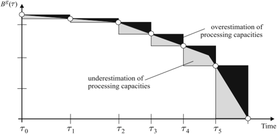

<!-- formula-not-decoded -->

, . . . , n

<!-- formula-not-decoded -->

g

, k

=

k g, h

(

)

(

5b

)

Herein, S g /lscript,h is the partial sum of all loads arriving at depot g later than time τ /lscript for the first tours 1 2 , , . . . , h . Inequalities ( 5a ) guarantee that the sequence of partial sums is non-decreasing. The interdependency between the arrival time and collected load of tour k and the corresponding partial sum is modeled by ( 5b ): If tour k arrives late, i.e., T k,time d k ( ) &gt; τ /lscript , then the h th partial sum S g /lscript,h must exceed S g /lscript,h -1 by the collected load T k,load d k ( ) . For early arrivals, i.e., T k,time d k ( ) ≤ τ /lscript , the constraints ( 5b ) allow S g /lscript,h -1 = S g /lscript,h . The processingcapacity restrictions are stated by ( 5c ).

The giant-tour representation of a solution is depicted in Figure 2. Here, giant tours are defined as Hamiltonian cycles in the routing graph ( V A , ) , the nodes of which are customer nodes C as well as start nodes and end nodes of tours, O and D . Following the ideas presented in [11], tour-start and tourend nodes ( o, d ) in a feasible route p = ( o, . . . , d ) must fulfill a compatibility relation . The compatibility relation ∼ on O ×D introduces vehicle and depot characteristics into the problem. In multi-depot problems, the sets O and D are partitioned according to the | G | depots, e.g., O = O 1 ∪ . . . ∪ O | G | , D = D 1 ∪ . . . ∪ D | G | . Pairs ( o, d ) ∈ O e × D f are compatible o ∼ d if and only if e = f .

In addition to the arcs of model (1)-(2) (or (1)+(4)), the routing graph also contains reset arcs ( d, o ) ∈ D × O . These reset arcs connect end nodes of one tour with start nodes of another tour. If ( p , p 1 2 , . . . , p | K | ) are the tours forming a feasible solution to the MDVRPTW, the cyclic concatenation of the tours is a giant tour in the routing graph. The corresponding giant route is a path (with identical start and end node). It is denoted by P = P p , p , . . . , p ( 1 2 | K | ) and is defined as the concatenation of p , p 1 2 , . . . , p | K | and o 1 , i.e., of the | K | tours plus the arc connecting the last node d | K | of

## 428 Hempsch and Irnich

Fig. 2. Giant-tour representation.

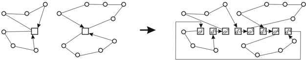

the last tour p | K | = ( o | K | , . . . , d | K | ) with the first node o 1 of the first tour p 1 = ( o , . . . , d 1 1 ) .

The processing constraints (5) can be equivalently reformulated as resource-feasible path constraints for the giant route P (therefore, the tour index k for resource variables T k is redundant). We define additional resources r g, /lscript ( ) for all pairs ( g, /lscript ) ∈ G × L . The associated resource variables have the following resource windows at the nodes and REFs on the arcs of the routing graph:

<!-- formula-not-decoded -->

With the definitions t cost do = 0 and t load do = t time do = -M for reset arcs ( d, o ) ∈ D × O , all MDVRPTW resources have well-defined REFs, given by (3) and ( 6b ). (Note that the name reset arc refers to the fact that f do ( T ) load = 0 and f do ( T ) time = e o holds, i.e., these inner-tour resources are reset to their lower bounds at the tour-start node o .)

## 2.4 Generic Giant-Tour Model

The generic model for VRPs with inter-tour constraints is the following: Given (a) the routing graph with request/customer nodes, tour-start nodes O and tour-end nodes D , (b) a compatibility relation ∼ between O and D , and (c) resources, constrained by resource intervals at all nodes, with REFs defined on all (original and reset) arcs of the routing graph, a giant tour ( p , p 1 2 , . . . , p | K | ) is feasible if its corresponding giant route P = P p , p ( 1 2 , . . . , p | K | ) is a resource-feasible path. Recall that a giant tour has already been defined as a Hamiltonian cycle in the routing graph, the tour-start and tour-end of which respect the compatibility relation ∼ . The generic VRP with inter-tour constraints is the problem of finding a least-cost feasible giant tour . The novelty of this definition is that the entire giant route is considered as one resource-constrained path (RCP) and that inner-tour as well as

inter-tour constraints are all captured in the definition of an RCP by resource intervals and REFs.

The above definition of a VRP with inter-tour constraints has several advantages when heuristic solution methods for solving VRPs are being considered. First, the definition is clear and concise. Second, the concept of RCPs is a very powerful modeling tool, well-known in the context of exact solution approaches in vehicle routing and crew scheduling [7]. RCPs allow the modeling of many relevant types of constraints for so-called rich VRPs including applications with collection and delivery, precedences, side dependencies, multiple use of vehicles, limited waiting time and limited working hours in connection with time windows, time- or load-dependent travel times and costs, complex cost functions and many more aspects [11]; additional aspects of modeling with RCPs are covered by [7, 2, 12, 10]. Third, the definition of the giant tour as a Hamiltonian cycle leads to easier descriptions of local search neighborhoods. For instance, the relocation of a node inside its own tour or into another tour has the same description in the giant-tour representation. The most important advantage is, however, that there are very efficient neighborhood search methods available, at least when REFs fulfill some basic requirements. This is the subject of Section 3.

We now reformulate the MDVRPTW with processing capacities and briefly sketch other inter-tour constraints that can easily be modeled within the same generic framework.

## Generic Model for MDVRPTW with Processing Capacities

With definitions (4) and (6) of resource windows and REFs, the MDVRPTW with processing capacities is the problem of finding a least-cost feasible giant route P , where P is resource-feasible w.r.t. resources load, time, and r g, /lscript ( ) for all ( g, /lscript ) ∈ G × L . If existent, side-dependencies have to be modeled by additional resource constraints [11]. The consideration of vehicle-dependent capacities Q k is trivial by defining corresponding resource intervals ( 4a ) at nodes d k ( ) ∈ D . However, vehicle dependent costs and travel times canin principle-be formulated with REFs and additional resources [11], but these extensions are not fully compatible with the efficient search methods of Section 3.

## Examples of Inter-Tour Resource Constraints

Time-varying processing capacities are a rather complex example of inter-tour resources. Some other simple but practically relevant examples of inter-tour resource constraints are given in the following.

In many real-life, multi-depot problems, the total capacity of the depots is limited. The maximum depot capacity can easily be modeled with the processing constraints introduced in Section 2.3: For vehicle k belonging to depot g = g k ( ) , capacities are only checked at the beginning e d k ( ) of the

processing time window and B g ( e d k ( ) ) must be set to the overall quantity that can be processed at depot g .

Also, the number of vehicles being serviced at the same time might be restricted due to a limited number of ramps at the depot. This is, again, a processing capacity, where each tour collects one unit and B g ( τ ) has to be set to the number of available ramps at depot g from time τ until the closing of the depot at time l d k ( ) .

The report [11] comments on restricting the number of tours with certain characteristics. Examples are a limited number of tours arriving after a certain point in time, traveling more than a given distance or time, collecting more than a certain amount of goods etc. These examples have in common that one resource r 1 is, at tour-end nodes, compared against an upper limit u 1 (nonbinding for the individual tours). The number of times this limit is exceeded is recorded by another resource r 2 , which is bounded by a upper bound u 2 . As long as the resource r 1 is updated by a classical REF of the form (3), one can also limit the number of tours that do not exceed u 1 . Hence, it is also possible to restrict the number of tours that arrive early, travel short distances, or collect only a small quantity.

Another interesting task that can be handled by an inter-tour resource is the allocation of a limited vehicle fleet to several depots. Let a fleet of u vehicles be given. In the giant-tour representation, each depot is initially provided with the whole fleet of vehicles, i.e., u = |O 1 | = . . . = |O | G | | = |D 1 | = . . . = |D | G | | . Then, an inter-tour resource globally asserts that the total number of nonempty tours does not exceed u . It is straightforward to extend the model to fleets with multiple vehicle types by using as many inter-tour resources as vehicle types are present.

## 3 Solution Methods

We have already seen that inter-tour constraints arise naturally in many VRP applications. In particular, the consideration of integrated problems (over multiple depots and extended planning horizons) leads to the concourse of large-scale problem instances with inter-tour constraints. It is, therefore, imperative that heuristic methods should be designed to work both efficiently and effectively.

The solution methodology presented next is based on the unified framework [11]; the two earlier papers [13, 10] give a detailed description of the methods and discuss implementation issues.

## 3.1 Efficient Local Search

Nearly all metaheuristics for VRPs rely on the concept of neighbor solutions, defined by neighborhoods, such as k -Opt and k -Opt* neighborhoods, node

relocation and Or-Opt neighborhoods, node and string swap/exchange neighborhoods, and others (see surveys [3, 4, 8]). For all of these neighborhoods, a move from a current solution to a neighbor solution is characterized by the fact that the given giant tour is first split into (a small number of) paths. In the following, these paths are referred to as segments . The move permutes the segments - some may be inverted - and they are finally concatenated to form a new giant tour.

A LS algorithm explicitly or implicitly inspects all neighbor solutions and determines the one that is feasible and most improving. There are two aspects of efficient LS that we focus on in the following: First, efficient feasibility tests are necessary to guarantee that neighborhoods can be explored quickly. It is important to point out here that VRPs with R resource constraints imply an additional factor of at least R in the feasibility tests. Hence, from a worst case point of view, the best we can expect are O Rn ( k ) time algorithms for searching neighborhoods of size O n ( k ) . Second, we devise efficient search methods that, in the average case , need less than O Rn ( k ) steps for fully exploring an O n ( k ) neighborhood.

The acceleration of the average case needs further explanation: In the context of node-exchange and edge-exchange neighborhoods, any LS algorithm can be considered a tree search method . The tree has depth k for a neighborhood of size O n ( k ) . In order to accelerate the search, the two main criteria for a reduction of the search space (i.e., pruning the search tree) are feasibility and cost with two corresponding approaches [13, 11]: Lexicographic search is driven by feasibility reductions, i.e., one tries to prove at an early stage i &lt; k that no feasible exchange exists that includes the nodes or edges of the stages 1 , . . . , i . The concept, as originally introduced by Savelsbergh [22, 23], is intrinsically tied to the lexicographic ordering in which neighbor solutions are constructed: In the innermost loop of the search algorithm, from one iteration to the next, an inner segment must grow by one node (or a small constant number of nodes), so that so-called global variables can be updated in O R ( ) time. Conversely, sequential search is based on the idea of cost-based reductions, i.e., one tries to prove at an early stage i &lt; k that no improvement can be found which includes the nodes or edges of the stages 1 , . . . , i . It requires, however, that all in-arcs and out-arcs of a node are sorted by increasing cost and moves are decomposable into k cost-independent partial moves [13]. Then, neighbor solutions are generated in such an ordering that partial gains of the partial moves fulfill the gain criterion [16, 13], i.e., one can restrict the search to those cases where all the partial gains are positive. The idea can be applied in the context of best-improvement as well as first-improvement strategies.

## Efficient Feasibility Checks

As presented in [11], the search procedure can be split into a preprocessing phase , in which information for feasibility checks is gathered, and an actual search for the enumeration of the neighbor solutions. In the preprocessing

phase, generalized REFs are computed for a set of segments. In essence, these segment REFs and their inverses enable O R ( ) time feasibility tests. Since any neighbor solution, represented as a giant tour, results from the concatenation of segments of the current solution, feasibility can be tested by propagating lower and upper bounds of resource consumptions along the segments. Lower bounds have to be propagated by segment REFs, while upper bounds have to be propagated by inverse segment REFs. Although the number of all different segment REFs of a given giant-tour of length n is quadratic, [11] shows that only O n ( 4 / 3 ) segment REFs must be a priori computed.

The feasibility test with segment REFs is very similar to the on-the-fly computation of global variables, as suggested in lexicographic search procedures. For instance, time window constraints require the computation of a total travel time, earliest departure time, and a latest arrival time as a global variable of a segment. Kindervater and Savelsbergh [15] clarify these procedures for 2-opt and Or-opt moves in connection with time windows and precedence constraints as well as for problems with simultaneous deliveries and pickups.

For both methods, lexicographic as well as sequential search, there must hold several assumptions on properties of REFs in order to guarantee O R ( ) time feasibility tests. All REFs must be computable in O R ( ) time and must be non-decreasing, i.e., S ≤ T implies f ij ( S ) ≤ f ij ( T ) . It must be possible to generalize REFs to segments, such that concatenations of segment REFs can be computed and evaluated in O R ( ) time. Finally, REFs f (of arcs and segments) must be invertible in the sense that f ( T ) ≤ T ′ is equivalent to T ≤ f inv ( T ′ ) for the inverse REF f inv . These assumptions are-in detailmotivated and explained in [10].

The assumption about the existence of inverse REFs can be relaxed for some resources r . If a resource r is non-decreasing along the entire giant-tour and globally constrained by node-independent resource windows [ a , b r r ] , there is no need to include the resource r in the definition of an inverse REF. The feasibility of a giant route can be directly checked only by the forward propagation of the resource. The overall resource consumption is given at the final node of the newly constructed giant route. (A similar argument was used in [10, p. 24] in order to explain that some complex REFs for cost must not necessarily be invertible.) As a consequence, the inter-tour resources r g, /lscript ( ) defined in Section 2.3, do not require an inversion. Hence, O R ( ) time feasibility checks for VRP with inter-tour resources can be implemented if one can construct and evaluate segment REFs in O R ( ) time. This important property is shown for the time-varying processing capacity constraints in Section 3.1.

## Sequential Search

The easiest way to describe the idea of sequential search is by considering the 2-opt ∗ (=crossover) neighborhood, originally suggested in [20]. A 2-opt ∗ move is depicted in Figure 3 and its interpretation is that two different routes in

Fig. 3. Principle sequential search in the 2-opt ∗ neighborhood. Partial moves have gains g 1 = c t 1 ,t 2 -c t 3 ,t 2 and g 2 = c t 3 ,t 4 -c t 1 ,t 4 , and g 1 &gt; 0 or g 2 &gt; 0 must hold for improving moves.

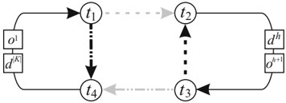

the given giant tour exchange their end-segments. Along the alternating cycle ( t 1 , t 2 , t 3 , t 4 , t 1 ) (of deleted and added arcs), the 2-opt ∗ move decomposes into two cost-independent symmetric partial moves, where the first is the deletion of the arc ( t 1 , t 2 ) and insertion of ( t 3 , t 2 ) , and the second the deletion of the arc ( t 3 , t 4 ) and the insertion of ( t 1 , t 4 ) . For the 2-opt ∗ move to be improving, at least one of the two partial moves has to be improving, i.e., the inserted arc has to be less costly than the removed one [13]. A sequential search algorithm utilizes this property for finding improving moves in the following way: An outer loop determines the node t 1 and the arc ( t 1 , t 2 ) to be deleted. The procedure then loops over all in-arcs ( t 3 , t 2 ) of t 2 as long as c t 3 ,t 2 &lt; c t 1 ,t 2 holds. All these combinations of t 1 , t 2 and t 3 imply that the first partial move is improving. Since t 4 is uniquely determined by t 3 , one can also check the overall gain and the feasibility of the 2-opt ∗ move. The case with nodes t 3 , t 4 , and t 1 is symmetric and, therefore, already covered by the above loops. Note that for restricting the inner loop to cases with c t 3 ,t 2 &lt; c t 1 ,t 2 , in-arcs must have been previously sorted by increasing cost and stored in neighbor lists. Figure 3 visualizes how a 2-opt ∗ move permutes segments.

Sequential search is directly applicable if the cost of a giant tour is the sum of its arcs' costs. Decompositions of moves into partial moves for many other types of edge-exchange and node-exchange neighborhoods are presented in [13]. Note that the gain criterion can also be generalized to situations where best non-improving moves have to be found.

## Resource Extension Functions for Segments

Recall that a segment σ is a sequence of nodes that occurs as a sub-path in the giant tour currently under consideration. In order to form a neighbor solution, the segment ( o , . . . , t 1 1 ) is concatenated with the segments ( t 4 , . . . , d | K | ) , ( o h +1 , . . . , t 3 ) , and ( t 2 , . . . , d h ) . If segment REFs are given and can be evaluated in O R ( ) time, the feasibility of the resulting new giant route can also be checked in O R ( ) time (the number of segments is constant). Thus, we describe next how REFs can be generalized to segments.

For any segment σ , the forward propagation of resources (for given resource consumptions T ) can be computed by a segment REF f σ of the form

<!-- formula-not-decoded -->

where a σ , t σ ∈ R R are resource vectors and h σ ( T ) is a function h σ : R R → R R that takes values = 0 only for some of the resources r g, /lscript ( ) and is 0 on all

/negationslash

other resources. h σ ( T ) models the amount of load that must be added to the resources r g, /lscript ( ) depending on the arrival time and load arriving at the first depot of segment σ . If σ contains no reset arc (i.e. no arc ( d, o ) ∈ D × O ), then h σ ( T ) = 0 for all T , so that (7) is identical to the definition of a classical REF (3). Otherwise, let ( d k , o k ( ) ( ′ )) be the first reset arc in the segment, so that σ can be written as ( . . . , d ( k , o ) ( k ′ ) , . . . ) . Now, we can precisely describe all the coefficients necessary to define h σ . If a reset arc exists, let g σ = g k ( ) be the depot corresponding to the tail node d k ( ) of the first reset arc ( d k , o k ( ) ( ′ )) , and let ϕ = ( . . . , d ( k )) be the prefix segment of σ up to the first tour-end node d k ( ) . Note that h σ does not depend on other reset arcs that may be present in σ . If σ contains no reset arc, we define g σ = ⊥ (=undefined) and ϕ to be the entire segment σ . Moreover, let a time ϕ , t time ϕ and t load ϕ ∈ R be the coefficients that describe the resource consumption for the resources time and load on the prefix segment ϕ , i.e., f ϕ ( T ) time = max { a time ϕ , T time + t time ϕ } is the earliest arrival time at the last node of ϕ and f ϕ ( T ) load = T load + t load ϕ the collected load. Then,

<!-- formula-not-decoded -->

Summing up, the segment REF on segment σ is defined by ( a σ , t σ , g σ , a time ϕ , t time ϕ , t load ϕ ) ∈ R R × R R × ( G ∪ {⊥} ) × R 3 . Note that also the arc REFs ( 6b ) are of the form (7) with appropriately defined functions h σ ( T ) having ( a time ϕ , t time ϕ , t load ϕ ) = 0 .

What remains to be shown is how one can compute the coefficients of the segment REF of the concatenation of two segments σ 1 and σ 2 in O R ( ) time. We assume that the last node of σ 1 is identical with the first node of σ 2 , and that both segments are described by ( a σ 1 , t σ 1 , g σ 1 , a time ϕ 1 , t time ϕ 1 , t load ϕ 1 ) , ( a σ 2 , t σ 2 , g σ 2 , a time ϕ 2 , t time ϕ 2 , t load ϕ 2 ) ∈ R R × R R × ( G ∪{⊥} × ) R 3 . The concatenation σ 1 ⊕ σ 2 has a prefix segment denoted by ϕ (either identical to ϕ 1 or ϕ 1 ⊕ ϕ 2 depending on g σ 1 ) and fulfills

/negationslash

<!-- formula-not-decoded -->

<!-- formula-not-decoded -->

/negationslash

<!-- formula-not-decoded -->

An Example

The following example illustrates segment REFs and formula (8). We consider a 2-depot problem with depots G = { g, g ′ } , where the processing time window is [806; 925] (in the following, all times are given in minutes). Processing rates

Fig. 4. Two segments σ 1 and σ 2 .

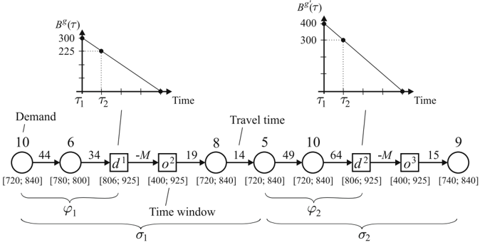

are assumed to be constant with 150 units per hour for depot g and 200 units per hour for depot g ′ . For the sake of simplicity, the processing capacity functions are discretized at times τ 1 = 805 and τ 2 = 835 only, i.e., /lscript ∈ L = { 1 2 , } . The resulting capacities are B g ( τ 1 ) = 300 , B g ( τ 2 ) = 225 , B g ′ ( τ 1 ) = 400 and B g ′ ( τ 2 ) = 300 . Two segments σ 1 and σ 2 and the associated values for t time ij , [ a time i , b time i ] , t load ij (=demand at node j ) are given in Figure 4. Both segments contain a reset arc, i.e., ( d , o 1 2 ) for σ 1 , and ( d , o 2 3 ) for the segment σ 2 . Moreover, tour-end node d 1 belongs to depot g and tour-end node d 2 to depot g ′ .

From the processing capacity diagrams for both depots, as depicted in Figure 4, it becomes clear that we do not need to check processing capacities at the cut-off time τ = 925 , since tours must return to the depots no later than this time. Concluding, the resources to be considered in this example are { time, load, r ( g, 1) , r ( g, 2) , r ( g , ′ 1) , r ( g , ′ 2) } (the computation of costs is trivial and, therefore, left out).

The segment REF f σ 1 of the first segment σ 1 is given by

<!-- formula-not-decoded -->

where h σ 1 ( T ) r g, ( 1) = T load +6 , and h σ 1 ( T ) r g, ( 2) = 0 if max 814 { , T time +78 } ≤ τ 2 = 835 and h σ 1 ( T ) r g, ( 2) = T load +6 , otherwise. The interpretation is simple: The earliest arrival time at d 1 is 814 &gt; τ 1 = 805 , and, hence, the resource r g, ( 1) is always increased by T load +6 , which is the load in the tour arriving at d 1 . In general, the arrival time at d 1 is given by max 814 { , T time + 78 } ,

which explains h σ 1 ( T ) r g, ( 2) . Along the entire segment σ 1 , the coefficients of f σ 1 reflect that the earliest arrival time at the last node of σ 1 is 734 with 13 units of load collected.

The segment REF f σ 2 is

<!-- formula-not-decoded -->

where h σ 2 ( T ) r g , ( ′ 1) = T load + 10 , and h σ 2 ( T ) r g , ( ′ 2) = 0 or h σ 2 ( T ) r g , ( ′ 2) = T load + 10 depending on whether max 833 { , T time + 113 } ≤ τ 2 = 835 holds or not. Whenever one arrives at the first node of σ 2 three or more minutes later than the earliest service time (720), the arrival at d 2 is later than τ 2 and resource r g , ( ′ 2) is increased by T load +10 .

Using formula (8), the segment REF for the concatenation σ = σ 1 ⊕ σ 2 is given by

<!-- formula-not-decoded -->

where h σ ( T ) = h σ 1 ( T ) . The interpretation of this result is the following: When traversing the entire segment σ 1 ⊕ σ 2 , the resulting arrival time and load at the last node is independent from the initial resource consumption T . The tour starting at node o 3 arrives at the last node of σ at time 740 with 9 units of load on board. The concatenation of σ 1 and σ 2 fully determines what happens at depot d 2 . 23 units of load arrive after time τ 2 and, hence, T r g , ( ′ 1) and T r g , ( ′ 2) are always increased by 23 (which is also the minimum resource consumption). In contrast, processing capacity resources for depot g depend on the collected load and start time at the beginning of the segment σ : Six units of load arrive at d 1 later than τ 1 and, depending on the start time at the first node, possibly also later than τ 2 . This is controlled by h σ ( T ) r g,/lscript ( ) , in which the arrival time at the first depot is computed by max 814 { , T time +78 } and the collected load by T load +6 .

## 3.2 Large Neighborhood Search

Metaheuristics are substantial for producing high-quality solutions because they allow an escape from local minima. This section briefly describes the metaheuristic implemented here, which is obviously only one out of many possible choices for using the efficient LS procedures as a component of a metaheuristic.

To find a first local minimum, various neighborhoods are combined in a variable-neighborhood-descent (VND) component [18, 9]. In order to escape from this joint local optimum, a kick step is performed. The kick consists of a randomized removal of a subset of nodes that are consecutively reinserted into the giant route. The solution is then re-optimized with the VND component, the resulting solution is compared against the previous local optimum, and accepted with the Metropolis acceptance criterion of simulated annealing [1]. Hence, the chosen approach has similarities with the large-step Markov chain approach [17] and the large neighborhood search (LNS) approach originally proposed by [24]. The difference to the large-step Markov chains is, however, that local optimal solutions of the VND component are used instead of local minima of a single neighborhood. The difference to standard LNS procedures is the use of the Metropolis acceptance criterion. LNS with the Metropolis acceptance criterion was used also in [21], but LNS solutions were not reoptimized by LS at all.

There are plenty of choices for defining node removal and node insertion operators. Over the tested operators (pure random, based on node attributes such as time window length, demand, detour length etc.), the operator that performs best randomly selects 20 'close' customers according to a randomized distance-based selection procedure. Insertion of removed customers is done by building dummy routes containing these customers and by applying the above VND component directly to the resulting giant tour, see [11]. The approach in [21] instead chooses from among different removal and insertion operators according to scores that are updated by a learning mechanism based on the search history. This may be a beneficial extension to the current implementation.

## 4 Experimentation

The computations presented in this section aim at two different aspects: First, we show that the solution methodology introduced in [11], i.e., giant-tour representation and O R ( ) feasibility checks by considering the giant-route as a resource-constrained path, lead to highly efficient local search-based metaheuristics. Second, we exemplify the usefulness of inter-tour constraints by presenting new types of studies that can easily be performed with the methods at hand.

## 4.1 Efficient Local Search

In order to analyze the efficiency of the proposed LS techniques, we generated a set of 80 MDVRPTW test instances with 100, 200, 400 and 800 nodes (each class with 20 instances). Each instance has between two and five depots. Customers are spread around the depots (according to a normal distribution) such that the service areas of the depots partially overlap. The width of the

Table 1. Characteristics of the LNS metaheuristic based on sequential search.

|   Size # Nodes | Avg. Time 250 VND+kick   |   Avg. Number of Search Steps Performed | Avg. Time per Search   |
|----------------|--------------------------|-----------------------------------------|------------------------|
|            100 | 35.5 s                   |                                   12738 | 2.8 ms                 |
|            200 | 119.4 s                  |                                   17040 | 7.0 ms                 |
|            400 | 279.6 s                  |                                   19227 | 14.4 ms                |
|            800 | 716.8 s                  |                                   22641 | 31.4 ms                |

customer time windows is varied in each group of instances. This creates five groups of MDVRPTW instances. Moreover, four different processing time windows for the depots are chosen for each MDVRPTW instance. The four different processing time windows reflect different situations where processing capacities are more or less binding (from loosely to hardly constrained). Overall, this generates 320 instances of the MDVRPTW with time-varying processing capacities.

Each of the 320 instances is solved with the LNS metaheuristic of Section 3.2. A similar setup as in [11] was used: All algorithms were coded in C++, were compiled in release mode using MS-Visual C++ .NET 2003 version 7.1, and all runs were performed on a standard PC (Intel x86 family 15 model 2 stepping 5, 2.8 GHz, 1GB main memory, on MS-Win 2000). VND first alternates between 2-opt, 2-opt ∗ , node swap and node relocation neighborhoods until a joint local optimum is reached. The search procedures for finding improving string-exchange and Or-opt moves (with and without inversion of the relocated segment) are then applied to these local optima. Each VND step ends in a joint local optimum of all seven neighborhoods. 250 kick moves are performed to diversify the search.

The absolute performance of the sequential search approach is summarized in Table 1: The overall computation time (second column) to perform the 250 kicks and VND steps does not exceed 15 minutes, even for the largest instances with 800 nodes. The third column shows how often sequential search algorithms were invoked in VND and kick steps. This number does not raise proportional to the size of the instances or size of the neighborhoods, but grows sub-linear. For all instances, the ratio of searches that find an improving neighbor to the total number of searches is stable and between 60% and 68%. We have also computed (fourth column) the average time necessary to perform a single sequential search (including both search phases, segment REF computation and actual tree search). These numbers show that the sequential search procedures are notably fast, in particular for large-scale instances.

Finally, we compare the overall computation times of the LNS metaheuristic when either sequential search or lexicographic search procedures are used. Figure 5 depicts the speedup gained by using sequential instead of lexicographic search (the speedup factor is the quotient of the running times). For each size of instances, the five subclasses correspond to increasing widths of

Fig. 5. Acceleration gained when sequential search is used instead of lexicographic search.

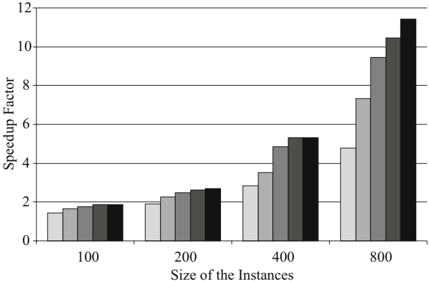

the customer time windows. One can clearly see that sequential search outperforms lexicographic search, since the latter takes (on average) between 1.5 and 11.4 times longer. As already observed in [13, 11], sequential search is more effective for loosely constrained problems and when the size of the instances increases. The impact of increasing customer time windows is that tours get longer and, therefore, instances are less constrained and can be solved significantly faster.

It is worth mentioning that we have also analyzed the four groups of instances with less binding processing time windows. For these, the impact on the speedup is less significant and varies by less than 6% within each of the four groups.

## 4.2 New Types of Studies based on Inter-Tour Resource Constraints

When depots and processing facilities are being planned, the interdependency between transport processes and stationary processes is often disregarded due to the complexity of integrated facility design/layout and transport planning problems. For instance, the dimensioning of the depots as well as the duration of time windows used for processing are unclear. The models and solution techniques presented in this chapter allow such decisions to be studied in an integrated way, at least if it is possible to formulate the stationary processes with inter-tour resource constraints.

## Variation of the Cut-Off Times

Several aspects have an impact on the temporal feasibility of solutions: Travel times and service time windows at customers specify the feasibility of the individual tours. The processing rates (i.e., the slopes of B g ( τ ) ), the length of the processing time windows, and the cut-off times together determine the temporal interdependency between the tours (see also Figure 1). The variation

Fig. 6. Simultaneous variation of cut-off times of all depots.


of each of these parameters has consequences for the cost and structure of the resulting VRP solution.

Here we analyze the impact of the cut-off times l d k ( ) on the cost, the number of tours, and the number of customers that cannot be serviced. We present results for a 4-depot instance with 100 nodes. 30 runs of the LNS metaheuristic are performed, where the cut-off times of all depots are changed from run to run by five minutes. The shape of the processing capacity functions B g ( τ ) is not altered.

The diagram at the bottom of Figure 6 shows the transportation costs, the number of tours in the solution, and the number of customers that are not serviced due to the early cut-off times. The later the cut-off times, the less tours must be operated to collect the customers' supply. At the same time, the costs of the solutions decrease. Note that we do not use any fixed costs per tour (with fixed costs the effect would be even more drastic). In addition to the cost diagram, the top part of Figure 6 shows the two extremal solutions corresponding to the cut-off times 15:55 h and 18:00 h. In the left tour plan, processing capacities are strongly binding. The result is a relatively high number of tours with only a few customers in each tour. In contrast, with the late cut-off at 18:00 h, tours are not all constrained by the processing capacities.

Fig. 7. Variation of processing capacities for two depots g and g ′ .


Optimal Dimensioning of Processing Facilities

Another interesting issue is the determination of the ratio of the processing capacities at different facilities and the impact of processing capacities to transportation (fleet size, cost etc.). For the sake of simplicity, we assume a 2-depot problem, where the dimensioning of the machines for both depots is unclear. In order to find an optimal dimensioning of the machines, one can solve several VRPs with inter-tour constraints, where the processing capacities at the two depots g and g ′ are varied. Figure 7 shows a diagram, in which the resulting transportation cost for each scenario of processing capacities is given. Constant processing rates and fixed processing time windows at g 1 and g 2 are assumed. The processing capacity is then quantified by the pair ( B g ( e k ) , B g ′ ( e k ′ )) (with k ∈ K g , k ( ) ′ ∈ K g ( ′ ) ), cf. Section 2.3). In Figure 7, missing bars correspond to scenarios that are infeasible, since processing capacities are too small to process the entire quantity present at the customers (customers remain unserviced in the VRP solutions). Moreover, each scenario allows an estimation of the transportation costs, which can then be compared with costs in stationary processes (investments for machines, wages for workers etc.). Such a comparison of scenarios means integrated planning of transportation and facility dimensioning.

## 5 Conclusions

This chapter has focused on the heuristic solution of large-scale VRPs with inter-tour constraints. Inter-tour constraints are those constraints for which

the feasibility of a solution depends on properties of several tours and cannot be decided by considering the individual tours separately. Examples are sorting processes at depots that require a staggered arrival of tours, limited number of ramps at depots, and depots with globally limited capacities. Many more examples can be found when transportation and other logistics processes are considered together.

The presented modeling and solution approach can cope with such interdependencies and is based on the unified framework presented in [11]: A solution is represented as a giant tour, i.e., as a single Hamiltonian cycle in the problem-specific routing graph. This representation is advantageous from a modeling point of view, since complex inter-tour constraints can be taken into account by the powerful concept of resource-feasible paths. It has been shown that inter-tour constraints, which are sometimes complicated to formulate in mixed integer programming models, can be easily translated into simple resource-feasible path constraints on the giant route.

The proposed solution method is based on local search (LS), which is one of the most important techniques for improving VRP solutions. It is used as a component in metaheuristics, such as tabu search, GRASP, VND and VNS, or as a postprocessing improvement method in all types of metaheuristics. By considering a giant route as a single resource-feasible path, the unified framework performs LS for many types of VRPs with inter-tour constraints and for all classical LS neighborhoods as efficiently as it does for standard VRPs. The key technique used here is an O R ( ) time feasibility check for neighbor solutions, where R is the number of resources. The efficiency results from the decomposition of LS procedures into two phases, where the first phase computes segment resource extension functions in O Rn ( 4 / 3 ) time. These are used to guarantee O R ( ) time feasibility tests in the second phase, which is the actual search for improving neighbors. Overall, the search takes O Rn ( max 4 3 { / ,k } ) time for node-exchange and edge-exchange neighborhoods of size O n ( k ) . As a result, different tree search methods, such as lexicographic search and sequential search, are applicable and allow an acceleration of the search also in the average case.

In the unified framework, model and solution method both utilize the gianttour representation. This is important, since classical local search techniques (in particular those using inner-tour neighborhoods) have a quite restricted local view of the solution space. In contrast, the LS methods used here can better cope with complicated global interdependencies and work, at the same time, highly efficiently. Concluding, the new approach proposed in this chapter shows that large-scale instances of VRPs with inter-tour constraints can be solved efficiently using LS components. It is possible to perform new types of studies, where complex interdependencies between tours and also the impact of other external parameters on structure and costs of VRP solutions can be analyzed. This is much needed for a more realistic planning of transportation processes in integrated logistics networks.

## References

- 1. E. Aarts and J. Korst. Simulated Annealing and Boltzmann Machines . Wiley, Chichester, 1989.
- 2. P. Avella, M. Boccia, and A. Sforza. Resource constrained shortest path problems in path planning for fleet management. Journal of Mathematical Modelling and Algorithms , 3:1-17, 2004.
- 3. O. Bräysy and M. Gendreau. Vehicle routing with time windows, Part I: Route construction and local search algorithms. Transportation Science , 39:104-118, 2005.
- 4. O. Bräysy and M. Gendreau. Vehicle routing with time windows, Part II: Metaheuristics. Transportation Science , 39:119-139, 2005.
- 5. N. Christofides and S. Eilon. An algorithm for the vehicle-dispatching problem. Operational Research Quarterly , 20:309-318, 1969.
- 6. N. Christofides and S. Eilon. Algorithms for large-scale travelling salesman problems. Operational Research Quarterly , 23:511-518, 1972.
- 7. G. Desaulniers, J. Desrosiers, I. Ioachim, M.M. Solomon, F. Soumis, and D. Villeneuve. A unified framework for deterministic time constrained vehicle routing and crew scheduling problems, Chapter 3 in Fleet Management and Logistics , T. Crainic and G. Laporte, eds., Kluwer Academic Publisher, Boston, 1998.
- 8. B. Funke, T. Grünert, and S. Irnich. Local search for vehicle routing and scheduling problems: Review and conceptual integration. Journal of Heuristics , 11: 267-306, 2005.
- 9. P. Hansen and N. Mladenović. Variable neighborhood search: Principles and applications. European Journal of Operational Research , 130:449-467, 2001.
- 10. S. Irnich. Resource extension functions: Properties, inversion, and generalization to segments. Technical Report 2006-01, Deutsche Post Endowed Chair of Optimization of Distribution Networks, RWTH Aachen University, Aachen, Germany, 2006. Available at www.dpor.rwth-aachen.de , forthcoming in OR Spectrum .
- 11. S. Irnich. A unified modeling and solution framework for vehicle routing and local search-based metaheuristics. Technical Report 2006-02, Deutsche Post Endowed Chair of Optimization of Distribution Networks, RWTH Aachen University, Aachen, Germany, 2006. Available at www.dpor.rwth-aachen.de , accepted with minor modifications for publication in INFORMS Journal on Computing .
- 12. S. Irnich and G. Desaulniers. Shortest path problems with resource constraints, Chapter 2 in Column Generation , G. Desaulniers, J. Desrosiers, and M.M. Solomon, eds., Springer, 2005.
- 13. S. Irnich, B. Funke, and T. Grünert. Sequential search and its application to vehicle-routing problems. Computers &amp; Operations Research , 33:2405-2429, 2006.
- 14. B.W. Kernighan and S. Lin. An efficient heuristic procedure for partitioning graphs. Bell Syst. Tech. J. , 49:291-307, 1970.
- 15. G.A.P. Kindervater and M.W.P. Savelsbergh. Vehicle routing: Handling edge exchanges, Chapter 10 in Local Search in Combinatorial Optimization , E. Aarts and J. Lenstra, eds., Wiley, Chichester, 1997.
- 16. S. Lin and B.W. Kernighan. An effective heuristic algorithm for the travelingsalesman problem. Operations Research , 21:498-516, 1973.

- 17. O. Martin, S.W. Otto, and E.W. Felten. Large-step Markov chains for the TSP incorporating local search heuristics. Operations Research Letters , 11:219-224, 1992.
- 18. N. Mladenović and P. Hansen. Variable neighborhood search. Computers &amp; Operations Research , 24:1097-1100, 1997.
- 19. D. Pisinger and S. Røpke. A general heuristic for vehicle routing problems. Computers &amp; Operations Research , 34:2403-2435, 2007.
- 20. J.-Y. Potvin, G. Lapalme, and J.-M. Rousseau. A generalized k -opt exchange procedure for the MTSP. Information Systems and Operations Research , 27:474-481, 1989.
- 21. S. Røpke and D. Pisinger. An adaptive large neighborhood search heuristic for the pickup and delivery problem with time windows. Transportation Science , 40:455-472, 2006.
- 22. M.W.P. Savelsbergh. Local search for routing problems with time windows. in Algorithms and Software for Optimization, Part I , C.L. Monma, ed., Baltzer, Basel, Volume 4:285-305, 1986.
- 23. M.W.P. Savelsbergh. An efficient implementation of local search algorithms for constrained routing problems. European Journal of Operational Research , 47:75-85, 1990.
- 24. P. Shaw. Using constraint programming and local search methods to solve vehicle routing problems. Lecture Notes in Computer Science , Volume 1520: 417-431, 1998.

## From Single-Objective to Multi-Objective Vehicle Routing Problems: Motivations, Case Studies, and Methods

Nicolas Jozefowiez , Fr´d´ric Semet , and El-Ghazali Talbi 1 e e 1 2

- 1 Laboratoire d'Automatique, de M´ ecanique et d'Informatique industrielles et Humaines

Universit´ de Valenciennes et du Hainaut-Cambr´sis e e

Le Mont-Houy, 59313 Valenciennes Cedex 9, France nicolas.jozefowiez@univ-valenciennes.fr,

frederic.semet@univ-valenciennes.fr

2 Laboratoire d'Informatique Fondamentale de Lille Universit´ des Sciences et Technologies de Lille e 59655 Villeneuve d'Ascq Cedex, France talbi@lifl.fr

Summary. Multi-objective optimization knows a fast growing interest for both academic researches and real-life problems. An important domain is the one of vehicle routing problems. In this chapter, we present the possible motivations for applying multi-objective optimization on vehicle routing problems and the potential uses and benefits of doing so. To illustrate this fact, we also describe two problems, namely the vehicle routing problem with route balancing and the bi-objective covering tour problem. We also propose a two-phased approach based on the combination of a multi-objective evolutionary algorithm and single-objective techniques that respectively provide diversification and intensification for the search in the objective space. Examples of implementation of this method are provided on the two problems.

Key words: Vehicle routing problems; multi-objective optimization; cooperation; metaheuristics; parallelization.

## 1 Introduction

The goal of this chapter is to present an overview of what multi-objective optimization can bring to vehicle routing problems. This is illustrated by two problems representing the two main aspects of multi-objective vehicle routing problems and a general optimization strategy.

Vehicle routing problems, while widely used to deal with real-life cases, are usually optimized on a single objective, which generally aims at optimizing a

B. Golden et al. (eds.), The Vehicle Routing Problem , doi: 10.1007/978-0-387-77778-8 20, c © Springer Science+Business Media, LLC 2008

cost (distance, financial). However, many real industrial problems cannot be limited to the aspect of cost and deal with multiple objectives. For instance, even if only cost is considered, it is possible to define several costs for a same problem: financial and time. It is also possible to consider objectives that are not limited to cost objectives, but also objectives that deals with aspects like fairness or lateness. Therefore, there is a real interest in studying multiobjective vehicle routing problems.

The study of these problems falls into the field of multi-objective optimization, which proposes methods to solve problems containing several (and usually conflictive) objectives. This domain finds its roots in the works of Edgeworth [17] and Pareto [44] in the context of economic research in the 19 th century. The field knows a growing interest since the mid 80s [52] and a fast expansion since the mid 90s with, notably, the apparition of methods like multi-objective evolutionary algorithms [7,14].

Formally a multi-objective problem can be stated as follows.

<!-- formula-not-decoded -->

with n ≥ 2 being the number of objective functions; x = ( x , x 1 2 , . . . , x r ), the decision variable vector; D , the feasible solution space; and F x ( ), the objective vector. The set O = F D ( ) corresponds to the feasible solutions in the objective space, and y = ( y , y 1 2 , . . . , y n ), where y i = f i ( x ), is a solution. A MOP solution is the set of the non-dominated solutions called the Pareto set (PS). Dominance is defined as follows:

Definition 1.1 A solution y = ( y , y 1 2 , . . . , y n ) dominates (denoted ≺ ) a solution z = ( z , z 1 2 , . . . , z n ) if and only if ∀ i ∈ { 1 . . . n } , y i ≤ z i and ∃ i ∈ { 1 . . . n } , such that y i &lt; z i .

Definition 1.2 A solution y found by an algorithm A is said to be potentially Pareto optimal (PPS), relative to A , if A does not find a solution z , such that z dominates y .

When solving a multi-objective problem, the proposed method should be able to converge toward the optimal Pareto set while at the same time providing a set of diversified solutions in the objective space. They are the goals of intensification and diversification. These two goals are illustrated in Figure 1. Figure 2 shows an approximation answering both goals, while the approximation in Figure 3 is good in terms of intensification but bad in terms of diversification; the approximation in 4 illustrates the opposite case.

The chapter is organized as follows. Section 2 deals with multi-objective problems in general and presents the main motivations for using multiple objectives as well as several uses made in the literature. Section 3 presents the two bi-objective vehicle routing problems used as illustrative examples. Section 4 explains a two-phase strategy that can be used and shows how the

Fig. 1. The two goals of a multiobjective method.


f2


Fig. 2. An ideal solution.


Fig. 3. A good solution in terms of intensification.


Fig. 4. A good solution in terms of diversification.

strategy was implemented for the two problems presented in the previous section. Conclusions are drawn in Section 5.

## 2 Multi-objective Vehicle Routing Problems

In this section, we present the possible motivations to use multiple objectives in a vehicle routing problem. Then, the main uses are presented: extension of a classic academic problem, generalization of a classic academic problem, reallife problems. Finally, we also discuss some of the objectives that appear in the

literature and have been introduced in the multi-objective studies. A complete survey of the literature can be found in [34].

## 2.1 Motivation

Academic vehicle routing problems need adaptations for real-life applications. These adaptations are mostly additions of new constraints and/or parameters to a basic problem. For instance, the capacitated vehicle routing problem deals with the construction of a minimal length collection of tours for a fleet of vehicles to serve a set of customers wanting a given amount of goods delivered such that the total weight of products transported by a vehicle does not exceed a given capacity. Several variants of these problems have been defined to consider numerous aspects that can appear in real-life cases [55]. A specific example is the vehicle routing problem with time windows in which a customer must be delivered during a given lapse of time.

Another way to improve the practical aspects of vehicle routing problems is to use several objectives. The objectives that are used may be related to different aspects of vehicle routing problems: tour (cost, profit, makespan, balance ...), nodes/arcs (time windows, customer satisfaction ...), and resources (management of the fleet, specificities of the product to deliver ...).

The introduction of multi-objective routing problems is motivated by three reasons: to extend classic academic problems in order to improve their practical application while never losing sight of the initial objective, to generalize classic problems, and to study real-life cases in which the objectives have been clearly identified by the decision-maker.

## 2.2 Extension of Classic Academic Problems

Multi-objective optimization can be used as a possibility to study other objectives in addition to the one defined initially, which is often related to a solution cost. In this context, the problem definition remains unchanged, and new objectives are added. The purpose of such extensions is often to enhance the practical applications of the model by recognizing that logistic problems are not simply cost driven. This can be done in order to consider the driver's workload and to try to balance it to bring fairness between the drivers [36,49]. Customer satisfaction can also be an issue and modeled by an objective [51]. Other illustrative extensions can be found in the issues in commercial distribution pointed by Ribeiro and Louren¸ co [49], in the study of the multi-objective traveling salesman problem [18, 38, 56] or other TSP variations like the biobjective median tour problem and the maximal covering tour problem [11].

## 2.3 Generalization of Classic Academic Problems

Another motivation to use multi-objective optimization is to generalize a problem by adding objectives instead of one or several constraints and/or parameters. In the literature, this strategy has notably been applied to the vehicle

routing problem with time window constraints where the time windows are replaced by one or several objectives.

Boffey [3] provides a list of routing problems that he classified as problems which are implicitly multi-objective. In those problems, a constraint and/or parameter or a set of constraints and/or parameters is used instead of what can be naturally modeled as an objective. Feillet et al. [20] have described a class of problems, called traveling salesman problems with profits (TSPP), which belong to this category. In these problems, a profit, associated with each customer, can be collected when the customer is visited, but it is not compulsory to visit all customers. Two conflicting objectives can be clearly identified:

- 1. Maximize the profit by visiting the maximum number of customers, thus increasing the length of the solution.
- 2. Minimize the length of the solution by visiting fewer customers, thus decreasing the profit generated by the solution.

Usually, this problem is solved by defining a single-objective problem that combines the two objectives; or constraints one objective and optimizes the other one. But it is also possible to solve it as a bi-objective problem and to generate a set of non-dominated solutions without advantaging one objective or the other [28]. That way only one problem needs to be optimized.

Other examples of generalization includes the bi-objective covering tour problem (presented below) [30,33] and the traveling purchaser problem [50].

## 2.4 Real-Life Applications

Multi-objective routing problems are also specifically studied for real-life situations, in which decision-makers define several clear objectives they want to be optimized. Examples include the case of a Belgian transport company [19], schoolbus routing [4,8,43], urban waste collection [35], healthcare facility tour planning in developing countries [16]. Most of these studies keep the minimization of a cost (mainly the length) but add new objectives according to the needs of the situation. The most illustrative objectives are presented below with their applications. In the case of the transport company, the issues were multiple as eight objectives were defined: balancing, idle times, time window constraint violation for instance. Schoolbus routing presents other challenges: there is a need to position bus stops so that users do not have to walk too much to catch the bus. Then, there is a need to balance the number of users between the selected stops and to distribute the load ( i.e. , the number of users) between the buses. Makespan-like objectives are also used to ensure that the users do not stay too much time on the bus and that there are no glaring inequities between the first student picked up on the tour and the last one. Makespan is also used in the case of the urban waste collection but for a different reason. Here, there is a need to sort out the waste after the picking. The two tasks (collecting and sorting) are done by the same workers.

Therefore, the tours need to be finished as soon as possible so that the workers can begin to work on sorting out the waste at the factory. In healthcare facility tour planning, the main problem comes from the fact that it is not possible to visit the whole population ( i.e. , the villages), therefore, in addition to an economic objective, there is a need to facilitate the population access to the facility. This is done by using two additional objectives: maximizing the population in a given radius from the selected stops for the facility and minimizing the total distance that must be walked for the uncovered population to reach a facility stop. Another main real-life application is the case of hazardous product transportation [25,57]. The non-cost objectives deal with the minimization for the population along the road used and the minimization of the overall probability of an accident to happen as the consequences would be drastic.

## 2.5 Objectives

The new objectives introduced in the studies of multi-objective vehicle routing problems in the literature can be classified according to the component of the problem they are related to: the tour, the node/arc activity, or the resources.

Objectives on tours include costs (time, distance ...), although it is not always the case as for instance in [8]. Other aspects considered by these objectives include makespan as in the studies by Corberan et al. [8], Pacheco and Marti [43], and Lacomme et al. [35]. Fairness can also be introduced by means of tour balancing by minimizing the difference between the length of the longest tour and the length of the shortest tour. Problem related objectives like minimizing the risk in the case of hazardous transportation problems [25, 57] or objectives like keeping the tour in a cluster [39, 40] are also proposed in the literature.

In the literature, many of objectives related to nodes/arcs deal with vehicle routing problems with time windows by removing the time windows and adding additional objectives minimizing the lateness or earliness to the bounds of the windows and/or the number of violated constraints [1,19,22,26]. Other objectives are for example linked to assigning priority to arcs or nodes and trying to visit the ones with the greatest priorities [45,46]. It is also possible to define economic or marketing objectives, such as increasing customer satisfaction [51] or improving the customer-driver relationship [49]. A last family of objectives deals with optimizing the access to the visited nodes by a set of unvisited nodes [4,11,30,33]. An example of uses of this kind of objectives is mobile healthcare facility routing [16].

Objectives related to resources are about managing the fleet: minimizing the size [8, 19, 41-43, 53, 54], optimizing the effectiveness of the vehicle utilization [19, 51]. Objectives can also be related to the transported goods: consideration of the passengers [8], or avoiding the deterioration of perishable products [45,46].

## 3 Illustrative Multi-Objective Vehicle Routing Problems

In this section, we present two problems. The vehicle routing problem with route balancing (3.1) (VRPRB) is an extension of the capacitated vehicle routing problem (CVRP), while the bi-objective covering tour problem (3.2) (BOCTP) is a generalization of the covering tour problem (CTP). For each bi-objective problem, we present the single-objective problem from which it is derived and how the single-objective problem is transformed into the biobjective one. We also provide a bi-objective linear integer program for each bi-objective problem.

## 3.1 The Vehicle Routing Problem with Route Balancing

## The Capacitated Vehicle Routing Problem

The capacitated vehicle routing problem (CVRP) has been introduced by Dantzig and Ramser [13]. It can be modeled as a problem on a complete graph where the vertices are associated to a unique depot and to n customers. Each customer must be served a quantity q i of goods ( i = 1 , . . . , n ) from the unique depot. To deliver those goods, vehicles are available. With each vehicle is associated a maximal amount Q of goods it can transport. A solution of the CVRP is a collection of routes where each customer is visited only once and the total demand for each route is at most Q. With each arc ( i, j ) is associated the distance between vertex i and vertex j . The CVRP aims to determine a minimal total length solution. It has been proved NP-hard [37] and solution methods range from exact methods to specific heuristics, and metaheuristics [55].

## Extension of the CVRP to the VRPRB

The goal of this extension is to bring fairness to the problem without neglecting the economical aspect of the problem through the optimization of the length of the solution. To do so, we add a second objective to balance the length between the tours. This second objective is the minimization of the difference between the length of the longest tour and the length of the shortest tour. That way, we do not break the linearity of the problem. This bi-objective problem is called the vehicle routing problem with route balancing.

In Table 1, the seven CVRP benchmarks proposed by Christofides and Eilon [5], and Christofides et al. [6], are considered. Following the naming scheme used in Toth and Vigo [55], the name of each instance has the form Ei -jk . E means that the distance metric is Euclidean. i is the number of vertices including the depot vertex. j is the number of vehicles available. k is a character which identifies the paper where the distance data are provided. k = e refers to Christofides and Eilon [5], k = c to Christofides et al. [6]. For each instance, we report both objective values associated with the best

Table 1. Objective values for the best found solutions of Taburoute and Prins' GA.

|          | Taburoute   | Taburoute   | Prins's GA   | Prins's GA   |
|----------|-------------|-------------|--------------|--------------|
| Instance | Distance    | Balance     | Distance     | Balance      |
| E51-05e  | 524.61      | 20.07       | 524.61       | 20.07        |
| E76-10e  | 835.32      | 78.10       | 835.26       | 91.08        |
| E101-08e | 826.14      | 97.88       | 826.14       | 97.88        |
| E151-12c | 1031.17     | 98.24       | 1031.63      | 100.34       |
| E200-17c | 1311.35     | 106.70      | 1300.23      | 82.31        |
| E121-07c | 1042.11     | 146.67      | 1042.11      | 146.67       |
| E101-10c | 819.56      | 93.43       | 819.56       | 93.43        |

solutions obtained using Taburoute [23] and Prins's GA [48]. These methods, which can be regarded as some of the best algorithms for the CVRP, do not take into account the route balancing objective. This clearly appears in Table 1 where the best solutions are of poor quality regarding the additional objective.

## Mixed-Integer Linear Program for the VRPRB

The following IP for the VRPRB is based on the IP for the CVRP proposed by Fisher and Jaikumar [21]. Let x k ij be a binary variable equal to 1 if the vehicle k visits the customer j after the customer i , 0 otherwise. Let y k i be a binary variable equal to 1 if the vehicle k makes the delivery to the customer i , 0 otherwise. The number of vehicles is fixed to m . Let l min (respectively l max ) correspond to the length of the shortest tour (respectively the longest tour). The VRPRB can be modeled as follows.

<!-- formula-not-decoded -->

under the constraints :

<!-- formula-not-decoded -->

<!-- formula-not-decoded -->

<!-- formula-not-decoded -->

<!-- formula-not-decoded -->

<!-- formula-not-decoded -->

<!-- formula-not-decoded -->

<!-- formula-not-decoded -->

<!-- formula-not-decoded -->

/negationslash

<!-- formula-not-decoded -->

<!-- formula-not-decoded -->

<!-- formula-not-decoded -->

Constraints 3 insure that the capacities of the vehicles are respected. Constraints 4 deal with the fact that m vehicles go through the depot but only one vehicle visits each customer. Constraints 5 and 6 say that a customer visited by a vehicle must be served by this vehicle. Finally, constraints 7 are the subtour elimination constraints proposed by Dantzig et al. [12] for the traveling salesman problem.

## 3.2 The Bi-Objective Covering Tour Problem

## The Covering Tour Problem

The covering tour problem (CTP) can be formally described as follows [24]. Let G = ( V ∪ W,E ) be an undirected graph, where V ∪ W is the vertex set, and E = { ( v , v i j ) | v , v i j ∈ V ∪ W,i &lt; j } is the edge set. Vertex v 1 is a depot, V is the set of vertices that can be visited, T ⊆ V is the set of vertices that must be visited ( v 1 ∈ T ), and W , the set of vertices that must be covered . A distance matrix C = ( c ij ), satisfying triangle inequality, is defined for E . A final parameter is c , the size of the cover. The CTP consists in defining a tour for a subset of V , which contains all the vertices from T , of minimal length such that every node from W is covered by a visited node of V . A node v i ∈ W is said to be covered by a node v j ∈ V if c ij ≤ c . A feasible solution for a small instance is provided in Figure 5. The CTP is NP-hard since it can be reduced to the traveling salesman problem when c = 0 and V = W .

## Generalization of the CTP to the BOCTP

The CTP is one of the problems pointed by Boffey as implicit multi-objective problems [3]. To transform the CTP into its bi-objective counterpart, the parameters and the constraints asking for the nodes in W to be at less than a given distance c from a visited node in V are removed. The other parameters and constraints of the problem are left unchanged. The objective of the BOCTP is therefore the minimization of:

Fig. 5. An example of a solution for the covering tour problem.


- 1. the length of the tour
- 2. the cover

The cover of the solution is defined as the greatest distance between a node from v l ∈ W and the visited node v k ∈ V closest to v l .

## Mixed-Integer Linear Program of the BOCTP

The following bi-objective integer program is based on the integer program for the CTP proposed by Gendreau, Laporte, and Semet [24]. The data for the BOCTP are the same as for the CTP with the exception of the parameter c which no longer exists. The variables and constants of the program are the following ones. For every v k ∈ V , let y k be a binary variable equal to one if v k is visited, 0 otherwise. For every v , v i j ∈ V ( i &lt; j ), let x ij be a binary variable equal to 1 if and only if the edge ( v , v i j ) belongs to the tour. A vector d ∈ /Rfractur | W | is introduced. Every component d l of d corresponds to the smallest distance necessary to cover the node v l ∈ W . The matrix S = ( s lk ) is also defined. The value of the coefficients belongs to [1 , . . . , n ] and the size of the matrix is | W | × | V | . s lk gives the index of the k th closest node in V from the node v l ∈ W . The function σ is then defined:

<!-- formula-not-decoded -->

↦

A high value (HV) constant has been included to some constraints to insure that the right value is obtained. Then, the integer program is as follows:

<!-- formula-not-decoded -->

such that:

<!-- formula-not-decoded -->

<!-- formula-not-decoded -->

<!-- formula-not-decoded -->

∑ x ij ≥ 2 y t ( S ⊂ V, 2 ≤ | S | ≤ n -2 , T \ S = ∅ , v t ∈ S , )

/negationslash

(18)

v i ∈ S,v j ∈ V \ S or v j ∈ S,v i ∈ V \ S

<!-- formula-not-decoded -->

<!-- formula-not-decoded -->

<!-- formula-not-decoded -->

Constraints 15 insure that c max is the maximum of the minimal values between a node in W and its closest node in V in the tour. Constraints 16 give a lower bound for d l . Constraints 17 are degree constraints and constraints 18 are connectivity constraints.

## 4 A Two-Phase Strategy

In this section, we propose methods and a two-phase strategy to consider the two goals in multi-objective optimization: intensification and diversification. We also give implementation of these methods for the VRPRB and the BOCTP.

## 4.1 Diversification/Intensification

The principle of the strategy in two phases proposed here is a cooperation between a method able to perform a diversified search of the objective space and a method able to perform the intensification task. The strategy works as follows: the former method is first used to generate a most diversified approximation of the optimal Pareto set and then the result of this method is improved by means of the latter method to converge as far as possible toward the optimal Pareto set without losing diversification.

In the first phase, we have investigated the use of a multi-objective evolutionary algorithm (MOEA) [7,14]. Examples of implementations of the standard MOEA NSGA II for the VRPRB and the BOCTP [15] are explained in subsection 4.2. We have also explained how parallelism can be used to enhance the results of the MOEA as well as a strategy to help diversification in MOEA, namely the elitist diversification (ED) mechanism. The second phase uses either a method to define relevant goals for neighborhood search in the case of the VRPRB or a strategy relying on the definition of subproblems that can be solved efficiently by a branch-and-cut algorithm.

## 4.2 Phase One: Diversification

## NSGA II

NSGA II can be described as follows. Its population R t , where t is the number of the current generation, is divided into two subpopulations P t and Q t . The sizes of P t and Q t are equal to N and, therefore, the size of R t is 2 N . The subpopulation P t corresponds to the parents and Q t to the offspring. The four main steps of NSGA II are presented below without going into the details of the mechanisms used such as the ranking and the crowding distance. It is sufficient to recall that a solution i has two fitnesses according to the current population: a rank r i which represents its quality in terms of convergence toward the optimal Pareto set, and a crowding distance d i which corresponds to its quality in terms of diversification. A solution of rank i means that it is only dominated by solutions of rank j with j &lt; i . It tends to organize the population into layers. The crowding distance is given by an approximation of the size formed by the cuboid formed by the closest solutions with the same rank than the considered solution. The lower the rank and the crowding distance are, the better the solution is. For additional details about NSGA II, the reader is referred to [15]. At generation t , the different steps are:

STEP 1 Combine the parent and offspring populations to create R t = P t ∪ Q t . Compute the ranks and crowding distances of the solutions in R t . Sort the solution according to their ranks in an increasing order. Identify the fronts F i , i = 1 , . . . , r max , where i represents a rank. F i is the set of solutions of rank i .

STEP 2 Create a new population P t +1 = ∅ . Set i = 1. While | P t +1 | + |F | i &lt; N , do P t +1 = P t +1 ∪F i and i = i +1.

STEP 3 Sort the solutions of F i according to their crowding distance in a decreasing order. The ( N - | P t +1 | ) first solutions of F i ( i.e. the most diversified solutions) are included to P t +1 .

STEP 4 Create Q t +1 from P t +1 .

The solution provided by NSGA II is the set of solutions not dominated in the final population R . However, experiments have shown that the size of the potentially Pareto optimal solution set can be larger than the size of the population. Therefore, we have added an archive to NSGA II whose only purpose is to save the potentially Pareto optimal solutions identified during the search. It prevents such solutions to be lost due to the stochastic behavior of the algorithm and the limited size of the population. This archive can also be used as a stopping criterion: if no new non-dominated solution has been found, i.e. no inclusion has been made in the archive, for a given number of generations, the search stops.

## Algorithm 1 recombination phase( P, Q : POPULATION)

```
Q ←∅ for i ← 1 , . . . , N do pa 1 ← tournament P ( ∪ C ) pa 2 ← tournament P ( ∪ C ) if rand () < . 0 5 then s ← RBX pa ,pa ( 1 2 ) else s ← SPLIT pa ,pa ( 1 2 ) end if if rand () < . 0 4 then s ← or opt s ( ) end if 2 opt local search s ( ) Q ← Q ∪{ } s end for
```

## NSGA II for the VRPRB

To implement NSGA II for a given problem, it is necessary to describe the population initialization strategy as well as the recombination phase. For the VRPRB, the starting population was generated by means of a greedy heuristic. The greedy algorithm works by adding the customers in a random order. A new route is created when the previous one is full. When every node is included, a 2-opt local search is applied on every tour.

The recombination phase is described in Algorithm 1. The tournament operator is the binary tournament as described by Deb et al. . Two solutions are randomly selected and the solution with the best rank is kept. To break the tie, the solution with the greatest crowding distance is selected. The crossover operators are the route based crossover (RBX) [47] and the SPLIT crossover [27,29] inspired by Prins's genetic algorithm [48]. When a solution is created, a 2-opt local search is applied on each route in order to avoid artificially balanced solutions [27,29]. For further details, the reader is referred to [31].

## NSGA II for the BOCTP

The starting population is created by solving several CTP for different values of c . These values are chosen so that the points are equally distributed in the objective space between the lowest cover value, which happens when only the nodes in T are visited, and the highest, which can be computed for instance when every node in V is visited. The different CTPs are solved by means of a heuristic for the problem proposed by Gendreau, Laporte, and Semet [24].

During the recombination phase, two parents are selected and one offspring is generated. The purpose of the crossover is to select the nodes visited by the tour without building the tour. The crossover works by adding nodes that

appear at least in one of the parents. Only the nodes that can improve the cover are considered at each iteration. An acceptation probability is used to determine if a node is to be included. The probability is computed in a similar way to the crossover fusion for the set covering tour problem of Beasley and Chu [2]. More details on the complete implementation of NSGA II for the BOCTP can be found in [30,33].

## Parallelization

To improve the results obtained by NSGA II, we have implemented it in an island model. The model is built as follows: each island corresponds to one instantiation of NSGA II with its own population. The communication network is a ring, and therefore each island has two neighbors. One island sends information to its neighbors regularly in terms of generations. When the generation corresponds to a communication phase, the recombination (STEP 4) is replaced by the migration between the islands. Due to the fact that the communication network is a ring, an island receives information at the same time it sends information. The computations of a given island do not start again until it has received the information from its two neighbors.

The communication phase runs as follows. An island sends to its two neighbors the N 2 best solutions from its population ( i.e. the N 2 first solutions, according to the ranking and crowding distance sorting, of the population after the selection phase (STEP 1 to STEP 3)). Therefore, an island receives N 2 solutions twice. These solutions replace those from Q t since they would have been lost in the case of a standard recombination phase. Figure 6 illustrates the communications in the case of four islands.

## The Elitist Diversification Mechanism

In the elitist diversification, additional archives are considered. They contain the potentially optimal Pareto solutions (PPS) when one objective is maximized instead of being minimized. It may be noted that we suppose that every objective is to be minimized. Let S A ( ) be the subset of solutions of the decision space found by an algorithm A, and k the index of the objective function component which is maximized. To define new archives, the dominance operator ≺ k is introduced :

<!-- formula-not-decoded -->

/negationslash

Then, we have A k = { s ∈ S A ( ) |∀ s ′ ∈ S A , s ( ) ′ ≺ k s } , with k = 1 , . . . , n , the archive of PPS associated with the maximization of the k th objective

Fig. 6. Extension of NSGA II into an island model.


component instead of the minimization. We denote ≺ 0 the classical dominance operator i.e. a solution x is said to dominate a solution y if x is not worse than y on every objective and there is at least one objective where x is strictly better than y .

Like in the elitism strategy, solutions from the new archives are included into the population of the MOEA at each generation. The role of these solutions is to attract the population to unexplored areas, and so to avoid the premature convergence to a specific area of the objective space. Indeed, using solutions from these archives ensures that an exploration is done while preferring one objective.

Preliminary experiments point out that the improvement is less important when all the archives are embedded in the same MOEA. This leads us to distribute the archives among several searches resulting in a co-operative model. This parallelization is not used in order to speed up the search but to search a larger part of the solution space in a given time. Since every island will be executed at the same time, it will take the same computational time as a single island while the number of solutions created will be multiplied by

Fig. 7. The complete co-operative model - the toric structure is not shown in order not to obfuscate the figure.


the number of islands. An island is denoted I i j . It means it belongs to the i th brick and its additional archive is of A j type. The island I i j sends its A 0 archive to all its neighbors: I i j -1 , I i j +1 , I i -1 j , and I i +1 j . It only communicates its A j archive to I i -1 j and I i +1 j . Since the communication topology between and within the bricks is toric, the indexes are computed modulo n . The model is illustrated in Figure 7.

This strategy can be used with any MOEA. Its implementation in the case of NSGA II is explained in [31].

## 4.3 Phase Two: Intensification

During the second phase, we try to improve the intensification aspect of the potentially optimal Pareto sets generated by a MOEA (NSGA II in the case of the studies on the VRPRB and the BOCTP). The fact is that MOEA may not always work well in view of the intensification goal. It may be interesting to use good single-objective methods. Indeed, apart from some problems specific to a given real case study, the multi-objective problems are often linked to single-objective problems studied in the literature and for which efficient methods have been proposed. For instance, in the case of the VRPRB, a lot of neighborhood searches, specially Tabu search, exist and for the BOCTP, an exact algorithm have been proposed. The purpose here is to transform the

multi-objective problem into a single-objective problem and use good methods for the single-objective problems to improve the potentially optimal Pareto set in terms of intensification. First, we propose a way to build relevant goal points according to the approximation at hand. We also explain how this method was used to post-optimized approximations generated by NSGA II for the VRPRB. In the case of the BOCTP, we illustrate how it can be useful to generate subproblems which can be solved exactly by means of a branchand-cut algorithm for the CTP.

## Target Aiming Pareto Search

We are going to present a strategy called Target Aiming Pareto Search (TAPaS) whose general loop works as follows. First, points are selected from a given potentially Pareto set. Then, for each of these points a goal point is built according to the other selected points. A local search heuristic is then run from each selected point trying to reach the associated goal point. The approximation is updated using the solutions visited by the local search heuristics. The process is iterated until no new non-dominated solutions are found.

More precisely in TAPaS, a local search heuristic l i is applied to each solution s i of a potentially Pareto set P . A specific objective function o i is defined for each local search l i . The function o i must take into account the multiplicity of the LS invoked.

Indeed, two LS should not examine the same area of the objective space, and the entire area that dominates P should be explored in order to converge toward the optimal PS. The definition of o i is based on the partition of O ( i.e. , the objective space) according to P (Figure 8):

- · A d = { s ∈ O |∃ s ′ ∈ P, s ′ ≺ s } : the area of the objective space dominated by P .

/negationslash

- · A nd = { s ∈ O |∀ s ′ ∈ P, ( s ′ ≺ s ) ∧ ( s ≺ s ′ ) } : the area of the objective space not dominated by P and not dominating any solution from P .

/negationslash

- · A s = { s ∈ O |∃ ! s ′ ∈ P, s ≺ s ′ } : the area of the objective space dominating only one solution of P .
- · A p = { s ∈ O |∃ s , s 1 2 ∈ P, ( s ≺ s 1 ) ∧ ( s ≺ s 2 ) } : the area of the objective space dominating more than one solution of P .

Each solution s i ∈ P is associated with a part A i s of A s . If l i is able to generate a feasible solution in A i s , then the approximation is improved according to the convergence, without impoverishing the diversification. To guide the search, a goal g i is given to each l i , with g i being the point that dominates all points of A i s . In cases where certain coordinates of g i cannot be defined ( e.g. the extremities of P ), a lower bound for the missing coordinates should be used.

Each local search stops when it reaches a solution that dominates g i or when a stopping criterion specific to the implementation is met. Each local search l i produces an archive a i which contains all the current solutions that

Fig. 8. Partition of O .


are not dominated. P is updated by the Pareto union between P and all the archives a i . If P is improved, the process is iterated, otherwise it is stopped.

This strategy has been applied to the VRPRB. The starting approximations were generated by means of NSGA II. The local search was a Tabu search : Unified Tabu Search [9,10]. More details on TAPaS and this implementation are given in [32].

## Definition of Subproblems

Another possibility is to define single-objective subproblems that can be solved efficiently by single-objective methods. The interest to define smaller size problems comes from the fact that if one wants to improve a potentially optimal Pareto set by means of single-objective methods, one will need to run the methods several times in order to take into account the spread of the Pareto frontier. Therefore, smaller size subproblems, being easier to solve, enable to iterate several times the single-objective methods without having to pay a prohibitive computational time.

In the case of the BOCTP, we have used the approximation generated by NSGA II by defining several subproblems and solving them by means of a branch-and-cut algorithm for the CTP [24]. Two subset construction procedures have been defined. The first one tends to improve the solutions according

Fig. 9. The first procedure tries to improve a solution length without modifying the cover ( i.e. , the solution A ).


Fig. 10. For a given couple A and B , the second procedure builds a subproblem to which the solution is necessarily in the grey area.

to one objective (minimization of the length) without touching the cover. The second procedure tends to identify potentially Pareto optimal solutions whose cover values were not found by NSGA II.

The first procedure works as follows (see Figure 9). Let consider one solution s found by NSGA II visiting the set V ′ ⊆ V . For every node v k visited in the solution, we identify a set R k of nodes that can replace v k . R k is said to be able to replace v k if the removal of v k and the inclusion of the nodes in R k do not change the cover value associated to the solution. The size of R k is bounded by a small number of nodes. Then, the subproblem ( i.e. the CTP) associated to the solution is the following one. The set of visitable nodes is formed by the union of V ′ and the subsets R k formed for every node v k ∈ V ′ . The set of nodes to cover is still W and c is fixed to the cover value of s .

The second subproblem construction procedure works as follows (see Figure 10). Let A and B be two neighboring solutions in the approximation sets found by the evolutionary algorithm ( i.e. there is no other solution between A and B ). A (respectively B ) is a solution with a cover c A (respectively c B ) which visits the vertices of the set V A (respectively V B ). Assuming that c A &lt; c B , the branch-and-cut algorithm can be executed on a set V II , built according to both V A and V B , with as a parameter, the first cover ˜ which is c strictly smaller than c B .

More information on these procedures and their cooperation with NSGA II for the BOCTP can be found in [32].


Cooperative process

Fig. 11. General optimization strategy.

## 4.4 General Optimization Strategy

Our general optimization strategy is illustrated in Figure 11. The deepest layer of this strategy is the use of a MOEA (typically in our studies NSGA II) to generate a first approximation. The MOEA can be improved by the addition of the elitist diversification mechanism and/or the use of parallelization through an island model. This general method forms the component dedicated to the diversification of the optimization strategy. Then, the approximation generated is passed to the diversification box, which is composed of one or several intensification procedures based on single-objective methods. These procedures can be combined to ensure an intelligent search of the objective space by means of techniques designed to guide the searches like TAPaS or the generation of subproblems to solve them by exact methods in a cooperative scheme.

## 4.5 Computational Results

## Computational Results for the VRPRB

Optimal Pareto sets are not known for the VRPRB. Therefore, we have compared the results of our MOEA with the best-known values on the length objective and with the evident lower bound that is 0 for the balance objective. The different methods reported are a parallel version of NSGA II run on 16 processors, a parallel version of NSGA II with the elitist diversification mechanism run on 8 processors and a cooperative method composed of NSGA II (run on one processor) and TAPaS as a post-optimization process. Table 2 allows to compare our method with the only-known element from the literature: the best-known length. It is interesting to note on the instances E76-10e and E101-08e that if the solutions are near each other in terms of length, there is an important gap concerning the balance. For instance, the best found solution found by TabuRoute and Prins's GA for the instance E101-08e has a

balance value of 97.88 for a length of 826.14 whereas the best solution we found has a length of 827.39 for a balance of 67.55. It appears that to gain very little in length (0.15 %), it is necessary to lose a lot in balancing. Therefore, it is possible that there is a great difference between the solutions. As it is also the case for the instances E151-12c and E200-17c, it can explain that the multi-objective metaheuristics have difficulties to reach the best-known solutions in terms of length.

Regarding the balance, all the methods found solutions with values close to 0. They are able to generate very well-balanced solutions. However, there is an important fluctuation concerning the length of the solutions. We also provide the average number of potentially Pareto solutions found by the island model of NSGA II on 16 processors (#PPS). It shows that the Pareto sets are rich in terms of solutions and it indicates experimentally that the study of these two objectives together is interesting.

More computational results, including the evaluation of the contribution of the different mechanisms or the fact that diversity is preserved by the new intensification mechanisms can be found in [27,29,31,32].

## Computational Results for the BOCTP

For the BOCTP, it was possible to generate the optimal Pareto set by iterating the branch-and-cut algorithm of Gendreau, Laporte, and Semet [24]. To avoid useless computation, the iteration was done through an /epsilon1 -constraint method insuring that only one run of the branch-and-cut algorithm was done for each solution in the optimal Pareto set [32].

The contribution of each cooperation scheme was evaluated. Table 3 reports the average ratio (Ratio) of optimal Pareto solutions found, computational times in seconds (time) for NSGA II alone and for both cooperation schemes (Cooperation I and Cooperation II). The cumulated average computational times (TT) are also reported: TT is equal to the time needed for NSGA II to generate a first approximation and then to apply a cooperative scheme. Cooperative scheme I seems to produce interesting results. Overall, it is able to identify an average of five percent of new optimal Pareto solutions. Similar conclusions can be drawn for the other cooperative scheme: in a reasonable amount of time, scheme II is able to improve the approximation quality in terms of the number of optimal Pareto solutions found and the values of the generational distance, although to a lesser extent than scheme I. Moreover, the cumulated contribution of the two cooperative schemes was evaluated (Table 3; heading Cooperation I+II). It appears that the quality of the results using both schemes is better than if only one was used, both in terms of the number of optimal Pareto solutions found (an improvement ratio of 7.2 on average). Furthermore, the additional cumulated computational time is moderate.

The computational results showed that the cooperative method composed of NSGA II and the resolutions of the subproblems by means of the

Table 2. Best-found bounds for both objectives of the VRPRB for several methods and average number of non dominated solutions found.


| Balance                            | Best-found Length 0.18 779.88 0.32 645.29           | 633.58 1153.25 1380.01 1665.13                      | 1132.28 1610.86 0.11 1665.13                                             | 0.44 1551.50 0.21 1523.94 2504.54 3490.14 3746.57                          | 2064.44 2296.43                                     | 1649.76 2207.95 1324.53                             | 0.21 1664.80 1233.52                                |
|------------------------------------|-----------------------------------------------------|-----------------------------------------------------|--------------------------------------------------------------------------|----------------------------------------------------------------------------|-----------------------------------------------------|-----------------------------------------------------|-----------------------------------------------------|
| %                                  | Balance 0.00 20.07 0.00 20.07 20.07                 | 0.19 0.48 0.33                                      | 0.65 0.27 0.10 67.55                                                     | 0.09 96.61 0.86                                                            | 97.20 0.58 79.41 0.59 146.67                        | 0.07 146.67 0.07 146.67 0.03                        | 93.43 93.43 0.35 93.43 0.24                         |
| Total length Best-known Best-found | 524.61 524.61 524.61 524.61 0.00                    | 835.26 835.32 0.01 78.10 835.32 0.01 78.10          | 835.32 0.01 78.10 826.14 827.39 0.15 67.55 827.39 0.15 67.55 827.39 0.15 | 1028.42 1032.95 0.44 97.57 1034.91 0.63 109.06 1029.15 0.07 107.39 1291.45 | 1328.44 2.86 1327.89 2.82 1303.57 0.93 1042.11      | 1042.11 0.00 1042.11 0.00 1042.11 0.00              | 819.56 819.56 0.00 819.56 0.00 819.56 0.00          |
| Method                             | NSGA II (16 proc.) NSGAED (8 proc.) NSGA II + TAPaS | NSGA II (16 proc.) NSGAED (8 proc.) NSGA II + TAPaS | NSGA II (16 proc.) NSGAED (8 proc.) NSGA II + TAPaS                      | NSGA II (16 proc.) NSGAED (8 proc.) NSGA II + TAPaS                        | NSGA II (16 proc.) NSGAED (8 proc.) NSGA II + TAPaS | NSGA II (16 proc.) NSGAED (8 proc.) NSGA II + TAPaS | NSGA II (16 proc.) NSGAED (8 proc.) NSGA II + TAPaS |
|                                    | 50.4                                                | 135.2                                               | 185.8                                                                    | E151-12c 408.5                                                             | 479.7                                               | 921.1                                               | 499.6                                               |
| Instance #PPS                      | E51-05e                                             | E76-10e                                             | E101-08e                                                                 |                                                                            | E200-17c                                            | E121-07c                                            | E101-10c                                            |

branch-and-cut algorithm are able to generate very good solutions (at least two thirds of the optimal Pareto solutions were found and the approximations were very close to the optimal Pareto sets) while requiring much less time (around 9 times faster than the iteration of the branch-and-cut algorithm on the complete set of benchmark). We also provide the average number of optimal Pareto solutions (NB) on the complete set of instances for each

Table 3. Contribution of the cooperative schemes.

\

\


combination of the sizes of V, T , and W . Additional computational results, including a complete evaluation of the contribution of the cooperation and tests on real-life data, can be found in [33].

## 5 Conclusions

In this chapter, we have given an overview of what can be done by using multiple objectives for vehicle routing problems as well as how it can be done by providing the keys to a general strategy designed to deal with the challenges encountered in multi-objective optimization. This has been illustrated by the definition of two bi-objective vehicle routing problems and the implementation of the proposed strategy for these problems.

Vehicle routing problems are important as academic problems as well as problems appearing in a lot of real-life situations. It is therefore natural and important to get interested in the definition of multi-objective vehicle routing problems and the application of multi-objective optimization methods to these problems. Both problems studied here are typical of what can, and we believe, what should be done.

In conclusion, multi-objective optimization and multi-objective vehicle routing problems open new horizons of research for studies in vehicle routing. The area knows a fast growing interest. Indeed, more than half of the papers about this subject has been published after 2000. However, even more efforts should be put into these studies. It appears that if the number of studies on multi-objective vehicle routing problems has increased in the recent years, almost each study is made independently from the others. However, some studies could be linked together and, in some cases, different studies deal with the same or almost the same multi-objective problem. Even if the complete problem is not considered, several objectives are shared by different studies. It should therefore be interesting to define general multi-objective vehicle routing problems that could be used as starting points for more complex problems. For instance, an analogy with single-objective vehicle routing problems is the traveling salesman problem and the capacitated vehicle routing problem which are the focuses of a lot of academic studies and have a lot of real-life applications, specially through the definition of variants. However, the methods used to solve these variants are based on those obtained for the academic formulations of the problems.

## Acknowledgement

This work was partially supported by the Nord-Pas-de-Calais Region and the European funding program FEDER. This support is gratefully acknowledged. Thanks are also due to the referees for their valuable comments.

## References

- 1. B. Bar` an and M. Schaerer. A multiobjective ant colony system for vehicle routing problem with time windows. In Proceedings of the twenty-first IASTED International Conference on Applied Informatics , pages 97-102, 2003.
- 2. J. E. Beasley and P. C. Chu. A genetic algorithm for the set covering tour problem. European Journal of Operational Research , 94:392-404, 1996.
- 3. B. Boffey. Multiobjective routing problems. Top , 3:167-220, 1995.
- 4. R. Bowerman, B. Hall, and P. Calamai. A multi-objective optimization approach to urban school bus routing: Formulation and solution method. Transportation Research Part A , 29:107-123, 1995.
- 5. N. Christofides and S. Eilon. An algorithm for the vehicle dispatching problem. Operational Research Quarterly , 20:309-318, 1969.

- 6. N. Christofides, A. Mingozzi, P. Toth, and C. Sandi, editors. Combinatorial Optimization , chapter 11. John Wiley, Chichester, 1979.
- 7. C. A. Coello Coello, D. A. Van Veldhuizen, and G. B. Lamont, editors. Evolutionary algorithms for solving multi-objective problems . Kluwer Academic Press, 2002.
- 8. A. Corberan, E. Fernandez, M. Laguna, and R. Marti. Heuristic solutions to the problem of routing school buses with multiple objectives. Journal of the Operational Research Society , 53:427-435, 2002.
- 9. J-F. Cordeau, M. Gendreau, and G. Laporte. A tabu search heuristic for periodic and multi-depot vehicle problems. Networks , 30:105-119, 1997.
- 10. J-F. Cordeau, G. Laporte, and A. Mercier. A unified tabu search heuristic for vehicle routing problems with time windows. Journal of the Operational Research Society , 52:928-932, 2001.
- 11. J. R. Current and D. A. Schilling. The median tour and maximal covering tour problems: Formulations and heuristics. European Journal of Operational Research , 73:114-126, 1994.
- 12. G. B. Dantzig, D. R. Fulkerson, and S. M. Johnson. Solution of a large-scale traveling-salesman problem. Operations Research , 2:393-410, 1954.
- 13. G. B. Dantzig and J. H. Ramser. The truck dispatching problem. Management Science , 6:81-91, 1959.
- 14. K. Deb. Multi-objective optimization using evolutionary algorithms . John Wiley and Sons, 2001.
- 15. K. Deb, A. Pratap, S. Agarwal, and T. Meyarvan. A fast and elitist multiobjective genetic algorithm: NSGA II. IEEE Transactions on Evolutionary Computation , 6:182-197, 2002.
- 16. K. Doerner, A. Focke, and W. J. Gutjahr. Multicriteria tour planning for mobile healthcare facilities in a developing country. European Journal of Operational Research , 179:1078-1096, 2007.
- 17. F. Y. Edgeworth. Mathematical physics . P. Keagan, London, England, 1881.
- 18. M. Ehrgott. Approximation algorithms for combinatorial multi-criteria problems. International Transactions in Operations Research , 7:5-31, 2000.
- 19. N. El-Sherbeny. Resolution of a vehicle routing problem with multi-objective simulated annealing method . PhD thesis, Facult´ Polytechnique de Mons, Mons, e Belgique, 2001.
- 20. D. Feillet, P. Dejax, and M. Gendreau. Traveling salesman problems with profits. Transportation Science , 36:188-205, 2005.
- 21. M. L. Fisher and R. Jaikumar. A generalized assignment heuristic for the vehicle routing problem. Networks , 11:109-124, 1981.
- 22. M. J. Geiger. Multi-criteria und Fuzzy Systeme in Theorie und Praxis , chapter A computational study of genetic crossover operators for multi-objective vehicle routing problem wih soft time windows, pages 191-207. Deutscher UniversitatsVerlag, 2003.
- 23. M. Gendreau, A. Hertz, and G. Laporte. A tabu search heuristic for the vehicle routing problem. Management Science , 40:1276-1290, 1994.
- 24. M. Gendreau, G. Laporte, and F. Semet. The covering tour problem. Operations Research , 45:568-576, 1997.
- 25. I. Giannikos. A multiobjective goal programming model for locating treatment sites and routing hazardous wastes. European Journal of Operational Research , 104:333-342, 1998.

- 26. S-C. Hong and Y-B. Park. A heuristic for a bi-objective vehicle routing with time window constraints. International Journal of Production Economics , 62:249258, 1999.
- 27. N. Jozefowiez. Mod´ elisation et r´solution approch´es de probl`mes de tourn´es e e e e multi-objectif . PhD thesis, Laboratoire d'Informatique Fondamentale de Lille, Universit´ des Sciences et Technologies de Lille, Villeneuve d'Ascq, France, Dee cember 2004.
- 28. N. Jozefowiez, M. Laguna, and F. Glover. A multi-objective evolutionary algorithm for the bi-objective traveling salesman problem with profits. In MOPGP'06: 7th international conference on MultiObjective programming and Goal Programming , 2006.
- 29. N. Jozefowiez, F. Semet, and E-G. Talbi. Parallel and hybrid models for multi-objective optimization: Application to the vehicle routing problem. In J.J. Merelo Guervos et al., editors, PPSN VII , volume 2439 of Lecture Notes in Computer Science , pages 271-280. Springer-Verlag, September 2002.
- 30. N. Jozefowiez, F. Semet, and E-G. Talbi. Applications of multi-objective evolutionary algorithm , volume 1 of Advance in Natural Computation , chapter A multi-objective evolutionary algorithm for the covering tour problem, pages 247267. World Scientific, 2004.
- 31. N. Jozefowiez, F. Semet, and E-G. Talbi. Enhancements of NSGA II and its application to the vehicle routing problem with route balancing. In E-G. Talbi, P. Liardet, P. Collet, E. Lutton, and M. Schoenauer, editors, Artificial Evolution 2005, 7 th International Conference (EA'2005) , volume 3871 of Lecture Notes in Computer Science , pages 131-142. Springer, 2006.
- 32. N. Jozefowiez, F. Semet, and E-G. Talbi. Target Aiming Pareto Search and its application to the vehicle routing problem with route balancing. Journal of Heuristics , 2006. (available online).
- 33. N. Jozefowiez, F. Semet, and E-G. Talbi. The bi-objective covering tour problem. Computers and Operations Research , 34:1929-1942, 2007.
- 34. N. Jozefowiez, F. Semet, and E-G. Talbi. Multi-objective vehicle routing problems. European Journal of Operational Research , 2007. (available online).
- 35. P. Lacomme, C. Prins, and M. Sevaux. A genetic algorithm for a bi-objective capacitated arc routing problem. Computers and Operations Research , 33:34733493, 2006.
- 36. T-R. Lee and J-H. Ueng. A study of vehicle routing problem with load balancing. International Journal of Physical Distribution and Logistics Management , 29:646-648, 1998.
- 37. J. K. Lenstra and A. H. G. Rinnooy Kan. Complexity of vehicle routing and scheduling problem. Networks , 11:221-227, 1981.
- 38. W. Li. Finding pareto-optimal set by merging attractors for a bi-objective traveling salesman problem. In C. A. Coello Coello, A. H. Aguirre, and E. Zitzler, editors, Evolutionary Multi-Criterion Optimization. Third International Conference, EMO 2005 , volume 3410 of Lecture Notes in Computer Science , pages 797-810, Guanajanto, Mexico, march 2005. Springer.
- 39. M. Mourgaya. The periodic vehicle routing problem: planning before routing . PhD thesis, Laboratoire de Math´matiques Appliqu´es de Bordeaux, Universit´ e e e de Bordeaux 1, Bordeaux, France, July 2004.
- 40. M. Mourgaya and F. Vanderbeck. Periodic vehicle routing problem: Classification and heuristic. RAIRO - Operations Research , 2005. to appear.

- 41. T. Murata and R. Itai. Multi-objective vehicle routing problems using twofold EMO algorithm to enhance solution similiraty on non-dominated set. In C. A. Coello Coello, A. H. Aguirre, and E. Zitzler, editors, Evolutionary MultiCriterion Optimization. Third International Conference, EMO 2005 , volume 3410 of Lecture Notes in Computer Science , pages 885-896, Guanajanto, Mexico, March 2005. Springer.
- 42. B. Ombuki, B. J. Ross, and F. Hanshar. Multi-objective genetic algorithm for vehicle routing problem with time windows. Applied Intelligence , 24:17-30, 2006.
- 43. J. Pacheco and R. Marti. Tabu search for a multi-objective routing problem. Journal of the Operational Research Society , 57:29-37, 2006.
- 44. V. Pareto. Cours d'´conomie politique e . Rouge, Lausanne, Suisse, 1896.
- 45. Y. Park and C. Koelling. A solution of vehicle routing problems in multiple objective environment. Engineering Costs and Production Economics , 10:121132, 1986.
- 46. Y. Park and C. Koelling. An interactive computerized algorithm for multicriteria vehicle routing problems. Computers and Industrial Engineering , 16:477-490, 1989.
- 47. J.-Y. Potvin and S. Bengio. The vehicle routing problem with time windows part II: Genetic search. INFORMS Journal on Computing , 8:339-370, 1996.
- 48. C. Prins. A simple and effective evolutionary algorithm for the vehicle routing problem. Computers and Operations Research , 31:1985-2002, 2004.
- 49. R. Ribeiro and H. R. Louren¸ co. A multi-objective model for a multi-period distribution management problem. In Metaheuristic International Conference 2001 (MIC'2001) , pages 91-102, 2001.
- 50. J. Riera-Ledesma and J. J. Salazar-Gonz´lez. a The biobjective travelling purchaser problem. European Journal of Operational Research , 160:599-613, 2005.
- 51. W. Sessomboon, K. Watanabe, T. Irohara, and K. Yoshimoto. A study on multi-objective vehicle routing problem considering customer satisfaction with due-time (the creation of Pareto optimal solutions by hybrid genetic algorithm). Transaction of the Japan Society of Mechanical Engineering , 1998.
- 52. R. E. Steuer. Multiple criteria optimization: Theory, computation, and application . Krieger Pub Co, 1986.
- 53. K. C. Tan, Y. H. Chew, and L. H. Lee. A hybrid multi-objective evolutionary algorithm for solving vehicle routing problem with time windows. European Journal of Operational Research , 34:115-151, 2006.
- 54. K.C. Tan, Y.H. Chew, and L.H. Lee. A hybrid multi-objective evolutionary algorithm for solving truck and trailer vehicle routing problems. European Journal of Operational Research , 172:855-885, 2006.
- 55. P. Toth and D. Vigo, editors. The vehicle routing problem , volume 9 of SIAM Monographs on Discrete Mathematics and Applications . SIAM, 2001.
- 56. Y. Zhenyu, L. Zhang, K. Lishan, and L. Guangming. A new MOEA for multiobjective TSP and its convergence property analysis. In C. M. Fonseca et al., editors, Evolutionary Multi-criterion Optimization , volume 2632 of Lecture Notes in Computer Science , pages 342-354. Springer-Verlag, 2003.
- 57. K. G. Zografos and K. N. Androustsopoulos. A heuristic algorithm for solving hazardous material distribution problems. European Journal of Operational Research , 152:507-519, 2004.

Part III

Practical Applications

## Vehicle Routing for Small Package Delivery and Pickup Services

Richard T. Wong

UPS 2311 York Road Timonium, MD 21093 rtwong@ups.com

Summary. Small package shipping is a vital component of national and international transportation. This chapter gives an overview of such services by discussing the operations of a 'typical' service day. We compare and contrast the characteristics of the routing problem encountered in small package shipping with the classical vehicle routing problem. The discussion of these routing issues also leads us to describe several new variants and offshoots of the classical vehicle routing problem that may be of interest to researchers.

Key words: Vehicle routing problem (VRP); small package delivery and pickup; classical VRP; customer schedule consistency.

## 1 Introduction

Small package shipping is a vital component of national and international transportation and generates commercial revenues that are measured in the billions of United States dollars. The industry is highly competitive and it is important that these systems operate at maximum efficiency.

Small packages are picked up (typically from pickup boxes, branch store locations, or customer locations arranged by commercial contract) and then brought to a center (local depot). After the packages are transported through the nationwide distribution network to the appropriate center that is close to its destination location, vehicles are dispatched to deliver the packages to the appropriate person/entity at the appropriate address. The vehicles associated with a center handle both the local pickup and delivery tasks.

These local activities constitute an important component of small package shipping so vehicle routing and fleet management issues are principal focuses of research and development efforts. As can be expected with most real world operations, the small package pickup and delivery environment is rather complex and exhibits a number of conflicting objectives and service characteristics.

B. Golden et al. (eds.), The Vehicle Routing Problem , doi: 10.1007/978-0-387-77778-8 21, c © Springer Science+Business Media, LLC 2008

This chapter has two main goals: first, to give an overview of the local operations for a small package pickup and delivery service; second, to compare and contrast the characteristics of routing problems encountered in the local operations of a small package shipping firm with the classical vehicle routing problem (VRP). The discussion of routing problems associated in small package local operations will also lead us to describe several new variants or offshoots of the VRP that may be of interest to researchers.

The next section describes a 'typical' day for a service provider (SP) that allows us to introduce many of the operating considerations that will be discussed more formally in later sections. The third section reviews the classical VRP and then identifies some distinguishing characteristics of the small package shipping local operations problem and contrasts how the classical VRP treats these factors. The fourth section discusses in more detail some of the distinguishing characteristics of the small package shipping operating environment and describes some new types of routing and planning problems that are based on these characteristics. The fifth section concludes this chapter with a brief review of its principal discussion points.

## 2 A Typical Service Day

The small package shipping center at Anytown, USA serves as a depot for the pickup and delivery vehicles in the area. The day's activities start in the early hours of the morning as packages are arriving at the center where they must be delivered to the customer addresses during normal business hours. It is still several hours until Jack and about 50 other SP's will begin their days. However, the center is already working to prepare for the dispatching of its vehicles. Jack and many other SP's have 'pre-assigned' service territories where each is responsible for picking up and delivering packages. This service territory assignment works out well for Jack's customers as well as himself. He has been able to become familiar with the neighborhoods in his service territory and all of the roads that must be traveled. Jack's service territory includes a shopping mall, a hospital, a few small commercial/professional buildings, and several residential neighborhoods. He has learned to anticipate road/traffic problems and customer idiosyncrasies before they can negatively impact his service performance. In addition, the customers in Jack's service territory have become familiar with him and his courteous and efficient service.

Since the volume and geographical distribution of packages varies from day to day, Jill, the center's 'dispatch supervisor', may make daily modifications to Jack's service territory in order to insure that he has roughly the same amount of work on any particular day. The packages for the day's deliveries gradually arrive at the center, so Jill must be alert to any unexpected arrival patterns that might signal the need for additional vehicles and/or significant adjustments in the existing vehicle routes. Today, at around 5:30 AM Jill has noticed that the amount of work for the shopping mall appears to be

significantly above normal levels so she will have to adjust Jack's route. By moving one or two residential neighborhoods to another SP's route (for today only), she can avoid overloading Jack. However, she may also have to form a new service route to handle the unexpected increase in the workload if it is large enough.

As the vehicle delivery routes are finalized, the packages to be delivered that day must be loaded into the rear of the vehicle where there are two parallel sets of shelves running along each side of the vehicle. Packages can be arranged along the shelves. The order in which the packages are loaded on the shelves is made so that the time required to locate a package is minimized.

After Jack reports for work, he inspects his service vehicle and goes over the order in which the packages are loaded in the rear of the vehicle and the order in which they are to be delivered.

Jack starts his route by driving from the depot to his assigned service territory for the day. He then focuses his attention on the premium service packages that must be delivered by a certain time in the morning. He also delivers ground service packages that do not have any specified time windows. However, some of his regular commercial customers have shaped their business operations with the expectation that Jack will make his delivery during a certain time interval. For example, the video store on his route has hired a part-time worker who only works mornings to handle and process the packages that Jack delivers. If Jack significantly alters his daily delivery schedule (e.g., delivers to the video store in the afternoon), he will inconvenience some of his customers who would have to alter their own office routine.

Jack has to be alert on his route to events that can alter the normal traffic pattern. For example, road construction or a traffic accident can create conditions where Jack has to alter his planned route to avoid certain roads at specific times. Another source of uncertainty is the hospital that receives a heavy load of packages from each of several shipping firms. The hospital has only one loading dock bay so if Jack arrives while another shipper's vehicle is in the bay, he will have to wait, potentially for up to 30 minutes, or decide to visit other customers and then return to make his deliveries at the hospital.

One drawback of deviating from his planned service route is that Jack spends more time in the rear of the vehicle looking for the appropriate packages to deliver. He considers this to be a small price to be paid for the benefits of the last minute route changes.

In the afternoon, Jack continues to deliver his ground service packages. In the late afternoon, he picks up packages at various commercial locations that have contracted for this type of service. He concludes his day by returning to the center with all of the packages that he has picked up.

This description of a typical work day for local delivery and pickup work and its supporting activities touches upon a number of important issues that can impact the efficiency and quality of the work performed. This section also illustrates the substantial complexity involved in managing a small package shipping firm's local pickup and delivery operations. In the following sections

we will discuss these important issues and their relationship to the classical VRP. We will also define some possible areas for future research.

Note that Malandraki et al. [5] also discuss the local pickup and delivery activities for small package shippers.

## 3 The Classical Vehicle Routing Problem and Small Package Shipping Operating Characteristics

The classical VRP is to find service routes for a set of spatially distributed customers so that the total travel cost/distance is minimized. Each route is covered by a single vehicle and must start and end at a central depot. Each route is constrained by either its total travel time/distance or the vehicle capacity (for some type of product or service). When a vehicle capacity constraint applies, each customer has a specified amount of demand that must be satisfied without exceeding the vehicle's capacity.

The classical VRP and its variants have been utilized in a variety of industries (see [3], [6]). However, small package pickup and delivery service has a number of characteristics that distinguish it from the classical VRP model.

- · Customer Schedule Consistency strives to service each customer with the same SP at about the same time over multiple days. This objective can increase the overall mileage/cost of a service route. However, as we saw in Section 2, Jack can gain valuable familiarity with his customers that leads to improved service and possible additional business leads. Also, some regular customers come to expect their deliveries at about the same time each day. As mentioned above, the classical VRP is a static model so customer schedule consistency is not really an issue.
- · Service Territory Management constructs the service territory that a single SP will cover. In order to maintain a high level of customer service, we wish to have the same SP visit the customers in a service territory. As discussed in Section 2, Jack can become familiar with a single geographical area and use this knowledge to optimize his travel time. However, due to workload fluctuations, an SP's territory may have to be adjusted on a daily basis to maintain fairness by balancing the workload among different SP's. The classical VRP is a static model that assumes that demands are fixed and so the resulting service territories will also be fixed.
- The classical VRP looks at route planning one day at a time. Since Customer Schedule Consistency and the Service Territory Management both deal with questions that arise from multiple day planning horizons, these two issues do not really apply to the classical VRP.
- · Package selection time is the amount of time required for the SP to find the appropriate package(s) in the rear of the vehicle to be delivered to a customer. As we saw in Section 2, the selection time might possibly be a factor if the packages are not arranged for convenient selection.

For any vehicle routing operation, a certain amount of time must be allocated to actually making the delivery at a customer location. The classical VRP assumes that the customer delivery time is fixed or even constant for each customer and may just incorporate the delivery time into the travel time costs or the vehicle time constraint limits. However, in the small package context, the selection time may vary. As we saw in Section 2, if Jack's route is modified, then the package selection time may increase. This factor should be taken into account in the overall evaluation of the route modification.

- · Time windows can be associated with premium deliveries or contracted customer pickups and other special services. These windows are often onesided. For example, a package must be delivered by 10:30 AM or picked up after 4:00 PM. However, other types of windows are possible such as when a package can be delivered anytime during normal business hours, 9 AM to 5 PM, except from 12 Noon to 1:00 PM (lunch time). The classical VRP with customer time windows is a common variant that has attracted a substantial amount of work (e.g., [2]).
- · Unplanned events such as traffic congestion and new service demands necessitate the need for real-time adjustment of an SP's routes. Generating new routes after such events is a challenging problem.

The above list of characteristics is not exhaustive but does convey a sense of the range of complex factors that must be taken into account for the real world problems in small package shipping. Note that these factors often conflict with each other and the overall cost minimization objective, so real world small package delivery and pickup models must find a way to balance these diverse elements.

Many of these distinguishing characteristics do not appear to have been substantially treated in the research literature. In terms of future research directions, it may be advisable to consider each of these characteristics individually in order to gain some insight into the implications and effects of each characteristic. After obtaining some insight into the individual factors, it may then be appropriate to consider more complicated models where more than one distinguishing characteristic is taken into account. In particular, combining time windows with other characteristics such as route formulation or customer schedule consistency is one noteworthy way to proceed.

For practical real-world models we must certainly take into account all of the above complicating factors (as well as other factors) in order to obtain useable solutions. The resulting models will clearly be much more complicated than models that address only a single differentiating characteristic and the solution approaches devised will probably be much less elegant than the single characteristic case. This contrast between the research approach and the real-world solution approach is useful and highlights some of the differences between research efforts and practical industrial work.

## 4 Vehicle Routing and Planning Models based on Single Characteristics

The previous section highlighted some of the important issues that were raised and discussed in our description of a typical day (see Section 2). In this section we explore the implications of these issues more closely and use them to suggest some research problems that may be of interest. In particular, we focus on three main factors: customer schedule consistency, service territory management, and package selection time.

## 4.1 Customer Schedule Consistency

As discussed in Section 3, an important customer service criterion over a multiple day time horizon is to schedule deliveries to customers so that they occur at about the same time every day. Such regularity conditions arise from two types of situations. In the first type of situation, a delivery customer (e.g., a business customer) signs a service contract that mandates a specific time window when daily deliveries should take place. In the second type of situation, the regular customer becomes accustomed to a particular delivery time window and begins to schedule resources to be available around the usual delivery routine. Section 2 touched on this situation when discussing Jack and the video store customer. In such a situation, if the delivery times for this customer are suddenly shifted, then the customer's operations may be disrupted and the customer may feel that the service provided is not satisfactory.

Consider the case of customer delivery time windows that arise from implicit expectations on the part of the customer. Then, if the set of customer demands is known for the next d days, it may not be desirable to optimize the routing for each day separately. Instead, we may wish to impose a constraint specifying that during each day, each customer should receive his delivery within a specified time window. Imposing such a constraint would insure that customer service consistency is maintained.

If the customer delivery time windows are known a priori then the consistent service problem becomes a series of VRP's with time windows. However, it may be difficult to specify the delivery time windows a priori and thus these time windows become variables that must be determined by the optimization model.

Gro¨ er, Golden, and Wasil [4] propose another formulation of the consistent customer schedule problem. Instead of using time windows, they use the following 'consistency' constraint:

If two customers i and j require delivery service on two days, then if customer i receives service before customer j on day 1, then customer i must also receive service before customer j on day 2.

This consistency constraint can be added to the routing model instead of the more complex time window variables/constraints. The consistency constraints are also more easily incorporated into a solution technique. Gro¨r et al. e

propose an easily implementable heuristic solution procedure and give computational results that indicate that the solutions based upon the consistency constraint based models lead to customer delivery time windows that are fairly tight. They also compute the added routing cost due to the imposition of the consistency constraints. This type of analysis allows us to calculate the explicit tradeoff between enhanced customer service through consistent delivery times and the additional routing costs due to the additional constraints.

## Time Windows

Amore complex model of customer consistency would include explicit delivery and pickup time windows. Most deliveries involve the standard level of service with no explicit time windows but a small number may involve a premium service with an explicit time window (e.g., must be delivered by 10:30 AM). Note that for some customers, a premium delivery is NOT a daily occurrence so the location of the premium customers can vary from day to day. Incorporating these explicit time windows into a customer schedule consistency model appears to be another area of possible future research.

## 4.2 Service Territory Management

In this subsection we focus on the question of managing service territories. The two main topics are the design of a service territory and the identification of when a workload fluctuation necessitates an adjustment in the service territory design to balance the territory's workload.

## Service Territory Design

An important component of the small package shipping firm's vehicle routing plan is the daily task of designing and modifying the service territories for the center's SP's. Each service territory corresponds to a single SP's route. In the classical VRP, the demands are assumed to be fixed and known. So the assigning of customers to routes is a straightforward task as long as the vehicle capacity or travel limit is respected.

Ideally, we would like the geographic region corresponding to a service territory to be as compact as possible in order to minimize travel time. However, the service territory is subject to daily review and possible modifications to balance SP workload since the amount of work for any locale can vary considerably from day to day. Note that every service territory has an upper and lower bound on the amount of work that can be assigned to it. The lower bound arises from union agreements that specify the minimum number of hours that an SP must be paid for working on a route without regard to the actual amount of work performed. The upper bound is meant to prevent an SP from being overloaded.

In Section 2, we saw that the 'dispatch supervisor' Jill had to contend with fluctuations in the workload for the shopping mall and had to adjust Jack's route accordingly.

The service territories for a center must be structured so that they are easily modified to create or modify territories to handle fluctuations in the center's workload. However, we wish to maintain consistency and overall efficiency in formulating the center's routes on a daily basis.

Zhong, Hall, and Dessouky [7] have proposed the concept of 'core areas' to deal with the service territory design problem. Various locales in the center's service territories are designated core areas. During each day, the locales that are not associated with a core area are assigned to nearby core areas to form a service territory with a balanced workload. Zhong et al. also give a literature review of previous related research.

Alternative approaches to the service territory design problem may be a possible area of future research.

## Workload Fluctuation Identification

In addition to service territory design, another important management issue is to identify as quickly as possible when a fluctuation in workload dictates that the service territory should be modified for a particular day. Rapid recognition of these situations increases the amount of time available for contingency planning and executing the required changes.

A center does not usually have information about all of the packages it must deliver on a particular day until all of the packages have actually arrived at the delivery center. However, for a rather large percentage of the packages, there is electronic tracking information containing all of the relevant information about each package so the center can do advanced planning based on this information. For a small percentage of the packages, this electronic information is not available and the only information that can be used is historical data from past service days.

Another complication is that the actual area workload depends mostly on the number of delivery/pickup stops and the geographical distribution of these stops. Forecasting the number of pickup stops is fairly straightforward as most of them arise from commercial contracts that stipulate daily pickups. However, the number of delivery stops is difficult to forecast and is related to not only the volume of packages destined for the area but also a number of other complicating factors.

For example, it is much easier to deliver 20 packages to one single address (one stop) than to 20 separate addresses (20 stops). Also, a single address for a company may require multiple delivery stops. For example, the front entrance may accept deliveries for corporate personnel but deliveries to the company laboratory may have to be made via the loading dock in the rear of the facility.

The geographical distribution of the stops is important since stops in a locale with a high density of stops are generally easier to service than stops in a low density locale.

As the amount of work arising from any fixed geographic area is uncertain until all of the incoming packages to the center have arrived and have been thoroughly analyzed, there is uncertainty about how to modify the service territories until all of the incoming packages have arrived.

Since it is difficult to adjust routes at the last minute (e.g., this type of strategy would require having expensive standby resources available), we could leave a 'safety capacity' in an SP's route to take care of the demand uncertainty. Another possible strategy is given below.

## A Workload Estimation Approach

The workload for a service area can be estimated using a probabilistic traveling salesman problem (PTSP) model (see [1] in this volume for further discussion of the PTSP). The rather large percentage of packages for which there is electronic data available can be modeled as stops (nodes) where the probability that it must be visited is one. For other stops (nodes) where no electronic data is available, the probability that it must be visited is derived from historical data.

Then the estimated workload for the service area is the expected cost of the PTSP solution using the probabilities described above. If the expected workload is outside of certain limits, then we can assume that the workload is above or below specified boundaries and that the workload for the service area must be adjusted in order to balance it.

## 4.3 Package Selection and Route Planning

In the classical VRP, the items to be delivered do not affect the vehicle routing except through the vehicle capacity or travel time constraint. For the delivery of a single type of item such as newspapers or fuel oil, the classical model approximates reality quite well. For small package delivery, there is not a single commodity and each delivery address has a specific set of one or more packages destined for it.

As discussed in Section 2, the rear of the SP's vehicle has two parallel sets of shelves running along each side of the vehicle. Packages can be arranged along the shelves.

So the arrangement of packages stored in the rear of the vehicle is a very important factor in minimizing the amount of selection time required to find the items for a particular address. For example, if the packages are stored in a random order, the SP would spend a significant amount of time in the rear of the vehicle searching for the appropriate package(s). Ideally, the packages should be stored in an order that reflects the order in which they are to be delivered.

However, as we saw previously, the exact specification of the route may not be available until shortly before the SP starts to work on it and there may not be enough time for the packages to be loaded to reflect the exact route. Also, during the day, the route may be modified due to unexpected factors such as the introduction of some additional work or traffic accidents. Another situation is when a single package is so large that access to the rear of the vehicle is severely restricted so that the SP may wish to deliver the large package as soon as possible in order to gain freer access to the rear of the vehicle.

Although the rerouting of the vehicle may be straightforward from the point of view of minimizing the travel time or distance, such re-routings do not take into account the additional selection time due to finding packages in the rear of the vehicle when the order of delivery has been modified.

To the best of our knowledge, we are not aware of any research related to the tradeoff of travel time/distance and package selection time. This issue might be an interesting topic of future research.

## 5 Concluding Remarks

This chapter has given an overview of local delivery and pickup service for small package shipping. We have contrasted the classical VRP with the small package shipping firm's routing problem characteristics and used this comparison to suggest some possible areas of future research.

The main topics that we considered are:

- · The goal of servicing regular customers at about the same time each day led to the question of Customer Schedule Consistency.
- · Customer service locales (pickup or delivery stops) are spread over a geographic region where the number and location of these stops vary from day to day. In addition, we would like the same SP to be assigned to a service territory to maintain service continuity. These conditions have given rise to the question of service territory management where we must design the service territories and make adjustments to the territories when a workload fluctuation is identified.
- · The question of package selection and route planning highlights the possible value of optimizing the arrangement of packages in the rear of the vehicle in order to reduce the package selection time.

## Acknowledgement

The author gratefully acknowledges the valuable inputs, comments and discussions that Ranganath Nuggehalli and Hongsheng Zhong provided for this chapter.

## References

- 1. A. Campbell and B. Thomas. Challenges and Advances in A Priori Routing, chapter in this volume, Springer Verlag, 2008.
- 2. J-F. Cordeau, G. Desaulniers, J. Desrosiers, M. Solomon, and F. Soumis. VRP with Time Windows, Chapter 7 in The Vehicle Routing Problem , P. Toth and D. Vigo, eds. SIAM, 2002.
- 3. B. Golden and A. Assad Vehicle Routing Methods and Studies . North-Holland, New York, NY,1988.
- 4. C. Gro¨ er, B. Golden, and E. Wasil. The Consistent Vehicle Routing Problem, presented at UPS, Timonium, Maryland, August 2006.
- 5. C. Malandraki, D. Zaret, J. Perez, C. Holland. Industrial Engineering Applications in Transportation, Chapter 30 in Handbook of Industrial Engineering, 3rd Edition , G. Salvendy, ed. John Wiley &amp; Sons, New York, NY 2001.
- 6. P. Toth and D. Vigo. The Vehicle Routing Problem . SIAM, Philadelphia, PA, 2002.
- 7. H. Zhong, R. Hall, and M. Dessouky. Territory Planning and Vehicle Dispatching with Driver Learning. Transportation Science , 41:74-89, 2007.

## Advances in Meter Reading: Heuristic Solution of the Close Enough Traveling Salesman Problem over a Street Network

Robert Shuttleworth , Bruce L. Golden , Susan Smith , 1 2 3 and Edward Wasil 4

- 1 Applied Mathematics and Scientific Computing Program and Center for Scientific Modeling University of Maryland College Park, MD 20742 rshuttle@math.umd.edu
- 2 Robert H. Smith School of Business University of Maryland College Park, MD 20742 bgolden@rhsmith.umd.edu
- 3 RouteSmart Technologies, Inc. Columbia, MD 21045 ssmith@routesmart.com
- 4 Kogod School of Business American University Washington, DC 20016 ewasil@american.edu

Summary. The use of automated meter reading (AMR) with radio frequency identification (RFID) technology allows utility companies to read utility meters from a distance. Therefore, a utility company does not need to visit every customer. Rather, it must get within a certain radius of the customer in order to read the customer's meter. This changes the problem for a meter reader from a traveling salesman problem (TSP) to a close enough TSP (CETSP) over a realistic street network. In this project, we teamed with RouteSmart Technologies, Inc., a leading logistics solution provider, to propose and implement several heuristic approaches that look promising for this new problem class. In particular, the solutions generated from the proposed heuristics are compared to solutions from a rural postman problem solver (where every customer must be visited) and the improvements are documented.

Key words: Traveling salesman problem; close enough traveling salesman problem; radio frequency identification; meter reading.

B. Golden et al. (eds.), The Vehicle Routing Problem , doi: 10.1007/978-0-387-77778-8 22, c © Springer Science+Business Media, LLC 2008

## 1 Introduction

In the past few years, the use of radio frequency identification technology has increased and it is utilized extensively in many industries for the tracking of resources. With advances in technology, the accuracy of transmitters and receivers has improved and the cost has decreased. Therefore, the viability and usefulness of these devices has increased. In his article about current uses of RFID, Zipkin [9] has detailed a number of industries which are using this technology and he mentions additional uses of RFID in the global marketplace. For those industries using RFID, substantial savings in transaction costs have been realized. However, until recently, the use of RFID technology in meter reading has been largely underutilized. RouteSmart Technologies, Inc., a leading logistics solution provider, generates routing and scheduling solutions for newspapers, utilities, and local delivery and waste management businesses. In the past few years, RouteSmart has encountered businesses that are interested in using RFID in meter reading to streamline their operations. However, routing heuristics that exploit this technology are unavailable. In this chapter, we propose a few preliminary approaches for solving this new problem class.

For utility companies, the increased cost of salaries and benefits of meter readers coupled with the rise of gasoline prices has become a real financial burden. Meters equipped with RFID can remotely send the usage amount to an RFID reader located within a radius, r , of the meter. Currently, this reader is located inside of a utility vehicle that is driven from house to house within a neighborhood. For each driver, RFID transforms a traveling salesman problem to a close enough TSP over a street network. Therefore, we can develop routes that exploit the close enough feature of this RFID meter reading technology and realize substantial savings over traditional solutions.

The remainder of this chapter is organized as follows. In Section 2, we provide a brief overview of the problem and mention some related work. In Section 3, we describe heuristic approaches for solving the CETSP over a street network. The implementation of these heuristics is discussed in Section 4. In Section 5, we introduce the notion of redundancy of coverage. Experiments involving a real-world street network are discussed in Section 6. Concluding remarks are provided in Section 7.

## 2 Background

Utility companies are interested in monitoring customer demand and usage, so that they can control production and maximize efficiency. Electric, water, and gas meters must be read and customers billed appropriately in order to ensure a consistent stream of revenue. As the utility industry becomes deregulated, utilities need to find new ways to increase profit and efficiency. Additionally, as U.S. energy consumption increases and more strain is placed on the power

grid, the need for utilities to more accurately gauge customer usage is required. One way that utilities can both improve their customer service and reduce their meter reading cost is to employ automated meter reading technology. In particular, we focus our efforts on AMR coupled with RFID technology. With this technology, the meter, which is located at a business or customer location, emits the usage amount as a unique radio-frequency signal. In turn, a receiver collects the signal, decodes it, and records the usage amount since the last reading. There are two situations to consider. In one case, the meter sends a signal to a stationary receiver that is located nearby. Then, the receiver sends the data to a central data collection location for processing. In [4], heuristics are presented to determine the optimal placement of the stationary receivers.

In this chapter, we focus on the second case. Here the receivers are mobile, rather than stationary. Receivers are placed in vehicles which travel through one neighborhood after another. If a vehicle gets to within a certain radius of a meter (customer), the transmission is successful and the usage of gas, water, or electricity is recorded. Therefore, meter readers no longer need to traverse every street in a neighborhood. It suffices to get close enough to each meter. This AMR range of effectiveness (which is generally between 500 and 1,000 feet, but may be as high as 1,250 feet) enables us to transform the traditional meter reading problem from a TSP to a CETSP.

As far as we know, three papers have studied the CETSP in the plane. Approximation results are presented in [3], while [2] and [6] present heuristics and provide computational experiments to test the performance of these heuristics. Heuristics have been proposed for problems similar to the CETSP in the plane (e.g., the covering tour problem) in [5], [7], and [1].

In [8], the authors discuss the use of RFID in logistics and supply chain management and focus on how RFID technology can be successfully applied in a container port setting. As mentioned earlier, [9] reports on the potential benefit of RFID, in a general sense.

In terms of implementation, the road network is modeled as a directed graph, where the vertices mark the intersections of two or more roads and the edges represent the street segments. The depot and each customer are modeled as points in the plane, as in Figure 1.

Our objective is to create a path that begins and ends at the depot and minimizes the distance traveled or travel time while passing within a radius of r units of each customer. Therefore, we view this problem as a CETSP over a street network.

Figure 1 is an image of the real-world dataset that we used to test our heuristics. There are 18 partitions (i.e., mobile AMR meter reader routes) and approximately 150,000 customers in this figure. In Figure 2, we zoom in on a single partition.

In Figures 3 and 4, we illustrate the savings that can be realized as the effective radius of the RFID increases. In Figure 3, we see the case where RFID is not available and every street segment must be traversed. In Figure 4, the effective RFID radius is 350 feet and the resulting travel paths are shown.

Fig. 1. An example dataset in ArcGIS, an integrated software package for geographic information systems.


Fig. 2. A single partition from the dataset in Figure 1.


By simply examining the intensity of the travel paths (i.e., the number of street traversals), one can observe that the travel path length decreases as the radius increases from zero (we discuss quantitative results in Section 6). The radius values were chosen after consultation with Itron, a leading manufacturer of mobile RFID meters, encoders, and receivers.

## 3 Heuristics

We have designed several simple heuristics to solve the CETSP over a street network. We consider a two-stage process. Initially, the entire geographic region is divided into partitions by RouteSmart software. Each partition corresponds to a meter reader's daily AMR route assuming that RFID is not available (or the effective radius is zero , i.e., no larger than the distance between meter and street, so that the meter reader is forced to traverse each street segment). In stage one, the heuristic specifies a subset of street segments to be traversed based on the effective radius r . In stage two, a cycle or complete travel path is generated that traverses these selected street segments. In this stage, other streets, known as deadhead segments , are selected and added to the set of selected streets from the first stage, in order to form a cycle. This cycle starts at the depot, traverses all selected streets (including deadhead segments), and then returns to the depot.

Our two-stage approach simplifies the overall problem in the following sense. The problem at each stage is manageable and easy to formulate. We try to solve it optimally. The resulting overall running time is quite reasonable. On the other hand, we recognize that our solutions can be suboptimal, since we solve each stage independently.

In the remainder of this section, we focus on solving the stage one problem. In particular, we have designed several heuristic strategies for stage one. These consistently result in travel paths that are substantially shorter in length and travel time than current solutions (with an effective radius of 0) generated entirely by RouteSmart software. We describe these heuristics next.

In our simple (greedy) heuristics, a street segment is selected based on a measure of performance. If a street segment gets as close as (or closer than) r units from a customer, we say that customer is covered by the street segment. The customers covered as a result of traversing the selected street segment are removed. The greedy procedure is repeated until all customers that need to be serviced are, in fact, covered. These heuristics follow the general steps below.

- 1. Set up the data.
- 2. Loop until all customers are serviced.
- 3. Choose a street segment using one of the criteria discussed in Sections 3.1 and 3.2.

Fig. 3. Sample travel path for traversing each street segment.


- 4. Update the customers and streets to take into account the streets chosen in Step 3.
- 5. Output the selected street segments.

## 3.1 Simple Bang for Buck

This class of heuristics takes into account, at each step, the incremental number of customers served by traversing a specific street segment. Of course, there are some streets which must be traversed, since this is the only way to cover certain customers. These streets are identified during pre-processing and are selected first. The two heuristics in this class are described below.

- a. Weighted (WB4B). This heuristic selects the street segment that covers (serves) the largest number of customers. Next, it selects the street segment that covers the largest number of additional customers, and so on. In the end, each customer must be covered by at least one street segment.
- b. Probabilistic Weighted (PWB4B). At each step, we identify the four most promising street segments with respect to the incremental number of customers covered. The heuristic randomly selects one of these four. As

Fig. 4. Sample travel path for a 350 foot radius.


with WB4B, this procedure continues until each customer is covered by at least one street segment.

## 3.2 Distance Bang for Buck

These heuristics are analogous to the simple bang for buck heuristics. The only difference is that streets are ranked based on the ratio of the incremental number of customers to the distance of the street segment. The two heuristics that result are listed below.

- c. Distance Weighted (DWB4B)
- d. Probabilistic Distance Weighted (PDWB4B)

## 3.3 Integer Programming Model

We also experimented with formulating the problem as an integer program (IP).

## Formulation

The binary integer program is formulated below.

<!-- formula-not-decoded -->

<!-- formula-not-decoded -->

We tested two choices for the objective function. We refer to the resulting models as IP1 and IP2. In IP1, we minimize the number of street segments chosen (i.e., we set c j = 1 for all j ). In IP2, we minimize the distance of the street segments chosen (i.e., we set c j = the distance of road segment j ). The constraints ensure that each customer is covered at least once by the selected street segments.

## A Small Example

A small example is presented in Figure 5. For this example, IP1 becomes

Minimize

$$x 1 + x 2 + x 3 + x 4 + x 5$$

subject to

x 1 + x 2 + x 4 + x 5 ≥ 1

x 1 + x 3 + x 4 + x 5 ≥ 1

x 1 + x 2 ≥ 1

x 4 + x 5 ≥ 1

x 1 + x 3 ≥ 1

x 4 ≥ 1

<!-- formula-not-decoded -->

## 4 Implementation

In our implementation and testing of these heuristics, we used ArcGIS, the RouteSmart (RS) extension to ArcGIS, and Matlab. ArcGIS, developed by ESRI, is an integrated software package for geographic information systems (GIS). ArcGIS allows the user to graphically interface with the real-world road network, customer locations and characteristics, depots, geographical obstructions, and numerous other objects which affect the routing process.

Street segment

Fig. 5. An x in cell ( , i j ) indicates that customer i is covered by street segment j .

|   Customer | 1   | 2   | 3   | 4   | 5   |
|------------|-----|-----|-----|-----|-----|
|          1 | x   | x   |     | x   | x   |
|          2 | x   |     | x   | x   | x   |
|          3 | x   | x   |     |     |     |
|          4 |     |     |     | x   | x   |
|          5 | x   |     | x   |     |     |
|          6 |     |     |     | x   |     |

The real-world network and customer/meter data set (associated with a utility company in the United States) were provided by RouteSmart Technologies, Inc. RouteSmart Technologies is a company, founded in 1980, that produces and licenses powerful and effective route optimization systems used by a wide variety of organizations, including newspapers, local delivery companies, sanitation and public works, and utilities all over the world.

We use RouteSmart's extension to ArcGIS to partition the data set. Each partition corresponds to the daily workload for a single meter reader traversing a mobile AMR route. The heuristics discussed in Section 3 select streets to be covered. These streets are fed into RouteSmart's sequence solver . This solver applies a sophisticated heuristic to solve a rural postman problem. The output is a complete travel path (starting and ending at the depot) which includes selected streets as well as deadhead streets.

For this analysis, RouteSmart exported longitude and latitude data for each customer/meter to a file. For each street segment, RouteSmart exported starting and ending longitude and latitude data along with a number of shape points . These are longitude, latitude pairs which detail how a street segment curves, bends, or twists. These shape points are necessary in order to capture the extent to which traversing one street segment can cover customers on other street segments. These data files are then processed in Matlab to create the data structures needed by the heuristics described in Section 3. These structures are customer-based in the sense that they store which customers are served by which streets for a given radius. Once the data setup is complete, any of the heuristics discussed earlier can be run to create a list of the street segments that must be traversed. We used Matlab's binary integer program function to solve the IP from Section 3.3.

Finally, the segments which have been selected for traversal are fed back into RouteSmart for processing by ArcGIS, sequenced along with deadhead streets, and relevant solution information is recorded. We benchmark our solutions against the RouteSmart generated travel path over all streets on which meters are located within a given partition. This is the best solution currently attainable by RouteSmart, assuming an effective radius of zero.

We ran these heuristics on a Windows PC with 1.5 GB of memory and a 3.4 GHz Intel processor. The heuristics that involved solving the IP always took less than five minutes. The other heuristics always took less than one minute. RouteSmart's sequence solver required about 15 minutes for the largest data set (partition) that we tested.

## 5 Redundancy

We next include a potential remedy for the case where the RFID device may fail. In practice, the reliability of this device is certainly less than 100%. Failure can happen due to a malfunction of the device, weather interference, tall buildings, or differing elevations. Instead of ensuring that each customer must be covered by at least one traversed road segment, we ensure that each customer must be covered by at least two traversed road segments, when possible. The small IP from Section 3.3 becomes

Minimize

x

1

+

x

2

+

x

3

+

x

4

+

x

5

subject to

x 1 + x 2 + x 4 + x 5 ≥ 2

x 1 + x 3 + x 4 + x 5 ≥ 2

x 1 + x 2 ≥ 2

x 4 + x 5 ≥ 2

x 1 + x 3 ≥ 2

x 4 ≥ 1

x j ∈ { 0 1 , } for j = 1 , . . . , 5 .

As discussed in Section 3.3, it might make sense to add objective function coefficients c j (where c j = the distance of street segment j ) to the model.

## 6 Computational Results

In this section, we present results for four heuristics discussed in Section 3 - WB4B, DWB4B, IP1, and IP2 on a variety of partitions (or subsets) of the original data set. (We also generated results for PWB4B and PDWB4B. These results were slightly inferior to those of WB4B and DWB4B, respectively. Since, in addition, the probabilistic heuristics are more complicated than their deterministic counterparts, we do not discuss these further in this chapter.) First, we examine a dense partition and a sparse partition. When the customers are densely packed within a neighborhood, RFID is expected to have a larger impact than when neighborhoods are sparsely populated. We test this conjecture in Section 6.1. We also examine the impact of reducing the effective RFID radius from 500 feet to 350 feet. In Section 6.2, we report results for all 18 partitions. These collectively comprise the entire data set from which we worked.

Fig. 6. A dense partition.


## 6.1 A Tale of Two Partitions

A dense partition is shown in Figure 6. This particular partition, which corresponds to a single meter reader route in practice, includes 10,230 customers located on 1,099 streets segments. When RouteSmart applies its sequence solver to this problem, it obtains a route with a length of 204.8 miles and a duration of 9 hours and 22 minutes (see Table 1).

We have tested our heuristics, assuming an effective radius of 500 feet and 350 feet. In Table 1, we see the results for the dense partition and a radius of 500 feet. In the first row, we report the RouteSmart solution as a benchmark. As mentioned previously, this solution assumes the effective RFID range is so small that a traversal of each street is required. The final row indicates those essential segments which must be traversed in order to cover certain customers. Heuristics WB4B and IP2 work best here with a time savings of 22% to 24% with respect to the benchmark.

Table 1. Results for a dense partition (500 foot radius).

| Method    | Miles   | Hours   |   Number of Segments |   Miles of Segments | Deadhead Miles   |
|-----------|---------|---------|----------------------|---------------------|------------------|
| RS        | 204.8   | 9:22    |                 1099 |                97.5 | 107.3            |
| WB4B      | 160.5   | 7:06    |                  470 |                64.4 | 96.1             |
| DWB4B     | 166.5   | 7:27    |                  577 |                64.2 | 102.3            |
| IP1       | 165.8   | 7:25    |                  458 |                62.4 | 103.4            |
| IP2       | 161.6   | 7:15    |                  470 |                59.1 | 102.5            |
| Essential | -       | -       |                  342 |                43.3 | -                |

Table 2. Results for a dense partition (350 foot radius).

| Method    | Miles   | Hours   |   Number of Segments |   Miles of Segments | Deadhead Miles   |
|-----------|---------|---------|----------------------|---------------------|------------------|
| RS        | 204.8   | 9:22    |                 1099 |                97.5 | 107.3            |
| WB4B      | 171.9   | 7:45    |                  621 |                78.1 | 93.8             |
| DWB4B     | 179.3   | 7:55    |                  610 |                78   | 101.3            |
| IP1       | 169.8   | 7:39    |                  608 |                77.6 | 92.2             |
| IP2       | 168.1   | 7:40    |                  609 |                76.9 | 91.2             |
| Essential | -       | -       |                  451 |                61.9 | -                |

In Table 2, we see the results for the dense partition and a radius of 350 feet. In this case, IP1 and IP2 work best, but WB4B also works well. The time savings is between 17% and 18%.

A sparse partition is shown in Figure 7. This partition includes 3,345 customers located on 405 street segments. In Table 3, we see the results for a radius of 500 feet. The RouteSmart (benchmark) solution has a length of 213.6 miles and a duration of 9 hours and 26 minutes; it traverses all 405 street segments. Heuristics WB4B, IP1, and IP2 all work well. The time savings is between 11% and 12%.

In Table 4, we see the results for the sparse partition and a radius of 350 feet. Again, WB4B, IP1, and IP2 work best with a time savings of approximately 9%.

Fig. 7. A sparse partition.


Table 3. Results for a sparse partition (500 foot radius).

| Method    | Miles   | Hours   |   Number of Segments |   Miles of Segments | Deadhead Miles   |
|-----------|---------|---------|----------------------|---------------------|------------------|
| RS        | 213.6   | 9:26    |                  405 |                98.4 | 115.2            |
| WB4B      | 189.9   | 8:22    |                  217 |                79.6 | 110.3            |
| DWB4B     | 197.0   | 8:56    |                  236 |                84.7 | 112.3            |
| IP1       | 188.2   | 8:18    |                  216 |                78.5 | 109.7            |
| IP2       | 188.4   | 8:18    |                  216 |                78.3 | 110.1            |
| Essential | -       | -       |                  212 |                78   | -                |

Table 4. Results for a sparse partition (350 foot radius).

| Method    | Miles   | Hours   |   Number of Segments |   Miles of Segments | Deadhead Miles   |
|-----------|---------|---------|----------------------|---------------------|------------------|
| RS        | 213.6   | 9:26    |                  405 |                98.4 | 115.2            |
| WB4B      | 200.1   | 8:34    |                  379 |                91.2 | 108.9            |
| DWB4B     | 203.1   | 8:41    |                  391 |                93.3 | 109.8            |
| IP1       | 200.5   | 8:36    |                  378 |                91.6 | 108.9            |
| IP2       | 201.0   | 8:37    |                  380 |                91   | 110.0            |
| Essential | -       | -       |                  325 |                85.9 | -                |

## 6.2 Results for all 18 Partitions

In Table 5, we see the results aggregated over all 18 partitions. This includes dense partitions (e.g., the one shown in Figure 6), sparse partitions (e.g., the one shown in Figure 7), and partitions that are intermediate in customer density. The best performing heuristics are WB4B, IP1, and IP2. The overall time savings is about 15% and the overall savings in distance is approximately 20%.

Table 6 reinforces these results. In terms of overall duration, WB4B, IP1, and IP2 perform best for 7, 4, and 7 partitions, respectively. With respect to total distance, the rightmost column of Table 6 reveals that there are some ties. Given the simplicity and effectiveness of WB4B, we recommend its use until more sophisticated heuristics are developed and tested.

## 7 Conclusions

In this chapter, we have introduced a new and practical vehicle routing problem to the literature - the close enough traveling salesman problem over a street network. Furthermore, we developed and tested several simple heuristics and applied them to a real-world meter reading problem using actual data.

The results indicate that even when the effective radius is 500 feet or 350 feet, the savings in terms of time and distance can be substantial. As the technology improves (i.e., the effective radius increases) the savings will increase dramatically.

Table 5. Results for all 18 partitions (500 foot radius).

| Method    | Miles   | Hours   |   Number of Segments |   Miles of Segments | Deadhead Miles   |
|-----------|---------|---------|----------------------|---------------------|------------------|
| RS        | 3798.1  | 165:41  |                16509 |              1545.1 | 2253.0           |
| WB4B      | 3045.2  | 140:05  |                 9895 |              1498.9 | 1546.3           |
| DWB4B     | 3140.3  | 144:41  |                11483 |              1528.6 | 1611.7           |
| IP1       | 3055.6  | 140:37  |                 9857 |              1492.8 | 1562.8           |
| IP2       | 3039.1  | 140:02  |                 9907 |              1491.8 | 1547.3           |
| Essential | -       | -       |                 7777 |              1399.6 | -                |

Table 6. Best performance overall (500 foot radius).

| Method   |   Miles | Hours   |   Best Time |   Best Distance |
|----------|---------|---------|-------------|-----------------|
| RS       |  3798.1 | 165:41  |           0 |               0 |
| WB4B     |  3045.2 | 140:05  |           7 |               7 |
| DWB4B    |  3140.3 | 144:41  |           0 |               0 |
| IP1      |  3055.6 | 140:37  |           4 |               5 |
| IP2      |  3039.1 | 140:02  |           7 |               8 |

## Acknowledgement

We thank Dr. Laurence Levy at RouteSmart Technologies, Inc. for his cooperation and helpful comments.

## References

- 1. L. Brotcorne, G. Laporte, F. Semet. Fast Heuristics for Large Scale CoveringLocation Problems. Computers &amp; Operations Research , 29:651-665, 2002.
- 2. J. Dong, N. Yang, M. Chen. Heuristic Approaches for a TSP Variant: The Automatic Meter Reading Shortest Tour Problem, Extending the Horizons: Advances in Computing, Optimization, and Decision Technologies , E. Baker, A. Joseph,
- A. Mehrotra, and M. Trick, eds, 145-163, Springer Verlag, 2007.
- 3. A. Dumitrescu, J. Mitchell. Approximation Algorithms for TSP with Neighborhoods in the Plane. Journal of Algorithms , 48:135-159, 2003.
- 4. S. Gavirneni, L. Clark, G. Pataki. Schlumberger Optimizes Receiver Location for Automated Meter Reading. Interfaces , 34:208-214, 2004.
- 5. M. Gendreau, G. Laporte, F. Semet. The Covering Tour Problem. Operations Research , 45:568-576, 1997.
- 6. D. Gulczynski, J. Heath, C. Price. The Close Enough Traveling Salesman Problem: A Discussion of Several Heuristics. Perspectives in Operations Research: Papers in Honor of Saul Gass' 80th Birthday , F. Alt, M. Fu, and B. Golden, eds, 271-283, Springer Verlag, 2006.

- 7. G. Laporte, F. Semet, V. Dadeshidze, L. Olsson. A Tiling and Routing Heuristic for the Screening of Cytological Samples, Journal of the Operational Research Society , 49:1233-1238, 1998.
- 8. E. Ngai, T. Cheng, S. Au, K-H. Lai. Mobile Commerce Integrated with RFID Technology in a Container Depot. Decision Support Systems , 43:62-76, 2007.
- 9. P. Zipkin. The Best Things in Life were Free: On the Technology of Transactions. Manufacturing &amp; Service Operations Management , 8:321-329, 2006.

## Multiperiod Planning and Routing on a Rolling Horizon for Field Force Optimization Logistics

Nathalie Bostel , Pierre Dejax 1 2 , Pierre Guez , and Fabien Tricoire 3 2

- 1 IUT Saint-Nazaire - University of Nantes / IRCCyN, France nathalie.bostel@univ-nantes.fr
- 2 ´ cole des Mines de Nantes / IRCCyN, France E pierre.dejax@emn.fr fabien.tricoire@univie.ac.at (now at University of Vienna, Austria)
- 3 Veolia Water, Nantes, France pierre.guez@veolia.com

Summary. We address the problem of the planning and routing of technician visits to customers in the field, for maintenance or service logistics activities undertaken by utilities. The plans must be designed over a multiperiod, rolling horizon and updated daily. We have developed a memetic algorithm and a column generation/branch and bound heuristic in order to optimize an initial plan over a static horizon. We have then adapted our procedures to cope with a rolling horizon context, when a new plan has to be determined after the execution of each first daily period of the previous plan. We have tested our procedures on realistic data from the water distribution sector, and obtained good solutions in a reasonable amount of time. We show in particular the advantage of reutilization of partial solutions from the previous plan for the optimization of each new plan. Directions for further research are then indicated.

Key words: Multiperiod routing; service scheduling; rolling horizon; memetic algorithm; column generation.

## 1 Introduction

Field force planning and optimization is a new challenge in logistics for the service sector and especially for utility companies in the energy (gas, electricity), telecommunications and water distribution areas. It generates new variations of combinatorial optimization problems in the fields of manpower scheduling and vehicle routing. This activity consists in planning the work allocations and schedules of commercial or technical personnel in the field, over a set of time periods (days) to visit industrial facilities or customers for different types of activity: contracting, equipment maintenance or replacement, customer surveys. The challenges are many: to increase productivity and reduce costs, by increasing the number of visited clients, while reducing the

time and cost of transportation to reach them; to increase customer service by setting appointments for home visits; and to achieve an efficient internal organization and appropriate human resources planning. At the same time, utilities have to meet many constraints for a satisfactory organization of field force logistics. Beyond the classical workforce legal or union regulations and vehicle routing constraints, manpower competency constraints must often be considered regarding the different types of action, and precedence constraints between several actions for the same client must sometimes be met. The use of specific tools or vehicles is also sometimes necessary.

The demand for services may result from various processes and be generated by the company itself (for planned maintenance of equipment), or by the clients through a call center (for routine or emergency reasons). Requests for service may be specified for periods of time extending from the very short term to several months ahead and the dates and times for their execution may be fixed and imposed or flexible. The demand is dynamic since new demands appear everyday, yielding a constantly updated demand portfolio. The availability of manpower to satisfy these demands over the future periods of time is also highly variable, depending on working regulations and management practices.

In order to deal with all of these goals, constraints and requirements efficiently, utilities tend to plan their activities over a medium-term horizon (several weeks or months) for tactical planning and over a short term horizon (for example a week) for operational planning. The execution of operations is performed during the first day of the period, while new demands are recorded for the future periods. The plan is then updated in a rolling horizon process (adding one new day to the end of the planning period), by taking into account new demands, cancelations and demands satisfied (or not) during the execution of the first working day. Moreover, the companies favor updated plans exhibiting relative stability from one period to another in order to induce as little change as possible in the internal organization or in customer visit commitments.

The field force planning and routing problem is related, but not identical, to several variations of routing and scheduling problems, such as the multiple traveling salesman problem or the period vehicle routing problem. However, it differs from these in a number of important ways and yet we have found very few publications on this specific problem in the optimization literature. Nevertheless, it is generating a growing attention from professionals as well as the scientific community. A yearly professional meeting 'Enterprise Mobility Week' is devoted to this field and the annual challenge of the French Operations Research Society (ROADEF) was dedicated in 2007 to the problem of 'technician and intervention scheduling for telecommunications'.

The goal of this chapter is to propose optimization approaches for solving a generic field force planning and routing problem within the context of a rolling horizon planning process such as briefly described above. In order to do so, we have developed a memetic metaheuristic and a column generation/branch

and bound methodology. We apply our techniques to the solutions of realistic problems for technician maintenance activities in the area of water distribution to customers. We show, in particular, that reusing the partial solutions built during previous planning periods of times to construct the solutions of the subsequent periods is more efficient and induces fewer changes in the plans than developing entirely new solutions.

Our work has been motivated by and applied to the service logistics activities of Veolia Water , a world leader company in the area of water treatment and distribution to consumers, but we feel that our approach is general and applicable to field force planning and optimization problems in other sectors.

After this brief introduction, the second section of the chapter is devoted to the description of the specific problem that we address. A review of the scientific published literature in this and related areas is presented in section 3. We then describe our memetic algorithm for a fixed, static period of time in section 4 and a column generation/branch and bound methodology in section 5. Section 6 is devoted to the adaptation of these procedures to the rolling horizon context. Experiments carried out on realistic data sets from the water distribution sector are presented and discussed. Section 7 concludes the chapter and contains directions for further research.

## 2 Problem Description, Context and Motivation

In this chapter, we consider the following problem. A company has to provide home services to customers and must visit them for activities such as the maintenance or replacement of equipment, commercial meetings or customer satisfaction surveys. Demands belong to two categories: visit requests generated by the company, and visits requested by the customers through a call center, possibly for emergency reasons. The former requests must be satisfied at some time to be defined. The latter demands are planned on a fixed day and are possibly subject to customer appointments within a given time window. In order to satisfy the demand on a short-term basis with the available technician workforce, the company prepares a plan extending over a multiperiod horizon of several days (typically one week). All the demands for visits during the time horizon must be included in the plan for execution. We therefore assume that the available workforce is sufficient to ensure feasibility.

The company then attempts to satisfy the demands planned on the first day of the planning horizon. The demand can be considered as dynamic because some requests may not be satisfied immediately for various reasons, while new demands appear every day. Therefore the planning is reconsidered daily after completion of the first day plan over a rolling horizon.

In order to build its plan, the company has to schedule technician activities and customer visits over a given geographical area, taking into account technician availability, and the specific skills or equipment necessary for each intervention (however we only consider technician availability here). Customer

allocation to specific technicians, as well as transportation itineraries and visit schedules, have to be planned and optimized in order to best satisfy the objectives cited below. Due to social or union regulations, the duration of technician work days is limited to a maximum, while paid work time is consumed both in transportation time and in service time at client sites. Technicians generally start and end their working day at specified points, usually their home, rather than at the company's facility. They must have the opportunity to take a lunch break of specified duration at specified locations (restaurants) within a specified time period.

The overall objectives of the company in undertaking this activity are many:

- · to provide and improve a good customer service, by adequately answering the customer emergency or routine requests for visits and meeting customer appointments;
- · to satisfy the internal needs for customers visits for maintenance or commercial activities;
- · to achieve a better productivity by reducing transportation time and costs and increasing time spent by technicians at customer sites;
- · to implement an efficient company organization, involving better technician schedules.

We now give a formal description of the problem addressed here in its static, fixed horizon version:

We consider a multiperiod planning horizon composed of a given number of subsequent days. For each day, a given number of technicians is available for service, each with a known starting and ending location. Demands for visits to customers are known at the beginning of the horizon. They may have been generated by the company or by customer requests. Technicians undertake routes between their starting and ending points to visit a number of clients with their vehicle.

Our goal concerns the minimization of transportation distances while satisfying all the demands for visits over the planning horizon, and meeting other constraints such as time windows and working day duration. This goal appears to be a satisfactory means to reach the overall objectives of the company as described above.

The duration of technician visits at the customer sites is considered as deterministic and known, depending on the different types of intervention, as well as the duration of the technician lunch breaks. A customer visit requires only one technician and there are no complicating constraints such as specific vehicle or tool requests or precedence constraints between visits.

We can distinguish two types of constraint : constraints on demands and constraints on resources.

Constraints on demands:

- · Each demand is associated with a validity period varying between one specified day and the totality of the horizon;

- · Some demands of one-day validity period (corresponding to customer appointments) are subject to time windows;
- · Every demand must be satisfied once within the validity period.

Constraints on resources:

- · A given number of technicians (and vehicles) is available for each day, defining a set of resources (technician-days);
- · Each resource is used at most once (each technician executes at most one tour per working day);
- · The total duration of a route is limited to a working day;
- · The start and end points of the routes are resource-specific, and correspond to a technician's home or office;
- · Lunch breaks: in a given time window, each route must visit a point chosen from a set of lunch points, specific to each resource.

Our problem can be considered as a multiperiod uncapacitated routing problem with time windows, a limited fleet of vehicles and specific constraints.

## 3 Related Scientific Works

The problem of technician planning and routing that we consider in this chapter corresponds to the new field of service logistics for which the published literature is limited. Due to the fact that it contains many specificities, it does not fully correspond to any classical routing problem. However, it encompasses features specific to different classes of well known problems.

Lenstra and Rinnooy Kan [14] describe an application that consists in finding the routes of a technical crew who have to visit telephone boxes in North Holland. In this case, only one technician is considered.

Tang et al. [20] address a planned-maintenance scheduling problem that consists in determining, for each technician and each day of the scheduling horizon (1 or 2 weeks) the tasks to be performed and the sequence in which to perform them. They consider also the constraint of the workday duration limitations. In this problem, technicians are assigned to a geographic territory, so each scheduling problem of each technician is considered independently. The problem is modeled as a Multiple Tour Maximum Collection Problem with Time-Dependent rewards (MTMCPTD) and is solved by a tabu search heuristic. All tours start and end at the depot. The objective is to maximize the total collected rewards (based on the urgency of the tasks) in order to force tasks that are more urgent to be scheduled as early as possible.

The optimization of technician routing has recently become a subject of great interest both to researchers and many companies in the service sector (water, electricity distribution, telecommunications). The subject of the 5th ROADEF (French Society of Operations Research and Decision Analysis) challenge was the scheduling of technicians and field interventions in

the telecommunications area. Different possible interventions are considered, requiring different skills and having specific durations, due dates, priorities and precedence constraints. Teams of several technicians must be constituted for each day, taking into account specific required qualifications. Several researchers competed to find solutions to test problems proposed by the France Telecom company, and some of their results were presented at MIC 2007. Zerdin [28] has studied several constructive heuristics for this problem. Boussier et al. [3] present a GRASP to solve this problem. Ropke et al. [17] propose an adaptive large neighborhood search heuristic. Although in a different field of applications, this problem presents some similarities but also many differences with ours.

The main characteristics of our problem resemble those of the multiple depots, multiple traveling salesmen problem with time windows (MmTSPTW). The m TSP, a generalization of the traveling salesman problem, a well-known NP-hard problem, consists in determining a set of routes for m salesmen who all start from and return to one depot. Bektas [1] proposes an overview of the formulation and procedures for the mTSP. He presents some variations of the problem, in particular: the multidepot aspect with two different cases: the fixed destination case, in which all salesmen return to their original depot, and the non-fixed destination case; constraints on the number of salesmen; the consideration of fixed charges or not, of time windows or not; possible bounds on the number of nodes each salesman visits or the maximum or minimum distance a salesman may travel. He also surveys exact algorithms, heuristics and transformation of the m TSP to the TSP to solve these problems. In our problem, the multiple depots aspect corresponds to the fact that the technicians start their tours from their home or office and return there after their working day.

Although we do not have to consider any capacity constraints, our problem also presents similarities with the VRPTW (vehicle routing problem with time windows): several routes are generated to serve clients within time window constraints. In our problem, there is no product to deliver but only services, and the routes are limited by the duration of a working day, not by the capacity of the vehicles. The simplest heuristics for the VRPTW are based on a construction and improvement method. Solomon [19] presents the best insertion method, a two-step constructive method. Then the feasible solution obtained is improved iteratively by a local search ( λ -opt, OR-opt,...). Exchanges can also be considered between routes (string cross, string exchange, string relocation, string mix). For a comparative analysis of heuristics for a selection of routing problems, see Van Breedam [26].

More recently, metaheuristics have been widely applied to the VRPTW, including tabu search, simulated annealing, ant colonies and evolutionary algorithms. In particular, many studies have focused on the tabu search method, such as those of Rochat and Taillard [16], which introduced the concept of adaptive memory. This technique yields very good results and has remained one of the best methods, used also in other heuristics. In the field of evolu-

tionary programming, both genetic algorithms and evolution strategies have been applied to this problem. Homberger and Gehring [13] proposed a ( µ , λ ) evolution strategy and applied it successfully to the VRPTW. In 2001, Br¨ysy a [4] showed that one of the best existing methods was indeed a ( µ , λ ) evolution strategy. An comprehensive review on metaheuristics for the VRPTW is provided by Br¨ysy and Gendreau [5]. a

Exact methods have also been proposed for the VRPTW. The first method capable of solving instances of interesting size was proposed by Desrochers et al. in 1992 [10], and was based on a Branch and Price algorithm. This is a tree search method, in which the subproblem is a Shortest Path Problem with Resources Constraints (SPPRC). The main difficulty is to find a solution to this subproblem efficiently. Desrochers proposes an adaptation of the Bellman algorithm, based on dynamic programming. Feillet et al. [11] have adapted this algorithm to the Elementary shortest path problem with resource constraints, in order to solve selective routing problems. Their algorithm is particularly interesting when constraints are not so strong (large time windows for example). For a recent review of the various solution methods for the VRPTW, one may refer to Cordeau et al. [9].

One major difference between our problem and those described above lies in the multiperiod aspect that we have to consider in the technicians routing problem. At first glance, it might appear that this makes it close to the Periodic Vehicle Routing Problem (PVRP). The PVRP generalizes the classical VRP by extending the planning period to P periods (days). Each customer must be visited at least once during the considered horizon and has a known daily demand. The capacity constraints and the possibility of visiting a customer several times in the PVRP constitute the main differences with our problem. The first study on this topic was proposed by Beltrami and Bodin [2] and presents two possible methods. In the first one, customers are allocated to days and a classical VRP is solved for each day of the horizon. The second one consists in building routes and then assigning them to days. A major drawback of these methods is the lack of flexibility in the periodicity of the demand. Chao et al. [7] have provided new ideas for solving the PVRP. Their method relaxes the capacity constraint, clients are allocated to days so as to equilibrate the workload over the whole horizon and then the solution is improved by a 2-opt procedure. Finally, the solution may be modified to ensure feasibility. In 1997, Cordeau et al. [8] put forward a very efficient tabu search method based on GENI [12]. More recently, Mourgaya and Vanderbeck [15] have presented different variants of the PVRP and a classification, and proposed a heuristic for the tactical planning that considers only the scheduling of visits and their assignment to vehicles (sequencing decisions are left to an operational model).

In the literature, multiperiod routing also refers to the Inventory Routing Problem (IRP). Campbell et al. [6] give an introduction to that class of problems. The IRP considers a set of customers to be served over a given time horizon. Each customer maintains a stock of products subject to a con-

sumption rate. The objective is to determine the timing and size of deliveries so as to minimize the transportation cost, while keeping all stocks above a certain limit. Witucki et al. [27] present a column generation-based algorithm for the IRP, and an original reoptimization procedure to solve the problem repeatedly over a rolling horizon. The major difference between the IRP and our problem is that our clients are visited only once in the planning horizon, and no inventory has to be taken into account.

From the above survey, it appears that the technician multiperiod planning and routing problem that we consider presents many similarities but significant differences with all these classes of problem (MmTSP, VRPTW, PVRP, IRP). The solution approaches that we have developed have been inspired by those proposed for the VRPTW, with infinite capacities. The multiperiod aspect of our problem has been handled using the techniques proposed for the IRP and particularly the works of Witucki et al. for the rolling horizon procedure.

## 4 A Memetic Algorithm for the Static Problem

In this section, we describe a memetic algorithm that is used to build and improve a solution over a fixed planning horizon. This algorithm will also be used later for the rolling horizon, with some adaptations. We first present the general framework of the algorithm, inspired by already existing methods. Next, we detail an original operator used for recombination and mutation. For more details about this algorithm, see [24]. In the following, each individual is associated with a solution, corresponding to a set of routes, which are planned over the periods (days) of the whole horizon. A route is always associated with a given day.

## 4.1 Algorithm Framework and Starting Population

Our algorithm is based upon the evolution strategy proposed by Homberger and Gehring [13] for the VRPTW, to which we added some new components. Let P n be the population considered at generation n , with | P n | = µ . Through recombination and mutation, offspring are generated, which constitute the set O n , with | O n | = λ ( λ &gt; µ ). We consider for that purpose a function, generate offspring P ( n ), which randomly selects two individuals and performs recombination and mutation, returning an offspring as a result. This function is detailed further. The new population P n +1 is then obtained by selecting the µ best individuals in O n . The fitness here is simply the total transport distance used by a solution. The fittest individual is therefore the one with the smallest distance.

This framework is represented in algorithm 1, for a total of N generations, and a population P . P and O are lists of individuals. The function push L, e ( ) adds the element e at the end of list L . The function pop L ( ) removes the

## Algorithm 1 Abstract ( µ, lambda ) algorithm for N generations.

```
n ← 0 initialize P ( ) while n < N do O ←∅ for i = 1 to λ do push O,generate offspring P ( ( end for sort O ( ) P ←∅ for i = 1 to µ do push P, pop O ( ( )) end for n ← n +1 end while
```

```
)
```

first element of L and returns it. The initialization step (the initialize P ( ) function) is described in the following.

The starting population is important, as it should be both diverse and of good quality. We use different construction/improvement heuristics, based on simple neighborhoods, to generate the starting population. Among these neighborhoods are the classical 2opt , node relocation, node exchange, and three node rotation. The latter consists in exchanging places of three nodes and is, to our knowledge, an original neighborhood. The underlying idea is that it may explore larger spaces than the node exchange. We then produce various heuristics by combinations of steepest descent heuristics using these neighborhoods. Neighborhoods based on node operations may be less efficient than those based on arc operations, but they can be implemented in ways that allow much faster executions. Since we consider that the time should be spent on the metaheuristic itself rather than on the generation of the starting population, it is relevant to use these node operations. We use seven different heuristics, which allows us to provide a small starting population, with different but rather efficient solutions. All these heuristics start with a best insertion procedure, and then steepest descents on two different neighborhoods are used. When none of these two neighborhoods can lead to an improvement, the procedure is stopped. For instance, the first method alternates steepest descents on 2opt and node relocation. More details about these heuristics can be found in [23].

## 4.2 Memetic Operator

Traditional operators used in evolutionary algorithms usually rely on the absence of limitations on the fleet size to create a new route dynamically when necessary. In our case, the fleet size is fixed and this kind of behavior is impossible. We introduce here the concept of resource : a resource is a { technician-

day } pair, and the maximal number of routes in a solution is equal to the number of resources. This concept has interesting properties: for any solution to a given problem, the set of resources is exactly the same. Moreover, every route is associated with a given resource. For a route to be feasible, each customers visited must be compatible with the associated resource. This means, for instance, that each customer must have a validity period containing the day of that resource. A direct consequence of this property is that if a route is feasible with regard to these resource compatibility constraints, it will also be feasible in another solution if it is associated with the same resource, and probably unfeasible if it is associated with another one. With these ideas in mind, we propose the following operator for the recombination and mutation of solutions.

An offspring can be built by combining resources of two different parents: for each resource in the offspring, take the route associated with the same resource in one of the parents, chosen randomly. Since the set of resources is exactly the same for all solutions to a given problem, the fixed nature of the fleet is not a problem. However, there might be infeasibility problems due to the fact that a given customer may be planned in routes associated with different resources in the two parents. Two cases may occur: a customer may end up being planned twice, or not planned at all. In the first case, it is sufficient to check, when adding customers, that they are not visited by another route that has already been added to the offspring. If they are, deleting them from the newly added route is enough. Moreover, this brings some diversification, by creating a new route. In the second case, performing an a posteriori check on the offspring solutions allows unplanned demands to be detected; they can then be inserted again in the offspring. This mechanism is detailed later.

In order to provide more diversification, we added a new component to the algorithm, which can be seen as the mutation code traditionally used in evolution strategies: a mutation rate τ is associated with each individual. The recombination algorithm is then modified in the following way: for each resource in the new solution, choose randomly one parent and duplicate the associated route, or leave the route empty with probability τ . Figure 1, where every square represents a resource, illustrates this recombination mechanism.

After this step, some demands remain unplanned, and some routes are empty. This partial solution is then completed with a best insertion heuristic, and improved with a very simple and quick heuristic alternating steepest descents with node-relocation and 2-opt (see Figure 2). Concerning the lunch break constraints, the best possible lunch point is always considered locally, i.e. the one that minimizes both distances to and from the lunch location.

To our knowledge, this operator is original, mainly for the idea of voluntarily leaving empty spaces in the solution during recombination.

Fig. 1. Recombination with diversification: routes are inherited from parents, while some routes remain empty.


Fig. 2. Second step: partial solution is completed and improved.


## 4.3 Parameter Settings

Experimental studies were conducted for calibration of the different parameters of the algorithm, and especially of the mutation code τ . The results show that when τ = 0, the algorithm performs poorly compared to 'good values' of τ . These include fixed values around 0 2, but also some variable values . τ = f ( n ), where n is the current generation number. Finally, the classical evolutionary strategies of computing the mutation code were also adapted

and experimented. In that case, τ was set to the average of the parent values. We also tried to add a small random variation to the average result.

These three different mutation code possibilities (fixed, time function, inherited) all led to results of varying quality, depending on the parameter settings. These experiments are not detailed here. The parameter values finally retained are indicated in the experimental section.

## 5 Column Generation for the Static Problem

We now present a column generation approach to solve small instances (100 customers) of our problem. The concept of resource , previously introduced, is also useful in this context. For a solid introduction to column generation approaches to the vehicle routing problem, one should consider reading [10]. Details about the method described here can be found in [25].

## 5.1 Master Problem

The usual formulation for the VRPTW, introduced by Desrochers et al., considers a set Ω of all feasible routes, and proposes to minimize the total distance of a solution:

<!-- formula-not-decoded -->

where y r is a binary variable associated with the use of route r , and c r the cost of route r . To ensure that every demand is satisfied, so-called partitioning constraints are also needed. Let a ir be a binary constant indicating if route r visits customer i ; then this partitioning constraint can be expressed as:

<!-- formula-not-decoded -->

where I is the set of customers. The model by Desrochers et al. also introduces a constraint to limit the number of vehicles:

<!-- formula-not-decoded -->

where M is the maximal number of vehicles. However, we need a different constraint associated with our limited fleet. Let us now consider the set of previously introduced resources (technician-days), which we call Ψ . Every route is associated with exactly one resource, so we introduce the binary constants u tr , indicating if resource t is used by route r . Fleet use limitation can then be expressed as:

<!-- formula-not-decoded -->

If | Ω | is small, the linear relaxation of this problem can be easily solved by a commercial solver. Otherwise, we proceed as follows: consider a restricted master problem, with a small subset of Ω , called Ω ′ . A starting Ω ′ can be provided by any heuristic, or by the memetic algorithm described previously. We applied one of the heuristics used in the generation of the starting population for the memetic algorithm; it successively alternates steepest descents on node-relocation and 2opt neighborhoods until no improvement can be found.

The column generation process then requires new columns to be generated iteratively, i.e. new routes to be included in Ω ′ , until all routes required for an optimal solution of the linear relaxation are included. Only negative reduced cost columns should be injected into the restricted master problem, and when no such column exists anymore, then the solution is optimal for the linear relaxation of the master problem. Let α i be the dual variable associated with constraint 2 and β t the dual variable associated with constraint 4. The reduced cost of a column associated with route r , using resource t , can be expressed as follows:

<!-- formula-not-decoded -->

If a negative z r exists, then the column associated with r should be injected in the restricted master problem; otherwise, the column generation process is over. The minimization of z r is called the subproblem ; if this minimal value is positive, then the process terminates and we have found the optimal solution to the linear relaxation of the master problem.

## 5.2 Subproblem

In order to solve the subproblem efficiently, let us now consider a graph, associated with resource t , in which every node is a customer in the original routing problem that is compatible with t , and to which we add two nodes s and e , for the starting and ending points for resource t . We call the customer node set Γ . Let us also consider a modified cost definition for the arcs in this graph, including dual variables from the master problem as follows:

<!-- formula-not-decoded -->

(8)

<!-- formula-not-decoded -->

Now, let x ij be a binary variable associated with the use of arc ( i, j ). Finding a minimal cost route (path between s and e ) associated with resource t can be formulated as follows:

<!-- formula-not-decoded -->

Solving this problem subject to the feasibility constraints of the original master problem, such as time windows or connectivity, is equivalent to solving

the subproblem described above. This problem is known as the Shortest Path Problem with Resource Constraints (SPPRC). For more details, see [10].

There are well known algorithms for this problem. Desrochers et al. [10] proposed an exact method. Feillet et al. [11] adapted this method to the Elementary SPPRC (ESPPRC), in order to avoid negative cost cycles. These algorithms are known to give good performances with tightly constrained problems, which usually means tight time windows. In the problems studied in this chapter, these constraints are usually not very tight (many demands do not have a time window). The algorithm for the ESPPRC is known to work better with less tight time windows, although it still suffers from too loose constraints.

We first adapted the algorithm by Feillet et al. [11] to our case. In particular, the lunch break constraints require some special treatment. It should also be noted that one must solve a different subproblem per resource, since starting/ending/lunch points are resource-dependent. This method worked only for very small and easy instances (no more than 40 customers), so we decided to sacrifice optimality and use a heuristic to solve the shortest path problem. This heuristic consists in starting from the simplest feasible path, which, for a given resource, just visits the starting point, a lunch point, and the ending point. This solution is then iteratively improved and diversified as explained below. The heuristic proceeds in two steps:

- 1. Steepest descent on a quite large neighborhood
- 2. When stuck in a local optimum, perform some random moves on the same neighborhood

The neighborhood we use consists of four operations on nodes: move, swap, remove, insert . The heuristic is stopped when a given number of iterations is reached. Since there are different lunch points, the heuristic is executed several times: for every lunch point, a different starting solution is created, and then the heuristic is performed. Also, a post-optimization is performed at the end of each execution, which consists in selecting the best lunch point. Since its predecessor and successor in the route have probably changed during the execution, this is relevant. Although simple, this heuristic proved to be very efficient and stable. Extensive computing experiments can be found in [25].

## 5.3 Heuristic Solution Procedure and Parameter Settings

Since we use a heuristic for the subproblem, optimality can no longer be guaranteed for solutions of the master problem. Therefore, once the subproblem no longer generates negative cost paths, we consider that we have a good solution to the linear relaxation of the problem, and also a set of good columns. From here on, we call a standard branch and bound procedure to produce an integer solution of the restricted master problem composed of all the generated columns. The total number of columns never exceeded a few thousand,

and the number of constraints amounts to the number of customers plus the number of resources, which is very small (115 in the examples presented later). In these conditions, the branch and bound procedure is almost immediately solved.

The computing time and quality of solutions depend strongly on the number of iterations allowed in the heuristic for the subproblem. Experimental results showed that a setting of 5000 iterations is a good compromise. For smaller instances (40 customers), this setting led systematically to the same result as the exact method using the algorithm inspired by Feillet et al. [11], but much faster. In the following, this setting of 5000 iterations was always used.

## 6 Planning over a Rolling Horizon

We now explain how we adapted the static, fixed horizon procedures for determining optimized plans over successive periods of the rolling horizon, in order to cope with the dynamically generated demand and the company's planning procedures.

## 6.1 Procedure

On the basis of an initial plan over a horizon of P periods ( P days) starting at period p (initially p = 1), the plan of day p is executed. Then, at period p + 1 (after the first period), we have to solve a modified problem over the new horizon, for which we use partial solutions generated for the previous problem. The problem is modified for three reasons:

- · Some demands have been satisfied during period p
- · Some resources are now outdated (those associated with the previous period)
- · New demands have been generated for the new, extended horizon

We propose to use this partial solution to help solve the whole new problem. We apply this idea to the memetic algorithm, and also to the column generation approach. Each method requires some specific adaptations, and also some updates concerning new resources, new demands, and the deletion of outdated resources (those associated with period p ).

## Memetic Algorithm

The memetic algorithm permanently generates partial solutions, which it completes and improves: this happens to every new individual. On the other hand, after an execution of this algorithm, a population of µ parents (chosen among the best from the λ offspring) is available. If properly adapted, this fully valid

population for period p can be seen as a population of partial solutions for period p + 1. We simply propose to use these µ partial solutions as a starting population for the new problem. This requires some modifications. We first delete outdated demands and routes associated with outdated resources. Then, new empty routes are created, associated with the newly available resources. At this stage, the new demands are not planned in the new individual. We therefore apply the procedure used for recombination and mutation in the regular algorithm: these partial solutions are completed with the new demands through a best insertion procedure, and a local search is then performed, consisting of steepest descent on 2opt and node-relocation neighborhoods.

After these steps, the population is composed of valid solutions for the new problem. The memetic algorithm is then executed as usual.

## Column Generation

In the context of column generation, it is less intuitive to define a partial solution. Since computing time is spent mostly generating new columns (i.e. on the subproblem), it seems interesting to keep as many previously generated columns as possible, instead of starting from scratch. The underlying idea is that some of these columns would probably have to be generated again. Injecting them from the beginning of the process has a negligible cost, and may represent a gain in computing time, which is of particular interest in the case of column generation; we therefore took advantage of this possibility. The additional columns are injected at the beginning of the column generation process, and correspond to non-outdated columns. A column may be outdated in two situations:

- · If the route represented by this column is associated with an outdated resource
- · If the route represented by this column visits an outdated demand

In practice, still valid columns represent between 5 and 40% of the total number of columns. Once these columns have been injected, the method is used as before, with a starting solution provided by a heuristic or the memetic algorithm described previously. The only difference lies in the enriched set of columns at the beginning.

## 6.2 Description of Experimental Data Sets

For the experiments, we wanted to simulate the company's procedures of planning over a rolling horizon. In order to do so, we needed to generate a first set of initial demands, known at the beginning of period p ( p = 1), and covering the planning horizon of P periods. Then, after supposedly executing the first period of the plan, we add one new period to keep a horizon length of P periods, and we generate additional demands and resources to equilibrate

the load over the new horizon. The number of new demands at period p +1 corresponds to the satisfied demands during period p .

We have generated test instances representative of the industrial problem. All test instances and detailed experimental results are available in [22] as well as on the web site: http://www.emn.fr/x-auto/routing-pbs/.

The data were generated randomly but according to the real-life industrial case characteristics; the company provided the statistics. Demands were classified by motives ; these motives are associated with statistical data such as frequency or service time distribution. All instances have a five-day planning horizon and a fleet consisting of three technicians and their vehicles.

We generated two classes of problem for the initial planning periods:

- · class C1, composed of 5 realistic instance sets of 100 demands (corresponding to about 7 demands per technician-day, which is less than the average actual workload);
- · class C2, composed of 5 instance sets of 180 demands (corresponding to the goal of the company of 12 demands per technician-day in terms of workload).

In all the data sets, we considered that 30% of the demands are client appointments and subject to a validity period of one day. Among these appointments, 75% have a time window. The length of this time window can be 4 hours (67%) or 2 hours (33%). Demands generated by the company for maintenance or commercial reasons have a validity period of at least two days and have no time window. In all routes, a lunch break of one hour is included. Lunch may be taken in two different restaurants, which are the same for every resource. The locations of demands are generated randomly on a 41 kilometer-square map, and Euclidian distances are used. Vehicles move at a constant speed of 35 km/h.

In order to generate new demands for the subsequent planning periods, we proceeded as follows. The solution at period p determines satisfied demands that are removed from the set of demands. New demands and resources are added according to the same procedure as for the initial demands, but appointments concern only the second half of the horizon. At each step, we make sure that all demands can be satisfied over the horizon with the available resources, through a regulation process provided by the company. New demands that would violate this process are rejected, which is also the case in the real situation.

## 6.3 Experiments

Extensive testing of our optimization algorithms for a fixed horizon period of P days is presented in [22] as well as [24] and [25]. The results are also available on the above-mentioned web site.

They show in particular that for relatively small data sets (class C1 described above), the column generation/branch and bound method, although

slower, yields better results than the memetic algorithm. However, it is not practical for large data sets, while the memetic algorithm performs quite well for larger instances (class C2).

In the following, we present the experimental testing of our procedures for optimization over a rolling horizon, using the realistic data sets described above. These data sets are representative of the real operations of the company. After having determined the initial static planning over the first P periods of the horizon, the demand data are updated for days p +1 to p + P +1. We want to determine the planning for this new horizon using the adapted procedures described above. For small data sets (C1), we used the column generation/branch and bound method, while for larger data sets (C2) we used the memetic algorithm. The latter was also used with C1 instances for comparison purposes. Note that the criteria used to measure the impact of our procedures will not be the same for these two cases because the stopping rules are different (fixed number of generations for the memetic algorithm, but more complex stopping rule for the column generation method).

One of our major concerns in conducting these experiments was to evaluate the possible impact of the reutilization of the partial solutions determined in the plan of the initial horizon at period p , for the determination of the new plan at period p +1.

All programs were developed using Java 1.4, and executed on a Pentium IV 3 GHz with 512 MB of RAM.

## Results using the Memetic Algorithm

In the following, the algorithm parameters have been set to: ( µ, λ, τ, N ) = (7 , 50 0 2 60). , . , N is here the total number of generations allowed. As stated above, the memetic algorithm was used for optimization of the data sets of the C1 and C2 classes, comprising respectively 100 and 180 demands to be satisfied over a 5-day horizon period. In order to emphasize possible gains in convergence speed, we will analyze the impact of the number of generations on solution costs. We compare these differences in the two experimental setups, i.e. with or without reutilization of the partial solutions from the previous plan. In order to do so, we have tested the two cases on the same data sets and with the same algorithmic parameters.

For the sake of comparison, we determine for a given instance a reference value, which is the average of the best two solutions obtained with and without reutilization of partial solutions. The relative differences between the two cases are then measured by the following indicator: ∆ = solutionvalue -average average . A negative ∆ thus means that a given solution is better than the average of the best solutions obtained in the two cases. More generally, the best solutions correspond to the smallest ∆ value.

Our results are summarized in Tables 1 and 2 relative to experiments with the C1 and C2 classes of instances. In these tables, we give the ∆ value obtained at different stages of the executions. Results are stored every 10

Table 1. Compared efficiencies for the memetic algorithm with and without reutilization of the partial solution (C1 instances).

| Solution              | Average difference ( ∆ ) N =   | Average difference ( ∆ ) N =   | Average difference ( ∆ ) N =   | Average difference ( ∆ ) N =   | Average difference ( ∆ ) N =   | Comp.   |
|-----------------------|--------------------------------|--------------------------------|--------------------------------|--------------------------------|--------------------------------|---------|
| Method                | N = 10                         | N = 20                         | N = 30                         | N = 40                         | 50 N = 60                      | time    |
| With reutilization    | -0.40%                         | -0.51%                         | -0.51%                         | -0.62%                         | -0.64% -0.64%                  | 234 s   |
| Without reutilization | 1%                             | 0.70%                          | 0.64%                          | 0.64%                          | 0.64% 0.64%                    | 230 s   |

Table 2. Compared efficiencies for the memetic algorithm with and without reutilization of the partial solution (C2 instances).

| Solution              | Average difference ( ∆ )   | Average difference ( ∆ )   | Average difference ( ∆ )   | Average difference ( ∆ )   | Average difference ( ∆ )   | Comp.   |
|-----------------------|----------------------------|----------------------------|----------------------------|----------------------------|----------------------------|---------|
| Method                | N = 10                     | N = 20                     | N = 30                     | N = 40                     | 50 N = 60                  | time    |
| With reutilization    | 0.97%                      | 0%                         | -0.32%                     | -0.50%                     | -0.62% -0.63%              | 494 s   |
| Without reutilization | 4.53%                      | 2.17%                      | 1.10%                      | 0.85%                      | 0.68% 0.63%                | 516 s   |

generations, for N = 10 to 60. The two lines indicate the ∆ values obtained when using or not the partial solutions of the preceding horizon. We can therefore observe the evolution of the relative quality of solutions. In our experiments, each instance of the C1 and C2 class has been tested on a 5period scenario, which makes a total of 25 different instances per class.

We reach the following conclusions from these tests:

- · on average, the results are better when partial solutions are reused; this suggests that the quality of the solutions, for the successive periods of the rolling horizon, depends on the quality of the initial solutions obtained for the initial static horizon period.
- · the procedure with reutilization converges much more quickly than without, and proposes good solutions at early generations of the memetic algorithm.

Our general conclusion is therefore that when determining field force planning for successive periods over a rolling horizon with the memetic algorithm, partial solutions of preceding plans should be reutilized in order to prepare the next plans. This process finds better solutions in terms of cost (i.e. total distance in this case), with shorter computing times. Indeed, reutilizing previous solutions yields fewer changes in the initial plans for days p to p + P of the horizon , leading to more acceptable plans for the technicians and company dispatchers.

## Results using the Column Generation/Branch and Bound

The column generation / branch and bound procedure was used for optimization of small data sets of the C1 class, consisting of 100 demands to be satisfied over a 5-day horizon. The XPress-MP solver was used to solve the

restricted master problem and to perform the branch and bound algorithm, all with default parameters. As mentioned earlier, the problems processed by this solver are easy, so tuning these parameters is not relevant.

Since the stopping criterion here is convergence, we compare the computational time needed to converge for both methods. For the column generation procedure, reusing the previous solutions for the next periods of the rolling horizon means keeping the previously generated columns in the reduced master problem. We also compare the number of calls to the column generation subproblem heuristic and the number of generated columns, as well as the total number of columns at the end of the solution process.

In our experiments using the 5 instances of the C1 class data sets, each instance was used over 5 successive periods, thus yielding experiments over 25 instances. Each instance was optimized with and without reutilization of the previous columns.

Table 3 shows a summarized representation of the experimental results for the 25 instances. For each indicator (computing time, number of calls to the ESPPRC heuristic, number of generated columns, and total number of generated columns), average values over the 25 executions are given.

As we expected, these results show that the procedure using reutilization of the previous solutions (columns) is twice as quick on average as when we reoptimize from scratch. One can also observe that the total number of generated columns in the first case is less than in the second case. This means that if we start from a well chosen set of 'good' columns, we can avoid the generation of additional columns, which will in any case not be part of the final solution. In addition, we observed that the optimization with reutilization was always faster than without reutilization, in any instance.

Since a stochastic heuristic is used for the subproblem (including random moves), the method is no longer deterministic, and the results may vary depending on the runs. It is interesting to compare the relative differences between the results obtained with and without reutilization, as an indicator of the consistency of the method. In order to do so, we have used the following indicator: ∆ 1 = Cmp -Ref Ref , where Cmp is the value found with reutilization of the columns, and Ref the solution found without reutilization. During our experiments, ∆ 1 values were always comprised between -0.08% and 0.06%, except for one instance (0.33%). Detailed results can be found on the web site mentioned above.

Table 3. Column generation: efficiency comparison, with and without reutilization of columns from the previous period (C1 instances).

| Solution Method       |   Comp. Time (s) |   # calls ESPPRC |   # generated columns |   # total columns |
|-----------------------|------------------|------------------|-----------------------|-------------------|
| With reutilization    |          1682.4  |            481.8 |               6541.56 |           10123.6 |
| Without reutilization |          3395.52 |            763.2 |              14414.9  |           14414.9 |

These results for the smaller instances are consistent with those obtained with the memetic algorithm for the larger instances. They validate our approach for optimizing the planning and routing of field technicians over a rolling horizon.

## 7 Conclusion and Future Work

In this chapter, we have studied the multiperiod planning and routing problem of technicians in the field, where we have to determine daily technician schedules and routes in order to meet customer visit requirements over a rolling horizon while minimizing transportation costs. We have developed a memetic algorithm and a column generation/branch and bound heuristic for the fixed horizon static problem, and we have adapted these procedures for the rolling horizon context where, after each daily period of time, a new plan has to be determined over the next horizon. We have tested our methods on several realistic data sets provided by VEOLIA Water , a water distribution company. The column generation procedure yields good results in a reasonable amount of computing time for small problems, while the memetic algorithm is much more efficient for larger data sets. A key feature of our procedures for each new rolling plan lies in the reutilization of the partial solutions coming from the previous plan. Not only does this significantly reduce the computing time, but it also leads to fewer changes in the updated plans than when we reoptimize from scratch. This feature is appreciable when the company does not want to change the planned technician schedules or customer appointments too much from one plan to the next. However, its interest depends, of course, on the proportion of demands that is modified between subsequent plans.

Our work could be enhanced in the future by improving our algorithmic procedures to deduce the new plans from the previous ones even better, both in terms of computing time and of proximity between solutions, through a measure to be defined. We also plan to include compatibility constraints between technician skills and customer needs, which will require minor modifications, and to adapt our procedures to the real-life context where data sets are unsatisfiable. We mean by this that the amount of potential demand cannot be totally satisfied within the planning horizon. In that real context, part of the demand must be satisfied (corresponding, for example, to customer calls) while another part may be postponed to subsequent periods (corresponding, for example, to routine maintenance visits). Next, we would like to address the problem of dynamic technician scheduling and routing during a daily period. In our procedure, the first period constitutes an initial plan. However, this plan has to be adapted within the day to cope with unexpected events, such as new emergency demands, demands requiring more time at a customer site than expected, or demands that cannot be satisfied (absence of customer). At the end of this first period, the unsatisfied demands constitute one element in the determination of the updated demands to be taken into account in the

rolling horizon process. An efficient dynamic procedure during the first period thus contributes to an efficient rolling horizon planning procedure.

## Acknowledgement

We wish to thank Veolia Water for their support in this study, and for providing us with very useful real-life optimization problems, as well as real data and statistics. We also thank the three anonymous referees whose criticisms and suggestions contributed to significantly improving this chapter.

## References

- 1. T. Bektas. The multiple traveling salesman problem: An overview of formulations and solution procedures. Omega , 34:209-219, 2006.
- 2. E. Beltrami and L. Bodin. Networks and vehicle routing for municipal waste collection. Networks , 4:65-94, 1994.
- 3. S. Boussier, H. Hashimoto and M. Vasquez. A greedy randomized adaptative search procedure for technicians and interventions scheduling for telecommunications. MIC07 (Seventh Metaheuristics International Conference), Montreal, June 25-29, 2007; http://www.mic2007.ca.
- 4. O. Br¨ aysy. Genetic Algorithms for the Vehicle Routing Problem with Time Windows. Technical report, Dept. of Mathematics and Statistics, University of Vaasa, 2001.
- 5. O. Br¨ysy and M. Gendreau. Vehicle routing problem with time windows, part a ii: Metaheuristics. Transportation Science , 119-139, 2005.
- 6. A.M. Campbell, L.W. Clarke and M.W.P. Savelsbergh. Inventory routing in practice, Chapter 12 in The vehicle routing problem , P. Toth and D. Vigo, eds., SIAM Monographs on Discrete Mathematics and Applications, 2002.
- 7. I.M. Chao, B.L. Golden and E. Wasil. An improved heuristic for the period vehicle routing problem. Networks , 26:25-44, 1995.
- 8. J-F. Cordeau, M. Gendreau and G. Laporte. A tabu search heuristic for periodic and multidepot vehicle routing problems. Networks , 30:105-119, 1997.
- 9. J-F. Cordeau, G. Desaulniers, J. Desrosiers, M.M. Solomon and F. Soumis. VRP with Time Windows, Chapter 7 in The vehicle routing problem , P. Toth and D. Vigo, eds., SIAM Monographs on Discrete Mathematics and Applications, 2002.
- 10. M. Desrochers, J. Desrosiers, and M.M. Solomon. A new optimization algorithm for the vehicle routing problem with time windows. Operations Research , 40:342354, 1992.
- 11. D. Feillet, P. Dejax, M. Gendreau and C. Gueguen. An exact algorithm for the elementary shortest path problem with resource constraints: application to some vehicle routing problems. Networks , 44:216-229, 2004.
- 12. M. Gendreau, A. Hertz and G. Laporte. New insertion and postoptimization procedures for the travelling salesman problem. Operations Research , 40:10861094, 1992.
- 13. J. Homberger and H. Gehring. Two evolutionary metaheuristics for the vehicle routing problem with time windows. INFOR , 37:297-318, 1999.

- 14. J.K. Lenstra, A.H.G. Rinnooy Kan. Some simple applications of the traveling salesman problem. Operational Research Quarterly , 26:717-733, 1975.
- 15. M. Mourgaya, F. Vanderbeck. Column generation based heuristic for tactical planning in multi-period vehicle routing. To appear in European Journal of Operational Research , 2006.
- 16. Y. Rochat and E. Taillard. Probabilistic diversification and intensification in local search for vehicle routing. Journal of Heuristics , 1:147-167, 1995.
- 17. S. Ropke, J-F. Cordeau,G. Laporte and F. Pasin. An adaptative large neighborhood search heuristic for the scheduling of technicians and interventions in a telecommunications company. MIC07 (Seventh Metaheuristics International Conference), Montreal, June 25-29, 2007.
- 18. L.-M. Rousseau, M. Gendreau, G. Pesant and F. Focacci. Solving VRPTWS with constraint programming based column generation. Annals of Operations Research , 130:199-216, 2004.
- 19. M.M. Solomon. Algorithms for the vehicle routing and scheduling problem with time windows constraints. Operations Research , 35:254-265, 1987.
- 20. H. Tang, E. Miller-Hooks, R. Tomastik. Scheduling technicians for planned maintenance of geographically distributed equipment. To appear in Transportation Research Part E , 2006.
- 21. P. Toth, and D. Vigo eds. The vehicle routing problem . SIAM Monographs on Discrete Mathematics and Applications, Philadelphia, PA, 2002.
- 22. F. Tricoire. Optimization des tourn´ ees de v´hicules et de personnels de maine tenance : application ` la distribution et au traitement des eaux. PhD Thesis, a Universit´ de Nantes, France, 2006. e
- 23. F. Tricoire, N. Bostel, P. Dejax and P. Guez. Heuristic methods for the multiperiod service routing problem with time windows. Technical report 05/1/AUTO, ´ cole des Mines de Nantes, France, 2005. E
- 24. F. Tricoire, N. Bostel, P. Dejax and P. Guez. An evolutionary metaheuristic for the multiperiod service routing problem with time windows. Technical report 05/5/AUTO, ´ cole des Mines de Nantes, France, 2005. E
- 25. F. Tricoire, N. Bostel, P. Dejax and P. Guez P. A column generation method for the multiperiod service routing problem with time windows. Technical report 07/5/AUTO, ´ cole des Mines de Nantes, France, 2007. E
- 26. A. Van Breedam. An analysis of the behavior of the heuristics for the vehicle routing problem for a selection of problems with vehicle-related,customerrelated, and time-related constraints. Doctoral thesis, Anvers University, 1994.
- 27. M. Witucki, P. Dejax and M. Haouari. Un mod`le et un algorithme de r´solution e e exacte pour un probl`me de tourn´e de v´hicules multip´riodique: une applicae e e e tion ` la a distribution des gaz industriels. Proceedings of the Congr` es Franco Qu´ eb´cois de G´nie Industriel e e , 1997.
- 28. M. Zerdin. Local search for the field-service allocation problem. MIC07 (Seventh Metaheuristics International Conference), Montreal, June 25-29, 2007.

## Health Care Logistics, Emergency Preparedness, and Disaster Relief: New Challenges for Routing Problems with a Focus on the Austrian Situation

Karl F. Doerner and Richard F. Hartl

Department of Business Adminstration University of Vienna Bruenner Strasse 72, 1210 Vienna

karl.doerner@univie.ac.at, richard.hartl@univie.ac.at

Summary. This chapter discusses several transportation problems arising in the field of health care logistics, emergency preparedness and disaster relief. The underlying basic problems are vehicle routing, dial-a-ride, warehouse location routing, covering tour and inventory routing problems. However several additional constraints and real world characteristics enrich the basic problems. The problems are introduced and discussed in the context of their applications with a focus on the Austrian situation.

Key words: Health care logistics; emergency response; disaster relief.

## 1 Introduction

In the last few years, the health care industry has become one of the largest branches of the economy of developed countries. Due to aging of the societies and continuing improvement of medical treatment this trend is likely to continue. While there is an increasing pressure to provide health care services in a more cost efficient way, still the development of mathematical planning models in health care and in particular its application in the real world is remarkably underdeveloped.

While regular treatment is usually done by private or governmental agents (hospitals, doctors) the health care logistics and in particular emergency preparedness and disaster relief is often also done by non-profit organizations. In Austria, different services related to health care, emergency preparedness and emergency response are in the responsibility of non-profit organizations. The largest organization among these is the Austrian Red Cross

B. Golden et al. (eds.), The Vehicle Routing Problem , doi: 10.1007/978-0-387-77778-8 24, c © Springer Science+Business Media, LLC 2008

(ARC) (http://www.roteskreuz.at). The ARC is innovative with respect to the establishment of efficient and effective methods to address their decision problems. Therefore, it is open for cooperations with research institutes. Since the year 2000, they have cooperated with the working group on Production and Logistics of the Department of Business Administration of the University of Vienna, to tackle their transportation logistics problems.

The Austrian Red Cross accomplishes several services with respect to transportation: ambulance services , disaster relief and a blood program . The different services are special variants of standard well-known transportation problems with additional rich constraints, real-world characteristics and multiple objectives.

The ambulance service can be classified under emergency preparedness and response problems. The emergency preparedness problems can be considered as tactical location problems which are also somehow related to transportation issues. In particular, response times to reach the patients is an important issue for locating and relocating ambulances. Moreover, in Austria the emergency response aspects within the ambulance services are combined with a routing problem. This results from the fact that the regular patient transportation and the emergency cases are accomplished by using the same fleet.

Another important service is disaster relief . Within this service two types of logistics problems arise. In the first phase after a disaster the health care organizations have to take care of the affected population. The people have to be transported to the near-by hospitals without losing too much time. This phase is known as the emergency response phase and is performed mainly by local organizations. Therefore, the ARC is not involved in this phase (unless a disaster occurs in Austria). In the second phase international organizations are involved to supply the populations with food, water and medicine on a regular basis. This is the phase in which the ARC is mainly involved, which is why we describe this problem here.

The third service we consider is the blood program . The transportation problems in the blood program deal with the transportation of blood or blood products. In this context we consider the pickup of donated blood at the various donation sites and the delivery of blood products to hospitals. Both problems share aspects of inventory routing problems but are significantly different due to various additional constraints.

The remainder of the chapter is organized as follows. In Section 2 the problems of the ambulance services are described. Section 3 deals with the problems in the field of disaster response and relief operation planning. In Section 4 the blood collection and blood delivery problems of the ARC blood program are introduced.

## 2 Emergency Preparedness and Response

Depending on the country emergency preparedness and emergency response of health care operations is carried out by a combination of governmental and non-governmental organizations. In Austria it is done mainly by non-profit organizations. These organizations are also responsible for regular patient transportation, e.g. normal taxi services to the hospital. Therefore in Austria we have the specific situation that the regular patient transport is carried out with the same fleet as the emergency transports.

Before the ambulance routing problem can be considered the ambulance location problem has to be solved. In general, there are different numbers of vehicles which are required to cover a certain region. These numbers vary for different days of the week and different times of the day. On weekends a different ambulance location solution is more reasonable than during the week. There is also a difference between day and night. In the western part of Austria where several ski resorts are located, a huge number of tourists are on vacation during the winter season. Therefore we need a different location solution for the winter period. However, it would be desirable that the solutions for different seasons or days are not too different from each other i. e. not too many relocations should be necessary. Dynamic reallocations during the day are not of interest to the organizations in Austria (see [18]).

## 2.1 Ambulance Location Problems - Double Coverage

The classical ambulance location problem is a tactical planning problem of locating a given fleet of ambulances in an area, such that the service level is maximized. Here, service level is measured as the coverage of demands by the available fleet. The concept of coverage has been defined in various ways in the academic literature (see, e.g., [8, 11, 17, 27]). An overview of different ambulance location and relocation models can be found in [4]. The problem of location ambulances in urban areas was already considered in [23].

One of the most relevant ambulance location models was proposed by Gendreau, Laporte and Semet in [17]. In their model, a demand is said to be covered if it can be reached by an ambulance within a given, user-defined time limit. The objective is to maximize the demand covered by two ambulances within a small radius r &gt; 0, while all demands have to be covered by at least one ambulance within a larger radius R &gt; r . In this model it is assumed that all nodes have equal demands.

The problem is defined on a graph G = ( V ∪ W,E ) where V = { 1 , ..., n } and W = { n +1 , ..., n + m } are two vertex sets representing demand points and potential location sites, respectively, and E = { ( i, j ) : i ∈ V and j ∈ W } is the edge set. With each edge ( i, j ), a travel time t ij is associated. The demand (e. g. number of inhabitants) at vertex i ∈ V is denoted by λ i . The total number of ambulances is given by p . For i ∈ V and n + j ∈ W , the coefficients

<!-- formula-not-decoded -->

<!-- formula-not-decoded -->

are defined, where γ ij and δ ij indicate whether or not demand node i is covered by location n + j within the radius r and R , respectively.

A further input parameter ω gives the proportion of the total demand that must be covered by an ambulance within the small radius r . In [17] a value of ω = 0 8 is used. Moreover, for each location . n + , the integer parameter j p j indicates the maximum number of ambulances that can be located at n + . j

The authors use the following decision variables: variable z j is of integer type and denotes the number of ambulances located at n + j ∈ W and the variables x i and y i are binary and denote whether or not a demand node i is covered within the small radius r at least once and at least twice, respectively.

With these variable definitions z = ( x , ..., x 1 n , y 1 , ..., y n , z n +1 , ..., z n + m ), and the problem is given by

<!-- formula-not-decoded -->

subject to the constraints

<!-- formula-not-decoded -->

<!-- formula-not-decoded -->

<!-- formula-not-decoded -->

<!-- formula-not-decoded -->

<!-- formula-not-decoded -->

<!-- formula-not-decoded -->

<!-- formula-not-decoded -->

<!-- formula-not-decoded -->

The objective represents the maximization of the total demand covered at least twice within r . Note that the variables x i and y i can be computed from the variables z j , such that the objective can be written as a function of z . Constraints (2) ensure that all demand is covered within R distance units.

Constraint (3) ensures that a proportion ω of all demand is covered within the small radius r . Constraints (4) link the coverage of the demand nodes with the assignment of ambulances. The left-hand side of constraints (4) counts the number of ambulances covering i within the small radius r , while the righthand side represents the level of coverage of i : it is equal to 1 if i is covered exactly once within the small radius r , and equal to 2 if it is covered at least twice within the small radius r . Constraints (5) ensure that a vertex i cannot be covered at least twice when it is not covered at least once. Constraints (6) and (7) impose limits on the maximum number of ambulances located over all potential locations and on each single location, respectively.

We now describe an extension of the model that takes also into account the density of the population in different demand nodes and aims at solutions for which, within the larger time limit, a certain ratio between the number of inhabitants and the number of available ambulances is not exceeded. The intuition of this extension is to obtain more equity in service provision over all potential demand nodes.

Our modification of this model consists of two steps: First of all, we turn the hard constraints (2) and (3) into soft constraints, represented by additional weighted penalty terms in the objective function. By choosing sufficiently large values for the weights, this first modification yields an equivalent problem to (1) - (9).

Then, we use information about the density of demand to balance the assignment of ambulances with respect to the covered demand. In the standard model [17], a solution may be an assignment of ambulances to locations where some ambulances have to cover a large demand within the radius R , while some others cover only a small demand. Such an assignment can be unrealistic, since the capacity of the ambulances assigned to a large population may be insufficient to perform the required emergency services. Therefore, we add a penalty term to our objective function to avoid such assignments: For each demand node i , the number of inhabitants w i per ambulance assigned within radius R is computed. If this ratio exceeds a given limit w 0 , a penalty proportional to ( w i -w 0 ) is subtracted from the objective function. In this way, we obtain the following extended problem

<!-- formula-not-decoded -->

subject to (4) - (9), where f ( z ) is given by (1),

<!-- formula-not-decoded -->

<!-- formula-not-decoded -->

and

<!-- formula-not-decoded -->

with

<!-- formula-not-decoded -->

The function f 1 ( z ) counts the number of demand points not covered within the larger radius R . The function f 2 ( z ) represents the negative deviation of the degree of coverage within the smaller radius r from the intended level ω . The function f 3 ( z ) reflects the penalties for the violation of our additional constraints concerning the number of inhabitants per assigned ambulance. Finally, the weights M &gt; 1 0, M &gt; 2 0 and M &gt; 3 0 determine the relative importance of violations of the three soft constraints.

In [13] two metaheuristics are implemented namely an adaptation of the Tabu Search (TS) approach by [17] and an Ant Colony Optimization (ACO) approach. In the ACO approach a standard Ant Colony System [15] is used in which pheromone values are computed for each pair ( j, s ) indicating how beneficial it was during previous iterations to assign s vehicles to location j . The heuristic information (visibility) for this decision is chosen to be the minimum number of ambulances needed to cover all the demand within distance r from location j . This number has the highest visibility, smaller and larger vehicle numbers have reduced visibilities. After an ant has constructed a solution a local search procedure is applied in which the moves are the same as in the TS approach. In the TS approach a slightly simplified version of [17] is applied. The basic neighborhood operator is moving one ambulance from some location to one of the five nearest possible locations. In diversification phases ambulances are moved to any other location.

The model and the two solution approaches are applied to the data for all Austrian provinces except for Vienna where a different situation occurs (our partner ARC has only a small market share for the province of Vienna). The problems for the two smallest instances are solved exactly and both metaheuristics are able to obtain the optimal solution. For the larger problem instances both metaheuristics are competitive. In the current implementation TS is faster while the ACO approach gives slightly better solutions.

While the decision maker of the ARC was impressed by the achievable coverage rates obtained by the above model, a direct application of these results is difficult. For example, many of the ambulances were donated by local sponsors and they would not agree to relocation of these ambulances to other cities or villages. Nevertheless a discussion process has been started in some provinces and this project will be pursued further also considering dynamic changes of the demand distribution during day/night and summer/winter.

## 2.2 Ambulance Routing

After having fixed the locations of the ambulances in the tactical level, operational planning has to decide which ambulance is assigned to which request.

In Austria, the transportation of patients to and from hospitals is also organized by non-profit organizations. In most regions, it is the ARC that is responsible for the transportation of patients. The regular patient transportation, as well as the emergency transportation, are performed by scheduling the same fleet within the same control center. Therefore a dial-a-ride problem for the regular patient transportation orders with disruption has to be solved. Disruptions occur due to the fact that vehicles 'disappear' in order to service emergency requests and reappear at a hospital after the service of an emergency case.

When an emergency occurs and an ambulance is required, the vehicle with the shortest distance to the emergency is assigned to service the emergency patient. Therefore, it may happen that an ambulance vehicle that was planned to carry out a scheduled transport order of a patient (which has not started yet) is used to service the emergency request. Then, the schedule for the regular services has to be re-optimized and another vehicle has to be reassigned to the regular patient. Ambulances that carry out emergency transports become available at the hospital after the emergency service and can then be used to carry out regular transport orders.

This problem is highly dynamic and a robust plan has to be computed for the regular dial-a-ride orders in order to service also the emergency requests. The objective is to minimize routing costs and to minimize the response time for servicing an emergency request. For a more detailed description see [25].

Many emergency service providers, especially ambulance departments and companies who provide non-public maintenance services, face the problem that their fleet of vehicles has to provide two different types of services:

- 1. Cover a certain region and provide immediate service when an emergency occurs;
- 2. Provide some regular service (e.g., the pick-up and delivery of patients, predetermined service tasks, periodic pick-ups, etc.).

From the perspective of managing the regular services, the objective is minimizing the total traveling distance subject to certain restrictions (e.g., be on time, use the appropriate vehicle, etc.). From the perspective of minimizing the response time for servicing an emergency request, it is necessary to locate and schedule the vehicles in such a way that each possible location where an emergency case may occur can be reached within a given time (see [18]).

These two objectives are not totally contradictory, but they certainly conflict: on the one hand, for the emergency transport requests, one has to account for the fact that vehicles are changing positions and are blocked for some time due to some regular service assignment; on the other hand, when regular orders are assigned to vehicles, it is important to keep a certain coverage level

to ensure a satisfactory service of the emergency cases, which may require relocating some of the vehicles.

Some related work has been published where pickup and delivery request occur dynamically (see [2, 19, 28, 29, 35]). But to our best knowledge, a dynamically changing fleet size and this type of disruption have not been considered so far.

We are facing a combination of two problems

- · the dial-a-ride problem for regular patient transportation and
- · dispatching ambulance vehicles for emergency cases.

In the classical DARP [9], a set of requests announced beforehand are serviced from a single depot with a heterogeneous fleet of vehicles, i.e., different vehicle configurations. These requests have hard time windows and a preferred pickup or delivery point in time, as well as different space requirements.

The regular patient transportation problem can be considered to be a variation of DARP with additional real world constraints regarding customer preferences or requirements. A comprehensive description of the DARP is given in [10]. The DARP consists of designing vehicle routes and schedules for n customers or patients who specify pick-up and drop-off requests between origins and destinations. A typical situation is that the same patient will have two requests during the same day or within a certain period - an outbound request, usually from home to the hospital, and an inbound request for the return trip. The objective is to plan a set of minimum-cost vehicle routes while serving customers under a set of constraints. The main difference between the DARP and most classical routing problems is the fact that in the DARP human beings are transported instead of goods as in the other problems. Thus, additional constraints, e. g., maximum ride times for the patients are considered. We use the following notation for describing the asymmetric DARP.

n =number of transportation requests; request i consists of a pickup vertex i and a delivery vertex n + ; the depot is represented by vertices 0 and 2 i n +1

- P = { 1 , ..., n } is set of pickup vertices
- q i = demand/supply at vertex i ; pickup vertices are associated with a positive value, delivery vertices with a negative value. q 0 = q 2 n +1 = 0
- D = { n +1 , ..., 2 n } is set of delivery vertices
- e i = earliest time to begin service at vertex i
- l i = latest time to begin service at vertex i
- d i = service duration at vertex i
- c k ij = cost to traverse arc or edge ( i, j ) with vehicle k
- t k ij = travel time from vertex i to vertex j with vehicle k
- m = number of vehicles, indexed k = 1 , ..., m
- K = 1 { , ..., m } is set of vehicles
- C k = capacity of vehicle k
- T k = maximum route duration of vehicle/route k

The decisions are modeled using the following variables.

<!-- formula-not-decoded -->

Q k i = load of vehicle k when arriving at vertex i B k i = beginning of service of vehicle k at vertex i

The basic model for multi vehicle DARP is an adapted three index VRP formulation of the one proposed in for the VRPTW.

<!-- formula-not-decoded -->

subject to:

<!-- formula-not-decoded -->

<!-- formula-not-decoded -->

<!-- formula-not-decoded -->

<!-- formula-not-decoded -->

(18)

<!-- formula-not-decoded -->

Q

k

k

k

j

≥

(

Q

i

+

q

i

)

x

ij

∀ i ∈ V, j ∈ V, k ∈ K (20)

max

0

, q

i

Q

k

k

k

i

min

{

C ,C

+

q

i

}

i

V, k

K

(21)

<!-- formula-not-decoded -->

{

} ≤

≤

∀

∈

∈

k

i

+

n

<!-- formula-not-decoded -->

B

(

-

B

k

k

i

+

d

i

)

L

i

i

P

(24)

<!-- formula-not-decoded -->

n

2

≤

∀

∈

-

k

k

+1

B

0

T

K.

(26)

k

≤

∀

k

∈

x

ij

0 1

,

i

V, j

V, k

K

(27)

<!-- formula-not-decoded -->

∈ {

}

∀

∈

∈

∈

Total routing cost are minimized by the objective function, given in (14). Constraints (15) state that every vertex has to be served exactly once. Constraint sets (16) and (17) guarantee that every vehicle starts at the depot and returns to the depot at the end of its route. Note that this does not mean that every vehicle has to be used. A vehicle may only use arc (0 , 2 n +1), i.e. it does not leave the depot. Flow conservation is ensured by (18). Time variables

B

are introduced in constraint set (19) to ensure that no subtours occur and to facilitate the introduction of time related constraints later on. Constraint sets (20) and (21) guarantee that a vehicle's capacity is not violated throughout its tour. According to (22), both origin and destination of a request must be served by the same vehicle. Relation (23) guarantees that delivery can only occur after pickup. Condition (24) distinguishes the DARP from a pickup and delivery problem by restricting user ride time of customer i to a maximum amount of L i time units. Constraints (25) and (26) correspond to time window and maximum route duration restrictions.

As a first step towards an application of a DARP to the patient transport in Austria a Variable Neighborhood Search (VNS) [30] with path relinking and local search is implemented and applied to the bi-objective DARP [31]. The second objective in addition to (14) is the total user ride time.

<!-- formula-not-decoded -->

While in the moment this approach is verified on multi-objective extensions of the DARP instances generated by Cordeau, in the next step real-world data from some major Austrian city will be used. Furthermore some real-world extensions will be considered:

First, there may be several depots (often located close to the hospitals). Second, patients are heterogeneous i .e. some need wheelchairs or need to lie on stretchers or beds, others can sit, some need an additional attendant. Furthermore the fleet is heterogeneous and can be reconfigured in order to service these different types of transport modes. This situation is covered by [3]. Some vehicles can carry two or more patients, others can carry one passenger on wheelchair or two passengers without wheelchairs. Some vehicles can carry one passenger when he/she needs a stretcher or two passengers who can sit. Some vehicles have an additional attendant on board and therefore less room for the patients.

Regarding time windows, [25] consider two different situations - on the one hand, patients should be picked-up as late as possible from their home when they are being transported to hospitals; on the other hand, patients should be picked-up as early as possible when they are transported from the hospital back home. Deviations from the desired pick-up and drop-off times within the specified time window are penalized in the objective function.

A new aspect in specific problem of the ARC is that the emergency transport orders are executed with the same fleet. In order to get a satisfactory quality of service for the emergency cases, we improve the spatial distribution of empty vehicles in order to minimize response time to emergency cases. The distribution is measured at equally spaced discrete points in time (between the first pick-up to the last drop-off during the day) when a vehicle is empty. We compute the coverage of these empty vehicles and in the optimization we maximize the average coverage (see Subsection 2.1).

Hence, the overall objective in our problem is to optimize three criteria. These three objective functions are transportation costs for the regular patient transport, quality of service for the regular transport orders, and quality of service for the emergency cases, which is measured as coverage criterion. Since the dispatching must be done online there is no time to provide the dispatcher with a complete Pareto-set from which he could choose. Therefore, the goal of the project is to generate good compromise solutions. This is work in progress and the first results are presented in [25].

## 3 Disaster Response and Relief

Effectively responding to disasters such as earthquakes, floods, tsunamis, avalanches, hurricanes, volcanic eruptions, forest fires, terrorist attacks etc. is of crucial importance for life and well-being of humans and for this reason deserves our utmost efforts. Nevertheless, surprisingly enough, the logistics of disaster management seems to be a somewhat underdeveloped part of management science, compared to other branches of logistics (cf. [5]). This is also true for the more specific area of model-based, computer-aided decision support for disaster relief operations planning. The reasons for this moderate level of development certainly include the considerable methodological challenges one faces when trying to apply quantitative models to the field of disaster relief. In disaster management applications, data are often uncertain, states are quickly changing, fast decisions based merely on partial information are required, and not only technological, but also social, psychological and cultural factors play an important role.

The task of disaster response and relief is usually mainly carried out by non-governmental organizations, supported sometimes by military units and/or police forces. In the process models of the aid organizations, several phases of a disaster management mission are distinguished. Whereas the first of these phases has inevitably to be covered by local staff and organizations and by the affected population itself, in the second phase, broader support is possible and sometimes necessary: in particular, large-scale disasters as well as disasters in poor countries need international help. In this context, the International Red Cross with its national member societies often plays a major role. The ARC has taken a very active part in international disaster preparedness and response (e.g. South-East Asia - Tsunami struck countries, Sudan -victims of conflict, Pakistan - earthquake victims) of the Red Cross/Red Crescent (RC/RC) movement.

The problem can be formulated as a special Warehouse Location Routing Problem (WRLP) being a combination of two interdependent subproblems. First, a warehouse location problem with additional rich constraints and multiple objectives must be solved. Second, rather than dealing with a simple vehicle routing problem the planning of delivery routes can be considered

as the covering tour problem with multiple depots, multiple vehicles and a heterogeneous fleet.

## 3.1 The Warehouse Location Aspect

Intermediate warehouses (stores or regional depots) have to be constructed or rented, and the population nodes in the regional network have to be supplied from these warehouses. The warehouses receive supply from a small given set of source nodes (in our context, these are either international airports, where donated goods arrive, or production plants in the region). For the selection of the warehouse locations from a set of candidate places, certain issues have to be addressed, especially (i) the storage capacity of the warehouses, and (ii) the proximity to the people to be supplied in order to keep the costs of the delivery tours low. In our context, a third issue is of considerable practical relevance, namely (iii) the safety of warehouses with respect to the risk of destruction or plundering. While in simple warehouse location problems transportation costs are evaluated using a transportation problem (i. e. single customer routes are considered), the WLRP considers more realistic distribution plans: A combined decision on locations of warehouses and tours has to be made. For a detailed discussion of the classical WLRP see [1, 26, 34].

## 3.2 The Covering Tour Problem (CTP)

In Covering Tour Problems (CTP) the customers are not visited at their home locations but the vehicle (e.g. a mobile hospital) stops at several locations and the customers must visit one of the vehicle stops. The CTP consists of selecting the appropriate stops so that all customers can reach one of these stops within acceptable time. Upper limits for these times are fixed in order to define under which conditions certain population nodes can be seen as 'covered' by the supply system. As an example, [20, 22, 24] have addressed the tour planning problem for one or more mobile hospital facilities in the Suhum district in Ghana. In their optimization model, tours and stops on tours are computed from geographical and demographic data both for the road conditions in the dry and in the rainy season. As a coverage constraint, the authors demand that each population center (settlement) that can, in principle, be reached within a given maximum walking distance is actually provided by a tour stop within this distance. In the context of the application considered here, we consider the delivery of basic goods such as water, food, or medicine. The objective of a CTP is typically to minimize the total tour length. The classical CTP ([16]) can be described using the following notation.

V = set of all vertices that can be visited

- T ⊂ V = set of all vertices that must be visited (one of them is typically the depot)
- y k = binary variable being 1 if location k is visited

x ij = binary variable (defined for i &lt; j ) being 1 if the edge between locations i and j is used

- c ij = cost of traversing the edge between locations i and j
- W = set of customer locations to be covered

S /lscript ⊂ V = set of vertices that can cover customer location /lscript (i.e. to which the travel distance from customer /lscript does not exceed a prespecified threshold)

The standard covering tour problem (for symmetric distance matrices) is

<!-- formula-not-decoded -->

subject to

<!-- formula-not-decoded -->

<!-- formula-not-decoded -->

/negationslash

<!-- formula-not-decoded -->

<!-- formula-not-decoded -->

<!-- formula-not-decoded -->

<!-- formula-not-decoded -->

According to (31) every customer must be covered at least once; the degree constraint (32) requires that each visited location is connected to exactly two other locations; the connectivity constraints (33) make sure that each subset, that does not contain all requires locations ( T ) and that contains at least one visited location must be connected to its complement by at least two edges, thus avoiding short cycles.

The real-world covering tour problem for disaster relief is more complex, as it needs to consider multiple depots, multiple vehicles based on a heterogeneous vehicle fleet (large trucks, small trucks and donkeys) and roads of different usability. Tour lengths and vehicle capacities depend on the chosen transportation mode. Certain roads can only be used by donkeys whereas for other roads cars and donkeys can be used. This classification on the one hand depends on whether it is a small path or a large road, and on the other hand it depends on the actual condition of the edges after the disastrous event.

The real-world covering tour problem consists of developing a set of vehicle routes with respect to four criteria:

(i) The first objective aims at locating the tour stops of the vehicles such that the distance that each population member has to cover is minimized. This

can be modeled as a p -median (or p -center) problem, which minimizes the sum (or the maximum) of the distances between all members of a population and their nearest facility. An alternative objective that can also be combined with the criteria described above is the maximal covering location (MCL) criterion, which minimizes the number of the population members unable to reach a facility within a predefined maximum distance.

- (ii) The affected population needs to be provided with items such as food, shelter or even medicine, some of them being perishable. Regarding the delivery of aid supplies, the most important aspect is to quickly deliver goods to the population in need, not taking into account the distance that has to be covered in order to get back to the depot. Therefore the second objective can be formulated as a minmax routing criterion (see [7]), minimizing the latest arrival time at a customer. Note that this means minimizing the maximum of the arrival times at the last customers of any route, which is different from the open VRP where the sum of the travel distances up to the last customers are considered.
- (iii) With respect to the safety of the population members as well as of the intention to reach distribution points on time, the risk of another disaster occurrence at the tour stops and the chosen edges respectively, have to be taken into consideration.
- (iv) Last but not least, tour lengths shall be minimized for economic reasons; see (30).

An important aspect is that the supply needs to be provided on a regular basis, such that the affected population can rely on the arrival times of the vehicles and duly get to the tour stops where goods are handed out. This aspect must be observed when planning for several periods.

## 4 Health Care Material Transportation

Blood logistics is faced with two specific transportation problems: The transportation of the donated blood from mobile blood donation campaigns to the central blood processing facility and the transportation of the blood products from the central blood processing facility to the hospitals. The collection of donated blood is a very specific problem that arises at the ARC and is described in the next subsection. Afterwards we will deal with the blood delivery problem which is more or less a standard inventory routing problem.

## 4.1 Blood Collection Problem

In this section we discuss the problem of the transportation from the mobile blood donation campaigns to the central blood processing facility. This new type of problem is characterized by two fundamental extensions to the vehicle routing problem with time windows which result in a Vehicle Routing Problem with multiple interdependent Time Windows (VRPmiTW) for each

customer (see [14]). The first extension is that goods are continuously produced at each customer location during a certain production time window. The second extension introduces another dynamic component to the model by adding a time constraint for further processing of produced goods at the central depot.

The problem originates from the blood collection process of the ARC blood program. In Eastern Austria, all blood needs to be processed in one blood bank centrally located in Vienna within about 5 hours after donation due to processing requirements. It is a stated objective of the ARC blood program that donated blood should not perish.

Due to the perishability of the blood, the durations and the locations of the campaigns it is generally not possible for the campaign teams to simply bring back all the donated blood to the blood bank upon the end of a campaign. Rather, additional vehicles need to be assigned to pick up collected blood from the different events in regular intervals. These additional vehicles are dispatched from the blood bank and have to return to the blood bank.

Obviously, the ARC is interested in organizing donation transportation in a cost efficient way. The goal is to find minimum cost tours to take back all the blood. The critical issue in this problem is the fact that the dispatching decisions directly influence the time windows for further visits at the campaign events. Consider for example a blood donation campaign from which it takes 60 minutes to return to the blood bank. Given the fact, that donated blood must be no older than 300 minutes by the time it is further processed at the blood bank this implies that the time between two consecutive pickups at the campaign must not exceed 240 minutes, if no blood is to perish. Thus, if the dispatcher decides that the campaign is visited at 9 a.m. in the morning the latest possible time for the next pickup is at 1 p.m. While this calculation is trivial if one assumes that the vehicle directly returns to the blood bank after visiting the campaign location, it gets much more complicated if pickups at several campaigns are combined on one tour - especially when additional waiting times and different delivery dates must be combined.

The interdependencies of the multiple time windows at the customer locations constitute the main novelty in the problem formulation and the major challenge for the solution procedures developed. Because of this problem feature we can consider the problem at hand as a special case of the vehicle routing problem with time windows.

Our problem is somewhat similar to the inventory routing problem (see e.g. [6]). In the inventory routing problem the main time horizon is generally a few weeks or days and the main issue is to determine an optimal visit frequency at the customers to jointly minimize transportation and inventory costs. In this setting multiple visits per day at the same customer are very unlikely and thus the actual routing of the vehicles does not influence the feasibility of a given frequency. On the contrary, in our problem changing the sequence of a route may render another route infeasible and may lead to the necessity of additional pickups at several other customers. Besides this main difference in

the problems the routing decisions do of course influence the transportation costs in both the inventory routing problem and our VRPmiTW.

We now give a complete mixed-integer programming model formulation for the problem described above. The model is also reported in [14] and solutions techniques are given in [12, 14].

Let us first introduce necessary notation, data, and decision variables.

Let C denote a set of customers, where i, j ∈ C ∪ { 0 } are indices used for customers and the depot. The depot will always be given index 0.

Let P i = { 1 , . . . , p i } denote a set of possible pickups at customer i and let h, k be indices for pickups.

Let T denote a set of tours, where l ∈ T is an index for tours.

max ∈ P i

Let S = { 1 , . . . , s max } denote a set of stops on each tour, where m ∈ S is an index for stops. Note, that the values for p max i and s max are simply upper bounds for the number of pickups at a customer i ∈ C and the number of stops on a tour l ∈ T , respectively. In our model these values are chosen large enough in order not to influence the solution.

Furthermore we use parameter τ to denote spoilage time for transported goods and data a i and b i to denote starting and ending time of production at customer i . Finally f i is the service time at location i (customer or depot) and d ij indicates the travel time between locations i and j .

Using these data we can compute the minimum number of required pickups at customer i denoted by r i . Depending on spoilage and transportation time each customer i needs to be visited multiple times to ensure that no goods spoil. Based on the spoilage time τ we can define the maximum possible time span between two consecutive pickups at customer i under the assumption that the vehicle directly returns to the depot after picking up goods at customer i . This time span, denoted by t i , can be computed as follows

<!-- formula-not-decoded -->

Using the value of t i and the duration of goods production at customer i the minimum number of pickups at customer i is calculated as given in formula (38).

<!-- formula-not-decoded -->

We define the following decision variables.

<!-- formula-not-decoded -->

<!-- formula-not-decoded -->

<!-- formula-not-decoded -->

<!-- formula-not-decoded -->

Additionally, we use v ik to denote the arrival time at customer i for the k -th pickup and w l to denote the total time of tour l .

Note, that in (40) the index m is counted backwards from the last position on a tour. This is convenient for computing the return time w l for each tour l in formula (59) below.

The objective function

<!-- formula-not-decoded -->

minimizes the total distances between all successive stops on all tours (first term), from the last stop on each tour to the depot (second term) and from the depot to the first stop on each tour (third term). This objective has to be minimized subject to the following constraints, where M is used to denote a large integer number:

<!-- formula-not-decoded -->

<!-- formula-not-decoded -->

<!-- formula-not-decoded -->

<!-- formula-not-decoded -->

<!-- formula-not-decoded -->

z ijkh ≥ x ikl m ( +1) + x jhlm -1 ∀ i, j ∈ C , l ∈ T , k ∈ P i , h ∈ P j , m ∈ S\{ s max } (49)

<!-- formula-not-decoded -->

<!-- formula-not-decoded -->

<!-- formula-not-decoded -->

<!-- formula-not-decoded -->

<!-- formula-not-decoded -->

<!-- formula-not-decoded -->

<!-- formula-not-decoded -->

<!-- formula-not-decoded -->

<!-- formula-not-decoded -->

<!-- formula-not-decoded -->

<!-- formula-not-decoded -->

Constraints (44) and (45) ensure that at least r i pickups are performed at customer i , and that the k -th pickup can only be performed only if the k -1-st pickup is performed. Constraints (46) express that any performed pickup has to be scheduled on a tour, while constraints (47) state that each customer can be visited at most once on a given route. Constraints (48) ensure that a pickup at a customer can be assigned to the m +1-last stop on a tour only if the m -last stop of this tour is performed. Constraints (49)-(51) constitute the routing and flow conservation constraints. Constraints (52) and (53) fix the customer to visit first for each tour, where only pickups that are performed qualify. Constraints (54) and (55) fix the relevant earliest and latest times for the first and last pickup at each customer, respectively. Constraints (56) and (57) require that the visiting times assigned to two consecutive pickups of a given customer are scheduled in correct order. Constraints (58) and (59) constitute the temporal reality on each route. In particular, constraints (59)

determine the earliest return time of a given route to the depot. Finally, constraints (60) ensure that no goods picked up on a given route will perish.

In [14] different solution methods based on branch and bound and the savings criterion are developed. When applying the approach to some realworld instances on average a reduction of total travel time of about 10 % is achieved. This program is not yet integrated into the information technology infrastructure of the ARC - but the dispatcher can use it to support his/her manual decision process.

## 4.2 Periodic Deliveries of Blood Products to Hospitals

Hospitals use a variety of products in the treatment of their patients. Many of these products, most notably blood products, have a short lifespan and therefore their supply and inventory has to be managed carefully. Blood products are crucial for hospitals as they are required for surgeries and for the treatment of patients with chronic diseases, e.g., cancer patients. As a consequence, blood products are delivered to hospitals on a regular basis in order to ensure that an adequate supply is available.

Thus a blood bank is faced with a situation in which a set of customers (hospitals, clinics, medical institutes) requires regular deliveries of certain products (blood conserves) which they consume at different rates. Any delivery policy should be such that no shortfalls of products occur at the customer locations, but at the same time spoilage of products has to be kept at a minimum. The situation is complicated by the fact that product usage varies over time. Of course, a blood bank also wants to minimize its delivery costs.

The Vienna blood bank of the ARC serves 60 hospitals and makes regular deliveries to these hospitals. About 250,000 blood products are sold and delivered every year by this single blood bank. Delivery routes are planned manually; no routing software or geographic information system is used. The hospitals are grouped into four regions and fixed routes for visiting the hospitals in a region have emerged over time. Hospitals that have requested a delivery of blood products the previous day are visited in the order of these fixed routes.

The logistics department at the ARC has recently decided that they want to explore alternatives to the current system. They want to investigate whether a more flexible and dynamic routing system will reduce delivery costs, and they want to understand the cost benefits, if any, of changing from a vendee managed inventory environment to a vendor managed inventory system. A vendor managed inventory (VMI) system should be of interest to the hospitals as well, as it is likely to reduce costs, product spoilage, and product shortfalls. For an introduction to inventory routing problems see Campbell et al. ([6]).

Our study (see [21] proposes two different solution concepts. First, a fixed tour approach is considered and using a MIP the optimal delivery days for

each hospital are determined. Second, a periodic VRP approach is proposed to select the appropriate visit/day combinations.

In order to describe the fixed tour approach, let the number of hospitals be denoted by n and the number of days in the planning period be denoted by T . Let z t be a 0-1 variable indicating whether or not a route is executed on day t ; let y t i be a 0-1 variable indicating whether or not hospital i is visited on day t ; let d t i be a continuous variable indicating the quantity of blood delivered to hospital i on day t ; let I t i be a continuous variable indicating the quantity of blood in inventory at hospital i at the beginning of day t , and let finally x t ij be a 0-1 variable indicating whether or not the delivery vehicle travels from hospital i to hospital j on day t (where 0 and n +1 denote the distribution center). Furthermore, let the travel time between two locations i and j be denoted by t ij , the service time at location i be denoted by s i , the product usage at hospital i on day t be denoted by u t i , the initial inventory at the beginning of the first day at hospital i be denoted by I 1 i , and the storage capacity at hospital i be denoted by C i . A maximum route duration is given by D . Finally, assume that the safety stock policy at every hospital is to ensure that at least k 1 days of inventory is available at the beginning of the day, that blood products spoil in k 2 days, and that the inventory at every hospital at the end of the planning period has to be at least as large as the initial inventory at the beginning of the planning period.

Under the assumption the hospitals are indexed from 1 to n according to the order in which they are visited on the fixed route, the formulation is:

<!-- formula-not-decoded -->

subject to

<!-- formula-not-decoded -->

<!-- formula-not-decoded -->

<!-- formula-not-decoded -->

<!-- formula-not-decoded -->

<!-- formula-not-decoded -->

<!-- formula-not-decoded -->

<!-- formula-not-decoded -->

<!-- formula-not-decoded -->

<!-- formula-not-decoded -->

<!-- formula-not-decoded -->

Constraints (61) ensure inventory balance from period to period. Constraints (62) ensure the safety stock requirements. Constraints (63) ensure that the inventory at the end of the planning period is greater than the inventory at the start of the planning period. Constraints (64) ensure that inventory never exceeds the storage capacity. Constraints (65) ensure that inventory does not spoil. Constraints (66) enforce that a positive delivery quantity only occurs when a hospital is visited. Constraints (67) enforce that we can easily identify the days on which a delivery route is executed. Constraints (68) capture short cutting of the fixed route. Finally, constraints (69) limit route duration. This model can be solved using standard MIP solvers.

On the other hand, a periodic VRP is considered where more flexibility is allowed with respect to the routing (no fixed tours anymore) but the visits days remain the same for each week. This problem is solved using a VNS approach. Two different types of shaking steps are considered: First, the visit day combinations of some customers are changed randomly. Second, short strings of customers are exchanged between tours (cross-exchange). Local search is performed by applying 2-opt on each tour.

Clearly the VNS approach is much faster than the MIP-based fixed tour approach. Concerning solution quality both approaches are more or less competitive to each other. In most cases the PVRP approach is slightly better while the fixed tour approach has advantages for tightly constrained problems (small inventory capacities). Both approaches were compared to a standard (non VMI) approach where deliveries are only performed when stock-outs would arise otherwise. The important finding was that optimization of the delivery days (VMI) leads to cost savings of about 30%. This study clearly made some simplifying assumptions (constant demands, only a single blood product). Nevertheless, the implication of our study is that it is worthwhile for the ARC to enter into negotiations with the hospitals to see if they can be convinced to switch to a VMI strategy. This might take a considerable amount of time due to the politics involved.

## 5 Conclusions

Logistics is concerned with getting the right product (or service) to the right place at the right time. This is particularly vital in the domain of health care services, where efficient provision of these services is expected from the public. While there is a variety of potential applications of logistics and transportation problems in health care, we have focused on six application areas that are of particular importance for Austria and the Austrian Red Cross. These are ambulance location problems, ambulance routing and dial-a-ride problems, warehouse location routing problems in disaster relief, covering tour problems in disaster relief, blood collection problems of mobile blood donation sites, and blood delivery to hospitals. While the blood collection problem is of very special structure that is specific for the Austrian situation, the others problems are certainly of general relevance. An important problem class that we have not covered here (as it is not relevant for the ARC) is the scheduling of operation rooms, doctors, and nurses. This problem has certain aspects of project scheduling problems under resource constraints where several resources (operation rooms, technical equipment, doctors, nurses, etc.) have to be considered.

In most cases we have only formulated the basic models and discussed possible extensions in the text. There is room for developing more realistic models e.g. those considering stochastic, dynamic, and multi-objective aspects. The problems considered are quite complex as they are typically a combination of several NP-hard problems (e.g. location and routing). Hence, developing efficient solution techniques is a challenging task. Hybrid approaches involving exact methods and metaheuristics seem to be particularly appropriate here. We hope and trust that this chapter will encourage further work in this direction.

## Acknowledgement

Financial support from the Oesterreichische Nationalbank (OeNB) under grant #11187 and from the Austrian Science Fund (FWF) under grant #L286N04 and #L362-N15 is gratefully acknowledged. Furthermore, we would like to thank three anonymous referees for valuable suggestions and comments.

## References

- 1. D. Ambrosino and M. G. Scutella. 'Distribution network design: new problems and related models'. European Journal of Operational Research 165 , pp. 610624, 2005.
- 2. A. Attanasio, J.-F. Cordeau, G. Ghiani, and G. Laporte. 'Parallel Tabu search heuristics for the dynamic multi-vehicle dial-a-ride problem'. Parallel Computing 30 , pp. 377-387, 2004.

- 3. A. Beaudry, G. Laporte, T. Melo, and S. Nickel. 'Dynamic transportation of patients in hospitals'. Berichte des Fraunhofer ITWM, Nr. 104 , 2006.
- 4. L. Brotcorne, G. Laporte, and F. Semet. 'Ambulance location and relocation models', European Journal of Operational Research 147 , pp. 451-463, 2003.
- 5. K.-M. Bryson, H. Millar, A. Joseph, and A. Mobolurin. 'Using formal MS/OR modeling to support disaster recovery planning'. European Journal of Operational Research 141 , pp. 679-688, 2002.
- 6. A. Campbell, L. W. Clarke, and M. W. P. Savelsbergh. Inventory Routing in Practice. In 'The Vehicle Routing Problem,' Toth, P., and Vigo, D. (eds.), SIAM Monographs on Discrete Mathematics and Applications, pp. 309-330, 2002.
- 7. A. Campbell, D. Vandenbussche, and W. Hermann. 'Routing for Relief Efforts'. submitted to Transportation Science , 2006.
- 8. R. L. Church and C. ReVelle. 'The maximal covering location problem', Papers of the Regional Science Association 32 , pp. 101-118, 1974.
- 9. J.-F. Cordeau and G. Laporte. 'A tabu search heuristic for the static multivehicle dial-a-ride problem'. Transportation Research B 37 , pp. 579-594, 2003.
- 10. J.-F. Cordeau and G. Laporte. 'The Dial-a-Ride Problem (DARP): Variants modelling issues and algorithms'. 4OR 1 , pp. 89-101, 2003.
- 11. M. Daskin. 'A Maximum Expected Covering Location Model: Formulation, Properties and Heuristic Solution', Transportation Science 17 (1), pp. 48-70, 1983.
- 12. K. F. Doerner, M. Gronalt, R. F. Hartl, M. Reimann, and K. Zisser. VRP with interdependent Time Windows - A Case study for the Austrian Red Cross blood programme, in: Leopold-Wildburger, U., Rendl F. and W¨scher, G. (Eds.): Opa erations Research Proceedings 2002, Springer, pp. 156-161, 2003.
- 13. K. F. Doerner, W. J. Gutjahr, R. F. Hartl, M. Karall, and M. Reimann. 'Heuristic Solution of an Extended Double-Coverage Ambulance Location Problem for Austria'. Central European Journal on Operations Research , pp. 325-340, 2006.
- 14. K. F. Doerner, M. Gronalt, R. F. Hartl, G. Kiechle, and M. Reimann. 'Exact and heuristic algorithms for the vehicle routing problem with multiple interdependent time windows'. to appear: Computers &amp; Operations Research , 2007.
- 15. M. Dorigo and T. St¨tzle, u Ant Colony Optimization . MIT Press, Cambridge, 2004.
- 16. M. Gendreau, G. Laporte, and F. Semet. 'The Covering Tour Problem', Operations Research 45 (4), pp. 568-576, 1997.
- 17. M. Gendreau, G. Laporte, and F. Semet. 'Solving an ambulance location model by tabu search', Location Science 5 (2), pp. 75-85, 1997.
- 18. M. Gendreau, G. Laporte, and F. Semet. 'A dynamic model and parallel tabu search heuristic for real-time ambulance relocation', Parallel Computing 27 , pp. 1641-1653, 2001.
- 19. M. Gendreau, F. Guertin, J.-Y. Potvin, and R. S´guin. 'Neighborhood Search e heuristic for a Dynamic Vehicle Dispatching Problem with Pick-ups and Deliveries'. Transportation Research C , 14 (3), pp. 157-174, 2006.
- 20. M. Hachicha, M. J. Hodgson, G. Laporte, and F. Semet. 'Heuristics for the multi-vehicle covering tour problem', Computers and Operations Research 27 , pp. 29-42, 2000.
- 21. V. Hemmelmayr, K. F. Doerner, R. F. Hartl, and M. W. P. Savelsbergh. Delivery Strategies for Periodic Blood Supplies. submitted, 2007.

- 22. M. J. Hodgson, G. Laporte, and F. Semet. 'A covering tour model for planning mobile health care facilities in Suhum district, Ghana', Journal of Regional Science 38 (4), pp. 621-639, 1998.
- 23. J. Goldberg and L. Paz. 'Locating Emergency Vehicle Bases When Service Time Depends on Call Location' Transportation Science , 25 (4), pp. 264-280, 1991.
- 24. N. Jozefowiez, F. Semet, and E.-G. Talbi. 'The bi-objective covering tour problem', Computers and Operations Research , 34 , pp. 1929-1942, 2007.
- 25. G. Kiechle, K. F. Doerner, M. Gendreau, and R. F. Hartl. 'Patient Transportation -Dynamic Dial-a-Ride and Emergency Transportation Problems'. Preprints of TRISTAN 2007, 2007.
- 26. G. Laporte, Location Routing Problems, in: Golden, B. and Assad, A. (eds.), Vehicle Routing: Methods and Studies, pp. 163-197, North-Holland, 1988.
- 27. V. Marianov and C. ReVelle. 'The queueing maximal availability location problem: a model for the siting of emergency vehicles', European Journal of Operational Research 93 , pp. 110-120, 1996.
- 28. S. Mitrovi´-Mini´ and G. Laporte. 'Waiting Strategies for the Dynamic Pickup c c and Delivery Problem with Time Windows'. Transportation Research B 38 , pp. 635-655, 2004.
- 29. S. Mitrovi´-Mini´, c c R. Krishnamurti, and G. Laporte. 'Double-horizon based heuristics for the dynamic pickup and delivery problem with time windows'. Transportation Research B 38 , pp. 669-685, 2004.
- 30. N. Mladenovi´ c, and P. Hansen. Variable Neighborhood Search. Computers &amp; Operations Research 24 , pp. 1097-1100, 1997.
- 31. S. N. Parragh, K. F. Doerner, X. Gandibleux, and R. F. Hartl. 'Approaching the Pareto Frontier of the Multi-objective Dial-a-Ride Problem' Paper presented at the Route 2007 Workshop, Jekyll Island, Route 2007, Mai, 13-16, 2007.
- 32. S. N. Parragh, K. F. Doerner, and R. F. Hartl. A survey on pickup and delivery problems. Part I: Transportation between customers and depot, to appear: Journal f¨r Betriebswirtschaft, 2007. u
- 33. S. N. Parragh, K. F. Doerner, and R. F. Hartl. A survey on pickup and delivery problems. Part II: Transportation between pickup and delivery locations, to appear: Journal f¨r Betriebswirtschaft, 2007. u
- 34. J. Perl and M. S. Daskin. A unified warehouse location-routing methodology, Journal of Business Logistics, 5 , pp. 92-111, 1984.
- 35. M. W. P. Savelsbergh and M. Sol. 'DRIVE : Dynamic Routing of Independent Vehicles'. Operations Research 46 (4), pp. 474-490, 1998.

## Vehicle Routing Problems and Container Terminal Operations - An Update of Research

Robert Stahlbock 1 and Stefan Voß 2

1 Institute of Information Systems University of Hamburg stahlbock@econ.uni-hamburg.de

Von-Melle-Park 5, D-20146 Hamburg, Germany

Lecturer at the FOM University of Applied Sciences, Hamburg, Germany

2 Institute of Information Systems

University of Hamburg

Von-Melle-Park 5, D-20146 Hamburg, Germany

stefan.voss@uni-hamburg.de

Summary. Containers came into the market for international conveyance of sea freight almost five decades ago. The breakthrough was achieved with large investments in specially designed ships, adapted seaport terminals with suitable equipment, and availability of containers. Today over 60 % of the world's deep-sea general cargo is transported in containers and some routes are even containerized up to 100 %. Seaport container terminals face a high demand for advanced optimization methods. A crucial competitive advantage is the rapid turnover of the containers, which corresponds to an efficient handling of containers as well as to a decrease of the costs of the transshipment processes. One of the key concerns in this respect refers to various types of equipment at container terminals devoted to the routing of containers to achieve high productivity. For instance, a variety of vehicles is used for the horizontal transport at the quayside and at the landside.

In this chapter we provide a comprehensive survey on routing problems that have arisen in the container terminal domain, such as how to route automated guided vehicles, new technologies such as double rail mounted gantry cranes, etc. This opens up new challenges for the field. The chapter strives to summarize the research results for the vehicle routing problem and its variants regarding container terminals.

Key words: Vehicle routing problem; container terminal operations; scheduling; automated guided vehicles; straddle carriers; rail mounted gantry cranes; quay cranes; trucks; trailers.

## 1 Introduction

Containerization - the stowage of regularly or even irregularly shaped freight in sealed, reusable boxes with standardized dimensions - is one of the most important cargo-moving techniques developed in the 20th century. Being highly efficient, it has influenced and revolutionized not only the shipping industry and ports, it has also fundamentally changed the whole international trade as well as concept, design, functions and activities of transport systems in the world. Intermodality with transformed ship-to-shore links, shipto-rail links and ship-to-ship transhipment links have been developed and refined. Containers can be used worldwide in several transportation systems. They can be loaded on large seagoing vessels (and in small number on aircrafts) - typically for inter-continental transport - and on feeders, trains and trucks for intra-continental transport. Even high-value cargo can be transported quickly in a cost-efficient way. Today over 60 % of the world's deep-sea general cargo is transported in containers and some routes are even containerized up to 100 % [65,106]. For detailed information about worldwide maritime transport trends see current UNCTAD Reviews of Maritime Transport (via http://www.unctad.org), e. g. [141]. Success factors for growth in container shipping can be found, e.g., in [72,94,150].

The number and capacity of seaport container terminals has increased and will increase in the future. However, in the short term increased cargo amounts have to be handled at today's container terminals with given limited capacity. This fact still encourages port authorities and container terminal operators to redesign the buffering and handling of containers to more efficiency, rather to keep up with higher cargo amounts than to decrease costs [8,130,147].

The demurrage of a container ship causes a high rate of the total costs in the shipping process. The potential of cost savings is high. High operating costs for ships and container terminals as well as high capitalization of ships, containers and port equipment demand the reduction of unproductive times at port. The superordinate goal is to reduce the time for the discharging and loading process of a ship [136]. Speed is very important in the global transport of goods, not only for the carrier but also for a terminal, since the competition among container terminals has increased.

Recent developments have shown that a key to efficiency (in container handling) is the automation of in-yard transportation, storing and stacking to increase the terminal throughput and decrease ship turnaround time at the terminal [10]. High productivity can be achieved with various types of equipment, e.g., vehicles used for horizontal transport of containers at the quayside and at the landside. Passive vehicles like trucks with trailers or automated guided vehicles (AGVs) are employed in combination with cranes. Being a mixture of a yard trailer and a transfer crane, active vehicles such as straddle carriers (SCs) have free access to containers independent of their position in the yard. Common SCs are manned, but during the last years automated lifting vehicles (ALV) were developed. The ongoing trend focuses on improve-

ments of terminal configurations, i.e. the use of automated container handling and transportation equipment. Therefore, particularly in countries with high labor costs, manually operated vehicles are going to be replaced by automated ones. These strategic decisions focusing on terminal layout, multi-modal interfaces, equipment selection, berthing capacity and information systems are the basis for operational planning as well as the real-time control of, e.g., crane scheduling and operation sequencing [53]. Routing and scheduling are most essential parts of tactical and operational planning.

The goal of this chapter is to provide an expository update of research on the vehicle routing problem (VRP) and its variants and modifications regarding container terminal operations. In this respect we extend and update the paper of Steenken et al. [136]. While [136] provides a comprehensive survey of the state-of-the-art of operations at a container terminal as well as methods for their optimization, in this chapter we restrict ourselves towards routing. Although some older references are provided for the sake of keeping the context we focus on work being published in recent years, especially since 2004. Since we focus on operations at terminals, ship routing problems or a liner operator's problem of distributing or reusing empty containers, i.e. finding best (multimodal) container itineraries, are excluded as well as vehicle routing with pick up and delivery of full container load from/to an intermodal terminal and similar problems (see, e.g., [19,22,29,66,76,77,95,96,108,132]).

This chapter is organized as follows. First we provide some background regarding the problem domains to understand the settings in which the VRP and its variants arise. Therefore, the next two sections describe briefly some general concerns of vehicle routing and the structure of seaport container terminals with their different operation areas. Different combinations of handling equipment result in different terminal systems with different problems regarding vehicle routing and scheduling. After this condensed view and classification of terminal systems, Section 4 as the main body of our chapter provides deeper insight into the most important typical processes at a terminal with focus on routing problems of the employed vehicles like AGVs, SCs and transfer cranes. Brief literature reviews are presented. The chapter is concluded with a summary and outlook identifying interesting or promising topics for future research.

## 2 Routing and Scheduling

General classes of vehicle routing and transportation problems are discussed comprehensively in the literature. Since many problems in container terminal logistics can be closely related to these classes, some basic references may be helpful for container terminal oriented research. It should be noted that although these standard problems associated with dispatching/routing vehicles, assigning equipment to jobs or locating items arise frequently in logistic systems and, therefore, are extensively studied, most of this research seems

not directly applicable at container terminals. The terminals' unique characteristics, some of which are described in the next section, must be taken into account in modeling and developing algorithms.

Bodin et al. [11] present an early and very comprehensive survey on various types of routing problems. Toth and Vigo [140] and Cordeau et al. [28] provide surveys on the VRP, arc routing problems are also considered by Dror [34]. The traveling salesman problem (TSP) asks for the shortest closed path through a set of cities that visits every city exactly once. It is well explained by Lawler et al. [89]. More recent pointers can be found in [54]. The rural postman problem (RPP) is the problem of finding a least cost closed path in a graph that includes, at least once, each edge in a specified set of arcs. It is considered, e.g., in [6]. Steenken et al. [135] present an application of the RPP in container terminal logistics. In the pickup and delivery problem (PDP) a set of routes has to be constructed in order to satisfy a given number of transportation requests by a fleet of vehicles. Each vehicle has a certain capacity, an origin and a destination (depot). Each transportation request specifies the size of the load to be transported, the location where it is to be picked up and the location where it is to be delivered. The PDP is considered, e.g., in [32].

Finally, we mention the assignment problem, which is considered in almost any basic textbook on operations research. In a generalized context, e.g., ship routing can be defined as assignment of sequences of ports to be visited by ships. Scheduling brings temporal aspects into routing. Here, ship scheduling includes the timing of various events on a ship's route. For an overview regarding status and perspectives of ship routing and scheduling the reader is referred to, e.g., [23-25, 30, 38, 52, 64, 131].

Increasing complexity of logistics at container terminals demands for using optimization methods and scientific research in order to improve the handling operations. Objective methods are necessary for decision support. Different logistic concepts, decision rules and optimization algorithms have to be compared by simulation before they are implemented into real systems.

Most processes at container terminals cannot be foreseen for a longer time span. Overall, the planning horizon for optimization is very short. The characteristics of container terminal operation require online (real-time) optimization and decision. For example, the exact time when the containers arrive at the terminal is not known in all cases although data of containers may be pre-advised by electronic data interchange. Furthermore, pre-advised data may be wrong or containers could be damaged. Both data influence the target stack location. Some additional examples illustrate the complexity and very short planning horizon: Truck sequences at the gate can be different from the sequences at the transition points where the containers are picked up by SCs or cranes. Thus only those container jobs can be sequenced which are already released for transportation by internal terminal equipment - in general only a few. As trucks permanently arrive, recalculation has to be performed periodically or event driven. Analogous arguments hold for train operation.

A similar situation occurs for ship loading and unloading. In general data of containers and their positions within the ship are precisely known in advance, and the preplanning process allows the calculation of job sequences. But the sequences often have to be changed because of operational disturbances. As vessels are not static and move permanently (because of tide, weather, stability), containers which are next in the sequence cannot be accessed by the crane's spreader. Crane drivers make their own decisions and may alter the pre-calculated operation sequence.

Furthermore, conflict-free routing of AGVs is supported by fast algorithms that avoid collisions, deadlocks and livelocks at the time of route calculation.

## 3 Structure and Handling Equipment at Container Terminals

Seaport container terminals principally consist of the same sub-systems, although their size, function, transportation and handling equipment as well as layout considerably differ. In general terms, a container terminal can be described as an open system of material flow with two external interfaces: the quayside with loading and unloading of ships, and the landside where containers are loaded and unloaded on/off trucks and trains. The quayside and landside operations are decoupled by stacks for storing containers.

After arrival at the port, a container vessel is assigned to a berth equipped with cranes to load and unload containers. Unloaded import containers are transported to yard positions near to the place where they are expected to be transshipped next. Export containers arrive by trucks on road or by railway at the terminal. They are handled within dedicated operation areas. They are picked up by the internal equipment and distributed to the respective stocks in the yard. Additional moves are performed if sheds and/or empty depots exist within a terminal; these moves encompass the transports between empty stock, packing center, and import and export container stocks (Figure 1).

## 3.1 Handling Equipment

While container terminals can be described very specifically with respect to their equipment and stacking facilities, from a logistic point of view, terminals only consist of two components: static stocks and dynamic transport vehicles. Stocks are defined by their ability to store containers. This includes yard stacks, ships, trains, and trucks. These different types of stocks differ in capacity and complexity. Transport refers to the transportation of containers in either two or three dimensions. Cranes and vehicles for horizontal transport belong to this category. Transport jobs have to be allocated to them, and sequences of jobs have to be performed. The calculation of sequences is typical for the transportation means.


Fig. 1. Operation areas of a seaport container terminal and transport flows [136, p. 6].


- (a) Large vessel at a berth with quay cranes (courtesy of Hamburger Hafen und Logistik AG - HHLA, www.hhla.de).

(b) Crane operations at a vessel (courtesy of HHLA).

Fig. 2. Vessel at a quay.

## Types of Cranes

Different types of cranes are used at container terminals. Quay cranes for loading and unloading ships can be seen as a first category (Figures 2, 3(a)). A second category of cranes is applied to stacks. Here we distinguish three types of cranes: rail mounted gantry cranes (RMGs; also referred to as automated stacking cranes (ASCs)), rubber tired gantry cranes (RTG), and overhead bridge cranes (OBC). RTGs are more flexible in operation while RMGs are more stable (see Figure 4 for the difference in the wheels/tires, and Figure 5(a) for a RTG during operation). OBCs are mounted on concrete or steel pillars.

To avoid operational interruption in case of technical failures and to increase productivity and reliability, two RMGs are often employed at one stack area (block). Containers which have to be transported from one side of the


- (a) Quay cranes (here: dual-trolley crane) serving a vessel (courtesy of HHLA).

(b) Stacking cranes (here: DRMG) serving a container block in the yard (courtesy of HHLA).

Fig. 3. Quay cranes and stacking cranes.


(a) Wheel of a RMG on rail (courtesy of Shanghai Zhenhua Port Machinery - ZPMC, www.zpmc.com).


(b) Tire of a RTG (courtesy of ZPMC).

Fig. 4. Different wheels of RMG and RTG.

block to the other are buffered in a block's transition area. Double-RMG (DRMG; Figures 3(b) and 5(b)) systems represent a rather new development. They consist of two RMGs of different height and width that are able to pass each other. A slightly higher productivity of the system is expected by avoiding a handshake area. Although most of the gantry cranes are man-driven, the tendency is for automatic driverless gantry cranes which are in use at some terminals (e.g., Thamesport, Rotterdam, Hamburg). The technical performance of gantry cranes is approximately 20 moves per hour. A move is defined by a complete pickup and delivery operation, i.e., a gantry crane can move approximately 20 containers into or out of a block within one hour. This handling includes the crane movements as well as the movements of the trolley etc.


(a) RTG beneath a block serving an internal truck (courtesy of ZPMC).


(b) DRMG with an AGV in front (courtesy of HHLA).

Fig. 5. RTG and DRMG.

The latest development is a Triple-RMG with two small ASCs and one wider and higher ASC, capable of passing over the smaller ones. Operating on separate sets of rail tracks, the cranes are capable of moving freely within the block. For example, by 2015 the reorganized Container Terminal Burchardkai (Hamburg) will be operated as a block system in order to nearly double its capacity.

## Horizontal Transport Means

A variety of vehicles is employed for the ship-to-yard transportation and the landside operation. The transport vehicles can be classified into two different types. Active vehicles are able to lift containers by themselves while passive vehicles must be (un)loaded by either quay cranes, gantry cranes or other equipment for lifting. Trucks with trailers, multi-trailers and AGVs (Figure 6(a)) belong to the class of passive vehicles. AGVs are unmanned vehicles able to drive on a specific road network. The position of an AGV is controlled by electric wires or transponders in the ground of the network. AGVs can either load one 40-ft/45-ft container or two 20-ft containers. SCs (Figure 6(b)), forklifts, and reachstackers belong to the class of active vehicles. SCs are the most important ones amongst them. They are able to transport containers as well as to stack them in the yard. SCs are employed for (un)loading containers at the waterside, handling empty containers and delivering containers to trucks and trains. Furthermore, gantry cranes can be used for serving trains (Figure 7).

Reachstackers are shown in Figure 8(a), one is serving a waiting truck by lifting a container. External trucks waiting at a transfer point at the end of a container block are shown in Figure 8(b).

Recently a system with automated SCs (also called Automated Lifting Vehicles (ALVs)) was developed for Patrick Terminal/Brisbane, Australia. Furthermore, automated SCs with restricted height are planned for transport


- (a) AGV in front of quay cranes (courtesy of HHLA).

(b) SC serving a truck (courtesy of HHLA).


Fig. 6. Horizontal transport means: AGV and SC.


- (a) Crane serving a train (courtesy of HHLA).
- (b) Waiting trains under a gantry crane; a reachstacker on the right (courtesy of HHLA).

Fig. 7. Transtainment with railway.

purposes only. But their ability for lifting containers allows for decoupling the work flow of transport and crane activities using buffers at the respective interfaces.


(a) Reachstackers and trucks (courtesy of HHLA).


(b) Trucks (DRMG on the right; quay cranes in the background) (courtesy of HHLA).

Fig. 8. Horizontal transport at stack interfaces.

## Assisting Systems

Assisting systems play an eminent role for the organization and optimization of the work flow at container terminals. This is valid especially for communication and positioning systems.

Regarding routing within terminals, the internal information and communication systems play a major role in optimizing the terminal operation. The installation of radio data communication at container terminals started in the middle of the 1980s. It is the main medium to transmit job data from the information systems to cranes and transport vehicles. Thus, it is the technical prerequisite for the implementation of operations research methods for optimizing operations. Container positioning systems based upon (Differential) Global Positioning Systems, dead-reckoning or optical based systems such as Laser Radar constitute the technical base for the improvement of yard and stacking logistics. Whenever a container is lifted or dropped, the position of the container is measured and transmitted to the terminal's information system.

## 3.2 Container Terminal Systems

A great variety of container terminals exists mainly depending on which types of handling equipment are combined to form an entire terminal system. All terminals use quay cranes, either singleor dual-trolley, manual or semiautomatic. The transport between quay and stack can be performed either by trucks with trailers, multi-trailers, AGVs or SCs. These vehicles can also serve the landside operation - except AGVs which nowadays are exclusively engaged at the quayside. Container stacking is either performed by gantry cranes, SCs, or reachstackers.

The decision on which equipment is used depends on several factors. Space restrictions, economical and historical reasons play an important role. Despite

the variety of equipment combinations, two principal categories of terminals can be distinguished: pure SC systems and systems using gantry cranes for container storage. The former are often also referred to as Direct Transfer System (DTS), the latter is called an Indirect Transfer System (ITS). DTS requires a larger area due to dedicated lanes required for vehicles to access slot positions. The ITS minimizes yard area requirements. Thus, terminals in the Asia-Pacific region with very limited and expensive space typically rely on the ITS with containers stacked in compact sections and high stacks, respectively. A decision for more expensive AGVs and automated gantry cranes can be made in case of high labor costs and new terminal construction. Such systems are now in operation at the Europe Combined Terminal (ECT, Rotterdam) and at the Container Terminal Altenwerder (CTA, Hamburg). Because space is becoming a scarce resource, a tendency for higher storage is to be foreseen. These two main categories with containers being stacked on top of each other by either SCs or gantry cranes are common in Europe and Asia. A third type is an on-chassis system with containers being stored on chassis. This system is used quite often in North America. It lacks of special stacking cranes, has simpler stacking logistics and demands for more space. Its logistic aspects are covered by the other two systems.

Terminals with gantry cranes for container storage apply any kind of transport vehicles mentioned above. Even mixed systems of transport vehicles occur; e.g., multi-trailers for the quayside and SCs for the landside operation. Up to now AGV terminals only exist in combination with automatic gantry cranes. Trains are usually loaded and unloaded by gantry cranes even in case of SC terminals, although in some cases SCs are also used for this purpose (see Figures 9, 10).

Fig. 9. Container terminal system (schematic side view, not true to size) [136, p. 13].


(a) Terminal with AGVs and DRMGs (courtesy of HHLA).


vessel


- (b) Terminal layout (schematic view).

Fig. 10. Layout of an automated terminal (aerial views).

## Literature Review

An ever increasing number of publications on container terminals have appeared. We refer to, e.g., [136] or [107,126,142].

Engineering oriented journals as well as specialized outlets, brochures, or websites of suppliers of material handling equipment and services in the container sector provide general information about technical equipment for container handling (see, e.g., http://www.porttechnology.org, http:// www.kalmarind.com, http://www.zpmc.com or http://www.dakosy.de/en). For different types of cranes and their use see, e.g., [117, 134] or http:// www.cranestodaymagazine.com. For an overview of handling technologies for terminal operations see, e.g., [73, 74]. Modern concepts for container storage and transportation in particular to and from terminals in order to solve capacity problems of terminals, rails and highways, such as the automated 'Freight Shuttle', 'CargoMover', 'CargoRail', 'Auto-GO', 'TransRapid for cargo' (maglev freight container movement), 'Grid RAIL', Automated Storage/Retrieval Systems (AS/RS) and others, can be found, e.g., in [3, 33, 56, 75, 101, 123, 124, 155]. The embedding of handling equipment at container terminals with respect to general aspects of innovation management is considered in [151]. For research on costs and performances of different terminal systems with vehicles such as SCs, AGVs, and ALVs, see, e.g., [125, 145, 146, 149]. Duinkerken et al. [35] compare three systems with trucks and multi-trailers, AGVs, and ALVs for overland transport between container terminals within a large area with several terminals such as Rotterdam's Maasvlakte complex. All these studies are based upon simulation experiments.

## 4 Routing and Scheduling at Container Terminals

In this section, as the main part of our chapter, we describe various problems related to container terminal operations. The specific problems are considered as they are related to VRPs in one way or the other. Our exposition 'starts' at the quayside and 'gradually moves' towards the landside. While some of the problems at container terminals obviously relate to vehicle routing, others do not, at least at first glance. Therefore, every subsection explains the respective problem from a terminal's perspective first. Then a literature review is provided emphasizing the specific references. This also includes the description of those specific problems as VRP or modifications.

The first two types of problems are related to ship planning which consists of three partial processes: berth planning, stowage planning and quay crane scheduling. Since the planning of a ship's stowage does not directly refer to routing problems we restrict ourselves to detailed berth and quay crane scheduling. Berth scheduling and quay-crane allocation problems are related since the number of quay cranes assigned to a vessel has impact on the ship's

berthing duration. Nevertheless, due to the complexity of the integrated problem, most studies treat the two issues separately.

Moreover, as mentioned before, two types of transport can be distinguished at a container terminal: the vertical stacking performed by crane-like vehicles and the horizontal transport performed by AGVs, SCs, ASCs, trucks or (multi-)trailers. The horizontal transport subdivides into the quayside and the landside transport serving ships or trucks and trains, respectively.

## 4.1 Berth Scheduling

Berth scheduling or berth allocation is the process of determining the time and position at which arriving vessels will berth. Before arrival of a ship, a berth has to be allocated to the ship. The schedules of large overseas vessels are known about one year in advance. Berth allocation ideally begins before the arrival of the first containers dedicated to this ship - on average two to three weeks before the ship's arrival. Technical data of ships and quay cranes have to be considered. All ships to be moored during the respective time period have to be reflected in berth allocation systems. A typical objective of berth allocation (which in fact impacts or implies routing problems) is the minimization of the total sum of shore to yard distances for all containers to be loaded and unloaded. Another closely related objective is the minimization of distances traveled by the means of transportation (e.g., SCs) serving the quay cranes. This corresponds to maximum productivity of ship operation. Automatic and optimized berth allocation is especially important in case of ship delays.

Berth planning problems may be formulated as different combinatorial optimization problems depending on the specific objectives and restrictions that have to be observed. For example, berth planning can be modeled by means of the resource constrained project scheduling problem, as a discrete resource allocation problem, as Multi-Depot VRP with Time Windows (MDVRPTW) or as a type of continuous line partitioning problem. A drawback of considering a berth as a collection of discrete berthing locations is that the number of ships that may be served simultaneously is fixed regardless of ship lengths. The continuous representation does not have this limitation: for the same length of berth, more vessels can be served simultaneously if they are shorter. However, the continuous case requires determining the exact berthing position of each ship as a real-valued position on a continuous line. Moreover, the berthing time for each ship must be determined simultaneously. Restrictions can reflect special equipment that is needed for certain operations, as it is the case, e.g., for unavailability due to maintenance or for Roll-On/Roll-Off-ships where tractor trailers drive into the ship.

## Literature Review

Early studies on allocating berths to military vessels propose priority rules, simulation approaches and mathematical models (see, e.g., [17]). Connections

of berth planning to assignment problems and especially to the quadratic semiassignment problem are emphasized in [63]. Due to the large interdependency, berth and yard planning are frequently considered in a common optimization model (see, e.g., [18,40,137]).

Cordeau et al. [27] present a tabu search algorithm for solving the berth allocation problem. The model of [68,70] is considered as well as the formulation as a MDVRPTW. In the MDVRPTW ships represent customers. They are modeled as vertices in a multigraph. Service time windows on the ships are expressed by imposing time windows on those vertices. A berth is seen as a depot that is divided into an origin vertex and a destination vertex. Time windows on those vertices correspond to the availability period of a berth. There is one vehicle for each depot. A tour of a vehicle starts and ends at the vehicle's depot. The objective is to minimize the weighted sum of service times.

For additional references dealing with berth planning see, e.g., [68-70]. For an up-to-date literature review see [67,71,136] or see [30] for an overview with regard to intermodal transportation.

## 4.2 Quay Crane Scheduling

Quay crane allocation and scheduling is the process of determining quay cranes serving a vessel as well as the time and sequence of loading and unloading movements of quay cranes assigned to holds of a berthing vessel. This crane split has to reflect several constraints - especially technical data of cranes and ships moored at a berth in a given period and the accessibility of cranes at a berth. The number of cranes operable at one berth in general is restricted because not every crane can be driven to every berth. Furthermore, idle times are caused by interferences due to spatial constraints, since the quay cranes are mounted on the same track and cannot cross each other. Only one quay crane can work on a hold at any time. A minimum safety distance (usually at least two ship bays) must be maintained between two adjacent quay cranes and their jibs, respectively.

There is no unique objective for optimization. In terminal practice it depends on the actual situation and the terminal's goal. In addition to the crane split, crane allocation decides on the mode how a ship and the ship's bays are loaded. A bay can be loaded either horizontally or vertically, starting at the quay or at the waterside, resulting in four different main modes of loading. Stowage plan, crane split, and mode of loading together result in a working instruction defining the loading sequence for every container of a bay. The routing sequences for the landside transport have to match this loading sequence.

In general, research focuses on two types of quay-crane scheduling problems. In the first type, schedules for berth and quay cranes are simultaneously defined by specifying the start and end times of (un)loading operations for each quay crane assigned to a specific ship. Most studies address the second

type determining detailed schedules for each quay crane with pre-specified time windows for (un)loading operations at assigned vessels. The formulation of both problem types is usually based upon mixed-integer programming (MIP) models.

## Literature Review

Kim and Park [83] propose a branch and bound algorithm and a greedy randomized adaptive search procedure (GRASP) to solve the quay crane scheduling/load sequencing problem. The objective is the minimization of the weighted sum of the makespan of the container vessel and the total completion time of all quay cranes. Contrary to Peterkofsky and Daganzo [120] Kim and Park separate the detailed crane scheduling problem from the berth-scheduling problem in order to address the quay crane scheduling problem at a more detailed level by taking non-interference constraints into account. However, the problem is restricted to a single vessel only. Computational complexity of the studied problem is not discussed.

Non-interference constraints are taken into account in early studies conducted by Lim et al. [97] and Zhu and Lim [156] (see also [98-100] as well as [157]). In [97] the problem is modeled as bipartite graph matching problem taking cranes and jobs as vertices and defining the weights of connecting edges as crane-to-job throughput. A dynamic programming algorithm is given to solve problems with simple spatial constraints in order to find a static crane-to-job matching with maximum throughput. Furthermore, the problem is extended towards considering more complex constraints. This NP -complete problem is solved by a probabilistic tabu search and a squeaky wheel optimization with local search. Since the model is based upon a 'profit value' of a job which is difficult to define in practice, the implementation of the study in real-world terminals seems to be difficult. Furthermore, precedence constraints between tasks are not considered. The study is augmented in [157] with regard to real-world practice aiming at completion of all the jobs with respect to certain criteria instead of only maximizing the total throughput without taking time into consideration. Thus, the objective is to minimize the latest completion time of all the (non-preemptive) jobs, which come in different sizes.

Ng and Mak [113] propose a heuristic for solving the quay crane scheduling problem. The problem is decomposed by partitioning the ship into nonoverlapping zones. The resulting subproblems for each possible partition can be solved optimally by a simple rule. Tight lower bounds are found by enhancing a known algorithm. Typical terminal operations data are used to generate a set of test problems for evaluation of the heuristic algorithm's performance. The heuristic solutions are on average 4.8 % above their lower bounds.

Moccia et al. [104] mention the difference between the time precedence constraint of the quay crane scheduling problem and the route precedence constraint in the PDP or the Dial-a-Ride Problem (DARP). They formulate

the quay crane problem as VRP with side constraints including precedence relationships between vertices. The problem formulation strengthens the model of Kim and Park [83]. The objective is to minimize the completion time of a vessel and the idle times of cranes caused by crane interferences. Large problem instances can be solved with the proposed branch-and-cut algorithm. Several families of valid inequalities are inserted for taking advantage of the precedence constraints between vertices. The paper indicates that the developed algorithm outperforms the algorithm proposed in [83].

Lee et al. [91], stimulated from [83], study quay crane scheduling taking non-interference constraints into account. The objective is the minimization of the makespan of handling one single container vessel (i.e., the latest completion time among all holds). The proposed genetic algorithm (GA) obtains near optimal solutions for the MIP model and shows efficient and effective performance in computational experiments.

Some new ports have begun to use a dual cycle strategy for operations of quay cranes based on experience. Only few scientific studies on dual (or double) cycling of quay cranes are published. Studies conducted by Goodchild [43-45] and Goodchild and Daganzo [46-48], respectively, are the first ones. They provide upper and lower bounds of the dual cycle model. Compared to single cycle mode, the dual cycle operation doubles the number of quay crane tasks in a cycle by allowing to carry a container while moving from the apron to the ship (loading move) as well as from the ship to the apron (unloading move). Thus, empty moves of the single cycle mode are used for carrying a container as well. The problem is formulated as a two-machine flow shop scheduling problem assuming that one quay crane consists of two separate cranes, one for loading, the other for unloading. This strategy aims at minimizing a ship's turnaround time by improvement of efficiency and increase of throughput. Even with constraints due to hatch covers the strategy can lead to a gain in productivity and a higher utilization of the expensive quay cranes. The strategy is a low cost method for increasing capacity since no additional infrastructure is required.

Zhang and Kim [154] reformulate the dual cycle scheduling problem as MIP model with additional focus on twin lift activities, i.e. the handling of two 20-ft containers at the same time (instead of one 40-ft container; the newest development are cranes able to lift two 40-ft containers, see, e.g., www.zpmc.com). The general problem is decomposed in order to account for real situations regarding to hatch covers. The approach differentiates between an inter-stage sequencing (hatch sequencing) and an intra-stage sequencing, i.e. the sequencing of crane tasks in the same hatch. The model is solved by a suggested heuristic algorithm hybridizing a gap-based neighborhood local search technique. Numerical experiments are conducted with five real cases from Busan for showing effectiveness of the approach. Optimal solutions are found in some cases. Current real scheduling solutions in the Busan port are greatly outperformed. Future research will focus on enhancing the approach by considering multi quay cranes with interference constraints.

## 4.3 Horizontal Transport at the Quayside

For ship (un)loading containers have to be transported from the stack to the ship and vice versa. Transport optimization at the quayside aims at reducing transport times as well as synchronizing the transports with the activities of the quay cranes. A general aim is to enhance crane productivity. While technical data of the cranes allow for a performance of 50-60 boxes per hour the real performance at operation is only in the range of 22-30 boxes per hour. This reduction is caused by unproductive times like breaks during shifts, moves of hatch covers and lashing equipment, technical or operational disturbances and congestions occurring for the horizontal transport. A gain in productivity cannot be necessarily achieved by increasing the fleet's size or speeding up transport vehicles, because the number of congestions at the cranes and in the yard increases more than proportionally. Additionally, more vehicles induce more costs and reduce economic efficiency of ship operation. Hence, an optimization system has to cope with the minimization of congestions.

At the quayside, different modes of transport and strategies of allocation of vehicles to cranes can be distinguished. In single-cycle mode the vehicles serve only one crane. According to the crane's cycle they either transport discharged containers from the quay to the yard or export containers from the yard to the crane. In dual-cycle mode the transport vehicles serve several cranes, thus combining the transports of export and import containers. Additionally, transport vehicles can either be allocated exclusively to one crane (gang structure) or to several cranes and ships (pooling).

Depending on the mode, different potential for transport optimization arises. The single-cycle mode for import containers does not offer optimization opportunities, but export loading can be optimized at the transport level. In general, the transport sequence differs from the loading sequence which is determined by the stowage plan, the crane split and the crane's loading strategy. The transport sequence has to reflect different distances, yard reshuffles and special containers. All effects result in additional transportation times. Therefore, the transport sequence has to be altered to ensure the right order of the loading sequence. Idle times of the cranes and vehicle congestions at cranes and stacks have to be avoided. The dual-cycle is more complex since the allocation of transport vehicles to cranes is not fixed. But operating vehicles in a pool for serving several cranes in loading or discharging modes is more efficient. This mode reduces empty distances and transportation times. Furthermore, crane waiting times can be reduced if containers can be buffered under the crane's portal.

In terminal practice, automatic transport vehicles are always pooled whereas manned equipment usually operates at one crane (fixed allocation). If the loading capacity exceeds one container a multiple load mode is possible. Multiple load for AGVs offers potential for optimization. But in practice, it rarely occurs because it is difficult to organize. A main task of the control system is to synchronize manned and automated equipment in a way that the

containers arrive 'in-time' at the equipments' interfaces in order to minimize the idle times of the cranes (lateness of container deliveries for the cranes) and the travel times of the transport vehicles. Due to the ship operations' dynamic, online optimization is necessary. Often the (un)loading sequence must be altered immediately, forced by disturbances in operation as result of technical problems with quay cranes or horizontal transport vehicles or due to crane driver's ad hoc decisions. Such reasons force (re)calculating sequences only for few containers. However, since AGVs run slower than yard trailers, the fleet size of AGVs is usually larger than the fleet size of yard trailers in order to avoid bottlenecks. Therefore, heavy AGV traffic is produced. Proper handling of AGV traffic is crucial for efficient container handling.

## Literature Review

## Automated Guided Vehicles

The number of references for AGVs is enormous as AGVs are commonly used in warehouse operations and flexible manufacturing systems (see, e.g., [121] for a survey of scheduling and routing algorithms for AGVs and classification of algorithms, or more recently [61,62,92]).

Vis et al. [148] determine the fleet size of AGVs with a heuristic based upon the maximum flow problem. The underlying flow network is based upon the defined time when a transfer job takes place for moving a container from one place to another. Since the network will become very large in real-world environments this job definition seems to be inapplicable. Another disadvantage is the restriction to single-trailers with only unit capacity (see, e.g., [116] for an extended yard trailer routing). Multi-trailers with capacity of more than one container are seen at modern terminals (such as the ECT, Rotterdam). Similar to [148], Bish [8] aims at minimizing the turnaround time of ships by means of dynamic job assignment to AGVs.

Kim and Bae [78] suggest a network-based MIP model for AGV dispatching and provide a heuristic algorithm. The objective is the minimization of the total idle time of a quay crane resulting from late arrivals of AGVs as well as the associated total travel time. It is assumed that storage locations of containers and schedules for (un)loading operations by quay cranes are given. An extended approach with a pooled dispatching strategy taking multiple quay cranes and dual-cycle operations of AGVs into account is proposed in [4, 79].

Grunow et al. [49, 50] focus on dispatching multi-load AGVs. A flexible priority rule-based approach is proposed and compared to an alternative MIP formulation in different scenarios. Reduction of AGVs' lateness in case of multi-load mode is shown and an improvement of the terminal's overall performance is expected. In addition, an MIP model is developed that allows determining optimal solutions for small problem instances. For real applications a hybrid approach using the MIP combined with fast heuristics on some

special dispatching requests is suggested. A different MIP formulation can be found in [128]. In [51] a scalable simulation model is used for investigation and evaluation of dispatching strategies. The developed pattern-based off-line heuristic with dual-load AGVs outperforms conventional on-line heuristics adopted from flexible manufacturing systems.

M¨ ohring et al. [105] propose a real-time algorithm for routing AGVs. Collisions, deadlocks and livelocks are avoided at the time of route calculation. The approach is based upon the determination of a shortest path with time windows for each request and a subsequent readjustment of the time windows. Computation times for the conflict-free routing are appropriate for real-time applications. In terms of overall transit times the algorithm is superior to a static approach used at the CTA (Hamburg), in particular for scenarios with many AGVs causing heavy traffic.

Briskorn et al. [15,16] propose a dispatching strategy for AGVs with a jobvehicle assignment that is based upon a model formulation with rough analogy to inventory management. The problem can be solved exactly. A simulation study shows higher productivity at a terminal applying this strategy compared to conventional due-date-based strategies.

Current research on deadlock handling at automated container terminals can be found in [80,93]. In the former paper, Kim et al. propose an efficient algorithm for deadlock prediction and prevention in AGV systems. The approach guarantees deadlock-free schedules for AGVs to cross the same area at the same time. The method is evaluated in a simulation study showing satisfactory results. Average speed of vehicles, space utilization and computational time imply potential for the method to be used in practice. Since common literature focuses on deadlocks only with regard to routing of AGVs and their guide path, Lehmann et al. [93] address blocking effects between vehicles and handling units. They conduct a comprehensive simulation study. It shows the suitability of different methods for detection and resolution of deadlocks occurring in the phase of resource assignment. The proposed deadlock-handling scheme is seen as 'a first step towards integrated scheduling and dispatching approaches for equipment units in highly automated container terminals.' The approach with resolving deadlocks rather than entirely avoiding them is preferred as being 'the most appropriate alternative, as more conservative approaches would result in lower equipment utilization.' It is pointed out, that the implementation of the proposed methods into the logistics control software of automated terminals is necessary (if not economically viable) in order to avoid a downtime of an entire terminal.

Duinkerken et al. [36] compare different trajectory planning strategies for AGVs by means of simulation. Experiments show high potential for a dynamic free ranging approach that improves the system's transport capacity.

## Straddle Carriers

Obvious routing problems at container terminals are present in SC operations. Since SCs are engaged in different types of complicated container handling,

their efficient routing is achieved by minimization of empty runs. Only a few papers address the routing problem regarding SCs.

Steenken [133] and Steenken et al. [135] examine the routing of multiple SCs working on tasks with time windows. The problem is similar to the yard trailer routing problem addressed in [116] since multiple tours are formed in both problems. However, the SC routing is much simpler due to the single capacity of a SC. The objective is the minimization of empty-travel distances. Different algorithmic approaches known from machine scheduling and solving the TSP, RPP, etc., respectively, are examined. In [133] the problem is modeled and solved as a linear assignment problem combining movements for export and import containers. The percentage of the number of empty drives is reduced from 41 % to 28 %. A model calculation shows savings of 14.5 % in empty-travel distances. In [135] the problem is formulated as a network problem with minimum costs. Considerable gains of productivity can be obtained as well as savings of 20 -35% in empty-travel distances. Furthermore, results and the architecture of an implementation are presented in [134]. All jobs for truck, rail and yard operations are optimized by a hinterland routing system. A master routine integrates these different working areas and dynamically determines the number of SCs taking the current job volume and workload in each area into account. A gain in productivity of about 50 % is reported as well as a reduction of the control staff from 10 to 2 employees per shift.

Kim and Kim [82,86] propose a routing algorithm for a single SC loading export containers out of the stack onto waiting yard trailers. The approach is basically the same to their studies regarding transfer cranes [81, 85] (see p. 576). It is assumed that a single SC is used and that the work schedule for a quay crane is already given. The objective is the minimization of a SC's container handling time by minimizing its total travel distance. In [86] the number of containers to be picked up at each yard bay is determined in a first stage. The optimal sequence of yard bays to be visited by the SC is found in a second stage. This optimal route of a SC is determined by dynamic programming. In [82] a beam search heuristic is used for determining the routing of a single SC. The performance of the algorithm is tested by solving 360 sample problems with different number of blocks used for all containers of a vessel (degree of dispersion of containers in a yard) and different number of partial-tours in a work schedule. Furthermore, the results are compared with the optimal solutions for seven examples with an average objective value being 14.3 % above the corresponding optimal objective value. A practical example with two SCs is also solved. The extension to multiple SCs and sequencing of individual containers is identified as promising topic for further research. Additional constraints from real-world loading operations have to be considered.

Kim and Kim [87] summarize the problem and solution approaches of [82, 86] as well as of [81, 85] for general yard-side equipment such as SCs and gantry cranes. Their experiments show that the proposed beam search algorithm outperforms a GA. The pick-up sequence for individual containers in a bay remains undetermined.

Thurston and Hu [139] provide an agent based approach focusing on the quayside operations. It is assumed that the discharge of a vessel has to be completed before the loading operations can start. The approach provides insight into job assignments and routing for SCs. The system is evaluated in a simulation experiment based upon random data.

Das and Spasovic [31] present a scheduling procedure for SCs. An assignment algorithm dynamically matches SCs and trucks as each become available. The objective is the minimization of empty travels and delays in servicing customers. The superiority of the proposed procedure over two alternative scheduling strategies is shown by tests with a simulation model of a real-world system (New York/New Jersey).

B¨ ose et al. [12] investigate different dispatching strategies for SCs to gantry cranes in order to reduce delays of quay cranes and, therefore, the vessel's turnaround time at port by maximizing productivity of gantry cranes achieved by an efficient schedule of given SCs. Pooling of SCs and double-cycle mode of carriers are considered. Storage locations of containers are assumed to be given. Thus, the problem is to assign delivery tasks of (un)loading containers to SCs, basically the same as proposed by Kim and Bae [79] but without considering travel times of vehicles. The allocation problems are solved using evolutionary algorithms in computational experiments based upon real data (without taking stochastic influence into account). Considering an online optimization setting, numerical results for real data may show that the number of sequenced containers need not have a large influence when the carriers operate in double cycle mode [102].

Nguyen and Kim [115] discuss the dispatching of ALVs. Information about locations and times of future delivery tasks is utilized in an MIP model aiming at an optimal assignment of delivery tasks to ALVs. The NP -hard problem is formulated as a scheduling problem with precedence and buffer constraints similar to the multiple TSP with precedence constraints and time windows.

## 4.4 Horizontal Transport at the Landside

The landside transport incorporates rail operation, truck operation and internal transports. A simple strategy is to allocate a given number of vehicles to each operation sphere appropriate to the workload expected. A more advanced strategy is the pooling of vehicles for all these working areas.

Trains are commonly operated by gantry cranes while the transports between the stack and the railhead are performed by SCs, trucks and trailers or similar equipment. Containers are buffered alongside the railhead or on trailers. Sometimes pure SC operation with SCs driving over the wagons can be observed.

Operation at the railhead is analogous to the quayside operation. The aim of the rail operator is to minimize shunting activities during train transport while the aim of the terminal operator is to minimize the number of yard reshuffles, the crane waiting times as well as the empty transport distances

of cranes and transport vehicles by synchronization of the equipment (in particular in the complex dual-cycle mode). Based upon a stowage instruction indicating wagon positions for container attributes, the yard situation can be reflected.

Trucks arrive at the terminal's in-gate. Data of the containers are fed in the terminal's information system. Trucks then drive to transition points for being served by terminal's equipment. Large container terminals serve some thousand trucks a day. A truck driving schedule prescribes which points have to be accessed in which sequence. The arrival time of the trucks at the transition points cannot be precisely foreseen. Hence, transport jobs for the internal equipment cannot be released until the truck arrives at the transition point. Optimization has to be very flexible and fast, online optimization is necessary. Objectives at the truck operation area are minimization of empty distances and travel times. Empty distances can be minimized if transports of export containers from the transition point to the yard are combined with transports of import containers from the yard to the interchange point.

Some of the above mentioned problems are generally addressed in the truck and trailer (or tractor-trailer) vehicle routing problem (TTVRP). Three subclasses of VRP are similar to the TTVRP: the VRP with time windows (VRPTW; for some recent publications see, e.g., [13, 14]), the vehicle scheduling problems (VSP; see, e.g., [5,152]) as well as the truck and trailer routing problem (TTRP; see, e.g., [20]).

The TTRP is an extension of the basis VRP occurring in many real-life applications. It involves pickup and delivery processes and has characteristics of the VRP with backhauls (VRPB) (see, e.g., [144]). It is a multi-level optimization problem combining a pure truck route, a pure vehicle route and a complete vehicle route. The latter consists of a main tour traveled by a complete vehicle (truck and trailer) and one or more sub-tours traveled by a truck alone. A sub-tour starts from and returns to a customer found on the main tour. The trailer is parked at this customer during the truck's sub-tour. Internal movements occur because of different reasons. If sheds or depots for empty containers exist at a terminal additional transports have to be performed: import containers to be stripped have to be driven to the respective shed while packed containers have to be driven to the export stock. Empty containers are needed at the sheds for stuffing purposes while unpacked containers have to be stored in the empty depot or in the yard. Because of imbalances, empty containers are needed for ship, train and truck loading and have to be transported to the respective yard or transition area. Additional transports occur when containers assigned for a ship's departure are left back because of ship's overbooking. A reorganization of the yard then has to be performed. Characteristic for these types of transports is that sequences of jobs have to be performed. Sometimes time windows have to be kept. In general these kinds of transports are not as time critical as those for the ship or truck operation. Therefore, terminals try to execute them at times of less workload. The objective is to minimize (empty and loaded) travel times.

Unlike the VRPTW, the TTVRP incorporates limitations in resources of trailers and outsourcing of jobs. Despite analogous concepts of a trip in the VSP (consisting of a pair of source and destination, each defined by starting and ending time) and a job in the TTVRP, the VSP does not take trailer type constraints into account. In the VSP, a customer can be visited more than once or not at all, contrary to the VRP assumptions. In the TTVRP, trucks have to visit trailer exchange points in order to pick up the correct trailer type depending on the current job to be serviced. This approach is different from the TTRP. Furthermore, the TTRP does not allow outsourcing of jobs to external companies.

## Literature Review

While the basic VRP and lots of variants have attracted the attention of many researchers, only a few papers are focused on problems with trucks and trailers (see, e.g., [20, 41, 127, 129, 138]). To the best of our knowledge the number of papers focusing on trucks and trailers at container terminals is very limited.

Chao [20] tests a tabu search method for improving solutions that are initially found by a construction method. Twenty-one TTRP instances are considered based upon seven basic VRPs from the well known CMT-set of test problems [26]. They differ in the number of customers, the number of trucks and trailers and their capacities as well as the ratio of demand to capacity. The objective is to minimize the total distance traveled, or to minimize the total cost incurred by the fleet. The solution construction approach consists of three steps: the relaxed generalized assignment of customers to one of the three types of routes, the route construction using a cheapest insertion TSP heuristic [11] and a descent improvement with four sub-steps. The proposed tabu search with a frequency-based tabu restriction is coupled with the deviation concept from deterministic annealing. It aims at improvement of the initial solution of the construction step. Furthermore, a new type of tabu restriction is developed in order to implement intensification and diversification strategies for accentuating and broadening the search in the solution space. The computational experiments indicate that the proposed methods can solve the TTRP 'consistently, effectively and efficiently'.

Nishimura et al. [116] propose a trailer assignment method for solving the dynamic trailer routing problem at container terminals where yard trailers are normally assigned to specific quay cranes until the work is completed. The paper shows a new dynamic routing scheme for saving yard operation time and container handling costs. The paper examines the problem of pickup and delivery with multiple tours being independent and not connected at a depot (like in the standard PDP). The trailer routing is defined with a given set of calling vessels. A new routing decision is made when a ship changes its operation task, i.e. starts loading or discharging. A fleet of trailers has a set of tours connecting quay cranes and stack points in the yard. A static tour

is a shuttle transit between waterside and landside transfer location. For example, a single-trailer picks up a container at a quay crane in discharging and delivers it to an assigned stack area for unloaded containers and finally returns to the quay crane. A trailer's usage is much more flexible in a dynamic tour with moving the trailer to a different unloading quay crane than before or to a stack area for export containers in order to transport a container to a quay crane in loading operation. The most flexible itineraries with mixtures of pickup and delivery can be achieved with multi-trailers in dynamic tours. Computational experiments on test data show that the dynamic trailer assignment is superior to the static version in terms of capital and operating terminal costs. The fleet size can be reduced due to shorter empty travel distance of trailers. The dynamic assignment principle is suggested to be implemented for both tactical and operational decisions within terminal management. For planning new terminals, ship handling and trailer routing can be simulated in order to determine the trailer fleet size. Simulation of trailer movements can also be useful for stevedoring companies making up a daily/weekly trailer work schedule given a prospective cargo handling profile. A drawback is the complexity of the itineraries. Errors of trailer drivers may increase. Otherwise, these types of errors may be reduced with application of modern communication and tracking systems.

Koo et al. [88] focus on a special problem occurring at Busan with its very limited terminal area. A large number of containers is moved between on-dock container yard and off-dock yard by truck causing tremendous traffic problems in the city as well as increasing logistic costs. The paper deals with a static transportation problem with all transportation jobs being ready to be picked up at the beginning of the planning horizon. Travel times and (un)loading times are deterministic and known in advance as well as the number of containers to be moved. The environment is referred to as a tractor-trailer transportation system or a static DARP with multiple vehicles of single capacity, similar to the PDP with sequence dependency. The goal is to find the smallest required fleet size and a route for each vehicle to fulfill all transportation requirements within the static planning horizon. A two-phase fleet sizing and vehicle routing procedure incorporating a tabu search is presented. A computational study shows solutions of good quality in comparison with two other existing methods.

Ng and Mak [110] propose an algorithm for sequencing trucks that have to enter the working lane adjacent to a yard block with export containers. The objective of this approach is to reduce congestions of the working lane by minimization of the total time required to serve all empty trucks that are dispatched to a yard block.

Ng et al. [114] address the problem of scheduling a fleet of trucks at a terminal in order to minimize the makespan. The trucks have to perform a set of transportation jobs with sequence-dependent processing times and different ready times. The formulated NP -hard MIP problem is solved by use of a GA. The GA's performance is enhanced by incorporating instance-specific

information in the search process. In the truck scheduling problem, the travel time between two locations, the truck's ready time, the job's ready time, and the duration of each job are taken into account. Useful information is inherited by a developed greedy crossover scheme aiming at reduction of computational effort. This novel scheme is tested against six popular schemes which have been shown in other studies to be effective for solving parallel machine scheduling problems, VRPs, and the TSP (partially mapped crossover, order crossover, position-based crossover, order-based crossover, a fast union crossover called 'union crossover #2', and enhanced edge crossover). The performance of the crossover schemes is evaluated by solving a set of randomly generated test problems based on real terminal operations data. Therefore, the test data reflect typical technical figures, e.g., a truck speed of 15 km/h, 2 minutes handling time for a quay crane per container, 4 minutes for a yard crane etc. The new GA's solutions are on average 4.05% better than the best solutions of the other six GAs.

## 4.5 Transport by Stacker Cranes

Optimization of transports performed by gantry cranes operating in stacks focuses on sequencing of jobs and their assignment to the respective crane. Priority of jobs have to be taken into account. Transport optimization for stacker cranes reduces to the same requirements as for the horizontal transport. Comparative algorithms can be applied. A common objective is the minimization of the waiting times of the transport vehicles at the stack or bay interfaces and the travel times of the cranes. Crane operations at the stack and operations at the quayside or landside are interdependent. Since traffic at the interfaces changes rapidly online optimization is demanded for and job sequences have to be recalculated whenever a new job arises.

## Literature Review

Only a few papers address the routing problem regarding gantry cranes at stacks within container terminals.

Kim and Kim [85] propose an algorithm for a single gantry crane loading export containers out of the stack onto waiting yard trucks. The load plan (a number of sequences of containers that have to be picked up together) and the bay plan (mapping of the physical location of containers in the stack yard) are taken into account. The objective is the minimization of the crane's total transfer time including set-up time at each yard bay and travel times between consecutive yard bays. It is assumed that a single transfer crane is used and that all containers for loading are located in one block or adjacent blocks in the travel direction. The MIP formulation is solved by decomposing the problem into a transportation problem and a sequencing problem. It is proven that it is sufficient to solve the sequencing problem only for the basic feasible solutions of the transportation problem. The basic feasible solution with the minimum

cost is selected. The model's solution determines the sequence of bay visits for pick-up operations and the number of containers to be picked up at each bay simultaneously. It is stated that the developed algorithm may solve problems of practical size within several seconds efficiently. Neither complexity of the problem nor computational results are discussed in the paper. The same algorithm is used for solving the MIP of a 'practical problem of a moderate size' in a more detailed paper [81]. The load sequence of individual containers within a specific bay remains undetermined. It is pointed out that the examined load planning problem is different from similar problems like, e.g., routing of a manual picker within a simple warehouse (see, e.g., [42,55,122]), TSP or VRP because the crane is allowed to revisit a yard bay multiple times. Furthermore, the number of containers to be picked up at each visited bay has to be determined in addition to the visiting sequence of the bays. The authors published similar papers with regard to SCs [82,86] (see p. 571).

Ng and Mak [111, 112] address the problem of scheduling a yard crane performing a given set of (un)loading jobs with different ready times. The objective is the minimization of the sum of job waiting times. A branch and bound algorithm is proposed for solving the NP -complete problem.

Most papers focus on operations of a single crane. Routing or scheduling algorithms for multiple cranes are hardly addressed in literature.

A simulation study on operational rules for DRMGs is shortly discussed by Kim et al. [84]. Crane dispatching rules with and without different roles for the different cranes and sequencing roles are tested. A second simulation study focuses on determining the storage location of arriving containers.

DRMGs are also examined in [37]. Solution approaches are developed for specific sequencing and scheduling problems in order to take advantage of using the two cranes being able to overtake each other and increase the terminal's throughput. Different priority rules are tested in simulation experiments.

Saanen et al. [126] compare three different configurations with RMGs: the single RMG, the DRMG and the twin RMG (with two separated RMGs, one serving the waterside, the other serving the landside). They simulate different stacking alternatives and evaluate throughput, flexibility, complexity, operational cost and investment cost. Overall, the DRMG appears to be the best performing one, but it needs the highest amount of space.

Ng [109] studies the problem of scheduling multiple yard cranes in order to minimize the sum of truck waiting times in a yard zone. The problem is similar to the problem of scheduling DRMGs due to inter-crane interference with blocked cranes to be avoided. But it is not identical since DRMGs can pass each other on separated lanes, whereas in [109] two or even more yard cranes share a single bi-directional traveling lane in a yard zone. The NP -complete scheduling problem is modeled as an integer program. A dynamic programming-based heuristic and an algorithm to find lower bounds for benchmarking the heuristic's schedules are developed. Computational experiments show effectiveness of the heuristic, providing solutions on average 7.3 % above their lower bounds. In [109] it is stated that 'it is clear from the

literature review that no studies have been conducted on scheduling of multiple yard cranes. Given the importance of yard crane operations on a terminal's productivity, effective yard crane schedules are needed.'

Lee et al. [90] propose a simulated annealing algorithm for solving the problem of scheduling two yard cranes. The two gantry cranes serve the loading operations of one quay crane at two different container blocks by picking up a desired container from a container block and loading it onto a yard truck waiting aside the block. The model aims at the minimization of the total loading time at the stack area. The schedule determines the container bay visiting sequences and the number of containers picked up simultaneously. Computational experiments show that the completion time found by the proposed algorithm is on average 10.03 % above the lower bound.

## 5 Conclusion and Outlook

The importance of optimizing logistic operations at seaport container terminals is reflected in an increasing number of theoretically and practically oriented papers during the last decade. Research addresses more or less all elements of the transport chain within a terminal as well as outside a terminal, with regard to assignment problems as well as routing and scheduling problems. As we have seen in this chapter, various problems related to container terminal operations come along as vehicle routing problems, either directly or in disguise.

All planning levels, strategic, tactical, and operational are taken into account. Modern information and communication technology enables the application of optimization methods in different areas of real terminals. However, the specific characteristics of a container terminal usually hinder a direct application of models being abundant in standard literature and demand for model adjustments.

High investments and high operating costs for ships and port equipments as well as severe and increasing competition between container terminals force operators to reduce unproductive demurrage at the port. Furthermore, a new challenge is the handling of upcoming mega-containerships with a capacity of more than 10,000 TEU. Keys to efficiency seem to be the automation of in-yard transportation, storing and stacking as well as the application of optimization methods. The application of mechanisms for intelligent routing and scheduling of vehicles is part of this strategy and allows for economic utilization of expensive equipment and space. Furthermore, a terminal's competitiveness includes issues of waterside operations and internal logistics as well as landside operations, transport connection and routing within the surrounding area.

Currently, most of the literature focuses on separated problems at a terminal, and mathematical models abstract from the entire transport chain and an intermodal network. For example, the crane split is modeled and crane operation is optimized without taking horizontal transport into account. But

an integrated view may show, that the optimal crane split provokes congestions since the transport vehicles cannot access the cranes easily. Nevertheless, despite simplifications the models of restricted problems often remain quite complex. Without any doubt, they provide valuable insight and understanding of handling processes and problems within the entire system of a container terminal. While the need for holistic approaches and integrated optimization of operations in different terminal areas is identified, it is extremely difficult to solve real-world problems due to their complexity. Solving integrated models is beyond today's computing capability. Therefore, decomposing the problem into several related smaller models is a common approach (see, e.g., [9]). Murty et al. [107] propose an approach with an integrative decision support system. Up to now there are only a few studies on integrated problems. For example, Park and Kim [119] present an integrated approach with regard to berth scheduling and quay crane allocation. Furthermore, multi-agent system approaches with several agents representing different operation areas and equipment are presented, e.g., by Meersmans and Wagelmans [103], Thurston and Hu [139], Henesey et al. [60], or Franz et al. [39]. Veenstra et al. [143] analyze economic aspects of a container terminal simulation. The simulation concepts help to display the interdependence of different decisions and can be used to gain insight into their influence on the overall performance of a terminal. Future research will focus on the integration of advanced operational and financial strategies like dynamic pricing into their prototypic simulator. Ottjes et al. [118] focus on the integrated design and evaluation of a set of interacting terminals (multiterminal systems) and propose a generic simulation model structure. The approach has been applied to the existing and future terminals in the Rotterdam port area. Chen et al. [21] propose a tabu search algorithm for the integrated scheduling problem of various kinds of container handling equipment. The objective is to minimize the makespan regarding handling a given set of vessels.

The objective of increased terminal performance demands for increased investigation of integrated optimization. Novel equipment, e.g. the Triple-RMG as well as cranes with twin-lift operation, or handling concepts for the container terminal of the future such as the floating crane [2], floating quay [1] or offshore container terminals must be complemented with software for optimized control in order to obtain the desired and expected gain in productivity. The need for online optimization is challenging as well.

Interesting components of an integrated approach may be methods receiving less consideration in container terminal oriented literature so far. Up to now, the problem of stochasticity is usually tackled by simulation. Additionally, stochastic optimization as well as scenario based planning may be fruitful research areas. The focus on extended variants of the VRP including essential aspects of real-world problems (referred to as Rich VRP; see, e.g., [57, 59]) could be a rewarding attempt. For instance, approaches such as VRP with time windows and stochastic travel times or with stochastic customers (see, e.g., [7,153]) may be useful and applicable at container terminals. It seems to

be helpful for future research to have test and benchmark data for simulation models as well as for optimization algorithms (see, e.g., [58]).

## References

- 1. Anonymous. The container terminal of the future, 2006. http:// www.tudelft.nl/live/pagina.jsp?id=412f9f1f-8578-4b91-8760-f5a41aa5fa0c&amp; lang=en- last check of URL: Jan 15, 2007.
- 2. Anonymous. The floating container crane concept, 2006. http:// www.cranestodaymagazine.com/story.asp?sectionCode=66&amp;storyCode =2040221 - last check of URL: Jan 15, 2007.
- 3. A. Asef-Vaziri and B. Khoshnevis. Automated technologies in maritime container terminals, 2006. Paper presented at the METRANS National Urban Freight Conf., Feb. 1-3, Long Beach, CA, USA. http://www.metrans.org/nuf/documents/Asef-Vaziri.pdf - last check of URL: April 19, 2007.
- 4. J.W. Bae and K.H. Kim. A pooled dispatching strategy for automated guided vehicles in port container terminals. International Journal of Management Science , 6:47-67, 2000.
- 5. F. Baita, R. Pesenti, W. Ukovich, and D. Favaretto. A comparison of different solution approaches to the vehicle scheduling problem in a practical case. Computers &amp; Operations Research , 27:1249-1269, 2000.
- 6. M. Ball and M. Magazine. Sequencing of insertions in printed circuit board assembly. Operations Research , 36:192-201, 1988.
- 7. R.W. Bent and P. van Hentenryck. Scenario-based planning for partially dynamic vehicle routing with stochastic customers. Operations Research , 52:977987, 2004.
- 8. E.K. Bish. A multiple-crane-constrained scheduling problem in a container terminal. European Journal of Operational Research , 144:83-107, 2003.
- 9. E.K. Bish, F.Y. Chen, Y.T. Leong, B.L. Nelson, J.W.C. Ng, and D. SimchiLevi. Dispatching vehicles in a mega container terminal. OR Spectrum , 27:491506, 2005.
- 10. E.K. Bish, T.-Y. Leong, C.-L. Li, J.W.C. Ng, and D. Simchi-Levi. Analysis of a new vehicle scheduling and location problem. Naval Research Logistics , 48:363-385, 2001.
- 11. L. Bodin, B. Golden, A. Assad, and M. Ball. Routing and scheduling of vehicles and crews : the state of the art. Computers &amp; Operations Research , 10:63-211, 1983.
- 12. J. B¨se, T. Reiners, D. Steenken, and S. Voß. o Vehicle dispatching at seaport container terminals using evolutionary algorithms. In R.H. Sprague, ed., Proc. of the 33rd Annual Hawaii Intern. Conf. on System Sciences (HICSS) , vol 2. IEEE Computer Society, Los Alamitos, CA, USA, 2000.
- 13. O. Br¨ aysy and M. Gendreau. Vehicle routing problem with time windows, part I: route construction and local search algorithms. Transportation Science , 39:104-118, 2005.
- 14. O. Br¨ysy and M. Gendreau. Vehicle routing problem with time windows, part a II: metaheuristics. Transportation Science , 39:119-139, 2005.
- 15. D. Briskorn, A. Drexl, and S. Hartmann. Inventory-based dispatching of automated guided vehicles on container terminals. OR Spectrum , 28:611-630, 2006.

- 16. D. Briskorn and S. Hartmann. Simulating dispatching strategies for automated container terminals. In Operations Research Proceedings 2005 , 97-102. Springer, Berlin, 2006.
- 17. G.G. Brown, K.J. Cormican, S. Lawphongpanich, and D.B. Widdis. Optimizing submarine berthing with a persistence incentive. Naval Research Logistics , 44:301-318, 1997.
- 18. A. Bruzzone and R. Signorile. Simulation and genetic algorithms for ship planning and shipyard layout. Simulation , 71:74-83, 1998.
- 19. H. Chang, H. Jula, A. Chassiakos, and P. Ioannou. Empty container reuse in the los angeles/long beach port area, 2006. Paper presented at the METRANS National Urban Freight Conf., Feb. 1-3, Long Beach, CA, USA. http://www.metrans.org/nuf/documents/Jula.pdf - last check of URL: April 19, 2007.
- 20. I.M. Chao. A tabu search method for the truck and trailer routing problem. Computers &amp; Operations Research , 29:33-51, 2002.
- 21. L. Chen, N. Bostel, P. Dejax, J. Cai, and L. Xi. A tabu search algorithm for the integrated scheduling problem of container handling systems in a maritime terminal. European Journal of Operational Research , 181:40-58, 2007.
- 22. S.T. Choong, M.H. Cole, and E. Kutanoglu. Empty container management for intermodal transportation networks. Transportation Research-E , 38:423-438, 2002.
- 23. M. Christiansen, K. Fagerholt, B. Nygreen, and D. Ronen. Maritime transportation. In C. Barnhart and G. Laporte, eds., Transportation. Handbooks in Operations Research and Management Science , 189-284. Elsevier, Amsterdam, 2007.
- 24. M. Christiansen, K. Fagerholt, and D. Ronen. Ship routing and scheduling: Status and perspectives. Transportation Science , 38:1-18, 2004.
- 25. M. Christiansen and B. Nygreen. Robust inventory ship routing by column generation. In G. Desaulniers, J. Desrosiers, and M.M. Solomon, eds., Column Generation , 197-224. Springer (US), 2005.
- 26. N. Christofides, A. Mingozzi, and P. Toth. The vehicle routing problem. In N. Christofides, A. Mingozzi, P. Toth, and C. Sandi, eds., Combinatorial optimization , 315-338. Wiley, Chichester, UK, 1979.
- 27. J.-F. Cordeau, G. Laporte, P. Legato, and L. Moccia. Models and tabu search heuristics for the berth-allocation problem. Transportation Science , 39:526538, 2005.
- 28. J.-F. Cordeau, G. Laporte, M.W.P. Savelsbergh, and D. Vigo. Vehicle routing. In C. Barnhart and G. Laporte, eds., Transportation. Handbooks in Operations Research and Management Science , vol 14, 367-428. Elsevier, Amsterdam, 2007.
- 29. L. Coslovich, R. Pesenti, and W. Ukovich. Minimizing fleet operating costs for a container transportation company. European Journal of Operational Research , 171:776-786, 2006.
- 30. T.G. Crainic and K.H. Kim. Intermodal transportation. In C. Barnhart and G. Laporte, eds., Transportation. Handbooks in Operations Research and Management Science , 467-537. Elsevier, Amsterdam, 2007.
- 31. S.K. Das and L.N. Spasovic. Scheduling material handling vehicles in a container terminal. Production Planning &amp; Control , 14:623-633, 2003.
- 32. M. Desrochers, J.K. Lenstra, and M.W.P. Savelsbergh. A classification scheme for vehicle routing and scheduling problems. European Journal of Operational Research , 46:322-332, 1990.

- 33. B. Dimitrijevic and L.N. Spasovic. Innovative transportation technologies -an alternative for providing linkages between port terminals and inland freight distribution facilities, 2006. Paper presented at the METRANS National Urban Freight Conf., Feb. 1-3, Long Beach, CA, USA. http://www.metrans.org/nuf/documents/Dimitrijevic.pdf -last check of URL: April 19, 2007.
- 34. M. Dror, ed. Arc Routing . Kluwer, Boston, 2000.
- 35. M.B. Duinkerken, R. Dekker, S.T. Kurstjens, J.A. Ottjes, and N.P. Dellaert. Comparing transportation systems for inter-terminal transport at the Maasvlakte container terminals. OR Spectrum , 28:469-493, 2006.
- 36. M.B. Duinkerken, J.A. Ottjes, and G. Lodewijks. Comparison of routing strategies for AGV systems using simulation. In L.F. Perrone, F.P. Wieland, J. Liu, B.G. Lawson, D.M. Nicol, and R.M. Fujimoto, eds., Proc. of the 2006 Winter Simulation Conf. (WSC 2006), Monterey, CA, USA, Dec 03-06 , 1523-1530. ACM, 2006.
- 37. R. Eisenberg, R. Stahlbock, S. Voß, and D. Steenken. Sequencing and scheduling of movements in an automated container yard using double rail-mounted gantry cranes. Working paper, University of Hamburg, 2003.
- 38. K. Fagerholt and M. Christiansen. A travelling salesman problem with allocation, time window and precedence constraints - an application to ship scheduling. International Transactions in Operational Research , 7:231-244, 2000.
- 39. T. Franz, S. Voß, and H. R¨lke. o Market-mechanisms for integrated container terminal management. In V. Bertram, ed., Proc. of the 6th Intern. Conf. on Computer and IT Applications in the Maritime Industries, COMPIT'07, Cortona, Italy, April 23-25 , 234-248. INSEAN, 2007.
- 40. L.M. Gambardella, A.E. Rizzoli, and M. Zaffalon. Simulation and planning of an intermodal container terminal. Simulation , 71:107-116, 1998.
- 41. J.C. Gerdessen. Vehicle routing problem with trailers. European Journal of Operational Research , 93:135-147, 1996.
- 42. M. Goetschalckx and H.D. Ratliff. Order picking in an aisle. IIE Transactions , 20:53-62, 1988.
- 43. A.V. Goodchild. Crane double cycling in container ports: Algorithms, evaluation, and planning, 2005. PhD thesis, University of California at Berkeley, Department of Civil and Environmental Engineering.
- 44. A.V. Goodchild. Crane double cycling in container ports: planning methods and evaluation, 2006. Paper presented at the METRANS National Urban Freight Conf., Feb. 1-3, Long Beach, CA, USA. http://www.metrans.org/nuf/documents/Goodchild.pdf - last check of URL: April 19, 2007.
- 45. A.V. Goodchild. Port planning for double cycling crane operations, 2006. Paper presented at the TRB 2006 Annual Meeting, Washington, D.C., Jan 22-26.
- 46. A.V. Goodchild and C.F. Daganzo. Reducing ship turn-around time using double cycling. Technical report, University of California, Berkeley, Institute of Transportation Studies. Research Report UCB-ITS-RR-2004-4 (May 1), 2004.
- 47. A.V. Goodchild and C.F. Daganzo. Crane double cycling in container ports: Effect on ship dwell time. Technical report, University of California, Berkeley, Institute of Transportation Studies. Research Report UCB-ITS-RR-2005-5 (July), 2005.
- 48. A.V. Goodchild and C.F. Daganzo. Double-cycling strategies for container ships and their effect on ship loading and unloading operations. Transportation Science , 40:473-483, 2006.

- 49. M. Grunow, H.-O. G¨nther, and M. Lehmann. Dispatching multi-load AGVs u in highly automated seaport container terminals. OR Spectrum , 26:211-235, 2004.
- 50. M. Grunow, H.-O. G¨ unther, and M. Lehmann. Onlineversus OfflineEinsatzplanung von Fahrerlosen Transportsystemen in Containerh¨fen. a In T. Spengler, S. Voß, and H. Kopfer, eds., Logistik Management , 399-410. Springer, Berlin, 2004.
- 51. M. Grunow, H.-O. G¨nther, and M. Lehmann. Strategies for dispatching AGVs u at automated seaport container terminals. OR Spectrum , 28:587-610, 2006.
- 52. H. Gunnarsson, M. R¨nnqvist, and D. Carlsson. A combined terminal location o and ship routing problem. Journal of the Operational Research Society , 57:928938, 2006.
- 53. H.-O. G¨nther and K.-H. Kim. u Container terminals and terminal operations. OR Spectrum , 28:437-445, 2006.
- 54. G. Gutin and A.P. Punnen, eds. The Traveling Salesman Problem and Its Variations . Kluwer, Boston, 2002.
- 55. R.W. Hall. Distance approximations for routing manual pickers in a warehouse. IIE Transactions , 25:76-87, 1993.
- 56. I.A. Hansen. Automated shunting of rail container wagons in ports and terminal areas. Transportation Planning and Technology , 27:385-401, 2004.
- 57. R.F. Hartl, G. Hasle, and G.K. Janssens. Special issue on rich vehicle routing problem - editorial. Central European Journal of Operations Research , 14:103104, 2006.
- 58. S. Hartmann. Generating scenarios for simulation and optimization of container terminal logistics. OR Spectrum , 26:171-192, 2004.
- 59. G. Hasle. Heuristics for rich VRP models. Presentation at ROUTE2003, Skodsborg, Denmark, June 24, 2003. http://www1.ctt.dtu.dk/ROUTE2003/presentations/Geir%20Hasle.ppt -last check of URL: Jan 14, 2007.
- 60. L.E. Henesey. Enhancing Container Terminal Performance: A Multi Agent Systems Approach . Blekinge Institute of Technology, Karlshamn (Sweden), 2004.
- 61. Y.C. Ho and S.H. Chien. A simulation study on the performance of taskdetermination rules and delivery-dispatching rules for multiple-load AGVs. International Journal of Production Research , 44:4193-4222, 2006.
- 62. Y.-C. Ho and P.-F. Hsieh. A machine-to-loop assignment and layout design methodology for tandem AGV systems with multiple-load vehicles. International Journal of Production Research , 42:801-832, 2004.
- 63. L. Hoffarth and S. Voß. Liegeplatzdisposition auf einem Containerterminal - Ans¨ atze zur Entwicklung eines entscheidungsunterst¨tzenden Systems. u In H. Dyckhoff, U. Derigs, M. Salomon, and H. Tijms, eds., Operations Research Proceedings 1993 , 89-95. Springer, Berlin, 1994.
- 64. C.-I. Hsu and Y.-P. Hsieh. Routing, ship size, and sailing frequency decisionmaking for a maritime hub-and-spoke container network. Mathematical and Computer Modelling , 45:899-916, 2007.
- 65. L.A.R. Hulten. Container Logistics and its Management . PhD thesis, Chalmers University of Technology: Department of Transportation and Logistics, 1997.
- 66. A. Imai, E. Nishimura, and J. Current. A lagrangian relaxation-based heuristic for the vehicle routing with full container load. European Journal of Operational Research , 176:87-105, 2007.

- 67. A. Imai, E. Nishimura, M. Hattori, and S. Papadimitriou. Berth allocation at indented berths for mega-containerships. European Journal of Operational Research , 179:579-593, 2007.
- 68. A. Imai, E. Nishimura, and S. Papadimitriou. The dynamic berth allocation problem for a container port. Transportation Research-B , 35:401-417, 2001.
- 69. A. Imai, E. Nishimura, and S. Papadimitriou. Berth allocation with service priority. Transportation Research-B , 37:437-457, 2003.
- 70. A. Imai, E. Nishimura, and S. Papadimitriou. Corrigendum to 'the dynamic berth allocation problem for a container port' [Transportation Research-B 35 (2001) 401-417]. Transportation Research-B , 39:197, 2005.
- 71. A. Imai, E. Nishimura, and S. Papadimitriou. Berthing ships at a multi-user container terminal with a limited quay capacity. Transportation Research-E. In press, doi:10.1016/j.tre.2006.05.002 , online 2006.
- 72. A. Imai, E. Nishimura, S. Papadimitriou, and M. Liu. The economic viability of container mega-ships. Transportation Research-E , 42:21-41, 2006.
- 73. P. Ioannou, A. Chassiakos, J. Zhang, A. Kanaris, and R. Unglaub. Automated container transport system between inland port and terminals. Project Report, University of Southern California, 2002. http://www.usc.edu/dept/ee/catt/2003/jianlong/02%20METRANS%20Final %20Report.pdf - last check of URL: Jan 08, 2007.
- 74. P.A. Ioannou, E.B. Kosmatopoulos, H. Jula, A. Collinge, C.-I. Liu, A. Asef-Vaziri, and E. Dougherty Jr. Cargo handling technologies. Final Report, University of Southern California, 2000. http://www.usc.edu/dept/ee/catt/2002/jula/Marine/FinalReport CCDoTT 97.pdf - last check of URL: Jan 08, 2007.
- 75. K.A. James and S. Gurol. Urban maglev freight container movement at the ports of Los Angeles/Long Beach, 2006. Paper presented at the METRANS National Urban Freight Conf., Feb. 1-3, Long Beach, CA, USA. http://www.metrans.org/nuf/documents/KenJames.pdf - last check of URL: April 19, 2007.
- 76. H. Jula, A. Chassiakos, and P. Ioannou. Port dynamic empty container reuse. Transportation Research-E , 42:43-60, 2006.
- 77. H. Jula, M. Dessouky, P. Ioannou, and A. Chassiakos. Container movement by trucks in metropolitan networks: modeling and optimization. Transportation Research-E , 41:235-259, 2005.
- 78. K.H. Kim and J.W. Bae. A dispatching method for automated guided vehicles to minimize delay of containership operations. International Journal of Management Science , 5:1-25, 1999.
- 79. K.H. Kim and J.W. Bae. A look-ahead dispatching method for automated guided vehicles in automated port container terminals. Transportation Science , 38:224-234, 2004.
- 80. K.H. Kim, S.M. Jeon, and K.R. Ryu. Deadlock prevention for automated guided vehicles in automated container terminals. OR Spectrum , 28:659-679, 2006.
- 81. K.H. Kim and K.Y. Kim. An optimal routing algorithm for a transfer crane in port container terminals. Transportation Science , 33:17-33, 1999.
- 82. K.H. Kim and K.Y. Kim. Routing straddle carriers for the loading operation of containers using a beam search algorithm. Computers &amp; Industrial Engineering , 36:106-136, 1999.

- 83. K.H. Kim and Y.-M. Park. A crane scheduling method for port container terminals. European Journal of Operational Research , 156:752-768, 2004.
- 84. K.H. Kim, S.J. Wang, Y.-M. Park, C.-H. Yang, and J.W. Bae. A simulation study on operation rules for automated container yards. In Proc. of the 7th Annual Intern. Conf. on Industrial Engineering, Pusan, Korea , 250-253, 2002.
- 85. K.Y. Kim and K.H. Kim. A routing algorithm for a single transfer crane to load export containers onto a containership. Computers &amp; Industrial Engineering , 33:673-676, 1997.
- 86. K.Y. Kim and K.H. Kim. A routing algorithm for a single straddle carrier to load export containers onto a containership. International Journal of Production Economics , 59:425-433, 1999.
- 87. K.Y. Kim and K.H. Kim. Heuristic algorithms for routing yard-side equipment for minimizing loading times in container terminals. Naval Research Logistics , 50:498-514, 2003.
- 88. P.-H. Koo, W.S. Lee, and D.W. Jang. Fleet sizing and vehicle routing for container transportation in a static environment. OR Spectrum , 26(2):193209, 2004.
- 89. E.L. Lawler, J.K. Lenstra, A.H.G. Rinnooy Kan, and D.B. Shmoys, eds. The Traveling Salesman Problem - A Guided Tour of Combinatorial Optimization . Wiley, Chichester, 1985.
- 90. D.-H. Lee, Z. Cao, and Q. Meng. Scheduling of two-transtainer systems for loading outbound containers in port container terminals with simulated annealing algorithm. International Journal of Production Economics , 107:115-124, 2007.
- 91. D.-H. Lee, H.Q. Wang, and L. Miao. Quay crane scheduling with noninterference constraints in port container terminals. Transportation ResearchE. In press, doi:10.1016/j.tre.2006.08.001 , online 2006.
- 92. J. Lee and T. Srisawat. Effect of manufacturing system constructs on pickup and drop-off strategies of multiple-load AGVs. International Journal of Production Research , 44:653-673, 2006.
- 93. M. Lehmann, M. Grunow, and H.-O. G¨nther. Deadlock handling for real-time u control of AGVs at automated container terminals. OR Spectrum , 28:631-657, 2006.
- 94. B. Lemper. Containerschifffahrt und Welthandel - eine 'Symbiose', Mar 2003. http://www.hansika-gmbh.de/PDF/Containerschifffahrt und Welthandel.pdf - last check of URL: Jan 11, 2007.
- 95. J.-A. Li, S.C.H. Leung, Y. Wu, and K. Liu. Allocation of empty containers between multi-ports. European Journal of Operational Research. In press, doi:10.1016/j.ejor.2006.09.003 , online 2006.
- 96. J.-A. Li, K. Liu, S.C.H. Leung, and K.K. Lai. Empty container management in a port with long-run average criterion. Mathematical and Computer Modelling , 40:85-100, 2004.
- 97. A. Lim, B. Rodrigues, F. Xiao, and Y. Zhu. Crane scheduling with spatial constraints. Naval Research Logistics , 51:386-406, 2004.
- 98. A. Lim, B. Rodrigues, and Z. Xu. Approximation schemes for the crane scheduling problem. In Algorithm Theory - SWAT 2004: 9th Scandinavian Workshop on Algorithm Theory, Humlebaek, Denmark, July 8-10 , 323-335. Springer, Berlin, 2004.

- 99. A. Lim, B. Rodrigues, and Z. Xu. Solving the crane scheduling problem using intelligent search schemes (extended abstract). In M. Wallace, ed., Principles and Practice of Constraint Programming - Proc. of 10th Intern. Conf. CP 2004, Toronto, Canada, Sep 27-Oct 1 , 747-751. Springer, Berlin, 2004.
- 100. A. Lim, B. Rodrigues, and Z. Xu. A m-parallel crane scheduling problem with a non-crossing constraint. Naval Research Logistics , 54:115-127, 2007.
- 101. C.-I. Liu, H. Jula, and P.A. Ioannou. Design, simulation, and evaluation of automated container terminals. IEEE Transactions on Intelligent Transportation Systems , 3:12-26, 2002.
- 102. D. Martinssen, D. Steenken, F. W¨ olfer, T. Reiners, and S. Voß. Einsatz bioanaloger Verfahren bei der Optimierung des wasserseitigen Containerumschlags. In H. Sebastian and T. Gr¨nert, eds., u Logistik Management - Supply Chain Management und e-Business , 377-388. Teubner, Stuttgart, 2001.
- 103. P.J.M. Meersmans and A.P.M. Wagelmans. Effective algorithms for integrated scheduling of handling equipment at automated container terminals. Technical Report EI 2001-19, Erasmus University Rotterdam -Econometric Institute, June 2001. http://www.eur.nl/WebDOC/doc/econometrie/feweco20010621101333.pdf -last check of URL: Jan 08, 2007.
- 104. L. Moccia, J.-F. Cordeau, M. Gaudioso, and G. Laporte. A branch-and-cut algorithm for the quay crane scheduling problem in a container terminal. Naval Research Logistics , 53:45-59, 2006.
- 105. R.H. M¨ ohring, E. K¨hler, E. Gawrilow, and B. Stenzel. Conflict-free real-time o AGV routing. In H. Fleuren, D. den Hertog, and P. Kort, eds., Operations Research Proceedings 2004 , 18-24. Springer, Berlin, 2005.
- 106. G. Muller. Intermodal Freight Transportation . Eno Foundation for Transportation, Westport, CN, 1995.
- 107. K.G. Murty, J. Liu, Y.-w. Wan, and R. Linn. A decision support system for operations in a container terminal. Decision Support Systems , 39:309-332, 2005.
- 108. R. Namboothiri and A.L. Erere. A column generation heuristic for local drayage routing given a port access appointment system, 2006. Paper presented at the METRANS National Urban Freight Conf., Feb. 1-3, Long Beach, CA, USA. http://www.metrans.org/nuf/documents/erera nambo.pdf - last check of URL: April 19, 2007.
- 109. W.C. Ng. Crane scheduling in container yards with inter-crane interference. European Journal of Operational Research , 164:64-78, 2005.
- 110. W.C. Ng and K.L. Mak. Sequencing of container pickup trucks in container yard blocks. International Journal of Industrial Engineering , 11:82-89, 2004.
- 111. W.C. Ng and K.L. Mak. An effective heuristic for scheduling a yard crane to handle jobs with different ready times. Engineering Optimization , 37:867-877, 2005.
- 112. W.C. Ng and K.L. Mak. Yard crane scheduling in port container terminals. Applied mathematical modelling , 29:263-276, 2005.
- 113. W.C. Ng and K.L. Mak. Quay crane scheduling in container terminals. Engineering Optimization , 38:723-737, 2006.
- 114. W.C. Ng, K.L. Mak, and Y.X. Zhang. Scheduling trucks in container terminals using a genetic algorithm. Engineering Optimization , 39:33-47, 2007.

- 115. V.D. Nguyen and K.H. Kim. A dispatching method for automated lifting vehicles in automated port container terminals, 2007. Paper presented at the Intern. Conf. on Intelligent Manufacturing &amp; Logistics Systems (IML 2007), Kitakyushu, Japan, Feb 26-28.
- 116. E. Nishimura, A. Imai, and S. Papadimitriou. Yard trailer routing at a maritime container terminal. Transportation Research-E , 41:53-76, 2005.
- 117. NKM Noell Special Cranes GmbH &amp; Co KG. Crane construction. http://www.nkmnoell.com/ - last check of URL: Jan 04, 2007, Sep 2003.
- 118. J.A. Ottjes, H.P.M. Veeke, M.B. Duinkerken, J.C. Rijsenbrij, and G. Lodewijks. Simulation of a multiterminal system for container handling. OR Spectrum , 28:447-468, 2006.
- 119. Y.-M. Park and K.H. Kim. A scheduling method for berth and quay cranes. OR Spectrum , 25:1-23, 2003.
- 120. R.I. Peterkofsky and C.F. Daganzo. A branch and bound solution method for the crane scheduling problem. Transportation Research-B , 24B:159-172, 1990.
- 121. L. Qiu, W.-J. Hsu, S.Y. Huang, and H. Wang. Scheduling and routing algorithms for AGVs: A survey. International Journal of Production Research , 40:745-760, 2002.
- 122. H.D. Ratliff and A.S. Rosenthal. Order-picking in a rectangular warehouse: A solvable case of the traveling salesman problem. Operations Research , 31:507521, 1983.
- 123. L. Rohter, C. Jackson, B. Dahnke, A. Iris, and G. Rawling. Automated shipping container transportation system design for Chicago, 2006. Paper presented at the METRANS National Urban Freight Conf., Feb. 1-3, Long Beach, CA, USA. http://www.metrans.org/nuf/documents/dahnke.pdf - last check of URL: April 19, 2007.
- 124. S. Roop. The freight shuttle: The crisis in freight transportation and the opportunity for a green alternative, 2006. Paper presented at the METRANS National Urban Freight Conf., Feb. 1-3, Long Beach, CA, USA. http://www.metrans.org/nuf/documents/Roop.pdf - last check of URL: April 19, 2007.
- 125. Y. Saanen, J. van Meel, and A. Verbraeck. The next generation automated container terminals. Technical report, TBA Nederland/Delft University of Technology, 2003.
- 126. Y.A. Saanen and M.V. Valkengoed. Comparison of three automated stacking alternatives by means of simulation. In M.E. Kuhl, N.M. Steiger, F.B. Armstrong, and J.A. Joines, eds., Proc. of the 2005 Winter Simulation Conf. (WSC 2005), Orlando, FL, USA, Dec 4-7 , 1567-1576. ACM, 2005.
- 127. S. Scheuerer. A tabu search heuristic for the truck and trailer routing problem. Computers &amp; Operations Research , 33:894-909, 2006.
- 128. G. Schneidereit, S. Voß, A. Parra, and D. Steenken. A general pickup and delivery problem for automated guided vehicles with multiloads: A case study. Working paper, University of Hamburg, 2003.
- 129. F. Semet. A two-phase algorithm for the partial accessibility constrained vehicle routing problem. Annals of Operations Research , 61:45-65, 1995.
- 130. X.N. Shi and S. Voß. Container terminal operations under the influence of shipping alliances. Working paper, University of Hamburg, 2007.
- 131. K. Shintani, A. Imai, E. Nishimura, and S. Papadimitriou. The container shipping network design problem with empty container repositioning. Transportation Research-E , 43:39-59, 2007.

- 132. D.P. Song. Characterizing optimal empty container reposition policy in periodic-review shuttle service systems. Journal of the Operational Research Society , 58:122-133, 2006.
- 133. D. Steenken. Fahrwegoptimierung am Containerterminal unter Echtzeitbedingungen. OR Spektrum , 14:161-168, 1992.
- 134. D. Steenken. Optimised vehicle routing at a seaport container terminal. ORbit , 4:8-14, 2003.
- 135. D. Steenken, A. Henning, S. Freigang, and S. Voß. Routing of straddle carriers at a container terminal with the special aspect of internal moves. OR Spektrum , 15:167-172, 1993.
- 136. D. Steenken, S. Voß, and R. Stahlbock. Container terminal operations and operations research -a classification and literature review. OR Spectrum , 26:3-49, 2004.
- 137. M. Taleb-Ibrahimi, B. de Castilho, and C.F. Daganzo. Storage space vs handling work in container terminals. Transportation Research-B , 27:13-32, 1993.
- 138. K.C. Tan, Y.H. Chew, and L.H. Lee. A hybrid multi-objective evolutionary algorithm for solving truck and trailer vehicle routing problems. European Journal of Operational Research , 172:855-885, 2006.
- 139. T. Thurston and H. Hu. Distributed agent architecture for port automation. In Proc. of the 26th Annual Intern. Computer Software and Applications Conf. (COMPSAC'02), Oxford, UK, Aug 26-29 , 81-87. IEEE Computer Society, Los Alamitos, CA, USA, 2002.
- 140. P. Toth and D. Vigo, eds. The Vehicle Routing Problem . Society for Industrial &amp; Applied Mathematics, SIAM, Philadelphia, 2002.
- 141. United Nations Conference on Trade and Development -secretariat. Review of maritime transport, Dec 2006. http://www.unctad.org/en/docs/rmt2006 en.pdf -last check of URL: Jan 8, 2007.
- 142. R. van der Meer. Operational Control of Internal Transport . Phd, Erasmus University, Rotterdam, The Netherlands, 2000.
- 143. A.W. Veenstra, N. Lang, and B. van den Rakt. Economic analysis of a container terminal simulation. International Journal of Logistics , 7:263-279, 2004.
- 144. M. Vidovic, T. Baltacioglu, ¨ . O Yurt, and G. ¨ zkan. O Matching algorithms for the vehicle routing in containers delivery and collecting problems. In Proc. of The 7th Balkan Conf. on Operational Research (BACOR 05), Constanta, Romania, May 25-28 , 2005. http://fmi.unibuc.ro/balkan-conf/CD/Section4/Vidovic.pdf -last check of URL: Jan 14, 2007.
- 145. I.F.A. Vis. A comparative analysis of storage and retrieval equipment at a container terminal. International Journal of Production Economics , 103:680693, 2006.
- 146. I.F.A. Vis. Survey of research in the design and control of automated guided vehicle systems. European Journal of Operational Research , 170:677-709, 2006.
- 147. I.F.A. Vis and R. de Koster. Transshipment of containers at a container terminal: An overview. European Journal of Operational Research , 147:1-16, 2003.
- 148. I.F.A. Vis, R. de Koster, K.J. Roodbergen, and L.W.P. Peeters. Determination of the number of automated guided vehicles required at a semi-automated container terminal. Journal of the Operational Research Society , 52:409-417, 2001.

- 149. I.F.A. Vis and I. Harika. Comparison of vehicle types at an automated container terminal. OR Spectrum , 26:117-143, 2004.
- 150. B. Volk. Growth factors in container shipping, Apr 2002. http://maritimebusiness.amc.edu.au/papers/AMC3 GRO.pdf - last check of URL: Jan 8, 2007.
- 151. S. Voß and J.W. B¨se. o Innovationsentscheidungen bei logistischen Dienstleistern - Praktische Erfahrungen in der Seeverkehrswirtschaft. In W. Dangelmaier and W. Felser, eds., Das reagible Unternehmen , 253-282. HNI, Paderborn, 2000.
- 152. S. Voß and J.R. Daduna, eds. Computer-Aided Scheduling of Public Transport . Springer, Berlin, 2001.
- 153. J.C.F. Wong and J.M.Y. Leung. On a vehicle routing problem with time windows and stochastic travel times. Technical report, Department of Systems Engineering and Engineering Management, Chinese University of Hong Kong, China, 2002.
- 154. H. Zhang and K.H. Kim. Dual cycling quay crane optimization with constraints of twin lift, 2007. Paper presented at the Intern. Conf. on Intelligent Manufacturing &amp; Logistics Systems (IML 2007), Kitakyushu, Japan, Feb 26-28.
- 155. J. Zhang, P.A. Ioannou, and A. Chassiakos. Intelligent transportation system for container movement between inland port and terminals, 2006. Paper presented at the METRANS National Urban Freight Conf., Feb. 1-3, Long Beach, CA, USA. http://www.metrans.org/nuf/documents/Zhang.pdf - last check of URL: April 19, 2007.
- 156. Y. Zhu and A. Lim. Crane scheduling with spatial constraints: Mathematical model and solving approaches. In AI&amp;M 30-2004, Eighth Intern. Symposium on Artificial Intelligence and Mathematics, Fort Lauderdale, FL, USA, Jan 4-6 , 2004.
- 157. Y. Zhu and A. Lim. Crane scheduling with non-crossing constraint. Journal of the Operational Research Society , 57:1464-1471, 2006.