Contents lists available at ScienceDirect

## Knowledge-Based Systems

journal homepage: www.elsevier.com/locate/knosys

## Areinforcement learning approach for optimizing multiple traveling salesman problems over graphs

## Yujiao Hu a,b, ∗ , Yuan Yao a , Wee Sun Lee b

- a Northwestern Polytechnical University, China
- b National University of Singapore, Singapore

## a r t i c l e i n f o

Article history: Received 26 March 2020 Received in revised form 13 May 2020 Accepted 8 July 2020 Available online 11 July 2020

Keywords:

Multi-agent reinforcement learning Combinatorial optimization problems Multiple traveling salesman problems Graph neural networks Policy networks

## a b s t r a c t

This paper proposes a learning-based approach to optimize the multiple traveling salesman problem (MTSP), which is one classic representative of cooperative combinatorial optimization problems. The MTSP is interesting to study, because the problem arises from numerous practical applications and efficient approaches to optimize the MTSP can potentially be adapted for other cooperative optimization problems. However, the MTSP is rarely researched in the deep learning domain because of certain difficulties, including the huge search space, the lack of training data that is labeled with optimal solutions and the lack of architectures that extract interactive behaviors among agents. This paper constructs an architecture consisting of a shared graph neural network and distributed policy networks to learn a common policy representation to produce near-optimal solutions for the MTSP. We use a reinforcement learning approach to train the model, overcoming the requirement data labeled with ground truth. We use a two-stage approach, where reinforcement learning is used to learn an allocation of agents to vertices, and a regular optimization method is used to solve the single-agent traveling salesman problems associated with each agent. We introduce a S -samples batch training method to reduce the variance of the gradient, improving the performance significantly. Experiments demonstrate our approach successfully learns a strong policy representation that outperforms integer linear programming and heuristic algorithms, especially on large scale problems.

© 2020Elsevier B.V. All rights reserved.

## 1. Introduction

Combinatorial optimization problems over graphs have attracted interests from the theory and algorithm design communities over the years, due to the practical need from numerous application areas, such as routing, scheduling, assignment and social networks. Recent works have explored the use of deep learning methods for combinatorial optimization over various types of problems ranging from maximal independent set [1], minimum vertex cover [2] to single-agent vehicle routing problem [2-7]. However, cooperative combinatorial optimization problems, such as multiple traveling salesman problem, task assignments, and multi-channel time scheduling are rarely researched in the deep learning domain.

This paper studies the multiple traveling salesman problem (MTSP) as one representative of cooperative combinatorial optimization problems. The MTSP [8,9] refers to a cooperative task that a set of cities must be visited by a team of salesman such that each city is visited exactly once by only one salesman.

∗ Corresponding author at: Northwestern Polytechnical University, China. E-mail addresses: yujiao\_hu@mail.nwpu.edu.cn (Y. Hu), yaoyuan@nwpu.edu.cn (Y. Yao), leews@comp.nus.edu.sg (W.S. Lee).

The objective of MTSP is usually to minimize the sum of the length of subtours traveled by all salesmen or to minimize the longest subtour (balance subtours). The MTSP arises from the numerous real applications, such as urban transportation and delivery applications that expect to minimize the cost or balance the benefits of using multiple vehicles and couriers, search and rescue applications that desire to find people in danger as soon as possible by dispatching human and vehicles efficiently, and human resource management applications that aim to maximize the benefits for enterprises by designing a reasonable schedule for assigning tasks to persons.

It is interesting to study the MTSP for its practical importance. It may also be possible to adapt an effective approach for solving MTSP in other cooperative combinatorial optimization problems and in some cooperative multi-agent applications. However, the work related to MTSP is rarely done in the deep learning domain 1 , possibly because there are many difficulties involved in designing an efficient optimization algorithm for this problem: (1) the search space increases dramatically with the number of agents and cities, which makes it difficult to explore effectively; (2) lack

1 We are only aware of one such work using invariant pooling networks [10].

of data with ground truth optimal solution, since it is extremely computationally expensive to get the optimal solutions for the MTSP, which is a NP-hard problem; (3) an architecture that is able to capture interactive behaviors among agents becomes more important, since agents are expected to cooperate with each other to realize a global reward. Compared with the deep learning community, the traditional heuristic algorithm community is more active, with methods such as genetic algorithms and ant colony algorithms to solve MTSP [9,11,12]. However, the high computation complexity prevents these methods from being applied to large-scale problems.

This paper builds on some coordinated multi-agent learning methods [13-20] and further proposes an architecture that consists of one shared graph neural network and distributed policy networks. The graph neural network is used to embed the working graph of cooperative combinatorial optimization problems into latent spaces. Distributed policy networks with attention mechanism are able to analyze the embedded graph, and make decisions assigning agents to the different vertices. Consequently, the large scale MTSP is divided by the policy networks into m groups of smaller single traveling salesman problem (TSP), where m denotes the number of agents. Many algorithms [2,4-6,21,22] and solvers [23-27] are able to produce (near-)optimal solution rapidly for the small-scale TSP. Through this way, the huge search space of the MTSP is divided into two parts of assigning cities to agents and small-scale TSP planning. The architecture is responsible to optimize in a relative small search space, which reduces the optimization difficulties. Moreover, we introduce a S -samples batch reinforcement learning method to train the model, overcoming the requirements of having training data with optimal solutions, reducing the variance of the gradient approximation, achieving significant improvement in terms of convergence speed and performance.

To illustrate the performance of the proposed approach, we compare its performance with linear programming methods and heuristic methods; the results show that the learned policy representation is able to produce higher-quality solutions than the competing methods. We also train the model on smaller instances but (zero-shot) generalize it to larger instances; the model substantially outperforms the heuristic methods in this case. Therefore, we believe that our approach is able to learn a very reliable policy representation.

The contributions of this paper can be summarized as following:

- · This paper solves multiple traveling salesman problem arising from the numerous real-world applications, as one classic representative of cooperative combinatorial optimization problems. The proposed efficient approach may provide ideas for the development of other practical cooperative optimization problems.
- · A novel architecture consisting of one shared graph neural network and distributed policy networks with attention mechanism is proposed to learn a strong policy representation.
- · A S -samples batch reinforcement learning method is used to train the model efficiently. By this way, labeled data which is computationally expensive is not required, and the convergence speed and performance are improved significantly. A method for reducing the variance of the gradient estimates is also introduced.
- · A set of experiments and ablation studies demonstrate that the architecture paired with the learning method successfully learns a much stronger policy representation than other learning approaches.

## 2. Related work

The coordinated multi-agent learning problems arise from the real-world where agents are usually expected to cooperate with other agents to realize global rewards [28,29]. Several approaches have been developed to deal with specific scenarios, ranging from imitation learning [16], unsupervised learning [18] to reinforcement learning [15,19], from communication between cooperative agents [15] to global reward shaping [30,31]. In general, multiagent learning suffers from exponentially increasing state and action spaces with respect to the number of agents, lack of data sources and experimental testbeds [16,19], as well as the lack of effective architectures that are able to explore interactive relations among agents. Multi-agent learning have achieved some progresses [13-20] for some cooperative tasks, such as team sports, and computer games. However, the achievements are not enough to deal with many problems arising from the real-world applications, such as assignments of multiple people and multiple tasks, multiple vehicles routing planning in city transportation and delivery, etc. It is also an important open issue to design effective architectures and training methods to learn the cooperative pattern among agents under a small amount of labeled data.

Most relevant to this work include a pooling network [10] and a structured prediction approach [32] for solving MTSP.

The pooling network [10] aims to address MTSP with the goal of minimizing the sum of the traveled distance ( MinSum ). With the help of pooling operations, the pooling network gets a hidden representation of the path from the i th to j th vertex by the k th agent. The size of the representation is m × n × n , where m and n are the number of agents and cities respectively. Furthermore, to decode the feasible paths from the hidden representation for all agents, beam search is implemented under constraints that one city except the depot is allowed to be visited once by exactly one agent. Our work is quite different from this work as we optimize the longest subtour instead of the sum of traveled distance.

A hierarchical structured prediction approach for generalization is introduced [32]. It focuses on agent-task assignments and works on the gridworld environment for up to 8 agents and 15 tasks. The task-assignment could be regarded as a relaxation of MTSP, i.e. it only assigns cities to agents and does not care about the traversal order, while MTSP should consider both factors. The approach learns pairwise scores between agenttask and task-task on small-sized data. Then the learned scores are combined with a quadratic inference procedure to generate solutions. However, the quadratic inference is also computationally expensive especially when the number of agents or tasks increases, which allows the approach be trained and used in only relatively small instance. In contrast, our model is able to learn from relatively large-scale instances and generalize to larger scale instances without losing much performance, so that it can potentially be applied into real-world applications where there are usually many agents and tasks.

In addition, integer linear programming is able to produce exact solutions of the MTSP, but it will be computationally very expensive. Popular solvers for integer linear programming include Gurobi [23] and CPLEX,CPLEX . Heuristic algorithms can also produce good solutions, examples include genetic algorithms and ant colony algorithms [9,11,12]. Google has built a tool called ORTools [25] that can iteratively improve the solution quality by using local search algorithms [33]. ORTools is regarded as a representative of meta-heuristic algorithms since it is able to produce near-optimal solutions within a relatively short period in linear/integer/constraint optimization and routing problems [5-7,

## 10].

The MTSP is defined on graphs. Data can also be naturally represented by graph structures in several application areas, such

as image analysis [34,35], and point cloud analysis [36-38]. In recent years, graph embedding techniques have made important breakthroughs [39-46]. One popular framework is from [47], which reformulates previous graph embedding models into a single common framework called Message Passing Neural Networks . Under this framework, some novel and effective architectures are also introduced, such as compositional message-passing neural network (CMPNN) [35] which makes the graph neural network highly efficient, as well as graph partition neural networks [48] which makes messages propagate locally between nodes in small subgraphs and globally between the subgraphs.

## 3. Our framework

We focus on learning a better policy representation that can be generalized to unseen instances for MTSP, one classic representative of cooperative combinatorial optimization problems. Intuitively, the policy should firstly summarize the state of the graph G since we are optimizing over a graph, then assign the nodes to each agent to visit. By doing that, the MTSP has been transformed into m smaller single-agent TSP; in practice, near optimal solutions for these TSP problems can be obtained quickly by many effective algorithms [2,4-6,21,22] and solvers [23-27]. In order to learn the policy, we will leverage a graph neural network, in particular the compositional message-passing neural network (CMPNN) [35] to embed the graph G first, then design a group of distributed policy networks to assign the nodes to agents.

## 3.1. Graph embedding

We first provide an introduction to compositional messagepassing neural network (CMPNN) . The graph neural network will compute a p -dimensional feature embedding f v for each node v ∈ V by message passing from the neighboring connected nodes according to the graph structure. More specially, the CMPNN is a modified version of message passing neural network (MPNN) [47], which abstracts a common framework from previous graph embedding techniques. The MPNN framework includes four steps: message generating, message collecting, message passing and graph embedding

<!-- formula-not-decoded -->

where N u denotes all the neighbors of node u . M and Ψ are functions parameterized by neural networks. Φ and Φ ′ can be seen as activation functions. The CMPNN uses a neural network he to predict the type of the edges as an attention vector. Then by introducing globally invariant kernel k ∈ R t e × d in × dout , the CMPNN can be formulated as (2) at each iteration.

<!-- formula-not-decoded -->

The update formula (2) shows the node embedding is updated based on the graph structure. Multiple round of the updating will pass messages farther. In the end, if the graph neural network terminates after T iterations, each node embedding f T u will contain information from its T -hop neighborhoods.

We now discuss the parameterization of the graph neural network using the framework of the CMPNN . In particular, we design our update process of node embedding in the experiments as:

<!-- formula-not-decoded -->

where θ , θ e 1 and θ 2 are the model parameters, θ e is shared parameters by all edges, θ 1 and θ 2 are shared parameters by all nodes, and relu is the rectified linear unit relu z ( ) = max (0 , z ) applied elementwise to its input. The max over neighborhoods is one way to aggregate neighbors' information. Once the embedding for each nodes is computed T iterations, we can use the embedded node features and graph feature (pooling from node features) to define the distributed policy networks.

## 3.2. Distributed policy networks

We design the distributed policy network in two stages. In the first stage, each agent independently constructs its own agent embedding by using global information and the node embeddings in the graph. In the second stage, each node independently assigns an agent to itself, using its own embedding and all the agent embeddings. Probabilistic assignment is done in the model, allowing it to be trained using policy gradient.

We leverage the attention mechanism for both agent embedding as well as agent assignment by the nodes. Several popular attention mechanisms have been proposed [49-52], including content-based attention, dot-product, general attention, etc. Distributed policy networks are able to use different attention mechanisms. In our experiments, we adopt the same attention process throughout.

## 3.2.1. Calculation of agent embedding

We first describe the computation process of computing the embedding for one agent in detail, other agents adopt the same process but different parameters. The inputs for constructing the agent embedding are a set of node features from the graph embedding mentioned above: f = { f 1 , f 2 , . . . , f n } and a graph embedding gf computed by max pooling from the set of node features where f i ∈ R p , n is the number of nodes, p is the dimension of node embedding, and gf ∈ R p . The process can be formally defined as gf = max f { 1 , f 2 , . . . , f n } , here the max is applied elementwise to its input. The agent embedding leverages attention mechanism to output attention coefficients that indicates the importance of node i 's feature for constructing its embedding.

Graph context embedding. The context of the graph comes from the node features and global features. All cities other than the depot must be visited by only one agent, while the depot is visited by all agents. Therefore, to let all agents know the information, we concatenate the global embedding and the depot feature as the graph context embedding , shown as (4). The depot is set as the first node in the graph, so f depot = f 1. The feature f c ∈ R 2 p is then the graph context embedding

<!-- formula-not-decoded -->

where [. ; .] is the concatenation operation.

Attention mechanism. Weinterpret the attention mechanism [52] as a method for the agent a to compute the importance of the node to the agent. The keys and values come from the set of node features except for the depot feature. The query for agent a is computed from the graph context embedding which is common for all agents

<!-- formula-not-decoded -->

Here, dk and d v are the dimension of key and values. We then compute the compatibility of the query, which is associated with the agent, with all nodes

<!-- formula-not-decoded -->

Following that, we are able to compute the attention weights w ai ∈ [ 0 1 , which the agent puts on node , ] i using a softmax:

<!-- formula-not-decoded -->

Agent embedding. From the attention weights, we can construct the agent embedding

<!-- formula-not-decoded -->

## 3.2.2. Calculation of policy

Then we will describe the process of calculating the policy that assigns an agent to one given node i . We first compute the importance of each agent to the node i . For agent a :

<!-- formula-not-decoded -->

<!-- formula-not-decoded -->

Here, d ′ k is the dimension of new keys ; θ ak ′ and θ aq ′ are parameters of neural networks to project the embeddings back to d ′ k dimensions. For a new round of attention computation, we can get u ai ′ , but following [5], we clip the result within [-C, C](C=10) using tan h. Finally, we get the importance impai .

Each city must be visited by one agent, and the agent's importance to the city will be used to decide which agent is assigned to visit the city. To evaluate the probability of agents getting the privilege, we introduce softmax over all agents for every node:

<!-- formula-not-decoded -->

pai is the probability of agent a visiting node i ; impai is the importance of node i for agent a ; a ∈ { 1 2 , , . . . , m } ; and i ∈ { 1 2 , , . . . , n } .

The use of the softmax function creates a probabilistic assignment function that can then be optimized using policy gradient. Note that all parameters in the policy networks depend on the agents but not the nodes. Hence we can apply the method to different number of cities without retraining, but if a different number of agents is used, retraining would be required.

## 3.3. S-Samples batch reinforcement learning

To estimate the parameters θ of our model, we maximize the expected reward of the policy

<!-- formula-not-decoded -->

where D is the training set; λ is an assignment of cities belong to which agent to visit; R ( λ ) is the reward of the assignment λ ; πθ is the distribution of the assignments over θ , i.e. πθ ( λ ) = ∏ i ∈{ 1 ,..., n } pai .

However, the inner sum over all assignments in (12) is intractable to compute. To perform optimization, an estimator of the gradient of the expected reward is built based on the REINFORCE [53]. Usually one-sample approximation is done to approximate the inner sum during training. However, the approximation introduces a large variance in the gradient estimate.

To decrease the variance and speed up the convergence, we introduce S -samples batch approximation

<!-- formula-not-decoded -->

To further decrease the variance while training, we introduce advantage function

<!-- formula-not-decoded -->

This results a new optimization function:

θ

=

arg max

L

R

(

θ

)

θ

<!-- formula-not-decoded -->

Here the reward of every assignment is given by ORTools , which computes a group of smaller-scale TSP quickly and returns the negative of the maximum tour length over all agents as the reward of the assignment.

The advantage of introduction of S -samples approximation include (1) estimating the policy more accurately; (2) decreasing training variance; (3) speeding up training.

## 4. Experiment

To demonstrate that our approach GNN+DisPN is able to learn a strong policy for the MTSP, the results generated by our approach are first compare with that computed by Gurobi and ORTools which are regarded as representatives of integer linear programming and meta-heuristic algorithms on an unseen testing dataset that is of the same scale with the training dataset. Then we generalize the model trained on small scale dataset to a few larger-scale unseen instances.

## 4.1. Instance generation

The testing dataset and training dataset are generated as the same rule, i.e. Given the number of agents m and cities n , coordinates of n cities are generated uniformly at random in (0 , 1) 2 . While training, the training data are randomly generated at every iteration. For each problem scale of the MTSP testing dataset, we generate 1000 instances.

## 4.2. Baselines

Gurobi. The Gurobi [23] solver is a powerful mathematical optimization solver. The MTSP can be formulated as an integer linear programming problem, therefore Gurobi can potentially get the optimal solution. However, because of the huge search space of the MTSP that uses mn 2 binary variables under constraints, the Gurobi solver will consume a long time to get the optimal solution. In the experiments, we allows Gurobi to run up to 1 h and select the best over all solutions.

ORTools. The ORTools [25] solver adopts meta-heuristics [33], especially local search to improve initial solution iteratively until the solution is trapped into a local optimum for routing problems. As the number of cities and agents increase, improvement by local search becomes more difficult and will cost a quite long time as well. Therefore. we set different but reasonable time constraints (up to 1800 s) for ORTools to solve MTSP with different scales, and also select the best over all found solutions.

∗

MLP+DisPN. To demonstrate that using a neural network structure that is able to capture graph knowledge is necessary, we replace the shared graph neural network with a multi-layer perceptron (MLP), and continue using the distributed policy networks to learn a policy. The S -samples batch approximation for reinforcement learning is used as well. The input of the MLP is the concatenated coordinates of all cities and the output is the also a concatenation of node features in the experiments.

GNN+MLP. To evaluate the important effect of distributed policy networks, a MLP is used to replace the distributed policy networks. The MLP outputs a policy that predicts cities belonging to the agents directly according to node features from the shared graph neural network. The training method is the same as the GNN+DisPN .

SeqAss. Instead of learning the policy in one step, we can also learn it sequentially. SeqAss adopts a similar architecture with the GNN+DisPN , but the distributed policy network learns another policy that, given the problem setting ( G m n , , ) and partial assignment with part of the cities assigned to agents, selects the next action that distributes a city to an agent. The process stops when all cities have been distributed to agents. The details are given in Appendix A.1.

SeqTour. The GNN+DisPN depends on other planning algorithm that provides the reward of each assignment. Another available approach is to train a model that can achieve the tasks of assignment and planning at the same time. The SeqTour realizes such tasks. It adopts the similar structure with the GNN+DisPN , and learns a policy that, given a problem ( G m n , , ) and partial solution that consists of partial tours of m agents, chooses the next action that selects an agent to travel to an unvisited city. By running n steps, the SeqTour is able to get a complete solution that computes the tours of m agents. Rewards can be computed after computing the length of m tours. The details are given in Appendix A.2.

## 4.3. Aims of comparisons

To illustrate the effectiveness of every component of our architecture: the graph neural network (GNN) that is used to capture graph knowledge and embed the node features, and the distributed policy networks (DisPN) that aims to learn a strong policy for assigning cities to different agents to visit in order to minimize the longest tour over all tours of agents, ablation studies that compare GNN+DisPN with MLP+DisQN and GNN+MLP are done.

To estimate the positive effect of optimization method that, learning a policy that predicts assignment of cities to all agents simultaneously, then running small-scale planning with the help of other algorithms, we compare with SeqAss and SeqTour .

To evaluate the advantages of the S -samples batch approximation reinforcement learning, we compare the results from different setting of S . The influence of learning rate is measured in our experiments as well.

## 4.4. Comparison of solution quality

In the experiments, we use the Adam method with a set of hyper parameters including learning rate 1 e -5, clipping gradients norm to 3 and S equals to 10, to optimize models of 5 agents and 50 cities, 5 agents and 100 cities, 10 agents and 50 cities, and 10 agents and 100 cities. The algorithm converges after around 2000 iterations while training.

Since the ORTools searches for the solution using a single thread on the CPU, for fair comparison, we also run our method on a single thread of the CPU as well. The assignment part of our approach can potentially be executed in parallel because of tensor operations, and is highly effective when run on the GPU.

In addition, we set longest search limits to Gurobi and ORTools to avoid them exploring forever. The Gurobi is allowed to search for up to 1h. However, it is unable to produce a solution when the problem scale increases according to the percentages shown in Table 1. To demonstrate that search duration plays an important role on performance for heuristic algorithms and that the searching duration increases dramatically with respect to the problem scale, we set different time constraints, and we compare the results produced by our approach GNN+DisPN with the ORTools under different settings.

We measure the performance in terms of average longest subtour length over testing set Max and average running duration Time . According to the results presented in Table 1, we found our approach GNN+DisPN is more efficient than Gurobi(1h) , and heuristic algorithms ORTools(1s, 2s) . Even when the ORTools is allowed to improve the solution iteratively until the solution converge to a local optimum, our approach still has a high chance of producing better or competitive solutions compared with the ORTools(1800s) . Moreover, regardless of whether the GNN+DisPN runs on CPU or GPU, it always takes a shorter execution duration to get a near-optimal solution. The results show that our approach learns a good policy successfully.

Ablation studies comparing with the MLP+DisPN and GNN+MLP demonstrate that each component of our model plays an important role, especially that the distributed policy networks help improve the solution a lot. The SeqAss and SeqTour achieve a good results as well, but still perform poorer than the GNN+DisPN . The observation illustrates our optimization method is highly efficient.

## 4.5. Generalization to larger instances

The framework enables us to train and test on graphs of different sizes, since the same set of model parameters are used. To show the GNN+DisPN learns a common strong policy, we generalize the trained model on small-scale instances to largerscale problems up to 10 agents with 1000 cities. The results presented in Tables 2 and 3 show the learned policy is able to produce a better solution within a shorter time than the ORTools . Moreover, the produced solutions based on models GNN+DisPN(5, 50) , GNN+DisPN(5, 100) , GNN+DisPN(10, 50) and GNN+DisPN(10, 100) , achieve similar performance. This shows that a common policy over problem scales is learned successfully.

## 4.6. Visualization analysis

From Table 1, we found the GNN+DisPN realizes higher performance than other methods, among which the ORTools is the most competitive. In general, the GNN+DisPN generates better solutions than the ORTools , however, it cannot guarantee to outperform the meta-heuristic methods over all instances.

We sample two instances from the testing dataset and visualize the produced solutions by the GNN+DisPN and ORTools . For the graph in Fig. 1, the GNN+DisPN constructs a shorter longest sub-tours successfully. In contrast, a poorer solution is computed by the GNN+DisPN in Fig. 2.

Although the GNN+DisPN is possible to fail on particular instances, it is still efficient in general. Firstly, the integer linear programming is potentially to compute the optimal solutions using mn 2 binary variables for the MTSP, but it is computationally expensive because of the huge search space. The computation time is increasing dramatically with respect to the number

Table 1

Train and Test on the same-scale problems. Max and Time the lower the better . anum and cnum denote the number of agents and cities respectively.

| Method          | anum = 5, cnum = 50   | anum = 5, cnum = 50   | anum = 10, cnum = 50   | anum = 10, cnum = 50   | anum = 5, cnum = 100   | anum = 5, cnum = 100   | anum = 10, cnum = 100   | anum = 10, cnum = 100   |
|-----------------|-----------------------|-----------------------|------------------------|------------------------|------------------------|------------------------|-------------------------|-------------------------|
| Method          | Max                   | Time (s)              | Max                    | Time (s)               | Max                    | Time (s)               | Max                     | Time (s)                |
| Gurobi(1 h)     | 2.538                 | (100%)1 h             | 2.424                  | (99.6%)1 h             | 7.291                  | (33.1%)1 h             | 7.169                   | (4.8%)1 h               |
| ORTools(1 s)    | 2.356                 | 1                     | 2.343                  | 1                      | 5.092                  | 1                      | 5.117                   | 1                       |
| ORTools(2 s)    | 2.115                 | 1.761                 | 2.073                  | 2                      | 4.325                  | 2                      | 4.297                   | 2                       |
| ORTools(1800 s) | 2.115                 | 1.761                 | 2.034                  | 3.601                  | 2.410                  | 21.359                 | 2.272                   | 36.128                  |
| GNN+DisPN(GPU)  | 2.115                 | 0.014                 | 1.965                  | 0.016                  | 2.480                  | 0.038                  | 2.087                   | 0.029                   |
| GNN+DisPN(CPU)  | 2.117                 | 0.081                 | 1.964                  | 0.085                  | 2.481                  | 0.201                  | 2.087                   | 0.188                   |
| MLP+DisPN       | 2.354                 | 0.014                 | 2.089                  | 0.016                  | 3.034                  | 0.039                  | 2.954                   | 0.029                   |
| GNN+MLP         | 3.7477                | 0.014                 | 5.731                  | 0.016                  | 3.378                  | 0.029                  | 7.675                   | 0.034                   |
| SeqAss          | 2.232                 | 0.022                 | 2.043                  | 0.025                  | 2.917                  | 0.054                  | 2.321                   | 0.059                   |
| SeqTour         | 2.461                 | 0.009                 | 2.109                  | 0.011                  | 3.028                  | 0.018                  | 2.618                   | 0.019                   |

## Table 2

Generalization ability of the GNN+DisPN . Values are average length of longest tour of all agents over 500 test instances. These results are produced by the GNN+DisPN (5, 50) that is trained on instances with 5 agents and 50 cities, and the GNN+DisPN (5, 100) that is trained on dataset with 5 agents and 100 cities.

| City number       | cnum = 400   | cnum = 400   | cnum = 500   | cnum = 500   | cnum = 600   | cnum = 600   | cnum = 700   | cnum = 700   | cnum = 800   | cnum = 800   | cnum = 900   | cnum = 900   | cnum = 1000   | cnum = 1000   |
|-------------------|--------------|--------------|--------------|--------------|--------------|--------------|--------------|--------------|--------------|--------------|--------------|--------------|---------------|---------------|
| City number       | Max          | T (s)        | Max          | T (s)        | Max          | T (s)        | Max          | T (s)        | Max          | T (s)        | Max          | T (s)        | Max           | T (s)         |
| ORTools(5 s)      | 11.969       | 5            | 13.356       | 5            | 16.561       | 5            | 19.885       | 5            | 22.282       | 5            | 24.569       | 5            | 26.662        | 5             |
| ORTools(10 s)     | 11.919       | 10           | 13.261       | 10           | 14.502       | 10           | 16.498       | 10           | 19.443       | 10           | 22.217       | 10           | 24.481        | 10            |
| ORTools(1800 s)   | 4.572        | 1784         | 7.683        | 1800         | 9.619        | 1800         | 10.943       | 1800         | 12.464       | 1800         | 13.628       | 1800         | 14.771        | 1800          |
| GNN+DisPN(5, 50)  | 4.242        | 0.73         | 4.786        | 1.19         | 5.468        | 1.93         | 5.658        | 2.55         | 6.273        | 3.62         | 6.658        | 5.84         | 6.911         | 6.55          |
| GNN+DisPN(5, 100) | 4.298        | 0.73         | 4.769        | 1.18         | 5.405        | 1.92         | 5.759        | 2.71         | 6.278        | 3.79         | 6.647        | 5.08         | 6.910         | 6.54          |

## Table 3

Generalization ability of the GNN+DisPN . Values are average length of longest tour of all agents over 500 test instances. These results are produced by the GNN+DisPN (10, 50) that is trained on instances with 10 agents and 50 cities, and the GNN+DisPN (10, 100) that is trained on dataset with 10 agents and 100 cities.

net: anum 5, cnum 100, maxlen 2.107

| City number        | cnum = 400   | cnum = 400   | cnum = 500   | cnum = 500   | cnum = 600   | cnum = 600   | cnum = 700   | cnum = 700   | cnum = 800   | cnum = 800   | cnum = 900   | cnum = 900   | cnum = 1000   | cnum = 1000   |
|--------------------|--------------|--------------|--------------|--------------|--------------|--------------|--------------|--------------|--------------|--------------|--------------|--------------|---------------|---------------|
| City number        | Max          | T (s)        | Max          | T (s)        | Max          | T (s)        | Max          | T (s)        | Max          | T (s)        | Max          | T (s)        | Max           | T (s)         |
| ORTools(5 s)       | 11.961       | 5            | 13.404       | 5            | 16.685       | 5            | 19.778       | 5            | 22.326       | 5            | 24.604       | 5            | 26.442        | 5             |
| ORTools(10 s)      | 11.937       | 10           | 13.331       | 10           | 14.548       | 10           | 16.323       | 10           | 19.453       | 10           | 22.163       | 10           | 24.473        | 10            |
| ORTools(1800 s)    | 4.588        | 1705         | 7.739        | 1800         | 9.636        | 1800         | 11.241       | 1800         | 12.342       | 1800         | 13.713       | 1800         | 14.835        | 1800          |
| GNN+DisPN(10, 50)  | 3.208        | 0.34         | 3.538        | 0.57         | 3.863        | 0.87         | 4.074        | 1.27         | 4.294        | 1.75         | 4.683        | 2.34         | 4.819         | 2.99          |
| GNN+DisPN(10, 100) | 2.988        | 0.32         | 3.319        | 0.56         | 3.651        | 0.81         | 3.953        | 1.22         | 4.198        | 1.69         | 4.585        | 2.21         | 4.814         | 2.87          |

ortools: anum 5, cnum 100, maxlen 2.522

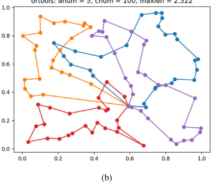

Fig. 1. Visualizing solutions produced by (a) GNN+DisPN , (b) ORTools up to 30 min on the instance that involves 5 agents and 100 cities. On this instance, the GNN+DisPN outperforms the ORTools .

of agents and cities increases. Secondly, the meta-heuristic algorithms are able to iteratively improve the solution until it converges to a local optimal. However, the performance of metaheuristic is decreasing as the search space becomes larger, at the same time, the executing time is increasing. In contrast, the

GNN+DisPN successfully learns a common policy representation. Although the policy representation cannot guarantee to produce optimal solution, and possibly construct poorer solutions than other methods on particular instances, in general it is beneficial to

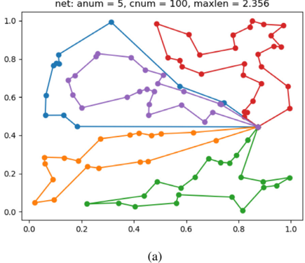

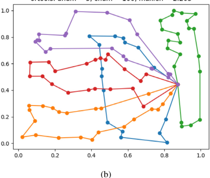

Fig. 2. Visualizing solutions produced by (a) GNN+DisPN , (b) ORTools up to 30 min on the instance that involves 5 agents and 100 cities. On this instance, the GNN+DisPN produces poorer solutions than the ORTools does.

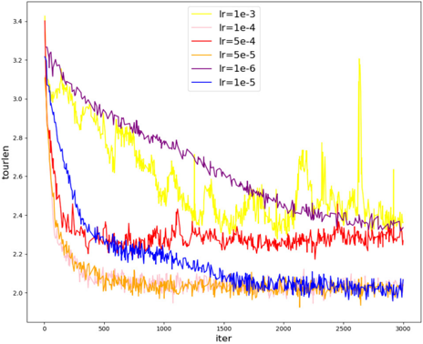

Fig. 3. Learning rate exploration on the dataset that 10 agents and 50 cities are included, when the S -sample approximation is fixed to S = 5.

Fig. 4. Learning rate exploration on the dataset that 10 agents and 50 cities are included, when the S -sample approximation is fixed to S = 10.

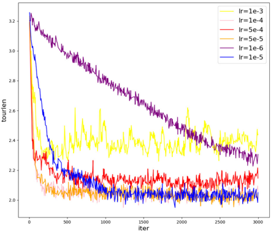

Fig. 5. Learning rate exploration on the dataset that 10 agents and 50 cities are included, when the S -sample approximation is fixed to S = 20.

Fig. 6. The effect of the number of sample during training when learning rate is fixed to 1 e -5.

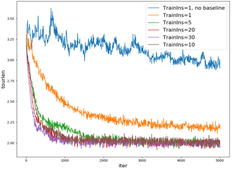

generate higher-quality solutions according to Tables 1-3. More examples are shown in Appendix A. C.

## 4.7. Learning rate exploration

At the beginning of learning rate exploration, we assume the S -samples batch approximation plays an important role in learning a common policy representative for our model, but the effects of S are not clear. Therefore, we firstly select a set of scales of the S -samples batch approximation ( S = 5, S = 10 and S = 20), then fix the scale and explore a set of learning rate, including 1 e -3 1 , e -4 5 , e -4 1 , e -5 5 , e -5 1 , e -6 on the dataset with 10 agents and 50 cities. The results are shown in Figs. 3-5 where S = 5, S = 10 and S = 20 respectively.

Curves in Figs. 3-5 illustrate that learning rates 1 e -4 1 , e -5 and 5 e -5 achieve similar performance, among which lr = 1 e -5 slightly outperform others. Therefore, learning rate is set to 1 e -5 over all experiments.

## 4.8. Influence of S-sample approximation

Fixing the learning rate to 1 e -5, we explore the influence of S -sample approximation training method. A set of experiments are built that (1) S = 1 and no advantage function; (2) S = 1 and using advantage function that baseline is the average longest tour length over the whole batch; (3) a set of experiments using the advantage function presented in (14), but different S setting, including S = 5 , S = 10 , S = 20 , S = 30. The models are trained on the dataset with 10 agents and 50 cities.

Fig. 6 demonstrates the S -sample approximation training has important effect to improve performance. The larger S setting makes the model converge quickly and gets a better performance after training for a long time. But the differences among performance are not significant. Our experiments depend on other solvers to produce solutions of small-scale problems, which will cost some time. To balance the training time of each iteration and the performance, our experiments use S = 10 samples approximation.

## 5. Conclusion

Cooperative combinatorial optimization problems arising from the real-world applications, such as multiple traveling salesman problems, task-assignment, multi-channel time scheduling, are important to study. One available method is using multi-agent learning. However, serious problems limit the application of multi-agent learning to cooperative combinatorial optimization problems, including the huge search space due to combinatorial explosion, the lack of labeled data since it is computationally expensive to solve optimal solution for NP-hard problems, and the lack of an approach to extract interactive relationships among agents to achieve a shared global reward for all agents.

Motivated by these challenges, we study the multiple traveling salesman (MTSP) problem as a representative cooperative combinatorial problem. We propose an architecture consisting of one shared graph neural network and distributed policy networks to extract the common policy for MTSP. We propose S -samples batch approximation to reduce the variance of reinforcement learning in training the neural network, which helps converge quickly and improves performance. Ablation studies and experiments demonstrate that the proposed approach learns the policy representative effectively and outperforms integer linear programming and heuristic algorithms.

## CRediT authorship contribution statement

Yujiao Hu: Conceptualization, Methodology, Software, Validation, Writing -original draft. Yuan Yao: Validation, Investigation, Data curation. Wee Sun Lee: Conceptualization, Supervision, Project administration, Writing - review &amp; editing.

## Declaration of competing interest

The authors declare that they have no known competing financial interests or personal relationships that could have appeared to influence the work reported in this paper.

## Acknowledgments

This work was supported in part by the National Natural Science Foundation of China under Grant 61751208 and Grant 61876151, and in part by the Fundamental Research Funds for the Central Universities, China under Grant 3102017OQD097. This work was supported by the National Research Foundation Singapore under its AI Singapore Program (Award Number: AISGRP-2018-006). This work was supported by the China Scholarship Council as well.

## Appendix A. Details of baselines

The architectures of SeqAss and SeqTour are similar with the GNN+DisPN , consisting of one shared graph neural network and distributed policy networks. However, the learning process of distributed policy networks is different. In the first stage, each agent independently produce its own agent embedding by using nodes features and global features from the graph neural network. Following that, nodes assign an agent to themselves sequentially using node embeddings and agent embeddings .

## A.1. SeqAss

The process of producing an assignment solution sequentially is shown in the Algorithm 1, where PAss is the partial assignment, f is node features, n and m are the number of cities and agents respectively. In the beginning, all agents are not assigned to any cities except the depot , i.e. the partial assignment is empty. After running the Algorithm 1, a complete assignment is given. Then the ORTools is able to compute the negative tour length of the longest sub-tour as the reward.

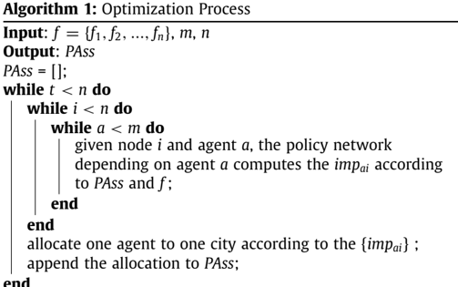

end

## gurobi: anum 5, cnum 50 maxlen 2.110

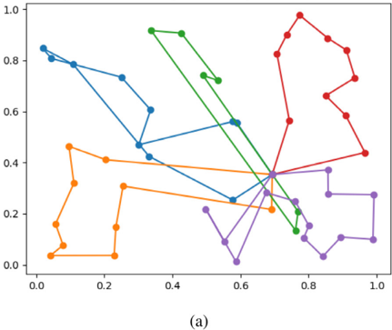

## ortools: anum 5, cnum 50, maxlen 1.960

replan: anum 5, cnum 50, maxlen 1.872

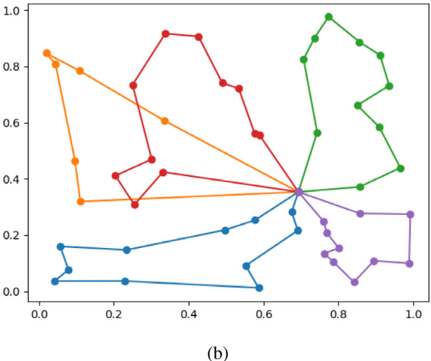

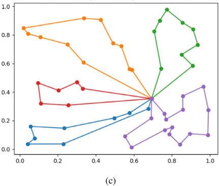

Fig. 7. Visualizing solutions produced by (a) Gurobi up to 1 h, (b) ORTools up to 30 min, (c) GNN+DisPN , (d) computing initial solutions using GNN+DisPN , then further improving the solution using the ORTools up to 10 s on the instance that involves 5 agents and 50 cities. On this instance, the GNN+DisPN outperforms the Gurobi and ORTools .

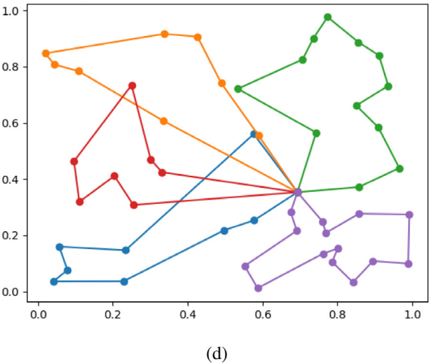

Extra node features. The distributed policy networks will make decisions according to the partial assignment. To cover the information, We add extra features fexi for each city that label (1) the city is allocated to the owner of one policy network or other agents, (2) the city has not been assigned. For example, the first policy network belongs to agent 1, if one city is allocated to agent 1, the extra feature of this node inputted to the policy network is (1 , 0); if one city is assigned to other agents, the extra feature is (0 , 1); if one city has not been distributed, the extra feature is (0 , 0). To embed the extra node feature, we introduce a set of neurons θ ex , then the new node features inputted to the policy network is

<!-- formula-not-decoded -->

Graph context embedding. The context of the graph comes from the node features f = { f 1 , f 2 , . . . , f n } and global features gf computed by max pooling from the set of node features. To represent the graph context embedding , we concatenate the global embedding and the depot features , same as (4).

Agent embedding. The process of computing agent embedding is also similar with the process in the GNN+DisPN , except (6), since we need to mask away assigned cities by replacing (6) to (18).

<!-- formula-not-decoded -->

Calculation of policy. The process of calculating the importance of agent a to the node i is similar as well. However, we have to mask away assigned cities when computing impai by replacing (10) to (19).

<!-- formula-not-decoded -->

After getting the impai for all cities over all agents,

<!-- formula-not-decoded -->

To evaluate the probability of one city to be assigned to one agent, we concatenate the benefit s, and introduce the softmax

net: anum 10, cnum 100, maxlen 2.287

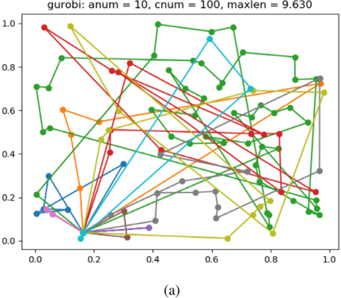

ortools: anum 10, cnum 100, maxlen 2.442

replan: anum 10, cnum 100, maxlen 2.212

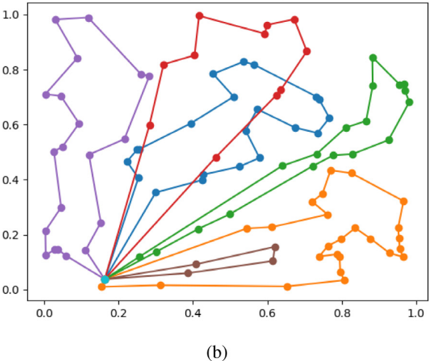

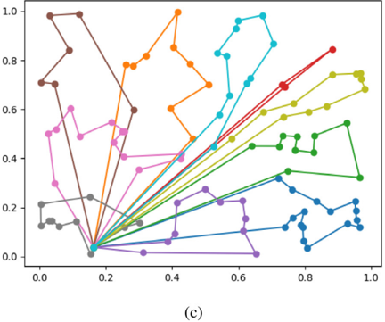

Fig. 8. Visualizing solutions produced by (a) Gurobi up to 1 h, (b) ORTools up to 30 min, (c) GNN+DisPN , (d) computing initial solutions using GNN+DisPN , then further improving the solution using the ORTools up to 10 s on the instance that involves 10 agents and 100 cities. On this graph, the GNN+DisPN produces a better solution than the Gurobi and ORTools .

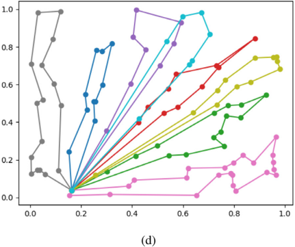

over all agents and all cities:

<!-- formula-not-decoded -->

solution that contains the traveling order of all agents. Moreover, we do not need the ORTools to assist planning the small-scale single-agent TSP any more.

At every iteration of producing PAs s, we sample one agent and one city from { pai } .

Training method. We train the SeqAss using advantage REINFORCE algorithm. We stabilize the baseline by freezing the parameters of the neural network for a fixed number of steps. The difference of rewards computed by the current training neural network and the baseline neural network is used as the advantage to train the SeqAss . The parameters of the baseline neural network are replaced by the parameters of the current training neural networks only if the improvement of the training neural network is significant according to a paired t-test ( α = 5%). The algorithm that designs a strong baseline is used in the [6] and makes the neural network learn more effectively.

## A.2. Architecture of SeqTour

The optimization process of the SeqTour is quite similar with the SeqAss . But the return of the Algorithm 1 is a complete

However, the graph context embedding for each agent is different. The features of last city and current city the agent visits are used. Such information is necessary for agents to produce shortest tours [2,5,6]. Thus the graph context embedding is represented as:

<!-- formula-not-decoded -->

The Attention Mechanism and Training methods of SeqTour are similar with the SeqAss .

## Appendix B. Experiments of further improve solutions computed by GNN+DisPN

The solutions produced by GNN+DisPN are high quality, but may still be able to optimize by some local search algorithms. That means the GNN+DisPN produces a high-quality solution as a great initial solution, then local search algorithms are used to keep improving until the solution converges to next better local optimal. Here we use the local search algorithms provided by the ORTools , and report the improved results after running

## gurobi: anum 5, cnum 50, maxlen 2.446

net: anum 5, cnum 50, maxlen 1.979

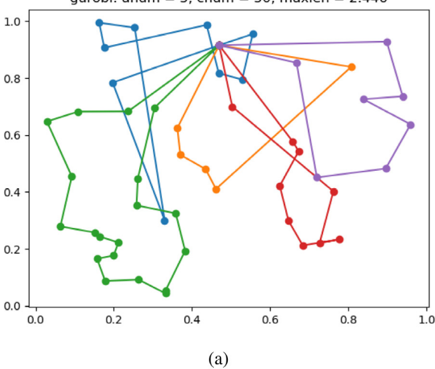

## ortools: anum 5, cnum 50, maxlen 1.933

replan: anum 5, cnum 50, maxlen 1.902

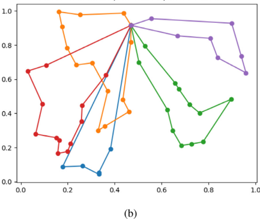

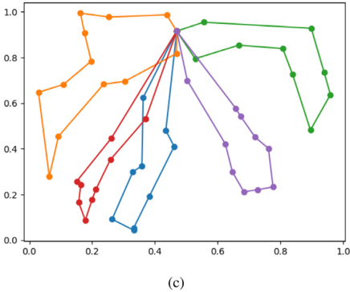

Fig. 9. Visualizing solutions produced by (a) Gurobi up to 1 h, (b) ORTools up to 30 min, (c) GNN+DisPN , (d) computing initial solutions using GNN+DisPN , then further improving the solution using the ORTools up to 10 s on the instance that involves 5 agents and 50 cities. On this case, the GNN+DisPN constructs a poorer result than the ORTools , but still better than the Gurobi .

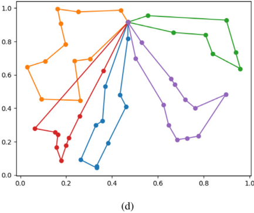

local search for up to 10 s (single thread). The results are shown in Tables 4, 5, 6.

in Figs. 9 and 10, the GNN+DisPN produces poorer solutions than the ORTools although better than the Gurobi .

The results illustrate solutions produced by our models are potential to be great initial solutions. Moreover, comparing the solutions generated by the GNN+DisPN and improved solutions, we believe the learned policy is able to construct near-optimal solutions since the improvement room by local search algorithms is quite small.

## Appendix C. Visualization analysis

In this section, we visualize the solutions produced by the Gurobi [23] that is regarded as the representative of integer linear programming, the ORTools that is one representative of metaheuristic algorithms [33], the GNN+DisPN that is proposed in our paper respectively. Moreover, the solutions constructed by the GNN+DisPN is further improved with the help of the ORTools .

The Figs. 7-10 visualize solutions on four different instances. The Figs. 7 and 8 support the claim that the GNN+DisPN is able to produce shorter longest sub-tours than the Gurobi and the ORTools . However, the GNN+DisPN cannot always guarantee to realize higher performance. For example, on the instances shown

Even though the GNN+DisPN seems to work poorer on particular instances, it is still very efficient. Firstly, the Gurobi is potential to compute optimal solutions but it will cost a quite long time because of the huge search space of the MTSP that uses mn 2 binary variables under constraints. Given a longest execution time, the Gurobi constructs poorer solutions according to Table 1, Figs. 710. Secondly, the ORTools adopts meta-heuristic algorithms to produce local optimal solutions, however, the executing time is increasing with respect to the number of agents and cities and the performance is decreasing as the search space becomes larger, according to Tables 1-3. Most important but not least, the GNN+DisPN successfully learns a common strong policy representation. Although the policy representation cannot guarantee optimal solutions and produce poorer solutions on particular instances, in general, it is beneficial to generate higher-quality solutions and realize better performance than other methods, according to Tables 1-3. Moreover, with the help of learned policy representation, it will take shorter time to compute great solutions, especially on large-scale graphs.

## gurobi: anum 10 cnum 100, maxlen 6.023

net: anum 10, cnum 100, maxlen 1.962

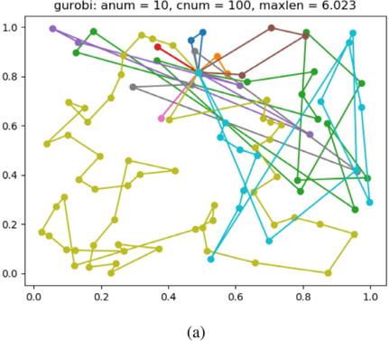

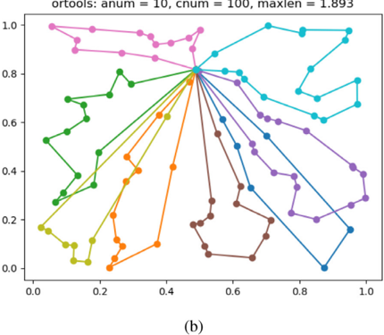

replan: anum 10, cnum 100, maxlen 1.817

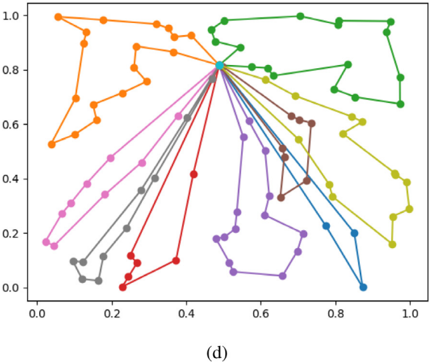

Fig. 10. Visualizing solutions produced by (a) Gurobi up to 1 h, (b) ORTools up to 30 min, (c) GNN+DisPN , (d) computing initial solutions using GNN+DisPN , then further improving the solution using the ORTools up to 10 s on the instance that involves 10 agents and 100 cities. On this graph, the GNN+DisPN generates a poorer result than the ORTools , but still better than the Gurobi .

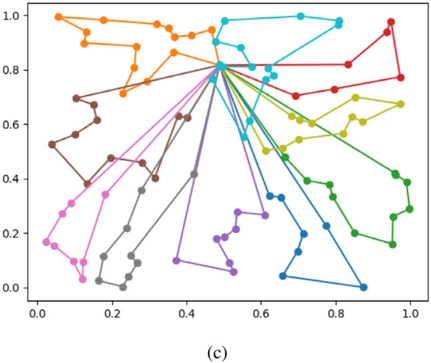

Table 4

Train and Test on the same-scale problems. Max and Time the lower the better . anum and cnum denote the number of agents and cities respectively. The solutions produced by the GNN+DisPN are further improved by local search algorithms under execution time limitation up to 10 s.

| Method          | anum = 5, cnum = 50   | anum = 5, cnum = 50   | anum = 10, cnum = 50   | anum = 10, cnum = 50   | anum = 5, cnum = 100   | anum = 5, cnum = 100   | anum = 10, cnum = 100   | anum = 10, cnum = 100   |
|-----------------|-----------------------|-----------------------|------------------------|------------------------|------------------------|------------------------|-------------------------|-------------------------|
|                 | Max                   | Time (s)              | Max                    | Time (s)               | Max                    | Time (s)               | Max                     | Time (s)                |
| ORTools(1800 s) | 2.115                 | 1.761                 | 2.034                  | 3.601                  | 2.410                  | 21.359                 | 2.272                   | 36.128                  |
| GNN+DisPN       | 2.115                 | 0.014                 | 1.965                  | 0.016                  | 2.480                  | 0.038                  | 2.087                   | 0.029                   |
| Imp(10 s)       | 2.053                 | 0.484                 | 1.928                  | 0.569                  | 2.342                  | 5.271                  | 2.019                   | 3.856                   |

## Table 5

Generalizing models trained on small-scale datasets to larger-scale instances. These results are produced by the GNN+DisPN (5, 50) that is trained on instances with 5 agents and 50 cities, and the GNN+DisPN (5, 100) that is trained on dataset with 5 agents and 100 cities. The solutions generated by the GNN+DisPN (5, 50) and the GNN+DisPN (5, 100) as initial solutions are improved iteratively by local search algorithms.

| City number       | cnum = 400   | cnum = 400   | cnum = 500   | cnum = 500   | cnum = 600   | cnum = 600   | cnum = 700   | cnum = 700   | cnum = 800   | cnum = 800   | cnum = 900   | cnum = 900   | cnum = 1000   | cnum = 1000   |
|-------------------|--------------|--------------|--------------|--------------|--------------|--------------|--------------|--------------|--------------|--------------|--------------|--------------|---------------|---------------|
| City number       | Max          | T (s)        | Max          | T (s)        | Max          | T (s)        | Max          | T (s)        | Max          | T (s)        | Max          | T (s)        | Max           | T (s)         |
| ORTools(1800 s)   | 4.572        | 1784         | 7.683        | 1800         | 9.619        | 1800         | 10.943       | 1800         | 12.464       | 1800         | 13.628       | 1800         | 14.771        | 1800          |
| GNN+DisPN(5, 50)  | 4.242        | 0.68         | 4.786        | 1.19         | 5.468        | 1.93         | 5.658        | 2.55         | 6.273        | 3.62         | 6.658        | 5.84         | 6.911         | 6.55          |
| Imp(5, 50, 10 s)  | 4.142        | 10.71        | 4.642        | 11.22        | 5.413        | 11.89        | 5.539        | 12.56        | 6.126        | 13.39        | 6.505        | 14.44        | 6.866         | 16.05         |
| GNN+DisPN(5, 100) | 4.298        | 0.36         | 4.769        | 1.18         | 5.405        | 1.92         | 5.759        | 2.71         | 6.278        | 3.79         | 6.647        | 5.08         | 6.910         | 6.54          |
| Imp(5, 100, 10 s) | 4.258        | 10.72        | 4.849        | 11.22        | 5.387        | 11.91        | 5.749        | 12.72        | 6.275        | 13.85        | 6.641        | 14.95        | 6.910         | 16.42         |

Table 6

Generalizing models trained on small-scale datasets to larger-scale instances. These results are produced by the GNN+DisPN (10, 50) that is trained on instances with 10 agents and 50 cities, and the GNN+DisPN (10, 100) that is trained on dataset with 10 agents and 100 cities. The solutions constructed by the GNN+DisPN are improved iteratively by local search algorithms.

| City number        | cnum = 400   | cnum = 400   | cnum = 500   | cnum = 500   | cnum = 600   | cnum = 600   | cnum = 700   | cnum = 700   | cnum = 800   | cnum = 800   | cnum = 900   | cnum = 900   | cnum = 1000   | cnum = 1000   |
|--------------------|--------------|--------------|--------------|--------------|--------------|--------------|--------------|--------------|--------------|--------------|--------------|--------------|---------------|---------------|
| City number        | Max          | T (s)        | Max          | T (s)        | Max          | T (s)        | Max          | T (s)        | Max          | T (s)        | Max          | T (s)        | Max           | T (s)         |
| ORTools(1800 s)    | 4.588        | 1705         | 7.739        | 1800         | 9.636        | 1800         | 11.241       | 1800         | 12.342       | 1800         | 13.713       | 1800         | 14.835        | 1800          |
| GNN+DisPN(10, 50)  | 3.208        | 0.35         | 3.538        | 0.57         | 3.863        | 0.87         | 4.074        | 1.27         | 4.294        | 1.75         | 4.683        | 2.34         | 4.819         | 2.99          |
| Imp(10, 50, 10 s)  | 2.988        | 10.37        | 3.492        | 10.62        | 3.863        | 10.88        | 4.074        | 11.31        | 4.292        | 11.75        | 4.682        | 12.49        | 4.816         | 13.11         |
| GNN+DisPN(10, 100) | 2.888        | 0.32         | 3.319        | 0.56         | 3.651        | 0.81         | 3.953        | 1.22         | 4.198        | 1.69         | 4.585        | 2.21         | 4.814         | 2.87          |
| Imp(10, 100, 10 s) | 2.822        | 10.35        | 3.146        | 10.55        | 3.561        | 10.83        | 3.878        | 11.22        | 4.124        | 11.65        | 4.519        | 12.31        | 4.813         | 12.81         |

## References

- [24] IBM, CPLEX optimizer, 2018, URL https://www.ibm.com/analytics/cplexoptimizer.
- [1] Z. Li, Q. Chen, V. Koltun, Combinatorial optimization with graph convolutional networks and guided tree search, in: Advances in Neural Information Processing Systems, 2018, pp. 539-548.
- [2] E. Khalil, H. Dai, Y. Zhang, B. Dilkina, L. Song, Learning combinatorial optimization algorithms over graphs, in: Advances in Neural Information Processing Systems, 2017, pp. 6348-6358.
- [3] K. Braekers, K. Ramaekers, I. Van Nieuwenhuyse, The vehicle routing problem: State of the art classification and review, Comput. Ind. Eng. 99 (2016) 300-313.
- [4] O. Vinyals, M. Fortunato, N. Jaitly, Pointer networks, in: Advances in Neural Information Processing Systems, 2015, pp. 2692-2700.
- [5] I. Bello, H. Pham, Q.V. Le, M. Norouzi, S. Bengio, Neural combinatorial optimization with reinforcement learning, 2016, arXiv preprint arXiv:1611. 09940.
- [6] W. Kool, H. van Hoof, M. Welling, Attention, learn to solve routing problems!, 2018, arXiv preprint arXiv:1803.08475.
- [7] M. Nazari, A. Oroojlooy, L. Snyder, M. Takác, Reinforcement learning for solving the vehicle routing problem, in: Advances in Neural Information Processing Systems, 2018, pp. 9839-9849.
- [8] T. Bektas, The multiple traveling salesman problem: an overview of formulations and solution procedures, Omega 34 (3) (2006) 209-219.
- [9] R. Necula, M. Breaban, M. Raschip, Tackling the bi-criteria facet of multiple traveling salesman problem with ant colony systems, in: 2015 IEEE 27th International Conference on Tools with Artificial Intelligence, ICTAI, IEEE, 2015, pp. 873-880.
- [10] Y. Kaempfer, L. Wolf, Learning the multiple traveling salesmen problem with permutation invariant pooling networks, 2018, arXiv preprint arXiv: 1803.09621.
- [11] A.S. Rostami, F. Mohanna, H. Keshavarz, A. Hosseinabadi, Solving multiple traveling salesman problem using the gravitational emulation local search algorithm, Appl. Math. Inf. Sci. 9 (2) (2015) 1-11.
- [12] Y. Shuai, S. Yunfeng, Z. Kai, An effective method for solving multiple travelling salesman problem based on NSGA-II, Syst. Sci. Control Eng. 7 (2) (2019) 108-116.
- [13] L. Buşoniu, R. Babuška, B. De Schutter, Multi-agent reinforcement learning: An overview, in: Innovations in Multi-Agent Systems and Applications, Vol. 1, Springer, 2010, pp. 183-221.
- [14] L. Panait, S. Luke, Cooperative multi-agent learning: The state of the art, Auton. Agents Multi-Agent Syst. 11 (3) (2005) 387-434.
- [15] J. Foerster, I.A. Assael, N. de Freitas, S. Whiteson, Learning to communicate with deep multi-agent reinforcement learning, in: Advances in Neural Information Processing Systems, 2016, pp. 2137-2145.
- [16] H.M. Le, Y. Yue, P. Carr, P. Lucey, Coordinated multi-agent imitation learning, in: Proceedings of the 34th International Conference on Machine Learning, Vol. 70, JMLR. org., 2017, pp. 1995-2003.
- [17] A. Grover, M. Al-Shedivat, J.K. Gupta, Y. Burda, H. Edwards, Learning policy representations in multiagent systems, 2018, arXiv preprint arXiv: 1806.06464.
- [18] T. Kipf, E. Fetaya, K.-C. Wang, M. Welling, R. Zemel, Neural relational inference for interacting systems, 2018, arXiv preprint arXiv:1802.04687.
- [19] S. Iqbal, F. Sha, Actor-attention-critic for multi-agent reinforcement learning, in: Proceedings of the 36th International Conference on Machine Learning, Vol. 97, PMLR, 2019, pp. 2961-2970.
- [20] M. Woodward, C. Finn, K. Hausman, Learning to interactively learn and assist, 2019, arXiv preprint arXiv:1906.10187.
- [21] D.J. Rosenkrantz, R.E. Stearns, P.M. Lewis II, An analysis of several heuristics for the traveling salesman problem, SIAM J. Comput. 6 (3) (1977) 563-581.
- [22] K. Helsgaun, An effective implementation of the Lin-Kernighan traveling salesman heuristic, European J. Oper. Res. 126 (1) (2000) 106-130.
- [23] L. Gurobi Optimization, Gurobi optimizer reference manual, 2020, URL http://www.gurobi.com.
- [25] L. Perron, V. Furnon, OR-Tools, Google, URL https://developers.google.com/ optimization/.
- [26] K. Helsgaun, LKH3 solver, 2017, URL http://akira.ruc.dk/~keld/research/ LKH-3/.
- [27] D. Applegate, R. Bixby, V. Chvatal, W. Cook, Concorde TSP solver, 2006, URL http://www.math.uwaterloo.ca/tsp/concorde/.
- [28] C. Guestrin, M. Lagoudakis, R. Parr, Coordinated reinforcement learning, in: ICML, Vol. 2, Citeseer, 2002, pp. 227-234.
- [29] J.R. Kok, M.T. Spaan, N. Vlassis, et al., Multi-robot decision making using coordination graphs, in: Proceedings of the 11th International Conference on Advanced Robotics, Vol. 3, ICAR, 2003, pp. 1124-1129.
- [30] Y.-H. Chang, T. Ho, L.P. Kaelbling, All learning is local: Multi-agent learning in global reward games, in: Advances in Neural Information Processing Systems, 2004, pp. 807-814.
- [31] E. Bargiacchi, T. Verstraeten, D. Roijers, A. Nowé, H. Hasselt, Learning to coordinate with coordination graphs in repeated single-stage multi-agent decision problems, in: International Conference on Machine Learning, 2018, pp. 491-499.
- [32] N. Carion, G. Synnaeve, A. Lazaric, N. Usunier, A structured prediction approach for generalization in cooperative multi-agent reinforcement learning, in: Advances in Neural Information Processing Systems, 2019.
- [33] C. Blum, A. Roli, Metaheuristics in combinatorial optimization: Overview and conceptual comparison, ACM Comput. Surv. 35 (3) (2003) 268-308.

[34]

T.

Yu,

J.

Yan, J.

Zhao, B.

Li,

Joint cuts

and matching of partitions in one graph,

in:

Proceedings of

the

IEEE

Conference on Computer Vision and

Pattern Recognition, 2018, pp. 705-713.

- [35] Z. Zhang, W.S. Lee, Deep graphical feature learning for the feature matching problem, in: Proceedings of the IEEE International Conference on Computer Vision, 2019, pp. 5087-5096.
- [36] C.R. Qi, H. Su, K. Mo, L.J. Guibas, Pointnet: Deep learning on point sets for 3d classification and segmentation, in: Proceedings of the IEEE Conference on Computer Vision and Pattern Recognition, 2017, pp. 652-660.
- [37] C.R. Qi, L. Yi, H. Su, L.J. Guibas, Pointnet++: Deep hierarchical feature learning on point sets in a metric space, in: Advances in Neural Information Processing Systems, 2017, pp. 5099-5108.
- [38] Y. Wang, Y. Sun, Z. Liu, S.E. Sarma, M.M. Bronstein, J.M. Solomon, Dynamic graph cnn for learning on point clouds, ACM Trans. Graph. 38 (5) (2019) 1-12.
- [39] P. Goyal, E. Ferrara, Graph embedding techniques, applications, and performance: A survey, Knowl.-Based Syst. 151 (2018) 78-94.
- [40] F. Scarselli, M. Gori, A.C. Tsoi, M. Hagenbuchner, G. Monfardini, The graph neural network model, IEEE Trans. Neural Netw. 20 (1) (2008) 61-80.
- [41] T.N. Kipf, M. Welling, Semi-supervised classification with graph convolutional networks, 2016, arXiv preprint arXiv:1609.02907.
- [42] F. Wu, T. Zhang, A.H.d. Souza Jr., C. Fifty, T. Yu, K.Q. Weinberger, Simplifying graph convolutional networks, 2019, arXiv preprint arXiv:1902.07153.
- [43] E. Groshev, A. Tamar, M. Goldstein, S. Srivastava, P. Abbeel, Learning generalized reactive policies using deep neural networks, in: 2018 AAAI Spring Symposium Series, 2018.
- [44] P. Veličković, G. Cucurull, A. Casanova, A. Romero, P. Lio, Y. Bengio, Graph attention networks, 2017, arXiv preprint arXiv:1710.10903.
- [45] M. Qu, Y. Bengio, J. Tang, Gmnn: Graph markov neural networks, 2019, arXiv preprint arXiv:1905.06214.
- [46] K. Xu, W. Hu, J. Leskovec, S. Jegelka, How powerful are graph neural networks? 2018, arXiv preprint arXiv:1810.00826.
- [47] J. Gilmer, S.S. Schoenholz, P.F. Riley, O. Vinyals, G.E. Dahl, Neural message passing for quantum chemistry, in: Proceedings of the 34th International Conference on Machine Learning, Vol. 70, JMLR. org., 2017, pp. 1263-1272.

- [48] R. Liao, M. Brockschmidt, D. Tarlow, A.L. Gaunt, R. Urtasun, R. Zemel, Graph partition neural networks for semi-supervised classification, 2018, arXiv preprint arXiv:1803.06272.
- [49] A. Graves, G. Wayne, I. Danihelka, Neural turing machines, 2014, arXiv preprint arXiv:1410.5401.
- [50] D. Bahdanau, K. Cho, Y. Bengio, Neural machine translation by jointly learning to align and translate, 2014, arXiv preprint arXiv:1409.0473.
- [51] M.-T. Luong, H. Pham, C.D. Manning, Effective approaches to attentionbased neural machine translation, 2015, arXiv preprint arXiv:1508. 04025.
- [52] A. Vaswani, N. Shazeer, N. Parmar, J. Uszkoreit, L. Jones, A.N. Gomez, Ł. Kaiser, I. Polosukhin, Attention is all you need, in: Advances in Neural Information Processing Systems, 2017, pp. 5998-6008.
- [53] R.J. Williams, Simple statistical gradient-following algorithms for connectionist reinforcement learning, Mach. Learn. 8 (3-4) (1992) 229-256.

Yujiao Hu is a Ph.D. student under supervision of Prof. Xingshe Zhou, in Department of Computer Science of Northwestern Polytechnical University. She obtained bachelor degree in 2016 at the Department of Computer Science of Northwestern Polytechnical University in China. From Nov 2018 to May 2020, she is a visiting PhD student in School of Computing, National University of Singapore, under the supervision of Prof. Wee Sun Lee. Her research interests are in the areas of machine learning, planning and optimization.

networks.

Wee Sun Lee is a profess or in the Department of Computer Science, National University of Singapore. He obtained his B.Eng from the University of Queensland in 1992 and his Ph.D. from the Australian National University in 1996. He has been a research fellow at the Australian Defence Force Academy, a fellow of the Singapore-MIT Alliance, and a visiting scientist at MIT. His research interests include machine learning, planning under uncertainty, and approximate inference. He has been an area chair for machine learning and AI conferences such as the Neural Information Processing

Systems (NeurIPS), the International Conference on Machine Learning (ICML), the AAAI Conference on Artificial Intelligence (AAAI), and the International Joint Conference on Artificial Intelligence (IJCAI). He was a program, conference and journal track co-chair for the Asian Conference on Machine Learning (ACML), and he is currently the co-chair of the steering committee of ACML.

Yuan Yao is currently an Associate Professor in the School of Computer Science, Northwestern Polytechnical University. He received the B.S., M.S. and Ph.D. degrees in computer science from Northwestern Polytechnical University, Xi'an, China, in 2007, 2009 and 2015, respectively. Prior to joining the faculty at NPU, he was a Postdoctoral Researcher in the Department of Computing at Polytechnic University, Hong Kong. His research interests are in the area of machine learning, real-time and embedded system, cross-layer design in vehicular ad-hoc networks, and security in vehicular