Contents lists available at ScienceDirect

## Computers &amp; Industrial Engineering

j o urnal homepage: www.elsevier.com/locate/caie

## Multi-phase modified shuffled frog leaping algorithm with extremal optimization for the MDVRP and the MDVRPTW

## Jianping Luo ⇑ , Min-Rong Chen

College of Information Engineering, Shenzhen University, Shenzhen 518060, China

## a r t i c l e i n f o

## a b s t r a c t

Article history:

Received 28 March 2013

Received in revised form 28 January 2014

Accepted 3 March 2014

Available online 15 March 2014

Keywords:

Evolutionary computation Combinatorial optimization Vehicle routing problem Shuffled frog leaping algorithm

In this work, a novel multi-phase modified shuffled frog leaping algorithm (MPMSFLA) framework is presented to solve the multi-depot vehicle routing problem (MDVRP) more quickly. The presented algorithm adopts the K -means algorithm to execute the clustering analyses for all customers, generates a frog population according to the result of the clustering analyses, and then proceeds to the three-phase process. In the first phase, a cluster MSFLA local search is carried out for each cluster. In the second phase, the algorithm selects good individuals through a binary tournament to construct a new population and then performs a global optimization for all customers and depots using the global MSFLA. In the third phase, a cluster adjustment is implemented for the population to generate new clusters. These procedures continue until the convergence criterion is satisfied. The experimental results show that our algorithm can achieve a high quality solution within a short runtime for the MDVRP, the MDVRP with time windows (MDVRPTW) and the capacitated vehicle routing problem (CVRP). The proposed algorithm is suitable for solving large-scale problems.

/C211 2014 Elsevier Ltd. All rights reserved.

## 1. Introduction

With the development of the economy and commercial business, distribution has been considered an important part of modern logistics. The vehicle routing problem (VRP), which was first introduced by Dantzig and Ramser (1959), is a well-known combinatorial optimization problem. The multi-depot vehicle routing problem (MDVRP) is an NP-hard problem for simultaneously determining the routes for several vehicles from more than one depot to a set of customers and then returning to the same depot without exceeding the capacity constraint of each vehicle. Generally, the problem is aimed at minimizing the total cost of the combined routes for a fleet of vehicles. The cost is closely associated with distance; hence, the goal is to minimize the distance traveled by a fleet of vehicles with various constraints.

Numerous works about the classical VRP have been published over the past 40 years. However, only a few reports have focused on MDVRP. The first heuristic for MDVRP was proposed by Tillman (1969). Tabu search heuristics for MDVRP were proposed by Renaud, Laporte, and Boctor (1996) and Cordeau, Gendreau, and Laporte (1997). Salhi and Thangiah (2001) proposed an algorithm that considers the geometric information and represents solutions

⇑ Corresponding author. Tel.: +86 15889669910. E-mail address: camelrock@126.com (J. Luo).

as circles in the 2D space to solve the MDVRP effectively. Pisinger and Ropke (2007) presented an effective heuristic algorithm called adaptive large neighborhood search (ALNS) that could solve different variants of the VRP by implementing the ruin-and-recreate paradigm with an adaptive selection of operators. Ombuki-Berman and Hanshar (2009) presented a mutation operator that tackles effectively the allocation of customers who are close to several depots. Ghoseiri and Ghannadpour (2010) presented a hybrid genetic algorithm to solve a multi-depot homogenous locomotive assignment problem with time windows. In the locomotive assignment problem, homogeneous locomotives located in dispersed depots must be assigned to prescheduled trains that are supposed to be serviced in prespecified hard/soft time windows. Crevier, Cordeau, and Laporte (2007) addressed an extension of the MDVRP where vehicles may be replenished at intermediate depots along their routes. The authors designed and compared six heuristics for assigning customers to depots while using the same VRP heuristic for each depot. Mirabi, Fatemi Ghomi, and Jolai (2010) addressed the MDVRP to minimize the delivery time of the target vehicle. Three hybrid heuristics were presented to solve the MDVRP. Each hybrid heuristic combines elements from constructive heuristic search and improvement techniques, including deterministic, stochastic, and simulated annealing methods. Liu, Jiang, Fung, Chen, and Liu (2010) proposed a two-phase greedy algorithm to solve practical large-scale MDVRPs. In the first phase,


directed cycles were created to fulfill the transportation orders. In the second phase, chains composed of cycles were generated. Recently, several exact algorithms (Baldacci &amp; Mingozzi, 2009; Baldacci, Bartolini, Mingozzi, &amp; Valletta, 2011) were presented for the MDVRP. Although exact algorithms can provide optimal solutions to some problems, they are time consuming and are limited in the size of instances they can tackle.

Memetic algorithm is a special class of heuristic search method derived from the models of adaptation in natural systems. This algorithm combines the evolutionary adaptation of a population with individual learning within the lifetimes of their members. The term ''memetic algorithm'' comes from ''meme.'' Meme, which consists of memetypes, is a contagious information pattern that replicates by parasitically infecting human and/or animal minds and manipulating their behavior to propagate the pattern. Memetic and genetic evolution are subjected to the same basic principles, i.e., possible solutions are created, selected according to measures of fitness, combined with other solutions, and possibly mutated. Memetic evolution, however, is a much more flexible mechanism. Genes can only be transmitted from parents or parent in the case of asexual reproduction to offspring. Memes can, in principle, be transmitted between any two individuals. Since genes are transmitted between generations, higher organisms may take a long time to propagate. Memes can be transmitted quickly in the entire space. Therefore, meme spreading is much faster than gene spreading (see Merz &amp; Freisleben, 1997).

Shuffled frog leaping algorithm (SFLA), developed by Eusuff and Lansey (2003), is a meta-heuristic optimization method that mimics the memetic evolution of a group of frogs when seeking for the location that has the maximum amount of available food. The algorithm contains elements of local search and global information exchange. SFLA involves a population of possible solutions defined by a set of virtual frogs that is partitioned into subsets referred to as memeplexes. Within each memeplex, a frog holds ideas that can be influenced by other frogs, and the ideas can change through memetic evolution. SFLA performs an independent local search in each memeplex using a particle swarm optimization (PSO)-like method. After a defined number of memeplex evolution steps (i.e., local search iterations), the virtual frogs are shuffled and reorganized into new memeplexes to ensure global exploration. In addition, random virtual frogs are generated and substituted in the population if the local search cannot find better solutions to maintain population diversity. The local search and shuffling processes continue until the convergence criterion is satisfied. This algorithm has been proven effective in searching global solutions for several combinatorial problems (Abdollah &amp; Mohammad-Reza, 2013;Chen &amp; Wang, 2012; Li, Luo, Chen, &amp; Wang, 2012; Luo, Li, &amp; Chen, 2011; Perez, Gomez-Gonzalez, &amp; Jurado, 2013; Reddy, Srinivasa, &amp; Vaisakh, 2013; Roy, Roy, &amp; Chakrabarti, 2013).

Basing on the fundamentals of statistical physics and self-organized criticality (Bak &amp; Sneppen, 1993), Boettcher and Percus (1999) proposed a new general-purpose local search optimization approach called extremal optimization (EO). The evolution in this method is driven by a process where the weakest species in a population, together with its nearest neighbors, is forced to mutate. EO, which successively eliminates the worst components in suboptimal solutions, has been successfully applied to many continuous and discrete optimization problems (Boettcher, 2005; Chen &amp; Lu, 2008).

In this paper, a novel multi-phase modified SFLA (MPMSFLA) is presented to solve the MDVRP, the MDVRP with time windows (MDVRPTW) and the capacitated vehicle routing problem (CVRP). The algorithm framework contains three procedures, i.e., cluster MSFLA for local search, global MSFLA for global optimization, and cluster adjustment. These procedures are repeated until the criterion is satisfied. This paper is organized as follows. Section 2

describes the hierarchy of decisions in the MDVRP. The general framework, which includes cluster MSFLA, global MSFLA, and cluster adjustment, is proposed to solve the MDVRP in Section 3. Experimental evaluations and result discussions are shown in Section 4. Finally, the conclusions are drawn in Section 5.

## 2. Multi-depot vehicle routing problem

Consider a distribution network in which one product is shipped from some depots to a set of customers. The MDVRP can be defined on a multi-graph G ¼ ð C D E ; ; Þ , where C is the customer vertex set that includes N customers, D is the depot vertex set that includes D depots, and E is the arc set. Thus, C and D can denoted as f 1 2 ; ; . . . ; N g and f 1 2 ; ; . . . ; M g , respectively. The set V ¼ f C S D g is the node set. E ¼ fð i ; j Þj i ; j 2 V g n fð i ; j Þj i ; j 2 D g The demand of the i -th customer is qi . The distance between points i and j is cij . The system has L vehicles, and K ¼ f k 1 ; k 2 ; . . . ; kL is the set of all vehicles. The maximum capacity of vehicle i is Qi ¼ ð i ¼ 1 2 ; ; . . . ; L Þ . We use K d ð Þ to denote the vehicle set of the depot d d ð 2 D Þ ; Kd to denote the maximum vehicle number of depot d , and C d ð Þ to denote the customer set of the depot, d d ð 2 D Þ . Each vehicle starts the travel from a depot and returns to the same depot after completion of services to customers. The objective is to determine a viable delivery sequence for each route that minimizes the delivery distance or time spent in serving all customers.

Decision variables:

/C26

<!-- formula-not-decoded -->

/C26

<!-- formula-not-decoded -->

The MDVRP can then be stated as follows (Zhang, Zhao, Sun, &amp; Shi, 2010):

XX X

X

<!-- formula-not-decoded -->

S.t.

XX

<!-- formula-not-decoded -->

X

<!-- formula-not-decoded -->

X

<!-- formula-not-decoded -->

XX

<!-- formula-not-decoded -->

X

X

<!-- formula-not-decoded -->

X X

<!-- formula-not-decoded -->

X

<!-- formula-not-decoded -->

X

<!-- formula-not-decoded -->

Eq. (1), which is the objective function, minimizes the total cost (distance or time) by all vehicles. Eqs. (2) and (3) require that the number of arranged vehicles is less than the maximum number of vehicles. Eq. (4) requires that each customer is assigned to a single route. Eqs. (5) and (6) assure that each route can be served at most once. Eq. (7) is the capacity constraint set for vehicles. Eqs. (8) and

(9) require that each route is a circular path. Note that the problem is a capacitated vehicle routing problem (CVRP), when the number of depot is equal to 1.

## 3. Multi-phase MSFLA (MPMSFLA) for MDVRP

In the present work, MPMSFLA based on clustering is presented to solve the MDVRP more quickly. The improved algorithm initially adopts the K -means algorithm (presented in Section 3.1) to execute the clustering analyses for all customers, which take the depots as the centroids of the clusters. It then implements the local depth search using a heuristic algorithm based on swarm intelligence optimization, i.e., cluster MSFLA (proposed in Section 3.2), for each cluster. Therefore, some individuals (frogs) are generated to constitute the frog population. The local search is driven by the evolution (learning and communication) within these frogs. Each frog represents a solution of the total search space, which includes all customers and depots. A frog is composed of some components that are related to the vehicle routing information of the customers and depots. The different parts of the components correspond to the different clusters. Thus, a frog contains the classification information of all clusters and the vehicle routing path in each cluster. After completing the local search in each cluster, the algorithm selects good individuals (frogs) to construct a new population and then performs a global optimization for all customers and depots using global MSFLA (described in Section 3.3). Given its strong local search capacity, EO is merged into the MSFLA to improve the quality of solutions. Afterward, cluster adjustment is performed to generate new clusters according to the best solution achieved by the preceding process (given in Section 3.4). The improved path information is inherited to the new clusters, and cluster MSFLA is used again for each cluster. The processes continue until the convergence criterion is satisfied. The general scheme of the MPMSFLA is summarized in Algorithm 1.

## Algorithm 1. General Framework

```
1 Input: Parameters 2 Generate a solution X randomly 3 K-means clustering for 4 Generate population P including F frogs according to X 5 Record Xg criteria are satisfied) Cluster MSFLA for every cluster Global MSFLA for Adjust clusters 10 Xg GetBest (P) 11 if(f (Xg ) <f (Xg) ) 12 Xg=Xg 13 Return Xg and f (Xg)
```

## 3.1. K-means clustering and generating the population

K -means (MacQueen, 1967) is one of the unsupervised learning algorithms that solve the well-known clustering problem. K -means is a method of cluster analysis that aims to partition N observations into k clusters, in which each observation belongs to the cluster with the nearest mean. The procedure follows a simple way to classify a given data set through a certain number of clusters (assume k clusters) fixed a priori. In the present work, K -means clustering analyses are used to generate the clusters initially with a random solution X . All customers are allocated to clusters that take the depots, some unchanged points, as centroids of clusters using the K -means method. Thus, after finishing the allocation only once, the clustering process is completed, and the solution X is improved, which includes the clusters.

Afterward, a population P ¼ f X 1 ; X 2 ; . . . ; XF g that includes F solutions (frogs) is generated randomly, but the cluster allocations of each solution ought to be guaranteed to be the same as the X , i.e., the customer sets of the depots for each frog are the same. With this process, the algorithm creates the initial frog population. The next step is to perform the local search for each cluster using MSFLA, followed by the global MSFLA.

## 3.2. Cluster MSFLA for each cluster

After finishing the clustering analyses for all customers, each cluster includes some customers. Each cluster generates several vehicle routes by allocating these customers to different vehicles. The cluster MSFLA is regarded as the local search approach to be implemented in each cluster.

## 3.2.1. Solution representation

The original model of SFLA is adapted to solve continuous optimization problems. However, handling the MDVRP directly is difficult because it is a combinatorial optimization problem in which each dimension of a solution is discrete. In our work, a novel real number encoding method of MSFLA for MDVRP referring to the PSO encoding method (see Li &amp; Zou, 2004) is used, which solves the open vehicle routing problem (OVRP). For the MDVRP including M depots and N customers, the data structure of a MSFLA solution can be encoded as

<!-- formula-not-decoded -->

where Kd ( d 2 f 1 ; . . . ; M g ) is the maximum vehicle number of the depot d . The data structure includes the complete information of an MDVRP solution. Its decoding process is shown in Fig. 1.

In this encoding and decoding of the solution, the local search of SFLA in different clusters can use the same frog population to describe the problem. The values of the different components of an individual can express the clustering information. According to the encoding method, if for example an MDVRP instance has 9 customers, 3 depots, and 2 vehicles (maximum) per depot, then the length of the vector of a frog is 9, and an individual can be encoded as

<!-- formula-not-decoded -->

Basing on the decoding rules described above, we can obtain

H 1 ¼ fð 0 2 1 : ; Þg ; H 2 ¼ fð 1 8 3 : ; Þ ; ð 1 1 6 : ; Þg

<!-- formula-not-decoded -->

H 5 ¼ fð 4 4 4 : ; Þ ; ð 4 1 7 : ; Þg ; H 6 ¼ fð 5 5 5 : ; Þg

After sorting the elements of set Hk according to the first dimension value of each element of the set Hk in ascending order, we can obtain

H 1 ¼ fð 0 2 1 : ; Þg ; H 2 ¼ fð 1 1 6 : ; Þ ; ð 1 8 3 : ; Þg

H 3 ¼ fð 2 1 2 : ; Þ ; ð 2 8 9 : ; Þg ; H 4 ¼ fð 3 0 8 : ; Þg

<!-- formula-not-decoded -->

Thus, customers 1, 6, and 3 belong to cluster 1; customers 2, 9, and 8 belong to cluster 2; and customers 7, 4, and 5 belong to cluster 3. The three clusters are shown in Fig. 2.

After mapping the above position into the corresponding customer, we can obtain the result of the delivery plan represented by the position (need 6 vehicles):

First route: D1-1-D1, the second route: D1-6-3-D1,

Third route: D2-2-9-D2, the forth route: D2-8-D2,

Fifth route: D3-7-4-D3, the sixth route: D3-5-D3, where D1, D2, and D3 denote depots 1, 2, and 3, respectively. The decoding process is allowed to generate null sets, which represent that the corresponding vehicles need not be used.

Fig. 1. Decoding procedure for an MDVRP solution.

Fig. 2. Indication of clustering.

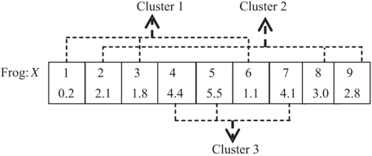

## 3.2.2. Cluster MSFLA for local search

For the cluster d , the local search using MSFLA is described in detail as follows. A fitness function f d ð Xi Þ defined as the total distance traveled by the vehicles in this cluster is used to evaluate the frog's quality. Afterward, all frogs in population P are sorted in ascending order according to their fitness to form m memeplexes W 1 ; W 2 ; . . . ; W m , which can be created by

n

o

<!-- formula-not-decoded -->

where n is the number of frog in each memeplex. Clearly, F ¼ m /C2 n . The worst frog in each memeplex is updated according to the following formulae:

B

¼ ð

r

Xb

/C0

Xw

Þ

ð

12

Þ

<!-- formula-not-decoded -->

where B denotes the leaping step size; Xw and Xb are the worst frog and the best frog, respectively, in the memeplex; r is a random number between (0, 1); and k B min k and k B max k are the maximum and minimum allowed change in a frog's position, respectively. If X w 0 is better than, Xw is Xw replaced by X w 0 . Otherwise, the global best frog Xg is used instead of Xb to carry out the above updating strategy, i.e.,

<!-- formula-not-decoded -->

If no improvement can be observed, Xw is replaced by a random solution. The process continues for a predefined number of iterations within each memeplex. Afterward, all frogs are shuffled for global information exchange. Local exploration and global shuffling alternate until the convergence criterion is satisfied.

As indicated by Eq. (12), the leaping step of the worst frog is strictly between the current worst position and the best position. It might slow down the convergence speed of the algorithm and even cause premature convergence. To expand the possible search range, Eq. (12) can be modified as

<!-- formula-not-decoded -->

where c is a constant greater than 1. Clearly, c cannot be set too large; otherwise, the local search tends to be a random search with minimal improvement or even cause premature convergence.

At the same time, each frog may have a tendency to remain in its current moving status while leaping to find food. This tendency can be described by movement inertia as similar to that of standard PSO. Thus, leaping rules (12) and (14) are reformulated as

B k

ð

Þ ¼

wB k

ð

/C0

1

Þ þ

cr Xb

ð

/C0

Xw

Þ

ð

16

Þ

<!-- formula-not-decoded -->

where B k ð Þ denotes the leaping step size in the k /C0 th iteration. The parameter w is the inertia weight that helps regulate the search process in the modified SFLA. For the local exploration in each memeplex, we choose linearly decreasing weights for w in the range of ½ w min ; w max /C138 . The cluster MSFLA for local search is shown as Algorithm 2, where IMAX is the number of shuffling iterations and CGEN is the number of iterations within each memeplex.

## Algorithm 2. Cluster MSFLA

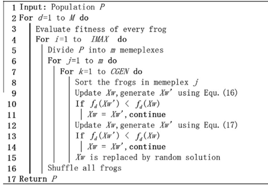

## 3.2.3. Population size setting

In performing local depth search in one cluster using MSFLA, only the corresponding components that belong to this cluster are updated; the other components remain unchanged. For the cluster MSFLA of cluster 1 (Fig. 3), only elements 1, 3, and 6 in the vector of X are updated in each iteration; the other elements remain unchanged.

The cluster MSFLA in different clusters uses the same frog population to describe the problem. The number of customers in each cluster is usually considerably smaller than the total number of customers. Thus, the number of frogs of cluster MSFLA for one cluster, i.e., the population parameter F , is usually small. According our experiments, when F is set as

<!-- formula-not-decoded -->

our algorithm can still achieve high-quality solutions. Therefore, the cluster MSFLA for each cluster is very quick, thereby making the entire calculation process time effective. Each element of the solution is a real number in the presented encoding method. Therefore, the iteration updating Eqs. (16) and (17) can be used directly to solve the MDVRP. After finishing the cluster MSFLA local search, all clusters ought to implement the global MSFLA to improve the precision of the solution.

## 3.3. Global MSFLA optimization

The clustering analyses may not be accurate enough to divide the customers into each depot. Thus, the vehicle route generated by the cluster MSFLA in each cluster may not be the optimal solution. Accordingly, we consider global information, which contains all customers and depots, to optimize each cluster and route that are produced by the preceding local search and to achieve the better solution. Thus, the global MSFLA is performed to the population P .

In the global MSFLA, the fitness of a frog is defined as f ð X Þ ¼ P d 2f 1 ; ... ; M g f d ð X Þ . The population of the global MSLA consists of Y frogs selected from the preceding population P through a binary tournament. Tournament selection provides selection pressure by holding a tournament among e competitions, with e being the tournament size. The selection procedure is randomly performed Y times (with uniform probability), and the parameter e is 3 in this study. Therefore, the Y frogs comprised of tournament winners have a higher average fitness than the average population fitness. In general, the value of Y is not too much and less than 20. Therefore, the population of the global MSFLA is divided into only one memeplex. All Y frogs are allocated into this memeplex. The encoding method of the global MSFLA in this study is the same as the strategy introduced in Section 3.2.1. The global search for a frog is performed in the entire vector range of X , and the different clusters can communicate with one another. Thus, all elements of the vector can be updated. The solution encoding method proposed in

Fig. 3. Cluster MSFLA for Cluster 1.

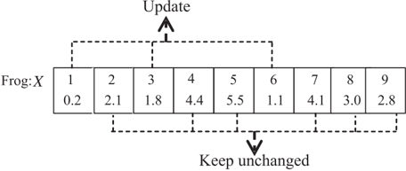

this work is adapted to cooperate in completing the optimization between the local search in clusters and the global exploration.

To further improve the solution quality, a local algorithm with strong search ability called power-law EO or PLEO is applied to the global MSFLA with a certain probability in this study. EO evolves a single individual (i.e., chromosome) S . Each decision variable in the current individual S is considered a species. The individual can update its components and evolve toward the optimal solution by always forcing mutation on the worst species successively.

The optimization process based on the global MSFLA is described as Algorithm 3, where r is a random number between (0, 1) and Pab is the probability threshold equal to 0.5 in this study. The basic EO algorithm is given in Algorithm 4 (Boettcher &amp; Percus, 1999). The global MSFLA merged with PLEO makes full use of the exploration ability of MSFLA and the exploitation ability of PLEO.

## Algorithm 3. Global MSFLA

```
Input : Population 2 Evaluate the fitness of every frog 3 Select frogs to construct memeplex by binary tournanent 4 For loop=l to GGEN do Sort the frogs in memeplex Update  Xw , generate Xw using Equ. (16) If f (Xw' ) f(Xw) Xw Xw continue Update   Xw, generate Xw Equ. (17) 10 If f (Xw ) f(Xw) Xw Xw continue 12 random 13 If r < Pab PLEO for the Xw Else 16 Xw  is replaced by a random  solution 17 Return using
```

## Algorithm 4. The EO procedure

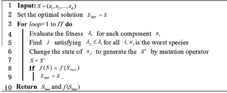

## 3.3.1. Evaluation of component

EO is performed on each route of an MDVRP solution, i.e., the frog that needs to be updated. Suppose the k th -vehicle route delivery sequence is Rk ¼ ð y 1 ; y 2 ; . . . ; yt ; y 1 Þ , where yi 2 V yi ; -yj ð i -j Þ , then the number of customers served by the k th -vehicle is equal to t /C0 1. We define the fitness as

<!-- formula-not-decoded -->

where ci j ; represents the distance between nodes i and , j c is the error coefficient and c 2 ð 1 1 5 ; : Þ in this paper, and yi min and yisub min are the closest node and the second closest node to the node yi in all nodes, respectively. Specifically, the larger the component's fitness,

the better, and the current route segment, which includes node yi , will be nearer to the shortest route. Otherwise, the component's fitness is inferior. The shortest path multiplied by the error coefficient c is used to approximate the global optimum, and the errors between them are usually small.

## 3.3.2. B. Selections for mutation node and its adjacent node

Various physical systems have generic statistical properties characterized by power-law distributions (Boettcher &amp; Percus, 1999). A power-law parameter s is introduced into EO in our algorithm (PLEO) to avoid getting stuck into a local optimum. Thus, in our optimization dynamics, a node having r -th ''small'' fitness is selected from the set of nodes according to a scale-invariance powerlaw distribution to mutate,

<!-- formula-not-decoded -->

where the rank r ranges from r ¼ 1 for the node with the smallest fitness to r ¼ t for the node with the largest fitness and the power-law exponent s is an adjustable parameter. For s ¼ 0, randomly selected nodes are forced to update, resulting in a random walk through the configuration space. For s ¼ 1 , only the extremal node with the smallest fitness is updated, which may trap the computational system to a meta-stable state (i.e., near-optimal solution).

For one individual (frog) that needs to be updated, the best adjacent node of the mutation node ought to be selected during the process of mutation. To select the best adjacent node, the reference individual is needed to determinate at first. Our algorithm mainly focuses on the excellent individuals (frogs) to select the reference individual, which will help improve the effectiveness of search. Suppose the mutation node is i , the set composed of the first J excellent individuals according to the preceding population sorting is taken into account and one individual may be chosen to be the reference individual. Thus, the adjacent point of the point i in the mutation individual is the same as the reference individual. To ensure the diversity of the search, the other nodes still have chance to be select to be the best adjacent node. Therefore, a random number u is generated to determinate whether the search is performed in the excellent individual set. If the u is smaller than the probability threshold U U ð 2 ½ 0 1 ; /C138Þ , the search is performed in the excellent individual set, otherwise the adjacent node is generated randomly. In general, the U is larger than 0.5 and close to 1, i.e., our algorithm prefers to search the excellent individual set to select the adjacent node. We choose the reference individual s by another power-law distribution if the search is carried out in the excellent individual set:

<!-- formula-not-decoded -->

where J is the size of the excellent individual set. The parameter l can be used to regulate the extent of algorithm randomness. Larger l means stronger algorithm randomness. In principle, the dynamical system can jump from one meta-stable state (corresponding to a near-optimal solution in MDVRP) to another by avalanche dynamics.

## 3.3.3. C. Mutation

In our work, some mutation operators are applied to explore the solution search space, i.e., performing moves from a current solution to another according to the mutation node and its best adjacent node. Some types of inter- and intra-route segment moves (Tarantilis, Zachariadis, &amp; Kiranoudis, 2008) are used to adjust the paths. After completing this relocation, the mutation node and its best adjacent node become adjacent. For example, this type of move exchanges two segments (or customers) between two routes (Fig. 4). Node i is the mutation node in route 1 and j is its

Fig. 4. Example for mutation.

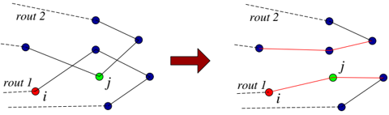

best adjacent node in route 2. After using this move, nodes i and j are in the same route and become adjacent nodes. PLEO is summarized as Algorithm 5, where PGEN is the maximum number of iterations.

## Algorithm 5. PLEO procedure

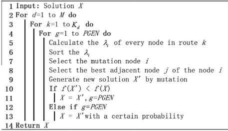

## 3.4. Cluster adjustment

After finishing the global MSFLA for population P , our algorithm adjusts the clusters according to the best solution Xg achieved by the preceding procedure. To further improve the convergence of the algorithm, the PLEO is performed on the Xg T times to achieve the better solution. The value of T should not to be set too large, otherwise, the solution has no improvement at the late stage of performing, and the operation will become time consuming. In the next step, the new clusters can be created by Xg because one solution includes all path information for MDVRP, and Xg is saved as an individual in the new frog population. The other solutions are selectively stored in new population. For one frog representing a solution, the section of the individual whose cluster allocations are the same as Xg (specific path information may be different) remains unchanged. The values of the other section of this individual are generated to meet the two conditions: the first is that the cluster allocations ought to be guaranteed to be the same as Xg , the second is that the length of the routes that are inserted and/or removed some customers should to be as short as possible. For example, as shown in Fig. 5, the cluster allocations of the Xg are different from the frog X because the customer a is allocated to the different cluster between them. The cluster adjustment is performed as follow: remove the customer a from the cluster 2 and insert it into the route 1, which includes the closet customer b to the customer a in the cluster 1. After cluster adjustment, the customer a and b are adjacent and the cluster allocations of Xg and X are the same. This process is then used to construct a new frog population. Each frog in the new population has the same cluster allocations. The cluster adjustment is shown as Algorithm 6, where d X j ð ð ÞÞ denotes the depot allocated for the j -th customer in solution X . The algorithm repeats the preceding three stages: cluster MSFLA local

Fig. 5. Example for cluster adjustment.

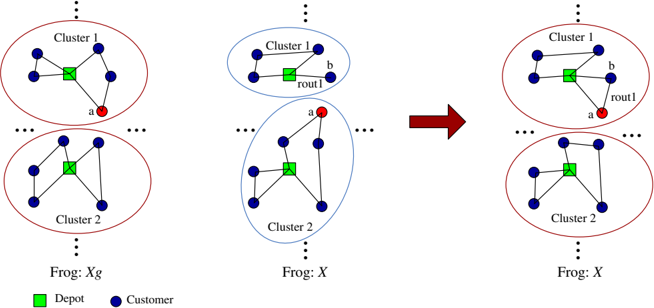

search for each cluster, global MSFLA for global optimization, and cluster adjustment. These procedures continue until the convergence criterion is satisfied.

## Algorithm 6. Cluster Adjustment

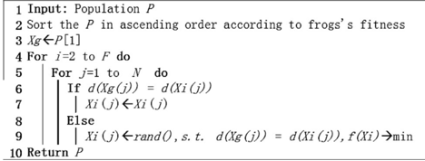

## 4. Experiments and results

Our MPMSFLA is run on the hardware (i.e., Intel Pentium 4 with 2.8 GHz CPU and 512 M memory) and software (i.e., VC++) platform. In the general framework, some general parameters are set as F ¼ 40 ; c ¼ 1 4 : ; w max ¼ 0 9 : ; w min ¼ 0 3. : The algorithm stops when the objective function value of the best solution is not improved in 50 successive repeats of the three procedures (cluster MSFLA local search, global MSFLA, and cluster adjustment). The parameters of cluster MSFLA are set as m ¼ 8 ; n ¼ 5 ; IMAX ¼ 50 ; CGEN ¼ 3. For the global MSFLA, the parameters are set as Y ¼ 9 ; GGEN ¼ 20 and Pab ¼ 0 5. : In PLEO, the parameters are set as c ¼ 1 2 : ; s ¼ 2 0 : ; J ¼ 5 ; U ¼ 0 8 : ; l ¼ 3 0, : PGEN ¼ 2. For the cluster adjustment, the parameter T is equal to 3. In accordance with our experimental results, these values are suitable to produce good solutions in terms of the processing time and the quality of the solution.

## 4.1. Multi-depot vehicle routing problem

In this section, our algorithm is tested on 33 MDVRP instances whose characteristics are summarized in Table 1, which includes algorithm of Cordeau, Gendreau, and Laporte (CGL, 1997), greedy randomized adaptive search procedure and variable neighborhood descent (GRASP/VND, Villegas &amp; Christian (2010)), parallel improved ant colony optimization (PIACO, Yu et al., 2011), and adaptive large neighborhood search (ALNS, Pisinger &amp; Ropke (2007)). The 33 published benchmark MDVRP datasets collected by Cordeau et al. (1997) were obtained from the Web site at http://neo.lcc.uma.es/radi-aeb/WebVRP. In our algorithm, the result and average run-time over 10 runs for all the randomized methods are presented. Bold entries mark the best solution quality obtained among the heuristics in the comparison in Table 1. Figs. 6-10 are the results of our algorithm for the instances: pr04, pr05, pr06, pr09, and pr10, respectively. From these results, the following conclusions can be drawn. First, our algorithm can obtain the best solution in most instances (30 out of 33 best solutions). This finding proves that our algorithm is not apt to trap to the local optima and has excellent ability to escape extremal points. Second, the meta-heuristic proposed in this article mostly outperforms the other meta-heuristics in terms of convergence speed, while the hardware environments of these meta-heuristics (GRASP/VND, ALNS, and MPMSFLA) are similar. The runtime of our algorithm spent on finding global optima is much less than that of GRASP/ VND and ALNS (PIACO did not report the runtime). For example, our algorithm can obtain the best solution for p18 within 2.12 min only, whereas GRASP/VND needs over 20 min to get the solution and ALNS achieves the inferior solution with more time. Therefore, our algorithm is suitable for solving large-scale problems.

4.2. Multi-depot vehicle routing problem with time windows

MDVRPTWis constructed based on the MDVRP with constraints of the time windows. The optimization Eq. (1) for MDVRPTW can be modified as

XX

X

X

X

<!-- formula-not-decoded -->

where pt i is the delay time of node i when serving it and f t is a penalty function which can be simply defined as adding a large constant. Therefore, the solution for the MDVRPTW is similar to that for the MDVRP. Table 2 reports the results for the MDVRPTW instances used by Cordeau, Laporte, and Mercier (2004). All instances are run five times using MPMSFLA and the results are compared with those obtained by tabu search (TS, Cordeau et al., 2004) and improved variable neighborhood search (VNS, Polacek, Benkner, Doerner, &amp; Hartl (2008)). Table 2 shows that our algorithm can achieve high quality solutions within a short runtime compared with the competing heuristics for the MDVRPTW. The average solution value of VNS is slightly smaller (approximately 0.3%) than that of our algorithm. Although VNS can obtain a more accurate average solution value, it is approximately 20 to 40 times slower than our algorithm for all instances even when the hardware of VNS is better

Table 1

Comparisons of heuristics applied to the MDVRP. Bold values are mark the best solution obtained among the heuristics in the comparison.

| Instance   | Instance   | Instance   | CGL     | GRASP/VND   | GRASP/VND   | GRASP/VND   | PIACO   | PIACO   | ALNS    | ALNS    | ALNS   | MPMSFLA   | MPMSFLA   | MPMSFLA   |
|------------|------------|------------|---------|-------------|-------------|-------------|---------|---------|---------|---------|--------|-----------|-----------|-----------|
| Name       | n          | d          | (1 run) | AVE         | BEST        | TIME        | AVE     | BEST    | AVE     | BEST    | TIME   | AVE       | BEST      | TIME      |
| p01        | 50         | 4          | 576.87  | 576.87      | 576.87      | 0.89        | 578.54  | 576.86  | 576.87  | 576.87  | 0.48   | 576.87    | 576.87    | 0.19      |
| p02        | 50         | 4          | 473.87  | 473.53      | 473.53      | 1.12        | 482.09  | 473.53  | 473.53  | 473.53  | 0.47   | 473.53    | 473.53    | 0.32      |
| p03        | 75         | 5          | 645.15  | 643.44      | 641.19      | 2.09        | 647.62  | 641.18  | 641.19  | 641.19  | 1.07   | 641.19    | 641.19    | 0.49      |
| p04        | 100        | 2          | 1006.66 | 1008.1      | 1003.62     | 3.5         | 1011.97 | 1011.49 | 1006.09 | 1001.04 | 1.47   | 1002.05   | 1001.04   | 0.57      |
| p05        | 100        | 2          | 753.34  | 752.54      | 751.15      | 3.13        | 767.46  | 750.26  | 752.34  | 751.26  | 2      | 750.41    | 750.03    | 0.86      |
| p06        | 100        | 3          | 877.84  | 884.42      | 880.69      | 3.51        | 898.5   | 876.5   | 883.01  | 876.7   | 1.55   | 878.01    | 876.50    | 0.66      |
| p07        | 100        | 4          | 891.95  | 892.59      | 888.65      | 3.55        | 889.25  | 885.69  | 889.36  | 881.97  | 1.47   | 884.63    | 881.97    | 0.5       |
| p08        | 249        | 2          | 4482.44 | -           | -           | -           | 4659.62 | 4482.38 | 4421.03 | 4390.8  | 5.55   | 4398.89   | 4372.78   | 2.15      |
| p09        | 249        | 3          | 3920.85 | -           | -           | -           | 4130.79 | 3912.23 | 3892.5  | 3873.64 | 6      | 3895.27   | 3860.28   | 2.12      |
| p10        | 249        | 4          | 3714.65 | -           | -           | -           | 3749.16 | 3663    | 3666.85 | 3650.04 | 6.01   | 3665.5    | 3634.76   | 2.09      |
| p11        | 249        | 5          | 3580.84 | -           | -           | -           | 3798.31 | 3554.08 | 3573.23 | 3546.06 | 5.99   | 3581.59   | 3546.06   | 2.18      |
| p12        | 80         | 2          | 1318.95 | 1318.95     | 1318.95     | 2.2         | 1330.31 | 1318.95 | 1319.13 | 1318.95 | 1.25   | 1319.56   | 1318.95   | 0.61      |
| P13        | 80         | 2          | 1318.95 | -           | -           | -           | 1343.73 | 1318.95 | 1318.95 | 1318.95 | 1.01   | 1318.95   | 1318.95   | 0.64      |
| P14        | 80         | 2          | 1360.12 | -           | -           | -           | 1394.58 | 1365.68 | 1360.12 | 1360.12 | 0.99   | 1360.12   | 1360.12   | 0.65      |
| p15        | 160        | 4          | 2534.13 | 2508.05     | 2505.42     | 9.3         | 2603.17 | 2551.45 | 2519.64 | 2505.42 | 4.22   | 2509.25   | 2505.42   | 1.87      |
| p16        | 160        | 4          | 2572.23 | -           | -           | -           | 2580.42 | 2572.23 | 2573.95 | 2572.23 | 3.02   | 2574.16   | 2572.23   | 1.84      |
| p17        | 160        | 4          | 2720.23 | -           | -           | -           | 2746.41 | 2708.99 | 2709.09 | 2709.09 | 2.98   | 2709.24   | 2709.09   | 1.85      |
| p18        | 240        | 6          | 3710.49 | 3737.64     | 3702.82     | 22.72       | 4082.07 | 3781.03 | 3736.53 | 3702.85 | 6.98   | 3728.23   | 3702.85   | 2.12      |
| p19        | 240        | 6          | 3827.06 | -           | -           | -           | 4017.3  | 3827.06 | 3838.76 | 3827.06 | 5.25   | 3832.95   | 3827.06   | 2.15      |
| p20        | 240        | 6          | 4058.07 | -           | -           | -           | 4395.7  | 4097.06 | 4064.76 | 4058.07 | 5.02   | 4064.11   | 4058.07   | 2.16      |
| p21        | 360        | 9          | 5535.99 | 5522.02     | 5490.55     | 52.96       | 5947.82 | 5474.84 | 5501.58 | 5474.84 | 9.7    | 5501.76   | 5474.84   | 3.11      |
| P22        | 360        | 9          | 5716.01 | -           | -           | -           | 6196.03 | 5772.23 | 5722.19 | 5702.16 | 7.52   | 5722.39   | 5702.16   | 3.14      |
| P23        | 360        | 9          | 6139.73 | -           | -           | -           | 6283.54 | 6125.58 | 6092.66 | 6078.75 | 7.38   | 6084.67   | 6078.75   | 3.08      |
| pr01       | 48         | 4          | 861.32  | -           | -           | -           | -       | -       | 861.32  | 861.32  | 0.5    | 861.32    | 861.32    | 0.29      |
| pr02       | 96         | 4          | 1314.99 | -           | -           | -           | -       | -       | 1308.17 | 1307.34 | 1.72   | 1307.95   | 1307.34   | 0.6       |
| pr03       | 144        | 4          | 1815.62 | -           | -           | -           | -       | -       | 1810.66 | 1806.6  | 3.57   | 1807.58   | 1803.80   | 0.98      |
| pr04       | 192        | 4          | 2094.24 | -           | -           | -           | -       | -       | 2073.16 | 2060.93 | 4.93   | 2068.14   | 2058.31   | 1.44      |
| pr05       | 240        | 4          | 2408.1  | -           | -           | -           | -       | -       | 2350.31 | 2337.84 | 6.2    | 2345.58   | 2331.20   | 2.41      |
| pr06       | 288        | 4          | 2768.13 | -           | -           | -           | -       | -       | 2695.74 | 2687.6  | 7.75   | 2693.56   | 2677.64   | 2.52      |
| pr07       | 72         | 6          | 1092.12 | -           | -           | -           | -       | -       | 1089.56 | 1089.56 | 0.97   | 1089.75   | 1089.56   | 0.49      |
| pr08       | 144        | 6          | 1676.26 | -           | -           | -           | -       | -       | 1675.74 | 1664.85 | 3.45   | 1665.95   | 1664.85   | 1.38      |
| pr09       | 216        | 6          | 2176.79 | -           | -           | -           | -       | -       | 2144.84 | 2136.42 | 5.83   | 2141.18   | 2133.20   | 2.08      |
| pr10       | 288        | 6          | 3089.62 | -           | -           | -           | -       | -       | 2905.43 | 2889.82 | 7.58   | 2893.08   | 2868.26   | 2.68      |

Name: instance name; n : the number of customers that have to be served; d : the number of depots; CGL: algorithm of Cordeau et al., run on a Sun Sparcstation 10; GRASP/ VND: algorithm of Villegas et al., run on hardware: 3.4 GHz Pentium D; PIACO: algorithm of Yu et al.; ALNS: Pisinger and Ropke, run on hardware: 3 GHz Pentium 4. All computation time reported in minutes.

Fig. 6. The result of the instance pr04 (2058.31).

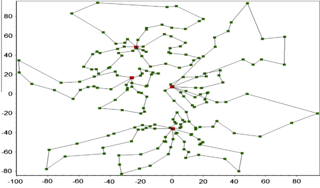

than that of our algorithm. TS with hardware, which is slightly inferior to our algorithm, is considerably slower than MPMSFLA.

The number of frogs in the population can be adjusted to further improve the precision of our algorithm. As shown in Table 3, our algorithm is run with three groups of parameters, where F is equal to 20, 100, and 150, for the eight MDVRPTW and eight

MDVRP instances, where the numbers of customers are over 200. The average solution value of the algorithm becomes more accurate as the number of frogs increases. For the MDVRPTW, the precision of the MPMSFLA surpasses that of VNS when F is equal to 100. However, the runtime of the MPMSFLA is still less than that of VNS. For the pr06 instance, the MPMSFLA achieves the average

Fig. 7. The result of the instance pr05 (2331.20).

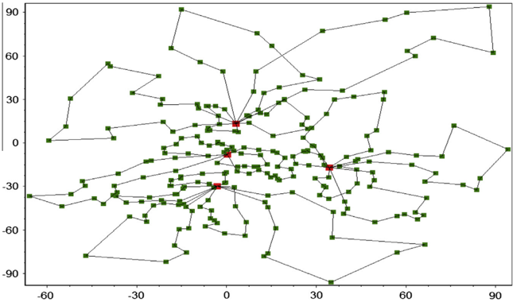

Fig. 9. The result of the instance pr09 (2133.20).

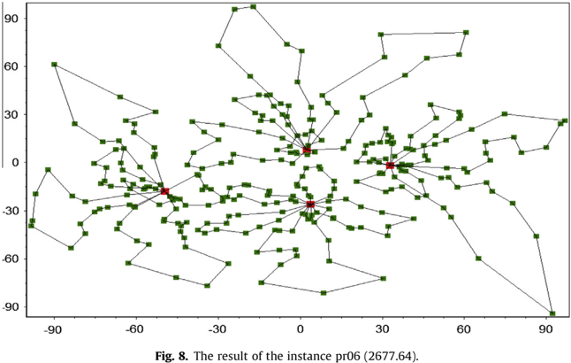

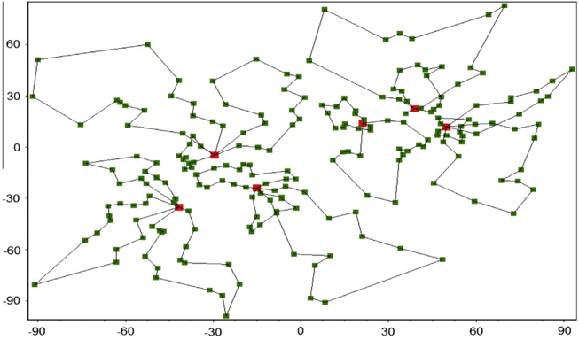

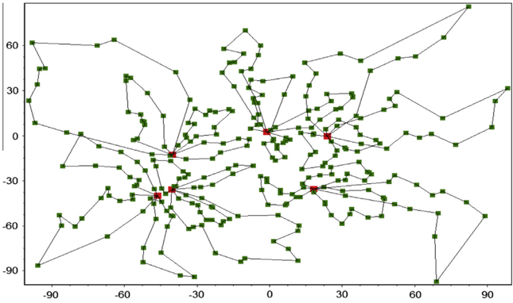

Fig. 10. The result of the instance pr10 (2868.26).

Table 2 Comparisons of heuristics applied to the MDVRPTW.

| Instance   | Instance   | Instance   | Improved TS   | Improved TS   | VNS     | VNS      | MPMSFLA   | MPMSFLA   | MPMSFLA   |
|------------|------------|------------|---------------|---------------|---------|----------|-----------|-----------|-----------|
| Name       | n          | d          | BEST          | TIME (m)      | AVE     | TIME (m) | AVE       | TIME (m)  | Gap (%)   |
| pr01       | 48         | 4          | 1074.12       | 28            | 1074.12 | 9.49     | 1074.34   | 0.45      | 0.02      |
| pr02       | 96         | 4          | 1762.48       | 79            | 1763.66 | 27.63    | 1768.23   | 1.42      | 0.26      |
| pr03       | 144        | 4          | 2397.06       | 115           | 2388.73 | 75.88    | 2378.97   | 2.96      | /C0 0.41  |
| pr04       | 192        | 4          | 2865.71       | 144           | 2847.56 | 93.53    | 2858.35   | 4.21      | 0.38      |
| pr05       | 240        | 4          | 3050.8        | 181           | 3015.27 | 89.36    | 3021.56   | 4.89      | 0.21      |
| pr06       | 288        | 4          | 3670.13       | 221           | 3674.6  | 96.63    | 3685.28   | 6.33      | 0.29      |
| pr07       | 72         | 6          | 1418.22       | 53            | 1418.22 | 7.66     | 1418.78   | 1.89      | 0.04      |
| pr08       | 144        | 6          | 2118.5        | 102           | 2103.21 | 54.92    | 2111.47   | 3.07      | 0.39      |
| pr09       | 216        | 6          | 2760.46       | 160           | 2753.61 | 69.11    | 2770.61   | 3.85      | 0.61      |
| pr10       | 288        | 6          | 3507.26       | 227           | 3541.01 | 65.7     | 3555.86   | 6.97      | 0.42      |
| pr11       | 48         | 4          | 1016.59       | 32            | 1011.65 | 18.3     | 1009.7    | 0.48      | /C0 0.19  |
| pr12       | 96         | 4          | 1486.26       | 81            | 1488.32 | 89.4     | 1489.11   | 1.9       | 0.05      |
| pr13       | 144        | 4          | 2028.85       | 143           | 2012.37 | 82.3     | 2026.47   | 3.25      | 0.70      |
| pr14       | 192        | 4          | 2228.64       | 188           | 2239.02 | 106.51   | 2242.89   | 4.16      | 0.17      |
| pr15       | 240        | 4          | 2527.6        | 227           | 2498.85 | 89.39    | 2508.28   | 4.88      | 0.38      |
| pr16       | 288        | 4          | 2960.93       | 261           | 2909.45 | 99.69    | 2930.14   | 6.86      | 0.71      |
| pr17       | 72         | 6          | 1241.25       | 61            | 1247.51 | 62.15    | 1240.19   | 1.6       | /C0 0.59  |
| pr18       | 144        | 6          | 1823.24       | 146           | 1809.25 | 99.24    | 1815.74   | 3.07      | 0.36      |
| pr19       | 216        | 6          | 2288.38       | 262           | 2294.19 | 90.84    | 2300.65   | 4.29      | 0.28      |
| pr20       | 288        | 6          | 3120.32       | 263           | 3093.51 | 86.38    | 3109.12   | 6.64      | 0.50      |

Name: instance name; n : the number of customers that have to be served; d : the number of depots; Improve TS: algorithm of Cordeau et al., run on hardwork: 2 GHz Pentium 4 CPU; VNS: algorithm of Polacek et al., run on Pentium 3.6 GHz dual processor computer; Gap (%): the average deviation (in %) above the value obtained by VNS. All computation time reported in minutes.

Table 3 Results of MPMSFLA with different parameters for large-scale problem.

| Instance       | Instance   | F ¼ 20   | F ¼ 20   | F ¼ 100   | F ¼ 100   | VNS     | VNS      | F ¼ 150   | F ¼ 150   |
|----------------|------------|----------|----------|-----------|-----------|---------|----------|-----------|-----------|
| Name (MDVRPTW) | N          | AVE      | TIME (m) | AVE       | TIME (m)  | AVE     | TIME (m) | AVE       | TIME (m)  |
| pr05           | 240        | 3094.57  | 2.88     | 3013.35   | 13.18     | 3015.27 | 89.36    | 2996.22   | 18.73     |
| pr06           | 288        | 3722.15  | 3.05     | 3638.47   | 14.58     | 3674.6  | 96.63    | 3612.2    | 21.68     |
| pr09           | 216        | 2802.24  | 2.33     | 2745.14   | 12.09     | 2753.61 | 69.11    | 2735.45   | 15.52     |
| pr10           | 288        | 3627.98  | 3.29     | 3507.28   | 14.96     | 3541.01 | 65.7     | 3490.37   | 22.25     |
| pr15           | 240        | 2584.14  | 2.71     | 2472.33   | 12.97     | 2498.85 | 89.39    | 2451.62   | 19.17     |
| pr16           | 288        | 2995.61  | 3.07     | 2865.73   | 15.15     | 2909.45 | 99.69    | 2849.68   | 21.76     |
| pr19           | 216        | 2367.47  | 2.25     | 2278.68   | 12.4      | 2294.19 | 90.84    | 2269.21   | 16.03     |
| pr20           | 288        | 3189.25  | 3.28     | 3039.22   | 13.95     | 3093.51 | 86.38    | 3009.94   | 22.85     |
| Instance       | Instance   |          |          |           |           | ALNS    | ALNS     |           |           |
| Name (MDVRP)   | N          |          |          |           |           | AVE     | TIME (m) |           |           |
| p08            | 249        | 4435.25  | 1.18     | 4383.29   | 6.55      | 4390.8  | 5.55     | 4379.51   | 11.58     |
| p09            | 249        | 3928.39  | 1.13     | 3882.68   | 6.42      | 3892.5  | 6        | 3870.34   | 12.65     |
| p21            | 360        | 5554.11  | 1.72     | 5492.17   | 9.59      | 5501.58 | 9.7      | 5477.17   | 17.28     |
| P22            | 360        | 5759.29  | 1.67     | 5716.22   | 9.88      | 5722.19 | 7.52     | 5708.25   | 17.54     |
| pr05           | 240        | 2379.83  | 1.39     | 2338.2    | 6.4       | 2350.31 | 6.2      | 2333.12   | 10.53     |
| pr06           | 288        | 2543.21  | 1.49     | 2690.17   | 7.49      | 2695.74 | 7.75     | 2682.35   | 14.12     |
| pr09           | 216        | 2161.12  | 1.12     | 2138.88   | 5.88      | 2144.84 | 5.83     | 2134.29   | 10.33     |
| pr10           | 288        | 2936.43  | 1.52     | 2887.48   | 7.58      | 2905.43 | 7.58     | 2877.53   | 14.87     |

Fig. 11. Average solution costs for Pr03 and Pr06.

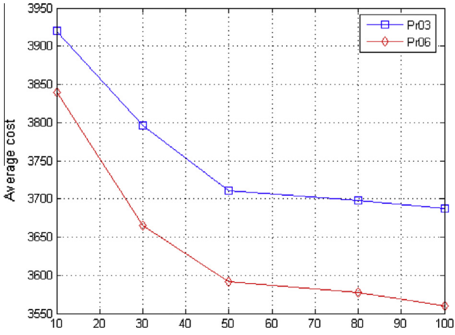

Fig. 12. Average running times for Pr03 and Pr06.

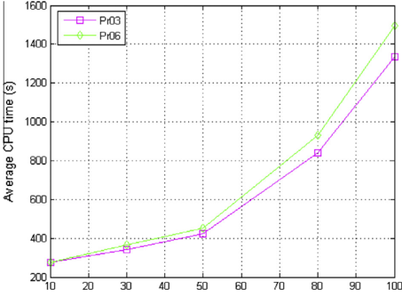

solution value of 3638.47 within a runtime of 14.58 min, whereas VNS needs longer runtime and obtains inferior solution. The similar conclusions can be drawn for the MDVRP. For the p08 instance, when F is equal to 100, our algorithm achieves the average solution value of 4383.29 within a runtime of 6.55 min, whereas ALNS obtains inferior solution within about the same runtime. Therefore, our algorithm is suitable for solving large-scale problems.

In the current work, we also investigate the effect of different convergence criteria on the solving efficiency of the MPMSFLA while taking the MDVRPTW Pr06 and Pr10 instances into account. The algorithm stops when the convergence criterion, in which the objective function value is not improved in Z successive local search and global MSFLA procedure (i.e., three procedure), is satisfied. As shown in Fig.11, the X -axis denotes the parameter Z ; the precision of the algorithm improves with increasing Z . Nevertheless, the extent of improvement reduces quickly when Z &gt; 50. Fig.12 shows the average runtime of the MPMSFLA, which is a snapshot for some values of Z . The curves show that the runtime rises steadily on the initial stage but rises quickly when Z is too large. Therefore, Z is usually less than 50.

## 4.3. Capacitated vehicle routing problem

The Capacitated Vehicle Routing Problem (CVRP) is a special case of multi-depot vehicle routing problems, when the number of depot is equal to 1. Our algorithm can thus be used to address the CVRP with very minor changes in the distance measure and the parameters. Table 4 contains the results found on the instances suggested in literature (Christofides, Mingozzi, &amp; Toth, 1979) and a comparison with algorithms (Nagata &amp; Braysy, 2009; Subramanian, Uchoa, &amp; Ochi, 2013). The 14 classical benchmark problems can be divided both in random (p1-10) and clustered problems (p11-14) and in problems without (p1-5 and 11-12) and with maximum tour length constraint (p6-10 and 13-14). Our algorithm can obtain high quality solutions in a short time and the average gap between the average solutions found by MPMSFLA and the best solutions is very small.

The 20 large scale CVRP benchmarks of Golden, Wasil, Kelly, and Chao (1998) consist of 200-483 customers with geometric symmetry. The first eight instances have route-length restrictions. From the remaining 12 problems, four problems have customers located in concentric squares with the depot located in one corner, four problems have customers located in concentric squares around the depot, and four problems have customers located in a six-pointed star around the depot. Table 5 illustrates a comparison, in terms of best solution and average solution between the results obtained by MPMSFLA and those found in literatures (Subramanian et al., 2013; Zachariadis &amp; Kiranoudis, 2010) for the instances of

Table 4 Results found for the CVRP instances of Christofides et al.

| Instance   | Instance   | Subramanian et al.   | Subramanian et al.   | Subramanian et al.   | Nagata and Braysy (2009)   | Nagata and Braysy (2009)   | Nagata and Braysy (2009)   | MPMSFLA   | MPMSFLA   | MPMSFLA   |
|------------|------------|----------------------|----------------------|----------------------|----------------------------|----------------------------|----------------------------|-----------|-----------|-----------|
| Name       | n          | BEST                 | AVE                  | TIME (s)             | BEST                       | AVE                        | TIME (s)                   | BEST      | AVE       | TIME (s)  |
| p1         | 50         | 524.61               | 524.61               | 1.48                 | 524.61                     | 524.61                     | 12                         | 524.61    | 524.61    | 8.9       |
| p2         | 75         | 835.26               | 835.26               | 13.52                | 835.26                     | 835.26                     | 63                         | 835.26    | 835.26    | 12.25     |
| p3         | 100        | 826.14               | 826.14               | 12.49                | 826.14                     | 826.14                     | 31                         | 826.14    | 826.14    | 17.19     |
| p4         | 150        | 1028.42              | 1028.73              | 53.48                | 1028.42                    | 1028.51                    | 136                        | 1028.42   | 1028.48   | 34.22     |
| p5         | 199        | 1291.45              | 1293.18              | 625.17               | 1291.29                    | 1293.93                    | 720                        | 1291.29   | 1292.75   | 69.28     |
| p6         | 50         | 555.43               | 556.49               | 0.93                 | -                          | -                          | -                          | 555.43    | 556.43    | 8.9       |
| p7         | 75         | 909.68               | 910                  | 5.05                 | -                          | -                          | -                          | 909.68    | 909.68    | 12.05     |
| p8         | 100        | 865.94               | 865.94               | 7.61                 | -                          | -                          | -                          | 865.94    | 865.94    | 17.08     |
| p9         | 150        | 1162.55              | 1164.11              | 82.5                 | -                          | -                          | -                          | 1162.55   | 1163.25   | 34.22     |
| p10        | 199        | 1395.85              | 1402.03              | 496.07               | -                          | -                          | -                          | 1395.85   | 1400.34   | 69.28     |
| p11        | 120        | 1042.11              | 1042.11              | 20.66                | 1042.11                    | 1042.11                    | 30                         | 1042.11   | 1042.18   | 39.63     |
| p12        | 100        | 819.56               | 819.56               | 5.23                 | 819.56                     | 819.56                     | 5                          | 819.56    | 819.56    | 15.35     |
| p13        | 120        | 1541.14              | 1544.07              | 80.24                | -                          | -                          | -                          | 1541.14   | 1543.17   | 38.4      |
| p14        | 100        | 866.37               | 866.37               | 7.12                 | -                          | -                          | -                          | 866.37    | 866.37    | 32.1      |

Name: instance name; n : the number of customers that have to be served; d : the number of depots; Subramanian et al. (2013), executed on an Intel Core i7 with 2.93 GHz and 8 GB of RAM running under Ubuntu Linux 64 bits; Nagata and Braysy (2009), tested with a Xeon 3.2 GHz processor (1 GB RAM) computer. All computation time reported in seconds.

Table 5

Results found for the CVRP instances of Golden et al.

| Instance   | Instance   | Zachariadis et al.   | Zachariadis et al.   | Zachariadis et al.   | Subramanian et al.   | Subramanian et al.   | Subramanian et al.   | MPMSFLA   | MPMSFLA   | MPMSFLA   |
|------------|------------|----------------------|----------------------|----------------------|----------------------|----------------------|----------------------|-----------|-----------|-----------|
| Name       | n          | BEST                 | AVE                  | TIME (s)             | BEST                 | AVE                  | TIME (s)             | BEST      | AVE       | TIME (s)  |
| p1         | 240        | 5626.81              | 5637.99              | 907.7                | 5657.74              | 5671.65              | 994.59               | 5625.2    | 5633.24   | 409.28    |
| p2         | 320        | 8447.92              | 8457.92              | 1249.4               | 8447.92              | 8449.82              | 2659.68              | 8412.25   | 8448.39   | 788.57    |
| p3         | 400        | 11,036.22            | 11,036.22            | 1164                 | 11036.22             | 11036.22             | 6064.98              | 11,036.22 | 11,036.22 | 898.35    |
| p4         | 480        | 13,624.53            | 13,632.59            | 1019                 | 13624.53             | 13624.53             | 10644.5              | 13,624.53 | 13,630.91 | 905.37    |
| p5         | 200        | 6460.98              | 6460.98              | 989.6                | 6460.98              | 6460.98              | 978.69               | 6460.98   | 6460.98   | 389.44    |
| p6         | 280        | 8412.9               | 8412.9               | 1091.6               | 8412.9               | 8412.9               | 2455.56              | 8412.9    | 8412.9    | 618.05    |
| p7         | 360        | 10,169.26            | 10,192.47            | 1885.5               | 10195.58             | 10195.6              | 4410.84              | 10,128.38 | 10,151.23 | 891.2     |
| p8         | 440        | 11,651.67            | 11,674.43            | 1657.4               | 11710.47             | 11774.4              | 7541.75              | 11,638.27 | 11,649.38 | 918.46    |
| p9         | 255        | 581.28               | 584.66               | 854                  | 583.24               | 585.21               | 1720.76              | 579.71    | 582.68    | 418.12    |
| p10        | 323        | 738.57               | 739.86               | 1635.3               | 741.96               | 744.17               | 3229.35              | 736.58    | 738.64    | 804.33    |
| p11        | 399        | 916.99               | 919.52               | 1418.8               | 921.46               | 922.93               | 5978.97              | 913.1     | 915.17    | 924.85    |
| p12        | 483        | 1105.93              | 1110.65              | 1197.5               | 1113.3               | 1116.52              | 10410.7              | 1103.71   | 1111.59   | 929.48    |
| p13        | 252        | 858.45               | 860.44               | 1214.6               | 857.19               | 860                  | 910.35               | 857.19    | 860.15    | 486.28    |
| p14        | 320        | 1081.05              | 1083.55              | 1198.2               | 1080.55              | 1082.15              | 1513.32              | 1080.55   | 1082.31   | 769.47    |
| p15        | 396        | 1341.46              | 1344.41              | 1676.2               | 1347.13              | 1349.23              | 3265.68              | 1340.26   | 1343.28   | 876.59    |
| p16        | 480        | 1617.48              | 1623.42              | 1327                 | 1624.55              | 1627.76              | 4835.12              | 1615.39   | 1620.75   | 408.6     |
| p17        | 240        | 707.76               | 708.94               | 1119.8               | 707.76               | 707.81               | 937.59               | 707.76    | 708.12    | 431.27    |
| p18        | 300        | 996.55               | 997.74               | 1364.3               | 995.65               | 997.85               | 2297.62              | 995.13    | 997.14    | 714.31    |
| p19        | 360        | 1366.75              | 1370.77              | 2278.8               | 1366.29              | 1367.25              | 2917.31              | 1366.29   | 1369.73   | 854.25    |
| p20        | 420        | 1824.46              | 1829.57              | 1424.9               | 1821.16              | 1823.52              | 4997.31              | 1818.68   | 1826.65   | 905.56    |

Name: instance name; n : the number of customers that have to be served; d : the number of depots; Zachariadis and Kiranoudis (2010), runs on a T5500 1.66 GHz; Subramanian et al. (2013), executed on an Intel Core i7 with 2.93 GHz and 8 GB of RAM running under Ubuntu Linux 64 bits. All computation time reported in seconds.

Fig. 13. The result of the instance p20 (1818.68).

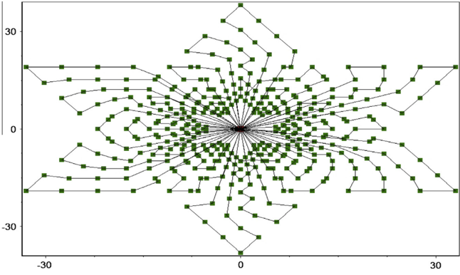

Golden et al. (1998). It can be seen that the MPMSFLA outperforms the algorithms of Subramanian et al. and Zachariadis et al. Our algorithm can obtain similar accuracy in a shorter period of time. Fig.13 is the result for the instance p20. Therefore, our algorithm is suitable for solving large-scale problems.

## 5. Conclusion

adjustment is performed to generate new clusters according to the best solution achieved by the preceding process. These processes continue until the convergence criterion is satisfied. The experimental results prove that the proposed algorithm can achieve a high quality solution within a short runtime compared with the competing algorithms for the MDVRP/MDVRPTW and the CVRP. Therefore, our algorithm is suitable for solving largescale problems.

In this work, a multi-phase modified SFLA (MPMSFLA) is presented to solve the MDVRP more quickly. The proposed algorithm initially adopts the K -means algorithm to execute the clustering analyses for all customers. The algorithm implements the local depth search using the cluster MSFLA for each cluster, selects good individuals (frogs) through binary tournament to construct a new population, and then performs a global optimization for all customers and depots using the global MSFLA. Afterward, cluster

## Acknowledgment

This work is supported by the National Natural Science Foundation of China under Grant Nos. 61301298, 61171124 and 61005049 and the Scientific Research and Development Foundation of Shenzhen under Grant Nos. JCYJ20120613161222123 and JCYJ2013032911062410.

## Appendix: Acronyms and Nomenclature

VRP

Vehicle Routing Problem

CVRP

Capacitated Vehicle Routing Problem

MDVRP

Multi-Depot Vehicle Routing Problem

MDVRPTW

MDVRP with Time Windows

MA

Memetic algorithm

GA

Genetic Algorithms

PSO

Particle Swarm Opimization

SFLA

Shuffled Frog Leaping Algorithm

MSFLA

Modified SFLA

MPMSFLA

Multi-Phase MSFLA

EO

Extremal Optimization

PLEO

Power Law EO

MDVRP general parameters

G

Graph for the formulation of the MDVRP, G={C,D,E }

C

Customer vertex set

D

Depot vertex set

E

Set of arcs of G

V

Set of nodes of G V={CUD , }

ci j ;

Distance between point i and j point

M

Number of depots

N

Number of customers

Kd

Maximum vehicle number of depot d

X ¼ f x 1 ; x 2 ; . . . ; xN g

One solution (frog)

Algorithm general parameters

P

Population including F frogs

F

Number of frogs

m

Number of memeplexes

n

Number of frogs in each memeplex

c

Leaping coefficent of frog

w

Inertia weight

Xw

The worst frog in memeplex

Xb

The best frog in memeplex

Xg

The best frog in population

f ð X Þ

Fitness of frog X ,i.e., total distance traveled by all vehicles in solution X

Cluster MSFLA

IMAX

Number of shuffling iterations

CGEN

Number of iterations within memeplex

f d ð x Þ

Total distance traveled by the vehicles within cluster d

Global MSFLA

Y

Size of the only memeplex

e

Tournament size

GGEN

Number of iteration within memeplex

Pab

Probability threshold to use PLEO

PLEO

PGEN

Maximum number of iterations

k i

Finess of component xi

c

Error coefficient

s l ;

Power law exponent

J

Size of the excellent individual set

U

Probability threshold

Cluster adjustments

d X i ð ð ÞÞ

Depot allocated for the i-th customer in solution X

## References

Boettcher, S., &amp; Percus, A.G. (1999). Extremal optimization: Methods derived from co-evolution. In Proceedings of the genetic and evolutionary computation conference . New York, USA (pp. 101-106).

Boettcher, S. (2005). Extremal optimization for the Sherrington-Kirkpatrick spin glass. European Physics Journal B, 46 , 501-505.

- Chen, F., &amp; Wang, L. (2012). An effective shuffled frog-leaping algorithm for resource-constrained project scheduling problem. Computers &amp; Operations Research, 39 (5), 890-901.
- Chen, M. R., &amp; Lu, Y. Z. (2008). A novel elitist multi-objective optimization algorithm: Multiobjective extremal optimization. European Journal of Operational Research, 188 (3), 637-651.
- Christofides, N., Mingozzi, A., &amp; Toth, P. (1979). The vehicle routing problem. In Combinatorial optimization (pp. 315-338). Chichester, UK: Wiley.
- Cordeau, J. F., Gendreau, M., &amp; Laporte, G. (1997). A tabu search heuristic for periodic and multi-depot vehicle routing problems. Networks, 30 (2), 105-119.
- Cordeau, J. F., Laporte, G., &amp; Mercier, A. (2004). An improved tabu search algorithm for the handling of route duration constraints in vehicle routing problems with time windows. Journal of the Operational Research Society, 55 (5), 542-546.

Crevier, B., Cordeau, J., &amp; Laporte, G. (2007). The multi-depot vehicle routing problem with inter-depot routes. European Journal of Operational Research, 176 (2), 756-773.

Dantzig, G., &amp; Ramser, J. (1959). The truck dispatching problem. Management Science, 6 (1), 80-91.

- Eusuff, M., &amp; Lansey, K. (2003). Optimization of water distribution network design using the shuffled frog leaping algorithm. Journal of Water Resources Planning and Management, 129 (3), 10-25.
- Ghoseiri, K., &amp; Ghannadpour, S. F. (2010). A hybrid genetic algorithm for multidepot homogenous locomotive assignment with time windows. Applied Soft Computing, 10 (1), 53-65.
- Golden, B. L., Wasil, E. A., Kelly, J. P., &amp; Chao, I.-M. (1998). Metaheuristics in vehicle routing. In Fleet management and logistics (pp. 33-56). Boston: Kluwer.
- Li, N., &amp; Zou, T. (2004). Particle swarm optimization for vehicle routing problem. Journal of Systems Engineering, 19 (6), 596-600.
- Li, X., Luo, J. P., Chen, M. R., &amp; Wang, N. (2012). An improved shuffled frog-leaping algorithm with extremal optimization for continuous optimization. Information Sciences, 192 , 143-151.
- Liu, R., Jiang, Z. B., Fung, R. Y. K., Chen, F., &amp; Liu, X. (2010). Two-phase heuristic algorithms for full truckloads multi-depot capacitated vehicle routing problem in carrier collaboration. Computers &amp; Operations Research, 37 (11), 950-959.
- Luo, J. P., Li, X., &amp; Chen, M. R. (2011). Improved shuffled frog leaping algorithm for solving CVRP. Journal of Electronics &amp; Information Technology, 33 (2), 429-434.
- MacQueen, J. (1967). Some methods for classification and analysis of multivariate observations. In Fifth Berkeley symposium on mathematics, statistics and probability (pp. 281-297). University of California Press.
- Merz, P., &amp; Freisleben, B. (1997). A genetic local search approach to the quadratic assignment problem. In C. T. Back (Ed.), Proceedings of the 7th international
- conference on genetic algorithms (pp. 465-472). San Diego, CA: Morgan Kaufmann.
- Mirabi, M., Fatemi Ghomi, S. M. T., &amp; Jolai, F. (2010). Efficient stochastic hybrid heuristics for the multi-depot vehicle routing problem. Robotics and ComputerIntegrated Manufacturing, 26 (6), 564-569.
- Nagata, Y., &amp; Braysy, O. (2009). Edge assembly-based memetic algorithm for the capacitated vehicle routing problem. Networks, 54 (4), 205-215.
- Ombuki-Berman, B., &amp; Hanshar, F. T. (2009). Using genetic algorithms for multidepot vehicle routing. Studies in Computational Intelligence: Bio-inspired Algorithms for the Vehicle Routing Problem, 161 , 77-99.
- Pisinger, D., &amp; Ropke, S. (2007). A general heuristic for vehicle routing problems. Computers &amp; Operations Research, 34 (8), 2403-2435.
- Perez, I., Gomez-Gonzalez, M., &amp; Jurado, F. (2013). Estimation of induction motor parameters using shuffled frog-leaping algorithm. Electrical Engineering, 95 (3), 267-275.
- Polacek, M., Benkner, S., Doerner, K. F., &amp; Hartl, R. F. (2008). A cooperative and adaptive variable neighborhood search for the multi depot vehicle routing problem with time windows. BuRBusiness Research, 1 (2), 207-218.
- Reddy, A., Srinivasa &amp; Vaisakh, K. (2013). Shuffled differential evolution for large scale economic dispatch. Electric Power Systems Research, 96 , 237-245.
- Renaud, J., Laporte, G., &amp; Boctor, F. F. (1996). A tabu search heuristic for the multidepot vehicle routing problem. Computers &amp; Operations Research, 23 (3), 229-235.
- Roy, P., Roy, P., &amp; Chakrabarti, A. (2013). Modified shuffled frog leaping algorithm with genetic algorithm crossover for solving economic load dispatch problem with valve-point effect. Applied Soft Computing, 13 (11), 4244-4252.
- Salhi, S., &amp; Thangiah, S. R. (2001). An adaptive heuristic for the multi depot vehicle routing problem. Applied Artificial Intelligence, 15 (4), 361-383.
- Subramanian, A., Uchoa, E., &amp; Ochi, L. S. (2013). A hybrid algorithm for a class of vehicle routing problems. Computers &amp; Operations Research, 40 , 2519-2531.
- Tarantilis, C. D., Zachariadis, E. E., &amp; Kiranoudis, C. T. (2008). A hybrid guided local search for the vehicle routing problem with intermediate replenishment facilities. INFORMS Journal on Computing, 20 (1), 154-168.
- Tillman, F. (1969). The multiple terminal delivery problem with probabilistic demands. Transportation Science, 3 (3), 192-204.
- Villegas, J. G., &amp; Christian, P. (2010). GRASP/VND and multi-start evolutionary local search for the single truck and trailer routing problem with satellite depots. Engineering Applications of Artificial Intelligence, 23 (5), 780-794.
- Yu, B., Yang, Z. Z., &amp; Xie, J. X. (2011). A parallel improved ant colony optimization for multi-depot vehicle routing problem. Journal of the Operational Research Society, 62 , 183-188.
- Zachariadis, E. E., &amp; Kiranoudis, C. T. (2010). A strategy for reducing the computational complexity of local search-based methods for the vehicle routing problem. Computers &amp; Operations Research, 37 (12), 2089-2105.
- Zhang, L., Zhao, F., Sun, J., &amp; Shi, X. (2010). Multi-depot vehicle routing problem of wartime spare parts and its genetic algorithm solution. Computer Applications and Software, 27 (2), 194-197.