## Leveraging Machine Learning to Solve the Vehicle Routing Problem with Time Windows

by

## Julie Poullet

M.Eng, Ecole Polytechnique (2018)

Submitted to the Sloan School of Management in partial fulfillment of the requirements for the degree of

Master of Science in Operations Research at the

MASSACHUSETTS INSTITUTE OF TECHNOLOGY

May 2020

- ○ c Massachusetts Institute of Technology 2020. All rights reserved.

Author . . . . . . . . . . . . . . . . . . . . . . . . . . . . . . . . . . . . . . . . . . . . . . . . . . . . . . . . . . . . . . . . . . . . . .

Sloan School of Management April 30 th , 2020

Certified by. . . . . . . . . . . . . . . . . . . . . . . . . . . . . . . . . . . . . . . . . . . . . . . . . . . . . . . . . . . . . . . . . .

Matthias Winkenbach Research Scientist Thesis Supervisor

Accepted by . . . . . . . . . . . . . . . . . . . . . . . . . . . . . . . . . . . . . . . . . . . . . . . . . . . . . . . . . . . . . . . . .

Patrick Jaillet

Dugald C. Jackson Professor, Department of Electrical Engineering and Computer Science

Co-director, Operations Research Center

## Leveraging Machine Learning to Solve the Vehicle Routing Problem with Time Windows

by

## Julie Poullet

Submitted to the Sloan School of Management on April 30 th , 2020, in partial fulfillment of the requirements for the degree of Master of Science in Operations Research

## Abstract

The Vehicle Routing Problem with Time Windows (VRPTW) has been widely studied in the Operations Research (OR) literature given its increasingly widespread applications, ranging from school bus scheduling to packages delivery. In the last decades, and in large part due to the surge in e-commerce and shortened promised lead times, the scale of the highly constrained VRPTW instances encountered in real-world applications has significantly increased. Simultaneously, various Machine Learning (ML) methods have been developed to tackle combinatorial problems and to leverage complex data structure, but little research has been done on applying these techniques to the VRPTW. In light of this research gap, our thesis develops a process to solve large-scale VRPTW without classical OR routing by proposing a two-stage algorithm. In the first stage, we design a clustering algorithm leveraging Optimal Classification Trees (OCT), which aims at dividing customers into smaller subsets. In the second stage, we present an actor-critic Reinforcement Learning (RL) approach to solve the VRPTW on these smaller customers clusters. Subsequently, we explore the interactions between ML and OR and develop a framework to overcome the difficulties linked to the differences between the train and test sets, as well as the adversity created by the OR algorithm. We also study the generalization limitations of RL methods. Results show that the clustering approach is competitive with regards to a k-means-based clustering, yielding improvements up to 5% in terms of number of vehicles, and that a RL approach can successfully solve medium-size VRPTW instances, providing optimality results similar to state-of-the-art industrial solvers.

Thesis Supervisor: Matthias Winkenbach Title: Research Scientist

## Acknowledgments

First and foremost, I would like to thank Dr. Matthias Winkenbach for advising and guiding me on my research with the clarity and the clarity I was certainly lacking of, and more importantly, for bearing with me and my English, or French, for these past two years. Your trust throughout my time at MLL helped me getting a more precised idea of what I wanted to, and could, do after my time at MIT. I also want to thank my friends and fellow students at CTL and within MLL: Abbi, André, Angi, Bernie, Connor, Eline, Farri, Isabelle, Jonas, Margaret, Maud, Michele, Milena, Mohammad Moshref-Javadi, Rob, Roel, Samip Shraddah, Xavier and all the ones I have forgotten. Between soccer games, Muddy, trips to Hong-Kong and lunches, you have made my experience at MIT indelible. I want to extend my thank you to Matthieu, without whom my two years at MLL would not have been the same, and without whom I may have forgotten my French. Thanks for your memes, for proofreading my emails, for your inspiration in this thesis, for our endless discussion about Le Monde articles, for Top Chef and for all the cheese, beers and wine we had. En vrai on s'est quand meme bien marrés, merci! Continuing with this French touch, I would like to thank my family, specifically my parents Gilles and Nathalie, who have always supporting me in all my decisions. Acknowledging my friends from France also goes without saying. Aliénor, Aurélien, Charlotte, Claire, Eida, Julien, Juliette, Joseph, Laetitia, Laurie, Leo, Lise, Marion, Martin, Matthieu, Theo, Thomas, Ulysse, you have been a great support, and I can't wait to see you again! Even though it seems like I will have to... A special thanks to my roommates, Basuhi and Georgia, and you too Martin, with whom I have enjoyed every single minute and who helped me increase my tolerance to spices! Lastly, thank you to Abby, Rob and Rosemary, who had the kindness of welcoming me during this tumultuous time.

## Contents

| 1 Introduction   | 1 Introduction                                           | 1 Introduction                                                                                                                      |   15 |
|------------------|----------------------------------------------------------|-------------------------------------------------------------------------------------------------------------------------------------|------|
|                  | 1.1                                                      | Background . . . . . . . . . . . . . . . . . . . . . . . . . . . . . . . .                                                          |   15 |
|                  | 1.2                                                      | Operations Research Applications in Machine Learning . . . . . . . .                                                                |   16 |
|                  | 1.3                                                      | Machine Learning Applications in Combinatorial Optimization . . . .                                                                 |   17 |
|                  | 1.4                                                      | Research Goals and Contributions . . . . . . . . . . . . . . . . . . . .                                                            |   18 |
|                  | 1.5                                                      | Outline . . . . . . . . . . . . . . . . . . . . . . . . . . . . . . . . . . .                                                       |   19 |
| 2                | Literature Review                                        | Literature Review                                                                                                                   |   21 |
|                  | 2.1                                                      | Existing Literature on the VRPTW . . . . . . . . . . . . . . . . . . .                                                              |   21 |
|                  |                                                          | 2.1.1 Exact Approaches to Solve the VRPTW . . . . . . . . . . . .                                                                   |   21 |
|                  |                                                          | 2.1.2 Heuristic Approaches to Solve the VRPTW . . . . . . . . . .                                                                   |   22 |
|                  | 2.2                                                      | Prediction and Classification in Routing Problems . . . . . . . . . . .                                                             |   25 |
|                  |                                                          | 2.2.1 Leveraging Machine Learning Techniques to Increase the Speed Efficiency of Routing Algorithms . . . . . . . . . . . . . . . . |   25 |
|                  |                                                          | 2.2.2 Classification Methods Related to Set Classification . . . . . .                                                              |   26 |
|                  | 2.3                                                      | Reinforcement Learning Applications in Routing . . . . . . . . . . .                                                                |   30 |
|                  |                                                          | 2.3.1 Introduction to Reinforcement Learning . . . . . . . . . . . .                                                                |   30 |
|                  |                                                          | 2.3.2 Deep Reinforcement Learning . . . . . . . . . . . . . . . . . .                                                               |   33 |
|                  |                                                          | 2.3.3 Reinforcement Learning in Routing Problems . . . . . . . . .                                                                  |   34 |
| 3                | A Classification Model to Predict the Number of Vehicles | A Classification Model to Predict the Number of Vehicles                                                                            |   37 |
|                  | 3.1                                                      | Dataset . . . . . . . . . . . . . . . . . . . . . . . . . . . . . . . . . .                                                         |   37 |
|                  |                                                          | 3.1.1 Stylized Customer Dataset . . . . . . . . . . . . . . . . . . .                                                               |   38 |
|                  |                                                          | 3.1.2 Creating the Labels . . . . . . . . . . . . . . . . . . . . . . . .                                                           |   38 |
|                  |                                                          | 3.1.3 Augmenting the Dataset . . . . . . . . . . . . . . . . . . . . .                                                              |   40 |
|                  | 3.2                                                      | A Tree-based Model . . . . . . . . . . . . . . . . . . . . . . . . . . .                                                            |   41 |

4

|                                                        | 3.2.1                                                    | Introduction to the Optimal Classification Tree Method . .        |   41 |
|--------------------------------------------------------|----------------------------------------------------------|-------------------------------------------------------------------|------|
|                                                        | 3.2.2                                                    | Features . . . . . . . . . . . . . . . . . . . . . . . . . . . .  |   42 |
|                                                        | 3.2.3                                                    | Accuracy . . . . . . . . . . . . . . . . . . . . . . . . . . . .  |   43 |
| 3.3                                                    | Deep Learning Methods                                    | . . . . . . . . . . . . . . . . . . . . . . .                     |   43 |
|                                                        | 3.3.1                                                    | Image Classification . . . . . . . . . . . . . . . . . . . . .    |   44 |
|                                                        | 3.3.2                                                    | Graph Classification . . . . . . . . . . . . . . . . . . . . .    |   46 |
|                                                        | 3.3.3                                                    | Accuracy of Deep Learning Methods . . . . . . . . . . . .         |   48 |
| 3.4                                                    | Comparative Discussion of Prediction Methods . . . . . . | . . . .                                                           |   48 |
|                                                        | 3.4.1                                                    | Accuracy . . . . . . . . . . . . . . . . . . . . . . . . . . .    |   49 |
|                                                        | 3.4.2                                                    | Parameter Tuning . . . . . . . . . . . . . . . . . . . . . . .    |   51 |
|                                                        | 3.4.3                                                    | Computation Time . . . . . . . . . . . . . . . . . . . . . .      |   51 |
|                                                        | 3.4.4                                                    | Choosing a Classification Model . . . . . . . . . . . . . . .     |   52 |
| A Clustering Algorithm Leveraging Classification Trees | A Clustering Algorithm Leveraging Classification Trees   | A Clustering Algorithm Leveraging Classification Trees            |   53 |
| 4.1                                                    | Introduction . . . . . . . . . . .                       | . . . . . . . . . . . . . . . . . . .                             |   53 |
|                                                        | 4.1.1                                                    | Motivation . . . . . . . . . . . . . . . . . . . . . . . . . . .  |   53 |
|                                                        | 4.1.2                                                    | Tree Notation . . . . . . . . . . . . . . . . . . . . . . . . .   |   54 |
| 4.2                                                    | Exact Mixed Integer Programming Approach . .             | . . . . . . . . .                                                 |   56 |
|                                                        | 4.2.1                                                    | Mixed Integer Programming Formulation . . . . . . . . . .         |   56 |
|                                                        | 4.2.2                                                    | Designing a Linear Optimal Classification Tree . . . . . . .      |   57 |
|                                                        | 4.2.3                                                    | Results . . . . . . . . . . . . . . . . . . . . . . . . . . . . . |   58 |
| 4.3                                                    | Set Covering Approach . . . . . .                        | . . . . . . . . . . . . . . . . . .                               |   59 |
|                                                        | 4.3.1                                                    | Integer Programming Formulation . . . . . . . . . . . . . .       |   59 |
|                                                        | 4.3.2                                                    | Cluster Generation . . . . . . . . . . . . . . . . . . . . . .    |   60 |
|                                                        | 4.3.3                                                    | Types of Improvement Heuristics . . . . . . . . . . . . . .       |   62 |
|                                                        | 4.3.4                                                    | Results of the Set Covering Approach . . . . . . . . . . . .      |   72 |
|                                                        | 4.3.5                                                    | Increasing the Robustness of the Predictions . . . . . . .        |   76 |
|                                                        | 4.3.6                                                    | Solving the Integer Formulation of the Set Covering Problem       |   80 |
| 4.4                                                    | Learn and Optimize Approach .                            | . . . . . . . . . . . . . . . . . . .                             |   82 |
|                                                        | 4.4.1                                                    | Learn and Optimize Framework . . . . . . . . . . . . . .          |   83 |
|                                                        | 4.4.2                                                    | Convergence of the Learn and Optimize Approach . . . . .          |   85 |
|                                                        | 4.4.3                                                    | Results of the Learn and Optimize Approach . . . . . . . .        |   86 |
| 4.5                                                    | Analysis of Results . . .                                | . . . . . . . . . . . . . . . . . . . . . . .                     |   87 |
|                                                        | 4.5.1                                                    | Evaluation and Goals . . . . . . . . . . . . . . . . . . . .      |   87 |
|                                                        | 4.5.2                                                    | Optimality in Terms of Number of Vehicles . . . . . . . . .       |   88 |

|                                                         | 4.5.3                                                   | Computation Time . . . . . . . . . . . . . . . . . . . . . . . . . . . .     |   90 |
|---------------------------------------------------------|---------------------------------------------------------|------------------------------------------------------------------------------|------|
| Using Reinforcement Learning Methods to Solve the VRPTW | Using Reinforcement Learning Methods to Solve the VRPTW | Using Reinforcement Learning Methods to Solve the VRPTW                      |   93 |
| 5.1                                                     |                                                         | An Actor-Critic State Dynamic Approach . . . . . . . . . . . . . . . . . . . |   93 |
|                                                         | 5.1.1                                                   | Inputs, Actions and Policies . . . . . . . . . . . . . . . . . . . . . . .   |   94 |
|                                                         | 5.1.2                                                   | Actor-Critic Algorithm . . . . . . . . . . . . . . . . . . . . . . . . . .   |   94 |
| 5.2                                                     | A Time Window Extension . .                             | . . . . . . . . . . . . . . . . . . . . . . . . . .                          |   97 |
|                                                         | 5.2.1                                                   | Modeling the Time Windows Constraints . . . . . . . . . . . . . . . .        |   97 |
|                                                         | 5.2.2                                                   | Integrating Time Windows in the Attention Mechanism . . . . . . . .          |   97 |
|                                                         | 5.2.3                                                   | Updating the Penalty Function . . . . . . . . . . . . . . . . . . . . .      |   98 |
| 5.3                                                     | Input Embedding . .                                     | . . . . . . . . . . . . . . . . . . . . . . . . . . . . . . .                |   98 |
|                                                         | 5.3.1                                                   | The Complexity of Routing Problem Embedding . . . . . . . . . . .            |   98 |
|                                                         | 5.3.2                                                   | Designing an Embedding Based on Transfer Learning . . . . . . . . .          |   99 |
|                                                         | 5.3.3                                                   | Transfer Learning Results and Discussion . . . . . . . . . . . . . . . .     |  101 |
| 5.4                                                     | Computational Experiments                               | . . . . . . . . . . . . . . . . . . . . . . . . . . .                        |  102 |
|                                                         | 5.4.1                                                   | Performance of the Extended Actor-critic Algorithm on the VRPTW              |  103 |
|                                                         | 5.4.2                                                   | Specificity of the Training Data . . . . . . . . . . . . . . . . . . . . .   |  105 |
|                                                         | 5.4.3                                                   | Solving on a Specific Instance . . . . . . . . . . . . . . . . . . . . . .   |  106 |

## List of Figures

| 2-1   | Decomposition of decision making problems (MIT 6.867, Fall 2019, lecture 21)                                                                                        |   30 |
|-------|---------------------------------------------------------------------------------------------------------------------------------------------------------------------|------|
| 2-2   | Overview of the actor critic algorithm, from Sutton and Barto (2018) . . . .                                                                                        |   33 |
| 3-1   | Linear constraint applied to every points to be classified . . . . . . . . . . .                                                                                    |   42 |
| 3-2   | Accuracy reached on both datasets using OCT of depth 8. . . . . . . . . . .                                                                                         |   43 |
| 3-3   | An example of max-pooling filter of size 2 x 2 with a stride of 2 . . . . . . . .                                                                                   |   44 |
| 3-4   | Example of CNNs used in image classification. . . . . . . . . . . . . . . . . .                                                                                     |   45 |
| 3-5   | Two examples of pictures representing sets of customers served by two and four vehicles, respectively . . . . . . . . . . . . . . . . . . . . . . . . . . . . .     |   45 |
| 3-6   | Various residual blocks used in Zagoruyko and Komodakis (2016) . . . . . .                                                                                          |   46 |
| 3-7   | Accuracy reached on both datasets using Deep Learning methods. . . . . . .                                                                                          |   48 |
| 3-8   | Number of points in the initial and augmented datasets. . . . . . . . . . . .                                                                                       |   49 |
| 3-9   | Difference of label distribution in the initial and augmented datasets. . . . .                                                                                     |   50 |
| 4-1   | Example of a fitted OCT . . . . . . . . . . . . . . . . . . . . . . . . . . . . .                                                                                   |   54 |
| 4-2   | Objective value of the relaxation of (4.2) across iterations of Algorithm 2 . .                                                                                     |   73 |
| 4-3   | Percentage of clusters created with negative reduced cost and average value of this negative reduced cost across iterations of Algorithm 2 . . . . . . . . .        |   74 |
| 4-4   | Accuracy of the clusters selected by IP (4.2) across iterations of Algorithm 2                                                                                      |   77 |
| 4-5   | The polyhedron associated to a leaf and its reduced version . . . . . . . . . .                                                                                     |   78 |
| 4-6   | Learn and Optimize framework . . . . . . . . . . . . . . . . . . . . . . . . .                                                                                      |   83 |
| 4-7   | Accuracy of the Set Covering Approach and of the OCT across iterations . .                                                                                          |   85 |
| 4-8   | Error rate of the set covering problem (4.2) across iterations . . . . . . . . .                                                                                    |   86 |
| 4-9   | Total number of vehicles obtained with the different approaches, function of the number of customers . . . . . . . . . . . . . . . . . . . . . . . . . . . . .      |   88 |
| 4-10  | Predicted number of vehicles of the different approaches, function of the num- ber of customers . . . . . . . . . . . . . . . . . . . . . . . . . . . . . . . . . . |   89 |

| 4-11   | Number of vehicles function of running time on the routing problem . . . . .                                                                                    |   91 |
|--------|-----------------------------------------------------------------------------------------------------------------------------------------------------------------|------|
| 4-12   | Number of vehicles function of running time on the routing problem for low time . . . . . . . . . . . . . . . . . . . . . . . . . . . . . . . . . . . . . . . . |   91 |
| 5-1    | Actor network model used in Nazari, Oroojlooy, Snyder, and Takác (2018b) .                                                                                      |   96 |
| 5-2    | Deep TL pictorial representation . . . . . . . . . . . . . . . . . . . . . . . .                                                                                |  101 |
| 5-3    | Penalty value on the test set when solving the VRP with and without TL . .                                                                                      |  101 |
| 5-4    | Penalty value on the test set when solving the VRPTW with and without TL                                                                                        |  102 |
| 5-5    | Two different distributions used to generate the training and test instances .                                                                                  |  105 |
| 5-6    | Specific and aggregated penalty function value across iterations. . . . . . . .                                                                                 |  108 |

## List of Tables

|   3.1 | Accuracy results with models trained on different datasets . . . . . . . . . .                                                                                      |   50 |
|-------|---------------------------------------------------------------------------------------------------------------------------------------------------------------------|------|
|   4.1 | Common notation for trees and set covering formulations. . . . . . . . . . . .                                                                                      |   55 |
|   4.2 | Results of the MIP approach for instances with 600 and 1,000 customers . .                                                                                          |   58 |
|   4.3 | Optimality gap introduced by Algorithm 2 for IP (4.2) and its relaxation . .                                                                                        |   75 |
|   4.4 | Results of the set covering approach for different instances . . . . . . . . . .                                                                                    |   76 |
|   4.5 | Accuracy on the clusters solution of (4.2) and value of its relaxation function of the robustness threshold 𝑡 . . . . . . . . . . . . . . . . . . . . . . . . . . . |   79 |
|   4.6 | Results of the Learn and Optimize framework for instances with different number of customers . . . . . . . . . . . . . . . . . . . . . . . . . . . . . . .          |   87 |
|   5.1 | Minimizing the total traveled distance: comparison of RL method versus I1 and Google OR . . . . . . . . . . . . . . . . . . . . . . . . . . . . . . . . . .         |  104 |
|   5.2 | Minimizing first the number of vehicles: comparison of RL approach versus I1 and Google OR . . . . . . . . . . . . . . . . . . . . . . . . . . . . . . . . .        |  105 |
|   5.3 | Results on the impact of distinct training and test distributions . . . . . . .                                                                                     |  106 |
|   5.4 | Comparison with the best known results on Solomon instances . . . . . . . .                                                                                         |  107 |

## Chapter 1 Introduction

## 1.1 Background

The Vehicle Routing Problem (VRP) is one of the most studied combinatorial problem. It consists in optimally serving from a fixed depot a set of customers with known demand while minimizing the total cost. It was first introduced by Dantzig and Ramser in 1959 in Dantzig and Ramser (1959), who proposed a simple matching-based heuristic to route gasoline delivery trucks. Since then, a large part of the OR community has been devoted to this problem which naturally arises in a large variety of practical applications. This trend has been reinforced by the explosion of consumer direct delivery in the beginning of the century. As an example of this explosion, UPS ground delivered around 11.5 million packages in 1993 , against around 5.5 billion packages in 2019 . 1 2

Many variations were derived from the VRP. They incorporate real-world constraints to the initial VRP. A few examples of these variants include the Heterogeneous Fleet Vehicle Routing Problem (HFVRP) (Gendreau, Laporte, Musaraganyi, &amp; Taillard 1999), in which the fleet consists of different vehicle types, the Vehicle Routing Problem with Simultaneous Pickup and Delivery (VRPSPD) (Berbeglia, Cordeau, Gribkovskaia, &amp; Laporte 2007), in which customers have both a delivery and a pickup demand, and the Multi-depot Vehicle Routing Problem (MDVRP) (Tillman 1969), in which more than one depot are considered. Many more extensions of the VRP exist: in the rest of this Thesis we will focus on the VRPTW (Schrage 1981), in which customers have specific time windows during which they

1 https://pressroom.ups.com/pressroom//about/HistoryStackList.page?

2 https://pressroom.ups.com/pressroom/ContentDetailsViewer.page?ConceptType=

FactSheets&amp;id=1426321563187-193

have to be served by a vehicle. Time windows arise naturally in many industrial problems, such as package delivery or school bus routing (Knight &amp; Hofer 1968, Madsen 1976, Pullen &amp; Webb 1967, Toth &amp; Vigo 2002), and often lead to a hierarchical bi-level objective: first minimizing the number of vehicles, second minimizing the total distance traveled. The rationale behind this objective is that the labor cost, corresponding to how many drivers and thus vehicles are needed, is often the driver of the total cost, rather than the vehicle cost per mile or other cost components.

This thesis aims at combining Optimization and ML techniques to tackle the VRPTW. These two fields have closely been interacted with each other for a few decades, and scientific advances of each one have been applied to the other one. Given the high combinatorial dimension of routing problems and the recent ML success in combinatorial optimization, ML techniques are promising candidates to be combined with OR algorithms to help the later reduced their search space and improve their heuristics. By learning decisions and latent structure ML methods provide additional information to OR algorithm.

## 1.2 Operations Research Applications in Machine Learning

OR specific techniques have been widely applied to enhance ML methods, both in terms of convergence speed and optimality. Many ML models can be seen as optimization problems and therefore have benefited from the OR work performed in these subjects. Regression, classification and clustering models are among the most well-known ML models directly derived from optimization problems. For example, a Mixed Integer Programming (MIP) formulation is used to cluster a set of points while removing outliers in Bertsimas and Shioda (2007), while a Mixed Integer Quadratic Programming (MIQP) formulation is used to take into account sparsity, features co-linearity and robustness in Bertsimas and King (2016). We refer the reader to Gambella, Ghaddar, and Naoum-Sawaya (2019) and Sra, Nowozin, and Wright (2012) for an extensive review.

Optimization techniques have also been naturally incorporated into ML and have proved themselves to be powerful tools. They span a wide area of ML techniques. Numerous ML problems are naturally formulated as non-convex optimization problems (Allen-Zhu &amp; Hazan 2016, Jain, Kar, et al. 2017) such as Matrix Completion or Topic Model, or as convex optimization problems such as Regression (Bubeck et al. 2015). Therefore, advances in these fields have led to strong improvements in terms of convergence and performance in

ML problems. More specifically, augmented Lagrangian methods have been used to tackle constrained Maximum A Posteriori (MAP) Inference (Martins, Figueiredo, Aguiar, Smith, &amp; Xing 2011) or nuclear norm minimization (Yang &amp; Yuan 2013); cutting planes methods have been applied to Bayesian network learning (Cussens 2012) or Support Vector Machine (SVM) (Franc &amp; Sonnenburg 2008); interior point methods have lead to significant advances in large scale L1 regularized logistic regression (Koh, Kim, &amp; Boyd 2007); robust optimization has brought a new understanding to regularization in regression and classification (Bertsimas, Brown, &amp; Caramanis 2011) as well as to adversarial training (Shaham, Yamada, &amp; Negahban 2018). We refer the reader to Sra et al. (2012) for a more detailed review.

## 1.3 Machine Learning Applications in Combinatorial Optimization

A recent trend both in the OR and ML communities has been to apply ML to solve combinatorial optimization problems. Most combinatorial optimization problems, including the VRPTW, are hard to solve, from a theoretical point of view (NP-hard) and from a practical point of view (techniques computationally expensive). Therefore, ML is often seen as a good candidate to tackle these problems. Two main ways of doing so have been explored: using ML to replace heavy computation by a fast approximation, and using ML to explore search space and learn new policies. The firs approach relies on supervised learning and is also called imitation learning, while the second approach relies on unsupervised learning and is also known as experience learning (Bengio, Lodi, &amp; Prouvost 2018). Examples of imitation learning include learning the promising cuts in a cutting planes methods (Baltean-Lugojan, Bonami, Misener, &amp; Tramontani 2018), learning the promising variables for branching policies in MIP (A. M. Alvarez, Louveaux, &amp; Wehenkel 2014, 2017, Lodi &amp; Zarpellon 2017), learning the promising nodes in branch and bounds methods (H. He, Daume III, &amp; Eisner 2014), learning pruning heuristics (Khalil, Dilkina, Nemhauser, Ahmed, &amp; Shao 2017), learning the relevance of choosing to linearize (Bonami, Lodi, &amp; Zarpellon 2018), and learning the active constraints of an optimal solution (Bertsimas &amp; Stellato 2018). Examples of experience learning include using RL to learn branching strategy (Khalil, Le Bodic, Song, Nemhauser, &amp; Dilkina 2016), to learn variable selection policies (Lederman, Rabe, Lee, &amp; Seshia 2018), to learn solving combinatorial problems such as the Traveling Salesman Problem (TSP) (Bello, Pham, Le, Norouzi, &amp; Bengio 2016, Joshi, Laurent, &amp; Bresson 2019), the Boolean satisfiability problem (SAT) and the Constraint Satisfaction Problem (CSP) (Amizadeh, Matusevych,

&amp; Weimer 2018, 2019). For a more thorough review of ML applications in OR problems, we refer the reader to Bengio et al. (2018).

## 1.4 Research Goals and Contributions

This thesis explores the potential of integrating ML methods to optimization algorithms in solving large-scale VRPTW. The goal of this thesis is threefold.

First, this thesis aims at building a ML classification model predicting the number of vehicles required to serve a set of customers. To the best of our knowledge, this problem has not yet been addressed in the literature. We explore three different approach to solve this problem. We provide customer features at a spatially aggregated level to leverage a tree-based method. We see this problem as an image classification problem by spatially dividing the instance in pixels and designing pixel-level features which aggregates the pixel information. We also explore a graph neural network approach in which we model each customer as a node, and the distance between two customers as a specific type of edges.

Second, this thesis seeks to propose a clustering algorithm which leverages the classification knowledge previously developed within an optimization framework to minimize the total number of vehicles needed. Within this framework, a cluster corresponds to a set of customers and is labeled with the number of vehicles serving it. The optimization framework builds on this additional information available at the cluster level to minimize the total number of vehicles. We develop a set covering approach in which the cost of each cluster corresponds to its predicted number of vehicles. Here, our first main contribution is an innovative algorithm mimicking a column generation approach, which relies on classification trees to generate clusters of negative reduced cost. We propose a set of heuristics to generate new clusters by leveraging not only the prediction of the classification tree but also its mathematical constraints. Our second main contribution is the creation of a framework to generate training data whose distribution is similar to the distribution of the solution of the clustering algorithm. We provide a feedback loop between the data generation and the clustering algorithm, which improves the accuracy of the clusters create by the clustering algorithm.

Third, this thesis develops a RL model solving the VRPTW, and explores the importance of the training data as well as the input embedding. We extend a previous work by Nazari et al. (2018b) to solve the VRPTW, with results similar to the state-of-the-art solver

Google OR Tools 3 on small instances. We explore the influence of the training data used on the optimal policies found by the RL algorithm and demonstrate the relevance of RL in industrial applications. We investigate the importance of input embedding by proposing a node embedding based on transfer learning.

## 1.5 Outline

The rest of this document is structured as follows. Chapter 2 reviews the related literature. Given the large span of this thesis, the literature review is decomposed into three main parts. First, an overview of the VRPTW literature is provided, with an emphasis on heuristics tackling large-scale problems. Second, we present ML methods applied to routing problems, with a larger focus on classification methods. Third, we provide an overview of RL methods and their applications to routing problems. Chapter 3 presents three classification models predicting the number of vehicles needed to serve a set of customers. We compare three very different classification approaches, relying on Trees and Deep Learning, and explore their differences in terms of performance. Chapter 4 proposes a clustering algorithm to overcome scalability issues and provide a division into smaller set of stops near-optimal with respect to the routing objective. While a divide and conquer approach is often used to provide an initial solution to large-scale VRPTWs, an inherent difficulty is to find meaningful subproblems from a routing perspective. We address this issue by leveraging a prediction model to infer the number of routes required on each sub-problem. Chapter 5 focuses on routing algorithms using RL frameworks. Leveraging recent advances in the literature, we propose an unsupervised RL method to solve the VRPTW, overcoming the constraints associated with VRPTW. It also investigates the importance of the training data distribution and the application of this framework to industrial instances. In Chapter 5.4.3, we conclude by mentioning shortcomings of our research and proposing future research directions.

3 https://developers.google.com/optimization

## Chapter 2

## Literature Review

## 2.1 Existing Literature on the VRPTW

We aim at designing an innovative algorithm integrating ML techniques in an optimization based framework to solve large scale VRPTW. This section presents the existing approach tackling VRPTW and large scale VRPTW.

## 2.1.1 Exact Approaches to Solve the VRPTW

Being extensions of the TSP, the VRP and its variants are NP-hard (Lenstra &amp; Kan 1981). In the case of the VRPTW with a fixed number of vehicles, Savelsbergh (1985) proves that even finding a feasible solution is an NP-hard problem. Therefore, exact approaches to solve the VRPTW are computationally expensive and can only tackle instances of less than a hundred customers. Despite the VRP complexity, numerous exact solution methods have been proposed. Toth and Vigo (2002) classify them into three approaches: Branch and Cut and Price, Branch and Cut, and reduced set partitioning. The Branch and Cut and Price approach for the VRPTW was introduced by Kohl, Desrosiers, Madsen, Solomon, and Soumis (1999) and corresponds to a Branch and Bound in which the linear relaxations are solved by column generation and cutting planes are generated to strengthen them. The pricing subproblem obtained is a Shortest Path Problem with Resource Constraint (SPPRC) along the underlying network of customers, as defined in Irnich and Desaulniers (2005). The most recent contributions involve labelling algorithms (Boland, Dethridge, &amp; Dumitrescu 2006, Chabrier 2006, Feillet, Dejax, Gendreau, &amp; Gueguen 2004, Irnich &amp; Desaulniers 2005) and heuristics (Desaulniers, Lessard, &amp; Hadjar 2006, Feillet, Gendreau, &amp; Rousseau 2007). The

Branch and Cut approach for the VRPTW was first introduced by Bard, Kontoravdis, and Yu (2002) and consists of a cutting plane method within a Branch and Bound algorithm. Infeasible cuts often exploit infeasible paths due to time windows and capacity constraints (Bard et al. 2002, Lysgaard 2006) or rely on subtours elimination (Kallehauge, Boland, &amp; Madsen 2007). The reduced set partitioning approach was first developed in Baldacci, Mingozzi, and Roberti (2011). It uses a set partitioning formulation in which routes are dynamically generated via a column generation and relies on the fact that any integer variable whose reduced cost is larger than the difference between an upper bound and a lower bound can be discarded in the optimal solution. Therefore, the focus is on finding good upper and lower bounds, which can be determined by a good heuristic solution and a solution of the dual of the linear relaxation, respectively. For an extensive review of exact methods to solve the VRPTW, the reader is referred to Baldacci, Mingozzi, and Roberti (2012).

## 2.1.2 Heuristic Approaches to Solve the VRPTW

Given the computational cost of exact methods to solve the VRPTW, heuristics are widely employed in industry to quickly find relatively high quality feasible solutions on large instances. Routing heuristics are often decomposed in three classes: route-construction heuristics, route-improvement heuristics, and meta-heuristics. These classes are often combined to create more powerful heuristics. Route construction heuristics select customers in a sequential way to create feasible solutions. One of the first construction based heuristics for the VRPTW was proposed in Solomon (1987), based on the well-known saving heuristics from Clarke and Wright (1964) developed for the VRP. It combines customers based on how much is saved when they are served within the same route compared to individually serving them. Time based heuristics, in which customers are first clustered based on their time windows and then inserted in the route, are also proposed in Potvin and Rousseau (1993), Solomon (1987) and Russell (1995). These construction heuristics usually provide poor quality solutions compared to more sophisticated heuristics and are often used to build an initial feasible solution, which is later improved. Route-improvement heuristics are based on local-search operators, which modifies the current solution by performing small local changes and update the solution based on feasibility and cost functions. One important question for these local-search operators concerns how local and small these changes should be. This question is tackled by the neighborhood concept. The neighborhood of a solution is defined by all the solutions which can be reached from it by applying one of the local search operators. For the VRPTW, most of the operators consist of customers swap, i.e., exchanging two costumers

within a route, partial routes combination, i.e., combining the beginning of a route with the end of another one, and customers removal and insertion, i.e. removing a customer from a route and inserting it in another route. Bräysy and Gendreau (2005) provide a thorough overview of most VRPTW neighbours considered. The operators used are both inter-routes, i.e., performing changes within the same route, and intra-routes, i.e. performing changes across multiple routes (Christofides &amp; Beasley 1984, Osman 1993, Potvin &amp; Rousseau 1995, Schulze &amp; Fahle 1999, Solomon &amp; Desrosiers 1988). One of the drawbacks of these operators is that given the limited search space, the solution may be trapped in a local minimum. To overcome this, larger neighborhoods which can be reached by operators relaxing and then reoptimizing the solution have also been widely used in VRPTW heuristics. The most common one is the Large Neighborhood Search (LNS) framework presented in Shaw (1998), leveraging destroy and repair operators used repeatedly. Combined with Simulated Annealing (SA) techniques (Kirkpatrick, Gelatt, &amp; Vecchi 1983), it has been the base of the most successful heuristics to solve the VRPTW (Pisinger &amp; Ropke 2007, Prescott-Gagnon, Desaulniers, &amp; Rousseau 2009). A key point of these heuristics is the evaluation of the objective function and of the feasibility of the current solution. To efficiently tackle these key points, techniques involving pre-processing, such as distance computation, updated mechanism, such as memorizing infeasible customers groups, and filtering to decrease the search space, have been developed, as described for example in Hashimoto and Yagiura (2008), Nagata, Bräysy, and Dullaert (2010) and Irnich (2008). For an extensive review of heuristic methods, the reader is referred to Bräysy and Gendreau (2005), Dixit, Mishra, and Shukla (2019) and Archetti and Speranza (2014).

Compared to exact approaches, heuristics approaches have greatly increased the size of tractable VRPTW. Following the initial benchmark instances of 100 customers developed in Solomon (1987), larger instances have been later reported, such as Gehring and Homberger instances (Gehring &amp; Homberger 1999) with up to 10 00 , customers, and Kytöjoki, Nuortio, Bräysy, and Gendreau (2007) instances of 24 000 , customers (2007). Given the large scale nature of many industrial systems, such as transportation and logistics systems, solving large scale VRPTW instances is of major interest. In many applications, scalability and short computation time of the approaches are integral part of successful methods. Since the beginning of the century, large-scale problem instances results have been continuously improved. However, many of the solution approaches fail to provide a good compromise between solution quality and speed, and many are specifically build for targeted instances so do not generalize well (Gendreau &amp; Tarantilis 2010). Gendreau and Tarantilis (2010)

divide the approaches tackling large scale VRPTW into two main categories: meta-heuristic algorithms and parallel and cooperative search methods.

Following the success of meta-heuristics to solve the VRPTW, many meta-heuristics have been developed to tackle larger instances. Compared with smaller size VRPTW, the key point of these heuristics is their ability to efficiently handle large neighborhood space, to quickly converge towards a good feasible solution within the neighborhood considered, and to successfully explore the solution space. Many approaches can be decomposed into two distinct steps: first reducing the fleet size and then reducing the distance, with potential iterations between the two. They often leverage and improve techniques used for classical VRPTW: iterative variable neighborhood descent strategies (Bräysy 2003, Bräysy, Hasle, &amp; Dullaert 2004, Kytöjoki et al. 2007), LNS and SA (Chiang &amp; Russell 1996, Pisinger &amp; Ropke 2007), genetic algorithms (Nagata &amp; Bräysy 2009, Ostertag, Doerner, Hartl, Taillard, &amp; Waelti 2009), and iterative local searchs (Hashimoto, Yagiura, &amp; Ibaraki 2008, Ibaraki et al. 2008), among many others. A different type of approaches consists in first creating smaller independent sub-problems, and second combining them and performing improvement procedures (Qi, Lin, Li, &amp; Miao 2012). The complexity of these approaches often lies in the clustering step. A large literature has been devoted to clusters based on customers' features, with an important focus on spatial characteristics. The sweep-based heuristics (Gillett &amp; Miller 1974, Solomon 1987) cluster customers based on their polar coordinates. Spatial partitioning techniques have been developed to divide customers based on an underlying density distribution (Daganzo 1984, Newell &amp; Daganzo 1986, Ouyang 2007), on a general assignment problem (M. L. Fisher &amp; Jaikumar 1981, Ganesh &amp; Narendran 2007), on adaptive decoupling based on previous solutions (R. Bent &amp; Van Hentenryck 2007), or based on pmedian problem (Ostertag, Doerner, &amp; Hartl 2008, Taillard &amp; Voss 2002). Some approaches incorporate the temporal features of the customers in route-construction heuristics, focusing on limiting the traveled distance and the waiting time of the vehicles (Dondo &amp; Cerdá 2007, Tzeng, Huang, &amp; Teodorovic 1997), in adaptive heuristics (R. Bent &amp; Van Hentenryck 2010), or in partitioning heuristics (Qi et al. 2012) using time geography theory to represent time and space in the same coordination system.

Due to the high computation burden of solving large scale VRPTW problems, many approaches intend to leverage computational power in the most effective way, mostly using parallelization on different threads. Cooperative search methods are methods in which several algorithms run in parallel and share information to solve an optimization problem (Crainic &amp; Toulouse 2003, Crainic, Toulouse, &amp; Gendreau 1997). The literature can be

divided into three ways of using cooperative search methods. First, the approaches which parallelize operations solely to speed-up the whole process. Second, the approaches which divide the set of decision variables into disjoint categories and use parallelization and cooperation to solve each of these subsets. In particular, it can be used to tuned specific parameters (Gehring &amp; Homberger 1999, 2002, Homberger &amp; Gehring 2005) or to explore specific features subset, updating the pool of solution at the end of each thread (Crainic, Crisan, Gendreau, Lahrichi, &amp; Rei 2009). Third, the approaches which leverage different algorithms and solution space explorations. Differently exploring the solution space can be done using a pool of initial solutions, asynchronously updated by the different improvement algorithms (Jin, Crainic, &amp; Løkketangen 2012, Le Bouthillier &amp; Crainic 2005, Le Bouthillier, Crainic, &amp; Kropf 2005, Zhu, Yang, &amp; Wu 2012), or by using multi-stage methods using different operators (Barbucha 2014).

## 2.2 Prediction and Classification in Routing Problems

Many approaches have been developed to tackle the VRPTW and sometimes more specifically large-scale VRPTW, as presented in sections 2.1.2. However, very few leverage ML models to solve the VRPTW, and none, to the best of our knowledge, leverages classification and prediction techniques to estimate the number of vehicles. The methods relying on ML techniques can be divided into two categories: the ones using ML models to increase the speed and optimality of optimization algorithms, and the ones using ML to fully design new policies. The second category has been more developed under the form of RL applied to VRP and an overview is provided in Section 2.3. Here, we focus on the first category and particularly supervised classification techniques.

## 2.2.1 Leveraging Machine Learning Techniques to Increase the Speed and Efficiency of Routing Algorithms

A few methods incorporating ML techniques in heuristics have been developed to tackle the VRP and the VRPTW. They can roughly be divided into two categories.

The first ones aim at solving recurrent VRPTW problems on similar customers dataset. Such problems are faced by postal services, which have to daily deliver mails to customers following roughly the same distribution over days, weeks or seasons. They leverage prediction in mainly two fields: demand and congestion, to improve the overall routing optimization.

Bosman and La Poutré (2006) exploit demand prediction to enhance the performance of an evolutionary algorithm tackling online VRPTW optimization. The demand prediction is computed under the form of a probabilistic model enabling the evolutionary algorithm to take into account the current demand but also the potential future one. Bosman and La Poutré (2006) show the benefit on integrating this prediction within the heuristic, compared to the more classical dynamic optimization techniques. Markovic, Cavar, and Caric (2005) also rely on demand prediction, but couples data mining to stochastic optimization to create a-priori routes to be later optimized as the demand reveals itself. Other approaches (R. W. Bent &amp; Van Hentenryck 2004, Ichoua, Gendreau, &amp; Potvin 2006, Mitrović-Minić &amp; Laporte 2004) integrate future demand predictions within a time window strategy heuristics. Based on the current environment and the predicted demand, they define a time window during which the vehicle does not move as a new demand is expected to arrive nearby. Rather than demand prediction, Kaysi, Ben-Akiva, and Koutsopoulos (1993) focus on congestion prediction using statistical time series methods to optimize the real-time routing.

The second ones aim at leveraging ML techniques to tune meta-heuristics. Ventresca, Ombuki-Berman, and Runka (2013) design a clustering approach to identify similar structures within different VRPTW using information theoretic measures. Then, they predict on each cluster the performance of genetic algorithms. Based on this knowledge, they are able to tune the choice of search operators and parameters for each VRPTW. In a similar approach, Kadaba, Nygard, and Juell (1991) tune the models to be used based on the VRPTW problem description by using neural network to learn previous problem solutions. Based on this knowledge, they were able to quickly build partial initial solutions and tune genetic algorithms improving these initial solutions. Slightly different from the previous works, Alabas-Uslu and Dengiz (2011) propose a self-adaptive local search approach which learns its acceptation parameters throughout the local search iterations.

## 2.2.2 Classification Methods Related to Set Classification

Contrary to previous works using ML techniques as either a pre-processing step or a tuning tool, we aim at designing a clustering algorithm leveraging information on the final routing results, under the form of number of vehicles prediction. Since we are interested in the number of vehicles serving a certain set of customers, we approach this prediction problem as a classification problem, in which each set of customers belongs to one class whose label corresponds to the number of vehicles required to serve it. We provide below an overview of the main classification techniques used in ML, with an emphasis on trees.

Supervised classification problems consist in finding a classification function 𝑦 , which assigns to every data point 𝑥 a label 𝑙 among a set of finite labels ℒ . The quality of the classification function is often measured by the accuracy reached on the test set, a set of data points for which the actual class is known. The accuracy corresponds to the percentage of correct labels predicted by 𝑦 . Classification tasks have many applications, including but not limited to data mining (Hand 2007, X. Wu et al. 2008), protein interactions (Bock &amp; Gough 2001), cancer diagnosis (Mangasarian, Street, &amp; Wolberg 1995), machine vision (Decoste &amp; Schölkopf 2002), revenue management (Hendler &amp; Hendler 2004) or bankruptcy prediction (Min &amp; Lee 2005).

Due to their extensive applications, supervised classification problems have been extensively studied in the literature, and numerous classification methods have been proposed. According to Kotsiantis, Zaharakis, and Pintelas (2007) and Singh, Thakur, and Sharma (2016), they can be roughly divided into four main categories: linear classifiers, nearest neighbors methods, deep neural networks, and classification trees. Linear classifiers assume the classification function to be linear: 𝑦 𝑥 ( ) = 𝑤 𝑥 𝑇 + 𝑏 , and seek to determine the weight vector 𝑤 and the offset vector 𝑏 . Fisher (1936) developed the first attempt of a linear classifier to solve an iris classification problem, and led the path for popular linear classifiers, such as Logistic Regression (LR) and SVM. LR can be seen as a log-likelihood maximization where the prior is given by the sigmoid function. SVM can be interpreted as finding an hyperplane dividing the observations according to their class, so that the number of wrongly classified observations is minimized and the margin of the hyperplane is maximized. Both methods can be extended to tackle non-linear features through the use of kernel functions. Kernel functions allow far more complex boundaries than just linear boundaries by projecting the observations in space of higher dimension (Alvarez, Rosasco, Lawrence, et al. 2012, Amari &amp; Wu 1999). For example, they can transform a point 𝑥 into 𝑥 , 𝑥 2 3 , . . . 𝑥 𝑛 , hence allowing for polynomial boundaries. We refer the reader to Hosmer Jr, Lemeshow, and Sturdivant (2013), and Cristianini, Shawe-Taylor, et al. (2000) for more details about LR and SVM methods, respectively.

Contrary to linear classifiers, nearest neighbor methods are non-linear methods based on the distances between data points. The original k-nearest neighbors method introduced by Cover and Hart (1967) classifies a data point 𝑥 based on the classes of the 𝑘 closest data points. Usually, the label of 𝑥 is determined by the most frequently present label within these 𝑘 points. While the nearest neighbors methods are easily interpretable: a point is highly likely to have the same label than the most other similar points, the challenge lies in how to

measure similarity between points. Given their strong impact on performances, numerous distance metrics have been developed: Euclidean distance, edit distance (minimum number of symbols to change between two chains of symbols) or even distance metrics computed on more complex structures such as graphs (Hastie &amp; Tibshirani 1996, Wagner &amp; Fischer 1974, K. Zhang &amp; Shasha 1989).

The concept of neural networks has revolutionized many ML applications, including classification. Neural networks techniques achieve state of the art results on most classification problems, and have been benchmarked on numerous popular datasets, such as: Cifar dataset 1 (Kolesnikov et al. 2019), MNIST dataset 2 (Kalganova, Byerly, &amp; Dear 2020), Breast Cancer dataset 3 (Benbrahim, Hachimi, &amp; Amine 2019), and others. The most striking performances of neural networks have been observed in images classification (S. Li et al. 2019, M. Tan &amp; Le 2019, Wistuba, Rawat, &amp; Pedapati 2019), language classification (Montavon 2009), text classification (Lai, Xu, Liu, &amp; Zhao 2015, X. Zhang, Zhao, &amp; LeCun 2015) or graphs classification (Lee, Rossi, &amp; Kong 2018, M. Zhang, Cui, Neumann, &amp; Chen 2018). To solve classification tasks, a neural network seeks to minimize a loss function, usually a cross entropy function. Its last layer is usually of the size of the number of classes, and each node indicates the probability of belonging to the corresponding class. The final label corresponds to the class with the highest probability. The main strengths of neural networks are their ability to derive and combine complex features. Based on the set of input features, they are able to perform complex non-linear feature transformations and to combine features at every layer. Therefore, deep and large neural networks are able to optimize over an extremely large set of potential features and combinations.

While neural networks are often criticized as sacrificing interpretability over results, classification trees propose a compromise between accuracy, simplicity and interpretability. The classifier is seen as a tree, in which each node corresponds to a partition of the space of features according to a simple equation, of type: 𝑥 𝑙 &gt; 𝑏 (Timofeev 2004). Each node can be seen as a yes/no question, whose answer indicates which branch to follow, until a leaf is reached. Therefore, the set of leaves induces a partition on the space of features, and the classifier assigns to any point the most common label of the leaf to which it belongs. The most well-known classification tree method is named Classification and Regression Tree (CART), developed by Breiman, Friedman, Stone, and Olshen (1984). A CART classifier is built in accordance with the following splitting rule: the data should be divided into two parts with

1 https://en.wikipedia.org/wiki/CIFAR-10

2 https://en.wikipedia.org/wiki/MNIST\_database

3 http://archive.ics.uci.edu/ml/datasets/Breast+Cancer

maximum homogeneity. The homogeneity is measured by a so-called impurity function. The most commonly discussed impurity functions are Gini impurity (Breiman 2017), information gain (Quinlan 2014) and variance reduction (Breiman et al. 1984).

So called ensemble methods have been widely used to increase the performance of CART algorithms (Dietterich 2000). The underlying idea is that the performance of a single classifier can be improved by combining multiple accurate and diverse classifiers. Among these methods, boosting, introduced by Freund and Schapire (1995) and Freund, Schapire, et al. (1996), bagging, introduced by Breiman (1996), and random forests, introduced by Breiman (2001), have been the most successful. Boosting methods consists in iteratively improving classifier trees from previously sequentially connected trees. Each iteration attempts to minimize the errors of the previous trees, by re-weighting the data on which errors were made. If the errors are measured by a loss function, which becomes the target to minimize, gradient descent algorithms can be used, leading to the well-known Gradient boosted decision trees algorithm (Mason, Baxter, Bartlett, &amp; Frean 2000). Bagging methods consist in randomly dividing the set of data into a collection of subsets of data. A decision tree is then trained on each different subset, resulting in a multitude of different trees. The different trees are then combined by averaging the output or based on the most frequent output. Random forests are an extension of bagging: in addition to working on random subsets of data, random forests also consider random selections of features on which to fit a decision tree. Gradient boosted decision trees and random forests both outperform CART by 2 -5% on most ICU classification datasets , 4 but lose its interpretability. Another approach, called OCT, to improve the performance of CART algorithms is to interpret a classification tree as the optimal solution to a MIP (Bertsimas &amp; Dunn 2017). The decision variables of this MIP correspond to the different coefficients 𝑎, 𝑏 of the equations splitting each node, 𝑥 𝑎 &gt; 𝑏 𝑇 . Exactly solving this MIP reveals itself to be intractable, therefore, heuristics methods and relevant warm starts are used to find a solution (Bertsimas &amp; Dunn 2017). One of the benefits of this method is that hyperplane splits are allowed: the node equations can involve more than one feature. Trees with hyperplane split are called Optimal Classification Trees with Hyperplane (OCT-H). Bertsimas and Dunn (2017) report that OCT and OCT-H outperform CART, by 1 -2% and 3 -5% on average over the ICU classification tasks , respectively. 5 In addition, OCT maintains a high interpretability, with a small sacrifice made by the OCT-H, since constraints involving many features are more difficult to parse for humans.

4 http://archive.ics.uci.edu/ml/datasets.php

5 http://archive.ics.uci.edu/ml/datasets.php

## 2.3 Reinforcement Learning Applications in Routing

ML can be divided into roughly three fields: supervised learning, unsupervised learning and RL. Section 2.2 focuses on supervised learning, i.e., learning from labeled data. At a high level, this learning process derives specific knowledge from experiments already run. Unsupervised learning is typically about finding structures hidden in a collection of data. In this section, we focus on RL,a learning process which occurs by different interactions with the environment and in which each action results in a reward. An example of RL is learning for a bakery the number of breads to bake each day so as to maximize the profit, by iteratively adjusting this number, observing the corresponding profit, and deriving from it an optimal strategy based on the day of the week.

## 2.3.1 Introduction to Reinforcement Learning

RL is the problem faced by an agent that must learn behavior through trial-and-error interactions with a dynamic environment. These problems arise in a wide range of fields: games (Mnih et al. 2015, Silver et al. 2016), robotics (Levine, Finn, Darrell, &amp; Abbeel 2016, Levine, Pastor, Krizhevsky, Ibarz, &amp; Quillen 2018), vehicle routing (Nazari, Oroojlooy, Snyder, &amp; Takác 2018a), autonomous driving (Sallab, Abdou, Perot, &amp; Yogamani 2017), drug design (Popova, Isayev, &amp; Tropsha 2018), and others. As shown in Figure 2-1, RL tackles problems in which the underlying model is unknown and in which each action impacts the environment. Its goal is to determine a policy, i.e., which action to take in each state, in order to

Unknown Model

Known Stochastic Model

| Multi-Arm Bandit        | Reinforcement Learning         |
|-------------------------|--------------------------------|
| Stochastic Optimization | MMarkov Decision Process (MDP) |

Actions Don't Impact State

Actions Change State

Figure 2-1: Decomposition of decision making problems (MIT 6.867, Fall 2019, lecture 21)

obtain the highest reward.

Formally, an agent observes a state 𝑠 𝑡 of its environment at step 𝑡 . The agent takes an action 𝑎 𝑡 , which impacts the state 𝑠 𝑡 : the agent transitions to a new state 𝑠 𝑡 +1 . This transition provides a reward 𝑟 𝑡 +1 to the agent as feedback. The goal of the agent is to learn a policy 𝜋 (i.e., a strategy which prescribes an action to take given a state), which maximizes the expected return 𝑅 , which can be seen as a cumulative reward. The optimal policy is learned through trial and error: the agent only receives the reward 𝑟 𝑡 at each discrete step 𝑡 .

Approaches to solve RL problems can be divided into three categories: value function methods (Sutton, McAllester, Singh, &amp; Mansour 2000), policy search methods (Deisenroth, Neumann, Peters, et al. 2013) and actor-critic methods (Konda &amp; Tsitsiklis 2000), which combine the two previous methods. Value function methods are based on the value of being in a given state by estimating the expected return, often denoted state value function 𝑉 𝜋 ( 𝑠 ) = E ( 𝑅 𝑆 | ) . Some value function methods methods estimate the expected return using Monte Carlo methods (Lazaric, Restelli, &amp; Bonarini 2008, Sutton &amp; Barto 2018, Thrun 2000). Other value function methods introduce an additional function, the quality function, also named Q-value, 𝑄 𝜋 ( 𝑠, 𝑎 ) = E ( 𝑅 𝑠, 𝑎 | ) , in which both the initial state 𝑠 and the initial action 𝑎 are provided. Given 𝑄 𝜋 ( 𝑠, 𝑎 ) , the best policy is found by greedily choosing 𝑎 , such that it maximizes the quality function at every step. Therefore, solving RL problems can be seen as finding 𝑄 𝜋 ( 𝑠, 𝑎 ) . Most methods rely on the Bellman equation (Bellman 1954)

<!-- formula-not-decoded -->

which provides a way of improving the estimation of 𝑄 𝜋 by using its current value. Based on this remark, Q learning (Watkins 1989) and the state-action-reward-state-action (SARSA) algorithm (Rummery &amp; Niranjan 1994) have been developed. Q-learning sequentially updates the Q value according to the following rule:

̸

<!-- formula-not-decoded -->

where 𝑄 𝑡 corresponds to the Q-function at time step 𝑡 . The rationale behind this update is that 𝑄 𝑡 is updated by the maximal added reward corresponding to the current state and action ( 𝑠 , 𝑎 𝑡 𝑡 ) , at a learning rate of 𝜖 𝑡 . The convergence of such a sequence has been established by Watkins and Dayan (1992) under specific conditions of the sequence 𝜖 𝑡 . The SARSA algorithm combines Q learning and the notion of temporal difference (TD) introduced by Sutton and Barto (2018). Contrary to Q-learning in which each observation of each

step only impacts the next one, in the SARSA algorithm, each observation also impacts all the previous Q-values, with a decreasing percentage. Therefore, SARSA algorithm updates the current Q-value based on the most recent observation, but also based on the recently updated Q-values of the previous steps. One of the main drawbacks of value function methods is their bias. Q-value methods approximate the maximum expected reward of an action 𝑎 𝑡 on a specific environment 𝑠 𝑡 using the maximum estimated reward of this action. Therefore, if there is some variance in the distribution over which the expectation is taken, then Q-value function are highly likely to overestimate the expectation as they consider the maximum of the estimated values.

Policy search methods do not maintain a value function but directly search for an optimal policy. Typically, policy are parametrized by a vector 𝜃 belonging to a set of parameters Θ , such that the space of policies is defined by { 𝜋 , 𝜃 𝜃 ∈ Θ } . 𝜋 𝜃 can be seen as a stochastic function parametrized by 𝜃 which takes as input the current state as well as the previous states and actions, and outputs a probability distribution over the set of actions. The parameters 𝜃 are then updated to maximized the expected reward under the current policy 𝜋 𝜃 E [ 𝑅 𝜃 | ] . Given their inherent random nature, the expected rewards are often estimated using Monte Carlo techniques. Parametrized set of polices are often encoded by neuralnetworks: the weight of the neural network corresponds to the parameter 𝜃 of the policy. In this setting, optimizing the parameters of the policies is equivalent to optimizing the network. Therefore, powerful techniques such as back-propagation can be used to determine the optimal policy. For this reason, network-based methods have been the most successful ones. We detail them in the next sections. Methods that do not rely on neural networks usually use adaptive heuristics to search for policies, such as evolution strategy (Salimans, Ho, Chen, Sidor, &amp; Sutskever 2017). Policy search methods usually suffer from high variance, as a variation in a simple action may completely alter the final results.

Actor critic methods intend to combine value functions with a parametrized policy. The goal is to learn the Q-value while optimizing for the policy. Figure 2-2 gives an overview of the interaction between the actor and the critic. At each state, the actor (policy) chooses the action to perform, while the critic (Q-value) updates itself based on the previous reward and TD rule. The update of the critic also impacts the actor (policy) as it seeks to maximize the expected return. Actor-critic methods are very similar to policy search methods, except that they rely on a learned Q-value. Combining value function methods with policy search methods leads to a compromise between high variance and high bias (Konda &amp; Tsitsiklis 2000, Schulman, Moritz, Levine, Jordan, &amp; Abbeel 2015).

Figure 2-2: Overview of the actor critic algorithm, from Sutton and Barto (2018)

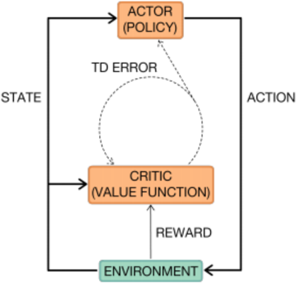

## 2.3.2 Deep Reinforcement Learning

The most successful RL algorithms belong to the family of deep learning algorithms and rely on parametric approaches. Thanks to their representation learning properties and their ability to create rich and complex models, neural networks have enabled RL algorithms to tackle more complex problems at a higher scale, including objects detection, speech recognition and language translation (Baird III 1993, Bengio, Courville, &amp; Vincent 2013, Pritzel et al. 2017). The term representation learning properties refers to their ability to learn directly from high dimensional input, such as images using Convolutional Neural Network (CNN). In general, neural networks are used to approximate the optimal policy 𝜋 * , value function 𝑉 * , Q-value 𝑄 * , and advantage function 𝐴 * (Williams 1992). The advantage function 𝐴 provides the relative advantage of one action over its alternatives.

Neural networks have been employed in both value function methods and policy search methods, and therefore also in actor-critic methods. They have greatly increased the scalability of these methods, by either transposing RL techniques into neural networks or using neural network optimization algorithms, such as back-propagation, to RL algorithms. For example, the double Q learning method (Hasselt 2010), in which a second estimator provides a better estimation of the Q-value and therefore reduces the bias, has became scalable thanks to the re-use of the neural network estimating the first estimator (Van Hasselt, Guez, &amp; Silver 2016). On the other hand, representation learning enables to successfully learn

action embedding over a large set of actions, as shown by Dulac-Arnold et al. (2015), as it speeds up the convergence of the algorithm. Williams (1992) introduces the 'REINFORCE' rule which allows neural network to use back-propagation to evaluate stochastic objective. It has been particularly useful in policy search methods to replace the Monte Carlo evaluation. Another scheme to overcome taking the gradient of the expectation has been developed by Kingma and Welling (2013), and is known as the 'reparameterisation trick'. For example, it allows to learn stochastic policies to decide where to look within an image to classify an object (Mnih, Heess, Graves, et al. 2014). Actor critic methods benefit from improvements in both value function methods and policy search methods. They also benefit from parallel computation: methods for training networks through asynchronous gradient updates have been developed to speed up the training (Dean et al. 2012, Recht, Re, Wright, &amp; Niu 2011). A set of parameters is read and updated in an asynchronous way by multiple copies of the same neural network: segments from the trajectories of multiple agents are collected and processed together in a batch (Schulman, Wolski, Dhariwal, Radford, &amp; Klimov 2017).

For an extended and more in depth review of RL and deep RL techniques, we refer the reader to Arulkumaran, Deisenroth, Brundage, and Bharath (2017), Sutton and Barto (2018) and Li (2017).

## 2.3.3 Reinforcement Learning in Routing Problems

Due to its combinatorial nature and complexity, the VRP and its variants have been natural candidates for optimization problems solved by ML methods. Given the sequential nature of deciding in which sequence customers should be visited, the dynamic of the demand time, and the lack of an underlying distribution behind the stops to be served, these methods mostly rely on deep RL techniques.

Most of RL approach to solving the VRP interpret it as a Markov Decision Process, in which the optimal solution can be viewed as a sequence of actions deciding which customer These algorithms face two main difficulties.

to visit once the previous customer is served. First, the VRP is a highly combinatorial problem: encoding and decoding the current state and action are a crucial step. Second, its state is time-dependent and is impacted by each decision, so that the problem representation evolves over time. Due to this issue, most authors have focused on auto-regressive approaches, i.e., models which build on state information previously observed. Vinyals, Fortunato, and Jaitly (2015) are the first to introduce a sequence-to-sequence Pointer Network based on a Recurrent Neural Network (RNN) which uses an attention mechanism to output a permutation of an input sequence (Bahdanau, Cho,

&amp; Bengio 2014). While this work outputs tours for the TSP in a supervised way, Bello et al. (2016) later extend it to unsupervised learning using the actor critic method. They use the total distance traveled at each state as the penalty function. In addition, they adapt their work to deal with the constraints of the VRP, using a high-penalty term to penalize infeasible solutions. Nazari et al. (2018b) further extend this method to solve the VRP by replacing the Pointer Network with a RNN decoder based on an attention process. Doing so resulting in capturing the time-dependence and environment changes of the VRP, mainly how the demand evolves over time. They attain similar results than state-of-the-art solvers on small to medium-sized problems. Multiple extensions of this work have been introduced to solve variants of the VRP, such as the heterogeneous VRP (Vera &amp; Abad 2019), synchronous trucks and drone delivery (Chen, Ulmer, &amp; Thomas 2019), and VRPs with soft time windows VRP (K. Zhang, Li, Zhang, Lin, &amp; He 2020). Another alternative to a Pointer Network consists of graph encoding, which better reflects the combinatorial nature of the problem than the sequence-to-sequence methods. Khalil et al. (2017) encode instances using a graph neural network, which is invariant to the order of nodes. They then solve it via deep Q-learning algorithm (Mnih et al. 2015). Concurrent work by Deudon, Cournut, Lacoste, Adulyasak, and Rousseau (2018) and Kool, Van Hoof, and Welling (2018) replaces the graph embedding model with a Graph Attention Network (Veličković et al. 2017) using an attention-based decoder. In addition, Deudon et al. (2018) couple their RL algorithm with a 2-opt local search heuristic at each step, improving model performance. However, this encoding cannot be directly applied to the VRP as its demand is dynamic across time.

## Chapter 3

## A Classification Model to Predict the Number of Vehicles

In order to solve large-scale VRPTW, many authors reduce these problems to multiple subproblems to construct initial solutions which are later combined and improved, as discussed in Section 2.1.2. To build these sub-problems, they rely on clustering algorithms using customers level characteristics, which hardly relate to either the number of vehicles required to serve the demand. Therefore, the quality of the initial solution is often poor.

To overcome this difficulty, we design a clustering algorithm based on aggregated customers characteristics, namely the number of vehicles needed to serve a set of customers. To do so, we build a classification model which takes as input a set of customers and outputs the expected number of vehicles required. This classification problem assigns to each set of customer a label corresponding to the minimal number of vehicles required to serve it. This section focuses on the design and performances of such classification models. We present in Section 3.1 the dataset on which the classification task is performed. We report in Section 3.2 the results obtained with one of these classification models, OCT, and in Section 3.3, the results obtained leveraging deep learning techniques such as Graph Neural Network (GNN) and CNN. In Section 3.4, we discuss the benefits and drawbacks of each classification model.

## 3.1 Dataset

Since we approach the prediction of the number of vehicles required to serve a set of customers as a supervised classification task, we need a dataset that associates to each set of customers the number of vehicles serving it. This is an uncommon dataset, as the literature rather

focuses on vehicle routes or on the whole set of customers. In fact, clustering is commonly performed only to obtain an initial solution, and results at a clusters level are rarely reported.

## 3.1.1 Stylized Customer Dataset

Our goal is to develop a proof of concept of the value of leveraging prediction in a clustering algorithm. To facilitate the our analysis, we create a stylized dataset. The area considered is a square of an arbitrary unit of 300 by 300. The depot is located at the center, while customer locations are uniformly distributed across this area. The speed of the vehicles is 1 in this same arbitrary unit. Customer time windows are distributed as follows: 30% of early time windows, which have to be reached within the first 150 time units, 30% of late time windows, which have to be reached within the last 150 time units, and 60% without time windows restrictions. A day is composed of 1500 time units and the vehicle capacity is 200 . Finally, individual customer demands are uniformly drawn between 1 and 9, and the service time associated corresponds to twice the demand, in time unit. This stylized dataset is voluntarily less complex than industrial datasets to make our results more interpretable. However, it aims at mimicking real-world constraint. In large cities, customer locations are almost uniformly distributed and early and late time windows correspond to business constraints encountered by companies. In addition, delivery companies often estimate the service time as being proportional to the demand.

In order to vary the density of the instance considered, we generate datasets using the above process with different number of customers. In practice, the total number of customers varies between 600 and 10000 , and ten datasets are generated for each number of customers.

## 3.1.2 Creating the Labels

We aim at learning the number of vehicles serving a set of customers through supervised learning. Therefore, each point in the final dataset should correspond to a set of customers labeled with the number of vehicles that are actually required to serve it. Therefore, two problems arise: how to select the set of customers and how to obtain the minimal number of vehicles required to serve it.

Algorithm 1 presents the process used to select the set of customers. It is mainly composed of two parts. First, from step 5 to 15, we randomly sort the stops, and then append them to the same set as long as the total demand is below a certain threshold 𝑟 , which corresponds to the vehicle capacity. Second, from step 17 to 19, we use a k-means algorithm with

various k to cluster the stops. The underlying rationale of Algorithm 1 is twofold: we want

```
Algorithm 1: Generate datasets 1 Inputs: 𝑆 a set of stops of total demand 𝑑 , 𝑐 the capacity of the vehicles ; 2 𝐷 ←∅ ; 3 𝑅 ← [0 65 . * 𝑐, 1 15 . * 𝑐 ] ; 4 𝐾 ← [ 𝑑 0 85 . * 𝑐 , 𝑑 1 35 . * 𝑐 , 𝑑 1 55 . * 𝑐 ] ; 5 for 𝑟 ∈ 𝑅 do 6 𝑙 ←∅ ; 7 for stop 𝑠 ∈ 𝑆 do 8 if 𝑙 ∪ { } 𝑠 has a demand less or equal than 𝑟 then 9 𝑙 ← ∪{ } 𝑙 𝑠 ; 10 else 11 Route the set 𝑙 of stops, label it with the number of vehicles serving it ; 12 Add the labeled set of customers 𝑙 to 𝐷 ; 13 𝑙 ←∅ ; 14 end 15 end 16 end 17 for 𝑘 ∈ 𝐾 do 18 Perform a k-means on the set of stops 𝑆 with 𝑘 being the number of clusters ; 19 Route the obtained clusters of stops, label them and add them to 𝐷 ; 20 end 21 return: 𝐷
```

to learn how to classify all subsets of customers, and hence learn on random subsets, but with a focus on meaningful subsets from a routing perspective, and hence learn on subsets based on distance, via a k-means algorithm. In addition, the sets of customers need to be of reasonable size, so that the routing algorithm is able to find the minimal number of vehicles in a short time. This determines the lists 𝑅 and 𝐾 at steps 3 and 4: while the number multiplying the vehicle capacity are arbitrary, the underlying goal is to obtain sets of stops which could be served with at most five vehicles. To limit the number of different classes, each set of stops labeled with strictly more than 5 vehicles is considered as belonging to the class 6 . Therefore in our classification task, the class 6 represents the set of stops which required 6 or more vehicles to be served.

Once the sets of customers have been determined, we use an industrial software, LocalSolver , to perform the routing. 1 Since we aim at predicting the minimal number of vehicles

1 https://www.localsolver.com/home.html

required to serve a set of customers, the objective is to first minimize the number of vehicles, and second the distance. We set a time limit on the routing algorithm and considered as label the final number of vehicles obtained. Note that, although the small size of these sets of customers increases the probability of obtaining a near optimal solution given the allocated time in the routing algorithm, there is no theoretical guarantee that this solution corresponds to the minimal number of vehicles required to serve these sets.

## 3.1.3 Augmenting the Dataset

ML algorithms performance relies on a large dataset. However, in our approach, creating this dataset is computationally expensive since the routing problem has to be solved on each set of customers generated via Algorithm 1. To augment the size of the dataset at a low computational cost, we consider each combination of vehicles within a set of customers. For example, let 𝑠 be a set of customers which requires three vehicles, 𝑎, 𝑏 and 𝑐 , to be served. Routing this set is computationally expensive and leads to one data-point: the set 𝑠 with the label 3 . However, for the same computational cost, we can consider the following additional six data-points: the set composed of the customers in vehicle 𝑎 with the label 1 , the set composed of the customers in vehicle 𝑏 with the label 1 , the set composed of the customers in vehicle 𝑐 with the label 1 , the set composed of the union of customers in vehicle 𝑎 and 𝑏 with the label 2 , the set composed of the union of customers in vehicle 𝑎 and 𝑐 with the label 2 , and the set composed of the union of customers in vehicle 𝑏 and 𝑐 with the label 2 . Each of these additional sets of customers are guaranteed to be correctly labeled. The number of vehicle corresponding to their label is guaranteed to be minimal, since the solution of the initial set of customers was optimal. If subsets of customers from different vehicles could be merged to reduce the total number of vehicles, then the initial solution on the whole set of customers would not have been optimal. Therefore, by authorizing every vehicles combination within a set of customers, we drastically augment the size of our dataset. Each routing performed leads to ∑︀ 𝑛 𝑖 =1 (︀ 𝑛 𝑖 )︀ points, where 𝑛 is the number of vehicles required to serve the whole set of customers. Note that this way of augmenting the dataset leads to an unbalanced dataset, as the labels corresponding to a small number of vehicles become more frequent.

## 3.2 A Tree-based Model

Tree-based methods propose a compromise between high performance and interpretability. The main tree-based classification models have been presented in Section 2.2. Three methods happen to be similarly competitive in terms of performance: Random Forests, Gradient Boosted Decision Trees, and OCT. However, only OCT methods fully preserve the interpretability of tree-based methods, i.e., splits at each node being based on a linear inequality. This interpretability is important as it provides a tool to evaluate the distance of a cluster to a leaf and which constraints are violated. Given the benefit of interpretability in the clustering algorithm developed in Chapter 4, we use OCT to design our tree-based classification model.

This section presents the accuracy obtained on the classification with OCT.

## 3.2.1 Introduction to the Optimal Classification Tree Method

The OCT method has been developed by Bertsimas and Dunn (2017) to overcome the following drawbacks of the CART algorithm developed in Breiman et al. (1984):

- ∙ Each split in the tree is determined in isolation without considering the possible impact of future splits in the tree.
- ∙ These methods typically require pruning to achieve trees that generalize well.
- ∙ These methods typically optimize an impurity measure when selecting splits, rather than using the misclassification rate of training observations.

To resolve this problem, they aim at forming the entire decision tree in a single step, allowing each split to be determined with full knowledge of all other splits. This single step consist in solving a mixed-integer optimization problem, whose decision variables correspond to the splits, or nodes, of the tree. By seeing a tree as a set of linear constraints, as shown in Figure 3-1, they develop a MIP formulation which maximizes the overall accuracy on the training set. This formulation is quite complex and cannot be solved to optimality using industrial solvers. Therefore, they use some heuristics to create warm start solutions, and alternate between MIP solver and heuristic solutions to reduce the gap between the lower bound and the best upper bound found. Solving this one step optimization problem instead of a succession of split decision problems leads to higher performance than the CART method. In addition, the OCT method preserves the full interpretability of tree-based methods.

Figure 3-1: Linear constraint applied to every points to be classified

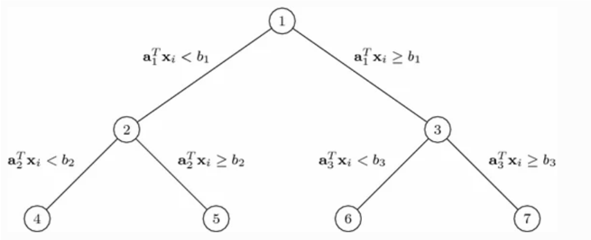

## 3.2.2 Features

Similar to all tree-based methods, the OCT approach takes as input a set of features and outputs a label, in our case the minimal number of vehicles required to serve the set of customers from which the features are derived. Our dataset is composed of sets of customers labeled with the number of vehicles serving them. While each customer has naturally inherent features, such as service time, demand, location or time windows, we need to derive aggregate features for sets of customers. We aim at capturing:

- ∙ the demand served, using the total number of stops and the sum of their demand.
- ∙ the spatial stop distribution, using the diameter of the set of stops, the 5 𝑡ℎ , 50 𝑡ℎ and 90 𝑡ℎ percentiles of the average and maximal distance between a stop and its closest 2 , 5 and 10 stops, the average number of stops within a certain radius, and the entropy of the stops' locations.
- ∙ the position of the set of stops with respect to the depot, using the 5 𝑡ℎ , 50 𝑡ℎ and 90 𝑡ℎ percentiles of the distance between the stops and the depot.
- ∙ the approximate routing distance, using the distance of a tour built in an heuristic way by always going to the next closest stop.

In addition, we would like to capture the time windows constraints. Therefore, we derive the above features for four different subsets of customers: the whole set of customers, the subset of customers with an early time window, the subset of customers with a late time window and the subset of customers without any time window. In total, we have 47 features which we compute for each of the four subsets of customers, resulting in 188 features.

## 3.2.3 Accuracy

Based on the features previously described, we tune the trees to maximize the obtained accuracy. Given the high number of features and of observations, only OCTs of rather small depth are tractable. Therefore, the results presented are obtained using OCTs of maximal depth being 8 . Figure 3-2 presents the accuracy results on both the initial dataset and the augmented dataset, as a function of the stops density. While the density of customers does

Figure 3-2: Accuracy reached on both datasets using OCT of depth 8.

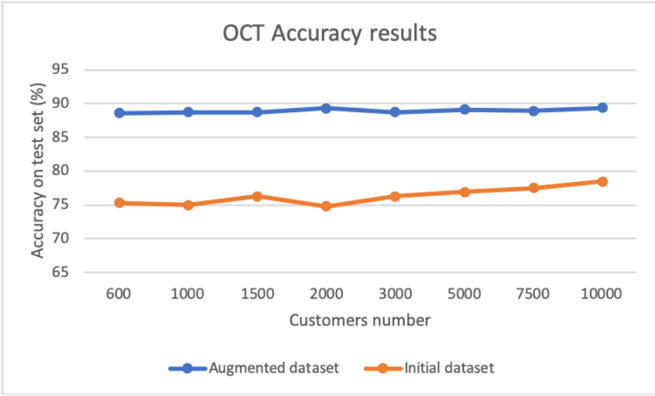

not seem to have a strong impact on the accuracy, there is a clear accuracy gap between the two datasets. The accuracy of the initial dataset is 76 3% . in average, and the one of the augmented dataset is 88 9% . in average. Section 3.4.1 discusses this gap more in depth, exploring two main differences between the datasets: their number of observations and the proportion of each class for each of them.

## 3.3 Deep Learning Methods

While OCTs achieve high accuracy in a reasonably interpretable way, they take as input aggregate features of the set of customers, rather than the set of customers itself. Therefore, deriving features is an important pre-processing step which can result in sub-optimal classification. To overcome this difficulty, we intend to use Deep Learning methods to actually learn the most relevant features given a set of stops. Contrary to trees, Deep Learning methods are able to directly take a set of customers as an input.

We mostly investigate two methods, introduced in Section 2.2, that are able to directly consider a set of customers: image classification through CNNs and graph classification through GNNs.

## 3.3.1 Image Classification

Image classification has been an intensively studied topic in ML, in which CNNs play an important role. While we refer the reader to Rawat and Wang (2017) and Aloysius and Geetha (2017) for an extensive review of image classification using CNN, we briefly introduce the main concepts.

The specificity of image classification lies on the spatial structure and the high dimensionality of a picture: using classical feed forward layers would lead to an explosion of parameters and a loss of the spatial structure. To overcome these two difficulties, CNNs have been introduced Fukushima (1980). They can be seen as a tool to extract high-level features, through the use of filters, capturing the spatial dimensionality of a picture, and through the share and reuse of weights, enabling an accurate and efficient deep learning. Each filter is sequentially applied to a small portion of the picture and performs an operation which changes the dimension of the picture and captures its relevant features. An example of such an operation, considering the maximum of the pixel value is shown in Figure 3-3. Powerful CNNs consist

Figure 3-3: An example of max-pooling filter of size 2 x 2 with a stride of 2

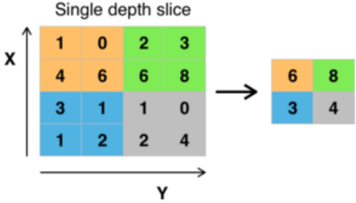

of several feature extraction stages (Yu, Wang, Chen, &amp; Wei 2014), where each stage consists of a convolutional layer, a non-linear transformation layer and a feature pooling layer. Once the high-level features have been extracted, one can apply a classical feed forward neural network to proceed to the classification, as illustrated in Figure 3-4.

By dividing the territory into small pixels, and mapping the RGB color intensity to the demand of early time window customers, late time window customers and customers without time window, respectively, one can interpret the subsets of customers as pictures. A

Figure 3-4: Example of CNNs used in image classification.

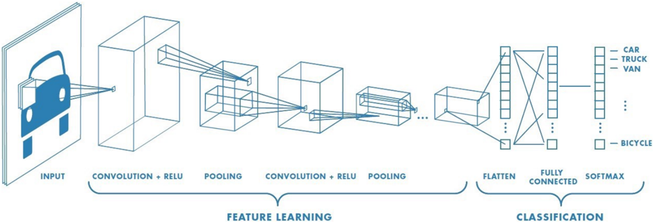

Figure 3-5: Two examples of pictures representing sets of customers served by two and four vehicles, respectively


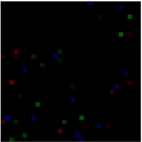

few example of the obtained pictures are provided in Figure 3-5, where the red intensity corresponds to the demand of early time window customers, the green intensity to the demand of late time window customers and the blue intensity to the demand of customers without time window.

We used the Wide Residual Network method developed in Zagoruyko and Komodakis (2016) to perform our classification task. Instead of training a very deep CNN, the authors train wide residual network composed of CNNs, a few examples of which are presented in Figure 3-6. The residual network addresses the problem of vanishing gradient as layers go deep, which is often encountered in classical neural networks, by allowing some connections to skip layers. In terms of mathematical formulation, if 𝑥 denotes the input of a layer, 𝑓 ( 𝑥 ) denotes the layer, and 𝑦 denotes the output, then a standard network would be formulated as 𝑦 = 𝑓 ( 𝑥 ) , while a residual network would be formulated as 𝑦 = 𝑓 ( 𝑥 ) + 𝑥 . This process is

Figure 3-6: Various residual blocks used in Zagoruyko and Komodakis (2016)

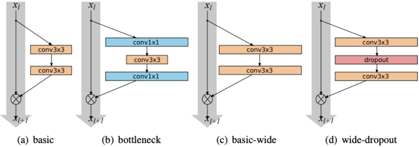

shown in Figure 3-6. In each residual block ( 𝑎 ) , ( 𝑏 ) ( 𝑐 ) and ( 𝑑 ) , the input 𝑥 𝑙 is directly add to the output of the sequence of convolutional layers on the right. If we denote 𝑓 ( 𝑥 𝑙 ) this sequence, the output is therefore 𝑥 𝑙 +1 = 𝑥 𝑙 + 𝑓 ( 𝑥 𝑙 ) .

Residual networks were first introduced in K. He, Zhang, Ren, and Sun (2016). This new type of neural network enables the training of very deep CNN layers, leading to an increase in the accuracy. Zagoruyko and Komodakis (2016) explore wide residual networks rather than deep residual networks. They show that using wide residual network leads to a faster convergence as well as a better generalization.

## 3.3.2 Graph Classification

Graph structures naturally appear in numerous real-world applications, such as social graphs and diffusion graphs in social media, citation graphs in research, and protein representations in the medical domain. Using the specificity of the graph structure, nodes and edges information, graph analysis leads to multiple applications: node classification (Wang et al. 2017), node clustering (Nie, Zhu, &amp; Li 2017), node recommendation (Zhou, Liu, Liu, Liu, &amp; Gao 2017), link prediction (Wei, Xu, Cao, &amp; Yu 2017), sub-graph or graph classification (Simonovsky &amp; Komodakis 2017), etc. While we refer the reader to Cai, Zheng, and Chang (2018) and Z. Wu et al. (2019) for an in-depth review of graph embedding techniques and applications, we briefly introduce the concept followed in this thesis.

While deep learning has revolutionized the ML domain, it assumes a flat representation of the observations, no interactions between them and hardly captures the relationships between observations. To overcome these difficulties, GNNs have been introduced (Gori, Monfardini, &amp;Scarselli 2005, Scarselli, Gori, Tsoi, Hagenbuchner, &amp; Monfardini 2008). Similar to the way

a CNN intends to capture the spatial structure of an image, a GNN intends to capture the relationships between nodes, and more generally, the overall graph structure. At a very high level overview, many of the GNNs can be seen as propagating information along the edges of a graph by computing messages based on the source nodes representation. Nodes are initialized with a certain representation, which later evolves based on the propagated information. In addition, different edge types can be introduced to model different relationships. In this case, the propagation differs for each type and the final representation is a combination of all propagated information. This representation is used as a node embedding to perform classical ML tasks such as classification or regression. In this thesis, we build upon the work realized in Brockschmidt (2019), which takes into account the target node of the message by using feature-wise linear modulation. Basically, the message passing layer is a linear transformation conditioned on the target node representation: each node embedding determines the element wise transformation of the incoming message. This method allows the model to dynamically up-weight and down-weight source features transmission based on the information of the target node. Formally, each node 𝑣 has a representation ℎ 𝑡 𝑣 at iteration 𝑡 and each edge type 𝑙 uses one linear layer 𝑊 𝑙 to compute messages. Using affine transformation based on the target node leads to the following update rule:

<!-- formula-not-decoded -->

<!-- formula-not-decoded -->

Here, 𝑔 represents a learnable function with parameters 𝜃 𝑔,𝑙 , which computes the parameters 𝛽 𝑡 𝑙,𝑣 , 𝛾 𝑡 𝑙,𝑣 for the affine transformation based on the target node: 𝛾 𝑡 𝑙,𝑣 ⊙ 𝑊ℎ 𝑙 𝑡 𝑢 + 𝛽 𝑡 𝑙,𝑣 . 𝜎 corresponds to a non-linear function, while 𝑙 corresponds to an additional layer with parameters 𝜃 𝑙 which helps controlling the training stability. Therefore, the learnable parameters are 𝑊,𝜃 𝑙 𝑔,𝑙 and 𝜃 𝑙 . In practice, we use a dense linear layer for 𝑔 , the ReLU function for 𝜎 and a normalization layer for 𝑙 . Once the nodes have been embedded, we perform a simple classification task by considering these embedding as flat inputs.

We create our graphs as follows. Each subset of customers is a graph, whose label corresponds to the minimal number of vehicles required to serve this subset of customers. Each customer is seen as a node, whose features are the customer's features. We use 12 different types of edges: each type represents a different time interval. Two nodes are linked with an edge of type 𝑙 if and only if the time to go from the first one to the second one

belongs to the time interval represented by the edge type 𝑙 .

## 3.3.3 Accuracy of Deep Learning Methods

This section presents the accuracy results reached with the two deep learning methods previously presented. Given our limited computational resources, an extensive parameter tuning has not been conducted. The parameters used are mainly derived from the two reference papers: Zagoruyko and Komodakis (2016) and Brockschmidt (2019). Figures 3-7 present the accuracy obtained using deep learning methods on both the augmented and the initial dataset. Figure 3-7a reports the accuracy of the CNNs, while Figure 3-7b reports the accuracy of the GNN. Similar to the results obtained with OCT, the accuracy is higher on the

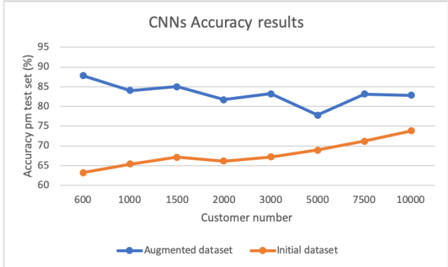

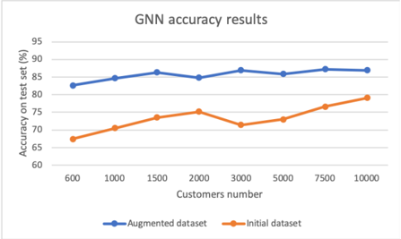

- (a) Results of the CNN method
- (b) Results of the GNN method

Figure 3-7: Accuracy reached on both datasets using Deep Learning methods.

augmented dataset: 83 2% . and 85 7% . on average on the augmented dataset versus 73 3% . and 67 9% . on average on the initial dataset, for the CNN and the GNN, respectively. While the results on the initial dataset seems to suggest a density correlation, the results on the augmented dataset don't support this hypothesis. Therefore, the increase in accuracy observed between the two datasets and within different number of customers instances in the initial dataset may be more linked to the total number of observations in each dataset rather than the overall density. This hypothesis will be discussed further in depth in Section 3.4.

## 3.4 Comparative Discussion of Prediction Methods

In Section 3.2 and 3.3, a tree and deep learning methods have been introduced. This Section intends to discuss the benefits and limitations of each method.

## 3.4.1 Accuracy

We first discuss the overall accuracy performance of the three methods: OCT, CNN and GNN, on each dataset. The OCT reaches the best accuracy, both on the initial and augmented dataset. On both, it outperforms GNN by 3% on average and CNN by 7% on average.

We then discuss the differences in the accuracy obtained throughout the two datasets. These two datasets differ by the number of observations and the proportion of each label, which we refer to as label distribution, as shown in Figures 3-8 and 3-9, respectively. Figure 3-

Figure 3-8: Number of points in the initial and augmented datasets.

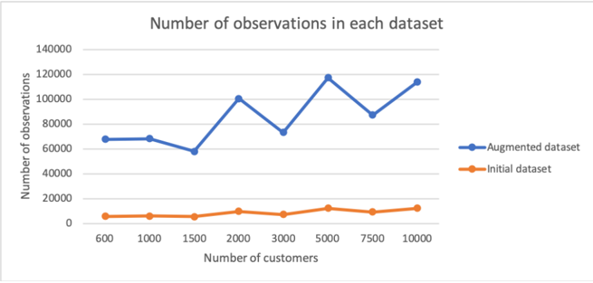

8 confirms the important difference in terms of number of observations in both dataset. The augmented dataset is composed of almost ten times more observations than the initial dataset, for each customers instance. Given the very high number of observations required to train deep learning models, this difference in the number of observations could explain the higher accuracy observed on the augmented dataset: the model trained on the augmented dataset performs better due to the higher number of observations used in the training. This hypothesis is confirmed by Table 3.1, which presents the accuracy obtained on the initial dataset with a model trained on the augmented dataset. The first column indicates the customers instances. The second and fifth column indicate the accuracy obtained on the initial dataset with a GNN and an OCT fitted on the initial dataset, respectively. The third and sixth column indicate the accuracy obtained on the initial dataset with a GNN and an OCT fitted on the augmented dataset, respectively. Finally, the fourth and seventh column indicate the accuracy obtained on the augmented dataset with a GNN and an OCT fitted on the augmented dataset, respectively. We see in Table 3.1 that the GNN fitted on the augmented dataset increases the accuracy on the initial dataset by 2 to 4% , the highest gain

Table 3.1: Accuracy results with models trained on different datasets

|   Customers dataset |   OCT acc. init/init |   OCT acc. init/aug |   OCT acc. aug/aug |   GNN acc. init/init |   GNN acc. init/aug |   GNN acc. aug/aug |
|---------------------|----------------------|---------------------|--------------------|----------------------|---------------------|--------------------|
|                 600 |                 75.3 |                73.8 |               88.6 |                 67.4 |                71.6 |               82.6 |
|                1000 |                 75.1 |                73.8 |               88.7 |                 70.5 |                73.5 |               84.7 |
|                3000 |                 76.3 |                74.1 |               88.7 |                 71.4 |                73.8 |               86.9 |

being on the initial dataset with the lowest number of observations. This trend does not seem to appear in the OCT model: the accuracy on the initial dataset using a tree fitted on the augmented dataset is lower than the accuracy obtained with a tree fitted on the initial dataset.

While a higher number of training observations seems to increase the accuracy of the deep learning methods, this fact only is not enough to fully explain the difference in accuracy obtained between the initial and the augmented datasets, for all models. The second difference observed between the initial and the augmented datasets is the label distribution, i.e., the percentage of observations which required 1 , 2 , 3 , 4 and 5 vehicles to be served. Figure 3-9 presents the percentage of each label within each dataset. The solid lines correspond

Figure 3-9: Difference of label distribution in the initial and augmented datasets.

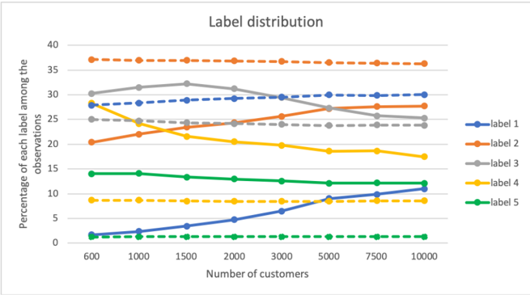

to the percentage of each label in the initial dataset, while the dotted lines correspond to the percentage of each label in the augmented dataset. Note that label 𝑖 indicates that 𝑖 is the minimal number of vehicles required to serve the set of customers. Given the process used to generate the augmented dataset, the label distribution of these two datasets are

different. The augmented dataset is mainly composed of low number labels: labels 1 2 , and 3 represent 90% of the observations, i.e., 90% of the sets of customers require three vehicles or less to be served. On the contrary, the initial dataset is mainly made up of high number labels, with label 3 having the highest percentage and label 1 having the lowest percentage. Labels 2 3 , and 4 represent almost 80% of the observations, which confirms that globally the sets of customers in the initial dataset required a higher number of vehicles to be served. These differences seem to suggest that accurately predicting the number of vehicles for sets of customers which required a low number to be served, is less challenging than for the sets which required a high number of vehicles to be served.

## 3.4.2 Parameter Tuning

As most models and algorithms, ML models depend on multiple parameters, and their performance is known to be extremely parameter dependent. In addition, these parameters often need to be tuned every time the model is applied to a different dataset.

The main parameters involved in OCT methods are the depth of the tree and the minimal number of samples in each leaf. To determine the best parameter values, we perform a grid search over this two parameters.

In contrast with OCTs which rely on a low number of parameters, deep learning models, such as GNNs and CNNs, involve thousands of parameters. These parameters can be roughly divided into two categories. The first category relates to the network structure, such as the number of layers used, their size, their type and their activation function. The second category relates to the optimization process, such as the batch size, the learning rate, the type of optimizer used and the maximal norm of the gradients. We choose to keep the same architectures as the ones proposed by Zagoruyko and Komodakis (2016) and Brockschmidt (2019). Given the very high number of parameters to tune within the second category, performing a rigorous grid search is not an option. We restrict ourselves to test tune these parameters only with a few values. This computationally expensive parameter tuning of these deep learning models highly contrast with the simple grid-search performed to tune OCT parameters.

## 3.4.3 Computation Time

The three methods described so far also differ from a computational point of view. For the features designed in 3.2.2 and with 100 000 , observations, an OCT required roughly one hour

to be trained . 2 With the same number of observations, GNNs and CNNs require roughly one hour and one day to be trained , respectively. 3

## 3.4.4 Choosing a Classification Model

The three models tested, OCT, CNN and GNN,follow three completely different classification approaches: a tree classifier, an image classifier, and a graph classifier, respectively. The OCT approach outperforms the CNN and GNN approaches in terms of accuracy obtained. This approach does not rely on heavy parameter tuning and is intuitively and mathematically easily interpretable, contrary to the deep learning approaches. Therefore, we choose the OCT model as the classification model used in the clustering algorithm developed in Chapter 4.

2 Using Interpretable AI software https://docs.interpretable.ai/stable/ , on a macOS 10.14 with a 3.1GHz processor and 16 GB of memory

3 Using Google Collab GPU https://colab.research.google.com/notebooks/intro.ipynb

## Chapter 4

## A Clustering Algorithm Leveraging Classification Trees

## 4.1 Introduction

## 4.1.1 Motivation

In Chapter 3, we have developed three classification methods to predict the minimal number of vehicles required to serve a set of customers. In this section, we leverage these predictions to design an innovative clustering algorithm. This algorithm takes as input a whole set of customers, and divides it into subsets of stops, so as to minimize the sum of the predicted number of vehicles required to serve each subset of stops. We refer to these subsets of stops as clusters in the following. The specificity of this clustering algorithm lies in its objective function, which directly relates to the routing objective: minimizing the predicted number of vehicles required to serve the whole set of customers.

We have explored three classification methods in Chapter 3: OCTs in Section 3.2, CNNs in Section 3.3.1 and GNNs in Section 3.3.2. We choose to design a clustering algorithm which leverages OCTs. The rationale behind this decision is twofold. First, OCTs outperform the other classification methods previously studied, in terms of accuracy. Second, OCTs are interpretable, both intuitively and from an optimization perspective: the mathematical constraint formulations associated to each node can be easily leveraged in an algorithm. For example, our intuition would prevent us from clustering together two stops far away in terms of distance. In an OCT, this intuition would be modeled as a constraint indicating that if a cluster has a diameter exceeding a certain distance, then a high number of vehicles

is required. From an algorithmic point of view, this constraint could drive how clusters are created, and could provide information about which stops should be added to or removed from a cluster.

## 4.1.2 Tree Notation

## Terminology

Figure 4-1 illustrates a fitted OCT. An OCT is defined by a collection of nodes and branches.

Figure 4-1: Example of a fitted OCT

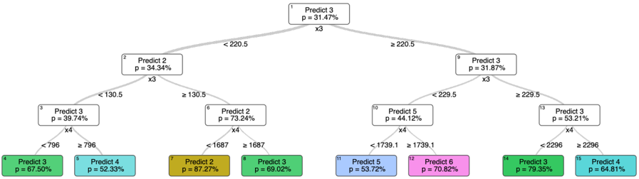

A node is represented by a rectangle in Figure 4-1. A branch corresponds to a link between two nodes, and is represented by a black line in Figure 4-1. A branch indicates a relationship between the parent node, from which the link starts, and the child node, to which the link arrives. A node without parents is called the root node, and a node without children is called a leaf. In an OCT, each branch corresponds to a mathematical constraint. For example, the two first branches, associated to the root node, correspond to 𝑥 3 &lt; 220 5 . and 𝑥 3 ≥ 220 5 . , for the left and right branch, respectively, where 𝑥 3 refers to the value of the third feature of the observation to be classified. Each leaf indicates the final prediction made by the tree. In Figure 4-1, the leaves are represented by colored rectangles, and within each leaf is written the number of vehicles predicted, with the associated probability. For example, the far left leaf is associated to a prediction of 3 vehicles with a probability of 67 5% . . This means that on the test set, every observation in this leaf has a 67 5% . probability of requiring 3 vehicles to be served. Finally, we denote as the set of left branch and right branch ancestors of a node, all the left and right branches which lead to this node. For example, the set of left branch ancestors associated to the maroon leaf predicting 2 vehicles consists of the branch

ancestors associated to constraint 𝑥 3 &lt; 220 5 . and of the branch associated to 𝑥 4 &lt; 1687 , while the set of right branch consists of the branch associated to constraint 𝑥 3 ≥ 130 5 . . The depth of a tree corresponds to the maximum number of edges from a leaf to the root node. In this example, the depth of the tree is of 3 .

A classification tree corresponds to a succession of decisions, i.e., of nodes, which lead to a prediction, i.e., a leaf. For example, let us consider an observation such that 𝑥 3 = 200 and 𝑥 4 = 1800 and let us consider the OCT presented in Figure 4-1. The observation enters the tree via the root node. It follows the left branch since 𝑥 3 &lt; 220 5 . , and arrives at node 2 . It then follows the right branch since 𝑥 3 ≥ 130 5 . , and arrives at node 6 . Finally, it follows the right branch since 𝑥 4 ≥ 1687 , and reaches the leaf 8 which predicts 3 as a label. In this thesis, OCTs are trained to classify sets of customers based on the minimal number of vehicles required to serve them. Therefore, the observation would correspond to a set of customers, 𝑥 3 and 𝑥 4 would correspond to aggregate features of this set of customers, such as the total demand and the sum of the distances between the depot and each stop, and the label would correspond to the minimal number of vehicles required to serve this set of customers.

## Common Notation

We present here the notation used in the following, when referring to OCTs, and trees in general. Table 4.1 introduces the common notation and terminology used.

Table 4.1: Common notation for trees and set covering formulations.

| Symbol   | Description                                                                          |
|----------|--------------------------------------------------------------------------------------|
| 𝑁        | The total number of stops to be served. 𝑖 ∈ { 1 , . . . , 𝑁 } .                      |
| 𝒯        | The OCT.                                                                             |
| 𝐽        | The set of leaves of the tree. 𝑗 ∈ 𝐽 .                                               |
| 𝑐 𝑗      | The prediction associated to leaf 𝑗 .                                                |
| ℳ        | The set of nodes of the OCT. 𝑚 ∈ ℳ .                                                 |
| 𝑓        | The vector of features of a cluster.                                                 |
| 𝑎 𝑚      | The right coefficient of the split constraint at node 𝑚 , of the form 𝑎 𝑇 𝑚 𝑓 ≥ 𝑏 𝑚  |
| 𝑏 𝑚      | The left coefficient of the split constraint at node 𝑚 , of the form 𝑎 𝑇 𝑚 𝑓 ≥ 𝑏 𝑚 . |
| ℒ ( 𝑗 )  | The set of left branch ancestors of leaf 𝑗 .                                         |
| ℛ ( 𝑗 )  | The set of right branch ancestors of leaf 𝑗 .                                        |
| S        | The set of all existing clusters. 𝑠 ∈ S .                                            |

| Continuation of Table 4.1   | Continuation of Table 4.1                                      |
|-----------------------------|----------------------------------------------------------------|
| Symbol                      | Description                                                    |
| 𝑐 𝑠                         | The predicted number of vehicles required to serve cluster 𝑠 . |
| 𝒞                           | The set of created clusters. 𝑠 ∈ 𝒞                             |
| End of Table                | End of Table                                                   |

## 4.2 Exact Mixed Integer Programming Approach

Each node of an OCT is associated to a mathematically interpretable linear constraint. Given the linearity of these constraints, this section aims at designing an exact approach relying on a MIP formulation to build clusters of stops which minimize the total predicted number of vehicles. By this exact approach, we aim at finding the exact predicted minimal total number of vehicles required to serve a set of customers.

## 4.2.1 Mixed Integer Programming Formulation

We define ℱ , the function which associates to any set of stops its aggregate features. Using the above notation, 𝑓 = ℱ ( 𝑥 𝜎 (0) , . . . , 𝑥 𝜎 𝑛 ( ) ) , for any 𝑛 ∈ { 1 2 , , . . . , 𝑁 } , where 𝑁 is the total number of stops considered and 𝜎 is an injective function from a set { 1 2 , , . . . , 𝑛 } to a set { 1 2 , , . . . , 𝑁 } . Here, 𝑛 represents the number of stops in the set considered, and the injective function 𝜎 indicates which stops are part of this set.

We derive an Integer Programming (IP) formulation (4.1) which, given an OCT, minimizes the predicted total number of vehicles required to serve all stops. The overall idea is to create clusters of stops and to derive their predicted number of vehicles according to the constraints of the tree and their features. We assume the function ℱ to be linear with respect to the stops. The notation used has been defined in Section 4.1.2.

<!-- formula-not-decoded -->

<!-- formula-not-decoded -->

<!-- formula-not-decoded -->

<!-- formula-not-decoded -->

Here, the binary variable 𝑦 𝑗 represents the cluster 𝑗 , which is associated to the leaf 𝑗 . 𝑦 𝑗 takes value 1 if a cluster of stops associated to leaf 𝑗 is formed. The prediction of leaf 𝑗 , 𝑐 𝑗 , corresponds to the minimal number of vehicles required to serve the stops grouped in cluster 𝑗 . Therefore, objective function (4.1a) minimizes the predicted total number of vehicles. The binary variable 𝑥 𝑖,𝑗 takes value 1 if stop 𝑖 is assigned to a cluster associated to leaf 𝑗 . Therefore, Constraints (4.1b) ensure that all stops are assigned to exactly one cluster and Constraints (4.1c) force leaf 𝑗 to be activated as soon as a corresponding cluster is formed. The Constraints (4.1d) define 𝑓 𝑗 as a vector representing the set of features of a cluster associated to the leaf 𝑗 . Given the definition of 𝑎 𝑚 and 𝑏 𝑚 , which represent the coefficients of the OCT constraints of each branch, Constraints (4.1e) and (4.1f) ensure that the features of the set of stops assigned to leaf 𝑗 respect the set of constraints associated to the leaf 𝑗 .

Note that the above formulation does not allow a leaf to be associated to multiple clusters, since 𝑦 𝑗 is binary. Practically, it means that each cluster of stops should correspond to a different leaf. This restriction contradicts the optimal clustering we want to reach, in case the latter consists of at least two clusters belonging to the same leaf. To overcome this restriction, we introduce multiple copies of each original leaf. These copies have the same set of associated constraints and the same prediction as the original leaf from which they derive. This modeling enables us to obtain a solution in which multiple clusters correspond to the same original leaf.

## 4.2.2 Designing a Linear Optimal Classification Tree

The MIP formulation (4.1) relies on an OCT predicting for each set of stops the minimal number of vehicles required to serve it. This formulation assumes the features to be linear with respect to the stop; otherwise Constraints (4.1d) cannot be formulated as linear constraints. Therefore, we cannot rely on all the features introduced in Section 3.2.2, but have to limit ourselves to those that are linear with respect to the stops. Specifically, we propose an OCT which relies on the following features: the number of stops, the total demand, and the sum of the pairwise distances between the stops and the depot. These three features are derived for all stops, as well as for subsets of stops with similar time windows: early time window stops, late time window stops, and stops without any time window. Using these

features, we fit the OCT as described in Section 3.2.

## 4.2.3 Results

Using the linear OCT proposed in the previous paragraph, we solve MIP (4.1) on the multiple customer datasets presented in Section 3.1.1. Table 4.2 presents the results obtained. Here, the OCT accuracy column corresponds to the accuracy obtained with the OCT relying on only the linear features. The MIP accuracy column corresponds to the percentage of clusters in the solution of MIP (4.1) for which the actual routing leads to the same number of vehicles as the OCT prediction. The explicit routing solution is obtained using a stateof-the-art industrial solver, LocalSolver , with a time limit of 1 15 s. The MIP prediction error column reports the gap between the total predicted number of vehicles, i.e., the objective value of MIP (4.1), and the total number of vehicles obtained when actually solving the routing problem on each of the clusters in the solution of MIP (4.1). Note that instances

Table 4.2: Results of the MIP approach for instances with 600 and 1,000 customers

|      |   OCT accuracy (%) |   MIP accuracy (%) |   MIP prediction error (%) |
|------|--------------------|--------------------|----------------------------|
|  600 |               64.6 |                  0 |                        800 |
| 1000 |               66.7 |                  0 |                       1300 |

with more than 1 500 , customers are not tractable, and that we have to limit the depth of the OCT to 3 to make sure that MIP (4.1) remains tractable. Table 4.2 indicates that this approach is not very successful. We note that the prediction error rate is extremely high and that we are not able to predict the right number of vehicles for any cluster in the solution of MIP (4.1). This may be explained by the following reasons:

- ∙ The tree has been fitted using clusters of stops which have been arbitrarily created, as presented in Algorithm 1. The OCT constraints accurately classify such clusters, but have not been designed to classify all potential clusters. Therefore, the inaccuracy in the predictions for the clusters in the solution of MIP (4.1) may be explained by a difference between the test set and the training set.
- ∙ The accuracy of the OCT with only linear features is quite low, and may not capture well all the subtleties of the classification. Having such a low accuracy as a baseline may explain the very low MIP accuracy.

1 https://www.localsolver.com/

- ∙ The MIP (4.1) creates overall adversarial clusters. By minimizing the predicted number of vehicles, it seeks to tighten the OCT constraints to their extreme limits, creating edge cases. The following example may provide an intuitive way of understanding this phenomenon. Let us assume that most of the clusters requiring one vehicle have 10 stops, most of the clusters requiring two vehicles have 20 stops, and few clusters with 15 stops require either one or two vehicles. One of the OCT constraints may be: having strictly less than 16 stops leads to one vehicle, having 16 stops or above leads to two vehicles . Given that we seek to minimize the total predicted number of vehicles, if we want to build a cluster with one vehicle, it is more interesting to build a cluster of 15 stops rather than a cluster of 10 stops: one seeks to tighten the constraints. However, this cluster of 15 stops is more likely to be misclassified than a cluster of 10 stops. While tightening one constraint already increases its probability of being wrongly classified, the MIP (4.1) seeks to tighten all constraints. Therefore, solving MIP (4.1) may be equivalent to generating highly adversarial clusters.

## 4.3 Set Covering Approach

This section aims at overcoming two of the three difficulties that contribute to the poor performance of the exact MIP approach presented in Section 4.2. To overcome the restriction of using solely linear features, this approach builds clusters using heuristics instead of linear programming. To prevent the clusters from being too adversarial, this approach follows two strategies. First, the cluster creation step is handled outside an exact optimization scheme, only the cluster selection step is solved exactly using linear programming. Second, the cluster creation step generates clusters which guarantee a minimal slack value in the constraints of the leaf they belong to.

## 4.3.1 Integer Programming Formulation

The IP formulation (4.2) is a set covering problem which minimizes the predicted number of vehicles, while ensuring that each stop is covered by at least one cluster. We define 𝒮 the set of considered clusters and we refer to Section 4.1.2 for the remaining notation.

<!-- formula-not-decoded -->

<!-- formula-not-decoded -->

<!-- formula-not-decoded -->

Here, the binary variable 𝑦 𝑠 indicates if cluster 𝑠 is selected or not by taking value 1 or 0 , respectively. Therefore, the Objective (4.2a) minimizes the total predicted number of vehicles and the Constraints (4.2b) ensure that each stop is covered by at least one cluster. Constraints (4.2c) limit the domain of the binary variables.

The IP formulation (4.2) relies on the prediction of the number of vehicles for each cluster of stops. Contrary to the approach developed in Section 4.2, there is no constraint on how we design the features on which the OCT relies. Therefore, we follow the approach described in Section 3.2, resulting in an OCT relying on linear and non-linear features.

## 4.3.2 Cluster Generation

As the IP formulation (4.2) selects some clusters among the set of considered clusters 𝒮 , its performance strongly relies on how such a set of clusters is created. Solving the IP (4.2) with 𝒮 = S , where S is the set of all possible clusters, is equivalent to exactly solving the clustering problem minimizing the total number of vehicles. Given the intractable dimension of S , we are interested in generating only the relevant clusters, i.e., a limited subset of clusters that is likely to include the clusters included in the optimal solution of the exact problem.

## Algorithm 2: Cluster generation

- 1 Inputs: { 1 , . . . , 𝑁 } a set of stops, 𝒯 a fitted OCT, 𝑛 a positive integer, 𝑐 the vehicle's capacity ;
- 2 𝒞 ← ∅ , an empty set of clusters ;
- 3 Add to 𝒞 the clusters built via a k-means algorithm, where 𝑘 = 𝑁 𝑐 ;
- 4 for 𝑖 ∈ [0 , 𝑛 ] do
- 5 Solve the linear relaxation of IP (4.2), using 𝒮 = 𝒞 ;
- 6 𝑅 𝑐𝑙 ← the reduced costs of each cluster ;
- 7 𝐷 𝑠𝑡𝑜𝑝𝑠 ← the dual value of the covertness constraint for each stop ;
- 8 Improve the current clusters using algorithm 3 and add them to 𝒞 ;
- 9 Create new clusters using algorithms 8 and 9, and add them to 𝒞 ;
- 10 Merge clusters using algorithms 10 and add them to 𝒞 ;
- 11 end
- 12 return: the set of created clusters 𝒞

Algorithm 2 presents the general scheme used to generate a set of relevant clusters.

Algorithm 2 intends to approximately solve the relaxation of IP (4.2) with 𝒮 = S , following a column generation approach. A conventional column generation algorithm would start from an initial set of cluster 𝒞 , and iteratively solve IP (4.2) with 𝒮 = 𝒞 to then generate clusters of most negative reduced cost and add them to 𝒞 . This process ends when no further clusters of negative cost exist. The challenge of such a column generation approach lies in solving the pricing sub-problem, i.e., generating the clusters of negative reduced cost. The reduced cost of a cluster 𝑠 is 𝑟 𝑠 = 𝑐 𝑠 -∑︀ 𝑖 ∈ 𝑠 𝜆 𝑖 , where 𝜆 𝑖 is the dual value of the covertness constraint associated to stop 𝑖 . It leads to the following pricing sub-problem: min 𝑠 ∈ S 𝑐 𝑠 -∑︀ 𝑖 ∈ 𝑠 𝜆 𝑖 . Usually, such a pricing sub-problem is reformulated as a shortest path problem in a graph where each node corresponds to a stop, and each path from an arbitrary source and to an arbitrary destination corresponds to a set of stops, i.e., a cluster. Here, solving such a shortest path problem is arduous for two reasons. First, the graph considered is extremely deep when we solve the VRPTW on instances with thousands of stops. Second, the cost 𝑐 𝑠 of a cluster 𝑠 is not linear in the stops due to some non-linear features used in the OCT. This non-linearity implies that we have to rely on bounds rather than an exact minimum in commonly used shortest path algorithm such as 𝐴 * (Hart, Nilsson, &amp; Raphael 1968), and therefore limits the scale of tractable problems.

We point out two main differences between a conventional column generation approach and Algorithm 2. First, in a conventional column generation approach, clusters with the most negative reduced cost are generated and added to the set of clusters to be considered, 𝒞 in Algorithm 2. This process corresponds to Steps 8, 9 and 10 of Algorithm 2. In a conventional column generation approach, solving the pricing sub-problem guarantees the addition of clusters of negative reduced costs to 𝒞 . However, in Algorithm 2, Steps 8, 9 and 10 rely on heuristics leveraging the OCT information and do not guarantee the addition of clusters of negative reduced cost. Second, in a conventional column generation algorithm, the stopping criterion corresponds to all potential clusters having non-negative reduced costs. In Algorithm 2, the stopping criterion is a maximum number of iterations 𝑛 . 𝑛 is a trade-off between the time spent in Algorithm 2 and the quality of the relaxed solution obtained. While exactly solving the relaxation of IP (4.2) is hard, it is also not necessarily desirable. Our goal is to solve the integer formulation of (4.2), not its relaxation. In addition, the cost of a cluster is only a prediction. Due to the uncertainty inherent to these predictions, a potential optimality gap is insignificant.

Similar to a conventional column generation algorithm, the critical part of Algorithm 2 lies in generating clusters with a negative reduced cost. Given the structure of the clusters

reduced cost, two main directions can be explored to obtain negative reduced cost clusters: decrease the cost 𝑐 𝑠 of a cluster 𝑠 , or add stops with positive dual values to a cluster 𝑠 . The first goal can be pursued by leveraging the information provided by the OCT, while the second goal can be pursued by leveraging results obtained from solving the linear relaxation of IP (4.2). The heuristics described in Section 4.3.3 all follow one of these two goals.

## 4.3.3 Types of Improvement Heuristics

Algorithm 2 strongly relies on heuristics to generate relevant clusters across iterations. Each heuristic pursues one of the following three goals:

- a) Improving existing clusters. These heuristics target already built clusters, and leverage the information provided by the linear relaxation of (4.2) to modify these clusters in order to decrease their reduced cost.
- b) Creating new clusters. These heuristics intend to build clusters from scratch, leveraging information from the linear relaxation of (4.2) to obtain clusters with negative reduced costs.
- c) Merging existing clusters. These heuristics target already built clusters that could be merged together to create clusters with lower reduced costs.

## Heuristics Improving Existing Clusters

Algorithm 3 ties together three potential heuristics to improve existing clusters, each of which are described in more detail in Algorithms 4, 5 and 6, respectively. Algorithm 3 selects the

## Algorithm 3: Improving current clusters

- 1 Inputs: 𝒞 the set of clusters already built, 𝑅 the reduced costs of each cluster, 𝑛 the number of clusters to be improved ;
- 2 𝒞 𝑛 ←∅ ;
- 3 𝐿 𝑐 ← clusters in 𝒞 sorted by ascent reduced cost ;
- 4 𝐿 𝑐 ← 𝐿 𝑐 [0 : 𝑛 ] ;
- 5 for cluster 𝑠 ∈ 𝐿 𝑐 do
- 6 Create new cluster from 𝑠 with Algorithms 5 and 6, and add them to 𝒞 𝑛 ;
- 7 Modify cluster 𝑠 with Algorithm 4, and add it to 𝒞 𝑛 ;
- 8 end
- 9 return: the set 𝒞 𝑛 of improved clusters

existing clusters with the most promising potential for improvement (Step 3), and then applies the improvement heuristics on them. The rationale behind Step 3 of Algorithm 3 is that clusters with already low reduced cost may be easier to modify to obtain clusters with negative reduced cost.

Algorithm 4 intends to add stops to the considered cluster in order to decrease its reduced cost. Two questions naturally arise when we seek to add stops to a cluster. First, which

## Algorithm 4: Complete cluster

- 1 Inputs: 𝑠 a cluster, 𝒯 a fitted OCT, 𝐷 the set of dual values of the covertness constraints, 𝑡 a threshold for dual values ;
- 2 𝑙 𝑠 ← leaf of cluster 𝑠 ;
- 3 𝐿 𝑑 ← stops not in 𝑠 whose dual value is greater than 𝑡 ;
- 4 𝐷 𝑐𝑠𝑡,𝑚𝑎𝑟𝑔𝑖𝑛 ← for each constraint active at leaf 𝑙 𝑠 , its current slack with respect to the cluster 𝑠 ;
- 5 𝐷 𝑐𝑠𝑡,𝑠𝑡𝑜𝑝𝑠 ← for each stop the changes observed for each active constraint if the stop was to be added to 𝑠 ;
- 6 Solve IP (4.3) with 𝑆 = 𝐿 𝑑 using 𝐷 𝑐𝑠𝑡,𝑚𝑎𝑟𝑔𝑖𝑛 and 𝐷 𝑐𝑠𝑡,𝑠𝑡𝑜𝑝𝑠 , and denote 𝐿 𝑖 the list of selected stops ;
- 7 Sort 𝐿 by descent impact score , as defined in Definition 1 ;
- 𝑖 8 for stop 𝑖 ∈ 𝐿 𝑖 do 9 if 𝑠 ∪ { } 𝑖 still respects the constraints of 𝑙 𝑠 then 10 𝑠 ← ∪{ } 𝑠 𝑖 ; 11 else 12 break ; 13 end 14 end 15 return: the modified cluster 𝑠

stops are relevant candidates? Second, in which order should they be added? Since the overall goal is to decrease the reduced cost 𝑟 𝑠 = 𝑐 𝑠 -∑︀ 𝑖 ∈ 𝑠 𝜆 𝑖 of cluster 𝑠 , Algorithm 4 focuses on stops with a strictly positive dual value (Step 3). Since we aim at remaining within the same leaf, we seek to find a balance between the impact of a stop on the current features and the decrease in reduced cost gained with this stop. IP (4.3) selects a list of candidates which could achieve this balance. IP (4.3) models the stop selection problem as a multi-dimensional Knapsack problem, in which the gain of a stop is its dual value, and its weight is its impact on the current cluster's features. Each feature has a capacity, which corresponds to the slack or surplus of the constraints active at the leaf with respect to the current feature value of the cluster. The underlying assumption is that the impact, in terms of features, of adding

a set of stops to a cluster can be linearized if the number of stops added is relatively low. Let 𝐼 be a set of stops, which represents the candidates to be added, and let 𝒞𝒮𝒯 be the set of constraints of the considered cluster's leaf. For each stop 𝑖 ∈ 𝐼 , we denote by 𝜆 𝑖 its dual value, and by 𝑤 𝑖,𝑎 the change it would bring to constraint 𝑎 if it was to be added to the cluster. For each constraint 𝑎 ∈ 𝒞𝒮𝒯 , we denote by 𝐶 𝑎 its current slack or surplus for the considered cluster. The IP formulation (4.3) intends to follow the logic previously described to select the stops to be tried to be added.

<!-- formula-not-decoded -->

<!-- formula-not-decoded -->

<!-- formula-not-decoded -->

The binary variable 𝑥 𝑖 indicates if stop 𝑖 is selected or not. Therefore, the Objective (4.3a) aims at maximizing the sum of the dual values, while Constraints (4.3b) ensure that each constraint of the current cluster's leaf would still be respected.

The solution of IP (4.3) provides us with a set of stops to be tried to be added. However, the order in which we try to add them is important, as not all stop combinations are feasible. We define in Definition 1 an impact score for each stop, which proposes a compromise between the potential gain of a stop and its impact on the cluster's features.

Definition 1 Let 𝑠 be a cluster, and 𝒞𝒮𝒯 be the set of the tree constraints active at the cluster's leaf, 𝑖 a stop not in 𝑠 and 𝜆 𝑖 its dual value. For each constraint 𝑎 ∈ 𝒞𝒮𝒯 , we denote as 𝑤 𝑎,𝑖 the change to constraint 𝑎 if stop 𝑖 was to be added to cluster 𝑠 . For each constraint 𝑎 ∈ 𝒞𝒮𝒯 , we denote as 𝐶 𝑎 the slack or surplus of constraint 𝑎 with respect to the current cluster 𝑠 . We define the impact score of stop 𝑖 as 𝑠𝑐 𝑖 = 𝜆 𝑖 𝑓 𝑖 , where 𝑓 𝑖 = ∑︀ 𝑎 ∈𝒞𝒮𝒯 (︁ 𝑤 𝑎,𝑖 𝐶 𝑎 )︁ .

The rationale behind this score is that the stops with the highest scores yield significant gains, while having a low impact on the constraints' slack or surplus. Based on this score, we determine the order in which the stops should be added, as described in Step 7 of Algorithm 4.

Note that we stop adding stops as soon as one of them happens to not respect the constraints of the cluster's leaf, at Step 12 of Algorithm 4. While more stops could possibly be added to the clusters, we also do not want to create highly adversarial clusters that would mislead the fitted OCT and be misclassified. Therefore, stopping the stop insertion at this point is a way of increasing the ∑︀ 𝑖 ∈ 𝑐𝑙 𝜆 𝑖 without highly risking an increase in the number of vehicles required to serve 𝑠 in the actual routing, number for which 𝑐 𝑠 is only a proxy.

Algorithm 5 intends to remove stops that do not contribute to the reduced cost of the considered cluster, so that stops with higher associated dual value can later be added. Comparing to Algorithm 4, the benefits of Algorithm 5 are multiple. First, removing some

## Algorithm 5: Remove and add stops

- 1 Inputs: 𝑠 a cluster, 𝐷 the set of dual value of the covertness constraints ;
- 2 𝒞 𝑛 ←∅ ;
- 3 𝐿 𝑑 ← stops not in 𝑠 whose dual value is zero ;
- 4 𝑀 ← [10 , 15 20] , ;
- 5 for 𝑚 ∈ 𝑀 do
- 6 Copy 𝑠 , and denote it 𝑐𝑜𝑝𝑦 \_ 𝑠 ;
- 7 Randomly take 𝑛 stops from 𝐿 𝑑 ;
- 8 Remove these stops from 𝑐𝑜𝑝𝑦 \_ 𝑠 ;
- 9 Perform Algorithm 4 on 𝑐𝑜𝑝𝑦 \_ 𝑠 ;
- 10 𝒞 𝑛 ←𝒞 ∪{ 𝑛 𝑐𝑜𝑝𝑦 \_ 𝑠 } ;
- 11 end
- 12 return: the newly generated set of clusters 𝒞 𝑛

stops enables us to insert more relevant stops later using Algorithm 4. Second, it creates clusters that have more stops distinct from the initial cluster, and therefore may prevent Algorithm 2 to remain in a local minimum. However, Algorithm 5 is more time consuming than Algorithm 4, and randomly removing stops may lead to a change in the corresponding OCT leaf, potentially resulting in clusters with less stops than expected.

In response to the shortcomings of Algorithm 5, Algorithm 6 intends to remove as few stops as possible to change the cluster's OCT leaf, and hence potentially reduce its predicted number of vehicles. Step 3 ensures that the algorithm terminates early if the number of vehicles is 1 . In this case, since the goal is to decrease the number of vehicles serving 𝑠 , there is no incentive to change leaf by removing stops from the cluster. Two questions naturally arise when we seek to remove stops from a cluster. First, which stops are relevant candidates? Second, in which order should they be removed? The overall goal is to decrease the reduced cost of the considered cluster, by decreasing its predicted number of vehicles. However, since the reduced cost of a cluster 𝑠 is 𝑟 𝑠 = 𝑐 𝑠 -∑︀ 𝑖 ∈ 𝑠 𝜆 𝑖 , there is a trade-off to be discussed when removing a stop which leads to a decrease in 𝑐 𝑗 , but has a high dual value. IP (4.4) selects a list of stop candidates which could provide this balance. The approach is to minimize the loss, in terms of dual values removed, while making sure that at least one of the current constraint is violated. The rationale is that if a current constraint is violated, then the corresponding leaf of the cluster is modified, leading to a potential decrease in 𝑐 𝑗 .

## Algorithm 6: Decrease leaf

```
1 Inputs: 𝑠 a cluster of stops, 𝐷 the set of dual values of the covertness constraints, 𝑛 the number of stops to consider ; 2 𝑣 ← the predicted number of vehicle to serve 𝑠 ; 3 if 𝑣 == 1 then 4 return: 𝑠 5 end 6 𝑙 ← the leaf of cluster 𝑠 ; 7 Copy 𝑠 , and denote it 𝑐𝑜𝑝𝑦 _ 𝑠 ; 8 𝑙 ′ ← the leaf of cluster 𝑐𝑜𝑝𝑦 _ ; 𝑠 9 while 𝑙 ′ == 𝑙 do 10 Let 𝐿 𝑑 be the list of stops in 𝑐𝑜𝑝𝑦 _ 𝑠 ; 11 Sort 𝐿 𝑑 by ascent dual value ; 12 𝐿 𝑑 ← 𝐿 𝑑 [0 : 𝑛 ] ; 13 𝐷 𝑐𝑠𝑡,𝑚𝑎𝑟𝑔𝑖𝑛 ← for each constraint active at 𝑙 ′ , its current slack or surplus ; 14 𝐷 𝑐𝑠𝑡,𝑠𝑡𝑜𝑝𝑠 ← for each stop in 𝐿 𝑠 the changes observed for each active constraint if the stop was to be removed from 𝑐𝑜𝑝𝑦 _ ; 𝑠 15 Solve IP (4.4) with 𝑆 = 𝐿 𝑑 using 𝐷 𝑐𝑠𝑡,𝑚𝑎𝑟𝑔𝑖𝑛 and 𝐷 𝑐𝑠𝑡,𝑠𝑡𝑜𝑝𝑠 , and denote 𝐿 𝑖 the list of selected stops ; 16 Sort 𝐿 𝑖 by ascending remove score as computed in Definition 2 ; 17 for stop 𝑖 ∈ 𝐿 𝑖 do 18 𝑐𝑜𝑝𝑦 _ 𝑠 ← 𝑐𝑜𝑝𝑦 _ 𝑠 ∖{ } 𝑖 ; 19 if 𝑙 ′ == 𝑙 then 20 break; 21 end 22 end 23 end 24 Perform Algorithm 4 on 𝑐𝑜𝑝𝑦 _ 𝑠 ; 25 return: 𝑐𝑜𝑝𝑦 _ 𝑠
```

Similarly to the approach used in the IP formulation (4.3), we assume that the impact of removing a small set of stops from a cluster can be approximated by the sum of the impact of removing each stop from the cluster. Let 𝐼 be a set of stops which are potential candidates to be removed, 𝒞𝒮𝒯 be the set of constraints of the considered cluster, and 𝑀 be a very large number. For each stop 𝑖 ∈ 𝐼 , we denote by 𝜆 𝑖 its dual value, and by 𝑤 𝑖,𝑎 the additional slack or surplus it would bring to constraint 𝑎 if it was to be removed from the cluster. For each constraint 𝑎 ∈ 𝒞𝒮𝒯 , we denote by 𝐶 𝑎 its current slack or surplus with respect to the considered cluster. The IP formulation (4.4) intends to follow the logic previously described to select the stops to be removed.

<!-- formula-not-decoded -->

<!-- formula-not-decoded -->

<!-- formula-not-decoded -->

<!-- formula-not-decoded -->

<!-- formula-not-decoded -->

The binary variable 𝑥 𝑖 indicates if stop 𝑖 is selected or not. Therefore, the Objective (4.4a) aims at minimizing the loss of dual values if stops were to be removed. The binary variable 𝑧 𝑎 indicates if constraint 𝑎 is violated or not. Therefore, Constraint (4.4b) makes sure that at least one of the current constraint is violated, and thus that the cluster's leaf changes. Constraints (4.4c) ensure that 𝑧 𝑎 can take the value 1 only if the constraint 𝑎 is indeed violated.

Note that the IP formulation (4.4) may be infeasible due to Constraint (4.4b): the number of stops considered may not be large enough to actually change leaf. To prevent this infeasibility, we have modified Constraints (4.4c) as: ∑︀ 𝑖 ∈ 𝑆 𝑤 𝑖,𝑎 𝑥 𝑖 -𝑡 * 𝐶 𝑎 ≥ ( 𝑧 𝑎 -1) * 𝑀 , where 𝑡 ∈ [0 , 1] enables us to control the minimum change required in the constraint's slack or surplus to consider the constraint as violated. In practice, we begin by solving IP (4.4) with 𝑡 = 1 , and iteratively decrease its value of 0 2 . as long as IP (4.4) remains infeasible.

The solution of IP (4.4) provides us with a set of stops to be removed. However, the order in which we should remove them is important, as not all stops combinations have the same impact. We define in Definition 2 a remove score for each stop, based on the trade-off between the loss in terms of dual value and the gains in terms of slack or surplus of the leaf's

constraints.

Definition 2 Let 𝑠 be a cluster, 𝒞𝒮𝒯 be the set of tree constraints active at the cluster's leaf, 𝑖 be a stop in 𝑠 , and 𝜆 𝑖 be its dual value. For each constraint 𝑎 ∈ 𝒞𝒮𝒯 , we denote by 𝑤 𝑎,𝑖 the constraint 𝑎 's slack or surplus modification if stop 𝑖 was to be removed cluster 𝑠 . For each constraint 𝑎 ∈ 𝒞𝒮𝒯 , we denote by 𝐶 𝑎 the slack or surplus of constraint 𝑎 with respect to the current cluster 𝑠 . We define the remove score of stop 𝑖 as 𝑠𝑟 𝑖 = 𝑓 𝑖 (1+1000 * 𝜆 𝑖 ) , where 𝑓 𝑖 = ∑︀ 𝑎 ∈𝒞𝒮𝒯 (︁ 𝑤 𝑎,𝑖 𝐶 𝑎 )︁ .

The rationale behind this score is that the stops with the highest scores yields significant changes in constraints slack or surplus while contributing to low losses in terms of the cluster's reduced cost. Based on this score, we determine the order in which the stops should be removed, as described in Step 16 of Algorithm 6.

## Heuristics Creating new Clusters

The heuristics presented in this section are focused on creating new clusters to overcome two main potential drawbacks of only modifying existing clusters. First, Algorithms 4, 5 and 6 all intend to maintain or decrease the number of vehicles required to serve a cluster. On the long run, this could lead to severe restrictions on the cluster space explored. Second, by only modifying existing clusters, these algorithms increase the risk of getting trapped in a local minimum.

We propose two ways of creating new clusters. The first one is based on the existing pool of clusters, while the second one is based on the previous solution of the relaxation of IP (4.2). They both follow the same principle: select an initial stop as a basis of the new cluster, add more stops to the new cluster until a target demand is reached, then improve the new cluster using the previously discussed Algorithms 3, 5 and 6.

Algorithm 7 presents the algorithm used to build a cluster from an initial stop 𝑠 𝑖 . The rationale behind Algorithm 7 is that stops are added to a cluster based on their dual value, but also in terms of how similar they are to the other stops in the cluster. This trade-off is captured by the integration score of Algorithm 7, at Step 7, defined below.

Definition 3 Let 𝐿 be a list of stops, 𝑖 be a stop not in 𝐿 , and 𝜆 𝑖 be its dual value. Let 𝑑 𝑎𝑙𝑙 be the shortest distance between 𝑖 and a stop in 𝐿 . Let 𝑑 𝑠𝑖𝑚𝑖 be the shortest distance between 𝑖 and a stop in 𝐿 with the same time-window pattern. We define the integration score of stop 𝑖 as 𝑠𝑖 𝑖 = 𝛼 * 𝑑 𝑎𝑙𝑙 + 𝑑 𝑠𝑖𝑚𝑖 2 -𝛽 * 𝜆 𝑖 , where 𝛼 and 𝛽 are coefficients weighting the importance of the distance and the dual value.

## Algorithm 7: Create cluster

```
1 Inputs: 𝐷 the set of dual values of the covertness constraints, 𝑑 the target demand of the cluster, 𝑠 𝑖 the initial stop, 𝐼 the set of potential stops ; 2 𝐿 ← [ 𝑠 𝑖 ] ; 3 𝑐𝑢𝑟𝑟𝑒𝑛𝑡 _ 𝑑𝑒𝑚𝑎𝑛𝑑 ← 0 ; 4 𝑛 ← 20 ; 5 while 𝑐𝑢𝑟𝑟𝑒𝑛𝑡 _ 𝑑𝑒𝑚𝑎𝑛𝑑 < 𝑑 do 6 𝐿 𝑖 ← ∖ 𝐼 𝐿 ; 7 Sort 𝐿 𝑖 by ascending integration score ; 8 𝐿 𝑖 ← 𝐿 𝑖 [0 : 𝑛 ] ; 9 for stop 𝑖 ∈ 𝐿 𝑠 do 10 Let 𝑑 𝑖 be the demand of stop 𝑖 ; 11 𝐿 ← 𝐿 ∪ { } 𝑠 ; 12 𝑐𝑢𝑟𝑟𝑒𝑛𝑡 _ 𝑑𝑒𝑚𝑎𝑛𝑑 ← 𝑐𝑢𝑟𝑟𝑒𝑛𝑡 _ 𝑑𝑒𝑚𝑎𝑛𝑑 + 𝑑 𝑖 ; 13 end 14 end 15 Let 𝑠 be the cluster created from the list of stops 𝐿 ; 16 return: the cluster created 𝑠 ;
```

The target demand 𝑑 ensures that we build clusters of a reasonable size. In practice, we use 𝑑 being equal to 1 5 . times the vehicle's capacity. Finally, the value of 𝑛 is a trade-off between computational time and how often the integration score should be updated. As the integration score is computed based on the stops already chosen to be part of the clusters, its relevance decreases in 𝑛 .

Algorithm 8 selects the initial stop on which to base the cluster by considering how many low reduced cost clusters are already covering this stop. The rationale behind this algorithm is that some stops may not have a large choice of low reduced cost clusters to be covered by, which therefore leads to sub-optimal solutions. The relevance of the clusters is estimated by their current reduced cost, at Step 4 of Algorithm 8, which has to be lower than a certain threshold. To ensure that the newly created clusters have the lowest possible reduced cost, they are improved at Step 8 of Algorithm 8.

Algorithm 9 selects the initial stop based on its dual values. The rationale behind this algorithm is that initializing a cluster 𝑠 by a stop with a high dual value increases the likelihood of having a final high sum of dual values over the stops in the cluster, and hence a low reduced cost. In addition, one could also see the dual value of a stop as being a proxy for how costly it is to currently serve this stop. Therefore, focusing on these specific stops may reduce the total cost, i.e., the total number of vehicles. To ensure that the newly created

## Algorithm 8: Create new clusters based on stop covertness

- 10

```
1 Inputs: 𝒞 the set of clusters already built, 𝑅 the reduced costs of each cluster, 𝐷 the set of dual values of the covertness constraints, 𝑛 a positive integer ; 2 𝒞 𝑛 ←∅ ; 3 𝑡 𝑜 ← the 10 th percentile of 𝑅 ; 4 𝐿 𝑖 ← the list of stops sorted in ascending order by how many clusters of reduced cost less than 𝑡 𝑜 cover them ; 5 𝐿 𝑖 ← 𝐿 𝑖 [0 : 𝑛 ] ; 6 for stop 𝑖 ∈ 𝐿 𝑖 do 7 𝑠 ← the cluster created with Algorithm 7, with 𝑠 𝑖 = 𝑖 and 𝐼 = 𝐿 𝑖 ∖{ } 𝑖 ; 8 Improve cluster 𝑠 with Algorithm 3, and note 𝒞 𝑖 the set of clusters returned by it 𝒞 𝑛 ←𝒞 ∪𝒞 ∪{ } 𝑛 𝑖 𝑠 ; 9 end return: the set of clusters created 𝒞 𝑛 ;
```

## Algorithm 9: Create new clusters based on stop dual value

- 10

```
1 Inputs: 𝒞 the set of clusters already built, 𝐷 the set of dual values of the covertness constraints, 𝑛 the number of clusters to be created ; 2 𝒞 𝑛 ←∅ ; 3 𝐿 𝑖 ← the list of stops sorted in ascending order by their dual value ; 4 𝐿 𝑖 ← 𝐿 𝑖 [0 : 𝑛 ] ; 5 for stop 𝑖 ∈ 𝐿 𝑖 do 6 𝑠 ← the cluster created with Algorithm 7, where 𝑠 𝑖 = 𝑖 and 𝑆 = 𝐿 𝑖 ∖{ } 𝑖 ; 7 Improve the cluster 𝑠 with Algorithm 3, and note 𝒞 𝑖 the set of clusters returned by it ; 8 𝒞 𝑛 ←𝒞 ∪𝒞 ∪{ } 𝑛 𝑖 𝑠 ; 9 end return: the set of clusters created 𝒞 𝑛 ;
```

clusters have the lowest possible reduced cost, they are improved using Algorithm 3 at Step 7 of Algorithm 9.

## Heuristics Merging Existing Clusters

The heuristics presented in this section are relevant, since as long as clusters are modified and created individually, very similar clusters may exist and it may be beneficial to combine them. The rationale of combining similar clusters is twofold. First, it may remove some overlap in the final set covering solution of IP (4.2). Second, merging two similar clusters may results in a new cluster with the same predicted number of vehicles than the maximum predicted number of the two clusters, but a higher number of stops, hence a lower reduced cost.

Algorithm 10 details how clusters are prioritized per reduced cost. To limit the computational time, we are only considering the clusters whose reduced cost is below a certain threshold (Step 4). The rationale behind this is that the reduced cost of each merged cluster should be low enough to produce a cluster of negative reduced cost. The similarity between two clusters is computed as the number of common stops. It intends to limit stops overlap and to limit the increase in terms of number of vehicles required to serve the newly created cluster. The list 𝑉 maintains the list of clusters already merged, so as to not merge the two same clusters again. Finally, at Step 15 of Algorithm 10, the created clusters are improved using Algorithm 4 to make sure that they have the lowest possible reduced cost.

## Algorithm 10: Merge two clusters

̸

```
1 Inputs: 𝒞 the set of clusters already built, 𝑅 the reduced costs of each cluster, 𝐷 the set of dual values of the covertness constraints, 𝑛 the number of clusters to be created ; 2 𝒞 𝑛 ←{} ; 3 𝑡 𝑜 ← the 10 th percentile of 𝑅 ; 4 𝐿 𝑐 ← the clusters in 𝒞 whose reduced cost is less than 𝑡 𝑜 ; 5 Sort 𝐿 𝑐 per ascending reduced cost ; 6 𝑉 ← [] ; 7 𝑐𝑜𝑚𝑝 ← 0 ; 8 𝑡𝑟𝑒𝑎𝑡𝑒𝑑 ← 0 ; 9 while 𝑡𝑟𝑒𝑎𝑡𝑒𝑑 < 𝑛 do 10 𝑠 ← 𝐿 𝑐𝑜𝑚𝑝 𝑐 [ ] ; 11 if 𝑠 ∈ 𝑉 then 12 𝑃 ← clusters in 𝐿 𝑐 not in 𝑉 ; 13 Sort 𝑃 by descending order of common stops with 𝑠 ; 14 Merge 𝑠 and cluster 𝑃 [0] , denote 𝑛𝑒𝑤 _ 𝑠 the obtained cluster ; 15 Perform Algorithm 4 on 𝑛𝑒𝑤 _ 𝑠 ; 16 𝒞 𝑛 ←𝒞 ∪{ 𝑛 𝑛𝑒𝑤 _ 𝑠 } ; 17 𝑉 ← 𝑉 ∪ { 𝑠, 𝑃 [0] } ; 18 𝑡𝑟𝑒𝑎𝑡𝑒𝑑 ← 𝑡𝑟𝑒𝑎𝑡𝑒𝑑 +1 ; 19 end 20 𝑐𝑜𝑚𝑝 ← 𝑐𝑜𝑚𝑝 +1 ; 21 end 22 return: the set of created clusters 𝒞 𝑛
```

## 4.3.4 Results of the Set Covering Approach

This section analyzes the results obtained with the set covering approach, in terms of convergence, optimality, and accuracy.

## Convergence

Algorithm 2 mimics a column generation approach to solve the relaxation of the set covering problem (4.2) with 𝒮 = S , i.e., when the set of clusters consists of all potential stop combinations S . Given the highly combinatorial problem faced, we generate new clusters with a set of heuristics, and therefore have no convergence guarantee. This section focuses on the performance of the heuristics generating new clusters and on the overall convergence of Algorithm 2. Figure 4-2 presents the evolution of the objective value of the relaxation of (4.2), on a 1 000 , customer dataset and using 60 iterations in Algorithm 2. While we cannot derive

Figure 4-2: Objective value of the relaxation of (4.2) across iterations of Algorithm 2

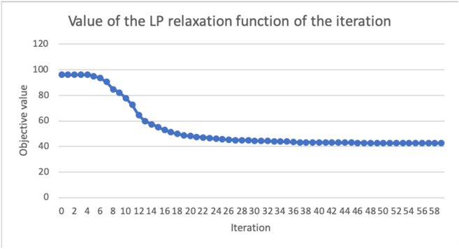

any optimality result, Figure 4-2 confirms that Algorithm 2 successfully decreases the objective value. This decrease proves the effectiveness of the different heuristics generating new clusters. Overall, Algorithm 2 leads to a decrease of 55 7% . in the value of the best-found solution of the relaxation of IP (4.2), compared to the initialization value. The decrease pattern is quite similar to the one observed in a conventional column generation approach: a strong decrease at the beginning which tends to diminish throughout the iterations, as generating clusters of negative reduced cost becomes harder. Interestingly, there seems to be a minimal number of iterations needed before seeing a decrease in the objective value. This number may correspond to the number of iterations needed to begin moving away from the initial local minimum. Indeed, the k-means initialization leads to a perfect covertness, in the sense that no customer is covered twice. Since most of the heuristics modify current clusters, it may take a certain number of iterations to create clusters which propose a different covertness. Figures 4-3 present the percentage of clusters having a negative reduced cost, and the average value of the latter, respectively. They confirm the efficiency of the heuristics, as most of the clusters created have a negative reduced cost. This percentage decreases across iterations, also confirming that generating clusters with negative reduced cost becomes harder. In addition, the average value of the negative reduced cost is aligned with the decrease observed in the upper bound of the IP (4.2) relaxation, shown in Figure 4-2. At the beginning, the newly created clusters have a very low reduced cost, enabling a strong decrease in the upper bound, until this reduced cost flattens around zero, leading to a slower decrease in the upper bound.

Figure 4-3 suggests that it may be worth considering the reduced cost of the clusters as

Figure 4-3: Percentage of clusters created with negative reduced cost and average value of this negative reduced cost across iterations of Algorithm 2

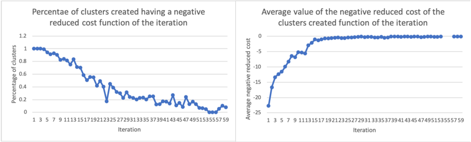

stopping a criterion for the algorithm, rather than a fixed number of iterations. Most of the benefits are derived from the first third of the iterations, during which the heuristics perform well and generate clusters of negative reduced cost with a high frequency. In addition, these clusters have a significant negative reduced cost, contrary to the ones generated in the last iterations.

## Optimality

Since the clusters are generated using heuristic methods and since the stopping criterion is a maximum number of iterations, the optimality of the solution found for the IP (4.2) relaxation with 𝒮 = S is not guaranteed. To estimate the optimality gap resulting from Algorithm 2, we use only linear features and compare the value of the solution obtained with Algorithm 2 against the relaxation of MIP (4.1). In addition, we also compare the optimal value of IP (4.2) solved with the set of clusters generated by Algorithm 2 and the value of MIP (4.1). The rationale behind these two comparisons is that MIP (4.1) is equivalent to IP (4.2) solved on the set of all potential clusters,i.e., with 𝒮 = S . However their relaxations are not equivalent. Given the big-M constraints used in MIP (4.1), its relaxation is not as strong as the relaxation of IP (4.2): one can easily show that the MIP (4.1) relaxation value is lower than the IP (4.2) relaxation value. Therefore, the comparison with the relaxation of MIP (4.1) only provides an upper bound on the optimality gap between Algorithm 2 and the relaxation value of IP (4.2) with 𝒮 = S .

Table 4.3 presents the optimality gap for the integer formulation and its relaxation, introduced by using Algorithm 2 with 𝑛 = 100 to generate the set of considered clusters instead of using S to solve IP (4.2). The first column corresponds to the percentage of

difference in the optimal value between IP (4.2) solved with the clusters generated through Algorithm 2 and solved on all potential clusters S . The second column corresponds to an upper bound on the gap between the relaxation of IP (4.2) solved with the clusters generated through Algorithm 2 and solved on all potential clusters S . Since the exact method presented

Table 4.3: Optimality gap introduced by Algorithm 2 for IP (4.2) and its relaxation

|      |   Integer Optimality Gap (%) |   Relaxation Optimality Gap (%) |
|------|------------------------------|---------------------------------|
|  600 |                            0 |                            33.3 |
| 1000 |                            0 |                            33.3 |

in Section 4.2 only tackles instances with up to 1 000 , customers when relying solely on linear features, we can only compare the optimality of Algorithm 2 on instances with less than 1 000 , customers, and with a tree solely relying on linear features. Despite the lack of test instances due to scalability limitation, Table 4.3 seems to suggest that Algorithm 2 with 𝑛 = 100 performs well from an optimality point of view. On both instances, Algorithm 2 generates relevant enough clusters to obtain an exact integer solution of IP (4.2). The optimality gap on the relaxation is more pronounced that the one obtained on the integer problem. This can be explained by the fact that the relaxation of MIP (4.1) is not as strong as the one of IP (4.2) and that the optimality gap may be over-estimated. Therefore, we emphasize that the second column of Table 4.3 only presents an upper bound of the optimality gap on the relaxed problem.

## Accuracy

The results of the set covering approach, in terms of accuracy, are presented in Table 4.4. The first column indicates the instance considered. The OCT accuracy column reports the accuracy reached on the test set by the fitted OCT as described in Section 3.2. The MIP accuracy column reports the accuracy reached on the clusters selected by the MIP (4.2), i.e., the percentage of these clusters for which the predicted number of vehicles is equal to the actual number of vehicle found in the routing performed by LocalSolver. The MIP prediction error is the gap between the total predicted number of vehicles, i.e. the objective value of the MIP (4.2), and the total number actually obtained when solving the routing problem on each of the clusters determined by the MIP. For all instances, Algorithm 2 has been run with 𝑛 = 60 , i.e., 60 iterations. Table 4.4 presents a global improvement compared to the exact approach developed in Section 4.2: the MIP accuracy is higher and the MIP prediction

Table 4.4: Results of the set covering approach for different instances

| Customers dataset   |   OCT accuracy (%) |   MIP accuracy (%) |   MIP prediction error (%) |
|---------------------|--------------------|--------------------|----------------------------|
| 600                 |               75.3 |                6.1 |                       91.4 |
| 1,000               |               75.1 |                2.6 |                      126.3 |
| 2,000               |               74.8 |                3.1 |                      116.1 |
| 3,000               |               76.3 |                1.9 |                      201.2 |
| 5,000               |               76.9 |                2.2 |                      115.3 |
| 10,000              |               78.5 |               16.2 |                      569.9 |

error is lower. Despite this improvement, the MIP accuracy is still very low compared to the accuracy obtained on the test set with the fitted OCT. The final clusters selected by IP (4.2) almost never require the predicted number of vehicles to be served. This inaccuracy leads to a very high MIP prediction error. In Section 4.2.3, we have proposed three hypotheses to explain the lack of accuracy on the clusters in the solution of our clustering approach: the difference between the training and test set, the linearity restriction on the features, and the adversity of the generated clusters. Algorithm 2 overcomes the restriction of linear features. Therefore, only two hypotheses are left to explain the low accuracy on the clusters solution: the difference between the training and test set, and the adversarial nature of the clusters generated. The first hypothesis is studied in Section 4.4, while the second hypothesis is discussed in Section 4.3.5.

## 4.3.5 Increasing the Robustness of the Predictions

The adversarial nature of the clusters is almost inherent to the targeted objective: minimizing the total number of vehicles. Intuitively, as we seek to minimize the total number of vehicles, the slack of the tree constraints, with respect to the clusters created, is minimized as well. Figure 4-4 presents the accuracy on the clusters obtained when solving IP (4.2) for different iterations of Algorithm 2, on a 600 customer, a 1 000 , customers and a 1 500 , customers dataset. Since the clusters selected become more optimal with respect to minimizing the total number of vehicles, Figure 4-4 provides information on the relationship between cluster accuracy and overall optimality. It confirms that the adversity of the clusters increases throughout the iterations of Algorithm 2, and seems to suggest that one of the reason for the low accuracy observed in Table 4.4 is the cluster creation process.

Figure 4-4: Accuracy of the clusters selected by IP (4.2) across iterations of Algorithm 2

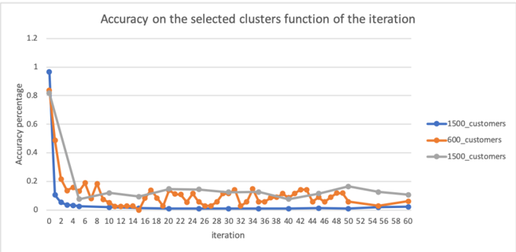

## Introducing a Robustness Threshold

From a geometric perspective, each leaf corresponds to a polyhedron over the space of features. The distances between an observation and the polyhedron's edges correspond to the slack values of the leaf's constraints. Given that a tree is optimized to maximize leaf accuracy, the higher the distances are, the more likely the observation is to be rightly classified. The following example may provide more intuition. If the training dataset is composed of sets of stops with 10 customers associated to label 1 , and of sets of stops with 20 customers associated to label 2 , then the tree will be composed of two leaves, corresponding to the sets with less than 15 customers and to the sets with more than 15 customers, and predicting label 1 and 2 , respectively. In this example, two sets with 9 and 14 customers are both labeled with 1 . However, the set with 14 customers is more likely to be misclassified, as it is closer from the hyperplane separating the space of sets of customers into the ones with less than 15 customers, and the ones with more than 15 customers. Similarly, the clusters close to the edges of their leaf's polyhedron have a high probability of being wrongly classified by the tree. Therefore, a way of counterbalancing the adversity of the cluster creation process is to create clusters which respect a minimal distance from the edges of the leaf's polyhedron. From a linear programming perspective, doing so is equivalent to setting a lower bound on the slack of the leaf's constraints for each cluster. From a geometric perspective, doing so is equivalent to considering a reduced polyhedron for each leaf. Figure 4-5 geometrically presents the rationale behind considering a reduced polyhedron for each leaf. Let us consider an arbitrary leaf. Its polyhedron, defined by the set of constraints of the leaf, is represented by the outer pentagon in Figure 4-5. Its reduced polyhedron is represented by the inner pentagon. It corresponds to a smaller subspace, and introduces a minimum slack,

Figure 4-5: The polyhedron associated to a leaf and its reduced version

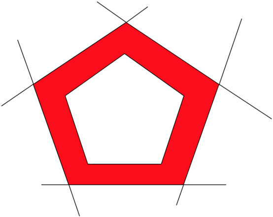

or surplus, on the initial constraints. Given the construction process of trees, a point within the reduced polyhedron is more likely to be correctly classified than one close to the borders, i.e., in the red area of Figure 4-5. The size of this reduced polyhedron is determined by a robustness threshold 𝑡 , indicating the percentage of robustness targeted. If the polyhedron was previously determined by constraints of the form 𝑥 ≤ 𝑏 and 𝑥 ≥ 𝑏 , it is now determined by the following constraints 𝑥 ≤ (1 -𝑡 ) * 𝑏 and 𝑥 ≥ (1 + 𝑡 ) * 𝑏 . For example, if a leaf is determined by the constraints 𝑑𝑒𝑚𝑎𝑛𝑑 ≤ 20 and 𝑑𝑖𝑠𝑡𝑎𝑛𝑐𝑒 \_ 𝑑𝑒𝑝𝑜𝑡 ≥ 100 , and that 𝑡 is set to 0 1 . , then the reduced polyhedron of the leaf corresponds to the set of clusters such that 𝑑𝑒𝑚𝑎𝑛𝑑 ≤ 18 and 𝑑𝑖𝑠𝑡𝑎𝑛𝑐𝑒 \_ 𝑑𝑒𝑝𝑜𝑡 ≥ 110 . Note that the reduced polyhedrons of the set of leafs do not form a mutually exclusive and collectively exhaustive set of polyhedrons anymore. In addition, applying a simple percentage to the constraint coefficients does not capture the dispersion of the feature values. For example, if a feature 𝑓 can only take the following three values: 219 , 220 and 221 , leading to the constraint 𝑓 ≤ 220 , it does not make sense to apply a robustness percentage as described above. Indeed, this percentage does not take into account the dispersion of this feature. Therefore, we discretize 𝑡 per feature. For each feature 𝑓 we consider a robustness threshold 𝑡 𝑓 = 𝜎 2 𝜇 * 𝑡 , where 𝜇 and 𝜎 2 correspond to the mean and the variance of 𝑓 , and where 𝑡 corresponds to the baseline robustness targeted.

From an algorithmic point of view, every cluster 𝑠 not in this reduced polyhedron is considered as belonging to a class with an infinite number of vehicles, i.e., 𝑐 𝑠 = ∞ . Doing

so prevent them from being selected in the set covering problem (4.2), as it would lead to an infinite objective value. Therefore, it guarantees that every cluster in the final solution of IP (4.2) lies in the reduced polyhedron of its leaf. The heuristics used to generate new clusters in Algorithm 2 at Steps 8, 9, 10, now aim at creating clusters within the reduced polyhedron of the tree leaves. Very few changes are needed in the different heuristics:

- ∙ In Algorithm 4, Step 9 becomes lies in the reduced polyhedron of 𝑙 𝑠 . This change enables us to target the reduced polyhedron of each leaf, when adding more stops to the cluster.
- ∙ In the IP formulations (4.3) and (4.4), the current slack or surplus 𝐶 𝑎 of constraint 𝑎 is taken with respect to the robust constraint 𝑥 ≤ (1 -𝑡 𝑓 ) * 𝑏 , if the initial constraint was 𝑥 ≤ 𝑏 , or to the robust constraint 𝑥 ≥ (1 + 𝑡 𝑓 ) * 𝑏 , if the initial constraint was 𝑥 ≥ 𝑏 . These changes enable both IP formulations to aim at selecting stops to be added to, or removed from, a cluster with respect to the leaf's reduced polyhedron.

## Accuracy and Optimality

This section presents the accuracy and the optimality of IP (4.2) solved with the clusters generated by Algorithm 2, for different robustness thresholds. Table 4.5 presents the accuracy of the clusters in the solution of IP (4.2) and the best relaxation known for IP (4.2) function of the different robustness thresholds, for instances with 600 , 1 000 , and 2 000 , customers. Note that 𝑡 = 0 corresponds to no robustness, i.e., the approach previously described. Table 4.5

Table 4.5: Accuracy on the clusters solution of (4.2) and value of its relaxation function of the robustness threshold 𝑡

|              |   600 customers |   600 customers |   600 customers |   600 customers |   1000 customers |   1000 customers |   1000 customers |   1000 customers |   2000 customers |   2000 customers |   2000 customers |   2000 customers |
|--------------|-----------------|-----------------|-----------------|-----------------|------------------|------------------|------------------|------------------|------------------|------------------|------------------|------------------|
| Threshold 𝑡  |             0   |            0.05 |             0.1 |            0.15 |              0   |             0.05 |              0.1 |             0.15 |              0   |             0.05 |              0.1 |             0.15 |
| Accuracy (%) |             6.1 |           20    |            45   |           46    |              2.6 |            29.6  |             34.4 |            65.5  |             16.4 |            28.6  |             26.9 |            32.7  |
| LP value     |            20.6 |           26.9  |            32.1 |           36.1  |             42.5 |            46.7  |             49.7 |            58.4  |             90.9 |            96.7  |             98.4 |           113.8  |

confirms that Algorithm 1 tends to generate adversarial clusters. Setting a non-negative robustness threshold in Algorithm 1 decreases the adversity of the generated clusters and hence increases the accuracy. Table 4.5 also highlights the trade-off between accuracy and optimality reached with this concept of a robustness threshold. As the robustness threshold restrains the generated clusters to be within a reduced polyhedron, and therefore far from the edges, they are also less optimal with respect to decreasing the value of the relaxed solution

of IP (4.2). Instead of aiming at solving the relaxation of IP (4.2) on all existing clusters, Algorithm 2 now aims at solving the relaxation of IP (4.2) on the clusters lying within the set of the reduced polyhedron of each leaf. Therefore, the value of the solution provided by Algorithm 2 increases with the robustness threshold, leading to a solution further away from the relaxed optimal solution on all existing clusters.

Based on this analysis, we decide to set the robustness threshold to 𝑡 = 0 1 . . The rationale behind this choice is that 𝑡 = 0 1 . leads to important improvement in terms of accuracy, while limiting the loss in terms of optimality.

## 4.3.6 Solving the Integer Formulation of the Set Covering Problem

Solving the clustering problem to optimality is equivalent to solving the set covering problem in IP (4.2) over the set of all existing clusters, i.e., with 𝒮 = S . Since the set S is intractable, Algorithm 2 intends to generate only the most relevant clusters 𝒞 . However, even when restrained to 𝒞 , IP (4.2) can be intractable due to the high number of stops to cover and the high number of clusters in 𝒞 . To overcome this difficulty, we intend to decrease the cardinality of 𝒞 by selecting clusters based on their reduced cost in the relaxation of IP (4.2).

Algorithm 11 presents the approach taken to speed up the resolution of IP (4.2) on the set of created clusters 𝒞 . The rationale behind Algorithm 11 is to quickly determine a near-

## Algorithm 11: Solving the integer formulation

- 1 Inputs: 𝒞 the set of clusters generated with Algorithm 2 ;
- 2 Solve the relaxation of (4.2), denote 𝑙𝑏 its value, 𝑅 the reduced costs of each cluster and 𝑋 the value of each cluster in the relaxed solution ;
- 3 𝑆 𝑏𝑟𝑎𝑛𝑐ℎ𝑖𝑛𝑔 ← a solution provided by the branching algorithm 12 ;
- 4 𝐶 0 ← the clusters whose reduced cost is zero ;
- 5 Solve the IP (4.2) with 𝒮 = 𝐶 0 using as warm start 𝑆 𝑏𝑟𝑎𝑛𝑐ℎ𝑖𝑛𝑔 , denote 𝑆 𝑟𝑒𝑠𝑡𝑟𝑎𝑖𝑛𝑒𝑑 its solution and 𝑢𝑏 its value ;
- 6 𝐶 𝑟 ← the clusters whose reduced cost is below 𝑢𝑏 -𝑙𝑏 ;
- 7 Solve the IP (4.2) with 𝒮 = 𝐶 𝑟 using as warm start 𝑆 𝑟𝑒𝑠𝑡𝑟𝑎𝑖𝑛𝑒𝑑 and denote 𝑆 𝑓𝑖𝑛𝑎𝑙 its solution ;
- 8 return: the final solution 𝑆 𝑓𝑖𝑛𝑎𝑙

optimal feasible solution to IP (4.2), and then use this solution as both a warm start and an upper bound to reduce the number of clusters considered. Lemma 1 below ensures that the value returned is the optimal value of IP (4.2) solved with 𝒮 = 𝒞 . Indeed, at Step 5, 𝑢𝑏 is the value of a solution of IP (4.2) and hence an upper bound of its optimal solution, while

an optimal value 𝑙𝑏 of the linear relaxation of IP (4.2) provides a lower bound.

Lemma 1 (Nemhauser &amp; Wolsey 1988, Proposition 2.1, p. 389) Consider an integer program in standard form with variables ( 𝑥 𝑖 ) for which the linear relaxation admits a finite optimal value ¯ 𝑣 . Suppose given an upper bound UB on the optimal value of the integer program. Then for every i such that ˜ 𝑐 𝑖 &gt; 𝑈𝐵 -¯ 𝑣 , the variable 𝑥 𝑖 is equal to 0 in all optimal solutions of the integer program where ˜ 𝑐 𝑖 denotes the reduced cost of the variable 𝑧 𝑖 when the linear relaxation has been solved to optimality.

Algorithm 12 presents a branching heuristic aiming at quickly proposing a feasible solution to IP (4.2). This branching heuristic iteratively selects clusters based on their value in

## Algorithm 12: A branching heuristic

- 1 Inputs: 𝒞 the set of clusters generated with Algorithm 2, 𝑛 an integer;
- 2 𝑆 ← the list of all stops to be served ;
- 3 𝑆 𝑓𝑖𝑛𝑎𝑙 ←∅ the list of selected clusters ;

̸

- 4 while 𝑆 = ∅ do
- 5 Solve the relaxation of (4.2) with 𝒮 = 𝒞∖ 𝑆 𝑓𝑖𝑛𝑎𝑙 over the set of stops 𝑆 ;
- 6 Add to 𝑆 𝑓𝑖𝑛𝑎𝑙 the 𝑛 clusters with the highest relaxed value ;
- 7 Remove from 𝑆 the stops covered by these clusters ;
- 8 end
- 9 return: the final solution 𝑆 𝑓𝑖𝑛𝑎𝑙

the relaxation of the set covering problem. Once a cluster is selected, the stops covered by it are removed from the ones which still need to be covered, reducing the number of constraints of (4.2).

Although Algorithm 11 speeds up the integer resolution of (4.2), it is not efficient enough to enable us to solve it to optimality in the allocated time, set to 20 minutes for practical reasons. The number of clusters in 𝐶 𝑟 at Step 7 of Algorithm 11 remains too high and prevents IP (4.2) from being efficiently solved by an industrial solver. The optimality gap observed varies with the instances and the number of customers considered, but could be as high as 13% . This thesis intends to demonstrate the potential benefits of ML techniques combined to OR algorithms. Therefore, in the following, we choose to focus on how to combine ML within OR algorithms, rather than focusing on solving a set covering problem. This choice is supported by the following reasons:

- ∙ The average optimality gap is around 3% , which is much lower than the 13% gap occasionally encountered. Therefore, we believe that the potential gain resulting in

improving the optimality gap will not change the results of our analysis of the innovative clustering method we are proposing.

- ∙ In the context of this thesis, obtaining a near-optimal solution to the set covering problem is relevant only if the accuracy of the clusters within this solution is high. Given the current accuracy levels obtained on the selected clusters, we believe it is more important to improve on this accuracy rather that on the optimality of the solution.
- ∙ Set covering problems have been widely studied in the literature, and many approaches have been proposed to solve them. Both heuristics and exact approaches have been developed. Most of them rely on computing the Lagrangian relaxation (Balas &amp; Carrera 1996, Beasley 1990, Haddadi 1997), and optimizing it using different gradient descent approaches, such as subgradient multipliers (Held &amp; Karp 1971) or primal-dual subgradient (Ceria, Nobili, &amp; Sassano 1998). We refer the reader to Caprara, Toth, and Fischetti (2000) for a more extensive review of heuristics and exact approaches developed to solve the set covering problem.

## 4.4 Learn and Optimize Approach

In Section 4.3, we develop an algorithm solving large VRPTW instances and allowing for OCT with non-linear features. Give the high dimensionality of the set of all existing clusters, the Set Covering Problem is tackled via a column generation approach. While Section 4.3 has shown the convergence and optimality performance of the Set Covering Approach, it has also highlights its limitation due to a low accuracy on the final clusters selected by the set covering problem eq4.2. Three main hypothesis have been developed in this chapter to explain this low accuracy: a difference between the training and the test set, a low accuracy of the OCT due to non-relevant features, and the adversarial nature of the clusters generated when intending to minimize the total number of vehicles. The set covering approach developed in Section 4.3 has enabled us to overcome two of the three potential sources of low accuracy. Using non-linear and linear features has enabled the OCT to reach higher accuracy levels on the training set. Introducing the robustness threshold concept (Section 4.3.5) has decreased the adversity of the clusters. Therefore, this section aims at tackling the last hypothesis, i.e., decreasing the difference between the training dataset and the test dataset, by developing a new approach to create the dataset on which the OCT is fitted.

## 4.4.1 Learn and Optimize Framework

One of the drawbacks of the two previous approaches described in Sections 4.2 and 4.3 is that the OCT is fitted on observations obtained independently from the optimization part, i.e., from the clustering algorithm. In this framework, we are trying to combine both parts to obtain an OCT with a high accuracy on the clusters selected by the optimization part. Figure 4-6 presents a framework to create a dataset based on the optimization procedure. The dataset is first initialized with a few clusters obtained from a k-means algorithm, where

Figure 4-6: Learn and Optimize framework

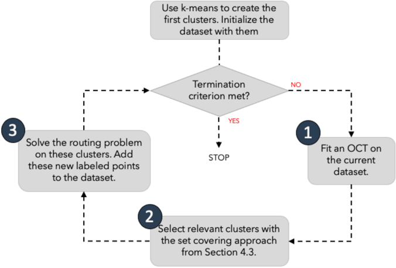

𝑘 = 𝑁 𝑐 with 𝑁 being the total number of stops and 𝑐 the vehicle's capacity. This dataset is iteratively extended until a pre-defined termination criterion is met, following the three steps indicated in Figure 4-6. First, we update the OCT considered by fitting it on the current dataset. Second, we seek to generate new data points, i.e., sets of stops labeled with the minimal number of vehicles required to serve them. We create new clusters by applying the set covering approach described in Section 4.3 with a robustness threshold 𝑡 = 0 1 . , using the OCT fitted during the first step. This second step is described in more depth in Algorithm 13. Third, the routing problem is solved on each of these clusters to determine the actual minimal number of vehicles required to serve them. These new clusters and their labels are then added to the dataset. We repeat this procedure until the pre-defined termination criterion is met. The termination criterion could be either a certain level of

accuracy reached on the clusters selected by the set covering approach, a certain number of observations in the dataset, or a certain number of iterations. For the results presented in this thesis, we set as termination criteria a maximum number of 30 iterations and a threshold of 6 000 , observations in the dataset, whichever occurs on first.

In terms of computation time, this framework requires slightly more time than the dataset creation approach presented in Section 4.3. This additional time is mainly due to the cluster selection process via the set covering approach, i.e., the second step in Figure 4-6, and corresponds to 10 to 15% of the total computation time.

Algorithm 13 details how we select which clusters should be added to the dataset, i.e., Step 2 of the Learn and Optimize framework. The rationale behind Algorithm 13 is to

## Algorithm 13: Selecting relevant clusters in the Learn and Optimize Framework

- 1 𝒳 ← ∅ ;
- 2 𝒞 ← the set of clusters generated with Algorithm 2 with the robustness threshold set to 𝑡 = 0 1 . ;
- 3 𝒞 𝑙𝑜𝑤 ← the clusters in 𝒞 with a predicted number of vehicles less or equal than 4 ;
- 4 Solve the relaxation of IP (4.2) with 𝒮 = 𝒞 , and denote ℛ the set of clusters whose value is above the 95 𝑡ℎ percentile, and ℛ 4 the set of cluster whose value is not null and whose prediction is at least 4 ;
- 5 𝒳 ← 𝒳 ∪ ℛ ∪ ℛ 4 ;
- 6 Solve IP (4.2) with 𝒮 = 𝒞 𝑙𝑜𝑤 , and denote 𝒜 1 the solution ;
- 7 𝒳 ← 𝒳 ∪ 𝒜 1 ;
- 8 Solve IP (4.2) with 𝒮 = 𝒞 𝑙𝑜𝑤 ∖𝒜 1 , and denote 𝒜 2 the solution ;
- 9 𝒳 ← 𝒳 ∪ 𝒜 2 ;
- 10 return: the final set of clusters 𝒳

select near-optimal clusters with respect to the set covering problem IP (4.2). Therefore, we are interested in the clusters in the solution of the relaxation of IP (4.2), as they strongly influence the column generation approach in Algorithm 2. We are also interested in the clusters which compose the solution of the IP (4.2). Note that we solve the IP (4.2) twice, at Steps 6 and 8 of Algorithm 13, to ensure that we gather enough clusters at each iteration. As we aim at obtaining a high accuracy on the clusters selected, and as Section 3.4 has shown that it seems easier to accurately predict a low number of vehicles, we restrain the set of considered clusters in IP (4.2) to the one requiring at most 4 vehicles to be served. This enables us to build a dataset aimed at increasing the accuracy on such clusters. However, to successfully perform this goal, the OCT needs to be able to distinguish between clusters whose required number of vehicles is at most 4 , and the clusters whose required number of

vehicles is above 4 . Therefore, at Step 4 of Algorithm 13, we specifically target clusters with a label of 4 in the solution of the relaxation of IP (4.2).

## 4.4.2 Convergence of the Learn and Optimize Approach

The framework presented in Section 4.4.1 intends to increase the accuracy on the clusters obtained when solving the IP (4.2). This section confirms the increase in the accuracy by presenting the convergence, in terms of accuracy and prediction error, across iterations.

Figure 4-7 presents the accuracy obtained on the clusters selected via the set covering approach (MIP accuracy) and the accuracy obtained on the OCT fitted at each iteration (OCT accuracy), when applying the framework with 1 000 , customers. It shows that the accuracy

Figure 4-7: Accuracy of the Set Covering Approach and of the OCT across iterations

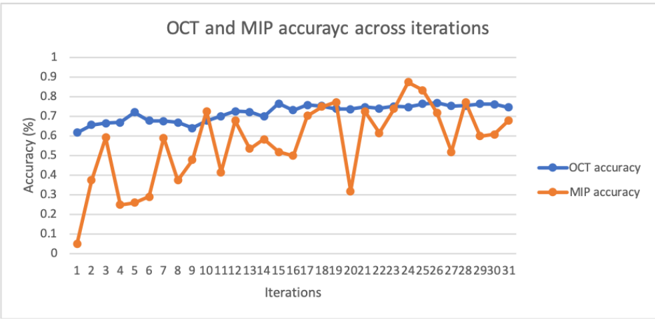

of the OCT and the one obtained on the clusters resulting from the set covering problem generally increases across iterations, even if the MIP accuracy does not strictly increase at each iteration. In addition, we note that we reach a higher MIP accuracy when using the Learn and Optimize approach compared to using the exact or set covering approaches, described in Sections 4.2.3 and 4.3.4, respectively.

Figure 4-8 presents the error rate across iterations in this framework, i.e., the percentage of difference between the predicted number of vehicles given by the set covering approach and the actual number of vehicles obtained when solving the routing problem on each cluster with an industrial solver. These results are obtained when applying the Learn and Optimize framework on the 1 000 , customers instances. Figure 4-8 seems to suggest that the error rate generally decreases throughout iterations. This decrease corroborates the increase in terms of the MIP accuracy: as the predictions are more accurate, the gap between the number of

Figure 4-8: Error rate of the set covering problem (4.2) across iterations

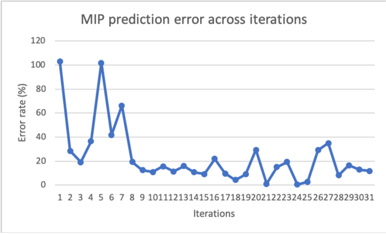

vehicles expected and the one obtained once solved exactly reduces. In addition, we note that the error rate reached at the end of the iterations is lower than the one obtained via the methods previously developed in Sections 4.2.3 and 4.3.4.

## 4.4.3 Results of the Learn and Optimize Approach

The results obtained with the last iteration of the Learn and Optimize framework are presented in Table 4.6. The OCT accuracy column provides the accuracy of the OCT fitted on all the observations gathered throughout the iterations. The MIP accuracy column corresponds to the percentage of clusters obtained with the set covering approach for which the actual number of vehicles required to serve them is equal to the predicted number of vehicles. The prediction error rate column indicates the gap between the total predicted number of vehicles, i.e. the objective value of the IP (4.2), and the total number actually obtained when solving the routing problem on each of the clusters selected with the set covering approach. Table 4.6 confirms that this framework enables us to increase the accuracy on the final clusters, and hence to decrease the error rate. Note that the MIP accuracy and the prediction error rate are with respect to the last iteration of the Learn and Optimize framework. However, as show in Figures 4-7 and 4-8, the accuracy and the error rate fluctuate over iterations, despite their clear trend. Therefore, the numbers presented in Table 4.6 confirm the benefit of this framework, but do not enable us to precisely quantify it, because of the important variations of the accuracy and the error rate. The variations between two

Table 4.6: Results of the Learn and Optimize framework for instances with different number of customers

| Number customers   |   OCT accuracy (%) |   MIP accuracy (%) |   Prediction error rate (%) |
|--------------------|--------------------|--------------------|-----------------------------|
| 600                |               76.5 |               70.6 |                         4.9 |
| 1,000              |               74.6 |               68   |                        11.9 |
| 1,500              |               81.9 |               72.7 |                        12.9 |
| 2,000              |               78.7 |               64.4 |                        12.7 |
| 3,000              |               77.5 |               58.8 |                        13.9 |
| 10,000             |               81.9 |               75.1 |                         9.3 |

iterations may be explained by the changes in the OCT, and most importantly by the randomness in the clusters selected, which results from Algorithm 2. While we cannot quantify the exact accuracy gained from the Lean and Optimize approach, we note that there is still a gap between the OCT accuracy and the MIP accuracy. This seems to suggest that this approach does not completely overcome the difficulty of creating an ideal dataset on which to train the ML model. Given its impact on optimality, improving this further is of great interest in subject for future research.

## 4.5 Analysis of Results

This chapter explores the benefits and challenges of combining ML tree-based methods with an optimization algorithm. More specifically, it develops a clustering algorithm leveraging the information provided by an OCT predicting the number of vehicles at sets of stops level. The results discussed in the previous sections have focused on the accuracy of the clusters obtained via the clustering algorithm, as it appears to be one of the main difficulty encountered when leveraging OCT information within a clustering algorithm aiming at minimizing the total number of vehicles required to serve a set of customers. This section discusses the performance, relative to the total number of vehicles obtained, of the approaches developed in the previous Sections 4.2, 4.3 and 4.4.

## 4.5.1 Evaluation and Goals

To evaluate the performance of our approaches, for each number of customers, we consider one instance among the one generated (Section 3.1). We then solve the routing problems on this instance using our approaches: the set covering approach (Section 4.3) and the Learn

and Optimize framework (Section 4.4). We benchmark it against two methods:

- 1. A naive clustering approach, in which clusters are created using a k-means algorithm. 𝑘 is chosen as the total demand divided by half the vehicle's capacity. The rationale behind this number is that we intend to obtain clusters of small size, which require less than 4 vehicles to be served. The number of vehicles for each cluster is then determined using LocalSolver, an industrial solver.
- 2. A global approach, in which we use LocalSolver to solve the VRPTW on each instance. In this approach, there is no pre-processing step.

The goal of this benchmark is twofold. First, we are interested in comparing the total actual number of vehicles found between these four approaches. Second, we intend to explore the computation time of each method.

## 4.5.2 Optimality in Terms of Number of Vehicles

Given the randomness inherent to the four approaches considered, the set covering approach, the Learn and Optimize framework, a k-means approach, and LocalSolver, we run them five times on the same instance and discuss here the averaged results. Figure 4-9 presents the average total number of vehicles obtained with the different approaches on different customer instances. The 'k-means' label refers to the naive clustering approach described in

Figure 4-9: Total number of vehicles obtained with the different approaches, function of the number of customers

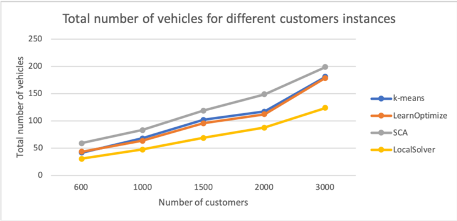

Section 4.5.1, the 'SCA' label refers to the set covering approach described in Section 4.3, the

'LearnOptimize' label refers to the Learn and Optimize framework introduced in Section 4.4, and the 'LocalSolver' label refers to the industrial solver we use to solve the complete instance, without any pre-processing step. Figure 4-9 shows that the state-of-the-art solver clearly outperforms any other approach. It also demonstrates that the decrease in error rate between the set covering approach and the Learn and Optimize framework translates to a decrease in the actual number of vehicles as well. It seems that its low accuracy severely hurts the set covering approach: the actual number of vehicles found is almost twice the one found with LocalSolver. However, we note that the Learn and Optimize framework outperforms the k-means clustering approach by 3 to 5% on average, showing the benefit of using our approach over a traditional k-means.

While Figure 4-9 presents the average actual number of vehicles with each method, we are also interested in the predicted number of vehicles with each method, to asses the effectiveness of our approaches and the impact of their accuracy on the difference between the predicted and actual number of vehicles. Therefore, Figure 4-10 presents the average predicted number of vehicles with each method, i.e., the sum of the predicted number of vehicles required to serve each cluster. For the Learn and Optimize framework and for the set covering approach,

Figure 4-10: Predicted number of vehicles of the different approaches, function of the number of customers

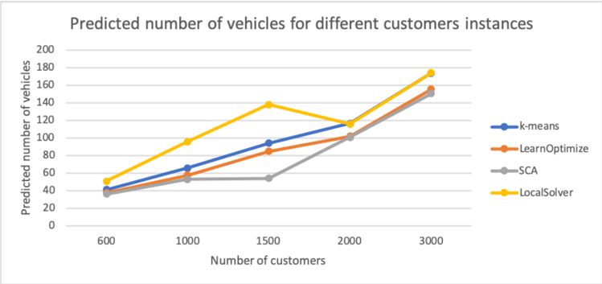

this number directly corresponds to the objective value of IP (4.2) solved with the clusters generated via Algorithm 2. For the k-means approach, it corresponds to the sum of the predicted number of vehicles for each of the 𝑘 clusters determined by the k-means algorithm. However, for the LocalSolver approach, no clustering is performed as a pre-processing step and no prediction is made. Therefore, we report the predictions a-posteriori: for each route

in the final solution, we compute its predicted number of vehicles using the OCT previously fitted through the Learn and Optimize framework. These predictions are then summed to obtain the predicted total number of vehicles. The results of Figure 4-10 suggest that the weak performance of the set covering approach, and to a smaller extend the one of the Learn and Optimize framework, are mainly due to the high prediction errors. While the set covering approach obtains the best predicted results, it also obtains the worse actual results, as the accuracy on the clusters built within this approach is very low. It is interesting to notice that, in the set covering approach and in the Learn and Optimize framework, the OCT underestimates the number of vehicles required to serve all customers, while it over-estimates this number for the routes built by LocalSolver. The under-estimation of the number of vehicles, in both of our approaches, may be explained by the fact that we aim at minimizing the total number of vehicles. This objective leads to select a high proportion of adversarial clusters, for which the number of vehicles required to serve them is under-estimated. The overestimation on the routes built by LocalSolver highlights that misclassification also happens in the reverse sense: a cluster which would only requires one vehicle gets a prediction of two vehicles. This effect also explains why even the predicted number of vehicles, on both our approaches, is higher than the actual number of vehicles found by LocalSolver.

## 4.5.3 Computation Time

In addition to optimality, computation time is another major concern of routing algorithms. Due to their inherent combinatorial nature, the computation time of routing algorithms is usually non-linear in the number of customers. One benefit of a divide-and-conquer approach such as ours, is the ability of parallelizing the routing process on each cluster, as they are independent of one another. Figure 4-11 presents the number of vehicles obtained on an instance with 2 000 , customers as a function of the computation time allocated to the routing problem . 2 'LocalSolver' label corresponds to the total number of vehicles obtained when using LocalSolver to solve the whole instance. The other labels corresponds to the total number of vehicles obtained when solving the routing problem using LocalSolver on each of the clusters determined by the Learn and Optimize framework. 𝑥 threads indicates the number of threads used to parallelize the routing process. Figure 4-11 suggests that LocalSolver is quite competitive in terms of computation time: in less than 200 seconds it reaches its best solution, which is better than any solution reached with the Learn and Optimize framework. Figure 4-11 confirms the benefit of parallelizing the computation.

2 Results obtained on a macOS 10.14 with a 3.1 GHz processor and 16GB of memory

Figure 4-11: Number of vehicles function of running time on the routing problem

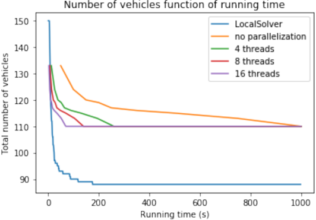

Using 8 or 16 threads enables the user to reach the best solution for the Learn and Optimize framework within a computation time similar to LocalSolver.

Figure 4-12 focuses on very low computation times. It suggests that the Learn and

## Number of vehicles function of running time

Figure 4-12: Number of vehicles function of running time on the routing problem for low time

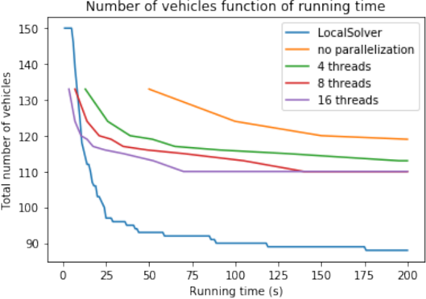

Optimize framework provides an advantage over LocalSolver only if the routing is parallelized with a very high number of threads. Below 16 threads, LocalSolver proposes faster and better results. If run with 16 threads, the Learn and Optimize framework proposes a better solution as long as the computation time is below 20 seconds. This solution could therefore be used

as an initial solution to a global routing approach, such as LocalSolver. However, in addition to the very high number of threads required for such a benefit, we also point out that the computation time presented here only corresponds to the time spent on the routing itself. The time spent on the clustering algorithm is not included. While we believe that the clustering algorithm used in the Learn and Optimize framework can be sped-up if properly coded and in a more efficient language than Python, it currently requires several minutes of computation time, making our approach definitively slower than a state-of-the-art solver such as LocalSolver.

## Chapter 5

## Using Reinforcement Learning Methods to Solve the VRPTW

In Chapter 4, we developed an algorithm to cluster customers that aims at minimizing the total number of vehicles. Dividing the initial problem into multiple sub-problems, corresponding to each cluster, enables us to subsequently leverage state of the art routing algorithms, which are efficient at solving on relatively small sets of customers. In this chapter, rather than relying on standard routing algorithms for these explicit routing of the customers in each cluster, we seek to design an algorithm exclusively based on ML techniques. We extend the work of Nazari et al. (2018b) to tackle the VRPTW with the objective of first minimizing the number of vehicles and second the total distance.

## 5.1 An Actor-Critic State Dynamic Approach

Section 2.3.3 provides an overview of the extant RL methods that relate to routing problems. Our work builds on an actor-critic network created to solve the VRP on randomly generated and uniformly distributed instances while minimizing the total distance travelled (Nazari et al. 2018b) . 1 In this context, Nazari et al. (2018b) sees the VRP as a Markov decision process: the optimal solution is a sequence of decisions. For each new input, the RL algorithm increases the probability of decoding near-optimal sequences. In this section, we detail the architecture of Nazari et al. (2018b)'s network.

1 source code: https://github.com/OptMLGroup/VRP-RL )

## 5.1.1 Inputs, Actions and Policies

Let 𝑋 = { 𝑥 , 𝑖 1 ≤ 𝑖 ≤ 𝑀 } be the set of inputs. Each input 𝑥 𝑖 ∈ 𝑋 is composed of static elements 𝑠 𝑖 and dynamic elements 𝑑 𝑖 , such that 𝑥 𝑖 = ( 𝑥 , 𝑑 𝑖 𝑖 ) . With respect to the VRP, 𝑥 𝑖 represents the 𝑖 𝑡ℎ node; the static elements are its coordinates and the dynamic element is the demand. Since the VRP involves a dynamic state, the input changes over time. Formally, each input 𝑥 𝑖 is a sequence { 𝑥 𝑡 𝑖 = ( 𝑠 , 𝑑 𝑖 𝑡 𝑖 ) , 𝑡 = 0 1 , , . . . } , in which 𝑥 𝑡 𝑖 can be interpreted as the state of input 𝑥 𝑖 at time 𝑡 . We denote the set of all inputs at a time 𝑡 as 𝑋 𝑡 .

Given an arbitrary input 𝑋 0 , there are a combinatorial number of available inputs 𝑋 𝑡 . The actions taken until time 𝑡 determine the input 𝑋 𝑡 . In the VRP, an action corresponds to choosing which node is to be visited next, and the transition from one input 𝑋 𝑡 to an input 𝑋 𝑡 +1 corresponds to an update to the node demand.

Hence, a policy is defined as a sequence of actions that is built step-by-step by using a decoding process: given the input of the decoder step, an action is chosen and determines the next input state 𝑋 𝑡 +1 . Let 𝑦 𝑡 denote the pointer at step 𝑡 , pointing to one of the available input 𝑋 𝑡 and let 𝑌 𝑡 = { 𝑦 , 𝑦 0 1 , . . . , 𝑦 𝑡 } be the sequence of pointers up to step 𝑡 . Through the chain rule, the probability of generating a sequence 𝑌 according to a policy 𝜋 is

<!-- formula-not-decoded -->

If 𝜋 was the optimal policy 𝜋 * , then P ( 𝑌 𝑋 | 0 ) = 1 if and only if 𝑌 is the optimal strategy. Therefore, our goal is to set 𝜋 as close to 𝜋 * as possible, i.e., only giving the near-optimal strategies a high probability.

## 5.1.2 Actor-Critic Algorithm

Nazari et al. (2018b) use an actor-critic network to solve the VRP. As described in Section 2.3.1, the actor-critic method introduced by Konda and Tsitsiklis (2000) can be interpreted as a policy search method in which the Q-value, the expected reward for a specific action taken at a certain step, is learnt. The policy and the Q-value are associated with two neural networks parametrized by 𝜃 and 𝜑 , respectively. Φ denotes the distribution of the training instances. In Algorithm 14, we provide an overview of the classical actor-critic method used in Nazari et al. (2018b). At Step 4, 𝑁 instances are drawn and each instance corresponds to the training batch on which the networks will be updated during the current iteration. The While loop in Step 7 corresponds to the decoding loop, in which the subse-

## Algorithm 14:

```
1 Initialize the actor and critic networks ; 2 for iteration = 1 2 , , . . . do 3 Reset gradients: 𝑑𝜃 ← 0 , 𝑑𝜑 ← 0 ; 4 Sample N instances according to Φ ; 5 for n = 1 , . . . , 𝑁 do 6 𝑡 ← 0 ; 7 while termination criterion do 8 Choose 𝑦 𝑛 𝑡 +1 according to 𝜋 . 𝑌 ( | 𝑛 𝑡 , 𝑋 𝑛 𝑡 ; 𝜃 ) ; 9 Update new state 𝑋 𝑡 +1 ; 10 𝑡 ← 𝑡 +1 ; 11 end 12 Compute reward 𝑅 𝑛 = 𝑅 𝑌 ( 𝑛 𝑇 , 𝑋 𝑛 0 ) ; 13 end 14 𝑑𝜃 ← 1 𝑁 ∑︀ 𝑁 𝑛 =1 ( 𝑅 𝑛 -𝑉 ( 𝑋 𝑛 0 ; 𝜑 ))Δ 𝜃 𝑙𝑜𝑔𝑃 ( 𝑌 𝑛 | 𝑋 𝑛 0 ; 𝜃 ) 15 𝑑𝜑 ← 1 𝑁 ∑︀ 𝑁 𝑛 =1 Δ ( 𝜑 𝑅 𝑛 -𝑉 ( 𝑋 𝑛 0 ; 𝜑 )) 2 ; 16 Update 𝜃 and 𝜑 by 𝑑𝜃 and 𝑑𝜑 ; 17 end
```

```
Actor-critic method using REINFORCE Algorithm ;
```

quent actions are chosen. Once the 𝑁 instances have been decoded, we update the actor and critic networks in Steps 14 and 15, respectively. 𝑉 ( 𝑋 𝑛 0 ; 𝜑 ) corresponds to the reward approximation of the 𝑛 𝑡ℎ instance, computed by the critic network. Given that the Q-value is an expectation, the REINFORCE rule introduced by Williams (1992) is used to update the gradients of both neural networks, as seen in Steps 14 and 15.

## The Actor Network

The actor network, used at Step 8 of Algorithm 14, encodes the policy that outputs a probability distribution over all actions. Hence, the actor network defines which node to choose. Figure 5-1 provides an overview of the structure of the actor network. It is composed of three main parts. The first part is the embedding component: it encodes the input structure. Given that the VRP inputs are permutation invariant, Nazari et al. (2018b) choose a convolutional layer, effectively mapping each node's information to a higher encoding space. The second component is an RNN decoder that stores the information of the previously decoded sequence and is only fed with the static elements of the sequence. The third and main component is an attention mechanism whose input are the RNN's hidden state and the embedded input. This attention mechanism produces a probability distribution over the

Figure 5-1: Actor network model used in Nazari et al. (2018b)

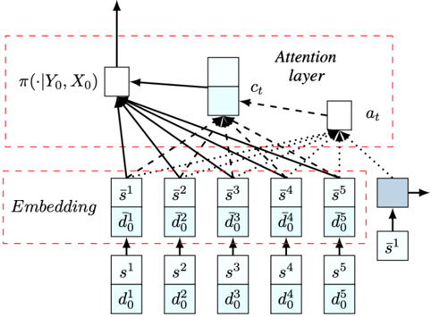

next action. It allows the network to focus on the relevant information of the current state 𝑋 𝑡 and of the decoded sequence to produce an improved probability distribution. In contrast to the RNN, the attention mechanism includes the dynamic elements of the state.

Given the capacity constraints inherent to real-world VRPs, not every action results in a feasible route. Therefore, to ensure the feasibility of every route, the actor network should output a probability of zero for infeasible actions. In that regard, a mask is updated at each step of the decoding process and all masked nodes are attributed a null probability.

Based on the probability distribution outputted by the actor network at each step, the sequence of customers can be decoded. There are three main decoding techniques:

- 1. Stochastic: choose the next action by sampling from the outputted probabilities.
- 2. Greedy: choose the next action to be the one with the highest probability.
- 3. Beam Search: apply beam search (Medress et al. 1977) over the next predefined range of actions.

Nazari et al. (2018b) train the network by taking a stochastic approach and evaluate the model using the greedy and beam search methods.

## The Critic Network

The critic network estimates the reward for any instance from a given state, i.e. provides 𝑉 ( 𝑋 𝑛 0 ; 𝜑 ) in Algorithm 14. The network uses a RNN to decode the embedded input, coupled

with an attention mechanism that takes as input the current sequence and the dynamic elements of the current states. Finally, the critic network outputs the reward estimation using two dense layers.

## 5.2 A Time Window Extension

Nazari et al. (2018b) provide a broad framework to solve routing problems using the actorcritic method, however, they only adapt it to solve the VRP with no consideration of time windows. In this section, we present our extension to address the VRPTW, that rely on modeling additional constraints within the framework and modify the policy search method.

## 5.2.1 Modeling the Time Windows Constraints

Time windows impose the following constraints: each node must be visited during its scheduled time window and we assume that vehicle wait-time at a customer is allowed, should the vehicle have arrived early. We extend the distribution Φ of the training instances to generate instances with time windows at each node. The depot is also assigned a time window, the start of which corresponds to the earliest time that a vehicle is permitted to depart from the depot, and the end of which corresponds to the latest time at which it is allowed to come back.

In our proposed modeling scheme, each input 𝑥 𝑖 ∈ 𝑋 is composed of three dynamic elements. 𝑑 𝑡 𝑖 corresponds to a vector composed of the following elements: the demand of node 𝑖 at step 𝑡 ; the time remaining, with respect to step 𝑡 , before the beginning commit time of node 𝑖 ; and the time left, with respect to step 𝑡 , before the end commit time of node 𝑖 . To make sure that the time windows are respected, we update the mask for each customer so that all customers whose end commit times could not be reached in the next decode step are masked.

## 5.2.2 Integrating Time Windows in the Attention Mechanism

As dynamic elements of the input, the time window components of all nodes are essential components in the attention mechanism, as they help to determine on which node to focus. Therefore, we modify the attention mechanism used in the actor network. The later takes as input its previous input as well as the remaining time on the commit times for each node. These remaining times are encoded using two convolutional layers. We also extend

the attention process used in the critic part, by integrating the beginning and end times of the time windows of all nodes within the information encoded by the RNN network.

## 5.2.3 Updating the Penalty Function

Contrary to the VRP, the number of vehicles required to serve a set of customers does not only depend on the aggregate demand. Instead, the time windows introduce other limitations: vehicles can both cube-out, i.e., be limited by their capacity, and time-out, i.e., be limited by the maximum length of the shift or by the time-windows of the customers. Analogous to most VRPTW applications and research, and driven by the high cost of labor, we are interested in first minimizing the total number of vehicles and then minimizing the total distance traveled. We assume that a vehicle cannot return to the depot during the shift, i.e., each vehicle is allowed a single route per day. Therefore, a return to the depot is effectively modeled as a new vehicle, and we aim at minimizing the number of returns to the depot.

In this case, our reward function is the negative of a factor 𝑀 times the number of returns to the depot plus the total distance traveled. The factor 𝑀 is set to a large number to give sufficient weight to minimizing the number of returns.

## 5.3 Input Embedding

Considering solely the features of a single node (location, demand quantity, and time window) yields no information about the optimal customer sequence. Therefore, this underlying structure cannot be used directly by the neural network. Instead, the node features must first be re-projected to a different space in what we call the input embedding step. This section is devoted to understanding the impact of the input embedding on the convergence and performance of the RL model.

## 5.3.1 The Complexity of Routing Problem Embedding

Routing problems are intrinsically combinatorial problems and their nature makes them complex to encode in a useful way. This is due to three main reasons:

- ∙ As mentioned previously, the examination of a single node does not provide a complete understanding of the problem. The complexity inherent in the VRPTW lies in the interaction between different nodes: the feasibility of a route can only be determined by

considering the node sequence as a whole. While Nazari et al. (2018b) face this problem in the the VRP, the addition of time windows causes increased node dependency.

- ∙ Routing problems have a graph structure and one of the characteristics of this structure is node permutation invariance. Ideally, every permutation of the input should be encoded in the same way.
- ∙ The VRP and VRPTW have dynamic components, as the capacity and the time remaining to meet the time window requirements change over the sequence of actions. Therefore, a good encoder should not require re-computing the entire encoding at every state change. Such a re-computation would also harm the back-propagation algorithm efficiency.

While sequence-to-sequence models, which encode a sequence and then decode it to output a new sequence, have been extensively studied in combinatorial problems, they do not meet the second and third requirements. Specifically, they add an unnecessary complexity due to the fact that there is no inherent order within any VRP and VRPTW input.

Nazari et al. (2018b) propose a simple input embedding, in which each set of customers is embedded using a one dimensional convolutional layer. To respect the embedding invariance over actions, only the static elements are embedded: the demand of each node is not part of the information carried forward.

## 5.3.2 Designing an Embedding Based on Transfer Learning

Transfer Learning (TL) is a ML technique which intends to transfer knowledge acquired when learning one task to another task. The task from which is extracted the knowledge is called the source task , and the task to which the knowledge gained is applied is termed the target task (Pan &amp; Yang 2009). The goal of TL is to reduce the number of training points required, an impediment to many successful RL implementations due to its computational cost, by successfully using the transferred knowledge. Given the ability of deep learning methods to learn latent features, deep neural networks have naturally been considered as prime candidates for tasks with complex structure (C. Tan et al. 2018), such as language or image classification (Huang, Li, Yu, Deng, &amp; Gong 2013, Oquab, Bottou, Laptev, &amp; Sivic 2014).

This section explores the potential benefits of using TL to improve the input embedding used in the RL model, as discussed in Section 5.3.1. The rationale behind it is twofold.

First, TL can reduce the number of training data points required, therefore benefiting the RL algorithm's computational time. Second, extracting latent features from the input is complex, and TL could provide such features. Taylor and Stone (2009) provide an overview of TL applied to RL, and describe four potential benefits:

- ∙ Jumpstart: the initial performance of an agent in a target task may be improved by transfer from a source task.
- ∙ Asymptotic Performance: the learnt performance of an agent in the target task may be improved via TL.
- ∙ Total Reward: the total reward accumulated by an agent across iterations may be improved if it uses TL, compared to learning without TL.
- ∙ Time to Threshold: the learning time needed by the agent to achieve a pre-specified performance level may be reduced via TL.

We intend to replace the current embedding process by using latent features learned through a source task defined for this application. Given a set of nodes as an input, the source task aims at predicting the number of vehicles required, as described in Chapter 3. We first generate customer instances following the distribution function Φ of Algorithm 14 and label each set of customers with the number of vehicles required to serve them. Then, we train a GNN introduced by Brockschmidt (2019), to perform the source task . The GNN is described in greater detail in Section 3.3.2. Like most deep neural networks, this GNN can be decomposed into two parts: the first part is the node feature transform, while the second part is the graph classifier. The hope is that the last layer of the feature transform component acts like a representation of the aggregate features of set of customers. Therefore, and as shown in Figure 5-2 , we used the first part of this neural network as the embedded 2 input in our RL task. In Figure 5-2, task A corresponds to the classification task, while task B corresponds to the RL task.

2 source: https://mobilelabs.in/how-to-build-an-audio-detector

Figure 5-2: Deep TL pictorial representation

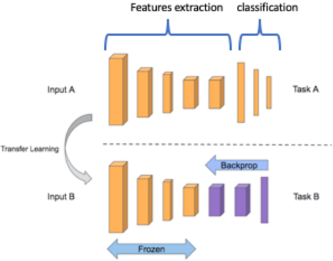

## 5.3.3 Transfer Learning Results and Discussion

This section presents the results obtained with and without the TL embedding, on both the VRP and VRPTW. Figures 5-3 and 5-4 present the evolution of the penalty function on the test set considered with and without TL, for the VRP and VRPTW, respectively. We consider 20 nodes and emphasize that the test sets are the same in both the algorithms with and without TL, justifying the comparison of the penalty function, defined as the total distance traveled. For both the VRP and the VRPTW, we see that the TL-enabled

Figure 5-3: Penalty value on the test set when solving the VRP with and without TL

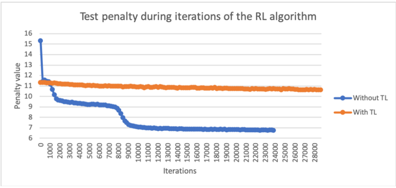

algorithm under-performs with respect to the one without TL. In addition to the increased embedding time required, the TL appears to penalize the learning of an efficient policy, as shown by the slower decrease of the penalty value on the test set when compared to the

Figure 5-4: Penalty value on the test set when solving the VRPTW with and without TL

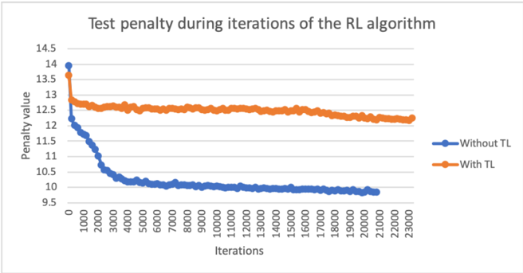

algorithm without TL. Both Figures 5-3 and 5-4 suggest that using the node representation provided by the GNN trained on auxiliary task results in a negative transfer, i.e. the transfer learning inhibits the learner's performance.

Based on our general knowledge of TL and the results from Nazari et al. (2018b) regarding the embedding step, we develop three hypotheses, which may explain this negative transfer.

First, the auxiliary task used to train the GNN, predicting the number of vehicle, is very different from deciding which node to visit next. This may have led to a features extraction not appropriated for the RL task. Second, the dynamic components, such as demand and time windows, are integrated within the features of the GNN to perform the classification task. Therefore, the node representation derived from the GNN represents an accurate snapshot of the set of customers at the start time, but this is no longer true in subsequent steps. Third, contrary to the RL algorithm without embedding, the model is not trained to learn the weights of the embedding layers.

## 5.4 Computational Experiments

Our objective is to assess the viability of RL methods when addressing the VRPTW and to understand the extend to which this approach would lead to successful applications. Therefore, we focus on answering the following questions:

- ∙ Is the approach valid when optimizing the number of vehicles rather than the total distance traveled?
- ∙ Are time window constraints successfully addressed by this RL algorithm?

- ∙ What is the importance of the training distribution?
- ∙ How reliable is the RL algorithm when applied to a specific instance?

Note that the viability of RL in the context of the VRP regarding the minimization of distance has been addressed in Nazari et al. (2018b), hence we do not address this issue. To evaluate our approach, we compare our solutions with those obtained from well-known algorithms proposed in the OR literature: the savings heuristics for the VRP developed by Clarke and Wright (1964), and the insertion heuristics for the VRPTW, named I1, proposed by Solomon (1987). In addition, we compare our results against state-of-the-art algorithms like Google's optimization tools: Google OR-Tools . 3

For all experiments reported below, we generate and run the methods described in this chapter on 1,000 instances. In each case, we measure:

- ∙ S: the success rate of the RL approach vs. the other methods as a percentage of the number of times the RL approach beats or matches the other methods, with respect to the objective considered.
- ∙ D: the percentage representing the marginal gap between the distance provided by the RL approach versus the other methods. If this number is positive, the RL approach performs better by the corresponding percentage.
- ∙ V: the percentage representing the marginal gap between the number of vehicles provided by the RL approach versus the other methods.

## 5.4.1 Performance of the Extended Actor-critic Algorithm on the VRPTW

This section evaluates the performance of the extended algorithm on the VRPTW. To generate the instances, we build upon the distribution used in Nazari et al. (2018b). Each node is defined by its ( 𝑥, 𝑦 ) coordinates, a delivery time window consisting of a pair or times ( 𝑠, 𝑡 ) with 𝑠 &lt; 𝑡 and a demand 𝑑 consisting of a package quantity to be delivered. Each problem consists of one depot, characterized by its coordinates ( 𝑥, 𝑦 ) , a null demand, and a time window indicating the period of the day during which a vehicle can operate. 𝑥 and 𝑦 are uniformly drawn from the [0 , 1] interval. 𝑑 is uniformly drawn from the [1 , 9] interval. For each stop the center of its time window is uniformly drawn from the [1 , 7] interval and its

3 https://developers.google.com/optimization/routing/

duration is one unit. The vehicle operates from time 0 to 8 and has a constant speed equal to one unit distance per time. The capacity varies between 20 and 45 items, depending on the number of customers.

## Minimizing the Total Traveled Distance on the VRPTW

In a first set of experiments, we seek to minimize the total traveled distance for the VRPTW and train three models for 10, 20 and 50 nodes, respectively. We report the results including comparison with I1 and Google OR Tools in Table 5.1. The RL approach almost always

Table 5.1: Minimizing the total traveled distance: comparison of RL method versus I1 and Google OR

| Nodes    | 10   | 10   | 10    | 20   | 20   | 20    | 50   | 50   | 50    |
|----------|------|------|-------|------|------|-------|------|------|-------|
| Nodes    | S    | D    | V     | S    | D    | V     | S    | D    | V     |
| I1       | 91.5 | 21.3 | -25.2 | 99   | 22   | -23.4 | 99.5 | 22.6 | -14.5 |
| OR Tools | 62.9 | 5.01 | -11.2 | 59.9 | 3.1  | -9.3  | 42.2 | -1.2 | -2.8  |

outperforms the I1 heuristic by a significant margin ( ∼ 20% ) for all sizes of instances. On the other hand, our method is comparable to Google OR across all problem sizes. Our method beats Google OR in ∼ 60% of all cases for 10 and 20 node instances by a margin of 3 to 5% , while it is outperformed by Google OR by a margin of -1.2% on 50 node instances. Once trained, the RL approach solves all instances in a running time comparable to Google OR, around 0 1 . seconds per instance with 50 nodes.

## Minimizing the Total Number of Vehicles on the VRTPW

In a second set of experiments, we seek to first minimize the total number of vehicles, and then minimize the total distance traveled. This corresponds to the penalty function we implemented: the number of vehicles is computed as the number of return to the depot. We train three models for 10, 20 and 50 nodes, respectively, and report the results including a comparison of the RL approach performance against the I1 heuristic and Google OR Tools in Table 5.2. The RL approach outperforms all other methods by a comfortable margin, between 11 1 . and 19 3% . . On the other hand, the RL method seems to substantially sacrifice the distance covered. This highlights the importance of parameter tuning for the reward function, so as to obtain a favorable trade-off between the number of vehicles and the total distance traveled. Once trained, the RL approach solves all instances in a running time comparable with Google OR, around 0 1 . seconds per instance with 50 nodes.

Table 5.2: Minimizing first the number of vehicles: comparison of RL approach versus I1 and Google OR

| Nodes    | 10   | 10    | 10   | 20   | 20    | 20   | 50   | 50    | 50   |
|----------|------|-------|------|------|-------|------|------|-------|------|
| Nodes    | S    | D     | V    | S    | D     | V    | S    | D     | V    |
| I1       | 100  | 4.6   | 18.5 | 199  | -12.5 | 16.5 | 100  | -18.1 | 11.1 |
| OR Tools | 99.9 | -12.6 | 19.3 | 100  | -38.6 | 19.1 | 99.6 | -53.6 | 17.4 |

Table 5.2 confirms the benefit of using a RL approach to solve the VRPTW: the quality of the obtained solutions and running times commonly outperform or match those of stateof-the-art solver results.

## 5.4.2 Specificity of the Training Data

In Algorithm 14, the training and test data are generated according to the same distribution function Φ . This section explores the importance of the distribution function and the generalization performance, i.e., the performance on unknown instances, of the RL algorithm proposed by Nazari et al. (2018b) and extended in this work to solve the VRPTW.

We generate a set of instances with a slightly different distribution than the one presented in Section 5.4.1. Figure 5-5 shows 𝑥 and 𝑦 coordinates of nodes drawn from the new dis-

Figure 5-5: Two different distributions used to generate the training and test instances

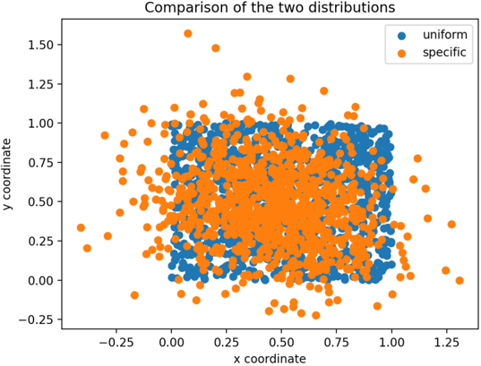

tribution, labeled as 'specific', and from the distribution presented in Section 5.4.1, labeled

as 'uniform'. The reader will note that we purposefully chose this new distribution to be similar to the uniform distribution. Similarly, the demand and time window distributions also slightly differ from the one presented in Section 5.4.1.

To estimate the generalization capability of the RL algorithm, we consider test instances generated via the new distribution. We trained two different RL models: the first one is trained on instances drawn from the new distribution, while the second one is trained on instances drawn from the initial distribution. We then compare the performance of these two RL models when solving test instances generated via the new distribution. In Table 5.3, we report results of the RL model trained on the new distribution against the RL model trained on the uniform distribution.

Table 5.3: Results on the impact of distinct training and test distributions

| Nodes                              | 10   | 10   | 10   | 20   | 20   | 20   |
|------------------------------------|------|------|------|------|------|------|
| Nodes                              | S    | D    | V    | S    | D    | V    |
| RL trained on uniform distribution | 99.5 | 36.4 | 9.5  | 99.7 | 45.8 | 11.6 |

In these results, it is clear that the RL approach's performance on the test data is improved when train and test data distributions are the same, resulting in an improvement on the order of 10% . This highlights the fact that the RL method is very sensitive to the training dataset and that providing specific training data characteristics may yield improved results when compared to a model trained on a more diverse type of data. In terms of real world applicability, we show that this method requires the real instances to be very similar to the one used during the training. Such a requirement may prevent the immediate application of our RL approach to real-world problems, if the problems tackled slightly differ from the ones used in the training, the results may be not as optimal as the ones obtained during the training.

## 5.4.3 Solving on a Specific Instance

Now that we have shown the importance of the train and test data distribution similarity, we explore the reliability of our RL approach for solving a specific test instance. To be able to compare the results obtained from our RL approach with exact solutions, we use the classical Solomon (1987) instances . 4

The Solomon dataset is composed of four different types of instances. We focus on two types: R1 and R2, in which coordinates and demands are randomly generated. Problem sets

4 https://www.sintef.no/projectweb/top/vrptw/solomon-benchmark/

of type R1 have a short scheduling horizon, with extremely tight time windows and allow for only a few customers per route, ranging between 5 and 10 . Problem sets of type R2 have a longer scheduling horizon, with larger time windows, and permit the service of many costumers by each vehicle, often more than 30 . Each of these problem sets has a different time window prevalence, varying between 25% and 100% .

We train two different models: one corresponding to problems of type R1 and the other to problems of type R2. The difference between these two models consist in the distribution used to generate the training data. In the model used to solve R1 instances, the training data have extremely tight time windows, while in the model used to solve R2 instance, the training data have larger time windows. However, we did not differentiate between the percentage of customers with time windows in the training data: depending on the model considered, the training data have either tight or large time windows whose prevalence is random, between 25% and 75% .

We compare the solution found by our RL algorithm as well as the solutions obtained from OR-Tools to the best known solution for three instances of type R1 and three instances of type R2, each of which have a different proportion of customers with time windows. The instances ending in 01 , 02 , and 03 have 100% , 50% , and 25% of time window constrained customers, respectively. The objective function is to first minimize the total number of vehicles, second to minimize the total distance traveled. We report results in Table 5.4, and emphasize that the comparison is not between the RL method and OR Tools, but with the best known results for the Solomon instances.

Table 5.4: Comparison with the best known results on Solomon instances

| Instance   | R1   | R1   | R1   | R1   | R1   | R1   | R2   | R2    | R2   | R2    | R2   | R2    |
|------------|------|------|------|------|------|------|------|-------|------|-------|------|-------|
| Instance   | R101 | R101 | R102 | R102 | R103 | R103 | R201 | R201  | R202 | R202  | R203 | R203  |
| Method     | V    | D    | V    | D    | V    | D    | V    | D     | V    | D     | V    | D     |
| RL         | 0    | 26.5 | 5.1  | 37.1 | 23.1 | 43.9 | 100  | 117.8 | 166  | 140.8 | 100  | 185.2 |
| OR Tools   | 15.7 | 3.3  | 5.1  | 2.3  | 7.7  | -4.7 | 25   | 7.6   | 33.3 | -3.1  | 33.3 | 4.6   |

From these results, it seems quite clear that our RL model is far from the best known results, and is usually outperformed by Google OR Tools. In addition, it seems that the RL approach performs better on highly constrained problems: both RL models are closer to the optimal solution when the percentage of time windows is higher, and the overall results are better on the R1 instances. This may be explained by the smaller feasible solution space encountered in the more constrained problems: given that the set of feasible actions is more constrained, a near-optimal policy is learnt faster. Furthermore, the RL models were trained

on minimizing the number of vehicles first, and second the distance, which may explain why the distance largely surpasses the one found by Google OR Tools.

Contrary to the previous results in which we aggregated results over thousands of instances, in this experiment we only account for three instances, and therefore evaluate the performance of our model as if it were fed a specific instance at random. This is justified by the fact that our RL models are trained to perform well on any instance generated in a similar way. Therefore, we are interested in the convergence of the RL approach on one single instance across iterations. Figure 5-6 presents the value of the penalty function across iterations when applied to the specific R101 instance, indicated by the blue line, and its average value when applied to thousands of generated instances, indicated by the orange line.

While the variation of the average penalty is quite small and decreases with the number of

Figure 5-6: Specific and aggregated penalty function value across iterations.

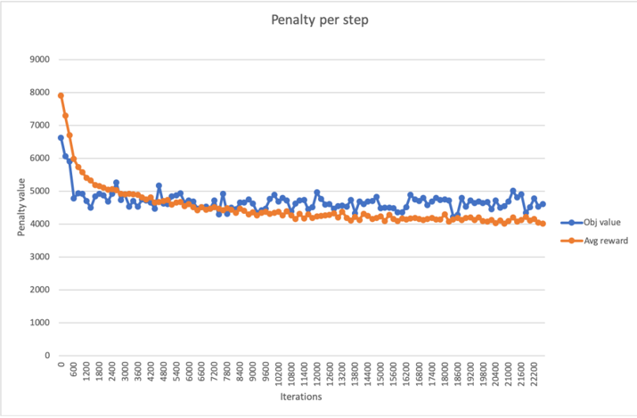

iterations, the variation of the targeted instance's penalty is more significant. These results highlight that our RL approach is built to solve a large number of different problem instances rather than focusing on one specific instance. It also suggests that relying on policy obtained across different iterations of the model training to solve one specific instance may provide more optimal results, despite the drawbacks related to running time of having to compute different solutions and consider the best one.

## Conclusion and Next Steps

In this thesis, we present a ML approach to solve large scale VRPTWs based on a divideand-conquer framework. The demand is first divided into smaller clusters via a clustering algorithm that leverages cluster level predictions on the number of vehicles required to serve them. These predictions are obtained with a recently introduced tree-based method, OCTs, using aggregate features at the cluster level. Relying on these forecasts and on the tree architecture of the prediction model, the clustering algorithm divides the demand nodes so as to minimize the total number of vehicles resulting from these clusters. Then, within each cluster, the explicit routing can be handled by a RL algorithm based on an actorcritic method. To the best of our knowledge, this thesis proposes the first approach to solve large-scale VRPTW instances without using OR routing algorithms.

To assess the efficacy of this idea, we define VRPTW instances and analyse the performance of our clustering analysis and of the proposed RL approach. Our results suggest that the clustering algorithm benefits from integrating the tree-based prediction model, and, in the right context, yields improvements when compared to a k-means based clustering approach. More precisely, when compared to a k-means approach, leveraging tree-based information when clustering demand nodes enables a reduction in the number of vehicles up to 5% . While this approach is not currently competitive with industrial solvers as it leads to solution with more vehicles, it provides a method through which routing algorithms can be parallelized on each of the clusters, potentially resulting in a computation time reduction. In addition, our framework is flexible and little parameter tuning is required. Regarding the RL approach for explicit routing, our results confirm the feasibility of using RL to solve highly constrained combinatorial problems such as the VRPTW. They also point out the current limitation in the generalization of the RL approach when the train and test datasets originate from similar but different distributions.

For practitioners, this research provides intuition into how to combine ML and OR algorithms to solve routing problems. The analysis and results presented in this thesis help

foster an understanding of the inherent difficulty in generalizing ML results and predictions to unknown distributions, specifically in an adversarial context created by the optimization algorithm. Although the divide-and-conquer method defined in this thesis under performs compared to industrial solvers relying on classical OR techniques, our algorithmic results may be employed as initial solutions in routing algorithms, yielding potential optimality and computation time improvements.

While we consider time window constraints and vehicle capacity, we do not account for other real-world constraints such as package volume and weight restrictions, or the road network. From a clustering algorithm perspective, these constraints would result in additional features for the tree-based model. Therefore, the flexibility of our approach should enable practitioners to incorporate any number of additional constraints. From a RL perspective, we expect our approach to be easily modified to handle both the new constraints and the additional information through the update step for the current state and the feasible actions set. However, it would be interesting to study the impact of theses constraints on the performance and computation time of the RL algorithm, as well as its generalizability.

Another consideration for future research relates to the performance of the clustering and RL algorithms. First, increasing the accuracy of the clustering algorithm will help improve its optimality performance. This thesis has identified two main hurdles which hinder the overall accuracy: the adversity of the clusters created via the optimization algorithm and the use of different distributions to generate the train and test datasets. Leveraging the Bayesian Optimization Algorithm introduced by Pelikan, Goldberg, Cantú-Paz, et al. (1999) may be a promising approach. Second, improving the generalization of the RL approach would extend its applicability. Although we expect an improved input embedding to ameliorate the approaches' generalizability and increase the training speed of the actor-critic method, none of the input embedding solutions explored in this thesis resulted in conclusive results. Therefore, a deeper analysis of the properties of the input embedding should be carried out, relating the graphical structure of the routing problem instances and its relationship to well-known ML architectures.

## References

Alabas-Uslu, C., &amp; Dengiz, B. (2011). A self-adaptive local search algorithm for the classical vehicle routing problem. Expert Systems with Applications , 38 (7), 8990-8998.

Allen-Zhu, Z., &amp; Hazan, E. (2016). Variance reduction for faster non-convex optimization. In International conference on machine learning (pp. 699-707).

Aloysius, N., &amp; Geetha, M. (2017). A review on deep convolutional neural networks. In 2017 international conference on communication and signal processing (iccsp) (pp. 0588-0592).

Alvarez, Rosasco, L., Lawrence, N. D., et al. (2012). Kernels for vector-valued functions: A review. Foundations and Trends R ○ in Machine Learning , 4 (3), 195-266.

Alvarez, A. M., Louveaux, Q., &amp; Wehenkel, L. (2014). A supervised machine learning approach to variable branching in branch-and-bound. In In ecml.

Alvarez, A. M., Louveaux, Q., &amp; Wehenkel, L. (2017). A machine learning-based approximation of strong branching. INFORMS Journal on Computing , 29 (1), 185-195.

Amari, S.-i., &amp; Wu, S. (1999). Improving support vector machine classifiers by modifying kernel functions. Neural Networks , 12 (6), 783-789.

Amizadeh, S., Matusevych, S., &amp; Weimer, M. (2018). Learning to solve circuit-sat: An unsupervised differentiable approach.

Amizadeh, S., Matusevych, S., &amp; Weimer, M. (2019). Pdp: A general neural framework for learning constraint satisfaction solvers. arXiv preprint arXiv:1903.01969 .

Archetti, C., &amp; Speranza, M. G. (2014). A survey on matheuristics for routing problems. EURO Journal on Computational Optimization , 2 (4), 223-246.

Arulkumaran, K., Deisenroth, M. P., Brundage, M., &amp; Bharath, A. A. (2017). Deep reinforcement learning: A brief survey. IEEE Signal Processing Magazine , 34 (6), 26-38.

Bahdanau, D., Cho, K., &amp; Bengio, Y. (2014). Neural machine translation by jointly learning to align and translate. arXiv preprint arXiv:1409.0473 .

Baird III, L. C. (1993). Advantage updating (Tech. Rep.). WRIGHT LAB WRIGHT-PATTERSON AFB OH.

| Balas, E., & Carrera, M. C. (1996). A dynamic subgradient-based branch-and-bound procedure for set covering. Operations Research , 44 (6), 875-890.                                                                                      |
|------------------------------------------------------------------------------------------------------------------------------------------------------------------------------------------------------------------------------------------|
| Baldacci, R., Mingozzi, A., & Roberti, R. (2011). New route relaxation and pricing strategies for the vehicle routing problem. Operations research , 59 (5), 1269-1283.                                                                  |
| Baldacci, R., Mingozzi, A., & Roberti, R. (2012). Recent exact algorithms for solving the vehicle routing problem under capacity and time window constraints. European Journal of Operational Research , 218 (1), 1-6.                   |
| Baltean-Lugojan, R., Bonami, P., Misener, R., & Tramontani, A. (2018). Selecting cutting planes for quadratic semidefinite outer-approximation via trained neural networks.                                                              |
| Barbucha, D. (2014). A cooperative population learning algorithm for vehicle routing problem with time windows. Neurocomputing , 146 , 210-229.                                                                                          |
| Bard, J. F., Kontoravdis, G., & Yu, G. (2002). A branch-and-cut procedure for the vehicle routing problem with time windows. Transportation Science , 36 (2), 250-269.                                                                   |
| Beasley, J. E. (1990). A lagrangian heuristic for set-covering problems. Naval Research Logistics (NRL) , 37 (1), 151-164.                                                                                                               |
| Bellman, R. (1954). The theory of dynamic programming (Tech. Rep.). Rand corp santa monica ca.                                                                                                                                           |
| Bello, I., Pham, H., Le, Q. V., Norouzi, M., & Bengio, S. (2016). Neural combinatorial optimization with reinforcement learning. arXiv preprint arXiv:1611.09940 .                                                                       |
| Benbrahim, H., Hachimi, H., & Amine, A. (2019). Comparative study of machine learning algo- rithms using the breast cancer dataset. In International conference on advanced intelligent systems for sustainable development (pp. 83-91). |
| Bengio, Y., Courville, A., & Vincent, P. (2013). Representation learning: A review and new perspectives. IEEE transactions on pattern analysis and machine intelligence , 35 (8), 1798- 1828.                                            |
| Bengio, Y., Lodi, A., & Prouvost, A. (2018). Machine learning for combinatorial optimization: a methodological tour d'horizon. arXiv preprint arXiv:1811.06128 .                                                                         |
| Bent, R., & Van Hentenryck, P. (2007). Randomized adaptive spatial decoupling for large-scale vehicle routing with time windows. In Aaai (Vol. 7, pp. 173-178).                                                                          |
| Bent, R., &Van Hentenryck, P. (2010). Spatial, temporal, and hybrid decompositions for large-scale vehicle routing with time windows. In International conference on principles and practice of constraint programming (pp. 99-113).     |
| Bent, R. W., & Van Hentenryck, P. (2004). Scenario-based planning for partially dynamic vehicle routing with stochastic customers. Operations Research , 52 (6), 977-987.                                                                |

Berbeglia, G., Cordeau, J.-F., Gribkovskaia, I., &amp; Laporte, G. (2007). Static pickup and delivery problems: a classification scheme and survey. Top , 15 (1), 1-31.

Bertsimas, D., Brown, D. B., &amp; Caramanis, C. (2011). Theory and applications of robust optimization. SIAM review , 53 (3), 464-501.

Bertsimas, D., &amp; Dunn, J. (2017). Optimal classification trees. Machine Learning , 106 (7), 10391082.

Bertsimas, D., &amp; King, A. (2016). Or forum-an algorithmic approach to linear regression. Operations Research , 64 (1), 2-16.

Bertsimas, D., &amp; Shioda, R. (2007). Classification and regression via integer optimization. Operations Research , 55 (2), 252-271.

Bertsimas, D., &amp; Stellato, B. (2018). The voice of optimization. arXiv preprint arXiv:1812.09991 .

Bock, J. R., &amp; Gough, D. A. (2001). Predicting protein-protein interactions from primary structure. Bioinformatics , 17 (5), 455-460.

Boland, N., Dethridge, J., &amp; Dumitrescu, I. (2006). Accelerated label setting algorithms for the elementary resource constrained shortest path problem. Operations Research Letters , 34 (1), 58-68.

Bonami, P., Lodi, A., &amp; Zarpellon, G. (2018). Learning a classification of mixed-integer quadratic programming problems. In International conference on the integration of constraint programming, artificial intelligence, and operations research (pp. 595-604).

Bosman, P. A., &amp; La Poutré, H. (2006). Computationally intelligent online dynamic vehicle routing by explicit load prediction in an evolutionary algorithm. In Parallel problem solving from nature-ppsn ix (pp. 312-321). Springer.

Bräysy, O. (2003). A reactive variable neighborhood search for the vehicle-routing problem with time windows. INFORMS Journal on Computing , 15 (4), 347-368.

Bräysy, O., &amp; Gendreau, M. (2005). Vehicle routing problem with time windows, part i: Route construction and local search algorithms. Transportation science , 39 (1), 104-118.

Bräysy, O., Hasle, G., &amp; Dullaert, W. (2004). A multi-start local search algorithm for the vehicle routing problem with time windows. European Journal of Operational Research , 159 (3), 586605.

Breiman, L. (1996). Bagging predictors. Machine learning , 24 (2), 123-140.

Breiman, L. (2001). Random forests. Machine learning , 45 (1), 5-32.

Breiman, L. (2017). Classification and regression trees . Routledge.

Breiman, L., Friedman, J., Stone, C. J., &amp; Olshen, R. A. (1984). Classification and regression trees . CRC press.

| Brockschmidt, M. (2019). Gnn-film: Graph neural networks with feature-wise linear modulation. arXiv preprint arXiv:1906.12192 .                                                                                                                     |
|-----------------------------------------------------------------------------------------------------------------------------------------------------------------------------------------------------------------------------------------------------|
| Bubeck, S., et al. (2015). Convex optimization: Algorithms and complexity. Foundations and Trends R ○ in Machine Learning , 8 (3-4), 231-357.                                                                                                       |
| Cai, H., Zheng, V. W., & Chang, K. C.-C. (2018). A comprehensive survey of graph embed- ding: Problems, techniques, and applications. IEEE Transactions on Knowledge and Data Engineering , 30 (9), 1616-1637.                                      |
| Caprara, A., Toth, P., & Fischetti, M. (2000). Algorithms for the set covering problem. Annals of Operations Research , 98 (1-4), 353-371.                                                                                                          |
| Ceria, S., Nobili, P., & Sassano, A. (1998). A lagrangian-based heuristic for large-scale set covering problems. Mathematical Programming , 81 (2), 215-228.                                                                                        |
| Chabrier, A. (2006). Vehicle routing problem with elementary shortest path based column genera- tion. Computers & Operations Research , 33 (10), 2972-2990.                                                                                         |
| Chen, X., Ulmer, M. W., & Thomas, B. W. (2019). Deep q-learning for same-day delivery with a heterogeneous fleet of vehicles and drones. arXiv preprint arXiv:1910.11901 .                                                                          |
| Chiang, W.-C., & Russell, R. A. (1996). Simulated annealing metaheuristics for the vehicle routing problem with time windows. Annals of Operations Research , 63 (1), 3-27.                                                                         |
| Christofides, N., & Beasley, J. E. (1984). The period routing problem. Networks , 14 (2), 237-256.                                                                                                                                                  |
| Clarke, G., & Wright, J. W. (1964). Scheduling of vehicles from a central depot to a number of delivery points. Operations research , 12 (4), 568-581.                                                                                              |
| Cover, T., & Hart, P. (1967). Nearest neighbor pattern classification. IEEE transactions on information theory , 13 (1), 21-27.                                                                                                                     |
| Crainic, T. G., Crisan, G. C., Gendreau, M., Lahrichi, N., &Rei, W. (2009). Multi-thread integrative cooperative optimization for rich combinatorial problems. In 2009 ieee international symposium on parallel & distributed processing (pp. 1-8). |
| Crainic, T. G., & Toulouse, M. (2003). Parallel strategies for meta-heuristics. In Handbook of metaheuristics (pp. 475-513). Springer.                                                                                                              |
| Crainic, T. G., Toulouse, M., & Gendreau, M. (1997). Toward a taxonomy of parallel tabu search heuristics. INFORMS Journal on Computing , 9 (1), 61-72.                                                                                             |
| Cristianini, N., Shawe-Taylor, J., et al. (2000). An introduction to support vector machines and other kernel-based learning methods . Cambridge university press.                                                                                  |
| Cussens, J. (2012). Bayesian network learning with cutting planes. arXiv preprint arXiv:1202.3713 .                                                                                                                                                 |
| Daganzo, C. F. (1984). The length of tours in zones of different shapes. Transportation Research Part B: Methodological , 18 (2), 135-145.                                                                                                          |

| Dantzig, G. B., & Ramser, J. H. (1959). The truck dispatching problem. Management science , 6 (1), 80-91.                                                                                                                                                                   |
|-----------------------------------------------------------------------------------------------------------------------------------------------------------------------------------------------------------------------------------------------------------------------------|
| Dean, J., Corrado, G., Monga, R., Chen, K., Devin, M., Mao, M., . . . others (2012). Large scale distributed deep networks. In Advances in neural information processing systems (pp. 1223-1231).                                                                           |
| Decoste, D., & Schölkopf, B. (2002). Training invariant support vector machines. Machine learning , 46 (1-3), 161-190.                                                                                                                                                      |
| Deisenroth, M. P., Neumann, G., Peters, J., et al. (2013). A survey on policy search for robotics. Foundations and Trends R ○ in Robotics , 2 (1-2), 1-142.                                                                                                                 |
| Desaulniers, G., Lessard, F., & Hadjar, A. (2006). Tabu search, generalized k-path inequalities, and partial elementarity for the vehicle routing problem with time windows . Groupe d'études et de recherche en analyse des décisions.                                     |
| Deudon, M., Cournut, P., Lacoste, A., Adulyasak, Y., &Rousseau, L.-M. (2018). Learning heuristics for the tsp by policy gradient. In International conference on the integration of constraint programming, artificial intelligence, and operations research (pp. 170-181). |
| Dietterich, T. G. (2000). An experimental comparison of three methods for constructing ensembles of decision trees: Bagging, boosting, and randomization. Machine learning , 40 (2), 139-157.                                                                               |
| Dixit, A., Mishra, A., & Shukla, A. (2019). Vehicle routing problem with time windows using meta- heuristic algorithms: a survey. In Harmony search and nature inspired optimization algorithms (pp. 539-546). Springer.                                                    |
| Dondo, R., & Cerdá, J. (2007). A cluster-based optimization approach for the multi-depot het- erogeneous fleet vehicle routing problem with time windows. European journal of operational research , 176 (3), 1478-1507.                                                    |
| Dulac-Arnold, G., Evans, R., van Hasselt, H., Sunehag, P., Lillicrap, T., Hunt, J., . . . Coppin, B. (2015). Deep reinforcement learning in large discrete action spaces. arXiv preprint arXiv:1512.07679 .                                                                 |
| Feillet, D., Dejax, P., Gendreau, M., & Gueguen, C. (2004). An exact algorithm for the elementary shortest path problem with resource constraints: Application to some vehicle routing problems. Networks: An International Journal , 44 (3), 216-229.                      |
| Feillet, D., Gendreau, M., & Rousseau, L.-M. (2007). New refinements for the solution of vehi- cle routing problems with branch and price. INFOR: Information Systems and Operational Research , 45 (4), 239-256.                                                           |
| Fisher. (1936). The use of multiple measurements in taxonomic problems. Annals of eugenics , 7 (2), 179-188.                                                                                                                                                                |

| Fisher, M. L., & Jaikumar, R. (1981). A generalized assignment heuristic for vehicle routing. Networks , 11 (2), 109-124.                                                                                |
|----------------------------------------------------------------------------------------------------------------------------------------------------------------------------------------------------------|
| Franc, V., &Sonnenburg, S. (2008). Optimized cutting plane algorithm for support vector machines. In Proceedings of the 25th international conference on machine learning (pp. 320-327).                 |
| Freund, Y., & Schapire, R. E. (1995). A desicion-theoretic generalization of on-line learning and an application to boosting. In European conference on computational learning theory (pp. 23-37).       |
| Freund, Y., Schapire, R. E., et al. (1996). Experiments with a new boosting algorithm. In icml (Vol. 96, pp. 148-156).                                                                                   |
| Fukushima, K. (1980). Neocognitron: A self-organizing neural network model for a mechanism of pattern recognition unaffected by shift in position. Biological cybernetics , 36 (4), 193-202.             |
| Gambella, C., Ghaddar, B., &Naoum-Sawaya, J. (2019). Optimization models for machine learning: a survey. arXiv preprint arXiv:1901.05331 .                                                               |
| Ganesh, K., & Narendran, T. (2007). Cloves: A cluster-and-search heuristic to solve the vehicle routing problem with delivery and pick-up. European Journal of Operational Research , 178 (3), 699-717.  |
| Gehring, H., & Homberger, J. (1999). A parallel hybrid evolutionary metaheuristic for the vehicle routing problem with time windows. In Proceedings of eurogen99 (Vol. 2, pp. 57-64).                    |
| Gehring, H., & Homberger, J. (2002). Parallelization of a two-phase metaheuristic for routing problems with time windows. Journal of heuristics , 8 (3), 251-276.                                        |
| Gendreau, M., Laporte, G., Musaraganyi, C., & Taillard, É. D. (1999). A tabu search heuristic for the heterogeneous fleet vehicle routing problem. Computers & Operations Research , 26 (12), 1153-1173. |
| Gendreau, M., & Tarantilis, C. D. (2010). Solving large-scale vehicle routing problems with time windows: The state-of-the-art . Cirrelt Montreal.                                                       |
| Gillett, B. E., & Miller, L. R. (1974). A heuristic algorithm for the vehicle-dispatch problem. Operations research , 22 (2), 340-349.                                                                   |
| Gori, M., Monfardini, G., & Scarselli, F. (2005). A new model for learning in graph domains. In Proceedings. 2005 ieee international joint conference on neural networks, 2005. (Vol. 2, pp. 729-734).   |
| Haddadi, S. (1997). Simple lagrangian heuristic for the set covering problem. European Journal of Operational Research , 97 (1), 200-204.                                                                |
| Hand, D. J. (2007). Principles of data mining. Drug safety , 30 (7), 621-622.                                                                                                                            |
| Hart, P. E., Nilsson, N. J., & Raphael, B. (1968). A formal basis for the heuristic determination of minimum cost paths. IEEE transactions on Systems Science and Cybernetics , 4 (2), 100-107.          |

| Hashimoto, H., & Yagiura, M. (2008). A path relinking approach with an adaptive mechanism to control parameters for the vehicle routing problem with time windows. In European conference on evolutionary computation in combinatorial optimization (pp. 254-265).   |
|----------------------------------------------------------------------------------------------------------------------------------------------------------------------------------------------------------------------------------------------------------------------|
| Hashimoto, H., Yagiura, M., & Ibaraki, T. (2008). An iterated local search algorithm for the time- dependent vehicle routing problem with time windows. Discrete Optimization , 5 (2), 434-456.                                                                      |
| Hasselt, H. V. (2010). Double q-learning. In Advances in neural information processing systems (pp. 2613-2621).                                                                                                                                                      |
| Hastie, T., & Tibshirani, R. (1996). Discriminant adaptive nearest neighbor classification and regression. In Advances in neural information processing systems (pp. 409-415).                                                                                       |
| He, H., Daume III, H., & Eisner, J. M. (2014). Learning to search in branch and bound algorithms. In Advances in neural information processing systems (pp. 3293-3301).                                                                                              |
| He, K., Zhang, X., Ren, S., & Sun, J. (2016). Deep residual learning for image recognition. In Proceedings of the ieee conference on computer vision and pattern recognition (pp. 770-778).                                                                          |
| Held, M., & Karp, R. M. (1971). The traveling-salesman problem and minimum spanning trees: Part ii. Mathematical programming , 1 (1), 6-25.                                                                                                                          |
| Hendler, R., & Hendler, F. (2004). Revenue management in fabulous las vegas: Combining cus- tomer relationship management and revenue management to maximise profitability. Journal of Revenue and Pricing Management , 3 (1), 73-79.                                |
| Homberger, J., & Gehring, H. (2005). A two-phase hybrid metaheuristic for the vehicle routing problem with time windows. European Journal of Operational Research , 162 (1), 220-238.                                                                                |
| Hosmer Jr, D. W., Lemeshow, S., & Sturdivant, R. X. (2013). Applied logistic regression (Vol. 398). John Wiley & Sons.                                                                                                                                               |
| Huang, J.-T., Li, J., Yu, D., Deng, L., & Gong, Y. (2013). Cross-language knowledge transfer using multilingual deep neural network with shared hidden layers. In 2013 ieee international conference on acoustics, speech and signal processing (pp. 7304-7308).     |
| Ibaraki, T., Imahori, S., Nonobe, K., Sobue, K., Uno, T., & Yagiura, M. (2008). An iterated local search algorithm for the vehicle routing problem with convex time penalty functions. Discrete Applied Mathematics , 156 (11), 2050-2069.                           |
| Ichoua, S., Gendreau, M., & Potvin, J.-Y. (2006). Exploiting knowledge about future demands for real-time vehicle dispatching. Transportation Science , 40 (2), 211-225.                                                                                             |
| Irnich, S. (2008). A unified modeling and solution framework for vehicle routing and local search- based metaheuristics. INFORMS Journal on Computing , 20 (2), 270-287.                                                                                             |
| Irnich, S., & Desaulniers, G. (2005). Shortest path problems with resource constraints. In Column generation (pp. 33-65). Springer.                                                                                                                                  |

| Jain, P., Kar, P., et al. (2017). Non-convex optimization for machine learning. Foundations and Trends R ○ in Machine Learning , 10 (3-4), 142-336.                                                              |
|------------------------------------------------------------------------------------------------------------------------------------------------------------------------------------------------------------------|
| Jin, J., Crainic, T. G., & Løkketangen, A. (2012). A parallel multi-neighborhood cooperative tabu search for capacitated vehicle routing problems. European Journal of Operational Research , 222 (3), 441-451.  |
| Joshi, C. K., Laurent, T., & Bresson, X. (2019). An efficient graph convolutional network technique for the travelling salesman problem. arXiv preprint arXiv:1906.01227 .                                       |
| Kadaba, N., Nygard, K. E., & Juell, P. L. (1991). Integration of adaptive machine learning and knowledge-based systems for routing and scheduling applications. Expert Systems with Applications , 2 (1), 15-27. |
| Kalganova, T., Byerly, A., & Dear, I. (2020). A branching and merging convolutional network with homogeneous filter capsules.                                                                                    |
| Kallehauge, B., Boland, N., & Madsen, O. B. (2007). Path inequalities for the vehicle routing problem with time windows. Networks: An International Journal , 49 (4), 273-293.                                   |
| Kaysi, I., Ben-Akiva, M. E., & Koutsopoulos, H. (1993). An integrated approach to vehicle routing and congestion prediction for real-time driver guidance (Vol. 1408). Transportation Research Board.            |
| Khalil, E. B., Dilkina, B., Nemhauser, G. L., Ahmed, S., & Shao, Y. (2017). Learning to run heuristics in tree search. In Ijcai (pp. 659-666).                                                                   |
| Khalil, E. B., Le Bodic, P., Song, L., Nemhauser, G., & Dilkina, B. (2016). Learning to branch in mixed integer programming. In Thirtieth aaai conference on artificial intelligence.                            |
| Kingma, D. P., & Welling, M. (2013). Auto-encoding variational bayes. arXiv preprint arXiv:1312.6114 .                                                                                                           |
| Kirkpatrick, S., Gelatt, C. D., & Vecchi, M. P. (1983). Optimization by simulated annealing. science , 220 (4598), 671-680.                                                                                      |
| Knight, K., & Hofer, J. (1968). Vehicle scheduling with timed and connected calls: A case study. Journal of the Operational Research Society , 19 (3), 299-310.                                                  |
| Koh, K., Kim, S.-J., & Boyd, S. (2007). An interior-point method for large-scale l1-regularized logistic regression. Journal of Machine learning research , 8 (Jul), 1519-1555.                                  |
| Kohl, N., Desrosiers, J., Madsen, O. B., Solomon, M. M., & Soumis, F. (1999). 2-path cuts for the vehicle routing problem with time windows. Transportation Science , 33 (1), 101-116.                           |
| Kolesnikov, A., Beyer, L., Zhai, X., Puigcerver, J., Yung, J., Gelly, S., & Houlsby, N. (2019). Large scale learning of general visual representations for transfer. arXiv preprint arXiv:1912.11370 .           |
| Konda, V. R., & Tsitsiklis, J. N. (2000). Actor-critic algorithms. In Advances in neural information processing systems (pp. 1008-1014).                                                                         |

Kool, W., Van Hoof, H., &amp; Welling, M. (2018). Attention, learn to solve routing problems! arXiv preprint arXiv:1803.08475 .

Kotsiantis, S. B., Zaharakis, I., &amp; Pintelas, P. (2007). Supervised machine learning: A review of classification techniques. Emerging artificial intelligence applications in computer engineering , 160 , 3-24.

Kytöjoki, J., Nuortio, T., Bräysy, O., &amp; Gendreau, M. (2007). An efficient variable neighborhood search heuristic for very large scale vehicle routing problems. Computers &amp; operations research , 34 (9), 2743-2757.

Lai, S., Xu, L., Liu, K., &amp; Zhao, J. (2015). Recurrent convolutional neural networks for text classification. In Twenty-ninth aaai conference on artificial intelligence.

Lazaric, A., Restelli, M., &amp; Bonarini, A. (2008). Reinforcement learning in continuous action spaces through sequential monte carlo methods. In Advances in neural information processing systems (pp. 833-840).

Le Bouthillier, A., &amp; Crainic, T. G. (2005). A cooperative parallel meta-heuristic for the vehicle routing problem with time windows. Computers &amp; Operations Research , 32 (7), 1685-1708.

Le Bouthillier, A., Crainic, T. G., &amp; Kropf, P. (2005). A guided cooperative search for the vehicle routing problem with time windows. IEEE Intelligent Systems , 20 (4), 36-42.

Lederman, G., Rabe, M. N., Lee, E. A., &amp; Seshia, S. A. (2018). Learning heuristics for automated reasoning through deep reinforcement learning. arXiv preprint arXiv:1807.08058 .

- Lee, J. B., Rossi, R., &amp; Kong, X. (2018). Graph classification using structural attention. In Proceedings of the 24th acm sigkdd international conference on knowledge discovery &amp; data mining (pp. 1666-1674).

Lenstra, J. K., &amp; Kan, A. R. (1981). Complexity of vehicle routing and scheduling problems. Networks , 11 (2), 221-227.

Levine, S., Finn, C., Darrell, T., &amp; Abbeel, P. (2016). End-to-end training of deep visuomotor policies. The Journal of Machine Learning Research , 17 (1), 1334-1373.

Levine, S., Pastor, P., Krizhevsky, A., Ibarz, J., &amp; Quillen, D. (2018). Learning hand-eye coordination for robotic grasping with deep learning and large-scale data collection. The International Journal of Robotics Research , 37 (4-5), 421-436.

Li. (2017). Deep reinforcement learning: An overview. arXiv preprint arXiv:1701.07274 .

- Li, S., Song, W., Fang, L., Chen, Y., Ghamisi, P., &amp; Benediktsson, J. A. (2019). Deep learning for hyperspectral image classification: An overview. IEEE Transactions on Geoscience and Remote Sensing , 57 (9), 6690-6709.

Lodi, A., &amp; Zarpellon, G. (2017). On learning and branching: a survey. Top , 25 (2), 207-236.

| Lysgaard, J. (2006). Reachability cuts for the vehicle routing problem with time windows. European Journal of Operational Research , 175 (1), 210-223.                                                                     |
|----------------------------------------------------------------------------------------------------------------------------------------------------------------------------------------------------------------------------|
| Madsen, O. (1976). Optimal scheduling of trucks-a routing problem with tight due times for delivery. Optimization applied to transportation systems , 126-136.                                                             |
| Mangasarian, O. L., Street, W. N., & Wolberg, W. H. (1995). Breast cancer diagnosis and prognosis via linear programming. Operations Research , 43 (4), 570-577.                                                           |
| Markovic, H., Cavar, I., & Caric, T. (2005). Using data mining to forecast uncertain demands in stochastic vehicle routing problem. In 13th international symposium on elecronics in transport (isep), slovenia (pp. 1-6). |
| Martins, A. F., Figueiredo, M. A., Aguiar, P. M., Smith, N. A., &Xing, E. P. (2011). An augmented lagrangian approach to constrained map inference. In Icml (Vol. 2, p. 2).                                                |
| Mason, L., Baxter, J., Bartlett, P. L., & Frean, M. R. (2000). Boosting algorithms as gradient descent. In Advances in neural information processing systems (pp. 512-518).                                                |
| Medress, M. F., Cooper, F. S., Forgie, J. W., Green, C., Klatt, D. H., O'Malley, M. H., . . . others (1977). Speech understanding systems: Report of a steering committee. Artificial Intelligence , 9 (3), 307-316.       |
| Min, J. H., & Lee, Y.-C. (2005). Bankruptcy prediction using support vector machine with optimal choice of kernel function parameters. Expert systems with applications , 28 (4), 603-614.                                 |
| Mitrović-Minić, S., & Laporte, G. (2004). Waiting strategies for the dynamic pickup and delivery problem with time windows. Transportation Research Part B: Methodological , 38 (7), 635-655.                              |
| Mnih, V., Heess, N., Graves, A., et al. (2014). Recurrent models of visual attention. In Advances in neural information processing systems (pp. 2204-2212).                                                                |
| Mnih, V., Kavukcuoglu, K., Silver, D., Rusu, A. A., Veness, J., Bellemare, M. G., . . . others (2015). Human-level control through deep reinforcement learning. Nature , 518 (7540), 529-533.                              |
| Montavon, G. (2009). Deep learning for spoken language identification. In Nips workshop on deep learning for speech recognition and related applications (pp. 1-4).                                                        |
| Nagata, Y., & Bräysy, O. (2009). Edge assembly-based memetic algorithm for the capacitated vehicle routing problem. Networks: An International Journal , 54 (4), 205-215.                                                  |
| Nagata, Y., Bräysy, O., & Dullaert, W. (2010). A penalty-based edge assembly memetic algorithm for the vehicle routing problem with time windows. Computers & operations research , 37 (4), 724-737.                       |
| Nazari, M., Oroojlooy, A., Snyder, L., & Takác, M. (2018b). Reinforcement learning for solving the vehicle routing problem. In Advances in neural information processing systems (pp. 9839- 9849).                         |

| Nazari, M., Oroojlooy, A., Snyder, L. V., & Takác, M. (2018a). Deep reinforcement learning for solving the vehicle routing problem. arXiv preprint arXiv:1802.04240 .                                                                                                    |
|--------------------------------------------------------------------------------------------------------------------------------------------------------------------------------------------------------------------------------------------------------------------------|
| Nemhauser, G. L., & Wolsey, L. A. (1988). Integer programming and combinatorial optimization. Wiley, Chichester. GL Nemhauser, MWP Savelsbergh, GS Sigismondi (1992). Constraint Clas- sification for Mixed Integer Programming Formulations. COAL Bulletin , 20 , 8-12. |
| Newell, G. F., & Daganzo, C. F. (1986). Design of multiple-vehicle delivery tours-i a ring-radial network. Transportation Research Part B: Methodological , 20 (5), 345-363.                                                                                             |
| Nie, F., Zhu, W., & Li, X. (2017). Unsupervised large graph embedding. In Thirty-first aaai conference on artificial intelligence.                                                                                                                                       |
| Oquab, M., Bottou, L., Laptev, I., & Sivic, J. (2014). Learning and transferring mid-level image representations using convolutional neural networks. In Proceedings of the ieee conference on computer vision and pattern recognition (pp. 1717-1724).                  |
| Osman, I. H. (1993). Metastrategy simulated annealing and tabu search algorithms for the vehicle routing problem. Annals of operations research , 41 (4), 421-451.                                                                                                       |
| Ostertag, A., Doerner, K. F., & Hartl, R. F. (2008). A variable neighborhood search integrated in the popmusic framework for solving large scale vehicle routing problems. In International workshop on hybrid metaheuristics (pp. 29-42).                               |
| Ostertag, A., Doerner, K. F., Hartl, R. F., Taillard, É. D., & Waelti, P. (2009). Popmusic for a real-world large-scale vehicle routing problem with time windows. Journal of the Operational Research Society , 60 (7), 934-943.                                        |
| Ouyang, Y. (2007). Design of vehicle routing zones for large-scale distribution systems. Transporta- tion Research Part B: Methodological , 41 (10), 1079-1093.                                                                                                          |
| Pan, S. J., & Yang, Q. (2009). A survey on transfer learning. IEEE Transactions on knowledge and data engineering , 22 (10), 1345-1359.                                                                                                                                  |
| Pelikan, M., Goldberg, D. E., Cantú-Paz, E., et al. (1999). Boa: The bayesian optimization algorithm. In Proceedings of the genetic and evolutionary computation conference gecco-99 (Vol. 1, pp. 525-532).                                                              |
| Pisinger, D., & Ropke, S. (2007). A general heuristic for vehicle routing problems. Computers & operations research , 34 (8), 2403-2435.                                                                                                                                 |
| Popova, M., Isayev, O., & Tropsha, A. (2018). Deep reinforcement learning for de novo drug design. Science advances , 4 (7), eaap7885.                                                                                                                                   |
| Potvin, J.-Y., & Rousseau, J.-M. (1993). A parallel route building algorithm for the vehicle routing and scheduling problem with time windows. European Journal of Operational Research , 66 (3), 331-340.                                                               |

| Potvin, J.-Y., & Rousseau, J.-M. (1995). An exchange heuristic for routeing problems with time windows. Journal of the Operational Research Society , 46 (12), 1433-1446.                                                                 |
|-------------------------------------------------------------------------------------------------------------------------------------------------------------------------------------------------------------------------------------------|
| Prescott-Gagnon, E., Desaulniers, G., & Rousseau, L.-M. (2009). A branch-and-price-based large neighborhood search algorithm for the vehicle routing problem with time windows. Networks: An International Journal , 54 (4), 190-204.     |
| Pritzel, A., Uria, B., Srinivasan, S., Badia, A. P., Vinyals, O., Hassabis, D., . . . Blundell, C. (2017). Neural episodic control. In Proceedings of the 34th international conference on machine learning-volume 70 (pp. 2827-2836).    |
| Pullen, H., & Webb, M. (1967). A computer application to a transport scheduling problem. The computer journal , 10 (1), 10-13.                                                                                                            |
| Qi, M., Lin, W.-H., Li, N., & Miao, L. (2012). A spatiotemporal partitioning approach for large- scale vehicle routing problems with time windows. Transportation Research Part E: Logistics and Transportation Review , 48 (1), 248-257. |
| Quinlan, J. R. (2014). C4. 5: programs for machine learning . Elsevier.                                                                                                                                                                   |
| Rawat, W., & Wang, Z. (2017). Deep convolutional neural networks for image classification: A comprehensive review. Neural computation , 29 (9), 2352-2449.                                                                                |
| Recht, B., Re, C., Wright, S., & Niu, F. (2011). Hogwild: A lock-free approach to parallelizing stochastic gradient descent. In Advances in neural information processing systems (pp. 693-                                               |
| Rummery, G. A., & Niranjan, M. (1994). On-line q-learning using connectionist systems (Vol. 37). University of Cambridge, Department of Engineering Cambridge, UK.                                                                        |
| Russell, R. A. (1995). Hybrid heuristics for the vehicle routing problem with time windows. Transportation science , 29 (2), 156-166.                                                                                                     |
| Salimans, T., Ho, J., Chen, X., Sidor, S., & Sutskever, I. (2017). Evolution strategies as a scalable alternative to reinforcement learning. arXiv preprint arXiv:1703.03864 .                                                            |
| Sallab, A. E., Abdou, M., Perot, E., & Yogamani, S. (2017). Deep reinforcement learning framework for autonomous driving. Electronic Imaging , 2017 (19), 70-76.                                                                          |
| Savelsbergh, M. W. (1985). Local search in routing problems with time windows. Annals of Operations research , 4 (1), 285-305.                                                                                                            |
| Scarselli, F., Gori, M., Tsoi, A. C., Hagenbuchner, M., & Monfardini, G. (2008). The graph neural network model. IEEE Transactions on Neural Networks , 20 (1), 61-80.                                                                    |
| Schrage, L. (1981). Formulation and structure of more complex/realistic routing and scheduling problems. Networks , 11 (2), 229-232.                                                                                                      |
| Schulman, J., Moritz, P., Levine, S., Jordan, M., & Abbeel, P. (2015). High-dimensional continuous control using generalized advantage estimation. arXiv preprint arXiv:1506.02438 .                                                      |

| Schulman, J., Wolski, F., Dhariwal, P., Radford, A., & Klimov, O. (2017). Proximal policy opti- mization algorithms. arXiv preprint arXiv:1707.06347 .                                                                      |
|-----------------------------------------------------------------------------------------------------------------------------------------------------------------------------------------------------------------------------|
| Schulze, J., & Fahle, T. (1999). A parallel algorithm for the vehicle routing problem with time window constraints. Annals of Operations Research , 86 , 585-607.                                                           |
| Shaham, U., Yamada, Y., & Negahban, S. (2018). Understanding adversarial training: Increasing local stability of supervised models through robust optimization. Neurocomputing , 307 , 195- 204.                            |
| Shaw, P. (1998). Using constraint programming and local search methods to solve vehicle routing problems. In International conference on principles and practice of constraint programming (pp. 417-431).                   |
| Silver, D., Huang, A., Maddison, C. J., Guez, A., Sifre, L., Van Den Driessche, G., . . . others (2016). Mastering the game of go with deep neural networks and tree search. nature , 529 (7587), 484.                      |
| Simonovsky, M., & Komodakis, N. (2017). Dynamic edge-conditioned filters in convolutional neural networks on graphs. In Proceedings of the ieee conference on computer vision and pattern recognition (pp. 3693-3702).      |
| Singh, A., Thakur, N., &Sharma, A. (2016). A review of supervised machine learning algorithms. In 2016 3rd international conference on computing for sustainable global development (indiacom) (pp. 1310-1315).             |
| Solomon, M. M. (1987). Algorithms for the vehicle routing and scheduling problems with time window constraints. Operations research , 35 (2), 254-265.                                                                      |
| Solomon, M. M., & Desrosiers, J. (1988). Survey paper-time window constrained routing and scheduling problems. Transportation science , 22 (1), 1-13.                                                                       |
| Sra, S., Nowozin, S., & Wright, S. J. (2012). Optimization for machine learning . Mit Press.                                                                                                                                |
| Sutton, R. S., & Barto, A. G. (2018). Reinforcement learning: An introduction . MIT press.                                                                                                                                  |
| Sutton, R. S., McAllester, D. A., Singh, S. P., & Mansour, Y. (2000). Policy gradient methods for reinforcement learning with function approximation. In Advances in neural information processing systems (pp. 1057-1063). |
| Taillard, É. D., & Voss, S. (2002). Popmusic-partial optimization metaheuristic under special intensification conditions. In Essays and surveys in metaheuristics (pp. 613-629). Springer.                                  |
| Tan, C., Sun, F., Kong, T., Zhang, W., Yang, C., & Liu, C. (2018). A survey on deep transfer learning. In International conference on artificial neural networks (pp. 270-279).                                             |
| Tan, M., & Le, Q. V. (2019). Efficientnet: Rethinking model scaling for convolutional neural networks. arXiv preprint arXiv:1905.11946 .                                                                                    |
| Taylor, M. E., & Stone, P. (2009). Transfer learning for reinforcement learning domains: A survey. Journal of Machine Learning Research , 10 (Jul), 1633-1685.                                                              |

| Thrun, S. (2000). Monte carlo pomdps. In Advances in neural information processing systems (pp. 1064-1070).                                                                                                                                                                   |
|-------------------------------------------------------------------------------------------------------------------------------------------------------------------------------------------------------------------------------------------------------------------------------|
| Tillman, F. A. (1969). The multiple terminal delivery problem with probabilistic demands. Trans- portation Science , 3 (3), 192-204.                                                                                                                                          |
| Timofeev, R. (2004). Classification and regression trees (cart) theory and applications. Humboldt University, Berlin , 1-40.                                                                                                                                                  |
| Toth, P., & Vigo, D. (2002). The vehicle routing problem . SIAM.                                                                                                                                                                                                              |
| Tzeng, G.-H., Huang, W.-C., & Teodorovic, D. (1997). A spatial and temporal bi-criteria parallel- savings-based heuristic algorithm for solving vehicle routing problems with time windows. Transportation Planning and Technology , 20 (2), 163-181.                         |
| Van Hasselt, H., Guez, A., & Silver, D. (2016). Deep reinforcement learning with double q-learning. In Thirtieth aaai conference on artificial intelligence.                                                                                                                  |
| Veličković, P., Cucurull, G., Casanova, A., Romero, A., Lio, P., & Bengio, Y. (2017). Graph attention networks. arXiv preprint arXiv:1710.10903 .                                                                                                                             |
| Ventresca, M., Ombuki-Berman, B., & Runka, A. (2013). Predicting genetic algorithm performance on the vehicle routing problem using information theoretic landscape measures. In European conference on evolutionary computation in combinatorial optimization (pp. 214-225). |
| Vera, J. M., & Abad, A. G. (2019). Deep reinforcement learning for routing a heterogeneous fleet of vehicles. arXiv preprint arXiv:1912.03341 .                                                                                                                               |
| Vinyals, O., Fortunato, M., &Jaitly, N. (2015). Pointer networks. In Advances in neural information processing systems (pp. 2692-2700).                                                                                                                                       |
| Wagner, R. A., & Fischer, M. J. (1974). The string-to-string correction problem. Journal of the ACM (JACM) , 21 (1), 168-173.                                                                                                                                                 |
| Wang, X., Cui, P., Wang, J., Pei, J., Zhu, W., & Yang, S. (2017). Community preserving network embedding. In Thirty-first aaai conference on artificial intelligence.                                                                                                         |
| Watkins. (1989). Learning from delayed rewards.                                                                                                                                                                                                                               |
| Watkins, & Dayan, P. (1992). Q-learning. Machine learning , 8 (3-4), 279-292.                                                                                                                                                                                                 |
| Wei, X., Xu, L., Cao, B., & Yu, P. S. (2017). Cross view link prediction by learning noise-resilient representation consensus. In Proceedings of the 26th international conference on world wide web (pp. 1611-1619).                                                         |
| Wistuba, M., Rawat, A., & Pedapati, T. (2019). A survey on neural architecture search. arXiv preprint arXiv:1905.01392 .                                                                                                                                                      |

Wu, X., Kumar, V., Quinlan, J. R., Ghosh, J., Yang, Q., Motoda, H., . . . others (2008). Top 10 algorithms in data mining. Knowledge and information systems , 14 (1), 1-37.

Wu, Z., Pan, S., Chen, F., Long, G., Zhang, C., &amp; Yu, P. S. (2019). A comprehensive survey on graph neural networks. arXiv preprint arXiv:1901.00596 .

Yang, J., &amp; Yuan, X. (2013). Linearized augmented lagrangian and alternating direction methods for nuclear norm minimization. Mathematics of computation , 82 (281), 301-329.

Yu, D., Wang, H., Chen, P., &amp; Wei, Z. (2014). Mixed pooling for convolutional neural networks. In International conference on rough sets and knowledge technology (pp. 364-375).

Zagoruyko, S., &amp; Komodakis, N. (2016). Wide residual networks. arXiv preprint arXiv:1605.07146 .

Zhang, K., Li, M., Zhang, Z., Lin, X., &amp; He, F. (2020). Multi-vehicle routing problems with soft time windows: A multi-agent reinforcement learning approach. arXiv preprint arXiv:2002.05513 .

Zhang, K., &amp; Shasha, D. (1989). Simple fast algorithms for the editing distance between trees and related problems. SIAM journal on computing , 18 (6), 1245-1262.

Zhang, M., Cui, Z., Neumann, M., &amp; Chen, Y. (2018). An end-to-end deep learning architecture for graph classification. In Thirty-second aaai conference on artificial intelligence.

Zhang, X., Zhao, J., &amp; LeCun, Y. (2015). Character-level convolutional networks for text classification. In Advances in neural information processing systems (pp. 649-657).

Zhou, C., Liu, Y., Liu, X., Liu, Z., &amp; Gao, J. (2017). Scalable graph embedding for asymmetric proximity. In Thirty-first aaai conference on artificial intelligence.

Zhu, L.-L., Yang, A.-Q., &amp; Wu, K.-R. (2012). Implementation for vrp with multi-window based on collaborative adaptive tabu algorithm. Jisuanji Yingyong Yanjiu , 29 (12), 4542-4545.