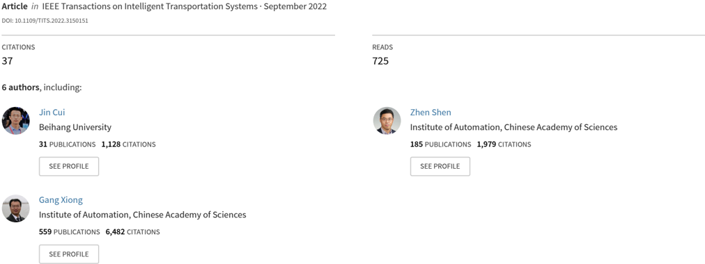
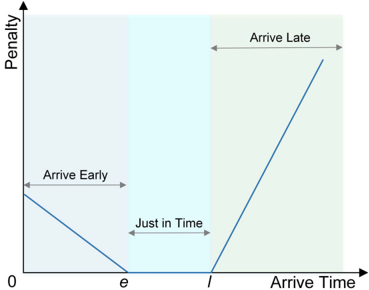
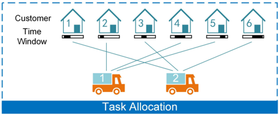
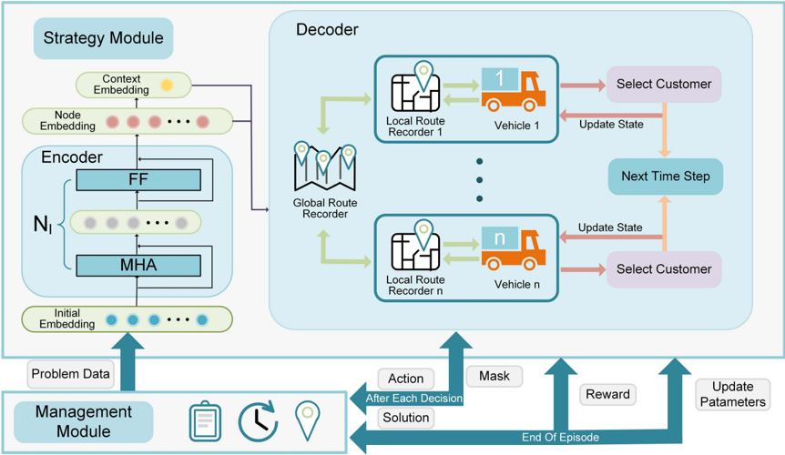
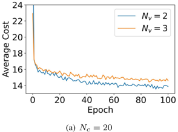
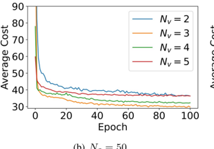
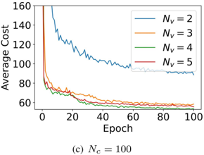
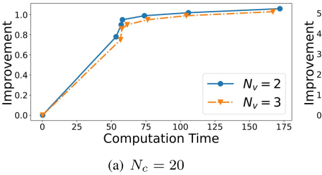
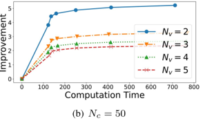
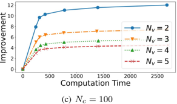

## A Multi-Agent Reinforcement Learning Method With Route Recorders for Vehicle Routing in Supply Chain Management

## A Multi-Agent Reinforcement Learning Method With Route Recorders for Vehicle Routing in Supply Chain Management

Lei Ren , Member, IEEE , Xiaoyang Fan , Jin Cui , Member, IEEE , Zhen Shen , Member, IEEE , Yisheng Lv , Senior Member, IEEE , and Gang Xiong , Senior Member, IEEE

Abstract -In the modern supply chain system, large-scale transportation tasks require the collaborative work of multiple vehicles to be completed on time. Over the past few decades, multi-vehicle route planning was mainly implemented by heuristic algorithms. However, these algorithms face the dilemma of long computation time. In recent years, some machine learning-based methods are also proposed for vehicle route planning, but the existing algorithms can hardly solve multi-vehicle time-sensitive problems. To overcome this problem, we propose a novel multi-agent reinforcement learning model, which optimizes the route length and the vehicle's arrival time simultaneously. The model is based on the encoder-decoder framework. The encoder mines the relationship between the customer nodes in the problem, and the decoder generates the route of each vehicle iteratively. Specially, we design multiple route recorders to extract the route history information of vehicles and realize the communication between them. In the inferring phase, the model could immediately generate routes for all vehicles in a new instance. To further improve the performance of the model, we devise a multi-sampling strategy and obtain the balance boundary between computation time and performance improvement. In addition, we propose a simulation-based vehicle configuration method to select the optimal number of vehicles in real applications. For validation, we conduct a series of experiments on problems with different customer amounts and various vehicle numbers. The results show that the proposed model outperforms other typical algorithms in both performance and calculation time.

Index Terms -Vehicle routing, supply chain management, multi-agent reinforcement learning (MARL), route recorder.

Manuscript received July 8, 2021; revised November 24, 2021 and January 28, 2022; accepted February 2, 2022. This work was supported by the National Key Research and Development Program of China under Grant 2019YFB1705502. The Associate Editor for this article was L. Wang. (Corresponding author: Jin Cui.)

Lei Ren and Xiaoyang Fan are with the School of Automation Science and Electrical Engineering, Beihang University, Beijing 100191, China, and also with the Beijing Advanced Innovation Center for Big Data-based Precision Medicine, Beihang University, Beijing 100191, China (e-mail: renlei@buaa.edu.cn; fanxiaoyang@buaa.edu.cn).

Jin Cui is with the Research Institute for Frontier Science, Beihang University, Beijing 100191, China, and also with the Ningbo Institute of Technology, Beihang University, Ningbo 315800, China (e-mail: jincui@buaa.edu.cn).

Zhen Shen and Yisheng Lv are with the State Key Laboratory for Management and Control of Complex Systems, Institute of Automation, Chinese Academy of Sciences, Beijing 100190, China (e-mail: zhen.shen@ia.ac.cn; yisheng.lv@ia.ac.cn).

Gang Xiong is with the Beijing Engineering Research Center of Intelligent Systems and Technology, Institute of Automation, Chinese Academy of Sciences, Beijing 100190, China, and also with the Cloud Computing Center, Chinese Academy of Sciences, Dongguan 523808, China (e-mail: gang.xiong@ia.ac.cn).

Digital Object Identifier 10.1109/TITS.2022.3150151

## I. INTRODUCTION

L OGISTICS is the crucial link of the supply chain. In supply chain management, providing goods to downstream companies promptly with the smallest possible cost draws a very large economic benefit [1]. In addition, there is an essential concept called zero inventory. Companies aspire to hold little or no on-hand inventory stock [2]. A good route planning method can both reduce transportation costs and optimize inventory. In reality, almost all logistics transportation problems can be abstracted into vehicle routing problem (VRP) and its variants. VRPs have been widely studied for decades as typical combinatorial optimization problems [3].

The objective of the original VRP is to obtain a shortest route to serve a set of customers with specific demands [4]. While in the supply chain scenario, the shortest route length can only help upstream companies to reduce transportation costs. In order to make the production and sales plan of downstream companies proceed normally and minimize inventory costs, vehicles should complete transportation timely. We use the time window to represent the best arrival time and use the penalty for time window violation to represent the costs caused by early or late arrival. In addition, one vehicle can hardly deal with complex time window constraints and massive demands of customers, so multiple vehicles need to be applied to complete a transportation task simultaneously. How many vehicles are used also needs to be considered. Based on the above characteristics, we abstract the VRP in supply chain management as multiple vehicle routing problem with soft time windows (MVRPSTW) [5].

Many heuristic methods have been proposed to address MVRPSTW and multi-agent task allocation problems. One class is intelligent optimization algorithms, such as genetic algorithm (GA) [6] and ant colony algorithm (ACO) [7], which solve the problem by searching the solution space iteratively to find a feasible solution within an acceptable time. Another class is local search algorithms, including iterated local search (ILS) [8], tabu search [9], and large neighborhood search (LNS) [10]. Starting from an initial solution, each time the algorithm selects the best neighbor from the neighborhood solution space of the current solution. The quality of the final solution largely depends on the initial solution [11]. Construction algorithms use specific rules to efficiently generate the solution, often provide initial solutions

1558-0016 ' 2022 IEEE. Personal use is permitted, but republication/redistribution requires IEEE permission. See https://www.ieee.org/publications/rights/index.html for more information.

for local search algorithms, such as insertion algorithm [12], and Clark-Wright saving algorithm [13]. Heuristic methods can also be used to solve multi-agent task allocation problems, but such methods are often computationally intensive and prone to fall into local optimal.

Recently, deep reinforcement learning (DRL) has achieved great success in many fields [14], [15]. Benefits from the powerful learning ability of the neural network, a well-trained DRL model can give the solution of a specific problem without massive calculation. Moreover, DRL is able to learn the distribution of problem data and the characteristics of solution space, which has great potential to solve time-sensitive problems [16].

DRL is also used to solve combinatorial optimization problems. Vinyals et al. modified seq2seq model and proposed pointer network to solve the traveling salesman problem (TSP) [17]. Bello et al. combined pointer network and DRL, which employed reward signal to train the neural network [18]. Nazari et al. replaced the recurrent neural network encoder of the pointer network with one-dimensional convolution, largely reducing the computational complication [19]. Zhao et al. used the result of DRL as the initial solution of local search algorithm to further improve the quality of solution [20]. Kool et al. proposed an attention-based model (AM) to solve various combinatorial optimization problems [21]. Lu et al. proposed the learn to improve (L2I) method [22], randomly constructed a feasible solution and applied DRL to improve the initial solution. In the multi-vehicle scheduling problem, Zhang et al. expanded AM to multi-agent situation to solve MVRPSTW [23]. Yu et al. applied pointer network to online VRP [16]. Shi et al. proposed a DRL framework with decentralized learning and centralized decision making processes for ride-hailing services [24].

However, there are still some challenges in the real supply chain management scenario. Firstly, an effective mechanism is needed to realize communication among multiple vehicles and to guide them to complete the delivery task collaboratively. Secondly, the algorithm needs to consider the time window violation penalty while optimizing the route length. So these two optimization objectives should be appropriately integrated into the algorithm framework. Thirdly, for a specific instance, employing either too many or too few vehicles will increase the time window violation penalty. In real applications, a method that can predict the optimal number of vehicles in advance is urgently needed.

In this work, we propose a novel multi-agent reinforcement learning model with observation information fusion to address the above challenges. The proposed model constructs the route iteratively based on the encoder-decoder framework [25]. Particularly, several gated recurrent units (GRU) are designed in the model for the vehicles, which are called route recorders. GRU could mine the spatial position information in each vehicle's route history. We integrate the output of the route recorder into the observation space of each agent. To realize the communication between vehicles, another route recorder is adopted to extract the historical information of all vehicles. After offline training, our model could generate routes for vehicles in a new instance instantly without further training.

Moreover, we propose a simulation-based method to find the optimal vehicle number. Before task assignment, different numbers of vehicles are used for simulation, and the most suitable number of vehicles will be selected to perform delivery.

The main contributions of this work are summarized as follows :

- · We propose a multi-agent reinforcement learning model which incorporates multiple route recorders to solve MVRPSTW in supply chain management. Several route recorders are designed to construct the observation space and realize communication between multiple vehicles. Both the route length and the time window violation penalty are considered as optimization objectives in the model.
- · The proposed model can be used to determine the optimal number of vehicles for a certain problem. Through using different numbers of vehicles to perform simulation analysis in the problem, the optimal vehicle number and the corresponding vehicle routes are determined accordingly.
- · We conduct a series of experiments in various scenarios to verify the performance of the proposed model in terms of cost and calculation time. Besides, we devise a multi-sampling strategy to further improve the performance of our model and analyze the relationship between the improvement rate and the number of samples.

The remainder of the paper is organized as follows. First of all, we will give a detailed description of the problem in Section II. Then we introduce each component of the proposed model in Section III. Section IV will evaluate the performance of our model by comprehensive case study. Finally, we conclude this paper in Section V.

## II. PROBLEM STATEMENT

In our problem definition, each problem instance includes a set of Nc customers, a set of N v vehicles, and a depot. The locations of customers and depot are randomly generated in the Euclidean plane. Each customer has several characteristics including location ( v ), demand ( d ), service time ( s ), time window ( e , l ) so that they could be represented as a tuple ci = (v , i di , si , ei , l i ) , i = { 1 2 , , . . . , Nc } . Each vehicle has a fixed capacity ( Q ) and speed ( E ). The detailed information of variables is shown in Table I.

A fleet of identical vehicles should start from the depot and meet the demands of customers sequentially. Vehicles need to comply with the following rules:

- · The vehicles depart from the depot and return to the depot after visiting several customers. The sequence of customers visited constitutes the routes of the vehicles.
- · Routes begin and end with the depot. The depot can only appear at both ends of a route. Once back to the depot, vehicles are not allowed to visit customers again.
- · Vehicles have a maximum load, i.e. capacity Q . The sum of the demands of customers in a route should not exceed capacity Q .
- · Customers' time windows are set to be soft, which means vehicles are allowed to visit a customer before or after the

Fig. 1. An illustration of penalty of arrival time.

TABLE I VARIABLES DEFINITION

time window. Still, there will be a penalty when vehicles visit a customer out of the time window. The penalty is defined as a linear function of arrival time and time window. Figure 1 is the illustration of the penalty.

- · Vehicles are not allowed to wait at a customer node. Once arrive at a customer node, vehicles should serve the customer immediately and leave after finishing service.

The solution of an instance could be represented as R = ( r 1 , r 2 , . . . , r v ) , Where ri is the i t h vehicle's route. The goal of the problem is to find a solution with minimal cost. For a instance P and a solution R , the cost could be computed as follows :

<!-- formula-not-decoded -->

<!-- formula-not-decoded -->

(2)

<!-- formula-not-decoded -->

where Length ri ( | P ) is the total route distance of vehicle i , ‖ · ‖ 2 is /lscript 2 norm, ri ( j ) is the j t h customer in the path of vehicle i . Penalty ri ( | P ) is the early and late penalty of route

Fig. 2. An illustration of task allocation and routing process, different vehicles serve customers with similar time windows.

i , t i , j is the time when vehicle i arrives at customer j , the travel time between two customers equals to the distance of them divided by the speed E of the vehicle, the arrival time of the current customer is equal to the arrival time of the previous customer plus the service time of the previous customer and the travel time between the two customers. α , β are early and late arrival penalty coefficient, respectively. ke and kl indicate early or late arrival, which equal to 1 when arrival time is earlier or later than time window, otherwise, 0.

In a real-world supply chain system, the time windows of customers are often overlapped or very close. In this case, one vehicle can hardly deal with the time window constraints efficiently. When two customers' time windows are very close, one vehicle can only choose one customer to satisfy the time window. According to this situation, we propose a multi-agent deep reinforcement learning method. Use multiple vehicles to provide services to different customers at the same time. The task allocation and routing process are depicted in Figure 2.

## III. MULTI-AGENT REINFORCEMENT LEARNING MODEL

In this section, we introduce our multi-agent deep reinforcement learning model, which includes a management module and a strategy module. The management module serves as the environment for interaction with DRL. The strategy module consists of an encoder, multiple route recorders, and a decoder. It generates the route for each vehicle according to the information from the management module. The architecture of the proposed model is drawn in Figure 3.

During training, the management module generates problem instances for the strategy module to solve. After receiving the instances, the strategy module first processes the customer information through the encoder, then constructs the state of agents based on the output of the encoder and the route recorders, and then outputs the route of the vehicle step by

step. Finally, update the parameters of the neural network in the strategy module according to the output solution and its corresponding cost value.

## A. Management Module

The management module works as the environment of DRL. In addition to the role of generating problem instances, it should update the problem status information as the strategy module outputs the next destination of the vehicle and the vehicle fleet moves. Thus a management module is essential to give a feasible solution. The management module generates extensive instances for training and validation according to a certain distribution. As the vehicle fleet moves, this module updates the status of customers and vehicles. The problem status consists of the current location and remaining load of each vehicle and the customers visited.

Once the strategy module provides the next destination to a vehicle, the location of the vehicle is changed to the chosen customer, the remaining load is updated to Lt = Lt -1 -di , where Lt is the current load, Lt -1 is the load at previous time step and di is the demand of chosen customer i . Due to the capacity constraints, Lt must be greater than 0 at each time step.

In addition, to avoid generating infeasible routes, a mask strategy is needed to be applied to block out customers who are not available at current time step, including customers who have been visited before or whose demand exceeds the remaining load of the vehicle [18]. The mask strategy could be expressed as follows :

<!-- formula-not-decoded -->

<!-- formula-not-decoded -->

where Mi j , is the mask for vehicle j and customer i, M j 0 , is the mask for vehicle j and the depot.

## B. Strategy Module

The strategy module receives the problem data and mask information from the management module, and converts them into the route sequence of each vehicle. More specifically, we use an encoder to extract the relationship features between customer nodes and compute the embedding of each node and the entire problem context. For each vehicle, we apply a GRU cell as a route recorder to extract historical spatial location information of each vehicle. In addition, there is one more GRU cell that integrates historical information of all vehicles, called global route recorder. Then a decoder will output the next node of the route iteratively.

In our coordinated multi-agent problem, all vehicles are homogeneous. They have the same capacity and speed, and collaborate to accomplish the same goal. It could be considered that the best policy for each vehicle is the same, and the best policy for the entire vehicle fleet is a combination of the best policies of each vehicle [24], [26]. Therefore, we apply the same policy to the scheduling of each vehicle, that is, sharing the parameters of the policy network of each vehicle [27]. The details of each part in this module are as follows.

1) Encoder: Encoder is used to learn a representation of the customer nodes in the problem. We build the encoder with multi-head self-attention mechanism, which is similar to the attention model [21]. Given a set of customers and a depot, first, we use linear projection to map them into a specified dimension as the initial embedding, i.e.,

<!-- formula-not-decoded -->

Then we utilize multiple attention layers to calculate embedding. Similar to the transformer encoder architecture [28], each layer has two sub-layers. The first sub-layer is based on multi-head self-attention mechanism and is called multi-head attention layer (MHA). The second is a simple feed forward operation called feed forward layer (FF). We add batch normalization (BN) and skip-connection to each sub-layer [29], [30]. The initial embedding is input to the attention layer, and the final embedding is updated iteratively. Each multi-head attention layer is computed as

<!-- formula-not-decoded -->

<!-- formula-not-decoded -->

where Nh is the number of heads, h (/lscript -1 ) = [ h (/lscript -1 ) 0 ; h (/lscript -1 ) 1 ; . . . ; h Nc (/lscript -1 ) ] is the initial embedding or embedding of each node from last attention layer. Ignore the superscript of the layer /lscript . In the layer /lscript , Qi = h i (/lscript -1 ) W Q i , Ki = h i (/lscript -1 ) W K i , Vi = h i (/lscript -1 ) W V i . Parameter matrices W Q i ∈ R dembed × dq , W K i ∈ R dembed × dk , W V /lscript ∈ R dembed × d v , W /lscript ∈ R Nh d v × dembed . For the convenience of calculation, we set the same dimension for Query , Key , Value in attention mechanism, i.e. dq = dk = d v = dembed / Nh , to make the softmax function output a small number so that it has a reasonable gradient, we multiply the input of the softmax function by 1 √ dk .

The second sub-layer of attention layer is a simple feed forward layer with batch normalization and skip-connection :

<!-- formula-not-decoded -->

<!-- formula-not-decoded -->

We input the initial embedding into Nl attention layers to compute equations (7) and (8) for Nl times to obtain final embedding h i ( Nl ) of each node. Then compute the embedding of the entire problem context h ( Nl ) as

<!-- formula-not-decoded -->

2) Route Recorder: In a coordinated multi-agent problem, several learning agents try to find a joint solution for the problem. The behavior of one agent will influence the observation of other agents in multi-agent DRL. To make every

Fig. 3. Model architecture.

agent in the model have a full observation of the global state information and communicate with each other, it is very important to add the historical route information of current vehicle and other vehicles into the state space. In order to obtain a vector representation of historical information for subsequent computation of the neural network, we adopt a GRU cell for each agent [31], which is the vehicle in our problem. Input the current position into the GRU cell at each time step to get a vector representation of historical information. We call the GRU cell of each vehicle a local route recorder, which is used to record the movement history of each vehicle. Moreover, there is another GRU cell to obtain all vehicles' movement history information, and we name it as global route recorder. At each time step, we provide each vehicle with the movement history of itself and other vehicles so that they can know about what other vehicles have done.

For details, at each time step, we input the position and remaining load of the vehicle and the hidden state of the local route recorder at the previous time step into the local route recorder. Then it will output a vector H i t , which contains the movement history information of the vehicle. For vehicle at time step t, the process could be represented as :

<!-- formula-not-decoded -->

<!-- formula-not-decoded -->

<!-- formula-not-decoded -->

<!-- formula-not-decoded -->

where a i t -1 ∈ R 3 is current position and remaining load of vehicle i, H i t -1 ∈ R dembed is the hidden state of GRU cell at previous time step, /circledot is element-wise multiplication.

Before each vehicle chooses the next customer to visit, the hidden state of the local route recorder and global route recorder will be updated. Unlike local route recorder, at each time step, the location and load information of all vehicles will be input to global route recorder. The details of how to use route recorders to construct observation space for each vehicle will be introduced in next subsection.

3) Decoder: Decoder generates route sequence for each vehicle sequentially. At each decoding step t ∈ { 1 2 , , . . . , T } , decoder outputs the next node for each vehicle based on the embedding from encoder and the hidden state of route recorders. During the decoding process, instead of giving the next nodes to all vehicles simultaneously, we apply the same way as work done in [23] to generate the next node in the route for each vehicle one by one to avoid the situation where more than one vehicles select the same node at the same time. Given a problem instance P , parameterize our decoding strategy as θ , the calculation method for the next node of each vehicle at the current time step t can be expressed as

<!-- formula-not-decoded -->

<!-- formula-not-decoded -->

where r t i is the customers who have been chosen by vehicle i before time step t , m is the number of vehicles.

Next, we introduce the setting of the observation space. The observation space is composed of the problem context h ( Nl ) calculated by the encoder, hidden state calculated by local route recorder. In order to make each vehicle has a full observation of global state, we also add the hidden state of global route recorder to observation space.

<!-- formula-not-decoded -->

where o i t the observation of vehicle i at time step t , H i t is the hidden state of local route recorder for vehicle i, H i t is the hidden state of global route recorder. In the method that uses the current position and load of the vehicle as state information [21], [23], the agent only makes decisions based on the current information, and avoids invalid actions through the mask mechanism. Regardless of the historical action information, under the same position and load, the output of the policy network is exactly the same. This is not an effective method in the scenario of multi-agent and considering the time window constraints. Adding route recorders could enable agents make better decisions based on historical information.

The decoding step is similar to pointer network [17]. A simplified attention mechanism is used to calculate the probability of visiting the next customer. Utilize the observation of vehicle i as query q t i and the embedding of each node calculated at encoding stage as key k j for the attention mechanism [28], the compatibility is calculated as probabilities of vehicle i choosing customer j at time step t , that is,

<!-- formula-not-decoded -->

<!-- formula-not-decoded -->

<!-- formula-not-decoded -->

Then we use the softmax function to calculate the probability of choosing each customer. In order to ensure that each customer is visited only once and the demands in a route do not exceed the maximum load of the vehicle, we set ui j t , , = -∞ to block the customers who have been visited before or whose demand is greater than the current load of vehicle [18]. In this way, after the calculation of the softmax function, the probability of invalid action will be 0 and the sum of the probabilities of all actions still equals 1. The probability that vehicle i selects customer j at time step t is formulated as follow:

<!-- formula-not-decoded -->

Now the problem could be formulated as markov decision process (MDP), and the main components are defined as follows:

- · State: Each vehicle is regarded as an agent. The state includes information about customers and vehicles. Specifically, at each time step, vehicles will obtain information about each customer such as location, demand, and time window. In addition, it can observe route history information of itself and other vehicles from route recorders.
- · Action: At each time step, each vehicle will select a customer to provide services. After the end of an episode, joint actions constitute the solution R .
- · Reward: The negative of the cost Cost ( R P | ) is considered to be reward signal and the parameters of policy network are updated according to the reward signal after an episode.

## Algorithm 1 Training Procedure

Input Training epoch N , number of batches in each epoch B Output Parameter θ .

- 1: Initialize parameter θ of strategy model
- 3: for epoch = 1, 2, …, N do
- 2: Initialize parameter θ BL = θ of baseline model
- 4: for batch = 1, 2, …, B do
- 5: Generate training set M
- h i 7: Input initial embedding to encoder to obtain the final embedding of each node h i ( Nl ) and the embedding of the problem context h ( Nl )
- 6: Compute initial embedding ( 0 ) of customers and depot
- 8: Initialize the current location of vehicle at depot and set the current load L equals to capacity Q

9:

0

10:

## step = repeat

11:

12:

13:

14:

15:

16:

17:

18:

19:

20:

21:

22:

23:

24:

for i = 1, 2, …, N v do Input current location and load of vehicle i to local route recorder i and get hidden state H i t Input current locations and loads of all vehicles to global route recorder and get hidden state H i t Compute query q t i Compute probabilities of choosing next nodes pi , j , t Randomly choose next nodes for vehicle i according to pi , j , t Update mask and vehicle state

## end for

step = step + 1

until All customers have been visited

Compute Cost of solution on training instances if epoch = 1 then

Compute CostBL using exponential moving average else

25:

Use baseline model to generate solution and compute CostBL

## 26: end if

27:

Compute gradient of training objective function and update parameter θ through Adam optimizer

<!-- formula-not-decoded -->

30:

end if

31: end for

32: end for

33:

return

θ

## C. Training Method

In this work, there is no label for each problem instance, so we cannot use the supervised learning method to train our neural network. Instead, we adopt a reinforcement learning method to minimize the cost of the generated route to train all trainable variables in our model. Given a problem instance P , use θ to represent the parameters in our neural network. The training objective is :

<!-- formula-not-decoded -->

The trainable parameters in the neural network include the parameters in encoder, decoder and route recorders. To train

them, we use the well-known policy gradient method [32], which improves our policy iteratively by an estimated gradient of the expected return. The gradient could be formulated as :

<!-- formula-not-decoded -->

where b P ( ) is the baseline function, which is used to estimate the expected cost value of different problem instances. It can estimate how difficult a problem is and reduce the variance of training process to accelerate the speed of convergence [21]. p θ ( R P | ) is the probability of generating solution R for instance P , which is related to the probability pi , j , t at each decoding step.

When training on a batch of instances, the gradient of the function could be computed as the average value of Monte Carlo sampling in the batch :

<!-- formula-not-decoded -->

(17)

where B is the batch size.

During the training process, according to the probability calculated by equation 14, the next node for each vehicle is selected randomly. To reduce the variance, we adopt another model as the baseline function, which has the same structure as the strategy model [33]. The baseline model generates routes by greedy strategy, in other words, choose the routes with highest probability. Before training, the parameters of strategy model θ and baseline model θ BL are set to be the same, and then update periodically. Once updating the parameters of the strategy model, we compute the result of the strategy model and baseline model, and replace θ BL with θ when their t-test has confidence of 95%.

We train our model for several epochs, each epoch has several batches of instances. At the first epoch, we utilize the exponential moving average as a warm-up baseline, Which is calculated by :

<!-- formula-not-decoded -->

where B is number of instances in each batch, b ′ is the baseline value in last batch. The training procedure of our model is shown in Algorithm 1.

## IV. CASE STUDIES

To evaluate the performance of our model, we conduct a series of experiments and compare the cost and run time with other methods. The experiment includes problems with different numbers of customers and vehicles. The instances for training and validation are generated according to a specific distribution. In addition, we devise a multi-sampling strategy to further improve the performance of our model, and analyze the relationship between the number of samples, run time and performance improvement. Our computational experiments are

TABLE II SETTING OF PARAMETERS

conducted on server with a configuration of Intel(R) Xeon(R) CPU E5-2650v4 at 2.20GHz and 64GB RAM. Nvidia TITAN XP GPU is used to accelerate the training process.

## A. Experimental Setting

1) Problem Setting: We generate the depot and customers' locations uniformly within a range of [ 0 1 , ]×[ 0 1 . Time win-, ] dow length of each customer is randomly generated from 0.1 to 0.2 uniformly. Service time of each customer is randomly generated uniformly from 0.1 to 0.2. Early penalty coefficient α is set to 0.5. Considering the consequences of being late are more serious, late penalty coefficient β is set to 2. We conduct experiments on three kinds of problem scale with customer number of 20, 50 and 100. The vehicle capacity and early time of time windows are designed according to the number of customers. The customer's demand is randomly generated based on the number of vehicles. The detailed settings of the above three parameters are listed in Table II.

2) Decoding Strategy: When comparing with other methods to verify the performance of our model, at each decoding step, we use a greedy strategy to choose the next node with maximum probability and get a deterministic solution.

To further improve the performance of our model, we use a multi-sampling strategy. At each step of choosing the next node, we randomly select the next node based on the probability of the node. Because the node sequence in a solution is randomly generated according to probability, this strategy is likely to develop different solutions every time we input the same instance to the model. Each solution is called a sample. We use this strategy to generate a set of different solutions for the same instance. Then we evaluate the cost of each sample and apply the solution with minimal cost.

3) Baselines: Several baseline methods are used to compare with our method in terms of performance and calculation time. Including Nearest Insertion, Random Insertion and GA. Google OR-tools is an open source software used to solve combinatorial optimization problems, which could solve multi-agent problem with constraints. It is often used as a baseline method in related works and perform well, so we also adopt it. In GA, population size is 200, cross over rate is 0.8, mutation rate is 0.1. We set the maximum epoch to 1000. The process will stop when the maximum epoch is reached or the best solution remains unchanged for 20 epochs. For Google OR-Tools, we use the automatically selected first solution strategy and Local search options. We run all baseline algorithms on CPUs with 24 processes simultaneously.

4) Hyperpemeters: In our model, we set the initial embedding dimensions to 128. Dimensions of query, key and value

TABLE III RESULTS OF COMPARATIVE EXPERIMENT

of attention mechanism are also set to 128. Encoder has 3 attention layers, each multi-head attention layer has 8 heads. During training stage, we train our model for 100 epochs. In each epoch, 640000 instances are randomly generated for training. The batch size is set to 256. The model is trained with Adam optimizer and the learning rate is 10 -4 [34].

coefficients so that in large-scale problems, the gap between different solutions will be very huge in value. For example, in the case of 100 customers and 2 vechicles, the cost at the early stage of training is about 30 times larger than that after convergence.

## B. Experiment Results

The results of comparative experiment for problem of different numbers of customers and vehicles are shown in Table III. Where nc , n v are the number of customers and vehicles, respectively. We run our model and other baseline algorithms to solve 1000 instances, and calculate the average cost and total computation time of each method. Column 'Time' is the total time consumption of solving 1000 instances and its unit is seconds. The best result is set as gap.

For all instances, our method could achieve a better result than other algorithms and the time consumption is quite small. OR-Tools is second to our method and better than GA. Insertion methods failed to make the route as short as possible while reducing the penalty of the time window as much as possible, the results are much worse than other methods.

In instances of small scale problem, OR-Tools and GA have similar results and could achieve performance close to our method. However, as the scale of problem growing large, the gap between these algorithms and ours becomes larger and larger. The performance of GA is also gradually worse than OR-Tools. The gap between the proposed algorithm and others is huge on large problem scale. On the one hand, it is because the solution space growing large. On the other hand, because we set strict time window constraints and large penalty

As the problem scale grows large, our method's calculation time remains at a small value, almost unchanged. While the time consumption of other methods is sensitive to problem scale, especially GA. The calculation time of GA on 1000 instances becomes unacceptable under largescale problems. Under a certain problem scale, the time consumption of OR-Tools, GA and our method stay unchanged as the number of vehicles changes. While calculation time of insertion methods decreases as the number of vehicles increases. Because each time choose a node, we insert it into the route of one of the vehicles, the more vehicles we use, the shorter the route length of each vehicle would be and the computational complexity will be smaller.

There is an interesting phenomenon in the results: in the instance of 20 customers, our method uses 2 vehicles could get a better result than using 3 vehicles. In the instance of 50 customers, the results obtained with 3 vehicles are better than the others. In the instance of 100 customers, the best result is obtained by using 4 vehicles. For all instances with the same number of customers, we set the same time window constraints. Too few vehicles can hardly deal with the time window constraints and cause late penalties. On the contrary, using too many vehicles can serve all customers in a shorter time, but it will cause more early penalties because we do not allow vehicles to stay at a node and must move to the next node after serving a customer. Using a suitable number of vehicles can strike a balance between early and late arrivals

Fig. 4. Cost curves of training process.

TABLE IV RESULTS OF USING MULTI-SAMPLING STRATEGY

and get better results. In practical applications, this method can be adopted, using different numbers of vehicles for simulation experiments to obtain the most suitable number of vehicles and their routes before assigning routes to vehicles.

The cost of other algorithms becomes smaller when using more vehicles, probably because using more vehicles can easily get a better result when the solution is not so good. In order to verify our conjecture, we draw the cost curves of training process of our method in Figure 4. It could be seen that in the early stage of training, the policy of our model has not reached the optimal, using more vehicles can achieve a smaller cost, but as the training progresses, the cost at the final convergence may not be smaller.

TABLE III. The number after 'Sample' indicates the number of samples taken when we use the strategy. Experiments are conducted on a single GPU and run time is calculated. It could be seen that utilizing the multi-sampling strategy to generate multiple solutions and apply the best one could achieve a better result than using the greedy strategy. Compared with the greedy strategy, when sampling 100 samples, the improvement is significant, but as the number of samples increases, the improvement effect gradually weakens. We draw the relationship curve between the performance improvement and computation time of each problem scale in Figure 5.

## C. Experiment Results With Multi-Sampling

In order to further improve the performance of our model, we devise a multi-sampling strategy. The result is shown in

In problems of each scale, the curve trends of using different numbers of vehicles are similar. After the computation time reaches a certain value, the improvement effect will become very weak. In the problem with 20 customers, the curve is almost parallel to the coordinate axis when computation time is longer than 100. Taking more samples has little effect on the improvement. This phenomenon also exists on other scale

Fig. 5. Relationship curves between performance improvement and calculation time.

of problems. By analyzing the results under different problem scale, we found that the number of samples of 1000 is the most suitable for this problem, which could keep a balance between computation time and performance improvement.

## V. CONCLUSION

In this paper, we first propose a new multi-agent reinforcement learning method to solve vehicle routing in the supply chain management, which could solve the problem of overlapping customer time windows in the situation and consider the overall interests of upstream and downstream companies. Our route planning algorithm mainly consists of three parts. A self-attention mechanism based encoder could extract and encode the information of each customer and the entire problem. Multiple route recorders are adopted to record the historical information of each vehicle and ensure that each vehicle has a full observation of the state and communicates with other vehicles. A decoder is used to generate the routes according to the output of encoder and route recorders. Since the supervised learning method needs massive data with labels that are difficult to obtain, we use the reinforcement learning method to train our neural network. To reduce the variance during training process, we adopt a baseline similar to selfcritic [33]. In addition, we propose a simulation-based method to determine the optimal number of vehicles. A multi-sampling strategy is also devised to improve our model's performance.

To evaluate the performance of our algorithm, we generate various instances of different numbers of customers and vehicles according to the certain distribution and conduct comparative experiments with other algorithms. The result shows that our algorithm is superior to other algorithms in performance and calculation time, which indicates that algorithms based on neural networks can solve problems with soft constraints very well. After training, the computation time is significantly shorter than other algorithms, and it is more agile and flexible to solve problems in reality. By sampling different numbers of samples using the multi-sampling strategy, we found the appropriate number of samples to balance the computation time and performance improvement.

In the future research on solving vehicle routing problems with machine learning-based methods, some problems still need to be resolved. We only studied the problems with the linear penalty function. In practical applications, depending on the situation, other types of penalty functions may be be more practical, and the research on other types of penalty functions will be very meaningful. In our work, the number of vehicles is set manually, a method that could automatically choose the most suitable number of vehicles for different instances is still needed. Besides, in real world, the routing problem is dynamic, customers' request will change over time. It is essential to develop a method that could solve dynamic situation.

## REFERENCES

- [1] R. J. Vokurka and R. R. Lummus, 'The role of just-in-time in supply chain management,' Int. J. Logist. Manag. , vol. 11, no. 1, pp. 89-98, 2000.
- [2] R. W. Hall and R. A. Hall, Zero Inventories . Burr Ridge, IL, USA: Irwin Professional, 1983.
- [3] G. Kim, Y. S. Ong, C. K. Heng, P. S. Tan, and N. A. Zhang, 'City vehicle routing problem (City VRP): A review,' IEEE Trans. Intell. Transp. Syst. , vol. 16, no. 4, pp. 1654-1666, Aug. 2015.
- [4] P. Toth and D. Vigo, The Vehicle Routing Problem . Philadelphia, PA, USA: Society for Industrial and Applied Mathematics, 2002.
- [5] H. C. Lau, M. Sim, and K. M. Teo, 'Vehicle routing problem with time windows and a limited number of vehicles,' Eur. J. Oper. Res. , vol. 148, no. 3, pp. 559-569, Aug. 2003.
- [6] A. Király and J. Abonyi, 'Redesign of the supply of mobile mechanics based on a novel genetic optimization algorithm using Google maps API,' Eng. Appl. Artif. Intell. , vol. 38, pp. 122-130, Feb. 2015.
- [7] M. Dorigo, V. Maniezzo, and A. Colorni, 'Ant system: Optimization by a colony of cooperating agents,' IEEE Trans. Syst., Man, Cybern. B, Cybern. , vol. 26, no. 1, pp. 29-41, Oct. 1996.
- [8] T. Ibaraki, S. Imahori, K. Nonobe, K. Sobue, T. Uno, and M. Yagiura, 'An iterated local search algorithm for the vehicle routing problem with convex time penalty functions,' Discrete Appl. Math. , vol. 156, no. 11, pp. 2050-2069, Jun. 2008.
- [9] A. Lim and F. Wang, 'A smoothed dynamic tabu search embedded GRASP for m-VRPTW,' in Proc. Int. Conf. Tools Artif. Intell. , 2004, pp. 704-708.
- [10] P. Shaw, 'Using constraint programming and local search methods to solve vehicle routing problems,' in Proc. Int. Conf. Princ. Pract. Constraint Program. , 1998, pp. 417-431.
- [11] M. Zirour, 'Vehicle routing problem: Models and solutions,' J. Qual. Meas. Anal. , vol. 4, no. 1, pp. 205-218, 2008.
- [12] S. Joshi and S. Kaur, 'Nearest neighbor insertion algorithm for solving capacitated vehicle routing problem,' in Proc. Int. Conf. Comput. Sustain. Global Develop. , 2015, pp. 86-88.
- [13] G. Clarke and J. W. Wright, 'Scheduling of vehicles from a central depot to a number of delivery points,' Oper. Res. , vol. 12, no. 4, pp. 568-581, 1964.
- [14] D. Silver et al. , 'Mastering the game of Go with deep neural networks and tree search,' Nature , vol. 529, no. 7587, pp. 484-489, 2016.
- [15] V. Mnih et al. , 'Human-level control through deep reinforcement learning,' Nature , vol. 518, pp. 529-533, Oct. 2015.
- [16] J. J. Q. Yu, W. Yu, and J. Gu, 'Online vehicle routing with neural combinatorial optimization and deep reinforcement learning,' IEEE Trans. Intell. Transp. Syst. , vol. 20, no. 10, pp. 3806-3817, Oct. 2019.
- [17] O. Vinyals, M. Fortunato, and N. Jaitly, 'Pointer networks,' 2015, arXiv:1506.03134 .
- [18] I. Bello, H. Pham, Q. V. Le, M. Norouzi, and S. Bengio, 'Neural combinatorial optimization with reinforcement learning,' 2016, arXiv:1611.09940 .
- [19] M. Nazari, A. Oroojlooy, L. V. Snyder, and M. Taká, 'Reinforcement learning for solving the vehicle routing problem,' 2018, arXiv:1802.04240 .
- [20] J. Zhao, M. Mao, X. Zhao, and J. Zou, 'A hybrid of deep reinforcement learning and local search for the vehicle routing problems,' IEEE Trans. Intell. Transp. Syst. , vol. 22, no. 11, pp. 7208-7218, Nov. 2020.

- [21] W. Kool, H. van Hoof, and M. Welling, 'Attention, learn to solve routing problems,' 2018, arXiv:1803.08475 .
- [22] H. Lu, X. Zhang, and S. Yang, 'A learning-based iterative method for solving vehicle routing problems,' in Proc. Int. Conf. Learn. Represent. , 2019, pp. 1-15.
- [23] K. Zhang, F. He, Z. Zhang, X. Lin, and M. Li, 'Multi-vehicle routing problems with soft time windows: A multi-agent reinforcement learning approach,' Transp. Res. Pt. C-Emerg. Technol. , vol. 121, 2020, Art. no. 102861.
- [24] J. Shi, Y. Gao, W. Wang, N. Yu, and P. A. Ioannou, 'Operating electric vehicle fleet for ride-hailing services with reinforcement learning,' IEEE Trans. Intell. Transp. Syst. , vol. 21, no. 11, pp. 4822-4834, Nov. 2020.
- [25] I. Sutskever, O. Vinyals, and Q. V. Le, 'Sequence to sequence learning with neural networks,' 2014, arXiv:1409.3215 .
- [26] J. K. Gupta, M. Egorov, and M. Kochenderfer, 'Cooperative multi-agent control using deep reinforcement learning,' in Proc. Int. Joint Conf. Auton. Agents Multiagent Syst. , 2017, pp. 66-83.
- [27] J. N. Foerster, Y. M. Assael, N. de Freitas, and S. Whiteson, 'Learning to communicate with deep multi-agent reinforcement learning,' 2016, arXiv:1605.06676 .
- [28] A. Vaswani et al. , 'Attention is all you need,' 2017, arXiv:1706.03762 . [29] S. Ioffe and C. Szegedy, 'Batch normalization: Accelerating deep network training by reducing internal covariate shift,' in Proc. Int. Conf. Machin. Learn. , 2015, pp. 448-456.
- [30] K. He, X. Zhang, S. Ren, and J. Sun, 'Deep residual learning for image recognition,' in Proc. IEEE Conf. Comput. Vis. Pattern Recognit. , Oct. 2016, pp. 770-778.
- [31] K. Cho et al. , 'Learning phrase representations using RNN encoderdecoder for statistical machine translation,' 2014, arXiv:1406.1078 .
- [32] R. J. Williams, 'Simple statistical gradient-following algorithms for connectionist reinforcement learning,' Mach. Learn. , vol. 8, nos. 3-4, pp. 229-256, 1992.
- [33] S. J. Rennie, E. Marcheret, Y. Mroueh, J. Ross, and V. Goel, 'Selfcritical sequence training for image captioning,' in Proc. IEEE Conf. Comput. Vis. Pattern Recognit. , 2017, pp. 7008-7024.
- [34] D. P. Kingma and J. Ba, 'Adam: A method for stochastic optimization,' 2014, arXiv:1412.6980 .

Lei Ren (Member, IEEE) received the B.E. and M.E. degrees from Shandong University in 2002 and 2005, respectively, and the Ph.D. degree from the Chinese Academy of Sciences, Beijing, China, in 2009. He is currently a Professor and the Deputy Head of the Cloud Manufacturing Research Center, School of Automation Science and Electrical Engineering, Beihang University, and a Senior Research Scientist with the Engineering Researching Center of Complex Product Advanced Manufacturing Systems, Ministry of Education, China. His research interests include industrial big data, industrial AI, and cloud manufacturing.

Xiaoyang Fan is currently pursuing the M.S. degree with the School of Automation Science and Electrical Engineering, Beihang University, Beijing, China. His research interests include industry intelligence, deep reinforcement learning, and combinatorial optimization.

Jin Cui (Member, IEEE) received the B.Eng. degree from the Taiyuan University of Technology, Taiyuan, China, in 2013, and the Ph.D. degree from Beihang University, Beijing, China, in 2019. He is currently an Assistant Professor with the Research Institute for Frontier Science, Beihang University. His main research interests are in the areas of intelligent manufacturing, digital twin, uncertainty quantification, prognostic and health management.

Zhen Shen (Member, IEEE) received the B.S.E. and Ph.D. degrees from Tsinghua University, Beijing, China, in 2004 and 2009, respectively. He was a Visiting Scholar with the Department of Manufacturing Engineering and the Center for Information and Systems Engineering, Boston University, USA, from October 2007 to April 2008. In 2009, he started doing research work as an Assistant Professor with the State Key Laboratory of Management and Control for Complex Systems, Institute of Automation, CAS. In 2012, he becomes an Associate Professor with the State Key Laboratory for Management and Control of Complex Systems, China. His research interests are intelligent manufacturing, 3D printing, performance evaluation and optimization of complex systems, and ordinal optimization.

Yisheng Lv (Senior Member, IEEE) received the B.E. and M.E. degrees from the Harbin Institute of Technology in 2005 and 2007, respectively, and the Ph.D. degree from the Chinese Academy of Sciences, Beijing, China, in 2010. He is currently an Associate Professor with the State Key Laboratory of Management and Control for Complex Systems, Institute of Automation, Chinese Academy of Sciences. He is also with the Qingdao Academy of Intelligent Industries. His research interests include traffic data analysis, deep learning, machine learn- ing, and parallel traffic management and control systems.

Gang Xiong (Senior Member, IEEE) received the B.Eng. and M.Eng. degrees from the Xi'an University of Science and Technology, Xi'an, China, in 1991 and 1994, respectively, and the Ph.D. degree from Shanghai Jiao Tong University, Shanghai, China, in 1996. From 1996 to 1998, he was a Post-Doctoral Researcher and an Associate Scientist with Zhejiang University, Hangzhou, China. From 1998 to 2001, he was a Senior Research Fellow with the Tampere University of Technology, Tampere, Finland. From 2001 to 2007, he was a

Specialist and the Project Manager with Nokia Corporation, Finland. In 2007, he was a Senior Consultant and the Team Leader with Accenture and Chevron, USA. In 2008, he was the Deputy Director of the Informatization Office, Chinese Academy of Science (CAS), Beijing, China. In 2009, he started his present position as a Research Scientist with the State Key Laboratory of Management and Control for Complex Systems, Institute of Automation, CAS. In 2011, he became the Deputy Director of the Cloud Computing Center, CAS. His research interests include parallel control and management, modeling and optimization of complex systems, cloud computing and big data, intelligent manufacturing, and intelligent transportation systems.