## Vehicle Routing

## MOS-SIAM Series on Optimization

This series is published jointly by the Mathematical Optimization Society and the Society for Industrial and Applied Mathematics. It includes research monographs, books on applications, textbooks at all levels, and tutorials. Besides being of high scientific quality, books in the series must advance the understanding and practice of optimization. They must also be written clearly and at an appropriate level for the intended audience.

## Editor-in-Chief

Katya Scheinberg Lehigh University

## Editorial Board

Santanu S. Dey, Georgia Institute of Technology Maryam Fazel, University of Washington Andrea Lodi, University of Bologna Arkadi Nemirovski, Georgia Institute of Technology Stefan Ulbrich , Technische Universität Darmstadt Luis Nunes Vicente, University of Coimbra David Williamson, Cornell University Stephen J. Wright, University of Wisconsin

## Series Volumes

Toth, Paolo and Vigo, Daniele, editors, Vehicle Routing: Problems, Methods, and Applications, Second Edition

Attouch, Hedy, Buttazzo, Giuseppe, and Michaille, Gérard, Variational Analysis in Sobolev and BV Spaces: Applications to PDEs and Optimization, Second Edition

Shapiro, Alexander, Dentcheva, Darinka, and Ruszczynski, Andrzej, Lectures on Stochastic Programming: Modeling and Theory, Second Edition ´

Locatelli, Marco and Schoen, Fabio, Global Optimization: Theory, Algorithms, and Applications De Loera, Jesús A., Hemmecke, Raymond, and Köppe, Matthias, Algebraic and Geometric Ideas in the Theory of Discrete Optimization

Blekherman, Grigoriy, Parrilo, Pablo A., and Thomas, Rekha R., editors, Semidefinite Optimization and Convex Algebraic Geometry

Delfour, M. C., Introduction to Optimization and Semidifferential Calculus

Ulbrich, Michael, Semismooth Newton Methods for Variational Inequalities and Constrained Optimization Problems in Function Spaces

Biegler, Lorenz T., Nonlinear Programming: Concepts, Algorithms, and Applications to Chemical Processes Shapiro, Alexander, Dentcheva, Darinka, and Ruszczynski, Andrzej, Lectures on Stochastic Programming: Modeling and Theory ´

Conn, Andrew R., Scheinberg, Katya, and Vicente, Luis N., Introduction to Derivative-Free Optimization Ferris, Michael C., Mangasarian, Olvi L., and Wright, Stephen J., Linear Programming with MATLAB Attouch, Hedy, Buttazzo, Giuseppe, and Michaille, Gérard, Variational Analysis in Sobolev and BV Spaces:

Applications to PDEs and Optimization

Wallace, Stein W. and Ziemba, William T., editors, Applications of Stochastic Programming Grötschel, Martin, editor, The Sharpest Cut: The Impact of Manfred Padberg and His Work Renegar, James, A Mathematical View of Interior-Point Methods in Convex Optimization Ben-Tal, Aharon and Nemirovski, Arkadi, Lectures on Modern Convex Optimization: Analysis, Algorithms, and Engineering Applications

Conn, Andrew R., Gould, Nicholas I. M., and Toint, Phillippe L., Trust-Region Methods

## Vehicle Routing Problems, Methods,

## and Applications

## Second Edition

Edited by

Paolo Toth DEI, University of Bologna

Bologna, Italy

Daniele Vigo DEI, University of Bologna

Bologna, Italy

Copyright © 2014 by the Society for Industrial and Applied Mathematics and the Mathematical Optimization Society

## 10 9 8 7 6 5 4 3 2 1

All rights reserved. Printed in the United States of America. No part of this book may be reproduced, stored, or transmitted in any manner without the written permission of the publisher. For information, write to the Society for Industrial and Applied Mathematics, 3600 Market Street, 6th Floor, Philadelphia, PA 19104-2688 USA.

Trademarked names may be used in this book without the inclusion of a trademark symbol. These names are used in an editorial context only; no infringement of trademark is intended.

Access and Excel are trademarks of Microsoft Corporation in the United States and/or other countries. DISC and REACT are trademarks of MJC2 Limited.

Fleetboard is a trademark of Pictorial, Inc.

GeoRoute and GIRO/Acces are trademarks of GIRO, Inc.

Google Maps™ mapping service, Google, and the Google logo are registered trademarks of Google Inc., used with permission.

IBM ILOG CPLEX is developed and supported by IBM, Inc. IBM ILOG CPLEX is a registered trademark of IBM, Inc. www.ibm.com.

Intel Core is a registered trademark of Intel Corporation or its subsidiaries in the United States and other countries.

Linux is a registered trademark of Linus Torvalds.

MapInfo, the MapInfo logo, MapBasic, and MapInfo Professional are trademarks of Pitney Bowes MapInfo Corporation and/or its affiliates.

Microsoft and MS-DOS are registered trademarks and ODBC, Windows, Windows 95, and Windows Vista are trademarks of Microsoft Corporation.

NAVTEQ Traffic is a trademark of NAVTEQ.

Optrak is a trademark of Optrak Distribution Software, Ltd.

R2 Optimointi is a trademark of Procomp Solutions Oy.

SAP is a registered trademark of SAP AG in Germany and in several other countries.

SmarTour is a trademark of PTV AG.

Spider 5 is a trademark of Spider Solutions AS.

TomTom and the 'two hands' logo are registered trademarks of TomTom N.V. or one of its subsidiaries. TransIT is a trademark of GTS Systems and Consulting, GmbH.

UNIX is a registered trademark of The Open Group in the United States and other countries.

Figure 14.1 reprinted with permission from the United Nations Development Programme.

Figures 14.3 and 14.12 reprinted with permission from Elsevier.

Figures 14.6 and 14.9 reprinted with permission from John Wiley and Sons.

Figure 14.14 reprinted with permission from INFORMS.

## Library of Congress Cataloging-in-Publication Data

Vehicle routing problem.

Vehicle routing : problems, methods, and applications / edited by Paolo Toth, University of Bologna, Bologna, Italy, Daniele Vigo, University of Bologna, Bologna, Italy. -- Second edition.

pages cm. --  (MOS-SIAM series on optimization)

Revision of: The vehicle routing problem. ©2002.

Includes bibliographical references and index.

ISBN 978-1-611973-58-7

1.  Transportation problems (Programming)  I. Toth, Paolo, editor. II. Vigo, Daniele, editor. III. Title.

QA402.6.V44 2014

388.3'10285--dc23

2014029491

## List of Contributors

## Claudia Archetti

## Kjetil Fagerholt

Dipartimento Metodi Quantitativi, Università di Brescia, Italy, archetti@eco.unibs.it

## Tolga Bekta¸ s

Southampton Management School, University of Southampton, UK, t.bektas@soton.ac.uk

## Olli Bräysy

VUUniversity of Amsterdam, The Netherlands, o.m.p.braysy@vu.nl

## Marielle Christiansen

Department of Industrial Economics and

Technology Management, Norwegian University of Science and Technology of Trondheim, Norway, mc@iot.ntnu.no

## Jean-François Cordeau

HECMontréal, Québec, Canada, jean-francois.cordeau@hec.ca

## Guy Desaulniers

Department of Mathematical and Industrial Engineering, École Polytechnique de Montréal, Québec, Canada, guy.desaulniers@polymtl.ca

## Karl F. Doerner

Department of Business Administration, University of Vienna, Austria, karl.doerner@univie.ac.at

## Richard Eglese

Department of Management Science, Lancaster University Management School, UK, R.Eglese@lancaster.ac.uk

Department of Industrial Economics and Technology Management, Norwegian University of Science and Technology of Trondheim, Norway, kjetil.fagerholt@iot.ntnu.no

## Michel Gendrau

Department of Mathematical and Industrial Engineering, École Polytechnique de Montréal, Québec, Canada, michel.gendreau@polymtl.ca

## Bruce L. Golden

Robert H. Smith School of Business, University of Maryland, MD, USA, bgolden@rhsmith.umd.edu

## Geir Hasle

SINTEF ICT, Norway, geir.hasle@sintef.no

## Manuel Iori

Dipartimento di Scienze e Metodi dell'Ingegneria, Università degli Studi di Modena e Reggio Emilia, Italy, manuel.iori@unimore.it

## Stefan Irnich

Chair of Logistics Management, Gutenberg School of Management and Economics, Johannes Gutenberg University Mainz, Germany, irnich@uni-mainz.de

## Ola Jabali

Department of Logistics and Operations Management, HEC Montréal and CIRRELT, Québec, Canada, ola.jabali@hec.ca

## Attila A. Kovacs

Department of Business Administration, University of Vienna, Austria, attila.kovacs@univie.ac.at

## Gilbert Laporte

HECMontréal, Québec, Canada, gilbert.laporte@cirrelt.ca

## Marcus Poggi

Departamento de Informática, Pontifícia Universidade Católica de Rio de Janeiro, Brazil, poggi@inf.puc-rio.br

## Walter Rei

D´ rpartement de management et technologie, Université du Québec a Montréal, Québec, Canada, rei.walter@uqam.ca

## Panagiotis P. Repoussis

Stevens Institute of Technology, Hoboken, NJ, USA, panagiotis.repoussis@stevens.edu

## Stefan Ropke

Department of Management, Engineering, Technical University of Denmark, Kongens Lyngby, Denmark, ropke@dtu.dk

## Juan-José Salazar-González

Departamento de Estadística, Investigación Operativa y Computación, Universidad de La Laguna, Tenerife, Spain, jjsalaza@ull.es

## Michael Schneider

Logistikplanung und Informationssysteme, Technische Universität Darmstadt, Germany, schneider@bwl.tu-darmstadt.de

## Frédéric Semet

Ecole Centrale de Lille, Villeneuve d'Ascq Cedex, France, frederic.semet@ec-lille.fr

## M. Grazia Speranza

Dipartimento di Economia e Management, Università degli Studi di Brescia, Italy, speranza@eco.unibs.it

## Christos D. Tarantilis

Department of Management Science and Technology, Athens University of Economics and Business, Greece, tarantil@aueb.gr

## Paolo Toth

Department of Electrical, Electronic, and Information Engineering 'G. Marconi', Università di Bologna, Italy, paolo.toth@unibo.it

## Eduardo Uchoa

Departamento de Engenharia de Produção, Universidade Federal Fluminense, Niterói, Rio de Janeiro, Brazil, uchoa@producao.uff.br

## Thibaut Vidal

Laboratory for Information and Decision Systems, Massachusetts Institute of Technology, Cambridge, MA, USA, vidalt@mit.edu

## Daniele Vigo

Department of Electrical, Electronic, and Information Engineering 'G. Marconi', Università di Bologna, Italy, daniele.vigo@unibo.it

## Edward A. Wasil

Kogod School of Business, American University, Washington, DC, USA, ewasil@american.edu

## Contents

| List of Figures                                                                     | List of Figures                                                                                                                              | List of Figures                                                                                                                              |
|-------------------------------------------------------------------------------------|----------------------------------------------------------------------------------------------------------------------------------------------|----------------------------------------------------------------------------------------------------------------------------------------------|
| List of Tables                                                                      | List of Tables                                                                                                                               | List of Tables                                                                                                                               |
| Preface to the Second Edition                                                       | Preface to the Second Edition                                                                                                                | Preface to the Second Edition                                                                                                                |
| Preface to the First Edition                                                        | Preface to the First Edition                                                                                                                 | Preface to the First Edition                                                                                                                 |
| The Family of Vehicle Routing Problems                                              | The Family of Vehicle Routing Problems                                                                                                       | The Family of Vehicle Routing Problems                                                                                                       |
| S. Irnich, P. Toth,                                                                 | S. Irnich, P. Toth,                                                                                                                          | S. Irnich, P. Toth,                                                                                                                          |
|                                                                                     | 1.1                                                                                                                                          | Introduction . . . . . . . . . . . . . . . . . . . . .                                                                                       |
|                                                                                     | 1.2                                                                                                                                          | The Capacitated Vehicle Routing Problem .                                                                                                    |
|                                                                                     | 1.3                                                                                                                                          | The Family of VRP                                                                                                                            |
|                                                                                     | . . . . . . . . . . . . . . . . . . . . . . . . . . . Bibliography . . . . . . . . . . . . . . . . . . . . . . . . . . . . . . . . . . . . . | . . . . . . . . . . . . . . . . . . . . . . . . . . . Bibliography . . . . . . . . . . . . . . . . . . . . . . . . . . . . . . . . . . . . . |
| I The Capacitated Vehicle Routing Problem                                           | I The Capacitated Vehicle Routing Problem                                                                                                    | I The Capacitated Vehicle Routing Problem                                                                                                    |
| 2 Classical Exact Algorithms for the Capacitated Vehicle Routing Problem            | 2 Classical Exact Algorithms for the Capacitated Vehicle Routing Problem                                                                     | 2 Classical Exact Algorithms for the Capacitated Vehicle Routing Problem                                                                     |
| F. Semet, P. Toth,                                                                  | F. Semet, P. Toth,                                                                                                                           | F. Semet, P. Toth,                                                                                                                           |
|                                                                                     | 2.1                                                                                                                                          | D. Vigo Introduction . . . . . . . . . . . . . . . . . . . . .                                                                               |
|                                                                                     | 2.2                                                                                                                                          | Branch-and-Bound Algorithms . . . . . . . . .                                                                                                |
|                                                                                     | 2.3                                                                                                                                          | Early Set Partitioning Algorithms . . . . . . .                                                                                              |
|                                                                                     | 2.4                                                                                                                                          | Branch-and-Cut Algorithms . . . . . . . . . . .                                                                                              |
|                                                                                     | 2.5                                                                                                                                          | Conclusions and Future Research Directions                                                                                                   |
|                                                                                     | Bibliography . . . . . . . . . . . . . . . . . . . . . . . . . . . . . . . . . . . . .                                                       | Bibliography . . . . . . . . . . . . . . . . . . . . . . . . . . . . . . . . . . . . .                                                       |
| New Exact Algorithms for the Capacitated Vehicle Routing Problem M. Poggi, E. Uchoa | New Exact Algorithms for the Capacitated Vehicle Routing Problem M. Poggi, E. Uchoa                                                          | New Exact Algorithms for the Capacitated Vehicle Routing Problem M. Poggi, E. Uchoa                                                          |
|                                                                                     | 3.1                                                                                                                                          | Introduction . . . . . . . . . . . . . . . . . . . . .                                                                                       |
|                                                                                     | 3.2                                                                                                                                          | Main Exact Approaches . . . . . . . . . . . . .                                                                                              |
|                                                                                     | 3.3                                                                                                                                          | Formulations . . . . . . . . . . . . . . . . . . . .                                                                                         |
|                                                                                     | 3.4                                                                                                                                          | Valid Cuts . . . . . . . . . . . . . . . . . . . . . .                                                                                       |
|                                                                                     | 3.5                                                                                                                                          | Pricing . . . . . . . . . . . . . . . . . . . . . . . .                                                                                      |
|                                                                                     | 3.6                                                                                                                                          | Branching vs. Route Enumeration . . . . . . .                                                                                                |
|                                                                                     | 3.7                                                                                                                                          | Overview of Computational Results . . . . .                                                                                                  |
|                                                                                     | 3.8                                                                                                                                          | Conclusions and Future Research Directions                                                                                                   |
| Bibliography . .                                                                    | Bibliography . .                                                                                                                             | . . . . . . . . . . . . . . . . . . . . . . . .                                                                                              |

| Heuristics for the Vehicle Routing Problem   | Heuristics for the Vehicle Routing Problem                                           | Heuristics for the Vehicle Routing Problem                                                         | 87   |
|----------------------------------------------|--------------------------------------------------------------------------------------|----------------------------------------------------------------------------------------------------|------|
| 4                                            | G. Laporte,                                                                          | S. Ropke, T. Vidal                                                                                 |      |
|                                              | 4.1                                                                                  | Introduction . . . . . . . . . . . . . . . . . . . . . . . .                                       | 87   |
|                                              | 4.2                                                                                  | . . . . . . . Constructive Heuristics . . . . . . . . . . . . . . . . . . . . . . .                | 88   |
|                                              | 4.3                                                                                  | Classical Improvement Heuristics . . . . . . . . . . . . . . . . .                                 | 89   |
|                                              | 4.4                                                                                  | Metaheuristics . . . . . . . . . . . . . . . . . . . . . . . . . . . . .                           | 90   |
|                                              | 4.5                                                                                  | Hybridizations . . . . . . . . . . . . . . . . . . . . . . . . . . . . .                           | 94   |
|                                              | 4.6                                                                                  | Unified Algorithms . . . . . . . . . . . . . . . . . . . . . . . . . .                             | 97   |
|                                              | 4.7                                                                                  | Computational Comparison of Selected Metaheuristics . . .                                          | 99   |
|                                              | 4.8                                                                                  | Conclusions and Future Research Directions . . . . . . . . . .                                     | 109  |
|                                              | Bibliography . . . . . . . . .                                                       | . . . . . . . . . . . . . . . . . . . . . . . . . . .                                              | 110  |
| II                                           |                                                                                      | Variants of the Vehicle Routing Problem                                                            |      |
|                                              | Important                                                                            | Important                                                                                          | 117  |
| 5                                            | The Vehicle Routing Problem with Time Windows                                        | The Vehicle Routing Problem with Time Windows                                                      | 119  |
|                                              | G. Desaulniers, 5.1                                                                  | O.B.G. Madsen, S. Ropke Introduction . . . . . . . . . . . . . . . . . . . . . . . . . . . . . . . | 119  |
|                                              | 5.2                                                                                  | Mathematical Formulations . . . . . . . . . . . . . . . . . . . . .                                | 120  |
|                                              | 5.3                                                                                  | Exact Solution Methods . . . . . . . . . . . . . . . . . . . . . . .                               | 123  |
|                                              | 5.4                                                                                  | Heuristics . . . . . . . . . . . . . . . . . . . . . . . . . . . . . . . .                         | 135  |
|                                              | 5.5                                                                                  | Extensions . . . . . . . . . . . . . . . . . . . . . . . . . . . . . . . .                         | 149  |
|                                              | 5.6                                                                                  | Conclusions and Future Research Directions . . . . . . . . . .                                     | 151  |
|                                              | Bibliography . . . . . . . . . . . . . . . . . . . . . . . . . . . . . . . . . . . . | Bibliography . . . . . . . . . . . . . . . . . . . . . . . . . . . . . . . . . . . .               | 152  |
| 6                                            | Pickup-and-Delivery Problems for Goods Transportation                                | Pickup-and-Delivery Problems for Goods Transportation                                              | 161  |
|                                              | 6.1                                                                                  | Introduction . . . . . . . . . . . . . . . . . . . . . . . . . . . . . . .                         | 161  |
|                                              | 6.2                                                                                  | Many-to-Many Problems . . . . . . . . . . . . . . . . . . . . . . .                                | 162  |
|                                              | 6.3                                                                                  | One-to-Many-to-One Problems . . . . . . . . . . . . . . . . . .                                    | 165  |
|                                              | 6.4                                                                                  | One-to-One Problems . . . . . . . . . . . . . . . . . . . . . . . .                                | 172  |
|                                              | 6.5                                                                                  | Problems with Loading Constraints . . . . . . . . . . . . . . .                                    | 177  |
|                                              | 6.6                                                                                  | Conclusions and Future Research Directions . . . . . . . . . .                                     | 180  |
|                                              | Bibliography . . . . . . . . . . . . . . . . . . . . . . . . . . . . . . . . . . . . | Bibliography . . . . . . . . . . . . . . . . . . . . . . . . . . . . . . . . . . . .               | 181  |
| 7                                            | Pickup-and-Delivery Problems for People Transportation                               | Pickup-and-Delivery Problems for People Transportation                                             | 193  |
|                                              | K.F. Doerner, J.J. Salazar-González                                                  | K.F. Doerner, J.J. Salazar-González                                                                |      |
|                                              | 7.1                                                                                  | Introduction . . . . . . . . . . . . . . . . . . . . . . . . . . . . . . .                         | 193  |
|                                              | 7.2                                                                                  | Dial-a-Ride Problems . . . . . . . . . . . . . . . . . . . . . . . . .                             | 193  |
|                                              | 7.3                                                                                  | Problem Formulation . . . . . . . . . . .                                                          | 195  |
|                                              | 7.4                                                                                  | . . . . . . . . . . . . . . Solution Methods for Dial-a-Ride Problems . . . . . . . . . .          | 199  |
|                                              | 7.5                                                                                  | Other Problems Concerning Pickup and Delivery of People                                            | 203  |
|                                              | 7.6                                                                                  | Conclusions and Future Research Directions . . . . . . . . . .                                     | 207  |
|                                              | Bibliography . . . . . . . . . . . . . .                                             | . . . . . . . . . . . . . . . . . . . . . .                                                        | 207  |
| 8                                            | Stochastic Vehicle Routing Problems                                                  | Stochastic Vehicle Routing Problems                                                                | 213  |
|                                              | M. Gendreau, O. Jabali, W. Rei                                                       | M. Gendreau, O. Jabali, W. Rei                                                                     |      |
|                                              | 8.1                                                                                  | Introduction . . . . . . . . . . . . . . . . . . . . . . . . . . . . . . .                         | 213  |
|                                              | 8.2                                                                                  | APriori Optimization . . . . . . . . . . . . . . . . . . . . . . . .                               | 215  |
|                                              | 8.3                                                                                  | The Reoptimization Model . . . . . . . . . . . . . . . . . . . . .                                 | 222  |

|     | 8.4                                                                                  | Probabilistic Formulation . . . . . . . . . . . . . . . . . . . . .                   | 226                                                                     |
|-----|--------------------------------------------------------------------------------------|---------------------------------------------------------------------------------------|-------------------------------------------------------------------------|
|     | 8.5                                                                                  | Stochastic Demands . . . . . . . . . . . . . . . . . . . . . . . .                    | 228                                                                     |
|     | 8.6                                                                                  | Stochastic Customers . . . . . . . . . . . . . . . . . . . . . . . .                  | 230                                                                     |
|     | 8.7                                                                                  | Stochastic Travel Times . . . . . . . . . . . . . . . . . . . . . .                   | 232                                                                     |
|     | 8.8                                                                                  | Conclusions and Future Research Directions . . . . . . . . .                          | 234                                                                     |
|     | Bibliography . . . . . . . . . . . . . . . . . . . .                                 | . . . . . . . . . . . . . . .                                                         | 234                                                                     |
| 9   | Four Variants of the Vehicle Routing Problem                                         | Four Variants of the Vehicle Routing Problem                                          | 241                                                                     |
|     | Irnich, M. Schneider, D. Vigo 9.1                                                    | Introduction . . . . . . . . . . . . . . . . . . . . . . . . . . . . . .              | 241                                                                     |
|     | 9.2                                                                                  | VRP with Backhauls . . . . . . . . . . . . . . . . . . . . . . . .                    | 242 245                                                                 |
|     | 9.3 9.4                                                                              | Heterogeneous or Mixed Fleet VRP . . . . . . . . . . . . . . . . .                    | 249                                                                     |
|     |                                                                                      | Periodic Routing Problems . . . . . . . . . . . . . . . . .                           |                                                                         |
|     | 9.5 9.6                                                                              | VRP with Split Deliveries . . . . . . . . . . . . . . . . . . . . . . . . . . . . . . | 255 260                                                                 |
|     |                                                                                      | Conclusions and Future Research Directions                                            |                                                                         |
|     | Bibliography . . . . . . . . . . . . . . . . . . . . . . . . . . . . . . . . . . . . | Bibliography . . . . . . . . . . . . . . . . . . . . . . . . . . . . . . . . . . . .  | 260                                                                     |
| 10  | Vehicle Routing Problems with Profits Archetti, M.G. Speranza, D. Vigo               | Vehicle Routing Problems with Profits Archetti, M.G. Speranza, D. Vigo                | 273                                                                     |
|     | 10.1                                                                                 | Introduction . . . . . . . . . . . . . . . . . . . . . . . . . . . . . .              | 273                                                                     |
|     | 10.2                                                                                 | Single-Vehicle Case . . . . . . . . . . . . . . . . . . . . . . . . .                 | 276                                                                     |
|     | 10.3                                                                                 | Multiple-Vehicle Case . . . . . . . . . . . . . . . . . . . . . . . .                 | 283                                                                     |
|     | 10.4                                                                                 | Conclusions and Future Research Directions . . . . . . . . .                          | 289                                                                     |
|     | Bibliography . . . . . . . . . . . . . . . . . . . . . . . . . . . . . . . . . . .   | Bibliography . . . . . . . . . . . . . . . . . . . . . . . . . . . . . . . . . . .    | 290                                                                     |
| 11  | Dynamic Vehicle Routing Problems                                                     | Dynamic Vehicle Routing Problems                                                      | 299                                                                     |
| T.  | Bekta¸, s P.P. Repoussis, C.D. Tarantilis                                            | . . . .                                                                               |                                                                         |
|     | 11.1                                                                                 | Introduction . . . . . . . . . . . . . . . . . . . . . . . . . .                      | 299                                                                     |
|     | 11.2                                                                                 | Definitions, Objectives, and Overview of Problem Variants                             | 302                                                                     |
|     | 11.3                                                                                 | Dynamic Requests . . . . . . . . . . . . . . . . . . . . . . . . . .                  | 309                                                                     |
|     | 11.4                                                                                 | Dynamic and Time-Dependent Travel Times . . . . . . . .                               | 329                                                                     |
|     | 11.5                                                                                 | Dynamic Vehicle Availability . . . . . . . . . . . . . . . . . . .                    | 332                                                                     |
|     | 11.6                                                                                 | Performance Measurements and Evaluation of Solution Approaches                        | 334                                                                     |
|     | 11.7 Conclusions and Future Research Directions . . . . . . . . . . . .              | 11.7 Conclusions and Future Research Directions . . . . . . . . . . . .               | 334                                                                     |
| III | Applications of the Vehicle Routing Problem                                          | Applications of the Vehicle Routing Problem                                           | 349                                                                     |
| 12  | Software Tools and Emerging Technologies for Vehicle Routing and Inter-              | Software Tools and Emerging Technologies for Vehicle Routing and Inter-               | Software Tools and Emerging Technologies for Vehicle Routing and Inter- |
|     | modal Transportation                                                                 | modal Transportation                                                                  | 351                                                                     |
|     | Bräysy, G. Hasle                                                                     | Bräysy, G. Hasle                                                                      | Bräysy, G. Hasle                                                        |
|     | 12.1                                                                                 | Introduction . . . . . . . . . . . . . . . . . . . . . . . . . . . . . .              | 351                                                                     |
|     | 12.2                                                                                 | Basic Functionalities of Vehicle Routing Software . . . . .                           | 353                                                                     |
|     | 12.3                                                                                 | Input and Output . . . . . . . . . . . . . . . . . . . . . . . . . .                  | 355                                                                     |
|     | 12.4                                                                                 | Model Properties . . . . . . . . . . . . . . . . . . . . . . . . . . .                | 357                                                                     |
|     | 12.5                                                                                 | Algorithms . . . . . . . . . . . . . . . . . . . . . . . . . . . . . .                | 364                                                                     |
|     | 12.6                                                                                 | Implementation, Performance, and Price . . . . . . . . . . .                          | 364                                                                     |
|     | 12.7                                                                                 | VRP Technology Survey . . . . . . . . . . . . . . . . . . . . . .                     | 366                                                                     |
|     | 12.8                                                                                 | New and Emerging Technologies . . . . . . . . . . . . . . . .                         | 372                                                                     |

✐

✐

x

12.9

The Future of the Vehicle Routing Business

12.10

Summary and Conclusions

.

.

.

.

.

.

.

.

.

.

.

.

.

.

.

.

.

.

.

Bibliography . . . . . . . . . .

.

.

.

.

.

.

.

.

.

.

.

.

.

.

.

.

.

.

.

.

.

.

.

.

.

.

.

| 12.9 The Future of the Vehicle Routing Business . . 12.10 Summary and Conclusions . . . . . . . . . . . . . Bibliography . . . . . . . . . . . . . . . . . . . . . . . . . . . .   | . . . . . .                                                                      |
|------------------------------------------------------------------------------------------------------------------------------------------------------------------------------------|----------------------------------------------------------------------------------|
|                                                                                                                                                                                    | . . .                                                                            |
|                                                                                                                                                                                    | 13 Ship Routing and Scheduling in Industrial and Tramp                           |
|                                                                                                                                                                                    | M. Christiansen, K. Fagerholt                                                    |
|                                                                                                                                                                                    | 13.1 Introduction . . . . . . . . . . . . . . . . . . . . . . . . . .            |
|                                                                                                                                                                                    | 13.2 Cargo Routing and Scheduling . . . . . . . . . . . . . .                    |
| 13.3 Maritime Inventory Routing . . . . . . . . . .                                                                                                                                | . . . . .                                                                        |
| 13.4 Dynamic and Stochastic Ship 13.5 Conclusions and Future Research                                                                                                              | Routing . . . . . . . . . Directions . . . . .                                   |
| Bibliography . . . . . . . . .                                                                                                                                                     | Bibliography . . . . . . . . .                                                   |
|                                                                                                                                                                                    | . . . . . . . . . . . . . . . . . . . . . .                                      |
|                                                                                                                                                                                    | 14 Vehicle Routing Applications in Disaster Relief                               |
|                                                                                                                                                                                    | B. L. Golden, A. A. Kovacs, E. A. Wasil                                          |
|                                                                                                                                                                                    | 14.1 Introduction . . . . . . . . . . . . . . . . . . . . . . . . . .            |
|                                                                                                                                                                                    | 14.2 Phases in Disaster Management . . . . . . . . . . . . .                     |
| 14.3 Performance Metrics in Disaster Operations                                                                                                                                    | . . . . .                                                                        |
| 14.4 Commercial 14.5 Conclusions                                                                                                                                                   | VRPs vs. Disaster Relief VRPs . . . . . and Future Research Directions . . . . . |
| Bibliography                                                                                                                                                                       | Bibliography                                                                     |
|                                                                                                                                                                                    | . . . . . . . . . . . . . . . . . . . . . . . . . . . . . . .                    |
|                                                                                                                                                                                    | 15 Green Vehicle Routing                                                         |
|                                                                                                                                                                                    | R. Eglese, T. Bekta¸ s                                                           |
|                                                                                                                                                                                    | 15.1 Environmentally Sustainable Routing . . . . . . . . .                       |
|                                                                                                                                                                                    | 15.2 Fuel Consumption and Emission Models for Road                               |
|                                                                                                                                                                                    | 15.3 Minimizing Emissions in Vehicle Routing . . . . . .                         |
|                                                                                                                                                                                    | 15.4 Speed Optimization on Fixed Routes . . . . . . . . . .                      |
|                                                                                                                                                                                    | 15.5 Multicriteria Analysis . . . . . . . . . . . . . . . . . . . .              |
| 15.6 Routing in Other Modes of Transport . . . . .                                                                                                                                 | . . . .                                                                          |
| 15.7 Alternative Fuel-Powered Vehicles . . . . .                                                                                                                                   | . . . . . .                                                                      |

.

.

.

.

.

.

.

.

.

.

.

.

.

.

.

.

.

.

.

.

.

.

.

.

.

.

.

.

.

.

.

.

.

.

Contents

.

.

.

374

.

.

.

.

.

.

.

.

.

.

.

.

.

.

.

.

.

.

.

.

.

.

.

.

.

.

.

.

.

.

.

.

.

.

.

.

.

.

.

.

.

.

.

.

.

.

.

.

.

374

376

381

381

382

393

401

402

403

409

409

412

417

427

430

431

437

437

438

441

450

451

451

452

452

453

459

✐

✐

4.1

4.2

List of Figures

Large neighborhood of Toth and Tramontani

[

82

]

.

.

.

.

.

.

.

.

.

.

.

.

.

Decomposition strategies on instance P03 of Christofides, Mingozzi, and Toth

11

with 100 customers. . . . . . . . . . . . .

.

.

.

.

.

.

.

.

.

.

.

| 4.1 Large neighborhood of Toth and Tramontani [ 82 ] . . . . .                                                                           | . . .                |
|------------------------------------------------------------------------------------------------------------------------------------------|----------------------|
| 4.2 Decomposition strategies on instance P03 of and Toth [ 11 ] with 100 customers. . . . . . . . . . . . . . . .                        | Christofides, . . .  |
| 4.3 Solution quality vs. running time for the                                                                                            | GWKCinstances. . . . |
| 5.1 Illustration of the 2-opt neighborhood. . . . . . . . . . . . .                                                                      | . . .                |
| 5.2 Illustration of the Or-opt neighborhood. . . . . . . . . . . .                                                                       | . . .                |
| 5.3 Illustration of the 2-opt* neighborhood. . . . . . . . . . . .                                                                       | . . .                |
| 5.4 Illustration of the cross exchange neighborhood. . . . . . .                                                                         | . . .                |
| 5.6 Example of destroy / repair operation. . . . . . . . . . . . . .                                                                     | . . .                |
| 5.7 OXcrossover example with i = 3 and j = 6. . . . . . . . . .                                                                          | . . .                |
| 6.1 The three types of PDPs. . . . . . . . . . . . . . . . . . . . . .                                                                   | . . .                |
| 6.2 Different 1-M-1 problems. . . . . . . . . . . . . . . . . . .                                                                        | . . .                |
| . . 11.1 The structure of the chapter. . . . . . . . . . . . . . . . . . . .                                                             | . . .                |
| 11.2 Vehicle routing scenario with advance and immediate requests. 11.3 Timeline of events and real-time communication between .         | the                  |
| and the dispatcher. . . . . . . . . . . . . . . . . . . . . . . . . 11.4 Information flow of a typical GPS-based vehicle routing         | . . . and            |
| ing system. . . . . . . . . . . . . . . . . . . . . . . . . . . . . . .                                                                  | . . .                |
| 12.1 Typical components of vehicle routing software. . . . . . . 12.2 Anexample of a vehicle routing software GUI. Software:             | . . . R2,            |
| Solutions Oy (www.procomp.fi). . . . . . . . . . . . . . . . .                                                                           | . . .                |
| 13.1 Example of multi-vehicle pickup-and-delivery problem                                                                                | and its              |
| 13.2 Excerpt from a real ship routing and scheduling working 13.3 Example solution without and with flexibility in cargo                 | sheet. sizes. . .    |
| 13.4 Example solution without and with load splitting. . . . . . 13.5 Fuel consumption [ ton / nautical mile ] as a function of          | . . . speed          |
| LNGcarrier. . . . . . . . . . . . . . . . . . . . . . . . . . . . . .                                                                    | . . .                |
| 13.6 Example MIRPanditssolution with routes, start times (t),                                                                            | and                  |
| quantities (q). . . . . . . . . . . . . . . . . . . . . . . . . . . . . . 13.7 Inventory levels at port 4 and port 3 during the planning | . . .                |

[

]

.

.

.

.

.

.

.

.

.

.

.

.

.

.

.

.

.

.

.

.

.

.

.

.

.

.

.

.

.

.

.

.

.

.

.

.

.

.

.

.

.

.

.

.

.

.

.

.

.

.

.

.

.

as a function of speed for an

.

.

.

.

.

.

.

.

.

.

.

.

.

.

.

.

.

.

.

.

.

.

.

.

.

.

.

.

.

.

.

.

.

.

95

96

103

136

137

137

137

138

139

144

162

166

301

303

303

304

354

356

383

384

387

389

391

394

395

395

410

✐

✐

xii

14.2

List of Figures

Network flow model: A square denotes a depot and a circle denotes a demand location. Demand (d) is given next to a location.

.

.

.

.

14.3

Minimizing the supply weighted arrival times

21 .

.

.

.

.

.

.

.

.

| 14.2 Network flow model: A square denotes a depot and a circle                                                                                                                 |                   |
|--------------------------------------------------------------------------------------------------------------------------------------------------------------------------------|-------------------|
| demand location. Demand (d) is given next to a                                                                                                                                 | location. . . . . |
| 14.3 Minimizing the supply                                                                                                                                                     | . . . .           |
| weighted arrival times [ 21 ] . . . . . 14.4 Local vs. global timing priority rules (adapted from Panchamgam 14.5 Example of solution attractiveness in terms of risk. . . . . | . . . .           |
| 14.6 Team orienteering problem [ 54 ] . . . . . . . . . . . . . . . .                                                                                                          | . . . . .         |
| 14.7 Daily schedule for one vehicle of the problem presented in                                                                                                                | De                |
| et al. [ 12 ] . . . . . . . . . . . . . . . . . . . . . . . . . . . . . . .                                                                                                    | . . . . .         |
| 14.8 Difference between long-and-safe routes and short-and-risky 14.9 Avoid underutilization of the vehicles due to conservative                                               |                   |
| 14.10 Routing and allocation problems. . . . . . . . . . . . . . .                                                                                                             | . . . . .         |
| 14.11 Solutions with equal distribution and equitable distribution ply is scarce. . . . . . . . . . . . . . . . . . . . . . . . . . . . .                                      | . . . . .         |
| 14.12 Equal but inefficient delivery when demand satisfaction                                                                                                                  | may be            |
| 14.13 Non-convex relation between number of vehicles and route length. . . . . . . . . .                                                                                       | the . . .         |
| . . . . . . . . . . . . . . . . . . .                                                                                                                                          | . .               |

[

]

.

.

.

.

.

.

.

.

.

.

.

.

.

.

.

46 ).

.

[

.

.

.

.

.

.

.

.

.

.

.

.

.

]

.

.

.

.

415

419

420

421

421

422

.

.

422

54 . 423

.

[

.

.

423

.

.

.

.

.

.

.

.

.

.

.

.

.

.

.

.

424

425

428

430

441

444

]

✐

✐

3.1

3.2

List of Tables

Set partitioning formulation - no cuts -

k

-cycle elimination. . . . . . .

Set partitioning formulation - no cuts - ng

-routes

.

.

.

.

.

.

.

.

.

.

.

.

.

.

.

.

3.3

Set partitioning formulation - RCCs comb cuts -

k

-cycle elimination.

| 3.1 Set partitioning formulation - no cuts - k -cycle elimination.                                                                   | . . .       |
|--------------------------------------------------------------------------------------------------------------------------------------|-------------|
| 3.2 Set partitioning formulation - no cuts - ng -routes . . . . .                                                                    | . . .       |
| 3.3 Set partitioning formulation - RCCs + comb cuts - k -cycle                                                                       |             |
| 3.4 Set partitioning formulation - RCCs + comb cuts - ng                                                                             | -routes .   |
| 3.5 Set partitioning formulation - RCCs + lm-SRCs - ng-8. . .                                                                        | . . .       |
| 3.6 Summary of results: LLE04, FLL + 06, BCM08. . . . . . . 3.7 Summary of results: . . . . . . . .                                  | . . . . .   |
| BMR11, Con12, CM14. 3.8 Summary of results: Rop12, PPPU14. . . . . . . . . . . . . .                                                 | . . . .     |
| 4.1 Key metaheuristic strategies. . . . . . . . . . . . . . . . . . . .                                                              | . . .       |
| 4.2 Metaheuristics included in the computational comparison.                                                                         | . . .       |
| 4.3 Computational results for the CMTinstances. . . . . . . .                                                                        | . . .       |
| 4.4 Computational results for the GWKCdata set. . . . . . . .                                                                        | . . .       |
| 4.5 CMTdata set, detailed computational results part I. . . . .                                                                      | . . .       |
| 4.6 CMTdata set, detailed computational results part II. . . .                                                                       | . . .       |
| 4.7 GWKCdata set, detailed computational results part I. . . 4.8 GWKCdata set, detailed computational results part II. . .           | . . . . . . |
| 4.9 GWKCdata set, .                                                                                                                  | . . .       |
| detailed computational results part III. 5.1 Results of the most recent exact methods. . . . . . . . . . .                           | . . .       |
| 5.2 Metaheuristic comparison. . . . . . . . . . . . . . . . . . . . .                                                                | . . .       |
| 5.3 Results on the Solomon instances (sorted according to CTDsecond). . . . . . . . . . . . . . . . . . . . . . . . . . . . .        | CNV . . .   |
| 5.4 Gehring-Homberger results. . . . . . . . . . . . . . . . .                                                                       | . . .       |
| . . .                                                                                                                                |             |
| 8.1 Results for the integer L -shaped algorithm. . . . . . . . . . 8.2 Results for the Branch-and-Price algorithm. . . . . . . . . . | . . . . . . |
| 8.3 Relative improvements of RP compared to HP. . . . . . . .                                                                        | . . .       |
| 9.1 Heterogeneous VRP variants presented in the literature. 9.2 SDVRP analyses. . .                                                  | . . . . . . |
| and VRP variants used in worst-case 9.3 Summary of worst-case analyses. . . . . . . . . . . . . . . . .                              | . . .       |
| 10.1 Summary of VRPPs. . . . . . . . . . . . . . . . . . . . . . . . .                                                               | . . .       |
| 10.2 Comparison among exact . . . .                                                                                                  | . . .       |
| approaches for the TOP                                                                                                               |             |
| 11.1 Overview of reoptimization approaches. . . . . . . . . . . .                                                                    | . . .       |

.

.

.

.

.

.

.

.

.

.

.

.

.

.

.

.

.

.

.

.

.

.

.

.

.

.

.

.

.

.

.

.

.

.

.

.

.

.

.

.

.

.

.

.

.

.

.

.

.

.

.

.

.

.

.

.

.

.

.

.

.

.

.

.

.

.

.

.

.

.

.

.

.

.

.

.

.

.

.

.

.

.

.

.

.

.

.

.

.

.

.

.

.

.

.

.

.

.

.

.

.

.

.

.

.

.

.

.

.

.

.

.

.

.

.

.

.

.

.

.

.

.

.

.

.

+

78

78

79

79

80

81

81

81

98

99

101

102

104

105

106

107

108

134

146

147

148

218

221

226

246

256

257

275

286

315

317

319

320

✐

✐

xiv

11.5

11.6

List of Tables

Overview of anticipatory algorithms and predictive routing strategies.

324

Overview of sampling algorithms and multiple scenario approaches. . .

11.7

Overview of algorithms based on stochastic programming models and

| 11.5 Overview of anticipatory algorithms and predictive routing                                                        |       |
|------------------------------------------------------------------------------------------------------------------------|-------|
| 11.6 Overview of sampling algorithms and multiple scenario 11.7 Overview of algorithms based on stochastic programming |       |
| MDPs. . . . . . . . . . . . . . . . . . . . . . . . . . . . . . . . . . .                                              | . . . |
| 12.1 Responding VRP technology providers. . . . . . . . . . . . .                                                      | . . . |

.

.

.

.

.

.

.

.

.

.

.

.

.

.

.

.

.

.

.

.

326

329

367

418

442

✐

✐

Preface to the Second Edition

The projects of reediting the Toth and Vigo book on vehicle routing and of editing a book on arc routing germinated during the ROUTE Conference in Sitges, Spain, in

June 2011. The first edition of the vehicle routing book had been highly successful, and it was then felt that the evolution of the field over the past 10 years justified a significantly revamped reedition. This led Corberán and Laporte (while exploring the cellars of the Codorníu Winery during the conference excursion) to think up a proposal for a similar arc routing book that would be produced in parallel with the second edition of the vehicle routing book, with a similar structure and the same format. Again, the last major edited book on arc routing had been published more than 10 years before and the field had evolved considerably since then. Both proposals were presented to SIAM in the summer and were accepted. Today we are proud to offer to the research community two up-todate collections of scientific contributions written by specialists in various areas of vehicle routing and arc routing. The two books are entitled 'Vehicle Routing: Problems, Methods, and Applications, Second Edition', Paolo Toth and Daniele Vigo, editors, and 'Arc Routing: Problems, Methods, and Applications', Ángel Corberán and Gilbert Laporte, editors, both published by SIAM. The vehicle routing book contains 15 chapters. A few of these are amalgamations or significantly revised versions of chapters published in the first edition, while most of the others are entirely new. The first chapter offers an overview of the field of the Vehicle

Routing Problem (VRP) and its main variants. The remainder of the book is made up of three parts: the capacitated VRP, important variants of the VRP, and applications. The first part contains two chapters on classical and new exact algorithms, as well as a chapter on heuristics. The second part surveys several variants: the VRP with time windows, pickup-and-delivery problems for goods or people transportation, stochastic VRPs, and miscellaneous variants. The third part is devoted to applications and covers the VRP with profits, real-time and dynamic VRPs, software and emerging technologies, ship routing, VRP applications in disaster relief, as well as green vehicle routing. The arc routing book is new and contains 16 chapters. It opens with a chapter on historical perspectives, followed by three main parts: arc routing problems with a single vehicle, arc routing problems with several vehicles, and applications. The first part starts with a chapter on complexity, which is followed by four chapters on the Chinese Postman Problem and on the Rural Postman Problem. The second part contains four chapters on the Capacitated Arc Routing Problem and two on arc routing problems with min-max and profit maximization objectives. The last part covers some of the most important arc routing applications, including meter reading, salt spreading, snow removal, garbage collection, and newspaper delivery.

xv

✐

✐

xvi

Preface to the Second Edition

We thank all authors for the quality of their contributions, as well as all referees who carefully reviewed the chapters, and Claudio Gambella for his help in editing the final

manuscript of the VRP book.

Thanks are also due to Dr. Thomas Liebling, Ms. Eliza- beth Greenspan, Ms. Ann Manning Allen, and Ms. Sara J. Murphy from SIAM for their support and encouragement. Ángel Corberán , Universitat de Valencia Gilbert Laporte , HEC Montréal

Paolo Toth , Università di Bologna

Daniele Vigo , Università di Bologna

May 2014

✐

✐

Preface to the First Edition

The Vehicle Routing Problem (VRP) calls for the determination of the optimal set of routes to be performed by a fleet of vehicles to serve a given set of customers, and it is one

of the most important, and studied, combinatorial optimization problems.

More than 40 years have elapsed since Dantzig and Ramser introduced the problem in 1959. They described a real-world application concerning the delivery of gasoline to service stations and proposed the first mathematical programming formulation and algo- rithmic approach. A few years later, in 1964, Clarke and Wright proposed an effective greedy heuristic that improved on the Dantzig-Ramser approach. Following these two seminal papers, hundreds of models and algorithms were proposed for the optimal and approximate solution of the different versions of the VRP. Dozens of packages for the solution of various real-world VRPs are now available on the market. This interest in VRP is motivated by both its practical relevance and its considerable difficulty: the largest VRP instances that can be consistently solved by the most effective exact algorithms proposed so far contain about 50 customers, whereas larger instances may be solved to optimality only in particular cases. This book covers the state of the art of both exact and heuristic methods developed in the last decades for the VRP and some of its main variants. Moreover, a considerable part of the book is devoted to the discussion of practical issues.

The realization of this project would have been impossible for us alone to accomplish. We thus involved an enthusiastic group of very well known experts, whose contributions form a large part of the recent history of the VRP (as well as that of Mathematical

Programming and Combinatorial Optimization). As editors, we constantly devoted our efforts to reducing as much as possible the overlap between chapters and to preserving coherence and ensuring uniformity of the notation and terminology. Although focused on a specific family of problems, this book offers a complete overview of the effective use of the most important techniques proposed for the solution of hard combinatorial problems. We, however, assume that readers have a basic knowledge of the main methods for the solution of combinatorial optimization problems (complexity theory, branch-and-bound, branch-and-cut, relaxations, heuristics, metaheuristics, local search, etc.). Thebook is divided into three parts, preceded by an introductory chapter in which we present an overview of the VRP family, define the most important variants of the problem, and introduce the main mathematical models. The first part covers the basic and

extensively studied version of the VRP, known as capacitated VRP. Three chapters examine the main exact approaches (branch-and-bound, branch-and-cut, and set-covering-based methods), while two other chapters review traditional heuristic approaches and metaheuristics, respectively. For all methods extensive computational results are analyzed. The second part covers three main variants of the VRP: the VRP with time windows, the VRP with backhauls, and the VRP with pickup and delivery. In each chapter, both xvii

✐

✐

xviii

Preface to the First Edition exact and heuristic methods are examined. Finally, in the third part, the issues arising in

real-world VRP applications, as the presence of dynamic and stochastic components, are discussed by analyzing relevant case studies and presenting software packages.

We warmly thank all the people who contributed to this project, which occupied a considerable amount of the past 3 years: our coauthors, whose competent, patient, and collaborative activity made possible the completion of this volume; the referees whose comments greatly improved the overall presentation; Peter Hammer, editor-in-chief of SIAMMonographs on Discrete Mathematics and Applications, who since the very beginning encouraged us and followed all the steps of the project; and Vickie Kearn, Deborah Poulson, Lou Primus, Sara Triller, Marianne Will, Donna Witzleben, Sam Young, and all the people of SIAM who greatly helped us in the preparation of the overall manuscript. Paolo Toth Daniele Vigo

Bologna, December 2000

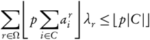

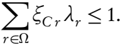

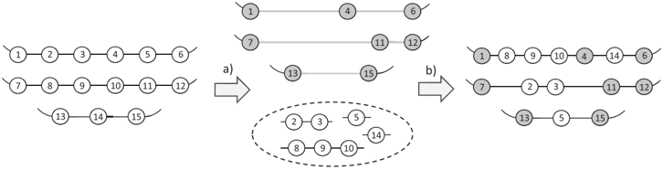

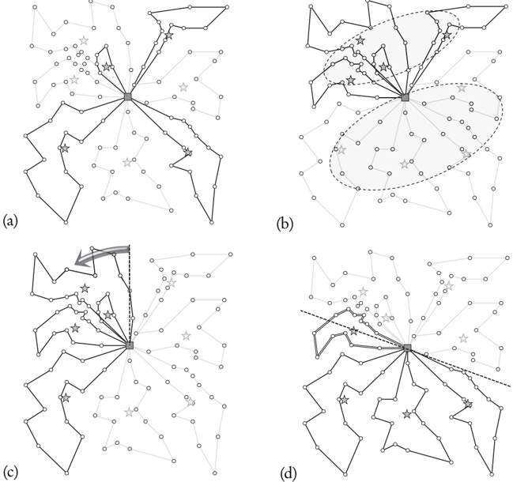

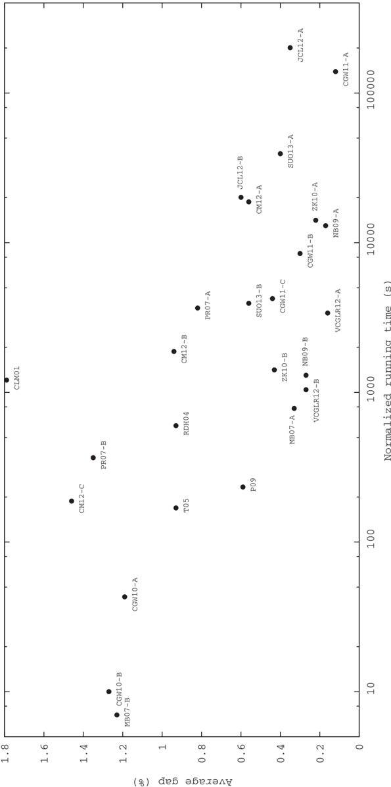

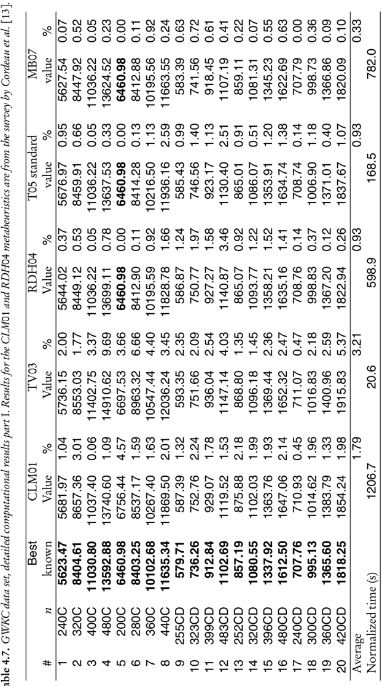

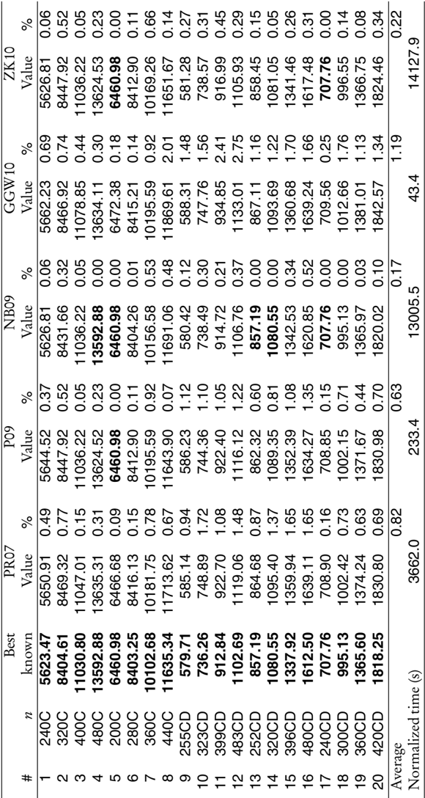

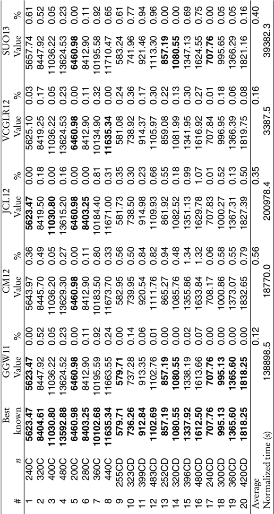

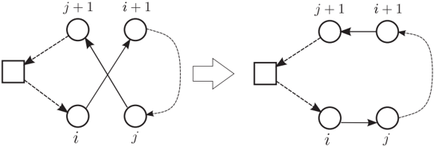

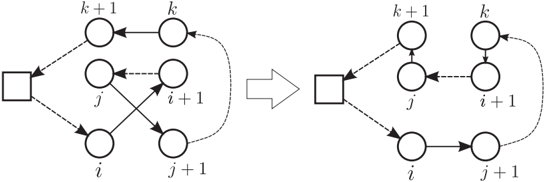

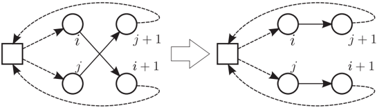

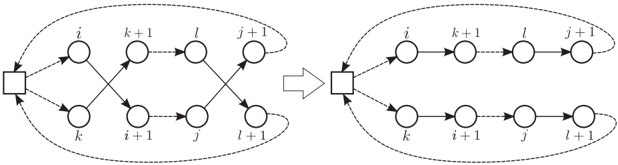

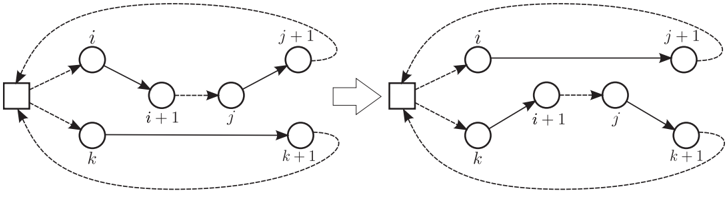

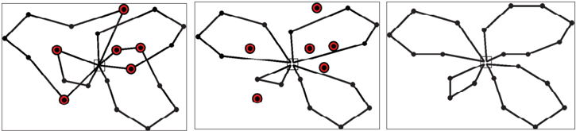

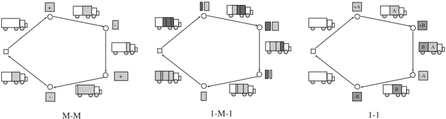

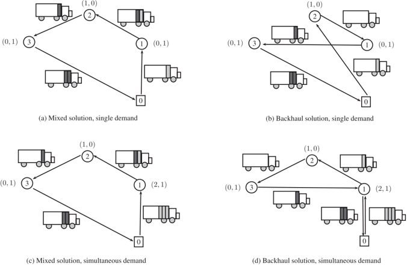

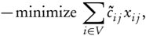

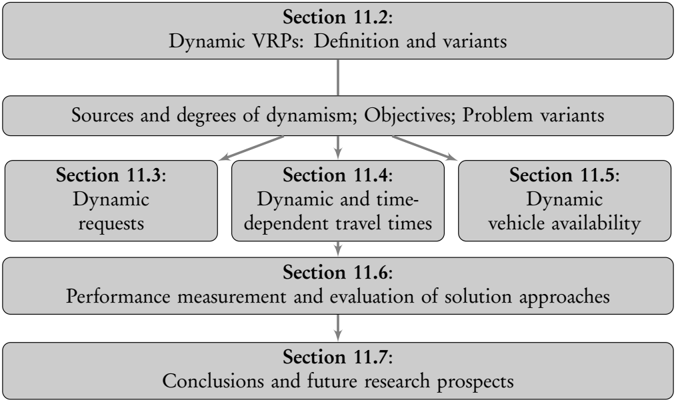

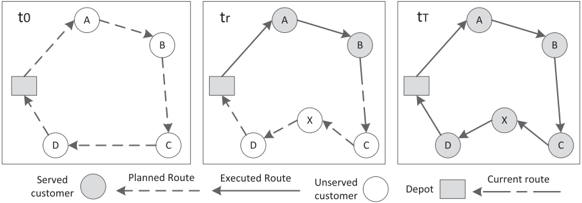

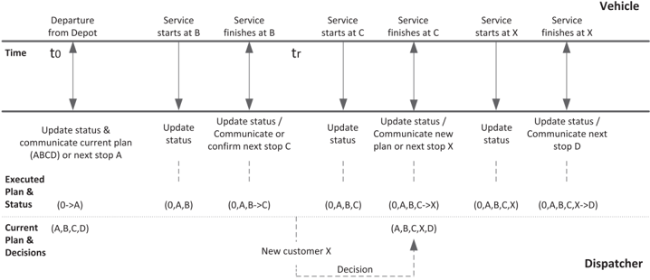

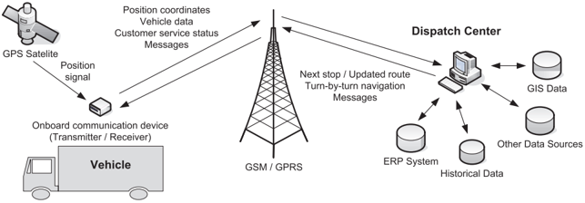

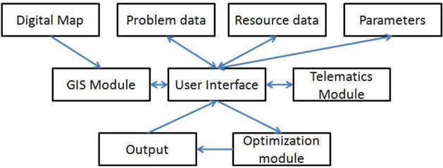

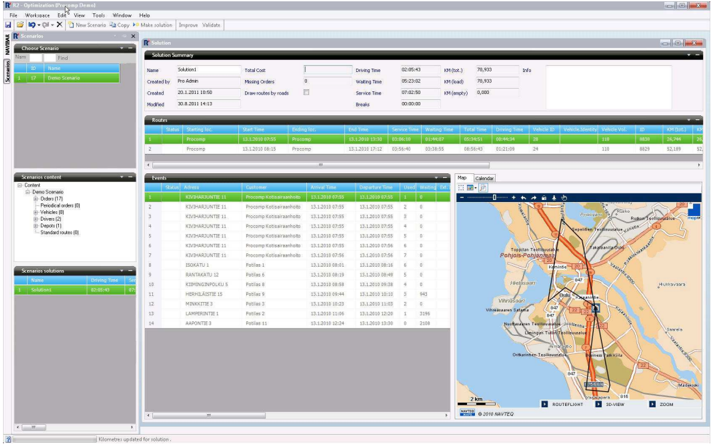

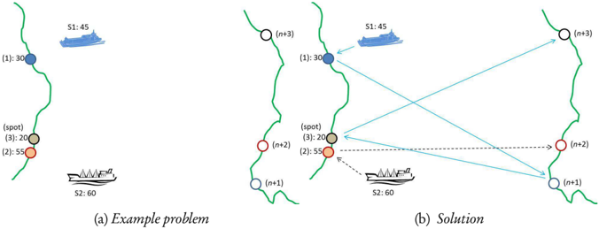

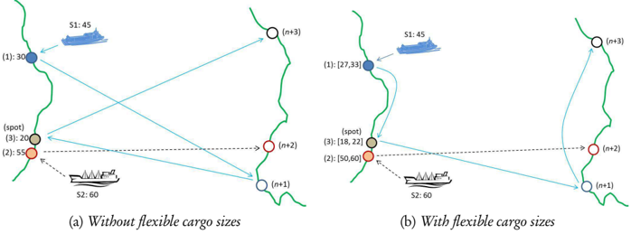

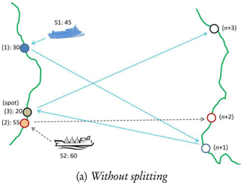

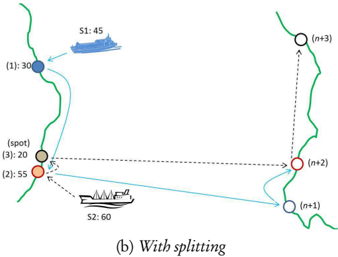

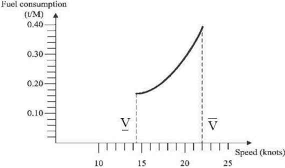

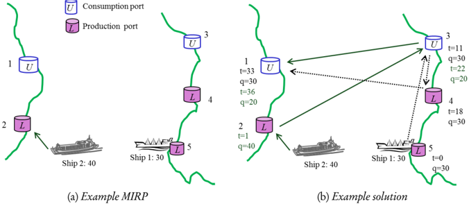

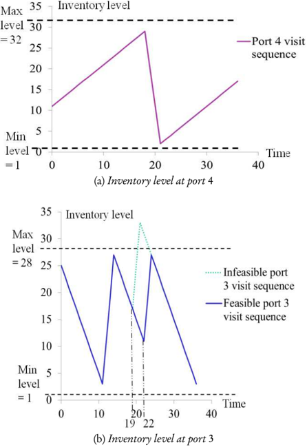

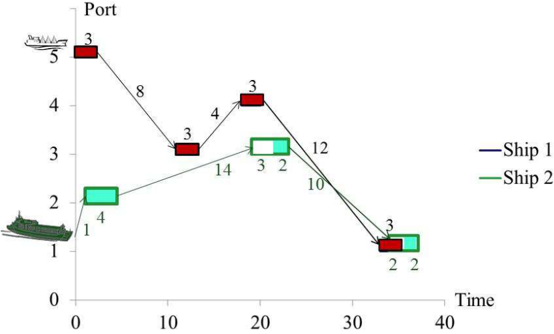

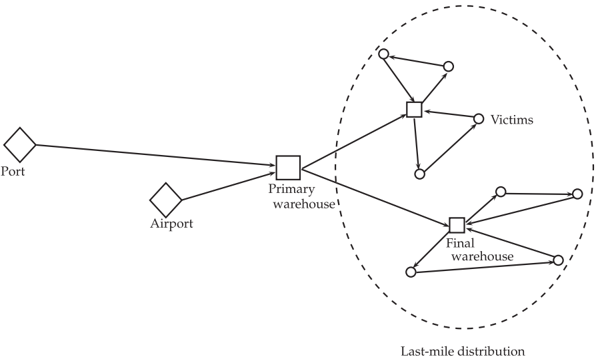

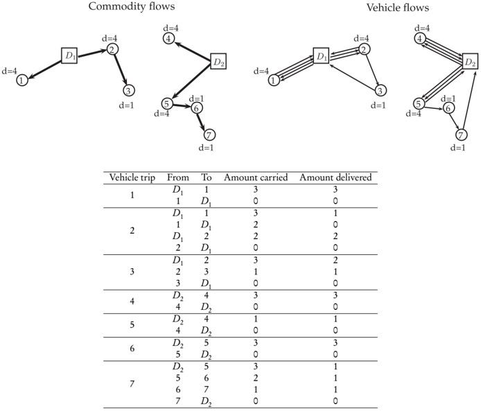

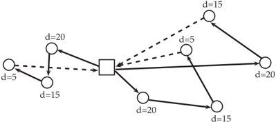

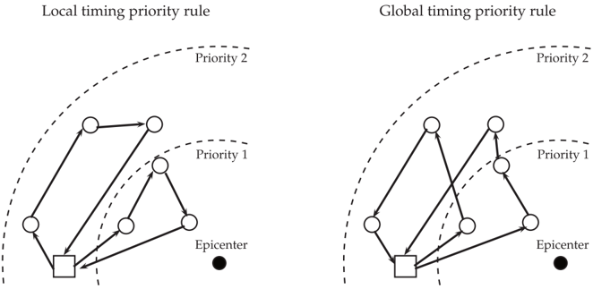

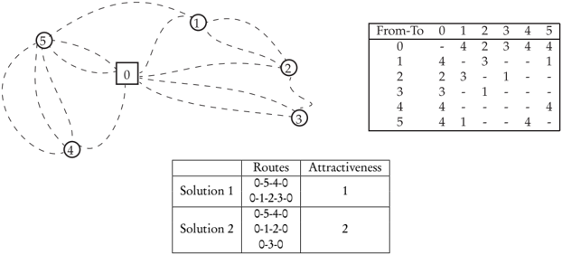

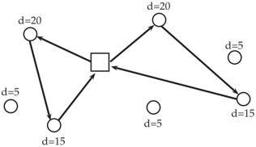

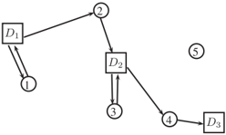

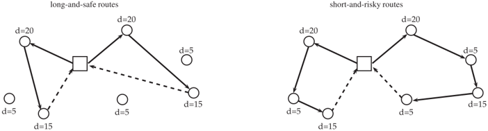

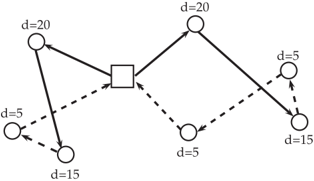

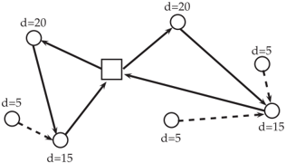

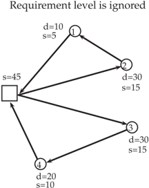

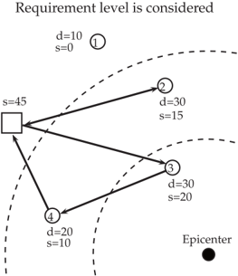

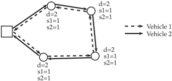

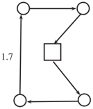

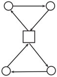

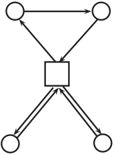

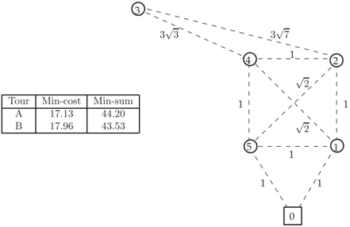

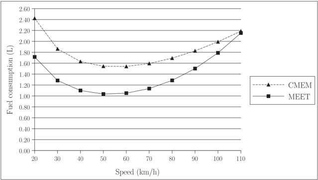

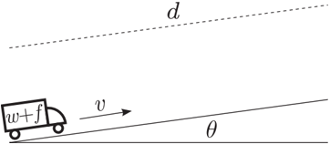

