GLYPH&lt;0&gt;3GLYPH&lt;0&gt;DGLYPH&lt;0&gt;UGLYPH&lt;0&gt;W

GLYPH&lt;0&gt;(

GLYPH&lt;0&gt;⩾GLYPH&lt;0&gt;4GLYPH&lt;0&gt;…


Contents lists available at ScienceDirect

## Transportation Research Part E

journal homepage: www.elsevier.com/locate/tre

## Green logistics location-routing problem with eco-packages

Yong Wang a,* , Shouguo Peng a , Xuesong Zhou b , Monirehalsadat Mahmoudi c , Lu Zhen d

- a School of Economics and Management, Chongqing Jiaotong University, Chongqing 400074, China
- b School of Sustainable Engineering and the Built Environment, Arizona State University, Tempe, AZ 85281, USA
- c School of Packaging, Michigan State University, East Lansing, MI 48824, USA
- d School of Management, Shanghai University, Shanghai 200444, China

## A R T I C L E  I N F O

## A B S T R A C T

## Keywords:

Location-routing problem State -space -time network Synchronization degree Lagrangian relaxation model Clarke -Wright

Optimization of the green logistics location-routing problem with eco-packages involves solving a two-echelon location-routing problem and the pickup and delivery problem with time windows. The first echelon consists of large eco-package transport, which is modeled by a time-discretized transport-concentrated  network  flow  programming  in  the  resource  sharing  state -space -time (SST) network. The second echelon focuses on small eco-package pickups and deliveries, established by the cost-minimized synchronization-oriented location routing model that minimizes the total generalized cost, which includes internal transportation cost, value of eco-packages, shortterm benefits and environmental externalities. In addition, the Gaussian mixture clustering algorithm is utilized to assign customers to their respective service providers in the pickup and delivery process, and a Clarke -Wright saving method-based non-dominated sorting genetic algorithm  II  is  designed  to  optimize  pickup  and  delivery  routes,  and  improve  their  costeffectiveness  and  degree  of  synchronization.  Different  strategy  testing  results  are  used  in  the service phase as input data to calculate the cost of the transport phase, which is solved through a Lagrangian relaxation approach. The 3D SST network representation innovatively captures the eco-package route sequence and state transition constraints over the shortest path in the pickup and  delivery  at  any  given  moment  of  the  transport  phase.  A  large-scale  logistics  network  in Chengdu,  China,  is  used  to  demonstrate  the  proposed  model  and  algorithm,  and  undertake sensitivity analysis considering the life cycle of green eco-packages.

## 1. Introduction

The convenience of online shopping platforms and the continuous growth of the world s commodity consumption rate are essential ' driving forces for modern logistics operations. The diversification and personalization of customer demands constitute emerging challenges to maintaining green logistics activities, including sustainable package delivery and pickup operations. In addition to meeting daily, diverse customer demands, logistics companies must consider the societal and environmental effect of logistics operations, and support sustainable logistics activities. Statistics show that more than 19 billion corrugated boxes were used for packaging in China in 2017, which means over 50 million tons of raw paper was consumed, resulting in about 70 million trees cut down for paper-

* Corresponding author.

E-mail addresses: yongwx@cqjtu.edu.cn (Y. Wang), shouguo.peng@polyu.edu.hk (S. Peng), xzhou74@asu.edu (X. Zhou), mahmou18@msu.edu (M. Mahmoudi), lzhen@shu.edu.cn (L. Zhen).

## https://doi.org/10.1016/j.tre.2020.102118

GLYPH&lt;0&gt;tGLYPH&lt;0&gt;\GLYPH&lt;0&gt;⩽GLYPH&lt;0&gt;\GLYPH&lt;0&gt;⩽GLYPH&lt;0&gt;h

GLYPH&lt;0&gt;⩾GLYPH&lt;0&gt;⩽GLYPH&lt;0&gt;\GLYPH&lt;0&gt;⩾GLYPH&lt;0&gt;⩾GLYPH&lt;0&gt;↑

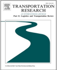


Fig. 1. Life cycle of green eco-packages and conventional packages.


Table 1

Sample costs of using the standard package and green eco-package (adopted from Nordin and Selke, 2010).

| Case                               |                          | Internal transportation cost   | Value of packages   | Short-term benefits   | Environmental Externality   |
|------------------------------------|--------------------------|--------------------------------|---------------------|-----------------------|-----------------------------|
| Standard package Green eco-package | Delivery Delivery Pickup | 6 6 6                          | 50 60 0             | 0 0 GLYPH<0> 30       | high - low and beneficial   |

making. Such huge resource consumption makes a green logistics strategy in packaging a focus of governments, enterprises, and customers (Liu et al., 2020a). In the life cycle of a conventional standard package, paper materials are used by the merchant for packaging products, transported by the logistics company to the customer, and ultimately discarded in most situations, as shown in Fig. 1. By contrast, in the case of green eco-packages, packaging materials are recycled and used multiple times after the customer takes out  the  product.  On  the  one  hand,  green  eco-packages  are  evidently  better  than  conventional  standard  packages  from  the  key perspective of green-oriented logistics and environmental protection. On the other hand, logistics companies tend to focus more on the cost and benefit of using green eco-packages. Thus, it is critically important to use Table 1 to compare the costs and benefits of the two types of packages. One can refer to Mahmoudi and Parviziomran (2020) to learn more about environmental and economic costs of these packages.

Table 1 compares the cost between a conventional standard package and a green eco-package for decision-making. From the manufacturing cost perspective, a green eco-package costs more than a conventional standard package (Nordin and Selke, 2010). The conventional standard package has no short-term benefit, that is, it has a high environmental externality due to the lack of recycling, whereas the green eco-package presents a relatively high short-term benefit and a low externality due to recycling. As a result, many companies have started to explore green logistics strategies that use green eco-packages to achieve cost savings from reduced waste of resources. In 2017, Suning invested 50,000 green eco-packages that can be recycled more than 1000 times to reduce the use of conventional standard packages by 6.5 million, and the percentage of cost savings exceeded 60%. In addition, the use of eco-packages enables resource sharing in terms of transporting and customer services across different facilities.

The location of the pickup facilities has a significant role on the recycling rate of green eco-package (Tiew et al., 2019). In a multiechelon logistics network design for conventional package delivery, how to select the pickup facilities from the existing delivery facilities to recycle the green eco-package is a major challenge. Massive delivery and pickup requests are generated daily by online shopping, creating the need for logistics operators to synchronize logistics activities in multi-echelon networks, especially under resource constraints. Furthermore, achieving sustainability in recycling green eco-packages requires a strong focus on the selection of the facilities ' locations along with the design of the routing network.

In this study, we address the challenging problem of simultaneous location-routing decision, reflecting that the usually dispersed distribution of customer nodes over the entire city causes difficulties in reducing the underutilization of resources. We approach this problem as a green logistics location-routing problem with eco-packages (GLLRPE) considering the state, space, and time aspects of operations  as  well  as  operational  synchronization  and  resource  sharing  between  facilities.  Finally,  we  propose  an  optimization framework  for  large-scale  multi-echelon  logistics  delivery  and  pickup  networks  to  solve  the  GLLRPE  for  logistics  operations ' sustainability.

In general, a multi-echelon logistics delivery and pickup network consists of one or more pickup centers (PCs) and delivery centers (DCs), multiple delivery satellites (DSs) and pickup satellites (PSs) at intermediate echelons, and many customers (Govindan et al., 2014; Wang et al., 2017). In a metropolis, where the sheer number of customers leads to large variations in pickup and delivery requirements, PSs and DSs should be wisely installed to satisfy customers ' actual expectations and keep companies profitable (Wang et al., 2018a). The state of each recycled green eco-package should also be tracked to examine its life cycle such that the logistics operators can decide on its reuse. Green eco-packages can be divided into three categories, namely, initial-, medium-, and criticalgrade recoveries in actual operations (Cruz et al., 2012; Da et al., 2014). For example, no pickup services are usually provided for eco-packages exceeding their thresholds of critical-grade recovery owing to the exorbitant recovery cost. Moreover, each customer or

GLYPH&lt;0&gt;3GLYPH&lt;0&gt;DGLYPH&lt;0&gt;UGLYPH&lt;0&gt;W

GLYPH&lt;0&gt;(

logistics facility with a specific geographical location has service time constraints (time) and is subject to a delivery or pickup decision (state), based on the space capacity of the vehicle (space) and recycling times. Hence, the entire network can be referred to as state -space -time (SST) network (Mahmoudi and Zhou, 2016; Xu et al., 2018; Mahmoudi et al., 2019a, 2019b). In these complicated green logistics networks, large green eco-packages need to be transported from the first-echelon logistics facilities to the secondechelon satellites by semitrailer trucks, and reassigned to multiple small eco-packages for delivery to customers with a high degree of synchronization. Moreover, in SST networks, the theory proves that resource sharing can provide a higher degree of synchronization between multi-echelon logistics facilities than if each facility operates on its own.

## 2. Literature review

The GLLRPE is a practical combination of the traditional location routing problem (LRP) and green logistics network optimization problem. Therefore, this study on GLLRPE integrates all requirements of traditional LRP (including time window constraints of customers and satellites), features of pickup and delivery problem (PDP), and expectations for synchronization in the pickup and delivery network.

The rationality in facility locations and vehicle routing is considerably significant to systematic logistics network optimization (Xie and Ouyang, 2016). For years, the interdependence of these two problems led to the definition of LRP, whose objective is to find a single solution for the location and vehicle routing problems (Nagy and Salhi, 2007). In addition, several practical applications (e.g., post box location (Labbe and Laporte, 1986), solid waste collection (Kulcar, 1996), multi-depot hub-location for parcel delivery ´ (Wasner and Zapfel, 2004), and multi-period discrete facility location problem (Albareda-Sambolaa and Nickel, 2012)) were defined ¨ and addressed based on real-world logistics activities. In recent years, several scholars focused on LRP from a humanitarian aspect, and proposed shelter location and evacuation routing solutions considering emergency uncertainties (Bayram et al., 2015; Bayram and Yaman, 2017). The awareness of sustainable energy and low-carbon environment protection have led other scholars to study electric vehicle LRP (Yang and Sun, 2015). For example, Schiffer and Walther (2017a) presented an electric LRP, considering partial charging and time windows, to determine vehicle service routing and charging station location simultaneously.

Green-oriented research topics generally display a relative  complexity in terms of mathematical modeling and computation. Extensive research on LRP, following the mathematical modeling of classic LRP by Salhi and Rand (1989), has focused on different applications in multi-echelon environments, as well as uncertain and dynamic contexts (Contardo et al., 2012; Wang et al., 2018b). Generally, various uncertain situations and external effects should be considered in location-routing optimization design, such as probabilistic disruptions for built facilities (Xie and Ouyang, 2016); uncertainty of customers ' spatial distribution, demands, and service time windows (Schiffer and Walther, 2017b); environmental effect caused by industrial and transportation activities and traffic noise pollution (Toro et al., 2017; Wang et al., 2018c); and uncertainty of costs, returns, and maximum service supply for the facilities ' location  (Saedinia  et  al.,  2019).  These  practical,  sustainable  considerations  increase  the  complexity  of  problem  solving  while improving the reliability of location-routing optimization.

The practical importance and complexity of LRP and its related variants have spurred the development of multiple optimization algorithms (Schiffer et al., 2019). Clustering algorithms including K -means, fuzzy-based, and other clustering methods provide a feasible solution strategy for complex large-scale problems within a certain calculation accuracy (Van Anholt et al., 2016). Generally, the initial problem can be decomposed into several manageable sub-problems with these methods (Sever et al., 2018; Cankaya et al., 2019). However, although clustering algorithms reduce computational complexity to a certain extent (Nagy and Salhi, 2007; Rabbani et al., 2017), heuristic algorithms or combined heuristic algorithms show a feasible, fast computational performance in finding the best solution  for  large-scale  location-routing  problems,  especially  for  considerations  of  uncertainty  and  practicality  (Alinaghian  and Shokouhi, 2018; Bagheri et al., 2019). For example, adaptive large neighborhood search methods reinforced by local search were adopted to address complicated LRP with intra-route facilities (Schiffer and Walther, 2017a) and green LRP (Dukkanci et al., 2019). In addition, heuristic algorithms including meta-heuristic algorithms or multi-objective hyper-heuristic algorithms were verified to solve LRP problems efficiently considering multiple factors, such as cost savings, integrated solid waste management (Asefi et al., 2019), and delivery time in cold chain logistics (Wang et al., 2020).

Among other extensions of LRP, PDP is integrated by several researchers to seek sustainable strategies and optimize logistics operations (Govindan et al., 2020). Related research includes PDP with synchronization constraints in multi-echelon logistics networks, such as feasible PDP based on fixed partial routes (Berbeglia et al., 2012), PDP for passenger transportation under vehicle sharing (Mahmoudi and Zhou, 2016), green LRP with pickups and deliveries (Toro et al., 2017; Rabbani et al., 2018), single vehicle routing problem with pickup and delivery (Bruck and Iori, 2017), and first-mile pickup and last-mile delivery problem with vehicle sharing (Bergmann et al., 2020). Numerous existing studies define synchronization degree as constraints (Drexl, 2012; Ibarra-Rojas et al., 2016). For solution search, exact approaches (e.g., branch-and-cut algorithm (Cordeau, 2006; Ropke et al., 2007), column generation and branch-and-cut-and-price algorithm (Ropke and Cordeau, 2009), dynamic programming (Tang et al., 2016; Lu et al., 2019), and Lagrangian relaxation-based method (Lei and Ouyang, 2018; Rafie-Majd et al., 2018) are usually applied.

This study constructs a resource sharing SST network by adding the state of packages-to-delivery and green eco-packages-to-pickup to the original space-time network configuration applied by Miller (1991), and Ziliaskopoulos and Mahmassani (1993). A similar approach was applied by Mahmoudi and Zhou (2016), but mainly focused on passenger transportation. The SST network addressed in this  study  consists  of  a  freight  logistics  network  and  embeds  the  characteristics  of  multi-node  PDPs.  The  Lagrangian  relaxation approach and heuristic algorithms are simultaneously used to elaborate a dynamic programming approach to the GLLRPE given the complexity  of  the  problem.  Initial  GLLRPE  is  decomposed  into  a  sequence  of  sub-problems  by  using  the  Lagrangian  relaxation approach (Yang and Zhou, 2017) to compute the shortest path problem.

GLYPH&lt;0&gt;3GLYPH&lt;0&gt;DGLYPH&lt;0&gt;UGLYPH&lt;0&gt;W

GLYPH&lt;0&gt;(

Fig. 2. GLLRPE solution process.

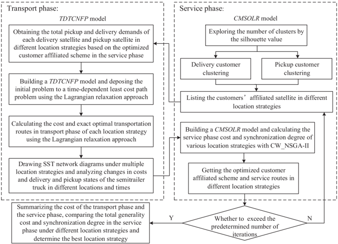

Compared with previous studies, our proposed approach has several contributions in theory and application: (1) improving conventional delivery operations using standard packages by applying green eco-packages for delivery and adding eco-package pickup to earn additional short- and long-term benefits in GLLRPE; (2) proposing a two-phase optimization model, including the time-discretized transport-concentrated  network  flow  programming  (TDTCNFP)  and  cost-minimized  synchronization-oriented  location  routing (CMSOLR) in the resource sharing SST network; (3) combining the Lagrangian relaxation approach with a heuristic algorithm to determine  the  locations  of  eco-package  PSs  under  SST  network  representation  and  synchronization  degree  constraints;  and  (4) exploring the influence of the life cycle of green eco-packages on location-routing schemes and analyzing potential factors that affect PS locations.

The remainder of this study is constructed as follows. The investigated problem, its decomposition and the generated transport and service subproblems are described in Section 3. The optimization model and solution approaches for subproblems are presented in Section 4. A practical case study is used to verify the validity of the proposed model and algorithm in Section 5. Conclusions are summarized in Section 6.

## 3. Problem statement

The term  Green Logistics Location Routing Problem ' ' has been explored by numerous researchers (e.g., Bektas and Laporte, 2011; Toro et al., 2017; Wang et al., 2018b). Several existing articles address this problem to reduce greenhouse gas emission and effectively design backward logistics networks for recycling used products.

On the basis of a multi-echelon multi-depot logistics network, the investigated GLLRPE is divided into two problems, namely, the upper echelon semitrailer truck transportation problem from DCs and PCs to satellites (transport phase), and the lower echelon delivery and/or pickup problem from the satellite to customers (service phase). The first echelon in the two-echelon multi-depot logistics network is composed of connections between PCs or DCs and satellites, and the second echelon consists of links between satellites and customers. Semitrailer trucks are used by DCs and PCs in the first echelon, whereas vehicles are deployed by satellites to serve customers. The GLLRPE solution process is shown in Fig. 2. First, a CMSOLR model is established and solved using a Clarke -Wright saving method-based non-dominated sorting genetic algorithm II (CW\_NSGA-II) method in the service phase. Then, a TDTCNFP model based on Lagrangian relaxation is proposed and solved to determine the best location strategy in the transport phase.

In Fig. 2, the proposed GLLRPE is decomposed into two subproblems in the transport and service phases, and the location selection of the eco-package PSs is determined based on an analysis of the calculation results of both phases. In accordance with the characteristics of the PS, location selection influences optimizing transport and service phases. Therefore, the cost and synchronization degree must be considered separately when satellite positions are uncertain, and final locations are then determined through a systematic analysis, in which synchronization degree is defined based on queue waiting time by a semitrailer truck in the facilities. In the service phase, delivery customer affiliation and route optimization under different location strategies are realized by establishing the CMSOLR model. In the transport phase, cost and route optimization under different location strategies are calculated based on the SST network, assuming the delivery customer affiliation is known. The two subproblems in the transport and service phases are introduced in Section 3.1 and 3.2, respectively. Resource sharing in improving the synchronization degree in the SST network is presented in

GLYPH&lt;0&gt;3GLYPH&lt;0&gt;DGLYPH&lt;0&gt;UGLYPH&lt;0&gt;W

GLYPH&lt;0&gt;(

Fig. 3. Logistics network with actual and dummy nodes.

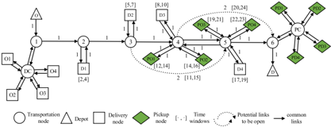

Fig. 4. Shortest path in the vehicle s SST network with recycling of green eco-packages. '

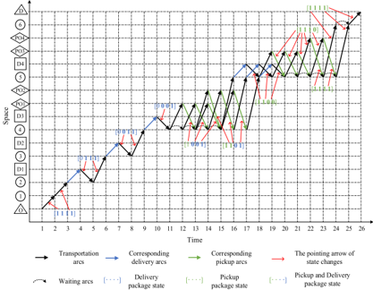

## Section 3.3.

## 3.1. Description of the transport phase based on SST network

This section describes the SST network and illustrates the operations of component logistics facilities using a graph denoted as G N ( , A ), where N represents a set of network nodes consisting of transportation nodes, depots, and delivery and pickup nodes, and A represents a set of links including common links and potential links. An illustrative example with six transportation nodes is proposed to support our research framework and shown in Fig. 3. Each solid link ( i, j ) that connects nodes  and  has its own travel time i j T i, j ( ) that is calculated based on the distance between nodes  and  . However, several road sections are open to facilitate logistics transportation, i j given less traffic and less people at certain times of day. For example, large trucks are allowed to travel within the city after 10 p.m., and several large trucks are only allowed to pass through certain bridges and tunnels at certain fixed times. Dotted links are exclusively defined to indicate direct transportation links that are open within a specific time window. A transportation network with pickup and delivery requests is shown in Fig. 3. Circles represent the transportation nodes with DCs, PCs, satellites and other transportation hubs. Circles 2, 3, 4, and 5 represent satellites, and Circles 1 and 6 represent transportation hubs. Squares and diamonds represent several dummy nodes with a certain pickup or delivery requirements.

Without loss of generality, this study assumes that multiple pickup and delivery requirements must be satisfied in a network with a pair of origin and destination, such as O1 and D1, PO1 and PD1. An example with six nodes is taken, and logistics operations are performed with a semitrailer truck route from origin O or PO to destination D or PD . The semitrailer truck is also required to collect green eco-packages from several nodes along with deliveries and deliver several of the eco-packages to other nodes during the pickup cycle. The overall design is an embedded system, where pickups and deliveries occur during distribution and recycling operations. Therefore, this study considers the delivery problem as a special PDP, the pickup problem as another special PDP, and the delivery or

Fig. 5. Schematic of routing optimization in the service phase.

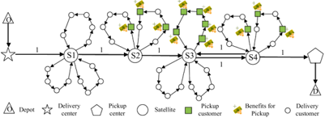

GLYPH&lt;0&gt;3GLYPH&lt;0&gt;DGLYPH&lt;0&gt;UGLYPH&lt;0&gt;W

GLYPH&lt;0&gt;(

r

Table 2

Cost comparison of a shortest path for cases with and without eco-package pickup.

| Delivery with conventional standard packages   | Delivery with conventional standard packages   | Delivery with conventional standard packages   | Delivery with conventional standard packages   | Delivery with conventional standard packages   | Delivery and pickup with green eco-packages   | Delivery and pickup with green eco-packages   | Delivery and pickup with green eco-packages   | Delivery and pickup with green eco-packages   | Delivery and pickup with green eco-packages   | Delivery and pickup with green eco-packages   | Delivery and pickup with green eco-packages   |
|------------------------------------------------|------------------------------------------------|------------------------------------------------|------------------------------------------------|------------------------------------------------|-----------------------------------------------|-----------------------------------------------|-----------------------------------------------|-----------------------------------------------|-----------------------------------------------|-----------------------------------------------|-----------------------------------------------|
| Arc                                            | Time cost ($)                                  | Internal transport cost ($)                    | Value of packages ($)                          | Total cost ($)                                 | Arc                                           | Time cost ($)                                 | Internal transport cost ($)                   | Value of packages ($)                         | Short-term benefits ($)                       | Operating cost ($)                            | Total cost ($)                                |
| (O,1)                                          | 1                                              | 6                                              | 0                                              | 6                                              | (O,1)                                         | 1                                             | 6                                             | 0                                             | 0                                             | 0                                             | 6                                             |
| (1,DC,1)                                       | 5                                              | 30                                             | 0                                              | 30                                             | (1,DC,1)                                      | 5                                             | 30                                            | 0                                             | 0                                             | 0                                             | 30                                            |
| (1,2)                                          | 3                                              | 18                                             | 0                                              | 18                                             | (1,2)                                         | 3                                             | 18                                            | 0                                             | 0                                             | 0                                             | 18                                            |
| (2,3)                                          | 3                                              | 18                                             | 50                                             | 68                                             | (2,3)                                         | 3                                             | 18                                            | 60                                            | 0                                             | 0                                             | 78                                            |
| (3,4)                                          | 3                                              | 18                                             | 50                                             | 68                                             | (3,4)                                         | 7                                             | 42                                            | 60                                            | 0                                             | 0                                             | 102                                           |
| (4,5)                                          | 3                                              | 18                                             | 50                                             | 68                                             | (4,5)                                         | 7                                             | 42                                            | 60                                            | GLYPH<0> 60                                   | 10                                            | 52                                            |
| (5,6)                                          | 1                                              | 6                                              | 50                                             | 56                                             | (5,6)                                         | 1                                             | 6                                             | 60                                            | GLYPH<0> 60                                   | 10                                            | 16                                            |
| (6,O)                                          | 1                                              | 6                                              | 0                                              | 6                                              | (6,PC,6)                                      | 5                                             | 30                                            | 0                                             | GLYPH<0> 120                                  | 0                                             | GLYPH<0> 90                                   |
|                                                |                                                |                                                |                                                |                                                | (6,O)                                         | 1                                             | 6                                             |                                               |                                               |                                               | 6                                             |
|                                                |                                                |                                                |                                                | 320                                            |                                               |                                               |                                               |                                               |                                               |                                               | 218                                           |

GLYPH&lt;0&gt;

Fig. 6. Changes of synchronization degree in two resource sharing sequences.

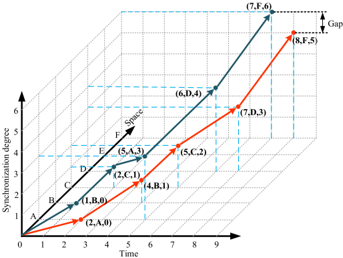

pickup problem as a comprehensive PDP with a specific origin and destination. The pickup and delivery processes occurring during distribution and recycling operations, respectively, are simplified for concise description. Delivery and pickup operations are subject to time windows and capacity constraints.

The semitrailer truck is assumed to contain four storage bins to illustrate the green delivery and pickup of green eco-packages clearly. The shortest path as the sequence of visits over {O, 1, 2, D1, 2, 3, D2, 3, 4, D3, 4, PO1, 4, PO2, 4, 5, D4, 5, PO3, 5, PO4, 5, 6, D} is shown in Fig. 4. Time is discretely distributed on the horizontal axis based on the time window requirements and the transit time constraints, whereas demand points and intermediate nodes are distributed on the vertical axis to structure the SST network. Blue, green, and black arcs indicate the processes for package delivery, pickup and transportation, respectively.

A fully loaded semitrailer truck departs from O , collects eco-packages from DC at time 1 and first visits D1 for deliveries. The loading state is identified by vector [1 1 1 1] in Fig. 4, showing that all four bins contain packages. Binaries indicate the state of the bins in the semitrailer truck, thereby setting the value of the corresponding bin to be 0 after service. Hence, the state of the semitrailer truck, after traveling from D1 to node 2 and from node 2 to 3 during time [5, 6], changes from [1 1 1 1] to [0 1 1 1]. Similarly, the state vector becomes [0 0 0 1] as the semitrailer truck delivers to D1 -D3. The completion of deliveries provides an empty space in the semitrailer truck, which can be used for pickup purposes if requested. In Fig. 4, two pickup operations for PO1 and PO2 are requested at node 4. Therefore, the available storage bins will be utilized for the recycling of green eco-packages within the time windows of PO1 and PO2. A waiting time should be observed at transportation nodes when the semitrailer truck arrives before the earliest time that the customer requires. Finally, the semitrailer truck returns to the destination with the state of [1 1 1 1] when it is fully loaded by green ecopackages.

Table 2 compares the cost of a shortest path for cases with and without eco-package pickup, where the time cost includes the travel time and service time costs at the satellite facilities, and the operating cost comprises the holding and handling costs only for ecopackages to compare the delivery of conventional standard packages and green eco-packages. In addition, the short-term benefit can be obtained when eco-packages are collected. According to the definition shown in Table 1, the internal transportation cost is set as $6, the value of each conventional standard package is $50, and the value of each eco-package is $60. The short-term benefits of each recycled eco-package are defined as $30 because the overall use of new packages is reduced, which can be considered the negative cost (i.e., $-30) in the model formulation. The necessary operating cost of $5 for each recycled eco-package should be spent in the pickup node.

Table 2 shows that the shortest path for the delivery and pickup with green eco-packages has a lower cost (i.e., $218) than that with conventional standard packages (i.e., $320). Although the shortest path without collecting operations has a reduced cost of recycling and transportation, the cost and resource waste caused by remanufacturing or purchasing the packaging box is significantly large. Moreover, inefficiency in the usage of the semitrailer truck capacity after the complement of the delivery operation increases the opportunity cost of the enterprise. In addition, two different scenarios are simulated to analyze the effect of operation time. In the firstechelon transportation network optimization, the introduction of SST network enables us to adapt dynamic programming algorithms to  solve  the  complicated  vehicle  routing  problem  without  relying  on  external  optimization  solvers.  In  addition,  the  Lagrangian relaxation algorithm is applied to relax constraints of the objective function, by adding penalty coefficients and relaxing linear constraints through dual multipliers as much as possible, thereby making the subproblems easier to solve. When considering alternative methods such as branch and cut, and branch and price which heavily reply on linear programming with basic variables, a smaller set of constraints can only be considered to obtain solutions with a reduced set of basic variables. In our proposed model that involves many constraints, the resulting multiple SST columns could lead to difficulties in finding a feasible solution if branch and cut type methods are applied. Furthermore, the primary problem can be decomposed into a series of time-dependent least-cost path subproblems with the Lagrangian relaxation approach by relaxing the constraints of pickup requirements into the objective function. Therefore, using the Lagrangian relaxation approach is more advantageous in terms of applicability and scalability.

## 3.2. Description of the service phase

In the transport phase, trucks are used to collect and deliver packages at the first-echelon facility, and the SST network-based

GLYPH&lt;0&gt;3GLYPH&lt;0&gt;DGLYPH&lt;0&gt;UGLYPH&lt;0&gt;W

GLYPH&lt;0&gt;(

Fig. 7. Average demand queue length and waiting time based on resource sharing.

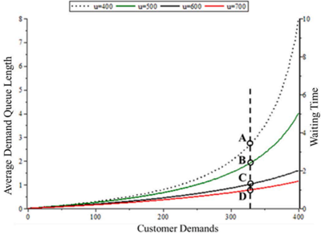

Fig. 8. Flow chart of the two-phase delivery and pickup programming model.

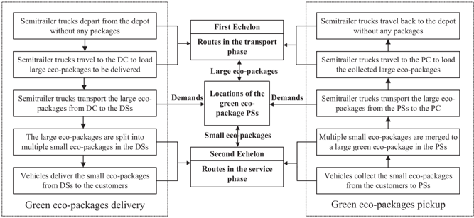

Lagrangian relaxation approach is then employed to optimize the first-echelon network through decomposing the main problem to several subproblems with time-dependent least-cost-path (Mahmoudi et al., 2019a; Lu et al., 2019; Liu et al., 2020b). During the service phase, customer delivery and pickup requirements are achieved through vehicle cruise. In Fig. 5, semitrailer trucks with large eco-packages depart from the depot and travel to satellites. Large eco-packages are packed into multiple small eco-packages according to the distribution area at the satellite. Many customers with diverse delivery and pickup requirements are distributed around satellites visited by vehicles to satisfy their requirements. Several satellites are simply DSs for the absence of pickup demand (P.D.), whereas others can be potential collection satellites if sufficient P.D. is available. Fig. 5 shows that S1 is purely DSs, whereas S2 -S4 have potential pickup functions. However, three types of routes are available for potential eco-package PSs, including the route exclusively for eco-package delivery services, the route exclusively for eco-package pickup services, and the route simultaneously for eco-package delivery and pickup services. This study applies a method that adds a virtual pickup customer node at the delivery customer node with pickup requirements, and then calculates the distance between two customers based on the customers ' geographic coordinates, which can be utilized in the service phase as input data to calculate delivery cost and waiting time, and achieve service phase optimization.

Initially, the PSs ' locations as well as their affiliated pickup customers are not determined. Customer clustering is adopted for delivery and pickup region partitioning due to the importance of an effective repartition of the network for the routing optimization. Subsequently, solutions to the routing problem are improved by combining exact and heuristic algorithms. The following section models the transport and service phases for obtaining the least-cost case with the highest synchronization degree.

## 3.3. Synchronization in resource sharing SST network

In the transport phase of the first-echelon logistics network, semitrailer trucks present different unused capacities in various transport routes ( ' space ) and times, which means the effects of resource sharing on the synchronization degree for the entire network ' depend on the sharing sequence and travel routes of the semitrailer trucks to the facilities. Fig. 6 shows a simple example to describe the changes of synchronization degree in two resource sharing sequences in the SST network.

In Fig. 6, the two resource sharing sequences present varied improvements in synchronization degree. A higher synchronization degree means less waiting time. The resource sharing sequence of (B → C → A → D → F) exhibit a higher synchronization degree

GLYPH&lt;0&gt;3GLYPH&lt;0&gt;DGLYPH&lt;0&gt;UGLYPH&lt;0&gt;W

GLYPH&lt;0&gt;(

Table 3 Symbols and description used in the TDTCNFP model.

| Symbol   | Definition                                                                                                      |
|----------|-----------------------------------------------------------------------------------------------------------------|
| I        | Set of eco-package satellite, i ∈ I                                                                             |
| K        | Set of semitrailer trucks served in the transport phase, k ∈ K                                                  |
| P        | Set of pickup centers, ρ ∈ P                                                                                    |
| D        | Set of delivery centers, d ∈ D                                                                                  |
| ST b 1   | Short-term benefits of unit large eco-package to be collected                                                   |
| LT e     | Long-term benefits of the large eco-package                                                                     |
| c i      | Operating cost of eco-package satellite i selected to be a pickup satellite                                     |
| α b      | Value of the unit large eco-package                                                                             |
| Q i      | Quantity of the large eco-package distributed in satellite i                                                    |
| P i      | Quantity of the large eco-package collected in eco-package satellite i                                          |
| o ′ k    | Origin of semitrailer truck k                                                                                   |
| d ′ k    | Destination of semitrailer truck k                                                                              |
| e k      | Earliest departure time of semitrailer truck k                                                                  |
| l k      | Latest arrival time of semitrailer truck k                                                                      |
| y ′ ik   | If the satellite i ' s large eco-packages distributed by semitrailer truck k , y ′ ik = 1; otherwise y ′ ik = 0 |
| y ik     | If the satellite i ' s large eco-packages collected by semitrailer truck k , y ik = 1; otherwise y ik = 0       |
| σ i      | Binary variable. If the DS i is selected to be an eco-package PS, σ i = 1; otherwise σ i = 0                    |
| S k      | Set of SST arcs in semitrailer truck k ' s green delivery and pickup network                                    |
| w 0      | Express empty state of the semitrailer truck                                                                    |
| w pO     | State of pickup in the origin                                                                                   |
| w dD     | State of delivery in the destination                                                                            |
| D        | Set of delivery satellites with delivery request for the standard packages                                      |
| ̂ D      | Set of delivery satellites with delivery request for the green eco-packages                                     |
| ̂ P      | Set of pickup satellites with pickup request for the green eco-packages                                         |
| μ ( p )  | Lagrangian multiplier that can be interpreted as the eco-package p ' s service profit                           |
| ϕ d , k  | Set of delivery service arcs of large eco-package d in semitrailer truck k ' s transportation network           |
| ϕ p , k  | Set of pickup service arcs of large green eco-package p in semitrailer truck k ' s transportation network       |

compared with that of (A → B → C → D → F). Therefore, a proper resource sharing sequence can improve the synchronization degree between facilities and reduce the excessive or unnecessary waiting time in the SST network.

However, the queue length in queuing theory can be used as a critical index to measure the synchronization degree of two adjacent facilities in a resource sharing sequence to verify the effectiveness of different resource sharing sequences in improving the synchronization of facilities (García-Sanz et al., 2008; Karsten et al., 2015). The basic assumption in the typical queuing theory, which states that the service rate is larger than the arrival rate λ &lt; μ is not always true considering seasonal P.D./delivery demands (D.D.). The case of λ &gt; μ appears when events such as price discounts inflate e-commerce demand (and thus pickup/delivery volumes) while service capacities remain unchanged. Therefore, whether two adjacent facilities in the resource sharing sequence have similar or different relationships in customer demands -service capabilities, the method of resource sharing including facility and transport resource sharing can always achieve a tremendous improvement in synchronization degree. Three scenarios under different demandand-service-capability relations are discussed in detail to prove the validity of the proposed theory of resource sharing in the SST network.

Assumption 1: Customer demand served by facility α at time t follows a Poisson distribution with parameter λ α t , and the facility s ' service capacity follows a negative exponential distribution with parameter μ α t .

Assumption 2: Customer demand served by facility β at time T satisfies a Poisson distribution with parameter λ β T , and the facility s ' service capacity follows a negative exponential distribution with parameter μ β T .

In addition, the semitrailer truck departs from facility α at time t and arrives at facility β at time T. Based on the demand-andservice-capability  relations  in  the  SST  network,  three  Theorems  are  presented  to  prove  the  effectiveness  of  resource  sharing  in improving the synchronization degree of facilities.

Theorem 1: . When the two adjacent facilities α and β face inflated customers ' demands at time t and T respectively, which leads to λ α t &gt; μ α t and λ β T &gt; μ β T , resource sharing can reduce queue length by regulating extra demands to improve network synchronization degree.

## Proof: . Appendix A1.

Theorem 2: . When one facility α faces a regular demand at time t ( λ α t &lt; μ α t ) and the other facility β faces inflated demands at time T

GLYPH&lt;0&gt;3GLYPH&lt;0&gt;DGLYPH&lt;0&gt;UGLYPH&lt;0&gt;W

GLYPH&lt;0&gt;(

( λ β T &gt; μ β T ), resource sharing balances the deficits in the facilities ' service capacities so as to reduce service waiting in the SST network and improve the network synchronization degree.

## Proof: . Appendix A2

Theorem 3: . When the two adjacent facilities α and β have extra service capabilities at time t and T, respectively ( λ α t &lt; μ α t , λ β T &lt; μ β T ), resource sharing achieves the rational reorganization of demands to improve network synchronization degree in the SST network. (Theorem 3 can be proven similarly as Theorem 2).

A numerical analysis is conducted in this study to illustrate these Theorems. Fig. 7 shows the average request queue length and waiting time based on resource sharing. According to the foregoing proof, resource sharing can improve the network synchronization degree with adhesion of new facilities. Adhesion refers to the process of a new facility joining the resource sharing sequence with an increase of service capacity by u. For instance, with a customer demand of 325, the average queue length from A, B, and C to D decreases following the adhesion of a new facility. The waiting time also decreases, which suggests an improved synchronization degree. Consequently, this study concludes that resource sharing in the SST network can contribute to synchronized logistics operations.

## 4. Two-phase delivery and pickup programming model

Based on the introduction and complexity of the GLLRPE, the flowchart for the two-phase delivery and pickup programming model is illustrated in Fig. 8.

This study explores the location problem of facilities with routing optimization in the two-echelon logistics network, as shown in Fig. 8. The PSs are selected from the DSs in the mature logistics delivery network. The numbers and locations of satellites selection influence the green eco-packages ' pickup and delivery for the transport and service phases. In addition, the demand conversion of the large and small green eco-packages is completed at the second-echelon of satellites, and an SST network is introduced in the transport phase to explore the locations of semitrailer trucks and the states of pickup and delivery at a special time. The two-phase programming models are established as follows.

## 4.1. TDTCNFP model

## 4.1.1. Relevant definitions and notations in the TDTCNFP model

In the first-echelon logistics network which is designed to transfer large eco-packages, the study time horizon can be discretized to a series of equal time intervals to construct an SST network. In the time-discretized setting, pickup/delivery operations happen within a given time interval instead of a specific timestamp (Boland et al., 2017a). It is expected that the discretization of time might not record the exact pickup/delivery time. For example, a facility s time window and expected delivery time are [9:30 am-9:40 am] and 9.30 am, ' respectively. Under the discretization of 10-minute time intervals, the actual service time may be 9:35 am, which corresponds to a 5minute gap with respect to the optimization result in the continuous-time model. On the other hand, the time-discretized model provides a reasonable approximation for eco-packages ' pickup and delivery time within a certain accuracy range, especially for logistics facilities with wide time windows in the first-echelon. Subsequently, based on the time-discretized SST network, the Lagrangian relaxation approach can be applied to produce upper and lower bound solutions in a computationally efficient manner. In recent years, significant research efforts have been devoted to producing better continuous-time solutions using partially time-expended networks (Boland et al., 2017b; He et al., 2018).

Each semitrailer truck departs empty from the depot, and travels to the DC to load eco-packages-to-deliver. Travel arc ( i,j,t,s ) can be identified as a semitrailer truck departing from node i at time t and arriving at node j at time  . Therefore, vertex s ( i , t , wpO ) is connected to vertex ( j , s , wdD ) by arc ( i , j , t , s wpO , , wdD ) . wpO includes the pickup operation occurring during distribution and recycling services, and wdD includes the delivery operation occurring during distribution and recycling services. The distribution service combines the large eco-packages loading (pickup state wpO ) from the DC and unloading (delivery state wdD ) at customer nodes. The recycling service combines the large eco-package pickup (pickup state wpO ) from the customer and the unloading (delivery state wdD ) at the PC. The following rules are enforced to integrate eco-packages distribution and the recycling of large eco-packages on each semitrailer truck route:

Rule 1. State transition is completed at the dummy node close to the facilities and customers. The semitrailer truck must wait at the transportation nodes if the arrival time is before the time window, instead of the dummy nodes for their virtuality, and the time of operation at the dummy node is 0.

Rule 2. When the large eco-package is unloaded at the dummy nodes, the state of the storage bins changes from 1 to 0. Similarly, the state changes from 0 to 1 when the large eco-packages are loaded on the semitrailer truck.

Rule 3. The delivery or pickup operation of the semitrailer truck is only allowed to be completed at dummy nodes. Deliveries and pickups of large eco-packages are not allowed at the transportation nodes.

Several symbols and definitions used to build the TDTCNFP model are provided in Table 3.

## 4.1.2. Model formulation for TDTCNFP

Based on the constructed SST network, a TDTCNFP model can be established to solve the transportation problem between the first

GLYPH&lt;0&gt;3GLYPH&lt;0&gt;DGLYPH&lt;0&gt;UGLYPH&lt;0&gt;W

GLYPH&lt;0&gt;(

Table 4 Notations and definitions in the Lagrangian relaxation solution approach.

| Symbol        | Definition                                                                                                 |
|---------------|------------------------------------------------------------------------------------------------------------|
| τ             | Iteration Number                                                                                           |
| μ ( p ) τ     | Lagrangian multiplier corresponding to the package p ' s pickup request constraint at the τ - th iteration |
| Y             | Set of the solution vectors y k , i , j , t , s , w pO , w dD                                              |
| LB τ          | Global lower bound for the primal problem at the τ - th iteration                                          |
| UB τ          | Global upper bound for the primal problem at the τ - th iteration                                          |
| Y τ LB        | Set of lower bound solution vectors Y at the τ - th iteration                                              |
| Y τ UB        | Set of upper bound solution vectors Y at the τ - th iteration                                              |
| λ ( p ) τ     | Step size at the τ - th iteration for the package p ' s pickup request                                     |
| ∇ f μ ( p ) τ | Subgradient at the τ - th iteration for the package p ' s pickup request                                   |
| LB *          | Best global lower bound for the primal problem                                                             |
| UB *          | Best global upper bound for the primal problem                                                             |
| Y *           | Best solution vectors obtained from the best lower bound                                                   |

echelon logistics facilities and satellite facilities under given time window constraints and network flow constraints. In Table 3, Sk is defined as the set of SST arcs including service arcs, delivery arcs, pickup arcs, transportation arcs and waiting arcs in semitrailer truck k ' s delivery and pickup network. yk i j t s wpO , , , , , , wdD is a binary variable that is equal to 1 when semitrailer truck k accomplishes the state change from ( i , t , wpO ) to ( j , s wdD , ) , and 0 otherwise. ck i j t s wpO , , , , , , wdD expresses the internal transportation cost from node  at time  to node i t j at time s by semitrailer truck k , which includes transportation costs, tolls, insurance costs, and more importantly driving labor costs.

The empty semitrailer truck departs from the depot ( wpO = wo ), travels to the DC to load the large eco-packages that need to be transported to the DSs and collects the large green eco-packages from the PSs. After completing the delivery of large eco-package to the DSs and the recycling of large green eco-packages along the way from the PSs, the collected large green eco-packages are transported to the PC for unloading. Finally, the semitrailer truck does not carry any distributed and recycled item back to the depot ( wdD = wo ). State transition of the semitrailer truck only occurs on service arcs, including delivery arcs and pickup arcs. The TDTCNFP model can be formulated as follows:

<!-- formula-not-decoded -->

s.t.

Flow balance constraints at semitrailer truck k ' s origin vertex

<!-- formula-not-decoded -->

Flow balance constraints at semitrailer truck k ' s destination vertex

<!-- formula-not-decoded -->

Flow balance constraints at network intermediate vertex

<!-- formula-not-decoded -->

DS d ' s delivery request constraint for standard packages

<!-- formula-not-decoded -->

DS ̂ d ' s delivery request constraint for green eco-packages

<!-- formula-not-decoded -->

Green eco-package satellite p ' s pickup request constraint

GLYPH&lt;0&gt;3GLYPH&lt;0&gt;DGLYPH&lt;0&gt;UGLYPH&lt;0&gt;W

GLYPH&lt;0&gt;(

Table 5 Symbols and description used in the CMSOLR model.

| Sets               |                                                                                                           |
|--------------------|-----------------------------------------------------------------------------------------------------------|
| M                  | Set of all the customers, m ∈ M .                                                                         |
| V                  | Set of vehicles served in the route only contains pickup services, v ∈ V .                                |
| V ′                | Set of vehicles served in the route simultaneously contains pickup and delivery services, v ′ ∈ V ′ .     |
| V ′′               | Set of vehicles served in the route only contains delivery services, v ′′ ∈ V ′′ .                        |
| Parameters         |                                                                                                           |
| δ                  | Conversion coefficient between the large and small eco-packages.                                          |
| P m                | Quantity of the small eco-package collected in the customer m .                                           |
| P n                | Quantity of the small eco-package collected in the customer n .                                           |
| Q m                | Quantity of the small eco-package distributed in the customer m .                                         |
| Q n                | Quantity of the small eco-package distributed in the customer n .                                         |
| Q ′ jik            | Remaining quantity of the large eco-packages when the semitrailer truck k travels from vertex j to i      |
| Q ′ mnv            | Remaining quantity of the small eco-packages when the vehicle v travels from vertex m to n .              |
| Q ′ mnv ′          | Remaining quantity of the small eco-packages when the vehicle v ′ travels from vertex m to n .            |
| ST b 2             | Short-term benefits of unit small eco-package.                                                            |
| c imv              | Internal transportation cost from node i to m by the vehicle v , m ∈ M .                                  |
| c imv ′            | Internal transportation cost from node i to m by the vehicle v ′ , m ∈ M .                                |
| c imv ′′           | Internal transportation cost from node i to m by the vehicle v ′′ , m ∈ M .                               |
| At k i             | Arrival time of the semitrailer truck k at the satellite i , i ∈ I , k ∈ K .                              |
| At v i             | Arrival time of the vehicle v at the satellite i , i ∈ I , v ∈ V .                                        |
| At v m             | Arrival time of the vehicle v at the customer m , m ∈ M , v ∈ V .                                         |
| Dt v i             | Departure time of the vehicle v at the satellite i , i ∈ I , v ∈ V .                                      |
| Dt v m             | Departure time of the vehicle v at the customer m , m ∈ M , v ∈ V .                                       |
| Tt imv             | Travel time of the vehicle v from the satellite i to customer m , i ∈ I , m ∈ M , v ∈ V .                 |
| Tt mnv             | Travel time of the vehicle v from the customer m to n , m ∈ M , v ∈ V .                                   |
| Wt mv              | Waiting time of the vehicle v in the customer m , m ∈ M , v ∈ V .                                         |
| St k i             | Service time for unloading large eco-packages in the semitrailer truck k in satellite i , i ∈ I , k ∈ K . |
| Et i               | Earliest time stipulated by facility i , i ∈ I ∪ P ∪ D .                                                  |
| Lt i               | Latest time stipulated by facility i , i ∈ I ∪ P ∪ D .                                                    |
| e m                | Earliest time stipulated by customer m , m ∈ M .                                                          |
| l m                | Latest time stipulated by customer m , m ∈ M .                                                            |
| u ik               | Auxiliary variable for eliminating the subtour in route k .                                               |
| u mv               | Auxiliary variable for eliminating the subtour in route v.                                                |
| M k                | Capacity of the semitrailer truck k , k ∈ K .                                                             |
| M v                | Capacity of the vehicle v , v ∈ V .                                                                       |
| M p                | Capacity of the pickup center p , p ∈ P .                                                                 |
| M d                | Capacity of the delivery center d , d ∈ D .                                                               |
| MM                 | Very large number.                                                                                        |
| Decision variables |                                                                                                           |
| x imv              | If the vehicle v travel from the vertex i to m , x imv = 1; otherwise x imv = 0.                          |
| x imv ′            | If the vehicle v ′ travel from the vertex i to m , x imv ′ = 1; otherwise x imv ′ = 0.                    |
| x imv ′′           | If the vehicle v ′′ travel from the vertex i to m , x imv ′′ = 1; otherwise x imv ′′ = 0.                 |
| x v im             | If m is the satellite i ' s customer served by v , x v im = 1; otherwise x v im = 0.                      |
| x v ′ in           | If n is the satellite i ' s customer served by v ′ , x v ′ in = 1; otherwise x v ′ in = 0.                |
| y jik              | If the semitrailer truck k travels from the vertex j to i , y ilk = 1; otherwise y ilk = 0.               |

<!-- formula-not-decoded -->

## Binary definitional constraints

,

yk i j t s w dO

,

,

,

,

,

wdD

∈ {

0 1

,

} ∀(

,

i

,

j

,

t

,

s

,

wdO

,

wdD

) ∈

ϕd k

,

,

∀

k

∈

K

(7)

(8)

yk i j t s w pO

GLYPH&lt;0&gt;

)

,

,

,

,

,

,

wdD

∈ {

0 1

,

} ∀

,

i

,

j

,

t

,

s

,

wpO

,

wdD

∈

ϕp k

,

,

∀

k

∈

K

(9)

Objective function (1) expresses the minimization of the total routing cost including delivery cost, pickup cost and recovery cost. Constraints (2) -(4) ensure the network flow balance on origin, destination and intermediate vertexes. Constraints (5) -(6) guarantee

GLYPH&lt;0&gt;3GLYPH&lt;0&gt;DGLYPH&lt;0&gt;UGLYPH&lt;0&gt;W

GLYPH&lt;0&gt;(

that a package used for distribution can be delivered once by one semitrailer truck. Constraint (7) guarantees that a package used for recycling can be picked up once by one semitrailer truck. Constraints (8) -(9) state the binary decision variables.

## 4.2. Lagrangian relaxation solution approach

Lagrangian relaxation framework is commonly used to construct the dualized Lagrangian objective function. Constraint (7) of the TDTCNFP formulation can be relaxed into objective function (1). In addition, the Lagrangian multiplier μ ( p ) can be introduced to reformulate the Lagrangian objective function as follows:

<!-- formula-not-decoded -->

Therefore, considering constraints (2), (3), (4), (5), (6), (8), and (9) for the new relaxed Lagrangian objective function (10), the above Lagrangian objective function can be expanded and merged for simplification, and the improved Lagrangian objective function LR can be shown as follows:

<!-- formula-not-decoded -->

where the value of the arc cost η k i j t s wpO , , , , , , wdD can be obtained as follows:

<!-- formula-not-decoded -->

The Lagrangian objective function can be considered a time-dependent least-cost path problem for further research. Related notations used in the Lagrangian relaxation solution approach are listed in Table 4.

To obtain the optimal solution of the Lagrangian dual problem, a lower bound should be defined for the original problem, which can be the time-dependent least-cost path updated based on the time dependent forward dynamic programming algorithm (Mahmoudi et al., 2019a, 2019b). The Lagrangian relaxation algorithm can be designed as follows:

Step 1: Initializing: Iteration number τ = 0, YLB 0 = 0, YUB 0 = 0, Y * = 0, μ ( p ) 0 = 0, LB τ = 0, and λ ( p ) 0 are set equal to the initial service profit for eco-package satellite p . LB * and UB * are set as negative infinity and positive infinity, respectively. Step 2: Generating LB τ for the transportation network: The time-dependent least-cost path for each semitrailer truck k is calculated based on arc cost η k i j t s wpO , , , , , , wdD ; each SST arc GLYPH&lt;0&gt; i , j , t , s , wpO , wdD ) ∈ ϕ p k , and lower bound solution vector YLB τ are updated; and LB τ , LB * and Y * are updated by calculating the Lagrangian objective function LR based on solution vector YLB τ . Step 3: Computing subgradients and updating Lagrangian multipliers: Subgradient ∇ ( ) f μ p τ is computed for each eco-package satellite p ' s pickup request by ∇ ( ) f μ p τ = ∑ k ∈ K ∑ ( i , j t , , s wpO , , wdD ) ∈ ϕ p k , yk i j t s wpO , , , , , , wdD GLYPH&lt;0&gt; 1, Lagrangian multiplier μ ( p ) τ for each eco-package satellite p ' s pickup is updated by μ ( p ) τ + 1 = μ ( p ) τ + λ ( p ) ∇ τ f μ ( p ) τ , arc cost η k i j t s wpO , , , , , , wdD is updated for each SST arc GLYPH&lt;0&gt; i , j , t , s , wpO , wdD ) ∈ ϕ p k , by η k i j t s wpO , , , , , , wdD = ck i j t s wpO , , , , , , wdD + μ ( p ) τ + 1 ,  and  the  step  size  for  each  eco-package  satellite p ' s  pickup  request  is  updated  by λ ( p ) τ + 1 = λ ( p ) 0 τ + 1 .

Step 4: Generating UB τ for the transportation network: UB τ is set equal to 0. The assignment matrix from the eco-package satellites to each semitrailer truck can be obtained from the lower bound solution vector in Step 2. Cases where one eco-package satellite is served by multiple semitrailer trucks and the eco-package satellite cannot be served are checked, and the semitrailer trucks are reassigned to pick up the corresponding packages from the satellite. The time-dependent least-cost path for each semitrailer truck T is calculated based on arc cost η k i j t s wpO , , , , , , wdD and each SST arc GLYPH&lt;0&gt; i , j , t , s , wpO , wdD ) ∈ ϕ p k , and upper bound solution vector YLB τ are updated. Finally, UB τ and UB * are updated by calculating the primal problem objective function CTR based on solution vector YLB τ . Step 5: Calculating the gap percentage between LB * and UB * by GAP = UB * -LB * UB * ∗ 100%, and τ = τ + 1. Whether τ reaches the maximum number of iterations, or the gap percentage reaches a predefined gap value is determined. If so, the procedure will be terminated; otherwise, return to Step 2 to continue.

Solving the optimal value could be difficult for an instance of the NP-hard problem (e.g., time-dependent least-cost path problem). An effective method to solve this problem is to calculate the lower bound and use the solution gap of the upper bound and lower bound to quantify the quality of the optimal value (Fathollahi-Fard et al, 2018; Zhou et al., 2018). In our study, the gap between the lower bound and upper bound is gradually reduced to approach close-to-optimal solutions. The search of the objective value for feasible

GLYPH&lt;0&gt;3GLYPH&lt;0&gt;DGLYPH&lt;0&gt;UGLYPH&lt;0&gt;W

GLYPH&lt;0&gt;(

solutions can be achieved by fixing variable values for the remaining infeasible constraints.

## 4.3. CMSOLR model

## 4.3.1. Relevant definitions and notations in the CMSOLR model

In the transport phase, the centralized transportation of the large eco-packages between the first- and second-echelon is carried out with semitrailer trucks. On the one hand, semitrailer trucks transport the packaged large eco-packages to be distributed from the DC to the DSs. On the other hand, they need to collect the recycled large green eco-packages from the PSs of selecting from DSs while transporting the large delivery eco-packages. Large eco-packages that are transported centrally need to be split into several small ecopackages at the satellite according to the service area to complete the service to the customers. This study assumes that the conversion coefficient between large eco-package and small eco-package is δ . For example, according to the capacity of semitrailer trucks and vehicles, the conversion coefficient is set as 300, which means a unit of large package is equal to 300 units of small packages. The model for integrating the transport and service phases is established as follows. Several related symbols used in the CMSOLR model are shown in Table 5.

## 4.3.2. Model formulation for CMSOLR

The mathematical model aims to minimize the summation of cost TC and synchronization degree SynD for the pickup and delivery logistics network, thereby leading to a bi-objective formulation designed as follows:

<!-- formula-not-decoded -->

<!-- formula-not-decoded -->

In Formulas (13) -(14), total generalized cost TC contains the cost of transport and service phases, and synchronization degree is determined by waiting time, which includes the time difference between the arrival time of the semitrailer and the arrival time of the vehicle, and the waiting time or late time when the vehicle completes the pickup and delivery services for the customers.

CTR expresses the total generalized cost in the transport phase, which includes total internal transportation cost of semitrailer trucks, value of large eco-packages, short-term benefit and environmental externality of recycled large eco-packages.

<!-- formula-not-decoded -->

In Formula (15), internal transportation cost is the route-based cost. Although the value of large eco-packages is one of the costs in the transport phase, collected eco-packages can receive a large amount of short-term benefits with low externalities because they need to be re-manufactured if not recycled. In addition, when an eco-package DS is simultaneously selected as the eco-package PS, an additional operating cost should pay for the pickup operation. The short-term benefit gains to cut down the total cost for recycling use instead of re-manufacturing or buying a new one due to the recycled eco-package s pickup. '

CSE expresses the total cost in the service phase, which includes total internal transportation cost of vehicles and short-term benefit for the recycled small eco-packages.

<!-- formula-not-decoded -->

In Formula (16), internal transportation cost is divided into three types of route-based cost: the transportation cost of only delivery operation in the service route, the transportation cost of only pickup operation in the service route, and the transportation cost of delivery and pickup operations simultaneously in the service route. Similarly, the value of small eco-packages is a quantity-based cost in the service phase.

The first echelon: Constraints in the transport phase: Constraint (17) ensures the pickup and delivery of large eco-packages. It also guarantees that the maximum capacity of each semitrailer truck is not exceeded. Constraints (18) -(19) express the maximum capacity of the first-echelon logistics facilities of the PC and DC. Constraints (20) -(21) guarantee that each satellite s large eco-packages being ' collected only are served by a single semitrailer truck. Constraint (22) states that any facility can be visited within its service time windows.

<!-- formula-not-decoded -->

<!-- formula-not-decoded -->

GLYPH&lt;0&gt;3GLYPH&lt;0&gt;DGLYPH&lt;0&gt;UGLYPH&lt;0&gt;W

GLYPH&lt;0&gt;(

Table 6 Flow design of GMCA and CW\_NSGA-II based on GLLRPE optimization.

## Algorithm 1 Gaussian Mixture Clustering Algorithm

- 1: // Step 1: Input customer data

2:

Input the number of Gaussian mixed components chose by silhouette value;

- 3: //Step 2: Initialize the parameters including mean vector, covariance matrix, and mixing factor;
- 4: Repeat
- 5: //Step 3:
- 6: Calculate posterior probability generated by each mixed component;
- 7: Calculate the new mean vector, covariance matrix, mixing factor;
- 8: Update model parameter;
- 9: Until the iteration condition is stopped
- 10: //Step 4:

11:

Determine and classify the customers into the corresponding cluster

- 12: // Step 5: Output the cluster results

## Algorithm 2 CW\_NSGA-II Algorithm

1: // Step 1: Load data and initialize parameters corresponding to the constructed logistics network

- 2: -load cluster data;
- 3: -Set the population size (Pop), the number of runs (NoR), the number of generation (Gen);
- 4: Set crossover probability (Pc), mutation probability (Pm);
- 5: for run = 1: NoR
- 5: // Step 2: Generate the initial population by CW algorithm
- 6: Step 2.1 Calculate the distance dim between the satellite i and a customer m
- 7: Step 2.2 Calculate the distance d im ′ between the satellite i and a new customer m '
- 8: Step 2.3 Calculate the total distance savings with dsi = ( dim + d im ′ ) GLYPH&lt;0&gt; d mm ′
- 9: Step 2.4 Check and add new customers and repeat Step 2.1 -2.4 until all the nodes considered
- 10: Step 2.5 Customer sequence with maximum distance savings is maintained as the suboptimal solution
- 11: // Step 3: Evaluate the fitness of the initial population
- 12: // Step 4: Carry out the fast-non-dominated sorting and calculate the crowding distance
- 13: Sort the population in descending order of rank
- 14: Sort the chromosome in each population in descending order based on the crowding distance 15: for 1:Gen
- 16: // Step 5: Carry out selection, crossover, 2-opt* exchange, relocation, and mutation operations
- 17:
- improve routes between inter- and intra-clusters;
- 18: // Step 6: Merge parent and offspring with elitist selection strategy;

19:

Repeat

Step 3

-

5

;

20: end

- 21: Save the optimal solution in this run

22: end

<!-- formula-not-decoded -->

<!-- formula-not-decoded -->

<!-- formula-not-decoded -->

(19)

(20)

(21)

<!-- formula-not-decoded -->

(22)

The second echelon: Constraints in the service phase: Constraint (23) ensures the pickup and delivery of small eco-packages. It also guarantees that the maximum capacity of the vehicles is not exceeded. Constraint (24) guarantees that each customer can only be served by a single vehicle. Constraint (25) is the flow balance constraint.

<!-- formula-not-decoded -->

<!-- formula-not-decoded -->

<!-- formula-not-decoded -->

(24)

<!-- formula-not-decoded -->

(25)

Constraints (26) -(29) provide a method for eliminating the subtour existing in the network (Kara et al., 2004). Constraints (30) -(31) guarantee the non-negative characteristic of the variables in Constraints (26) -(29).

<!-- formula-not-decoded -->

```
(26)
```

GLYPH&lt;0&gt;3GLYPH&lt;0&gt;DGLYPH&lt;0&gt;UGLYPH&lt;0&gt;W

GLYPH&lt;0&gt;(

Fig. 9. Flow chart of CW\_NSGA-II.

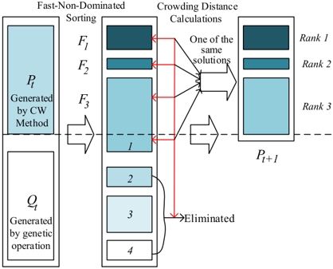

<!-- formula-not-decoded -->

(27)

<!-- formula-not-decoded -->

<!-- formula-not-decoded -->

<!-- formula-not-decoded -->

umv ⩾0 , ∀ m ∈ M v , ∈ V

(31)

Constraints (32) -(33) express the arrival time of vehicle v departing from satellite  and arriving at the customers. Constraints (34) i -(35) express arrival time of vehicle v at the customers.

<!-- formula-not-decoded -->

<!-- formula-not-decoded -->

<!-- formula-not-decoded -->

<!-- formula-not-decoded -->

Constraints between the first and second echelons: Constraints (36) -(37) indicate that a large eco-package consists of multiple small eco-packages packed with a conversion coefficient of δ .  Constraint (38) ensures that for each satellite, the total small ecopackages collected from the customers in the service phase is greater than or equal to the large eco-package to transport to the PC in the transport phase because the collected packages may be partially damaged. Constraint (39) ensures sufficient eco-packages for delivery during the service phase. Constraint (40) indicates that the large eco-package dispensing to several small eco-packages and distributed by vehicles must wait until the semitrailer truck arrives at satellite i and completes the unloading of the delivery large ecopackages.

<!-- formula-not-decoded -->

<!-- formula-not-decoded -->

<!-- formula-not-decoded -->

<!-- formula-not-decoded -->

<!-- formula-not-decoded -->

Other constraints: Constraints represent the binary restrictions on the decision variables.

<!-- formula-not-decoded -->

GLYPH&lt;0&gt;3GLYPH&lt;0&gt;DGLYPH&lt;0&gt;UGLYPH&lt;0&gt;W

GLYPH&lt;0&gt;(

Table 7

Description of instances.

| Instance   |   Number of customers | Number of satellites   |   Total delivery demand |   Total pickup demand |
|------------|-----------------------|------------------------|-------------------------|-----------------------|
| 1 - 4      |                    90 | 8,6,4,2                |                    1650 |                  1155 |
| 5 - 8      |                   110 | 8,6,4,2                |                    2000 |                  1400 |
| 9 - 12     |                   130 | 10,8,6,4               |                    2300 |                  1610 |
| 13 - 16    |                   150 | 10,8,6,4               |                    2660 |                  1862 |
| 17 - 20    |                   200 | 12,10,8,6              |                    3530 |                  2471 |

Table 8

Performance comparisons of four heuristic algorithms.

|          | Instance   | Instance   | Instance   | CW_NSGA-II   | CW_NSGA-II   | CW_NSGA-II   | Improved NSGA-II   | Improved NSGA-II   | Improved NSGA-II   | MOHS          | MOHS   | MOHS   |
|----------|------------|------------|------------|--------------|--------------|--------------|--------------------|--------------------|--------------------|---------------|--------|--------|
|          | COST       | Veh.       | Time       | COST         | Veh.         | Time         | COST               | Veh.               | Time               | COST          | Veh.   | Time   |
| 1        | 10621.43   | 12         | 206.34     | 11479.46     | 12           | 209.58       | 16514.47           | 12                 | 230.75             | 11479.46      | 12     | 213.23 |
| 2        | 11151.63   | 13         | 171.49     | 11489.21     | 13           | 178.25       | 13065.43           | 13                 | 166.00             | 11739.32      | 13     | 178.49 |
| 3        | 13250.40   | 11         | 133.66     | 13361.13     | 11           | 133.55       | 14527.58           | 11                 | 143.03             | 13361.13      | 11     | 132.94 |
| 4        | 45756.63   | 10         | 85.89      | 51664.27     | 10           | 83.68        | 51895.03           | 10                 | 86.06              | 48168.00      | 10     | 79.29  |
| 5        | 11356.60   | 15         | 224.9      | 13173.74     | 15           | 214.43       | 14265.55           | 15                 | 216.86             | 11955.09      | 15     | 220.1  |
| 6        | 12697.67   | 12         | 169        | 13432.55     | 12           | 182.32       | 13621.47           | 13                 | 161.04             | 13366.84      | 12     | 149.2  |
| 7        | 15250.03   | 12         | 150.68     | 21457.96     | 12           | 152.55       | 21244.46           | 12                 | 141.76             | 15250.03      | 12     | 164.54 |
| 8        | 54301.24   | 11         | 108.67     | 69635.72     | 11           | 99.53        | 60031.90           | 12                 | 92.57              | 57162.92      | 11     | 110.23 |
| 9        | 12033.52   | 17         | 267.35     | 12481.65     | 17           | 288.83       | 13666.08           | 18                 | 272.37             | 12481.65      | 17     | 277.13 |
| 10       | 12037.08   | 17         | 228.91     | 12977.59     | 17           | 253.79       | 14229.05           | 17                 | 241.29             | 12671.43      | 17     | 249.19 |
| 11       | 16142.74   | 15         | 196.61     | 24844.78     | 15           | 208.97       | 18709.58           | 15                 | 181.93             | 16993.46      | 15     | 182.09 |
| 12       | 22361.25   | 13         | 145.00     | 25333.54     | 13           | 145.17       | 28834.77           | 14                 | 139.59             | 25333.54      | 13     | 148.95 |
| 13       | 11335.52   | 17         | 266.24     | 12206.67     | 19           | 275.67       | 13889.23           | 19                 | 247.91             | 11335.52      | 17     | 277.19 |
| 14       | 13600.38   | 17         | 222.86     | 13934.63     | 17           | 239.13       | 14722.79           | 17                 | 222.57             | 13934.63      | 17     | 231.1  |
| 15       | 20283.77   | 16         | 179.45     | 24881.33     | 16           | 198.60       | 26277.44           | 16                 | 182.37             | 20283.77      | 16     | 188.9  |
| 16       | 27401.40   | 15         | 161.87     | 33439.71     | 15           | 154.09       | 36430.31           | 15                 | 141.42             | 28845.46      | 15     | 178.39 |
| 17       | 17129.67   | 22         | 297.97     | 19672.07     | 24           | 373.73       | 21241.51           | 24                 | 359.01             | 18032.40      | 24     | 295.1  |
| 18       | 17682.43   | 21         | 263.07     | 18638.72     | 22           | 311.91       | 19693.25           | 22                 | 322.68             | 18638.72      | 21     | 240.19 |
| 19       | 17151.96   | 20         | 256.67     | 19098.01     | 21           | 285.61       | 19241.86           | 21                 | 275.38             | 17151.96      | 20     | 277.91 |
| 20       | 20373.06   | 22         | 245.12     | 22820.16     | 22           | 259.26       | 23600.25           | 22                 | 247.01             | 21446.72      | 22     | 265.22 |
| average  | 19095.92   | 15.4       | 199.09     | 22301.15     | 15.70        | 212.43       | 22785.10           | 15.90              | 203.58             | 19981.60      | 15.5   | 202.97 |
| t -test  | -          | -          | -          | GLYPH<0> 3.8 | -            | -            | GLYPH<0> 7.17      | -                  | -                  | GLYPH<0> 4.43 |        |        |
| p -value | -          | -          | -          | 1.33E-03     | -            | -            | 1.85E-06           | -                  | -                  | 3.14E-4       |        |        |

x imv ′ = { 0 1 , } ∀ , i , m ∈ I ∪ M v , ′ ∈ V ′

ximv ′′ = { 0 1 , } ∀ , i , m ∈ I ∪ M v , ′′ ∈ V ′′

x v im = { 0 1 , } , , ∀ ∈ i I , m ∈ , M v , ∈ V

x v ' in = { 0 1 , } , , ∀ ∈ i I , n ∈ , N v , ' ∈ V '

yjik = { 0 1 , } ∀ , i , j ∈ I ∪ P ∪ D k , ∈ K

yik = { 0 1 , } ∀ , i ∈ I , k ∈ K

y ′ ik = { 0 1 , } ∀ , i ∈ I , k ∈ K

σi = { 0 1 , } ∀ , i ∈ I

## 4.4. CW\_NSGA-II hybrid algorithm for the CMSOLR model

## 4.4.1. Location strategy and routing optimization based on the Gaussian mixture clustering algorithm and CW\_NSGA-II

Customer clustering is an effective method to reduce computational complexity in the optimization of large-scale transportation network problems (Hu and Sheu, 2003; Wang et al., 2014). Traditional clustering algorithms, such as K -means, K -mediods, and fuzzy set theory have been widely used in the study of multi-depot vehicle routing problems and LRP (Rabbani et al., 2017; Wang et al., 2018a). Based on the clustering results, the heuristic algorithm is used to optimize the vehicle routing problem and other issues. Generally, compared with exact algorithms, heuristic algorithms can solve multi-dimensional problems within a limited time, and heuristic algorithms combined with exact algorithms can consider a larger search solution space of the problems, which can effectively

GLYPH&lt;0&gt;3GLYPH&lt;0&gt;DGLYPH&lt;0&gt;UGLYPH&lt;0&gt;W

GLYPH&lt;0&gt;(

Table 9 Comparison of different instances with their solutions.

| Number of customers: 20   | Number of customers: 20   | Number of customers: 20   | Number of customers: 20       | Number of customers: 20       | Number of customers: 20   | Number of customers: 40   | Number of customers: 40   | Number of customers: 40   | Number of customers: 40       | Number of customers: 40       | Number of customers: 40   |
|---------------------------|---------------------------|---------------------------|-------------------------------|-------------------------------|---------------------------|---------------------------|---------------------------|---------------------------|-------------------------------|-------------------------------|---------------------------|
| No.                       | Solution by CPLEX         | Solution by CPLEX         | Solution by proposed approach | Solution by proposed approach | Cost Gap (%)              | No.                       | Solution by CPLEX         | (s)                       | Solution by proposed approach | Solution by proposed approach | Cost Gap (%)              |
|                           | Cost ($)                  | Time (s)                  | Cost ($)                      | Time (s)                      |                           |                           | Cost ($)                  | Time                      | Cost ($)                      | Time (s)                      |                           |
| 1                         | 644.0                     | 2000                      | 644.0                         | 47                            | 0.00%                     | 11                        | 1236.3                    | 4000                      | 1236.3                        | 86                            | 0.00%                     |
| 2                         | 662.7                     | 2000                      | 662.7                         | 49                            | 0.00%                     | 12                        | 1338.0                    | 4000                      | 1377.4                        | 91                            | 2.94%                     |
| 3                         | 671.7                     | 2000                      | 678.5                         | 52                            | 1.01%                     | 13                        | 1468.3                    | 4000                      | 1468.3                        | 105                           | 0.00%                     |
| 4                         | 775.5                     | 2000                      | 775.5                         | 57                            | 0.00%                     | 14                        | 1587.3                    | 4000                      | 1587.3                        | 111                           | 0.00%                     |
| 5                         | 743.2                     | 2000                      | 743.2                         | 55                            | 0.00%                     | 15                        | 1835.1                    | 4000                      | 1862.3                        | 99                            | 1.48%                     |
| 6                         | 806.8                     | 2000                      | 806.8                         | 65                            | 0.00%                     | 16                        | 1617.2                    | 4000                      | 1644.5                        | 102                           | 1.69%                     |
| 7                         | 783.1                     | 2000                      | 783.1                         | 57                            | 0.00%                     | 17                        | 1576.0                    | 4000                      | 1576.0                        | 95                            | 0.00%                     |
| 8                         | 823.7                     | 2000                      | 835.4                         | 61                            | 1.42%                     | 18                        | 1546.7                    | 4000                      | 1571.2                        | 97                            | 1.58%                     |
| 9                         | 846.8                     | 2000                      | 846.8                         | 64                            | 0.00%                     | 19                        | 1697.5                    | 4000                      | 1697.5                        | 106                           | 0.00%                     |
| 10                        | 864.9                     | 2000                      | 886.9                         | 63                            | 2.54%                     | 20                        | 1691.4                    | 4000                      | 1738.3                        | 103                           | 2.77%                     |
| Average                   | 762.24                    | 2000                      | 766.29                        | 57                            | 0.50%                     | Average                   | 1559.38                   | 4000                      | 1575.91                       | 99.5                          | 1.05%                     |

Fig. 10. Performance comparison for each instance with four heuristic algorithms.

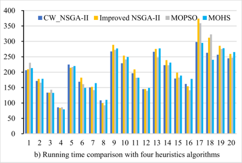

address complicated large-scale network optimization problems (Gao et al., 2016; Asefi et al., 2019; Gocken and Yaktubay, 2019). As a result, the integration of clustering algorithm and heuristic algorithm is used to solve the 3D SST problems proposed in this study efficiently. However, instead of attributing the customers to a facility with an absolute probability such as K -means clustering (Wang et al., 2018b, 2018c), this study applies the Gaussian mixture clustering algorithm (GMCA), which attributes the customers to a facility with a certain probability according to its geographical features and service time windows. In addition, the optimal cluster number is determined based on the silhouette value, which is a similarity measure of an object between its own cluster and other clusters.

In previous studies, route optimization is usually performed under intra-clusters, while the lack of exchange operation between inter- and intra-clusters may lead to local optimum (Wang et al., 2018b). Therefore, the inter- and intra-cluster optimization is considered in the design of the hybrid algorithm to ensure that the global optimal solution can be obtained. In terms of heuristic algorithm design, this study adds customers ' service time windows and studies the problem of simultaneous pickup and delivery. For example, Wang et al., 2018c applied the improved NSGA-II to solve a collaborative two-echelon vehicle routing problem without considering the customer service time windows and pickup problems. Although NSGA-II is widely explored in multi-objective multiechelon logistics network optimization problems (Alikar et al., 2017; Wang et al., 2018b), its usage in the two-echelon LRP, which considers simultaneous pickup and delivery and customers ' time windows, faces many challenges. However, this study achieves routing optimization and determines the location strategy based on the GMCA and CW\_NSGA-II.

The CW\_ NSGA-II is proposed to calculate the total cost and waiting time of different location proposals and optimize the delivery and pickup routing network between second-echelon logistics satellites and customers. The Clarke -Wright (CW) savings method proposed by Clarke and Wright (1964) provides routes for central depots to serve several customers and provide the best solution with the  maximum  distance  savings.  The  NSGA-II  proposed  by  Deb  et  al.  (2002)  is  improved  based  on  genetic  algorithm  to  solve multi-objective problems effectively. Therefore, the combination of the CW and NSGA-II can solve the bi-objective optimization problem proposed in this study and improve the accuracy of routing solutions. Table 6 shows the flowchart of the CW\_NSGA-II based on the GLLRPE optimization. Several related symbols are explained as follows.

Pop: Population size in the CW\_NSGA-II. NoR: Number of runs in the CW\_NSGA-II.

Gen: Number of maximum generations in the CW\_NSGA-II.

GLYPH&lt;0&gt;3GLYPH&lt;0&gt;DGLYPH&lt;0&gt;UGLYPH&lt;0&gt;W

GLYPH&lt;0&gt;(

Fig. 11. Spatial distribution of DC, PC, DSs, PSs, and customers.

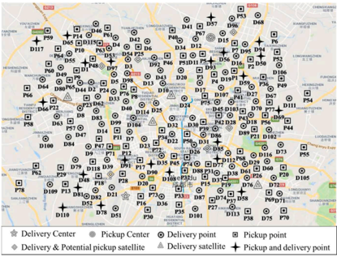

Pc: Crossover probability.

Pm: Mutation probability.

dim : Distance between the satellite i and a customer m .

ds : Total distance savings.

TS : Travel speed of the vehicle.

ci : operating cost of the satellite  . i

In Table 6, GMCA is employed to achieve customer clustering. Then, the CW algorithm is used to generate the initial population owing to its simplicity and the speed of calculation. Combining with NSGA-II aims to obtain a suboptimal routing scheme which would increase the effectiveness of the routing optimization, providing more chance to obtain the minimum total cost and maximum synchronization. Constraints are mainly satisfied by population coding in the algorithm solution because the proposed model involves multiple constraints including vehicle capacity and customer time window. For example, in Table 6, the initial population is the initial feasible solution generated by the CW method, and the solution space is coded in terms of the visiting order of vehicles. When the accumulated customer demands are greater than the capacity of the vehicle, the vehicle will return to its departing depot to meet the requirements of Constraint (23). Waiting time can be calculated based on the time window Constraints (32) -(35). In addition, to address the potential limitation of first clustering and then optimization proposed in this study and the characteristics of NSGA-II in maintaining population diversity, the components of 2-opt* exchange and relocation strategy are added in the algorithm operations to realize the exchange between inter- and intra-clusters (Qiu et al., 2018; Wang et al., 2013), thereby increasing the global convergence of the optimal solution. Finally, the relevant procedures of NSGA-II are executed until the final best cruise path is found by calculating the fitness value through step 3 of Algorithm 2 in terms of waiting time and total cost. Fig. 9 shows the flow chart of CW\_ NSGA-II.

In Table 9, based on initial populations Pt and Qt generated by the CW method, the total number of sorting populations F1 , F2 , and F3 formed by fast non-dominated sorting may exceed the number of individuals in the original populations. In addition, one of the same solutions is selected to be inserted into the new population combined with the parent population and the offspring population, and the others are eliminated. Therefore, crowding distance calculations and comparisons are used to eliminate redundant individuals. On the one hand, CW\_NSGA-II retains the best gene to the utmost extent due to its advantageous combination of parent and offspring after genetic operation. On the other hand, it adopts non-dominated sorting, by calculating and comparing the crowding distances to select the population for the next iteration, instead of removing the chromosome with poor fitness. Thus, the computation would retain the excellent gene fragments while several chromosomes till have poor fitness. In terms of algorithm design for model solution, the Lagrangian relaxation approach is used to optimize the large eco-packages ' pickups and deliveries in the transportation phase, and CW\_NSGA-II is used to optimize the pickup and delivery services of small eco-packages in the service phase, and then the integration of the two-phase algorithm generates the solution of the proposed green logistics location-routing problem with eco-packages.

## 4.4.2. Algorithm comparison and analysis

Twenty sets of medium- or large-sized random test data with 90 -200 customers (including pickup customers) and 2 -12 depots are generated to test the effectiveness of the proposed hybrid heuristic algorithms. Internal transportation cost, quantity of green ecopackage pickup, and unit transport costs vary among instances. Customer demands and time windows are improved based on Solomon datasets (Solomon, 1987). The proposed algorithms along with three other algorithms are performed on a laptop with an Intel (R) Core (TM) i7-8565 1.8 GHz CPU and 8 GB RAM using MATLAB programming language. Assuming that the locations of the depots are determined and given, our goal is to minimize total cost, waiting time, and number of transport vehicles. The variables involved in this calculation are as follows: Pc = 0.8, Pm = 0.01, and TS = 40. Table 7 details the remaining instances.

The maximum generation number and population size are assembled by combining values of population size (Pop) with 100,150 and  generation  (Gen)  with  500,  1000.  Four  heuristic  algorithms  are  selected  for  performance  analysis,  namely,  our  proposed

GLYPH&lt;0&gt;3GLYPH&lt;0&gt;DGLYPH&lt;0&gt;UGLYPH&lt;0&gt;W

GLYPH&lt;0&gt;(

Fig. 12. Spatial distribution of DC, PC, DSs, PSs, and customers in the road network diagram.

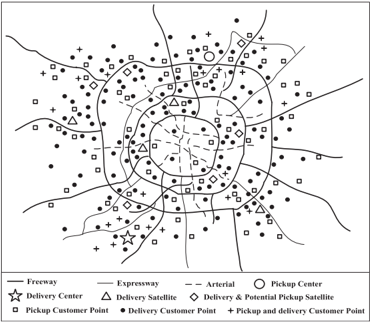

Table 10 Satellite functions and demands with four strategies.

| Satellite   | {S5, S7, S9, S10}   | {S5, S7, S9, S10}   | {S5, S8, S9, S10}   | {S5, S8, S9, S10}   | {S6, S7, S9, S10}   | {S6, S7, S9, S10}   | {S6, S8, S9, S10}   | {S6, S8, S9, S10}   |
|-------------|---------------------|---------------------|---------------------|---------------------|---------------------|---------------------|---------------------|---------------------|
| Satellite   | Function            | Demands             | Function            | Demands             | Function            | Demands             | Function            | Demands             |
| S1          | D                   | 200                 | D                   | 200                 | D                   | 200                 | D                   | 200                 |
| S2          | D                   | 150                 | D                   | 150                 | D                   | 150                 | D                   | 150                 |
| S3          | D                   | 130                 | D                   | 130                 | D                   | 130                 | D                   | 130                 |
| S4          | D                   | 230                 | D                   | 230                 | D                   | 230                 | D                   | 230                 |
| S5          | D & P               | 220 + 340           | D & P               | 220 + 340           | D                   | 220                 | D                   | 220                 |
| S6          | D                   | 200                 | D                   | 200                 | D & P               | 200 + 340           | D & P               | 200 + 340           |
| S7          | D & P               | 180 + 400           | D                   | 180                 | D & P               | 180 + 400           | D                   | 180                 |
| S8          | D                   | 160                 | D & P               | 160 + 400           | D                   | 160                 | D & P               | 160 + 400           |
| S9          | D & P               | 290 + 410           | D & P               | 290 + 410           | D & P               | 290 + 410           | D & P               | 290 + 410           |
| S10         | D & P               | 300 + 260           | D & P               | 300 + 260           | D & P               | 300 + 260           | D & P               | 300 + 260           |
| Total       |                     | 2060 + 1410         |                     | 2060 + 1410         |                     | 2060 + 1410         |                     | 2060 + 1410         |

Table 11 Optimization results of cost and waiting time out of the four location strategies.

| Satellite   | {S5, S7, S9, S10}   | {S5, S7, S9, S10}   | {S5, S8, S9, S10}   | {S5, S8, S9, S10}   | {S6, S7, S9, S10}   | {S6, S7, S9, S10}   | {S6, S8, S9, S10}   | {S6, S8, S9, S10}   |
|-------------|---------------------|---------------------|---------------------|---------------------|---------------------|---------------------|---------------------|---------------------|
| Satellite   | Generalized cost    | Waiting time        | Generalized cost    | Waiting time        | Generalized cost    | Waiting time        | Generalized cost    | Waiting time        |
| S1          | 4409.0              | 401.6               | 4409.0              | 401.6               | 4409.0              | 401.6               | 4409.0              | 401.6               |
| S2          | 3746.6              | 470.7               | 3746.6              | 470.7               | 3746.6              | 470.7               | 3746.6              | 470.7               |
| S3          | 2821.9              | 794.5               | 2821.9              | 794.5               | 2821.9              | 794.5               | 2821.9              | 794.5               |
| S4          | 5513.7              | 866.9               | 5513.7              | 866.9               | 5513.7              | 866.9               | 5513.7              | 866.9               |
| S5          | 11250.2             | 914.8               | 11250.2             | 914.8               | 4710.7              | 701.5               | 4710.7              | 701.5               |
| S6          | 2721.2              | 660.1               | 2721.2              | 660.1               | 8208.1              | 978.6               | 8208.1              | 978.6               |
| S7          | 17738.8             | 1444.9              | 5368.8              | 475.8               | 17738.8             | 1444.9              | 5368.8              | 475.8               |
| S8          | 3047.4              | 698.5               | 20092.4             | 1296.9              | 3047.4              | 698.5               | 20092.4             | 1296.9              |
| S9          | 28032.6             | 775.9               | 28032.6             | 775.9               | 28032.6             | 775.9               | 28032.6             | 775.9               |
| S10         | 15601.0             | 995.1               | 15601.0             | 995.1               | 15601.0             | 995.1               | 15601.0             | 995.1               |
| Total       | 94882.2             | 8023.0              | 99557.2             | 7652.2              | 93829.6             | 8128.2              | 98504.6             | 7757.4              |

CW\_NSGA-II, the improved NSGA-II with effective strategy in elitist preservation (Yuchi et al., 2019), the multi-objective particle swarm optimization (MOPSO) (Rabbani et al., 2018), and the Multi-objective Harmony Search (MOHS) (Alikar et al., 2017). For 90 and 110 customers, the optimal results of the four heuristic algorithms using 8, 6, 4 and 2 depots are 100 for Pop and 500 for Gen. For 130 and 150 customers, the optimal results of the four heuristic algorithms using 10, 8, 6 and 4 depots are verified by setting the value of Pop as 150 and Gen as 500. For 200 customers with a total D.D. of 3530 and total P.D. of 2471, the optimal results of the four heuristic algorithms using 12, 10, 8 and 6 depots are verified by combining the values of 150 for Pop and 1000 for Gen. The comparisons of four heuristic algorithm performances are shown in Table 8.

Table 8 lists the best solutions for each data instance out of five runs. Fig. 10 presents a more detailed comparison. For cost optimization, CW\_NSGA-II and MOHS often perform better than MOPSO and improved NSGA-II. In terms of the number of vehicles, the results calculated by the CW\_NSGA-II and MOHS have the same optimization effectiveness and display better results compared with

Fig. 13. Logistics network in the transport phase.

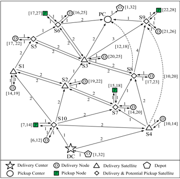

improved NSGA-II and MOPSO. However, in terms of operation efficiency, the improved NSGA-II shows nearly no improvement and needs more running time than the three other heuristic algorithms. Therefore, the CW\_NSGA-II can be selected to solve the problem from the perspective of computing time and overall optimization performance.

At Instance 9, $12033.52 is obtained in 267.35 s for 17 vehicles for the case of CW\_NSGA-II and $13666.08 is achieved in 272.37 s for 18 vehicles for the case of MOPSO. These results prove that our method is cost efficient in a reasonable computation time. The average value of 20 sets of data instance is presented at the end of Table 8. The results show that the combination of CW saving algorithm and NSGA-II with 2-opt* exchange, relocation operation and elitist selection presents a better capacity than the three other heuristic algorithms in terms of cost and number of vehicles on average. In addition, the effective combination of algorithm components has better performance than single component application. For the cost results calculated by the four heuristic algorithms,  t test results and p -values are also shown at the end of Table 8. The results indicate that the data are significantly irrelevant, which means that no correlation is presented between the selected 20 sets of data to ensure the validity of the test data for the algorithm test.

## 5. Implementation and analysis

## 5.1. Small-scale instances

The centralized transportation process between multiple facilities is involved in the first echelon, and the problem proposed in this study can be seen as a variant of the multi-depot vehicle routing problem with time windows (MDVRPTW). This study randomly generates 20 groups of small-scale instances and solves them through CPLEX and heuristic algorithms to verify the performance of the proposed algorithm in MDVRPTW, as shown in Table 9. Moreover, by integrating the waiting time into the total cost in the form of opportunity cost, CPLEX and CW\_NSGA-II methods are used to solve the single-objective optimization problem with the minimum total cost. In CW\_NSGA-II, fast non-dominated sorting is replaced by size-based sorting, and the crowding distance can reach infinite, and thus, the diversity of the population can be maintained and the optimal solution can be found.

All customers are assumed to be served by two depots. These 20 instances can be divided into two groups, the first group includes 20 customers (10 pickup customers and 10 delivery customers), and the other group includes 40 customers (20 pickup customers and 20 delivery customers). In addition, we set the execution time of the CPLEX solution in 2000 and 4000 s is set for the first 10 and second 10 instances, respectively. The algorithm is terminated when no more improvement can be found over the best-known solution within 10 consecutive iterations in our proposed algorithm. The small-scale numerical instances are executed by using the proposed algorithm and ILOG CPLEX Optimization Studio 12.10. The calculation results are compared in Table 9.

Table 9 compares the calculation results by using the CPLEX solver and the proposed hybrid algorithm for the cost and computation time of 20 instances. From a computational efficiency perspective, CPLEX clearly obtains a slightly better solution than the hybrid algorithm, while spending more computation time. However, the maximal cost gap between these two methods is about 2.94%, and the average value of the cost gap is only 0.50% in the first group and 1.05% in the second group. This result shows that the proposed algorithm could achieve good robustness and stability in solving the MDVRPTW. Overall, our proposed heuristic algorithms can rapidly obtain a reasonably good, feasible solution for small-scale MDVRPTW instances compared to the CPLEX solver.

## 5.2. Data source

We refer to a practical case in Chengdu, China for the analysis of the GLLRPE under SST network representation and synchronization  constraints  to  verify  the  validity  of  the  proposed  model  and  algorithm.  As  a  commercial  logistics  center  and  integrated

Fig. 14. Four location strategies of the two-echelon logistics network.

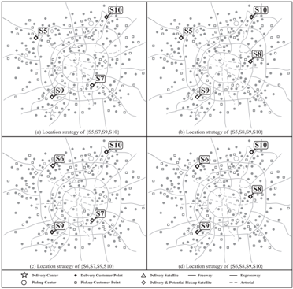

transportation hub in southwestern China, Chengdu has a population of more than 16 million. A complex logistics network includes one DC, one PC and ten DSs (i.e. S1, S2, … , S10), where six of them are potential PSs. Several delivery and pickup customers are shown in Fig. 11. This study aims to determine the locations of PSs from the existing DSs, to obtain cost savings and improve synchronization degree. Several parameters involved in the model are set as follows (Govindan et al., 2014; Wang et al., 2017): Pop = 100, NoR = 20, Gen = 500, Pc = 0.8, Pm = 0.01, Mv = 200, TS = 40, Mk = 1500, δ = 300, cs 5 = 800, cs 6 = 700, cs 7 = 700, cs 8 = 800, cs 9 = 1000, cs 10 = 1000.

Nodes in the represented network are identified by various acronyms such as DC and PC, and all DSs and potential PSs as S1, S2, … , S10. Each logistics facility or customer has its own geographic coordinates, demand and service time window. Uncorrelated parts of Fig. 11 are eliminated to summarize the logistics network, as shown in Fig. 12. Customers are divided into three categories: delivery, pickup, and simultaneous pickup and delivery.

## 5.3. Customer service phase optimization based on the CMSOLR model

In this case, 10 satellites are all DSs. Thus, 10 is directly taken as the clustering number for the delivery customers, and the GMCA described in Section 4.4.1 is used to cluster customers with D.D.. Among the 10 DSs, S5-S10 have become the potential PSs for their large pickup demands. Finding an appropriate number of clustering should be initially performed because the final number and location of the PSs have not been determined. Four clusters is the best solution to group the pickup customers based on the scatter diagram of four to six clustering cases. Appendix B compares average silhouette values.

Table 10 presents four strategies combined with potential eco-package PSs, as well as the functions of each satellite and the customer demands. Next, the four situations are analyzed and discussed in detail. Terms  D ' ' and  P ' ' in the function column indicate that the satellite has delivery and pickup functions, respectively. In the short-term, the recovery rate of green eco-packages is around 1410 2060 × 100% = 68 4%. .

On the basis of the clustering results and the CMSOLR model proposed in Section 4.3.1, CW\_NSGA-II is adopted to optimize the cost and synchronize the service phase under the four strategies mentioned in the former section. Table 11 compares the cost and waiting time for each strategy. The total cost comparison suggests that the location scheme {S6, S7, S9, S10} has the lowest total cost, and solution {S5, S8, S9, S10} has the least waiting time, which indicates that it has the highest synchronization degree. As a result, the total cost and synchronization degree in the service phase is obtained. However, the best location remains undetermined. The cost and synchronization degree of the transport phase must be considered in locating PSs because it affects the entire stability of the network. Therefore, the final location of the PSs is determined by aggregating the results of the two phases.

## 5.4. Transport phase optimization based on the TDTCNFP model

Tables 10 and 11 show the customer demand, cost and synchronization degree of the service phase for the four alternative location strategies. Customer demand in the service phase requires consideration of the delivery and pickup operations of the semitrailer trucks between the first-echelon DC and PC and the second-echelon DSs and PSs. Therefore, the next step of optimization is to search for an optimal solution for the transport phase. Based on the service phase computation, delivery and pickup requirements faced by each satellite are used as input data for optimization in the transport phase, and all green eco-packages are assumed initial grade. The transportation network in the transport phase is shown in Fig. 13. The cost of travel time is marked on each arc depending on the geographical location of the satellite. For example, the time cost from S10 to S7 is 2, which indicates that road segment requires 2 units of time to complete transportation. All facilities are arranged between time periods of [1, 32] and are combined with the service phase

GLYPH&lt;0&gt;3GLYPH&lt;0&gt;DGLYPH&lt;0&gt;UGLYPH&lt;0&gt;W

GLYPH&lt;0&gt;(

qJ

Table 12 Cost comparison of shortest paths between with and without eco-package pickup.

| Delivery with conventional standard packages   | Delivery with conventional standard packages   | Delivery with conventional standard packages   | Delivery with conventional standard packages   | Delivery with conventional standard packages   | Delivery and pickup with green eco-packages   | Delivery and pickup with green eco-packages   | Delivery and pickup with green eco-packages   | Delivery and pickup with green eco-packages   | Delivery and pickup with green eco-packages   | Delivery and pickup with green eco-packages   | Delivery and pickup with green eco-packages   |
|------------------------------------------------|------------------------------------------------|------------------------------------------------|------------------------------------------------|------------------------------------------------|-----------------------------------------------|-----------------------------------------------|-----------------------------------------------|-----------------------------------------------|-----------------------------------------------|-----------------------------------------------|-----------------------------------------------|
| Arc                                            | Time cost ($)                                  | Internal transport cost ($)                    | Value of packages ($)                          | Total cost ($)                                 | Arc                                           | Time cost ($)                                 | Internal transport cost ($)                   | Value of packages ($)                         | Short-term benefits ($)                       | Operating cost ($)                            | Total cost ($)                                |
| Route A                                        | 22                                             | 1100                                           | 5220                                           | 6320                                           | Route A                                       | 26                                            | 1300                                          | 5800                                          | GLYPH<0> 3600                                 | 700                                           | 4200                                          |
| Route B                                        | 22                                             | 1100                                           | 5580                                           | 6680                                           | Route B                                       | 30                                            | 1500                                          | 6200                                          | GLYPH<0> 5400                                 | 1700                                          | 4000                                          |
| Route C                                        | 27                                             | 1350                                           | 6588                                           | 7938                                           | Route C                                       | 31                                            | 1550                                          | 7100                                          | GLYPH<0> 4690                                 | 1000                                          | 4960                                          |
| 20,938                                         | 20,938                                         | 20,938                                         | 20,938                                         | 20,938                                         | 13,160                                        | 13,160                                        | 13,160                                        | 13,160                                        | 13,160                                        | 13,160                                        | 13,160                                        |

GLYPH&lt;0&gt;

Table 13

Comparison of total cost and synchronization for the four location strategies with initial strategy.

Fig. 15. Cumulative cost for the five location strategies and initial strategy.

| Location scheme of PSs   |   Waiting Time (s) |   Total Direct Cost ($) |   Total Generalized Cost ($) | Total Generalized Cost ($)   | Marginal benefit ($)   |
|--------------------------|--------------------|-------------------------|------------------------------|------------------------------|------------------------|
| No pickup satellites     |             4545.6 |                  154415 |                       156851 | -                            | -                      |
| S5,S7,S9,S10             |             8023   |                  116970 |                       121271 | ( GLYPH<0> 22.68%)           | GLYPH<0> 35580.6       |
| S5,S8,S9,S10             |             7652.2 |                  123109 |                       127211 | ( GLYPH<0> 18.90%)           | GLYPH<0> 29640.5       |
| S6,S7,S9,S10             |             8128.2 |                  114768 |                       119125 | ( GLYPH<0> 24.05%)           | ¡ 37726.4              |
| S6,S8,S9,S10             |             7757.4 |                  120907 |                       125065 | ( GLYPH<0> 20.27%)           | GLYPH<0> 31786.3       |
| S5,S6,S7,S8,S9,S10       |             8537   |                  132936 |                       137512 | ( GLYPH<0> 12.33%)           | GLYPH<0> 19339.5       |

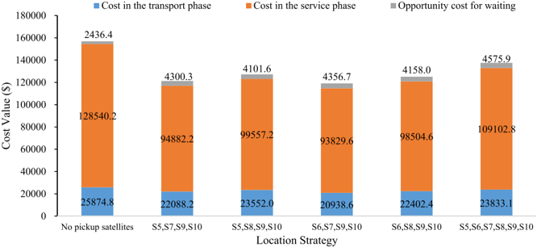

Table 14

Transportation routes of the PS location of {S5, S8, S9, S10} with the newly opened link.

Table 15

| Routes   | Specific travel routes of the semitrailer truck                                                                                                                         |
|----------|-------------------------------------------------------------------------------------------------------------------------------------------------------------------------|
| Route A  | O → DC → O1 → DC → O2 → DC → O3 → DC → O9 → DC → S10 → D1 → S10 → S2 → D2 → S2 → S3 → D3 → S3 → S8 → D9 → S8 → PO1 → S8 → (Waiting) → PC → PD1 → PC → O                 |
| Route B  | O → DC → O4 → DC → (Waiting) → O6 → DC → (Waiting) → O5 → DC → S10 → S1 → D4 → S1 → S5 → PO3 → S5 → (Waiting) → D5 → S5 → S6 → D6 → S6 → PC → PD3 → PC → O              |
| Route C  | O → DC → O10 → DC → O8 → DC → O7 → DC → S10 → PO2 → S10 → S7 → D8 → S7 → S4 → (Waiting) → D7 → S4 → (Waiting) → S9 → D10 → S9 → PO4 → S9 → PC → PD2 → PC → PD4 → PC → O |

Transportation cost and cost difference percentage for various recovery type ratios.

Fig. 16. Comparison of cost difference percentages for various recovery type ratio scenarios.

|    | (Initial, Medium, Critical)   |     ST1 |    ST2 |    ST3 |    ST4 | ST2-ST1   | ST3-ST1   | ST2-ST4   | ST3-ST4   |
|----|-------------------------------|---------|--------|--------|--------|-----------|-----------|-----------|-----------|
|  1 | (50%, 40%, 10%)               |  8989.2 | 8112.6 | 8475.1 | 7855.9 | 9.75%     | 5.72%     | 3.17%     | 7.31%     |
|  2 | (40%, 40%, 20%)               |  9320.6 | 8353.2 | 8761.3 | 8077.2 | 10.38%    | 6.00%     | 3.30%     | 7.81%     |
|  3 | (30%, 40%, 30%)               |  9621.9 | 8597.8 | 8993   | 8250.3 | 10.64%    | 6.54%     | 4.04%     | 8.26%     |
|  4 | (20%, 40%, 40%)               |  9887.8 | 8742.5 | 9200.9 | 8366.2 | 11.58%    | 6.95%     | 4.30%     | 9.07%     |
|  5 | (10%, 40%, 50%)               | 10182.6 | 8914.5 | 9462.5 | 8520.7 | 12.45%    | 7.07%     | 4.42%     | 9.95%     |

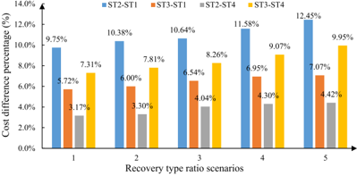

GLYPH&lt;0&gt;3GLYPH&lt;0&gt;DGLYPH&lt;0&gt;UGLYPH&lt;0&gt;W

GLYPH&lt;0&gt;(

Table 16 Transportation cost and cost difference percentages for various scenarios.

|   Scenario |                         |     ST1 |     ST2 |     ST3 |     ST4 | ST2-ST1   | ST3-ST1   | ST2-ST4   | ST3-ST4   |
|------------|-------------------------|---------|---------|---------|---------|-----------|-----------|-----------|-----------|
|          1 | P.D. 20% ↑ , D.D. 0%    | 14260.4 | 13198.9 | 13505.1 | 12808.8 | 7.4%      | 5.3%      | 3.0%      | 5.2%      |
|          2 | P.D. 10% ↑ , D.D. 0%    | 13505.2 | 13115.8 | 12800.9 | 12547.8 | 2.9%      | 5.2%      | 4.3%      | 2.0%      |
|          3 | P.D. 0%, D.D. 10% ↑     | 12970.8 | 12492.5 | 12236.8 | 12069.4 | 3.7%      | 5.7%      | 3.4%      | 1.4%      |
|          4 | P.D. 0%, D.D. 20% ↑     | 13878.8 | 13040.9 | 13749.8 | 12572.7 | 6.0%      | 0.9%      | 3.6%      | 8.6%      |
|          5 | P.D. 10% ↑ , D.D. 10% ↑ | 14428.7 | 13614.9 | 14373.3 | 13099.2 | 5.6%      | 0.4%      | 3.8%      | 8.9%      |
|          6 | P.D. 20% ↑ , D.D. 20% ↑ | 16013.7 | 14762.8 | 15018.3 | 13657.6 | 7.8%      | 6.2%      | 7.5%      | 9.1%      |

Fig. 17. Comparison of cost difference percentages for various scenarios.

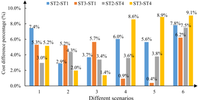

time window to simplify the calculation of transport phase objective values. Time is further integrated into a 24 h time horizon.

A transportation network of a location strategy is shown in Fig. 13, in which satellites S6, S7, S9, and S10 are selected as PSs. Semitrailer trucks depart from the depot and transport green eco-packages along a certain route. Delivery and pickup of eco-packages can be unified as a delivery and pickup problem, unless they are collected and distributed at different locations.

On the basis of the proposed TDTCNFP model in Section 4.1.2, the service time windows of the satellites are defined as the hard time windows to meet the delivery and pickup requirements, and the minimum cost of the four location strategies is then optimized using the Lagrangian relaxation approach. Finally, the actual generalized cost is calculated based on the optimized minimum cost path. The transportation cost of an empty semitrailer is assumed $30/unit time, and that of the eco-package delivery is assumed $30/unit time*unit demand, while half of the cost for eco-package pickup because it occupies only half of the initial eco-package s space. For ' example, if a semitrailer truck with a total capacity of 1,000 carries 300 units of green eco-package delivery and 260 units of green ecopackage pickup from DC to S10, then the transportation time is 1, and the semitrailer truck s trip from depot to DC must be considered. ' Therefore, the transportation time cost within one trip is as follows.

<!-- formula-not-decoded -->

Each semitrailer truck performs seven times a week. The total cost of the vehicles in the service phase and that of the semitrailer trucks in the transport phase are aggregated to the direct total cost of the entire logistics network. Based on fuel consumption, truck/ vehicle rental cost, and drivers ' salary, the opportunity cost is assumed to be $0.536 per unit waiting time. Finally, direct costs and opportunity costs are combined to obtain the final cost of the two-echelon network. The location strategy {S6, S7, S9, S10} under the combined cost of the transport and service phases becomes the best strategy because it has the lowest direct cost and total generalized cost, as shown in Fig. 14.

To represent the transportation process of the semitrailer truck intuitively, Fig. II in Appendix C shows the shortest path, including Route A, Route B, and Route C in the actual network. Meanwhile, the shortest path of the service route A in semitrailer truck k 1 ′ s SST network is shown in Fig. III in Appendix C. In addition, the iterative process diagrams of Route A and Route B based on the Lagrangian relaxation approach are shown in Fig. IV in Appendix C.

Table 12 compares the cost of the three shortest paths in the logistics network to verify the validity of the proposed model and compare the cost difference of the delivery with conventional standard packages and delivery and pickup with green eco-packages. The results show that the total cost of the strategy without eco-package pickup is higher than that with green eco-package pickup.

Based on the related models and algorithms devised for the transportation and service phases shown in Fig. 2, the integration of costs and synchronization degree in the two phases can effectively determine the final location strategy and optimal paths. Among the four location strategies, the location strategy of {S6, S7, S9, S10} is the best location strategy by comparing direct cost, total generalized cost, and synchronization degree. Table 13 compares cost, synchronization degree and marginal benefit for the four location strategies with initial strategy as well as the strategy without eco-package pickup.

Marginal benefits of five other strategies for green eco-package pickup shown in Table 13 are identified using the cost of the nopickup strategy as a reference. The five strategies with green eco-package pickup are evidently more cost effective than the strategy without green eco-package pickup in terms of positive marginal benefits. Strategy {S6,S7,S9,S10} is the best location strategy for the largest marginal benefit of $-37726.4.

GLYPH&lt;0&gt;3GLYPH&lt;0&gt;DGLYPH&lt;0&gt;UGLYPH&lt;0&gt;W

GLYPH&lt;0&gt;(

Fig. 15 compares the cumulative cost the five location strategies and the initial strategy, as well as the optimization cost without eco-package pickup, by converting waiting time into opportunity cost. From the perspective of cost and synchronization degree, the two-phase location optimization model and the solution algorithm proposed in this study can achieve significant cost savings and effective synchronization degree.

## 5.5. Analysis and implication

The transportation management department can open road sections that are unavailable for the semitrailer truck at specific moments given the tidal phenomenon in the traffic flow on certain roads or some traffic restrictions. The satellite location and three transportation routes with the new opened link are shown in Table 14.

In Table 14, semitrailer trucks collect and distribute eco-packages along three new service routes, where the bold line is the new link for the tidal phenomenon. The state of the green eco-packages has a significant effect on the location. Oftentimes, green ecopackages of initial recovery grade disregard the need of a large processing cost and can be immediately reused. However, those of medium grade require some processing before reuse. Therefore, an additional recycling cost increases the operating cost including holding and handling costs. Consequently, a measurement scale of green eco-package state should be used to study the influence of recycling given boxes over the economic objective of the logistics operator. Table 15 shows the cost of four different location schemes under five different combinations of percentages of initial, medium and critical grades of green eco-packages. In Table 15, ST1 represents location strategy 1 {S5, S7, S9, S10}; and ST2, ST3, and ST4 represent {S5, S8, S9, S10}, {S6, S7, S9, S10}, and {S6, S8, S9, S10}, respectively. ST2 GLYPH&lt;0&gt; ST1 represents the cost difference of ST2 with respect to ST1, that is, the percentage of cost savings. For example, for the case of ST2 GLYPH&lt;0&gt; ST1 under the first scenario (50%, 40%, and 10%), the cost difference percentage is calculated by: 8989 2 . GLYPH&lt;0&gt; 8112 6 . 8989 2 . × 100% = 9 75%. As the proportion of green eco-packages in critical grade increases, recovery cost increases, and cost . savings percentage for the case of ST2 in relation to ST1 gradually increases.

The difference between the two location strategies ST1 and ST2 is that S8 selected in ST2 is closer to the PC than S7 selected in ST1. Therefore, the location of PS is assumed more likely closer to the PC to reduce the overall transportation distance. The cost gaps of the three  other  strategies  shown  in  Table  15  are  compared  when  only  one  satellite  location  is  changed  to  verify  this  statement. Comparative results are shown in Fig. 16. The trend on the graph shows that the strategy containing the PS closest to the PC yields high cost savings. Thus, the statement that PS distance to the PC is a key factor in cost reduction is valid, and PS location tends to be closer to the PC for distance savings. However, considering multiple factors provides additional credits to the final solution in a complex environment as that of the investigated GLLRPE. Therefore, the integration of the first echelon transport and second echelon service phases is crucial to achieve a stable PS location.

In addition, in order to explore the impact of customer demands on the PS s location strategy, based on the four options of the ' location strategy (i.e., ST1, ST2, ST3, and ST4), the sensitivity of customer demands and the corresponding change of the location strategy are analyzed under six scenarios: (1) Only the P.D. of all customers increases (by 20% and 10%, respectively), while the D.D. remains unchanged. (2) Only the D.D. of all customers increases (by 20% and 10%, respectively), while the P.D. remains unchanged. (3) The P.D. and D.D. of all customers increase by 10% and 20%, respectively. Transportation cost is still used as a criterion to measure the superiority of the location strategy, and the resulting calculations are shown in Table 16 and Fig. 17.

Table 16 and Fig. 17 compare the transportation costs and percentages of cost difference in different location strategy scenarios. When P.D. or D.D. increases, ST4 is the most preferred location strategy for its lowest transportation cost in the first echelon. As the increase in the P.D. becomes more significant, location options closer to the PC show more evident advantages. For example, from Scenario 2 to Scenario 1, the D.D. remains unchanged, and the increased P.D. improves from 10% to 20%. The percentage of cost difference for strategy ST4 also increases from 2.0% to 5.2%. Similar to the analysis considering the type of recycled eco-packages, the location of the PSs is more likely similar to the strategies near the PC when D.D. increases.

The GLLRPE is proposed in this study for the reasonable location of PSs to ensure the lowest recycling cost. This study considers the two phases of transport and service and determines the location strategy by solving the two phases individually before integrating the results into a systematic solution. The service synchronization degree is included in the factors affecting location strategy, and the requirements for delivery or pickup timeliness are met from the customers ' perspective. The shortest path representation based on SST network also provides a visual tool for enterprises to grasp the real-time state and location of vehicles in different time periods of logistics operations. In addition, the combination of the Lagrangian relaxation approach in the transport phase and the CW\_NSGA-II in the service phase provides the best PS location strategy from the cost and synchronization degree perspective. Finally, the influence of newly opened links and other factors such as demand change on transportation routes and location strategies, all based on real-word conditions, are examined. These results aim to offer insights for companies and decision-makers to adjust the routes and change the locations of PSs after the underlying road network condition changes, which can effectively reduce costs or improve traffic efficiency.

## 6. Conclusions

This study proposes the GLLRPE under SST network representation and synchronization constraints based on a two-echelon logistics network. Based on the resource sharing SST network, the study of the GLLRPE includes the PS location and the routing optimization of the first-echelon transport and second-echelon services including green eco-package pickups and deliveries. The twoechelon logistics network is separated into transport and service phases based on the factors affecting location strategy to determine the best location strategy for the eco-package PSs. During the transport phase, the shared semitrailer truck transports green eco-

GLYPH&lt;0&gt;3GLYPH&lt;0&gt;DGLYPH&lt;0&gt;UGLYPH&lt;0&gt;W

GLYPH&lt;0&gt;(

packages from the DC to the DSs and collects green eco-packages from the PSs to the PC. In the service phase, the eco-package delivery and pickup requirements are satisfied by vehicles along the optimized eco-package routes from DSs and PSs to the customers. Finally, the best location strategy is determined by examining the total cost and synchronization degree via the integration of the solutions of both phases.

The service phase is initially optimized because the transportation of large green eco-packages between the first and second echelon facilities is the sum of customer demands. The customers ' eco-package D.D. is served by DSs, whereas their eco-package P.D. are fulfilled by PSs. For this purpose, the CW\_NSGA-II method is used to optimize the service routing network based on the proposed CMSOLR model. In addition, the related data of P.D. and D.D. are used to compute systematic solutions that incorporate the suboptimal result of the transport phase. In the transport phase, a TDTCNFP model based on Lagrangian relaxation is established to achieve the shortest path optimization under various location strategies for PSs. In the optimization of the transport phase, independent pickup and delivery operations in the logistics field are integrated into a new eco-package PDP with multiple specific origins and destinations. The delivery operation is considered PDP with the pickup origin in the DC and the delivery destination in the DSs. The pickup operation is considered as PDP with the pickup origin in the PSs and the delivery destination in the PC. Thus, the independent pickup and delivery operations are unified in a common mode of PDP for optimization to realize the feasibility and simplification of the calculation. Finally, the results show that compared with the initial strategy of collecting green eco-packages in all potential PSs, the proposed location strategy for the six potential PSs selected in the existing DSs has a significantly positive influence on cost savings and service synchronization degree improvement. In addition, this study explores the factors that affect the optimal location strategy by considering the recycling type ratio and the opening of a new road as effect indicators for sensitivity analysis.

Although this study proposes feasible, effective approaches for solving GLLRPE in a multi-echelon logistics network, the following directions can be considered in the future: (1) The dynamic change of eco-package P.D. may affect the location of satellites and the number of PSs. Whether the number and the location of the PSs are changed during or after seasonal events (e.g., November 11, Chinese shopping festival) can be considered because numerous green eco-packages are transported within these periods. (2) A cooperation mechanism can be established between several enterprises to facilitate pickups and deliveries and for benefit and risk sharing. (3) The manner in which location strategies are determined need to be investigated due to the willingness of different satellites to share semitrailer trucks. (4) Different ratios for picking up green eco-package states can be assumed, and further studies can design data collection and analysis frameworks to model GLLRPE based on actual datasets, thereby improving the applicability of solutions.

## 7. Author Statement

Yong Wang and Xuesong Zhou conceived and designed the conceptualization and methodology; Yong Wang and Shouguo Peng performed the software and validation; Yong Wang, Shouguo Peng, and Xuesong Zhou completed the formal analysis, investigation and data curation; Yong Wang, Monireh Mahmoudi, and Lu Zhen contributed the resources and visualization; Yong Wang, Shouguo Peng, and Monireh Mahmoudi completed the writing-original draft and writing-review &amp; editing. Yong Wang and Xuesong Zhou implemented the supervision. Yong Wang and Lu Zhen carried out the project administration and funding acquisition. All the authors approved the final manuscript.

## Acknowledgments

The authors would like to express our sincere appreciation for the valuable comments made by three anonymous reviewers, which helped us to improve the quality of this paper. The first two authors and the fifth author of this paper are supported by National Natural Science Foundation of China (Project No. 71871035, 71831008, 71671107), Humanity and Social Science Youth Foundation of Ministry of Education of China (No. 18YJC630189), Key Science and Technology Research Project of Chongqing Municipal Education Commission (No. KJZD-K202000702), Social Science Planning Foundation of Chongqing of China (No. 2019YBGL054), and Key Project of Human Social Science of Chongqing Municipal Education Commission (No. 20SKGH079), This research is supported by 2018 Chongqing Liuchuang Plan Innovation Project (No. cx2018111).

## Appendix A

This appendix presents the proof of Theorems 1 -3 in Section 3.3. Relevant symbols and definitions are given in Table A1.

Proof of Theorem 1: . The state of pickup or delivery demand and service capacity at facility α at the time  are assumed to be t λ α t &gt; μ α t , which means a pickup or delivery demand higher than the capacity at facility α . And the state of pickup or delivery demand and service capacity at facility β at the time T are assumed to face the same situation: λ β T &gt; μ β T . In addition, we assume that λ α t = λ β T = λ T and μ α t = μ β T = μ T . In the case of service superposition, the inflated demand at facility α at the time t and the inflated demand at facility β at the time T are assumed to be satisfiable within the following c time intervals:

<!-- formula-not-decoded -->

GLYPH&lt;0&gt;3GLYPH&lt;0&gt;DGLYPH&lt;0&gt;UGLYPH&lt;0&gt;W

GLYPH&lt;0&gt;(

| Symbol   | Definitions                                                                                                                                                                          |
|----------|--------------------------------------------------------------------------------------------------------------------------------------------------------------------------------------|
| Q T L 1  | Average queue length at two adjacent facilities without time and space resource sharing.                                                                                             |
| Q T L 2  | Average queue length at two adjacent facilities in the resource sharing sequence.                                                                                                    |
| ρ c      | Service intensity of each facility at each time interval, if the inflated customer demand can be satisfied within c time intervals, thus ρ c = λ α t / c = λ β T / c = λ T / c μ T . |
| Q T Lq   | Total queue length at two adjacent facilities in the resource sharing sequence with their demands not served.                                                                        |
| P 0      | Probability of having no customer demand in the pickup and delivery system.                                                                                                          |

Table A1 Symbols and definitions used in the three Theorems.

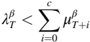

(A2)

Based on the aforementioned assumptions, the average customer demands each facility faces in the SST network without resource sharing at each interval is: λ c = λ α t / c = λ β T / c = λ T / c . And according to the queuing theory, the queue length at facilities α and β within c time intervals without space resource sharing is Q T L 1 = ( c λ T / c μ T ) / ( 1 GLYPH&lt;0&gt; λ T / c μ T ) . In the resource sharing SST network including facilities α and  , the pickup or delivery demands are integrated and reassigned to each facility for service. Therefore, for the whole system, the β total pickup or delivery demand is λ α t + λ β T = 2 λ T , and the system service capacity is μ α t + μ β T = 2 μ T . The service capacity within c time intervals is accumulated to2 c μ T , and the queue length at facilities α and β within c time intervals if resource sharing occurs is Q T L 2 = Q T Lq + ( c λ T / c μ T ) .

According to queuing theory,

<!-- formula-not-decoded -->

<!-- formula-not-decoded -->

<!-- formula-not-decoded -->

<!-- formula-not-decoded -->

<!-- formula-not-decoded -->

Subtracting equation (A1) from (A3), we obtain:

<!-- formula-not-decoded -->

<!-- formula-not-decoded -->

<!-- formula-not-decoded -->

Therefore, in the case of λ α t &gt; μ α t and λ β T &gt; μ β T , the amount of customer demand served with delay can be reduced by means of resource sharing between two adjacent facilities, thereby achieving an increase in synchronization degree.

Proof of Theorem 2: . Along the pickup/delivery routes, some facilities face demands that exceed their service capacities, while others may have redundant service capacities. Without loss of generality, the state of pickup/delivery demand and service capacity at facility α at time t is assumed to be λ α t &gt; μ α t , which means an inflated pickup/delivery demand for facility α . The state of pickup/ delivery demand and service capacity at facility β at time T is assumed to be λ β T &lt; μ β T , which means facility β has redundant service capacity. We assume that λ α t = λ β T = λ T . Similar with Theorem 1, the inflated demand at the time t for facility α can be met within the following c time intervals:

GLYPH&lt;0&gt;3GLYPH&lt;0&gt;DGLYPH&lt;0&gt;UGLYPH&lt;0&gt;W

GLYPH&lt;0&gt;(

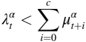

<!-- formula-not-decoded -->

The service capacity at each time interval is assumed to remain unchanged, i.e. μ α t = μ α t + 1 = /uni22EF = μ α t + c , and the cumulative service capacity of facility α within c time intevals becomes μ α t + μ α t + 1 + /uni22EF + μ α t + c = c μ α t . Therefore, the total queue length at the two facilities under the condition of no resource sharing is Q T L 1 = λ α t / GLYPH&lt;0&gt; c μ α t GLYPH&lt;0&gt; λ α t ) + λ β T / GLYPH&lt;0&gt; μ β T GLYPH&lt;0&gt; λ β T ) .

Once resource sharing occurs, part of facility β ' s service capacity at time T ( ω β T ) can be shared with facility α , which increases the service  capacity  of  facility α to GLYPH&lt;0&gt; μ α t + ω β T ) while  the  remaining  service  capacity  of  facility β becomes GLYPH&lt;0&gt; μ β T GLYPH&lt;0&gt; ω β T ) and  presumably GLYPH&lt;0&gt; μ β T GLYPH&lt;0&gt; ω β T ) &gt; λ β T . As an example of service capacity sharing, part of the semitrailer truck s space ( ' ω β T ) can be used for pickups at facility β at time T . Therefore, the total queue length at the two facilities in the resource sharing SST network can be formulated below:

<!-- formula-not-decoded -->

<!-- formula-not-decoded -->

<!-- formula-not-decoded -->

Consequently, Q T L 1 &gt; Q T L 2 . Thus in the case of λ α t &gt; μ α t and λ β T &lt; μ β T , the amount of customer demand served with delay at these two facilities can be reduced by means of resource sharing, thereby achieving an improvement in synchronization degree.

## Appendix B

We perform clustering analyses on the customers with pickup demands, and the four to six clustering results and corresponding silhouette values can be shown in Fig. B1.

Fig. B1. Customer clustering scatter diagram and silhouette values.

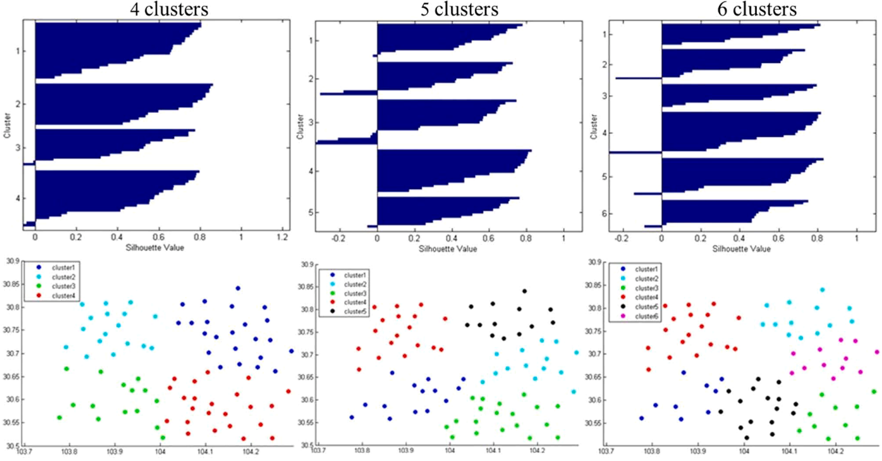

GLYPH&lt;0&gt;3GLYPH&lt;0&gt;DGLYPH&lt;0&gt;UGLYPH&lt;0&gt;W

GLYPH&lt;0&gt;(

## Appendix C

In Fig. C1, three semitrailer trucks complete the transportation of all eco-package deliveries required from 10 DSs, along with three different routes, and fulfill the pickup requirements of the four PSs (i.e., S6, S7, S9, and S10). In practice, either the delivery or pickup cycle requires green eco-packages to be transported from a specific location to another. Therefore, the delivery and pickup of the green eco-packages in the computation process, are considered as separate PDPs with specific origins and destinations. The shortest path of the service route A in semitrailer truck k 1 ' s SST network is shown in Fig. C2. In addition, the semitrailer truck completes the pickup of the green eco-package deliveries that must be transported to S10, S2, and S3 at dummy nodes O1, O2, and O3, respectively. The state of the storage position of the truck changes from 0 to 1 with the completion of the pickup, and the state changes from 1 to 0 with the completion of the delivery. Each node should wait until the service time window starts when a semitrailer truck s arrival time is not '

Fig. C1. Transportation routes of the pickup satellite location of {S6, S7, S9, S10}.

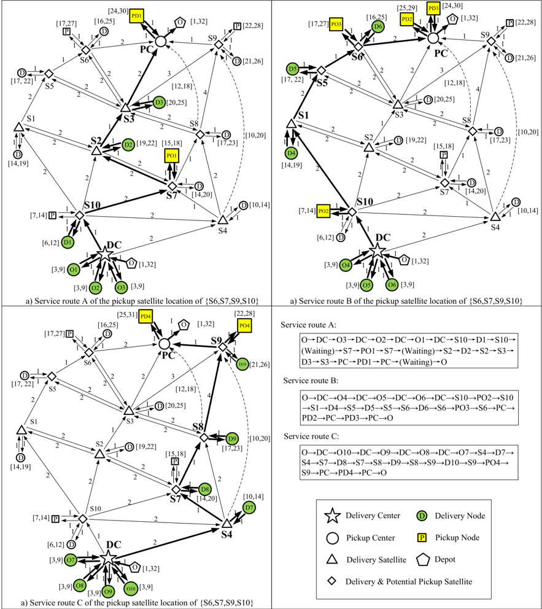

GLYPH&lt;0&gt;3GLYPH&lt;0&gt;DGLYPH&lt;0&gt;UGLYPH&lt;0&gt;W

GLYPH&lt;0&gt;(

Fig. C2. Shortest path of service Route A in semitrailer truck k 1 ' s SST network.

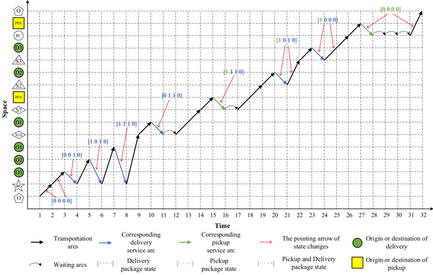

within the service time window. The other two paths of the PC location strategy {S6, S7, S9, S10} are similar to that of Route A in Fig. C2.

To describe the process of finding the shortest path with a Lagrangian relaxation approach, Fig. C3 shows two iterative process diagrams of Route A and Route B based on a Lagrangian relaxation approach.

Fig. C3. Iterative process diagrams of Route A and Route B based on a Lagrangian relaxation approach: (a) Iterative process of shortest Route A; (b) Iterative process of shortest Route B.

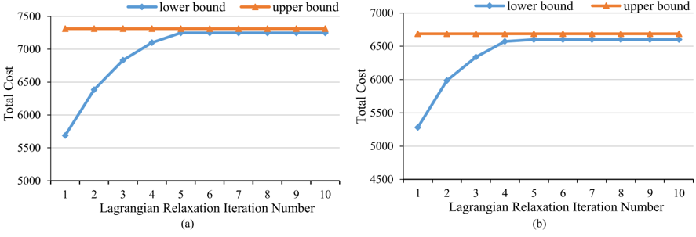

## References

Albareda-Sambolaa, M., Nickel, S., 2012. Multi-period location-routing with decoupled time scales. Eur. J. Oper. Res. 217 (2), 248 -258.

- Alikar, N., Mousavi, S.M., Ghazilla, R.A.R., Tavana, M., Olugu, E.U., 2017. Application of the NSGA-II algorithm to a multi-period inventory-redundancy allocation problem in a series-parallel system. Reliab. Eng. Syst. Saf. 160, 1 -10.

Alinaghian, M., Shokouhi, N., 2018. Multi-depot multi-compartment vehicle routing problem. solved by a hybrid adaptive large neighborhood search. Omega 76, 85 99. -

Asefi, H., Lim, S., Maghrebi, M., Shahparvari, S., 2019. Mathematical modelling and heuristic approaches to the location-routing problem of a cost-effective integrated solid waste management. Ann. Oper. Res. 273 (1 -2), 75 -110.

GLYPH&lt;0&gt;3GLYPH&lt;0&gt;DGLYPH&lt;0&gt;UGLYPH&lt;0&gt;W

GLYPH&lt;0&gt;(

Bagheri, H.M., Farzad, D., Majid, S., 2019. Selective capacitated location-routing problem with incentive-dependent returns in designing used products collection network. Eur. J. Oper. Res. 272 (2), 655 -673.

Bayram, V., Yaman, H., 2017. Shelter location and evacuation route assignment under uncertainty: a benders decomposition approach. Transport. Sci. 52 (2), 416 436. -

Bayram, V., Tansel, B.Ç., Yaman, H., 2015. Compromising system and user interests in shelter location and evacuation planning. Transport. Res. Part B: Methodol. 72, 146 163. -

Bektas, T., Laporte, G., 2011. The pollution-routing problem. Transport. Res. Part B: Methodol. 45 (8), 1232

-

1250.

Berbeglia, G., Pesant, G., Rousseau, L.M., 2012. Feasibility of the pickup and delivery problem with fixed partial routes: a complexity analysis. Transport. Sci. 46 (3), 359 373. -

Bergmann, F.M., Wagner, S.M., Winkenbach, M., 2020. Integrating first-mile pickup and last-mile delivery on shared vehicle routes for efficient urban e-commerce distribution. Transport. Res. Part B: Methodol. 131, 26 -62.

Boland, N., Hewitt, M., Marshall, L., Savelsbergh, M., 2017a. The continuous-time service network design problem. Oper. Res. 65 (5), 1303 -1321.

Boland, N. Hewitt, M., Vu, D.M., Savelsbergh, M., 2017b. Solving the traveling salesman problem with time windows through dynamically generated time-expanded networks. International Conference on AI

&amp;

OR Techniques in Constraint Programming for Combinatorial Optimization Problems. Springer, Cham, 254

-

262.

Bruck, B.P., Iori, M., 2017. Non-elementary formulations for single vehicle routing problems with pickups and deliveries. Oper. Res. 65 (6), 1597

-

1614.

Cankaya, E., Ekici, A., Ozener, O.O., 2019. Humanitarian relief supplies distribution: an application of inventory routing problem. Ann. Oper. Res. 283 (1

-

2),

119 141. -Clarke, G., Wright, J.W., 1964. Scheduling of vehicles from a central depot to a number of delivery points. Oper. Res. 12 (4), 568 -581. Contardo, C., Hemmelmayr, V., Crainic, T.G., 2012. Lower and upper bounds for the two-echelon capacitated location-routing problem. Comput. Oper. Res. 39 (12), 3185 3199. -

Cordeau, J.F., 2006. A branch-and-cut algorithm for the dial-a-ride problem. Oper. Res. 54 (3), 573 -586. Cruz, N.F.D., Simoes, P., Rui, C.M., 2012. Economic cost recovery in the recycling of packaging waste: the case of Portugal. J. Cleaner Prod. 37 (4), 8 ˜ -18. Da, C.N., Ferreira, S., Cabral, M., Simoes, P., Marques, R.C., 2014. Packaging waste recycling in Europe: is the industry paying for it? Waste Manage. 34 (2), 298 ˜ -Deb, K., Pratap, A., Agarwal, S., Meyarivan, T., 2002. A fast and elitist multiobjective genetic algorithm: NSGA-II. IEEE Trans. Evol. Comput. 6 (2), 182 -197. Drexl, M., 2012. Synchronization in vehicle routing-A survey of VRPs with multiple synchronization constraints. Transport. Sci. 46 (3), 297 -316. Dukkanci, O., Kara, B.Y., Bektas, T., 2019. The green location-routing problem. Comput. Oper. Res. 105, 187 -202.

308.

Fathollahi-Fard, A.M., Hajiaghaei-Keshteli, M., Tavakkoli-Moghaddam, R., 2018. A Lagrangian Relaxation-based Algorithm to Solve a Home Health Care Routing

Problem. Int. J. Eng. 31 (10), 1734

-

1740.

García-Sanz, M.D., Fernandez, F.R., Fiestras-Janeiro, M.G., García-Jurado, I., Puerto, J., 2008. Cooperation in markovian queueing models. Eur. J. Oper. Res. 188 (2), ´ 485 495. -

Gao, S.C., Wang, Y.R., Cheng, J.J., Inazumi, Y., Tang, Z., 2016. Ant colony optimization with clustering for solving the dynamic location routing problem. Appl. Math. Comput. 285, 149 173. -

Gocken, T., Yaktubay, M., 2019. Comparison of different clustering algorithms via genetic algorithm for VRPTW. Int. J. Simul. Modell. 18 (4), 574 -585.

Govindan, K., Jafarian, A., Khodaverdi, R., Devika, K., 2014. Two-echelon multiple vehicle location-routing problem with time windows for optimization of sustainable supply chain network of perishable food. Int. J. Prod. Econ. 152, 9 -28.

Govindan, K., Mina, H., Esmaeili, A., Gholami-Zanjani, S.M., 2020. An integrated hybrid approach for circular supplier selection and closed loop supply chain network design under uncertainty. J. Cleaner Prod. 242, 118317.

He, E., Boland, N., Nemhauser, G., Savelsbergh, M., 2018. A dynamic discretization discovery algorithm for the minimum duration time-dependent shortest path problem. In: International Conference on the Integration of Constraint Programming, Artificial Intelligence, and Operations Research. Springer, Cham, pp. 289 -297.

Hu, T.L., Sheu, J.B., 2003. A fuzzy-based customer classification method for demand-responsive logistical distribution operations. Fuzzy Sets Syst. 139 (2), 431 -450. Ibarra-Rojas, O.J., Lopez-Irarragorri, F., Rios-Solis, Y.A., 2016. Multi-period bus timetabling. Transport. Sci. 50 (3), 805 ´ -822.

Kara, I., Laporte, G., Bektas, T., 2004. A note on the lifted Miller-Tucker-Zemlin subtour elimination constraints for the capacitated vehicle routing problem. Eur. J. Oper. Res. 158 (3), 793 -795.

Karsten, F., Slikker, M., Houtum, G.J.V., 2015. Resource pooling and cost allocation among independent service providers. Oper. Res. 62 (2), 476 -488. Kulcar, T., 1996. Optimizing solid waste collection in Brussels. Eur. J. Oper. Res. 90 (1), 71 -77.

Labbe, M., Laporte, G., 1986. Maximizing user convenience and postal service efficiency in post box location. Belgian J. Oper. Res. Statist. Comput. Sci. 26, 21 ´ -35. Lei, C., Ouyang, Y.F., 2018. Continuous approximation for demand, balancing in solving large-scale one-commodity pickup and delivery problems. Transport. Res. Part B: Methodol. 109, 90 -109.

Liu, W.L., Wan, Z.M., Wan, Z., Gong, B., 2020a. Sustainable recycle network of heterogeneous pharmaceuticals with governmental subsidies and service-levels of third-party logistics by bi-level programming approach. J. Cleaner Prod. 249, 119324.

Liu, R.M., Li, S.K., Yang, L.X., 2020b. Collaborative optimization for metro train scheduling and train connections combined with passenger flow control strategy. Omega. 90, 101990.

Lu, G.Y., Zhou, X.S., Mahmoudi, M., Shi, T., Peng, Q.Y., 2019. Optimizing resource recharging location-routing plans: a resource-space-time network modeling framework for railway locomotive refueling applications. Comput. Ind. Eng. 127, 1241 -1258.

Mahmoudi, M., Chen, J.H., Shi, T., Zhang, Y.X., Zhou, X.S., 2019a. A cumulative service state representation for the pickup and delivery problem with transfers. Transport. Res. Part B: Methodol. 129, 351 -380.

Mahmoudi, M., Song, Y., Miller, H.J., Zhou, X., 2019b. Accessibility with time and resource constraints: Computing hyper-prisms for sustainable transportation planning. Comput. Environ. Urban Syst. 73, 171 -183.

Mahmoudi, M., Zhou, X.S., 2016. Finding optimal solutions for vehicle routing problem with pickup and delivery services with time windows: a dynamic programming approach based on state-space-time network representations. Transport. Res. Part B: Methodol. 89, 19 -42.

Mahmoudi, M., Parviziomran, I., 2020. Reusable packaging in supply chains: A review of environmental and economic impacts, logistics system designs, and operations management. Int. J. Prod. Econ. Forthcoming.

Miller, H.J., 1991. Modelling accessibility using space-time prism concepts within geographical information systems. Int. J. Geograph. Syst. 5 (3), 287 -Nagy, G., Salhi, S., 2007. Location-routing: issues, models and methods. Eur. J. Oper. Res. 177 (2), 649 -672.

301.

Nordin, N., Selke, S., 2010. Social aspect of sustainable packaging. Packaging Technol. Sci. 23 (6), 317 -326.

Qiu, M., Fu, Z., Eglese, R., Tang, Q., 2018. A tabu search algorithm for the vehicle routing problem with discrete split deliveries and pickups. Comput. Oper. Res. 100, 102 116. -

Rabbani, M., Farrokhi-Asl, H., Asgarian, B., 2017. Solving a bi-objective location routing problem by a NSGA-II combined with clustering approach: application in waste collection problem. J. Ind. Eng. Int. 13 (1), 13 -27.

Rabbani, M., Heidari, R., Farrokhi-Asl, H., Rahimi, N., Rabbani, M., Heidari, R., 2018. Using metaheuristic algorithms to solve a multi-objective industrial hazardous waste location-routing problem considering incompatible waste types. J. Cleaner Prod. 170, 227 -241.

Rafie-Majd, Z., Pasandideh, S.H.R., Naderi, B., 2018. Modelling and solving the integrated inventory-location-routing problem in a multi-period and multi-perishable product supply chain with uncertainty: Lagrangian relaxation algorithm. Comput. Chem. Eng. 109, 9 -22.

Ropke, S., Cordeau, J.F., 2009. Branch and cut and price for the pickup and delivery problem with time windows. Transport. Sci. 43 (3), 267 -286.

Ropke, S., Cordeau, J.F., Laporte, G., 2007. Models and branch-and-cut algorithms for pickup and delivery problems with time windows. Networks 49 (4), 258 -272. Salhi, S., Rand, G.K., 1989. The effect of ignoring routes when locating depots. Eur. J. Oper. Res. 39 (2), 150 -156.

Saedinia, R., Vahdani, B., Etebari, F., Nadjaf, B.A., 2019. Robust gasoline closed loop supply chain design with redistricting, service sharing and intra-district service transfer. Transport. Res. Part E: Logist. Transport. Rev. 123, 121 -141.

GLYPH&lt;0&gt;3GLYPH&lt;0&gt;DGLYPH&lt;0&gt;UGLYPH&lt;0&gt;W

GLYPH&lt;0&gt;(

Schiffer, M., Walther, G., 2017a. An adaptive large neighborhood search for the location-routing problem with intra-route facilities. Transport. Sci. 52 (2), 331 -352. Schiffer, M., Walther, G., 2017b. Strategic planning of electric logistics fleet networks: a robust location-routing approach. Omega 80, 31 -42.

Schiffer, M., Schneider, M., Walther, G., Laporte, G., 2019. Vehicle routing and location routing with intermediate stops: a review. Transport. Sci. 53 (2), 319

-

343.

Sever, D., Zhao, L., Dellaert, N., Demir, E., Woensel, T.V., Kok, T.D., 2018. The dynamic shortest path problem with time-dependent stochastic disruptions. Transport.

Res. Part C: Emerg. Technol. 92, 42

-

57.

Solomon, M., 1987. Algorithms for the vehicle routing and scheduling problems with time window constraints. Oper. Res. 35 (2), 254 -265.

Tang, J.J., Song, Y., Miller, H.J., Zhou, X.S., 2016. Estimating the most likely space-time paths, dwell times and path uncertainties from vehicle trajectory data: a time geographic method. Transport. Res. Part C: Emerg. Technol. 66, 176 -194.

Tiew, K.G., Basri, N.E.A., Deng, H., Watanabe, K., Zain, S.M., Wang, S., 2019. Comparative study on recycling behaviours between regular recyclers and non-regular recyclers in Malaysia. J. Environ. Manage. 237, 255 -263.

Toro, E.M., Franco, J.F., Echeverri, M.G., Guimaraes, F.G., 2017. A multi-objective model for the green capacitated location-routing problem considering

˜ environmental impact. Comput. Ind. Eng. 110, 114 -125.

Van Anholt, R.G., Coelho, L.C., Laporte, G., Vis, I.F.A., 2016. An inventory-routing problem with pickups and deliveries arising in the replenishment of automated teller machines. Transport. Sci. 50 (3), 1077 -1091.

- Wang, Y., Ma, X.L., Liu, M.W., Gong, K., Liu, Y., Xu, M.Z., Wang, Y.H., 2017b. Cooperation and profit allocation in two-echelon logistics joint distribution network optimization. Appl. Soft Comput. 56, 143 -157.
- Wang, Y., Ma, X.L., Lao, Y.T., Wang, Y.H., 2014. A fuzzy-based customer clustering approach with hierarchical structure for logistics network optimization. Expert Syst. Appl. 41 (2), 521 -534.

Wang, Y., Ma, X.L., Lao, Y.T., Wang, Y.H., Mao, H.J., 2013. Vehicle routing problem: simultaneous deliveries and pickups with split loads and time windows.

J. Transport. Res. Board 2378, 120

-

128.

- Wang, Y., Ma, X.L., Li, Z.B., Liu, Y., Xu, M.Z., Wang, Y.H., 2017a. Profit distribution in collaborative multiple centers vehicle routing problem. J. Cleaner Prod. 144, 203 219. -
- Wang, J., Yu, Y., Tang, J., 2018a. Compensation and profit distribution for cooperative green pickup and delivery problem. Transport. Res. Part B: Methodol. 113, 54 69. -
- Wang, Y., Assogba, K., Liu, Y., Ma, X., Xu, M., Wang, Y.H., 2018b. Two-echelon location-routing optimization with time windows based on customer clustering. Expert Syst. Appl. 104, 244 -260.
- Wang, Z., Leng, L.L., Wang, S., Li, G.F., Zhao, Y.W., 2020. A hyperheuristic approach for location-routing problem of cold chain logistics considering fuel consumption. Comput. Intell. Neurosci. 2020, 8395754.
- Wang, Y., Zhang, S.L., Assogba, K., Fan, J.X., Xu, M.Z., Wang, Y.H., 2018c. Economic and environmental evaluations in the two-echelon collaborative multiple centers vehicle routing optimization. J. Cleaner Prod. 197, 443 -461.

Wasner, M., Zapfel, G., 2004. An integrated multi-depot hub-location vehicle routing model for network planning of parcel service. Int. J. Prod. Econ. 90 (3), 403 ¨ -419. Xie, W., Ouyang, Y., 2016. Reliable location-routing design under probabilistic facility disruptions. Transport. Sci. 50 (3), 1128 -1138.

Xu, X.M., Li, C.L., Xu, Z., 2018. Integrated train timetabling and locomotive assignment. Transport. Res. Part B: Methodol. 117, 573 -593.

Yang, J., Sun, H., 2015. Battery swap station location-routing problem with capacitated electric vehicles. Comput. Oper. Res. 55, 217 -232.

Yang, L.X., Zhou, X.S., 2017. Optimizing on-time arrival probability and percentile travel time for elementary path finding in time-dependent transportation networks: linear mixed integer programming reformulations. Transport. Res. Part B: Methodol. 96, 68 -91.

- Yuchi, Q.L., Wang, N.M., Li, S., Yang, Z., Jiang, B., 2019. A bi-objective reverse logistics network design under the emission trading scheme. IEEE Access 7, 105072 105085. -

Zhou, X.S., Tong, L., Mahmoudi, M., Zhuge, L.J., Yao, Y., Zhang, Y.X., Shang, P., Liu, J.T., Shi, T., 2018. Open-source VRPLite package for vehicle routing with pickup and delivery: a path finding engine for scheduled transportation systems. Urban Rail Transit 4 (2), 68 -85.

Ziliaskopoulos, A., Mahmassani, H.S., 1993. A time-dependent shortest path algorithm for real-time intelligent vehicle/highway systems applications. Transp. Res. Rec. 1408, 94 -100.

GLYPH&lt;0&gt;3GLYPH&lt;0&gt;DGLYPH&lt;0&gt;UGLYPH&lt;0&gt;W

GLYPH&lt;0&gt;(