## Rich Vehicle Routing Problems and Applications

Wen, Min

Publication date:

2010

Document Version Publisher's PDF, also known as Version of record

Link back to DTU Orbit

Citation (APA):

Wen, M. (2010). Rich Vehicle Routing Problems and Applications . DTU Management. PhD thesis No. 8.2010

## General rights

Copyright and moral rights for the publications made accessible in the public portal are retained by the authors and/or othert c pyrigh owners and it is a condition of accessing publications that users nise  and abide by the legal requirements associated with these rights. recog

- GLYPH&lt;0&gt;x Users may download and print one copy of any publication from the public portal for the purpose of private study or research.
- GLYPH&lt;0&gt;x You may not further distribute the material or use it for any  it -making activity or commercial gain prof
- GLYPH&lt;0&gt;x You may freely distribute the URL identifying the p ication in the public portal ubl

If you believe that this document breaches copyright please contact us providing details, and we will remove access to the wo iately rk im med and investigate your claim.


## Rich Vehicle Routing Problems and Applications

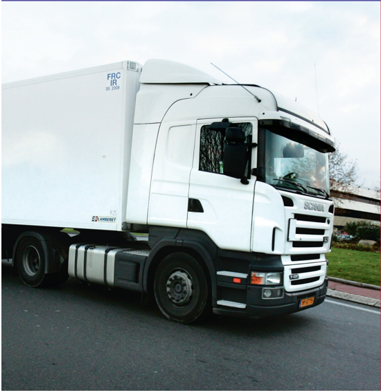

Min Wen July 2010

## PhD thesis 8.2010

DTU Management Engineering

## Rich Vehicle Routing Problems and Applications

Min Wen

Rich Vehicle Routing Problems and Applications PhD thesis Min Wen 2010 ISBN no. 978-87-90855-89-5 DTU Management Engineering Department of Management Engineering Produktionstorvet 424 2800 Lyngby Tel: +45 4525 4800 E-mail: phd@man.dtu.dk Printer: Schultz GraGLYPH&lt;222&gt;sk A/S

## Summary

The Vehicle Routing Problem (VRP) is one of the most important and challenging optimization problems in the field of Operations Research. It was introduced by Dantzig and Ramser (1959) and defined as the problem of designing the optimal set of routes for a fleet of vehicles in order to serve a given set of customers. The VRP is a computationally hard combinatorial problem and has been intensively studied by numerous researchers in the last fifty years. Due to the significant economic benefit that can be achieved by optimizing the routing problems in practice, more and more attention has been given to various extensions of the VRP that arise in real life. These extensions are often called Rich Vehicle Routing Problems (RVRPs). In contrast to the research of classical VRP that focuses on the idealized models with unrealistic assumptions, the research of RVRPs considers those complicated constraints encountered in the real-life planning and provides solutions that are executable in practice.

In this thesis, we investigated the models and algorithms of three practical vehicle routing problems. Each of them involves special practical issues that are only considered in very few papers. Our study of these problems was motivated by our cooperation with industrial companies, particularly Transvision A/S and its client distributors, and Danish Crown. The models and methods proposed in the thesis are general and can be applied to practical routing problems arising in many other distribution companies as well.

We first consider a vehicle routing problem with cross-docking options, in which products are picked up from suppliers by vehicles, consolidated at the depot and immediately delivered to customers by the same set of vehicles. It is more complex than the traditional vehicle routing problems in the sense that consoli-

dation decisions have to be made at the depot and these decisions interact with the planning of pickup and delivery routes. We presented a mathematical model and proposed a Tabu Search based heuristic to solve it. It is shown that the approach can produce near-optimal solutions within very short computational time on real-life data involving up to 200 pairs of suppliers and customers.

The second problem we consider is a dynamic vehicle routing problem with multiple objectives over a planning horizon that consists of multiple periods. In this problem, customer orders are revealed incrementally over the planning horizon. The delivery plan must be made and executed in every period without knowing the future orders. We modeled the problem as a mixed integer linear program and solved it by means of a three-phase heuristic that works over a rolling planning horizon. The method improves the company's solution in terms of all the objectives, including the travel time, customer waiting and daily workload balances, under the given constraints considered in the work.

Finally, we address an integrated vehicle routing and driver scheduling problem, in which a large number of practical constraints are considered, such as the multi-period horizon, the time windows for the delivery, the heterogeneous vehicles, the drivers' predefined working regulations, the driving rule etc. The problem is formulated as a mixed integer linear program and treated by a multilevel variable neighborhood search algorithm. The method is implemented and tested on real-life data involving up to 2000 orders. It is shown that the method is able to provide solutions of good quality within reasonable running time.

## Preface

This Ph.D. thesis has prepared at DTU Informatics and DTU Management at Technical University of Denmark during the period from 2006 to 2009 as a partial fulfillment of the requirements for acquiring the Ph.D. degree in engineering. This work is supervised by Associate Professor Jesper Larsen and Professor Jens Clausen.

This thesis focuses on the area of transportation optimization in Operational Research and aims at solving practical vehicle routing problems with optimization techniques and methods.

This thesis consists of a summary report and a collection of three research papers.

Lyngby, November 2009

Min Wen

## Acknowledgements

First of all I would like to thank my main supervisor Associate Professor Jesper Larsen for his guidance and support on the research, and for his patience and encouragement throughout the three years' Ph.D. I would also like to thank my co-supervisor Professor Jens Clausen for his supervision and help whenever it is needed.

I would like to express my sincere acknowledgement to Professor Gilbert Laporte and Professor Jean-Francois Cordeau for their invaluable supervision during the entire Ph.D., and their hospitality during the six-month external stay in Montreal.

I am also grateful to the industrial partners in this work. They are Jakob Birkedal Nielsen and Irina Kupriyanova at Transvision and Jacob Vesterdorf at Danish Crown. I would like to thank them for the many discussions on the research problems, for providing real-life data and information for this research, for their prompt responses to my numerous emails and for their valuable input throughout the projects.

I would also like to thank my colleagues in Operations Research group at DTU Management for their support not only in research but also in personal life that made me feel home in a foreign country.

Finally, I would like to thank my friends and families for their supports and love.

## Papers included in the thesis

- [A] Min Wen, Jesper Larsen, Jens Clausen, Jean-Francois Cordeau and Gilbert Laporte. Vehicle Routing with Cross-Docking. Journal of the Operational Research Society , 2009, 60(12): 1708-1718.
- [B] Min Wen, Jean-Francois Cordeau, Gilbert Laporte and Jesper Larsen. The Dynamic Multi-Period Vehicle Routing Problem. Computers &amp; Operations Research , 2010, 37(9): 1615-1623.
- [C] Min Wen, Emil Krapper, Jesper Larsen and Thomas K. Stidsen. A multilevel variable neighborhood search heuristic for a practical Vehicle Routing and Driver Scheduling Problem. Technical Report, DTU Management.

## Contents

| Summary                       | Summary                       | Summary                               | i   |
|-------------------------------|-------------------------------|---------------------------------------|-----|
| Preface                       | Preface                       | Preface                               | iii |
| Acknowledgements              | Acknowledgements              | Acknowledgements                      | v   |
| Papers included in the thesis | Papers included in the thesis | Papers included in the thesis         | vii |
| 1                             | Introduction                  | Introduction                          | 1   |
|                               | 1.1                           | Motivation . . . . . . . . . . . . .  | 1   |
|                               | 1.2                           | Purpose and contributions of thesis   | 4   |
|                               | 1.3                           | Outline of thesis . . . . . . . . . . | 5   |
| 2                             | The                           | Vehicle Routing Problem               | 7   |
|                               | 2.1                           | Problem definition and formulation    | 7   |
|                               | 2.2                           | Complexity . . . . . . . . . . . . .  | 11  |

| x   |                                    | CONTENTS                                                       |              |
|-----|------------------------------------|----------------------------------------------------------------|--------------|
|     | 2.3                                | Exact algorithms . . . . . . . . . . . . . . . . . . . . . .   | . . . . . 12 |
|     | 2.4                                | Heuristic methods . . . . . . . . . . . . . . . . . . . . .    | . . . . . 13 |
|     | 2.5                                | Summary . . . . . . . . . . . . . . . . . . . . . . . . . .    | . . . . . 25 |
| 3   | The Rich Vehicle Routing Problems  | The Rich Vehicle Routing Problems                              | 27           |
|     | 3.1                                | Real-life Routing Problems . . . . . . . . . . . . . . . .     | . . . . . 27 |
|     | 3.2                                | Solving rich VRPs . . . . . . . . . . . . . . . . . . . . .    | . . . . . 29 |
|     | 3.3                                | Vehicle Routing Problems with Time Windows . . . . .           | . . . . . 31 |
|     | 3.4                                | Periodic Vehicle Routing Problems . . . . . . . . . . . .      | . . . . . 34 |
|     | 3.5                                | Heterogeneous Vehicle Routing Problems . . . . . . . .         | . . . . . 36 |
|     | 3.6                                | Dynamic Vehicle Routing Problems . . . . . . . . . . . .       | . . . . . 38 |
|     | 3.7                                | Integrated Vehicle Routing and Crew Scheduling Problems        | . . . 39     |
| 4   | Summary of papers included         | Summary of papers included                                     | 41           |
|     | 4.1                                | Vehicle Routing with Cross-docking . . . . . . . . . . .       | . . . . . 41 |
|     | 4.2                                | Dynamic Multi-Period Vehicle Routing Problem . . . .           | . . . . . 44 |
|     | 4.3                                | An Integrated Vehicle Routing and Driver Scheduling Problem    | . 47         |
| 5   | Conclusion                         | Conclusion                                                     | 51           |
| A   | Vehicle Routing with Cross Docking | Vehicle Routing with Cross Docking                             | 53           |
|     | A.1                                | Introduction . . . . . . . . . . . . . . . . . . . . . . . . . | . . . . . 55 |
|     | A.2                                | Problem Definition . . . . . . . . . . . . . . . . . . . . .   | . . . . . 56 |
|     | A.3                                | Mathematical formulation . . . . . . . . . . . . . . . . .     | . . . . . 57 |

| CONTENTS   | CONTENTS                                                         | CONTENTS                                                         | xi                                                               |
|------------|------------------------------------------------------------------|------------------------------------------------------------------|------------------------------------------------------------------|
|            | A.4                                                              | Heuristics . . . . . . . . . . . . . . . . . . . . . . . . .     | 62                                                               |
|            | A.5                                                              | Computational Experiments . . . . . . . . . . . . . . .          | 67                                                               |
|            | A.6                                                              | Conclusion . . . . . . . . . . . . . . . . . . . . . . . .       | 73                                                               |
| B          | The                                                              | Dynamic Multi-Period Vehicle Routing Problem                     | 77                                                               |
|            | B.1                                                              | Introduction . . . . . . . . . . . . . . . . . . . . . . . .     | 78                                                               |
|            | B.2                                                              | Mathematical Problem Description . . . . . . . . . . .           | 81                                                               |
|            | B.3                                                              | A Three-Phase Rolling Horizon Heuristic . . . . . . .            | 86                                                               |
|            | B.4                                                              | Computational Results . . . . . . . . . . . . . . . . . .        | 90                                                               |
|            | B.5                                                              | Conclusion . . . . . . . . . . . . . . . . . . . . . . . .       | 96                                                               |
| C          | A multi-level variable neighborhood search heuristic for a prac- | A multi-level variable neighborhood search heuristic for a prac- | A multi-level variable neighborhood search heuristic for a prac- |
|            | tical                                                            | Vehicle Routing and Driver Scheduling Problem                    | 105                                                              |
|            | C.1                                                              | Introduction . . . . . . . . . . . . . . . . . . . . . . . .     | 107                                                              |
|            | C.2                                                              | Problem Description . . . . . . . . . . . . . . . . . . .        | 109                                                              |
|            | C.3                                                              | Mathematical Formulation . . . . . . . . . . . . . . . .         | 110                                                              |
|            | C.4                                                              | Multi-level Variable neighborhood search heuristic . .           | 115                                                              |
|            | C.5                                                              | Computational Results . . . . . . . . . . . . . . . . . .        | 124                                                              |
|            | C.6                                                              | Conclusion . . . . . . . . . . . . . . . . . . . . . . . .       | 132                                                              |

Chapter

## Introduction

This introductory chapter provides the background, motivation, and overview of this thesis. The main topic, the Vehicle Routing Problem (VRP), is first introduced. The purpose and contribution of this work are then given, followed by the outline of this thesis.

## 1.1 Motivation

Transportation plays an important role in our daily life. In the US, the transportation related goods and services contributed $1156 billion, or around 11% of GDP . In 2003, within EU 2184 billion tonne-kilometers transport was per1 formed, in which the road freight accounts for 72%. The amount of road freight has increased by 38% from 1995 to 2005 . 2 Since even a small percentage saving will yield a substantial saving in the transportation cost research on VRP that deals with minimization of the road freight cost, has become a very important area. Moreover, the growth of transport-related energy consumption and its negative effects on environment have attracted more and more worldwide

1 Decoupling the Environmental Impacts of Transport from Economic Growth, http://www.oecd.org/dataoecd/3/52/37722729.pdf, Nov 16, 2006.

2 Panorama of Transport, http://epp.eurostat.ec.europa.eu/cache/ITY OFFPUB/KS- DA07-001/EN/KS-DA-07-001-EN.PDF, retrieved Feb 2, 2009

concerns. In the US, transport-related energy consumption increased from 516 million tonnes in 1971 to 745 million tonnes in 2002 (growth of 44%). Between 1970 and 2002, CO 2 emissions from the transport sector in the US increased by 69%. 3 Therefore, research on VRP not only reduces the transportation cost but also contributes to the environmental protection.

During the past decades, considerable research on vehicle routing and scheduling problems has been carried out. One of the earliest and also the simplest routing problem is the Traveling Salesman Problem (TSP), in which the shortest tour to visit a number of cities must be determined for a salesman who starts from and terminates at the same city. Figure 1.1 shows an example of the TSP. This problem was later extended to the Multiple Traveling Salesman Problem (mTSP), in which there are multiple salesmen and they all start at and return to the same city, which is referred to as the depot. In the late fifties, Dantzig and Ramser (1959) introduced the VRP, which can be viewed as an m-TSP with customer demands and vehicle capacity. An example of such a VRP is shown in Figure 1.2. The VRP introduced in Dantzig and Ramser (1959), strictly speaking, is called Capacitated Vehicle Routing Problem (CVRP), and is one of the simplest vehicle routing problems. During the past five decades, various solution methods have been proposed for solving the CVRP.

Some of these methods can lead to optimal solutions and are therefore named exact methods. These methods include Branch-and-Bound (B&amp;B), Branch-andCut (B&amp;C) and Branch-and-Price (B&amp;P). The exact methods can only solve the problem of a limited size because the computational complexity of the VRP is very high. The most sophisticated exact algorithms today can solve instances involving a little more than one hundred customers. One of such an algorithm is presented in Baldacci et al. (2008b).

Since most of the real-life applications consist of hundreds or even thousands of customers, the research of the VRP has been largely focusing on the development of approximate solution techniques that can provide high-quality solutions, though not necessarily the optimal ones, within short or acceptable computational times. Heuristics are one kind of such methods that generate good solutions in an iterative fashion. The earliest heuristic methods were proposed to construct a feasible solution from scratch. Later developments on heuristics emphasized how to improve a solution by modifying the solution, such as relocating a customer from one route to another. Since the late eighties, special attention has been devoted to metaheursitics, a class of sophisticated heuristics that often combines construction heuristics and improvement heuristics based on concepts derived from artificial intelligence, biology, mathematics, physics or nature, and

3 Panorama of Transport, http://epp.eurostat.ec.europa.eu/cache/ITY OFFPUB/KS- DA07-001/EN/KS-DA-07-001-EN.PDF, retrieved Feb 2, 2009

generally provides solutions that are much better than those obtained by other heuristics. During the last two decades, metaheursitics have been successfully applied to many large-scale complicated vehicle routing problems and provided solutions that can hardly be obtained by manual planning or simple heuristics.

Figure 1.1: An example of the TSP. Each city must be visited once.

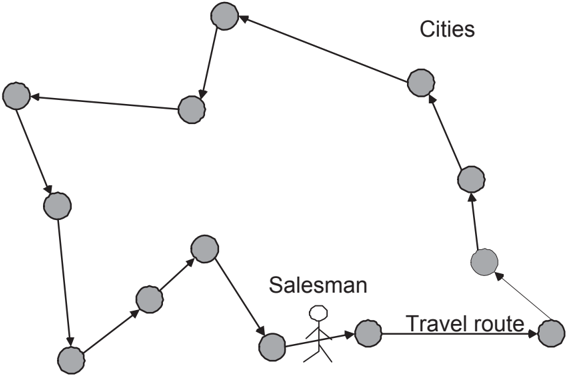

Given the large potential savings that have been shown by the research on VRP, many industrial distributors have become more and more interested in optimizing their distribution in practice. This increasing interest can be observed by the large number of logistic consultant companies that provide the distributors with tools or software for planning and optimizing distribution and transportation problems based on OR techniques. However, real-life route planning problems usually involve a large number of practical constraints. To this end, research interest in the VRP field has also been extended from the idealized VRP to variants of the VRP, called Rich Vehicle Routing Problem (RVRP). These problems are characterized by high complexity and large data size, and hence are much more challenging than the CVRP (Hasle et al. (2006)).

One of the well-known RVRPs is the Vehicle Routing Problem with Time Windows (VRPTW), where each customer is associated with a time interval, called time window, within which, the customer must be visited. This kind of time restrictions is often imposed by real-life applications, such as the school bus route planning. Another type of the RVRP, called Heterogeneous Vehicle Routing Problem (HVRP), extends the VRP by considering the planning of heterogeneous vehicles. A third extension, Multi-Depot Vehicle Routing Problem

Figure 1.2: An example of the VRP. There are 16 customers with unit demand and four vehicles with capacity 5.

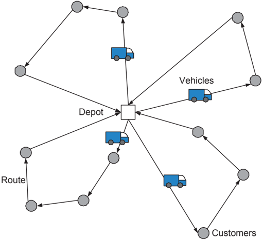

(MDVRP), covers multiple depots, which are quite common in the distribution network of global distributors. Another example of the RVRP is the Dynamic Vehicle Routing Problem (DVRP), in which customers are revealed incrementally over time rather than known in advance. The studies on DVRP provide the possibility of on-line planning in real life. Most of these RVRPs considered in the literature are still over-simplified since they only consider one or a few practical issues. A practical routing problem is often a mixture of these RVRPs. To close the gap between the RVRPs in academic research and in industry, a strong trend in studying richer models can be observed in the recent years.

## 1.2 Purpose and contributions of thesis

The purpose of this thesis is to study the RVRPs that involve complicated practical constraints arising in real life. These RVRPs share common characteristics: they are usually large-scale, involving up to hundreds or even thousands of customers; they are very complicated and impose a lot of practical constraints.

Due to the high complexity of these problems, we focus on solving them by metaheuristics in this work.

The main contribution of this work is the development and implementation of three metaheuristics for solving three large-scale complicated real-life RVRPs. The proposed methods are, when experimentally investigated, prove to be efficient and effective. The outcome of the research on the three problems shows that metaheuristics are capable of providing good solutions to hard and complex planning problems in real life. The three papers of the thesis are produced based on the research results. Additionally, comprehensive introductions and reviews of the VRP and the RVRP are presented.

## 1.3 Outline of thesis

The remainder of this thesis is organized as follows. Chapter 2 presents the mathematical formulation of the CVRP, and briefly discusses the complexity issues. A review of the solution methods for the CVRP is also given. Chapter 3 addresses the practical issues arising in real-life routing problems and the keys to the development of metaheuristics for these problems. A number of important RVRPs that are relevant for this work are introduced and briefly reviewed. Chapter 4 summarizes the papers included in this thesis, followed by conclusions in Chapter 5. Finally, the three papers are provided in the Appendix.


## The Vehicle Routing Problem

In this chapter, we focus on the CVRP, the basic version of the VRP. The problem definition and mathematical formulation are first given. The complexity issues are then discussed. A review of the solution methods, including both the exact methods and heuristic methods, is provided.

## 2.1 Problem definition and formulation

The CVRP is first described by Dantzig and Ramser (1959) as follows:

A number of identical vehicles with a given capacity are located at a central depot. They are available for servicing a set of customer orders, (all deliveries, or, alternatively, all pickups). Each customer order has a speciGLYPH&lt;222&gt;c location and size. Travel costs between all locations are given. The goal is to design a leastcost set of routes for the vehicles in such a way that all customers are visited once and vehicle capacities are adhered to.

The problem can be defined on an undirected graph G = ( N A , ), where N = { 0 } ∪ C . Node 0 represents the depot and nodes in C = { 1 , . . . , n } represent the customers. Each customer i orders a non-negative demand d i . The edges in

A = ( { i, j ) : i, j ∈ N , i &lt; j } represent the connections between nodes. The cost associated to each edge ( i, j ) is given by c ij and we assume that the triangle inequalities are satisfied, i.e., c ij ≤ c ik + c kj ( ∀ i, j, k ∈ N ). Let K = { 1 , . . . , m } denote the set of identical vehicles available at the depot with capacity q .

A vehicle route is defined to be a path that starts from and ends at the depot, and is denoted as r = ( v , v 0 1 , . . . , v h , v h +1 ), where v 0 = v h +1 = 0 represent the depot, and v i ∈ { 1 , · · · , n } for i ∈ { 1 , . . . , h } are customers.

/negationslash

A feasible route is a route that covers each customer at most once and for which the total load does not exceed the vehicle capacity, i.e., v i = v j ( ∀ i, j ∈ { 1 , . . . , h } and i = j ) and ∑ h i =1 d v i ≤ q . The cost of the route is calculated as c r = ∑ h i =0 c v v i i +1 and the set of customers covered by the route is denoted by C r ( C r ⊆ C ).

/negationslash

/negationslash

The optimal solution x ∗ is the solution that has the minimum cost, i.e., x ∗ = argmin x ∈X c x , where X is the set of all the feasible solutions for the problem.

A feasible solution of the CVRP is composed of m feasible routes, denoted by x = { r , . . . , r 1 m } , and the feasible routes satisfy C r k ∩C r l = ∅ ( ∀ k, l ∈ K and k = ) and l ∑ m k =1 |C r k | = |C| . The cost of a feasible solution is the sum of the costs of all the routes, i.e., c x = ∑ m k =1 c r k .

Figure 2.1 gives an example of the VRP to illustrate the network and these concepts.

Laporte et al. (1985) proposed a mixed integer linear programming formulation for the CVRP, where the integer variable x e indicates the number of times that edge e ∈ A is traversed in the solution. Let δ S ( ) = { ( i, j ) : i ∈ S, j / S ∈ or i / S, j ∈ ∈ S } for S ⊆ N . Let v S ( ) denote the minimum number of vehicles needed to serve the node set S , which can be obtained by solving the Bin Packing Problem (BPP) with S and bins of capacity q . The formulation is as follows:

Figure 2.1: An example of a solution to the CVRP. There are four vehicles available with capacity 10. The demand of each customer and the travel cost of each edge in the solution are given in the figure. A feasible route is given by r 1 = (0 3 2 0). , , , The cost and load of the route are 27 and 8, respectively. A feasible solution is given by x = { r , r 1 2 , r 3 , r 4 } . The cost of the solution is 103, which is also the optimal solution.

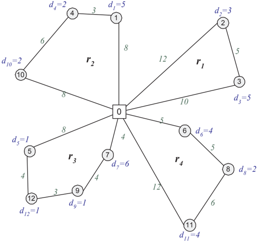

<!-- formula-not-decoded -->

<!-- formula-not-decoded -->

<!-- formula-not-decoded -->

/negationslash

<!-- formula-not-decoded -->

<!-- formula-not-decoded -->

<!-- formula-not-decoded -->

The degree constraints (2.2) and (2.3) make sure that each customer is visited exactly once and m routes are created. Constraints (2.4) impose both the connectivity of the solution and vehicle capacity requirement by forcing a sufficient number of edges to enter each subset of nodes. Constraints (2.5) ensure that each edge between two customers is traversed at most once. Constraints (2.6) state that each edge between the depot and customer can be traversed at most twice. If a vehicle performs a single-customer route, the edge between the depot and the customer will be traversed twice.

Another useful formulation of the CVRP is the set partitioning formulation, in which all the feasible routes are enumerated and their costs are determined in advance (Bramel and Simchilevi (2002)). The objective is to find a set of routes that form a feasible solution with minimum total cost. Let R denote the set of all feasible routes, each of which has a load less than or equal to the vehicle capacity. The cost of each route r ∈ R is denoted by c r . Note that c r is the minimum cost of serving the customers covered by r . Parameter a r i states whether customer i is covered by route r . Binary variable z r equals 1 if route r is selected and 0 otherwise. The CVRP is then formulated as follows:

<!-- formula-not-decoded -->

<!-- formula-not-decoded -->

<!-- formula-not-decoded -->

<!-- formula-not-decoded -->

The objective (2.7) is to minimize the total cost of the selected routes. Constraints (2.8) make sure that each customer is covered by one selected route. Constraint (2.9) states the number of vehicles available. Constraints (2.10) define the binary variables. An advantages of this formulation is that its Linear Programming (LP) relaxation tends to be very tight. However, it may be impossible to enumerate all the feasible routes when the problem size is very large. Thus, one needs to use the Column Generation (CG) technique to solve it, which will be introduced later in Section 2.3. Further details on these formulations and additional formulations for the CVRP can be found in Toth and Vigo (2002).

## 2.2 Complexity

In order to analyze the complexity of the CVRP, we need to introduce the complexity theory and the complexity classes defined by the complexity theory first.

Computational complexity theory is a field in theoretical computer science and mathematics, which deals with the resources required during computation to solve a given problem. Most of the complexity theory deals with the decision problems that can be answered by 'yes' or 'no', and divides these problems into different classes according to the difficulty of solving the problems in terms of computational resources. The class P is the class of decision problems that can be solved by a deterministic algorithm in polynomial time. The class NP is the set of decision problems that can be solved by a non-deterministic Turing machine in polynomial time. Obviously P ⊆ NP but whether P = NP is still an open question. A problem is called NP hard if it is at least as hard as any problem in NP in the sense that each problem in NP can be polynomially reduced to it. The NP hard problems belonging to NP are called NP complete . Hence, the NP complete problems are the hardest ones in the NP class.

Since any maximization/minimization problem can be easily transformed into a decision problem of 'Is there a solution whose objective value is at least/most A ?', where A is a number, the complexity theory can also be applied to optimization problems, such as the VRP. The CVRP is a generalization of the m-TSP by setting q to be ∞ , and a generalization of the BPP by relaxing the routing structure. Since both m-TSP and BPP are proven to be NPhard , the CVRP also is NPhard . The computational effort required to solve the problem hence increases exponentially as the problem size increases. Further complexity issues of the vehicle routing and scheduling problems were investigated by Lenstra and Rinnooy Kan (1981).

## 2.3 Exact algorithms

The CVRP can be solved optimally by using exact methods or approximately by using approximate methods or heuristics. The focus of this section is how to solve the CVRP to optimality, whereas the heuristics will be discussed in the next section.

One of the most important techniques for solving the large-scale combinatorial problems to optimality is B&amp;B, which is the basis for most exact algorithms of the VRPs, such as B&amp;P and B&amp;C. The principle idea of B&amp;B is to divide the search space into subspaces (branching), and evaluate the lower and upper bounds for these subspaces (bounding). If it is established that a subspace does not contain the optimal solution, it is discarded (pruning). Otherwise, the subspace will be further branched and bounded.

A general approach to estimate a lower bound is to solve a relaxed problem, which can be obtained by removing a number of constraints in a particular formulation of the problem. When different constraints in the same formulation or constraints in different formulations are removed, different relaxed problems are constructed.

For example, given the CVRP1 formulation, relaxations can be based on the Assignment Problem if constraints (2.4) are removed (Miller and Pekny (1995)), or based on degree-constrained spanning trees if constraints (2.2) are removed and the right-hand side of constraints (2.4) are replaced by 1 (Christofides et al. (1981) and Fisher (1994)). The relaxed problems can be solved very quickly if a class of hard constraints has been eliminated. However, the quality of these lower bounds is generally very poor.

The lower bound can also be obtained by solving the LP relaxation of CVRP2, i.e., CVRP2 without constraints (2.10). The lower bound estimated in this way is usually very good. Although the LP relaxation consists of a large number of variables, it can be effectively handled by the CG proposed by Dantzig and Wolfe (1960). The CG decomposes the problem into two problems: a master problem consisting of a subset of columns and a subproblem which generates columns to be added to the master problem. The LP relaxation is solved to optimality, i.e., the lower bound is obtained, if no column with negatived reduced cost exists.

There are several approaches to improve the lower bounds. One way is to use the Lagrangian Relaxation (LR), which dualizes some of the relaxed constraints and adds them to the objective function (Fisher (1994), Miller (1995) and Martinhon et al. (2004)). Another way is to strengthen the relaxation by adding some valid inequalities that should be satisfied by all the feasible solutions. Baldacci

et al. (2007) proposed the valid inequalities for different types of relaxations on different formulations.

According to the techniques used to estimate lower bounds, the B&amp;B can be extended to B&amp;P, B&amp;C and Branch-and-Cut-and-Price (B&amp;C&amp;P). The B&amp;P refers to the method that is based on the set partitioning formulation and uses the CG to generate the lower bound for each branch node in the searching tree. Examples of such methods can be found in Agarwal et al. (1989) and Hadjiconstantinou et al. (1995). They are able to solve the benchmark instances involving up to 50 nodes. In the B&amp;C, the lower bound of each branch node is iteratively improved by adding to the relaxed formulation a number of valid inequalities violated by the current solution. These valid inequalities are generated by heuristic separation procedure. The most advanced B&amp;C methods are developed by Baldacci et al. (2004) and Lysgaard et al. (2004), which are able to solve the problems with up to 135 customers. The B&amp;C&amp;P is a combination of B&amp;C and B&amp;P, which generates both columns and cuts to derive superior lower bounds. This kind of methods are the best methods for the CVRP up to the present. Fukasawa et al. (2006) combines the B&amp;C of Lysgaard et al. (2004) with the q -route approach which is interpreted as CG instead of LR in Christofides et al. (1981). The lower bounds are improved compared with those of Lysgaard et al. (2004) and a number of previously unsolvable instances can be solved to optimality. Baldacci et al. (2008b) presented a more efficient B&amp;C&amp;P algorithm based on a set partitioning formulation with three additional cuts.

Recent surveys on exact methods for the CVRP were given by Baldacci et al. (2007) and Cordeau et al. (2007).

## 2.4 Heuristic methods

Given that the VRP is NP hard and the state-of-the-art exact methods can only solve the VRP with up to 135 customers, heuristics play an important role in solving the large-scale VRPs quickly and providing near-optimal or even optimal solutions. Heuristics can be considered as search procedures that iteratively generate and evaluate candidate solutions. Although the VRP is NP hard , evaluation of a solution can be done very efficiently by summing up the costs of the edges in the solution. Hence, how to effectively, intelligently and efficiently search for good solutions is the key to the success of a heuristic.

Generally speaking, the heuristics can be classified into three groups: constructive heuristics , improvement heuristics and metaheuristics (Laporte and Semet (2002)).

The constructive heuristics attempt to built a solution according to some constructive rules but do not improve it. They are usually very fast, but the solution quality provided is often very poor.

Unlike the constructive heuristics, the improvement heuristics deal with complete solutions and attempt to improve them iteratively by applying a sequence of modifications to the solutions. These modifications are also called operators or moves and they are usually very simple. Since the improvement heuristics only accept the modifications that improve the solution, they can also be viewed as a solution intensification procedure or local search that is guided by the objective function.

Metaheuristics are a kind of more sophisticated heuristics with emphasis on performing a deep exploration of the most promising regions of the solution space. It allows deteriorating and even infeasible intermediary solutions. Some of the metaheuristics mimic the successful strategies found in nature. For example, the Genetic Algorithm (GA) was inspired from Darwinian principles of natural selection and Simulated Annealing (SA) came from annealing in metallurgy. Some are based on local search and attempt to improve the local search by introducing diversification strategies, such as using different neighborhoods and/or restarting the search from different random solutions.

## 2.4.1 Route construction methods

Route construction heuristics can be further divided into three classes: savings heuristics, insertion heuristics and two-phase heuristics (Laporte and Semet (2002)).

The earliest savings heuristic was proposed by Clarke and Wright (1964), which attempts to save the cost by merging two small routes to a large route. If i is the last customer of a route and j is the first customer of another route, the saving of serving i and j consecutively is defined as s ij = c i 0 + c 0 j -c ij . In the Clarke and Wright algorithm, n single-customer routes are first constructed, the savings of all customer pairs are then determined and sorted in a nonincreasing order, in which the customer pair is examined and connected if it is feasible.

An intensive research has been made to improve the efficiency, effectiveness and accuracy of the savings heuristic. Golden et al. (1977) and Nelson et al. (1985) have improved the computational efficiency by investigating complex data structures. Gaskell (1967), Yellow (1970), Paessens (1988) and Altinel and Oncan (2005) attempted to improve the solution quality by modifying the saving expression, e.g., multiplying c ij with a route shape parameter or adding a

new term related to the distance or customer demand. Among these methods, Altinel and Oncan (2005) performs the best and it was further investigated by Battarra et al. (2006), in which a genetic-based parameter setting procedure was introduced to enhance the efficiency of the algorithm. Desrochers and Verhoog (1989), Altinkemer and Gavish (1991) and Wark and Holt (1994) proposed a matching algorithm to merge routes, which improves the solution quality significantly compared to the standard Clarke and Wright algorithm but is much more computationally expensive. Wark and Holt (1994) performs the best among the mentioned matching-based algorithms.

In the insertion heuristics, unrouted customers are iteratively and greedily inserted into the constructed routes. Mole and Jameson (1976) proposed a sequential insertion heuristic, in which only one route is constructed at a time. The selection of customer is based on the extra distance resulted from the insertion of the customer to the route, and the distance between the customer and the depot. Christofides et al. (1979) developed a more effective two-phase insertion heuristic. In the first phase, a set of feasible routes are determined. In the second phase, a set of single-customer routes are defined based on the routes obtained in the first phase. The remaining unrouted customers are then inserted according to the difference between the best and the second-best insertion cost.

In the two-phase heuristics, solving the CVRP is decomposed into two parts, clustering customers into subsets, each of which corresponds to a route, and routing the customers in each subset. According to the order of solving these two parts, the heuristics can be divided into route-first-cluster-second methods and cluster-first-route-second methods. In most of the route-first-cluster-second methods, a giant TSP tour over all the customers is constructed and then decomposed into feasible vehicle routes. Such algorithms can be found in Haimovich and Rinnooy Kan (1985) and Bertsimas and SimchiLevi (1996), but they are not competitive with the cluster-first-route-second methods. In the cluster-firstroute-second methods, customers are first clustered and then routed. Different clustering strategies are proposed in the literature. Gillett and Miller (1974) developed a sweep algorithm which divides customers into clusters by rotating a ray centered at the depot, as depicted in Figure 2.2. Fisher and Jaikumar (1981) proposed a method, which first selects a number of seed nodes, each for a vehicle, and then assigns customers to these seeds by solving a Generalized Assignment Problem to ensure that the vehicle capacity constraints are fulfilled. In Bramel and Simchilevi (1995), the seeds are determined by solving a capacitated location problem, which minimizes the total distance between the customers and their closest seeds. Foster and Ryan (1976) and Renaud et al. (1996a) presented so-called petal algorithms, which first generate a large number of feasible routes and then select the final subset by solving a set partitioning problem. The petal algorithms are usually superior to the sweep algorithms.

Figure 2.2: An example of node clustering. Four vehicles with capacity 8 are available. The customer demand is specified in the figure.

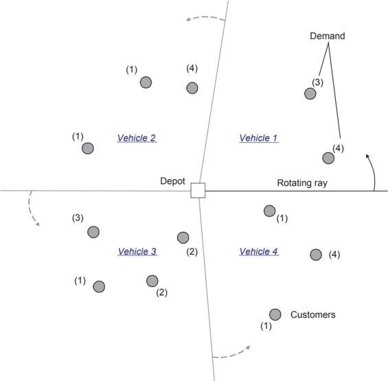

## 2.4.2 Route improvement operators

Given a solution, for example, generated by construction heuristics, we can apply some modifications on the solution to improve its quality. A large number of operators have been proposed for this purpose, such as moving a customer from one route to another, exchanging two customers' positions in the solution and so on. According to the number of routes modified at a time, the operators can be divided into intra-route operators, which work on a single route, and inter-route operators, which modify multiple routes at the same time.

The λ -opt operator, proposed by Lin (1965), is one of the famous intra-route operators. It removes λ edges from a route and reconnect the λ segments in a new way. Figure 2.3 illustrates the routes before and after a λ -opt when λ is 2. Due to the fact that a larger λ results in a higher computational load required

to examine the neighborhoods, λ = 2 and 3 are the mostly used values in the literature. Renaud et al. (1996b) developed a new version of the 4-opt, called 4-opt*, which reconnects a chain of at most ω edges and another chain of two edges. Or (1976) described an Or-opt operator which moves a chain of several consecutive customers to another position in the route, as illustrated in Figure 2.4. Thompson and Psaraftis (1993) proposed a cyclic transfer operator which involves a list of σ routes. In each route, ρ nodes are transferred to the next route in the list. Figure 2.5 shows an example of 3-cyclic 1-transfer.

Van Breedam (1994) classified the inter-route operators into four groups: string cross that exchanges two chains of nodes by crossing two edges (see Figure 2.6), string exchange that exchanges two chains of nodes (see Figure 2.7), string relocation that moves a chain of nodes to another route (see Figure 2.8) and string mix that consists of both string exchange and string relocation. In the literature, the string relocation with one single-vertex chain, which is also called insertion move, is very frequently used due to its simplicity, cheap computational cost and robustness. It can be viewed as a fundamental component of most operators. For example, swapping two nodes can be implemented by two insertion moves.

Further details on construction heuristics and improvement heuristics can be found at Laporte and Semet (2002).

Figure 2.3: An example of λ -Opt operator when λ is 2. Edge (1,3) and (2,4) are replaced by edge (1,2) and (3,4).

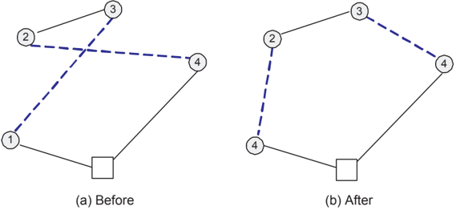

## 2.4.3 Metaheuristics

During the last two decades, many metaheuristics have been proposed for the VRP. These metaheuristics include Tabu Search (TS), Simulated Annealing

Figure 2.4: An example of Or-Opt operator. Chain { 3 4 , } is moved from a position between node 2 and 5 to a position between node 1 and 2.

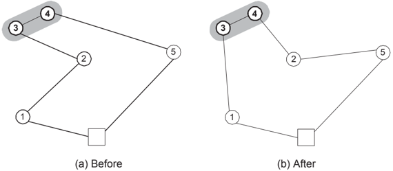

Figure 2.5: An example of 3-cyclic 1-transfer operator. Route r 2 , r 4 and r 3 form up the route cycle. Node 6 in route r 2 is transferred to route r 4 . Node 7 in route r 4 is transferred to route r 3 . Node 10 in route r 3 is transferred to route r 2 .

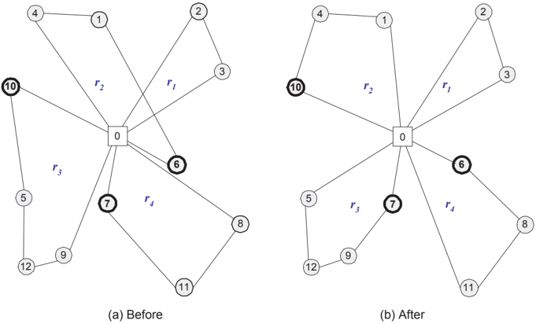

(SA), Iterated Local Search (ILS), Large Neighborhood Search (LNS), Genetic algorithms (GA), Scatter Search (SS) and so on. These methods are categorized into three groups in Cordeau et al. (2007): local search algorithms, population search algorithms and learning mechanisms algorithms.

Figure 2.6: An example of string cross operator. By replacing edge (3, 7) and (6, 4) by edge (3, 4) and (6, 7), chain { 4 } and chain { 7, 8 } are exchanged.

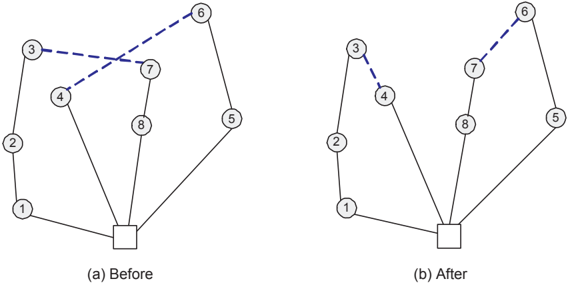

Figure 2.7: An example of string exchange operator. The routes before the move were r 1 = { 0 1 2 , , , 6,7 , 0 } and r 2 = { 0 5 , , 3,4 , 8 0 , } . The routes r 1 = { 0 1 2 , , , 3,4 , 0 } and r 2 = 0 5 { , , 6,7 , 8 0 , } are resulted from exchanging chain { 6 7 , } and { 3 4 , } .


Local search algorithms operate on a single solution x t at each iteration t , and aim at improving the solution by exploring a small search space N x ( t ) defined based on the solution, which is also referred to as a neighborhood of x t . The neighborhood N x ( t ) consists of all the solutions resulted from a given type of move performed on the solution x t . Most of these moves were introduced

Figure 2.8: An example of string relocation operator. A single-node chain, { 7 } , is relocated from route r 1 to r 2 .

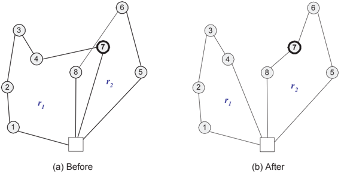

in section 2.4.2. According to some solution selection strategies, one of the solutions in the neighborhood is selected for the next iteration, i.e., x t +1 ∈ N x ( t ). The procedure continues until a stopping criteria is satisfied. Examples of local search algorithms are TS, SA, ILS and so on.

Population search algorithms, on the other hand, work on a population of solutions rather than a single solution. An example of population search algorithms is the GA (Mitchell (1998)), in which new solutions are obtained in two steps: The first step, known as crossover, selects two parent solutions from the population based on their fitness and combines their most desirable features to create one or two offspring solutions. The second step, known as mutation, randomly apply some modifications to each offspring in order to diversify the population.

Recently, great success has been achieved by integrating population search with local search. Local searches are often employed to improve the offspring solutions after the recombination in population search algorithms. Examples of such algorithms are active-guided evolution strategies presented in Mester and Braysy (2005) and Mester and Braysy (2007), and Memetic Algorithm (MA) presented by Nagata and Braysy (2009) and Nagata and Braysy (2008). These two kinds of metaheuristics are the most promising metaheuristics for the CVRP up to the present.

Algorithms based on learning mechanisms are characterized by the abilities of absorbing new information gradually during the search, self-organizing and generating new solutions based on the knowledge learnt during the search procedure. An example of learning mechanisms algorithms is the well-known Ant

Colony Optimization (ACO), which is inspired by the natural phenomenon that an ant finds its short way from nest to food sources based on the pheromone left by previous ants (Dorigo and Stutzle (2004) and Bouhafs et al. (2004)). In the method, artificial ants are used to construct solutions. The edges selected in the good solutions are marked with artificial pheromone, which is used to guide the following ants. Another example of learning mechanisms algorithms is Particle Swarm Optimization, in which a solution is represented by a position of a particle in a multi-dimensional search space and a swarm of particles work together to find the best solution (see Kennedy et al. (2001) and Ai and Kachitvichyanukul (2009)). The learning mechanisms algorithms are usually not as good as local search algorithms or population search algorithms.

Several important metaheuristics will be introduced later in this section. More details on the metaheuristics for the VRPs are given in the extensive surveys in Gendreau et al. (2002), Braysy and Gendreau (2005), Cordeau et al. (2005), Cordeau et al. (2007) and Gendreau et al. (2008).

## 2.4.3.1 Simulated Annealing

SA is inspired by the physical annealing process of solids, and has been applied to solve the VRPs since it was first introduced by Kirkpatrick et al. (1983). It combines local search with a simple diversification strategy that probabilistically allows deterioration of solution quality during the search. At each iteration t , it moves a solution x t to a random neighboring solution x t +1 ∈ N x ( t ) and accepts the move with a certain probability. More specifically, if the neighboring solution x t +1 has an objective value less than or equal to that of x t , i.e., f ( x t +1 ) ≤ f ( x t ), the move is always accepted. Otherwise, if f ( x t +1 ) &gt; f x ( t ), the new solution is accepted with a probability e -f x t ( +1 ) -f x t ( ) θ t , where θ t is a parameter called 'temperature' and decreases from a relatively large positive value to zero gradually according to a cooling schedule. This acceptance criterion is referred to as Metropolis acceptance criterion.

A very common used cooling schedule is achieved by multiplying the acceptance probability with a factor α , which is a number between 0 and 1 and usually close to 1, after every fixed number of iterations. At the beginning, large deteriorations tends to be accepted due to the high temperature. As the temperature decreases, only smaller deteriorations will be accepted.

Besides the Metropolis acceptance criterion, other acceptance criteria can also be considered, such as the threshold accepting and the record-to-record travel, both of which lead to two deterministic variations of SA. For the threshold

accepting, a threshold value is specified as the upper bound of allowed deteriorations (Dueck and Scheuer (1990)). For the record-to-record travel, x t +1 is accepted if f ( x t +1 ) &lt; φf x ( ∗ ), where x ∗ is the best solution found previously and φ is a user defined parameter, which is usually slightly larger than 1 (Dueck (1993)).

Due to the simplicity and the flexibility of the SA, it has been applied to solve various routing problems and it is one of the basic metaheuristics widely used in hybrid heuristics. Such examples can be found in Zeng et al. (2007) and Lin et al. (2009). Suman and Kumar (2006) presented a comprehensive review of SA-based algorithms and also proposed different strategies to improve the performance of SA-based algorithms.

## 2.4.3.2 Tabu Search

TS has been proven to be one of the best metaheuristics for solving the CVRP and its extensions, which produces high-quality solutions within a reasonable amount of computational time. The basic idea of the TS is to locally and repeatedly modify a solution while memorizing the modifications to avoid cycling and to diversify the search (Glover and Laguna (1997)).

One important feature of the TS is the short-term memory, which is implemented by a tabu list. Tabu list is a list of solutions or attributes of solutions that have appeared recently and will be prohibited in the near future. For example, when a customer is moved from one route to another route, one can declare tabu moving that customer back to its previous route for a number of following iterations. This number of iterations is called tabu tenure of the move, which can be fixed, or randomly selected within an interval (Gendreau et al. (1994)), or reactive during the search procedure (Battiti and Tecchiolli (1995) and Wassan (2006)). Tabu list plays an important role in avoiding cycling and helping the search to escape from local minima. However, it may also prevent attractive moves. To remedy this, aspiration criteria are employed to revoke tabus when necessary. A frequently used aspiration criterion is to allow a tabu move when it leads to a solution better than the best solution found previously.

Another feature of the TS is the long-term memory, which diversifies the search by forcing it to jump into previously unexplored solution areas. This can be achieved by penalizing frequently performed moves (Cordeau et al. (2001a)).

The performance of the TS has been improved as a result of significant research efforts. For example, Rochat and Taillard (1995) described the concept of adaptive memory, which is a population of good solutions during the search

procedure. The memory is used to construct a good solution for a new search to start with. Toth and Vigo (2003a) proposed to search more efficiently by removing long edges in the network, which are not likely to appear in good solutions. Gendreau et al. (1994) and Cordeau et al. (1997) allowed intermediate infeasible solutions to make the search more flexible and robust. A penalized objective function with self-adjusted parameters is used to handle the infeasibilities in their work.

## 2.4.3.3 Iterated local Search

ILS is another local search algorithm that uses a perturbation mechanism to escape from local minima (Lourenco et al. (2003)). The method consists of three components at each iteration: perturbation, local search and acceptance criteria. At iteration t , a perturbation is applied on the current solution x t to generate a new solution x ′ t , from which a subsidiary local search is applied until a local optimum x ′′ t is obtained. After that, an acceptance criterion is checked to decide whether the new solution x ′′ t should be accepted. If yes, the next iteration will start with perturbing x ′′ .

t

Perturbation enables the search to escape from local minima. The strength of perturbation has a strong influence on the performance of the algorithm. It is common to introduce large modifications to a solution in the perturbation phase in order to help the subsequent local search to find a different local minimum. The perturbation can be implemented as a random move in a large neighborhood or a number of simple moves. Moreover, the perturbation strategies are not necessary to be the same at every iteration. One can employ different perturbation strategies at different stages of search in an adaptive way.

The local search in the ILS is used to intensify the search by iteratively improving the solution. To obtain better local minima, a more sophisticated metaheuristics, such as TS, can be used.

Different acceptance criteria can considered to balance the diversification and intensification in the ILS. One extreme criterion is to always accept new solutions, and the other is to only accept improvement solutions. Intermediate choices, such as the Metropolis acceptance criterion, the threshold accepting and the record-to-record travel, can also be applied.

## 2.4.3.4 Variable Neighborhood Search

Variable Neighborhood Search (VNS) is a relatively new metaheuristic, which, to some extent, is similar to the ILS in that it also consists of three components at each iteration: perturbation (or shaking), local search and accept criteria. The VNS is based on the idea that different neighborhoods may have different local minima. Therefore it uses a number of different neighborhoods during the search procedure to 'exploit systematically the idea of neighborhood change, both in the descent to local minima and in the escape from the valleys which contains them' (Hansen and Mladenovic (2001), Hansen and Mladenovic (2005)).

The neighborhoods are often ordered according to their size (from small to large), and are used in this order. At the first iteration, the current solution x is moved to a random neighbor x ′ in the smallest neighborhood. This is referred to as a shaking phase. A local search is then applied at x ′ and stops until a local minimum x ′′ is found. If the new solution x ′′ is better than x , it will be accepted and the smallest neighborhood will be used again in the shaking phase for next iteration. Otherwise, a larger neighborhood will be selected for the next iteration. After all neighborhoods have been considered, it will start with the smallest neighborhood again until the stop criterion is satisfied.

The idea of changing neighborhoods is the key to the success of the VNS. The neighborhoods used in the VNS are often nested, meaning that a smaller neighborhood is a subset of a larger neighborhood. A simple way to construct nested neighborhoods is to define the first neighborhood ( N 1 ) by one type of move, the second neighborhood ( N 2 ) by iterating the same move twice and the k th neighborhood ( N k ) by iterating the move for k times. In this way, the following relation holds: N 1 ⊆ N 2 ⊆ . . . ⊆ N k .

Similar to the local search in the ILS, the local search in the VNS can be also enriched by advanced heuristics, such as the Variable Neighborhood Descent and the TS; the acceptance criterion can be replaced by other mentioned criteria. Recent researches on the VNS for VRPs can be found in Paraskevopoulos et al. (2008), Kytojoki et al. (2007) and Hemmelmayr et al. (2009b).

## 2.4.3.5 Large Neighborhood Search

The LNS was introduced by Shaw (1997). It improves solutions by searching in large neighborhoods, which may contain more and potentially better solutions to increase the chance of finding high-quality solutions. In the LNS, a move consists of removing a number of customers and reinserting the removed

customers into the solution. The two phases are also called destroying and repairing procedure. In this sense, the LNS is similar to the ruin and recreate heuristic proposed by Schrimpf et al. (2000). It is obvious that the size of the neighborhood increases exponentially as β increases, where β is the number of customer removed. The complexity of evaluating such a move is also very high when β is large. Since it is too time-consuming to evaluate every single solution in such a large neighborhood, it is very important to restrict the search in a promising area, which is usually achieved by using heuristics to destroy and repair an incumbent solution (Pisinger and Ropke (2009)). The heuristics used to remove a number of customers include the shaw removal heuristic that removes related customers, the random removal heuristic that removes customers randomly, the worst removal heuristic that removes those customers associated with the largest cost in the solution, and so on. The insertion procedure can be performed by the cheapest insertion heuristic, the regret insertion heuristic and so on. Generally, combining different removal and reinsertion heuristics helps to diversify the search and leads to better solutions. Pisinger and Ropke (2007) developed an Adaptive Large Neighborhood Search (ALNS) algorithm, in which a noise function is used to diversify the search, adaptively adjusted weights are used to select the neighborhood and the Metropolis acceptance criterion is used to accept the solutions. Their method is very successful in solving very largescale CVRP and its variants. A recent survey on the LNS is given by Pisinger and Ropke (2009).

## 2.5 Summary

In this chapter we present two formulations for the CVRP and discuss its complexity. The solution methods to this problem are reviewed. The exact methods can solve a small-scale CVRP to optimality using techniques such as B&amp;B, B&amp;P, B&amp;C and B&amp;C&amp;P. The principle idea is to branch the search according to the lower and upper bounds. The heuristic methods are more suitable for large-scale problems. Especially, the meta-heuristics can deal with large-scale problems and provide high quality solutions within much shorter computational time compared with that of exact methods.


3

## The Rich Vehicle Routing Problems

This chapter gives an overview of practical routing problems and discusses the keys to solving complex large-scale problems in real life using metaheuristics. Several well-known extensions of the VRP that are closely related to the problems investigated in this work are also introduced.

## 3.1 Real-life Routing Problems

Routing problems are of concern in real life whenever things needs to be transported from one place to another. For example, garbage collection companies need to plan the routes for collecting the garbages in the urban; Bus companies need to plan the time and the routes for buses and drivers. These real-life routing problems usually include complications that are not considered by the basic CVRP. Most of the complications are related to the following aspects.

- · Planning horizon : In real life, routes are planed for a given planning horizon. This planning horizon can consist of multiple periods.
- · Customer : In the basic VRP, each customer has a demand, In more

complicated problems, the customers may have requirements on the service time and/or the vehicle type. There could also be different types of services, e.g., pickup service, delivery service or pickup-and-delivery service. In some applications, it is not necessary to visit all customers, and the distributor can decide which customers to visit based on their attractiveness. In some cases, customers are allowed to be visited multiple times by several vehicles instead of just once by one vehicle. In some applications with multiple planning days, the customers have demands every day and they can store products for the following days if they have received more than they can consume. In this case, the distributor needs to make a routing plan according to the demands and inventories of the customers.

- · Depot : There can be multiple depots in a large distribution network. These depots may serve different purposes, such as warehousing or crossdocking, to reduce the total cost in the supply chain.
- · Vehicle : The vehicles used for delivery can be different in capacities and sizes. There are usually a limited number of vehicles available in real-life planning. A vehicle may be used in multiple trips instead of a single trip in a routing plan. In the problem with multiple depots, each vehicle may be associated to a base depot. The vehicle must start from and end at its base depot.
- · Driver : In most of the real-life problems, distributors need to consider the drivers' working regulations, e.g., the working shift and the break rules. In addition, drivers can be qualified for different types of vehicles.
- · Objective : The objective function can be quite complex in practice. It may include the minimization of the difference between the longest and shortest route to balance the workload among drivers, the minimization of the number of vehicles to save the large overhead, and/or the maximization of the number of served customers to improve the service level. In some applications, robustness of the solution is also one of the important objectives. These different objectives may conflict with each other.
- · Uncertainty : There can be uncertainties in the route planning. For example, the locations and/or the demands of customers are unknown at the beginning but revealed over time when the vehicles have already been sent out to carry out tasks. In some occasions, the probability distribution of these uncertainties is available, whereas in other cases, it is not.
- · Goods packing : Goods packing has attracted more and more attention recently in the vehicle routing problem. In some applications, customer demand is formed by a set of two-dimensional or three-dimensional weighted items. A feasible routing implies a feasible packing in the sense of geometrical layout. This kind of problems is studied in Zachariadis et al. (2009),

Fuellerer et al. (2009) and Fuellerer et al. (2010). In some pickup and delivery problems, special loading strategies need to be considered, such as first-in-first-out or last-in-first-out (Carrabs et al. (2007) and Petersen and Madsen (2009)).

The varieties in practical issues lead to different extensions of the CVRP. Figure (3.1) illustrates the extensions mostly studied in the literature and shows the interconnections between them.

Figure 3.1: The basic VRP and its extensions.

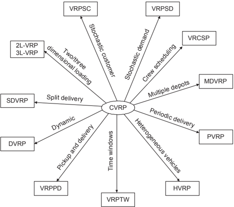

## 3.2 Solving rich VRPs

To manage the various complications and the large size of practical routing problems, metaheuristics play an important role in solving the RVRPs. During the investigation of three large-scale complicated real-life problems included in this work, the following aspects are found to be very important for designing good metaheuristics.

- 1. Reduce problem size. Most of the real-life problems are of very large size, consisting of hundreds or thousands of nodes in their distribution net-

works. To efficiently solve these problems, one can reduce the problem size and solve smaller problem(s) instead. One way to achieve this is to aggregate the nodes that are likely to be served together in the optimal solution and replace these nodes with one single node. This approach is investigated in Oppen and Lokketangen (2006) and Wen et al. (2009b). It should be stressed that node aggregation might be unsuitable for some problems, such as a CVRP with customers that are evenly distributed in geography. When node aggregation is employed, it is very important to control the degree of aggregation and it is suggested that aggregation should be refined during the search. Another way to reduce the problem size is to decompose the original problem into smaller problems. For example, a long planning horizon can be decomposed into several smaller planning horizons (Hvattum et al. (2006) and Wen et al. (2009b)). The key to a successful decomposition is to keep the major characteristics of the original problem in the decomposed problems. In other words, a successful decomposition should have insignificant effects on the solution quality.

- 2. Design of neighborhoods. When local search algorithms are applied, one must make sure that the neighborhoods used in the algorithm cover different search directions in the search space. This is important because real-life problems usually consist of different resources and multiple objectives. For example, if the vehicles are heterogeneous, it is better to combine the vehicle swapping operator, which swaps two vehicles used in two routes, together with other route improvement operators. If the objective is to minimize both the number of vehicles and the total travel distance, it is preferable to use both route improvement operators and route elimination operators.
- 3. Reduce neighborhood size. Generally, large neighborhoods contain more and potentially better solutions. However, searching in large neighborhoods also requires more computational time than in smaller neighborhoods. To achieve a good tradeoff between solution quality and computational time, an attractive idea is to examine the most promising solutions in large neighborhoods and discard the bad solutions. This can be implemented by removing the unattractive edges or nodes in the network, as proposed in the Granular Tabu Search (Toth and Vigo (2003b) and Branchini et al. (2009)), or by heuristically selecting the interesting neighbors to be examined, as done in the LNS (Pisinger and Ropke (2009)). Moreover, it is also recommended to analyze the properties of the practical problem at hand and use these properties to make aggressive searches.
- 4. Other useful apporaches. Based on the experience obtained from this work, we found that allowing intermediate infeasible solutions usually yields a more effective and flexible search. The violations can be eliminated very quickly by using simple self-adjusted parameters proposed in Cordeau et al. (1997). We also found that it is generally a good idea to use different neighborhoods and switch between them. The effectiveness of this idea has also been shown in

other studies, such as Pisinger and Ropke (2009), Hemmelmayr et al. (2009b) and Wen et al. (2009b).

We believe that in the development of metaheuristics for large-scale complicated practical routing problems, the future trends are:

- 1. Hybrid methods: Hybrid heuristics that combine different components and search schemes in different heuristics have already proven their good performance in solving different hard problems (Lin et al. (2009) and Repoussis et al. (2006)). It is also a trend to combine exact methods, such as the B&amp;P or the B&amp;C, with heuristics to obtain not only quick but also near-optimal solutions. This idea has been successfully employed recently in solving some VRP extensions (Desaulniers et al. (2008) and Prescott-Gagnon et al. (2007)) and it could also be one of the research focuses in the future.
- 2. Problem analysis: There are a lot of strategies proposed specially for solving large-scale problems, such as node aggregation and neighborhood pruning. However, applying these strategies requires a full understanding of the problem at hand. One needs to find out, firstly, whether or not these strategies are appropriate for the practical problem being considered, and secondly, what is the best way to implement these strategies so that the solution quality will not be affected too much. We believe that the analysis of practical problems and the associated data sets will facilitate the development of effective and efficient metaheuristics for practical complicated problems.
- 3. Adaptive algorithms: Due to the complexity of practical problems, the solution methods need to be flexible enough to handle various constraints. It is often necessary to exploit some adaptive mechanisms. For example, selfadjusted penalties are applied on the infeasible solutions in Cordeau et al. (1997). In the reactive Tabu Search, the tabu tenue is self-adjusted during the search procedure in Wassan (2006). The adaptive algorithms are also very useful in the balance of the intensification and diversification and in the selection of different neighborhoods in the metaheuristics (Ropke and Pisinger (2006)). We believe that adaptive mechanisms will also be one of the focuses of developing heuristics for practical problems in the future.

## 3.3 Vehicle Routing Problems with Time Windows

The VRPTW is one of the most important extensions of the VRP. In the VRPTW, each customer specifies a time window within which the service must

start. The VRPTW can be used to model various real-life applications, such as bus routing (Fuegenschuh (2009)), waste collection (Kim et al. (2006)), home delivery (Weigel and Cao (1999) and Braysy et al. (2009a)) and petrol station replenishment (Cornillier et al. (2009)).

/negationslash

The VRPTW can be defined on a directed graph G = ( V , E ), where V = { 0 }∪C∪{ n +1 } and E = { ( i, j ) : i, j ∈ V , i = j } . Node 0 and n +1 correspond to the start and end of routes, respectively. The cost of each edge ( i, j ) ∈ E is denoted by c ij , which is usually the travel cost associated to the travel distance (or time) between node i and j . In some context where the number of vehicles needs to be minimized, the travel cost c 0 j for all j ∈ C should additionally include the fixed cost for using each vehicle.

Let [ a , b i i ] denote the time window for node i . A vehicle is allowed to arrive earlier than a i , but it has to wait until a i to start serving the customer. Arriving later than b i is not allowed. There is also a service time s i associated to each node i . The travel time between i and j is denoted by t ij . We set d 0 = d n +1 = 0 and s 0 = s n +1 = 0 for the depot.

A binary decision variable x k ij is defined for each combination of vehicle k and edge ( i, j ) ∈ E and equals 1 if vehicle k travels from node i to node j , and 0 otherwise. Continuous variable w k i indicates the time for vehicle k to start service at node i . The model can be formulated as follows:

<!-- formula-not-decoded -->

| x k ij ∈ { 0 , 1 } ,   | ∀ ( i, j ) ∈ E,k ∈ K   | (3.9)   |
|------------------------|------------------------|---------|
| w k 0 .                | i , k                  | (3.10)  |

i

≥

∀

∈ V

∈ K

The objective function (3.1) minimizes the sum of the travel cost of the edges used in the solution. Constraints (3.2) make sure that each customer is covered by exactly one vehicle. Constraints (3.3) guarantee that the load of each vehicle does not exceed its capacity. Constraints (3.4-3.6) make sure that each vehicle must start and end its route at the depot and that flow is conserved at each customer location. Constraints (3.7), in which M is an sufficiently large number, make sure that vehicle k can not start serving j before w k i + s i + t ij if it travels from i to j . Constraints (3.8) ensure that the time window is respected at each node. Constraints (3.9) and (3.10) define the binary and the continuous variables. Further details on the formulations of the VRPTW can be found in Kallehauge (2008).

During the last two decades, intensive research has been carried out to solve the problem optimally and heuristically. Most of the successful exact methods are based on the CG because it can produce good lower bounds (Kohl et al. (1999), Irnich and Villeneuve (2006), Feillet et al. (2004), Chabrier (2006), Feillet et al. (2007), Jepsen et al. (2008), and Desaulniers et al. (2008)). In the methods proposed in these papers, different strategies, such as cut generation and LR, were incorporated to improve the lower bound. Other approaches to accelerate the column generator were also proposed, such as using aggressive dominance rules in the labeling algorithm, using heuristics to generate columns, etc. One of the best exact methods is the B&amp;C&amp;P algorithm proposed by Desaulniers et al. (2008). They developed a TS algorithm to efficiently generate columns, relaxed the elementarity requirements for a subset of the nodes to accelerate the subproblem and used several inequalities to improve the lower bound. Their method provided optimal solutions to five previously unsolvable benchmark instances with 100 customers and reduced solution times for most of the instances.

In addition to the exact methods, a large number of heuristics are also proposed to solve the VRPTW. These heuristics include TS algorithm (Cordeau et al. (2001a)), evolutionary strategy and evolutionary algorithm (Mester and Braysy (2005), Mester and Braysy (2007), and Repoussis et al. (2009)), LNS algorithm (Pisinger and Ropke (2007) and Prescott-Gagnon et al. (2007)), VNS algorithm (Braysy (2003) and Repoussis et al. (2006)), ILS algorithm (Ibaraki et al. (2005) and Ibaraki et al. (2008)) and SS algorithm (Russell and Chiang (2006)). The best algorithms for solving large-scale VRPTW are those of Prescott-Gagnon et al. (2007), Pisinger and Ropke (2007) and Mester and Braysy (2005). Mester and Braysy (2005) proposed active guided evolution strategies that combine guided local search and evolution strategies into an iterative two-stage proce-

dure. The guided local search is used to regulate a composite local search in the first stage, and the neighborhoods of the evolution strategies algorithm in the second stage. Their method also employed a multi-restart mechanism, which is proved to be very useful in finding better solutions and speeding up the search. They found solutions for a large number of instances better than those in earlier research. Pisinger and Ropke (2007) developed an Adaptive Large Neighborhood Search (ALNS) algorithm, which can solve large-scale problems very effectively and efficiently. Their method is very robust and is able to produce high-quality solutions not only to the VRPTW but also to a number of other VRP extensions within very short computational running times. The method proposed by Prescott-Gagnon et al. (2007) consists of two phases. The first phase emphasizes on vehicle reduction and the second phase reduces the total distance given the number of vehicles obtained in the first phase. They used an LNS framework: At each iteration the routes are destroyed by different ad hoc operators and then reconstructed by a heuristic version of the B&amp;P, where the columns are generated by TS and branches are made by depth-first without backtracking. Their method provided new best solutions to 145 benchmark instances and reduced the number of vehicles on average. However, it is more computationally expensive than the method in Pisinger and Ropke (2007). Repoussis et al. (2009) reviewed most of the recent metaheuristics and compared their performances in details.

## 3.4 Periodic Vehicle Routing Problems

Another extension of the VRP is the PVRP (Beltrami and Bodin (1974)), which considers multiple periods and assumes that each customer is required to be visited based on a given frequency and given feasible combinations of visiting periods.

Recent applications of the PVRP include: routing and scheduling of service teams for preventive maintenance of elevators at customer locations (Blakeley et al. (2003)) and periodic delivery of blood products to hospitals by the Austrian Red Cross (Hemmelmayr et al. (2009a). The PVRP also appears in general logistic literature. Parthanadee and Logendran (2006) considered a multi-product and multi-depot periodic distribution problem that contains the PVRP as a subproblem. Gaur and Fisher (2004) studied a routing and delivery scheduling problem for a supermarket chain which also contains the PVRP as a subproblem. Claassen and Hendriks (2007) investigated a periodic milk collection problem which can be viewed as a PVRP with special characteristics.

To formulate the PVRP, we use the same node set, edge set and vehicle set as

defined in the VRPTW formulation. Additionally, let T = { 1 , . . . , t } denote the set of planning days. Let T i denote the set of feasible combinations of visiting days specified by customer i . Each combination p ( ∈ T i ) corresponds to a number of visiting days. Let parameter g lp be 1 if day l ∈ T is included in combination p ∈ T i . Binary variable z p i equals 1 if customer i is visited according to combination p and binary variable x k ijl equals 1 if vehicle k travels from i to j on day l . The formulation can be written as follows:

<!-- formula-not-decoded -->

The objective (3.11) of the PVRP is to minimize the total cost over the entire planning horizon. Constraints (3.19) define the combination selection variable. Constraints (3.12) make sure that one of the visiting combinations is selected for each customer. Constraints (3.13) guarantee that each customer is visited by exactly one vehicle on each day included in the selected combination. Constraints (3.14-3.18) are similar to constraints (3.3-3.6) and constraints (3.9) in the VRPTW. Alternative formulations for the PVRP can be found in Francis et al. (2008).

Due to the large size of the problem, most of the solution approaches presented so far in the literature are heuristic algorithms, including two-phase heuristic (Chao et al. (1995)), TS algorithm (Cordeau et al. (1997)), parallel genetic and local search method (Drummond et al. (2001)), SS algorithm (Alegre et al.

(2007)) and VNS algorithm (Hemmelmayr et al. (2009b)). The best known algorithms are those of Cordeau et al. (1997) and Hemmelmayr et al. (2009b). Cordeau et al. (1997) proposed a Unified Tabu Search Algorithm (UTSA), which is very simple and flexible. It is based on GENI, a generalized insertion procedure proposed by Gendreau et al. (1992), and it allows intermediate infeasible solutions during the search. Their method is able to produce quality solutions to the PVRP as well as its extensions, such as MDVRP and VRPTW. In the VNS algorithm proposed by Hemmelmayr et al. (2009b), simple move and crossexchange operators were used in the shaking phase. A modified 3-opt operator was applied in the local search phase and the Metropolis acceptance criterion was employed.

Other variations of the PVRP are also considered in the literature. Francis et al. (2006) solved a variant of the PVRP, in which service frequency is a decision variable, by means of a method based on the LR and the B&amp;B. Mourgaya and Vanderbeck (2007) solved a variant of the PVRP that includes both routing cost minimization and workload balance by the CG. A recent survey on the PVRP is given by Francis et al. (2008).

## 3.5 Heterogeneous Vehicle Routing Problems

Another class of routing problems, which is quite common in logistic operations, deals with heterogeneous vehicles. There are many reasons for the distribution managers to keep a fleet of vehicle with different sizes, capacities, fixed costs and fuel costs. For example, even though large vehicles are usually more costeffective than small vehicles, they are sometimes not allowed in urban area because of the environmental concerns, or can not be used to serve specific customers due to special restrictions of road infrastructures.

Based on different assumptions, there are several different versions of routing problems with heterogeneous vehicles studied in the literature. These assumptions are mainly related to the following aspects:

- 1 Whether there is a fixed cost for each type of vehicles?
- 2 Whether the number of vehicles of each type is limited?
- 3 Whether the routing cost is different for different type of vehicles?
- 4 Whether each customer has a preference for the vehicle type?

In this section, we present a formulation for a complicated version with fixed vehicle cost, limited number of vehicles, vehicle-dependent route cost and vehiclespecialized customers. It is not difficult to obtain the formulations for other versions by appropriately setting the values of parameters or sets in this formulation.

Let q k and F k denote the capacity and fixed cost of vehicle k ∈ K , respectively. Let K i denote the set of preferred vehicles specified by customers i . The cost of traveling from i to j by vehicle k is denoted by c k ij . The formulation is as follows:

<!-- formula-not-decoded -->

The objective (3.20) is to minimize the total travel cost and the total cost of vehicles used. Constraints (3.21) make sure that each customer is served once by one of its preferred vehicles. Constraints (3.22) are the capacity constraints for the vehicles. The rest constraints are the flow conservation constraints and the binary variable constraints.

Baldacci et al. (2008a) provided a good survey on routing heterogeneous vehicles. Here we only focus on the best algorithms presented recently in the literature, which include Choi and Tcha (2007), Liu et al. (2009), Brandao (2009), Imran et al. (2009) and Prins (2009). Choi and Tcha (2007) presented a set covering formulation, solved the LP relaxation of the formulation by the CG and used a B&amp;B algorithm to derive integer solution. Liu et al. (2009) developed an effective GA, in which a new chromosome evaluation procedure was introduced, a new single parent crossover operator was proposed and local search was used as

mutation. Brandao (2009) proposed a deterministic TS algorithm which combines GENI and three different moves (single insertion, double insertion and swap). Imran et al. (2009) presented two variants of VNS. They introduced six neighborhoods, a diversification procedure for the shaking phase, a powerful local search consisting of multiple levels, and an extra refinement based on Dijkstra's algorithm. Prins (2009) described two MA methods, in which chromosomes are viewed as a giant tours without trip delimiters and evaluated by a tour splitting procedure that splits the giant tours into feasible vehicle routes. The two methods are different in terms of their local search and acceptance criteria.

The extension of heterogeneous routing problem that includes the time windows constraints has also drawn a lot of scientific attentions recently. The best known algorithms for this kind of problems include ALNS algorithm (Pisinger and Ropke (2007)), VNS based method (Paraskevopoulos et al. (2008)) and SA based heuristic (Braysy et al. (2008) and Braysy et al. (2009b)). Recent surveys on routing heterogeneous vehicles with time windows can be found at Baldacci et al. (2008a) and Braysy et al. (2008).

## 3.6 Dynamic Vehicle Routing Problems

Another extension of the VRP is called DVRP, which takes into consideration the uncertainties of real life. For example, in some applications, there may be uncertainty about customers: These are initially unknown but revealed incrementally while the operations are ongoing. Applications of the DVRP include real-time ambulance relocation problem (Brotcorne et al. (2003)), realtime vehicle-dispatching system for consolidating milk runs (Du et al. (2007)), real-time good delivery to customers (Hvattum et al. (2006)) and local area courier services (Gendreau et al. (2006)).

Based on the number of previously unknown customers and their arrival time, Larsen (2001) defined an effective way to measure the degree of dynamism of a DVRP. Since the problem is dynamic, it is required to adaptively modify the existing solution in order to serve the newly revealed customers. The most efficient way of doing this is to modify a part of solution and insert the new customers into the existing solution.

To make a better plan, it is wise to take future customers into account. MitrovicMinic et al. (2004) suggested a double-horizon heuristic for solving a dynamic pickup and delivery problem, which focuses on both a short-term goal, namely minimizing the total distance travelled, and a long-term goal, namely maximiz-

ing the slack time to ease the insertion of future customers. Mitrovic-Minic and Laporte (2004), Branke et al. (2005) and Pureza and Laporte (2008) investigated the waiting strategies and tried to improve the solution by letting vehicles wait at certain places for proper time.

For recent literature reviews, see Larsen et al. (2008)) and Berbeglia et al. (2009).

## 3.7 Integrated Vehicle Routing and Crew Scheduling Problems

Traditionally the vehicle routing and crew scheduling are considered separately and sequentially to reduce the complexity of the problems. However, it has recently become a trend to work on vehicle routing and crew scheduling simultaneously in order to jointly optimize the transportation problem. Taking into consideration the dependency between these two problems may yield better schedules of the costly manpower under various working regulations and may reduce the total cost significantly.

A well studied application of the Vehicle Routing and Crew Scheduling Problem (VRCSP) is the urban transit system, which considers the problem of scheduling buses and crews to serve trips defined by a timetable. Haase et al. (2001) and Freling et al. (2003) studied the problem with a single depot. Huisman et al. (2005) and Mesquita and Paias (2008) considered the problem with multiple depots. Huisman and Wagelmans (2006) extended the problem into a dynamic case, in which the vehicle schedules are generated online. A recent research, Steinzen et al. (2009), focused on improving the regularity of the schedules. The solution methods in the mentioned work are based on the CG and the LR.

The VRCSP is also studied in other applications, such as mail distribution (Hollis et al. (2006) and Zaepfel and Boegl (2008)) and food distribution (Wen et al. (2009b)). Both Zaepfel and Boegl (2008) and Wen et al. (2009b) considered the driving regulations in the planning and solve the VRCSP by metaheuristics.

Another relevant research topic is the integrated aircraft routing and crew scheduling problem. This problem is considered by Cordeau et al. (2001b), Mercier et al. (2005) and Papadakos (2009), and solved by Benders decomposition in their work.


4

## Summary of papers included

This chapter summaries the three practical vehicle routing projects investigated in this work. For each project, the problem is first introduced. The proposed method is then described, followed by a discussion on future research directions. The three papers corresponding to these three projects can be found in the Appendix.

## 4.1 Vehicle Routing with Cross-docking

The first paper (Wen et al. (2009c)) considers a routing problem with crossdocking, which has emerged as an important material handling technology in transportation over the past decade. Cross-docking is defined as the consolidation of orders from incoming shipments so that they can be easily sorted at a distribution center for outgoing shipments. The distribution center in this case is referred to as a cross dock, which essentially eliminates the inventory holding function of a traditional warehouse while still allowing consolidation. The Vehicle Routing Problem with Cross-Docking (VRPCD) considered in the paper is a variation of the VRP, where a set of homogeneous vehicles are used to transport orders from the suppliers to the corresponding customers via a cross dock. The orders can be consolidated at the cross dock but cannot be stored

for long because the cross dock does not have long-term inventory-holding capability. The objective of the VRPCD is to minimize the total travel time while respecting time window constraints at the nodes and a time horizon for the whole transportation operation. The problem can be transformed to a classic Vehicle Routing Problem with Pickup and Delivery if a route consists of both pickup and delivery and the consolidation at the cross dock is skipped. However, due to the existence of the consolidation procedure, the vehicles become connected to each other and the pickup routes and delivery routes are also connected. The difficulty and complexity of the problem increases dramatically due to these interactions.

In the paper, we first present a mixed integer linear programming formulation for the problem. Due to the large data size in practice and the requirement on fast solution time, a heuristic algorithm is developed to solve the problem based on a TS embedded within an adaptive memory procedure. Even though TS has proven to be one of the best available heuristic methods for the VRPs in the literature, applying it to a new problem requires taking the specific knowledge of the problem into consideration. In the VRPCD, due to the consolidation at the cross dock, the vehicles are no longer independent. This dependency leads to high computational complexity even in evaluating a simple insertion move. To alleviate the computational burden, properties of insertions are investigated and a new accelerating strategy, aggressive skip , is proposed to skip the potentially bad moves. This skip strategy plays a key role in effectively reducing down the number of moves to be fully evaluated and hence helps in reaching high-quality solutions within short computational times. To strengthen the intensification, the algorithm sometimes searches in full neighborhoods without using the aggressive skip. The algorithm is able to switch between the aggressive skip and the full search by itself. Finally, the TS is embedded within an adaptive memory procedure (AMP). This enables the algorithm to reach good and robust solutions by repeating the TS from different good starting points.

The proposed algorithm is implemented and tested on realistic data sets provided by the Danish consultancy company Transvision, involving up to 200 pairs of nodes. Experimental results show that, thanks to the aggressive skip, the proposed algorithm can produce high-quality solutions (less than 5% from optimal solution values) within very short computational time (five minutes).

As a relatively new warehousing strategy in logistics, there could be many practical variations of the VRPCD in the future. A very reasonable extension of the problem is to relax the constraint that the vehicles must stop by the depot after they have picked up the orders from the suppliers. If the vehicles are allowed to perform a direct pickup and delivery when necessary, the total travel distance should be further reduced. Figure 4.1 gives an example of the routes for this extension. This extension is also called Pickup and Delivery with Transfers and

has been investigated by Cortes et al. (2010). Another extension is to consider multiple depots in the transportation system. This layout may exist in large distribution networks. One way to solve this problem is to decompose it into several single-depot problems by assigning the pickup-delivery orders among depots in a preprocessing procedure and then solve each single-depot problem using the proposed heuristic. However, better solutions can be obtained if the interaction between the depots is taken into account. This VPR with multiple cross docks is therefore very interesting, challenging and worth investigating.

Figure 4.1: An example of allowing direct transfer in the VRPCD. There are five supplier-customer pairs. Each pair is denoted by ( i, i ′ ), i = 1 , · · · 5, where i is the supplier and i ′ is the corresponding customer. Two routes are planned for the delivery denoted in line and dash. Order from supplier 2 is transfered to 2 ′ without going through the cross dock.

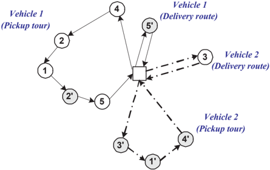

Besides the extensions of distribution network, another practical consolidation and delivery process is also worth considering. In the paper, we assume that the time for unloading a pallet is fixed. However, in practice, this time should be related to the place where the pallet is stored in the vehicle. For example, those stored at the back of the truck behind many pallets are harder to unload than those close to the front of the truck. This unloading time issue also exists during the delivery. The packing order of the pallets depends on the order of customers visited in the pickup routes. The problem with integrated vehicle routing and goods packing is very interesting and practical.

The objectives of this problem can be also extended. In the paper, we only minimize the total distance traveled, which to some extent is only related to the fuel cost. However, there are many other costs in the practical distribution. For example, the fixed costs associated to the vehicles are often very large. These costs can be reduced by minimizing the number of vehicles. Another type of

cost is the labor cost, which usually takes up a substantial portion of the total distribution cost. Reducing the labor cost requires a minimization of the working duration of the drivers, including the driving time, the waiting time at each node and the waiting time for the consolidation. These additional objectives can be easily included in the objective function of the proposed heuristic.

The robustness of the solution is also of interest. Due to the consolidation at the cross dock, the vehicles are strongly dependent on each other. A slight change in one pickup route can affect several delivery routes. Hence, robustness is rather important in the planning and should be considered in the future work.

Although a successful heuristic is proposed for the VRPCD considered in the paper, the solution to a specific variation of the problem still needs to be considered carefully. For some of the extensions mentioned above, the proposed method can easily be modified to solve them, whereas for the others, the direct usage of the proposed method may not be very obvious, and further research should be carried out.

## 4.2 Dynamic Multi-Period Vehicle Routing Problem

In the second paper (Wen et al. (2009a)), we consider a routing problem encountered by Lantm¨nnen, a Swedish company, who is one of the largest groups a within the food, energy and agricultural industries in the Nordic region. One of the activities of Lantm¨nnen is the distribution of fodder to the farmers at a their requests. The fodder is delivered from one of several terminals that usually operate independently of each other, except during periods of exceptional activities.

The problem essentially deals with the distribution of orders from a depot to a set of customers over a multi-period time horizon. Since customer orders with specified feasible service days are dynamically revealed over time, this problem is named Dynamic Multi-Period Vehicle Routing Problem (DMPVRP). In the DMPVRP, decisions need to be made at the beginning of each day on what customers should be visited and how they should be visited. If all the orders are known in advance, this would be a typical PVRP with frequency one. However, the uncertainty of the orders indicates a dynamic nature of the problem and increases the complexity significantly.

The primary objective of the problem is the minimization of the total travel time over the planning horizon. In order to improve the service level and to

ease the resource assignment, we also try to minimize the customer waiting and balance the workload over the planning horizon in the dynamic environment.

In the paper, we formulate a static version of the problem as a mixed integer linear program and propose a rolling-horizon heuristic algorithm to solve the dynamic variant.

A natural idea to solve the DMPVRP is to consider the planning at the beginning of each day as a static problem, solve it as a special PVRP with all the orders already known, and execute the routes planned for the current day. However, this approach has two inherent disadvantages: 1) the computational load is too intensive; and 2) the plan for the far future is wasted when the new orders are revealed.

To overcome these two shortcomings, we propose a three-phase heuristic. In the first phase, a time-space correlation analysis is used to wisely select a subset of customers N t to visit in the near future, i.e., in the following τ days, where τ is a user-defined parameter used to control the problem size for the next phase. In the second phase, a TS based heuristic algorithm is used to route these selected customers for the following τ days. With a proper choice of τ , the TS can perform a thorough search and provide good solutions efficiently. The TS consists of two main components at each iteration: a local search based on insertion move and a shaking phase based on a ruin and recreate approach. In the last phase, we further optimize the routes to be carried out on the current day by means of a UTSA proposed by Cordeau et al. (1997).

To handle multiple objectives in an optimization problem, the scalar technique and the Pareto method are the two mostly used strategies. The Pareto method is not appropriate for the dynamic context because the routes have to be selected and carried out every day before the next day is planned. Therefore, we opt to implement the scalar method. To minimize the customer waiting, we assign a penalty for not visiting a customer on its earliest feasible service day. The penalty function for the customer waiting is implemented as a quadratic function which reaches value 1 if the customer is visited at the end of its feasible service days. To balance the workload, we minimize the deviation of daily workload from the average workload estimated from previous days. These two objectives together with the minimization of total travel time are weighted and summed in the objective function.

The proposed algorithm is implemented and tested on 11 real-life data sets collected from Lantm¨nnen. Each data set involves a 10-day or 15-day planning a horizon. Computational results show that the proposed algorithm provides very high-quality solutions within reasonable running time. It is found that the first phase, time-space correlation analysis, is very effective in selecting good

customers for constructing routes in the second phase. The proposed algorithm can reduce the customer waiting and improve the workload balance significantly at the cost of an only minimal increase in the total travel time.

The obtained solutions are also compared with the industrial solutions under the same constraints considered in this work. The comparison shows that on average the proposed algorithm improves solutions in terms of travel time, customer waiting and workload deviation by 0.2%, 24% and 35%, respectively. However, it should be stressed that the software we used to generate the company's solutions is designed to handle more practical constraints than we have considered in our work.

The first phase of the proposed heuristic is essentially a preprocessing procedure to select good customers and reduce the problem size. This preprocessing, although found to be effective, could make wrong decisions since it does not rely on any prediction of the future customers or any route construction. These kinds of information can be investigated further to improve the performance of the algorithm in the future.

To bring prediction of the future in the picture, we may collect the a priori information about the temporal and spatial statistics of the orders. If we analyze the data over a long period, a pattern could probably be found and this pattern, in space or in time, could serve as a good indication of the future orders. Incorporating the statistical information in Phase I may provide a better selection of the customers.

Since Phase I selects the customers without constructing any routes, the customer selection is actually isolated from the route optimization. If a bad decision is made in Phase I, it is not possible to correct it in Phase II in the current heuristic. One way to improve this method is to allow Phase II to change the customer set ( N t ) based on the optimization of routes. For example, we can add a refinement step in Phase II, which, based on the current best solution, removes a number of 'expensive' and postponable customers, and then insert a number of unselected customers to the routes if their insertion costs are small. This kind of refinement can be applied during Phase II whenever it is necessary, e.g., when the solution has not been improved for a long time.

The work may also be extended by considering the minimization of the number of vehicles, which is not trivial due to the dynamic nature of this problem. We may take additional practical constraints into consideration in the future. For example, the distributor accepts last-minute orders and a vehicle can be assigned to multiple trips. These constraints will result in a much more complicated model.

## 4.3 An Integrated Vehicle Routing and Driver Scheduling Problem

In the third paper (Wen et al. (2009b)), we study a distribution problem originated from the largest fresh meat producer in Denmark, Danish Crown, which delivers fresh meat from its distribution terminals to the supermarkets all over Denmark. The problem is an integration of vehicle routing and driver scheduling since the routes are to be determined not only for a fleet of heterogeneous vehicles but also also for a set of drivers according to their working regulations.

The problem has a one-week planning horizon. The supermarkets place their orders with specified demands over a week and preferences for visiting times and vehicle types before the week starts. The distributor makes a weekly delivery plan for both the drivers and the fleet of heterogeneous vehicles so that the orders and their specific requirements are fulfilled. In addition, the drivers' working regulations and driving rules have to be respected. There are two kinds of drivers used to carry out the distribution work: the internal drivers hired by Danish Crown, and the external drivers temporarily borrowed from external freight carrier. Both start from given starting times and finish before given latest ending times on each workday. The internal drivers have additional constraints on the maximum working duration over a week, i.e., 37 hours. Moreover, all the drivers should take a 45-minute break after driving for 4.5 hours according to the EU driving legislation. The objective of the problem is to minimize the total travel costs which is formulated as a weighted sum of the internal drivers' driving distance and the external drivers' working duration.

In the paper, the problem is formulated as a mixed integer linear program, and solved by means of a multi-level VNS based heuristic.

At the first level, the problem size is effectively reduced by aggregating the nodes according to their locations, demands, and time windows. A number of user-defined parameters are introduced to control the degree of aggregation. Generally, aggressive aggregation leads to a problem of small size and quick convergence. However, it also narrows down the feasible region, and may degrade the solution quality substantially.

The second level decomposes the aggregated weekly planning problem into six daily planning problems and solve each of them by means of a VNS consisting of initialization, shaking phase and local search. The key question in the decomposition is how to allocate the weekly working hours to each workday for the internal drivers. An adaptive allocation strategy is proposed and proved to be effective. In the VNS, the sweep heuristic is used to construct an initial solution,

the UTSA is applied in the local search phase to obtain local minima and five neighborhoods are used in the shaking phase to escape from local minima.

The last level of the method simply expands the solution of the aggregated problem to that of the original problem.

The proposed method is implemented and tested on real-life data with up to 2000 orders per week. A comprehensive sensitivity analysis on the algorithm is provided, showing that the adaptive allocation strategy and multiple-neighborhood shaking phase are very effective. Furthermore, the comparison between our solution and the industrial solution shows that our solution is superior in terms of both the total travel distance and the number of used vehicles given the constraints we have considered in this work.

This problem mixes the scheduling and routing optimization, which introduces many challenges in the development of heuristics. Several aspects can be considered in future work.

There are several methods proposed to reduce the problem size to a manageable level. All these techniques make the search efficient but bring about inevitable compromise in the solution quality. How to keep the influence of size reduction on solution quality at a minimum level is worth investigating. For example, the current aggregation only relies on simple information such as time windows and distance, and is therefore prone to errors. These errors are not possible to correct later in the present method. To eliminate these errors, we should introduce a self-correcting scheme or self-refinement to the aggregation. We may segregate a number of aggregated nodes after a period of searching, and reaggregate based on the historical solutions. Such an iterative algorithm is able to correct the obvious errors in the aggregation. Moreover, a post-optimization can be included after the last level for each route to improve the solution further.

This problem, although very complicated already, may still be extended according to the practical needs. For example, the work shifts of internal workers, which are fixed in the current problem, can actually be scheduled jointly with the route planning. This increases the problem complexity but helps to make the best use of the drivers and reduce the overall transportation cost.

Another interesting variation of the problem is the 'recovery' problem: given the orders for a new week and the existing schedule from last week, try to make a new schedule that satisfies all the orders in the new week while minimizing the differences between the new schedule and the old schedule from last week. This objective can be desirable for the distributor since a relatively steady plan for each week is easy to carry out and manage from resource allocation point of view. Specifically in this Danish Crown's distribution problem, the drivers need

the keys to the supermarkets. A relatively fixed route for each driver not only improves their efficiency but also reduces the handing over of keys. Considering the fact that the operation of supermarkets is usually stable, a relatively steady plan also makes sense. A relatively steady plan can be achieved by a robust scheduling, which usually requires sufficient redundancy in the vehicle capacity available for the increase of orders and sufficient buffer times in the routes for the insertion of new customers.

Chapter

5

## Conclusion

This thesis focuses on real-life routing applications, which as a class of extended VRP take more realistic constraints into consideration and therefore have drawn more and more attention both in the academic research society and in the industry. Due to the high computational complexity in solving these problems, our focus has been on developing metaheuristics.

Three cases from industry are studied in detail, all of which are difficult and characterized by four features: real-life problems, large scale, special constraints, and high requirements on running times. For each problem, we develop a metaheuristic algorithm that can yield quality solutions within reasonable running time.

The first problem considered is a routing problem with cross-docking, a recent material handling technique in supply chain management. In the problem, goods are transported from suppliers to customers via a cross dock at which they can be consolidated. The problem is computationally very hard because of the strong dependence among the vehicles resulted from the consolidation. We propose a TS based heuristic and introduce a very effective searching strategy that can solve this problem successfully within very short running time.

In the second case we deal with a dynamic routing problem where routes are planned according to the gradually revealed orders over the planning horizon.

The primary difficulties of the problem are the large size (more than one thousand orders) and the uncertainty resulting from the dynamic nature of the problem. We propose a three-phase heuristic that works over a rolling horizon and an effective customer selection strategy to reduce the problem size. The proposed method yield quality solution within reasonable running time.

The last problem arises from food distribution and is a hybrid of vehicle routing and driver scheduling. The major challenge of that problem is how to handle the manifold of constraints and the joint optimization effectively. A heuristic method based on node aggregation and VNS is proposed and proves to be very effective.

Through these three projects, we have found that the key techniques concerning the development of metaheuristics for practical RVRPs include problem-size reduction, data analysis for the specific problem, design of neighborhoods, smart switch of neighborhoods, good balance between diversification and intensification, adaptive mechanisms etc. Although each RVRP in real life has its own characteristics, we have shown that these techniques are common to the development of good heuristics for the practical RVRPs. We believe that our methods, although proposed to address the three individual problems, have consistent strategies and underlying logic that reflect these techniques and could be of general applicability.

We have focused our attention on developing metaheuristics for solving the problems. As an alternative, hybrid methods that combine the merits of both heuristics and exact methods may also be used to produce quality solutions with fast response time.


A

## Vehicle Routing with Cross Docking

Journal of the Operational Research Society , 2009, 60(12): 1708-1718.

## Vehicle Routing with Cross-Docking

Min Wen , Jesper Larsen , Jens Clausen , Jean-Fran¸ cois Cordeau , and 1 1 1 2 Gilbert Laporte 3

- 1 Department of Informatics and Mathematical Modeling, Technical University of Denmark, Technical University of Denmark, DK-2800 Kongens Lyngby, Denmark, { miwe@man.dtu.dk, jesla@man.dtu.dk, jecl@man.dtu.dk }
- 2 Canada Research Chair in Logistics and Transportation and CIRRELT, HEC Montr´ eal, 3000 chemin de la Cˆte-Sainte-Catherine, Montr´al, Canada H3T 2A7, o e cordeau@crt.umontreal.ca
- 3 Canada Research Chair in Distribution Management and CIRRELT, HEC Montr´ eal, 3000 chemin de la Cˆte-Sainte-Catherine, Montr´al, Canada H3T 2A7, o e gilbert@crt.umontreal.ca

## Abstract

Over the past decade, cross-docking has emerged as an important material handling technology in transportation. A variation of the well-known Vehicle Routing Problem (VRP), the Vehicle Routing Problem with Cross-Docking (VRPCD) arises in a number of logistics planning contexts. This paper addresses the VRPCD, where a set of homogeneous vehicles are used to transport products from the suppliers to the corresponding customers via a cross-dock. The products can be consolidated at the cross-dock but cannot be stored for very long because the cross-dock does not have long-term inventory-holding capabilities. The objective of the VRPCD is to minimize the total traveled distance while respecting time window constraints at the nodes and a time horizon for the whole transportation operation. In this paper, a mixed integer programming formulation for the VRPCD is proposed. A tabu search heuristic is embedded within an adaptive memory procedure to solve the problem. The proposed algorithm is implemented and tested on data sets provided by the Danish consultancy Transvision, and involving up to 200 pairs of nodes. Experimental results show that this algorithm can produce high quality solutions (less than 5% away from optimal solution values) within very short computational time.

Keywords: Cross-docking, Vehicle Routing Problem, Pickup and Delivery.

## A.1 Introduction

Cross-docking is a relatively new warehousing strategy in logistics. It is defined as the consolidation of orders from incoming shipments so that they can be easily sorted at a distribution center for outgoing shipments. The distribution center in this case is referred to as a cross-dock. It essentially eliminates the inventory holding function of a traditional warehouse while still allowing consolidation. The shipments arriving from disparate sources are regrouped and dispatched directly by the outgoing trailers without being stored. Shipments typically spend less than 24 hours at the cross-dock, sometimes less than an hour. This way, cross-docking not only provides good customer service but also yields substantial advantages over traditional warehousing: reduction in inventory investment, storage space, handling cost and order-cycle time, as well as faster inventory turnover and accelerated cash flow (Cook, Gibson and MacCurdy, 2005; Apte and Viswanathan, 2000).

Due to its remarkable benefits, cross-docking has been widely adopted in practice by manufacturing and retailing companies. A successful application of crossdocking is found at Wal-Mart, the largest and highest profit retailer in the world. In the system used by this company, orders are continuously delivered to Wal-Mart's cross-docks, where they are selected, repacked, and then dispatched to stores, often without ever sitting in inventory. By avoiding spending valuable time and handling inventory cost, cross-docking has enabled Wal-Mart to adopt an everyday low price strategy and has helped the company improve its market share and profitability (Stalk, Evans and Shulman, 1992). CompUSA is another major user of cross-docking: 70% of its orders in dollar volume goes through a cross-dock (Gentry, 2005).

Considerable research on cross-docking has been carried out in recent years. However, most of the papers have investigated the physical design of the crossdock (Ratliff, Vate and Zhang, 1999; Bartholdi III and Gue, 2004) and its location (Gumus and Bookbinder, 2004). The very few papers that deal with the transportation problems associated with cross-docking have studied two types of network models.

The first type of model is characterized by an 'open' network, in which the distribution flow starts from a single supplier and ends at a single customer via a cross-dock without forming any loop. Work in this area includes Sung and Song (2003), Jayaraman and Ross (2003) and Chen et al. (2006). Sung and Song (2003) have discussed the problem of deciding whether to open a crossdock or not, and the problem of assigning vehicles for transportation from a supplier to a single destination via one of the open cross-docks. They have proposed a tabu search algorithm for the transportation problem. Jayaraman

and Ross (2003) have investigated a similar problem. Given a cost for opening each supplier, they have discussed how to decide whether a supplier should be opened or closed. Simulated annealing methods were used in their paper. In Chen et al. (2006), time windows for suppliers and customers are given, and the inventory cost at the cross-dock is also taken into consideration. These authors have proposed a hybrid metaheuristic combining simulated annealing and tabu search.

In the second type of network model, each vehicle leaves the cross-dock to pick up or deliver orders and returns to the cross-dock after completing its tour. To the best of our knowledge, only one publication, that of Lee, Jung and Lee (2006), has studied a transportation problem of this type. This problem consists of a single cross-dock, multiple suppliers and multiple customers. The task is to assign tours to a set of vehicles at the cross-dock so that suppliers and customers are visited within their time windows. The authors assume that all vehicles should arrive simultaneously at the cross-dock from their pickup routes. A mixed integer programming formulation and a tabu search algorithm were proposed.

The problem considered in our study is the Vehicle Routing Problem with CrossDocking (VRPCD). The problem is similar to that of Lee, Jung and Lee (2006) where the vehicles can pick up or deliver more than one supplier or customer, and the pickup and delivery routes start and end at the cross-dock. However, there is no constraint on simultaneous arrival for all the vehicles in our problem. Instead, the dependency among the vehicles is determined by the consolidation decisions. Moreover, each pickup and delivery has predetermined time windows.

This work is based on the case of a company operating in Denmark. Suppliers prepare the orders for individual supermarkets and dispatch them via a crossdock. The remainder of this paper is organized as follows. A detailed description of the VRPCD is given in the next section. A mixed integer formulation of the problem is then presented, followed by a heuristic embedding tabu search within an adaptive memory procedure. The algorithm is implemented and tested on realistic data involving up to 200 supplier-customer pairs. Computational results are presented and conclusions follow.

## A.2 Problem Definition

The VRPCD considered in this paper is in essence a problem of transporting orders from a set of suppliers to their corresponding customers using a crossdocking strategy. Orders from the suppliers are picked up by a fleet of homo-

geneous vehicles, consolidated at the cross-dock, and immediately delivered to customers by the same set of vehicles, without intermediate storage. Therefore, the problem involves not only vehicle route design, but also a consolidation decision at the cross-dock.

A small VRPCD instance of five supplier-customer pairs (requests) is shown in Figure A.1. The set of nodes { 1 , ..., 5 } represents the suppliers and { 1 ′ , ..., 5 ′ } represents the corresponding customers. Figure A.2 illustrates the pickup and delivery routes for the three vehicles, all of which start and end their routes at the cross-dock. For example, the first vehicle makes pickups at nodes 1 and 2 and delivers to nodes 1 , ′ 2 ′ and 5 . ′ Note that in the VRPCD, a supplier and its corresponding customer are not necessarily served by the same vehicle. For instance, request 5 is picked up by the third vehicle but delivered by the first vehicle. Hence, the third vehicle has to unload order 5 after it arrives at the cross-dock from its pickup route, and the first vehicle needs to load order 5 before it leaves for its delivery route. Figure A.3 shows the details of the consolidation process taking place at the cross-dock.

As in the Vehicle Routing Problem with Time Windows (VRPTW), each node must be served by exactly one vehicle within its time window, the accumulated load of each route must not exceed the vehicle capacity, and the time horizon for the whole transportation operation must be respected. At the cross-dock, for each vehicle the unloading must be completed before reloading starts. Each vehicle can start unloading immediately after it arrives at the cross-dock from its pickup route. The duration of the unloading consists of a fixed time for preparation, and the time needed for unloading orders, equal to the time for unloading each pallet multiplied by the number of pallets. For instance, suppose vehicle k reaches the cross-dock at 10:00. It needs to unload orders i 1 and i 2 , whose demands are 5 and 9, respectively. Given that the fixed time for preparation is ten minutes and the time for unloading each pallet is one minute, the total unloading duration is 24 (= 10 + 5 + 9) minutes. Note that the time at which vehicle k finishes unloading, i.e. 10:24, is also the time at which orders i 1 and i 2 are ready to be reloaded in their corresponding delivery vehicles.

## A.3 Mathematical formulation

We now present a mixed integer linear programming formulation for the VRPCD. Denote the set of pickup nodes by P = { 1 , ..., n } and the set of delivery nodes by D = { n + 1 , ..., 2 n } . Each request i is identified by the node pair ( , i i + n ), where i is the pickup node and i + n is the associated delivery node. The cross-dock is represented by four nodes and denoted by the set

Figure A.1: A small instance of the VRPCD

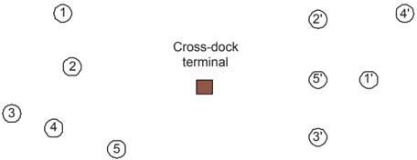

Figure A.2: Vehicle routes

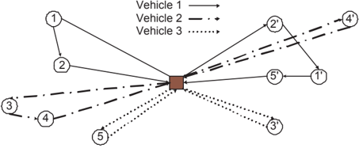

/negationslash

O = { o , o 1 2 , o 3 , o 4 } , where the first two nodes represent the starting and ending locations for pickup routes, and the last two for the delivery routes. Further, define N = P ∪ O ∪ D . The set E denotes all the feasible arcs in the network. It consists of the arcs { ( i, j ) : i, j ∈ P ∪ { o , o 1 2 } , i = j } and the arcs { ( i, j ) : i, j ∈ D ∪{ o , o 3 4 } , i = j } . Let K be the set of vehicles.

/negationslash

Figure A.3: The consolidation process at the cross-dock

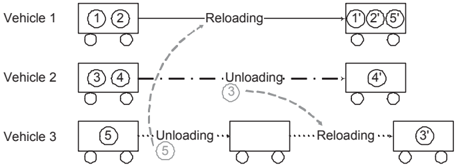

The parameters are denoted as follows:

- c ij = the travel time between node i and node j (( i, j ) ∈ E );
- d i = the amount of demand of request i ( i ∈ P );
- [ a , b i i ] = the time window for node i ( i ∈ N );
- Q = the vehicle capacity;
- A = the fixed time for unloading and reloading at the cross-dock;
- B = the time for unloading and reloading a pallet.

The variables are:

- x k ij = { 1 if vehicle k travels from node i to node j (( i, j ) ∈ E,k ∈ K ) 0 otherwise;
- u k i = { 1 if vehicle k unloads request i at the cross-dock ( i ∈ P, k ∈ K ) 0 otherwise;
- r k i = { 1 if vehicle k reloads request i at the cross-dock ( i ∈ P, k ∈ K ) 0 otherwise;
- g k = { 1 if vehicle k has to unload at the cross-dock ( k ∈ K ) 0 otherwise;
- h k = { 1 if vehicle k has to reload at the cross-dock ( k ∈ K ) 0 otherwise;
- s k i = the time at which vehicle k leaves node i ( i ∈ N,k ∈ K );
- w k = the time at which vehicle k starts reloading at the cross-dock ( k ∈ K );
- t k = the time at which vehicle k finishes unloading at the cross-dock ( k ∈ K );
- v i = the time at which request i is unloaded by its pickup vehicle at the cross dock ( i ∈ P ).

In addition, M is an arbitrarily large constant.

The VRPCD can be formulated as follows:

<!-- formula-not-decoded -->

<!-- formula-not-decoded -->

| ∑ :( ) ∈ x k hj = 1                                                    | ∀ h ∈ { o 1 , o 3 } , k ∈ K   | (A.4)   |
|------------------------------------------------------------------------|-------------------------------|---------|
| ∑ i :( i,h ) ∈ E x k ih - ∑ j :( h,j ) ∈ E x k hj = 0                  | ∀ h ∈ P ∪ D,k ∈ K             | (A.5)   |
| ∑ j :( j,h ) ∈ E x k jh = 1                                            | ∀ h ∈ { o 2 , o 4 } , k ∈ K   | (A.6)   |
| s k j ≥ s k i + c ij - M (1 - x k ij )                                 | ∀ ( i, j ) ∈ E,k ∈ K          | (A.7)   |
| a i ≤ s k i ≤ b i                                                      | ∀ i ∈ N,k ∈ K                 | (A.8)   |
| u k i - r k i = ∑ j ∈ P ∪{ o 2 } x k ij - ∑ j ∈ D ∪{ o 4 } x k i + n,j | ∀ i ∈ P, k ∈ K                | (A.9)   |
| u k i + r k i ≤ 1                                                      | ∀ i ∈ P, k ∈ K                | (A.10)  |
| 1 M ∑ i ∈ P u k i ≤ g k ≤ ∑ i ∈ P u k i                                | ∀ k ∈ K                       | (A.11)  |
| t k = s k o 2 + Ag k + B ∑ i ∈ P d i u k i                             | ∀ k ∈ K                       | (A.12)  |
| w k ≥ t k                                                              | ∀ k ∈ K                       | (A.13)  |
| w k ≥ v i - M (1 - r k i )                                             | ∀ i ∈ P, k ∈ K                | (A.14)  |
| v i ≥ t k - M (1 - u k i )                                             | ∀ i ∈ P, k ∈ K                | (A.15)  |
| 1 M ∑ i ∈ P r k i ≤ h k ≤ ∑ i ∈ P r k i                                | ∀ k ∈ K                       | (A.16)  |
| s k o 3 = w k + Ah k + B ∑ ∈ d i r k i                                 | ∀ k ∈ K                       | (A.17)  |
| x k ij , u k i , r k i , g k , h k ∈ { 0 , 1 }                         | ∀ i ∈ P, ( i, j ) ∈ E,k ∈ K   | (A.18)  |
| s k i , t k , w k ≥ 0                                                  | ∀ i ∈ N,k ∈ K                 | (A.19)  |
| v i 0                                                                  | i P.                          | (A.20)  |

≥

∀

∈

The objective is to minimize the total travel time. The constraints consist of two parts: vehicle routing (constraints (A.1) to (A.8)) and consolidation decisions at the cross-dock (constraints (A.9) to (A.17)).

Both the pickup part and the delivery part can be formulated as VRPTWs. Constraints (A.1) ensure that each node is visited once by one vehicle. Constraints (A.2) and (A.3) ensure that for each vehicle, the load on the pickup route and on the delivery route does not exceed the vehicle capacity. Constraints (A.4) state that each vehicle's pickup route must depart from o 1 and delivery route must

leave from o 3 . Constraints (A.5) are flow conservation constraints. Constraints (A.6) force each vehicle to return to o 2 on its pickup route and return to o 4 on its delivery route. Constraints (A.7) compute the traveling time between two nodes if they are visited consecutively by the same vehicle. Constraints (A.8) ensure that each node is visited within its time window and the whole operation is completed within the time horizon.

For the consolidation decisions at the cross-dock, whether a vehicle k should unload or reload order i depends on its pickup and delivery routes. This dependence, which shows the linkage between the pickup part and the delivery part, is expressed by constraints (A.9) and (A.10). In these two constraints, the following three cases are considered: if vehicle k picks up i but does not deliver i + n , then it unloads the order at the cross-dock; if vehicle k does not pick up i but delivers i + n , then it needs to reload the order at the cross-dock; if the vehicle neither picks up i nor delivers i + n , then it neither unloads nor reloads the order. These cases are summarized in Table A.1.

Table A.1: Relationship between x k ij and u , r k i k i

|   k picks up i ∑ j ∈ P ∪{ o 2 } x k ij |   k delivers i + n ∑ j ∈ D ∪{ o 4 } x k i + n,j |   k unloads i u k i |   k reloads i r k i |
|----------------------------------------|-------------------------------------------------|---------------------|---------------------|
|                                      0 |                                               0 |                   0 |                   0 |
|                                      1 |                                               1 |                   0 |                   0 |
|                                      1 |                                               0 |                   1 |                   0 |
|                                      0 |                                               1 |                   0 |                   1 |

Constraints (A.11) to (A.17) define the internal working flows and deadlines for all the vehicles at the cross-dock. Constraints (A.11) force g k to be 1 if the vehicle needs to unload. Constraints (A.12) indicate that the unloading duration for a vehicle k consists of a fixed time ( A ) for the preparation of unloading, and the time for unloading the orders, equal to the unit time for unloading a pallet ( B ) multiplied by the number of pallets ( ∑ i ∈ P d u i k i ) to be unloaded from the vehicle. Constraints (A.13) and (A.14) ensure that a vehicle cannot start reloading until it finishes unloading, and all the orders to be reloaded on it are ready. The ready time of order i is represented by constraint (A.15), which depends on the time at which the pickup vehicle of order i finishes unloading. Constraints (A.16) and (A.17) for the reloading are similar to (A.11) and (A.12).

This formulation contains O n ( 2 ) binary variables, O mn ( ) continuous variable and O n m ( 2 ) constraints. Without constraints (A.9) to (A.16), the model is essentially the problem of solving two independent VRPTWs, abbreviated as 2-VRPTW. It is obvious that any optimal solution to this 2-VRPTW provides

a lower bound for the VRPCD. The difficulty in the VRPCD is that the pickup and delivery routes are not independent but correlated. This correlation results from the fact that the same vehicles need to first pick up and then deliver orders within the time windows. Therefore, the search for an optimal solution is not only to find shortest routes for both operations, but also to coordinate the exchanges of orders at the cross-dock so that all time windows and the time horizon are respected. These two aspects usually conflict with each other. The impact of this conflict on the VRPCD solution will be illustrated in the computational experiments section.

## A.4 Heuristics

Tabu search (TS) has proven to be one of the best available heuristic methods for solving VRPs, producing high quality solutions within a reasonable amount of computing time (Cordeau et al. , 2002). The basic idea of TS is to locally and repeatedly modify a solution while memorizing the modifications to avoid cycling. Modifications to the attributes of the recently visited solutions are stored in a tabu list that forbids their use for a certain number of iterations.

In this paper, we develop a TS algorithm for the VRPCD. Applying TS to a new problem requires taking the specific knowledge of the problem into consideration. In the VRPCD, due to the consolidation at the cross-dock, computing the cost of even a simple insertion is very expensive. To alleviate the computational burden, properties of insertions are investigated and new accelerating strategies are proposed, which have been proved to be very effective. Two neighbourhoods are used alternately in the TS, which is finally embedded within an adaptive memory procedure (AMP). This enables the algorithm to reach good and robust solutions by repeating the TS from different good starting points.

The AMP is described next, followed by the proposed TS algorithm, and by a description of an efficient implementation of local search.

## A.4.1 Adaptive memory procedure

In an AMP, a set of vehicle tours is stored in an adaptive memory (AM). A vehicle tour is defined as a pickup route and a delivery route operated by the same vehicle. An initial TS solution is constructed by combining the selected vehicle tours, where the selection preference is probabilistically biased toward tours with good objective values. This idea was first proposed by Rochat and Taillard

(1995) in the context of the VRP and of the VRPTW and has been proved to be very effective in providing high quality solutions for related problems.

In an AMP, an improved solution identified during the TS is considered. The vehicle tours in this solution are labeled with the value of the objective function and are included in the AM. Concurrently, the same number of tours with the highest label are removed from the AM. Consequently, the AM consists of a constant number of vehicle tours throughout the algorithm. Algorithm 1 shows how to generate the initial TS solution from the AM. The probability assigned to a specific vehicle tour is P r ( ) = (max { l r | r ∈ AM ) } -l r ) / ∑ r ∈ AM r l , where l r is the label of the r th vehicle tour. A tour with a smaller value of l r will be selected with a higher probability. At each iteration one vehicle tour is selected and all incompatible tours are removed since each node can be served by only one vehicle. The selecting procedure stops when there are no more vehicle tours compatible with those selected. Finally, the unvisited nodes are assigned to empty vehicles (see lines 8 to 11).

## Algorithm 1 Generate initial solution from the memory

- 1: AM ′ ← AM
- 2: assign a probability to each element in AM ′
- 3: while AM ′ is not empty do
- 4: select a vehicle tour r from AM ′
- 5: delete the routes that cover a node covered by vehicle tour r
- 6: end while
- 7: let N left be the unserved nodes sorted in increasing order of radial angle
- 8: while N left is not empty do
- 9: assign the nodes in N left to an empty vehicle v ′ one by one until the vehicle capacity is reached
- 10: remove from N left the nodes that are assigned to v ′
- 11: end while

## A.4.2 Tabu search heuristic

Our TS algorithm is based on that of Cordeau, Laporte and Mercier (2001), in which infeasible solutions are allowed during the search. The cost function of a solution s is defined by f ( s ) = c s ( ) + αq s ( ) + βd s ( ) + γw s ( ), where

<!-- formula-not-decoded -->

<!-- formula-not-decoded -->

<!-- formula-not-decoded -->

<!-- formula-not-decoded -->

where ( x ) + = max 0 { , x } . In these equations, c s ( ) is the total travel time by all vehicles, q s ( ) is the total excess quantity in both the pickup and the delivery parts, d s ( ) and w s ( ) are the excess duration and total time window violations, respectively. Thus, if s is feasible, then f ( s ) = c s ( ). The coefficients α , β and γ are positive self-adjusting penalties. At each iteration, the values of α β , and γ are modified by a factor 1 + δ &gt; 1: if the current solution is feasible with respect to quantity (resp. duration, time windows), the value of α (resp. β , γ ) is divided by 1 + δ ; otherwise, it is multiplied by 1 + δ .

In the TS, an insertion moves a node i from its original vehicle k to another vehicle k ′ , as illustrated in Figure A.4.

Figure A.4: Insertion move

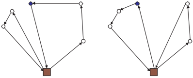

In some TS implementations (e.g., Barbarosoglu and Ozgur, 1999; Tang and Miller-Hooks, 2005), the solution improvement phase is divided into two stages: exploring a small number of moves (namely, small neighbourhood search), and exploring a large number of moves (namely, large neighbourhood search). Empirical results show that alternating between small and large neighbourhood search enables the search to evolve in an efficient way without degrading solution quality.

In our TS algorithm, the same strategy is exploited. In the large neighbour-

hood search, every node is moved to every position of every other vehicle. The complexity for this neighbourhood is O n ( 2 ). In the small neighbourhood search, instead of searching the whole solution space, we select a subset of nodes N ′ ( N ′ ⊆ N ) and move each of them to a specific subset of vehicles. For instance, a node i ′ ( i ′ ∈ N ′ ) is tentatively moved to each vehicle in M ′ i ( M ′ i ⊆ M ). The ways of selecting N ′ and M ′ i are as follows: if in the current solution, a vehicle violates the capacity constraint, exceeds the duration limit or involves any node not visited within its time window, all the nodes served by this vehicle will be added into N ′ since the infeasibility of the solution will probably be reduced by removing a node from an infeasible route. After collecting all the nodes from all the infeasible vehicle routes, if the size of N ′ is still less than a fixed number µ , we randomly select µ -| N ′ | nodes and add them into N ′ to make sure that N ′ is not too small or empty when the solution is nearly feasible or feasible. When considering moving a node i ′ ∈ N ′ to vehicles in M ′ i , we would like M ′ i to be a set of vehicles that are very close to node i ′ in order to minimize the total travel time. We sort all the nodes i ∈ N except i ′ in ascending order of the travel time between i and i ′ . The set M ′ i consists of all vehicles that cover any of the ν nodes nearest to i ′ . Hence, each node in N ′ is moved to several of its nearest vehicle routes. With fixed values of µ and ν , the running time is independent of the size of the data.

The strategy we used for switching between small and large neighbourhoods is the following: the TS starts with the small neighbourhood and switches to the large neighbourhood if there has been no improvement in the best solution in the last η iterations; when exploring the large neighbourhood, if the best solution is updated within σ iterations, the search process switches back to the small neighbourhood, otherwise the TS stops. The overall structure of TS is presented in Algorithm 2.

As for short and long term memories, we use the same rules as in Cordeau, Laporte and Mercier (2001). To avoid cycling, if a node is removed from a vehicle, reinserting it in that vehicle is forbidden for the next θ iterations unless the move satisfies an aspiration criterion , i.e. a feasible solution better than the present best solution is found. To diversify the search, the move cost ∆ f is increased by a penalty whose value is proportional to the frequency of the move. For more details, see Cordeau, Laporte and Mercier (2001).

## A.4.3 Efficient implementation of local search

Compared with the VRPTW, an insertion move for the VRPCD is computationally much more expensive. In the VRPTW, the routes of the vehicles are independent of each other, but due to the consolidation at the cross-dock, the

## Algorithm 2 Tabu search algorithm

```
1: Stop = FALSE; Nb = 2; i = 0; s ∗ = ∅ ; f ( s ∗ ) = ∞ 2: while Stop == FALSE do 3: if Nb == 2 then 4: Small neighbourhood search 5: else 6: Large neighbourhood search 7: end if 8: s = solution found by the neighbourhood search 9: if f ( s ) < f s ( ∗ ) and s is feasible then 10: s ∗ = ; s i = 0; Nb = 2 11: else 12: i ++ 13: end if 14: if Nb == 2 and i > η then 15: Nb = 1 16: end if 17: if Nb == 1 and i > σ then 18: Stop = TRUE 19: end if 20: end while
```

vehicles are no longer independent of each other in the VRPCD. For example, an insertion move that shifts a supplier i from vehicle k to k ′ will not only affect the delivery route of k and k ′ , but will also affect other related vehicles that serve the corresponding customers of the suppliers served by vehicles k and k ′ .

Without any improvement the running time will be too large for the planning environment in many companies. In order to accelerate the algorithm, we have studied the cost impact of a move. Denote the current solution by S 1 , the solution after the move i : k → k ′ by S 2 , and the move cost by ∆ f . The change in total travel time is denoted as ∆ . c The changes in violation of quantity, duration and time windows are denoted as ∆ q , ∆ d and ∆ w , respectively. The following property holds:

Property If S 1 is feasible, then ∆ f ≥ ∆ + c α ∆ . q

Proof. Since f ( s ) = c s ( ) + αq s ( ) + βd s ( ) + γw s ( ), the cost of a move can be represented as ∆ f = f ( S 2 ) -f ( S 1 ) = ∆ c + α ∆ + q β ∆ + d γ ∆ . w Since S 1 is feasible, then ∆ d ≥ 0 and ∆ w ≥ 0 hold. Hence, ∆ f ≥ ∆ + c α ∆ q. /square

Note that to calculate β ∆ d and γ ∆ , we need to exploit the complete inforw

mation about S 2 including the duration of each vehicle route and the visiting time of each node; on the other hand, ∆ c and α ∆ can be very easily calculated q without investigating the details in S 2 . Let ∆ f ∗ denote the minimum move cost among all moves considered. In the neighbourhood search of a currently feasible solution, a move for which ∆ c + α ∆ q ≥ ∆ f ∗ can be skipped to save computation time. We call this kind of skipping a conservative skip .

Preliminary tests have shown that very little computing time is saved by using the conservative skip since it only applies to feasible solutions. To reduce the computational time further, we have developed an aggressive skip which applies when the route of vehicle k is feasible with respect to the duration and time window constraints. This skip is reasonable because removing i from k is very likely to reduce the violation of route k , and inserting i into route k ′ may increase the violation of route k ′ . If vehicle k is already feasible, ∆ d and ∆ w are probably positive. The move is therefore skipped if ∆ c + α ∆ q ≥ ∆ . f Nevertheless, if route k is infeasible with respect to the duration and time window constraints, then the move should not be skipped.

## A.5 Computational Experiments

Our TS heuristic was implemented in C and executed on a Linux computer with a 2.2GHz Dual Core AMD Opteron tm Processor 175 and 2 Gbytes of RAM. Due to the practical constraints, for a data set with 200 pairs of nodes, the users would expect to solve the problem relatively quickly. As a result, the computational time of running the algorithm in this paper is limited to five minutes.

## A.5.1 Data

The data used in this paper were generated from a real data set belonging to Transvision, a Danish logistics consultancy based in Copenhagen. The real data are confidential and could not be provided to us. The test data consist of five Euclidean sets, denoted by 200a, 200b, 200c, 200d and 200e, respectively, where 200 stands for the number of supplier-customer pairs. Each set consists of suppliers and customers with pickup and delivery locations ( x, y ) in meters. The time window for each node is two hours. The time horizon for the whole transportation operation is from 6:00 to 22:00. The demand transported from each pickup location to the corresponding delivery location is given in number of pallets. Vehicles drive at a constant speed of 60 km/h and have a capacity

of 33 pallets. It takes ten minutes to prepare a vehicle, plus an additional one minute for each pallet to be loaded or unloaded. The locations of the suppliers, the customers and the cross-dock for one data set are given in Figure C.1. In this data set, the depot is located in Glostrup, near Copenhagen. The pickup points are mostly in Zealand where Glostrup is situated, and the delivery points are mostly in Jutland.

For preliminary testing purposes, small data sets with 20, 30, 50, 100 or 150 pairs of nodes were generated by randomly selecting the corresponding number of supplier-customer pairs. All the test data can be accessed via the Internet at http://www2.imm.dtu.dk/ ∼ mw/vrpcdData/.

Figure A.5: Locations of pickup and delivery nodes for one instance of the VRPCD

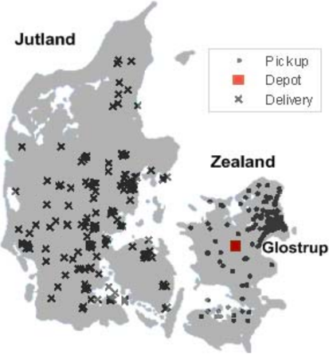

## A.5.2 Parameter tuning

The algorithm employs a set of parameters whose values require tuning before the algorithm is assessed. In Table A.2, these parameters are listed and explained. Based on a large number of runs, the following set of parameters was finally selected: ( δ , η , σ , ϕ µ , , ν ) = (3, 1200, 800, 10 n , n , 10), where the n is the number of supplier-customer pairs.

Table A.2: Parameters of the algorithm

| δ :   | the maximum number of AMP iterations;                                                                        |
|-------|--------------------------------------------------------------------------------------------------------------|
| η :   | the maximum number of non-improving iterations in small neighbourhood search in TS;                          |
| σ :   | the maximum number of non-improving iterations in large neigh- bourhood search in TS;                        |
| ϕ :   | the size of the AM;                                                                                          |
| µ :   | the number of the selected nodes for the small neighbourhood;                                                |
| ν :   | in the small neighbourhood, a selected node i is moved to the vehicles that cover the ν nodes nearest to i ; |

In the AMP, it was found that the performance of the algorithm is not very sensitive to the AM size ϕ . Preliminary results have shown that ϕ = 10 n is large enough. The selection of the number of AMP iterations is a tradeoff between performance and computational cost. Given the running time of five minutes, three iterations are found to be suitable, which is in line with the setting used in Tang and Miller-Hooks (2005).

As mentioned in the TS description, the alternate use of two neighbourhoods in the TS makes it possible for the search process to move out of the current local optimum. This strategy has already been proved to be very effective in providing high quality solutions as stated in Tang and Miller-Hooks (2005). The same effect is achieved by our algorithm, as shown in Table A.3. In the tests, the value of ν is 10 for the small neighbourhood and n for the large neighbourhood. Table A.3 illustrates the comparison between two-neighbourhood search and one-neighbourhood search. The first two columns are the data set descriptor and the number of supplier-customer pairs. Columns 3 and 4 report the average solution value over 25 runs and the average computational time in seconds for the two neighbourhood strategies adopted in our algorithm. Columns 5 and 6, and columns 7 and 8 provide the corresponding results for the large neighbourhood search and the small neighbourhood search, respectively. According to Table A.3, the two-neighbourhood strategy consistently outperforms the other two one-neighbourhood strategies both in terms of average solution value and computational time.

A large number of trials have shown that the selection of η , σ and µ is not critical over a wide range. The values 1200, 800 and n are selected based on the results and experience. The parameters α β , , γ are set as in Cordeau, Laporte and Mercier (2001).

Table A.3: Comparison of two-neighbourhood strategy and one-neighbourhood strategy

|                  | Two-neighbourhood   | Two-neighbourhood      | Large neighbourhood         | Large neighbourhood   | Small neighbourhood    | Small neighbourhood    |
|------------------|---------------------|------------------------|-----------------------------|-----------------------|------------------------|------------------------|
| Data             | Data                | Average solution value | AverageAverage timesolution | Average time          | Average solution value | Average time (seconds) |
| set              | n                   |                        | (seconds)                   | value (seconds)       |                        |                        |
| 50a              | 50                  | 6534.2                 | 16 6568.1                   | 27                    | 6558.7                 | 11                     |
| 100a 100 12982.9 | 100a 100 12982.9    | 100a 100 12982.9       | 63 13096.6                  | 93                    | 13265.9                | 20                     |
| 100b100 14770.9  | 100b100 14770.9     | 100b100 14770.9        | 56 14864.9                  | 92                    | 14919.6                | 20                     |
| 150a 150 19871.3 | 150a 150 19871.3    | 150a 150 19871.3       | 139 19939.7                 | 232                   | 20304.5                | 38                     |
| 150b150 21284.0  | 150b150 21284.0     | 150b150 21284.0        | 125 21374.3                 | 218                   | 21537.8                | 36                     |
| 200a 200 27684.8 | 200a 200 27684.8    | 200a 200 27684.8       | 274 27959.9                 | 482                   | 28107.7                | 73                     |
| 200b200 27989.1  | 200b200 27989.1     | 200b200 27989.1        | 278 28241.2                 | 517                   | 28393.3                | 77                     |

## A.5.3 Analysis of the main results of the algorithm

We now analyze the impact of the efficient implementation and the correlation among vehicles on the behaviour of the algorithm, and we present results on the VRPCD instances.

## Effect of the efficient implementation of the local search

The new aggressive skip described earlier in the Heuristic section is vital to efficiently narrow down neighbourhood size and to reach high quality solutions within short computing times. In theory, the ruling out process may cut off useful moves and degrade the solution quality slightly. However, it works very well in practice.

A comparison between the results with aggressive skip and without aggressive skip (namely, full search ) is provided in Table A.4. The column ′ Gap ′ presents the percentage gap between the two results. It is calculated as 100(¯ z aggressive skip -¯ z full search ) /z ¯ full search .

The column ′ Gap ′ shows that the TS with aggressive skip performs as well as full search . The Gap is less than 0.3% for all the tests in Table A.4. However, it can be seen, the computational time for the aggressive skip is much shorter than for the full search . Figure A.6 shows the value of the best solution found as a function of the running time of the algorithm for data set 200a. As we can see, the aggressive skip significantly speeds up the algorithm while maintaining almost the same solution quality.

Table A.4: Comparison of TS with and without aggressive skip

|          |     | Aggressive skip        | Aggressive skip        | Full search            | Full search            |         |
|----------|-----|------------------------|------------------------|------------------------|------------------------|---------|
| Data Set | n   | Average solution value | Average time (seconds) | Average solution value | Average time (seconds) | Gap (%) |
| 100a     | 100 | 12981.9                | 63                     | 12980.3                | 891                    | 0.012   |
| 100b     | 100 | 14770.9                | 56                     | 14769.3                | 805                    | 0.011   |
| 100c     | 100 | 14145.1                | 57                     | 14125.3                | 749                    | 0.140   |
| 150a     | 150 | 19871.3                | 139                    | 19885.5                | 2790                   | -0.071  |
| 150b     | 150 | 21284.0                | 125                    | 21265.1                | 2565                   | 0.089   |
| 150c     | 150 | 20320.5                | 140                    | 20326.7                | 2578                   | -0.031  |
| 200a     | 200 | 27683.9                | 273                    | 27676.2                | 6519                   | 0.028   |
| 200b     | 200 | 27989.1                | 278                    | 27916.5                | 6449                   | 0.260   |
| 200c     | 200 | 26654.1                | 282                    | 26640.3                | 6053                   | 0.052   |

Figure A.6: The effect of aggressive skip . The horizontal axis is the running time in seconds and the vertical axis is the objective value. The short and long curves show the results with and without aggressive skip , respectively

## Impact of the correlation among vehicles on the VRPCD solution

To illustrate the impact of correlation among vehicles on the VRPCD solution, we vary the preparation time A and the time B for reloading and unloading a pallet. As A and B increase, it becomes more time consuming to exchange orders among vehicles at the cross-dock. Restricted by the time windows at the delivery nodes, the algorithm will try to avoid unloading and reloading orders and thus hinder the optimization of travel time on both sides.

We have applied our algorithm with different settings of A and B . The results are presented in Table A.5. Five data sets (20a, 20b, 30a, 100a and 200a) were tested with different settings of A and B . The setting A B -denotes the number of minutes required for A and B , respectively. For each data set and A B -setting, the average objective value over 20 random runs and the average number of nodes whose orders are unloaded at the cross-dock are given. ′ INF ′ means no feasible solution was found in the 20 runs.

As expected, the best objective value the algorithm can find increases with A and B . For large A and B , it is obvious that the optimal 2-VRPTW solutions do not yield good lower bounds for the VRPCD.

It should be stressed that other factors could affect the linkage of the pickup and delivery parts, such as the geographical distribution of suppliers and cus-

Table A.5: The effect of parameters A and B

| Data   | Data   |                                          | A - B      | A - B      | A - B      | A - B      | A - B      |
|--------|--------|------------------------------------------|------------|------------|------------|------------|------------|
| set    | n      |                                          | 10-1       | 15-3       | 20-5       | 20-10      | 30-20      |
| 20a    | 20     | Avg. solution value                      | 2671.6     | 2674.9     | 2684.9     | 2748.8     | 3010.6     |
| 20b    | 20     | Avg. solution value % of orders unloaded | 3236.8 85  | 3244.6 70  | 3285.1 40  | 3723.4 20  | 4008.2 10  |
| 30a    | 30     | Avg. solution value % of orders unloaded | 3923.4 87  | 3936.4 70  | 4005.5 50  | 4156.9 20  | INF INF    |
| 100a   | 100    | Avg. solution value % of orders unloaded | 12981.9 96 | 13318.3 89 | 13656.2 61 | 14640.9 37 | 20479.4 21 |
| 200a   | 200    | Avg. solution value % of orders unloaded | 27683.9 98 | 28425.9 91 | 29427.5 62 | 33451.9 40 | INF INF    |

tomers, the time windows, and the number of supplier-customer pairs. When the distribution of suppliers is very different from that of customers, for example when nearby suppliers have far away corresponding customers, when the time windows are short, or when the number of suppliers and customers is large, the correlation between the two parts tends to be strong, i.e., the optimal solution of the VRPCD tends to be farther away from that of the 2-VRPTW.

## Results on VRPCD instances

Tables A.6 and A.7 show the results obtained for small and large instances, respectively. Each instance was run 25 times randomly. In both tables, the average solution value, average computational time and the best solution value over 25 runs are provided. The algorithm of Kallehauge, Larsen and Madsen (2006) was used to solve the corresponding 2-VRPTWs as the lower bounds to the VRPCD.

For every small instance, the 2-VRPTW is solved to optimality and the solution is given in column ′ LB1 ′ in Table A.6. The gap between the ′ Average solution value ′ and ′ LB1 ′ is given in column ′ Gap ′ in Table A.6. We can conclude that the algorithm can produce near optimal solutions (less than 1% away from the optimum) within very short computing times (less than 5 seconds) for all the small instances.

For the large instances, as 2-VRPTW itself is an NP-hard problem, it is very difficult to obtain the optimal solution. Instead, we use a lower bound equal to the LP relaxation value computed at the root node of the 2-VRPTW, in column ′ LB2 in Table A.7. The gap between the ′ ′ Average solution value ′ and ′ LB2 is ′

Table A.6: Experimental results for small instances

| Data set   |   n |   Average solution value |   Average time (seconds) |   Best solution value |     LB1 |   Gap (%) |
|------------|-----|--------------------------|--------------------------|-----------------------|---------|-----------|
| 20a        |  20 |                   2671.6 |                        5 |                2668.8 | 2668.79 |      0.11 |
| 20b        |  20 |                   3236.8 |                        4 |                3230.9 | 3228.82 |      0.25 |
| 20c        |  20 |                   2643.1 |                        4 |                2632   | 2631.79 |      0.43 |
| 20d        |  20 |                   3647.8 |                        3 |                3646.5 | 3638.73 |      0.25 |
| 20e        |  20 |                   2834.7 |                        3 |                2819.1 | 2816.15 |      0.66 |
| 20f        |  20 |                   3487.5 |                        5 |                3483.8 | 3483.46 |      0.12 |
| 20g        |  20 |                   3329.3 |                        4 |                3323.6 | 3322.73 |      0.2  |
| 20h        |  20 |                   3428.8 |                        3 |                3428.5 | 3428.46 |      0.01 |
| 20i        |  20 |                   2861.8 |                        4 |                2861.4 | 2861.45 |      0.01 |
| 20j        |  20 |                   2851.7 |                        4 |                2851.7 | 2841.7  |      0.35 |
| 20k        |  20 |                   2903.8 |                        4 |                2903.8 | 2883.69 |      0.7  |

given in column ′ Gap2 ′ in Table A.7. As can be seen from the table, Gap2 is consistently below 5% for any data size in the tests. We consider this percentage to be very satisfactory since it overestimates the true optimality gap. We also provide the best known solution values and the corresponding computational time in columns ′ No limit test results ′ in Table A.7. These results are obtained by removing the limit on the computational time and setting the parameters as ( δ , η , σ , ϕ µ ν , , ) = (50, 15000, 15000, 10 n , 2 n , 10).

## A.6 Conclusion

We have considered the Vehicle Routing Problem with Cross-Docking in which the orders from the suppliers and customers must be consolidated at a cross-dock terminal before being dispatched to the customers. The problem was modeled and then solved by means of an efficient heuristic embedding tabu search within an adaptive memory procedure.

Since the cross-dock allows the transfer of orders between vehicles, the pickup and delivery vehicles are not independent of each other. The pickup and delivery parts are also correlated. As a result of these interactions, calculating and performing a move can be difficult. A new aggressive skip procedure introduced in the tabu search plays a key role in effectively narrowing down the number of moves to be calculated thoroughly and in reaching high quality solutions within short computing times. The proposed algorithm was tested on realistic data sets involving up to 200 pairs of nodes. Computational results show that it can

Table A.7: Experimental results for large instances

|          |     | Results             | Results         | Results             | No limit test results   | No limit test results   |          |          |
|----------|-----|---------------------|-----------------|---------------------|-------------------------|-------------------------|----------|----------|
| Data set | n   | Avg. solution value | Avg. time (sec) | Best solution value | Avg. time (sec)         | Best solution value     | LB2      | Gap2 (%) |
| 30a      | 30  | 3923.4              | 9               | 3908.2              | 1787                    | 3884.7                  | 3757.04  | 4.02     |
| 30b      | 30  | 4901.0              | 7               | 4855.6              | 1319                    | 4824.1                  | 4795.65  | 1.25     |
| 30c      | 30  | 5146.8              | 7               | 5125.2              | 1495                    | 5112.4                  | 4968.30  | 3.16     |
| 30d      | 30  | 3891.9              | 8               | 3865.0              | 1729                    | 3850.0                  | 3708.37  | 4.22     |
| 30e      | 30  | 5084.4              | 7               | 5041.4              | 1468                    | 5014.3                  | 4913.24  | 2.61     |
| 50a      | 50  | 6534.2              | 17              | 6497.3              | 3865                    | 6471.9                  | 6340.90  | 2.47     |
| 50b      | 50  | 7504.9              | 19              | 7466.3              | 3185                    | 7410.6                  | 7201.89  | 3.67     |
| 50c      | 50  | 7440.0              | 20              | 7350.5              | 3269                    | 7330.6                  | 7241.05  | 1.51     |
| 50d      | 50  | 7107.6              | 20              | 7074.0              | 3658                    | 7050.3                  | 6887.93  | 2.70     |
| 50e      | 50  | 7629.4              | 16              | 7571.5              | 3159                    | 7516.8                  | 7347.54  | 3.05     |
| 100a     | 100 | 12981.9             | 63              | 12878.0             | 11543                   | 12860.8                 | 12555.57 | 2.57     |
| 100b     | 100 | 14770.9             | 56              | 14646.8             | 9967                    | 14526.1                 | 14200.48 | 3.14     |
| 100c     | 100 | 14145.0             | 57              | 14056.4             | 10677                   | 13967.8                 | 13631.24 | 3.12     |
| 100d     | 100 | 13949.6             | 57              | 13844.4             | 11177                   | 13763.3                 | 13395.33 | 3.35     |
| 100e     | 100 | 14396.1             | 63              | 14300.4             | 10643                   | 14212.7                 | 13745.60 | 4.04     |
| 150a     | 150 | 19871.3             | 139             | 19784.0             | 24326                   | 19537.3                 | 19012.02 | 4.06     |
| 150b     | 150 | 21284.0             | 125             | 21098.1             | 24461                   | 20974.8                 | 20371.08 | 3.57     |
| 150c     | 150 | 20320.5             | 139             | 20166.2             | 23754                   | 20126.5                 | 19419.55 | 3.84     |
| 150d     | 150 | 20891.3             | 123             | 20747.2             | 24468                   | 20549.4                 | 20013.37 | 3.67     |
| 150e     | 150 | 20034.6             | 140             | 19888.5             | 23400                   | 19848.5                 | 19141.66 | 3.90     |
| 200a     | 200 | 27683.9             | 273             | 27537.4             | 46586                   | 27324.4                 | 26538.53 | 3.76     |
| 200b     | 200 | 27989.1             | 278             | 27851.7             | 43653                   | 27637.7                 | 26722.88 | 4.22     |
| 200c     | 200 | 26654.1             | 282             | 26472.5             | 46389                   | 26358.6                 | 25607.31 | 3.38     |
| 200d     | 200 | 28088.2             | 296             | 27935.3             | 46615                   | 27749.7                 | 26969.42 | 3.58     |
| 200e     | 200 | 26868.6             | 275             | 26703.4             | 45649                   | 26620.6                 | 25776.01 | 3.60     |

provide high quality solutions (less than 5% away from the optimum) within very short running times.

## Acknowledgements

This work was partially supported by the Canadian Natural Sciences and Engineering Research Council under grants 227837-04 and 39682-05. This support is gratefully acknowledged. Thanks are also due to Brian Kallehauge for computing the 2-VRPTW solutions, and to Jakob Birkedal Nielsen from Transvision for providing the VRPCD data. We would like to thank the anonymous referees for their valuable comments.

## Bibliography

Apte, U.M., Viswanathan, S. (2000). Effective Cross-Docking for Distribution Efficiencies. International Journal of Logistics: Research and Applications , 3:291-302.

Barbarosoglu, G., Ozgur, D. (1999). A tabu search algorithm for the vehicle routing problem. Computers &amp; Operations Research , 26:255-270.

Bartholdi III, J.J., Gue, K.R. (2004). The best shape for a cross-dock. Transportation Science , 38:235-244.

- Chen, P., Guo, Y., Lim, A., Rodrigues, B. (2006). Multiple crossdocks with inventory and time windows. Computers &amp; Operations Research , 33:43-63.

Cook, R.L., Gibson B., MacCurdy, D. (2005). A lean approach to cross-docking. Supply Chain Management , 9:54-59.

Cordeau, J.-F., Gendreau, M., Laporte, G., Potvin, J.-Y., Semet, F. (2002). A guide to vehicle routing heuristics. Journal of the Operational Research Society , 53:512-522.

Cordeau, J.-F., Laporte, G., Mercier, A. (2001). A unified tabu search heuristic for vehicle routing problems with time windows. Journal of the Operational Research Society , 52: 928-936.

Gentry, C.R. (2005). Million-Dollar, Chain Store Age , February, 54-56.

Gumus, M., Bookbinder, J.H. (2004). Cross-docking and its implications in location-distribution system. Journal of Business Logistics , 25:199-229.

- Jayaraman, V., Ross, A. (2003). A simulated annealing methodology to distribution network design and management. European Journal of Operational Research , 144:629-645.

Kallehauge, B., Larsen, J., Madsen, O.B.G. (2006). Lagrangian duality applied to the vehicle routing problem with time windows. Computers &amp; Operations Research , 33.1464-1487.

Ratliff, H.D., Vate, J.V., Zhang, M. (1999). Network design for load-driven dross-docking systems. Technical Report, The Logistics Institute, Georgia Institute of Technology, Atlanta.

Rochat, Y., Taillard, E.D. (1995). ´ Probabilistic diversification and intensification in local search for vehicle routing. Journal of Heuristics , 1:147-167.

Stalk, G., Evans P., Shulman L.E. (1992). Competing on capabilities: the new rules of corporate strategy. Harvard Business Review , 70:57-69.

Sung, C.S., Song, S.H. (2003). Integrated service network design for a crossdocking supply chain network. Journal of the Operational Research Society , 54:1283-1295.

Tang, H., Miller-Hooks, E. (2005). A TABU search heuristic for the team orienteering problem. Computers &amp; Operations Research ,32:1379-1407.


B

## The Dynamic Multi-Period Vehicle Routing Problem

Computers &amp; Operations Research , 2010, 37(9): 1615-1623.

## The Dynamic Multi-Period Vehicle Routing Problem

Min Wen , Jean-Fran¸ cois Cordeau , Gilbert Laporte 1 2 3 and Jesper Larsen 1

- 1 Department of Management Engineering, Technical University of Denmark, Produktionstorvet DTU-Building 426, DK-2800 Kongens Lyngby, Denmark, { miwe@man.dtu.dk, jesla@man.dtu.dk }
- 2 Canada Research Chair in Logistics and Transportation and CIRRELT, HEC Montr´ eal, 3000 chemin de la Cˆte-Sainte-Catherine, Montr´al, Canada H3T 2A7, o e cordeau@crt.umontreal.ca

3 Canada Research Chair in Distribution Management and CIRRELT, HEC Montr´ eal, 3000 chemin de la Cˆte-Sainte-Catherine, Montr´al, Canada H3T 2A7, o e gilbert@crt.umontreal.ca

## Abstract

This paper considers the Dynamic Multi-Period Vehicle Routing Problem which deals with the distribution of orders from a depot to a set of customers over a multi-period time horizon. Customer orders and their feasible service periods are dynamically revealed over time. The objectives are to minimize total travel costs and customer waiting, and to balance the daily workload over the planning horizon. This problem originates from a large distributor operating in Sweden. It is modeled as a mixed integer linear program, and solved by means of a three-phase heuristic that works over a rolling planning horizon. The multi-objective aspect of the problem is handled through a scalar technique approach. Computational results show that the proposed approach can yield high quality solutions within reasonable running times.

Keywords: Dynamic, Multi-Period, Multi-Objective, Vehicle Routing, Variable Neighborhood Search.

## B.1 Introduction

The purpose of this paper is to model and solve the Dynamic Multi-Period Vehicle Routing Problem (DMPVRP). Our study is motivated by the case of

Lantm¨ annen, a large distributor operating in Sweden, but our contribution is of general applicability. In the DMPVRP, customers place orders dynamically over a planning horizon consisting of several periods (or days). Each request specifies a demand quantity, a delivery location and a set of consecutive periods during which delivery can take place. The distributor must plan its delivery routes over several days so as to minimize the routing cost and customer waiting, and to balance the daily workload over the planning horizon.

Lantm¨ annen is one of the largest groups within the food, energy and agricultural industries in the Nordic countries. The company is owned by 42,000 Swedish farmers, hires 13,000 employees, and generates sales of SEK 36 billion per year. One of its activities is the distribution of fodder to the farmers at their request from one of several terminals which usually operate independently of each other, except in periods of exceptional activity. Here we consider a single terminal, V¨ aster˚s, a located in southern Sweden. It is the busiest terminal in terms of number of vehicles and orders. Figure B.1 shows the locations of the customers and of the terminal. The distribution problem is very complicated in practice and involves many special restrictions, for example, rules regarding the use of compartments in the vehicle and special loading restrictions. In this work, we consider a simplified problem in which customers place orders over time and the distribution schedule of a given day is constructed for several vehicles at the beginning of that day. It serves some of the unfulfilled orders and typically leaves some for the following days. A fair amount of foresight is required so as not to create infeasible situations in the future while creating efficient routes. Unfulfilled orders after the schedule has been built and new orders accumulated during the day are considered for scheduling the following day. Because the drivers do not interact with the customers when delivering, no time windows need to be specified.

The literature on the DMPVRP is rather scarce. To our knowledge, the closest work was done by Angelelli et al. (2007, 2009). Angelelli et al. (2007) have considered a special case of the DMPVRP in which each order has two consecutive feasible visit days after its arrival and only one uncapacitated vehicle is available each day. This problem has been extended by Angelelli et al. (2009) in which a fixed fleet of vehicles is available and on-line requests are considered by re-optimizing the plan during the day. A request is called on-line if it arrives during the day when the vehicles are already moving in the area. An on-line request can be either postponable or unpostponable, which means it must be served on the day that it arrives. It is assumed in the paper that unpostponable requests can only arrive before a fixed time in order to ensure the feasibility of the solution.

The DMPVRP is closely related to the Periodic Vehicle Routing Problem (PVRP) in which all information is available at the beginning of the planning horizon.

Figure B.1: Locations of customers and depot (represented by a house) in the Lantm¨ annen case study

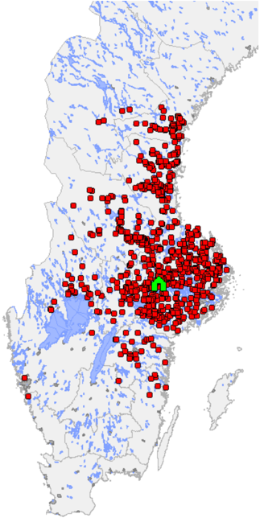

In the PVRP, customers specify a service frequency and sets of allowable combinations of visit days. For example, if a customer specifies a frequency of 2 and the combinations { 1, 3 } and { 2, 4 } , then the customer wishes to be visited twice, on days 1 and 3, or on days 2 and 4. In the DMPVRP, visit frequencies are equal to 1 and visit combinations are made up of consecutive days. The PVRP is usually solved heuristically. The best known algorithms for this problem are those of Cordeau, Gendreau and Laporte (1997) and of Hemmelmayr, Doerner and Hartl (2009). Francis, Smilowitz and Tzur (2008) have solved a variant of the PVRP in which service frequency is a decision variable. Mourgaya and Vanderbeck (2007) have solved another variant that includes routing cost

minimization and daily workload balance.

Other routing problems with a dynamic component are often encountered in the context of dynamic pickup and delivery problems (Psaraftis, 1988; Mitrovi´c Mini´ c, Krishnamurti and Laporte, 2004; Branke et al. 2005; Hvattum, Løkketangen and Laporte, 2006, 2007; Pureza and Laporte, 2008), but these papers do not consider a multi-period horizon. For recent literature reviews, see Larsen, Madsen and Solomon (2008), and Berbeglia, Cordeau and Laporte (2009).

Another strand of literature relevant to our problem is about the Multi-Objective Vehicle Routing Problem encountered in school bus routing (Pacheco and Marti, 2006; Alabas-Uslu, 2008), waste collection (Lacomme, Prins and Sevaux, 2006), and hazardous products transportation (Dell'Olmo, Gentili and Scozzari, 2005; Zografos and Androutsopoulos, 2008; Tan, Chew and Lee, 2006). The two main solution strategies for multi-objective problems are the scalar technique, which consists in minimizing a weighted linear combination of the objectives, and the Pareto method which identifies a set of non-dominated solutions. We refer to Jozefowiez, Semet and Talbi (2008) for a recent survey of these methods in the context of vehicle routing.

In this paper we formulate the DMPVRP as a mixed integer linear program using the scalar technique. We then develop a three-phase heuristic for its solution, and we show that our approach can yield high quality solutions within reasonable running times. The remainder of the paper is organized as follows. The mathematical model is described in Section 2. The heuristic is described in Section 3, followed by computational results in Section 4 and by conclusions in Section 5.

## B.2 Mathematical Problem Description

We start with a more detailed description of the DMPVRP. To capture the problem more precisely, we also formulate it as a mixed integer linear program.

## B.2.1 Problem description and analysis

The DMPVRP is solved over a planning horizon divided into days. Customer orders arrive at any time and must be fulfilled within a set of consecutive service days which can start as early as the day after the order is placed. A set of homogeneous vehicles are available at the depot. These vehicles depart from

the depot at 00.00 and return to the depot at the latest at 23.59 on the same day. The objectives are to minimize the total routing cost (proportional to travel time) and customer waiting, and to balance the daily workload over the planning horizon. Each customer must be visited exactly once by one vehicle within its feasible service period, each vehicle must depart from and return to the depot in the same day, and the load of each vehicle cannot exceed its capacity.

This problem is dynamic in the sense that orders are revealed incrementally over time. The daily planning must determine which orders should be fulfilled on that day and in which sequence the vehicles should visit the customers. These decisions are made without the knowledge of future orders. However, even if the problem is dynamic, the routing problem at the beginning of each particular day over the planning horizon can be viewed as a static problem since the routes for that day are planned based on the orders known so far and the routes are fixed before their execution.

Figure B.2 illustrates the planning process for a small DMPVRP example consisting of two days. For simplicity, we assume that the demand of each order is one, the capacity of the vehicle is three, and two vehicles are available. Before the first day, as shown in (a), six orders are already logged in the system. Three of these, denoted by triangles, can be fulfilled either on the first day or the second day, while the other three can only be served on the first day. At the beginning of the planning horizon, the planner has to construct the routing plan for the first day, as shown in (b). Before the second day is planned, three new orders have arrived, as shown in (c). The routes for the second day are shown in (d).

This example illustrates that the challenging part of the problem is to decide on the first day whether to serve the triangle orders, or whether to postpone them until the second day without knowing which orders will arrive during the first day. On the one hand, if the new orders are destined for locations close to those of the triangle orders, it may be wise to postpone them so as to minimize the total travel time. On the other hand, if too many orders are postponed, customer waiting is prolonged and the feasibility of the next day's solution may be jeopardized due to the limited available vehicle capacity.

## B.2.2 Mathematical formulation

The planning for each particular day can be regarded as a special case of the PVRP with unit visit frequency and consecutive allowable delivery periods. Without loss of generality, we present the formulation for the planning problem on day t ( t ∈ T , where T = { 1 2 , , . . . , r } denotes the planning horizon). Denote

Figure B.2: A small instance of the DMPVRP


the updated planning horizon on day t by T ′ = { t, t + 1 , . . . , r } , the set of known but unvisited orders by N = { 1 2 , , . . . , n } , and the set of vehicles by K = { 1 2 , , . . . , m } . The depot is located at 0 and the set of all locations is N 0 = N ∪ { 0 } . The parameter c ij represents the travel time on arc ( i, j ) ∈ A , where A is the set of arcs between all the locations in N 0 . Each order i specifies a demand q i and a service time d i . We denote the original consecutive feasible service days for order i by { a , . . . , b i i } . Note that the first feasible day has to be adjusted to a ′ i = max { t, a i } when planning on day t . Each vehicle has a capacity Q and each route has a duration limit D . The binary variables x t ijkl denote the decisions made on day t . They are equal to 1 if and only if vehicle k travels from i to j on day l . The constraints are defined as follows:

<!-- formula-not-decoded -->

| ∑ i ∈ N ∑ j :( i,j ) ∈ A q i x t ijkl ≤ Q                 | ∀ k ∈ K,l ∈ T ′ (B.2)        |
|-----------------------------------------------------------|------------------------------|
| ∑ i ∈ N ∑ j :( i,j ) ∈ A ( c ij + d i ) x t ijkl ≤ D      | ∀ k ∈ K,l ∈ T ′ (B.3)        |
| ∑ j ∈ N x t 0 jkl = 1                                     | ∀ k ∈ K,l ∈ T ′ (B.4)        |
| ∑ i :( i,h ) ∈ A x t ihkl - ∑ j :( h,j ) ∈ A x t hjkl = 0 | ∀ h ∈ N,k ∈ K,l ∈ T ′ (B.5)  |
| ∑ i ∈ N x t i 0 kl = 1                                    | ∀ k ∈ K,l ∈ T ′ (B.6)        |
| x t ijkl 0 , 1                                            | ( i, j ) A,k K,l T ′ . (B.7) |

∈ {

}

∀

∈

∈

∈

Constraints (B.1) ensure that each customer is visited once by exactly one vehicle within its feasible service days. Constraints (B.2) guarantee the vehicle capacity limit is not exceeded. The duration limit on each route is ensured by constraints (B.3). Constraints (B.4)-(B.6) state that each vehicle must start and end its route at the depot and that flow is conserved at each customer location. Constraints (B.7) define the binary variables.

The first objective, minimizing the total travel time of visiting the orders in N , can be formulated as

<!-- formula-not-decoded -->

To minimize the total customer waiting, for each customer having multiple feasible service days, we assign a penalty for not visiting it on the first of its feasible service days. This penalty increases quadratically with customer waiting time, and goes up to 1 if the customer is visited at the end of its feasible service days, as shown in Figure B.3. This penalty function favors short waiting times for several customers, as opposed to long waiting times for a few. For example, letting three customers wait for one day is preferable to letting one customer wait for three days if all of them have the same time window length. Additionally, we use a ′ i instead of a i to reset the penalty function every day for the unvisited customers and thus treat the unvisited customers and the new customers equally. Let N ′ denote the set of customers having multiple feasible service days, and let the integer variable y t i be the day when customer i is visited. The second objective can be formulated by:

<!-- formula-not-decoded -->

where

<!-- formula-not-decoded -->

Figure B.3: Penalty curve

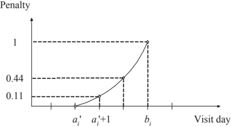

The third objective, balancing the daily workload over the planning horizon, is more difficult to define since future orders are unknown. In a static problem, this objective can be achieved by minimizing the total deviation of daily workload, where a single day's workload deviation is measured by the absolute value of the difference between that day's workload and the average daily workload over the planning horizon. However, in the dynamic case, it is unwise to allocate the known orders evenly to all future days of the planning horizon. Instead, it seems preferable to focus on the workload of the current day, since we have the complete knowledge of the orders accumulated at the beginning of that day. Moreover, since the actual average daily workload cannot be obtained until the end of the planning horizon, we use an estimate of the average daily workload, denoted by ˜ , based on historical data. The third objective is hence formulated w t as:

As mentioned, scalar techniques and the Pareto method are the two most used strategies for multi-objective optimization. However, in a dynamic context, the Pareto method is inappropriate because even if it were possible to determine a set of Pareto optimal solutions, it would be necessary to implement one of these before the next day's planning, without guidelines on how to make this selection. We have therefore opted to implement the scalar method with weights, 1, w 2 and w 3 , for objective f t 1 , f t 2 and f t 3 , respectively, and we work with the aggregate objective

<!-- formula-not-decoded -->

<!-- formula-not-decoded -->

## B.3 A Three-Phase Rolling Horizon Heuristic

We propose a three-phase rolling horizon heuristic to handle the dynamic aspect of the problem. Planning on day t starts with adjusting the set of feasible service days for the yet unvisited customers, including those revealed on day t -1. A three-phase heuristic (TPH) is then applied to construct the delivery plan for that day. In order to minimize the total travel time over the planning horizon, instead of only planning the routes for day t , the TPH also optimizes the routes for τ days in the future. Let T t = { t, . . . , t + τ } be the planning horizon considered on day t . Phase I selects the customers to be visited within T t . The selection is necessary because the feasible service days of the customers may not be entirely included in T t . To this end, we perform a time-space correlation analysis on the known customers. In Phase II, given the customers selected for period T t , routes are constructed by treating the planning problem as a PVRP with a service frequency equal to 1 over the planning horizon T t . This routing problem is solved by means of a variable neighborhood search heuristic. In Phase III, the routes to be executed on day t are postoptimized by means of a tabu search algorithm, and the customers visited on day t are removed from further consideration. This three-phase scheme is summarized in Algorithm 3.

## Algorithm 3 : Rolling horizon framework

- 1: Input: the set N new t of customers revealed on each day t ∈ T 2: Output: the routing plan R = { R , . . . , R 1 | T | } for horizon T 3: N ←∅ 4: for t = 1 to | T | do 5: AdjustVisitDays( N ) 6: N ← N ∪ N new t -1 7: N t ← SelectCustomers( N ) // Phase I 8: { R , . . . , R t t + τ } ← RouteCustomer( N t , T t ) // Phase II 9: R t ← Optimize( R t ) // Phase III 10: N ← N \ { i : i ∈ R t } 11: R←R∪ R t 12: end for

In the TPH, τ is a user-defined parameter. A small value of τ results in a planning problem of small size for the subsequent solution phases and hence reduces the computational burden, whereas a large value of τ helps optimize the total routing cost over the planning horizon. A sensitivity analysis on τ is conducted in Section 4.

## B.3.1 Phase I: Customer selection

The customer selection phase attempts to determine a good set of customers to be visited in the future τ days without relying on routing information. The 'good' set is judged only by travel time, since the total travel time is the most important objective of interest and this phase only performs a rough selection of customers in the future τ days. The other two objectives will be mainly considered in the second phase. The customer selection is achieved by analyzing the time-space correlation between the known customers, as shown in Algorithm 4. More specifically, for each customer i we define a compatibility index q il for each of its allowable service days, where l ∈ { a , . . . , b ′ i i } . A larger value of q il corresponds to a higher visit preference for day l . The parameter is determined as follows. First set q il equal to 0 for all customers and feasible service days. Now consider two customers i and j having common allowable service days. If c ij ≤ ρ then both q il and q jl are increased by 1 / c ( ij + ) δ ε ( l ∈ { a , . . . , b ′ i i }∩{ a , . . . , b ′ j j } ), where ρ , δ and ε are user-defined parameters. A smaller c ij results in a larger increment (see Figure B.4). For each customer i , the day with the highest compatibility index is selected as the best service day. The customers whose best service days lie within T t are selected for visit during that horizon. This procedure is described as Algorithm 4.

```
Algorithm 4 : Phase I (Customer selection) 1: Input: the set of known customers N 2: Output: the set of customers N t to be visited within period T t 3: for i = 1 to | N | do 4: for l = a ′ i to b i do 5: q il ← 0 6: end for 7: end for 8: for i = 1 to | N | -1 do 9: for j = i +1 to | N | do 10: if c ij ≤ ρ and { a , . . . , b ′ i i } ∩ { a , . . . , b ′ j j } /negationslash = ∅ then 11: for l ∈ { a , . . . , b ′ i i } ∩ { a , . . . , b ′ j j } do 12: q il ← q il +1 ( / c ij + ) δ ε 13: q jl ← q jl +1 ( / c ij + ) δ ε 14: end for 15: end if 16: end for 17: end for 18: for i = 1 to | N | do 19: v i ← arg min l ∈{ a ,...,b ′ i i } q il 20: end for 21: N t ←{ i : v i ∈ T t }
```

ε

Figure B.4: The increment value curve for different value of δ and ε

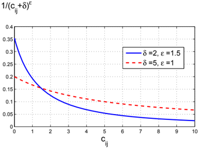

## B.3.2 Phase II: Variable neighborhood search

The aim of the Phase II is to construct routes for customers on each day of T t . The objective in this phase is to minimize the total travel time, the total customer waiting and balance the daily workload. This problem is treated as a PVRP with frequency 1, where the planning horizon is { t, t + 1 , . . . , t + τ } , and each selected customer i must be served with frequency 1 between day max { t, a i } and day min { t + τ, b i } . The PVRP is solved by means of a variable neighborhood search heuristic (see Algorithm 10), made up of three components: initialization, local search and shaking. An initial solution is first constructed by means of a sweep heuristic. The local search phase is based on a tabu search (TS) algorithm that uses simple insertion moves to transfer customers from their route to another route. For each customer, all possible reinsertion positions are attempted and the one leading to the minimum objective value is selected. If TS fails to find a feasible solution within a preset number of iterations, it is assumed that the customer set selected in Phase I is too large and a customer with the largest number of remaining feasible service days is removed from N t . If TS fails to improve the solution within a preset number θ of iterations, it restarts from another solution provided by a shaking phase, based on a ruin and recreate approach (RRA) (Schrimpf et al., 2000; Pisinger and Ropke, 2007). This procedure is initiated from the best known solution and attempts to iteratively improve it by removing ξ % of the customers that have the largest removal costs, and reinserting them by means of the regret insertion method described in Algorithm 6. If the RRA finds a better solution or fails to improve the best solution after κ iterations, TS is reapplied to it. Phase II stops after ω iterations.

Algorithm 5 : Phase II (Variable neighborhood search)

```
1: Input: the set of customers N t to be visited within period T t 2: Output: the solution s /star 3: s ← SweepHeuristic( N t ) 4: s /star ← s 5: iteration ← 0 6: while iteration < ω do 7: counter ← 0 8: while counter < θ do 9: ( s, N t ) ← TabuSearch( s, N t ) 10: iteration ← iteration +1 11: if s < s /star then 12: counter ← 0 13: s /star ← s 14: else 15: counter ← counter +1 16: end if 17: end while 18: counter ← 0 19: s ← s /star 20: while counter < κ do 21: s ← RRA( s, ξ ) 22: iteration ← iteration +1 23: if s < s /star then 24: s /star ← s 25: break 26: else 27: counter ← counter +1 28: end if 29: end while 30: end while 31: return s /star
```

## B.3.3 Phase III: Postoptimization

Phase III aims to minimize the total travel time on day t . This problem is a Capacitated Vehicle Routing Problem which is solved by the TS heuristic of Cordeau, Gendreau and Laporte (1997). In this algorithm, intermediate infeasible solutions are allowed during the search and are controlled by means of a penalized objective f ′ ( s, t ) = c s, t ( )+ αq s, t ( )+ βd s, t ( ), where c s, t ( ) is the total travel time by all vehicles on day t , and q s, t ( ) = ∑ k ∈ K ( ∑ ( i,j ) ∈ A q x i t ijkt -Q ) + and d s, t ( ) = ∑ k ∈ K ( ∑ ( i,j ) ∈ A ( c ij + d i ) x t ijkt -D ) + are the total violations of the capacity and duration constraint on day t , where ( x ) + = max 0 { , x } . The coefficients α and β are positive self-adjusting penalties. It should be noted that

## Algorithm 6 : Phase II (Ruin and recreate heuristic)

/negationslash

- 1: numToRemove is the number of customers to be removed and reinserted 2: N t is the set of customers in the solution s 3: Input: current solution s 4: Output: updated solution s 5: N Rem ←∅ 6: while | N Rem | &lt; numToRemove do 7: for i ∈ N t do 8: RC i ← CalculateRemovalCost( , i s ) 9: end for 10: i /star ← arg min i ∈ N t RC i 11: s ← RemoveCustomer( i /star , s ) 12: N Rem ← N Rem ∪{ i /star } 13: N t ← N t \ { i /star } 14: end while 15: while N Rem = ∅ do 16: for i ∈ N Rem do 17: bestIC i ← CalculateBestInsertionCost( , i s ) 18: secondIC i ← CalculateSecondBestInsertionCost( , i s ) 19: end for 20: i /star ← arg max i ∈ N Rem ( secondIC i -bestIC i ) 21: s ← InsertCustomer( i /star , s ) 22: N Rem ← N Rem \ { i /star } 23: end while

the effect of postoptimization on workload balance is negligible compared with that on total travel time because the weight assigned to the travel time in the objective function is much larger, as will be seen later in Section B.4. Therefore, the postoptimization of total travel time is also a further optimization in the overall objective stated in equation (B.12).

## B.4 Computational Results

The heuristic just described was implemented in C and executed on a Linux computer with lx24-amd64 architecture and two Gbytes of RAM. The data and parameters used in our tests are first described. Sensitivity analyses on the parameters used in the heuristic are then performed. Finally we provide the results of our tests on the Lantm¨ annen data, which can be accessed via the Internet at http://www2.imm.dtu.dk/~mw/dmpvrpData/ .

## B.4.1 Data and parameters

Real-world data were collected from Lantm¨nnen. There are altogether 11 data a sets, five of which involve a 10-day planning horizon and six involve a 15-day planning horizon. On average 80 orders are received every day. The number of feasible service days ranges from one to 15 and is equal to 2.5 on average. Figure B.5 shows the distribution of the number of days elapsed between the day at which an order is placed and the first feasible service day. Most customers order two or three days before the start of the service period. The average demand of the orders is 6,306kg, and the vehicles have a capacity of 40,000kg. We use Euclidian distances and assume the vehicle speed is 45km/hour.

Figure B.5: Distribution of the number of days before the start of the service period when customers call in

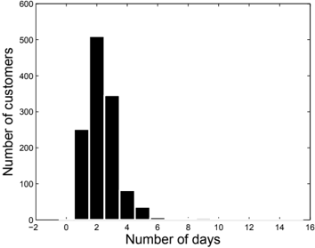

Based on preliminary tests, parameters ρ , δ and ε in Phase I of the TPH were set to 60, 2 and 1.5, respectively. The maximum numbers of non-improving iterations for the TS and the RRA of Phase II, i.e., parameters θ and κ , were set to 10 2 and 10 , respectively. 4 In the RRA, between 25% and 35% of the customers are removed and reinserted in each iteration. The estimated daily workload for objective function f t 3 in Equation (B.11) is obtained from the workload of the previous five days and is updated adaptively for each planning day.

## B.4.2 Sensitivity analyses

This section describes the sensitivity analyses that were performed to assess the behaviour of the TPH.

## Number of days to plan in TPH

As mentioned in Section 3, the TPH not only plans the routes for day t , but also for τ days in the future. We tested the TPH with different values of τ on 11 instances. Figure B.6 illustrates the convergence of the TPH for three different values of τ . When τ equals 1 or 2, Phase I selects approximately 33% or 50% of the customers, respectively. The results show that τ = 1 is not sufficient but τ = 2 works very well. With a short running time (less than four minutes), τ = 2 even provides better results than τ = ∞ . This is because within a given short running time, the problem of smaller size can be better optimized due to a more thorough search, and the correlation analysis provides good candidates for the customers that should be visited within the next two days.

Figure B.6: Sensitivity analysis of number of planning days ( τ )

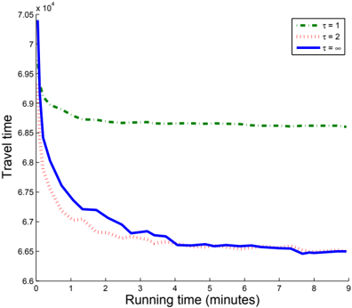

## Effectiveness of correlation analysis

To further demonstrate the effectiveness of correlation analysis, we compare the results obtained with correlation analysis to those using a random scheme. In the random scheme, we assume each customer is randomly and uniformly assigned to one of its feasible service days, and customers assigned to the first τ days

are selected. Figure B.7 shows the comparison between the two schemes. The horizontal axis is the instance index and the vertical axis gives the total travel time over the planning horizon by using a random selection scheme or correlation analysis. The running time is set at four minutes. For all 11 instances, the solutions provided by the correlation analysis are consistently better than those obtained by the random selection scheme.

Figure B.7: Comparison between correlation analysis and random selection scheme

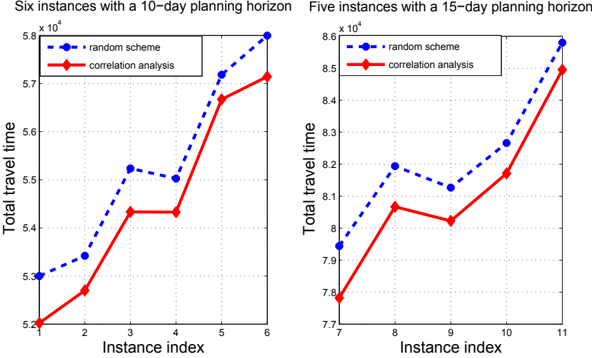

## Results for the multi-objective function

In this experiment, we assess the effectiveness of the TPH to handle the multiple objectives. Table B.1 shows the values of the first objective, i.e., total travel time (denoted by F 1 ), and of the second objective, i.e., total customer waiting (denoted by F 2 ), with different values of w 2 ranging from 0 to 20. Column ' F 1 ' and ' F 2 ' are the total travel time over the planning horizon and the total number of waiting days for all customers over the planning horizon, respectively. The last row 'Average' shows the average values for the 11 instances. As w 2 increases from 0 to 20, the total customer waiting is reduced by half on average, whereas the total travel time increases only slightly, by less than 1 %. Figure B.8 depicts the relative changes of total travel time and total customer waiting as a function of w 2 .

Similar results are obtained for the total travel time and for the total workload deviations with increasing values of w 3 , as shown in Table B.2 and Figure B.9. In Table B.2, column ' F 3 ' is the sum of deviations between each day's duration

Figure B.8: Relative changes in total travel time and total customer waiting as a function of the weight w 2 assigned to customer waiting time

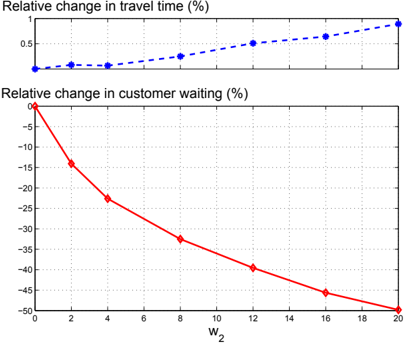

and the average daily duration, over the planning horizon. The last row shows the average values for the 11 instances. As can be seen from the results, when w 3 increases from 0 to 0.6, the average workload deviation decreases by more than 70%, whereas the total travel time only increases by approximately 0.5%. We also note that the rate of deviation reduction decreases as w 3 increases. In Figure B.9, within the interval 0 4 . ≤ β ≤ 0 6, . the deviation reduction curve is nearly flat and the deviation reduction is insignificant. This is because the objective function f t 3 used in the TPH minimizes the difference between the workload on day t and an estimation of the average daily workload instead of the actual average workload.

## B.4.3 Comparison between TPH solutions and solutions obtained with the company's platform

Lantm¨ annen already works with high quality solutions obtained by running their vehicle routing software for 12 minutes each day on their latest platform. Their software can deal with various practical restrictions. In order to establish a fair comparison, we have used their software to solve our simplified problem based on Euclidean distances with the same real-life data. We refer to these

Figure B.9: Relative changes in total travel time and total workload deviation as a function of the weight w 3 assigned to daily workload deviation

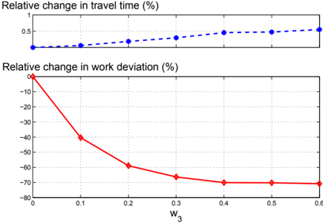

solutions as the 'company's solutions'. We have also run our algorithm for 12 minutes on a similar computer, but the improvement obtained after four minutes is insignificant. Comparative results are presented in Table C.7. Based on the preliminary tests on the combinations of the parameters w 2 and w 3 , we found that their influence on the total travel time is very little. A good setting is w 2 = 4 and w 3 = 0 15 in order to keep the total travel time change at an . insignificant level while reducing total customer waiting and improving workload balance as much as possible.

Ten random runs for each instance are performed for our algorithm to obtain the average value of the total driving time, total customer waiting, and daily workload deviation. These statistics are provided in the columns 'Average total duration', 'Average total customer waiting' and 'Average total workload deviation', respectively. The best value of the total travel time within the 10 random runs are also presented in column 'Best total duration'. The results provided by the company's platform are for a single run. The average values for all the instances are given in the last row. Regarding the total duration, our average value for 10 runs is slightly better (by 0.2%) than that of the company's solutions, probably because both solutions are very close to optimality. However, the TPH significantly improves customer waiting and workload deviation by up to 24% and 35%, compared with the solutions obtained by using the company's platform. We also found the best solutions for all instances. This is a clear sign of the effectiveness of our heuristic. One should bear in mind, however, that customer waiting and daily workload balance may not have been optimized by the company. In addition, the company's solutions used in the comparison are

not those that Lantm¨ annen uses in the real life since its daily solutions are generated under several practical restrictions.

## B.5 Conclusion

We have considered a real-life dynamic multi-period and multi-objective routing problem encountered by a large distributor operating in Sweden. The planning horizon consists of several periods and the problem considers three objectives, including minimization of the total travel time, minimization of customer waiting, and daily workload balancing over the planning horizon. We have presented a mixed integer linear programming formulation for the problem, and we have proposed a three-phase heuristic embedded within a rolling horizon scheme. The main idea of the heuristic is to wisely select the customers to be visited in the near future, and to route these customers so that the overall travel time can be minimized efficiently. The choice of customers to be routed on a given day is performed rather effectively through a time-space correlation analysis. The multiple objectives are handled by the scalar technique. The method was implemented and tested on real-life data. Results show that the proposed TPH provides very high quality solutions within a reasonable running time. The results are also compared with the solutions produced by the company's platform. The comparison shows that our method improves upon those solutions in terms of travel time, customer waiting and daily workload balance, with gains of 0.2%, 24% and 35%, respectively. Our method is general and applies to other contexts.

## Acknowledgements

This work was partly supported by the Canadian Natural Sciences and Engineering Research Council under grants 227837-04 and 39682-05. This support is gratefully acknowledged. We thank the anonymous referees for their valuable comments.


time

Table B.2: Total travel time and total workload deviation for the tests with different values of the weight w 3 assigned to balance daily workload

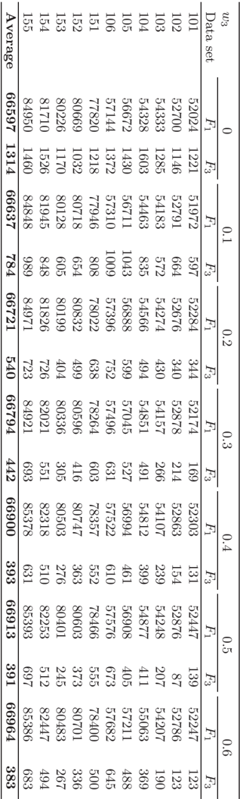

| Average Average     | total workload deviation   | 588       | 693         |   530 |   721 |   812 | 716 710     |   627 |   518 |   756 |   740 | 673     |
|---------------------|----------------------------|-----------|-------------|-------|-------|-------|-------------|-------|-------|-------|-------|---------|
| solution            | total customer             | waiting   | 330 312     |   408 |   372 |   344 | 352 632     |   618 |   604 |   526 |   552 | 459     |
| TPH                 | Best total                 | duration  | 51679 52163 | 53711 | 54089 | 56009 | 56740 77320 | 79963 | 79342 | 81321 | 83992 | 66029   |
|                     | Average total              | duration  | 52064 52663 | 54128 | 54439 | 56429 | 57211 77706 | 80303 | 79730 | 81711 | 84540 | 66447   |
|                     | Total workload             | deviation | 729 844     |  1231 |  1117 |   535 | 606 1170    |   978 |   312 |  1315 |  1060 | 900     |
| Company's solutions | Total customer waiting     | 382       | 369         |   560 |   444 |   440 | 411 759     |   828 |   767 |   713 |   685 | 578     |
|                     | Total duration             |           | 51958 52702 | 53727 | 54299 | 56476 | 57729 77362 | 81135 | 79600 | 82164 | 85270 | 66584   |
|                     |                            | | T |     | 10 10       |    10 |    10 |    10 | 10 15       |    15 |    15 |    15 |    15 | Average |
| set                 | set                        | Data      | 101 102     |   103 |   104 |   105 | 106 151     |   152 |   153 |   154 |   155 |         |

Table B.3: Comparison between the Lantm¨nnen solutions and the TPH solutions a

## References

Alabas-Uslu, C. (2008). A self-tuning heuristic for a multi-objective vehicle routing problem. Journal of the Operational Research Society , 59(7):988-996.

Angelelli, E., Speranza, M.G., Savelsbergh, M.W.P. (2007). Competitive analysis for dynamic multi-period uncapacitated routing problems. Networks , 49(4):308-317.

Angelelli, E., Bianchessi, N., Mansini, R., Speranza, M.G. (2009). Short term strategies for a dynamic multi-period routing problem. Transportation Research Part C , 17(2):106-119.

Berbeglia, G., Cordeau, J.-F., Laporte, G. (2009). Dynamic pickup and delivery problems. forthcoming in European Journal of Operational Research .

Branke, T., Middendorf, M., Noeth, G., Dessouky, M. (2005). Waiting strategies for dynamic vehicle routing. Transportation Science , 39(3):298-312.

Cordeau, J.-F., Gendreau, M., Laporte, G. (1997). tabu search heuristic for periodic and multi-depot vehicle routing problems. Networks , 30(2):105-119.

Dell'Olmo, P., Gentili, M., Scozzari, A. (2005). On finding dissimilar Paretooptimal paths. European Journal of Operational Research , 162(1):70-82.

Francis, P.M., Smilowitz, K.R., Tzur, M. (2008). The period vehicle routing problem and its extensions. In Golden, B., Raghavan, S., and Wasil, E., editors, The vehicle routing problem: Latest advances and new challenges . Springer.

Hemmelmayr, V.C., Doerner, K.F., Hartl, R.F. (2009). A variable neighborhood search heuristic for periodic routing problems. European Journal of Operational Research , 195(3):791-802.

| Hvattum, L.M., Løkketangen, A., Laporte, G. (2006). Solving a dynamic and stochastic vehicle routing problem with a sample scenario hedging heuristic. Transportation Science , 40(4):421-438.                                             |
|--------------------------------------------------------------------------------------------------------------------------------------------------------------------------------------------------------------------------------------------|
| Hvattum, L.M., Løkketangen, A., Laporte, G. (2007). A branch-and-regret heuristic for stochastic and dynamic vehicle routing problems. Networks , 49(4),:330-340.                                                                          |
| Jozefowiez, N., Semet, F., Talbi, E.-G. (2008). Multi-objective vehicle routing problems. European Journal of Operational Research , 189(2):293-309.                                                                                       |
| Lacomme, P., Prins, C., Sevaux, M. (2006). A genetic algorithm for a bi- objective capacitated arc routing problem. Computers &Operations Research , 33(12):3473-3493.                                                                     |
| Larsen, A., Madsen, O.B.G., Solomon, M.M. (2008). Recent developments in dynamic vehicle routing systems. In Golden, B., Raghavan, S., and Wasil, E., editors, The vehicle routing problem: Latest advances and new challenges . Springer. |
| Mitrovi´-Mini´, c c S., Krishnamurti, R., Laporte, G. (2004). Double horizon based heuristics for the dynamic pickup and delivery problem with time windows. Transportation Research Part B , 38(8):669-685.                               |
| Mourgaya, M., Vanderbeck, F. (2007). Column generation based heuristic for tactical planning in multi-period vehicle routing. European Journal of Oper- ational Research , 183(3):1028-1041.                                               |
| Pacheco, J., Mart´, ı R. (2007). Tabu search for a multi-objective routing problem. Journal of the Operational Research Society ,57(1):29-37.                                                                                              |
| Psaraftis, H.N. (1998). Dynamic vehicle routing problems. In Golden, B.L., Assad, A.A., editors, Vehicle Routing: Methods and Studies . North-Holland, Amsterdam.                                                                          |
| Pisinger, D., Ropke, S. (2007). A general heuristic for vehicle routing problems. Computers & Operations Research , 34(8):2403-2435.                                                                                                       |
| Pureza, V., Laporte, G. (2008). Waiting and buffering strategies for the dynamic pickup and delivery problem with time windows. INFOR , 46(3):165-175.                                                                                     |
| Schrimpf, G., Schneider, J., Stamm-Wilbrandt, H., Dueck, G. (2000). Record breaking optimization results using the ruin and recreate principle. Journal of Computational Physics , 159(2):139-171.                                         |
| Tan, K.C., Chew, Y.H., Lee, L.H. (2006). A hybrid multi-objective evolutionary algorithm for solving truck and trailer vehicle routing problems. European Journal of Operational Research , 172(3):855-885.                                |

Zografos, K.G., Androutsopoulos, K.N. (2008). A decision support system for integrated hazardous materials routing and emergency response decisions. Transportation Research Part C , 16(6):684-703.

Appendix C

A multi-level variable neighborhood search heuristic for a practical Vehicle Routing and Driver Scheduling Problem

Technical Report, DTU Management.

## A multi-level variable neighborhood search heuristic for a practical vehicle routing and driver scheduling problem

Min Wen, Emil Krapper, Jesper Larsen and Thomas K. Stidsen

Department of Management Engineering, Technical University of Denmark, Produktionstorvet DTU-Building 426, DK-2800 Kongens Lyngby, Denmark

## Abstract

The world's second largest producer of pork, Danish Crown, also provides a fresh meat supply logistics system within Denmark. This is used by the majority of supermarkets in Denmark. This paper addresses an integrated vehicle routing and driver scheduling problem arising at Danish Crown in their fresh meat supply logistics system. The problem consists of a one-week planning horizon, heterogeneous vehicles, and drivers with predefined work regulations. These regulations include, among other things, predefined workdays, fixed starting time, maximum weekly working duration, and a break rule. The objective is to minimize the total delivery cost, which is a weighted sum of two kinds of delivery costs. The real-life case study is first introduced and modelled as a mixed integer linear program. A multi-level variable neighborhood search heuristic is then proposed for the problem. At the first level, the problem size is reduced through an aggregation procedure. At the second level, the aggregated weekly planning problem is decomposed into daily planning problems, each of which is solved by a variable neighborhood search. At the last level, the solution of the aggregated problem is expanded to that of the original problem. The method is implemented and tested on real-life data consisting of up to 2000 orders per week. Computational results show that the aggregation procedure and the decomposition strategy are very effective in solving this large scale problem, and our solutions are superior to the industrial solutions given the constraints considered in this work.

Keywords: vehicle routing, driver scheduling, Variable Neighborhood Search, node aggregation.

## C.1 Introduction

Supplying supermarkets with different types of saleable items (fresh meat, milk, fruit etc.) is expensive. Different types of goods have different requirements and hence a typical supermarket is generally supplied by several trucks on a daily basis. Each truck is a part of a transport system which can be expensive to operate. Hence a number of supermarkets, from different supermarket chains in Denmark, are supplied fresh meat by the same distributor, Danish Crown. In this paper, we consider a Multi-Period Vehicle Routing and Driver Scheduling Problem arising in the fresh meat logistics system at Danish Crown when supplying a large number of supermarkets, more than 800, in Denmark.

The supermarkets place their orders with specified demand for different days of the week before the week starts. The distributor then makes a weekly delivery plan for the drivers and vehicles so that the orders are delivered, the drivers' working regulations are respected and the total travel cost is minimized.

Danish Crown is the largest producer of fresh meat in Denmark. It slaughters over 20 million pigs and 0.5 million pieces of livestock each year. Its pork production is the largest in Europe and the second largest in the world. In addition, Danish Crown is responsible for the delivery of fresh meat to supermarkets all over Denmark every day. There are two distribution terminals placed in Kolding and Ringsted, operating independently. In this project, we consider the Kolding terminal. It receives more than 2000 orders every week and delivers meat to over 800 supermarkets across western Denmark. Figure C.1 shows the locations of the customers and of the terminal. The total amount of meat delivered varies from day to day, ranging from 60 tons to 300 tons. As a result, the need for drivers varies as well. Danish Crown has a number of drivers who work on regular workdays with a fixed number of hours every week. For busier days, Danish Crown needs to hire drivers with their own trucks from external transportation companies to take the routes that can not be covered by the limited number of their own drivers.

The literature on the integrated Vehicle Routing and Crew Scheduling Problem (VRCSP) is rather limited. To our best knowledge, the most relevant work is that of Zaepfel and Boegl (2008). They addressed a weekly planning problem for postal companies, in which pickup tours and delivery tours must be decided for vehicles and drivers based on variable vehicle capacities and drivers' working regulations. Similar to our work, they also considered the driving rules and different types of drivers with different costs and working regulations. In their work, a solution framework was proposed, which consists of four parts: initialization, route generation, personnel assignment and solution evaluation. The framework was tested with two guiding metaheuristics, Tabu Search and Genetic

Figure C.1: Locations of customers and depot (represented by a square) in the Danish Crown case study

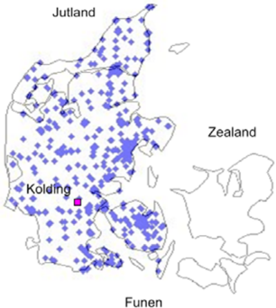

Algorithm. The Tabu Search procedure was found to be competitive in solving their application. Another integrated vehicle routing and driver scheduling problem that has been studied in the literature is about the urban mass transit system, in which the buses and drivers are scheduled to serve a number of trips defined by a timetable (Huisman et al. (2005), Huisman and Wagelmans (2006), Freling et al. (2003), and Mesquita and Paias (2008)). Most of the solution methods for the VRCSP in the urban mass transit system are based on Column Generation and Lagrangian Relaxation. The integrated aircraft routing and crew scheduling problem is also relevant. This problem is solved by the Benders decomposition in Cordeau et al. (2001b), Mercier and Soumis (2007), Papadakos (2009), which decomposes the integrated problem into an aircraft routing problem and a crew pairing problem.

The vehicle routing part of our problem can be viewed as a Heterogeneous Vehicle Routing Problem with Time Windows (HVRPTW) in which a limited number of heterogeneous vehicles, characterized by different capacities, are available and the customers have a specified time window for service. The HVRPTW is usually solved by heuristics. The best known algorithms for this problem include: adaptive large neighborhood search (Pisinger and Ropke (2007)), variable neighborhood search (Paraskevopoulos et al. (2008), Imran et al. (2009)) and simulated annealing (Li et al. (2007), Braysy et al. (2008)). Choi and Tcha (2007) proposed an exact method based on column generation for the problem.

For a recent literature review, see Baldacci et al. (2008).

The remainder of this paper is organized as follows. The MPVRCSP arising at the Danish Crown is defined in Section 2. In Section 3, the problem is formulated as a mixed integer linear program. A multi-level variable neighborhood search method is proposed in Section 4. Section 5 presents the computational results on the real-life data and conclusions follow in Section 6.

## C.2 Problem Description

The problem is to determine routes for delivering fresh food to a set of supermarkets (or customers) every day over a one-week planning horizon. The routes are planned for a fleet of heterogeneous vehicles and a number of drivers with predefined working regulations. This distribution problem is very complicated in practice and involves many special restrictions. In this work, we simplified the real-life problem by only considering the major constraints.

A number of practical issues are considered regarding the delivery. First of all, each customer can order a different amount of meat every day, measured in weight (Kg) and volume (pallets). Each vehicle has limited capacities both in weight and in volume. Secondly, each customer has a certain time window for receiving its order. Finally, certain special customers have requirements on the vehicle size. This is usually because of small roads or limited parking lot sizes. If an inappropriate vehicle type is used to serve such a customer, the driver usually needs to park some distance from the supermarket. This results in additional service time, which is proportional to the number of pallets ordered.

There are two categories of drivers hired to carry out the delivery: internal and external drivers. The internal drivers are employed by Danish Crown. They work on predefined workdays and for no more than a maximum weekly working duration (37 hours) over a week. As changing the predefined working days requires formal negotiation with the drivers and their union, they are considered fixed in this project. The external drivers and their trucks are hired from external transportation companies and contracted at fixed hourly price. Both the internal and external drivers start working at specified times and must finish before given latest ending times. The drivers cannot drive for more than 4.5 hours without a 45-minute break according to the EU driving legislation.

Several different types of costs are considered in this problem. We assume that the internal drivers have regular salaries according to their contracts. Hence only the fuel cost of the routes assigned to the internal drivers are considered,

which depends on the distance travelled and the cost per kilometer. The external drivers are contracted at a fixed price every hour, which covers both the salary for the driver and the vehicle cost. Therefore, the cost of the routes assigned to the external drivers is calculated by multiplying the route duration and the fixed hourly price.

The objective can therefore be described to minimize the fuel cost of the routes taken by the internal drivers and the cost of the routes taken by the external drivers over the planning horizon in such a way that each order must be served by one vehicle within its time window, vehicle capacities are not exceeded, each driver starts working at a predefined time and finishes before a given time on every workday, the internal drivers work for no more than a maximum weekly duration over the planning horizon, and the break rule regarding the driving legislation is respected.

This problem integrates vehicle routing and driver scheduling. The complexity of this problem can be characterized in many aspects: the multiple periods, the heterogeneous vehicles, different types of drivers with different working regulations and the simultaneous planning of vehicles and drivers. Note that the orders on different days are fixed. The only constraint connecting the routes on different days is therefore the maximum 37 weekly hours for the internal drivers. This means that a certain driving schedule for an internal driver on one day will affect the maximum duration of the driver on the remaining days. Without this constraint, this weekly planning problem can be viewed as several independent daily planning problems, each of which considers the vehicle routing and crew scheduling problem on a single day, namely the daily planning problem. This property is utilized in the solution method described in Section 4, and helps solving the large size problem effectively and efficiently.

## C.3 Mathematical Formulation

This section presents a mixed integer linear programming formulation for the MPVRCSP. We denote the planning horizon by T and the set of drivers by D . The set of workdays for driver l ∈ D is denoted by T l ⊆ T . The start working time and latest ending time for driver l ∈ D on day t ∈ T are given by g t l and h t l , respectively. Let D I and D E denote the set of the internal and external drivers ( D = D I ∪ D E ). For each internal driver l ∈ D I , let H denote the maximum weekly working duration. We denote the maximum elapsed driving time without break by F and the duration of a break by G (according to the EU driver legislation).

Let K denote the set of vehicles. For each vehicle k ∈ K , let Q k and P k denote the capacity in weight and in volume, respectively. We assume the number of vehicles equals to the number of drivers. Denote the set of n customers (/nodes) by N = { 1 2 , , ..., n } . Denote the depot by { 0 , n +1 . Each vehicle starts from } { 0 } and terminates at { n +1 . Each customer } i ∈ N specifies a set of days to be visited, denoted by T i ⊆ T . On each day t ∈ T i , customer i ∈ N requests service with demand of q t i in weight and p t i in volume, service duration d t i and time window [ a , b i i ]. Note that, for the depot i ∈ { 0 , n + 1 } on day t , we set q t i = p t i = d t i = 0. Denote the set of preferable vehicles for visiting customer i by K i ( K i ∈ K ) and the extra service time per pallet by e if a customer is not visited by a preferable vehicle. The travel time between customer i and j is given by c ij . Denote the cost coefficients of the travel time of the internal drivers by A and the working duration of the external drivers by B .

We define binary variable x t ijk to be 1 if vehicle k travels from node i to j on day t , binary variable w t i to be 1 if customer i is not visited by a preferred vehicle on day t . Variable v t ik is the time that vehicle k visits node i on day t . Binary variable z t ik indicates whether vehicle k takes a break after serving customer i on day t . Variable u t ik is the elapsed driving time for vehicle k at customer i after the previous break on day t . Binary variable y t lk is set to 1 if vehicle k is assigned to driver l on day t . Variables r t l and s t l are the total working duration and the total travel time for driver l on day t , respectively.

This notation can be summarized as follows:

| Set:          |                                                       |
|---------------|-------------------------------------------------------|
| T             | The set of workdays in the planning horizon,          |
| D I           | The set of internal drivers,                          |
| D E           | The set of external drivers,                          |
| D             | The set of drivers D = D I ∪ D E ,                    |
| T l           | The set of workdays for driver l ∈ D ,                |
| K             | The set of vehicles,                                  |
| N             | The set of customers,                                 |
| N 0           | The set of customers and depot N 0 = { 0 , n +1 } ∪ N |
| K i           | The set of preferable vehicles for customer i ∈ N ,   |
| T i           | The set of days on which customer i ∈ N orders,       |
| Parameter:    |                                                       |
| Q k           | The weight capacity of vehicle k ∈ K ,                |
| P k           | The volume capacity of vehicle k ∈ K ,                |
| c ij          | The travel time from node i ∈ N 0 to node j ∈ N 0 ,   |
| [ a i , b i ] | The earliest and the latest visit time at node i N ,  |

The earliest and the latest visit time at node i ∈ N ,

| d t i             | The service time of node i ∈ N 0 on day t ∈ T i ,                                                              |
|-------------------|----------------------------------------------------------------------------------------------------------------|
| q t               | The weight demand of node i ∈ N 0 on day t ∈ T i ,                                                             |
| p t i             | The volume demand of node i ∈ N 0 on day t ∈ T i ,                                                             |
| e                 | The extra service time per pallet when a non-preferable vehicle is used,                                       |
| [ g t l , h t l ] | The start time and the latest ending time of driver l ∈ D on day t ∈ T ,                                       |
| H                 | The maximum working duration for each internal driver over the planning horizon,                               |
| F                 | The maximum elapsed driving time without break,                                                                |
| G                 | The duration of the break for drivers,                                                                         |
| A                 | The cost factor on the total travel time of internal drivers,                                                  |
| B                 | The cost factor on the total working duration of the external drivers,                                         |
| Variables:        |                                                                                                                |
| x t ijk           | Binary variable indicating whether vehicle k ∈ K travels from node i ∈ N 0 to j ∈ N 0 on day t ∈ T ,           |
| w t i             | Binary variable indicating whether customer i ∈ N 0 is visited by a non-preferable vehicle on day t ∈ T ,      |
| v t ik            | The time at which vehicle k ∈ K starts service at node i ∈ N 0 on day t ∈ T ,                                  |
| z t ik            | Binary variable indicating whether vehicle k ∈ K takes break after serving node i ∈ N 0 on day t ∈ T ,         |
| u t ik            | The elapsed driving time of vehicle k ∈ K at node i ∈ N 0 after the previous break on day t ∈ T ,              |
| y t lk            | Binary variable indicating whether vehicle k ∈ K is assigned to driver l ∈ D on day t ∈ T ,                    |
| r t l s t         | The total working duration of driver l ∈ D on day t ∈ T , The total travel distance of driver l D on day t T . |

- r t l ∈ ∈ s t l The total travel distance of driver l ∈ D on day t ∈ T .

The mathematical formulation for this problem is presented as follows:

<!-- formula-not-decoded -->

<!-- formula-not-decoded -->

<!-- formula-not-decoded -->

<!-- formula-not-decoded -->

<!-- formula-not-decoded -->

| ∑ j ∈ N 0 x t 0 jk = 1                                                               | ∀ k ∈ K,t ∈ T (C.6)                                            |
|--------------------------------------------------------------------------------------|----------------------------------------------------------------|
| ∑ i ∈ N 0 x t ihk - ∑ j ∈ N 0 x t hjk = 0                                            | ∀ h ∈ N,k ∈ K,t ∈ T (C.7)                                      |
| ∑ i ∈ N 0 x t i,n +1 ,k = 1                                                          | ∀ k ∈ K,t ∈ T (C.8)                                            |
| u t jk ≥ u t ik + c ij - M (1 - x t ijk ) - Mz t ik u t jk ≥ c ij - M (1 - x t ijk ) | ∀ i, j ∈ N 0 , k ∈ K,t ∈ T (C.9) ∀ i, j ∈ N,k ∈ K,t ∈ T (C.10) |
| u t ik + ∑ j ∈ N 0 c ij x t ijk - F ≤ Mz t ik                                        | ∀ i ∈ N 0 , k ∈ K,t ∈ T (C.11)                                 |
| v t jk ≥ v t ik + d t i + e · p t i · w t j + c ij + G · z t ik - M (1 - x t ijk )   | ∀ i, j ∈ N 0 , k ∈ K,t ∈ T (C.12)                              |
| ≥ ≥ ∑ k K y t lk = 1                                                                 | ∀ ∈ ∈ ∈ ∀ l D,t T l (C.14)                                     |
| ∈                                                                                    | ∈ ∈                                                            |
| ∑ l ∈ D y t lk = 1                                                                   | ∀ k ∈ K,t ∈ T (C.15)                                           |
| v t 0 k ≥ ∑ ( g t l · y t lk )                                                       | ∀ k ∈ K,t ∈ T (C.16)                                           |
| ∈ v t n +1 ,k ≤ ∑ ( h t l · y t lk )                                                 | ∀ k ∈ K,t ∈ T (C.17)                                           |
| ∈ s t l ≥ ∑ ∈ 0 ∑ ∈ 0 c ij x t ijk - M (1 - y t lk )                                 | ∀ l ∈ D I , k ∈ K,t ∈ T l (C.18)                               |
| r t l ≥ v t n +1 ,k - g t l - M (1 - y t lk )                                        | ∀ l ∈ D,k ∈ K,t ∈ T l (C.19)                                   |
| ∑ r t l ≤ H                                                                          | ∀ l ∈ D I (C.20)                                               |
| ∈ x t ijk , w t i , z t ik , y t lk ∈ { 0 , 1 } v t ik , u t ik , r t l , s t l 0    | ∈ N 0 , l ∈ D,k ∈ K,t ∈ T (C.21) N 0 , l D,k K,t T (C.22)      |

The objective function (C.1) minimizes weighted sum of the travel time of the internal drivers and the working duration of the external drivers over the planning horizon.

The constraints can generally be divided into two classes: one focuses on the vehicle routing (constraints (C.2-C.8) and (C.12-C.13)) and the remaining emphasizes the driver scheduling.

Constraints (C.2) state that each customer must be visited by one vehicle on each of its delivery days. Constraints (C.3) define whether each customer is visited by a preferable vehicle. Constraints (C.4-C.5) guarantee that the vehicle capacities are respected in both weight and volume. Constraints (C.6-C.8) ensure that each vehicle must start and terminate at the depot and that the flow is conserved at each customer on each day.

Constraints (C.9-C.10) define the elapsed driving time. More specifically, for the vehicle ( k ) travelling from customer i to j on day t , the elapsed driving time at j equals the elapsed driving time at i plus the driving time from i to j (i.e., u t jk ≥ u t ik + c ij ) if the vehicle does not take a break at customer i (i.e., z t ik = 0); Otherwise, if the vehicle takes a break at customer i (i.e., z t ik = 1), the elapsed driving time at j will be constrained by (C.10) which make sure it is greater than or equal to the travel time between i and j (i.e., u t jk ≥ c ij ). Constraints (C.11) guarantee that the elapsed driving time never exceeds an upper limit F by imposing a break at customer i (i.e., z t ik = 1) if driving from customer i to its successor results in a elapsed driving time greater than F .

Constraints (C.12) determine the time to start the service at each customer. If j is visited immediately after i , the time v t jk to start the service at j should be greater than or equal to the service starting time v t ik at i plus its service duration d t i , the extra service time e · p t i if i is visited by an inappropriate vehicle (i.e., w t j = 1), the travel time between the two customers c ij , and the break time G if the driver takes a break after serving i (i.e., z t ik = 1). Constraints (C.13) make sure the services start within the customers' time window.

Constraints (C.14) assign each driver a route on each of his/her workday. Constraints (C.15) make sure each route on each day is assigned to exactly one driver. Constraints (C.16-C.17) ensure that the starting time and ending time of each route must lie between the start working time and latest ending time of the assigned driver. Constraints (C.18) calculate the total travel time for each internal driver. Constraints (C.19) define the working duration for each driver on every workday, which equals the time the driver returns to the depot minus the time he/she starts work. Constraints (C.20) make sure that the internal drivers work for no more than a maximum weekly working duration, referred to as 37 week-hour constraints. Constraints (C.21-C.22) define the binary and positive variables used in this formulation.

The formulation contains O N ( | | 2 | K T || | ) variables and O N ( | | 2 | K T || | ) constraints. Without Constraints (C.9-C.11) and (C.14-C.20), the problem can be reduced to a multi-period Heterogeneous Vehicle Routing Problem with Time Windows, which has already been proved to be NP-hard. Therefore, our problem is also NP-hard.

## C.4 Multi-level Variable neighborhood search heuristic

We propose to solve this problem using a heuristic. Firstly, the problem is NPhard and secondly we foreseen that the size of the problems that needs to be solved makes an exact approach prohibitive. The proposed method is named Multi-Level Variable Neighborhood Search heuristic (MLVNS) and illustrated in Figure C.2.

Figure C.2: The flowchart of the MLVNS.

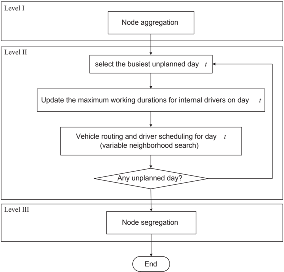

The MLVNS consists of three levels. The first level reduces the problem size through a node aggregation procedure. The second level constructs the solution to the aggregated problem. To reduce the computational overhead, we decompose the weekly planning problem into six daily planning problems, which are then solved sequentially in a given order. Before a specific daily problem is solved, the maximum daily duration of each internal driver is updated based on the 37 week-hour constraints and the workload that has been assigned to the

driver on the previously planned days. Given the updated information on the internal drivers, the daily distribution plan is determined by means of a variable neighborhood search. At the last level, the solution of the aggregated problem is expanded to a solution for the original problem and the time to visit each customer is determined.

In the remainder of this section, the aggregation procedure is described in Section 4.1. How to update the maximum daily durations for the internal drivers is described in detail in Section 4.2. The variable neighborhood search that is applied to solve the daily planning problem is presented in Section 4.3. The overall method is summarized in Section 4.4.

## C.4.1 Aggregation procedure

The basic idea of the aggregation procedure is to reduce the problem size by combining several nodes (customers) to a single supernode. The nodes to be aggregated are selected by analyzing their time windows, demands, and the travel times between them. Intuitively, it is preferable to visit supermarkets located close to each other, if possible, by the same vehicle in order to minimize the total travel distance. We hence treat such supermarkets as one supernode in order to reduce the size of the planning problem.

Our aggregation procedure is an iterative process. If two nodes i and j are located close enough (i.e. c ij ≤ ρ or c ji ≤ ρ ), have sufficient overlap in time windows (i.e. min b , b { i j } -max a ,a { i j } &gt; δ ) and the total amount of their orders is no more than κ 1 and κ 2 in weight and volume, they become a candidate pair to be aggregated. At each iteration, the set of candidate pairs is found and the pair with the shortest distance is firstly aggregated. If the aggregation feasibility check fails, the aggregation is revoked and the candidate pair with the second shortest distance is tried to be aggregated. This attempt continues until one pair is aggregated successfully and then a new iteration begins. If no pair can be aggregated or the set of candidate pairs is empty, the aggregation procedure stops.

Every aggregation forms a supernode, which replaces the original two node(s) /supernode(s). The newly aggregated supernode, denoted by h , can be represented by a chain of basic nodes, denoted as { h , ..., h 1 f } . The first node h 1 is called the entry point and the last node h f the exit point. The entry point and the exit point are used to update the distance between h and the rest of nodes/supernodes. The distances from h to the rest of nodes/supernodes are set to be the distances from h f to them. Similarly, the distances from the rest of nodes/supernodes to h are set to be the distances from them to h 1 .

The demand of the aggregated node is calculated as the sum of the demands of the nodes in the chain. The internal distance of h is calculated as c h = ∑ i ∈{ 1 ,...,f - } 1 c h ,h i i +1 . For simplicity, the earliest start time to serve h is set to the maximum starting times of the nodes included in h , i.e., a h = max i ∈{ 1 ,...,f } a h i Since certain customers have special requirements on the vehicle size, we define the internal duration of h visited by vehicle k as d k h , which is the sum of total travel time, total service time and total additional service time caused by using vehicle k . The internal duration d h of the supernode is set to d h = max k ∈ K h d k to ensure the feasibility of the solution. The latest visit time of h is defined as b h = min i ∈{ 1 ,...,f } ( b h i -d h ). For each new supernode after aggregation, if its b h is greater than a h , the aggregation is regarded as 'feasible' and otherwise 'infeasible'. It should be stressed that, in our algorithm, the way to select the candidate pairs of nodes to be aggregated and the way to define the time window for the newly aggregated supernode are simple and greedy. In a general context, two nodes to be aggregated do not have to overlap in their time windows. Since we only aggregate the nodes that are located very close to each other and the customers usually have loose time windows in our problem, this aggregation procedure works effectively and is able to reduce the problem size significantly.

In the aggregation procedure, the parameters ρ , δ , κ 1 and κ 2 control the degree of aggregation. Increasing the values of ρ , κ 1 and κ 2 , or decreasing the value of δ results in more aggregation of nodes. Generally, aggressive aggregation leads to a problem with small size and quick convergence. However, it also narrows down the feasible region, and may decrease the solution quality. The effects of the aggregation on solution quality and computational time are investigated in Section 5.

## C.4.2 Updating driver duration

In order to accelerate the algorithm, we decompose the weekly planning problem into several daily problems and solve these daily problems sequentially. When decomposing, we only need to consider how to distribute the 37 weekly hours to each workday of the internal drivers. To respect this constraint, a maximum daily duration is imposed for each internal driver on each workday. There are several ways to determine this maximum daily duration.

A simple way is to evenly distribute the 37 hours to each workday, namely an even allocation strategy. This can be achieved by setting maximum daily duration M l to 37 hours divided by the number of workdays for each internal driver l on each workday. In this case the internal drivers will never be assigned for more than 37 working hours over the week. However, since this simple strategy fails to take the significant variation of daily workload into account,

.

some internal drivers might be idle on days with lower demand, while a lot of external drivers have to be hired for busier days.

In order to overcome this, we propose another strategy which adaptively determines the maximum daily duration before each daily plan is made, namely an adaptive allocation strategy. Based on the observation on the data that a larger number of customers generally lead to a longer overall duration, we can assume that the day with more orders is a 'busier' day. We first sort the days according to the number of orders and plan the busy days ahead of the quiet days. For a specific day t , if internal driver l works on day t (i.e., t ∈ T l ), we determine his/her unplanned work duration W l by subtracting the total work duration already assigned to driver l on the previous planned days from the 37 hours and determine the number of unplanned workdays U l for driver l . If day t is the last workday to be planned for l (i.e., U l = 1), M l is set to W l so that the 37 week-hour constraints are respected. Otherwise, if U l &gt; 1, W l is set to W/U l l +Θ, where W/U l l is the average daily workload for the remaining unplanned days, and Θ is a user defined parameter. An appropriate value of Θ gives a degree of flexibility in the plan and leads to a good utilization of internal drivers on busy days since the daily problems are solved in descending order of workload. The adaptive allocation strategy is summarized in Algorithm 7 and a comparison of the two strategies is conducted in Section 5.

## Algorithm 7 : Level II (Update daily work duration for internal drivers for day t )

/negationslash

```
1: Input: The planning day t ; The set of routes R = { R , . . . , R 1 | T | } 2: Output: The maximum daily work duration M = { M ,..., M 1 | D I | } for day t 3: for l = 1 , . . . , | D I | do 4: U l ← GetTotalWorkDays( ) l 5: W l ← H 6: for i ∈ T \ { } t do 7: if ( R i = ) &( ∅ i ∈ T l ) then 8: σ ← GetPlannedDailyWorkDuration( R , l i ) 9: W l ← W l -σ 10: U l ← U l -1 11: end if 12: end for 13: if U > l 1 then 14: M l ← W /U l l +Θ 15: else 16: M l ← W /U l l 17: end if 18: end for
```

## C.4.3 Variable Neighborhood Search

The VNS was first introduced by Mladenovic and Hansen (1997) to 'exploit systematically the idea of neighborhood change, both in the descent to local minima and in the escape from the valleys which contains them' (Hansen and Mladenovic (2001), Hansen and Mladenovic (2005)). During the past decade, this method has been successfully applied to a wide range of rich vehicle routing problems (Paraskevopoulos et al. (2008), Imran et al. (2009), Hemmelmayr et al. (2009)).

In this work we also develop a VNS to solve the daily planning problem which is an integrated vehicle routing and driver scheduling problem. The proposed VNS consists of three components: initialization, a shaking phase, and a local search. An initial solution is constructed and improved iteratively. In each iteration, one of five large neighborhoods is first exploited in order to diversify the search, referred to as shaking phase, and a local search is then applied in order to find the local optima. These components and the overall framework of the VNS are detailed below.

## C.4.3.1 Initialization

Our initial solution is generated by means of a sweep heuristic, as shown in Algorithm 8. We first assign each vehicle a random driver and sort the nodes in an ascending order of the angle they make with the depot and an arbitrary radius. The nodes are then assigned to the vehicles sequentially. For each unrouted node, it is assigned to the vehicle considered currently if the vehicle capacities and the corresponding driver's duration are not exceeded or if the vehicle is the last available vehicle. Otherwise, the node is assigned to a new vacant vehicle.

## Algorithm 8 : Level II (Initialization of VNS)

- 1: Sort the customers in an ascending order of the angle they make with the depot and an arbitrary radius { 1 , ..., n }
- 2: Assign each vehicle a random driver
- 3: Set the first vehicle k:= 1.
- 4: for i = 1 , ..., n do
- 5: if insertion of i to k results in violation of capacities or duration constraints then
- 6: k ← min k { +1 -K- . , }
- 7: end if
- 8: Insert i to k so as to minimize the total travel time of k .
- 9: end for

## C.4.3.2 Local Search

The local search in our VNS is performed by the Unified Tabu Search Algorithm (UTSA) (Cordeau et al. (2001a)). The UTSA allows intermediate infeasible solutions during the search by means of a penalized objective f ( s, t ) = c s, t ( ) + αp s, t ( ) + βq s, t ( ) + γd s, t ( ) + ξw s, t ( ), where c s, t ( ) is the delivery cost on day t , p s, t ( ) = ∑ k ∈ K ( ∑ i ∈ N ∑ j ∈ N 0 p x i t ijk -P k ) + and q s, t ( ) = ∑ k ∈ K ( ∑ i ∈ N ∑ j ∈ N 0 q x i t ijk -Q k ) + are the total violations of the capacities in weight and in volume on day t , d s, t ( ) = ∑ k ∈ K ( v t n +1 ,k -∑ l ∈ D h t l · y t lk ) + is the total violation of the daily duration of all the drivers on day t , and w s, t ( ) = ∑ i ∈ N ( v t ik -b i ) + is the total violation of the service time window on day t , where ( x ) + = max { 0 , x } . The coefficients α β , , γ and ξ are positive self-adjusting penalties. A simple insertion is employed to improve the solution iteratively, which transfers customers from their original routes to other routes. The UTSA stops when the solution is not improved for a given number of iterations ϕ .

## C.4.3.3 Shaking phase

Five large neighborhoods are proposed for the shaking phase. The first three are based on the Ruin and Recreate Approach (RRA) (Schrimpf et al. (2000), Pisinger and Ropke (2007)). The basic idea of the RRA is to diversify the search by removing a number of bad customers from the current solution according to a removal scheme and then reinsert them into the routes again based on a reinsertion scheme. All these three neighborhoods use the same reinsertion scheme, i.e., regret heuristic (Potvin and Rousseau (1993), Ropke and Pisinger (2006)), but different removal schemes.

The first neighborhood uses a worst removal heuristic which selects a certain percentage ( θ ) of customers with the largest removal costs (Ropke and Pisinger (2006)). The removal cost of a customer is defined to be the change in the solution value when it is removed from the route. This neighborhood is named the Worst Removal Neighborhood and denoted by WRN. The second neighborhood removes the customers covered by the external driver with the shortest working duration, namely the Driver Removal Neighborhood (DRN). The neighborhood helps not only to minimize the cost caused by using the external drivers but also reduce the number of vehicles used. The third neighborhood, Overlap Removal Neighborhood (ORN), removes all the customers in those routes that have the largest overlapping areas. The area of a route is defined as the area of the smallest rectangle that covers the depot and all the customers on that route. The areas of routes may overlap with each other. We define the overlapping area of each route to be the sum of its overlapping areas with all the other routes. In

the ORN, we sort all the routes in a descending order of the overlapping area and remove the customers on the first λ routes. Since most of the customers have wide time windows, reducing the overlapping areas of routes may lead to a better solution. Such an example is illustrated in Figure C.3, where, for simplicity, we consider two vehicles with capacity 4 and seven customers with unit demand. The solution before reducing the overlapping area is shown in (a). The area of each route in the solution and the overlapping area are defined in (b). The solution after reducing the overlapping area is depicted in (c) and the overlapping area is given in (d). As we can see from this small example, reducing the overlapping area leads to a better solution with smaller travel distance.

After the removal of customers, a regret heuristic, as detailed in Algorithm 9, is applied to reinsert the removed customer into the routes. For each node in the node set to be reinserted, a regret value is determined, which is defined as the difference in the cost of inserting it to the best position and the second best position. The node with the largest regret value is selected, inserted to the best position, and removed from the node set. This procedure repeats until the node set is empty.

## Algorithm 9 : Level II (Regret heuristic for the WRN, DRN and ORN in VNS)

- 1: N Rem is the set of nodes to be inserted into solution s
- 2: while N Rem = ∅ do

/negationslash

- 4: bestIC i ← CalculateBestInsertionCost( , i s )
- 3: for i ∈ N Rem do
- 5: secondIC i ← CalculateSecondBestInsertionCost( , i s )
- 6: end for
- 7: i /star ← arg max i ∈ N Rem ( secondIC i -bestIC i )
- 9: N Rem ← N Rem \ { i /star }
- 8: s ← InsertCustomer( i /star , s )
- 10: end while

The other two neighborhoods are constructed by a swap move. The fourth neighborhood, Swap Driver Neighborhood (SDN), swaps the drivers to find a good match between the drivers and the routes in terms of starting time and ending time. Similarly, the last neighborhood, Swap Truck Neighborhood (STN), swaps vehicles, as shown in Figure C.4. In the SDN (/STN), all possible pairs of drivers (/vehicles) are tried and the pair that leads to the minimum objective value is selected and applied.

To sum up, the five neighborhoods proposed for the shaking phase fall into two categories. The first three, WRN, DRN, and ORN, emphasize the construction of good routes, whereas the other two, SDN and STN, focus on assigning the right vehicles and right drivers to the routes. A sensitivity analysis on the effects

of these neighborhoods is conducted in Section 5.

Figure C.3: An example of two solutions with different overlapping areas

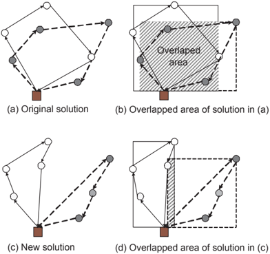

Figure C.4: An example of swapping vehicles

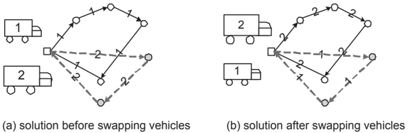

## C.4.3.4 VNS framework

The overall framework of the VNS is given in Algorithm 10. Set L = { WRN, DRN,ORN,SDN,STN } denotes the set of five large neighborhoods used in the shaking phase. Set L ′ denotes the set of available neighborhoods during the search procedure. The VNS starts with the initial solution given by the sweep heuristic and improves the solution iteratively until the stop criteria reached. In each iteration, it exploits a neighborhood selected from L ′ and updates the current solution with a solution from the selected neighborhood. The UTSA is

then applied on the neighboring solution and it stops when the best solution found so far has not been improved within ϕ iterations. There are two possible values, ϕ 1 and ϕ 2 ( ϕ 1 &lt; ϕ 2 ), for parameter ϕ depending on whether the UTSA is supposed to search thoroughly (i.e., ϕ = ϕ 2 ) or not (i.e., ϕ = ϕ 1 ). If the best solution found by the UTSA ( s /star UTSA /star ) is better than the best solution found in the previous VNS iteration ( s /star ), s is updated by s /star UTSA and the boolean parameter improved is set to True , meaning that the best solution is improved in the current VNS iteration. Otherwise, improved is set to False . The VNS stops once a certain time limit τ has been reached.

## Algorithm 10 : Level II (VNS framework)

- 1: Input: The planning day t ; The set of customers N t to be planned on day t ; The maximum duration M for internal drivers on day t .

```
2: Output: The route plan R t for day t . 3: improved ← False 4: L ′ ← L 5: s ← SweepHeuristic( N t ) 6: while CPUTime ≤ τ do 7: if improved then 8: ϕ ← ϕ 1 9: L ′ ← L 10: else 11: L ′ ← L ′ \ { currentL } 12: if L ′ = ∅ then 13: ϕ ← ϕ 2 14: L ′ ← L 15: end if 16: if SDN ∈ L ′ then 17: currentL ← SDN 18: else 19: currentL ← FindLongestUnused( L ′ ) 20: end if 21: end if 22: s ← ApplyLNS( currentL,s, M ) 23: ( s, s /star UTSA ) ← TabuSearch( s, M, ϕ ) 24: if s /star UTSA is better than s /star then 25: s /star ← s /star UTSA 26: improved ← True 27: else 28: improved ← False 29: end if 30: end while 31: R t ← s /star 32: return R t
```

it adaptively selects a neighborhood in the shaking phase at each iteration. The parameter ϕ is initialized by the small value ϕ 1 , and L ′ by L . If the best solution ( s /star ) is updated in the previous iteration (i.e., improved = True ), the same neighborhood used in the previous iteration is applied again in the current iteration. Otherwise, if improved = False , the neighborhood used in the previous iteration is removed from the set of potential neighborhoods L ′ and another neighborhood from L ′ takes over. If the removal leads to an empty L ′ , which means the best solution has not been improved by the last five iterations, we set ϕ to be the large value ϕ 2 so that the UTSA will search thoroughly in future, and reset L ′ to be L so that all neighborhoods become available again. As soon as the best solution is updated, ϕ is set back to ϕ 1 and L ′ back to L . When selecting a neighborhood from L ′ , we first consider the SDN. If the SDN is not in L ′ , the neighborhood that has not been used for the longest time is selected. The reason of giving the SDN a higher preference is that the assignment of the right drivers to the routes is found to be very crucial due to the various starting times of the drivers, as we will show in Section 5. Besides, the three neighborhoods, WRN, DRN and ORN, as well as the UTSA all emphasize on the route optimization, therefore a higher selection probability of the SDN balances the optimization efforts on all aspects of the problem.

## C.4.4 Overall method

The overall MLVNS is summarized in Algorithm 11. Line (3-6), line (7-13) and line (14-16) correspond to Level I, II and III, respectively.

## C.5 Computational Results

In this section we present the computational experiments on the real-life data provided by Danish Crown. Our method was programmed in C# and executed on a Pentium 2.66GHz machine and two GB of memory. We first describe the data and parameters used in our tests and then present a sensitivity analysis of the parameters as well as a comparison between our solutions and Danish Crown's solutions.

Algorithm 11 : Multi-level variable neighborhood search heuristic

```
10: 11: 12: 13: 14: 15: 16: 17:
```

```
1: Input: The set of nodes N = { N ,. . . , N 1 | T | } 2: Output: The set of routes R = { R , ..., R 1 | T | } 3: for t = 1 , ..., | T | do 4: N t ← AggregationProcedure( N t ) 5: R t ←∅ 6: end for 7: daysPlanned ← 0 8: while daysPlanned < | T | do 9: t ← FindBusiestUnplannedDay( R ) M ← UpdateMaxWorkDuration( t, R ) // see Algorithm 7 R t ← VNS( N , M t ) // see Algorithm 10 daysPlanned ← daysPlanned +1 end while for t = 1 , ..., | T | do R t ← Expand( R t ) end for return R
```

## C.5.1 Data and parameters

There are data sets for four weeks, each of which consists of six workdays. As an example, Table C.1 shows the total number of orders and the total demand by volume and weight for each workday from 29/09/2008 to 04/10/2008. The length of time window (TW) in this week ranges from 1 hour to 24 hours and the histogram of the TW length is shown in Figure C.5. Approximately 40% of the orders have an 8-hour TW, most of which have [0.00, 8.00]. Roughly 35% of the orders have 2- to 4- hour time windows in the early morning, such as [6.00 8.00], [7.00 10.00] and [6.00 10.00]. Around 18% of the customers do not have any restriction on visiting time and can be visited at any time during the day. This is because Danish Crown has the electronic keys to access these supermarkets. The vehicle information is provided in Table C.2, including the sizes, the capacities and the numbers of the vehicles. Approximately 10% of the supermarkets have requirements on the vehicle size. There are 14 internal drivers and at most 14 external drivers used every day. All the internal drivers are fully used every day in our solution. Euclidean distances are used in our tests and we assume the vehicle speed is 60km/hour.

The value of each parameter used in the algorithm is set based on the preliminary tests. The minimum length ( ) for the overlap required between two time δ windows in order for two nodes to be aggregated is set to 60 minutes. The capacity parameters κ 1 and κ 2 are set according to the smallest vehicle, i.e., 7000 (KG) and 18 (pallets) respectively. The parameter Θ used in the adap-

tive allocation strategy in solving the daily problems is set to 60 minutes. The parameter θ in the WRN is set to 10%, i.e., 10% of customers are removed and reinserted again. The parameter λ in the ORN is set to 2, meaning that customers in two routes are removed. The iteration number ϕ 1 and ϕ 2 for the stop criteria in the TS are set to 350 and 1500, respectively.

|            |                  | Total demand   | Total demand   |
|------------|------------------|----------------|----------------|
| Date       | Number of orders | (Pallet)       | (Kg)           |
| 29/09/2008 | 279              | 329.5          | 84263.5        |
| 30/09/2008 | 381              | 439.5          | 125118.6       |
| 01/10/2008 | 365              | 399.0          | 124740.5       |
| 02/10/2008 | 364              | 434.5          | 124740.5       |
| 03/10/2008 | 397              | 577.0          | 170938.1       |
| 04/10/2008 | 360              | 483.0          | 144057.5       |

Table C.1: Orders from 29/09/2008 to 04/10/2008

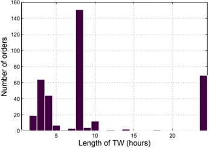

Figure C.5: The TW length of the customers

|        |                    | Capacity   | Capacity   |
|--------|--------------------|------------|------------|
| Type   | Number of vehicles | (Pallet)   | (Kg)       |
| Big    | 9                  | 33         | 14000      |
| Medium | 2                  | 27         | 10000      |
| Small  | 14                 | 18         | 7000       |

Table C.2: Vehicle Resource

## C.5.2 Sensitivity Analysis

The purpose of this section is to assess the behavior of the proposed heuristic and analyze the sensitivity of the parameters. The analysis can be classified into two categories. The first one focuses on the algorithm performance on daily problems. We tested the algorithm on six daily instances, including both busy days and easy days, and examined three aspects of the algorithm: the effectiveness of the node aggregation procedure, the effectiveness of using two alternative values for ϕ in the UTSA in the VNS, and the effects of the five large neighborhoods in the shaking phase of the VNS. The second group of tests evaluated the performance of the algorithm on solving weekly problems and provided the following results: a comparison of two work duration allocation strategies for decomposition and a comparison of the different number of the special supermarkets that have requirements on vehicle size.

## Effectiveness of the aggregation procedure

As mentioned in Section 4, before the solution is constructed, the problem size is first reduced through a node aggregation procedure in which pairs of nodes with a distance less than or equal to ρ are considered to be aggregated into a single supernode. We tested the algorithm with different values of ρ on six daily instances. Figure C.6 illustrates the convergence of the proposed heuristic for four values of ρ , 0, 2, 4 and 6. When ρ equals 0, no aggregation is done. When ρ equals 2, 4 or 6, the problem size is reduced by approximately 25%, 35% and 50%, respectively. Table C.3 shows the detailed results. Column ' Index ' is the test descriptor and column ' Time ' is the running time in minute for each test, ranging from 3 to 36 minutes. For each ρ , the column ' Average solution value ' reports the average solution value ¯ z ρ t on the six daily instances in test t . The column ' Conv.(%) ' shows the relative difference in the average solution value between test t -1 and t , calculated as fi z ρ t -fi z ρ t -1 fi z ρ t -1 · 100, which also indicates the speed of convergence with different values of ρ . The column ' Gap(%) ' provides the percentage gap between solution value of the aggregated problem ( ρ ′ = 2 4 6 ) { , , } and that of the original problem ( ρ = 0), calculated as fi z ρ ′ t -fi z ρ t fi z ρ t · 100. These gaps show how the solution value is influenced by different level of aggregation, depicted in Figure C.7.

As seen from Table C.3 and Figure C.6, a higher value of ρ yields a faster convergence to the solution since more of the feasible region is cut by the aggressive aggregation. With a short running time, the aggregated problem leads to a better solution due to an intelligent search in a smaller feasible region. For example, ρ = 6 provides better results than ρ = 0 when the running time is shorter than 20 minutes. However, given an enough computation time, the aggregated prob-

lem is not competitive to the original problem any more in terms of solution quality. For instance, the solution value provided by ρ = 0 is consistently better than that provided by ρ = 6 when the running time is larger than 20 minutes. A good trade-off between the running time and solution quality is obtained with ρ = 2. When ρ = 2, there are 2.57 nodes in a supernode on average. The largest supernode contains 7 nodes.

Figure C.6: Average solution value as a function of running time using different values of ρ

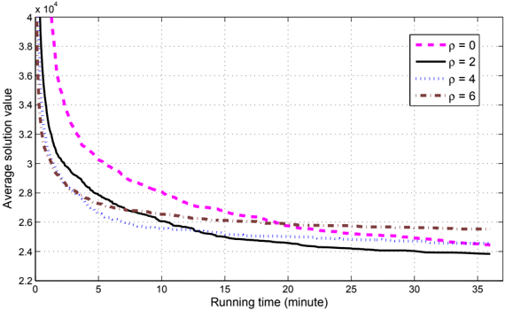

Figure C.7: Solution gap in percentage between the aggregated problems and the original problem

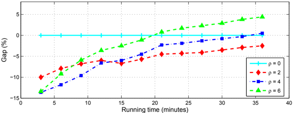

Effectiveness of using two alternative values for ϕ

The parameter ϕ in the stop criteria of UTSA is self-switched between two user defined values ϕ 1 and ϕ 2 ( ϕ 1 &lt; ϕ 2 ). We compare the performance of using two ϕ values (i.e., ϕ = { ϕ , ϕ 1 2 } ) with that of using solely one ϕ value (i.e., ϕ = ϕ 1 or ϕ = ϕ 2 ). Ten random runs on the six daily instances with different running times are performed. Given a running time t , we denote the average solution value with ϕ = ϕ 1 by ¯ z ϕ 1 ( ), t the average solution value with ϕ = ϕ 2 by ¯ z ϕ 2 ( ), t and the average solution value with ϕ = { ϕ , ϕ 1 2 } by ¯ z { ϕ ,ϕ 1 2 } ( ). t Figure C.8 shows the percentage gap between ¯ z ϕ 1 ( ) (and ¯ t z ϕ 2 ( )) and ¯ t z { ϕ ,ϕ 1 2 } ( ) as a function of t running time t . These gaps can be calculated as f ϕ 1 ( ) = t fi z ϕ 1 ( ) t -fi z { ϕ ,ϕ 1 2 } ( ) t fi z { ϕ ,ϕ 1 2 } ( ) t · 100 fi ( ) -fi ( )

(and f ϕ 2 ( ) = t z ϕ 2 t z { ϕ ,ϕ 1 2 } t fi z { ϕ ,ϕ 1 2 } ( ) t · 100). The results show that, given an enough computational time (more than 13 minutes), the solution of using two values of ϕ is consistently better than that of using solely one value. The improvement is approximately 2%.

Figure C.8: Solution gap in percentage between using two ϕ values and using solely one ϕ value

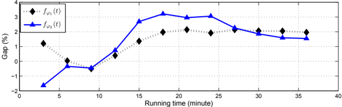

## Effect of the five large neighborhoods in the shaking phase in the VNS

We proposed five neighborhoods in the shaking phase of the VNS, including the WRN, DRN, ORN, SDN and STN. We evaluated the contribution of each neighborhood in this section and show the effect of combining the five neighborhoods. In Table C.4, column ' Index ' is the test descriptor and column ' Time ' is the running time in minute for each test, ranging from 3 to 36 minutes. For each neighborhood setting L , column ' Average solution value ' reports the average solution value ¯ z L t on the six daily instances in test t . Column ' Gap(%) ' presents the percentage gap in the average solution value between using one neighborhood L 1 and using five neighborhoods L , calculated as fi z L 1 t -fi z L t fi z L t · 100. Row ' Average ' provides the overall average value of each column. Figure C.9 shows gaps as a function of running time.

From Table C.4 and Figure C.9, we can see that, among all the five neighborhoods, the SDN is the most effective one. This is the reason why we give SDN

the highest selection probability in the shaking phase as mentioned in Section 4. The heuristic with all the five neighborhoods outperforms the heuristic with any single neighborhood by 0.6% to 3% given an enough computational time. On average, the SDN accounts for the largest portion, around 30% of the total number of calls of neighborhoods, and the ORN accounts for the least, around 14%. For the heuristic with different combinations of these neighborhoods, the performance is generally better when more neighborhoods are included.

Figure C.9: Solution gap in percentage between using different large neighborhood settings

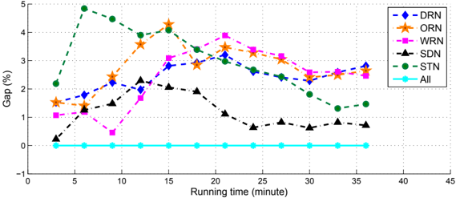

## Effectiveness of the adaptive allocation strategy

We compared the two allocation strategies, even allocation strategy and adaptive allocation strategy, used to distribute the 37 weekly hours to each workday for the internal drivers. The average solution values on the four weekly instances are provided in column ' Average solution value ' in Table C.5. The column ' Gap(%) ' shows the percentage gap between the solution values using the two strategies. Row ' Average ' shows the overall average value of each column. For all the tests, the adaptive allocation strategy consistently performs better than the even allocation strategy and improves the solution by 4.5% on average.

## Effect of the supermarkets that have requirements on vehicle size

In real life approximately 10% of the supermarkets have requirements on vehicle size, referred to as special supermarkets. To analyze the influence of these special supermarkets, in addition to the real-life case supplied by Danish Crown, we created two additional cases. In the first case we assume there is no special supermarket and the corresponding results are shown in column ' 0% of supermarkets '. In the second case, we randomly added vehicle size requirements to an additional 10% of the supermarkets from the real-life case so that altogether 20%

of supermarkets were special. The test results are presented in Table C.6. For each test, the average solution value, total distance, total duration and number of vehicles used are provided in column ' Average solution value ', ' Average total distance ', ' Average total duration ' and ' Number of vehicles ', respectively. Row ' Average ' shows the overall average value of each column. As we can see from the table, the number of special supermarkets has a large effect on the solution values. As the proportion of special supermarkets increases from 0% to 20%, the solution value, total travel distance and total route duration are increased by 21%, 5.7%, and 8.8%, respectively. More vehicles are required when there are a large number of special supermarkets.

## C.5.3 Comparison with industrial solution

Danish Crown also provided the routes they planned and executed for the four weekly instances. However, the only accessible information about their real-life plan is the list of customers served in every route on every day. The exact order in which and the time at which each customer is visited are not available. We therefore calculated a TSP lower bound on the travel distance for each route using Concorde (Appelgate et al. (2003)). These lower bounds are provided in column ' LB on travel distance ' in Table C.7. The first column gives the names of the data sets and the second column corresponds to the index of days in each week. The daily solutions as well as the summarized weekly solutions are provided. We also tested our algorithm on the same instances. The average solution value and the average travel distance on ten random runs are presented in column ' Average solution value ' and column ' Average travel distance '. The numbers of vehicles used in the two solutions are provided in columns ' Number of vehicles '. Column ' Gap(%) ' shows the percentage gap between travel distance (¯) z by our method and the lower bound ( ¯ z LB ) on the travel distance of the industrial solution, calculated as fi z -fi z LB fi z LB · 100. The results show that, our solution is superior to the industrial solution in terms of both the total travel distance and the number of vehicles used.

It also needs to be stressed that the TSP lower bound is a very poor lower bound on the travel distance since a lot of constraints are not considered in the TSP, such as the time windows, the working regulation and so on. Therefore, the actual difference between the two solutions is likely to be larger. However, one should bear in mind that the company's solutions are generated under more practical restrictions with more realistic parameters, such as the varying speed of the vehicles. In addition, the company may have set requirements on the robustness of the solutions for easy management of the resources, which is not considered in this paper.

## C.6 Conclusion

We have addressed a planning problem with integrated vehicle routing and driver scheduling which arises from a practical problem of Danish Crown. In this problem, a routing plan, consisting of six days in a week, has to be made for a fleet of heterogeneous vehicles to deliver the fresh meat to the supermarkets according to their demands and preferences, such as the visiting time and the preferable vehicle sizes. The route plan also needs to comply with the drivers' working regulations, such as the fixed workdays, the fixed starting time and latest ending time, the maximum weekly working duration, break rule and so on. The objective is to minimize the total delivery cost. We have presented a mixed integer linear programming formulation for the problem and a multi-level variable neighborhood search based heuristic for solving it. The first level of the proposed heuristic effectively reduces the problem size through a node aggregation procedure based on the locations, demands, and time windows of the nodes. The second level decomposes the aggregated weekly planning problem into six daily problems by wisely distributing the internal drivers' weekly workload to each workday and solves the daily problems sequentially by means of a variable neighborhood search. Two aspects of our VNS were proved to be very effective: the combination of five large neighborhoods in the shaking phase and the alternative usage of a short-term and long-term searching in the local search. At the last level, the solution of the aggregated problem is expanded to the solution of the original problem. The heuristic was implemented and tested on real-life data. Our solution is superior to the industrial solution in terms of the total travel distance and number of vehicles used.

## Acknowledgments

This work was financially supported by the FoodDTU project. This support is gratefully acknowledged. Thanks are also due to Jacob Vesterdorf at Danish Crown for providing problem information and the real-life data.

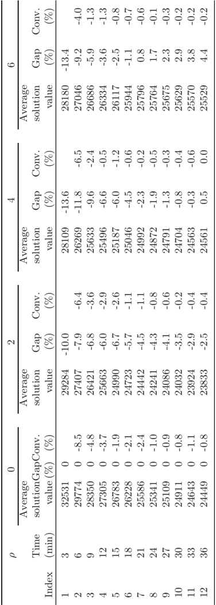

|       | Conv. (%)                              |         | -4.0         | -1.3         | -1.3         | -0.8         | -0.7         | -0.6         | -0.1         | -0.3                      | -0.2 -0.2    | -0.2         |
|-------|----------------------------------------|---------|--------------|--------------|--------------|--------------|--------------|--------------|--------------|---------------------------|--------------|--------------|
| 6     | Gap (%)                                | -13.4   | -9.2         | -5.9         | -3.6         | -2.5         | -1.1         | 0.8          | 1.7          | 2.3 2.9                   | 3.8          | 4.4          |
|       | Average solution value                 | 28180   | 27046        | 26686        | 26334        | 26117        | 25944        | 25796        | 25764        | 25675 25629               | 25570        | 25529        |
|       | Conv. (%)                              |         | -6.5         | -2.4         | -0.5         | -1.2         | -0.6         | -0.2         | -0.5         | -0.3 -0.4                 | -0.6         | 0.0          |
| 4     | Gap (%)                                | -13.6   | -11.8        | -9.6         | -6.6         | -6.0         | -4.5         | -2.3         | -1.9         | -1.3 -0.8                 | -0.3         | 0.5          |
|       | Average solution value                 | 28109   | 26269        | 25633        | 25496        | 25187        | 25046        | 24992        | 24872        | 24791 24704               | 24563        | 24561        |
|       | Conv. (%)                              |         | -6.4         | -3.6         | -2.9         | -2.6         | -1.1         | -1.1         | -0.8         | -0.6 -0.2                 | -0.4         | -0.4         |
| 2     | Gap (%)                                | -10.0   | -7.9         | -6.8         | -6.0         | -6.7         | -5.7         | -4.5         | -4.3         | -4.1 -3.5                 | -2.9         | -2.5         |
|       | Average solution value                 | 29284   | 27407        | 26421        | 25663        | 24990        | 24723        | 24442        | 24241        | 24086 24032               | 23924        | 23833        |
| 0     | Average solutionGapConv. value (%) (%) | 32531 0 | 29774 0 -8.5 | 28350 0 -4.8 | 27305 0 -3.7 | 26783 0 -1.9 | 26228 0 -2.1 | 25586 0 -2.4 | 25341 0 -1.0 | 25109 0 -0.9 24911 0 -0.8 | 24643 0 -1.1 | 24449 0 -0.8 |
| ρ     | Time (min)                             | 3       | 6            | 9            | 12           | 15           | 18           | 21           | 24           | 27 30                     | 33           | 36           |
| Index | Index                                  | 1       | 2            | 3            | 4            | 5            | 6            | 7            | 8            | 9 10                      | 11           | 12           |

## Table C.3: Average solution value of using different levels of aggregation

Table C.4: Average solution values of using different large neighborhood settings

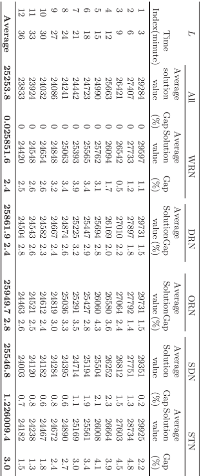

|             | 11 12               | 10        | 9         | 8         | 7         | 5 6                 | 4         | 3         | 2         |           | 1                             |     |
|-------------|---------------------|-----------|-----------|-----------|-----------|---------------------|-----------|-----------|-----------|-----------|-------------------------------|-----|
| Average     | 33 36               | 30        | 27        | 24        | 21        | 15 18               | 12        | 9         | 6         | 3         | Time Index(minute)            | L   |
| 25253.8     | 23924 23833         | 24032     | 24086     | 24241     | 24442     | 24990 24723         | 25663     | 26421     | 27407     | 29284     | Average solution value        | All |
| 0.025851.6  | 0 24548 0 24420     | 0 24654   | 0 24848   | 0 25063   | 0 25393   | 0 25762 0 25565     | 0 26094   | 0 26542   | 0 27733   | 0 29597   | Average GapSolution (%) value | WRN |
| 2.4         | 2.6 2.5             | 2.6       | 3.2       | 3.4       | 3.9       | 3.1 3.4             | 1.7       | 0.5       | 1.2       | 1.1       | Gap (%)                       |     |
| 25861.9 2.4 | 24543 2.6 24504 2.8 | 24582 2.3 | 24667 2.4 | 24874 2.6 | 25225 3.2 | 25694 2.8 25447 2.9 | 26169 2.0 | 27010 2.2 | 27897 1.8 | 29731 1.5 | Average SolutionGap value (%) | DRN |
| 25949.7 2.8 | 24521 2.5 24463 2.6 | 24612 2.4 | 24819 3.0 | 25036 3.3 | 25291 3.5 | 26060 4.3 25427 2.8 | 26580 3.6 | 27064 2.4 | 27792 1.4 | 29731 1.5 | Average SolutionGap value (%) | ORN |
| 25546.8     | 24120 24003         | 24182     | 24284     | 24395     | 24714     | 25504 25194         | 26252     | 26812     | 27751     | 29351     | Average Solution value        | SDN |
| 1.226009.4  | 0.8 0.7 24182       | 0.6       | 0.8       | 0.6       | 1.1       | 2.1 1.9             | 2.3       | 1.5       | 1.3 28734 | 0.2       | GapSolution (%) value         |     |
|             | 24238               | 24467     | 24672     | 24890     | 25169     | 26008 25561         | 26664     | 27603     |           | 29925     | Average                       | STN |
| 3.0         | 1.5                 | 1.8 1.3   | 2.4       | 2.7       | 3.0       | 4.1 3.4             | 3.9       | 4.5       | 4.8       | 2.2       | Gap (%)                       |     |

Table C.5: Average solution values with even allocation strategy and adaptive allocation strategy

| Time     | Even allocation strategyAdaptive allocation strategy   | Even allocation strategyAdaptive allocation strategy   | Even allocation strategyAdaptive allocation strategy   |
|----------|--------------------------------------------------------|--------------------------------------------------------|--------------------------------------------------------|
| (minute) | Average solution value                                 | Average solution valueGap(%)                           |                                                        |
| 10       | 135104                                                 | 129201                                                 | -4.4                                                   |
| 14       | 128561                                                 | 124412                                                 | -3.2                                                   |
| 18       | 124790                                                 | 119656                                                 | -4.1                                                   |
| 22       | 122670                                                 | 117304                                                 | -4.4                                                   |
| 26       | 121410                                                 | 115453                                                 | -4.9                                                   |
| 31       | 120073                                                 | 113849                                                 | -5.2                                                   |
| 36       | 119289                                                 | 113011                                                 | -5.3                                                   |
| Average  | 124557                                                 | 118984                                                 | -4.5                                                   |

## Table C.6: Average solution values with different number of special supermarkets

| Average      | Week4        | Week3       | Week2       | Week1                    | Data set                             | Special                           |
|--------------|--------------|-------------|-------------|--------------------------|--------------------------------------|-----------------------------------|
| 104947 29663 | 108419 29858 | 91734 28293 | 90066 28315 | 129571 32188             | solution total valuedistanceduration | 0% of supermarkets AverageAverage |
|              | 18           | 16.2 94817  | 16          | vehicles value 19 143770 | ofsolution                           | NumberAverage                     |
| 17.3113011   | 115125 30394 | 28831       | 98332 29260 | 32882                    | total                                | 10% of Average                    |
| 30341 60562  | 60067        | 57986       |             | 65633                    | total distanceduration               | supermarkets                      |
| 17.4         | 18.2         |             | 58563 16.2  | vehicles 19              | of                                   | AverateNumber                     |
|              |              | 16.2        |             | 159865                   | solution                             | AverageAverage                    |
| 127022 31354 | 127513       | 103418      | 117294      | valuedistance            | total                                | 20% of                            |
| 63152        | 31445        | 29617       | 30756       | 33601                    | duration                             | supermarkets                      |
|              | 62613        | 59727       | 61683       | 68586                    | total                                | Averate                           |
| 17.9         | 18.7         | 16.5        | 17          | 19.3                     | vehicles                             |                                   |
|              |              |             |             |                          | of                                   | Number                            |

Table C.7: Comparison between the Danish Crown solution and MLVNS solution

|          | MLVNS solution             | MLVNS solution          | MLVNS solution     | Danish Crown solution   | Danish Crown solution   |         |    |
|----------|----------------------------|-------------------------|--------------------|-------------------------|-------------------------|---------|----|
| Data set | Average solution Day value | Average travel distance | Number of vehicles | LB on travel distance   | Number of vehicles      | Gap (%) |    |
| Week10   | 13532                      | 4365                    | 15.0               | 5809                    | 20                      | -24.9   |    |
| 1        | 21839                      | 5397                    | 16.7               | 6383                    | 23                      | -15.4   |    |
| 2        | 23859                      | 5518                    | 17.0               | 6389                    | 23                      | -13.6   |    |
| 3        | 22176                      | 5349                    | 17.0               | 6252                    | 23                      | -14.4   |    |
| 4        | 29805                      | 6018                    | 19.0               | 6592                    | 24                      | -8.7    |    |
| 5        | 32559                      | 6235                    | 19.0               | 6374                    | 23                      | -2.2    |    |
| Total    | 143770                     | 32882                   | 19                 | 37799                   | 24-13.0                 | 24-13.0 |    |
| Week20   | 12498                      | 4032                    | 15.0               | 6136                    | 20                      | -34.3   |    |
| 1        | 16122                      | 4888                    | 15.8               | 6801                    | 23                      | -28.1   |    |
| 2        | 17726                      | 5404                    | 15.5               | 6392                    | 23                      | -15.5   |    |
| 3        | 15152                      | 4647                    | 15.0               | 5960                    | 23                      | -22.0   |    |
| 4        | 20550                      | 5280                    | 16.0               | 6142                    | 24                      | -14.0   |    |
| 5        | 16284                      | 5008                    | 15.5               | 6068                    | 23                      | -17.5   |    |
| Total    | 98332                      | 29260                   | 16                 | 37500                   | 24                      | -22.0   |    |
| Week30   | 12630                      | 4074                    | 14.8               | 5920                    | 20                      | -31.2   |    |
| 1        | 17246                      | 4973                    | 15.8               | 6586                    | 23                      | -24.5   |    |
| 2        | 16650                      | 5259                    | 15.2               | 6924                    | 23                      | -24.0   |    |
| 3        | 14881                      | 4767                    | 15.0               | 6720                    | 23                      | -29.1   |    |
| 4        | 19302                      | 5208                    | 16.0               | 6862                    | 24                      | -24.1   |    |
| 5        | 14107                      | 4551                    | 15.0               | 6292                    | 23                      | -27.7   |    |
| Total    | 94817                      | 28831                   | 16                 | 39304                   | 24                      | -26.6   |    |
| Week40   | 13056                      | 4211                    | 15.0               | 5966                    | 20                      | -29.4   |    |
|          | 1 14722                    | 4699                    | 15.2               | 6514                    | 23                      | -27.9   |    |
| 2        | 20010                      | 5372                    | 16.0               | 6417                    | 23                      | -16.3   |    |
| 3        | 14960                      | 4673                    | 15.0               | 6262                    | 23                      | -25.4   |    |
| 4        | 28930                      | 5833                    | 18.0               | 6839                    | 24                      | -14.7   |    |
| 5        | 23448                      | 5605                    | 17.0               | 7080                    | 23                      | -20.8   |    |
| Total    | 115125                     | 30394                   | 18                 | 39078                   | 24                      | -22.2   |    |

## References

Appelgate, D., Bixby, R., Chv´ atal, V., and Cook, W. (2003). Concorde tsp solver. available online at http://www.tsp.gatech.edu/concorde.

Baldacci, R., Battarra, M., and Vigo, D. (2008). Routing a heterogeneous fleet of vehicles. In Golden, B., Raghavan, S., and Wasil, E., editors, The vehicle routing problem: Latest advances and new challenges . Springer.

Braysy, O., Dullaert, W., Hasle, G., Mester, D., and Gendreau, M. (2008). An effective multirestart deterministic annealing metaheuristic for the fleet size and mix vehicle-routing problem with time windows. Transportation Science , 42(3):371-386.

Choi, E. and Tcha, D.-W. (2007). A column generation approach to the heterogeneous fleet vehicle routing problem. Computers &amp; Operations Research , 34(7):2080-2095.

Cordeau, J., Laporte, G., and Mercier, A. (2001a). A unified tabu search heuristic for vehicle routing problems with time windows. Journal of the Operational Research Society , 52(8):928-936.

Cordeau, J., Stojkovic, G., Soumis, F., and Desrosiers, J. (2001b). Benders decomposition for simultaneous aircraft routing and crew scheduling. Transportation Science , 35(4):375-388.

Freling, R., Huisman, D., and Wagelmans, A. (2003). Models and algorithms for integration of vehicle and crew scheduling. Journal of Scheduling , 6(1):63-85.

Hansen, P. and Mladenovic, N. (2001). Variable neighborhood search: Principles and applications. European Journal of Operational Research , 130(3):449-467.

| Hansen, P. and Mladenovic, N. (2005). Variable neighborhood search. In Burke, E. and Kendall, G., editors, Search Methodologies: Introductory Tutorials in Optimization and Decision Support Techniques . Springer.                                               |
|-------------------------------------------------------------------------------------------------------------------------------------------------------------------------------------------------------------------------------------------------------------------|
| Hemmelmayr, V. C., Doerner, K. F., and Hartl, R. F. (2009). A variable neigh- borhood search heuristic for periodic routing problems. European Journal of Operational Research , 195(3):791-802.                                                                  |
| Hollis, B., Forbes, M., and Douglas, B. (2006). Vehicle routing and crew schedul- ing for metropolitan mail distribution at Australia Post. European Journal of Operational Research , 173(1):133-150.                                                            |
| Huisman, D., Freling, R., and Wagelmans, A. (2005). Multiple-depot integrated vehicle and crew scheduling. Transportation Science , 39(4):491-502.                                                                                                                |
| Huisman, D. and Wagelmans, A. (2006). A solution approach for dynamic vehicle and crew scheduling. European Journal of Operational Research , 172(2):453-471.                                                                                                     |
| Imran, A., Salhi, S., and Wassan, N. A. (2009). A variable neighborhood- based heuristic for the heterogeneous fleet vehicle routing problem. European Journal of Operational Research , 197(2):509-518.                                                          |
| Li, F., Golden, B., and Wasil, E. (2007). A record-to-record travel algorithm for solving the heterogeneous fleet vehicle routing problem. Computers & Operations Research , 34(9):2734-2742.                                                                     |
| Mercier, A. and Soumis, F. (2007). An integrated aircraft routing, crew schedul- ing and flight retiming model. Computers & Operations Research , 34(8):2251- 2265.                                                                                               |
| Mesquita, M. and Paias, A. (2008). Set partitioning/covering-based approaches for the integrated vehicle and crew scheduling problem. Computers & Oper- ations Research , 35(5):1562-1575.                                                                        |
| Mladenovic, N. and Hansen, P. (1997). Variable neighborhood search. Comput- ers & Operations Research , 24(11):1097-1100.                                                                                                                                         |
| Papadakos, N. (2009). Integrated airline scheduling. Computers & Operations Research , 36(1, Sp. Iss. SI):176-195.                                                                                                                                                |
| Paraskevopoulos, D. C., Repoussis, P. P., Tarantilis, C. D., Ioannou, G., and Prastacos, G. P. (2008). A reactive variable neighborhood tabu search for the heterogeneous fleet vehicle routing problem with time windows. Journal of Heuristics , 14(5):425-455. |
| Pisinger, D. and Ropke, S. (2007). A general heuristic for vehicle routing prob-                                                                                                                                                                                  |

Potvin, J. and Rousseau, J. (1993). A parallel route building algorithm for the vehicle-routing and scheduling problem with time windows. European Journal of Operational Research , 66(3):331-340.

Ropke, S. and Pisinger, D. (2006). An adaptive large neighborhood search heuristic for the pickup and delivery problem with time windows. Transportation Science , 40(4):455-472.

Schrimpf, G., Schneider, J., Stamm-Wilbrandt, H., and Dueck, G. (2000). Record breaking optimization results using the ruin and recreate principle. Journal of Computational Physics , 159(2):139-171.

Zaepfel, G. and Boegl, M. (2008). Multi-period vehicle routing and crew scheduling with outsourcing options. International Journal of Production Economics , 113(2):980-996.

## References

- Agarwal, Y., Mathur, K., and Salkin, H. (1989). A set-partitioning based exact algorithm for the vehicle-routing problem. Networks , 19(7):731-749.
- Ai, T. J. and Kachitvichyanukul, V. (2009). Particle swarm optimization and two solution representations for solving the capacitated vehicle routing problem. Computers &amp; Industrial Engineering , 56(1):380-387.
- Alegre, J., Laguna, M., and Pacheco, J. (2007). Optimizing the periodic pickup of raw materials for a manufacturer of auto parts. European Journal of Operational Research , 179(3):736-746.
- Altinel, I. and Oncan, T. (2005). A new enhancement of the clarke and wright savings heuristic for the capacitated vehicle routing problem. Journal of the Operational Research Society , 56(8):954-961.
- Altinkemer, K. and Gavish, B. (1991). Parallel savings based heuristics for the delivery problem. Operations Research , 39(3):456-469.
- Baldacci, R., Battarra, M., and Vigo, D. (2008a). Routing a heterogeneous fleet of vehicles. In Golden, B., Raghavan, S., and Wasil, E., editors, The vehicle routing problem: Latest advances and new challenges , pages 3-27. Springer.
- Baldacci, R., Christofides, N., and Mingozzi, A. (2008b). An exact algorithm for the vehicle routing problem based on the set partitioning formulation with additional cuts. Mathematical Programming , 115(2):351-385.

Baldacci, R., Hadjiconstantinou, E., and Mingozzi, A. (2004). An exact algorithm for the capacitated vehicle routing problem based on a two-commodity network flow formulation. Operations Research , 52(5):723-738.

| Baldacci, R., Toth, P., and Vigo, D. (2007). Recent advances in vehicle rout- ing exact algorithms. 4OR: A Quarterly Journal of Operations Research , 5(4):269-298.                                                                                                                                                                                                       |
|---------------------------------------------------------------------------------------------------------------------------------------------------------------------------------------------------------------------------------------------------------------------------------------------------------------------------------------------------------------------------|
| Battarra, M., Golden, B., and Vigo, D. (2006). Tuning a parametric clarke- wright heuristic via a genetic algorithm. Technical report, Dipartimento di Elettronica Informatica e Sistemistica, Universita di Bologna.                                                                                                                                                     |
| Battiti, R. and Tecchiolli, G. (1995). Training neural nets with the reactive tabu search. IEEE Transactions on Neural Networks , 6(5):1185-1200.                                                                                                                                                                                                                         |
| Beltrami, E. J. and Bodin, L. D. (1974). Networks and vehicle routing for municipal waste collection. Networks , 4(2):65-94.                                                                                                                                                                                                                                              |
| Berbeglia, G., Cordeau, J. F., and Laporte, G. (2009). Dynamic pickup and delivery problems. European Journal of Operational Research , forthcoming.                                                                                                                                                                                                                      |
| Bertsimas, D. J. and SimchiLevi, D. (1996). A new generation of vehicle routing research: Robust algorithms, addressing uncertainty. Operations Research , 44(2):286-304.                                                                                                                                                                                                 |
| Blakeley, F., Bozkaya, B., Cao, B., Hall, W., and Knolmajer, J. (2003). Op- timizing periodic maintenance operations for schindler elevator corporation. Interfaces , 33(1):67-79.                                                                                                                                                                                        |
| Bouhafs, L., Hajjam, A., and Koukam, A. (2004). A hybrid ant colony system approach for the capacitated vehicle routing problem. In Dorigo, M and Bi- rattari, M and Blum, C and Gambardella, LM and Mondada, F and Stutzel, T, editor, Ant Colony Optimization and Swarm Intelligence, Proceedings , vol- ume 3172 of Lecture Notes In Computer Science , pages 414-415. |
| Bramel, J. and Simchilevi, D. (1995). A location based heuristic for general routing-problems. Operations Research , 43(4):649-660.                                                                                                                                                                                                                                       |
| Bramel, J. and Simchilevi, D. (2002). Set-Covering-Based Algorithms for the Capacitated VRP. In Toth, P. and Vigo, D., editors, The vehicle routing problem , chapter 4, pages 85-108. SIAM Monographs on Discrete Mathemat- ics and Applications.                                                                                                                        |
| Branchini, R. M., Armentano, V. A., and Lokketangen, A. (2009). Adaptive granular local search heuristic for a dynamic vehicle routing problem. Com- puters & Operations Research , 36(11):2955-2968.                                                                                                                                                                     |
| Brandao, J. (2009). A deterministic tabu search algorithm for the fleet size and mix vehicle routing problem. European Journal of Operational Research , 195(3):716-728.                                                                                                                                                                                                  |

| Branke, J., Middendorf, M., Noeth, G., and Dessouky, M. (2005). Waiting strategies for dynamic vehicle routing. Transportation Science , 39(3):298- 312.                                                                                                |
|---------------------------------------------------------------------------------------------------------------------------------------------------------------------------------------------------------------------------------------------------------|
| Braysy, I. and Gendreau, M. (2005). Vehicle routing problem with time windows, part II: Metaheuristics. Transportation Science , 39(1):119-139.                                                                                                         |
| Braysy, O. (2003). A reactive variable neighborhood search for the vehicle- routing problem with time windows. Informs Journal on Computing , 15(4):347-368.                                                                                            |
| Braysy, O., Dullaert, W., Hasle, G., Mester, D., and Gendreau, M. (2008). An effective multirestart deterministic annealing metaheuristic for the fleet size and mix vehicle-routing problem with time windows. Transportation Science , 42(3):371-386. |
| Braysy, O., Nakari, P., Dullaert, W., and Neittaanmaki, P. (2009a). An opti- mization approach for communal home meal delivery service: A case study. Journal of Computational and Applied Mathematics , 232(1, Sp. Iss. SI):46-53.                     |
| Braysy, O., Porkka, P. P., Dullaert, W., Repoussis, P. P., and Tarantilis, C. D. (2009b). Awell-scalable metaheuristic for the fleet size and mix vehicle routing problem with time windows. Expert Systems with Applications , 36(4):8460- 8475.       |
| Brotcorne, L., Laporte, G., and Semet, F. (2003). Ambulance location and relocation models. European Journal of Operational Research , 147(3):451- 463.                                                                                                 |
| Carrabs, F., Cerulli, R., and Cordeau, J.-F. (2007). An additive branch-and- bound algorithm for the pickup and delivery traveling salesman problem with LIFO or FIFO loading. Infor , 45(4):223-238.                                                   |
| Chabrier, A. (2006). Vehicle Routing Problem with elementary shortest path based column generation. Computers & Operations Research , 33(10):2972- 2990.                                                                                                |
| Chao, I., Golden, B., and Wasil, E. (1995). An improved heuristic for the period vehicle-routing problem. Networks , 26(1):25-44.                                                                                                                       |
| Choi, E. and Tcha, D.-W. (2007). A column generation approach to the het- erogeneous fleet vehicle routing problem. Computers & Operations Research , 34(7):2080-2095.                                                                                  |
| Christofides, N., Mingozzi, A., and Toth, P. (1979). The vehicle routing prob- lem. In Christofides, N., Mingozzi, A., Toth, P., and Sandi, C., editors, Combinatorial Optimization , pages 315-338. Wiley, Chichester, UK.                             |

| Christofides, N., Mingozzi, A., and Toth, P. (1981). Exact algorithms for the vehicle-routing problem, based on spanning tree and shortest-path re- laxations. Mathematical Programming , 20(3):255-282.                                                               |
|------------------------------------------------------------------------------------------------------------------------------------------------------------------------------------------------------------------------------------------------------------------------|
| Claassen, G. D. H. and Hendriks, T. H. B. (2007). An application of Special Ordered Sets to a periodic milk collection problem. European Journal of Operational Research , 180(2):754-769.                                                                             |
| Clarke, G. and Wright, J. W. (1964). Scheduling of vehicles from central depot to number of delivery points. Operations Research , 12(4):568-581.                                                                                                                      |
| Cordeau, J.-F., Gendreau, M., Hertz, A., Laporte, G., and Sormany, J.-S. (2005). New heuristics for the vehicle routing problem. In Langevin, A. and Riopel, D., editors, Logistics Systems: Design and Optimization , pages 279-297. Springer US.                     |
| Cordeau, J.-F., Gendreau, M., and Laporte, G. (1997). A tabu search heuristic for periodic and multi-depot vehicle routing problems. Networks , 30(2):105- 119.                                                                                                        |
| Cordeau, J.-F., Laporte, G., and Mercier, A. (2001a). A unified tabu search heuristic for vehicle routing problems with time windows. Journal of the Operational Research Society , 52(8):928-936.                                                                     |
| Cordeau, J.-F., Laporte, G., Savelsbergh, M. W. P., and Vigo, D. (2007). Vehicle routing. In Barnhart, C. and Laporte, G., editors, Handbook in Operations Re- search & Management Science: Transportation , volume 14, chapter 6, pages 367-428. Elsevier, Amsterdam. |
| Cordeau, J.-F., Stojkovic, G., Soumis, F., and Desrosiers, J. (2001b). Benders decomposition for simultaneous aircraft routing and crew scheduling. Trans- portation Science , 35(4):375-388.                                                                          |
| Cornillier, F., Laporte, G., Boctor, F. F., and Renaud, J. (2009). The petrol station replenishment problem with time windows. Computers & Operations Research , 36(3):919-935.                                                                                        |
| Cortes, C. E., Matamala, M., and Contardo, C. (2010). The pickup and delivery problem with transfers: Formulation and a branch-and-cut solution method. European Journal of Operational Research , 200(3):711-724.                                                     |
| Dantzig, G. and Ramser, J. (1959). The truck dispatching problem. Management Science , 6(1):80-91.                                                                                                                                                                     |
| Dantzig, G. and Wolfe, P. (1960). Decomposition principle for linear-programs. Operations Research , 8(1):101-111.                                                                                                                                                     |

- Desaulniers, G., Lessard, F., and Hadjar, A. (2008). Tabu search, partial elementarity, and generalized k-path inequalities for the vehicle routing problem with time windows. Transportation Science , 42(3):387-404.
- Desrochers, M. and Verhoog, T. W. (1989). A matching based savings algorithm for the vehicle routing problem. Technical report, Ecole des Hautes Etudes ´ ´ Commerciales de Montr´ eal.
- Dorigo, M. and Stutzle, T. (2004). Ant colony optimization . The MIT PRess, Cambridge, MA.
- Drummond, L. M. A., Ochi, L. S., and Vianna, D. S. (2001). An asynchronous parallel metaheuristic for the period vehicle routing problem. Future Generation Computer Systems , 17(4):379-386.
- Du, T., Wang, F. K., and Lu, P.-Y. (2007). A real-time vehicle-dispatching system for consolidating milk runs. Transportation Research Part E: Logistics and Transportation Review , 43(5):565-577.
- Dueck, G. (1993). New optimization heuristics - the great deluge algorithm and the record-to-record travel. Journal of Computational Physics , 104(1):86-92.
- Dueck, G. and Scheuer, T. (1990). Threshold accepting - a general-purpose optimization algorithm appearing superior to simulated annealing. Journal of Computational Physics , 90(1):161-175.
- Feillet, D., Dejax, P., Gendreau, M., and Gueguen, C. (2004). An exact algorithm for the elementary shortest path problem with resource constraints: Application to some vehicle routing problems. Networks , 44(3):216-229.
- Feillet, D., Gendreau, M., and Rousseau, L.-M. (2007). New refinements for the solution of vehicle routing problems with branch and price. INFOR , 45(4):239-256.
- Fisher, M. L. (1994). Optimal solution of vehicle-routing problems using minimum k-trees. Operations Research , 42(4):626-642.
- Fisher, M. L. and Jaikumar, R. (1981). A generalized assignment heuristic for vehicle-routing. Networks , 11(2):109-124.
- Foster, B. A. and Ryan, D. M. (1976). Integer programming approach to vehicle scheduling problem. Operational Research Quarterly , 27(2):367-384.
- Francis, P., Smilowitz, K., and Tzur, M. (2006). The period vehicle routing problem with service choice. Transportation Science , 40(4):439-454.
- Francis, P. M., Smilowitz, K. R., and Tzur, M. (2008). The peirod vehicle routing problem and its extensions. In Golden, B., Raghavan, S., and Wasil, E., editors, The vehicle routing problem: Latest advances and new challenges , pages 73-102. Springer.

| Freling, R., Huisman, D., and Wagelmans, A. P. M. (2003). Models and algo- rithms for integration of vehicle and crew scheduling. Journal of Scheduling , 6(1):63-85.                                                                                                                                                            |
|----------------------------------------------------------------------------------------------------------------------------------------------------------------------------------------------------------------------------------------------------------------------------------------------------------------------------------|
| Fuegenschuh, A. (2009). Solving a school bus scheduling problem with integer programming. European Journal of Operational Research , 193(3):867-884.                                                                                                                                                                             |
| Fuellerer, G., Doerner, K. F., Hardl, R. F., and Iori, M. (2009). Ant colony opti- mization for the two-dimensional loading vehicle routing problem. Computers & Operations Research , 36(3):655-673.                                                                                                                            |
| Fuellerer, G., Doerner, K. F., Hartl, R. F., and Iori, M. (2010). Metaheuris- tics for vehicle routing problems with three-dimensional loading constraints. European Journal of Operational Research , 201(3):751-759.                                                                                                           |
| Fukasawa, R., Longo, H., Lysgaard, J., de Aragao, M., Reis, M., Uchoa, E., and Werneck, R. F. (2006). Robust branch-and-cut-and-price for the capacitated vehicle routing problem. Mathematical Programming , 106(3):491-511.                                                                                                    |
| Gaskell, T. J. (1967). Bases for vehicle fleet scheduling. Operational Research Quarterly , 18(3):281-295.                                                                                                                                                                                                                       |
| Gaur, V. and Fisher, M. L. (2004). A periodic inventory routing problem at a supermarket chain. Operations Research , 52(6):813-822.                                                                                                                                                                                             |
| Gendreau, M., Guertin, F., Potvin, J.-Y., and Seguin, R. (2006). Neighbor- hood search heuristics for a dynamic vehicle dispatching problem with pick- ups and deliveries. Transportation Research Part C: Emerging Technologies , 14(3):157-174.                                                                                |
| Gendreau, M., Hertz, A., and Laporte, G. (1992). New insertion and postopti- mization procedures for the traveling salesman problem. Operations Research , 40(6):1086-1094.                                                                                                                                                      |
| Gendreau, M., Hertz, A., and Laporte, G. (1994). A tabu search heuristic for the vehicle-routing problem. Management Science , 40(10):1276-1290.                                                                                                                                                                                 |
| Gendreau, M., Laporte, G., and Potvin, J.-Y. (2002). Metaheuristics for the ca- pacitated vrp. In Toth, P. and Vigo, D., editors, The vehicle routing problem , chapter 6, pages 129-154. SIAM Monographs on Discrete Mathematics and Applications.                                                                              |
| Gendreau, M., Potvin, J.-Y., Braysy, O., Hasle, G., and Løkketangen, A. (2008). Metaheuristics for the vehicle routing problem and its extensions: a catego- rized bibliography. In Golden, B., Raghavan, S., and Wasil, E., editors, The vehicle routing problem: Latest advances and new challenges , pages 143-169. Springer. |

- Gillett, B. E. and Miller, L. R. (1974). Heuristic algorithm for vehicle-dispatch problem. Operations Research , 22(2):340-349.
- Glover, F. and Laguna, M. (1997). Tabu Search . Kluwer, Boston, MA.
- Golden, B., Magnanti, T. L., and Nguyen, H. Q. (1977). Implementing vehicle routing algorithms. Networks , 7(2):113-148.
- Haase, K., Desaulniers, G., and Desrosiers, J. (2001). Simultaneous vehicle and crew scheduling in urban mass transit systems. Transportation Science , 35(3):286-303.
- Hadjiconstantinou, E., Christofides, N., and Mingozzi, A. (1995). A new exact algorithm for the vehicle routing problem based on q-paths and k-shortest paths relaxations. Annals of Operations Research , 61:21-43.
- Haimovich, M. and Rinnooy Kan, A. H. G. (1985). Bounds and heuristics for capacitated routing problems. Mathematics of Operations Research , 10:527542.
- Hansen, P. and Mladenovic, N. (2001). Variable neighborhood search: Principles and applications. European Journal of Operational Research , 130(3):449-467.
- Hansen, P. and Mladenovic, N. (2005). Variable neighborhood search. In Burke, E. and Kendall, G., editors, Search Methodologies: Introductory Tutorials in Optimization and Decision Support Techniques . Springer.
- Hasle, G., Lokketangen, A., and Martello, S. (2006). Rich models in discrete optimization: Formulation and resolution (ECCO XVI). European Journal of Operational Research , 175(3):1752-1753.
- Hemmelmayr, V., Doerner, K. F., Hartl, R. F., and Savelsbergh, M. W. P. (2009a). Delivery strategies for blood products supplies. OR Spectrum , 31(4):707-725.
- Hemmelmayr, V. C., Doerner, K. F., and Hartl, R. F. (2009b). A variable neighborhood search heuristic for periodic routing problems. European Journal of Operational Research , 195(3):791-802.
- Hollis, B. L., Forbes, M. A., and Douglas, B. E. (2006). Vehicle routing and crew scheduling for metropolitan mail distribution at Australia Post. European Journal of Operational Research , 173(1):133-150.
- Huisman, D., Freling, R., and Wagelmans, A. P. M. (2005). Multiple-depot integrated vehicle and crew scheduling. Transportation Science , 39(4):491502.

| Huisman, D. and Wagelmans, A. P. M. (2006). A solution approach for dy- namic vehicle and crew scheduling. European Journal of Operational Research , 172(2):453-471.                                                                                   |
|---------------------------------------------------------------------------------------------------------------------------------------------------------------------------------------------------------------------------------------------------------|
| Hvattum, L. M., Lokketangen, A., and Laporte, G. (2006). Solving a dynamic and stochastic vehicle routing problem with a sample scenario hedging heuris- tic. Transportation Science , 40(4):421-438.                                                   |
| Ibaraki, T., Imahori, S., Kubo, M., Masuda, T., Uno, T., and Yagiura, M. (2005). Effective local search algorithms for routing and scheduling problems with general time-window constraints. Transportation Science , 39(2):206-232.                    |
| Ibaraki, T., Imahori, S., Nonobe, K., Sobue, K., Uno, T., and Yagiura, M. (2008). An iterated local search algorithm for the vehicle routing problem with convex time penalty functions. Discrete Applied Mathematics , 156(11, Sp. Iss. SI):2050-2069. |
| Imran, A., Salhi, S., and Wassan, N. A. (2009). A variable neighborhood- based heuristic for the heterogeneous fleet vehicle routing problem. European Journal of Operational Research , 197(2):509-518.                                                |
| Irnich, S. and Villeneuve, D. (2006). The shortest-path problem with resource constraints and k-cycle elimination for k > =3. Informs Journal on Comput- ing , 18(3):391-406.                                                                           |
| Jepsen, M., Petersen, B., Spoorendonk, S., and Pisinger, D. (2008). Subset- row inequalities applied to the vehicle-routing problem with time windows. Operations Research , 56(2):497-511.                                                             |
| Kallehauge, B. (2008). Formulations and exact algorithms for the vehicle routing problem with time windows. Computers & Operations Research , 35(7):2307- 2330.                                                                                         |
| Kennedy, J., Eberhart, R. C., and Shi, Y. (2001). Swarm Intelligience . Morgan Kaufmann.                                                                                                                                                                |
| Kim, B., Kim, S., and Sahoo, S. (2006). Waste collection vehicle routing problem with time windows. Computers & Operations Research , 33(12):3624-3642.                                                                                                 |
| Kirkpatrick, S., Gelatt, C. D., and Vecchi, M. P. (1983). Optimization by simulated annealing. SCIENCE , 220(4598):671-680.                                                                                                                             |
| Kohl, N., Desrosiers, J., Madsen, O. B. G., Solomon, M. M., and Soumis, F. (1999). 2-path cuts for the vehicle routing problem with time windows. Trans- portation Science , 33(1):101-116.                                                             |
| Kytojoki, J., Nuortio, T., Braysy, O., and Gendreau, M. (2007). An efficient variable neighborhood search heuristic for very large scale vehicle routing problems. Computers & Operations Research , 34(9):2743-2757.                                   |

| Laporte, G., Nobert, Y., and Desrochers, M. (1985). Optimal routing under capacity and distance restrictions. Operations Research , 33(5):1050-1073.                                                                                                           |
|----------------------------------------------------------------------------------------------------------------------------------------------------------------------------------------------------------------------------------------------------------------|
| Laporte, G. and Semet, F. (2002). Classical heuristics for the capacitated vrp. In Toth, P. and Vigo, D., editors, The vehicle routing problem , chapter 5, pages 109-128. SIAM Monographs on Discrete Mathematics and Applications.                           |
| Larsen, A. (2001). The dynamic vehicle routing problem . PhD thesis, Institute of Mathematical Modelling, Technical University of Denmark.                                                                                                                     |
| Larsen, A., Madsen, O. B. G., and Solomon, M. M. (2008). Recent development in dynamic vehicle routing system. In Golden, B., Raghavan, S., and Wasil, E., editors, The vehicle routing problem: Latest advances and new challenges , pages 199-218. Springer. |
| Lenstra, J. K. and Rinnooy Kan, A. H. G. (1981). Complexity of vehicle-routing and scheduling problems. Networks , 11(2):221-227.                                                                                                                              |
| Lin, S. (1965). Computer solutions of traveling salesman problem. Bell System Technical Journal , 44(10):2245-2269.                                                                                                                                            |
| Lin, S.-W., Lee, Z.-J., Ying, K.-C., and Lee, C.-Y. (2009). Applying hybrid meta-heuristics for capacitated vehicle routing problem. Expert Systems with Applications , 36(2, Part 1):1505-1512.                                                               |
| Liu, S., Huang, W., and Ma, H. (2009). An effective genetic algorithm for the fleet size and mix vehicle routing problems. Transportation Research Part E: Logistics and Transportation Review , 45(3):434-445.                                                |
| Lourenco, H. R., Martin, O. C., and Stutzle, T. (2003). Iterated local search. In Glover, F. and A, K. G., editors, Handbooks of Metaheuristics , pages 321-353. Kluwer Acedemic Publishers.                                                                   |
| Lysgaard, J., Letchford, A. N., and Eglese, R. W. (2004). A new branch- and-cut algorithm for the capacitated vehicle routing problem. Mathematical Programming , 100(2):423-445.                                                                              |
| Martinhon, C., Lucena, A., and Maculan, N. (2004). Stronger K-tree relaxations for the vehicle routing problem. European Journal of Operational Research , 158(1):56-71.                                                                                       |
| Mercier, A., Cordeau, J.-F., and Soumis, F. (2005). A computational study of Benders decomposition for the integrated aircraft routing and crew scheduling problem. Computers & Operations Research , 32(6):1451-1476.                                         |
| Mesquita, M. and Paias, A. (2008). Set partitioning/covering-based approaches for the integrated vehicle and crew scheduling problem. Computers & Oper- ations Research , 35(5):1562-1575.                                                                     |

| Mester, D. and Braysy, O. (2005). Active guided evolution strategies for large- scale vehicle routing problems with time windows. Computers & Operations Research , 32(6):1593-1614.                                                                     |
|----------------------------------------------------------------------------------------------------------------------------------------------------------------------------------------------------------------------------------------------------------|
| Mester, D. and Braysy, O. (2007). Active-guided evolution strategies for large- scale capacitated vehicle routing problems. Computers & Operations Re- search , 34(10):2964-2975.                                                                        |
| Miller, D. L. (1995). A matching based exact algorithm for capacitated vehicle routing problems. ORSA Journal on Computing , 7:1-9.                                                                                                                      |
| Miller, D. L. and Pekny, J. F. (1995). A staged primal-dual algorithm for perfect b-matching with edge capacities. ORSA Journal on Computing , 7:298-320.                                                                                                |
| Mitchell, M. (1998). An introduction to genetic algorithm . The MIT press.                                                                                                                                                                               |
| Mitrovic-Minic, S., Krishnamurti, R., and Laporte, G. (2004). Double-horizon based heuristics for the dynamic pickup and delivery problem with time win- dows. Transportation Research Part B: Methodological , 38(8):669-685.                           |
| Mitrovic-Minic, S. and Laporte, G. (2004). Waiting strategies for the dynamic pickup and delivery problem with time windows. Transportation Research Part B: Methodological , 38(7):635-655.                                                             |
| Mole, R. H. and Jameson, S. R. (1976). Sequential route-building algorithm employing a generalized savings criterion. Operational Research Quarterly , 27(2):503-511.                                                                                    |
| Mourgaya, M. and Vanderbeck, F. (2007). Column generation based heuristic for tactical planning in multi-period vehicle routing. European Journal of Operational Research , 183(3):1028-1041.                                                            |
| Nagata, Y. and Braysy, O. (2008). Efficient local search limitation strategies for vehicle routing problems. Lecture Notes in Computer Science , 4972:48-60.                                                                                             |
| Nagata, Y. and Braysy, O. (2009). Edge assembly based memetic algorithm for the capacitated vehicle routing problem. Networks , page forthcomming.                                                                                                       |
| Nelson, M. D., Nygard, K. E., Griffin, J. H., and Shreve, W. E. (1985). Imple- mentation techniques for the vehicle-routing problem. Computers & Opera- tions Research , 12(3):273-283.                                                                  |
| Oppen, J. and Lokketangen, A. (2006). Arc routing in a node routing environ- ment. Computers & Operations Research , 33(4):1033-1055.                                                                                                                    |
| Or, I. (1976). Traveling salesman-type combinatorial optimization problems and their relation to the logistics of regional blood banking. PhD thesis, De- partment of Industrial Engineering and Management Sciences, Northwestern University, Evanston. |

| Paessens, H. (1988). The savings algorithm for the vehicle-routing problem. European Journal of Operational Research , 34(3):336-344.                                                                                                                                                                   |
|---------------------------------------------------------------------------------------------------------------------------------------------------------------------------------------------------------------------------------------------------------------------------------------------------------|
| Papadakos, N. (2009). Integrated airline scheduling. Computers & Operations Research , 36(1, Sp. Iss. SI):176-195.                                                                                                                                                                                      |
| Paraskevopoulos, D. C., Repoussis, P. P., Tarantilis, C. D., Ioannou, G., and Prastacos, G. P. (2008). A reactive variable neighborhood tabu search for the heterogeneous fleet vehicle routing problem with time windows. Journal of Heuristics , 14(5):425-455.                                       |
| Parthanadee, P. and Logendran, R. (2006). Periodic product distribution from multi-depots under limited supplies. IIE Transactions , 38(11):1009-1026.                                                                                                                                                  |
| Petersen, H. L. and Madsen, O. B. G. (2009). The double travelling salesman problem with multiple stacks - Formulation and heuristic solution approaches. European Journal of Operational Research , 198(1):139-147.                                                                                    |
| Pisinger, D. and Ropke, S. (2007). A general heuristic for vehicle routing prob- lems. Computers & Operations Research , 34(8):2403-2435.                                                                                                                                                               |
| Pisinger, D. and Ropke, S. (2009). Handbooks of Metaheuristics, 2nd edition , chapter Large neighborhood search, page forthcoming.                                                                                                                                                                      |
| Prescott-Gagnon, E., Desaulniers, G., and Rousseau, L. M. (2007). A branch- and-price-based large neighborhood search algorithm for the vehicle routing problem with time windows. Technical report, University of Montreal, Mon- treal, Canada.                                                        |
| Prins, C. (2009). Two memetic algorithms for heterogeneous fleet vehicle routing problems. Engineering Applications of ArtiGLYPH<222>cial Intelligence , 22:916-928.                                                                                                                                    |
| Pureza, V. and Laporte, G. (2008). Waiting and Buffering Strategies for the Dy- namic Pickup and Delivery Problem with Time Windows. INFOR , 46(3):165- 175.                                                                                                                                            |
| Renaud, J., Boctor, F. F., and Laporte, G. (1996a). An improved petal heuristic for the vehicle routeing problem. Journal of The Operational Research Society , 47(2):329-336.                                                                                                                          |
| Renaud, J., Boctor, F. F., and Laporte, G. (1996b). A fast composite heuris- tic for the symmetric traveling salesman problem. INFORMS Journal on Computing , 8:134-143.                                                                                                                                |
| Repoussis, P. P., Paraskevopoulos, D. C., Tarantilis, C. D., and Ioannou, G. (2006). A reactive greedy randomized variable neighborhood Tabu search for the vehicle routing problem with time windows. In Almeida, F and Aguilera, MJB and Blum, C and Vega, JMM and Perez, MP and Roli, A and Sampels, |

| M, editor, Hybrid Metaheuristics, Proceedings , volume 4030 of Lecture Notes in Computer Science , pages 124-138.                                                                                                       |
|-------------------------------------------------------------------------------------------------------------------------------------------------------------------------------------------------------------------------|
| Repoussis, P. P., Tarantilis, C. D., and Ioannou, G. (2009). Arc-guided evolu- tionary algorithm for the vehicle routing problem with time windows. IEEE Transactions on Evolutionary Computation , 13(3):624-647.      |
| Rochat, Y. and Taillard, E. D. (1995). Probabilistic diversification and intensi- fication in local search for vehicle routing. Journal of Heuristics , 1:147-167.                                                      |
| Ropke, S. and Pisinger, D. (2006). An adaptive large neighborhood search heuristic for the pickup and delivery problem with time windows. Trans- portation Science , 40(4):455-472.                                     |
| Russell, R. A. and Chiang, W. C. (2006). Scatter search for the vehicle rout- ing problem with time windows. European Journal of Operational Research , 169(2):606-622.                                                 |
| Schrimpf, G., Schneider, J., Stamm-Wilbrandt, H., and Dueck, G. (2000). Record breaking optimization results using the ruin and recreate principle. Journal of Computational Physics , 159(2):139-171.                  |
| Shaw, P. (1997). Anew local search algorithm providing high quality solutions to vehicle routing problems. Technical report, Department of Computer Science, University of Strathclyde, Scotland.                       |
| Steinzen, I., Suhl, L., and Kliewer, N. (2009). Branching strategies to im- prove regularity of crew schedules in ex-urban public transit. OR Spectrum , 31(4):727-743.                                                 |
| Suman, B. and Kumar, P. (2006). A survey of simulated annealing as a tool for single and multiobjective optimization. Journal of the Operational Research Society , 57(10):1143-1160.                                   |
| Thompson, P. M. and Psaraftis, H. N. (1993). Cyclic transfer algorithms for mul- tivehicle routing and scheduling problems. Operations Research , 41(5):935- 946.                                                       |
| Toth, P. and Vigo, D. (2002). An overview of vehicle routing problem. In Toth, P. and Vigo, D., editors, The vehicle routing problem , chapter 1, pages 1-26. SIAM Monographs on Discrete Mathematics and Applications. |
| Toth, P. and Vigo, D. (2003a). The granular tabu search and its application to the vehicle-routing problem. Informs Journal on Computing , 15(4):333-346.                                                               |
| Toth, P. and Vigo, D. (2003b). The granular tabu search and its application to the vehicle-routing problem. Informs Journal on Computing , 15(4):333-346.                                                               |

- Van Breedam, A. (1994). An analysis of the behavior of heuristics for the vehicle routing problem for a selection of problems with vehicle-related, customerrelated, and time-related constraints. PhD thesis, University of Antwerp.
- Wark, P. and Holt, J. (1994). A repeated matching heuristic for the vehicle routeing problem. Journal of the Operational Research Society , 45(10):11561167.
- Wassan, N. A. (2006). A reactive tabu search for the vehicle routing problem. Journal of the Operational Research Society , 57(1):111-116.
- Weigel, D. and Cao, B. (1999). Applying GIS and OR techniques to solve sears technician-dispatching and home-delivery problems. Interfaces , 29(1):112130.
- Wen, M., Cordeau, J.-F., Laporte, G., and Larsen, J. (2009a). The dynamic multi-period vehicle routing problem. Technical report, Department of Management Engineering, Technical University of Denmark,.
- Wen, M., Krapper, E., Larsen, J., and Stidsen, T. (2009b). A multi-level variable neighborhood heuristic for a practical vehicle routing and driver scheduling problem. Technical report, Department of Management Engineering, Technical University of Denmark,.
- Wen, M., Larsen, J., Clausen, J., Cordeau, J.-F., and Laporte, G. (2009c). Vehicle routing with cross-docking. Journal of the Operational Research Society , 60(12):1708-1718.
- Yellow, P. C. (1970). A computational modification to savings method of vehicle scheduling. Operational Research Quarterly , 21(2):281-283.
- Zachariadis, E. E., Tarantilis, C. D., and Kiranoudis, C. T. (2009). A Guided Tabu Search for the Vehicle Routing Problem with two-dimensional loading constraints. European Journal of Operational Research , 195(3):729-743.
- Zaepfel, G. and Boegl, M. (2008). Multi-period vehicle routing and crew scheduling with outsourcing options. International Journal of Production Economics , 113(2):980-996.
- Zeng, L., Ong, H. L., and Ng, K. M. (2007). A generalized crossing local search method for solving vehicle routing problems. Journal of the Operational Research Society , 58(4):528-532.

The Vehicle Routing Problem (VRP) is one of the most important and challenging optimization problems in Operations Research field. It was first introduced by Dantzig and Ramser (1959) and defined as the problem of designing the optimal set of routes for a fleet of vehicles in order to serve a given set of customers. The VRP is a computationally hard combinatorial problem and has been intensively studied by tremendous researchers in the last fifty years. Due to the significant economic benefit that can be acheived by optimizing the routing problems in practice, more and more attentions has been given to various extensions of the VRP that arise in real life. These extensions are often called Rich Vehicle Routing Problems (RVRPs). In contrast to the research of classical VRP that focuses on the idealized models with unrealistic assumptions, the research of RVRPs considers those complicated constraints encountered in the real-life planning and provides solutions that are executable in practice.

ISBN 978-87-90855-89-5

DTU Management Engineering Department of Management Engineering Technical University of Denmark

Produktionstorvet Building 424 DK-2800 Kongens Lyngby Denmark Tel. +45 45 25 48 00 Fax +45 45 93 34 35

www.man.dtu.dk