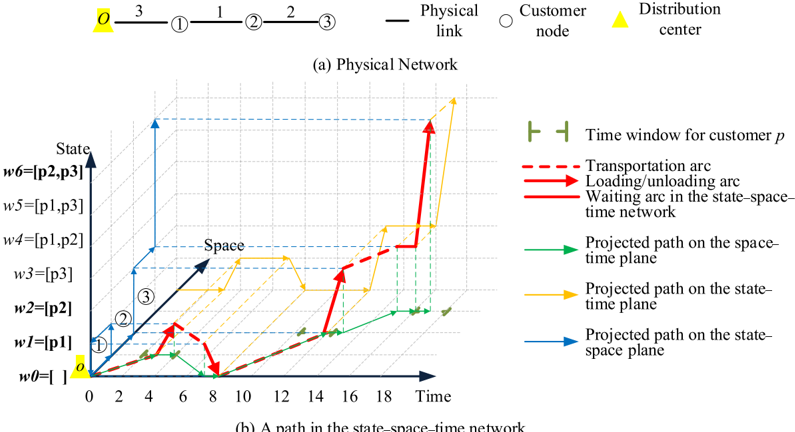
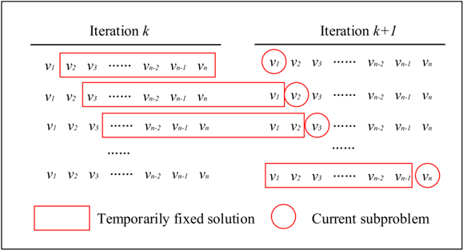
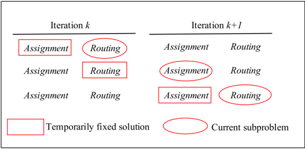
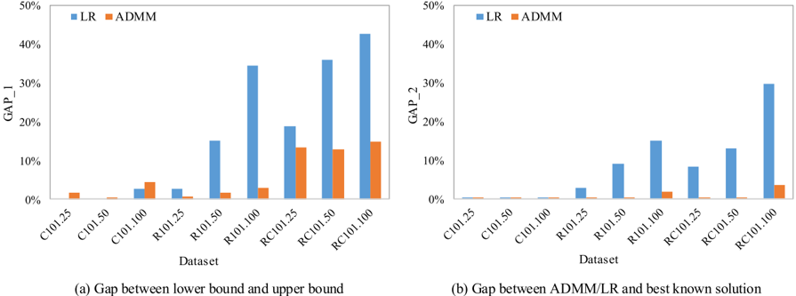
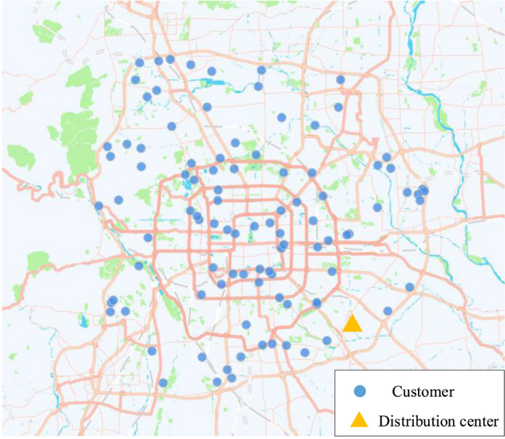
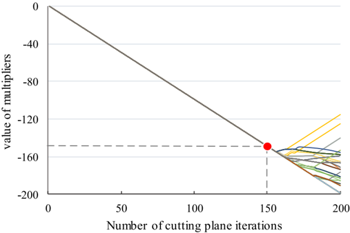
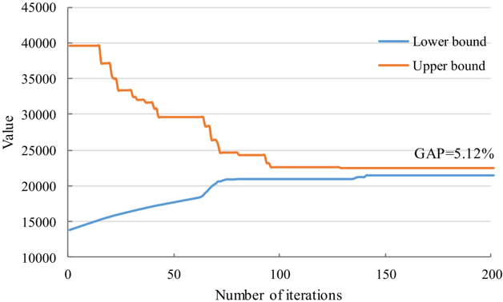
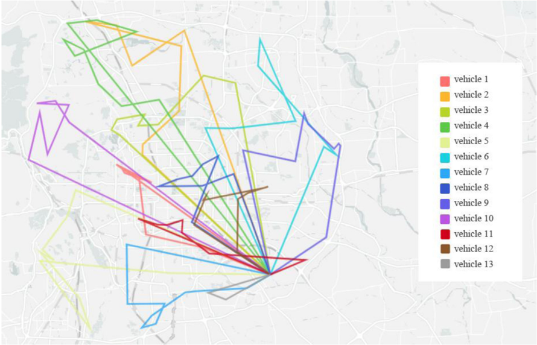
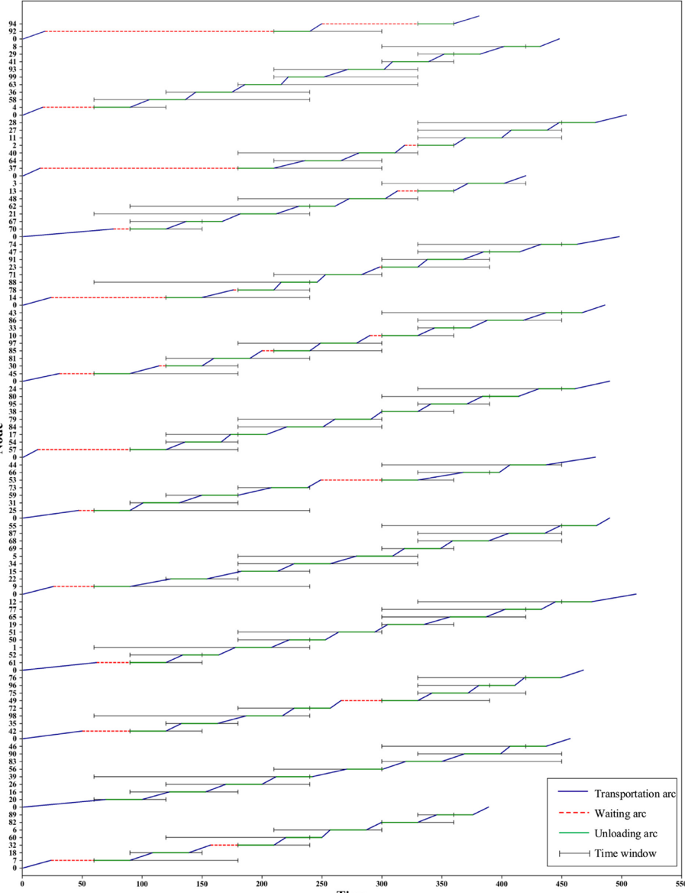

Contents lists available at ScienceDirect

## Transportation Research Part B

journal homepage: www.elsevier.com/locate/trb

## ADMM-based problem decomposition scheme for vehicle routing problem with time windows

Yu Yao a , Xiaoning Zhu a , Hongyu Dong b, ∗ , Shengnan Wu b , Hailong Wu b , Lu Carol Tong c , Xuesong Zhou d, ∗

- a School of Traffic and Transportation, Beijing Jiaotong University, Beijing 100044, China
- b Logistics R&amp;D Department, Beijing Jingdong Zhenshi Information Technology Co., Ltd., Beijing 100176, China
- c Research Institute of Frontier Science, National Engineering Laboratory for Comprehensive Transportation Big Data Application
- Technology, Beihang University, Beijing 100091, China
- d School of Sustainable Engineering and the Built Environment, Arizona State University, Tempe, AZ 85281, USA

## a r t i c l e i n f o

## a b s t r a c t

Article history:

Received 24 November 2018 Revised 4 September 2019 Accepted 10 September 2019 Available online 18 September 2019

Keywords:

Urban logistics

Vehicle routing problem with time windows

Alternating direction method of multipliers Problem decomposition

∗ Corresponding authors.

Emerging urban logistics applications need to address various challenges, including complex traffic conditions and time-sensitive requirements. In this study, in the context of urban logistics, we consider a vehicle routing problem with time-dependent travel times and time windows (VRPTW), and the goal is to minimize the total generalized costs including the transportation, waiting time, and fixed costs associated with each vehicle. We adopt a high-dimensional space-time network flow model to formulate an underlying vehicle routing problem (VRP) with a rich set of criteria and constraints. A difficult issue, when solving VRPs, is how to iteratively improve both the primal and dual solution quality in general and how to break the symmetry generated by many identical solutions, particularly with homogeneous vehicles. Along this line, many coupling constraints, such as the consensus constraints across different agents or decision makers, need to be carefully addressed to find high-quality optimal or close-to-optimal solutions under medium- or large-scale instances. Currently, the alternating direction method of multipliers (ADMM) is widely used in the field of convex optimization, as an integration of the augmented Lagrangian relaxation and block coordinate descent methods, for machine learning and large-scale continuous systems optimization and control. In this work, we introduce the use of ADMM to solve the multi-VRP, which is a special case of integer linear programming, and demonstrate a manner to reduce the quadratic penalty terms used in ADMM into simple linear functions. In a broader context, a computationally reliable decomposition framework is developed to iteratively improve both the primal and dual solution quality. Essentially, the least-cost path subproblem or other similar subproblems involving binary decisions can be embedded into a sequential solution scheme with an output of both lower bound estimates and upper bound feasible solutions. We examine the performance of the proposed approach using classical Solomon VRP benchmark instances. We also evaluate our approach on a real-world instance based on a problem-solving competition by Jingdong Logistics, a major E-commerce company.

© 2019 Elsevier Ltd. All rights reserved.

## 1. Introduction

In this study, we are interested in how to develop a computationally reliable and theoretically sound problem decomposition scheme for solving various emerging scheduling and routing problems in dynamic transportation networks. In particular, our research is also motivated by solving vehicle routing and closely related ride sharing problems due to the rapid development of e-commerce industries and traveler mobility services. An efficient algorithm for vehicle routing problems (VRPs) can be a crucial building block for providing 'door-to-door' freight distributions (Savelsbergh and Van Woensel, 2016) and customized public transportation services (Tong et al., 2017) with high frequency and punctuality in congested urban areas.

## 1.1. Literature review on the VRP

Compared with long-distance transportation between cities, the efficiency of urban logistics highly depends on real-time traffic conditions. At the same time, the customers have stricter requirements regarding delivery time and locations. The complex traffic conditions and increasingly complicated requirements motivate the development of optimized strategic and operational decision making to manage the logistic processes more efficiently. In the context of urban logistics, the VRP algorithm should be developed considering the time windows of customer requirements and vehicle carrying capacity.

In this study, we consider a VRP with time windows (VRPTW), which includes various constraints such as service time windows and vehicle carrying capacity constraints. The VRPTW is widely studied in the literature (Desrochers et al., 1992; Kallehauge, 2008; Zhou et al., 2018). Typical solution methods of VRPTW can be classified into two categories: heuristics and exact optimization approaches. Although there are abundant and efficient heuristic methods such as the savings algorithm (Clarke and Wright, 1964), matching-based algorithm (Altinkemer and Gavish, 1991), sweep-based algorithm (Gillett and Miller, 1974; Renaud and Boctor, 2002), cluster first, route second (Fisher and Jaikumar, 1981), and meta-heuristics such as the Tabu search (Taillard, 1993), adaptive large neighborhood search (ALNS) algorithm (Ghilas et al., 2016; Goel and Gruhn, 2005), and ant system optimization (Reimann et al., 2004), these widely used heuristic or meta-heuristic methods typically do not offer measures on optimality gaps. Meanwhile, exact or approximate optimization approaches, such as the branch-and-cut, branch-and-price, and Lagrangian decomposition methods, deserve particular attention as they can provide a yardstick to evaluate the obtained solutions and further reach the right balance between the solution search efforts and required optimality.

## 1.2. Literature review on problem decomposition

Decomposition is a general approach to solve large-scale problems. Its core is to break the original problem into smaller subproblems and to solve each of them separately, either in parallel or sequentially. There are a wide range of classical decomposition methods, such as Dantzig-Wolfe (Dantzig and Wolfe, 1960), Benders (Benders, 1962), column generation (Ford and Fulkerson, 1958), Lagrangian relaxation (LR) (Held and Karp, 1970), and branch-and-price (Nemhauser et al., 1991). Interested readers can find a number of surveys and textbook chapters on various optimization domains, to name a few, contributed by Boyd and Vandenberghe (2004), Lasdon (2002), chapter 6 of Bertsekas (1999), and chapter 12 of Bradley et al. (1977) for linear, nonlinear, and integer programming problems.

These decomposition schemes have been widely used to solve VRPs. In the following well-known studies, branch-andbound (Christofides et al., 1981), branch-and-cut (Laporte et al., 1985), LR (Fisher et al., 1997), and branch-and-cut-and-price (Fukasawa et al., 2006) have been adopted specifically to solve the VRP. Recently, notable research attention has been devoted to the VRP in the context of time-dependent transportation networks. Dabia et al . (2013) adopted the branch-and-price framework to decompose the arc-based formulation into a set-partitioning problem as the master problem, and the pricing problem is constructed as a time-dependent shortest path problem with resource constraints. Aiming to embed the vehicle capacity and pickup and delivery precedence constraints in a layered graph structure, Mahmoudi and Zhou (2016) constructed a multi-dimensional commodity flow formulation where possible transportation states are enumerated, and then an LR approach was used to decompose the original model into a sequence of shortest path subproblems. As demonstrated in the branch-and-price literature by Barnhart et al. (1998), and in a recent publication by Niu et al. (2018) focusing on integrated transit vehicle assignment and scheduling, researchers need to fully recognize the critical solution symmetry issues, and develop effective symmetry breaking techniques, when handling the multi-vehicle routing problem that consists of numerous homogeneous vehicles.

In this study, with a dual decomposition paradigm, we develop a computationally reliable solution framework based on the alternating direction method of multipliers (ADMM), which is a variation of dual decomposition that provides improved theoretical and practical convergence properties. The literature on ADMM can date back to the classical paper by Glowinski and Marroco (1975) and Douglas and Rachford (1956), and its convergence analysis and many related theoretical building blocks have been subsequently established by a number of studies in the field of convex programming (Eckstein and Bertsekas, 1992; Ruszczy ´ nski, 1989). A relatively recent overview offered by Boyd et al. (2011) further popularized the use of ADMM in many disciplines, particularly in a few emerging branches of big data and machine learning. In the area of distributed optimization with multiple agents, one of the leading studies by Nedic and Ozdaglar (2009) proposed an ADMM-

motivated consensus and sharing mechanism where each agent has its own convex, potentially non-differentiable objective function.

Some studies also extended and applied ADMM in the field of mixed-integer programming. For instance, Boland et al. (2018) adapted the ADMM-based solution procedure to handle the stochastic form of the augmented Lagrangian based on scenario decomposition. They pointed out that the drawback of primal-dual methods for mixed-integer programs was that it is difficult to guarantee convergence and proposed a new algorithm combining progressive hedging with a Frank-Wolfe method for computing lower bounds. Takapoui et al. (2017) presented an ADMM-based heuristic for embedded mixed-integer quadratic programming applications to satisfy the requirement of high computational efficiency. Feizollahi et al. (2015) proposed an extended ADMM algorithm to solve the decentralized unit commitment problem, where a release-and-fix approach is used to deal with binary variables.

To the extent of our knowledge, very few studies have specifically focused on the adaptation of ADMM on the VRP, which is essentially a deterministic combinatorial optimization problem over transportation networks. More importantly, our proposed ADMM-based solution framework can be further applied to reformulate a broader class of consensus and consistency constraints where binary decision variables are carefully constructed to enable a wide range of computationally efficient algorithms in transportation networks.

## 1.3. Motivation and potential contributions

While the VRP has been widely studied, we hope the introduction of ADMM as an improved dual decomposition algorithm could shed more light in the following aspects. First, compared to meta-heuristic methods, a desirable algorithm should not only obtain good and feasible solutions but also establish a strong lower bound estimate to precisely measure the quality of the solutions. Second, in the classical branch-and-price solution framework for the VRP, each vehicle maintains multiple alternative routes in the column pool, and the master problems are usually solved by invoking linear programming (LP) solvers and sophisticated branching strategies. In contrast, our proposed ADMM-based framework only keeps one path column for each vehicle at an iteration, which offers a relatively simpler algorithmic implementation structure, especially for time-indexed formulation problems with several columns to manage. Essentially, this ADMM-based framework aims to iteratively improve both the primal and dual feasibility, and this decomposition procedure could be further extended to handle other transportation problems beyond VRP, such as problems with consistency constraints between the optimization layers.

In our research, ADMM is adopted as a high-level problem decomposition and modular coordination framework, which obtains the solution of the large-scale problem by solving a set of much smaller subproblems with efficient algorithms as the base operations. We perform a sequence of reformulation steps, namely, (a) dualization and augmentation, (b) decomposition, and (c) linearization. In particular, this research can address several modeling challenges.

- (1) If a LP relaxation (of the set covering problem) is used in the restricted master problem for the VRP, e.g., in the form of the Dantzig-Wolfe decomposition or branch-and-bound, it typically required significant effort to obtain and improve feasible integer solutions. The limitation of the standard LR method for the VRP is its inherent solution symmetry due to homogeneous vehicles. By adding the augmented terms, we present an improved dual decomposition to effectively break the solution symmetries and quickly generate good feasible integer solutions.
- (2) ADMM has been widely used in the field of convex programming but, to the extent of our knowledge, there are very few applications of ADMM in linear integer programming in general and especially in VRP, which involves the optimal coordination of multiple vehicles with a large number of integer decision variables subject to a set of complex side constraints. To address this difficulty, we use a hyper-dimensional network model to simplify the side constraints and further enable an efficient dynamic programming algorithm for the dualized problem.
- (3) Another challenge in applying ADMM in VRPs is how to linearize the quadratic objective function in its inner penalty term involving integer variables. The regular way is to linearize the objective function, e.g., using the Frank-Wolfe method or first-order Taylor expansion (Nishi et al., 2005), which is still computationally expensive in its own right. In this work, we clearly show that within the block coordinate descent method of Gauss-Seidel type, the quadratic penalty term used in the VRP-ADMM model is separable for each ' -update' and could be reduced to a much simpler x linear functional form if only binary decision values are involved. The establishment of this equivalence gives rise to the possibility and promise of computationally efficient iterative solution searching procedures.
- (4) If the standard ADMM method is applied alone, it is still difficult to estimate the lower bounds of the problems, and the information provided here is insufficient to evaluate the corresponding solution quality with respect to the systemwide optimum. In this study, we present a coherent solution approach for simultaneously estimating the upper and lower bound values. This process can accordingly access and reduce the global optimality gaps by iteratively solving two closely related problems, namely, the Lagrangian dual and augmented models.

The remainder of this paper is structured as follows. In Section 2, the formulation of the VRPTW is represented based on the state-space-time network. In Section 3, the ADMM-based decomposition framework and solution procedure are presented. Section 4 discusses the convergence and potential extensions of ADMM. In Section 5, the proposed model and solution framework are applied to the Solomon benchmark and a real-world case. Finally, we draw our conclusions in Section 6.

## 2. Problem statement and model formulation

## 2.1. Problem statement of the VRPTW

The VRPTW in this study aims to find a set of routes that minimizes the total generalized system-wide costs, including the transportation, vehicle waiting time, and the fixed costs. Given a physical transportation network denoted by ( N, M ), where N is a set of nodes and M is a set of directed links. We use TT i, ( j, t ) to represent the travel time on the link ( i, j ) ∈ M when departing at time t . For simplicity, the time-dependent travel times are assumed to be deterministic and can be pre-calculated according to predictable traffic conditions during a day.

Nodes in this physical network are categorized into two different types, including customer nodes denoted by p , p ∈ P and the distribution center denoted by o . That is, N = { o } ∪ P . Each customer p ∈ P is characterized by a volume and a weight of demand and a preferred service time window [ ep,lp ], where ep is the desired earliest time of service and l p is the latest time. All customer nodes in P must be visited by a single vehicle exactly once.

The distribution center o is the origin and destination of all vehicles, while a vehicle is enabled to load and unload commodities at the distribution center in the middle of its tour. That is, after delivering one batch of packages, a vehicle can go back to the distribution center to load the assigned items for the next batch. Along the planning horizon, each vehicle is designated with a given service period [ ev,lv ], where ev is the earliest time to depart from the distribution center and l v is the latest time to return.

## 2.2. Time-indexed and state-indexed network representation for VRPTW

A standard way to formulate the VRP model is to use cumulative time and cumulative load variables directly based on a customer node-oriented network (Cordeau, 2006), where variables are used in a set of time window and vehicle carrying capacity constraints. Another widely used mathematical formulation is established through a time-expanded network construction (Boland et al., 2017), in which the time window requirements are naturally enforced.

Within a dual decomposition framework, a desirable model should have a very limited number of complicated constraints to be dualized, and a computationally efficient algorithm is required to solve the relaxed problem with high dimensionality. Therefore, we adopt the hyper-dimensional multi-commodity flow modeling framework proposed by Mahmoudi and Zhou (2016) and construct a time-indexed and state-indexed network with three dimensions (Shang et al., 2019), including (a) space dimension, (b) time dimension, and (c) cumulative service state dimension. G = ( E, A ) is used to represent the hyper-network with a set of vertices E and a set of arcs A . The vertex ( i, t, w ) ∈ E is extended from the node i ∈ N , and each arc ( i, j, t, s, w, w ′ ) ∈ A indicates a directed state-space-time path from vertex ( i, t, w ) to vertex ( j, s, w ′ ). Specifically, t represents the uniformly discretized time interval (e.g., 1 min) in the planning time horizon. The arcs can be divided into the following three types: (a) transportation arcs, (b) waiting arcs, and (c) loading and unloading arcs. The transportation arc ( i, j, t, s, w, w ) represents a vehicle moving from node i to node j based on the given time-dependent travel time TT i, ( j, t ), s = + t TT i, ( j, t ). The waiting arc ( i, i, t, t + 1, w, w ) represents a waiting activity at node i from time t to t + 1, i.e., vehicle location and the cumulative service state remain unchanged for one time interval. The loading and unloading arcs ( i, i, t, s, w, w ′ ) represent a loading activity at the distribution center or an unloading activity at customer nodes with the state changing from w to w' . The state w represents the 'cumulative service state' of the vehicle, which tracks served customers and provides the corresponding carrying volume and weight information of packages to satisfy the vehicle capacity constraints. The cumulative service state of a vehicle is updated to the initial status after going back to the distribution center o . Fig. 1 illustrates a simple example of a state-space-time path, which corresponds to a sequence of nodes ( o ,0, w0 ) → (1,3, w0 ) → (1,4, w1 ) → ( o ,7, w1 ) → ( o ,8, w0 ) → (2,12, w0 ) → (2,13, w2 ) → (3,15, w2 ) → (3,16, w2 ) → (3,17, w6 ). The time window and capacity constraints are embedded in the network through time and state dimensions.

## 2.3. Time-discretized, multi-dimensional multi-commodity flow formulation of VRPTW

The sets, indexes, variables, and parameters used for model formulation and network construction are described in Tables 1 and 2.

Here we frame the VRPTW model as follows.

Objective function:

<!-- formula-not-decoded -->

The objective function of the proposed model is to minimize the total costs of all kinds of selected arcs.

Flow balance constraints:

As the time window, the vehicle carrying volume and weight capacity constraints for each vehicle are inexplicitly represented in the hyper-network construction so that we just need to ensure all the selected arcs that can constitute feasible paths from the origin to the destination by following the flow balance constraints.

Fig. 1. A simple example of state-space-time path adopted from Mahmoudi and Zhou (2016).

Table 1

Sets, indexes, and variables used for model formulation.

| Symbol                      | Definition                                                                                                                                          |
|-----------------------------|-----------------------------------------------------------------------------------------------------------------------------------------------------|
| V                           | Set of physical vehicles                                                                                                                            |
| P                           | Set of customers                                                                                                                                    |
| W                           | Set of cumulative service states                                                                                                                    |
| A v                         | Set of state-space-time arcs in vehicle v 's network                                                                                                |
| /Psi1 p,v                   | Set of unloading arcs for customer p in vehicle v 's network                                                                                        |
| v                           | Index of vehicles                                                                                                                                   |
| p                           | Index of customers                                                                                                                                  |
| w                           | Index of cumulative service states                                                                                                                  |
| ( i, t, w ), ( j, s, w ′ )  | Indexes of state-space-time vertexes                                                                                                                |
| ( i, j, t, s, w, w ′ )      | Index of space-time-state arcs indicating that one travels from node i at time t with cumulative service state w to node j at time s with state w ' |
| a                           | The abbreviation of arc ( i, j, t, s, w, w ′ )                                                                                                      |
| x v i , j , t , s , w , w ′ | = 1 if arc ( i, j, t, s, w, w ′ ) is used by vehicle v ; = 0 otherwise                                                                              |

## Table 2

Parameters used in network construction and model formulation.

| Symbol                                                                   | Definition                                                                                                                                                                                                    |
|--------------------------------------------------------------------------|---------------------------------------------------------------------------------------------------------------------------------------------------------------------------------------------------------------|
| [ e p ,l p ] [ e v ,l v ] o v d v w 0 c i,j, t, s, w, w ′ TT ( i, j, t ) | Time window of customer p Service period of vehicle v Origin of vehicle v Destination of vehicle v Initial state Cost of arc ( i, j, t, s, w, w ′ ) Travel time on the link ( i, j ) when departing at time t |

Flow balance constraints at vehicle v 's origin vertex:

<!-- formula-not-decoded -->

Flow balance constraint at vehicle v 's destination vertex:

<!-- formula-not-decoded -->

Flow balance constraint at intermediate vertex:

<!-- formula-not-decoded -->

(3)

<!-- formula-not-decoded -->

Constraints (2) and (3) ensure that each vehicle departs from origin ov at the planning time horizon beginning in ev with initial state w 0 , and arrives at destination dv at the end of the planning time horizon l v . Constraint (4) guarantees the flow balance on other intermediate nodes.

Request satisfaction constraint:

<!-- formula-not-decoded -->

Constraint (5) ensures that each customer is served exactly once.

Binary definitional constraint:

<!-- formula-not-decoded -->

## 3. Dualization and augmentation, decomposition, and linearization techniques for applying ADMM in VRP

In this section, we first review the background information of ADMM briefly, mainly for continuous convex problems. In our specific application of VRPs with discrete binary decision variables, the proposed modeling process contains three steps for reformulation, namely (a) dualization and augmentation, (b) decomposition, and (c) linearization. As a method of multipliers, this dualization and augmentation procedure relaxes hard constraints at the cost of breaking the separable structure of the problem. To address this issue, we decompose the model by utilizing the iterative principle in ADMM, and then a series of nonlinear subproblems is obtained. In the last step, the linearization technique is used to reduce the subproblems into a much simpler linear formulation. Each subproblem is solved by the efficient dynamic programming algorithm with search region reduction techniques (Mahmoudi and Zhou, 2016). One could also use a multi-label dynamical programming algorithm with state-space relaxation or dominance criteria to solve the least-cost subproblems (Boland et al., 2006; Desaulniers et al., 2006, Chapter 2).

## 3.1. Generic formulation of ADMM

Essentially, ADMM is an integration of the augmented Lagrangian relaxation and block coordinate descent methods. Consider a problem with a separable objective function and linear equality constraints of the form as (7), for example, with vehicle variables x and y in the context of VRP.

<!-- formula-not-decoded -->

subject to Ax + By -c = 0

In the above expression, x ∈ R n , y ∈ R m , A ∈ R p × n , B ∈ R p × m , and c ∈ R P , and f ( x ) and g y ( ) are assumed to be convex. The augmented Lagrangian function based on the relaxation of the constraints is shown as Eq. (8) with the corresponding dual problem (9), where λ ∈ R P .

<!-- formula-not-decoded -->

maxinf x y , L ρ( , x y , λ)

(9)

The variables x, y and multipliers λ are updated separately and sequentially by following the iterative principle (10).

<!-- formula-not-decoded -->

λ k + 1 : = λ k + ρ ( Ax k + 1 + By k + 1 -c ) In a case with inequality constraints, we can introduce the slack variable M to transform inequality constraints into equality constraints. That is, replacing Ax + By -c &lt; 0 by Ax + By -c = M , &lt; 0, leads to Eq. (11).

<!-- formula-not-decoded -->

<!-- formula-not-decoded -->

The necessary and sufficient optimality conditions for the ADMM model are primal feasibility and dual feasibility Eckstein and Bertsekas, 1992), as shown in ((12).

<!-- formula-not-decoded -->

(12)

By using ρ as the step size for updating the dual variables, the second dual feasibility condition always holds for the iterative ( x k + 1 , y k + 1 , λ k + 1 ). The corresponding residuals for the other two conditions can be calculated as (13).

Primal residuals:

<!-- formula-not-decoded -->

<!-- formula-not-decoded -->

= ( -) In a well-defined convex programming problem, the primal residuals r k + 1 and dual residuals s k + 1 will converge to zero and the primal and dual feasibility condition will be achieved as k →∞ .

## 3.2. Extended multi-block version of ADMM

When it comes to practical applications with multiple agents, the primal problem can be naturally formulated as a multi-block model whose objective function contains more than two separable functions. Therefore, it is practically valuable to extend the standard two-block ADMM to a multi-block version. Consider the multi-block convex minimization problem given in expression (14), where x i ∈ R n i , Ai ∈ R p × n i , c ∈ R P , and each f i ( x i ) is assumed to be convex.

<!-- formula-not-decoded -->

1 1 + 2 2 + + ANxN -=

<!-- formula-not-decoded -->

The augmented Lagrangian function for (14) is defined in formulation (15).

<!-- formula-not-decoded -->

∥ ∥ Similar to the two-block ADMM defined in model (10), the updating procedure of problem (14) can be implemented by solving the augmented Lagrangian function (15) in the Gauss-Seidel fashion as expressions (16).

<!-- formula-not-decoded -->

<!-- formula-not-decoded -->

<!-- formula-not-decoded -->

<!-- formula-not-decoded -->

Compared to the two-block ADMM which provably converges for convex problems (Gabay, 1983; Eckstein and Bertsekas, 1992), the convergence of N-block ( N ≥ 3) ADMM was an open question for a long time. A recent study Chen et al., 2016) showed that the direct extension of ADMM ((16) was not necessarily convergent. Many researchers focus on studying the sufficient conditions that guarantee convergence of the multi-block ADMM. Most conditions require strong assumptions, e.g., the objective function is strongly convex and the penalty parameter should be restricted to a certain region (Han and Yuan, 2012), or any two coefficient matrices are orthogonal (Chen et al., 2016). The lack of convergence has also motivated some studies to propose modifications of the multi-block ADMM that can impose convergence, such as those of Lu et al. (2018), Li et al. (2018), and He et al. (2017). From another point of view, even though it lacks convergence guarantees, the multi-block ADMM can often still be modestly applied to practical problems owing to its easy implementation and efficiency (Brooks et al., 2019; Han et al., 2014; Tao and Yuan, 2011). In our study, to obtain the guarantee of solution quality (i.e., the obtained solution is a certain percentage off from the exact optimal solution), we emphasize how to utilize a LR function to construct the lower bound estimate and compute the optimality gap at each search step.

## 3.3. Reformulation of the VRP model

In the proposed VRP model, the coupling constraint (5) across different vehicles is now the single set of hard constraints. With LR (see Appendix A), we can dualize Eq. (5) into the objective function as (17). Further, quadratic penalty terms are added to transform the model into the augmented objective function L ρ as (18). Thus, the original model is reformulated as function (18) with constraints (2)-(4), and (6).

<!-- formula-not-decoded -->

<!-- formula-not-decoded -->

For notational simplicity, we denote ( i, j, t, s , w, w ′ ) as a , and define a new variable µ v p to represent the total number of times that customer p has been served by all the other vehicles except v . The value of µ v p can be calculated as Eq. (19).

<!-- formula-not-decoded -->

Obviously, the Lagrangian problem can be decomposed into several subproblems for each vehicle v as expression (20).

min

L

v

cax

v

a

λ

px

v

a

(20)

a

∑

∈

A

v

∑ ∑

p

∈

P a

∈

/Psi1

=

+

p

,

v

Within the block coordinate descent method inside ADMM, the augmented problem (18) can also be decomposed into several subproblems as expression (21).

<!-- formula-not-decoded -->

In general, a quadratic term might greatly increase the computational difficulty. However, the following proof shows that the quadratic term in the subproblem can be separated and regrouped as a linearized objective function thanks to the binary nature of its decision variables.

Proposition. Each subproblem can be reduced to a least-cost path problem with a linear objective function:

<!-- formula-not-decoded -->

<!-- formula-not-decoded -->

Proof. Let us start with a simple quadratic form ( x + b ) 2 , where x is a binary variable and b is a constant. It is obvious that as x 2 = x because of the property of the binary variable, ( x 2 + 2 xb + b 2 ) can be further reduced to ( x + 2 xb + b 2 ) = (2 b + 1) x + b 2 , which is a linear function of x . Similarly, in our specific VRP applications, considering vehicle v and all the other vehicles as two parts, we can divide the quadratic term into three parts as Eq. (24), where { x a v } is the decision variable of subproblem L ρ , v , and µ v p can be calculated by Eq. (19).

<!-- formula-not-decoded -->

One can easily verify that ( ∑ a ∈ /Psi1 p , v x a v ) 2 is the only quadratic term. As each customer can be served at most once by one vehicle in our hyper-dimension network construction, ∑ a ∈ /Psi1 p , v x a v = { 0 1 . Owing to its binary nature, the square of , } ∑ a ∈ /Psi1 p , v x a v equals to itself (Eq. (25)).

<!-- formula-not-decoded -->

Then, we can regroup the objective function for each subproblem as a linear form in expression (26),

<!-- formula-not-decoded -->

where ˆ c v a is a modified cost term inside each update for a vehicle, and Q is a constant term.

## 3.4. ADMM-based solution procedure for VRP

Based on the above three-step reformulation technique, an ADMM-based solution procedure is employed here to solve the multi-vehicle routing problem.

## // Step 1 : Initialization

Initialize iteration number k = 0;

Initialize upper bound and lower bound solutions { X LB 0 } and { X UB 0 } ;

Initialize Lagrangian multipliers λ 0 p and penalty parameter ρ 0 ;

Set the best lower bound LB ∗ =-∞ and the best upper bound UB ∗ =+∞ .

- // Step 2 : Minimize the augmented Lagrangian over each individual vehicle v sequentially
- // Step 2.1 : Call the forward dynamic programming algorithm over vehicles

For each vehicle v ∈ V

Find the least-cost path for vehicle v (min L ρ , v , solve problem (21)) by calling the forward dynamic programming algorithm;

Update the arc cost ˆ c v a ∈ /Psi1 p , v by Eq. (23);

End for

- // Step 2.2 : Update the Lagrangian multipliers and quadratic penalty parameter

Update the Lagrangian multipliers:

1

:

=

λ k p + ρ ( k ∑ ∑ ∈ ∈ Update the quadratic penalty parameter by

x

v

1

),

p

P

;

v

a

V a

/Psi1

p

,

v

-

∀

∈

ρ

k

τ

incr if

r

k

2

µ

r

k

-

1 2

and

k

&gt;

1 3

/

k

max

ρ

k

+

1

2

2

:

+

≥

ρ

0

ρ

=





if r k 2 = 0 otherwise

k

, where typical choices can be 1 ≤ τ incr ≤ 10 and µ = 0.25 (Yang and Huang, 2005);

// Step 3.1 : Find feasible solution { X k UB } for the primal problem

-  // Step 3 : Generate the upper bound solution and compute UB k

Adopt the customer-to-vehicle assignment results in Step 2.1

For each customer p ∈ P do

If the customer is served by more than one vehicle, then designate one of the vehicles for him/her.

If the customer is not served by any vehicle, then assign a backup vehicle for him/her.

## End for

// Step 3.2 : Compute UB k

Compute UB k by substituting solution { X k UB } in Eq. (1);

UB ∗ = // Step 4 : Generate the lower bound solution and compute LB k min {

UB

∗

,

UB k

}

.

// Step 4.1 : Generate the lower bound solution { X k LB } by solving the pure Lagrangian dual problem

Find the least-cost path for vehicle v (min Lv , solve problem (20)) by calling the forward dynamic programming algorithm;

For each vehicle v ∈ V

End for

// Step 4.2 : Compute LB k

Initialize LB k = 0;

LB ∗ = max { LB ∗ , LB k } .

Compute LB k by substituting solution { X k LB } in Eq. (17);

// Step 5 : Evaluate the solution quality and termination condition test

Compute the relative gap between LB ∗ and UB ∗ by

Gap

=

-

UB

∗

LB

∗

UB

∗

× 100%;

If the solution satisfies a convergence condition, e.g., primal residuals r k and dual residuals s k as shown in Eq. (13) are sufficiently small, or k reaches the maximum iteration number k max , terminate the algorithm and output the best lower bound LB ∗ and best upper bound UB ∗ ; otherwise, k : = + k 1 and go back to Step 2.

Remark 1. In Step 4.1, the Lagrangian multipliers { λ k p } for calculating the lower bound are adopted from Step 2. Note that Lv does not contain any quadratic penalty terms related to ρ ; thus, the relaxed problem min L (Eq. (17)) can be calculated exactly by solving each Lv and the exact lower bound for the primal problem can be provided.

Remark 2. To obtain a better performance of ADMM, we adopt a flexible parameter updating strategy instead of using a fixed ρ . He et al. (2000), Lin et al. (2011), and Xu et al. (2016) have showed that the appropriate use of a varying penalty parameter could improve convergence and make the solutions less dependent on the initial value of the penalty parameter. The core idea behind these methods is to balance the primal and dual residuals during the iterative approach. In our framework, we also adopt this idea and propose an updating strategy, which allows the value of the penalty parameter to increase or decrease depending on the current and history solutions. Specifically, if the algorithm is running for a certain number of iterations but the primal residuals still do not have an obvious convergence trend, ρ will be increased to accelerate the speed of obtaining a feasible solution. In contrast, if a feasible solution is obtained (the primal residual is equal to zero), ρ can be reset to an initial value to explore other feasible solutions. With the help of this parameter updating strategy, the proposed ADMM-based scheme could better mitigate the issues of slow convergence, early stopping, and possible traps in local optimality. The initial value of ρ was recommended to be chosen between 0.1 and 10 to yield a good performance (Takapoui et al., 2017).

Remark 3. A subtle but crucial point to underscore is that when solving the subproblem for the m th individual vehicle, only the routing decision variables for the m th vehicle are being optimized at this inner iteration step. As shown in Fig. 2,

λ

k

+

p

Fig. 2. Iterative pattern in the ADMM-based framework for VRP.

the routes of all the other vehicles are temporarily kept fixed, including the routes in the ( k + 1)th iteration for vehicle v 1 , v 2 ,…, vm -1 and in the last k th iteration for vehicle v m 1, + v m 2,…, + vn , where n is the size of the vehicle set V . In contrast, in the standard LR method, the subproblems are identical and solved in parallel with a given set of multipliers.

## 4. Discussions

## 4.1. Discussions on theoretical convergence

The theoretical convergence of the two-block ADMM for convex programming has been discussed in many studies (Gabay, 1983; Eckstein and Bertsekas, 1992). A general theoretical result given by Boyd et al. (2011) and revised by Chen et al. (2017) shows that the residual and objective convergence can be proved under the following three assumptions:

Assumption 1. the function of original problem f and g: R n → ∪ +∞ R { } are closed, proper, and convex.

Assumption 2. The unaugmented (pure) Lagrangian L has a saddle point.

Assumption 3. All the subproblems involved have solutions.

Researchers also recognized that there was no guarantee for the convergence of ADMM when extended (in a straightforward manner) to handle multiple blocks or when applied to nonconvex problems. One way to ensure convergence for nonconvex domains is to solve the proximal subproblem over the convex hull of the feasible set. The VRP in this research is modeled as a multi-block linearly constrained minimization model, and then solved by a multi-block version of ADMM. Under these complex situations, convergence of our ADMM-based framework cannot be guaranteed, even though we can reach the optimal solution at each update step. In other words, the different value of parameters may lead to different local optimal solutions (and in particular, not the global optimal solution). As a result, the ADMM-based algorithm is considered as heuristics motivated from the primal and dual solution framework or an improved version of the sub-gradient method. To address this issue, Feizollahi (2015) proposed three modified exact algorithms by adding primal cuts to restrict the LR of the original MIP problem. However, it needs much more time to certify optimality, so they also proposed a more efficient heuristic version, namely, a release-and-fix (R&amp;F) approach. Boland et al . (2018) and Gade et al. (2016) have presented effective methods for computing lower bounds in the progressive hedging algorithm (PHA). Although they are written for stochastic multi-stage mixed-integer programs, the concepts and methods provide important theoretical references for us to address transportation optimization problems in the context of dual decomposition with consensus constraints.

In our study, we address the shortcomings in applying ADMM to non-convex and multi-block problems from two points of view. Firstly, a parameter updating strategy is adopted. The increase in parameter ρ aims to ensure that feasible solutions can be obtained after a certain number of iterations, and the decrease is used to mitigate traps in local optimality. Secondly, we also solve a serial of pure Lagrangian problems to determine a lower bound of the optimal objective function by borrowing the LR multipliers from an intermediate iteration of ADMM. In this way, the optimality gap between the upper and lower bound estimates can be provided to evaluate and guarantee the quality of the solution.

In summary, ADMM is not an exact algorithm for nonconvex or multi-block problems. Future research could deploy a branch-and-price solution search paradigm to create mutually exclusive subproblems and fully close the optimality gaps. The main advantages of our proposed method could be summarized as follows: (a) the dual multipliers can provide systemwide price information; (b) the quadratic penalties can manage the solution search process in the dualized problem to better reach both the primal and dual feasibility; and (c) the LR-based lower bound of the optimal solution is available. These benefits enable ADMM to have better solution optimality measures compared to the other heuristic methods.

## 4.2. ADMM for other broader classes of constraints

The proposed ADMM-based framework can also be applied to transportation optimization models with broader classes of constraints, which can be examined in the following categories.

## (1) Consensus constraints

In many problems, different agents or decision makers need to meet the consensus constraints. Specifically, in our proposed VRPTW model, the service request satisfaction constraint is the consensus constraint across different vehicles. This type of constraints is also widely used in other transportation problems, for example, the headway constraint in railway timetable problems, and the road capacity constraints in traffic assignment problems.

## (2) Consistency constraints

In the integrated model with multi-type decisions, the consistency constraints should be ensured across these decisions. For example, in the train service plan optimization problem, consistency constraints are used to integrate three types of decisions: (a) passenger service selection behavior, (b) service plan and timetabling, and (c) track and rolling stock capacity utilization. It is interesting to examine how to jointly coordinate the decisions with the help of the Lagrangian multipliers and quadratic penalties. Along this line, a recent notable study by Liu and Dessouky (2019) investigated the integrated scheduling of freight and passenger trains, where the train precedence subproblem and the train routing subproblem are innovatively decomposed and dualized.

## (3) Non-anticipative constraints

In the context of stochastic optimization, uncertain parameters could affect the decisions under different stages or scenarios. Thus, the non-anticipative constraints need to be enforced between the first static stage and the second dynamic stages (Boland et al., 2018). This line of applications in the field of transportation covers the VRP with uncertain demand (Gendreau et al., 1996) and train timetable problem with uncertain passenger demand (Yang et al., 2009; Yin et al., 2016). The ADMM-based framework can be useful in providing a theoretically sound and numerically reliable algorithmic foundation for iteratively decomposing and optimizing the decision variables across different stages or scenarios.

In the following discussion, we use a detailed example to illustrate the application of ADMM in another type of VRP model, which has two decision layers, namely, assignment and routing. First, we specifically reformulate the proposed VRP model to create an assignment-and-routing mapping by a variable spitting technique (Fisher et al., 1997; Niu et al., 2018). In detail, we introduce an additional assignment decision variable y p v , which is equal to 1 if customer p is served by vehicle v and equal to 0 otherwise, and replace the constraint in Eq. (5) by the following Eqs. (27)-(29).

Request assignment constraint:

<!-- formula-not-decoded -->

Consistency constraint between assignment and routing:

<!-- formula-not-decoded -->

Binary definitional constraint:

<!-- formula-not-decoded -->

(29)

Constraint (27) ensures that each customer is visited by a single vehicle exactly once. Constraint (28) is the consistency constraint between detailed vehicle routing decisions and assignment decisions. Constraint (29) defines the binary variables for assignment. Within the proposed ADMM-based decomposition framework, constraint (28) can be dualized into the objective function with { λ v p }, and then the relaxed model is decomposed into two subproblems to separate { x v i , j t , , s w w , , ′ } and { y p v } . The first subproblem with decision variable { y p v } is a generalized assignment subproblem aiming to find the customerto-vehicle assignment. The second subproblem with decision variable { x v i , j t , , s w w , , ′ } is still a least-cost path problem to detail the vehicle routes. These two subproblems at different ends of the decision process are solved iteratively as the pattern shown in Fig. 3. Specifically, the assignment results can guide the routing refinement of vehicles. Correspondingly, the vehicle routes are also feedback to the assignment layer and help to make decisions for the next iterations. This ADMM-based decomposition framework across different decision levels also presents additional opportunities for re-interpreting and refining many efficient heuristics from a primal and dual perspective, such as the savings algorithm (Clarke and Wright, 1964) and sweep-based algorithm (Gillet and Miller, 1974).

## 5. Numerical examples

The algorithm proposed in the study is coded in Python, run in PyPy, and evaluated on a personal Windows computer with a 2.20 GHz CPU and 16 GB of memory. In this section, we compare the performance of the standard LR method and our

Fig. 3. Iterative pattern in the ADMM-based framework for the assignment and routing problem.

Table 3

Comparison between LR and ADMM solutions.

| Dataset   | LR          | LR          | LR         | LR       | ADMM        | ADMM        | ADMM       | ADMM     | Best-known solution   |
|-----------|-------------|-------------|------------|----------|-------------|-------------|------------|----------|-----------------------|
|           | Lower bound | Upper bound | Iterations | CPU time | Lower bound | Upper bound | Iterations | CPU time | Best-known solution   |
| C101.25   | 191.8       | 191.8       | 13         | 1.13     | 188.7       | 191.8       | 11         | 0.78     | 191.3                 |
| C101.50   | 363.2 ∗     | 363.2       | 25         | 6.10     | 361.7       | 363.2       | 12         | 3.01     | 362.4                 |
| C101.100  | 805.8       | 828.9       | 49         | 87.35    | 793.0       | 828.9       | 15         | 27.97    | 827.3                 |
| R101.25   | 618.3       | 634.9       | 116        | 6.65     | 614.6       | 618.3       | 76         | 0.87     | 617.1                 |
| R101.50   | 971.86      | 1145.9      | 94         | 9.72     | 1028.9      | 1046.7      | 87         | 3.84     | 1044.0                |
| R101.100  | 1263.2      | 1925.4      | 58         | 29.77    | 1618.6      | 1667.4      | 65         | 30.27    | 1637.7                |
| RC101.25  | 407.7       | 502.7       | 118        | 7.95     | 401.2       | 462.5       | 136        | 2.54     | 461.1                 |
| RC101.50  | 693.8       | 1084.8      | 50         | 7.54     | 824.5       | 945.6       | 135        | 14.81    | 944                   |
| RC101.100 | 1320.1      | 2299.3      | 57         | 66.13    | 1430.0      | 1680.9      | 112        | 125.08   | 1619.8                |

∗ Note that in the LR solution of C101.25 and C101.50, the lower bounds are equal to the upper bounds but are slightly larger than the best-known solutions. This is because we round the continuous traveling time into discrete time indexes in our dynamic programming algorithm. This approximation might lead to a slight error.

ADMM-based decomposition framework based on a set of Solomon VRP benchmark instances (Solomon, 1987). We also test the proposed ADMM-based framework on a real-world instance from Jingdong logistics, a major logistics company affiliated to one of the global online retailers, JD.com. Our open-source Python codes with data sets and solutions are provided at https://github.com/YaoYuBJTU/ADMM\_Python. This algorithmic framework can be also easily extended and applied to other test data sets and problems, and an implementation using a low-level programming language such as C ++ is expected to dramatically improve the computational speed compared to Python. For example, our C ++ based implementation for the large-scale cyclic timetabling problem achieves significantly higher computational efficiency, and the code can be found at https://www.researchgate.net/profile/Yongxiang\_Zhang7.

## 5.1. Illustrative examples and comparison based on Solomon benchmark instances

The well-known Solomon benchmark instances highlight several factors that affect the behavior of routing and scheduling algorithms, including geographical data, number of customers serviced by a vehicle, percent of time-constrained customers, and tightness and positioning of the time windows. Three different classes of instances (C, R, and RC, respectively) are contained in the Solomon dataset, where geographical data is clustered in set C, randomly generated in set R, and is a mix of random and clustered structures in set RC. The detailed data sets and the best-known solution can be download at http://web.cba.neu.edu/ ∼ msolomon/problems.htm.

To test our algorithm in different configurations and scales, we perform our algorithm to solve C101, R101, and RC101 with different scales, i.e., for 25, 50, and 100 customers, respectively. The fleet size of vehicles is set as 25, with the capacity of each vehicle as 200. The standard LR method is used for comparison. Specifically, the Lagrangian dual problems of LR are solved by the cutting plane algorithm with trust region (see, Hiriart-Urruty and Lemarechal, 1996, and Kallehauge et al., 2001) and feasible solutions for the primal problem are generated by primal solution-based heuristics. The results of the ADMM-based algorithm are calculated by the solution procedure shown in Section 3.4. To be fair, the initial value of { λ p } is set as 0, the initial value of parameter ρ for ADMM and the region for the cutting plane are set as 1, and the subproblems are both solved by the dynamic programming algorithm.

The details of the comparison between the LR and ADMM solutions are presented in Table 3, including lower and upper bound solutions and running times. Table 4 and Fig. 4 further visualize two types of gaps obtained from the two methods. Tables 3, 4, and Fig. 4 show that both methods obtain the same upper bound solutions in the easiest C101 instances, and the solutions are very close to the best-known solution (GAP\_2 &lt; 0.30%). Clearly, ADMM can find near-optimal solutions with fewer iterations and less computational time than LR. When it comes to the R101 and RC101 instances, ADMM can

Table 4 Comparison between LR and ADMM gaps.

| Dataset   | LR      | LR       | ADMM   | ADMM   | Comparison   | Comparison   |
|-----------|---------|----------|--------|--------|--------------|--------------|
|           | GAP_1 ∗ | GAP_2 ∗∗ | GAP_1  | GAP_2  | GAP_1        | GAP_2        |
| C101.25   | 0.00%   | 0.26%    | 1.62%  | 0.26%  | 1.62%        | 0.00%        |
| C101.50   | 0.00%   | 0.22%    | 0.41%  | 0.22%  | 0.41%        | 0.00%        |
| C101.100  | 2.79%   | 0.19%    | 4.33%  | 0.19%  | 1.54%        | 0.00%        |
| R101.25   | 2.61%   | 2.80%    | 0.60%  | 0.19%  | - 2.02%      | - 2.61%      |
| R101.50   | 15.19%  | 8.89%    | 1.70%  | 0.26%  | - 13.49%     | - 8.63%      |
| R101.100  | 34.39%  | 14.94%   | 2.93%  | 1.78%  | - 31.47%     | - 13.16%     |
| RC101.25  | 18.90%  | 8.28%    | 13.25% | 0.30%  | - 5.64%      | - 7.97%      |
| RC101.50  | 36.04%  | 12.98%   | 12.81% | 0.17%  | - 23.24%     | - 12.81%     |
| RC101.100 | 42.59%  | 29.55%   | 14.93% | 3.63%  | - 27.66%     | - 25.92%     |
| AVERAGE   | 16.95%  | 8.68%    | 5.84%  | 0.78%  | - 11.10%     | - 7.90%      |

- ∗ GAP\_1 represents the gap between the lower bound and upper bound.
- ∗∗ GAP\_2 represents the gap between the upper bound and the best-known solution.

Fig. 4. Gap comparison between ADMM and LR.

reach better upper and lower bounds compared to LR, even though LR needs less computational time for some cases. The advantage of ADMM is more significant under relatively larger-scale instances. Specifically, LR can only obtain a feasible solution with a relatively large gap (GAP\_2 = 29.55%) in the worst case. In contrast, the gap between ADMM and the bestknown solution is within 5% in all the test cases, and the lower bound solutions are tight enough to ensure reasonable optimality. On average, compared to the standard LR, the solution gap GAP\_1 of ADMM is reduced by 11.10%, and the gap from the best-known solution GAP\_2 is also decreased by 7.90%. Overall, the results demonstrate the effectiveness and computational reliability of our proposed ADMM-based framework.

In the context of VRP, the multiplier λ p in the standard LR method can be regarded as the service profit for customer p . The Lagrangian problem is decomposed into identical least-cost path problems for each vehicle and the relaxed constraint is ensured by adjusting multiplier λ p during an iterative procedure. In particular, when using the cutting plane method, we find the optimal Lagrangian multipliers by adding a new cut (a path in the VRP) into the dual problem at each iteration. However, each vehicle would simultaneously commit to the same route as each subproblem is identical. Only if a set of minimal cost paths could together cover each customer exactly once, a feasible and optimal solution could be found (Kohl and Madsen, 1997), or LR can just provide the lower bound estimation to the primal problem. Therefore, the LR method tends to suffer from symmetry issues.

In contrast, the augmented Lagrangian function and each subproblem in ADMM have additional quadratic penalty terms, which can differentiate the modified costs { ˆ c v a } used in different subproblems and mitigate the symmetry issue. In detail, as shown in Eq. (21), the service profit for each vehicle to serve customer p not only depends on Lagrangian multiplier λ p but also on the term ρ 2 ( 2 µ v p -1 . That means a vehicle would be discouraged (but not prohibited) from serving a customer if ) he/she has already been served by other vehicles. Interestingly, one connection with the primal solution-based heuristics is that, when the value of ρ is set to infinity, the vehicle would seek to avoid violating any feasibility constraint and search for a completely feasible solution.

Fig. 5. Distribution center and customers in the Beijing road network.

Fig. 6. Evolution of Lagrangian multipliers.

## 5.2. The real-world case study

We also test our algorithm on the data set extracted from the optimization competition launched by Jingdong Logistics. Focusing on smart logistics and supply chain, one of the competition topics is an urban truck routing and scheduling problem, and a large amount of real data based on the company's B2B delivery scenarios in Beijing has been provided. More details and the dataset of the competition can be obtained from the website: https://smart.jdwl.com/lol.html.

As shown in Fig. 5, we select a subset of customer data from the competition data set as our test case, where the distribution center provides urban distribution services for 100 customers in the urban area. Besides, several assumptions considered in this data set are presented as follows.

- (1) Each vehicle starts working at 8:00 and goes back to the distribution center before 00:00.
- (2) The fixed usage charge for each vehicle is 200 RMB/day, the transportation cost is 12 RMB/km and the waiting cost is 24 RMB/h. In addition, the number of backup vehicles is assumed to be sufficient.
- (3) The weight and volume capacity of each vehicle is 12,000 kg and 12 m 3 .
- (4) Each order or customer has a particular time window.
- (5) The travel time of each link is given as a constant based on the real-world road network.
- (6) The service time for each customer is set as 30 min.

The weighted objective to be minimized includes the transportation cost, waiting cost, and fixed vehicle cost.

Fig. 7. Evolution curves of the upper and lower bounds.

Fig. 8. Geographic view of the optimized solution.

5.2.1. Cutting plane method used as a warm-starting strategy to initialize the Lagrangian multipliers

Before solving this problem by the proposed ADMM-based algorithm, we first approximately estimate the initial value of Lagrangian multipliers { λ p } by a warm-starting strategy, where we only solve the Lagrangian dual problem by the cutting plane method with trust region. In other words, the steps for minimizing the augmented Lagrangian (Step 2 in Section 3.4) and generating the upper bound solutions (Step 3) are skipped for simplification, as we do not need to find the feasible solutions or upper bounds at this pre-processing stage. Compared to executing the entire ADMM-based algorithmic procedure with { λ 0 p } = 0, this warm-starting strategy can obtain a better initial value of { λ p } quickly and reduce the overall computational time.

;

Time

Fig. 9. Optimized solution depicted with respect to time.

550

Table 5 Details of the optimized solution.

|   Vehicle id | Vehicle routing solution         |   Travel distance (km) |
|--------------|----------------------------------|------------------------|
|            1 | 0-7-18-32-60-6-82-89-100         |                 114.72 |
|            2 | 0-20-16-26-39-56-83-90-46-100    |                 176.11 |
|            3 | 0-42-35-98-72-49-75-96-76-100    |                 116.72 |
|            4 | 0-61-52-1-50-51-19-65-77-12-100  |                 216.56 |
|            5 | 0-9-22-15-34-5-69-68-87-55-100   |                 121.44 |
|            6 | 0-25-31-59-73-53-66-44-100       |                 110.01 |
|            7 | 0-57-54-17-84-79-38-95-80-24-100 |                  78.89 |
|            8 | 0-45-30-81-85-97-10-33-86-43-100 |                 143.76 |
|            9 | 0-14-78-88-71-23-91-47-74-100    |                  84.69 |
|           10 | 0-70-67-21-62-48-13-3-100        |                 164.07 |
|           11 | 0-37-64-40-2-11-27-28-100        |                 149.97 |
|           12 | 0-4-58-36-63-99-93-41-29-8-100   |                 130.1  |
|           13 | 0-92-94-100                      |                  15.6  |

In this case, we run the cutting plane method for 200 iterations with 82.94 s in total. Fig. 6 illustrates that the multipliers of all passengers decrease to the value of approximately -150, and then evolve to different values. That means, when the Lagrangian multipliers are larger than -150, they will not attract any vehicle departure from the distribution center. Accordingly, we set the initial Lagrangian multipliers { λ p } as -150 instead of 0 to reduce the computational time. One can also use previous solutions or an empirical market value price to better set the initial value of Lagrangian multipliers.

## 5.2.2. Computational results

The proposed ADMM-based algorithm is performed in 200 iterations to solve this case, and the computing time for each iteration is approximately 5.32 s. We set the parameter µ as 0.25, τ incr as 2, and the initial penalty parameter ρ as 1. The evolution trends of the lower and upper bounds are demonstrated in Fig. 7. We can see that the upper bound solutions improve significantly in the first 100 iterations and obtain a stable high-quality value at the 138th iteration. Finally, the best upper bound value is 22515.74 and the best lower bound value is 21363.79, and the final gap is 5.12%.

In the best upper bound solution, 13 vehicles are needed to serve all the given customers, with total waiting time of 1108min and a total transportation distance of 1622.64 km. The details of the optimized result are presented in Table 5. The routes for the vehicles are further illustrated in Figs. 8 and 9.

## 6. Conclusions

In this study, focusing on the consensus constraints in VRPs, we proposed an ADMM-based decomposition framework to iteratively improve the primal and dual solution quality simultaneously. To demonstrate the broader benefit of our proposed algorithmic framework, we demonstrate how various transportation optimization models with consensus/consistency constraints can be reformulated and solved efficiently, as long as the decomposed subproblem involves binary decision variables in a framework of block coordinate descents and augmented Lagrangian. For the VRP problem, first, by using a state-space-time network diagram, we constructed a multi-dimensional commodity flow formulation for the VRP, where the time window and vehicle capacity constraints are embedded to simplify the dual process. Then, ADMM was particularly introduced in order to develop a reliable decomposition framework, in which the original model was decomposed into a series of least-cost path problems through three steps, namely, dualization and augmentation, decomposition, and linearization, and these subproblems are solved by the dynamic programming algorithm. To measure the quality of the solutions, a lower bound estimate was established by solving a pure LR problem.

To examine the effectiveness of the proposed ADMM-based framework, two sets of numerical examples were implemented, including a set of Solomon benchmark instances and a real-world instance provided by Jingdong Logistics. The computational results showed that the ADMM-based approach can efficiently obtain good quality solutions with relative tight lower bounds.

In summary, the proposed ADMM-based framework offers a relatively simple and reliable algorithmic implementation structure, which can also be commonly used in solving many other transportation problems. Our future research will focus on the following two major aspects: (1) extension of the ADMM-based framework to other more complicated transportation problems, for instance, the problem with multiple decision variables across layers; (2) addition of branching techniques into the framework to improve the solution quality and the relative gap between the lower and upper bounds.

## Acknowledgment

We thank Prof. Natashia Boland and Prof. Martin Savelsbergh at the Georgia Institute of Technology for their valuable comments. The first two authors of this paper are supported by the National Key R&amp;D Program of China (2018YFB1201403). The second-to-last author is supported by National Natural Science Foundation of China (No. 71801006). The last author is partially funded by the National Science Foundation, United States, under the NSF Grant No. CMMI 1538105, 'Collaborative

Research: Improving Spatial Observability of Dynamic Traffic Systems through Active Mobile Sensor Networks and Crowdsourced Data' and the NSF Grant No. CMMI 1663657, 'Real-time Management of Large Fleets of Self-Driving Vehicles Using Virtual Cyber Tracks'.

## Appendix A: Formulations of Lagrangian relaxation (LR) and augmented Lagrangian method

For the sake of completeness, in this appendix we briefly review the basic framework of the LR and augmented Lagrangian methods.

Consider a linear equality-constrained problem expressed as (A1), where x ∈ R n , A ∈ R p × n , and c ∈ R P , and f ( x ) are assumed to be convex.

<!-- formula-not-decoded -->

subject to Ax -c = 0

The LR form for problem (A1) can be written as Eq. (A2) and the Lagrangian dual problem is shown as expression (A3), where λ ∈ R P .

<!-- formula-not-decoded -->

maxinf x L x ( , λ)

(A3)

In the general case, after each iteration, the equality constraint residual contributions ( Ax k -c ) are required to be collected to compute the Lagrangian multipliers of the next iteration. The main advantage of the LR method is that each x -minimization step can be split into separated subproblems and solved in parallel when f ( x ) is separable.

By adding a quadratic penalty, the augmented Lagrangian function is shown as Eq. (A4), where ρ is the parameter of the quadratic penalty.

<!-- formula-not-decoded -->

<!-- formula-not-decoded -->

The standard augmented Lagrangian method would minimize L x ( , λ ρ , ) with respect to each sub-vector of x jointly.

## Supplementary materials

Supplementary material associated with this article can be found, in the online version, at doi:10.1016/j.trb.2019.09.009.

## References

Altinkemer, K., Gavish, B., 1991. Parallel savings based heuristics for the delivery problem. Oper. Res. 39 (3), 456-469.

- Barnhart, C., Johnson, E.L., Nemhauser, G.L., Savelsbergh, M.W., Vance, P.H., 1998. Branch-and-price: column generation for solving huge integer programs. Oper. Res. 46 (3), 316-329.

Benders, J.F., 1962. Partitioning procedures for solving mixed-variables programming problems. Numer. Math. 4 (1), 238-252. Bertsekas, D.P., 1999. Nonlinear Programming. Athena Scientific, Belmont.

Boland, N., Christiansen, J., Dandurand, B., Eberhard, A., Linderoth, J., Luedtke, J., Oliveira, F., 2018. Combining progressive hedging with a Frank-Wolfe method to compute Lagrangian dual bounds in stochastic mixed-integer programming. SIAM J. Optim. 28 (2), 1312-1336.

Boland, N., Hewitt, M., Marshall, L., Savelsbergh, M., 2017. The continuous-time service network design problem. Oper. Res. 65 (5), 1303-1321.

Boland, N., Dethridge, J., Dumitrescu, I., 2006. Accelerated label setting algorithms for the elementary resource constrained shortest path problem. Oper. Res. Lett. 34 (1), 58-68.

Boyd, S., Parikh, N., Chu, E., Peleato, B., Eckstein, J., 2011. Distributed optimization and statistical learning via the alternating direction method of multipliers. Found. Trends® Mach. Learn. 3 (1), 1-122.

Boyd, S., Vandenberghe, L., 2004. Convex Optimization. Cambridge University Press.

Bradley, S.P., Hax, A.C., Magnanti, T.L., 1977. Applied Mathematical Programming Addison-Wesley, Boston.

Brooks, J., Hager, W., Zhu, J., 2019. A decentralized multi-block ADMM for demand-side primary frequency control using local frequency measurements. arXiv preprint arXiv:1509.08206v2.

Chen, C., He, B., Ye, Y., Yuan, X., 2016. The direct extension of ADMM for multi-block convex minimization problems is not necessarily convergent. Math. Program. 155 (1-2), 57-79.

Chen, L., Sun, D., Toh, K.C. Applications, 2017. A note on the convergence of ADMM for linearly constrained convex optimization problems, 2017, 66(2), 327-343.

Christofides, N., Mingozzi, A., Toth, P., 1981. Exact algorithms for the vehicle routing problem, based on spanning tree and shortest path relaxations. Math. Program. 20 (1), 255-282.

Clarke, G., Wright, J.W., 1964. Scheduling of vehicles from a central depot to a number of delivery points. Oper. Res. 12 (4), 568-581.

Cordeau, J.-F., 2006. A branch-and-cut algorithm for the dial-a-ride problem. Oper. Res. 54 (3), 573-586.

Dabia, S., Ropke, S., Van Woensel, T., De Kok, T., 2013. Branch and price for the time-dependent vehicle routing problem with time windows. Transp. Sci. 47 (3), 380-396.

Dantzig, G.B., Wolfe, P., 1960. Decomposition principle for linear programs. Oper. Res. 8 (1), 101-111.

Desrochers, M., Desrosiers, J., Solomon, M., 1992. A new optimization algorithm for the vehicle routing problem with time windows. Oper. Res. 40 (2), 342-354.

Desaulniers, G., Desrosiers, J., Solomon, M.M., 2006. Column generation. Springer Science &amp; Business Media.

Eckstein, J., Bertsekas, D.P., 1992. On the Douglas-Rachford splitting method and the proximal point algorithm for maximal monotone operators. Math. Program. 55 (1-3), 293-318.

- Douglas, J., Rachford, H.H., 1956. On the numerical solution of heat conduction problems in two and three space variables. Trans. Am. Math. Soc. 82 (2), 421-439.

Feizollahi, M., 2015. Large-Scale Unit Commitment: Decentralized mixed Integer Programming Approaches. Georgia Institute of Technology. Fisher, M.L., Jaikumar, R., 1981. A generalized assignment heuristic for vehicle routing. Networks 11 (2), 109-124.

Fisher, M.L., Jörnsten, K.O., Madsen, O.B., 1997. Vehicle routing with time windows: two optimization algorithms. Oper. Res. 45 (3), 488-492.

Ford Jr, L.R., Fulkerson, D.R., 1958. A suggested computation for maximal multi-commodity network flows. Manag. Sci. 5 (1), 97-101.

Fukasawa, R., Longo, H., Lysgaard, J., de Aragão, M.P., Reis, M., Uchoa, E., Werneck, R.F., 2006. Robust branch-and-cut-and-price for the capacitated vehicle routing problem. Math. Program. 106 (3), 491-511.

- Gabay, D. 'Chapter ix applications of the method of multipliers to variational inequalities.' Studies in mathematics and its applications . Vol. 15. Elsevier, 1983. 299-331.

Gade, D., Hackebeil, G., Ryan, S.M., Watson, J.-P., Wets, R.J.-B., Woodruff, D.L., 2016. Obtaining lower bounds from the progressive hedging algorithm for stochastic mixed-integer programs. Math. Program. 157 (1), 47-67.

Gendreau, M., Laporte, G., Séguin, R., 1996. A tabu search heuristic for the vehicle routing problem with stochastic demands and customers. Oper. Res. 44 (3), 469-477.

- Ghilas, V., Demir, E., Van Woensel, T., 2016. An adaptive large neighborhood search heuristic for the pickup and delivery problem with time windows and scheduled lines. Comput. Oper. Rese. 72, 12-30.

Gillett, B.E., Miller, L.R., 1974. A heuristic algorithm for the vehicle-dispatch problem. Oper. Res. 22 (2), 340-349.

Glowinski, R., Marroco, A., 1975. Sur l'approximation, par éléments finis d'ordre un, et la résolution, par pénalisation-dualité d'une classe de problèmes de Dirichlet non linéaires. Revue française d'automatique, informatique, recherche opérationnelle analyse numérique 9 (R2), 41-76.

Goel, A., Gruhn, V., 2005. Large neighborhood search for rich VRP with multiple pickup and delivery locations. In: Proceedings of the 18th Mini EURO Conference on VNS (MEC-VNS).

Han, D., Yuan, X., 2012. A note on the alternating direction method of multipliers. J. Optim. Theory Appl. 155 (1), 227-238.

Han, D., Yuan, X., Zhang, W., 2014. An augmented Lagrangian based parallel splitting method for separable convex minimization with applications to image processing. Math. Comput. 83 (289), 2263-2291.

He, B., Tao, M., Yuan, X. , 2017. Convergence rate and iteration complexity on the alternating direction method of multipliers with a substitution procedure for separable convex programming. Math. Oper. Res. 42 (3), 662-691.

- He, B., Yang, H., Wang, S., 2000. Alternating direction method with self-adaptive penalty parameters for monotone variational inequalities. J. Optim. Theory Appl. 106 (2), 337-356.

Held, M., Karp, R.M., 1970. The traveling-salesman problem and minimum spanning trees. Oper. Res. 18 (6), 1138-1162.

Hiriart-Urruty, J.B.,

Lemarechal, C., 1996. Convex Analysis and Minimization Algorithms II: Advanced Theory and Bundle Methods. Springer, Berlin Heidel- berg.

Kallehauge, B., 2008. Formulations and exact algorithms for the vehicle routing problem with time windows. Comput. Oper. Res. 35 (7), 2307-2330.

Kallehauge, B., Larsen, J., Madsen, O.B., 2001. Lagrangean duality applied on vehicle routing with time windows-experimental results.

Kohl, N., Madsen, O.B., 1997. An optimization algorithm for the vehicle routing problem with time windows based on Lagrangian relaxation. Oper. Res. 45 (3), 395-406.

Laporte, G., Nobert, Y., Desrochers, M., 1985. Optimal routing under capacity and distance restrictions. Oper. Res. 33 (5), 1050-1073. Lasdon, L.S., 2002. Optimization Theory for Large Systems. Courier Corporation.

Li,

J.,

Liu, H., Wu, Y., Fu, Y., 2018. Convergence Analysis and Design of multi-block ADMM via switched control theory. arXiv preprint arXiv:1709.05528v2.

Lin, Z., Liu, R., Su, Z., 2011. Linearized alternating direction method with adaptive penalty for low-rank representation. Adv. Neural Inf. Process. Syst. 612-620.

Liu, L.,

Dessouky, M., 2019. Stochastic passenger train timetabling using a branch and bound approach. Comput. Ind. Eng. 127, 1223-1240.

Lu, C., Feng, J., Yan, S., Lin, Z., 2018. A unified alternating direction method of multipliers by majorization minimization. IEEE Trans. Pattern Anal. Mach. Intell. 40 (3), 527-541.

Mahmoudi, M., Zhou, X., 2016. Finding optimal solutions for vehicle routing problem with pickup and delivery services with time windows: A dynamic programming approach based on state-space-time network representations. Transp. Res. Part B Methodol. 89, 19-42.

Nedic, A., Ozdaglar, A., 2009. Distributed subgradient methods for multi-agent optimization. IEEE Trans. Autom. Control 54 (1), 48-61.

Nemhauser, G.L., Savelsbergh, M.W.P., Sigismondi, G.C., 1991. Constraint Classification for Mixed Integer Programming Formulations. Department of Mathematics and Computing Science, University of Technology.

Nishi, T., Ando, M., Konishi, M., 2005. Distributed route planning for multiple mobile robots using an augmented Lagrangian decomposition and coordination technique. IEEE Trans. Rob. 21 (6), 1191-1200.

Niu, H., Zhou, X., Tian, X., 2018. Coordinating assignment and routing decisions in transit vehicle schedules: a variable-splitting Lagrangian decomposition approach for solution symmetry breaking. Transp. Res. Part B Methodol. 107, 70-101.

Reimann, M., Doerner, K., Hartl, R.F., 2004. D-ants: savings based ants divide and conquer the vehicle routing problem. Comput. Oper. Res. 31 (4), 563-591. Renaud, J., Boctor, F.F., 2002. A sweep-based algorithm for the fleet size and mix vehicle routing problem. Eur. J. Oper. Res. 140 (3), 618-628.

Ruszczy ´ nski, A., 1989. An augmented Lagrangian decomposition method for block diagonal linear programming problems. Oper. Res. Lett. 8 (5), 287-294. Savelsbergh, M., Van Woensel, T., 2016. 50th anniversary invited article-city logistics: challenges and opportunities. Transp. Sci. 50 (2), 579-590.

Shang, P., Li, R., Guo, J., Xian, K., Zhou, X., 2019. Integrating Lagrangian and Eulerian observations for passenger flow state estimation in an urban rail transit network: a space-time-state hyper network-based assignment approach. Transp. Rese. Part B Methodol. 121, 135-167.

Solomon, M.M., 1987. Algorithms for the vehicle routing and scheduling problems with time window constraints. Oper. Res. 35 (2), 254-265. Taillard, É, 1993. Parallel iterative search methods for vehicle routing problems. Networks 23 (8), 661-673.

Takapoui, R., Moehle, N., Boyd, S., Bemporad, A., 2017. A simple effective heuristic for embedded mixed-integer quadratic programming. Int. J. Control 1-11. Tao, M., Yuan, X., 2011. Recovering low-rank and sparse components of matrices from incomplete and noisy observations. SIAM J. Optim. 21 (1), 57-81.

Tong, L.C., Zhou, L., Liu, J., Zhou, X., 2017. Customized bus service design for jointly optimizing passenger-to-vehicle assignment and vehicle routing. Transp.

Res. Part C Emerg. Technol. 85, 451-475.

Xu, Z., Figueiredo, M.A., Goldstein, T., 2016. Adaptive ADMM with spectral penalty parameter selection. arXiv preprint arXiv:1605.07246v5.

Yang, H., Huang, H.-J., 2005. Mathematical and Economic Theory of Road Pricing, Emerald Group Publishing Limited, pp. i-xx. https://doi.org/10.1108/9780080456713-016.

Yang, L., Li, K., Gao, Z., 2009. Train timetable problem on a single-line railway with fuzzy passenger demand. IEEE Trans. Fuzzy Syst. 17 (3), 617-629. Yin, J., Tang, T., Yang, L., Gao, Z., Ran, B., 2016. Energy-efficient metro train rescheduling with uncertain time-variant passenger demands: An approximate dynamic programming approach. Transp. Res. Part B Methodol. 91, 178-210.

Zhou, X., Tong, L., Mahmoudi, M., Zhuge, L., Yao, Y., Zhang, Y., Shang, P., Liu, J., Shi, T., 2018. Open-source VRPLite package for vehicle routing with pickup and delivery: a path finding engine for scheduled transportation systems. Urban Rail Transit 4 (2), 68-85.